# `comic-translate\modules\ocr\pororo\pororo\models\brainOCR\_modules.py` 详细设计文档

该文件实现了一套用于场景文本识别（OCR）的PyTorch深度学习模型组件，核心功能是构建包含图像校正、特征提取和序列建模的完整推理管道。具体包括：基于TPS的空间变换网络（用于校正变形文本）、基于VGG和ResNet的CNN特征提取器、以及用于上下文建模的双向LSTM层。

## 整体流程

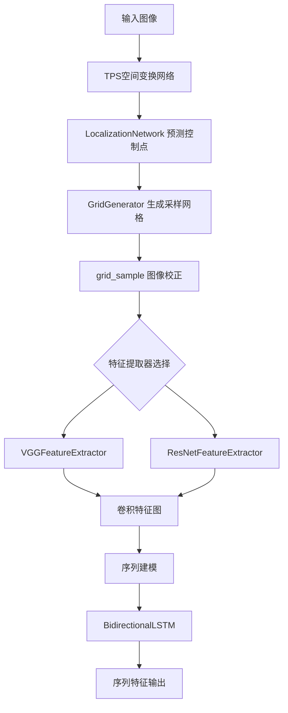

## 类结构

```
nn.Module (基类)
├── Vgg16BN
├── VGGFeatureExtractor
├── BidirectionalLSTM
├── ResNetFeatureExtractor
│   ├── BasicBlock
│   └── ResNet
└── TpsSpatialTransformerNetwork
    ├── LocalizationNetwork
    └── GridGenerator
```

## 全局变量及字段


### `device`
    
CUDA设备，如果不可用则回退到CPU

类型：`torch.device`
    


### `init_weights`
    
初始化神经网络模块权重（卷积层、BatchNorm层、全连接层）

类型：`function`
    


### `Vgg16BN.slice1`
    
VGG第一个特征块，包含conv2_2层

类型：`torch.nn.Sequential`
    


### `Vgg16BN.slice2`
    
VGG第二个特征块，包含conv3_3层

类型：`torch.nn.Sequential`
    


### `Vgg16BN.slice3`
    
VGG第三个特征块，包含conv4_3层

类型：`torch.nn.Sequential`
    


### `Vgg16BN.slice4`
    
VGG第四个特征块，包含conv5_3层

类型：`torch.nn.Sequential`
    


### `Vgg16BN.slice5`
    
VGG全连接层块（fc6和fc7）

类型：`torch.nn.Sequential`
    


### `VGGFeatureExtractor.output_channel`
    
各层输出通道数列表[64,128,256,512]

类型：`List[int]`
    


### `VGGFeatureExtractor.ConvNet`
    
VGG特征提取卷积网络主体

类型：`torch.nn.Sequential`
    


### `BidirectionalLSTM.rnn`
    
双向LSTM循环神经网络层

类型：`nn.LSTM`
    


### `BidirectionalLSTM.linear`
    
线性投影层，将双隐层输出映射到目标维度

类型：`nn.Linear`
    


### `ResNetFeatureExtractor.ConvNet`
    
ResNet特征提取网络

类型：`ResNet`
    


### `BasicBlock.conv1`
    
第一个3x3卷积层

类型：`nn.Conv2d`
    


### `BasicBlock.bn1`
    
第一个BatchNorm归一化层

类型：`nn.BatchNorm2d`
    


### `BasicBlock.conv2`
    
第二个3x3卷积层

类型：`nn.Conv2d`
    


### `BasicBlock.bn2`
    
第二个BatchNorm归一化层

类型：`nn.BatchNorm2d`
    


### `BasicBlock.relu`
    
ReLU激活函数

类型：`nn.ReLU`
    


### `BasicBlock.downsample`
    
残差连接下采样模块

类型：`nn.Sequential`
    


### `BasicBlock.stride`
    
卷积步长

类型：`int`
    


### `ResNet.output_channel_blocks`
    
各阶段输出通道数列表

类型：`List[int]`
    


### `ResNet.inplanes`
    
当前层输入通道数

类型：`int`
    


### `ResNet.conv0_1`
    
初始卷积层0_1

类型：`nn.Conv2d`
    


### `ResNet.bn0_1`
    
初始BatchNorm层0_1

类型：`nn.BatchNorm2d`
    


### `ResNet.conv0_2`
    
初始卷积层0_2

类型：`nn.Conv2d`
    


### `ResNet.bn0_2`
    
初始BatchNorm层0_2

类型：`nn.BatchNorm2d`
    


### `ResNet.relu`
    
ReLU激活函数

类型：`nn.ReLU`
    


### `ResNet.maxpool1`
    
第一个最大池化层

类型：`nn.MaxPool2d`
    


### `ResNet.layer1`
    
ResNet第一残差层

类型：`nn.Sequential`
    


### `ResNet.layer2`
    
ResNet第二残差层

类型：`nn.Sequential`
    


### `ResNet.layer3`
    
ResNet第三残差层

类型：`nn.Sequential`
    


### `ResNet.layer4`
    
ResNet第四残差层

类型：`nn.Sequential`
    


### `TpsSpatialTransformerNetwork.F`
    
控制点数量（TPS变换参数）

类型：`int`
    


### `TpsSpatialTransformerNetwork.I_size`
    
输入图像尺寸（高度，宽度）

类型：`Tuple[int, int]`
    


### `TpsSpatialTransformerNetwork.I_r_size`
    
校正后图像尺寸（高度，宽度）

类型：`Tuple[int, int]`
    


### `TpsSpatialTransformerNetwork.I_channel_num`
    
输入图像通道数

类型：`int`
    


### `TpsSpatialTransformerNetwork.LocalizationNetwork`
    
TPS定位网络，预测控制点坐标

类型：`LocalizationNetwork`
    


### `TpsSpatialTransformerNetwork.GridGenerator`
    
网格生成器，生成采样网格

类型：`GridGenerator`
    


### `LocalizationNetwork.F`
    
控制点数量

类型：`int`
    


### `LocalizationNetwork.I_channel_num`
    
输入图像通道数

类型：`int`
    


### `LocalizationNetwork.conv`
    
卷积特征提取网络

类型：`nn.Sequential`
    


### `LocalizationNetwork.localization_fc1`
    
全连接层1（512->256）

类型：`nn.Sequential`
    


### `LocalizationNetwork.localization_fc2`
    
全连接层2（256->2F），输出控制点坐标

类型：`nn.Linear`
    


### `GridGenerator.eps`
    
数值稳定性小量

类型：`float`
    


### `GridGenerator.I_r_height`
    
校正图像高度

类型：`int`
    


### `GridGenerator.I_r_width`
    
校正图像宽度

类型：`int`
    


### `GridGenerator.F`
    
控制点数量

类型：`int`
    


### `GridGenerator.C`
    
参考控制点坐标（F x 2）

类型：`np.ndarray`
    


### `GridGenerator.P`
    
网格点坐标（n x 2）

类型：`np.ndarray`
    


### `GridGenerator.inv_delta_C`
    
逆Delta_C矩阵，用于计算T

类型：`torch.Tensor`
    


### `GridGenerator.P_hat`
    
增强网格点坐标（n x F+3）

类型：`torch.Tensor`
    
    

## 全局函数及方法


### `init_weights`

该函数是一个神经网络权重初始化工具，通过遍历模块集合，根据不同类型的神经网络层（如卷积层、批归一化层和全连接层）采用相应的初始化策略，以稳定模型训练的收敛性。

参数：

- `modules`：`Iterable`，需要初始化权重的模块集合，通常为 `nn.Module.modules()`

返回值：`None`，该函数直接修改传入模块的参数，不返回任何值

#### 流程图

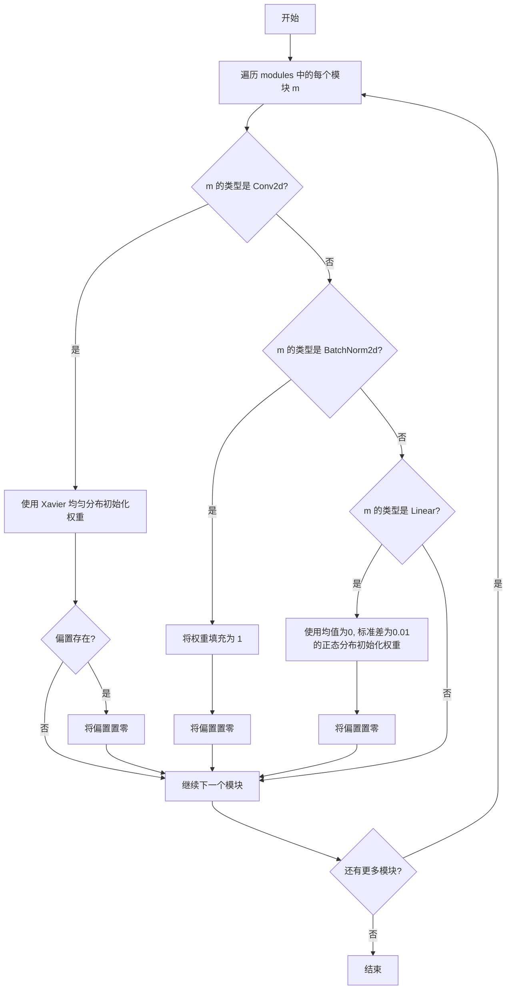

#### 带注释源码

```python
def init_weights(modules):
    """
    初始化神经网络模块的权重参数
    
    该函数遍历传入的模块集合，根据模块类型采用不同的初始化方法：
    - Conv2d: 使用 Xavier 均匀分布初始化权重
    - BatchNorm2d: 将权重设为1，偏置置零
    - Linear: 使用正态分布初始化权重，偏置置零
    
    Args:
        modules: 可迭代的模块集合，通常为 nn.Module 的 modules() 返回值
    """
    for m in modules:  # 遍历所有子模块
        if isinstance(m, nn.Conv2d):  # 如果是卷积层
            init.xavier_uniform_(m.weight.data)  # 使用 Xavier 均匀分布初始化卷积核权重
            if m.bias is not None:  # 如果存在偏置项
                m.bias.data.zero_()  # 将偏置初始化为零
        elif isinstance(m, nn.BatchNorm2d):  # 如果是批归一化层
            m.weight.data.fill_(1)  # 将缩放系数 gamma 设为 1
            m.bias.data.zero_()  # 将平移系数 beta 设为 0
        elif isinstance(m, nn.Linear):  # 如果是全连接层
            m.weight.data.normal_(0, 0.01)  # 使用均值为0，标准差为0.01的正态分布初始化权重
            m.bias.data.zero_()  # 将偏置初始化为零
```


### `Vgg16BN.forward`

该方法是Vgg16BN模型的前向传播函数，将输入图像依次通过5个卷积切片层（slice1~slice5），提取多尺度特征并以命名元组形式返回fc7、relu5_3、relu4_3、relu3_2、relu2_2五个层的输出特征。

参数：

- `x`：`torch.Tensor`，输入图像张量，形状通常为 [batch_size, channels, height, width]，例如 [batch_size, 3, 224, 224]

返回值：`VggOutputs`（namedtuple），包含以下五个命名属性的元组：
- `fc7`：`torch.Tensor`，slice5（fc6-fc7）的输出，形状为 [batch_size, 1024, H, W]
- `relu5_3`：`torch.Tensor`，slice4（conv5_3） ReLU后的输出，形状为 [batch_size, 512, H, W]
- `relu4_3`：`torch.Tensor`，slice3（conv4_3） ReLU后的输出，形状为 [batch_size, 512, H, W]
- `relu3_2`：`torch.Tensor`，slice2（conv3_3） ReLU后的输出，形状为 [batch_size, 256, H, W]
- `relu2_2`：`torch.Tensor`，slice1（conv2_2） ReLU后的输出，形状为 [batch_size, 128, H, W]

#### 流程图

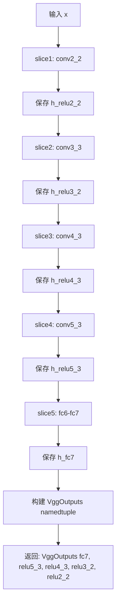

#### 带注释源码

```python
def forward(self, x):
    """
    VGG16 with Batch Normalization 的前向传播
    
    参数:
        x: 输入图像张量, 形状为 [batch_size, 3, height, width]
    
    返回:
        VggOutputs: 包含五个命名特征的 namedtuple
    """
    
    # 第一阶段: slice1 (conv2_2)
    # 提取底层特征, 输出通道数为128
    h = self.slice1(x)           # conv2_2 输出
    h_relu2_2 = h                 # 保存 conv2_2 ReLU 后的特征
    
    # 第二阶段: slice2 (conv3_3)
    # 提取中层特征, 输出通道数为256
    h = self.slice2(h)            # conv3_3 输出
    h_relu3_2 = h                 # 保存 conv3_3 ReLU 后的特征
    
    # 第三阶段: slice3 (conv4_3)
    # 提取高层语义特征, 输出通道数为512
    h = self.slice3(h)            # conv4_3 输出
    h_relu4_3 = h                 # 保存 conv4_3 ReLU 后的特征
    
    # 第四阶段: slice4 (conv5_3)
    # 提取更高级的语义特征, 输出通道数为512
    h = self.slice4(h)            # conv5_3 输出
    h_relu5_3 = h                 # 保存 conv5_3 ReLU 后的特征
    
    # 第五阶段: slice5 (fc6-fc7)
    # 全连接层替换为1x1卷积, 扩展特征维度到1024
    h = self.slice5(h)            # fc6-fc7 输出
    h_fc7 = h                     # 保存 fc7 特征
    
    # 定义输出结构: VggOutputs namedtuple
    # 用于返回多个中间层特征, 便于后续任务选择使用
    vgg_outputs = namedtuple(
        "VggOutputs", 
        ["fc7", "relu5_3", "relu4_3", "relu3_2", "relu2_2"]
    )
    
    # 构建输出元组, 按顺序对应各层特征
    out = vgg_outputs(
        h_fc7,       # fc7: 最终全连接层特征
        h_relu5_3,   # relu5_3: 第五阶段特征
        h_relu4_3,   # relu4_3: 第四阶段特征
        h_relu3_2,   # relu3_2: 第三阶段特征
        h_relu2_2    # relu2_2: 第二阶段特征
    )
    
    return out  # 返回包含多层特征的命名元组
```


### `VGGFeatureExtractor.forward`

该方法是 VGGFeatureExtractor 类的前向传播方法，用于对输入图像进行卷积特征提取，将原始图像转换为特征映射，供后续的序列识别使用。

参数：

- `x`：`torch.Tensor`，输入图像张量，形状为 `[batch_size, n_input_channels, height, width]`

返回值：`torch.Tensor`，提取的特征张量，形状为 `[batch_size, 512, 1, 24]`（具体尺寸取决于输入图像宽度）

#### 流程图

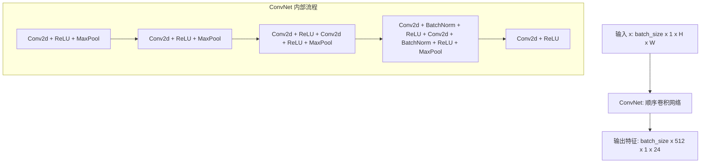

#### 带注释源码

```python
def forward(self, x):
    """
    VGGFeatureExtractor 的前向传播方法
    
    参数:
        x (torch.Tensor): 输入图像张量
            - 形状: [batch_size, n_input_channels, height, width]
            - n_input_channels 默认为 1 (灰度图)
    
    返回:
        torch.Tensor: 提取的卷积特征
            - 形状: [batch_size, 512, 1, 24] (假设输入宽度为 48)
            - 通道数: 512
    """
    # 将输入 x 通过 ConvNet 顺序卷积网络
    # ConvNet 包含多个卷积层、BatchNorm、ReLU 激活和 MaxPool
    # 最终输出高维特征向量，用于后续的 BiLSTM 序列建模
    return self.ConvNet(x)
```


### BidirectionalLSTM.forward

该方法实现双向LSTM网络的前向传播，将视觉特征序列通过双向LSTM编码为上下文特征表示，通过线性层映射到目标输出维度，实现序列到序列的特征转换。

参数：

- `x`：`torch.Tensor`，视觉特征张量，形状为 [batch_size × T × input_size]，其中 batch_size 是批量大小，T 是时间步长，input_size 是输入特征维度

返回值：`torch.Tensor`，上下文特征张量，形状为 [batch_size × T × output_size]，其中 output_size 是输出特征维度

#### 流程图

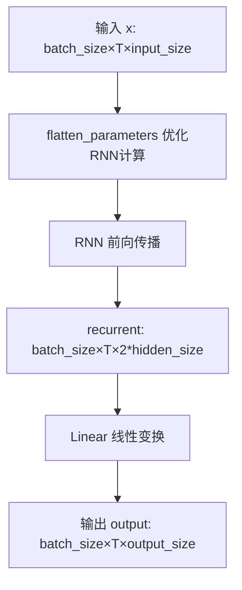

#### 带注释源码

```python
def forward(self, x):
    """
    BidirectionalLSTM 的前向传播方法
    
    参数:
        x: 视觉特征张量，形状为 [batch_size x T x input_size]
           - batch_size: 批量大小
           - T: 时间步长（序列长度）
           - input_size: 输入特征维度
    
    返回值:
        output: 上下文特征张量，形状为 [batch_size x T x output_size]
                - output_size: 输出特征维度（经过线性层映射后的维度）
    
    处理流程:
        1. 调用 flatten_parameters() 优化 RNN 的 CUDA/CPU 计算效率
        2. 通过双向 LSTM 层进行序列特征编码
        3. 通过线性层将双向隐藏状态映射到目标输出维度
    """
    # 优化 RNN 参数的内存布局，提升 GPU 计算效率
    self.rnn.flatten_parameters()
    
    # 通过双向 LSTM 编码序列特征
    # 输入: [batch_size x T x input_size]
    # 输出: [batch_size x T x (2*hidden_size)] - 双向拼接的隐藏状态
    recurrent, _ = self.rnn(x)
    
    # 通过线性层将双向隐藏状态映射到目标输出维度
    # 输入: [batch_size x T x (2*hidden_size)]
    # 输出: [batch_size x T x output_size]
    output = self.linear(recurrent)
    
    return output
```


### `ResNetFeatureExtractor.forward`

该方法是ResNet特征提取器的前向传播过程，将输入图像通过内部的ResNet卷积神经网络进行特征提取，返回高维特征表示。

参数：

- `inputs`：`torch.Tensor`，输入图像张量，形状为 [batch_size, n_input_channels, height, width]

返回值：`torch.Tensor`，提取的特征张量，形状为 [batch_size, n_output_channels, feature_height, feature_width]

#### 流程图

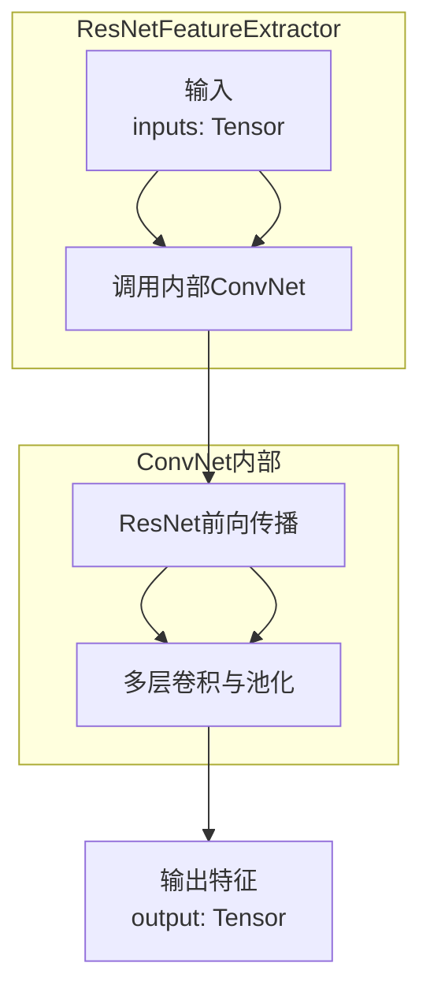

#### 带注释源码

```python
def forward(self, inputs):
    """
    ResNetFeatureExtractor的前向传播方法
    
    参数:
        inputs: 输入图像张量，形状为 [batch_size, n_input_channels, height, width]
                n_input_channels在初始化时指定，默认为1（灰度图）
    
    返回值:
        torch.Tensor: 提取的特征张量，形状为 [batch_size, n_output_channels, 
                     feature_height, feature_width]，n_output_channels默认为512
    """
    # 简单地将输入传递给内部的ResNet卷积网络（self.ConvNet）
    # self.ConvNet是在__init__方法中创建的ResNet实例
    return self.ConvNet(inputs)
```

#### 补充说明

**设计意图**：
- `ResNetFeatureExtractor`是FAN（Focusing Attention Network）论文中提出的特征提取器
- 该类是对通用ResNet架构的封装，专门用于图像特征提取任务
- 内部组合了`BasicBlock`和自定义的ResNet结构，配置为[1, 2, 5, 3]的层级结构

**与调用者的关系**：
- 输入：通常接收经过预处理的图像张量
- 输出：512维的高层次特征，可送入后续的序列模型（如BiLSTM）进行进一步处理

**数据流**：
```
输入图像 → ResNetFeatureExtractor.forward() → ConvNet(ResNet) → 特征张量
```


### `BasicBlock._conv3x3`

该方法是ResNet中BasicBlock的内部辅助方法，用于创建3x3卷积层。它封装了PyTorch的nn.Conv2d，提供了带有默认填充的3x3卷积功能，是构成BasicBlock残差连接核心卷积操作的关键组成部分。

参数：

- `self`：`BasicBlock`类实例本身，隐式传递
- `in_planes`：`int`，输入特征图的通道数（planes）
- `out_planes`：`int`，输出特征图的通道数（planes）
- `stride`：`int`，卷积步长，默认为1

返回值：`nn.Conv2d`，返回配置好的3x3二维卷积层对象

#### 流程图

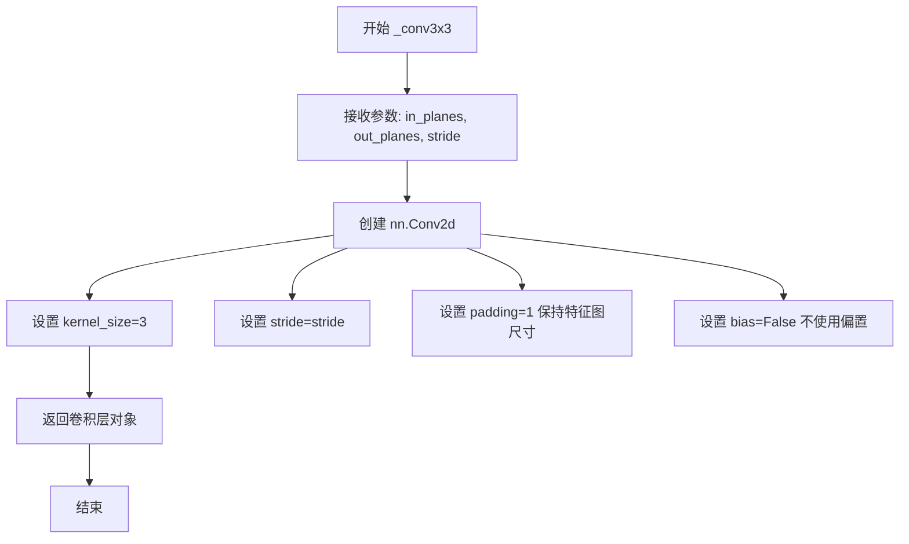

#### 带注释源码

```python
def _conv3x3(self, in_planes, out_planes, stride=1):
    """
    3x3 convolution with padding
    
    该方法创建一个3x3卷积层，自动处理填充以保持空间维度不变。
    这是ResNet BasicBlock中的核心卷积操作之一。
    
    参数:
        in_planes (int): 输入特征图的通道数
        out_planes (int): 输出特征图的通道数
        stride (int): 卷积步长，默认为1
    
    返回:
        nn.Conv2d: 配置好的3x3卷积层
    """
    # 3x3 convolution with padding
    # 使用padding=1确保输出特征图与输入特征图保持相同的空间维度（当stride=1时）
    # bias=False符合现代CNN的常见做法，通常与BatchNorm2d配合使用
    return nn.Conv2d(
        in_planes,          # 输入通道数
        out_planes,         # 输出通道数
        kernel_size=3,      # 3x3卷积核
        stride=stride,      # 卷积步长，可调整特征图尺寸
        padding=1,          # 填充1像素，保持空间维度
        bias=False,         # 不使用偏置，与BatchNorm配合
    )
```

### 所属类 `BasicBlock` 详细信息

#### 类字段

- `expansion`：`int`，扩展系数，值为1，用于标识BasicBlock的通道扩展比例
- `conv1`：`nn.Conv2d`，第一个3x3卷积层
- `bn1`：`nn.BatchNorm2d`，第一个卷积后的批归一化层
- `conv2`：`nn.Conv2d`，第二个3x3卷积层
- `bn2`：`nn.BatchNorm2d`，第二个卷积后的批归一化层
- `relu`：`nn.ReLU`，ReLU激活函数（inplace模式）
- `downsample`：`nn.Module`或`None`，下采样模块，用于匹配残差路径的维度
- `stride`：`int`，卷积步长

#### 类方法

- `_conv3x3`：创建3x3卷积层的辅助方法
- `__init__`：构造函数，初始化BasicBlock的所有层
- `forward`：前向传播方法，执行卷积、归一化、激活和残差连接

#### 关键组件信息

- **ResNet残差结构**：通过shortcut连接实现梯度直接传播，解决深层网络梯度消失问题
- **3x3卷积核**：VGG风格的标准卷积核，在保持感受野的同时减少参数量
- **BatchNorm2d**：批归一化层，加速训练收敛，提高模型稳定性

#### 潜在的技术债务或优化空间

1. **硬编码的3x3卷积**：未来可以考虑支持可变卷积核大小，增强模型灵活性
2. **inplace ReLU内存优化**：虽然使用了inplace=True节省内存，但在某些场景下可能影响梯度计算
3. **downsample逻辑**：当下采样模块为None时仍然执行条件判断，可以进一步优化

#### 其它项目

- **设计目标**：实现ResNet的BasicBlock，提供高效的残差学习单元
- **约束**：卷积层默认不使用偏置（bias=False），依赖于BatchNorm进行特征归一化
- **外部依赖**：PyTorch的nn.Module、nn.Conv2d、nn.BatchNorm2d、nn.ReLU
- **调用流程**：ResNet → BasicBlock._make_layer → BasicBlock._conv3x3 → nn.Conv2d


### `BasicBlock.forward`

该方法是 ResNet 中 BasicBlock 的前向传播实现，通过两个连续的 3x3 卷积块（含批归一化和 ReLU 激活）处理输入特征，并在输出与残差连接后通过 ReLU 激活输出，实现了残差学习机制。

参数：

-  `x`：`torch.Tensor`，输入特征张量，形状为 `[batch_size, inplanes, height, width]`

返回值：`torch.Tensor`，经过残差块处理后的输出特征张量，形状为 `[batch_size, planes, height', width']`（高度和宽度可能因步长而变化）

#### 流程图

```mermaid
flowchart TD
    A[开始: 输入 x] --> B[保存残差: residual = x]
    B --> C[卷积块1: conv1(x)]
    C --> D[批归一化1: bn1(out)]
    D --> E[激活函数1: relu(out)]
    E --> F[卷积块2: conv2(out)]
    F --> G[批归一化2: bn2(out)]
    G --> H{downsample 是否存在?}
    H -->|是| I[应用下采样: residual = downsample(x)]
    H -->|否| J[跳过下采样步骤]
    I --> K[残差相加: out += residual]
    J --> K
    K --> L[激活函数2: relu(out)]
    L --> M[返回输出]
```

#### 带注释源码

```python
def forward(self, x):
    """
    BasicBlock 的前向传播方法
    
    该方法实现了 ResNet 的残差块前向传播:
    1. 通过两个连续的 3x3 卷积块进行处理
    2. 如果存在下采样模块，则对输入进行下采样作为残差
    3. 将卷积输出与残差相加（跳跃连接）
    4. 最后通过 ReLU 激活输出
    
    参数:
        x: 输入特征张量，形状为 [batch_size, inplanes, height, width]
    
    返回:
        输出特征张量，形状为 [batch_size, planes, height', width']
    """
    # 保存输入作为残差连接的基础
    residual = x

    # 第一个卷积块：3x3卷积 -> 批归一化 -> ReLU激活
    out = self.conv1(x)
    out = self.bn1(out)
    out = self.relu(out)

    # 第二个卷积块：3x3卷积 -> 批归一化（注意：这里没有ReLU，残差相加后才激活）
    out = self.conv2(out)
    out = self.bn2(out)

    # 如果存在下采样模块，则对残差进行下采样处理
    # 这通常发生在输入和输出通道数不一致或步长大于1时
    if self.downsample is not None:
        residual = self.downsample(x)
    
    # 残差连接：将卷积输出与处理后的残差相加
    out += residual
    
    # 最终激活函数
    out = self.relu(out)

    return out
```


### ResNet._make_layer

该方法用于构建ResNet网络中的每一层（layer），包括创建下采样（downsample）模块和堆叠多个基本块（BasicBlock）组成一个完整的ResNet层结构。

参数：

- `block`：BasicBlock（或Bottleneck），ResNet的基本块类型，用于定义该层中使用的卷积块结构
- `planes`：int，目标输出通道数，决定该层中卷积层的过滤器数量
- `blocks`：int，该层中基本块的数量，指定需要堆叠多少个block
- `stride`：int，步长，默认为1，控制卷积操作的步幅，如果大于1则会进行下采样

返回值：`nn.Sequential`，返回一个由多个基本块串联组成的顺序容器，构成ResNet的一个完整层级

#### 流程图

```mermaid
flowchart TD
    A[开始 _make_layer] --> B{stride != 1 或<br/>inplanes != planes * block.expansion?}
    B -->|是| C[创建下采样序列 downsample]
    C --> D[包含 1x1卷积 + BatchNorm]
    D --> E[创建第一个block<br/>block(inplanes, planes, stride, downsample)]
    B -->|否| F[downsample = None]
    F --> E
    E --> G[更新 self.inplanes = planes * block.expansion]
    G --> H[循环 i 从 1 到 blocks-1]
    H --> I[创建后续block<br/>block(inplanes, planes)]
    I --> J[添加到 layers 列表]
    J --> K{i < blocks - 1?}
    K -->|是| H
    K -->|否| L[返回 nn.Sequential(*layers)]
    L --> M[结束 _make_layer]
```

#### 带注释源码

```python
def _make_layer(self, block, planes: int, blocks: int, stride: int = 1):
    """
    构建ResNet的单个层级
    
    参数:
        block: BasicBlock或Bottleneck类，用于创建卷积块
        planes: int，该层的输出通道数
        blocks: int，该层中block的数量
        stride: int，卷积步长，默认为1
    
    返回:
        nn.Sequential: 包含多个block的顺序容器
    """
    # 初始化下采样为None
    downsample = None
    
    # 判断是否需要下采样：
    # 1. stride不为1时需要下采样以匹配特征图尺寸
    # 2. 输入通道数与输出通道数*block.expansion不同时需要调整通道数
    if stride != 1 or self.inplanes != planes * block.expansion:
        # 创建下采样模块：1x1卷积 + 批归一化
        downsample = nn.Sequential(
            nn.Conv2d(
                self.inplanes,  # 输入通道数
                planes * block.expansion,  # 输出通道数（扩展后）
                kernel_size=1,  # 1x1卷积
                stride=stride,  # 使用传入的步长
                bias=False,  # 不使用偏置
            ),
            nn.BatchNorm2d(planes * block.expansion),  # 批归一化
        )

    # 初始化layers列表
    layers = []
    
    # 创建第一个block：
    # - 传入当前的inplanes、目标planes、stride和downsample
    # - 这是该层的第一个block，可能需要下采样
    layers.append(block(self.inplanes, planes, stride, downsample))
    
    # 更新self.inplanes为扩展后的通道数
    # BasicBlock的expansion为1，Bottleneck的expansion为4
    self.inplanes = planes * block.expansion
    
    # 循环创建剩余的blocks（从第1个到第blocks-1个）
    # 这些blocks不需要额外的下采样（downsample=None）
    for i in range(1, blocks):
        layers.append(block(self.inplanes, planes))

    # 返回由所有block组成的顺序容器
    return nn.Sequential(*layers)
```


### `ResNet.forward`

该方法是ResNet模型的前向传播核心实现，通过多个卷积层、批归一化层、ReLU激活函数和残差块的级联，对输入图像进行多层级特征提取，最终输出高层次的语义特征表示。

参数：

- `x`：`torch.Tensor`，输入图像张量，形状为 [batch_size, n_input_channels, height, width]，通常为灰度图（1通道）或RGB图（3通道）

返回值：`torch.Tensor`，经过ResNet特征提取后的输出张量，形状为 [batch_size, n_output_channels, output_height, output_width]

#### 流程图

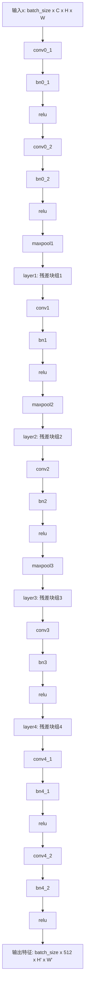

#### 带注释源码

```python
def forward(self, x):
    """
    ResNet前向传播函数
    
    参数:
        x (torch.Tensor): 输入图像张量，形状为 [batch_size, n_input_channels, height, width]
    
    返回:
        torch.Tensor: 提取后的特征张量，形状为 [batch_size, n_output_channels, output_height, output_width]
    """
    # ========== 初始卷积块 (Initial Conv Block) ==========
    # 第一次卷积：通道数从 n_input_channels 转换到 n_output_channels/16
    x = self.conv0_1(x)   # nn.Conv2d: n_input_channels -> n_output_channels/16
    x = self.bn0_1(x)     # BatchNorm 归一化
    x = self.relu(x)      # ReLU 激活函数
    
    # 第二次卷积：通道数从 n_output_channels/16 转换到 n_output_channels/8 (self.inplanes)
    x = self.conv0_2(x)   # nn.Conv2d: n_output_channels/16 -> n_output_channels/8
    x = self.bn0_2(x)     # BatchNorm 归一化
    x = self.relu(x)      # ReLU 激活函数
    
    # ========== 第一个残差层 (Layer 1) ==========
    # 最大池化下采样，尺寸减半
    x = self.maxpool1(x)  # nn.MaxPool2d: kernel_size=2, stride=2
    # 残差块组：输出通道 n_output_channels/4
    x = self.layer1(x)    # 包含 layers[0] 个 BasicBlock
    # 卷积 + 归一化 + 激活
    x = self.conv1(x)     # nn.Conv2d: 保持通道数
    x = self.bn1(x)       # BatchNorm 归一化
    x = self.relu(x)      # ReLU 激活函数
    
    # ========== 第二个残差层 (Layer 2) ==========
    # 最大池化下采样，尺寸减半
    x = self.maxpool2(x)  # nn.MaxPool2d: kernel_size=2, stride=2
    # 残差块组：输出通道 n_output_channels/2
    x = self.layer2(x)    # 包含 layers[1] 个 BasicBlock
    # 卷积 + 归一化 + 激活
    x = self.conv2(x)     # nn.Conv2d: 保持通道数
    x = self.bn2(x)       # BatchNorm 归一化
    x = self.relu(x)      # ReLU 激活函数
    
    # ========== 第三个残差层 (Layer 3) ==========
    # 非对称下采样：高度方向stride=2，宽度方向stride=1（保持宽度方向分辨率）
    x = self.maxpool3(x)  # nn.MaxPool2d: kernel_size=2, stride=(2,1), padding=(0,1)
    # 残差块组：输出通道 n_output_channels
    x = self.layer3(x)    # 包含 layers[2] 个 BasicBlock
    # 卷积 + 归一化 + 激活
    x = self.conv3(x)     # nn.Conv2d: 保持通道数
    x = self.bn3(x)       # BatchNorm 归一化
    x = self.relu(x)      # ReLU 激活函数
    
    # ========== 第四个残差层 (Layer 4) ==========
    # 最后一个残差块组：输出通道 n_output_channels
    x = self.layer4(x)    # 包含 layers[3] 个 BasicBlock
    
    # ========== 最终特征变换 (Final Feature Transform) ==========
    # 第一次特征变换：非对称下采样卷积
    x = self.conv4_1(x)   # nn.Conv2d: kernel_size=2, stride=(2,1), padding=(0,1)
    x = self.bn4_1(x)     # BatchNorm 归一化
    x = self.relu(x)      # ReLU 激活函数
    
    # 第二次特征变换：1x1卷积调整
    x = self.conv4_2(x)   # nn.Conv2d: kernel_size=2, stride=1, padding=0
    x = self.bn4_2(x)     # BatchNorm 归一化
    x = self.relu(x)      # ReLU 激活函数
    
    # 返回最终提取的特征图
    return x
```


### TpsSpatialTransformerNetwork.forward

这是RARE中基于TPS的空间变换网络的前向传播方法，用于对输入的文本图像进行校正。它通过LocalizationNetwork预测控制点，然后利用GridGenerator生成采样网格，最后使用grid_sample对输入图像进行双线性插值校正。

参数：
- `batch_I`：`torch.Tensor`，批量输入图像 [batch_size x I_channel_num x I_height x I_width]

返回值：`torch.Tensor`，校正后的图像 [batch_size x I_channel_num x I_r_height x I_r_width]

#### 流程图

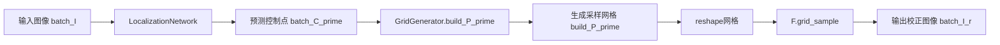

#### 带注释源码

```python
def forward(self, batch_I):
    """
    TpsSpatialTransformerNetwork的前向传播
    
    参数:
        batch_I: 批量输入图像 [batch_size x I_channel_num x I_height x I_width]
    
    返回:
        batch_I_r: 校正后的图像 [batch_size x I_channel_num x I_r_height x I_r_width]
    """
    # 第一步：通过LocalizationNetwork预测 fiducial 控制点坐标
    # 输出: batch_C_prime [batch_size x F x 2]，F为控制点数量
    batch_C_prime = self.LocalizationNetwork(batch_I)
    
    # 第二步：利用GridGenerator根据预测的控制点生成采样网格
    # 输出: build_P_prime [batch_size x n x 2]，n = I_r_width * I_r_height
    build_P_prime = self.GridGenerator.build_P_prime(batch_C_prime)
    
    # 第三步：重塑网格形状以适配grid_sample函数
    # 转换为 [batch_size x I_r_height x I_r_width x 2] 的形式
    build_P_prime_reshape = build_P_prime.reshape(
        [build_P_prime.size(0), self.I_r_size[0], self.I_r_size[1], 2])
    
    # 第四步：使用grid_sample进行图像空间变换
    # 采用双线性插值和border填充模式
    batch_I_r = F.grid_sample(
        batch_I,
        build_P_prime_reshape,
        padding_mode="border",
    )
    
    return batch_I_r
```


### `LocalizationNetwork.forward`

该方法实现定位网络的前向传播，通过卷积神经网络从输入图像中提取特征，并利用全连接层预测基准点的坐标，实现对输入图像的空间变换参数预测。

参数：

- `batch_I`：`torch.Tensor`，批次输入图像，形状为 [batch_size x I_channel_num x I_height x I_width]，表示批量输入的灰度或彩色图像

返回值：`torch.Tensor`，预测的基准点坐标，形状为 [batch_size x F x 2]，其中 F 表示基准点数量（通常是 2 × F/2 个点，分别位于上下两行），2 表示每个点的 (x, y) 坐标

#### 流程图

```mermaid
flowchart TD
    A[输入: batch_I] --> B[获取批次大小: batch_size = batch_I.size(0)]
    B --> C[卷积特征提取: features = self.conv(batch_I)]
    C --> D[特征展平: features.view(batch_size, -1)]
    D --> E[全连接层1: self.localization_fc1(features)]
    E --> F[全连接层2: self.localization_fc2]
    F --> G[reshape: batch_C_prime.view(batch_size, self.F, 2)]
    G --> H[输出: batch_C_prime]
    
    C1[self.conv模块结构]
    C1 --> C1a[Conv2d 64通道]
    C1a --> C1b[BatchNorm + ReLU + MaxPool]
    C1b --> C1c[Conv2d 128通道]
    C1c --> C1d[BatchNorm + ReLU + MaxPool]
    C1d --> C1e[Conv2d 256通道]
    C1e --> C1f[BatchNorm + ReLU + MaxPool]
    C1f --> C1g[Conv2d 512通道]
    C1g --> C1h[BatchNorm + ReLU + AdaptiveAvgPool2d]
```

#### 带注释源码

```python
def forward(self, batch_I):
    """
    定位网络的前向传播方法
    
    :param batch_I: Batch Input Image [batch_size x I_channel_num x I_height x I_width]
    :return: batch_C_prime: Predicted coordinates of fiducial points for input batch [batch_size x F x 2]
    """
    # 获取输入图像的批次大小
    batch_size = batch_I.size(0)
    
    # 通过卷积神经网络提取特征
    # self.conv 包含多个卷积层、批归一化层、ReLU激活层和池化层
    # 最后通过 AdaptiveAvgPool2d 将特征池化为 [batch_size x 512 x 1 x 1]
    features = self.conv(batch_I).view(batch_size, -1)
    # 将卷积特征展平为 [batch_size x 512] 的二维张量
    
    # 通过全连接层进行特征变换和坐标预测
    # localization_fc1: 512 -> 256，使用 ReLU 激活
    # localization_fc2: 256 -> F*2，输出 F*2 个值（每个基准点2个坐标）
    batch_C_prime = self.localization_fc2(
        self.localization_fc1(features)).view(batch_size, self.F, 2)
    # 将输出 reshape 为 [batch_size x F x 2] 形状
    
    # 返回预测的基准点坐标
    return batch_C_prime
```


### GridGenerator._build_C

该方法用于生成矩形图像I_r中的 fiducial points（基准点）坐标。这些基准点均匀分布在图像的上下边缘，用于后续的 TPS（Thin Plate Spline）变换计算。

参数：

- `self`：GridGenerator 类实例，包含了图像尺寸等信息
- `F`：`int`，基准点总数的一半（实际总共生成 F 个基准点，分布在上下边缘）

返回值：`numpy.ndarray`，形状为 (F, 2)，包含 F 个基准点的 (x, y) 坐标

#### 流程图

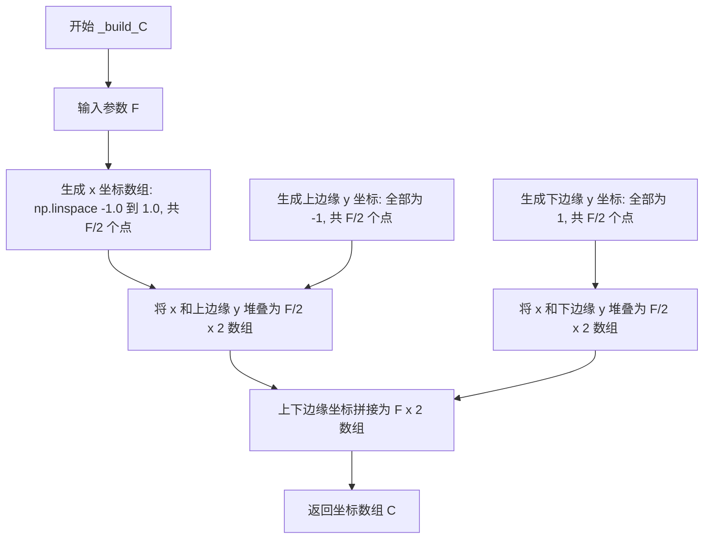

#### 带注释源码

```python
def _build_C(self, F):
    """ Return coordinates of fiducial points in I_r; C """
    # 生成 F/2 个均匀分布的 x 坐标，范围从 -1.0 到 1.0
    # 这些点将作为上下两排基准点的 x 坐标
    ctrl_pts_x = np.linspace(-1.0, 1.0, int(F / 2))
    
    # 生成上排基准点的 y 坐标，全部为 -1（图像顶部）
    ctrl_pts_y_top = -1 * np.ones(int(F / 2))
    
    # 生成下排基准点的 y 坐标，全部为 1（图像底部）
    ctrl_pts_y_bottom = np.ones(int(F / 2))
    
    # 将上排基准点的 x 和 y 坐标堆叠为 (F/2) x 2 的数组
    ctrl_pts_top = np.stack([ctrl_pts_x, ctrl_pts_y_top], axis=1)
    
    # 将下排基准点的 x 和 y 坐标堆叠为 (F/2) x 2 的数组
    ctrl_pts_bottom = np.stack([ctrl_pts_x, ctrl_pts_y_bottom], axis=1)
    
    # 上下两排基准点拼接，得到 F x 2 的坐标数组
    # 前面 F/2 个是上排（y=-1），后面 F/2 个是下排（y=1）
    C = np.concatenate([ctrl_pts_top, ctrl_pts_bottom], axis=0)
    
    # 返回基准点坐标矩阵，形状为 (F, 2)
    return C  # F x 2
```


### `GridGenerator._build_inv_delta_C`

该方法用于计算Thin Plate Spline（TPS）变换中的逆Delta矩阵。它根据输入的控制点坐标矩阵C，计算控制点之间的径向基函数值，构造完整的Delta矩阵，并返回其逆矩阵，用于后续计算TPS变换参数。

参数：

- `F`：`int`，控制点（fiducial points）的数量
- `C`：`numpy.ndarray`，形状为(F, 2)的控制点坐标矩阵

返回值：`numpy.ndarray`，形状为(F+3, F+3)的逆Delta矩阵，用于TPS变换计算

#### 流程图

```mermaid
flowchart TD
    A[开始 _build_inv_delta_C] --> B[初始化 F×F 零矩阵 hat_C]
    B --> C{遍历上三角}
    C -->|i ≤ j| D[计算C[i]与C[j]的欧氏距离r]
    D --> E[hat_C[i,j] = r, hat_C[j,i] = r]
    E --> C
    C -->|完成| F[将对角线设为1]
    F --> G[计算 hat_C = hat_C² × log(hat_C)]
    G --> H[构造 Delta_C 矩阵<br/>顶部: ones|F × C|F×F<br/>中部: 0|C^T<br/>底部: 0|ones]
    H --> I[计算 inv_delta_C = Δ⁻¹]
    I --> J[返回 inv_delta_C]
```

#### 带注释源码

```python
def _build_inv_delta_C(self, F, C):
    """
    计算TPS变换所需的inv_delta_C矩阵
    
    参数:
        F: int, 控制点数量
        C: numpy.ndarray, 控制点坐标 (F x 2)
    
    返回:
        numpy.ndarray: inv_delta_C (F+3 x F+3)
    """
    # 初始化F x F的距离矩阵hat_C
    hat_C = np.zeros((F, F), dtype=float)  # F x F
    
    # 计算控制点之间的成对欧氏距离（使用上三角循环优化）
    for i in range(0, F):
        for j in range(i, F):
            r = np.linalg.norm(C[i] - C[j])  # 计算欧氏距离
            hat_C[i, j] = r
            hat_C[j, i] = r
    
    # 将对角线元素设为1（对应r=1的情况，避免log(0)）
    np.fill_diagonal(hat_C, 1)
    
    # 应用径向基函数: φ(r) = r² * log(r)
    # 这是TPS（薄板样条）核函数的标准形式
    hat_C = (hat_C**2) * np.log(hat_C)
    
    # 构造完整的Delta_C矩阵 (F+3 x F+3)
    # 该矩阵包含三个部分：仿射项、非仿射项、约束项
    delta_C = np.concatenate(  # F+3 x F+3
        [
            # 第一部分：F行 - 包含常数项1、原始坐标C、径向基函数值hat_C
            np.concatenate([np.ones((F, 1)), C, hat_C], axis=1),  # F x F+3
            # 第二部分：2行 - 对应旋转和平移约束
            np.concatenate([np.zeros((2, 3)), np.transpose(C)], axis=1),  # 2 x F+3
            # 第三部分：1行 - 对应缩放约束
            np.concatenate([np.zeros((1, 3)), np.ones((1, F))], axis=1),  # 1 x F+3
        ],
        axis=0,
    )
    
    # 计算矩阵的逆
    inv_delta_C = np.linalg.inv(delta_C)
    return inv_delta_C  # F+3 x F+3
```


### `GridGenerator._build_P`

该方法用于生成目标图像的标准网格坐标点P，通过对输出图像宽高范围内的坐标进行归一化处理，生成符合TPS变换需求的网格坐标矩阵。

参数：

- `I_r_width`：`int`，输出图像的宽度
- `I_r_height`：`int`，输出图像的高度

返回值：`numpy.ndarray`，形状为 `(n, 2)` 的网格坐标矩阵，其中 `n = I_r_width × I_r_height`，每行包含一个网格点的 (x, y) 坐标，坐标值归一化到 [-1, 1] 范围内

#### 流程图

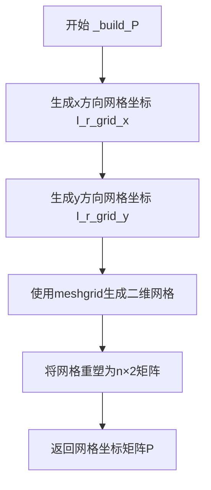

#### 带注释源码

```python
def _build_P(self, I_r_width, I_r_height):
    """
    生成输出图像的标准网格坐标点P
    
    参数:
        I_r_width: 输出图像的宽度
        I_r_height: 输出图像的高度
    
    返回:
        P: 形状为 (n, 2) 的numpy数组，其中 n = I_r_width * I_r_height
           每行是一个网格点的 (x, y) 坐标，范围在 [-1, 1]
    """
    # 计算x方向上的网格坐标
    # 生成从 -I_r_width 到 I_r_width（步长为2）的数列，然后归一化
    I_r_grid_x = (np.arange(-I_r_width, I_r_width, 2) +
                  1.0) / I_r_width  # self.I_r_width
    
    # 计算y方向上的网格坐标
    # 生成从 -I_r_height 到 I_r_height（步长为2）的数列，然后归一化
    I_r_grid_y = (np.arange(-I_r_height, I_r_height, 2) +
                  1.0) / I_r_height  # self.I_r_height
    
    # 使用meshgrid生成二维网格坐标
    # P shape: (I_r_width, I_r_height, 2)
    P = np.stack(  # self.I_r_width x self.I_r_height x 2
        np.meshgrid(I_r_grid_x, I_r_grid_y),
        axis=2)
    
    # 将网格重塑为 (n, 2) 的二维矩阵格式
    # n = I_r_width * I_r_height
    return P.reshape([-1, 2])  # n (= self.I_r_width x self.I_r_height) x 2
```


### `GridGenerator._build_P_hat`

该方法用于构建P_hat矩阵，这是RARE模型中TPS（薄板样条）变换的关键组成部分，通过计算网格点与控制点之间的径向基函数（RBF）来生成变换所需的特征矩阵。

参数：

- `F`：`int`，控制点（fiducial points）的数量，决定了TPS变换的控制点网格规模
- `C`：`numpy.ndarray`，形状为 (F, 2) 的numpy数组，表示控制点坐标，通常是归一化后的坐标
- `P`：`numpy.ndarray`，形状为 (n, 2) 的numpy数组，表示目标图像网格点的坐标，其中 n = I_r_width × I_r_height

返回值：`numpy.ndarray`，形状为 (n, F+3) 的numpy数组，其中n是网格点数量，F+3是特征维度（包含常数项1、原始坐标P和RBF特征）

#### 流程图

```mermaid
flowchart TD
    A[开始 _build_P_hat] --> B[计算n值: n = P.shape[0]]
    B --> C[扩展P维度: np.expand_dims后tile操作]
    C --> D[扩展C维度: np.expand_dims后tile操作]
    D --> E[计算差值: P_diff = P_tile - C_tile]
    E --> F[计算欧几里得距离: rbf_norm = norm P_diff]
    F --> G[计算RBF特征: rbf = rbf_norm² × log(rbf_norm + eps)]
    G --> H[拼接矩阵: P_hat = ones + P + rbf]
    H --> I[返回 P_hat]
```

#### 带注释源码

```python
def _build_P_hat(self, F, C, P):
    """
    构建P_hat矩阵，用于TPS变换
    
    参数:
        F: 控制点数量
        C: 控制点坐标 (F x 2)
        P: 网格点坐标 (n x 2), n = I_r_width x I_r_height
    
    返回:
        P_hat: 增强的网格点坐标 (n x F+3)
    """
    # 获取网格点数量n
    n = P.shape[0]  # n (= self.I_r_width x I_r_height)
    
    # 对P进行维度扩展和 tiling: (n, 2) -> (n, 1, 2) -> (n, F, 2)
    # 这样每个网格点都有F组对应的控制点坐标
    P_tile = np.tile(np.expand_dims(P, axis=1),
                     (1, F, 1))  # n x 2 -> n x 1 x 2 -> n x F x 2
    
    # 对C进行维度扩展: (F, 2) -> (1, F, 2)
    # 便于与P_tile进行广播运算
    C_tile = np.expand_dims(C, axis=0)  # 1 x F x 2
    
    # 计算每个网格点与每个控制点的坐标差
    P_diff = P_tile - C_tile  # n x F x 2
    
    # 计算二范数（即欧几里得距离）
    # 得到每个网格点到每个控制点的距离
    rbf_norm = np.linalg.norm(
        P_diff,
        ord=2,
        axis=2,
        keepdims=False,
    )  # n x F
    
    # 应用径向基函数（RBF）: r² * log(r + eps)
    # 这是TPS变换的核心，通过RBF建立网格点与控制点的非线性映射
    rbf = np.multiply(
        np.square(rbf_norm),
        np.log(rbf_norm + self.eps),  # eps防止log(0)
    )  # n x F
    
    # 拼接最终特征矩阵: [常数项1, 原始坐标P, RBF特征]
    # 形状: (n, 1) + (n, 2) + (n, F) = (n, F+3)
    P_hat = np.concatenate([np.ones((n, 1)), P, rbf], axis=1)
    
    return P_hat  # n x F+3
```


### `GridGenerator.build_P_prime`

该方法实现了 Thin Plate Spline (TPS) 变换的逆向过程，根据LocalizationNetwork预测的控制点坐标(batch_C_prime)生成采样网格batch_P_prime，用于后续的图像 rectification（校正）。

参数：

- `batch_C_prime`：`torch.Tensor`，形状为 [batch_size, F, 2]，表示批量预测的控制点坐标，其中F为控制点数量（通常是20个）

返回值：`torch.Tensor`，形状为 [batch_size, n, 2]，其中n = I_r_width × I_r_height，表示生成的采样网格坐标

#### 流程图

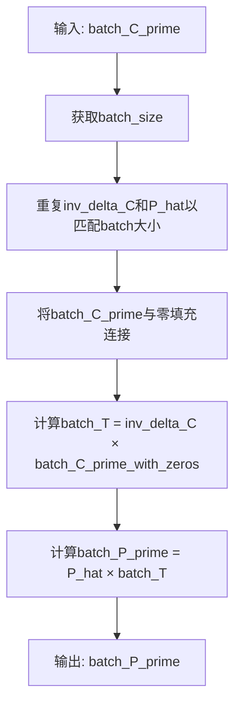

#### 带注释源码

```python
def build_P_prime(self, batch_C_prime):
    """ Generate Grid from batch_C_prime [batch_size x F x 2] """
    # 1. 获取批次大小
    batch_size = batch_C_prime.size(0)
    
    # 2. 将inv_delta_C和P_hat重复batch_size次，以匹配批次维度
    # inv_delta_C: [F+3, F+3] -> [batch_size, F+3, F+3]
    # P_hat: [n, F+3] -> [batch_size, n, F+3]
    batch_inv_delta_C = self.inv_delta_C.repeat(batch_size, 1, 1)
    batch_P_hat = self.P_hat.repeat(batch_size, 1, 1)
    
    # 3. 将batch_C_prime与3行零填充连接，形成[F+3, 2]的矩阵
    # 这是TPS变换所需的扩展矩阵
    # zeros: [batch_size, 3, 2]
    batch_C_prime_with_zeros = torch.cat(
        (batch_C_prime, torch.zeros(batch_size, 3, 2).float().to(device)),
        dim=1)  # batch_size x F+3 x 2
    
    # 4. 计算TPS变换参数矩阵 T = inv_delta_C × C_prime_with_zeros
    # 这一步通过求解线性方程组得到TPS的系数
    batch_T = torch.bmm(
        batch_inv_delta_C,
        batch_C_prime_with_zeros,
    )  # batch_size x F+3 x 2
    
    # 5. 计算最终采样网格 P_prime = P_hat × T
    # P_hat包含了原始图像网格点的坐标和RBF核函数值
    batch_P_prime = torch.bmm(batch_P_hat, batch_T)  # batch_size x n x 2
    
    # 6. 返回生成的采样网格
    return batch_P_prime  # batch_size x n x 2
```

## 关键组件


### Vgg16BN
基于VGG16BN的特征提取器，将图像通过五个卷积块提取多尺度特征并输出命名元组。

### VGGFeatureExtractor
CRNN模型中的VGG风格特征提取器，通过级联卷积和池化层将输入图像转换为深度特征序列。

### BidirectionalLSTM
双向长短期记忆网络，对特征序列进行前后两个方向的上下文建模，输出增强的序列特征。

### ResNetFeatureExtractor
基于ResNet架构的特征提取器，使用自定义ResNet块提取适用于FAN模型的图像特征。

### BasicBlock
ResNet的基本残差块，包含两个3x3卷积层、批归一化和跳跃连接，用于构建深度网络。

### ResNet
完整的ResNet主干网络，通过多级卷积、池化和残差块提取分层特征。

### TpsSpatialTransformerNetwork
基于薄板样条（TPS）的空间变换网络，对输入图像进行几何校正以处理文本变形。

### LocalizationNetwork
TPS网络的定位网络，通过卷积和全连接层预测输入图像的控制点坐标。

### GridGenerator
网格生成器，根据预测的控制点生成采样网格，用于图像重采样。

### init_weights
权重初始化工具函数，对卷积层、BatchNorm层和线性层进行参数初始化。

### device
全局计算设备变量，根据CUDA可用性自动选择GPU或CPU。


## 问题及建议


### 已知问题

-   **硬编码的Magic Numbers缺乏文档说明**：Vgg16BN中的切片索引(12, 19, 29, 39)、ResNet中的layers参数[1, 2, 5, 3]等magic numbers未提供解释，影响代码可维护性
-   **全局状态device**：device作为全局变量硬编码，可能导致在多GPU环境或需要动态设备管理时出现问题，降低模块的可测试性
-   **init_weights函数使用不一致**：Vgg16BN中slice5调用了init_weights但slice1-4在pretrained=True时未调用，而VGGFeatureExtractor和ResNet完全未使用此初始化函数
-   **Vgg16BN的freeze参数语义不清晰**：注释写"only first conv"但实际冻结了整个slice1（包含12层），语义与实现不符
-   **namedtuple在forward中重复创建**：VggOutputs namedtuple在每次前向传播时都被创建，造成不必要的内存开销
-   **BasicBlock定义顺序问题**：ResNetFeatureExtractor引用了BasicBlock和ResNet，但这些类定义在引用之后，虽然Python允许但影响代码阅读顺序
-   **TpsSpatialTransformerNetwork的GridGenerator.build_P_prime方法重复计算**：batch_inv_delta_C和batch_P_hat在每次调用时都执行repeat操作，可以预先注册为buffer
- **ResNet forward方法过长**：包含大量重复的卷积-归一化-激活操作模式，可提取为私有方法提升可读性

### 优化建议

-   将所有magic numbers提取为类属性或配置常量，并添加文档注释说明其含义
-   移除全局device变量，改为在模型forward时接收device参数或使用model.to(device)的方式
-   统一init_weights的使用规范，或考虑使用PyTorch内置的默认初始化机制
-   将namedtuple的创建移到类初始化阶段作为类属性，避免每次forward时重复创建
-   调整类定义顺序，将ResNet和BasicBlock移到ResNetFeatureExtractor之前，或使用forward引用解决循环依赖
-   将GridGenerator中重复的repeat操作结果注册为buffer，只在初始化时计算一次
-   将ResNet forward中的重复模式提取为私有方法如_conv_block，减少代码冗余

## 其它


### 设计目标与约束

本代码库主要用于光学字符识别（OCR）系统中的文本特征提取模块。设计目标包括：（1）提供多种特征提取器（VGG、ResNet）以适应不同场景需求；（2）实现基于薄板样条（TPS）的空间变换网络以校正倾斜或扭曲的文本图像；（3）支持双向LSTM进行上下文特征建模。约束条件包括：输入图像通道数默认为1（灰度图），输出通道数默认为512，需在CUDA或CPU设备上运行。

### 错误处理与异常设计

代码主要使用PyTorch框架的异常机制。在模型初始化阶段，若`pretrained=True`且网络连接不可用，会抛出下载预训练模型失败的异常；若`cuda.is_available()`返回False但尝试使用GPU，会自动回退到CPU。参数类型检查由Python解释器在运行时完成，建议在调用时显式检查输入张量维度是否匹配（batch_size, channels, height, width）。GridGenerator中的矩阵求逆操作在delta_C奇异时可能抛出异常，已通过eps=1e-6防止除零错误。

### 数据流与状态机

数据流如下：输入图像batch_I → TpsSpatialTransformerNetwork.forward() → LocalizationNetwork预测控制点坐标batch_C_prime → GridGenerator生成采样网格build_P_prime → F.grid_sample进行双线性插值得到校正后图像batch_I_r → VGGFeatureExtractor或ResNetFeatureExtractor提取卷积特征 → BidirectionalLSTM编码时序依赖 → 输出特征序列供后续CTC解码器使用。状态机主要体现在TPS网络中控制点从随机初始化（经fc2偏置初始化为规则网格）到预测值的动态更新过程。

### 外部依赖与接口契约

核心依赖包括：torch>=1.0.0、torchvision>=0.4.0（提供vgg16_bn预训练模型）、numpy>=1.19.0。模块导出接口约定：Vgg16BN返回namedtuple包含fc7、relu5_3、relu4_3、relu3_2、relu2_2五个中间层输出；VGGFeatureExtractor输出4个通道数递增的特征图（64/128/256/512）；ResNetFeatureExtractor输出通道数为512的特征图；TpsSpatialTransformerNetwork输入输出图像尺寸需通过构造函数指定I_size和I_r_size。所有Module子类的forward方法均返回torch.Tensor，不返回None。

### 配置与超参数说明

关键超参数包括：Vgg16BN中freeze=True时仅冻结slice1参数；VGGFeatureExtractor的n_input_channels默认为1（灰度图），n_output_channels默认为512；TPS网络中F=20表示控制点数量（10×2分布）；LocalizationNetwork全连接层维度为512→256→(F*2)；GridGenerator中I_r_size需与最终特征提取网络输入匹配。训练时建议batch_size设为32-128，使用Adam优化器，学习率通常为1e-3至1e-4。

### 性能考虑与优化空间

当前实现存在以下性能瓶颈：（1）Vgg16BN在forward中重复创建namedtuple对象，建议使用torch.no_grad()装饰器减少梯度计算开销；（2）BidirectionalLSTM未启用混合精度训练，可通过torch.cuda.amp提升吞吐量；（3）GridGenerator的build_P_prime方法中torch.bmm操作可预先打包以减少kernel启动开销；（4）ResNet的_make_layer在循环中频繁创建Sequential，建议缓存blocks以减少内存分配。建议使用torch.jit.script对静态图部分进行编译优化。

### 版本兼容性说明

代码兼容PyTorch 1.x至2.x版本。在PyTorch 2.0+中可使用torch.compile加速模型推理。torchvision.models.vgg16_bn的接口在0.4.0版本后保持稳定，pretrained参数已废弃改为weights参数，需根据版本调整。F.grid_sample的padding_mode="border"在所有版本中受支持。设备选择逻辑`torch.device("cuda" if torch.cuda.is_available() else "cpu")`适用于所有CUDA版本。

### 使用示例

```python
# 示例1：使用VGG特征提取器
model = VGGFeatureExtractor(n_input_channels=1, n_output_channels=512)
model = model.to(device)
input_tensor = torch.randn(1, 1, 32, 100).to(device)
output = model(input_tensor)  # [1, 512, 1, 24]

# 示例2：使用TPS校正网络
tps = TpsSpatialTransformerNetwork(F=20, I_size=(32, 100), I_r_size=(32, 100))
tps = tps.to(device)
rectified = tps(input_tensor)

# 示例3：组合使用
tps = TpsSpatialTransformerNetwork(F=20, I_size=(32, 100), I_r_size=(32, 64))
feature_extractor = VGGFeatureExtractor(n_input_channels=1)
rnn = BidirectionalLSTM(input_size=512, hidden_size=256, output_size=512)
pipeline = torch.nn.Sequential(tps, feature_extractor, rnn)
```

### 参考文献

- VGG16: "Very Deep Convolutional Networks for Large-Scale Image Recognition" (Simonyan & Zisserman, 2014)
- CRNN: "An End-to-End Trainable Neural Network for Image-based Sequence Recognition and Its Application to Scene Text Recognition" (Shi et al., 2015)
- RARE: "Robust Scene Text Recognition with Automatic Rectification" (Shi et al., 2016)
- TPS-STN: "Spatial Transformer Networks" (Jaderberg et al., 2015)
- ResNet: "Deep Residual Learning for Image Recognition" (He et al., 2016)

    