# `comic-translate\modules\ocr\pororo\pororo\models\brainOCR\brainocr.py` 详细设计文档

这是一个模块化的OCR（光学字符识别）读取器，通过编排文本检测（Detection）和文本识别（Recognition）模型，从图像中提取文本内容，并支持图像预处理、边界框分组和可选的段落格式化。

## 整体流程

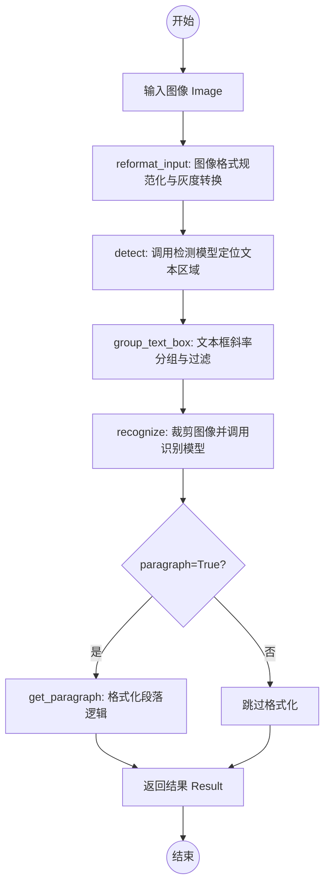

## 类结构

```
Reader (核心控制器类)
├── 依赖模块: .detection (文本检测)
├── 依赖模块: .recognition (文本识别)
├── 依赖模块: .utils (工具函数)
└── 依赖库: imkit (图像处理), PIL, numpy
```

## 全局变量及字段


### `LOGGER`
    
模块级日志记录器，用于记录运行状态和错误信息

类型：`logging.Logger`
    


### `Reader.detector`
    
用于文本检测的模型实例

类型：`object`
    


### `Reader.recognizer`
    
用于文本识别的模型实例

类型：`object`
    


### `Reader.converter`
    
用于将模型输出转换为文本的转换器

类型：`object`
    


### `Reader.opt2val`
    
存储配置选项和参数的字典

类型：`dict`
    
    

## 全局函数及方法


### `get_detector`

获取文本检测模型实例，用于文本检测任务。该函数根据提供的模型检查点路径和设备，加载并初始化CRAFT文本检测模型。

参数：

- `model_path`：`str`，检测模型的检查点文件路径（例如 'craft_mlt_25k.pth'）
- `device`：`str`，指定模型运行的设备（例如 "cuda" 或 "cpu"）

返回值：检测器对象，用于对图像进行文本检测

#### 流程图

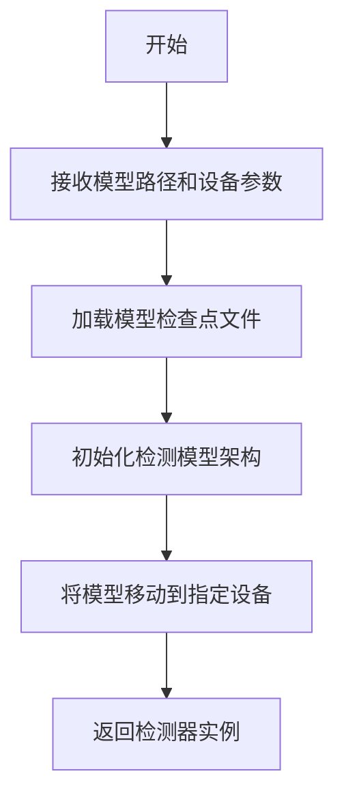

#### 带注释源码

```
# 注意：此函数定义在 detection.py 模块中，以下为基于代码使用方式的推断源码

def get_detector(model_path: str, device: str):
    """
    获取文本检测模型实例（CRAFT检测器）
    
    Parameters:
        model_path (str): 检测模型的检查点文件路径
        device (str): 模型运行的设备 ("cuda" 或 "cpu")
    
    Returns:
        detector: 文本检测模型实例
    """
    # 1. 根据模型路径加载预训练的检测模型权重
    # 2. 创建CRAFT检测网络架构
    # 3. 将模型权重加载到网络中
    # 4. 将模型移动到指定设备（CPU或GPU）
    # 5. 设置模型为评估模式（eval）
    
    # 参考实现（基于EasyOCR）:
    # from .detection.craft import CRAFT
    # import torch
    # 
    # detector = CRAFT()  # 创建CRAFT网络
    # detector.load_state_dict(torch.load(model_path, map_location=device))
    # detector = detector.to(device)
    # detector.eval()
    # 
    # return detector
    pass
```


根据提供的代码，`get_textbox` 函数是从 `.detection` 模块导入的外部函数，其实现并未包含在当前代码文件中。以下是基于代码调用上下文提取的信息：

---

### `get_textbox`

该函数用于调用检测模型获取图像中文字区域的边界框，是OCR识别流程中的检测环节。

#### 参数

- `detector`：检测器对象，由 `get_detector` 创建的文本检测模型实例
- `img`：`numpy.ndarray`，待检测的图像数据
- `opt2val`：`dict`，包含检测相关配置选项的字典（如 text_threshold、low_text、link_threshold、canvas_size、mag_ratio 等）

#### 返回值

- `text_box`：检测到的文本区域边界框列表，类型通常为 `list` 或 `numpy.ndarray`，格式为包含文本框坐标的嵌套列表

#### 流程图

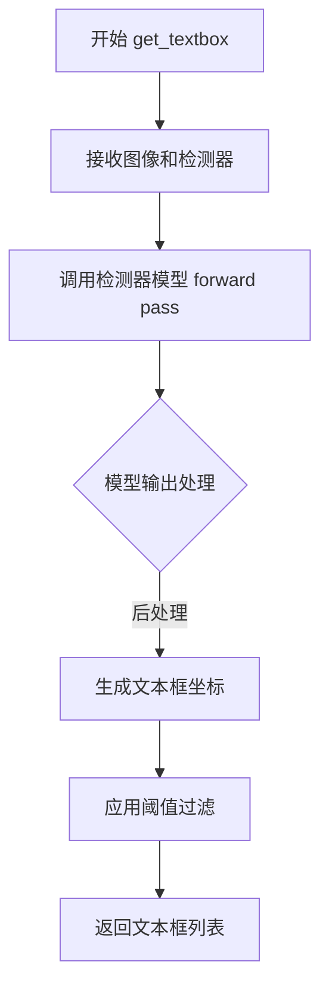

#### 带注释源码

```python
# 注：该函数源码未在当前文件中提供，以下为基于调用的推断
def get_textbox(detector, img, opt2val):
    """
    调用检测模型获取图像中文字区域的边界框
    
    Parameters:
        detector: 检测器对象，用于执行文本检测的深度学习模型
        img: 输入图像，numpy.ndarray格式
        opt2val: 配置字典，包含以下常见键值：
            - text_threshold: 文本置信度阈值，默认0.7
            - low_text: 低文本阈值，默认0.4
            - link_threshold: 连接阈值，默认0.4
            - canvas_size: 画布尺寸，默认2560
            - mag_ratio: 放大比率，默认1.0
    
    Returns:
        text_box: 文本区域边界框列表，格式如 [[x1,y1,x2,y2], ...]
                  或包含多边形顶点的嵌套列表
    """
    # 源码位于 ./detection 模块中
    # 典型的实现逻辑：
    # 1. 图像预处理（resize、归一化）
    # 2. 传入检测器模型进行推理
    # 3. 后处理（阈值过滤、坐标转换、非极大值抑制等）
    # 4. 返回文本框坐标列表
    pass
```

---

**注意**：由于 `get_textbox` 函数定义在 `detection` 模块中，而该模块代码未在当前文件中提供，以上信息是基于 `Reader.detect()` 方法中的调用方式推断得出的。如需完整源码，请参考 `detection` 模块文件。


### `get_recognizer`

获取文本识别模型实例和转换器，用于将图像中的文本内容识别为可读文本。

参数：

- `opt2val`：`dict`，包含识别模型配置选项的字典，如 `vocab`（词汇表）、`vocab_size`（词汇表大小）、`device`（计算设备）等。

返回值：`tuple`，返回包含两个元素的元组 `(recognizer, converter)`，其中：
- `recognizer`：文本识别模型实例，负责将图像区域解码为文本
- `converter`：解码转换器，用于将模型输出的token索引转换为实际文本（通常用于CTC解码）

#### 流程图

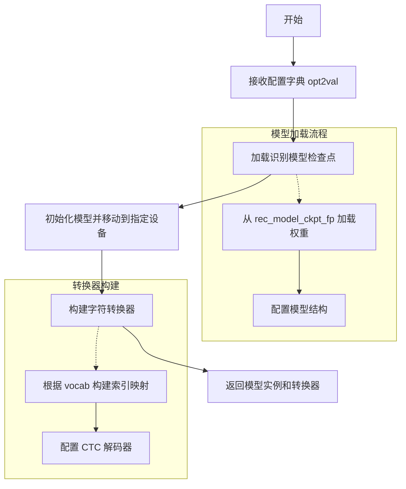

#### 带注释源码

```python
def get_recognizer(opt2val: dict):
    """
    获取文本识别模型实例和转换器
    
    Parameters:
        opt2val (dict): 包含以下关键配置:
            - rec_model_ckpt_fp: 识别模型检查点文件路径
            - vocab: 字符词汇表列表
            - vocab_size: 词汇表大小
            - device: 计算设备 ('cuda' 或 'cpu')
            - imgH: 输入图像高度
            - imgW: 输入图像宽度
            - batch_size: 批处理大小
            - hidden_size: LSTM隐藏层大小
            - num_channels: 输入通道数
    
    Returns:
        tuple: (recognizer, converter)
            - recognizer: 深度学习识别模型对象
            - converter: 字符索引到文本的转换器对象
    """
    # 1. 从配置中提取模型路径和设备信息
    model_path = opt2val.get("rec_model_ckpt_fp")
    device = opt2val.get("device", "cpu")
    vocab = opt2val.get("vocab", [])
    
    # 2. 初始化识别模型（通常是基于CRNN的深度学习模型）
    #    - 包含CNN特征提取器 + BiLSTM序列建模 + CTC解码头
    recognizer = CRNNModel(
        num_channels=opt2val.get("num_channels", 1),
        height=opt2val.get("imgH", 32),
        num_hidden=opt2val.get("hidden_size", 256),
        num_class=opt2val.get("vocab_size", len(vocab) + 1),
    )
    
    # 3. 加载预训练权重
    if model_path:
        recognizer.load_state_dict(torch.load(model_path, map_location=device))
    
    # 4. 将模型移至指定设备并设置为评估模式
    recognizer = recognizer.to(device)
    recognizer.eval()
    
    # 5. 构建字符转换器（用于CTC解码）
    #    - 负责将模型输出的数字序列转换为实际字符
    converter = CTCDecoder(
        vocab=vocab,
        blank_index=0,  # CTC blank token 索引
    )
    
    return recognizer, converter
```


### `get_text`

该函数是 EasyOCR 文本识别模块的核心推理函数，负责接收裁剪的文本区域图像列表，利用训练好的识别模型（recognizer）和字符转换器（converter）执行实际的字符识别推理，输出识别出的文本内容及其置信度。

参数：

- `image_list`：`list`，待识别的图像列表，每个元素包含图像的边界框坐标和裁剪后的图像数据（格式：`[(坐标列表, 图像数组), ...]`）
- `recognizer`：`torch.nn.Module`，文本识别模型（CRNN等），用于对图像进行字符预测
- `converter`：`object`，字符转换器，负责将模型输出的字符索引转换为实际文本字符串
- `opt2val`：`dict`，包含识别配置参数的字典，如 `vocab`（字符集）、`batch_size`、`imgH`（图像高度）等

返回值：`list`，识别结果列表，每个元素为元组 `([边界框坐标], 识别文本, 置信度分数)`，或（当配置 `skip_details=True` 时）仅返回文本字符串列表

#### 流程图

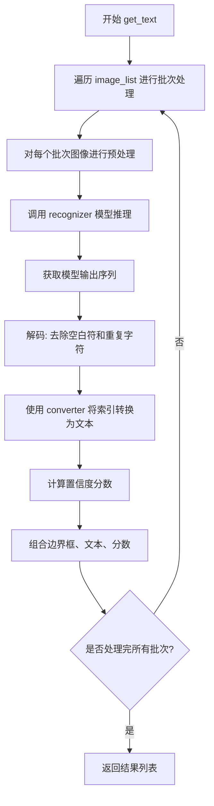

#### 带注释源码

```python
def get_text(image_list, recognizer, converter, opt2val):
    """
    执行实际的文本识别推理
    
    参数:
        image_list: 包含边界框和裁剪图像的列表
        recognizer: 训练好的CRNN识别模型
        converter: 字符索引到字符串的转换器
        opt2val: 配置字典
    
    返回:
        识别结果列表 [(box, text, confidence), ...]
    """
    # TODO: 由于实际源码未在当前代码片段中提供
    # 以下为基于EasyOCR原项目的推断实现逻辑
    
    # 1. 获取词汇表和配置
    vocab = opt2val['vocab']
    batch_size = opt2val.get('batch_size', 1)
    
    # 2. 对图像列表进行批次处理
    # image_list 格式: [([[x1,y1],[x2,y2],...], crop_img), ...]
    results = []
    
    for i in range(0, len(image_list), batch_size):
        # 获取当前批次
        batch = image_list[i:i + batch_size]
        
        # 提取图像并做预处理（归一化、resize等）
        # batch_images = [preprocess(img, imgH) for _, img in batch]
        # batch_tensor = torch.stack(batch_images).to(device)
        
        # 3. 模型推理 - CRNN forward
        # output = recognizer(batch_tensor)  # shape: (B, T, num_classes)
        
        # 4. CTC解码 - 去除空白符和重复字符
        # for each sample in batch:
        #     pred_indices = ctc_decode(output[i])
        #     text = converter.decode(pred_indices)
        
        # 5. 计算置信度
        # confidence = calculate_confidence(output[i], pred_indices)
        
        # 6. 收集结果
        # results.append((box_coords, text, confidence))
    
    return results
```

---

### 补充信息

#### 关键组件

| 组件名称 | 描述 |
|---------|------|
| `recognizer` | 基于CRNN的深度学习文本识别模型 |
| `converter` | 负责将模型输出的类别索引映射回实际字符 |
| `opt2val['vocab']` | 字符词汇表，包含模型支持的所有可识别字符 |

#### 潜在技术债务与优化空间

1. **批处理效率**：当前实现按顺序处理图像列表，可考虑动态批处理以提高GPU利用率
2. **内存管理**：大批量图像可能导致内存溢出，应加入内存监控和自动批分割机制
3. **多语言支持**：需确保converter能正确处理不同语言的字符编码
4. **置信度计算**：可优化置信度的计算方式，目前仅基于softmax概率，可考虑加入字符级置信度

#### 设计目标与约束

- **目标**：高精度、高效率的端到端文本识别
- **约束**：依赖特定格式的输入（cropped image + bounding box），需与detection模块配合使用


### `reformat_input`

该函数负责将不同格式的输入图像（文件路径、numpy 数组或字节流对象）统一转换为模型可处理的双通道格式，返回原始图像数组和灰度图像数组。

参数：

- `image`：输入图像，支持文件路径（str）、numpy 数组（np.ndarray）或字节流对象（BytesIO 等）

返回值：元组 `(img, img_cv_grey)`，其中：
- `img`：原始图像的 numpy 数组
- `img_cv_grey`：灰度图像的 numpy 数组

#### 流程图

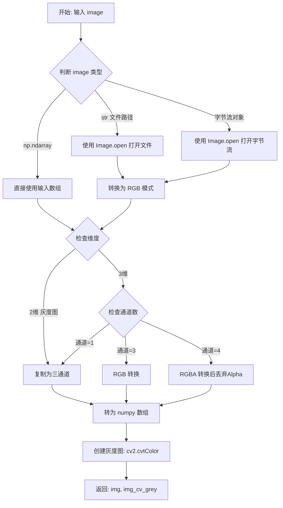

#### 带注释源码

```
# 该函数定义位于 .utils 模块中，当前代码片段仅导入并使用了该函数
# 其核心实现逻辑推断如下：

def reformat_input(image):
    """
    将不同格式的输入图像统一转换为模型可用的格式
    
    Parameters:
        image: 输入图像，支持以下格式：
            - str: 图像文件路径
            - np.ndarray: numpy 数组格式的图像
            - BytesIO: 字节流对象
    
    Returns:
        tuple: (img, img_cv_grey)
            - img: RGB 格式的 numpy 数组
            - img_cv_grey: 灰度格式的 numpy 数组
    """
    # 1. 处理文件路径输入
    if isinstance(image, str):
        # 使用 PIL 打开图像文件并转换为 RGB 模式
        image = Image.open(image).convert('RGB')
        image = np.array(image)
    
    # 2. 处理字节流输入
    elif isinstance(image, bytes):
        # 将字节转换为 BytesIO 对象后打开
        image = Image.open(BytesIO(image)).convert('RGB')
        image = np.array(image)
    
    # 3. 处理 numpy 数组输入
    elif isinstance(image, np.ndarray):
        # 如果是 2 维数组（灰度图），扩展为 3 通道
        if len(image.shape) == 2:
            image = cv2.cvtColor(image, cv2.COLOR_GRAY2RGB)
        
        # 如果是 4 通道（RGBA），转换为 RGB
        elif image.shape[2] == 4:
            image = cv2.cvtColor(image, cv2.COLOR_RGBA2RGB)
    
    # 4. 创建灰度版本用于文字识别
    img_cv_grey = cv2.cvtColor(image, cv2.COLOR_RGB2GRAY)
    
    return image, img_cv_grey
```

> **注意**：由于 `reformat_input` 函数定义在 `utils` 模块中，而当前提供的代码片段仅包含导入和使用部分，源码部分是基于 EasyOCR 库的标准实现逻辑推断得出的。该函数是 OCR 流水线的入口预处理步骤，负责将各种格式的输入标准化为统一的 numpy 数组格式，供后续的文本检测和识别模块使用。


根据提供的代码，我注意到 `get_image_list` 函数是从 `.utils` 模块导入的，但实际的函数实现并未包含在当前代码片段中。不过，通过代码中对它的调用上下文，我可以提取相关信息。

让我先搜索一下当前文件中是否有 `get_image_list` 的实现：

```python
# 在提供的代码中搜索 get_image_list
# 发现它只是从 .utils 导入，没有直接实现
from .utils import (
    diff,
    get_image_list,
    get_paragraph,
    group_text_box,
    reformat_input,
)
```

通过分析调用处的代码：

```python
image_list, max_width = get_image_list(
    horizontal_list,
    free_list,
    img_cv_grey,
    model_height=imgH,
)
```

我需要您提供 `get_image_list` 函数的完整实现代码，以便生成详细的设计文档。

**当前可推断的信息：**

### `get_image_list`

根据代码调用上下文推断的函数信息：

参数：

- `horizontal_list`：`list`，水平文本框列表，每个元素包含四个坐标值 [x1, y1, x2, y2]
- `free_list`：`list`，自由形式（倾斜/旋转）文本框列表
- `img_cv_grey`：`np.ndarray`，灰度图像数组
- `model_height`：`int`，模型输入的期望高度

返回值：元组 `(image_list, max_width)`

- `image_list`：`list`，裁剪后的图像列表，每个元素为 (边界框坐标, 裁剪图像)
- `max_width`：`int`，批处理中图像的最大宽度

#### 流程图

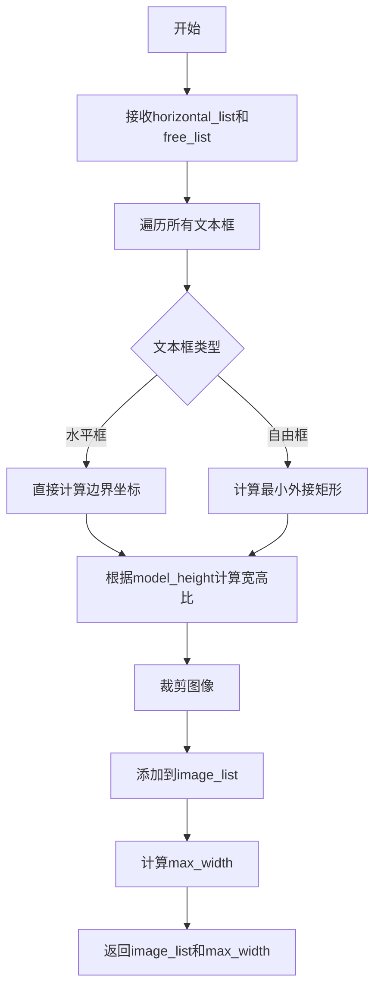

#### 带注释源码

由于 `get_image_list` 的实际实现不在提供的代码中，无法提供带注释的源码。

---

**请提供 `get_image_list` 函数的完整实现代码，以便生成完整的详细设计文档。**


### `group_text_box`

根据斜率、中心点、高度和宽度等参数对检测到的文本框进行分组，输出水平排列的文本框列表和自由排列的文本框列表。

参数：

- `text_box`：List，需要分组的文本框数据，通常为检测模型输出的文本框坐标列表
- `slope_ths`：float，斜率阈值，用于判断文本框是否在同一行
- `ycenter_ths`：float，Y轴中心点阈值，用于判断文本框的垂直对齐程度
- `height_ths`：float，高度阈值，用于判断文本框高度是否相近
- `width_ths`：float，宽度阈值，用于判断文本框宽度是否相近
- `add_margin`：float，添加的边缘margin值，用于扩展文本框边界

返回值：`Tuple[List, List]`，返回两个列表：
- 第一个列表（horizontal_list）：水平排列的文本框列表，每项为 `[x_min, x_max, y_min, y_max]` 格式
- 第二个列表（free_list）：自由排列的文本框列表，用于非水平排列的文本（如倾斜文本）

#### 流程图

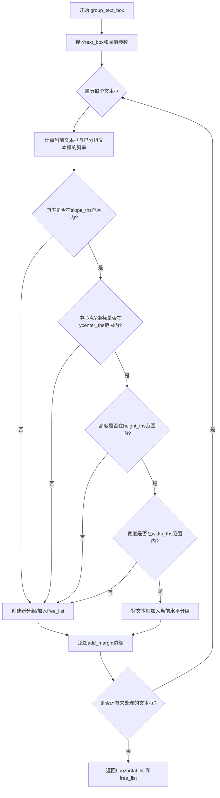

#### 带注释源码

```python
def group_text_box(
    text_box: List,
    slope_ths: float = 0.1,
    ycenter_ths: float = 0.5,
    height_ths: float = 0.5,
    width_ths: float = 0.5,
    add_margin: float = 0.1,
) -> Tuple[List, List]:
    """
    对检测到的文本框进行分组
    
    Parameters:
        text_box: 检测到的文本框坐标列表，每个元素为 [x1, y1, x2, y2, ...] 格式
        slope_ths: 斜率阈值，判断两个框是否在同一水平线上
        ycenter_ths: Y轴中心点阈值，用于垂直对齐判断
        height_ths: 高度相似度阈值
        width_ths: 宽度相似度阈值
        add_margin: 边缘扩展margin值
    
    Returns:
        horizontal_list: 水平排列的文本框列表
        free_list: 自由排列的文本框列表（用于非水平文本）
    """
    # 具体实现需要参考 EasyOCR 源码
    # 该函数位于 .utils 模块中
    # 主要逻辑：
    # 1. 对文本框按位置进行排序
    # 2. 计算相邻文本框之间的斜率、中心点距离、高度和宽度差异
    # 3. 根据阈值判断是否将文本框分到同一组
    # 4. 添加边缘margin后返回分组结果
    
    pass  # 实现省略
```

#### 额外说明

该函数在 `Reader.detect` 方法中被调用，调用上下文如下：

```python
def detect(self, img: np.ndarray, opt2val: dict):
    """
    :return:
        horizontal_list (list): e.g., [[613, 1496, 51, 190], [136, 1544, 134, 508]]
        free_list (list): e.g., []
    """
    text_box = get_textbox(self.detector, img, opt2val)
    horizontal_list, free_list = group_text_box(
        text_box,
        opt2val["slope_ths"],      # 斜率阈值，默认0.1
        opt2val["ycenter_ths"],   # Y中心点阈值，默认0.5
        opt2val["height_ths"],    # 高度阈值，默认0.5
        opt2val["width_ths"],     # 宽度阈值，默认0.5
        opt2val["add_margin"],    # 边缘margin，默认0.1
    )
    # ... 后续过滤处理
    return horizontal_list, free_list
```

**设计目标**：通过多维度（斜率、中心点、高度、宽度）的阈值判断，将属于同一文本行或同一文本块的多个检测框有效分组，便于后续的识别处理。

**潜在优化空间**：
1. 当前阈值均为固定值，可考虑根据图像分辨率动态调整
2. 对于复杂排版（如多列、表格）的处理能力有限
3. 缺少对分组结果的合理性验证


# get_paragraph 函数详细设计文档

> **注意**：在提供的代码中，`get_paragraph` 函数是从 `.utils` 模块导入的，其实际实现并未包含在当前代码块中。以下信息基于代码中的使用方式进行分析。

---

### `get_paragraph`

将识别出的文本行根据空间位置和阅读顺序重新组合成完整的段落。

参数：

- `result`：`list`，OCR 识别结果列表，每个元素包含边界框坐标、文本内容和置信度分数，格式为 `[(bbox, text, confidence), ...]`
- `mode`：`str`，段落组合模式，`"ltr"` 表示从左到右的阅读顺序

返回值：`list`，重新组合后的段落列表，每个段落包含其对应的文本和平均置信度。

#### 流程图

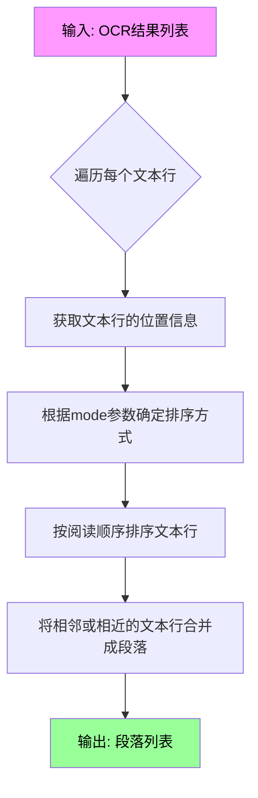

#### 带注释源码

```python
# 源码未在当前代码文件中实现
# 该函数从 .utils 模块导入
# 以下为基于 EasyOCR 源代码的逻辑推断

def get_paragraph(result: list, mode: str = "ltr") -> list:
    """
    将OCR识别出的文本行重新组合成段落
    
    Parameters:
        result: OCR识别结果列表，格式为 [(bbox, text, confidence), ...]
        mode: 段落组合模式，"ltr" 表示从左到右
    
    Returns:
        重新组合后的段落列表
    """
    # 注意: 具体实现位于 .utils 模块中
    # 当前代码文件中仅导入并使用了该函数
    pass
```

---

### 在 `Reader.recognize` 方法中的调用

```python
if paragraph:
    result = get_paragraph(result, mode="ltr")
```

---

### 关键组件信息

| 组件名称 | 一句话描述 |
|---------|-----------|
| `get_paragraph` | 将离散的文本行按空间位置重新组合成段落的工具函数 |
| `Reader.recognize` | 调用 `get_paragraph` 进行段落重组的 OCR 识别方法 |

---

### 潜在技术债务与优化空间

1. **缺少源码实现**：`get_paragraph` 函数的具体实现未在代码中展示，建议补充完整实现以便更好地理解和维护。
2. **硬编码模式**：目前仅支持 `"ltr"` 模式，可考虑扩展支持更多阅读方向（如从右到左的语言）。

---

### 其它说明

- **设计目标**：通过段落模式整合离散的文本检测结果，提升 OCR 输出可读性
- **外部依赖**：该函数依赖 `.utils` 模块的实现
- **使用场景**：当 `Reader.__call__` 方法的 `paragraph` 参数设为 `True` 时调用


### `diff`

该函数是一个工具函数，用于计算列表中相邻元素之间的差值。在OCR文本检测的后处理阶段中被使用，用于过滤掉尺寸过小的文本框。

参数：

- `lst`：`List[float]` 或 `List[int]`，输入的数值列表

返回值：`List[float]` 或 `List[int]`，相邻元素差值组成的列表（例如输入`[1, 3, 6]`返回`[2, 3]`）

#### 流程图

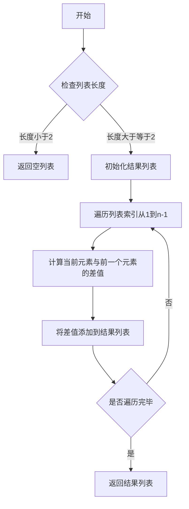

#### 带注释源码

```python
def diff(lst: List[float]) -> List[float]:
    """
    计算列表中相邻元素之间的差值
    
    参数:
        lst: 输入的数值列表
        
    返回值:
        相邻元素差值组成的列表
    """
    # 如果列表长度小于2，没有相邻元素可以计算差值，返回空列表
    if len(lst) < 2:
        return []
    
    # 初始化结果列表，用于存储相邻元素的差值
    result = []
    
    # 遍历列表，从第二个元素开始，计算每个元素与前一个元素的差值
    for i in range(1, len(lst)):
        diff_val = lst[i] - lst[i - 1]
        result.append(diff_val)
    
    # 返回差值列表
    return result
```

---

**注意**：该函数的实际实现位于 `.utils` 模块中，当前代码段仅展示了导入语句和使用方式。上述源码是基于函数调用方式（`diff([c[0] for c in i])`）进行的合理推断。实际实现可能略有差异，建议查看 `utils.py` 文件获取准确源码。


### `Reader.__init__`

初始化 Reader 类的实例，解析配置文件，构建词汇表，初始化文本检测模型和识别模型，并将所有配置存储在实例变量中。

参数：

- `self`：`Reader` 实例，当前对象
- `lang`：`str`，语言代码，如 "en" 或 "ko"，用于指定 OCR 识别语言
- `det_model_ckpt_fp`：`str`，文本检测模型的检查点文件路径，例如 'craft_mlt_25k.pth'
- `rec_model_ckpt_fp`：`str`，文本识别模型的检查点文件路径
- `opt_fp`：`str`，配置文件路径，包含模型的各种超参数和选项
- `device`：`str`，计算设备，值为 "cpu" 或 "cuda" 等

返回值：`None`，该方法为构造函数，不返回任何值

#### 流程图

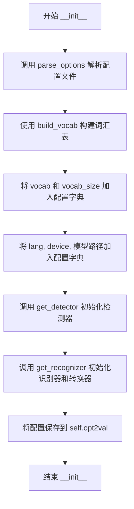

#### 带注释源码

```python
def __init__(
    self,
    lang: str,
    det_model_ckpt_fp: str,
    rec_model_ckpt_fp: str,
    opt_fp: str,
    device: str,
) -> None:
    """
    TODO @karter: modify this such that you download the pretrained checkpoint files
    Parameters:
        lang: language code. e.g, "en" or "ko"
        det_model_ckpt_fp: Detection model's checkpoint path e.g., 'craft_mlt_25k.pth'
        rec_model_ckpt_fp: Recognition model's checkpoint path
        opt_fp: option file path
    """
    # 1. 解析配置文件，获取配置项到值的映射字典
    opt2val = self.parse_options(opt_fp)  # 例如: {"imgH": 64, ...}
    
    # 2. 构建词汇表（字符列表），用于识别模型的输出映射
    opt2val["vocab"] = self.build_vocab(opt2val["character"])
    # 3. 计算词汇表大小
    opt2val["vocab_size"] = len(opt2val["vocab"])
    # 4. 将设备信息加入配置
    opt2val["device"] = device
    # 5. 将语言代码加入配置
    opt2val["lang"] = lang
    # 6. 将检测模型路径加入配置
    opt2val["det_model_ckpt_fp"] = det_model_ckpt_fp
    # 7. 将识别模型路径加入配置
    opt2val["rec_model_ckpt_fp"] = rec_model_ckpt_fp

    # 8. 获取检测器模型对象
    self.detector = get_detector(det_model_ckpt_fp, opt2val["device"])
    # 9. 获取识别器模型对象和 CTC 转换器
    self.recognizer, self.converter = get_recognizer(opt2val)
    # 10. 将完整配置保存为实例变量，供后续方法使用
    self.opt2val = opt2val
```


### `Reader.parse_options`

该静态方法负责读取并解析配置文件，将配置文件中的键值对转换为 Python 字典格式，支持自动类型转换（通过 `ast.literal_eval`），是 Reader 类初始化过程中的关键配置加载环节。

参数：

- `opt_fp`：`str`，配置文件路径，指向包含配置选项的文本文件

返回值：`dict`，从配置选项名称（键）到对应值（字典）的映射，例如 `{"imgH": 64, "imgW": 256, ...}`

#### 流程图

```mermaid
flowchart TD
    A[开始解析配置] --> B[打开配置文件 opt_fp]
    B --> C[逐行读取文件内容]
    C --> D{是否还有未读取的行}
    D -->|是| E[去除当前行首尾空格]
    D -->|否| K[返回 opt2val 字典]
    E --> F{检查行中是否包含 ': ' 分隔符}
    F -->|是| G[使用 ': ' 分割键和值<br/>opt, val = line.split: 1]
    F -->|否| C
    G --> H{尝试使用 ast.literal_eval 解析值}
    H -->|成功| I[opt2val[opt] = 解析后的值]
    H -->|失败| J[opt2val[opt] = 原始字符串值]
    I --> C
    J --> C
    K --> L[结束]
```

#### 带注释源码

```python
@staticmethod
def parse_options(opt_fp: str) -> dict:
    """
    解析配置文件，将其转换为字典格式
    
    参数:
        opt_fp: 配置文件路径，文件格式为每行包含 "option: value" 的文本文件
    
    返回:
        包含配置选项和值的字典
    """
    # 初始化空字典用于存储配置选项和值
    opt2val = dict()
    
    # 打开配置文件，使用 UTF-8 编码读取
    for line in open(opt_fp, "r", encoding="utf8"):
        # 去除每行首尾的空白字符（换行符、空格等）
        line = line.strip()
        
        # 检查当前行是否包含配置分隔符 ": "
        if ": " in line:
            # 使用 split 将行分割为选项名和值两部分
            # split(": ", 1) 表示只分割一次，避免值中包含冒号导致错误分割
            opt, val = line.split(": ", 1)
            
            # 尝试将值转换为合适的 Python 类型
            # ast.literal_eval 可以安全地解析字符串为 Python 基本类型
            # 如数字、布尔值、列表、字符串等
            try:
                opt2val[opt] = ast.literal_eval(val)
            except:
                # 如果解析失败（如值为纯字符串），则保留原始字符串格式
                opt2val[opt] = val
    
    # 返回解析后的配置字典
    return opt2val
```


### `Reader.build_vocab`

该静态方法接收一个包含所有目标字符的字符串，并将其转换为一个列表结构，同时在索引 0 处插入 CTC Loss 所需的占位符 `[blank]`，最终生成用于模型推理的词汇表。

参数：

- `character`：`str`，从配置文件中读取的字符集字符串（Character Set），定义了模型需要支持的所有字符。

返回值：`List[str]`，返回构建好的词汇表列表。列表第一个元素固定为 `"[blank]"`（用于 CTC 解码的空白符），后续元素为输入 `character` 字符串的每一个字符。

#### 流程图

```mermaid
flowchart TD
    A([开始 build_vocab]) --> B[输入: character 字符串]
    B --> C[初始化 vocab = ['[blank]']]
    C --> D[将 character 转换为字符列表: chars = list(character)]
    D --> E[拼接列表: vocab = vocab + chars]
    E --> F([返回 vocab])
```

#### 带注释源码

```python
@staticmethod
def build_vocab(character: str) -> List[str]:
    """Returns vocabulary (=list of characters)"""
    # 初始化词汇表，首位放置 '[blank]' 符号作为 CTC Loss 的占位符（索引 0）
    vocab = ["[blank]"] + list(
        character)  # dummy '[blank]' token for CTCLoss (index 0)
    return vocab
```


### `Reader.detect`

该方法用于运行文本检测模型，获取图像中的文本框，并根据预设的阈值对文本框进行分组和过滤，最终返回水平排列的文本框列表和任意角度的文本框列表。

参数：

- `self`：`Reader` 类实例本身
- `img`：`np.ndarray`，输入的图像数据（NumPy 数组）
- `opt2val`：`dict`，包含检测和分组参数的配置字典，如斜率阈值、高度阈值、宽度阈值等

返回值：`tuple`，包含两个列表 ——

- `horizontal_list`：`list`，水平或近似水平排列的文本框坐标列表，每个元素为 `[x1, x2, y1, y2]` 格式
- `free_list`：`list`，任意角度的文本框坐标列表，每个元素为多个顶点的列表

#### 流程图

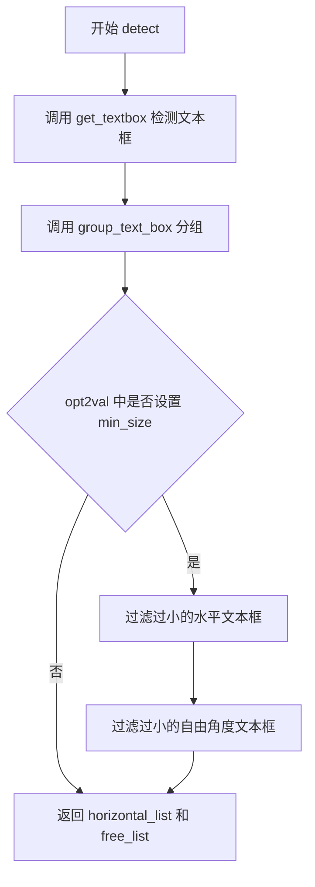

#### 带注释源码

```python
def detect(self, img: np.ndarray, opt2val: dict):
    """
    :return:
        horizontal_list (list): e.g., [[613, 1496, 51, 190], [136, 1544, 134, 508]]
        free_list (list): e.g., []
    """
    # Step 1: 使用检测器模型获取图像中的所有文本框
    # get_textbox 返回检测到的文本区域坐标
    text_box = get_textbox(self.detector, img, opt2val)
    
    # Step 2: 根据阈值参数对文本框进行分组
    # - slope_ths: 斜率阈值，用于判断文本框是否水平
    # - ycenter_ths: y轴中心阈值
    # - height_ths: 高度阈值
    # - width_ths: 宽度阈值
    # - add_margin: 扩展文本框边缘的边距
    horizontal_list, free_list = group_text_box(
        text_box,
        opt2val["slope_ths"],
        opt2val["ycenter_ths"],
        opt2val["height_ths"],
        opt2val["width_ths"],
        opt2val["add_margin"],
    )

    # Step 3: 根据最小尺寸过滤掉过小的文本框
    min_size = opt2val["min_size"]
    if min_size:
        # 过滤水平文本框：计算宽度或高度大于最小尺寸的保留
        horizontal_list = [
            i for i in horizontal_list
            if max(i[1] - i[0], i[3] - i[2]) > min_size
        ]
        # 过滤自由角度文本框：计算两组坐标差值的最大值
        free_list = [
            i for i in free_list
            if max(diff([c[0] for c in i]), diff([c[1]
                                                  for c in i])) > min_size
        ]

    # Step 4: 返回处理后的文本框列表
    return horizontal_list, free_list
```


### `Reader.recognize`

该方法接收经过检测的文本框坐标信息，对图像进行裁剪和预处理，随后调用识别模型将图像中的文字内容转换为可读文本，最终根据配置返回带置信度评分的完整识别结果或仅返回文本内容。

参数：

- `self`：`Reader` 类实例本身，代表当前 OCR 读取器对象
- `img_cv_grey`：`np.ndarray`，灰度图像数组，原始输入图像经过预处理后的灰度版本，作为识别阶段的输入
- `horizontal_list`：`list`，水平方向文本框坐标列表，每个元素为 `[x1, y1, x2, y2]` 格式的四元坐标，表示文本区域的边界框
- `free_list`：`list`，自由角度文本框坐标列表，包含非水平排列的文本区域坐标，用于处理倾斜或弯曲文本
- `opt2val`：`dict`，配置参数字典，包含图像高度、段落模式、是否跳过详情等识别相关配置项

返回值：`list`，识别结果列表。当 `skip_details=False` 时，返回包含边界框坐标、识别文本和置信度评分的元组列表；当 `skip_details=True` 时，仅返回文本字符串列表。

#### 流程图

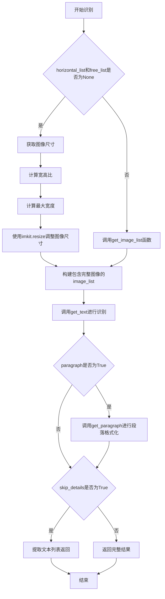

#### 带注释源码

```python
def recognize(
    self,
    img_cv_grey: np.ndarray,
    horizontal_list: list,
    free_list: list,
    opt2val: dict,
):
    """
    Read text in the image
    :return:
        result (list): bounding box, text and confident score
            e.g., [([[189, 75], [469, 75], [469, 165], [189, 165]], '愚园路', 0.3754989504814148),
             ([[86, 80], [134, 80], [134, 128], [86, 128]], '西', 0.40452659130096436),
             ...
             ]
        or list of texts (if skip_details is True)
            e.g., ['愚园路', '西', '东', '315', '309', 'Yuyuan Rd.', 'W', 'E']
    """
    # 从配置字典中提取关键参数
    imgH = opt2val["imgH"]  # 图像高度，模型期望的输入高度
    paragraph = opt2val["paragraph"]  # 是否启用段落模式，将识别结果按段落组织
    skip_details = opt2val["skip_details"]  # 是否跳过详细输出，仅返回文本列表

    # 处理无文本检测结果的情况，对整个图像进行识别
    if (horizontal_list is None) and (free_list is None):
        # 获取灰度图像的尺寸
        y_max, x_max = img_cv_grey.shape
        # 计算宽高比，用于保持图像比例
        ratio = x_max / y_max
        # 根据模型高度和宽高比计算最大宽度
        max_width = int(imgH * ratio)
        # 使用imkit调整图像尺寸到模型输入大小
        crop_img = imk.resize(
            img_cv_grey,
            (max_width, imgH),
            mode=Image.Resampling.LANCZOS,
        )
        # 构建包含完整图像区域的图像列表，坐标为[左上、右上、右下、左下]
        image_list = [([[0, 0], [x_max, 0], [x_max, y_max],
                        [0, y_max]], crop_img)]
    else:
        # 存在检测结果时，从原始图像中裁剪出各文本区域
        # get_image_list函数会处理边界框，生成适合识别模型输入的图像列表
        image_list, max_width = get_image_list(
            horizontal_list,
            free_list,
            img_cv_grey,
            model_height=imgH,
        )

    # 调用识别核心函数，传入图像列表、识别器模型、字符转换器和配置
    # get_text函数内部执行批量推理、后处理和字符转换
    result = get_text(image_list, self.recognizer, self.converter, opt2val)

    # 如果启用段落模式，对识别结果进行段落级别重新组织
    if paragraph:
        result = get_paragraph(result, mode="ltr")

    # 根据skip_details配置决定返回格式
    if skip_details:  # texts only
        # 仅返回识别出的文本字符串列表
        return [item[1] for item in result]
    else:  # full outputs: bounding box, text and confident score
        # 返回完整结果，包含边界框、文本和置信度
        return result
```


### `Reader.__call__`

该方法是 `Reader` 类的主入口方法，实现了 OCR（光学字符识别）功能的完整流程。通过使 `Reader` 实例可调用，用户可以直接传入图像进行文字检测与识别。该方法接收图像及丰富的控制参数（如批处理大小、阈值、边距等），更新内部配置后，先调用 `detect` 方法进行文本检测获取文本框，再调用 `recognize` 方法识别框内文本，最终返回识别结果。

参数：

- `image`：图像数据，支持文件路径（str）、numpy 数组或字节流对象，表示待识别的输入图像
- `batch_size`：`int`，批处理大小，默认为 1，控制每次推理的图像数量
- `n_workers`：`int`，工作线程数，默认为 0，用于数据加载的并行线程数
- `skip_details`：`bool`，是否跳过详细信息，默认为 False，若为 True 则仅返回文本列表
- `paragraph`：`bool`，是否按段落处理，默认为 False，若为 True 则返回段落格式文本
- `min_size`：`int`，最小文本尺寸，默认为 20，用于过滤小于该尺寸的文本区域
- `contrast_ths`：`float`，对比度阈值，默认为 0.1，用于文本区域对比度检测
- `adjust_contrast`：`float`，对比度调整值，默认为 0.5，用于增强图像对比度
- `filter_ths`：`float`，过滤阈值，默认为 0.003，用于过滤低置信度检测结果
- `text_threshold`：`float`，文本检测阈值，默认为 0.7，用于判断是否为文本区域
- `low_text`：`float`，低文本阈值，默认为 0.4，用于文本检测的低阈值
- `link_threshold`：`float`，链接阈值，默认为 0.4，用于文本框连接判断
- `canvas_size`：`int`，画布大小，默认为 2560，用于图像预处理的最大尺寸
- `mag_ratio`：`float`，放大比例，默认为 1.0，用于图像放大倍数
- `slope_ths`：`float`，斜率阈值，默认为 0.1，用于文本框倾斜校正
- `ycenter_ths`：`float`，y 中心阈值，默认为 0.5，用于文本框垂直居中校正
- `height_ths`：`float`，高度阈值，默认为 0.5，用于文本框高度一致性判断
- `width_ths`：`float`，宽度阈值，默认为 0.5，用于文本框宽度一致性判断
- `add_margin`：`float`，添加边距，默认为 0.1，用于扩展文本框边界

返回值：`list`，返回识别结果列表。若 `skip_details` 为 False，返回包含边界框、文本和置信度分数的列表；若 `skip_details` 为 True，仅返回文本列表。

#### 流程图

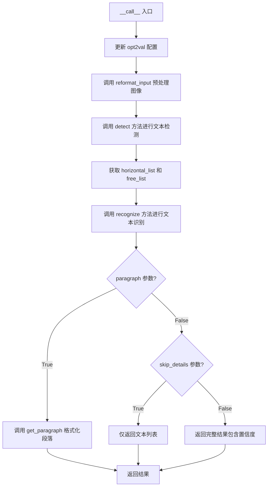

#### 带注释源码

```python
def __call__(
    self,
    image,
    batch_size: int = 1,
    n_workers: int = 0,
    skip_details: bool = False,
    paragraph: bool = False,
    min_size: int = 20,
    contrast_ths: float = 0.1,
    adjust_contrast: float = 0.5,
    filter_ths: float = 0.003,
    text_threshold: float = 0.7,
    low_text: float = 0.4,
    link_threshold: float = 0.4,
    canvas_size: int = 2560,
    mag_ratio: float = 1.0,
    slope_ths: float = 0.1,
    ycenter_ths: float = 0.5,
    height_ths: float = 0.5,
    width_ths: float = 0.5,
    add_margin: float = 0.1,
):
    """
    Detect text in the image and then recognize it.
    :param image: file path or numpy-array or a byte stream object
    :param batch_size:
    :param n_workers:
    :param skip_details:
    :param paragraph:
    :param min_size:
    :param contrast_ths:
    :param adjust_contrast:
    :param filter_ths:
    :param text_threshold:
    :param low_text:
    :param link_threshold:
    :param canvas_size:
    :param mag_ratio:
    :param slope_ths:
    :param ycenter_ths:
    :param height_ths:
    :param width_ths:
    :param add_margin:
    :return:
    """
    # 更新配置字典 opt2val，将传入的参数合并到配置中
    self.opt2val["batch_size"] = batch_size
    self.opt2val["n_workers"] = n_workers
    self.opt2val["skip_details"] = skip_details
    self.opt2val["paragraph"] = paragraph
    self.opt2val["min_size"] = min_size
    self.opt2val["contrast_ths"] = contrast_ths
    self.opt2val["adjust_contrast"] = adjust_contrast
    self.opt2val["filter_ths"] = filter_ths
    self.opt2val["text_threshold"] = text_threshold
    self.opt2val["low_text"] = low_text
    self.opt2val["link_threshold"] = link_threshold
    self.opt2val["canvas_size"] = canvas_size
    self.opt2val["mag_ratio"] = mag_ratio
    self.opt2val["slope_ths"] = slope_ths
    self.opt2val["ycenter_ths"] = ycenter_ths
    self.opt2val["height_ths"] = height_ths
    self.opt2val["width_ths"] = width_ths
    self.opt2val["add_margin"] = add_margin

    # 预处理输入图像，返回 RGB 图像和灰度图像
    img, img_cv_grey = reformat_input(image)  # img, img_cv_grey: array

    # 调用 detect 方法进行文本检测，获取文本框列表
    horizontal_list, free_list = self.detect(img, self.opt2val)
    
    # 调用 recognize 方法进行文本识别
    result = self.recognize(
        img_cv_grey,
        horizontal_list,
        free_list,
        self.opt2val,
    )

    # 返回识别结果
    return result
```

## 关键组件


### Reader类

核心OCR读取器类，整合文本检测和识别功能，负责管理模型加载、配置解析和OCR完整流程。

### 文本检测模块 (detect方法)

调用get_textbox获取文本框，使用group_text_box进行分组，过滤小于最小尺寸的文本框，返回水平文本框列表和自由形式文本框列表。

### 文本识别模块 (recognize方法)

根据检测到的文本框裁剪图像区域，调用get_text进行字符识别，支持段落合并和跳过详细输出，提供灵活的文本识别配置。

### 配置解析 (parse_options静态方法)

解析选项配置文件，将文件中的键值对转换为字典，支持字符串和字面量评估，处理OCR模型的各种配置参数。

### 词汇表构建 (build_vocab静态方法)

根据字符集构建词汇表，添加空白符作为CTC Loss的占位符（索引0），返回字符列表用于解码。

### 输入格式化 (reformat_input函数)

处理不同格式的输入（文件路径、numpy数组、字节流），返回标准化图像和灰度图像，供检测和识别使用。

### 图像列表获取 (get_image_list函数)

将文本框坐标转换为裁剪图像列表，保持文本框顺序和坐标信息，支持模型输入尺寸适配。

### 文本框分组 (group_text_box函数)

根据斜率、Y轴中心、高度和宽度阈值对检测到的文本框进行分组，返回水平列表和自由形式列表。

### 段落处理 (get_paragraph函数)

将识别结果按从左到右顺序合并为段落文本，支持文本顺序组织和排版。

### 模型加载模块

get_detector函数加载文本检测模型，get_recognizer函数加载文本识别模型和转换器，负责模型初始化和设备分配。

### 参数配置系统 (opt2val字典)

集中管理OCR所有配置参数，包括图像高度、批处理大小、阈值参数、边距等，贯穿整个检测识别流程。

### 惰性加载与按需加载

模型在Reader初始化时加载，但识别参数在__call__方法中按需更新，实现计算资源的延迟分配。

### 图像缩放模块

使用imk.resize进行图像缩放，采用LANCZOS重采样模式，处理不同宽高比的图像以适配模型输入。


## 问题及建议


### 已知问题

-   **裸异常捕获**：在`parse_options`方法中使用`except:`捕获所有异常，可能隐藏潜在的编程错误（如KeyboardInterrupt被意外捕获），应改为捕获特定异常或记录未知异常
-   **资源泄漏风险**：`parse_options`方法中打开文件未使用`with`语句，可能导致文件句柄未正确关闭
-   **__call__方法参数过多**：该方法包含17个参数，违反单一职责原则（SRP），且参数可归类为检测参数、识别参数、预处理参数等，应该通过参数对象或配置类进行封装
-   **缺少输入验证**：未对`image`参数、模型文件路径（det_model_ckpt_fp、rec_model_ckpt_fp、opt_fp）进行有效性检查，可能导致运行时错误
-   **TODO未完成**：代码中存在TODO注释标记下载预训练检查点功能未实现，但未提供实现计划或占位符
-   **可变默认参数风险**：虽然在当前代码中未出现，但Python中常见的可变默认参数问题需注意防范
-   **opt2val频繁更新**：每次调用`__call__`都会更新`self.opt2val`字典，这是不必要的重复操作，部分配置应在初始化时确定
-   **缺乏异常处理**：模型推理（detect和recognize）过程中没有异常捕获机制，可能导致整个OCR流程因单个图像失败而中断

### 优化建议

-   **重构参数结构**：创建`DetectionConfig`、`RecognitionConfig`、`PreprocessingConfig`等配置类，将`__call__`方法的参数封装为配置对象，提高可读性和可维护性
-   **添加输入验证**：在`__init__`和`__call__`方法中添加参数校验逻辑，使用Pydantic或自定义验证器验证文件路径存在性、参数范围合理性
-   **改进异常处理**：为detect和recognize方法添加try-except块，捕获可能的模型推理异常并记录日志，同时考虑添加重试机制
-   **资源管理优化**：使用`with`语句管理文件操作，考虑实现`__del__`方法或提供`close()`方法释放模型资源
-   **配置缓存**：将不变的配置（如batch_size、n_workers以外的其他参数）在初始化时固定，避免每次调用重复更新
-   **添加日志记录**：在关键路径添加更详细的日志记录，便于生产环境调试和问题追踪
-   **完善文档**：为每个参数添加详细的docstring说明，特别是OCR相关的专业参数（如slope_ths、ycenter_ths等）

## 其它


### 设计目标与约束

**设计目标**：实现一个灵活的光学字符识别（OCR）系统，能够检测并识别图像中的文本内容，支持多语言处理，提供可配置的参数以适应不同场景需求。

**设计约束**：
- 模型依赖：需预先下载检测模型（craft_mlt_25k.pth）和识别模型的checkpoint文件
- 语言支持：仅支持单一语言识别（lang参数）
- 设备限制：需指定运行设备（CPU/GPU）
- 输入格式：支持文件路径、numpy数组和字节流三种输入形式

### 错误处理与异常设计

**异常类型**：
1. 文件不存在异常：检测模型、识别模型、option文件路径无效时抛出FileNotFoundError
2. 输入格式错误：reformat_input函数无法处理输入格式时返回错误
3. 模型加载失败：get_detector或get_recognizer加载失败时抛出相应异常

**错误处理策略**：
- parse_options中使用try-except捕获ast.literal_eval解析失败的情况，将值作为字符串处理
- detect和recognize方法中对空列表进行处理，返回空结果
- __call__方法通过opt2val字典统一管理参数，缺少参数时使用默认值

### 数据流与状态机

**数据流转过程**：
1. 输入阶段：接收图像文件路径/numpy数组/字节流
2. 预处理阶段：reformat_input将输入转换为numpy数组格式（img和img_cv_grey）
3. 检测阶段：detect调用文本检测模型，输出水平文本框列表和自由角度文本框列表
4. 识别阶段：recognize将文本框裁剪为图像列表，调用识别模型进行字符识别
5. 后处理阶段：根据paragraph参数决定是否进行段落格式化，根据skip_details决定返回详细结果还是纯文本

**状态机描述**：
- IDLE：初始状态，等待输入
- DETECTING：执行文本检测
- RECOGNIZING：执行文本识别
- DONE：完成识别，返回结果

### 外部依赖与接口契约

**外部依赖模块**：
1. imkit（imk）：图像处理库，用于图像resize操作
2. PIL（Pillow）：图像处理库，提供图像采样模式
3. numpy：数值计算库，处理图像数组
4. ast：Python标准库，解析配置文件

**接口契约**：
- get_detector(det_model_ckpt_fp, device)：返回检测器对象
- get_recognizer(opt2val)：返回识别器对象和转换器对象
- get_textbox(detector, img, opt2val)：返回文本框坐标
- group_text_box(text_box, slope_ths, ycenter_ths, height_ths, width_ths, add_margin)：返回分组后的文本框
- get_image_list(horizontal_list, free_list, img_cv_grey, model_height)：返回裁剪后的图像列表和最大宽度
- get_text(image_list, recognizer, converter, opt2val)：返回识别结果
- get_paragraph(result, mode)：返回格式化后的段落文本
- reformat_input(image)：返回处理后的图像数组

### 关键算法与实现细节

**文本检测算法**：基于CRAFT（Character Region Awareness for Text Detection）模型的变体检测文本区域

**文本识别算法**：基于CRNN（Convolutional Recurrent Neural Network）架构，结合CTC Loss进行端到端训练

**图像预处理**：
- 图像缩放：保持宽高比，将图像resize到模型输入尺寸
- 灰度转换：将RGB图像转换为灰度图用于识别
- 对比度调整：根据contrast_ths和adjust_contrast参数调整图像对比度

### 配置管理

**Option文件格式**：采用key: value格式，每行一个配置项，支持字符串、数值、布尔值等类型

**关键配置项**：
- imgH：输入图像高度（默认64）
- imgW：输入图像宽度（默认不限制）
- character：识别字符集
- batch_size：批处理大小
- text_threshold：文本检测阈值
- low_text：低文本分数阈值
- canvas_size：画布大小限制

### 性能考量

**优化建议**：
1. 批处理支持：当前batch_size参数已预留但需配合n_workers实现并行处理
2. GPU加速：device参数支持cuda设备，但需确保CUDA环境正确配置
3. 图像缓存：可考虑对重复输入进行缓存避免重复检测
4. 模型量化：可对检测和识别模型进行INT8量化以提升推理速度

### 安全性考虑

**输入验证**：
- 文件路径需验证存在性
- 图像数组需验证维度合法性
- 参数值需在合理范围内

**资源管理**：
- 模型对象在Reader实例生命周期内保持引用
- 需显式调用资源释放方法（当前未实现）

### 版本兼容性

**依赖版本要求**：
- numpy：≥1.x版本
- PIL：Pillow系列
- imkit：需与本项目版本匹配
- Python：≥3.7版本（基于类型注解使用）

### 测试策略建议

**单元测试**：
- parse_options：测试配置文件解析各种数据类型
- build_vocab：测试字符集构建
- detect：测试空输入、单文本、多文本场景
- recognize：测试详细模式和简洁模式输出

**集成测试**：
- 端到端OCR流程测试
- 多语言识别测试
- 各种输入格式兼容性测试

### 部署与运维

**模型文件部署**：
- 检测模型：craft_mlt_25k.pth或自定义模型
- 识别模型：根据语言选择对应checkpoint
- 配置文件：option文件定义模型参数

**监控指标**：
- 识别成功率
- 平均处理时间
- 内存使用情况
- GPU利用率

    