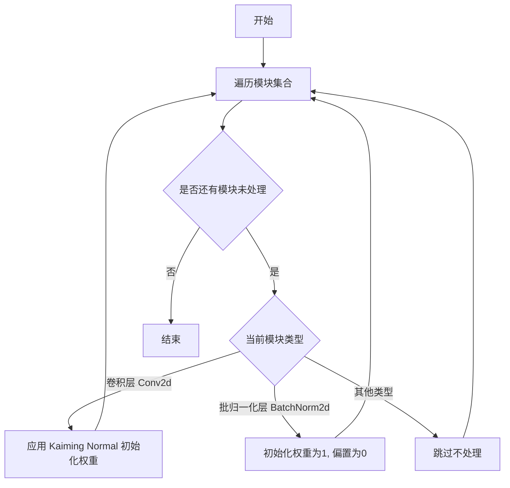
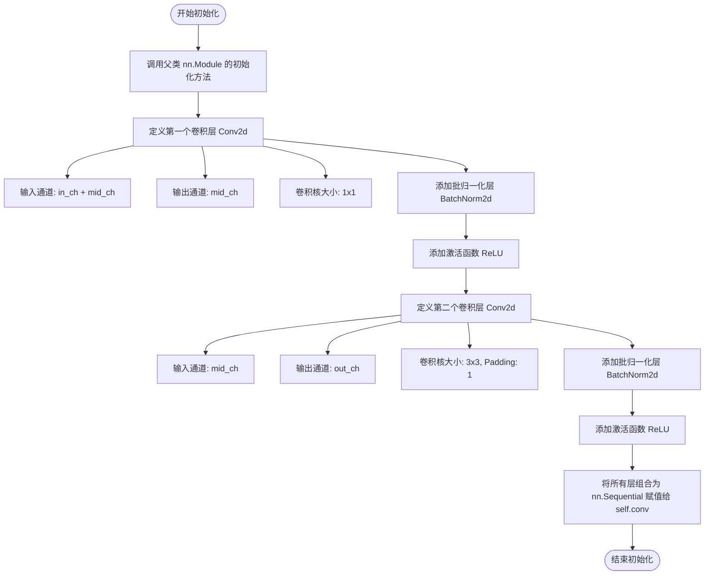
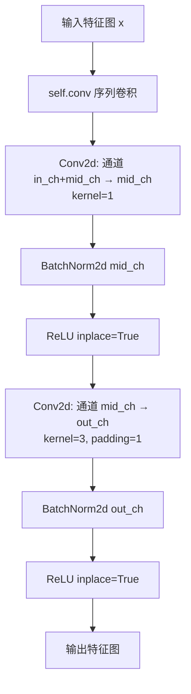

# `comic-translate\modules\ocr\pororo\pororo\models\brainOCR\craft.py` 详细设计文档

CRAFT（Character Region Awareness for Text Detection）文本检测模型的PyTorch实现，基于VGG16骨干网络和U-Net结构的深度学习模型，用于场景文字检测与识别。

## 整体流程

```mermaid
graph TD
    A[输入图像x] --> B[basenet VGG16特征提取]
    B --> C[获取多尺度特征sources[0-4]]
    C --> D[拼接sources[0]和sources[1]]
    D --> E[upconv1上卷积]
    E --> F[插值匹配sources[2]尺寸]
    F --> G[拼接特征并upconv2]
    G --> H[插值匹配sources[3]尺寸]
    H --> I[拼接特征并upconv3]
    I --> J[插值匹配sources[4]尺寸]
    J --> K[拼接特征并upconv4]
    K --> L[conv_cls分类器]
    L --> M[输出: 预测结果和特征图]
```

## 类结构

```
DoubleConv (双层卷积块)
└── CRAFT (主网络模型)
    ├── basenet: Vgg16BN (骨干网络)
    ├── upconv1-4: DoubleConv (上采样卷积块)
    └── conv_cls: nn.Sequential (分类头)
```

## 全局变量及字段


### `num_class`
    
分类类别数（背景和文字）

类型：`int`
    


### `DoubleConv.conv`
    
双层卷积序列，包含两次卷积+归一化+ReLU

类型：`nn.Sequential`
    


### `CRAFT.basenet`
    
VGG16骨干网络

类型：`Vgg16BN`
    


### `CRAFT.upconv1`
    
第一个上卷积块(1024->512->256)

类型：`DoubleConv`
    


### `CRAFT.upconv2`
    
第二个上卷积块(512->256->128)

类型：`DoubleConv`
    


### `CRAFT.upconv3`
    
第三个上卷积块(256->128->64)

类型：`DoubleConv`
    


### `CRAFT.upconv4`
    
第四个上卷积块(128->64->32)

类型：`DoubleConv`
    


### `CRAFT.conv_cls`
    
分类卷积序列

类型：`nn.Sequential`
    
    

## 全局函数及方法


### Vgg16BN

VGG16骨干网络，用于从输入图像中提取多尺度特征图，支持预训练权重加载和参数冻结。

参数：
- `pretrained`：`bool`，是否加载在ImageNet上预训练的权重。
- `freeze`：`bool`，是否冻结骨干网络的权重，使其在训练过程中不更新。

返回值：`List[Tensor]`（根据在CRAFT网络中的使用推断），包含多个尺度的特征图，具体数量为5个（索引0到4），用于后续U网络的上采样和特征融合。

#### 流程图

```mermaid
graph LR
    Input[输入图像Tensor x] --> Vgg16BN[Vgg16BN骨干网络]
    Vgg16BN --> Features[多尺度特征图列表sources]
    Features --> F1[特征图sources[0]]
    Features --> F2[特征图sources[1]]
    Features --> F3[特征图sources[2]]
    Features --> F4[特征图sources[3]]
    Features --> F5[特征图sources[4]]
```

#### 带注释源码

由于Vgg16BN的定义未在当前代码文件中提供（它是从._modules模块导入的），以下是基于其在CRAFT网络中用法的推断和注释：

```python
# 在CRAFT类的__init__方法中初始化Vgg16BN
self.basenet = Vgg16BN(pretrained, freeze)
# 参数：
#   pretrained: bool, 是否使用预训练权重
#   freeze: bool, 是否冻结网络参数

# 在CRAFT类的forward方法中使用
sources = self.basenet(x)
# 输入：
#   x: Tensor, 输入图像，形状为[B, C, H, W]
# 输出：
#   sources: List[Tensor], 包含多个特征图的列表，通常为5个元素
#            sources[0]和sources[1]用于初始特征融合，
#            sources[2], sources[3], sources[4]用于U网络的上采样路径
```

注意：实际的Vgg16BN实现通常基于VGG16架构，包含多个卷积层、池化层和BatchNorm层。如果需要详细的源代码实现，建议查看对应的模块文件。


### `init_weights`

该函数用于初始化神经网络模块的权重，通常采用 Kaiming 正则化方法对卷积层权重进行初始化，并对批归一化层的权重和偏置进行常数初始化，以确保训练初期的稳定性。

参数：
- `modules`：`Iterator[nn.Module]`，网络模块迭代器，通常通过 `nn.Module.modules()` 获取，用于遍历网络中的所有子模块。

返回值：`None`，无返回值，直接修改传入模块的参数。

#### 流程图



#### 带注释源码

```python
def init_weights(modules):
    """
    初始化神经网络模块的权重。
    
    该函数遍历传入的模块迭代器，根据模块类型采用不同的初始化策略：
    - 对于卷积层 (nn.Conv2d)，使用 Kaiming 正则化方法初始化权重，以适配 ReLU 激活函数。
    - 对于批归一化层 (nn.BatchNorm2d)，将权重初始化为 1，偏置初始化为 0。
    - 对于其他类型的层，不进行处理。
    
    参数：
        modules：Iterator[nn.Module]
            网络模块迭代器，通常通过 model.modules() 获取。
    
    返回值：
        None：直接修改传入模块的参数，不返回任何值。
    """
    for m in modules:
        # 如果是卷积层，使用 Kaiming 正则化初始化权重
        if isinstance(m, nn.Conv2d):
            nn.init.kaiming_normal_(m.weight, mode='fan_out', nonlinearity='relu')
            # 如果存在偏置，则初始化为 0
            if m.bias is not None:
                nn.init.constant_(m.bias, 0)
        
        # 如果是批归一化层，权重初始化为 1，偏置初始化为 0
        elif isinstance(m, nn.BatchNorm2d):
            nn.init.constant_(m.weight, 1)
            nn.init.constant_(m.bias, 0)
        
        # 其他类型的层不进行初始化处理
        else:
            pass
```


### `DoubleConv.__init__`

该方法用于初始化 CRAFT 模型中的双层卷积块（Double Convolution Block）。该块通常位于 U 型网络（U-Net）的解码器部分，用于处理来自网络不同层级的特征图融合（通过跳跃连接）。它通过一个 `nn.Sequential` 容器定义了两个连续的卷积、批归一化和 ReLU 激活操作。

参数：

- `self`：实例对象本身。
- `in_ch`：`int`，输入通道数。注意：在该实现中，第一层卷积的输入通道数设定为 `in_ch + mid_ch` 的总和，因此调用时需确保传入的特征图通道数与跳跃连接通道数之和等于 `in_ch + mid_ch`。
- `mid_ch`：`int`，中间通道数。用于第一层卷积的输出通道数，同时也是第二层卷积的输入通道数。
- `out_ch`：`int`，输出通道数。决定最终输出特征图的通道深度。

返回值：`None`，无返回值（构造函数）。

#### 流程图



#### 带注释源码

```python
def __init__(self, in_ch: int, mid_ch: int, out_ch: int) -> None:
    # 调用父类 nn.Module 的构造函数，初始化模型参数
    super(DoubleConv, self).__init__()
    
    # 定义一个有序的容器 Sequential，用于存放卷积、归一化、激活操作
    self.conv = nn.Sequential(
        # 第一个卷积块：
        # 输入通道数为 in_ch + mid_ch（通常对应跳跃连接特征与当前特征的通道之和）
        # 输出通道数为 mid_ch，使用 1x1 卷积核进行通道压缩/调整
        nn.Conv2d(in_ch + mid_ch, mid_ch, kernel_size=1),
        # 对中间通道输出进行批归一化，加速训练收敛
        nn.BatchNorm2d(mid_ch),
        # 使用 ReLU 激活函数，inplace=True 节省内存
        nn.ReLU(inplace=True),
        
        # 第二个卷积块：
        # 输入通道数为上一层的输出通道数 mid_ch
        # 输出通道数为最终需要的 out_ch，使用 3x3 卷积核并设置 padding=1 保持特征图尺寸不变
        nn.Conv2d(mid_ch, out_ch, kernel_size=3, padding=1),
        nn.BatchNorm2d(out_ch),
        nn.ReLU(inplace=True),
    )
```


### `DoubleConv.forward`

该方法实现了双层卷积块的前向传播，通过两个连续的卷积层（1x1 卷积用于通道调整，3x3 卷积用于特征提取）、批归一化和 ReLU 激活函数对输入特征图进行处理，适用于 U-Net 架构中的特征编码和解码部分。

参数：

- `self`：`DoubleConv`，DoubleConv 卷积块实例本身，包含卷积序列 `self.conv`
- `x`：`Tensor`，输入特征图，形状为 (Batch, in_ch + mid_ch, Height, Width)

返回值：`Tensor`，经过双层卷积处理后的输出特征图，形状为 (Batch, out_ch, Height, Width)

#### 流程图



#### 带注释源码

```python
def forward(self, x: Tensor):
    """
    双层卷积块的前向传播方法
    
    参数:
        x (Tensor): 输入特征图，形状为 (Batch, in_ch + mid_ch, H, W)
                   其中 in_ch 是初始输入通道数，mid_ch 是中间层通道数
    
    返回:
        Tensor: 经过双层卷积处理后的特征图，形状为 (Batch, out_ch, H, W)
               输出通道数为 out_ch，空间尺寸保持不变
    """
    # 将输入特征图通过卷积序列 self.conv 进行处理
    # self.conv 包含:
    #   1. Conv2d(in_ch+mid_ch → mid_ch, kernel=1)  # 通道压缩
    #   2. BatchNorm2d(mid_ch)                      # 批归一化
    #   3. ReLU(inplace=True)                       # 激活函数
    #   4. Conv2d(mid_ch → out_ch, kernel=3, padding=1)  # 特征提取
    #   5. BatchNorm2d(out_ch)                     # 批归一化
    #   6. ReLU(inplace=True)                      # 激活函数
    x = self.conv(x)
    
    # 返回处理后的特征图
    return x
```


### `CRAFT.__init__`

该方法是CRAFT（Character Region Awareness for Text Detection）网络的构造函数，负责初始化整个模型的网络结构，包括基础特征提取网络（VGG16-BN）、U型网络的上采样路径以及最终的分类卷积层，并可选地加载预训练权重或冻结部分参数。

参数：

- `self`：`CRAFT` 实例本身，隐式传入
- `pretrained`：`bool`，指定是否加载VGG16BN的预训练权重，默认为 `False`
- `freeze`：`bool`，指定是否冻结VGG16BN的权重参数，默认为 `False`

返回值：`None`，该方法为构造函数，不返回任何值，仅初始化实例属性

#### 流程图

```mermaid
flowchart TD
    A[开始 __init__] --> B[调用 super().__init__]
    B --> C[创建基础网络: Vgg16BN]
    C --> D[创建 U-Net 上采样路径]
    D --> E[创建 upconv1: DoubleConv 1024→512→256]
    E --> F[创建 upconv2: DoubleConv 512→256→128]
    F --> G[创建 upconv3: DoubleConv 256→128→64]
    G --> H[创建 upconv4: DoubleConv 128→64→32]
    H --> I[创建分类卷积层 conv_cls]
    I --> J[初始化 upconv1 权重]
    J --> K[初始化 upconv2 权重]
    K --> L[初始化 upconv3 权重]
    L --> M[初始化 upconv4 权重]
    M --> N[初始化 conv_cls 权重]
    N --> O[结束 __init__]
```

#### 带注释源码

```python
def __init__(self, pretrained: bool = False, freeze: bool = False) -> None:
    """
    CRAFT 网络的构造函数，初始化完整的模型结构
    
    参数:
        pretrained: bool, 是否加载 VGG16BN 的预训练权重
        freeze: bool, 是否冻结 VGG16BN 的权重参数
    返回:
        None
    """
    # 调用父类 nn.Module 的构造函数，进行必要的初始化
    super(CRAFT, self).__init__()

    # ==================== 基础网络（特征提取器）====================
    # 使用 VGG16BN 作为骨干网络，用于提取输入图像的浅层特征
    # 参数 pretrained 控制是否加载 ImageNet 预训练权重
    # 参数 freeze 控制是否将骨干网络参数冻结（训练时不更新）
    self.basenet = Vgg16BN(pretrained, freeze)

    # ==================== U 型网络（Decoder）====================
    # 通过上采样和特征融合，逐步恢复空间分辨率
    # 每层由 DoubleConv 组成，包含两次卷积、批归一化和 ReLU 激活
    
    # 第一层上采样：通道数从 1024 降至 256
    # 输入通道 1024 = VGG 第四层(512) + 第五层(512) 的特征拼接
    self.upconv1 = DoubleConv(1024, 512, 256)
    
    # 第二层上采样：通道数从 512 降至 128
    self.upconv2 = DoubleConv(512, 256, 128)
    
    # 第三层上采样：通道数从 256 降至 64
    self.upconv3 = DoubleConv(256, 128, 64)
    
    # 第四层上采样：通道数从 128 降至 32
    self.upconv4 = DoubleConv(128, 64, 32)

    # ==================== 分类输出层 ====================
    # 将特征图转换为最终的文字区域概率图
    # num_class = 2 表示输出两个通道：字符区域得分和链接（相邻字符连接）得分
    num_class = 2
    
    # 构建分类器序列：多层卷积逐步降低通道数至类别数
    self.conv_cls = nn.Sequential(
        # 第一次卷积：32 -> 32，保持通道数
        nn.Conv2d(32, 32, kernel_size=3, padding=1),
        nn.ReLU(inplace=True),
        
        # 第二次卷积：32 -> 32，保持通道数
        nn.Conv2d(32, 32, kernel_size=3, padding=1),
        nn.ReLU(inplace=True),
        
        # 第三次卷积：32 -> 16，通道数减半
        nn.Conv2d(32, 16, kernel_size=3, padding=1),
        nn.ReLU(inplace=True),
        
        # 第四次卷积：16 -> 16，1x1 卷积
        nn.Conv2d(16, 16, kernel_size=1),
        nn.ReLU(inplace=True),
        
        # 输出层：16 -> 2，最终输出字符区域和链接两个通道
        nn.Conv2d(16, num_class, kernel_size=1),
    )

    # ==================== 权重初始化 ====================
    # 对所有自定义层进行权重初始化，使用 Xavier/Kaiming 方法
    # 确保训练初期梯度稳定，加快收敛速度
    init_weights(self.upconv1.modules())
    init_weights(self.upconv2.modules())
    init_weights(self.upconv3.modules())
    init_weights(self.upconv4.modules())
    init_weights(self.conv_cls.modules())
```


### `CRAFT.forward`

该方法是 CRAFT（Character Region Awareness for Text Detection）模型的前向传播函数，接收输入图像张量，通过 VGG16BN 基础网络提取多尺度特征，然后通过 U 型网络进行特征融合与上采样，最终输出分类结果（包含字符区域得分和亲和力得分）以及中间特征图。

参数：

- `self`：`CRAFT` 类实例，CRAFT 神经网络模型本身
- `x`：`Tensor`，输入图像张量，形状为 (batch, channel, height, width)，通常为 3 通道 RGB 图像

返回值：`Tuple[Tensor, Tensor]`，包含两个张量的元组

- 第一个：`Tensor`，分类结果，形状为 (batch, height, width, num_class)，其中 num_class=2（字符区域和亲和力得分）
- 第二个：`Tensor`，中间特征图，形状为 (batch, 32, H, W)，用于后续任务（如注意力机制或其他特征融合）

#### 流程图

```mermaid
flowchart TD
    A[输入图像 x] --> B[Base Network: Vgg16BN]
    B --> C[获取多尺度特征 sources[0-4]]
    C --> D[拼接 sources[0] 和 sources[1]]
    D --> E[UpConv1: DoubleConv]
    E --> F[插值到 sources[2] 大小]
    F --> G[拼接结果与 sources[2]]
    G --> H[UpConv2: DoubleConv]
    H --> I[插值到 sources[3] 大小]
    I --> J[拼接结果与 sources[3]]
    J --> K[UpConv3: DoubleConv]
    K --> L[插值到 sources[4] 大小]
    L --> M[拼接结果与 sources[4]]
    M --> N[UpConv4: DoubleConv]
    N --> O[特征图 feature]
    O --> P[ConvCls: 分类头]
    P --> Q[permute 维度重排]
    Q --> R[输出: 分类结果 y + 特征图 feature]
```

#### 带注释源码

```python
def forward(self, x: Tensor):
    # 基础网络：使用预训练的 VGG16BN 提取多尺度特征
    # sources 是一个列表，包含从浅到深的5个特征图
    sources = self.basenet(x)

    # ===== U型网络第一层 =====
    # 拼接最深的两层特征图 (sources[0], sources[1])
    # 通道数: in_ch + mid_ch = 1024
    y = torch.cat([sources[0], sources[1]], dim=1)
    # 通过第一个上采样卷积块，输出通道数 256
    y = self.upconv1(y)

    # ===== U型网络第二层 =====
    # 使用双线性插值将特征图上采样到 sources[2] 的空间尺寸
    y = F.interpolate(
        y,
        size=sources[2].size()[2:],  # 获取 sources[2] 的高度和宽度
        mode="bilinear",              # 双线性插值
        align_corners=False,          # 不对齐角落
    )
    # 拼接上采样后的特征与 sources[2]
    y = torch.cat([y, sources[2]], dim=1)
    # 通过第二个上采样卷积块，输出通道数 128
    y = self.upconv2(y)

    # ===== U型网络第三层 =====
    # 插值到 sources[3] 的空间尺寸
    y = F.interpolate(
        y,
        size=sources[3].size()[2:],
        mode="bilinear",
        align_corners=False,
    )
    # 拼接
    y = torch.cat([y, sources[3]], dim=1)
    # 通过第三个上采样卷积块，输出通道数 64
    y = self.upconv3(y)

    # ===== U型网络第四层 =====
    # 插值到 sources[4] 的空间尺寸
    y = F.interpolate(
        y,
        size=sources[4].size()[2:],
        mode="bilinear",
        align_corners=False,
    )
    # 拼接
    y = torch.cat([y, sources[4]], dim=1)
    # 通过第四个上采样卷积块，得到中间特征图，输出通道数 32
    feature = self.upconv4(y)

    # ===== 分类头 =====
    # 通过一系列卷积层生成最终的分类输出
    y = self.conv_cls(feature)

    # 返回值：
    # 1. y.permute(0, 2, 3, 1): 将输出从 (B, C, H, W) 转换为 (B, H, W, C) 格式
    # 2. feature: 中间特征图，可用于后续的文本行或字符级别的注意力机制
    return y.permute(0, 2, 3, 1), feature
```

## 关键组件


### DoubleConv（双卷积块）

用于U-Net上采样路径的基本卷积单元，通过连续的两个卷积-BN-ReLU块提取特征，包含1x1卷积进行通道压缩和3x3卷积进行空间特征提取。

### CRAFT（主网络）

文本检测模型的主体架构，融合了VGG16-BN特征提取器与U-Net结构，通过多级特征融合实现精确的字符区域检测和特征输出。

### Vgg16BN（基础网络）

从Modules模块导入的VGG16批归一化版本，作为特征提取骨干网络，提供多层级的特征图（sources[0-4]）供后续网络使用。

### upconv1-4（上卷积块）

U型网络的4个上采样卷积块，每个块将DoubleConv应用于通道拼接后的特征，逐步恢复空间分辨率并提取更高级的语义信息。

### conv_cls（分类头）

由多个3x3卷积和1x1卷积组成的特征解码器，将32通道特征图转换为2通道的类别概率输出，用于区分字符区域和背景。

### forward方法（前向传播）

实现模型的核心推理逻辑，通过基础网络提取特征、U网络进行多级特征融合与上采样，最终返回类别预测和中间特征。

### 张量索引与特征融合

使用sources列表索引访问不同层级的特征图，通过torch.cat实现浅层与深层特征的跳跃连接，是模型性能关键。

### 特征插值与尺寸对齐

使用F.interpolate进行上采样时保持尺寸对齐，确保不同层级特征的空间维度匹配后再进行通道拼接。

### init_weights（权重初始化）

对DoubleConv和conv_cls的各层进行权重初始化，通过模块迭代器遍历并应用初始化策略，确保训练稳定性。

### 模块化设计

DoubleConv采用Sequential容器封装，conv_cls采用顺序结构，便于模型保存、加载和部署。


## 问题及建议


### 已知问题

-   **DoubleConv 输入通道设计异常**：构造函数中 `nn.Conv2d(in_ch + mid_ch, mid_ch, kernel_size=1)` 将 `in_ch + mid_ch` 作为输入通道，这种设计不符合常规的双层卷积逻辑（通常应为 `in_ch → mid_ch → out_ch`），可能导致功能混淆和意外的通道维度问题。
-   **分类数量硬编码**：`num_class = 2` 被硬编码在 `__init__` 方法中，降低了模型的通用性，无法灵活适应多类分割任务。
-   **权重初始化方式低效且可能有副作用**：对 `nn.Sequential` 调用 `.modules()` 会遍历所有子模块（包括 BatchNorm2d、ReLU 等无需初始化的层），重复调用 `init_weights` 可能导致不必要的计算开销和潜在的副作用。
-   **索引访问特征源缺乏语义化**：代码中使用 `sources[0]`, `sources[1]`, `sources[2]` 等索引访问特征，缺乏文档说明各索引对应的特征图尺寸和语义含义，降低了代码可读性。
-   **forward 方法缺少返回类型注解**：方法签名未标注返回类型，无法通过类型检查器验证返回值格式。
- **interpolate 参数 magic number**：`mode="bilinear"` 和 `align_corners=False` 在多处重复出现，未提取为模块级常量。
- **缺少推理时的模型优化支持**：未使用 `torch.jit.script` 兼容的写法或 `forward` 优化（如 torch.cuda.amp），可能影响部署性能。

### 优化建议

-   **重构 DoubleConv 设计**：将第一层卷积的输入通道改为 `in_ch`，或者重新审视该模块的设计意图并添加文档说明；若确实需要特征 concat 模式，应显式传入拼接后的通道数并添加注释。
-   **将 num_class 设为可配置参数**：修改构造函数签名为 `__init__(self, pretrained: bool = False, freeze: bool = False, num_class: int = 2)`，提高模型复用性。
-   **优化权重初始化逻辑**：实现一个安全的初始化函数，仅对 `nn.Conv2d` 和 `nn.Linear` 层进行权重初始化，跳过 BatchNorm 和激活层；或者使用 PyTorch 内置的 `nn.init` 方法逐层初始化。
-   **添加特征源字典或命名元组**：将 `basenet` 返回值改为字典（如 `{'conv1_2': ..., 'conv2_2': ...}`）或命名结构，提高索引的可读性和类型安全性。
-   **补充类型注解**：为 `forward` 方法添加返回类型 `-> Tuple[Tensor, Tensor]`。
-   **提取常量**：定义模块级常量 `INTERPOLATE_MODE = "bilinear"` 和 `ALIGN_CORNERS = False`。
-   **添加 Dropout 正则化**：在 `conv_cls` 的卷积层之间增加 `nn.Dropout2d(p=0.1)` 防止过拟合。
-   **添加输入尺寸验证**：在 forward 方法开头添加对输入通道数与 basenet 期望是否匹配的断言检查。


## 其它


### 设计目标与约束

本代码实现CRAFT（Character Region Awareness for Text Detection）文本检测模型，旨在从图像中检测出文本区域和字符之间的连接关系。设计目标是通过VGG16骨干网络提取特征，结合U-Net结构的逐级上采样，实现高精度的像素级文本区域分割。模型约束包括：输入图像尺寸需为3通道RGB图像，输出为两个通道的分割图（区域得分和链接得分），推理时需配合后处理算法（如基于贪婪策略的文本行生成）才能得到最终文本框。计算资源约束方面，模型参数量约为27MB，适合在GPU环境下运行，推理速度取决于输入图像分辨率。

### 错误处理与异常设计

代码本身的错误处理较为基础，主要依赖PyTorch框架的自动梯度计算和设备管理。关键异常场景包括：输入张量维度不匹配（应为4D张量[N, C, H, W]）、pretrained参数为False时模型权重随机初始化可能导致输出不稳定、freeze参数为True时会冻结VGG16BN骨干网络参数。在实际部署中，需要在调用forward方法前验证输入张量的shape和dtype，确保输入为Float32类型的3通道图像。此外，模型推理返回的tensor需要转换为numpy数组进行后续后处理，需处理设备转换（GPU到CPU）的异常。

### 数据流与状态机

数据流遵循以下路径：输入图像Tensor → Vgg16BN骨干网络（basenet）提取多尺度特征列表sources → 特征融合与上采样阶段（upconv1-4）→ 分类头（conv_cls）生成最终分割结果。状态机方面，模型包含两种运行状态：训练状态（self.training=True）和推理状态（self.training=False），在训练状态下BatchNorm层使用当前batch的均值和方差，在推理状态下使用训练阶段积累的滑动均值和方差。特征融合过程中，模型在四个尺度上执行cat操作将骨干网络特征与上采样特征拼接，实现多尺度特征融合。

### 外部依赖与接口契约

主要依赖包括：torch（≥1.0）、torch.nn、torch.nn.functional、torch.nn.modules中的Vgg16BN和init_weights。Vgg16BN来自本地模块._modules，需实现 pretrained和freeze参数接口，返回包含5个尺度特征的列表。init_weights函数用于初始化卷积和BatchNorm层权重。输入接口：forward方法接收torch.Tensor类型的输入，shape为[N, 3, H, W]，dtype为float32。输出接口：返回元组(y.permute(0, 2, 3, 1), feature)，其中第一个元素为分割结果logits，shape为[N, H, W, 2]，第二个元素为32通道的中间特征图用于后续任务（如热力图生成）。

### 配置与超参数

关键超参数配置：骨干网络Vgg16BN的预训练权重路径（通过pretrained参数控制）、freeze参数决定是否冻结骨干网络权重。上采样使用双线性插值（bilinear mode），align_corners设为False以保持特征对齐。分类头包含7层卷积，最终输出通道数为2（区域得分和链接得分）。模型权重初始化采用Kaiming初始化方法，通过init_weights函数对各层进行独立初始化。特征图通道数配置：basenet输出通道数为[64, 128, 256, 512, 1024]，对应U-Net融合后的通道变化为1024→512→256→128→64→32。

### 性能考虑与优化空间

计算复杂度主要来自VGG16骨干网络的前向传播（约85%的计算量）和四次上采样过程中的卷积操作。内存占用主要来自：输入图像的中间激活值（与输入分辨率成正比）、特征图存储（sources列表包含5个尺度的特征）。优化方向包括：1)使用更轻量的骨干网络（如ResNet50）替代VGG16以提升推理速度；2)将模型导出为ONNX格式以支持跨平台部署；3)使用torch.jit.script进行模型编译优化；4)对于多尺度输入，可实现动态分辨率推理策略；5)特征融合部分可采用加法替代concat以减少内存消耗。

### 版本与兼容性

代码适配PyTorch 1.0及以上版本，建议使用PyTorch 1.4-1.9版本以获得最佳兼容性。CUDA版本需与PyTorch版本匹配，建议CUDA 10.0及以上。模型权重格式为PyTorch原生.pt或.pth格式，加载时需确保PyTorch版本兼容。Python版本建议3.6及以上。代码中的类型注解（: int, : Tensor, -> None等）需要Python 3.5+支持，对于旧版本Python可移除类型注解而不影响功能。

### 输入输出规范

输入规范：图像张量需满足以下条件——dtype为torch.float32或torch.float，shape为(N, 3, H, W)，其中N为batch size，H和W分别为高度和宽度，建议输入图像尺寸为768×768或512×512以获得最佳效果，像素值应归一化到[0, 1]或ImageNet标准化（mean=[0.485, 0.456, 0.406], std=[0.229, 0.224, 0.225]）。输出规范：返回元组(affinity_score, feature)，affinity_score的shape为(N, H, W, 2)，dtype为float32，数值范围未经过softmax处理，需要通过softmax或sigmoid转换为概率；feature的shape为(N, 32, H, W)，为模型中间层特征，可用于可视化或迁移学习任务。

### 模型变体与扩展

当前实现为标准的CRAFT-base模型，可扩展的变体包括：CRAFT-small使用更少的卷积层和通道数以降低计算量；CRAFT-large在骨干网络中增加残差连接或使用ResNet101替代Vgg16BN以提升特征表达能力。模型扩展方向：1)添加注意力机制（如SE-block或CBAM）到上采样路径；2)实现多尺度输入融合以提升对不同尺度文本的检测能力；3)添加边界框回归头实现端到端的文本检测；4)集成后处理逻辑（如文本行生成算法）到模型内部实现完整推理流程。

    