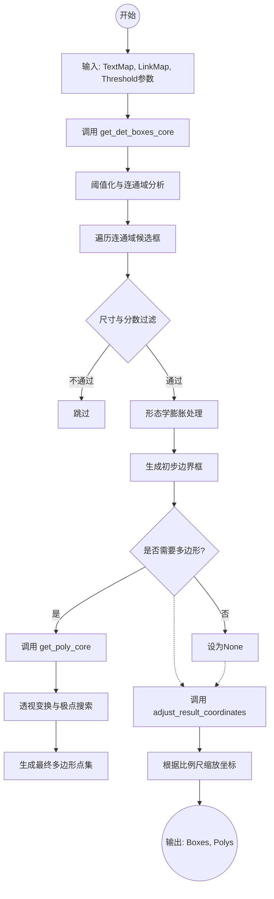
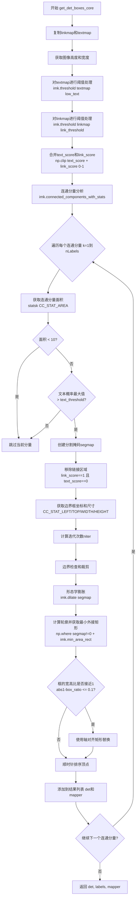
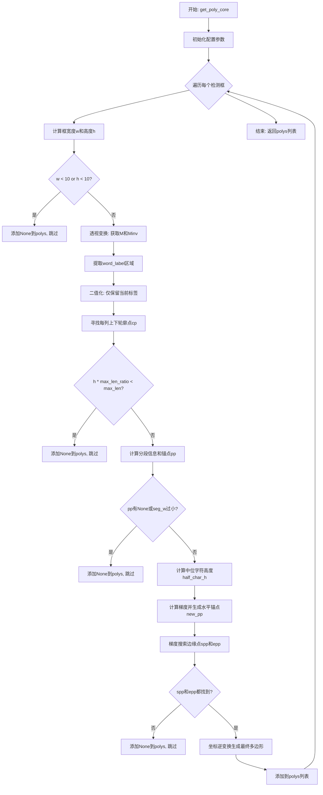

# `comic-translate\modules\ocr\pororo\pororo\models\brainOCR\craft_utils.py` 详细设计文档

这是CRAFT文本检测模型的Post-Processing工具代码，核心功能是将神经网络输出的Text Heatmap和Link Heatmap转换为精确的文本 bounding box（边界框）和 polygon（多边形）坐标，包含了坐标反变换、连通域分析、形态学操作以及多边形细化等关键步骤。

## 整体流程



## 类结构

```
Functional Modules (功能模块)
├── Coordinate Transformation (坐标变换)
│   └── warp_coord
├── Core Detection (核心检测)
│   └── get_det_boxes_core
├── Polygon Refinement (多边形细化)
│   └── get_poly_core
└── API & Post-processing (接口与后处理)
    ├── get_det_boxes
    └── adjust_result_coordinates
```

## 全局变量及字段


### `textmap`
    
文本概率图，存储每个像素属于文字的概率

类型：`numpy.ndarray`
    


### `linkmap`
    
链接概率图，存储像素之间链接关系的概率

类型：`numpy.ndarray`
    


### `text_threshold`
    
文本得分阈值，用于判定像素是否为文字

类型：`float`
    


### `link_threshold`
    
链接得分阈值，用于判定链接关系是否有效

类型：`float`
    


### `low_text`
    
低分文本阈值，用于连通域分析的初步筛选

类型：`float`
    


### `boxes`
    
检测到的边界框列表，每个边界框为numpy数组

类型：`list`
    


### `polys`
    
检测到的多边形列表，用于表示文字区域的精确轮廓

类型：`list`
    


### `labels`
    
连通域标记图，每个像素标记其所属的连通域编号

类型：`numpy.ndarray`
    


### `mapper`
    
标签映射数组，连接边界框索引与连通域标签

类型：`list`
    


### `Minv`
    
透视变换逆矩阵，用于将坐标从目标空间映射回原图像空间

类型：`numpy.ndarray`
    


### `ratio_w`
    
宽度缩放比例，用于坐标变换

类型：`float`
    


### `ratio_h`
    
高度缩放比例，用于坐标变换

类型：`float`
    


### `ratio_net`
    
网络缩放比例，默认为2，用于坐标还原

类型：`float`
    


    

## 全局函数及方法


### `warp_coord`

该函数是一个坐标反变换辅助函数，通过矩阵乘法将原始坐标点根据逆变换矩阵映射回变换前的坐标空间，常用于图像透视变换后坐标的还原。

参数：

- `Minv`：`np.ndarray`，3x3 的逆变换矩阵（透视变换矩阵的逆矩阵），用于将目标坐标逆向映射回原始坐标空间
- `pt`：`tuple`，原始坐标点，格式为 `(x, y)`，表示二维平面上的点坐标

返回值：`np.ndarray`，变换后的二维坐标数组 `[x', y']`，通过除以齐次坐标实现透视变换的反向投影

#### 流程图

```mermaid
graph TD
    A[开始: warp_coord] --> B[输入 Minv 和 pt]
    B --> C[构建扩展坐标向量: (pt[0], pt[1], 1)]
    C --> D[矩阵乘法: np.matmul<br/>计算 Minv × (x, y, 1)]
    D --> E[透视除法: out[0]/out[2], out[1]/out[2]]
    E --> F[返回变换后的二维坐标]
```

#### 带注释源码

```python
def warp_coord(Minv, pt):
    """auxilary functions: unwarp corodinates: """
    # 使用逆变换矩阵 Minv 对坐标点 pt 进行透视逆变换
    # Minv: 3x3 的逆变换矩阵
    # pt: 原始坐标点 (x, y)
    
    # Step 1: 将二维坐标扩展为齐次坐标 (x, y, 1)
    # Step 2: 使用矩阵乘法将点从目标空间映射回原始空间
    out = np.matmul(Minv, (pt[0], pt[1], 1))
    
    # Step 3: 进行透视除法（除以齐次坐标 w）
    # 这是透视变换的逆过程，将齐次坐标转换回二维欧氏坐标
    return np.array([out[0] / out[2], out[1] / out[2]])
```


### `get_det_boxes_core`

该函数是CRAFT文本检测算法的核心组件，负责从文本概率图和链接概率图中检测并提取文本框。它通过阈值处理、连通分量分析和形态学操作来识别图像中的文本区域，并生成精确的边界框坐标。

参数：

- `textmap`：`numpy.ndarray`，文本概率图，包含每个像素属于文本的概率值
- `linkmap`：`numpy.ndarray`，链接概率图，表示相邻文本像素之间的连接关系
- `text_threshold`：`float`，文本检测阈值，用于过滤低置信度的文本像素
- `link_threshold`：`float`，链接检测阈值，用于过滤弱连接
- `low_text`：`float`，低文本阈值，用于初步生成文本mask

返回值：`tuple`，包含三个元素：

- `det`：`list[numpy.ndarray]`，检测到的文本框坐标列表，每个框为4个顶点的numpy数组
- `labels`：`numpy.ndarray`，连通分量标记结果，与输入地图尺寸相同
- `mapper`：`list[int]`，文本框到连通分量的映射关系

#### 流程图



#### 带注释源码

```python
def get_det_boxes_core(textmap, linkmap, text_threshold, link_threshold,
                       low_text):
    """
    从文本概率图和链接概率图中检测文本框
    
    参数:
        textmap: 文本概率图, shape为(H, W)
        linkmap: 链接概率图, shape为(H, W)
        text_threshold: 文本检测阈值, float类型
        link_threshold: 链接检测阈值, float类型
        low_text: 低文本阈值, 用于生成二值化mask
    
    返回:
        det: 检测到的文本框列表, 每个框为4x2的numpy数组
        labels: 连通分量标记结果
        mapper: 文本框索引到连通分量索引的映射
    """
    
    # ------------------- 步骤1: 数据准备 -------------------
    # 复制输入地图以避免修改原始数据
    linkmap = linkmap.copy()
    textmap = textmap.shape
    
    # 获取图像尺寸
    img_h, img_w = textmap.shape

    # ------------------- 步骤2: 阈值处理 -------------------
    # 使用imkit库对textmap进行阈值处理,生成二值文本mask
    # 参数: 输入数组, 阈值, 最大值, 阈值类型(0表示THRESH_BINARY)
    ret, text_score = imk.threshold(textmap, low_text, 1, 0)
    
    # 对linkmap进行阈值处理,生成二值链接mask
    ret, link_score = imk.threshold(linkmap, link_threshold, 1, 0)

    # ------------------- 步骤3: 合并分数并连通分量分析 -------------------
    # 将文本分数和链接分数相加并裁剪到[0,1]范围
    text_score_comb = np.clip(text_score + link_score, 0, 1)
    
    # 执行4连通量的连通分量分析,返回:标签数、标签数组、统计信息、质心
    nLabels, labels, stats, centroids = imk.connected_components_with_stats(
        text_score_comb.astype(np.uint8), connectivity=4)

    # ------------------- 步骤4: 初始化结果容器 -------------------
    det = []      # 存储检测到的文本框
    mapper = []   # 存储映射关系

    # ------------------- 步骤5: 遍历每个连通分量 -------------------
    for k in range(1, nLabels):
        # ----- 5.1 面积过滤 -----
        # 获取当前连通分量的面积
        size = stats[k, imk.CC_STAT_AREA]
        
        # 过滤掉太小的区域(面积<10像素)
        if size < 10:
            continue

        # ----- 5.2 文本阈值过滤 -----
        # 检查该连通分量区域内的最大文本概率是否超过阈值
        if np.max(textmap[labels == k]) < text_threshold:
            continue

        # ----- 5.3 创建分割掩码 -----
        # 初始化分割掩码,全零数组
        segmap = np.zeros(textmap.shape, dtype=np.uint8)
        
        # 将当前连通分量区域设为255(白色)
        segmap[labels == k] = 255
        
        # 移除链接区域:链接分数为1但文本分数为0的区域
        segmap[np.logical_and(link_score == 1,
                              text_score == 0)] = 0

        # ----- 5.4 获取边界框信息 -----
        # 从统计信息中提取边界框的左上角坐标、宽度和高度
        x, y = stats[k, imk.CC_STAT_LEFT], stats[k, imk.CC_STAT_TOP]
        w, h = stats[k, imk.CC_STAT_WIDTH], stats[k, imk.CC_STAT_HEIGHT]
        
        # 计算形态学膨胀的迭代次数
        # 基于面积和长宽比估计合适的迭代次数
        niter = int(math.sqrt(size * min(w, h) / (w * h)) * 2)
        
        # 计算膨胀后的边界,考虑迭代次数
        sx, ex, sy, ey = x - niter, x + w + niter + 1, y - niter, y + h + niter + 1

        # ----- 5.5 边界检查 -----
        # 确保边界不超出图像范围
        if sx < 0:
            sx = 0
        if sy < 0:
            sy = 0
        if ex >= img_w:
            ex = img_w
        if ey >= img_h:
            ey = img_h

        # ----- 5.6 形态学膨胀 -----
        # 创建矩形结构元素
        kernel = imk.get_structuring_element(
            imk.MORPH_RECT,
            (1 + niter, 1 + niter),
        )
        
        # 对分割掩码进行膨胀操作
        segmap[sy:ey, sx:ex] = imk.dilate(segmap[sy:ey, sx:ex], kernel)

        # ----- 5.7 计算最小外接矩形 -----
        # 获取分割掩码中非零像素的坐标
        np_contours = (np.roll(np.array(np.where(segmap != 0)), 1,
                               axis=0).transpose().reshape(-1, 2))
        
        # 计算最小外接矩形(可能是旋转矩形)
        rectangle = imk.min_area_rect(np_contours)
        
        # 获取矩形的四个顶点坐标
        box = imk.box_points(rectangle)

        # ----- 5.8 对齐处理 -----
        # 检查矩形的宽高比,如果接近1:1(正方形或菱形)
        # 则使用轴对齐的边界框代替旋转矩形
        w, h = np.linalg.norm(box[0] - box[1]), np.linalg.norm(box[1] - box[2])
        box_ratio = max(w, h) / (min(w, h) + 1e-5)
        
        if abs(1 - box_ratio) <= 0.1:
            # 计算轮廓的轴对齐边界
            l, r = min(np_contours[:, 0]), max(np_contours[:, 0])
            t, b = min(np_contours[:, 1]), max(np_contours[:, 1])
            
            # 创建新的轴对齐矩形框
            box = np.array([[l, t], [r, t], [r, b], [l, b]], dtype=np.float32)

        # ----- 5.9 确保顺时针顺序 -----
        # 通过计算顶点坐标和找到左上角顶点来确保顺时针顺序
        startidx = box.sum(axis=1).argmin()
        box = np.roll(box, 4 - startidx, 0)
        box = np.array(box)

        # ----- 5.10 添加到结果 -----
        det.append(box)
        mapper.append(k)

    # ------------------- 返回结果 -------------------
    return det, labels, mapper
```


### `get_poly_core`

该函数是 CRAFT 文本检测算法的多边形生成核心，通过透视变换、轮廓分析、锚点检测和梯度计算，将文本检测框精化为更贴合文本形状的多边形顶点序列，支持弯曲文本的精准定位。

参数：

- `boxes`：`List[np.ndarray]`，包含文本检测框的列表，每个框为 4 个顶点坐标的 NumPy 数组
- `labels`：`np.ndarray`，连通分量标记后的标签图，由 `get_det_boxes_core` 产生
- `mapper`：`List[int]`，标签映射表，用于将检测框索引映射到对应的连通分量标签
- `linkmap`：`np.ndarray`，链接关系图，表示字符间的连接概率

返回值：`List[Union[np.ndarray, None]]`，多边形列表，每个元素为包含多个顶点坐标的 NumPy 数组或 None（无效检测）

#### 流程图



#### 带注释源码

```
def get_poly_core(boxes, labels, mapper, linkmap):
    """
    从文本检测框生成精确的多边形顶点序列
    
    该函数实现CRAFT算法的多边形拟合核心逻辑:
    1. 对每个检测框进行透视变换,提取文本区域
    2. 分析列方向的轮廓上下界,确定文本高度分布
    3. 基于分段的轮廓中心点,计算文本锚点序列
    4. 利用梯度方向搜索文本左右边界点
    5. 逆变换将所有顶点映射回原图坐标系
    """
    
    # ==================== 配置参数 ====================
    num_cp = 5              # 锚点数量(分段数-1)
    max_len_ratio = 0.7     # 最大长度与高度的比值阈值
    expand_ratio = 1.45     # 字符高度扩展系数
    max_r = 2.0             # 边界搜索最大半径系数
    step_r = 0.2            # 边界搜索步长
    
    polys = []              # 最终多边形结果列表
    
    # ==================== 主循环: 遍历每个检测框 ====================
    for k, box in enumerate(boxes):
        # --- 步骤1: 尺寸过滤 ---
        # 计算检测框的宽度和高度(基于相邻边向量范数)
        w = int(np.linalg.norm(box[0] - box[1]) + 1)
        h = int(np.linalg.norm(box[1] - box[2]) + 1)
        
        # 过滤过小的文本实例
        if w < 10 or h < 10:
            polys.append(None)
            continue
        
        # --- 步骤2: 透视变换提取文本区域 ---
        # 定义目标矩形的四个顶点(顺时针:左上->右上->右下->左下)
        tar = np.float32([[0, 0], [w, 0], [w, h], [0, h]])
        
        # 计算从检测框到目标矩形的透视变换矩阵
        M = imk.get_perspective_transform(box, tar)
        
        # 对标签图进行透视变换,提取单词区域
        word_label = imk.warp_perspective(
            labels,
            M,
            (w, h)
        )
        
        # 计算逆变换矩阵,用于后续坐标映射
        try:
            Minv = np.linalg.inv(M)
        except:
            # 矩阵求逆失败(可能检测框退化),跳过该框
            polys.append(None)
            continue
        
        # --- 步骤3: 二值化处理 ---
        # 获取当前框对应的标签值
        cur_label = mapper[k]
        
        # 二值化: 仅保留当前文本的标签区域
        word_label[word_label != cur_label] = 0
        word_label[word_label > 0] = 1
        
        # --- 步骤4: 多边形生成 - 寻找上下轮廓 ---
        # 遍历每列,找出文本区域的上下边界点
        cp = []           # 存储轮廓点: (x坐标, 上边界y, 下边界y)
        max_len = -1     # 记录最大文本高度
        
        for i in range(w):
            # 找出当前列中所有文本像素的行坐标
            region = np.where(word_label[:, i] != 0)[0]
            if len(region) < 2:
                continue
            
            # 记录该列的上下边界
            cp.append((i, region[0], region[-1]))
            
            # 更新最大高度
            length = region[-1] - region[0] + 1
            if length > max_len:
                max_len = length
        
        # --- 步骤5: 长度过滤 ---
        # 如果最大高度接近行高,可能是横线误检
        if h * max_len_ratio < max_len:
            polys.append(None)
            continue
        
        # --- 步骤6: 计算锚点(pivot points) ---
        # 将宽度分为多个段,每段计算一个锚点
        tot_seg = num_cp * 2 + 1        # 总分段数(奇数)
        seg_w = w / tot_seg             # 每段宽度
        
        pp = [None] * num_cp            # 初始化锚点列表
        cp_section = [[0, 0]] * tot_seg # 分段累加器
        seg_height = [0] * num_cp       # 每段高度记录
        seg_num = 0                     # 当前段编号
        num_sec = 0                     # 当前段点计数
        prev_h = -1                     # 前一段高度
        
        # 遍历所有轮廓点,分配到对应分段
        for i in range(0, len(cp)):
            (x, sy, ey) = cp[i]
            
            # 检测是否进入新分段
            if (seg_num + 1) * seg_w <= x and seg_num <= tot_seg:
                # 计算上一分段的平均值
                if num_sec == 0:
                    break
                cp_section[seg_num] = [
                    cp_section[seg_num][0] / num_sec,
                    cp_section[seg_num][1] / num_sec,
                ]
                num_sec = 0
                
                # 切换到下一分段
                seg_num += 1
                prev_h = -1
            
            # 累加当前点到分段中心
            cy = (sy + ey) * 0.5                    # 当前列中心y坐标
            cur_h = ey - sy + 1                    # 当前列高度
            cp_section[seg_num] = [
                cp_section[seg_num][0] + x,
                cp_section[seg_num][1] + cy,
            ]
            num_sec += 1
            
            # 偶数段为非多边形区域,跳过
            if seg_num % 2 == 0:
                continue
            
            # 记录锚点(选择高度最大的位置)
            if prev_h < cur_h:
                pp[int((seg_num - 1) / 2)] = (x, cy)
                seg_height[int((seg_num - 1) / 2)] = cur_h
                prev_h = cur_h
        
        # 处理最后一段
        if num_sec != 0:
            cp_section[-1] = [
                cp_section[-1][0] / num_sec,
                cp_section[-1][1] / num_sec
            ]
        
        # --- 步骤7: 锚点有效性检查 ---
        if None in pp or seg_w < np.max(seg_height) * 0.25:
            polys.append(None)
            continue
        
        # --- 步骤8: 计算字符中位高度并生成水平锚点 ---
        # 估算字符高度(用于确定水平扩展范围)
        half_char_h = np.median(seg_height) * expand_ratio / 2
        
        # 计算梯度并生成水平锚点
        new_pp = []
        for i, (x, cy) in enumerate(pp):
            # 计算当前段与相邻段的梯度
            dx = cp_section[i * 2 + 2][0] - cp_section[i * 2][0]
            dy = cp_section[i * 2 + 2][1] - cp_section[i * 2][1]
            
            if dx == 0:
                # 垂直情况:直接上下扩展
                new_pp.append([x, cy - half_char_h, x, cy + half_char_h])
                continue
            
            # 计算旋转角度,生成倾斜的水平线段
            rad = -math.atan2(dy, dx)
            c = half_char_h * math.cos(rad)
            s = half_char_h * math.sin(rad)
            new_pp.append([x - s, cy - c, x + s, cy + c])
        
        # --- 步骤9: 边界搜索 - 寻找左右边缘点 ---
        # 计算起始和结束锚点的梯度
        grad_s = (pp[1][1] - pp[0][1]) / (pp[1][0] - pp[0][0]) + \
                 (pp[2][1] - pp[1][1]) / (pp[2][0] - pp[1][0])
        grad_e = (pp[-2][1] - pp[-1][1]) / (pp[-2][0] - pp[-1][0]) + \
                 (pp[-3][1] - pp[-2][1]) / (pp[-3][0] - pp[-2][0])
        
        isSppFound = False   # 左侧边界点是否找到
        isEppFound = False   # 右侧边界点是否找到
        
        # 梯度下降搜索边界
        for r in np.arange(0.5, max_r, step_r):
            dx = 2 * half_char_h * r
            
            # 搜索起始边界点(spp)
            if not isSppFound:
                line_img = np.zeros(word_label.shape, dtype=np.uint8)
                dy = grad_s * dx
                p = np.array(new_pp[0]) - np.array([dx, dy, dx, dy])
                
                # 绘制测试线段
                line_img = imk.line(
                    line_img,
                    (int(p[0]), int(p[1])),
                    (int(p[2]), int(p[3])),
                    1,
                    thickness=1,
                )
                
                # 判断是否触及文本边界(无交集或达到最大搜索范围)
                if (np.sum(np.logical_and(word_label, line_img)) == 0 or
                        r + 2 * step_r >= max_r):
                    spp = p
                    isSppFound = True
            
            # 搜索结束边界点(epp)
            if not isEppFound:
                line_img = np.zeros(word_label.shape, dtype=np.uint8)
                dy = grad_e * dx
                p = np.array(new_pp[-1]) + np.array([dx, dy, dx, dy])
                
                line_img = imk.line(
                    line_img,
                    (int(p[0]), int(p[1])),
                    (int(p[2]), int(p[3])),
                    1,
                    thickness=1,
                )
                
                if (np.sum(np.logical_and(word_label, line_img)) == 0 or
                        r + 2 * step_r >= max_r):
                    epp = p
                    isEppFound = True
            
            # 两边界都找到后退出搜索
            if isSppFound and isEppFound:
                break
        
        # --- 步骤10: 边界点有效性检查 ---
        if not (isSppFound and isEppFound):
            polys.append(None)
            continue
        
        # --- 步骤11: 逆变换生成最终多边形 ---
        # 按顺时针方向组织多边形顶点
        poly = []
        
        # 左侧边界起点
        poly.append(warp_coord(Minv, (spp[0], spp[1])))
        
        # 上边缘锚点(左到右)
        for p in new_pp:
            poly.append(warp_coord(Minv, (p[0], p[1])))
        
        # 右侧边界终点
        poly.append(warp_coord(Minv, (epp[0], epp[1])))
        
        # 右侧边界起点
        poly.append(warp_coord(Minv, (epp[2], epp[3])))
        
        # 下边缘锚点(右到左)
        for p in reversed(new_pp):
            poly.append(warp_coord(Minv, (p[2], p[3])))
        
        # 左侧边界终点
        poly.append(warp_coord(Minv, (spp[2], spp[3])))
        
        # 添加到结果列表
        polys.append(np.array(poly))
    
    return polys
```


### `get_det_boxes`

该函数是CRAFT文本检测器的核心接口函数，负责将文本概率图和链接概率图转换为文本检测框，并根据参数决定是否生成多边形表示。

参数：

- `textmap`：`numpy.ndarray`，文本概率图，表示每个像素属于文本的概率
- `linkmap`：`numpy.ndarray`，链接概率图，表示像素之间的链接关系
- `text_threshold`：`float`，文本检测阈值，用于过滤低置信度文本区域
- `link_threshold`：`float`，链接检测阈值，用于过滤低置信度链接区域
- `low_text`：`float`，低文本阈值，用于初步筛选文本区域
- `poly`：`bool`，是否生成多边形表示，默认为False

返回值：`tuple`，包含两个元素：
- `boxes`：`list`，检测到的文本框坐标列表，每个框为4个顶点坐标的numpy数组
- `polys`：`list`，多边形坐标列表，如果poly为True则包含多边形数据，否则为None列表

#### 流程图

```mermaid
flowchart TD
    A[开始 get_det_boxes] --> B[调用 get_det_boxes_core]
    B --> C[输入: textmap, linkmap, text_threshold, link_threshold, low_text]
    C --> D[阈值处理和连通域分析]
    D --> E[返回 boxes, labels, mapper]
    
    F{poly == True?} -->|Yes| G[调用 get_poly_core]
    F -->|No| H[生成 None 列表]
    
    G --> I[输入: boxes, labels, mapper, linkmap]
    I --> J[生成多边形]
    J --> K[返回 polys]
    
    H --> L[polys = [None] * len(boxes)]
    
    K --> M[返回 boxes, polys]
    L --> M
    M --> N[结束]
```

#### 带注释源码

```python
def get_det_boxes(
    textmap,
    linkmap,
    text_threshold,
    link_threshold,
    low_text,
    poly=False,
):
    """
    从文本概率图和链接概率图中提取文本检测框
    
    参数:
        textmap: 文本概率图 (H x W)
        linkmap: 链接概率图 (H x W)
        text_threshold: 文本检测阈值
        link_threshold: 链接检测阈值
        low_text: 低文本阈值
        poly: 是否生成多边形
    
    返回:
        boxes: 检测到的文本框列表
        polys: 多边形列表
    """
    
    # 调用核心检测函数，获取文本框、标签和映射器
    # boxes: 检测到的文本框坐标
    # labels: 连通域标记结果
    # mapper: 标签索引映射
    boxes, labels, mapper = get_det_boxes_core(
        textmap,
        linkmap,
        text_threshold,
        link_threshold,
        low_text,
    )

    # 根据poly参数决定是否生成多边形
    if poly:
        # 生成详细的多边形表示（用于曲线文本）
        polys = get_poly_core(boxes, labels, mapper, linkmap)
    else:
        # 简化模式，只返回矩形框
        polys = [None] * len(boxes)

    # 返回检测框和多边形结果
    return boxes, polys
```


### `adjust_result_coordinates`

该函数用于对文本检测结果的多边形坐标进行坐标缩放调整，根据宽度比例、高度比例和网络比例对多边形顶点进行坐标变换，以将检测结果从网络输出尺寸映射回原始图像尺寸。

参数：

- `polys`：`list` 或 `numpy.ndarray`，待调整的多边形坐标列表，每个多边形是一个包含多个顶点的数组
- `ratio_w`：`float`，宽度缩放比例，用于将网络输出坐标映射回原始图像宽度
- `ratio_h`：`float`，高度缩放比例，用于将网络输出坐标映射回原始图像高度
- `ratio_net`：`float`，网络缩放比例，默认为 2.0，表示网络下采样的倍数

返回值：`numpy.ndarray`，返回调整后的多边形坐标数组，如果输入为空则直接返回原输入

#### 流程图

```mermaid
flowchart TD
    A[开始 adjust_result_coordinates] --> B{len(polys) > 0?}
    B -->|否| C[直接返回 polys]
    B -->|是| D[将 polys 转换为 numpy 数组]
    D --> E[k = 0 到 len(polys)-1 循环]
    E --> F{polys[k] 不为 None?}
    F -->|否| G[k += 1]
    F -->|是| H[polys[k] *= (ratio_w * ratio_net, ratio_h * ratio_net)]
    H --> G
    G --> I{k < len(polys)?}
    I -->|是| F
    I -->|否| J[返回调整后的 polys]
    C --> J
```

#### 带注释源码

```python
def adjust_result_coordinates(polys, ratio_w, ratio_h, ratio_net=2):
    """
    调整多边形坐标到原始图像尺寸
    
    参数:
        polys: 多边形坐标列表，每个元素是一个N×2的numpy数组，表示多边形的顶点坐标
        ratio_w: 宽度缩放比例（原始图像宽度 / 网络输入宽度）
        ratio_h: 高度缩放比例（原始图像高度 / 网络输入高度）
        ratio_net: 网络下采样比例，默认为2（CRAFT网络下采样倍数）
    
    返回:
        调整后的多边形坐标数组
    """
    # 检查多边形列表是否为空
    if len(polys) > 0:
        # 将列表转换为numpy数组以便进行向量化运算
        polys = np.array(polys)
        
        # 遍历每个多边形
        for k in range(len(polys)):
            # 只处理非空的多边形
            if polys[k] is not None:
                # 计算综合缩放因子：宽度比例 × 网络下采样比例
                # CRAFT网络输出是原图的1/2，所以需要乘以2来还原到原图尺寸
                # 再乘以ratio_w和ratio_h将坐标映射回原始图像尺寸
                polys[k] *= (ratio_w * ratio_net, ratio_h * ratio_net)
    
    # 返回调整后的多边形坐标
    return polys
```

## 关键组件


### 文本框检测核心模块 (get_det_boxes_core)

该模块负责从文本概率图和链接概率图中提取文本区域边界框。使用连通组件分析进行区域标记，通过形态学膨胀优化分割效果，并生成最小外接矩形框。对于近似正方形的区域，会根据轮廓边界进行调整以获得更精确的文本区域定位。

### 多边形文本区域生成模块 (get_poly_core)

该模块负责生成精确的多边形文本区域。通过透视变换将文本区域映射到标准矩形，然后分析每列的上下边界点来构建文本骨架。基于固定数量的采样点计算Pivot点，并通过梯度计算扩展边界以覆盖整个字符区域。最终生成包含起始点、多个Pivot点和终止点的完整多边形。

### 文本检测主入口函数 (get_det_boxes)

该函数是文本检测的入口点，协调调用核心检测模块和多边形生成模块。支持返回边界框或多边形两种模式，通过poly参数控制输出格式。返回检测到的文本框、对应标签、多边形以及映射关系。

### 坐标调整模块 (adjust_result_coordinates)

该模块负责将检测到的坐标从网络输入尺寸映射回原始图像尺寸。支持宽度和高度的比例调整，以及网络下采样比例的配置。确保在不同分辨率图像上的检测结果能够正确映射回原始坐标系统。

### 图像坐标变换辅助函数 (warp_coord)

该辅助函数实现透视变换的坐标逆变换。通过矩阵逆运算将目标坐标转换回原始图像坐标系，支持处理齐次坐标系的深度值。用于将多边形顶点从透视变换后的标准矩形空间映射回原始文本区域。

### 连通组件分析模块

代码使用imkit库的connected_components_with_stats函数进行连通区域标记。配置4连通性进行区域生长，提取各区域的面积、中心点、边界框等统计信息。用于分离图像中独立的文本区域。

### 形态学处理模块

使用imkit库的dilate和get_structuring_element函数进行图像膨胀处理。根据文本区域大小动态调整形态学核的尺寸，平滑分割区域的边界，减少细小断裂和噪声的影响。

### 边界框拟合模块

使用min_area_rect计算最小外接矩形，并通过box_points获取四个角点坐标。实现了钻石形状检测逻辑，对于接近正方形的区域使用轮廓边界替代矩形拟合，提高文本区域定位精度。


## 问题及建议


### 已知问题

-   **魔法数字和硬编码值泛滥**：代码中存在大量硬编码的数值（如`size < 10`、`num_cp = 5`、`expand_ratio = 1.45`、`max_r = 2.0`等），这些参数散落在函数内部难以理解和维护，参数调整需要修改源码。
-   **异常处理过于宽泛**：`get_poly_core`中对矩阵求逆使用空except捕获，仅返回None跳过，无法区分不同类型的错误（如奇异矩阵、数值不稳定等），可能隐藏潜在的数值问题。
-   **边界检查效率低下**：使用多个独立if语句进行边界检查，而非利用`np.clip`或`min/max`进行向量化操作。
-   **函数职责过于庞大**：`get_det_boxes_core`和`get_poly_core`函数承担了数据预处理、过滤、形态学操作、多边形生成等多项职责，缺乏单一职责原则。
-   **重复计算与冗余操作**：在`get_poly_core`中多处计算`seg_num`、`cp_section`等，且在循环中重复创建临时数组（如`line_img`），存在性能优化空间。
-   **缺乏文档和类型注解**：整个代码没有任何docstring或类型提示（Type Hints），导致接口契约不清晰，调用者难以理解参数含义和返回值结构。
-   **numpy与imkit API混用**：代码混合使用numpy数组操作和imkit库函数，增加了理解成本，且imkit作为隐式全局依赖，其API稳定性无法保证。
-   **不必要的内存拷贝**：多处使用`.copy()`方法（如`linkmap = linkmap.copy()`），对于大型图像数据会造成额外内存开销。
-   **坐标变换缺少验证**：在`warp_coord`中未处理分母为零的情况（`out[2]==0`），可能导致除零错误或NaN传播。
-   **循环内计算未外提**：部分可在循环外预先计算的常量（如`seg_w < np.max(seg_height) * 0.25`）放在循环内每次重新计算。

### 优化建议

-   **提取配置参数**：将所有硬编码数值统一抽取为配置文件或类常量（如`MIN_BOX_SIZE`、`POLY_NUM_CONTROL_POINTS`等），提高代码可配置性。
-   **细化异常处理**：针对矩阵求逆失败的具体异常类型进行捕获，记录日志或返回带有错误信息的对象，而非直接跳过。
-   **向量化边界检查**：使用`np.clip(sx, 0, img_w-1)`或`sx = max(0, min(sx, img_w-1))`替代多个if语句。
-   **函数拆分与重构**：将大型函数拆分为更细粒度的子函数，如分离出`filter_by_size`、`apply_morphology`、`generate_polygon`等独立函数。
-   **添加文档和类型提示**：为每个函数添加详细的docstring，说明参数、返回值含义，并使用Python类型注解声明参数和返回值类型。
-   **优化内存使用**：对于大规模图像处理，考虑使用原地操作（in-place operation）替代不必要的拷贝，或使用生成器模式处理结果。
-   **坐标变换安全检查**：在`warp_coord`中增加对`out[2]`接近零的判断，避免除零错误。
-   **缓存循环不变式**：将循环内不变的计算结果预先提取到循环外，减少重复计算。
-   **统一API风格**：考虑封装imkit调用或提供抽象层，降低对底层库的耦合度。
-   **增加单元测试**：为关键函数（如`warp_coord`、`get_det_boxes_core`核心逻辑）编写单元测试，确保数值正确性和边界条件处理。


## 其它


### 设计目标与约束

本代码实现CRAFT文本检测算法的后处理部分，旨在从神经网络输出的文本热图和链接热图中提取文字区域边界框或多边形。设计目标包括：1）支持任意角度的文本检测；2）通过连通域分析过滤噪声区域；3）生成精确的文本轮廓多边形。约束条件包括：输入热图需为numpy数组格式，文本区域面积需大于10像素，检测到的文本框宽度和高度均需大于10像素，否则予以过滤。

### 错误处理与异常设计

代码中错误处理主要包括：1）矩阵求逆异常捕获：在`get_poly_core`函数中，使用try-except捕获`np.linalg.inv(M)`的异常，当透视变换矩阵奇异时返回None；2）边界检查：在计算图像块坐标时检查sx、sy、ex、ey是否超出图像范围并进行裁剪；3）除零保护：在计算box_ratio和梯度时使用`+1e-5`或`+1`防止除零错误。潜在未处理异常包括：imk库函数调用失败、数组维度不匹配、空输入等情况。

### 数据流与状态机

数据流分为两条路径：边界框检测路径和多边形检测路径。输入为textmap（float32，0-1范围）、linkmap（float32，0-1范围）、text_threshold（float）、link_threshold（float）、low_text（float）。流程为：1）阈值化处理生成二值图；2）连通域分析获取所有连通分量；3）逐分量筛选：面积过滤、文本得分过滤、分割map构建、形态学膨胀；4）最小外接矩形计算；5）可选的多边形生成（通过透视变换、核心点提取、边缘点搜索）。输出为boxes（numpy数组）和polys（多边形列表，可能为None）。

### 外部依赖与接口契约

主要依赖包括：1）numpy：用于数组操作、矩阵运算、线性代数计算；2）imkit：图像处理库，提供threshold、connected_components_with_stats、get_structuring_element、dilate、min_area_rect、box_points、get_perspective_transform、warp_perspective、line等函数。接口契约：textmap和linkmap应为相同尺寸的二维numpy数组，值为0-1的float32；阈值参数应为float类型且在0-1范围内；函数返回的boxes为numpy float32数组，形状为(n,4,2)，表示n个四边形顶点坐标。

### 算法原理与数学基础

核心算法基于连通域分析和形态学处理。1）连通域分析：使用4连通域标记，提取每个连通分量的面积、中心、边界框等统计信息；2）形态学膨胀：使用矩形结构元进行膨胀，使分割区域扩展以包含完整文本；3）最小面积矩形：使用旋转卡壳算法计算最小外接矩形；4）透视变换：将文本区域 warp 到标准矩形坐标系，便于后续处理；5）多边形生成：通过沿扫描线提取上下边界点，计算梯度方向，搜索边缘覆盖点，最终生成8点或10点的多边形。

### 参数配置说明

关键参数包括：1）text_threshold：文本热图阈值，默认约0.7，用于判定像素是否属于文本；2）link_threshold：链接热图阈值，默认约0.4，用于判定像素是否属于字符间链接；3）low_text：低阈值，用于初步连通域分析，默认约0.4；4）poly：布尔值，是否生成多边形而非仅边界框；5）ratio_net：网络下采样比例，默认2，用于坐标还原；6）get_poly_core内部参数：num_cp=5（核心点数）、max_len_ratio=0.7、expand_ratio=1.45、max_r=2.0、step_r=0.2，用于控制多边形生成形状。

### 性能考虑与优化空间

性能瓶颈主要集中在：1）连通域分析：imk.connected_components_with_stats为O(n)复杂度，可考虑下采样预处理；2）形态学膨胀：多次dilate操作，可使用更大核一次操作；3）多边形生成中的循环：存在多层嵌套循环，可使用向量化优化；4）梯度计算与边缘搜索：逐像素迭代，效率较低。优化方向包括：使用Cython或Numba加速关键循环、GPU加速矩阵运算、预先分配数组内存减少分配开销、缓存常用计算结果。

### 边界条件与限制

代码处理的边界条件包括：1）空输入：当textmap或linkmap为空时，imk函数可能返回异常；2）极小区域：面积小于10的连通分量被过滤；3）极窄文本：w<10或h<10的文本框被过滤；4）奇异矩阵：透视变换矩阵行列式为0时无法求逆；5）梯度为零：水平或垂直文本导致梯度计算分母为零；6）边界溢出：膨胀操作可能导致坐标超出图像范围。限制：无法处理弯曲文本的精确轮廓、多语言文本兼容性待验证、对低对比度文本检测效果可能下降。

    