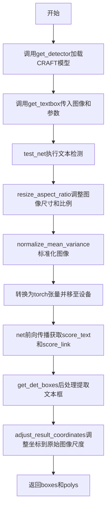
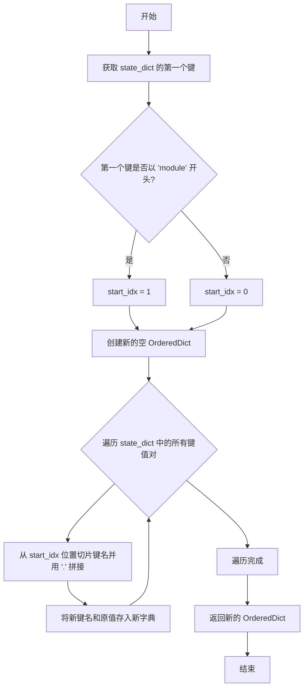
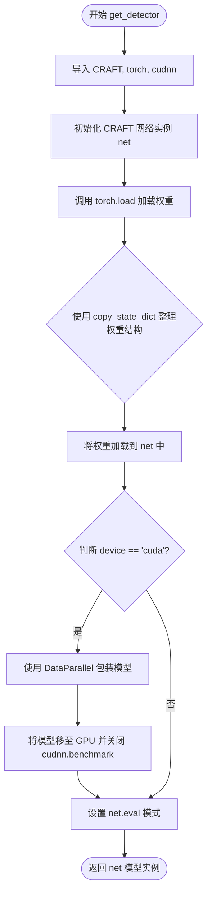
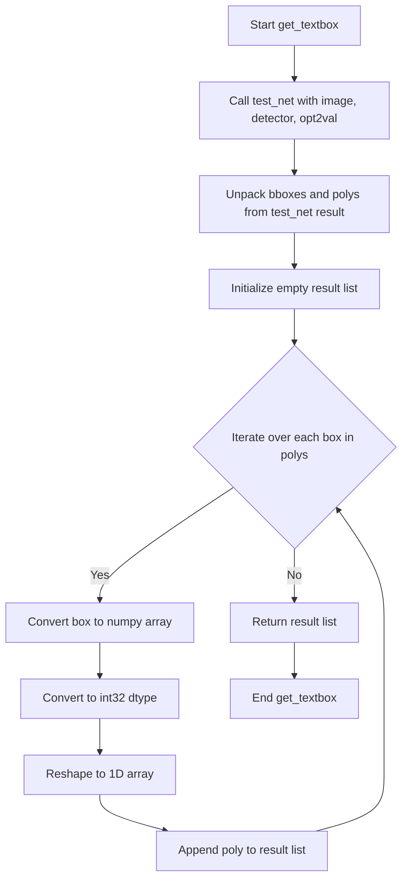
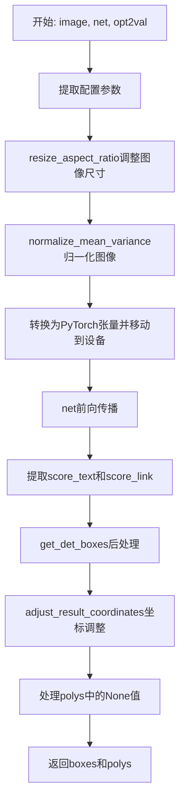
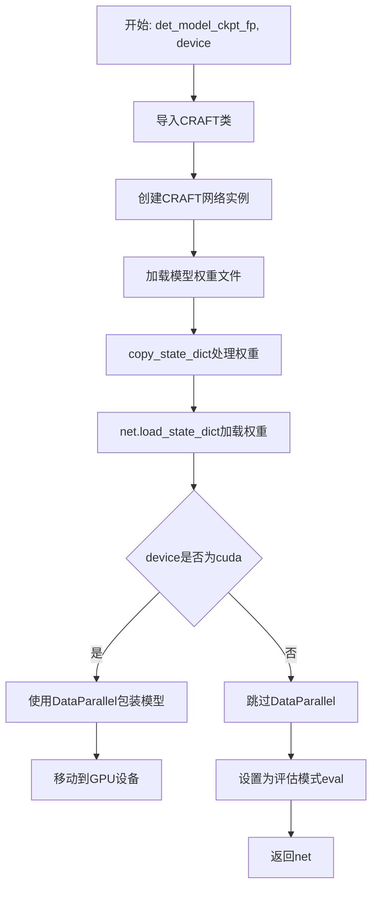
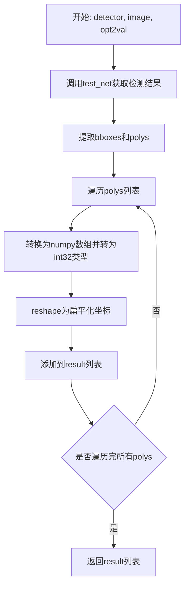

# `comic-translate\modules\ocr\pororo\pororo\models\brainOCR\detection.py` 详细设计文档

这是EasyOCR的文本检测模块，基于CRAFT模型实现图像中的文字检测功能，提供模型加载、图像预处理、神经网络推理、文本框后处理和坐标调整等完整流程。

## 整体流程



## 类结构

```
该文件为Python模块文件，不包含类定义
包含4个全局函数和1个工具函数
依赖CRAFT模型及图像处理工具
```

## 全局变量及字段


### `canvas_size`
    
画布大小，用于图像resize

类型：`int`
    


### `mag_ratio`
    
图像放大比率

类型：`float`
    


### `text_threshold`
    
文本检测置信度阈值

类型：`float`
    


### `link_threshold`
    
文本链接阈值

类型：`float`
    


### `low_text`
    
低文本分数阈值

类型：`float`
    


### `device`
    
计算设备（cpu或cuda）

类型：`str`
    


### `ratio_w`
    
宽度缩放比例

类型：`float`
    


### `ratio_h`
    
高度缩放比例

类型：`float`
    


### `score_text`
    
文本区域得分图

类型：`np.ndarray`
    


### `score_link`
    
文本链接得分图

类型：`np.ndarray`
    


### `boxes`
    
检测到的文本框坐标列表

类型：`list`
    


### `polys`
    
检测到的多边形坐标列表

类型：`list`
    


### `result`
    
返回的文本框坐标数组列表

类型：`list`
    


    

## 全局函数及方法


### `copy_state_dict`

该函数用于处理 PyTorch 模型的状态字典，主要功能是移除多GPU训练时模型键名前缀的 "module." 字符串，使状态字典的键名与原始模型结构相匹配。

参数：

- `state_dict`：`dict`，PyTorch 模型的 state_dict 对象，通常来自 `.pth` 或 `.pt` 文件的权重加载

返回值：`OrderedDict`，处理后的状态字典，移除了 "module." 前缀（如果存在）

#### 流程图



#### 带注释源码

```python
def copy_state_dict(state_dict):
    """
    处理 PyTorch 模型状态字典，移除多GPU训练时产生的 'module.' 前缀
    
    参数:
        state_dict: PyTorch 模型的权重字典，通常来自 torch.save() 保存的文件
        
    返回:
        新的 OrderedDict，键名已移除 'module.' 前缀（如果存在）
    """
    # 获取 state_dict 的第一个键，用于判断是否使用了 DataParallel
    first_key = list(state_dict.keys())[0]
    
    # 检查第一个键是否以 "module" 开头（DataParallel 包装的模型会有此前缀）
    if first_key.startswith("module"):
        start_idx = 1  # 从索引1开始，去掉 "module" 部分
    else:
        start_idx = 0  # 不需要去除前缀
    
    # 创建新的有序字典用于存储处理后的权重
    new_state_dict = OrderedDict()
    
    # 遍历原始 state_dict 的所有键值对
    for k, v in state_dict.items():
        # 将键名按 '.' 分割，然后从 start_idx 位置重新拼接
        # 例如: "module.layer1.weight" -> "layer1.weight" (当 start_idx=1 时)
        name = ".".join(k.split(".")[start_idx:])
        
        # 将处理后的键名和原始值存入新字典
        new_state_dict[name] = v
    
    # 返回处理后的状态字典
    return new_state_dict
```


### `test_net`

该函数是EasyOCR文本检测模型的核心推理函数，负责对输入图像进行文本检测。它接收原始图像、检测模型和配置参数，完成图像预处理、神经网络前向传播、检测框后处理及坐标转换，最终返回文本区域的边界框坐标和多边形坐标。

参数：

- `image`：`np.ndarray`，输入的原始图像数据，通常为H×W×C格式的NumPy数组
- `net`：torch.nn.Module，已加载的CRAFT文本检测模型实例，用于执行前向推理
- `opt2val`：`dict`，包含检测推理所需配置参数的字典，包括canvas_size、mag_ratio、text_threshold、link_threshold、low_text和device等

返回值：`tuple`，返回两个元素——`boxes`为文本区域的边界框坐标列表，`polys`为文本区域的多边形坐标列表

#### 流程图

```mermaid
flowchart TD
    A[开始 test_net] --> B[从opt2val提取配置参数]
    B --> C[调用resize_aspect_ratio调整图像尺寸]
    C --> D[归一化图像: normalize_mean_variance]
    D --> E[转换为PyTorch张量并移至设备]
    E --> F[前向传播: net(x)]
    F --> G[提取score_text和score_link]
    G --> H[后处理: get_det_boxes获取检测框]
    H --> I[调整坐标: adjust_result_coordinates]
    I --> J[处理polys中的None值]
    J --> K[返回boxes和polys]
```

#### 带注释源码

```python
def test_net(image: np.ndarray, net, opt2val: dict):
    """
    执行文本检测网络的推理流程
    
    参数:
        image: 输入图像 (H, W, C) 格式的numpy数组
        net: CRAFT文本检测模型
        opt2val: 配置参数字典
    
    返回:
        boxes: 文本检测框坐标列表
        polys: 文本检测多边形坐标列表
    """
    import torch
    from torch.autograd import Variable

    # 从配置字典中提取检测参数
    canvas_size = opt2val["canvas_size"]       # 画布大小，用于缩放
    mag_ratio = opt2val["mag_ratio"]           # 放大比例
    text_threshold = opt2val["text_threshold"] # 文本置信度阈值
    link_threshold = opt2val["link_threshold"] # 链接阈值
    low_text = opt2val["low_text"]             # 低文本阈值
    device = opt2val["device"]                 # 计算设备 (cpu/cuda)

    # ========== 图像缩放阶段 ==========
    # 根据宽高比和放大比例调整图像尺寸
    img_resized, target_ratio, size_heatmap = resize_aspect_ratio(
        image, canvas_size, interpolation=Image.Resampling.BILINEAR, mag_ratio=mag_ratio)
    # 计算缩放比例的倒数，用于后续坐标还原
    ratio_h = ratio_w = 1 / target_ratio

    # ========== 预处理阶段 ==========
    # 归一化处理：使用均值方差归一化
    x = normalize_mean_variance(img_resized)
    # 转换为PyTorch张量并调整维度顺序 [h, w, c] -> [c, h, w]
    x = torch.from_numpy(x).permute(2, 0, 1)
    # 添加批次维度 [c, h, w] -> [b, c, h, w]
    x = Variable(x.unsqueeze(0))
    # 将输入移至指定计算设备
    x = x.to(device)

    # ========== 推理阶段 ==========
    # 禁用梯度计算以提高推理效率
    with torch.no_grad():
        # 执行前向传播，返回预测结果和特征图
        y, feature = net(x)

    # ========== 后处理阶段 ==========
    # 提取文本置信度图和链接图，移除批次维度
    score_text = y[0, :, :, 0].cpu().data.numpy()
    score_link = y[0, :, :, 1].cpu().data.numpy()

    # 使用CRAFT的后处理函数获取检测框
    boxes, polys = get_det_boxes(
        score_text,
        score_link,
        text_threshold,
        link_threshold,
        low_text,
    )

    # ========== 坐标转换阶段 ==========
    # 将坐标从缩放后的图像空间还原到原始图像空间
    boxes = adjust_result_coordinates(boxes, ratio_w, ratio_h)
    polys = adjust_result_coordinates(polys, ratio_w, ratio_h)
    
    # 处理多边形中的None值，用对应边界框替代
    for k in range(len(polys)):
        if polys[k] is None:
            polys[k] = boxes[k]

    # 返回检测结果
    return boxes, polys
```


### `get_detector`

该函数负责从指定的检查点文件加载预训练的 CRAFT（Character Region Awareness for Text Detection）文本检测模型，并将其初始化到指定的计算设备（CPU 或 GPU）上，同时将模型设置为推理模式。

参数：

- `det_model_ckpt_fp`：`str`，预训练的 CRAFT 模型检查点文件路径（.pth 或 .pt 文件）。
- `device`：`str`，指定模型运行的目标设备，默认为 `"cpu"`，通常也支持 `"cuda"` 用于 GPU 加速。

返回值：`CRAFT`，返回加载了权重并配置完毕的 CRAFT 模型实例（`torch.nn.Module`），可直接用于文本检测推理。

#### 流程图



#### 带注释源码

```python
def get_detector(det_model_ckpt_fp: str, device: str = "cpu"):
    """
    加载并初始化文本检测模型

    Args:
        det_model_ckpt_fp (str): 模型权重文件路径
        device (str): 运行设备，'cpu' 或 'cuda'

    Returns:
        CRAFT: 初始化好的模型对象
    """
    # 局部导入避免循环依赖
    from .craft import CRAFT
    import torch
    import torch.backends.cudnn as cudnn

    # 1. 实例化 CRAFT 网络架构
    net = CRAFT()

    # 2. 加载预训练权重
    # copy_state_dict: 用于处理多GPU训练保存的权重键名带有 'module.' 前缀的问题
    # torch.load: 将权重映射到指定的 device 上（如果是 cpu 则加载到内存）
    net.load_state_dict(
        copy_state_dict(torch.load(det_model_ckpt_fp, map_location=device))
    )

    # 3. 配置 GPU 环境
    if device == "cuda":
        # 如果是 CUDA 设备，使用 DataParallel 包装模型以支持多卡
        # 并将模型参数移至 GPU
        net = torch.nn.DataParallel(net).to(device)
        # 关闭 cudnn.benchmark 以保证结果的一致性（防止因自动调优导致的微小差异）
        cudnn.benchmark = False

    # 4. 设置为评估模式
    # 评估模式会关闭 Dropout 并固定 BatchNorm 的均值和方差，确保推理结果稳定
    net.eval()
    
    return net
```


### `get_textbox`

该函数接收文本检测器、输入图像和配置参数，调用神经网络进行文本检测，并将检测到的多边形坐标转换为整数数组列表返回。

参数：

- `detector`：CRAFT 文本检测模型实例，用于对图像进行文本检测
- `image`：`np.ndarray`，输入的图像数据
- `opt2val`：`dict`，包含检测阈值、图像尺寸等配置选项的字典

返回值：`list`，包含多个 `numpy.ndarray` 的列表，每个数组是将多边形坐标展平并转换为 int32 类型的一维数组

#### 流程图



#### 带注释源码

```python
def get_textbox(detector, image: np.ndarray, opt2val: dict):
    """
    使用CRAFT检测器对图像进行文本检测，并将多边形坐标转换为整数数组
    
    参数:
        detector: CRAFT文本检测模型实例
        image: 输入图像 (numpy数组格式)
        opt2val: 配置参数字典，包含canvas_size, text_threshold等配置
    
    返回:
        包含多边形坐标的一维数组列表
    """
    # 调用test_net函数执行文本检测，得到边界框和多边形坐标
    # bboxes: 文本检测的边界框坐标
    # polys: 文本检测的多边形坐标（可能包含更精确的轮廓）
    bboxes, polys = test_net(image, detector, opt2val)
    
    # 初始化结果列表，用于存储所有检测到的文本区域坐标
    result = []
    
    # 遍历所有检测到的多边形
    for i, box in enumerate(polys):
        # 将多边形坐标转换为numpy数组，并确保为int32类型以满足后续处理要求
        # reshape((-1))将多边形坐标展平为一维数组
        poly = np.array(box).astype(np.int32).reshape((-1))
        
        # 将处理后的坐标添加到结果列表中
        result.append(poly)

    # 返回包含所有文本区域坐标的列表
    return result
```


## 关键组件


### 状态字典处理 (copy_state_dict)

该函数用于处理PyTorch模型的状态字典，处理多GPU训练时模型键名前缀"module."的问题，将嵌套的键名展平为扁平结构。

### 文本检测网络 (test_net)

该函数是核心的文本检测函数，执行图像预处理、模型前向传播、分数图和链接图的后处理、坐标调整等操作，返回文本边界框和多边形列表。

### 检测器初始化 (get_detector)

该函数负责加载CRAFT文本检测模型权重，初始化网络并设置为评估模式，支持CPU和CUDA设备。

### 文本框提取 (get_textbox)

该函数是文本检测的入口函数，接收检测器和图像，调用test_net进行检测，并将多边形坐标转换为整数数组列表返回。

### 图像预处理模块

该模块来自imgproc子模块，包含normalize_mean_variance（均值方差归一化）和resize_aspect_ratio（保持宽高比的缩放）两个关键预处理函数。

### CRAFT后处理模块

该模块来自craft_utils子模块，包含adjust_result_coordinates（坐标调整）和get_det_boxes（从分数图获取边界框）两个关键后处理函数。

### CRAFT模型

该模型类通过import引入，是基于字符区域感知文本检测的深度学习模型，负责图像的特征提取和文本区域预测。


## 问题及建议


### 已知问题

-   **内部导入影响性能**：在`test_net`函数内部导入`torch`和`torch.autograd.Variable`，每次调用都会执行导入操作，影响性能且不符合最佳实践。
-   **设备字符串硬编码**：使用`if device == "cuda"`进行设备判断，字符串比较不够健壮，缺乏对其他设备（如"cuda:0"）的支持。
-   **缺少输入验证**：函数未对输入参数进行有效性验证，如`image`为空、模型文件不存在、`opt2val`缺少必要键等情况均未处理。
-   **变量命名不清晰**：`opt2val`作为字典参数名称语义不明确，阅读代码时难以理解其用途。
-   **类型注解不完整**：`get_detector`函数返回类型未声明，`test_net`中`net`参数无类型注解。
-   **魔法数字缺乏说明**：文本阈值、链接阈值、画布大小等超参数直接使用，缺乏配置说明和默认值校验。
-   **函数缺乏文档字符串**：主要公共函数`get_textbox`、`test_net`、`get_detector`均无文档字符串。
-   **循环内重复数组转换**：在`get_textbox`的循环中每次都创建新的numpy数组，可预先分配或批量处理。
-   **`copy_state_dict`缺乏健壮性**：未处理空字典或`state_dict.keys()`为空的情况，调用时可能导致`IndexError`。

### 优化建议

-   **将导入移至文件顶部**：将`torch`和`torch.autograd.Variable`的导入移到模块级别，避免重复导入开销。
-   **改进设备检测逻辑**：使用`device.startswith("cuda")`或`torch.device`对象进行设备判断，提升灵活性。
-   **添加输入验证机制**：在关键函数入口添加参数校验，如检查图像维度、模型文件存在性、`opt2val`必要键的完整性。
-   **重命名配置参数**：将`opt2val`改为更语义化的名称如`detection_config`或`detection_params`。
-   **完善类型注解**：为所有公共函数添加完整的类型注解，包括返回值类型。
-   **抽取超参数为配置类**：创建`DetectionConfig` dataclass或NamedTuple，统一管理阈值、比例等参数，提供默认值和校验。
-   **添加文档字符串**：为所有公共函数编写Google风格或NumPy风格的文档字符串，说明参数、返回值和异常。
-   **优化循环逻辑**：预先分配结果列表容量，或使用列表推导式替代显式循环。
-   **增强`copy_state_dict`鲁棒性**：添加空字典检查和keys为空的安全处理。
-   **考虑异步加载**：模型加载可能耗时，可考虑添加异步加载机制或缓存已加载模型。


## 其它


### 1. 一段话描述

该代码是EasyOCR的文本检测模块，核心功能是利用CRAFT（Character Region Awareness for Text Detection）深度学习模型对输入图像进行文本区域检测，通过图像预处理、神经网络前向传播、后处理等步骤，输出图像中所有文本区域的边界框坐标。

### 2. 文件的整体运行流程

整体运行流程如下：首先通过`get_detector`函数加载预训练的CRAFT模型权重，创建检测器网络；然后在`get_textbox`函数中接收待检测的图像和配置参数；接着调用`test_net`函数执行核心检测逻辑，包括图像尺寸调整、归一化预处理、模型推理、分数图和链接图的后处理、坐标调整等步骤；最后将检测结果转换为多边形坐标列表返回。

### 3. 类的详细信息

该代码文件不包含类定义，采用函数式编程模式。

### 4. 全局变量和全局函数详细信息

#### 4.1 全局函数

##### copy_state_dict

- **参数名称**: state_dict
- **参数类型**: dict
- **参数描述**: PyTorch模型的状态字典，通常包含模型各层的权重参数
- **返回值类型**: OrderedDict
- **返回值描述**: 处理后的状态字典，移除了"module"前缀（如果存在）
- **功能描述**: 辅助函数，用于处理PyTorch DataParallel或多GPU训练时保存的模型权重，去除由于DataParallel导致的"module."前缀，使模型权重可以正常加载到单GPU模型中
- **mermaid流程图**:

```mermaid
flowchart TD
    A[开始: state_dict] --> B{检查第一个key是否以module开头}
    B -->|是| C[start_idx = 1]
    B -->|否| D[start_idx = 0]
    C --> E[创建新的OrderedDict]
    D --> E
    E --> F[遍历原始state_dict的所有key-value]
    F --> G[使用"."join拼接key的子串]
    G --> H[存入新state_dict]
    H --> I{是否遍历完所有key}
    I -->|否| F
    I -->|是| J[返回新的state_dict]
```

- **带注释源码**:

```python
def copy_state_dict(state_dict):
    """复制并清理PyTorch模型的状态字典，处理多GPU保存的权重前缀问题"""
    if list(state_dict.keys())[0].startswith("module"):
        start_idx = 1  # 去除"module."前缀
    else:
        start_idx = 0
    new_state_dict = OrderedDict()
    for k, v in state_dict.items():
        name = ".".join(k.split(".")[start_idx:])
        new_state_dict[name] = v
    return new_state_dict
```

##### test_net

- **参数名称**: image, net, opt2val
- **参数类型**: np.ndarray, torch.nn.Module, dict
- **参数描述**: 
  - image: 输入图像，numpy数组格式
  - net: CRAFT文本检测模型
  - opt2val: 配置参数字典，包含canvas_size、mag_ratio、text_threshold、link_threshold、low_text、device等
- **返回值类型**: tuple
- **返回值描述**: 返回两个列表 - boxes（文本区域边界框列表）和polys（文本区域多边形列表）
- **功能描述**: 执行完整的文本检测流程，包括图像预处理、模型推理、检测结果后处理和坐标调整
- **mermaid流程图**:



- **带注释源码**:

```python
def test_net(image: np.ndarray, net, opt2val: dict):
    """执行文本检测网络的前向传播和后处理"""
    import torch
    from torch.autograd import Variable

    # 提取配置参数
    canvas_size = opt2val["canvas_size"]
    mag_ratio = opt2val["mag_ratio"]
    text_threshold = opt2val["text_threshold"]
    link_threshold = opt2val["link_threshold"]
    low_text = opt2val["low_text"]
    device = opt2val["device"]

    # 图像resize，保持宽高比
    img_resized, target_ratio, size_heatmap = resize_aspect_ratio(
        image, canvas_size, interpolation=Image.Resampling.BILINEAR, mag_ratio=mag_ratio)
    ratio_h = ratio_w = 1 / target_ratio

    # 图像预处理：归一化
    x = normalize_mean_variance(img_resized)
    # 维度转换：[h, w, c] -> [c, h, w]
    x = torch.from_numpy(x).permute(2, 0, 1)
    # 添加batch维度：[c, h, w] -> [b, c, h, w]
    x = Variable(x.unsqueeze(0))
    # 移动到指定设备（CPU或GPU）
    x = x.to(device)

    # 模型前向传播，使用torch.no_grad()禁用梯度计算以提高效率
    with torch.no_grad():
        y, feature = net(x)

    # 提取文本分数图和链接分数图
    score_text = y[0, :, :, 0].cpu().data.numpy()
    score_link = y[0, :, :, 1].cpu().data.numpy()

    # 后处理：从分数图获取文本框
    boxes, polys = get_det_boxes(
        score_text,
        score_link,
        text_threshold,
        link_threshold,
        low_text,
    )

    # 坐标调整：将resize后的坐标映射回原始图像尺寸
    boxes = adjust_result_coordinates(boxes, ratio_w, ratio_h)
    polys = adjust_result_coordinates(polys, ratio_w, ratio_h)
    # 处理多边形为None的情况，使用边界框替代
    for k in range(len(polys)):
        if polys[k] is None:
            polys[k] = boxes[k]

    return boxes, polys
```

##### get_detector

- **参数名称**: det_model_ckpt_fp, device
- **参数类型**: str, str
- **参数描述**: 
  - det_model_ckpt_fp: 预训练CRAFT模型的检查点文件路径
  - device: 计算设备，默认为"cpu"，可选"cuda"
- **返回值类型**: torch.nn.Module
- **返回值描述**: 加载并配置好的CRAFT文本检测模型
- **功能描述**: 加载预训练的CRAFT模型权重，初始化检测器，并将其设置为评估模式
- **mermaid流程图**:



- **带注释源码**:

```python
def get_detector(det_model_ckpt_fp: str, device: str = "cpu"):
    """加载并初始化CRAFT文本检测模型"""
    from .craft import CRAFT
    import torch
    import torch.backends.cudnn as cudnn

    # 创建CRAFT网络实例
    net = CRAFT()

    # 加载预训练权重并处理key名称
    net.load_state_dict(
        copy_state_dict(torch.load(det_model_ckpt_fp, map_location=device)))
    
    # 如果使用GPU，使用DataParallel支持多GPU
    if device == "cuda":
        net = torch.nn.DataParallel(net).to(device)
        cudnn.benchmark = False

    # 设置为评估模式，禁用dropout和batch normalization的训练行为
    net.eval()
    return net
```

##### get_textbox

- **参数名称**: detector, image, opt2val
- **参数类型**: torch.nn.Module, np.ndarray, dict
- **参数描述**: 
  - detector: 由get_detector返回的CRAFT模型
  - image: 输入图像，numpy数组格式
  - opt2val: 配置参数字典
- **返回值类型**: list
- **返回值描述**: 文本区域多边形坐标列表，每个元素是一个扁平化的坐标数组
- **功能描述**: 对外提供的主接口函数，调用test_net执行检测并将结果转换为整型坐标数组列表
- **mermaid流程图**:



- **带注释源码**:

```python
def get_textbox(detector, image: np.ndarray, opt2val: dict):
    """获取图像中的文本框区域，对外的主要接口函数"""
    # 执行文本检测
    bboxes, polys = test_net(image, detector, opt2val)
    result = []
    # 将多边形坐标转换为扁平化的整型数组
    for i, box in enumerate(polys):
        poly = np.array(box).astype(np.int32).reshape((-1))
        result.append(poly)

    return result
```

### 5. 关键组件信息

| 组件名称 | 一句话描述 |
|---------|-----------|
| CRAFT模型 | Character Region Awareness for Text Detection深度学习模型，用于检测图像中的文本区域 |
| resize_aspect_ratio | 图像缩放函数，保持宽高比地将图像缩放到目标尺寸 |
| normalize_mean_variance | 图像归一化函数，使用均值方差方法标准化图像 |
| get_det_boxes | 从模型输出的分数图中提取文本边界框的后处理函数 |
| adjust_result_coordinates | 坐标调整函数，将缩放后的坐标映射回原始图像尺寸 |
| opt2val配置字典 | 包含文本检测所有可配置参数的字典，如canvas_size、mag_ratio、text_threshold等 |

### 6. 潜在的技术债务或优化空间

1. **重复导入语句**：在`test_net`函数内部重复导入torch和Variable，这会导致每次调用函数时都执行导入操作，影响性能，应将导入语句移到文件顶部
2. **异常处理缺失**：代码中没有任何异常处理逻辑，如模型文件不存在、图像格式错误、设备不可用等情况都会导致程序崩溃
3. **硬编码的设备判断**：使用字符串"cuda"判断是否使用GPU，不够灵活，应该使用torch.cuda.is_available()进行更可靠的判断
4. **内存管理**：在GPU推理后没有显式清理GPU缓存，检测大量图像时可能导致显存不足
5. **类型注解不完整**：部分参数和返回值缺少类型注解，如`get_det_boxes`的返回值类型未标注
6. **函数职责过重**：`test_net`函数承担了过多职责，包括预处理、推理、后处理等，可以考虑拆分以提高代码可维护性

### 7. 设计目标与约束

**设计目标**：
- 实现高效的文本区域检测功能，为后续的文本识别提供准确的区域定位
- 支持多种分辨率的输入图像，通过保持宽高比的缩放适配模型输入要求
- 提供简洁的对外接口，隐藏内部实现细节

**设计约束**：
- 必须依赖PyTorch深度学习框架和CRAFT模型架构
- 输入图像必须是numpy数组格式（H, W, C）
- 模型推理必须在支持的设备（CPU或CUDA）上执行
- 检测阈值参数（text_threshold、link_threshold、low_text）需要在合理范围内设置

### 8. 错误处理与异常设计

1. **模型加载错误**：当指定的模型检查点文件不存在或损坏时，`torch.load`会抛出FileNotFoundError或RuntimeError，应捕获并提供明确的错误信息
2. **设备不可用错误**：当device设置为"cuda"但系统没有可用的GPU时，应捕获异常并回退到CPU或给出明确提示
3. **图像格式错误**：当输入图像不是numpy数组或格式不符合要求（如通道数不是3）时，应进行类型检查并抛出ValueError
4. **配置参数缺失**：当opt2val字典缺少必要键时，应在函数开始时进行验证并给出清晰的缺失参数提示
5. **模型推理错误**：当模型前向传播失败时，应捕获异常并返回空结果而非直接崩溃

### 9. 数据流与状态机

**数据流**：

```
输入图像(numpy array)
    ↓
get_textbox()
    ↓
test_net()
    ├─→ resize_aspect_ratio() [图像缩放]
    ├─→ normalize_mean_variance() [图像归一化]
    ├─→ torch inference [模型推理]
    ├─→ get_det_boxes() [后处理提取框]
    └─→ adjust_result_coordinates() [坐标映射]
    ↓
返回多边形坐标列表
```

**状态转换**：
- 初始状态：模型未加载
- 模型加载状态：get_detector()执行后，detector准备就绪
- 检测就绪状态：调用get_textbox()后进入检测流程
- 检测完成状态：返回结果，状态转换回检测就绪状态

### 10. 外部依赖与接口契约

**外部依赖**：
- `torch`：PyTorch深度学习框架，用于模型定义和推理
- `numpy`：数值计算库，用于数组操作
- `PIL`：Python Imaging Library，用于图像采样和插值
- `craft_utils`：CRAFT工具模块，提供adjust_result_coordinates和get_det_boxes函数
- `imgproc`：图像处理模块，提供normalize_mean_variance和resize_aspect_ratio函数
- `craft`：CRAFT模型定义模块

**接口契约**：
- `get_detector(det_model_ckpt_fp, device)`：接受模型文件路径和设备字符串，返回可用的检测模型
- `get_textbox(detector, image, opt2val)`：接受检测器、图像数组和配置字典，返回检测到的文本区域坐标列表
- opt2val必须包含的键：canvas_size、mag_ratio、text_threshold、link_threshold、low_text、device
- 输入图像应为3通道RGB图像，像素值范围无特殊要求（归一化处理）

### 11. 配置参数说明

| 参数名称 | 类型 | 描述 |
|---------|------|------|
| canvas_size | int | 输入模型的最大尺寸，通常为2560 |
| mag_ratio | float | 图像放大比例，用于处理小文本，默认1.0 |
| text_threshold | float | 文本区域得分阈值，高于此值的像素被判定为文本，默认0.7 |
| link_threshold | float | 链接得分阈值，用于判断相邻文本像素是否属于同一区域，默认0.4 |
| low_text | float | 低文本阈值，用于过滤低置信度的文本区域，默认0.4 |
| device | str | 计算设备，"cpu"或"cuda" |

### 12. 性能考虑与优化建议

1. **推理优化**：当前代码在每次推理时都进行图像预处理，可以在批量检测场景下合并预处理步骤
2. **内存优化**：对于大图像检测，可以考虑分块处理后再拼接结果，避免内存溢出
3. **多线程优化**：在CPU模式下，可以考虑使用torch.set_num_threads()设置线程数以加速推理
4. **模型缓存**：get_detector()返回的模型建议进行缓存，避免重复加载
5. **CUDA优化**：对于CUDA设备，建议设置cudnn.benchmark=True以启用自动调优（当前设置为False）

    