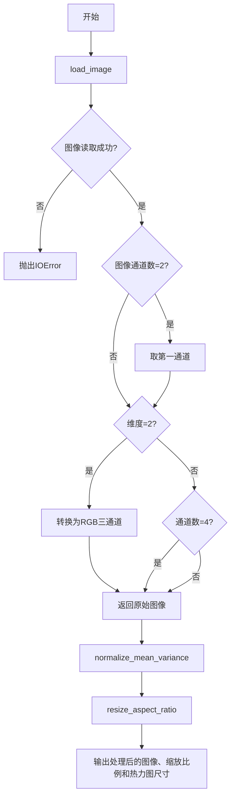
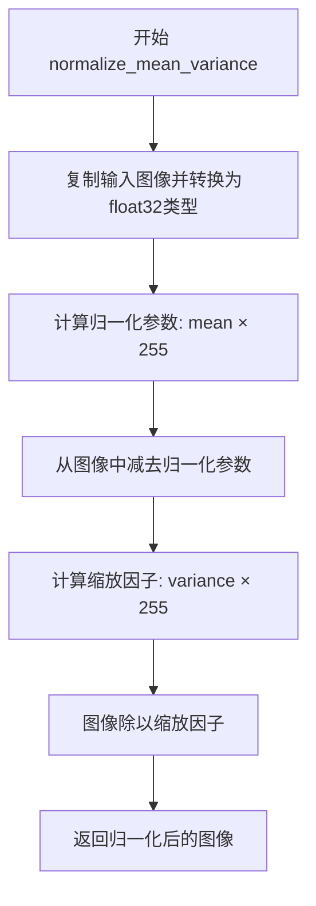
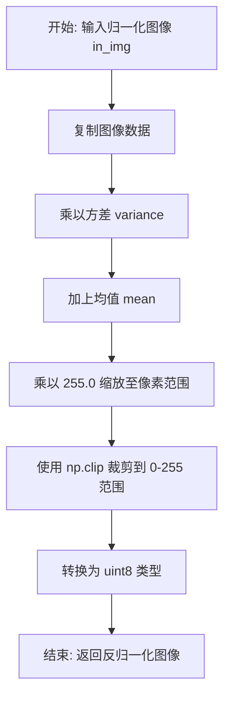

# `comic-translate\modules\ocr\pororo\pororo\models\brainOCR\imgproc.py` 详细设计文档

该文件是CRAFT文本检测模型的图像预处理模块，提供了图像加载、归一化、反归一化和保持纵横比的图像缩放等功能，主要用于将输入图像转换为模型所需的格式。

## 整体流程



## 类结构

```
模块: imgproc (无类定义)
├── 全局函数
│   ├── load_image
│   ├── normalize_mean_variance
│   ├── denormalize_mean_variance
│   └── resize_aspect_ratio
```

## 全局变量及字段


### `img_file`
    
图像文件路径

类型：`str`
    


### `img`
    
图像数据数组

类型：`np.ndarray`
    


### `mean`
    
归一化均值参数

类型：`tuple`
    


### `variance`
    
归一化方差参数

类型：`tuple`
    


### `in_img`
    
输入图像数组

类型：`np.ndarray`
    


### `square_size`
    
目标正方形尺寸

类型：`int`
    


### `interpolation`
    
插值模式

类型：`int`
    


### `mag_ratio`
    
放大比例

类型：`float`
    


### `height`
    
图像高度

类型：`int`
    


### `width`
    
图像宽度

类型：`int`
    


### `channel`
    
通道数

类型：`int`
    


### `target_size`
    
目标尺寸

类型：`float`
    


### `ratio`
    
缩放比例

类型：`float`
    


### `target_h`
    
目标高度

类型：`int`
    


### `target_w`
    
目标宽度

类型：`int`
    


### `proc`
    
处理后的图像

类型：`np.ndarray`
    


### `target_h32`
    
32对齐后的目标高度

类型：`int`
    


### `target_w32`
    
32对齐后的目标宽度

类型：`int`
    


### `resized`
    
调整大小后的图像数组

类型：`np.ndarray`
    


### `size_heatmap`
    
热图尺寸

类型：`tuple`
    


    

## 全局函数及方法


### `load_image`

该函数负责加载图像文件并进行必要的预处理，包括读取图像、处理灰度图转换为RGB三通道、处理透明度通道，以及确保输出为标准的RGB格式。

参数：

-  `img_file`：`str`，图像文件的路径，用于指定要加载的图像文件

返回值：`np.ndarray`，处理后的RGB图像数组，形状为 (height, width, 3)，类型为numpy数组

#### 流程图

```mermaid
flowchart TD
    A[开始] --> B[读取图像文件 img_file]
    B --> C{图像是否读取成功?}
    C -->|否| D[抛出IOError异常]
    C -->|是| E{图像形状是否为2?}
    E -->|是| F[取第一张图像 img = img[0]]
    E -->|否| G{是否为灰度图?}
    F --> G
    G -->|是| H[转换为RGB: np.stack([img, img, img], axis=2)]
    G -->|否| I{是否有4通道?}
    H --> J
    I -->|是| K[移除alpha通道: img[:, :, :3]]
    I -->|否| J
    K --> J
    J --> L[返回处理后的图像]
    D --> M[结束 - 抛出异常]
    L --> M
```

#### 带注释源码

```python
def load_image(img_file):
    """
    加载图像文件并进行预处理
    
    参数:
        img_file: 图像文件路径
    
    返回:
        处理后的RGB图像数组
    """
    # 使用imkit库读取图像文件
    img = imk.read_image(img_file)

    # 检查图像是否成功读取，如果读取失败则抛出IOError异常
    if img is None:
        raise IOError(f"Could not read image file: {img_file}")

    # 如果图像形状的第一维为2（可能是双通道图像），取第一张图像
    if img.shape[0] == 2: 
        img = img[0]
    
    # 如果图像是灰度图（2维数组），转换为RGB三通道图像
    if len(img.shape) == 2: # Convert grayscale to RGB
        img = np.stack([img, img, img], axis=2)
    
    # 如果图像有4个通道（RGBA），移除alpha通道，只保留RGB三通道
    if img.shape[2] == 4: # cv2.imread strips the alpha channel by default
        img = img[:, :, :3]
    
    # 返回处理后的标准RGB图像
    return img
```


### `normalize_mean_variance`

该函数用于对输入图像进行均值方差归一化处理（也称为标准化或z-score标准化），通常用于深度学习模型的预处理阶段，将图像像素值转换为模型期望的分布形式。

参数：

- `in_img`：`np.ndarray`，输入的RGB图像数据
- `mean`：`tuple`，RGB三个通道的均值，默认为(0.485, 0.456, 0.406)（ImageNet数据集的均值）
- `variance`：`tuple`，RGB三个通道的方差，默认为(0.229, 0.224, 0.225)（ImageNet数据集的标准差）

返回值：`np.ndarray`，归一化后的图像数组，数据类型为np.float32

#### 流程图



#### 带注释源码

```python
def normalize_mean_variance(
    in_img,                          # 输入的RGB图像 numpy 数组
    mean=(0.485, 0.456, 0.406),      # ImageNet 数据集 RGB 通道均值
    variance=(0.229, 0.224, 0.225), # ImageNet 数据集 RGB 通道标准差
):
    """
    对输入图像进行均值方差归一化（Z-Score 标准化）
    
    公式: normalized_img = (img - mean * 255) / (variance * 255)
    这与 PyTorch 的 normalize 操作等效
    """
    # 确保输入图像为 RGB 格式（调用方负责）
    # 创建图像副本并转换为 float32 以保证计算精度
    img = in_img.copy().astype(np.float32)

    # 第一步：减去均值（Mean Subtraction）
    # 将均值转换为 0-255 范围并构建数组
    img -= np.array(
        [mean[0] * 255.0, mean[1] * 255.0, mean[2] * 255.0],
        dtype=np.float32
    )

    # 第二步：除以标准差（Variance Scaling）
    # 将方差转换为 0-255 范围，实现标准化的缩放
    img /= np.array(
        [variance[0] * 255.0, variance[1] * 255.0, variance[2] * 255.0],
        dtype=np.float32,
    )
    
    # 返回归一化后的图像，值域近似为 [-1, 1] 范围
    return img
```


### `denormalize_mean_variance`

该函数是图像归一化的逆操作，将经过归一化处理的图像数据（均值为0、标准差为1的分布）反变换回原始的像素值范围（0-255），常用于深度学习推理后将预测结果转换为可视化图像。

参数：

- `in_img`：`np.ndarray`，输入的归一化图像数据，通常是经过 normalize_mean_variance 处理后的浮点类型图像
- `mean`：`tuple`，均值，用于反归一化计算，默认值为 (0.485, 0.456, 0.406)，对应 ImageNet 数据集的均值
- `variance`：`tuple`，方差，用于反归一化计算，默认值为 (0.229, 0.224, 0.225)，对应 ImageNet 数据集的标准差

返回值：`np.ndarray`，反归一化后的图像，像素值范围在 0-255 之间，数据类型为 uint8

#### 流程图



#### 带注释源码

```python
def denormalize_mean_variance(
        in_img,
        mean=(0.485, 0.456, 0.406),
        variance=(0.229, 0.224, 0.225),
):
    """
    反归一化图像，将归一化后的数据转换回原始像素值范围
    
    参数:
        in_img: 输入的归一化图像数组
        mean: ImageNet 数据集的均值向量
        variance: ImageNet 数据集的方差向量
    
    返回:
        反归一化后的图像，uint8 类型，值域 [0, 255]
    """
    # should be RGB order
    img = in_img.copy()  # 复制输入图像，避免修改原数据
    img *= variance      # 第一步：乘以方差（对应归一化时的除法）
    img += mean          # 第二步：加上均值（对应归一化时的减法）
    img *= 255.0         # 第三步：缩放至 0-255 范围
    img = np.clip(img, 0, 255).astype(np.uint8)  # 第四步：裁剪超出范围的值并转换为整数类型
    return img
```


### `resize_aspect_ratio`

该函数用于保持图像宽高比地将图像调整到指定尺寸，同时确保调整后的尺寸是32的倍数（便于后续神经网络处理），并返回调整后的图像、缩放比例和热图尺寸。

参数：

- `img`：`np.ndarray`，输入的RGB图像
- `square_size`：`int`，目标尺寸的最大边界值
- `interpolation`：`int`，图像缩放使用的插值方式（如cv2.INTER_LINEAR）
- `mag_ratio`：`float`，图像放大比例，默认为1.0

返回值：`tuple`，包含三个元素：
- `resized`：`np.ndarray`，调整大小后的图像（32对齐）
- `ratio`：`float`，实际应用的缩放比例
- `size_heatmap`：`tuple`，热图尺寸（目标宽/2，目标高/2）

#### 流程图

```mermaid
flowchart TD
    A[开始] --> B[获取图像高度、宽度、通道数]
    B --> C[计算目标尺寸: mag_ratio × max(height, width)]
    C --> D{目标尺寸 > square_size?}
    D -->|是| E[target_size = square_size]
    D -->|否| F
    E --> F[计算缩放比例: target_size / max(height, width)]
    F --> G[计算目标高宽: int(height × ratio), int(width × ratio)]
    G --> H[调用imk.resize调整图像大小]
    H --> I{目标高度是否32的倍数?}
    I -->|否| J[target_h32 = target_h + (32 - target_h % 32)]
    I -->|是| K
    J --> K{目标宽度是否32的倍数?}
    K -->|否| L[target_w32 = target_w + (32 - target_w % 32)]
    K -->|是| M
    L --> M[创建零填充画布 target_h32 × target_w32]
    M --> N[将调整后的图像粘贴到画布左上角]
    N --> O[计算热图尺寸: (target_w/2, target_h/2)]
    O --> P[返回resized, ratio, size_heatmap]
```

#### 带注释源码

```python
def resize_aspect_ratio(
    img: np.ndarray,
    square_size: int,
    interpolation: int,
    mag_ratio: float = 1.0,
):
    """
    保持宽高比调整图像大小，并确保尺寸对齐到32的倍数
    
    参数:
        img: 输入的RGB图像数组
        square_size: 目标尺寸的最大边界
        interpolation: 插值方式
        mag_ratio: 图像放大比例
    
    返回:
        调整后的图像、缩放比例、热图尺寸
    """
    # 获取输入图像的尺寸信息
    height, width, channel = img.shape

    # 根据放大比例计算目标尺寸（取长边作为基准）
    target_size = mag_ratio * max(height, width)

    # 如果目标尺寸超过指定的最大尺寸，则限制为目标尺寸
    if target_size > square_size:
        target_size = square_size

    # 计算缩放比例（相对于原始图像的长边）
    ratio = target_size / max(height, width)

    # 计算调整后的目标高宽
    target_h, target_w = int(height * ratio), int(width * ratio)
    
    # 调用imkit库进行图像缩放
    proc = imk.resize(img, (target_w, target_h), mode=interpolation)

    # 调整目标尺寸到32的倍数（便于后续神经网络处理）
    target_h32, target_w32 = target_h, target_w
    if target_h % 32 != 0:
        target_h32 = target_h + (32 - target_h % 32)
    if target_w % 32 != 0:
        target_w32 = target_w + (32 - target_w % 32)
    
    # 创建零填充画布并将调整后的图像粘贴到左上角
    resized = np.zeros((target_h32, target_w32, channel), dtype=np.float32)
    resized[0:target_h, 0:target_w, :] = proc
    
    # 更新最终尺寸
    target_h, target_w = target_h32, target_w32

    # 计算热图尺寸（通常是调整后尺寸的一半）
    size_heatmap = (int(target_w / 2), int(target_h / 2))

    # 返回调整后的图像、缩放比例和热图尺寸
    return resized, ratio, size_heatmap
```

## 关键组件


### 图像加载组件

负责从文件系统中读取图像并进行预处理，包括处理灰度图像和Alpha通道，确保输出标准RGB格式的三通道图像。

### 图像归一化组件

使用ImageNet标准的均值和方差对输入图像进行标准化处理，将像素值转换到统一的数值范围，便于深度学习模型处理。

### 图像反归一化组件

将经过归一化处理的图像数据还原为原始像素值范围，支持可视化或其他需要恢复原始数值分布的场景。

### 图像缩放组件

实现保持宽高比的图像缩放功能，将图像调整到指定大小并填充至32的倍数以满足网络输入要求，同时返回缩放比例和热力图尺寸信息。


## 问题及建议


### 已知问题

-   **硬编码的魔法数字**：`resize_aspect_ratio` 函数中的 `32` 是硬编码的分割值，没有任何解释或参数化，导致该函数缺乏灵活性和可配置性。
-   **输入验证不足**：`load_image` 仅检查 `img is None`，但未验证图像形状是否符合预期（如通道数 > 0）；`resize_aspect_ratio` 的 `interpolation` 参数没有有效性检查。
-   **缺少类型提示**：除 `resize_aspect_ratio` 外，其他全局函数均缺少类型注解，降低了代码的可读性和静态分析能力。
-   **重复计算逻辑**：`normalize_mean_variance` 和 `denormalize_mean_variance` 中均包含 `mean` 和 `variance` 到数组的转换逻辑，存在重复代码。
-   **文档字符串缺失**：所有函数均无文档字符串，无法快速了解函数用途、参数含义和返回值说明。
-   **边界条件未处理**：`resize_aspect_ratio` 中 `mag_ratio <= 0` 或 `height/width` 为 0 时可能导致异常或不符合预期的行为。
-   **内存效率问题**：`load_image` 中 `np.stack([img, img, img], axis=2)` 创建了3份图像副本；`resize_aspect_ratio` 中分配了可能大于实际需求的零数组。
-   **依赖隐蔽**：`imk` 模块作为全局依赖，其接口契约不明确（如 `read_image` 可能返回的类型、`resize` 的参数约束），增加了维护风险。

### 优化建议

-   将 `32` 提取为模块级常量（如 `DIVISIBLE因子 = 32`），并为 `resize_aspect_ratio` 添加可选的分割参数。
-   为所有函数添加完整的类型注解和文档字符串，包括参数说明、返回值描述和异常说明。
-   增加输入验证逻辑：检查图像维度有效性、验证 `interpolation` 参数在允许范围内、处理 `mag_ratio` 不大于0的边界情况。
-   提取 `mean`/`variance` 数组转换逻辑为辅助函数，减少重复代码。
-   考虑使用 `np.tile` 替代 `np.stack` 进行灰度到RGB的转换，或在必要时使用视图操作减少内存复制。
-   明确 `imk` 模块的接口契约，添加类型定义或接口检查。
-   考虑将默认的 `mean` 和 `variance` 值提取为模块级常量，便于统一管理和配置。


## 其它


### 设计目标与约束

**设计目标**：
- 实现图像加载、归一化、反归一化和自适应尺寸调整的完整处理流程
- 支持多种图像格式（灰度、RGB、RGBA）的统一处理
- 确保输出图像尺寸为32的倍数，满足下游神经网络模型（如CRAFT）的输入要求

**设计约束**：
- 输入图像必须是numpy.ndarray格式
- 图像通道顺序为RGB（而非OpenCV默认的BGR）
- 目标尺寸必须为32的倍数（用于模型下采样）
- 归一化使用ImageNet标准均值(0.485, 0.456, 0.406)和方差(0.229, 0.224, 0.225)
- 最大边调整后不能超过square_size参数

### 错误处理与异常设计

**异常类型**：
- `IOError`：当`imk.read_image`无法读取图像文件时抛出，错误信息包含文件名
- 隐式假设：`imk.read_image`返回None表示读取失败，其他错误由底层库处理

**边界条件处理**：
- 灰度图像自动转换为3通道RGB
- RGBA图像自动丢弃Alpha通道
- 调整后尺寸自动补齐至32的倍数

### 数据流与状态机

**数据转换流程**：
```
输入文件 → imk.read_image() → 灰度/RGBA处理 → normalize_mean_variance() → 模型输入
                                            ↓
                                    resize_aspect_ratio() → 32倍对齐 → heatmap尺寸计算
                                            ↓
                                    denormalize_mean_variance() → 可视化输出
```

**状态转换**：
1. 原始图像 → 预处理图像（类型标准化）
2. 预处理图像 → 归一化图像（数值标准化）
3. 归一化图像 → 调整尺寸图像（空间标准化）

### 外部依赖与接口契约

**外部依赖**：
- `numpy`：数值计算和数组操作
- `imkit`：图像读写和resize操作（第三方库，接口稳定）

**接口契约**：
- `load_image(img_file)`：输入图像路径，返回HWC格式numpy数组
- `normalize_mean_variance(in_img, mean, variance)`：输入float32数组，返回归一化后的float32数组
- `denormalize_mean_variance(in_img, mean, variance)`：输入归一化数组，返回uint8可视化数组
- `resize_aspect_ratio(img, square_size, interpolation, mag_ratio)`：返回(resized_img, ratio, size_heatmap)三元组

### 配置参数说明

**归一化参数**：
- 均值：mean=(0.485, 0.456, 0.406)，对应ImageNet数据集RGB通道均值
- 方差：variance=(0.229, 0.224, 0.225)，对应ImageNet数据集RGB通道标准差

**尺寸调整参数**：
- square_size：画布最大尺寸，默认值取决于调用方
- mag_ratio：图像放大倍数，默认1.0（不放大）
- interpolation：插值方式，由imk库定义（通常对应cv2.INTER_*）

### 性能考虑

**计算复杂度**：
- 归一化：O(n)，n为像素数
- 尺寸调整：O(n)，n为输出像素数
- 内存占用：图像数据副本，可能存在2-3倍峰值内存

**优化建议**：
- 可考虑in-place操作减少内存（当前实现为安全起见使用copy）
- 大批量处理时可考虑预分配zero数组

### 测试策略建议

**单元测试**：
- 测试灰度、RGB、RGBA图像加载
- 测试归一化/反归一化数学正确性
- 测试各种尺寸调整场景（32倍数、非32倍数、放大、缩小）

**边界测试**：
- 空图像、单像素图像
- 极大尺寸图像（内存溢出风险）
- 损坏图像文件


    