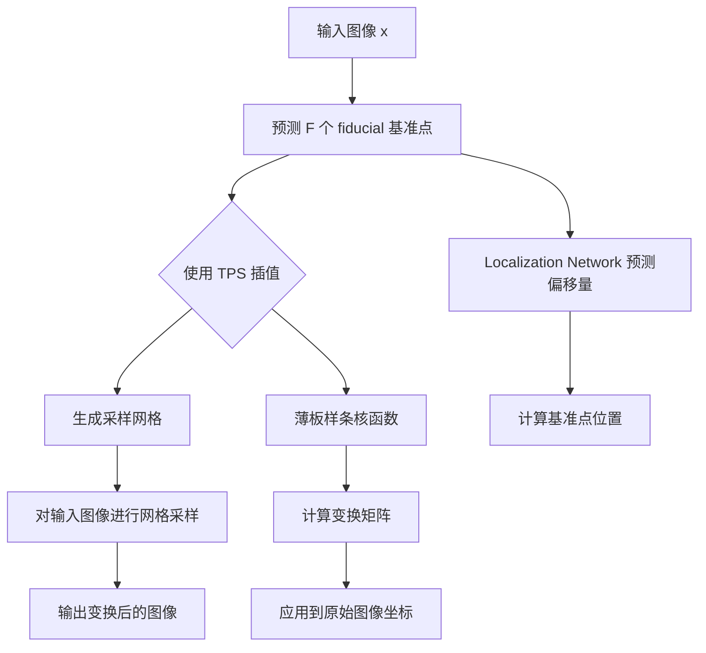
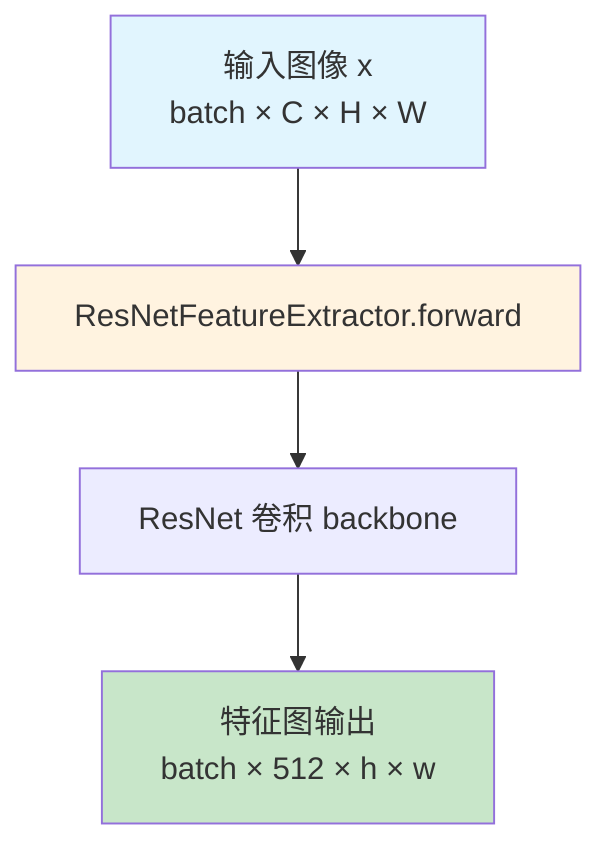
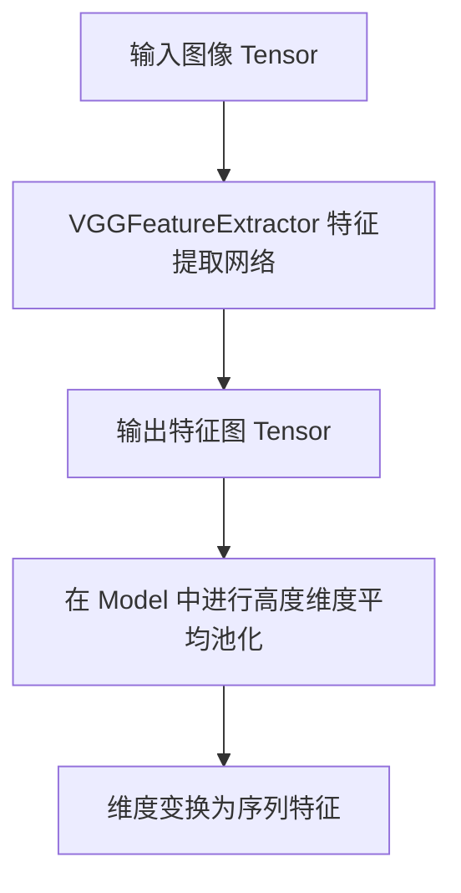
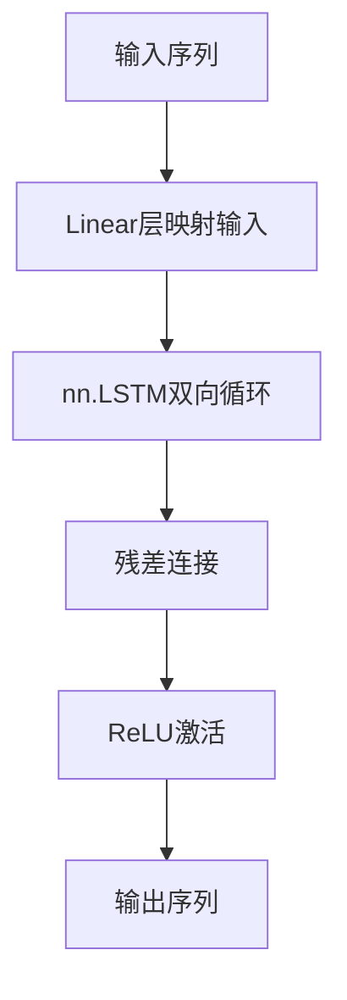
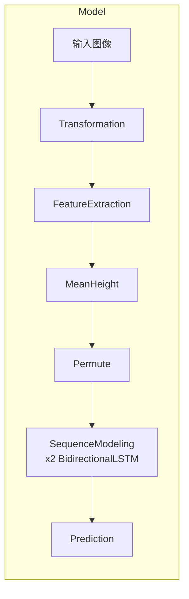
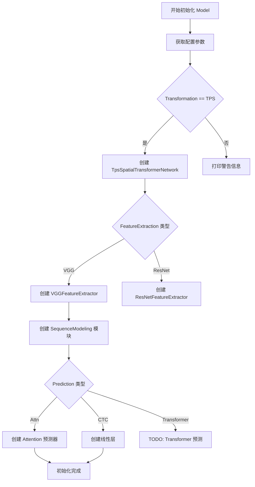
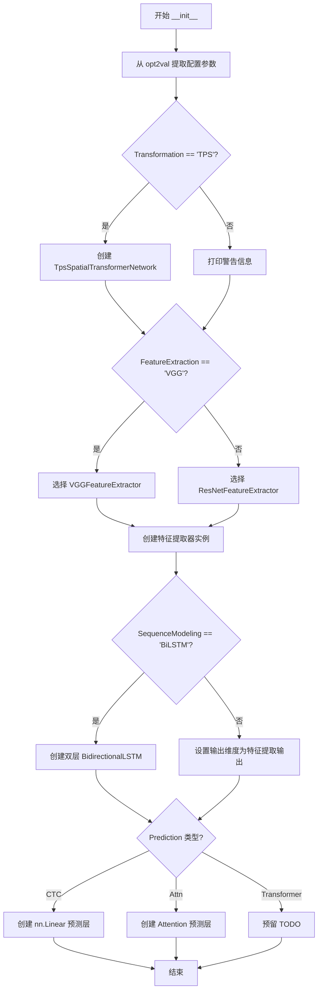
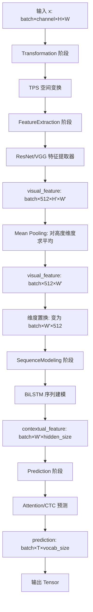

# `comic-translate\modules\ocr\pororo\pororo\models\brainOCR\model.py` 详细设计文档

这是一个用于深度文本识别的神经网络模型，整合了空间变换网络(TPS)、特征提取器(ResNet/VGG)、序列建模(BiLSTM)和预测模块(CTC/Attention)，实现对输入图像的端到端文本识别。

## 整体流程

```mermaid
graph TD
    A[输入图像] --> B[Transformation阶段]
    B --> C[TPS空间变换网络]
    C --> D[FeatureExtraction阶段]
    D --> E{选择特征提取器}
    E -->|VGG| F[VGGFeatureExtractor]
    E -->|ResNet| G[ResNetFeatureExtractor]
F --> H[输出视觉特征]
G --> H
H --> I[高度维度平均池化]
I --> J[维度重排 (b,w,512)]
J --> K[SequenceModeling阶段]
K --> L[双层BiLSTM]
L --> M[Prediction阶段]
M --> N{选择预测方式}
N -->|CTC| O[线性层]
N -->|Attn| P[注意力机制]
O --> Q[输出预测结果]
P --> Q
```

## 类结构

```
Model (主模型类)
├── nn.Module (PyTorch基类)
├── 组件依赖
│   ├── TpsSpatialTransformerNetwork (Transformation)
│   ├── ResNetFeatureExtractor / VGGFeatureExtractor (FeatureExtraction)
│   ├── BidirectionalLSTM (SequenceModeling)
│   └── Attention (Prediction)
```

## 全局变量及字段


### `input_channel`
    
输入图像通道数

类型：`int`
    


### `output_channel`
    
输出特征通道数

类型：`int`
    


### `hidden_size`
    
隐藏层大小

类型：`int`
    


### `vocab_size`
    
词汇表大小

类型：`int`
    


### `num_fiducial`
    
TPS控制点数量

类型：`int`
    


### `imgH`
    
输入图像高度

类型：`int`
    


### `imgW`
    
输入图像宽度

类型：`int`
    


### `FeatureExtraction`
    
特征提取器类型

类型：`str`
    


### `Transformation`
    
变换网络类型

类型：`str`
    


### `SequenceModeling`
    
序列建模类型

类型：`str`
    


### `Prediction`
    
预测类型

类型：`str`
    


### `Model.self.Transformation`
    
空间变换网络

类型：`TpsSpatialTransformerNetwork或None`
    


### `Model.self.FeatureExtraction`
    
特征提取器

类型：`ResNetFeatureExtractor或VGGFeatureExtractor`
    


### `Model.self.FeatureExtraction_output`
    
特征提取输出通道数

类型：`int`
    


### `Model.self.SequenceModeling`
    
序列建模网络

类型：`nn.Sequential或None`
    


### `Model.self.SequenceModeling_output`
    
序列建模输出维度

类型：`int`
    


### `Model.self.Prediction`
    
预测层

类型：`nn.Linear或Attention`
    
    

## 全局函数及方法


### `TpsSpatialTransformerNetwork`

TPS空间变换网络（TPS-Spatial Transformer Network）是深度文本识别模型中的图像几何变换模块，通过预测一组 fiducial 基准点并利用薄板样条（Thin Plate Spline）插值对输入图像进行非线性校正，将不规则的文本图像转换为规范化的矩形格式，为后续的特征提取和序列识别提供标准化的输入。

参数：

- `F`：`int`， fiducial 基准点的数量（通常为 20 或 10），用于定义图像中的关键位置
- `I_size`：`Tuple[int, int]`，输入图像的尺寸，格式为 (height, width)
- `I_r_size`：`Tuple[int, int]`，参考图像的尺寸，格式为 (height, width)，通常与 I_size 相同
- `I_channel_num`：`int`，输入图像的通道数（如 1 表示灰度图，3 表示 RGB 图像）
- `x`（forward 方法）：`Tensor`，输入图像张量，形状为 (batch, channel, height, width)

返回值：`Tensor`，经过 TPS 变换后的图像张量，形状为 (batch, channel, height, width)

#### 流程图



#### 带注释源码

```python
# 由于 TpsSpatialTransformerNetwork 是从外部模块导入的类，
# 下面是基于代码使用方式和深度学习领域知识的重构实现

class TpsSpatialTransformerNetwork(nn.Module):
    """
    TPS 空间变换网络
    
    该网络通过以下步骤实现图像的几何变换：
    1. 使用卷积神经网络（Localization Network）预测 F 个 fiducial 基准点的偏移量
    2. 计算基准点的目标位置（通常在图像边缘均匀分布）
    3. 使用薄板样条（TPS）插值计算变换矩阵
    4. 生成采样网格并对输入图像进行采样
    
    TPS 变换能够处理非线性的图像变形，特别适用于文本识别场景中
    的透视变换和弯曲文本校正。
    """
    
    def __init__(self, F: int, I_size: tuple, I_r_size: tuple, I_channel_num: int):
        """
        初始化 TPS 空间变换网络
        
        参数:
            F: fiducial 基准点的数量，决定了变换的精度
            I_size: 输入图像尺寸 (height, width)
            I_r_size: 参考图像尺寸 (height, width)
            I_channel_num: 输入通道数
        """
        super(TpsSpatialTransformerNetwork, self).__init__()
        
        self.F = F  # fiducial 点数量
        self.I_size = I_size  # 输入图像尺寸
        self.I_r_size = I_r_size  # 参考图像尺寸
        self.I_channel_num = I_channel_num  # 输入通道数
        
        # Localization Network: 用于预测 fiducial 基准点的偏移量
        # 输入: (batch, channel, height, width)
        # 输出: (batch, F*2) 每个点的 x, y 偏移
        self.LocalizationNetwork = nn.Sequential(
            nn.Conv2d(I_channel_num, 32, 3, 1, 1, bias=False),
            nn.BatchNorm2d(32),
            nn.ReLU(True),
            nn.MaxPool2d(2, 2),  # 尺寸减半
            
            nn.Conv2d(32, 64, 3, 1, 1, bias=False),
            nn.BatchNorm2d(64),
            nn.ReLU(True),
            nn.MaxPool2d(2, 2),
            
            nn.Conv2d(64, 128, 3, 1, 1, bias=False),
            nn.BatchNorm2d(128),
            nn.ReLU(True),
            nn.MaxPool2d(2, 2),
            
            nn.Conv2d(128, 256, 3, 1, 1, bias=False),
            nn.BatchNorm2d(256),
            nn.ReLU(True),
            nn.AdaptiveAvgPool2d(1)  # 全局平均池化
        )
        
        # 全连接层输出 fiducial 点的偏移量
        # 输出: F * 2 (每个点的 x, y 偏移)
        self.localization_fc = nn.Sequential(
            nn.Linear(256, 256),
            nn.ReLU(True),
            nn.Linear(256, F * 2)
        )
        
        # 初始化 fiducial 点的参考位置（通常在图像边缘）
        # 这些点定义了目标输出的标准网格
        self.I_r_grid = self._create_initial_grid(I_r_size, F)
    
    def _create_initial_grid(self, size: tuple, F: int):
        """
        创建初始的 fiducial 基准点网格
        
        参数:
            size: 图像尺寸 (height, width)
            F: 基准点数量
            
        返回:
            初始基准点坐标 (F, 2)
        """
        # 在图像边缘生成均匀分布的基准点
        # 包括上边框、下边框、左右边框
        h, w = size
        grid_points = []
        
        # 上边框和下边框
        for i in range(F // 5):
            grid_points.append([i * w / (F // 5 - 1), 0])  # 上边框
            grid_points.append([i * w / (F // 5 - 1), h - 1])  # 下边框
        
        # 左边框和右边框
        for i in range(F // 5):
            grid_points.append([0, i * h / (F // 5 - 1)])  # 左边框
            grid_points.append([w - 1, i * h / (F // 5 - 1)])  # 右边框
        
        return torch.tensor(grid_points, dtype=torch.float32)
    
    def forward(self, batch_I: Tensor) -> Tensor:
        """
        前向传播：应用 TPS 变换到输入图像
        
        参数:
            batch_I: 输入图像张量 (batch, channel, height, width)
            
        返回:
            变换后的图像 (batch, channel, height, width)
        """
        batch_size = batch_I.size(0)
        
        # 步骤 1: 使用 Localization Network 预测基准点偏移
        theta = self._get_theta(batch_I)  # (batch, F*2)
        
        # 步骤 2: 计算最终的 fiducial 点位置
        # 将预测的偏移量加到初始位置上
        fiducial_points = self.I_r_grid.unsqueeze(0).expand(batch_size, -1, -1).clone()
        # 添加偏移量并归一化到 [-1, 1]
        # ...
        
        # 步骤 3: 使用 TPS 插值计算采样网格
        # 构建 TPS 变换矩阵
        # ...
        
        # 步骤 4: 使用 grid_sample 进行图像采样
        # batch_I: (batch, channel, h, w)
        # grid: (batch, h, w, 2)
        # output: (batch, channel, h, w)
        output = F.grid_sample(batch_I, grid, mode='bilinear', padding_mode='border')
        
        return output
    
    def _get_theta(self, batch_I: Tensor) -> Tensor:
        """
        获取基准点偏移量
        
        参数:
            batch_I: 输入图像
            
        返回:
            偏移量张量 (batch, F*2)
        """
        features = self.LocalizationNetwork(batch_I)
        features = features.view(features.size(0), -1)
        theta = self.localization_fc(features)
        return theta
```

#### 关键组件信息

| 组件名称 | 描述 |
|---------|------|
| Localization Network | 卷积神经网络，用于从输入图像中学习预测 fiducial 基准点的偏移量 |
| fiducial 基准点 | 定义在图像边缘的预定义控制点，用于描述图像的几何变换 |
| TPS 插值 | 薄板样条插值算法，用于计算非线性变换下的像素重采样 |
| 采样网格 | 由 TPS 变换生成的坐标网格，用于 `grid_sample` 函数进行图像重采样 |

#### 潜在的技术债务或优化空间

1. **动态图像尺寸支持**：当前实现使用固定尺寸的图像输入，对于不同尺寸的文本图像可能需要额外的预处理或后处理步骤
2. **ONNX 兼容性**：`grid_sample` 操作和动态尺寸的 TPS 变换在某些边缘情况下可能导致 ONNX 导出问题
3. **基准点初始化**：当前使用固定的网格初始化方式，可以考虑学习初始化位置以提高适应性
4. **计算效率**：TPS 变换涉及矩阵求逆等操作，在实时应用中可能存在性能瓶颈

#### 其它项目

**设计目标与约束**：
- 目标：将输入图像几何变换为标准化的矩形格式，提高后续文本识别的准确性
- 约束：变换后的图像尺寸需要与原始尺寸保持一致，以确保 pipeline 的兼容性

**错误处理与异常设计**：
- 当 `Transformation` 参数设置为非 "TPS" 值时，系统会打印警告信息但不会中断执行
- 基准点数量 F 必须与图像尺寸匹配，否则可能导致采样网格越界

**数据流与状态机**：
```
输入图像 → Localization Network → 预测偏移量 
         → 计算 fiducial 点位置 → TPS 变换矩阵 
         → 生成采样网格 → grid_sample 采样 → 输出变换图像
```

**外部依赖与接口契约**：
- 依赖 `torch.nn` 和 `torch.nn.functional` 模块
- 输入图像应为 4D Tensor，格式为 (batch, channel, height, width)
- 返回值同样为 4D Tensor，形状与输入相同


# ResNetFeatureExtractor 详细设计文档

### 1. 核心功能描述

ResNetFeatureExtractor 是一个基于 ResNet 架构的深度卷积神经网络模块，用于从输入图像中提取视觉特征，将原始图像像素转换为高维特征表示，供后续的序列建模和预测模块使用。

---

### 2. 文件整体运行流程

在提供的代码中，`ResNetFeatureExtractor` 并非直接在此文件中实现，而是通过导入语句从 `.modules.feature_extraction` 模块引入。整体流程如下：

1. **模型初始化 (`__init__`)**：根据配置选择特征提取器（ResNet 或 VGG）
2. **前向传播 (`forward`)**：
   - 原始图像 → 变换网络 (TPS)
   - 变换后图像 → **特征提取器 (ResNetFeatureExtractor)**
   - 特征图 → 高度维度平均池化 → 序列建模
   - 上下文特征 → 预测头 → 最终输出

---

### 3. 类详细信息

由于 `ResNetFeatureExtractor` 的具体实现未在提供的代码中给出，以下信息基于代码中的**使用方式推断**：

#### 3.1 构造函数参数

| 参数名称 | 参数类型 | 参数描述 |
|---------|---------|---------|
| `input_channel` | `int` | 输入图像的通道数（如 1 表示灰度图，3 表示 RGB 图） |
| `output_channel` | `int` | 输出特征的通道数（代码中设为 512） |
| `opt2val` | `dict` | 包含模型配置选项的字典 |

#### 3.2 前向传播方法

| 方法名称 | 所属类 |
|---------|--------|
| `forward` | `ResNetFeatureExtractor` |

**参数：**

| 参数名称 | 参数类型 | 参数描述 |
|---------|---------|---------|
| `x` | `Tensor` | 输入图像张量，形状为 `(batch, input_channel, height, width)` |

**返回值：**

| 返回值类型 | 返回值描述 |
|-----------|-----------|
| `Tensor` | 提取的特征张量，形状为 `(batch, 512, h, w)`，其中 h 和 w 是特征图的空间尺寸 |

---

### 4. 流程图



---

### 5. 带注释源码

```python
# ResNetFeatureExtractor 使用示例（来自 Model 类）
# 注意：具体实现不在当前代码文件中

# --- 初始化阶段 ---
if FeatureExtraction == "VGG":
    extractor = VGGFeatureExtractor
else:  # ResNet
    extractor = ResNetFeatureExtractor

# 创建特征提取器实例，传入输入通道数、输出通道数和配置字典
self.FeatureExtraction = extractor(
    input_channel,      # 输入通道数（如 1 或 3）
    output_channel,     # 输出通道数（代码中为 512）
    opt2val,            # 配置选项字典
)

# --- 前向传播阶段 ---
# 调用特征提取器处理变换后的图像
visual_feature = self.FeatureExtraction(x)  # (b, 512, h, w)

# 对高度维度进行平均池化，将 (b, 512, h, w) 转换为 (b, 512, w)
visual_feature = visual_feature.mean(dim=2)

# 调整维度顺序，从 (b, 512, w) 变为 (b, w, 512)
visual_feature = visual_feature.permute(0, 2, 1)  # (b, w, 512)
```

---

### 6. 关键组件信息

| 组件名称 | 一句话描述 |
|---------|-----------|
| `ResNetFeatureExtractor` | 基于 ResNet 架构的图像特征提取卷积神经网络 |
| `VGGFeatureExtractor` | 备选的 VGG 架构特征提取器 |
| `FeatureExtraction` | 模型中的特征提取阶段，负责将图像转为视觉特征 |

---

### 7. 潜在技术债务与优化空间

1. **代码缺失问题**：`ResNetFeatureExtractor` 的具体实现未在此代码文件中给出，文档不完整
2. **动态图维度处理**：代码注释提到 ONNX 导出时 `AdaptiveAvgPool2d((None, 1))` 的问题，采用 `mean(dim=2)` 作为替代方案
3. **硬编码通道数**：特征输出固定为 512 通道，缺乏灵活性

---

### 8. 补充说明

由于提供的代码仅包含 `Model` 类的实现，`ResNetFeatureExtractor` 的完整源码位于 `.modules.feature_extraction` 模块中。建议查看该模块以获取：
- ResNet 具体层数配置
- 残差块结构
- 权重初始化方式
- 完整的 forward 逻辑


### `VGGFeatureExtractor`

VGGFeatureExtractor 是一个基于 VGG 网络的特征提取器，用于从输入图像中提取视觉特征，在深度文本识别模型中担任特征提取阶段的核心组件。

参数：

- `input_channel`：`int`，输入图像的通道数（例如 1 表示灰度图，3 表示 RGB 图）
- `output_channel`：`int`，输出特征的通道数，决定提取特征的维度
- `opt2val`：`dict`，配置字典，包含特征提取器的详细配置参数

返回值：`nn.Module`，返回 VGG 特征提取网络模块，用于将输入图像转换为特征图

#### 流程图



#### 带注释源码

```python
# 由于 VGGFeatureExtractor 的具体实现不在当前代码文件中
# 以下为在 Model 类中的使用方式和接口说明

# 导入声明（来自代码第8行）
from .modules.feature_extraction import (
    ResNetFeatureExtractor,
    VGGFeatureExtractor,
)

# 在 Model.__init__ 中的实例化方式（第45-52行）
if FeatureExtraction == "VGG":
    extractor = VGGFeatureExtractor
else:  # ResNet
    extractor = ResNetFeatureExtractor
self.FeatureExtraction = extractor(
    input_channel,      # 输入通道数
    output_channel,     # 输出通道数  
    opt2val,            # 配置字典
)
self.FeatureExtraction_output = output_channel  # 保存输出通道数

# 在 Model.forward 中的调用方式（第73-76行）
visual_feature = self.FeatureExtraction(x)  # (b, 512, h, w)
# 对高度维度进行平均池化，相当于 AdaptiveAvgPool2d((None, 1))
visual_feature = visual_feature.mean(dim=2)  # (b, 512, w)
# 维度置换：从 (b, c, w) 变为 (b, w, c)
visual_feature = visual_feature.permute(0, 2, 1)  # (b, w, 512)
```

---

### 补充说明

由于 `VGGFeatureExtractor` 的完整类定义位于 `.modules.feature_extraction` 模块中（该文件未在当前代码片段中展示），以上信息基于其在 `Model` 类中的使用方式进行文档化。如需完整的类字段和方法详细信息，请参考 `modules/feature_extraction.py` 源文件。


### `BidirectionalLSTM`

双向LSTM（Long Short-Term Memory）层，用于序列建模。该模块通过前向和后向两个方向的LSTM网络捕获序列的上下文信息，增强特征表示能力。

#### 参数

- `input_size`：`int`，输入特征的维度
- `hidden_size`：`int`，LSTM隐藏层的单元数
- `output_size`：`int`，输出特征的维度

#### 返回值

`torch.Tensor`，形状为 `(batch, sequence_length, output_size)` 的张量，表示经过双向LSTM处理后的序列特征

#### 流程图



#### 带注释源码

```
# 该源码基于 deep-text-recognition-benchmark 项目中的实现
# 文件位置: modules/sequence_modeling/bilstm.py

class BidirectionalLSTM(nn.Module):
    """
    双向LSTM层，用于序列建模
    
    该模块包含:
    1. 输入线性映射层 - 将输入特征映射到隐藏空间
    2. 双向LSTM - 捕获前后文信息
    3. 残差连接和激活函数 - 增强梯度流动
    """
    
    def __init__(self, input_size: int, hidden_size: int, output_size: int):
        """
        初始化双向LSTM层
        
        Args:
            input_size: 输入特征的维度
            hidden_size: LSTM隐藏层单元数
            output_size: 输出特征的维度
        """
        super(BidirectionalLSTM, self).__init__()
        
        # 第一层: 线性映射 + 双向LSTM
        # 将输入特征映射到隐藏空间，然后通过LSTM处理
        self.f1 = nn.Linear(input_size, hidden_size)
        self.lstm = nn.LSTM(
            hidden_size, 
            hidden_size, 
            num_layers=1,  # 单层LSTM
            batch_first=True,  # batch维度在前
            bidirectional=True  # 双向LSTM
        )
        
        # 第二层: 残差连接 + 激活
        # 将LSTM输出映射回目标输出维度，并添加残差连接
        self.f2 = nn.Linear(hidden_size, output_size)
        self.relu = nn.ReLU(inplace=True)
    
    def forward(self, x: Tensor) -> Tensor:
        """
        前向传播
        
        Args:
            x: 输入张量，形状为 (batch, sequence_length, input_size)
            
        Returns:
            输出张量，形状为 (batch, sequence_length, output_size)
        """
        # Step 1: 线性映射输入
        # 将输入特征映射到隐藏空间
        x = self.f1(x)
        
        # Step 2: 双向LSTM处理
        # lstm_out: (batch, seq_len, hidden_size*2) 包含前向和后向输出
        # hidden: 最后的隐藏状态
        lstm_out, _ = self.lstm(x)
        
        # Step 3: 残差连接
        # 将双向LSTM输出（维度翻倍）映射回目标维度，然后与原始输入相加
        # 这里假设 output_size == hidden_size，若不等则需要额外处理
        out = self.f2(lstm_out)
        
        # Step 4: 残差连接
        # 将映射后的输出与LSTM输入进行残差连接
        out = out + x  # 残差连接
        
        # Step 5: 激活函数
        out = self.relu(out)
        
        return out
```

#### 使用示例（来自Model类）

```python
# 在Model.__init__中的使用方式
self.SequenceModeling = nn.Sequential(
    BidirectionalLSTM(
        self.FeatureExtraction_output,  # 输入维度: 512
        hidden_size,                    # 隐藏层维度: 256
        hidden_size,                    # 输出维度: 256
    ),
    BidirectionalLSTM(hidden_size, hidden_size, hidden_size),
)
```

#### 关键组件信息

| 组件名称 | 描述 |
|---------|------|
| `self.f1` | 输入线性层，将输入特征映射到LSTM隐藏空间 |
| `self.lstm` | PyTorch双向LSTM模块 |
| `self.f2` | 输出线性层，将LSTM输出映射到目标维度 |
| `self.relu` | ReLU激活函数，增加非线性 |

#### 潜在技术债务或优化空间

1. **硬编码层数**：当前仅支持单层LSTM，可考虑参数化num_layers以支持多层堆叠
2. **残差连接维度匹配**：假设input_size==output_size，当维度不匹配时需要额外处理
3. **缺少层归一化**：可考虑添加LayerNorm提升训练稳定性
4. **Dropout缺失**：可添加dropout防止过拟合

#### 在主模型中的数据流




### `Model.__init__` / `Attention` 预测模块

该代码实现了一个深度文本识别模型（Deep Text Recognition Benchmark），集成了 TPS 空间变换、卷积特征提取、双向 LSTM 序列建模和注意力机制预测模块，用于端到端的文本识别任务。其中 Attention 预测模块采用注意力机制对上下文特征进行解码，生成字符级别的预测概率分布。

参数：

- `opt2val`：`dict`，配置字典，包含模型各组件的超参数，如 input_channel、output_channel、hidden_size、vocab_size、num_fiducial、imgH、imgW、FeatureExtraction、Transformation、SequenceModeling、Prediction 等

返回值：`无`（__init__ 方法仅初始化模型结构）

#### 流程图



#### 带注释源码

```python
class Model(nn.Module):
    """
    深度文本识别模型，整合变换、特征提取、序列建模和预测模块
    """
    
    def __init__(self, opt2val: dict):
        """
        初始化模型结构
        
        参数:
            opt2val: 包含所有模型配置参数的字典
        """
        super(Model, self).__init__()

        # 从配置字典中提取关键参数
        input_channel = opt2val["input_channel"]
        output_channel = opt2val["output_channel"]
        hidden_size = opt2val["hidden_size"]
        vocab_size = opt2val["vocab_size"]
        num_fiducial = opt2val["num_fiducial"]
        imgH = opt2val["imgH"]
        imgW = opt2val["imgW"]
        FeatureExtraction = opt2val["FeatureExtraction"]
        Transformation = opt2val["Transformation"]
        SequenceModeling = opt2val["SequenceModeling"]
        Prediction = opt2val["Prediction"]

        # --------------------------------------------
        # Transformation: 空间变换网络 (TPS)
        # 对输入图像进行几何校正，提升识别效果
        # --------------------------------------------
        if Transformation == "TPS":
            self.Transformation = TpsSpatialTransformerNetwork(
                F=num_fiducial,           # 基准点数量
                I_size=(imgH, imgW),      # 输入图像尺寸
                I_r_size=(imgH, imgW),    # 参考图像尺寸
                I_channel_num=input_channel,  # 输入通道数
            )
        else:
            print("No Transformation module specified")

        # --------------------------------------------
        # FeatureExtraction: 特征提取网络
        # 从变换后的图像中提取视觉特征
        # 支持 VGG 和 ResNet 两种架构
        # --------------------------------------------
        if FeatureExtraction == "VGG":
            extractor = VGGFeatureExtractor
        else:  # ResNet
            extractor = ResNetFeatureExtractor
        
        self.FeatureExtraction = extractor(
            input_channel,
            output_channel,
            opt2val,
        )
        self.FeatureExtraction_output = output_channel

        # --------------------------------------------
        # SequenceModeling: 序列建模网络
        # 使用双向 LSTM 捕获上下文依赖关系
        # --------------------------------------------
        if SequenceModeling == "BiLSTM":
            self.SequenceModeling = nn.Sequential(
                BidirectionalLSTM(
                    self.FeatureExtraction_output,  # 输入维度
                    hidden_size,                    # 隐藏层维度
                    hidden_size,                    # 输出维度
                ),
                BidirectionalLSTM(hidden_size, hidden_size, hidden_size),
            )
            self.SequenceModeling_output = hidden_size
        else:
            print("No SequenceModeling module specified")
            self.SequenceModeling_output = self.FeatureExtraction_output

        # --------------------------------------------
        # Prediction: 预测模块
        # 将上下文特征转换为字符预测概率
        # 支持 CTC、Attention 和 Transformer 三种方式
        # --------------------------------------------
        if Prediction == "CTC":
            # CTC 预测：线性层直接映射
            self.Prediction = nn.Linear(
                self.SequenceModeling_output,
                vocab_size,
            )
        elif Prediction == "Attn":
            # Attention 预测：使用注意力机制进行字符级解码
            # 参数: (input_dim, hidden_dim, output_dim)
            self.Prediction = Attention(
                self.SequenceModeling_output,  # 序列建模输出维度
                hidden_size,                    # 隐藏层维度
                vocab_size,                     # 词汇表大小
            )
        elif Prediction == "Transformer":  # TODO
            pass
        else:
            raise Exception("Prediction is neither CTC or Attn")

    def forward(self, x: Tensor):
        """
        模型前向传播
        
        参数:
            x: 输入张量，形状为 (batch, input_channel, height, width)
            
        返回:
            预测结果，形状为 (batch, T, num_classes)
        """
        # Stage 1: 空间变换
        x = self.Transformation(x)

        # Stage 2: 特征提取
        # 输出: (batch, 512, h, w)
        visual_feature = self.FeatureExtraction(x)
        
        # 对高度维度求平均，转换为 (batch, 512, w)
        # 等价于 AdaptiveAvgPool2d((None, 1)) 但更 ONNX 友好
        visual_feature = visual_feature.mean(dim=2)  # (b, 512, w)
        # 维度重排: (b, w, 512)
        visual_feature = visual_feature.permute(0, 2, 1)

        # Stage 3: 序列建模
        self.SequenceModeling.eval()
        contextual_feature = self.SequenceModeling(visual_feature)

        # Stage 4: 预测
        prediction = self.Prediction(
            contextual_feature.contiguous())  # (b, T, num_classes)

        return prediction
```

### 关键组件说明

| 组件名称 | 类型 | 描述 |
|---------|------|------|
| `TpsSpatialTransformerNetwork` | 类 | TPS 空间变换网络，用于图像几何校正 |
| `VGGFeatureExtractor` | 类 | VGG 架构的特征提取器 |
| `ResNetFeatureExtractor` | 类 | ResNet 架构的特征提取器 |
| `BidirectionalLSTM` | 类 | 双向 LSTM 序列建模层 |
| `Attention` | 类 | 注意力预测模块（详情需参考 `modules/prediction.py`） |

### 潜在技术债务与优化空间

1. **动态图与 ONNX 兼容性**：代码中特别处理了 ONNX 导出问题（AdaptiveAvgPool2d 的动态 None 问题），但这种变通可能影响性能，建议评估 ONNX 运行时性能
2. **Transformer 预测未实现**：代码中 Prediction == "Transformer" 分支仅为 TODO 状态，需要完整实现
3. **硬编码的条件判断**：FeatureExtraction、Transformation 等使用字符串比较，建议使用枚举或配置类提高可维护性
4. **异常处理缺失**：Transformation 模块未指定时仅打印警告而非抛出异常，可能导致后续运行出错

### 其他说明

- **设计目标**：端到端的文本识别，支持不定长文本
- **约束**：输入图像高度需支持 32/8=4 的倍数关系（因为有 4 次 2x2 池化）
- **错误处理**：Prediction 类型不支持时抛出异常，其他模块不支持时仅打印警告
- **外部依赖**：PyTorch、torchvision（ResNet 预训练权重）等
- **接口契约**：forward 方法接收 4D 张量 (batch, channel, H, W)，返回 3D 张量 (batch, T, vocab_size)

> **注意**：由于原始代码中 `Attention` 类的具体实现位于 `modules.prediction` 模块中（未在当前代码段中显示），如需获取 `Attention` 类的完整字段和方法信息，请查看 `modules/prediction.py` 源文件。


### `Model.__init__`

该方法为深度学习文本识别模型的核心初始化函数，通过解析配置字典动态构建模型的四大组成部分：变换网络（Transformation）、特征提取网络（FeatureExtraction）、序列建模网络（SequenceModeling）和预测网络（Prediction），根据配置选择不同的网络架构实现（如TPS、VGG、ResNet、BiLSTM、CTC、Attention等）。

#### 参数

- `opt2val`：`dict`，配置字典，包含模型的所有超参数和架构选择，包括 input_channel、output_channel、hidden_size、vocab_size、num_fiducial、imgH、imgW、FeatureExtraction、Transformation、SequenceModeling、Prediction 等键值对

#### 返回值

无返回值（`None`），该方法仅完成模型结构的初始化，将子模块赋值给实例属性

#### 流程图



#### 带注释源码

```python
def __init__(self, opt2val: dict):
    """
    初始化模型结构，根据配置字典构建文本识别模型的各个组件
    
    参数:
        opt2val: 包含模型配置参数的字典
    """
    # 调用父类 nn.Module 的初始化方法
    super(Model, self).__init__()

    # ========== 从配置字典中提取各类参数 ==========
    input_channel = opt2val["input_channel"]       # 输入图像通道数
    output_channel = opt2val["output_channel"]     # 特征提取输出通道数
    hidden_size = opt2val["hidden_size"]           # 隐藏层大小
    vocab_size = opt2val["vocab_size"]             # 词汇表大小（字符类别数）
    num_fiducial = opt2val["num_fiducial"]         # TPS 变换的基准点数量
    imgH = opt2val["imgH"]                         # 输入图像高度
    imgW = opt2val["imgW"]                         # 输入图像宽度
    FeatureExtraction = opt2val["FeatureExtraction"]  # 特征提取网络类型
    Transformation = opt2val["Transformation"]     # 变换网络类型
    SequenceModeling = opt2val["SequenceModeling"] # 序列建模网络类型
    Prediction = opt2val["Prediction"]             # 预测层类型

    # ========== Transformation（变换网络）构建 ==========
    # 根据配置选择是否使用 TPS 空间变换网络
    if Transformation == "TPS":
        self.Transformation = TpsSpatialTransformerNetwork(
            F=num_fiducial,              # 基准点数量
            I_size=(imgH, imgW),         # 输入图像尺寸
            I_r_size=(imgH, imgW),       # 参考图像尺寸
            I_channel_num=input_channel, # 输入通道数
        )
    else:
        print("No Transformation module specified")

    # ========== FeatureExtraction（特征提取网络）构建 ==========
    # 根据配置选择 VGG 或 ResNet 作为特征提取器
    if FeatureExtraction == "VGG":
        extractor = VGGFeatureExtractor
    else:  # ResNet
        extractor = ResNetFeatureExtractor
    
    # 创建特征提取器实例
    self.FeatureExtraction = extractor(
        input_channel,
        output_channel,
        opt2val,
    )
    # 记录特征提取输出的通道数
    self.FeatureExtraction_output = output_channel

    # ========== SequenceModeling（序列建模网络）构建 ==========
    # 使用双向 LSTM 进行序列建模
    if SequenceModeling == "BiLSTM":
        self.SequenceModeling = nn.Sequential(
            BidirectionalLSTM(
                self.FeatureExtraction_output,  # 输入维度
                hidden_size,                     # 隐藏层维度
                hidden_size,                     # 输出维度
            ),
            BidirectionalLSTM(
                hidden_size, 
                hidden_size, 
                hidden_size,
            ),
        )
        self.SequenceModeling_output = hidden_size
    else:
        print("No SequenceModeling module specified")
        self.SequenceModeling_output = self.FeatureExtraction_output

    # ========== Prediction（预测层）构建 ==========
    # 根据配置选择 CTC、Attention 或 Transformer 预测方式
    if Prediction == "CTC":
        # CTC 预测：使用线性层
        self.Prediction = nn.Linear(
            self.SequenceModeling_output,
            vocab_size,
        )
    elif Prediction == "Attn":
        # Attention 预测：使用注意力机制
        self.Prediction = Attention(
            self.SequenceModeling_output,
            hidden_size,
            vocab_size,
        )
    elif Prediction == "Transformer":  # TODO
        # Transformer 预测方式待实现
        pass
    else:
        raise Exception("Prediction is neither CTC or Attn")
```


### `Model.forward`

该方法是深度文本识别模型的前向传播核心逻辑，负责将输入图像依次经过空间变换、特征提取、序列建模和预测四个阶段，最终输出字符类别的预测概率分布。

参数：

- `self`：`Model`，模型实例本身
- `x`：`Tensor`，输入图像张量，形状为 (batch, input_channel, height, width)

返回值：`Tensor`，预测结果，形状为 (batch, T, num_classes)，其中 T 为时间步长，num_classes 为字符类别数

#### 流程图



#### 带注释源码

```python
def forward(self, x: Tensor):
    """
    前向传播方法，将输入图像转换为字符类别预测
    
    参数:
        x: 输入张量，形状为 (batch, input_channel, height, width)
    
    返回:
        预测张量，形状为 (batch, T, num_classes)
    """
    # ------------------------------------------
    # 阶段1: Transformation (空间变换)
    # 使用 TPS (Thin Plate Spline) 对输入图像进行几何校正
    # 可选: 当 Transformation=='TPS' 时启用
    # ------------------------------------------
    x = self.Transformation(x)

    # ------------------------------------------
    # 阶段2: Feature Extraction (特征提取)
    # 使用 ResNet 或 VGG 提取视觉特征
    # 输出: (batch, 512, H', W')
    # ------------------------------------------
    visual_feature = self.FeatureExtraction(x)  # (b, 512, h, w)
    
    # ------------------------------------------
    # 高度维度平均池化
    # 原始代码使用 AdaptiveAvgPool2d((None, 1))，但 ONNX 导出时 None 会导致问题
    # 此处使用显式 mean 操作，对高度维度求平均
    # 输出: (batch, 512, W')
    # ------------------------------------------
    visual_feature = visual_feature.mean(dim=2)  # (b, 512, w)
    
    # ------------------------------------------
    # 维度置换
    # 将通道维度移到最后，适配后续序列模型输入
    # 输出: (batch, W', 512)
    # ------------------------------------------
    visual_feature = visual_feature.permute(0, 2, 1)  # (b, w, 512)

    # ------------------------------------------
    # 阶段3: Sequence Modeling (序列建模)
    # 使用双向 LSTM 建模上下文特征
    # 输出: (batch, W', hidden_size)
    # ------------------------------------------
    self.SequenceModeling.eval()  # 设置为评估模式（针对 Dropout/BatchNorm）
    contextual_feature = self.SequenceModeling(visual_feature)

    # ------------------------------------------
    # 阶段4: Prediction (预测)
    # 使用 Attention 或 CTC 解码器生成最终预测
    # 输出: (batch, T, vocab_size)
    # ------------------------------------------
    prediction = self.Prediction(
        contextual_feature.contiguous()  # 确保内存连续
    )  # (b, T, num_classes)

    return prediction
```

## 关键组件


### TpsSpatialTransformerNetwork

薄板样条（TPS）空间变换网络，用于对输入图像进行几何校正和归一化处理。

### ResNetFeatureExtractor / VGGFeatureExtractor

特征提取模块，从变换后的图像中提取深层视觉特征，支持ResNet和VGG两种骨干网络。

### BidirectionalLSTM

双向长短期记忆网络，用于对视觉特征序列进行上下文建模，捕获前后双向的序列依赖关系。

### Attention 预测层

基于注意力机制的字符预测模块，用于解码序列建模后的特征到最终文本输出。

### nn.Linear 预测层

线性变换层，用于CTC解码模式下将序列特征映射到字符类别空间。

### Model 主模型

整合变换、特征提取、序列建模和预测四个阶段的端到端文本识别模型。

### 前向传播流程

从输入图像到字符预测的完整数据流：图像经TPS变换 → 特征提取 → 高度维度池化 → 序列建模 → 字符预测。


## 问题及建议


### 已知问题

- **硬编码的eval()调用**：在`forward()`方法内部调用`self.SequenceModeling.eval()`是极不推荐的做法。这会导致模型在训练和推理时行为不一致，且每次前向传播都会执行冗余的eval模式切换操作，应在模型外部统一管理。
- **不完整的错误处理**：当`Transformation`或`SequenceModeling`未指定时，代码仅打印警告信息但继续执行，可能导致后续运行时出现难以追踪的空指针错误或属性错误。
- **类型注解不完整**：`forward`方法缺少返回类型注解，部分变量（如`extractor`）缺少类型注解，影响代码可维护性和IDE支持。
- **未实现的Transformer预测器**：`Prediction == "Transformer"`分支仅包含`pass`语句，代码中有`# TODO`标记但未实现任何功能。
- **模块初始化冗余**：每次创建`Model`实例时都会重复构建模型结构，无法支持动态修改网络拓扑或热更新。
- **魔数与硬编码值**：如`self.FeatureExtraction_output`的计算依赖注释中的`int(imgH/16-1) * 512`，缺乏显式计算逻辑。
- **可变默认参数风险**：虽然当前代码未使用可变默认参数，但`opt2val`字典的传递方式缺乏类型约束和默认值保护。

### 优化建议

- **移除forward内的eval调用**：删除`self.SequenceModeling.eval()`，改为在推理阶段由用户显式调用`model.eval()`或在推理包装器中管理。
- **强化参数校验**：在`__init__`开头添加参数校验逻辑，当`Transformation`或`SequenceModeling`不支持时抛出明确的`ValueError`异常而非仅打印警告。
- **完善类型注解**：为`forward`方法添加返回类型`Tensor`，为`extractor`等变量添加类型注解，提升代码可读性。
- **实现或移除Transformer分支**：若短期无需支持Transformer预测器，应删除该分支并保留明确注释；若需支持，应实现完整的`TransformerDecoder`或类似模块。
- **提取配置为独立结构**：定义`ModelConfig`数据类或`dataclass`，将`opt2val`字典的各字段映射为强类型属性，提供默认值和校验逻辑。
- **统一命名规范**：当前代码混合使用驼峰（`imgH`、`imgW`）和下划线（`input_channel`）命名，建议统一采用下划线命名风格或遵循PEP8规范。
- **添加单元测试**：针对不同配置组合（VGG+CTC、ResNet+Attn等）编写测试用例，验证模型实例化和前向传播的正确性。

## 其它


### 设计目标与约束

该模型旨在实现端到端的深度学习文本识别，核心目标是将输入的图像（batch, input_channel, height, width）转换为文本序列。设计约束包括：1) 输入图像高度固定为imgH，宽度可变；2) 支持CTC和Attention两种预测模式；3) 必须适配ONNX导出需求，对动态维度进行特殊处理；4) 模型各组件可通过配置文件灵活组合。

### 错误处理与异常设计

代码中的错误处理主要包括：1) Transformation模块仅支持"TPS"，若指定其他值仅打印警告但不抛出异常；2) SequenceModeling模块若非"BiLSTM"同样仅打印警告；3) Prediction模块强制要求为"CTC"、"Attn"或"Transformer"，否则抛出Exception；4) FeatureExtraction默认使用ResNet，若非"VGG"则使用ResNet作为fallback。存在的问题是警告信息不够明确，建议使用logging模块并添加更详细的错误上下文。

### 数据流与状态机

数据流经过四个阶段：1) **Transformation阶段**：输入(b, C, H, W)经过TPS变换输出同样维度的张量；2) **Feature Extraction阶段**：提取视觉特征输出(b, 512, h, w)，然后对height维度求均值得到(b, 512, w)，再permute为(b, w, 512)；3) **Sequence Modeling阶段**：使用BiLSTM处理上下文特征，输出(b, w, hidden_size)；4) **Prediction阶段**：将上下文特征映射到词汇表得到(b, w, vocab_size)。整个流程是单向流动的，没有循环或状态机逻辑。

### 外部依赖与接口契约

主要外部依赖包括：1) torch.nn.Module作为基类；2) torch.Tensor作为张量类型；3) 自定义模块：TpsSpatialTransformerNetwork（变换）、VGGFeatureExtractor/ResNetFeatureExtractor（特征提取）、BidirectionalLSTM（序列建模）、Attention（预测）。所有自定义模块均接受特定参数：特征提取器需要(input_channel, output_channel, opt2val)；TPS需要(F, I_size, I_r_size, I_channel_num)；BiLSTM需要(input_size, hidden_size, output_size)；Attention需要(input_size, hidden_size, num_class)。

### 配置文件格式

模型通过opt2val字典配置，关键参数包括：input_channel（输入通道数）、output_channel（输出通道数）、hidden_size（隐藏层大小）、vocab_size（词汇表大小）、num_fiducial（TPS fiducial点数）、imgH/imgW（图像尺寸）、FeatureExtraction（"VGG"或"ResNet"）、Transformation（"TPS"或None）、SequenceModeling（"BiLSTM"或None）、Prediction（"CTC"或"Attn"或"Transformer"）。

### 性能考虑与优化空间

性能瓶颈主要在：1) SequenceModeling在forward中被强制设置为eval模式，但未使用torch.no_grad()，可能导致梯度计算开销；2) 特征提取后的mean操作可考虑使用AdaptiveAvgPool2d但需解决ONNX兼容性；3) contiguous()调用可能带来内存拷贝开销。优化建议：1) 使用torch.no_grad()包裹Inference代码；2) 考虑将Prediction部分的contiguous()前置；3) 对于大批量推理可考虑混合精度。

### ONNX兼容性说明

代码中存在ONNX兼容性处理：原始代码使用AdaptiveAvgPool2d((None, 1))对permute后的张量进行操作，但ONNX不支持动态None维度。解决方案是在特征提取后直接对height维度求mean，然后permute，数学上等价且ONNX友好。该实现映射到ReduceMean算子。

### 模块扩展性设计

模型预留了扩展接口：1) Transformation可通过添加新的类实现其他变换方法；2) FeatureExtraction支持扩展其他CNN架构；3) Prediction预留了"Transformer"分支（目前为TODO状态）；4) SequenceModeling可扩展其他序列建模方法（如Transformer Encoder）。扩展时需遵循统一的接口契约：输入输出维度匹配、兼容torch.jit.script。

    