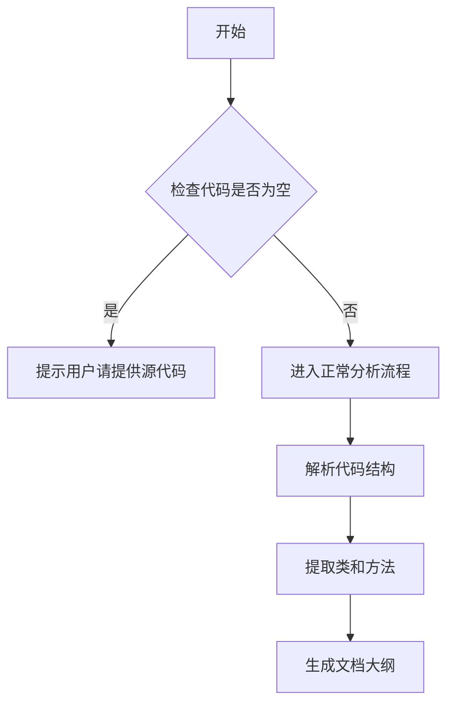

# `comic-translate\modules\ocr\pororo\pororo\models\brainOCR\modules\__init__.py` 详细设计文档

未提供源代码，无法进行分析。请提供需要分析的代码。

## 整体流程



## 类结构

```
无法确定 - 需要源代码
```

## 全局变量及字段


    

## 全局函数及方法


## 关键组件


暂无代码可供分析。请提供需要分析的源代码。


## 问题及建议


### 已知问题

-   未提供待分析的代码内容，无法进行技术债务和优化空间的识别与分析

### 优化建议

-   请提供待分析的完整代码，以便进行深入的技术债务识别和优化建议
-   代码为空或未正确粘贴，请检查并重新提交


## 其它


### 设计目标与约束

（代码为空，无法提供具体内容）

### 错误处理与异常设计

（代码为空，无法提供具体内容）

### 数据流与状态机

（代码为空，无法提供具体内容）

### 外部依赖与接口契约

（代码为空，无法提供具体内容）

### 性能要求与基准

（代码为空，无法提供具体内容）

### 安全考虑与权限控制

（代码为空，无法提供具体内容）

### 可扩展性与模块化设计

（代码为空，无法提供具体内容）

### 部署架构与环境配置

（代码为空，无法提供具体内容）

### 测试策略与覆盖范围

（代码为空，无法提供具体内容）

### 版本控制与变更管理

（代码为空，无法提供具体内容）

### 监控与日志设计

（代码为空，无法提供具体内容）

### 兼容性考虑

（代码为空，无法提供具体内容）

    