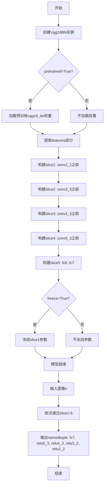
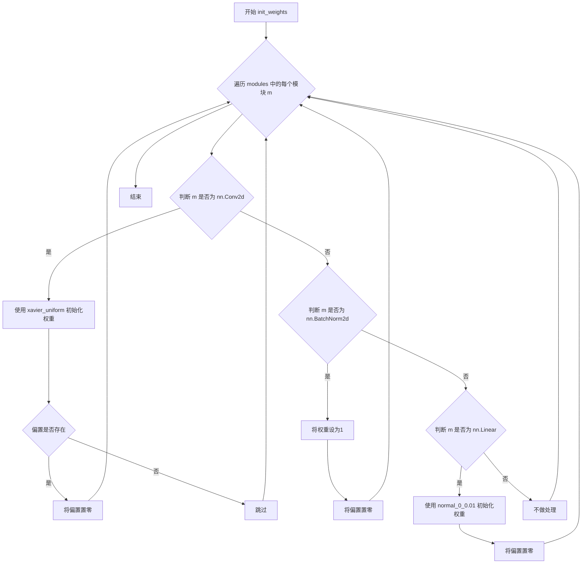

# `comic-translate\modules\ocr\pororo\pororo\models\brainOCR\modules\basenet.py` 详细设计文档

该代码实现了一个基于VGG16 with Batch Normalization的深度学习特征提取器，通过将原始VGG16-BN的卷积层拆分为5个slice并添加自定义的全连接层(fc6/fc7)，在forward时输出多个中间层的特征图(relu2_2, relu3_2, relu4_3, relu5_3, fc7)，常用于目标检测、语义分割等需要多尺度特征的任务。

## 整体流程



## 类结构

```
torch.nn.Module (PyTorch基类)
└── Vgg16BN (VGG16特征提取器)
```

## 全局变量及字段


### `device`
    
CUDA设备对象，根据GPU可用性自动选择

类型：`torch.device`
    


### `init_weights`
    
初始化模型权重的函数，根据不同层类型采用不同初始化策略

类型：`function`
    


### `Vgg16BN.slice1`
    
conv2_2之前的卷积层

类型：`torch.nn.Sequential`
    


### `Vgg16BN.slice2`
    
conv3_3之前的卷积层

类型：`torch.nn.Sequential`
    


### `Vgg16BN.slice3`
    
conv4_3之前的卷积层

类型：`torch.nn.Sequential`
    


### `Vgg16BN.slice4`
    
conv5_3之前的卷积层

类型：`torch.nn.Sequential`
    


### `Vgg16BN.slice5`
    
fc6, fc7层(含空洞卷积)

类型：`torch.nn.Sequential`
    
    

## 全局函数及方法


### `init_weights`

该函数用于初始化神经网络中各类层的权重参数，根据模块类型（卷积层、BatchNorm层、线性层）采用不同的初始化策略：卷积层使用Xavier均匀分布初始化权重并置零偏置，BatchNorm层将权重设为1并置零偏置，线性层使用均值为0、标准差为0.01的正态分布初始化权重并置零偏置。

参数：

- `modules`：`torch.nn.modules`，需要初始化权重的神经网络模块迭代对象

返回值：`None`，该函数直接修改传入模块的权重数据，不返回任何值

#### 流程图



#### 带注释源码

```python
def init_weights(modules):
    """
    初始化卷积层、BatchNorm层、线性层的权重
    
    参数:
        modules: 神经网络模块的迭代对象（如 nn.Module 的 modules() 方法返回的迭代器）
    
    返回:
        None: 直接修改传入模块的权重数据，无返回值
    """
    # 遍历传入的所有模块
    for m in modules:
        # 如果是卷积层 (Conv2d)
        if isinstance(m, nn.Conv2d):
            # 使用 Xavier 均匀分布初始化权重，有助于保持梯度方差稳定
            init.xavier_uniform_(m.weight.data)
            # 如果存在偏置，将其置零
            if m.bias is not None:
                m.bias.data.zero_()
        
        # 如果是批归一化层 (BatchNorm2d)
        elif isinstance(m, nn.BatchNorm2d):
            # 将权重（缩放因子）设为1，保持特征方差
            m.weight.data.fill_(1)
            # 将偏置（位移）置零
            m.bias.data.zero_()
        
        # 如果是全连接层 (Linear)
        elif isinstance(m, nn.Linear):
            # 使用均值为0，标准差为0.01的正态分布初始化权重
            m.weight.data.normal_(0, 0.01)
            # 将偏置置零
            m.bias.data.zero_()
```


### `Vgg16BN.__init__`

初始化 VGG16BN 模型结构，从预训练的 VGG16 with BatchNorm 模型中提取特征，并构建5个特征提取切片（slice1~slice5），支持预训练权重加载和参数冻结。

参数：

- `pretrained`：`bool`，表示是否加载 ImageNet 预训练权重，默认值为 `True`
- `freeze`：`bool`，表示是否冻结 slice1（第一个卷积块）的参数以防止训练，默认值为 `True`

返回值：`None`（构造函数无返回值）

#### 流程图

```mermaid
flowchart TD
    A[开始 __init__] --> B[调用 super().__init__ 初始化父类]
    B --> C[加载预训练 vgg16_bn 模型]
    C --> D[创建 5 个空的 Sequential 容器: slice1~slice5]
    D --> E[将 vgg16_bn.features 逐层分配到各 slice]
    E --> F{slice5: 构建 fc6, fc7}
    F --> G{pretrained?}
    G -->|False| H[初始化 slice1~slice4 权重]
    G -->|True| I[跳过初始化, 使用预训练权重]
    H --> J[初始化 slice5 权重]
    I --> J
    J --> K{freeze?}
    K -->|True| L[冻结 slice1 所有参数 requires_grad=False]
    K -->|False| M[不冻结任何参数]
    L --> N[结束 __init__]
    M --> N
```

#### 带注释源码

```python
def __init__(self, pretrained: bool = True, freeze: bool = True):
    """
    初始化 VGG16BN 模型结构
    
    参数:
        pretrained: 是否加载 ImageNet 预训练权重
        freeze: 是否冻结 slice1 的参数（仅保留特征提取能力）
    """
    # 调用父类 nn.Module 的构造函数，完成基础初始化
    super(Vgg16BN, self).__init__()
    
    # 加载预训练的 VGG16 with BatchNorm 模型
    # features 属性包含所有卷积层和池化层
    vgg_pretrained_features = models.vgg16_bn(
        pretrained=pretrained).features
    
    # 创建5个 Sequential 容器，用于存储不同阶段的特征提取层
    self.slice1 = torch.nn.Sequential()  # conv2_2 之前的所有层
    self.slice2 = torch.nn.Sequential()  # conv3_3 之前的所有层
    self.slice3 = torch.nn.Sequential()  # conv4_3 之前的所有层
    self.slice4 = torch.nn.Sequential()  # conv5_3 之前的所有层
    self.slice5 = torch.nn.Sequential()  # fc6, fc7 全卷积层
    
    # 将预训练模型的层分配到 slice1，对应 VGG 的 conv2_2 (前12层)
    for x in range(12):  # conv2_2
        self.slice1.add_module(str(x), vgg_pretrained_features[x])
    
    # 将预训练模型的层分配到 slice2，对应 VGG 的 conv3_3 (12-18层)
    for x in range(12, 19):  # conv3_3
        self.slice2.add_module(str(x), vgg_pretrained_features[x])
    
    # 将预训练模型的层分配到 slice3，对应 VGG 的 conv4_3 (19-28层)
    for x in range(19, 29):  # conv4_3
        self.slice3.add_module(str(x), vgg_pretrained_features[x])
    
    # 将预训练模型的层分配到 slice4，对应 VGG 的 conv5_3 (29-38层)
    for x in range(29, 39):  # conv5_3
        self.slice4.add_module(str(x), vgg_pretrained_features[x])
    
    # 手动构建 fc6 和 fc7 层（使用空洞卷积）
    # 由于 VGG16 的全连接层在特征提取任务中不适用，改用 1x1 卷积
    self.slice5 = torch.nn.Sequential(
        nn.MaxPool2d(kernel_size=3, stride=1, padding=1),  # 保持特征图尺寸
        nn.Conv2d(512, 1024, kernel_size=3, padding=6, dilation=6),  # 空洞卷积 fc6
        nn.Conv2d(1024, 1024, kernel_size=1),  # 1x1 卷积 fc7
    )
    
    # 如果不加载预训练权重，则手动初始化前面4个 slice 的权重
    if not pretrained:
        init_weights(self.slice1.modules())
        init_weights(self.slice2.modules())
        init_weights(self.slice3.modules())
        init_weights(self.slice4.modules())
    
    # 始终初始化 slice5 的权重（因为 fc6, fc7 没有预训练权重）
    init_weights(
        self.slice5.modules())  # no pretrained model for fc6 and fc7
    
    # 如果 freeze 为 True，则冻结 slice1 的所有参数
    # 通常用于特征提取任务，保持底层特征不变
    if freeze:
        for param in self.slice1.parameters():  # only first conv
            param.requires_grad = False
```


### `Vgg16BN.forward`

该方法是 VGG16 with Batch Normalization 模型的前向传播实现，通过五个特征提取层（slice1~slice5）依次处理输入图像，提取多尺度深度特征，并以命名元组形式返回从浅层到深层的五个特征图（relu2_2、relu3_2、relu4_3、relu5_3、fc7），常用于目标检测、语义分割等需要多尺度特征的任务。

参数：

- `self`：`Vgg16BN`，模型实例，隐式传入
- `x`：`torch.Tensor`，输入图像张量，形状为 (N, C, H, W)，通常为 RGB 三通道图像

返回值：`namedtuple (VggOutputs)`，包含五个特征图的命名元组，依次为 fc7、relu5_3、relu4_3、relu3_2、relu2_2，类型均为 `torch.Tensor`

#### 流程图

```mermaid
flowchart TD
    A[输入 x: torch.Tensor] --> B[slice1 (conv2_2)]
    B --> C[h_relu2_2]
    C --> D[slice2 (conv3_3)]
    D --> E[h_relu3_2]
    E --> F[slice3 (conv4_3)]
    F --> G[h_relu4_3]
    G --> H[slice4 (conv5_3)]
    H --> I[h_relu5_3]
    I --> J[slice5 (fc6, fc7)]
    J --> K[h_fc7]
    K --> L[构建 VggOutputs namedtuple]
    L --> M[返回 out: VggOutputs]
    
    B -.->|保存| C
    D -.->|保存| E
    F -.->|保存| G
    H -.->|保存| I
```

#### 带注释源码

```python
def forward(self, x):
    """
    VGG16BN 模型的前向传播，提取多尺度特征
    
    参数:
        x: 输入张量，形状为 (batch_size, 3, height, width)
    
    返回:
        namedtuple: VggOutputs，包含以下字段:
            - fc7: 最后一个卷积块的输出，形状 (N, 1024, H', W')
            - relu5_3: 第五个block的ReLU输出，形状 (N, 512, H'', W'')
            - relu4_3: 第四个block的ReLU输出，形状 (N, 512, H''', W''')
            - relu3_2: 第三个block的ReLU输出，形状 (N, 256, H'''', W'''')
            - relu2_2: 第二个block的ReLU输出，形状 (N, 128, H''''', W''''')
    """
    # 第一阶段：slice1 对应 VGG 的 conv2_2 (前12层)
    # 输出通道数：64
    h = self.slice1(x)
    # 保存 relu2_2 特征图（浅层特征，高分辨率）
    h_relu2_2 = h
    
    # 第二阶段：slice2 对应 VGG 的 conv3_3 (12-18层)
    # 输出通道数：128
    h = self.slice2(h)
    # 保存 relu3_2 特征图
    h_relu3_2 = h
    
    # 第三阶段：slice3 对应 VGG 的 conv4_3 (19-28层)
    # 输出通道数：256
    h = self.slice3(h)
    # 保存 relu4_3 特征图
    h_relu4_3 = h
    
    # 第四阶段：slice4 对应 VGG 的 conv5_3 (29-38层)
    # 输出通道数：512
    h = self.slice4(h)
    # 保存 relu5_3 特征图
    h_relu5_3 = h
    
    # 第五阶段：slice5 对应全连接层 fc6, fc7 (转为卷积实现)
    # 使用空洞卷积 (dilation=6) 扩大感受野
    # 输出通道数：1024
    h = self.slice5(h)
    # 保存 fc7 特征图（深层特征，低分辨率）
    h_fc7 = h
    
    # 定义命名元组类型，包含五个输出字段
    vgg_outputs = namedtuple(
        "VggOutputs", ["fc7", "relu5_3", "relu4_3", "relu3_2", "relu2_2"])
    
    # 按深度从深到浅排序打包输出
    out = vgg_outputs(h_fc7, h_relu5_3, h_relu4_3, h_relu3_2, h_relu2_2)
    
    return out
```

## 关键组件


### VGG16特征切片模块

将预训练的VGG16-BN模型分割成5个顺序切片(slice1-5)，分别对应conv2_2、conv3_3、conv4_3、conv5_3和fc6/fc7层，用于提取不同层次的图像特征。

### 权重初始化函数

对卷积层、批归一化层和全连接层进行Xavier均匀初始化和零偏置初始化，确保模型训练稳定性。

### 多层次特征输出

通过namedtuple定义VggOutputs结构体，包含fc7、relu5_3、relu4_3、relu3_2、relu2_2五个特征输出，支持多尺度特征融合。

### 设备自适应配置

根据CUDA可用性自动选择GPU或CPU作为计算设备，确保模型在不同硬件环境下运行。

### 模型预训练与冻结机制

支持加载ImageNet预训练权重，可选择冻结卷积层参数以加速训练，适用于迁移学习场景。

### 全连接层自定义构建

手动构建fc6和fc7层，使用空洞卷积(dilation=6)扩展感受野，替代原VGG的全连接层以适应语义分割等任务。


## 问题及建议


### 已知问题

- **全局变量未使用**：`device` 变量被定义但从未在代码中引用，导致死代码。
- **硬编码的切片索引**：模型切片的索引范围（12, 19, 29, 39）是硬编码的，缺乏可读性和可维护性，容易因 torchvision 版本更新而失效。
- **重复调用初始化函数**：`init_weights` 被多次调用（slice1-5各一次），代码重复，可提取为单个调用。
- **不必要的初始化调用**：当 `pretrained=True` 时，仍对 slice1-4 调用 `init_weights`，虽然参数被 freeze，但调用是多余的。
- **freeze 逻辑不完整**：当前仅 freeze 了 slice1（第一个卷积层），但注释表明意图可能是 freeze 整个特征提取网络，语义不清晰。
- **slice5 构建方式不一致**：slice5 使用 `torch.nn.Sequential` 构造函数直接创建，而其他 slice 使用空的 Sequential 再逐个添加模块，风格不统一。
- **namedtuple 命名不一致**：定义时使用 `VggOutputs`（大写），但实际使用 `vgg_outputs`（小写），不符合 PEP8 命名规范。
- **缺少类型标注和文档**：类和方法缺乏完整的类型注解和 docstring，影响可维护性。

### 优化建议

- 移除未使用的 `device` 全局变量，或在模型调用时使用。
- 将硬编码的索引提取为常量或配置文件，提高可维护性。
- 合并 `init_weights` 调用，使用 `self.children()` 或 `self.modules()` 遍历所有层。
- 在 `pretrained=True` 时跳过 slice1-4 的初始化操作。
- 明确 `freeze` 参数语义，若需 freeze 整个特征提取器，应遍历所有 slice 参数。
- 统一 slice1-5 的构建方式，提升代码一致性。
- 修正 namedtuple 变量命名为 `VggOutputs` 或统一为小写。
- 添加完整的类型注解、docstring 和注释，提升代码可读性和可维护性。

## 其它


### 设计目标与约束

设计目标：本代码实现了一个基于VGG16-BN的卷积神经网络特征提取器，主要用于计算机视觉任务中的多尺度特征提取，能够输出5个不同层次的特征图（从浅层的relu2_2到深层的fc7），支持预训练模型加载和参数冻结。约束条件包括：必须依赖PyTorch框架和torchvision模型库，仅支持CUDA或CPU设备，不支持多GPU分布式训练，不提供模型保存和加载接口。

### 错误处理与异常设计

代码中未显式实现错误处理和异常捕获机制。主要潜在异常包括：CUDA不可用时的设备切换异常、预训练模型下载失败异常、模型结构不匹配异常、输入张量维度不匹配异常、参数类型错误异常。改进建议：应添加try-except块捕获torch.cuda.is_available()返回False时的警告，添加模型加载失败的重试机制，验证输入张量形状是否符合模型要求（应为3通道RGB图像），添加参数类型检查确保pretrained和freeze参数为布尔类型。

### 数据流与状态机

数据流：输入图像张量（Batch, 3, H, W）→ slice1（conv2_2特征）→ slice2（conv3_3特征）→ slice3（conv4_3特征）→ slice4（conv5_3特征）→ slice5（fc7特征）→ 输出VggOutputs命名元组。状态机：模型初始化状态（加载预训练权重）→ 冻结状态（根据freeze参数）→ 前向传播状态（特征提取）→ 输出状态（返回特征元组）。状态转换由__init__方法和forward方法控制，无显式状态机实现。

### 外部依赖与接口契约

外部依赖：torch>=1.0.0、torchvision>=0.2.0、numpy。接口契约：init_weights函数接收nn.Module或nn.Sequential模块列表，无返回值；Vgg16BN类构造函数接收pretrained（默认True）和freeze（默认True）两个布尔参数，__call__接口接收形状为(N, 3, H, W)的4D张量，返回VggOutputs命名元组包含fc7、relu5_3、relu4_3、relu3_2、relu2_2五个张量。输入张量应位于正确设备上（CUDA或CPU），输出张量设备与输入张量设备一致。

### 配置与超参数

预训练模型URL由torchvision内部定义，超参数包括：slice1包含12层（conv2_2），slice2包含7层（conv3_3），slice3包含10层（conv4_3），slice4包含10层（conv5_3），slice5包含MaxPool2d(kernel_size=3, stride=1, padding=1)和两层卷积(512→1024→1024)，dilation=6的膨胀卷积用于fc6，全连接层使用1x1卷积实现。初始化方法：卷积层使用Xavier均匀分布，BatchNorm层权重填充1偏置置零，线性层权重正态分布(0, 0.01)偏置置零。

### 性能考虑

当前实现的主要性能瓶颈：每次前向传播需顺序执行5个slice的卷积运算，CPU推理速度较慢，GPU内存占用较高（完整VGG16-BN模型）。优化建议：可考虑使用torch.jit.script进行图优化，添加推理时的torch.no_grad()上下文管理器以节省显存，实现特征缓存机制避免重复计算，考虑使用torchvision的中间特征层输出接口替代自定义slice结构，freeze参数目前仅冻结slice1参数，可扩展为支持冻结任意层级的参数。

### 测试策略

单元测试应覆盖：init_weights函数对不同层类型的初始化行为，Vgg16BN构造函数不同参数组合（pretrained/freeze），前向传播输出维度验证（各特征层形状），设备迁移测试（CPU→CUDA），预训练权重加载验证，梯度计算和反向传播测试，批量输入处理测试。集成测试应验证：与下游任务（如Faster R-CNN）的特征对齐，特征图可视化验证，不同输入尺寸的兼容性。

### 部署注意事项

部署环境要求：Python 3.6+，PyTorch 1.0+，CUDA 10.0+（如使用GPU），torchvision版本需匹配。模型文件大小：约500MB（预训练权重）。推理时内存占用：输入图像尺寸为224x224时约1.5GB GPU显存。生产部署建议：使用torch.jit.trace或torch.jit.script进行模型序列化，导出为ONNX格式以提高跨平台兼容性，考虑使用torch.float16进行推理加速，实施模型版本管理以支持回滚。


    