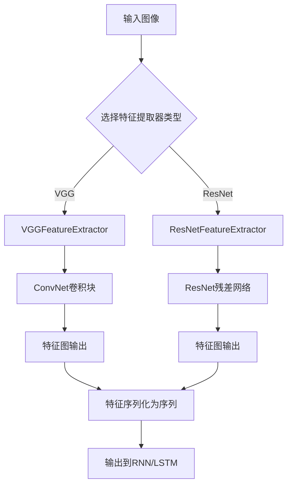
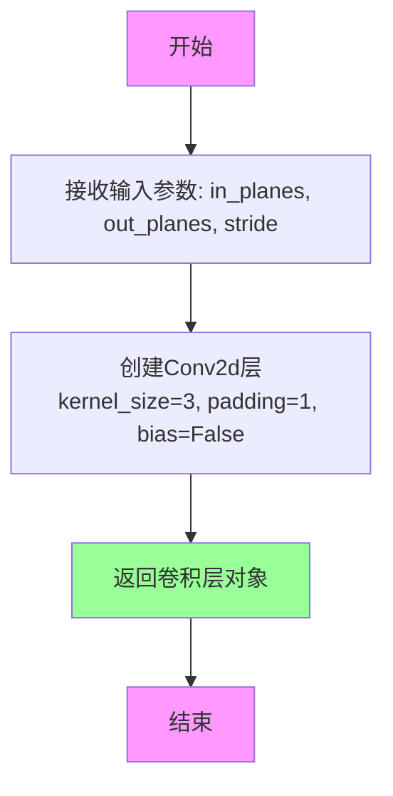
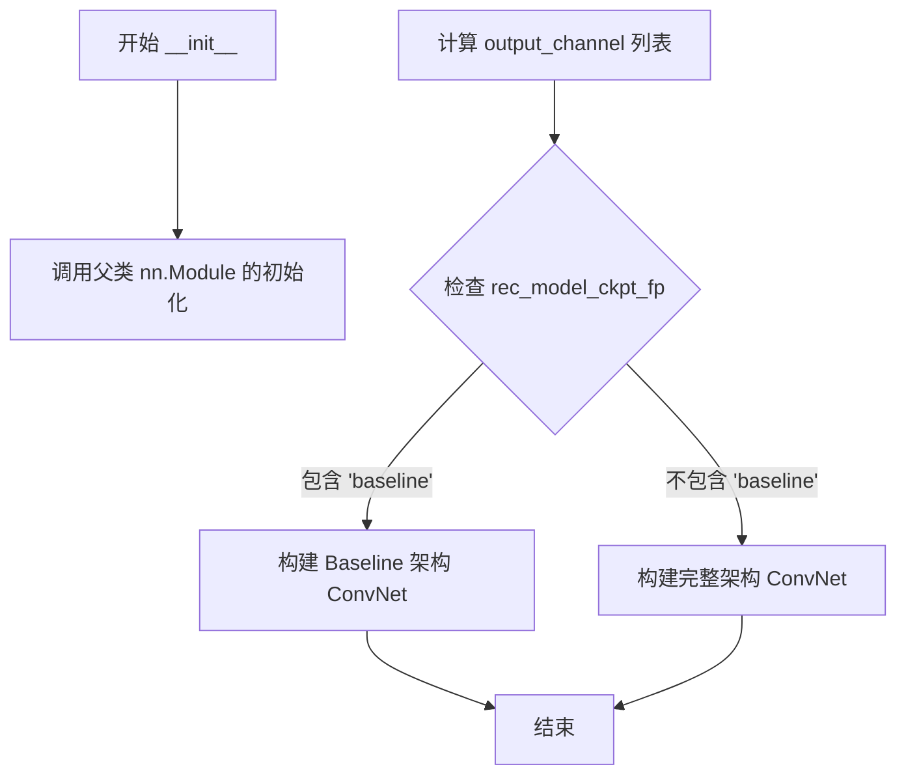
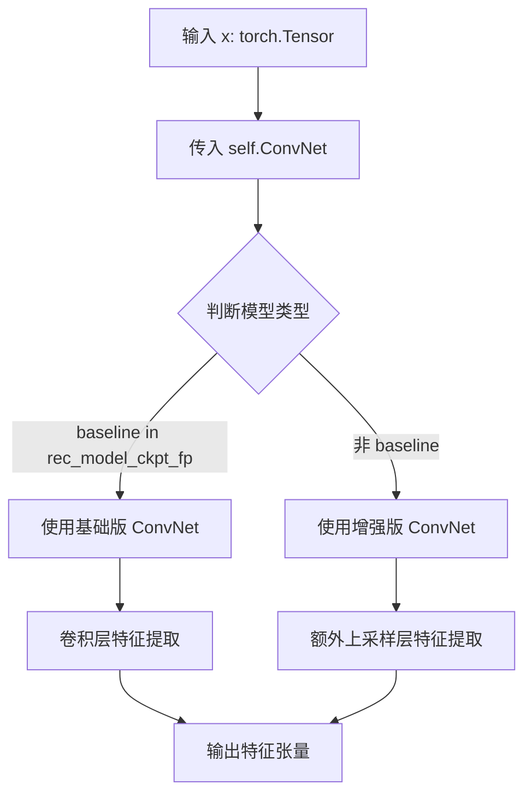
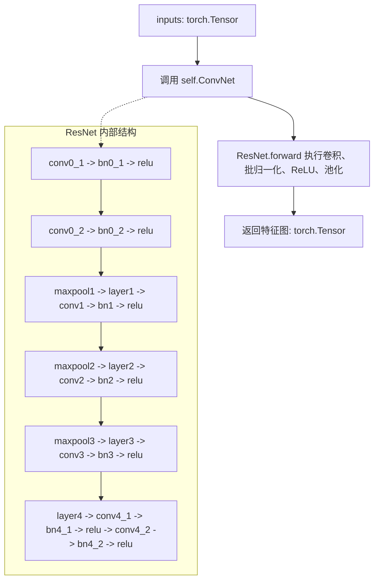
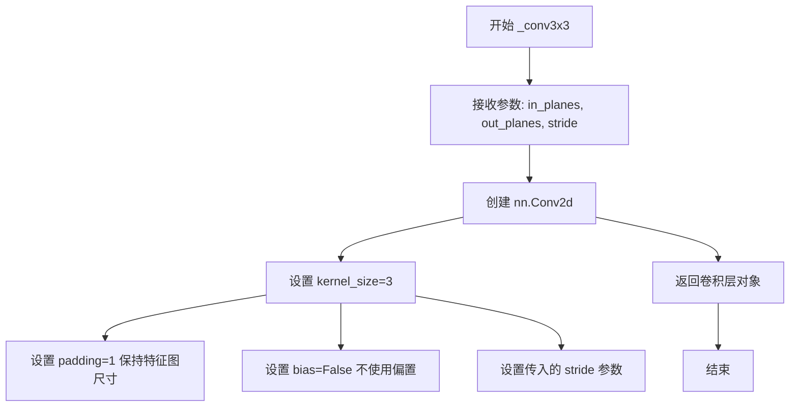

```mermaid
graph TD
    A[输入特征图 x] --> B[conv0_1 卷积]
    B --> C[bn0_1 批归一化]
    C --> D[ReLU 激活]
    D --> E[conv0_2 卷积]
    E --> F[bn0_2 批归一化]
    F --> G[ReLU 激活]
    
    G --> H[MaxPool1 下采样]
    H --> I[layer1 残差块]
    I --> J[conv1 卷积]
    J --> K[bn1 批归一化]
    K --> L[ReLU 激活]
    
    L --> M[MaxPool2 下采样]
    M --> N[layer2 残差块]
    N --> O[conv2 卷积]
    O --> P[bn2 批归一化]
    P --> Q[ReLU 激活]
    
    Q --> R[MaxPool3 下采样]
    R --> S[layer3 残差块]
    S --> T[conv3 卷积]
    T --> U[bn3 批归一化]
    U --> V[ReLU 激活]
    
    V --> W[layer4 残差块]
    W --> X[conv4_1 卷积]
    X --> Y[bn4_1 批归一化]
    Y --> Z[ReLU 激活]
    
    Z --> AA[conv4_2 卷积]
    AA --> AB[bn4_2 批归一化]
    AB --> AC[ReLU 激活]
    
    AC --> AD[输出特征图]
```

# `comic-translate\modules\ocr\pororo\pororo\models\brainOCR\modules\feature_extraction.py` 详细设计文档

这是一个深度学习特征提取模块，实现了基于VGG和ResNet架构的图像特征提取器，主要用于CRNN（卷积循环神经网络）文本识别任务，支持从输入图像中提取层次化特征并转换为序列表示。

## 整体流程



## 类结构

```
nn.Module (PyTorch基类)
├── VGGFeatureExtractor
│   └── ConvNet (nn.Sequential)
├── ResNetFeatureExtractor
│   └── ConvNet (ResNet)
└── ResNet
    ├── BasicBlock (残差块)
    └── 多层特征提取层
```

## 全局变量及字段


### `n_input_channels`
    
Number of input channels for the feature extractor (e.g., 1 for grayscale images).

类型：`int`
    


### `n_output_channels`
    
Desired number of output channels for the feature extractor (e.g., 512).

类型：`int`
    


### `opt2val`
    
Dictionary containing configuration options such as the checkpoint file path.

类型：`dict`
    


### `rec_model_ckpt_fp`
    
Path to the recognition model checkpoint file, used to determine which network variant to instantiate.

类型：`str`
    


### `VGGFeatureExtractor.output_channel`
    
List of output channel sizes [64, 128, 256, 512] used in the VGG network.

类型：`List[int]`
    


### `VGGFeatureExtractor.ConvNet`
    
VGG-based convolutional neural network module for feature extraction.

类型：`nn.Sequential`
    


### `ResNetFeatureExtractor.ConvNet`
    
ResNet-based feature extraction network.

类型：`ResNet`
    


### `BasicBlock.expansion`
    
Expansion factor for the basic block, always 1.

类型：`int`
    


### `BasicBlock.conv1`
    
First 3x3 convolution layer in the basic block.

类型：`nn.Conv2d`
    


### `BasicBlock.bn1`
    
First batch normalization layer in the basic block.

类型：`nn.BatchNorm2d`
    


### `BasicBlock.conv2`
    
Second 3x3 convolution layer in the basic block.

类型：`nn.Conv2d`
    


### `BasicBlock.bn2`
    
Second batch normalization layer in the basic block.

类型：`nn.BatchNorm2d`
    


### `BasicBlock.relu`
    
ReLU activation function used in the block.

类型：`nn.ReLU`
    


### `BasicBlock.downsample`
    
Downsample residual connection for dimension matching.

类型：`nn.Sequential`
    


### `BasicBlock.stride`
    
Stride used for convolution in the block.

类型：`int`
    


### `ResNet.output_channel_blocks`
    
List of output channel sizes for each ResNet block [128, 256, 512, 512].

类型：`List[int]`
    


### `ResNet.inplanes`
    
Number of planes (channels) at the current layer of the network.

类型：`int`
    


### `ResNet.conv0_1`
    
Initial convolution layer 1.

类型：`nn.Conv2d`
    


### `ResNet.bn0_1`
    
Initial batch normalization layer 1.

类型：`nn.BatchNorm2d`
    


### `ResNet.conv0_2`
    
Initial convolution layer 2.

类型：`nn.Conv2d`
    


### `ResNet.bn0_2`
    
Initial batch normalization layer 2.

类型：`nn.BatchNorm2d`
    


### `ResNet.relu`
    
ReLU activation function used throughout the network.

类型：`nn.ReLU`
    


### `ResNet.maxpool1`
    
First max pooling layer.

类型：`nn.MaxPool2d`
    


### `ResNet.layer1`
    
First residual layer.

类型：`nn.Sequential`
    


### `ResNet.conv1`
    
Convolution layer after layer1.

类型：`nn.Conv2d`
    


### `ResNet.bn1`
    
Batch normalization after layer1.

类型：`nn.BatchNorm2d`
    


### `ResNet.maxpool2`
    
Second max pooling layer.

类型：`nn.MaxPool2d`
    


### `ResNet.layer2`
    
Second residual layer.

类型：`nn.Sequential`
    


### `ResNet.conv2`
    
Convolution layer after layer2.

类型：`nn.Conv2d`
    


### `ResNet.bn2`
    
Batch normalization after layer2.

类型：`nn.BatchNorm2d`
    


### `ResNet.maxpool3`
    
Third max pooling layer.

类型：`nn.MaxPool2d`
    


### `ResNet.layer3`
    
Third residual layer.

类型：`nn.Sequential`
    


### `ResNet.conv3`
    
Convolution layer after layer3.

类型：`nn.Conv2d`
    


### `ResNet.bn3`
    
Batch normalization after layer3.

类型：`nn.BatchNorm2d`
    


### `ResNet.layer4`
    
Fourth residual layer.

类型：`nn.Sequential`
    


### `ResNet.conv4_1`
    
First convolution in the fourth block.

类型：`nn.Conv2d`
    


### `ResNet.bn4_1`
    
Batch normalization after conv4_1.

类型：`nn.BatchNorm2d`
    


### `ResNet.conv4_2`
    
Second convolution in the fourth block.

类型：`nn.Conv2d`
    


### `ResNet.bn4_2`
    
Batch normalization after conv4_2.

类型：`nn.BatchNorm2d`
    
    

## 全局函数及方法


### `BasicBlock._conv3x3`

创建一个3x3卷积层，带有padding=1以保持空间维度不变。

参数：

- `self`：BasicBlock实例，隐式参数，表示当前对象
- `in_planes`：`int`，输入通道数（input channels）
- `out_planes`：`int`，输出通道数（output channels）
- `stride`：`int`，卷积步幅，默认为1

返回值：`nn.Conv2d`，返回一个PyTorch 2D卷积层对象

#### 流程图



#### 带注释源码

```python
def _conv3x3(self, in_planes, out_planes, stride=1):
    """
    3x3卷积层工厂方法，带有padding以保持空间维度
    
    参数:
        in_planes (int): 输入特征图的通道数
        out_planes (int): 输出特征图的通道数
        stride (int): 卷积核移动步幅，默认值为1
    
    返回:
        nn.Conv2d: 配置好的2D卷积层
    """
    # 3x3卷积，带padding=1保持空间尺寸不变
    return nn.Conv2d(
        in_planes,      # 输入通道数
        out_planes,    # 输出通道数
        kernel_size=3, # 3x3卷积核
        stride=stride, # 步幅
        padding=1,     # padding=1使输出尺寸与输入相同（当stride=1时）
        bias=False     # 使用BatchNorm时不需要偏置
    )
```


### `ResNet._make_layer`

`_make_layer` 方法用于在 ResNet 网络中创建由多个相同类型的块（block）组成的层。它会根据传入的参数创建一系列卷积块，并可选地添加下采样（downsample）操作来处理维度不匹配的情况。

参数：

- `block`：类型 `nn.Module`，用于构建层的块类型（如 BasicBlock）
- `planes`：类型 `int`，输出通道数
- `blocks`：类型 `int`，该层中块的数量
- `stride`：类型 `int`，卷积步长，默认为 1

返回值：`nn.Sequential`，返回一个由多个块组成的顺序容器

#### 流程图

```mermaid
flowchart TD
    A[开始 _make_layer] --> B{stride != 1 或<br>inplanes != planes * expansion?}
    B -->|是| C[创建 downsample 卷积层]
    B -->|否| D[downsample = None]
    C --> E[初始化 layers 列表]
    D --> E
    E --> F[添加第一个 block<br>包含 downsample]
    F --> G[更新 self.inplanes]
    G --> H{循环 i from 1 to blocks-1}
    H -->|是| I[添加普通 block]
    I --> H
    H -->|否| J[返回 nn.Sequential(*layers)]
```

#### 带注释源码

```python
def _make_layer(self, block, planes, blocks, stride=1):
    """
    创建一个由多个 block 组成的层
    
    参数:
        block: 用于构建层的块类型（如 BasicBlock）
        planes: 输出通道数
        blocks: 该层中块的数量
        stride: 卷积步长，默认为1
    
    返回:
        nn.Sequential: 包含多个 block 的顺序容器
    """
    # 初始化下采样为 None
    downsample = None
    
    # 判断是否需要下采样：
    # 当 stride 不为 1（需要降维）或输入通道数与输出通道数不匹配时
    if stride != 1 or self.inplanes != planes * block.expansion:
        # 创建下采样序列：1x1 卷积 + BatchNorm
        downsample = nn.Sequential(
            nn.Conv2d(
                self.inplanes,  # 输入通道数
                planes * block.expansion,  # 输出通道数
                kernel_size=1,  # 1x1 卷积
                stride=stride,
                bias=False,
            ),
            nn.BatchNorm2d(planes * block.expansion),
        )

    # 初始化层列表
    layers = []
    
    # 添加第一个块，可能包含下采样
    layers.append(block(self.inplanes, planes, stride, downsample))
    
    # 更新 inplanes 为当前的输出通道数
    self.inplanes = planes * block.expansion
    
    # 循环添加剩余的块
    for i in range(1, blocks):
        layers.append(block(self.inplanes, planes))

    # 返回由所有块组成的顺序容器
    return nn.Sequential(*layers)
```


### `VGGFeatureExtractor.__init__`

该方法是VGG特征提取器的初始化方法，用于CRNN（卷积循环神经网络）模型。它根据输入参数和配置文件构建卷积神经网络结构，包括多个卷积层、ReLU激活层、池化层、批归一化层和转置卷积层，并根据配置选择不同的网络架构（baseline或其他）。

参数：

- `n_input_channels`：`int`，输入图像的通道数，默认为1（灰度图像）
- `n_output_channels`：`int`，输出特征图的通道数，默认为512
- `opt2val`：`dict`（或类似映射类型），配置字典，用于传递模型检查点路径等配置信息，其中`rec_model_ckpt_fp`键用于判断使用哪种网络架构

返回值：`None`（`__init__`方法无返回值）

#### 流程图



#### 带注释源码

```python
def __init__(self,
             n_input_channels: int = 1,
             n_output_channels: int = 512,
             opt2val=None):
    """
    初始化 VGG 特征提取器
    
    参数:
        n_input_channels: 输入通道数，默认1（灰度图）
        n_output_channels: 输出通道数，默认512
        opt2val: 配置字典，用于传递模型检查点路径等配置
    """
    # 调用父类 nn.Module 的初始化方法
    super(VGGFeatureExtractor, self).__init__()

    # 计算输出通道数列表：[64, 128, 256, 512]
    # 分别对应四个卷积阶段的输出通道数
    self.output_channel = [
        int(n_output_channels / 8),   # 64
        int(n_output_channels / 4),   # 128
        int(n_output_channels / 2),   # 256
        n_output_channels,            # 512
    ]

    # 从配置中获取模型检查点路径
    rec_model_ckpt_fp = opt2val["rec_model_ckpt_fp"]
    
    # 根据检查点路径判断使用哪种架构
    if "baseline" in rec_model_ckpt_fp:
        # Baseline 架构：较简单的网络结构
        self.ConvNet = nn.Sequential(
            # 第一个卷积块：64x16x50
            nn.Conv2d(n_input_channels, self.output_channel[0], 3, 1, 1),
            nn.ReLU(True),
            nn.MaxPool2d(2, 2),
            
            # 第二个卷积块：128x8x25
            nn.Conv2d(self.output_channel[0], self.output_channel[1], 3, 1, 1),
            nn.ReLU(True),
            nn.MaxPool2d(2, 2),
            
            # 第三个卷积块：256x8x25
            nn.Conv2d(self.output_channel[1], self.output_channel[2], 3, 1, 1),
            nn.ReLU(True),
            nn.Conv2d(self.output_channel[2], self.output_channel[2], 3, 1, 1),
            nn.ReLU(True),
            nn.MaxPool2d((2, 1), (2, 1)),
            
            # 第四个卷积块：512x4x25
            nn.Conv2d(self.output_channel[2], self.output_channel[3], 3, 1, 1, bias=False),
            nn.BatchNorm2d(self.output_channel[3]),
            nn.ReLU(True),
            nn.Conv2d(self.output_channel[3], self.output_channel[3], 3, 1, 1, bias=False),
            nn.BatchNorm2d(self.output_channel[3]),
            nn.ReLU(True),
            nn.MaxPool2d((2, 1), (2, 1)),
            
            # 转置卷积上采样：512x4x50
            nn.ConvTranspose2d(self.output_channel[3], self.output_channel[3], 2, 2),
            nn.ReLU(True),
        )
    else:
        # 完整架构：包含额外的转置卷积层
        self.ConvNet = nn.Sequential(
            # 第一个卷积块：64x16x50
            nn.Conv2d(n_input_channels, self.output_channel[0], 3, 1, 1),
            nn.ReLU(True),
            nn.MaxPool2d(2, 2),
            
            # 第二个卷积块：128x8x25
            nn.Conv2d(self.output_channel[0], self.output_channel[1], 3, 1, 1),
            nn.ReLU(True),
            nn.MaxPool2d(2, 2),
            
            # 第三个卷积块：256x8x25
            nn.Conv2d(self.output_channel[1], self.output_channel[2], 3, 1, 1),
            nn.ReLU(True),
            nn.Conv2d(self.output_channel[2], self.output_channel[2], 3, 1, 1),
            nn.ReLU(True),
            nn.MaxPool2d((2, 1), (2, 1)),
            
            # 第四个卷积块：512x4x25
            nn.Conv2d(self.output_channel[2], self.output_channel[3], 3, 1, 1, bias=False),
            nn.BatchNorm2d(self.output_channel[3]),
            nn.ReLU(True),
            nn.Conv2d(self.output_channel[3], self.output_channel[3], 3, 1, 1, bias=False),
            nn.BatchNorm2d(self.output_channel[3]),
            nn.ReLU(True),
            nn.MaxPool2d((2, 1), (2, 1)),
            
            # 两次转置卷积上采样：512x4x50
            nn.ConvTranspose2d(self.output_channel[3], self.output_channel[3], 2, 2),
            nn.ReLU(True),
            nn.ConvTranspose2d(self.output_channel[3], self.output_channel[3], 2, 2),
            nn.ReLU(True),
        )
```


### `VGGFeatureExtractor.forward`

该方法是 VGG 特征提取器的前向传播函数，负责将输入图像通过卷积神经网络进行特征提取，并根据配置文件中的模型类型选择不同的网络结构（baseline 或改进版本），最终输出提取后的特征张量。

参数：

- `x`：`torch.Tensor`，输入的图像张量，通常为 4D 张量，形状为 [batch_size, channels, height, width]，其中 channels 为输入通道数（默认 1 通道灰度图）

返回值：`torch.Tensor`，经过卷积网络提取后的特征张量，形状为 [batch_size, 512, 4, 50]

#### 流程图



#### 带注释源码

```python
def forward(self, x):
    """
    VGG 特征提取器的前向传播方法
    
    参数:
        x (torch.Tensor): 输入图像张量，形状为 [batch_size, n_input_channels, height, width]
        
    返回:
        torch.Tensor: 提取的特征张量，形状为 [batch_size, 512, 4, 50]
    """
    # 将输入 x 传递给 ConvNet（卷积神经网络）进行特征提取
    # ConvNet 是 nn.Sequential 类型的容器，包含多个卷积、池化、上采样层
    return self.ConvNet(x)
```


### `ResNetFeatureExtractor.__init__`

初始化ResNet特征提取器，基于ResNet架构构建卷积神经网络，用于从输入图像中提取特征。

参数：

- `n_input_channels`：`int`，输入图像的通道数，默认为1（例如灰度图像）
- `n_output_channels`：`int`，输出特征的通道数，默认为512

返回值：`None`，该方法为初始化方法，不返回任何值

#### 流程图

```mermaid
flowchart TD
    A[开始 __init__] --> B[调用 super().__init__ 初始化 nn.Module]
    --> C[创建 ResNet 实例赋值给 self.ConvNet]
    --> D[传入参数: n_input_channels, n_output_channels, BasicBlock, [1, 2, 5, 3]]
    --> E[结束 __init__]
```

#### 带注释源码

```python
def __init__(self, n_input_channels: int = 1, n_output_channels: int = 512):
    """
    初始化 ResNet 特征提取器
    
    参数:
        n_input_channels (int): 输入图像的通道数，默认为1（灰度图像）
        n_output_channels (int): 输出特征的通道数，默认为512
    """
    # 调用父类 nn.Module 的初始化方法，设置模块的内部状态
    super(ResNetFeatureExtractor, self).__init__()
    
    # 创建 ResNet 卷积网络实例并赋值给实例变量 ConvNet
    # 参数说明:
    #   - n_input_channels: 输入通道数
    #   - n_output_channels: 输出通道数
    #   - BasicBlock: 使用 BasicBlock 作为 ResNet 的基础块
    #   - [1, 2, 5, 3]: 各层的 block 数量 [layer1, layer2, layer3, layer4]
    self.ConvNet = ResNet(n_input_channels, n_output_channels, BasicBlock,
                          [1, 2, 5, 3])
```


### `ResNetFeatureExtractor.forward`

该方法是 `ResNetFeatureExtractor` 类的前向传播函数，负责将输入图像通过内部的 ResNet 卷积网络进行特征提取，并返回提取后的特征图。它是 FAN (Focusing Attention Network) 特征提取器的核心实现，通过串联多个 BasicBlock 构成的深度卷积网络对输入进行多层次特征抽象。

参数：

- `inputs`：`torch.Tensor`，输入的图像张量，通常为 4D 张量（batch_size, channels, height, width），例如灰度图像为 (N, 1, H, W)，RGB 图像为 (N, 3, H, W)

返回值：`torch.Tensor`，经过 ResNet 网络提取后的特征图，形状为 (batch_size, n_output_channels, H', W')，其中高度和宽度会根据网络的步长和池化操作有所缩小

#### 流程图



#### 带注释源码

```python
def forward(self, inputs):
    """
    ResNetFeatureExtractor 的前向传播方法
    
    该方法接收输入图像张量，并将其传递给内部构建的 ResNet 卷积网络
    (ConvNet) 进行特征提取。ConvNet 是由 ResNet 类实例化的深度卷积网络，
    包含了多个卷积层、批归一化层、ReLU 激活层和池化层，用于从输入图像中
    提取多层次、抽象的特征表示。
    
    参数:
        inputs (torch.Tensor): 输入的图像张量，形状为 (batch_size, 
                              n_input_channels, height, width)
                              - n_input_channels: 输入通道数，默认为 1 (灰度图)
                              - height, width: 输入图像的宽和高
    
    返回:
        torch.Tensor: 提取后的特征图，形状为 (batch_size, n_output_channels, 
                     feature_height, feature_width)
                     - n_output_channels: 输出通道数，默认为 512
                     - feature_height, feature_width: 特征图的高度和宽度，
                       会根据网络中步长和池化操作有所缩小
    """
    # 将输入传递给内部的 ResNet 卷积网络 (self.ConvNet)
    # ConvNet 是在 __init__ 中创建的 ResNet 实例，配置为 [1, 2, 5, 3] 的 block 堆叠
    # 输入经过 ConvNet 的多层卷积、归一化和激活操作后，输出高维特征表示
    return self.ConvNet(inputs)
```


### BasicBlock.__init__

这是ResNet的基本残差块（Basic Block）的初始化方法，用于构建带有残差连接的卷积块，是ResNet特征提取器的核心组件。

参数：

- `inplanes`：`int`，输入特征图的通道数（维度）
- `planes`：`int`，输出特征图的通道数（维度）
- `stride`：`int`，卷积步长，默认为1，用于控制特征图尺寸
- `downsample`：`nn.Module` 或 `None`，用于下采样的残差连接模块，当需要调整维度或尺寸时使用，默认为None

返回值：无（`None`），构造函数不返回任何值

#### 流程图

```mermaid
flowchart TD
    A[开始 BasicBlock.__init__] --> B[调用 super().__init__ 初始化nn.Module]
    --> C[调用 _conv3x3 创建第1个3x3卷积: inplanes -> planes]
    --> D[创建 BatchNorm2d: planes]
    --> E[调用 _conv3x3 创建第2个3x3卷积: planes -> planes]
    --> F[创建 BatchNorm2d: planes]
    --> G[创建 ReLU 激活函数]
    --> H[保存 downsample 参数]
    --> I[保存 stride 参数]
    --> J[结束初始化]
```

#### 带注释源码

```python
def __init__(self,
             inplanes: int,
             planes: int,
             stride: int = 1,
             downsample=None):
    """
    BasicBlock 残差块的初始化方法
    
    参数:
        inplanes: 输入特征图的通道数
        planes: 输出特征图的通道数
        stride: 第一个卷积层的步长，用于下采样
        downsample: 残差连接的下采样模块，用于维度不匹配时
    """
    # 调用父类 nn.Module 的初始化方法
    super(BasicBlock, self).__init__()
    
    # 第一个卷积层: 3x3卷积，输入通道 inplanes -> 输出通道 planes
    self.conv1 = self._conv3x3(inplanes, planes)
    
    # 第一个批归一化层，对 planes 个通道进行归一化
    self.bn1 = nn.BatchNorm2d(planes)
    
    # 第二个卷积层: 3x3卷积，输入通道 planes -> 输出通道 planes
    self.conv2 = self._conv3x3(planes, planes)
    
    # 第二个批归一化层
    self.bn2 = nn.BatchNorm2d(planes)
    
    # ReLU 激活函数，inplace=True 节省内存
    self.relu = nn.ReLU(inplace=True)
    
    # 保存下采样模块，用于残差连接
    self.downsample = downsample
    
    # 保存步长参数
    self.stride = stride
```


### BasicBlock._conv3x3

该方法是 `BasicBlock` 类的私有辅助方法，用于创建带有填充的 3x3 卷积层，返回一个 `nn.Conv2d` 卷积层对象。

参数：

- `in_planes`：`int`，输入特征图的通道数（输入平面数）
- `out_planes`：`int`，输出特征图的通道数（输出平面数）
- `stride`：`int`，卷积核的步长，默认为 1

返回值：`nn.Conv2d`，返回一个配置好的 3x3 卷积层

#### 流程图



#### 带注释源码

```python
def _conv3x3(self, in_planes, out_planes, stride=1):
    """
    3x3 卷积层构造辅助方法
    
    Args:
        in_planes (int): 输入特征图的通道数
        out_planes (int): 输出特征图的通道数
        stride (int): 卷积核移动步长，默认为 1
    
    Returns:
        nn.Conv2d: 配置好的 3x3 卷积层
    """
    # 3x3 convolution with padding
    # 使用 padding=1 保证输入输出特征图尺寸一致（当 stride=1 时）
    # bias=False 配合后续的 BatchNorm2d 使用
    return nn.Conv2d(
        in_planes,      # 输入通道数
        out_planes,    # 输出通道数
        kernel_size=3, # 3x3 卷积核
        stride=stride, # 步长（可控制特征图下采样）
        padding=1,     # 填充 1 像素，保持空间维度
        bias=False     # 不使用偏置（通常配合 BatchNorm 使用）
    )
```


### `BasicBlock.forward`

该方法是ResNet的BasicBlock（基本残差块）的前向传播实现，通过卷积、批归一化和残差连接来提取特征并缓解梯度消失问题。

参数：

- `x`：`torch.Tensor`，输入特征图，形状为 (batch, inplanes, H, W)

返回值：`torch.Tensor`，经过残差块处理后的输出特征图，形状为 (batch, planes, H, W)（当有下采样时可能变化）

#### 流程图

```mermaid
flowchart TD
    A[输入 x] --> B[保存残差: residual = x]
    B --> C[conv1卷积]
    C --> D[bn1批归一化]
    D --> E[ReLU激活]
    E --> F[conv2卷积]
    F --> G[bn2批归一化]
    G --> H{downsample is not None?}
    H -->|Yes| I[下采样残差: residual = downsample(x)]
    H -->|No| J[保持residual不变]
    I --> K[残差相加: out += residual]
    J --> K
    K --> L[ReLU激活]
    L --> M[返回输出]
```

#### 带注释源码

```python
def forward(self, x):
    """
    BasicBlock的前向传播方法，实现了残差块的前向计算
    
    Args:
        x: 输入张量，形状为 (batch, inplanes, H, W)
    
    Returns:
        torch.Tensor: 残差块输出，形状为 (batch, planes, H', W')
    """
    # 保存原始输入作为残差连接
    # 残差连接的目的是让网络学习恒等映射，缓解深层网络梯度消失问题
    residual = x

    # 第一次卷积：3x3卷积，提取特征
    out = self.conv1(x)
    # 批归一化，稳定训练过程，加速收敛
    out = self.bn1(out)
    # ReLU激活函数，增加非线性表达能力
    out = self.relu(out)

    # 第二次卷积：继续特征提取
    out = self.conv2(out)
    # 批归一化
    out = self.bn2(out)

    # 如果存在下采样层（当输入通道与输出通道不一致或步长不为1时）
    # 需要对残差进行下采样以匹配输出维度
    if self.downsample is not None:
        residual = self.downsample(x)
    
    # 残差连接：将卷积输出与原始输入相加
    # 这是ResNet的核心思想：F(x) + x
    out += residual
    
    # 激活函数
    out = self.relu(out)

    return out
```


### `ResNet.__init__`

该方法是ResNet类的构造函数，负责初始化ResNet特征提取器的网络结构，包括卷积层、批归一化层、池化层和残差块层，构建用于图像特征提取的完整卷积神经网络骨架。

参数：

- `n_input_channels`：`int`，输入图像的通道数（例如灰度图为1，RGB图为3）
- `n_output_channels`：`int`，特征提取器输出通道数，决定网络的宽度和最终特征维度
- `block`：`type`，残差块类型（如BasicBlock），用于构建网络的主体残差层
- `layers`：`list[int]`，各残差层的块数量列表，定义每个阶段的残差块堆叠层数

返回值：`None`，该方法为构造函数，不返回任何值，仅初始化对象属性

#### 流程图

```mermaid
flowchart TD
    A[开始 __init__] --> B[调用父类 super().__init__]
    B --> C[计算 output_channel_blocks 列表]
    C --> D[初始化 self.inplanes = n_output_channels / 8]
    D --> E[创建初始卷积层 conv0_1 和批归一化 bn0_1]
    E --> F[创建第二卷积层 conv0_2 和批归一化 bn0_2]
    F --> G[创建 ReLU 激活函数]
    G --> H[创建 maxpool1]
    H --> I[通过 _make_layer 创建 layer1]
    I --> J[创建 conv1 和 bn1]
    J --> K[创建 maxpool2]
    K --> L[通过 _make_layer 创建 layer2]
    L --> M[创建 conv2 和 bn2]
    M --> N[创建 maxpool3]
    N --> O[通过 _make_layer 创建 layer3]
    O --> P[创建 conv3 和 bn3]
    P --> Q[通过 _make_layer 创建 layer4]
    Q --> R[创建 conv4_1, bn4_1, conv4_2, bn4_2]
    R --> S[结束 __init__]
```

#### 带注释源码

```python
def __init__(self, n_input_channels: int, n_output_channels: int, block,
             layers):
    """
    ResNet 特征提取器构造函数
    
    :param n_input_channels (int): 输入图像的通道数
    :param n_output_channels (int): 输出特征图的通道数
    :param block: 残差块类型（如 BasicBlock）
    :param layers: 各层残差块数量列表 [layer1块数, layer2块数, layer3块数, layer4块数]
    """
    # 调用父类 nn.Module 的初始化方法
    super(ResNet, self).__init__()

    # 计算输出通道数列表，用于各层的宽度设计
    # [n_output_channels/4, n_output_channels/2, n_output_channels, n_output_channels]
    self.output_channel_blocks = [
        int(n_output_channels / 4),
        int(n_output_channels / 2),
        n_output_channels,
        n_output_channels,
    ]

    # 初始化中间通道数，用于残差块的输入
    self.inplanes = int(n_output_channels / 8)
    
    # 第一个卷积层：将输入通道映射到 n_output_channels/16
    self.conv0_1 = nn.Conv2d(
        n_input_channels,
        int(n_output_channels / 16),
        kernel_size=3,
        stride=1,
        padding=1,
        bias=False,
    )
    self.bn0_1 = nn.BatchNorm2d(int(n_output_channels / 16))
    
    # 第二个卷积层：进一步提取特征并调整通道数
    self.conv0_2 = nn.Conv2d(
        int(n_output_channels / 16),
        self.inplanes,
        kernel_size=3,
        stride=1,
        padding=1,
        bias=False,
    )
    self.bn0_2 = nn.BatchNorm2d(self.inplanes)
    
    # ReLU 激活函数（inplace 模式以节省内存）
    self.relu = nn.ReLU(inplace=True)

    # 第一个最大池化层，kernel=2x2, stride=2
    self.maxpool1 = nn.MaxPool2d(kernel_size=2, stride=2, padding=0)
    
    # 残差层1：使用 _make_layer 方法构建
    self.layer1 = self._make_layer(block, self.output_channel_blocks[0],
                                   layers[0])
    
    # 卷积+批归一化+激活结构
    self.conv1 = nn.Conv2d(
        self.output_channel_blocks[0],
        self.output_channel_blocks[0],
        kernel_size=3,
        stride=1,
        padding=1,
        bias=False,
    )
    self.bn1 = nn.BatchNorm2d(self.output_channel_blocks[0])

    # 第二个最大池化层
    self.maxpool2 = nn.MaxPool2d(kernel_size=2, stride=2, padding=0)
    
    # 残差层2
    self.layer2 = self._make_layer(block,
                                   self.output_channel_blocks[1],
                                   layers[1],
                                   stride=1)
    self.conv2 = nn.Conv2d(
        self.output_channel_blocks[1],
        self.output_channel_blocks[1],
        kernel_size=3,
        stride=1,
        padding=1,
        bias=False,
    )
    self.bn2 = nn.BatchNorm2d(self.output_channel_blocks[1])

    # 第三个最大池化层，使用非对称 stride=(2,1) 保留宽度信息
    self.maxpool3 = nn.MaxPool2d(kernel_size=2,
                                 stride=(2, 1),
                                 padding=(0, 1))
    
    # 残差层3
    self.layer3 = self._make_layer(block,
                                   self.output_channel_blocks[2],
                                   layers[2],
                                   stride=1)
    self.conv3 = nn.Conv2d(
        self.output_channel_blocks[2],
        self.output_channel_blocks[2],
        kernel_size=3,
        stride=1,
        padding=1,
        bias=False,
    )
    self.bn3 = nn.BatchNorm2d(self.output_channel_blocks[2])

    # 残差层4（无池化）
    self.layer4 = self._make_layer(block,
                                   self.output_channel_blocks[3],
                                   layers[3],
                                   stride=1)
    
    # 最后的卷积层序列，使用 2x2 kernel 进行空间维度调整
    self.conv4_1 = nn.Conv2d(
        self.output_channel_blocks[3],
        self.output_channel_blocks[3],
        kernel_size=2,
        stride=(2, 1),
        padding=(0, 1),
        bias=False,
    )
    self.bn4_1 = nn.BatchNorm2d(self.output_channel_blocks[3])
    self.conv4_2 = nn.Conv2d(
        self.output_channel_blocks[3],
        self.output_channel_blocks[3],
        kernel_size=2,
        stride=1,
        padding=0,
        bias=False,
    )
    self.bn4_2 = nn.BatchNorm2d(self.output_channel_blocks[3])
```


### `ResNet._make_layer`

构建 ResNet 网络的一层。该方法根据传入的 block 类型、输出通道数、block 数量和步长，创建多个基本的 block 模块，并根据需要添加下采样（downsample）模块以处理维度不匹配的情况，最终返回一个包含所有 block 的顺序容器。

参数：

- `block`：`type`（nn.Module 的子类，如 BasicBlock），指定要使用的基本块类型，用于构建该层的卷积块。
- `planes`：`int`，表示该层输出特征的通道数。
- `blocks`：`int`，表示该层中要堆叠的 block 数量。
- `stride`：`int`，卷积步长，默认为 1，用于控制下采样的程度。

返回值：`nn.Sequential`，返回一个 PyTorch 顺序容器，包含该层所有堆叠的 block 模块。

#### 流程图

```mermaid
flowchart TD
    A([开始]) --> B[初始化 downsample = None]
    B --> C{stride != 1 or <br>self.inplanes != <br>planes * block.expansion?}
    C -->|Yes| D[创建下采样模块<br>downsample]
    C -->|No| E[不创建 downsample]
    D --> E
    E --> F[创建 layers 列表]
    F --> G[添加第1个 block<br>block(self.inplanes, planes, stride, downsample)]
    G --> H[更新 self.inplanes = planes * block.expansion]
    H --> I[循环 i = 1 到 blocks-1]
    I --> J[添加 block<br>block(self.inplanes, planes)]
    J --> K[返回 nn.Sequential(*layers)]
    K --> L([结束])
```

#### 带注释源码

```python
def _make_layer(self, block, planes, blocks, stride=1):
    """
    构建 ResNet 的一个层。

    参数:
        block: 基本块类（如 BasicBlock），用于创建卷积块。
        planes: int，该层的输出通道数。
        blocks: int，该层中 block 的数量。
        stride: int，卷积步长，默认为 1。

    返回值:
        nn.Sequential: 包含该层所有 block 的顺序容器。
    """
    downsample = None
    # 判断是否需要下采样：当步长不为1或输入通道数与输出通道数不匹配时
    if stride != 1 or self.inplanes != planes * block.expansion:
        downsample = nn.Sequential(
            nn.Conv2d(
                self.inplanes,
                planes * block.expansion,
                kernel_size=1,
                stride=stride,
                bias=False,
            ),
            nn.BatchNorm2d(planes * block.expansion),
        )

    layers = []
    # 添加第一个 block，可能带有下采样分支
    layers.append(block(self.inplanes, planes, stride, downsample))
    # 更新实例变量 inplanes 为当前的通道数，以便后续 block 使用
    self.inplanes = planes * block.expansion
    
    # 循环添加剩余的 block
    for i in range(1, blocks):
        layers.append(block(self.inplanes, planes))

    # 返回包含所有 block 的顺序容器
    return nn.Sequential(*layers)
```


### ResNet.forward(x)

该方法是ResNet特征提取器的核心前向传播方法，通过多层级卷积、批归一化和激活操作对输入图像进行深度特征提取，最终输出512通道的高维特征图，用于后续的文字识别或图像分析任务。

参数：

- `x`：`torch.Tensor`，输入图像张量，形状为(batch_size, n_input_channels, height, width)

返回值：`torch.Tensor`，提取后的特征图，形状为(batch_size, 512, H', W')

#### 流程图



#### 带注释源码

```python
def forward(self, x):
    """
    ResNet特征提取器的前向传播方法
    
    该方法实现了完整的特征提取流程：
    1. 初始卷积层：两组卷积+批归一化+激活，用于初步特征提取
    2. 四个stage：每个stage包含池化、多个残差块、卷积块，用于逐步提取深层特征
    
    Args:
        x: 输入图像张量，形状为 (batch_size, n_input_channels, H, W)
        
    Returns:
        提取后的特征图，形状为 (batch_size, 512, H', W')
    """
    # ===== 初始特征提取阶段 =====
    # 第一次卷积：将输入通道数从n_input_channels转换为n_output_channels/16
    x = self.conv0_1(x)   # 输出：batch, n_output_channels/16, H, W
    x = self.bn0_1(x)     # 批归一化，稳定训练
    x = self.relu(x)     # ReLU激活，增加非线性
    
    # 第二次卷积：将通道数从n_output_channels/16转换为n_output_channels/8
    x = self.conv0_2(x)   # 输出：batch, n_output_channels/8, H, W
    x = self.bn0_2(x)     # 批归一化
    x = self.relu(x)     # ReLU激活
    
    # ===== Stage 1: 初始特征提取 =====
    # 最大池化进行下采样，H和W各减小一半
    x = self.maxpool1(x)  # 输出：batch, n_output_channels/8, H/2, W/2
    # 通过第一个残差块组
    x = self.layer1(x)    # 输出：batch, n_output_channels/4, H/2, W/2
    # 卷积块进一步提取特征
    x = self.conv1(x)     # 输出：batch, n_output_channels/4, H/2, W/2
    x = self.bn1(x)
    x = self.relu(x)
    
    # ===== Stage 2: 进一步特征提取 =====
    # 最大池化下采样
    x = self.maxpool2(x)  # 输出：batch, n_output_channels/4, H/4, W/4
    # 通过第二个残差块组
    x = self.layer2(x)    # 输出：batch, n_output_channels/2, H/4, W/4
    # 卷积块处理
    x = self.conv2(x)     # 输出：batch, n_output_channels/2, H/4, W/4
    x = self.bn2(x)
    x = self.relu(x)
    
    # ===== Stage 3: 深层特征提取 =====
    # 高度方向池化，保留更多宽度信息（适合文字识别场景）
    x = self.maxpool3(x)  # 输出：batch, n_output_channels/2, H/8, W/4
    # 通过第三个残差块组
    x = self.layer3(x)    # 输出：batch, n_output_channels, H/8, W/4
    # 卷积块处理
    x = self.conv3(x)     # 输出：batch, n_output_channels, H/8, W/4
    x = self.bn3(x)
    x = self.relu(x)
    
    # ===== Stage 4: 高级特征提取 =====
    # 通过第四个残差块组
    x = self.layer4(x)    # 输出：batch, n_output_channels, H/8, W/4
    # 两次特殊卷积，进一步提取特征
    x = self.conv4_1(x)   # 输出：batch, n_output_channels, H/16, W/4
    x = self.bn4_1(x)
    x = self.relu(x)
    x = self.conv4_2(x)   # 输出：batch, n_output_channels, H/16, W/4-1
    x = self.bn4_2(x)
    x = self.relu(x)
    
    # 返回最终提取的特征图
    return x
```

## 关键组件


### VGGFeatureExtractor

基于VGG架构的特征提取器，用于CRNN模型的特征提取。支持两种模式（baseline和non-baseline），通过检查checkpoint文件名中是否包含"baseline"来选择不同的网络结构。两种结构都包含多个卷积层、ReLU激活、池化层和转置卷积层，最终输出512x4x50的特征图。

### ResNetFeatureExtractor

基于ResNet架构的特征提取器，用于FAN（Focusing Attention Network）模型的特征提取。内部封装了ResNet网络，使用BasicBlock作为残差块，配置为[1, 2, 5, 3]的层结构，输出通道数为512。

### BasicBlock

ResNet的基本残差块，包含两个3x3卷积层、批归一化层和残差连接。支持可选的下采样（downsample）用于匹配输入输出维度，是构建深层ResNet网络的基础模块。

### ResNet

ResNet主体网络架构，包含四个stage（layer1-layer4）和初始的卷积层。设计了output_channel_blocks来控制各层的输出通道数[128, 256, 512, 512]，通过_make_layer方法构建残差块序列。包含多个最大池化层和额外的卷积层来调整特征图尺寸，最终输出512通道的特征表示。

### 两种架构切换机制

通过检查rec_model_ckpt_fp参数中是否包含"baseline"字符串来决定使用哪种VGG结构。baseline版本在第三个卷积块后只有一次MaxPool2d((2,1),(2,1))操作，而non-baseline版本额外增加了一个ConvTranspose2d层，使特征图尺寸从512x2x25变为512x4x50。

### 卷积-池化特征提取序列

VGGFeatureExtractor中的卷积网络序列包含：输入卷积 -> ReLU -> 池化 -> 多层卷积块 -> 批归一化 -> 转置卷积升采样。这种结构设计用于从输入图像中提取分层特征，逐步降低空间分辨率同时增加通道深度。

### ResNet残差连接

BasicBlock中实现的残差连接机制，允许梯度直接流向更浅的层，有效缓解深层网络训练过程中的梯度消失问题，是ResNet架构的核心创新点。


## 问题及建议


### 已知问题

-   **VGGFeatureExtractor中代码重复**：baseline分支和else分支的ConvNet定义存在大量重复代码，仅在末尾的Transpose卷积层数量不同（1层 vs 2层），导致维护困难。
-   **配置与架构耦合**：网络结构选择依赖`opt2val["rec_model_ckpt_fp"]`路径中是否包含"baseline"字符串，这种隐式依赖使得代码逻辑难以理解和调试。
-   **硬编码参数缺乏说明**：卷积层的kernel size、stride、padding等参数（如3,1,1或2,1,(0,1)等）直接使用数值，缺乏常量定义或注释说明其设计意图。
-   **魔法数字问题**：输出通道计算`int(n_output_channels / 8)`等除法操作和层数配置[1,2,5,3]缺乏明确的业务含义解释。
-   **ResNetFeatureExtractor依赖外部定义**：该类使用的ResNet和BasicBlock在文件中未定义或导入，假设了这些类的存在，缺乏明确的依赖说明。
-   **类型注解不完整**：部分方法参数缺少类型注解（如`forward`方法的`x`参数），opt2val参数完全缺乏类型约束。
-   **缺失错误处理**：构造函数中直接访问`opt2val["rec_model_ckpt_fp"]`而未进行键存在性检查或默认值处理。
-   **ResNet forward方法冗余**：存在重复的`conv -> bn -> relu`模式调用，可通过辅助方法简化。

### 优化建议

-   **重构VGGFeatureExtractor**：提取公共层到基类或使用工厂模式，将差异部分（Transpose卷积数量）作为可选配置参数，消除代码重复。
-   **解耦配置与架构**：通过显式参数（如`use_baseline_arch: bool`）或配置类来控制网络结构选择，避免依赖文件路径字符串。
-   **提取配置常量**：将通道数计算、层参数等定义为类属性或配置常量，添加类型注解和文档说明。
-   **添加依赖导入说明**：在文件顶部添加类型注解或注释说明ResNet和BasicBlock的来源，确保依赖清晰。
-   **完善错误处理**：为opt2val访问添加默认值或显式异常处理，提供更友好的错误信息。
-   **简化ResNet forward**：考虑使用`nn.ModuleList`配合循环来简化重复的卷积块调用，提升代码可读性。
-   **添加forward方法文档**：为复杂网络的前向传播添加输入输出尺寸说明和示例。


## 其它


### 设计目标与约束

本模块旨在为OCR文本识别任务提供高效的图像特征提取能力，支持VGG和ResNet两种骨干网络架构。设计约束包括：输入必须为单通道灰度图像（可通过预处理转换为灰度），输出特征图高度固定为4，宽度为输入宽度的1/4，通道数为512。模型需兼容PyTorch 1.0+版本，并在CPU和GPU环境下均可运行。

### 错误处理与异常设计

主要异常场景包括：输入通道数不支持时抛出ValueError；输入张量维度不是4D（B,C,H,W）时抛出RuntimeError；n_output_channels不是8的倍数时会导致通道数计算不整除，建议在初始化时进行参数校验。模型在forward过程中若出现维度不匹配，通常是由于输入图像过小（高度小于8像素），此时特征图会被压缩至异常尺寸，需在数据预处理阶段进行图像尺寸验证。

### 数据流与状态机

数据流分为两条路径：VGGFeatureExtractor路径根据rec_model_ckpt_fp参数中是否包含"baseline"字符串选择不同的网络结构，非baseline版本包含两个ConvTranspose2d层用于上采样，输出尺寸为512x4x50；ResNetFeatureExtractor路径采用ResNet18结构，包含4个stage，输出尺寸为512x4x25。两种结构的输出特征图高度统一为4，便于后续序列建模层（如BiLSTM）的处理。

### 外部依赖与接口契约

核心依赖包括torch>=1.0.0和torch.nn模块。接口契约如下：VGGFeatureExtractor初始化参数n_input_channels默认为1（灰度图），n_output_channels默认为512，opt2val为包含rec_model_ckpt_fp键的字典；ResNetFeatureExtractor初始化参数n_input_channels默认为1，n_output_channels默认为512。forward方法接收shape为(B,1,H,W)的4D张量，返回shape为(B,512,4,W//4)的特征张量。BasicBlock和ResNet类为内部实现类，不对外暴露接口。

### 性能考虑与优化空间

当前实现中每次forward都会重复创建中间张量，可通过torch.no_grad()或inplace=True操作减少内存占用。VGGFeatureExtractor中重复的nn.Sequential定义可提取为类方法或静态方法减少代码冗余。ResNet的_make_layer方法在每次调用时都会创建新的nn.Sequential，可考虑缓存机制。建议添加torch.jit.script支持以提升推理性能。

### 单元测试策略

应覆盖以下测试场景：初始化参数校验测试，包括n_input_channels和n_output_channels的有效性；前向传播输出维度测试，验证不同输入尺寸下的输出是否符合预期；模型梯度计算测试，确保backward过程正常工作；两种特征提取器输出形状一致性测试；opt2val参数不同值时的VGG结构选择测试。建议使用pytest框架编写测试用例。

### 部署注意事项

模型导出时需注意：ConvTranspose2d层的输出尺寸在不同版本PyTorch中可能存在细微差异，建议明确指定输出尺寸或添加后处理层；BatchNorm层在推理时需调用eval()切换为推理模式；如需ONNX导出，需确保所有操作算子被ONNX支持；模型文件大小约50-100MB，建议采用模型压缩技术（如量化、剪枝）用于移动端部署。

### 配置参数说明

关键配置参数包括：n_input_channels输入通道数，建议值为1（灰度）或3（RGB需转换）；n_output_channels输出通道数，建议值为512以匹配后续BiLSTM层；opt2val["rec_model_ckpt_fp"]检查点路径，用于选择VGG网络结构；ResNet的layers参数[1,2,5,3]对应4个stage的block数量，遵循原始ResNet18结构。

### 使用示例

```python
# 使用VGG特征提取器
vgg_extractor = VGGFeatureExtractor(
    n_input_channels=1,
    n_output_channels=512,
    opt2val={"rec_model_ckpt_fp": "/path/to/model.pth"}
)

# 使用ResNet特征提取器
resnet_extractor = ResNetFeatureExtractor(
    n_input_channels=1,
    n_output_channels=512
)

# 前向传播
input_tensor = torch.randn(1, 1, 32, 100)
output = vgg_extractor(input_tensor)
print(output.shape)  # torch.Size([1, 512, 4, 25])
```

    