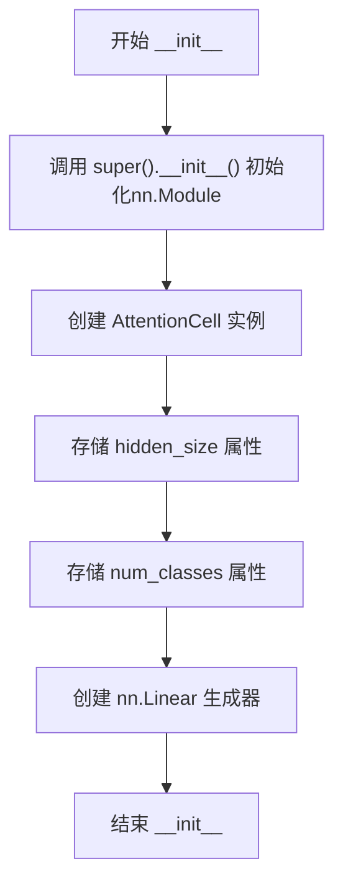
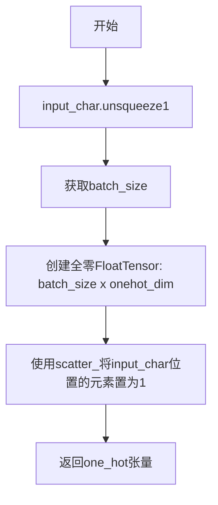
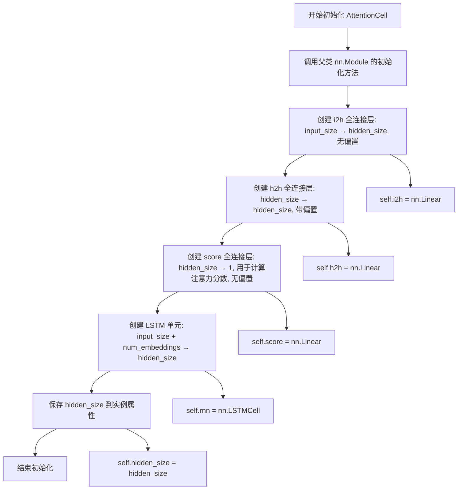

# `comic-translate\modules\ocr\pororo\pororo\models\brainOCR\modules\prediction.py` 详细设计文档

这是一个基于PyTorch实现的注意力机制解码器模块，主要用于序列到序列（Seq2Seq）任务，如OCR文字识别等场景。该模块包含Attention解码器和AttentionCell注意力计算单元，通过将字符转换为one-hot向量并结合encoder的上下文特征，逐步生成目标序列的概率分布。

## 整体流程

```mermaid
graph TD
    A[开始] --> B[输入: batch_H (encoder隐藏状态) 和 text (文本索引)]
    B --> C{是否训练模式?}
    C -- 是 --> D[训练模式: 遍历每个时间步]
    D --> E[将text[:, i]转换为one-hot向量]
    E --> F[调用AttentionCell计算新的hidden和alpha]
    F --> G[保存hidden到output_hiddens]
    G --> H{是否遍历完所有时间步?}
    H -- 否 --> E
    H -- 是 --> I[通过generator生成概率分布]
    C -- 否 --> J[推理模式: 初始化targets为GO token]
    J --> K[自回归生成: 将当前预测作为下一步输入]
    K --> L[调用AttentionCell和generator]
    L --> M[更新targets为预测的字符]
    M --> N{是否达到最大长度?}
    N -- 否 --> K
    N -- 是 --> O[返回所有时间步的概率分布]
    I --> O
```

## 类结构

```
nn.Module (PyTorch基类)
├── Attention (注意力解码器)
│   └── AttentionCell (注意力计算单元)
```

## 全局变量及字段


### `device`
    
全局设备变量，根据CUDA可用性设置为cuda或cpu

类型：`torch.device`
    


### `Attention.attention_cell`
    
注意力计算单元实例

类型：`AttentionCell`
    


### `Attention.hidden_size`
    
隐藏层大小

类型：`int`
    


### `Attention.num_classes`
    
分类类别数量

类型：`int`
    


### `Attention.generator`
    
从隐藏状态到类别概率的线性映射层

类型：`nn.Linear`
    


### `AttentionCell.i2h`
    
输入到隐藏状态的线性变换

类型：`nn.Linear`
    


### `AttentionCell.h2h`
    
隐藏状态到隐藏状态的线性变换

类型：`nn.Linear`
    


### `AttentionCell.score`
    
计算注意力分数的线性层

类型：`nn.Linear`
    


### `AttentionCell.rnn`
    
LSTM单元，用于更新隐藏状态

类型：`nn.LSTMCell`
    


### `AttentionCell.hidden_size`
    
隐藏层大小

类型：`int`
    
    

## 全局函数及方法


### `Attention.__init__`

初始化注意力解码器（Attention Decoder），用于序列到序列的字符识别任务。该方法构建注意力机制的解码器网络，包含注意力单元、LSTM隐藏状态和输出分类器。

参数：

- `input_size`：`int`，输入特征的维度，对应编码器输出的上下文特征通道数
- `hidden_size`：`int`，LSTM隐藏状态的维度，用于注意力计算和LSTM单元
- `num_classes`：`int`，目标字符类别总数，用于One-hot编码和最终分类的类别数

返回值：`None`（`__init__` 方法不返回值，仅初始化实例属性）

#### 流程图



#### 带注释源码

```python
def __init__(self, input_size, hidden_size, num_classes):
    """
    初始化注意力解码器
    
    参数:
        input_size: 输入特征维度（编码器输出的上下文特征通道数）
        hidden_size: LSTM隐藏状态维度
        num_classes: 目标字符类别总数
    """
    # 调用父类nn.Module的初始化方法，建立PyTorch模型的基础结构
    super(Attention, self).__init__()
    
    # 创建注意力单元(AttentionCell)，负责计算注意力权重和LSTM解码
    # 参数: input_size, hidden_size, num_classes
    self.attention_cell = AttentionCell(input_size, hidden_size,
                                        num_classes)
    
    # 保存隐藏层大小到实例属性，供forward方法中创建tensor时使用
    self.hidden_size = hidden_size
    
    # 保存类别数量到实例属性，用于One-hot编码和生成器输出维度
    self.num_classes = num_classes
    
    # 创建线性生成器，将LSTM隐藏状态映射到类别概率分布
    # 输入维度: hidden_size, 输出维度: num_classes
    # 用于将每个时间步的隐藏状态转换为类别概率
    self.generator = nn.Linear(hidden_size, num_classes)
```


### `Attention._char_to_onehot`

该方法负责将字符索引（整数）转换为one-hot向量编码，用于注意力机制的字符级别特征表示，以便decoder能够基于先前的字符进行当前时刻的预测。

参数：

- `input_char`：`torch.Tensor`，形状为 [batch_size] 的字符索引张量，包含需要转换为one-hot编码的整数索引
- `onehot_dim`：`int`，默认为38，表示one-hot向量的维度，对应字符集的大小

返回值：`torch.FloatTensor`，形状为 [batch_size, onehot_dim] 的二维张量，其中每一行是对应字符索引的one-hot编码向量

#### 流程图



#### 带注释源码

```python
def _char_to_onehot(self, input_char, onehot_dim=38):
    """
    将字符索引转换为one-hot向量表示
    
    参数:
        input_char: 字符索引张量, 形状为[batch_size], 值为0-37的整数
        onehot_dim: one-hot向量的维度, 默认为38
    
    返回:
        one_hot: one-hot编码张量, 形状为[batch_size, onehot_dim]
    """
    # 在第1维(维度1)添加一个维度，将[batch_size]变为[batch_size, 1]
    # 例如: tensor([1, 2, 3]) -> tensor([[1], [2], [3]])
    input_char = input_char.unsqueeze(1)
    
    # 获取当前批次的样本数量
    batch_size = input_char.size(0)
    
    # 创建形状为[batch_size, onehot_dim]的全零FloatTensor
    # 并将其移动到计算设备上(CPU或GPU)
    one_hot = torch.FloatTensor(batch_size, onehot_dim).zero_().to(device)
    
    # 使用scatter_方法进行填充:
    # 参数1: 维度索引(1表示在列维度)
    # 参数2: 索引张量input_char, 指定填充位置
    # 参数3: 填充值(1表示设置为1)
    # 效果: 在one_hot的第i行、第input_char[i]列位置填入1
    one_hot = one_hot.scatter_(1, input_char, 1)
    
    # 返回生成的one-hot编码张量
    return one_hot
```

#### 详细说明

该方法是Attention类中的私有方法（以单下划线前缀标识），其核心功能是将离散的字符索引转换为连续的one-hot向量表示，以便与神经网络的其他部分进行数值运算。

**设计意图**：
- 在Attention机制的训练阶段，每个时间步需要将上一时刻的真实字符标签（text[:, i]）转换为one-hot向量，作为attention_cell的输入之一
- 在推理阶段，则需要将模型预测的字符索引转换为one-hot向量

**关键实现点**：
1. `unsqueeze(1)`：将一维张量扩展为二维，便于后续scatter操作
2. `zero_()`：初始化全零张量，节省内存
3. `scatter_(1, input_char, 1)`：这是PyTorch中实现one-hot编码的高效方式，利用了张量操作而非循环

**潜在优化建议**：
- 可以考虑使用 `F.one_hot()` 替代手动实现的scatter操作，代码更简洁
- 默认值38是硬编码的，可以考虑从外部配置或构造函数传入，提高灵活性


### `Attention.forward`

该方法实现注意力机制的前向传播过程，根据编码器输出的上下文特征和已解码的字符序列，计算每个时间步的字符概率分布，支持训练模式和推理模式两种处理流程。

参数：

- `batch_H`：`torch.Tensor`，上下文特征矩阵，形状为 [batch_size x num_steps x contextual_feature_channels]，即编码器的隐藏状态序列
- `text`：`torch.Tensor`，文本索引张量，形状为 [batch_size x (max_length+1)]，其中 +1 用于 [GO] 起始标记，text[:, 0] = [GO]
- `is_train`：`bool`，布尔标志，指定是否为训练模式；训练时使用真实标签文本，推理时使用预测的字符作为下一步输入
- `batch_max_length`：`int`，批处理中序列的最大长度，用于确定解码的时间步数

返回值：`torch.Tensor`，返回每个时间步的概率分布，形状为 [batch_size x num_steps x num_classes]，其中 num_classes 表示字符类别数

#### 流程图

```mermaid
graph TD
    A[开始 forward] --> B[初始化 hidden 状态和 output_hiddens]
    B --> C{is_train?}
    C -->|True 训练模式| D[遍历每个时间步 i]
    D --> E[将 text[:, i] 转换为 one-hot 向量]
    E --> F[调用 AttentionCell 计算 hidden 和 alpha]
    F --> G[将 hidden 存入 output_hiddens[:, i]]
    G --> H{是否还有时间步?}
    H -->|是| D
    H -->|否| I[使用 generator 生成概率分布]
    I --> J[返回 probs]
    
    C -->|False 推理模式| K[初始化 targets 为全0 [GO] 和 probs]
    K --> L[遍历每个时间步 i]
    L --> M[将当前 targets 转换为 one-hot 向量]
    M --> N[调用 AttentionCell 计算 hidden 和 alpha]
    N --> O[使用 generator 生成概率分布]
    O --> P[保存 probs[:, i]]
    P --> Q[取概率最大的类别作为下一步输入]
    Q --> R[更新 targets]
    R --> S{是否还有时间步?}
    S -->|是| L
    S -->|否| J
```

#### 带注释源码

```python
def forward(self, batch_H, text, is_train=True, batch_max_length=25):
    """
    Attention 模块的前向传播函数
    
    参数:
        batch_H: 编码器的上下文特征，形状 [batch_size x num_steps x contextual_feature_channels]
        text: 文本索引，形状 [batch_size x (max_length+1)]，首元素为 [GO] token
        is_train: 是否为训练模式
        batch_max_length: 批处理最大长度
    
    返回:
        probs: 概率分布，形状 [batch_size x num_steps x num_classes]
    """
    # 获取批大小
    batch_size = batch_H.size(0)
    # 计算解码总步数（加1用于结束标记 [s]）
    num_steps = batch_max_length + 1

    # 初始化输出隐藏状态矩阵，用于存储每个时间步的隐藏状态
    output_hiddens = (torch.FloatTensor(
        batch_size, num_steps, self.hidden_size).fill_(0).to(device))
    
    # 初始化 LSTM 隐藏状态 (h, c)，全部置零
    hidden = (
        torch.FloatTensor(batch_size, self.hidden_size).fill_(0).to(device),
        torch.FloatTensor(batch_size, self.hidden_size).fill_(0).to(device),
    )

    # 根据模式选择不同的解码策略
    if is_train:
        # ---------- 训练模式 ----------
        # 使用真实标签 text 进行 Teacher Forcing
        for i in range(num_steps):
            # 将第 i 个字符索引转换为 one-hot 向量
            # 形状: [batch_size x num_classes]
            char_onehots = self._char_to_onehot(text[:, i],
                                                onehot_dim=self.num_classes)
            
            # 调用注意力单元计算新的隐藏状态
            # hidden: 上一时刻的解码器隐藏状态
            # batch_H: 编码器所有时刻的隐藏状态
            # char_onehots: 上一时刻的真实字符（one-hot）
            hidden, alpha = self.attention_cell(hidden, batch_H,
                                                char_onehots)
            
            # 保存隐藏状态到输出序列（取 LSTM 的 hidden 部分，索引0）
            output_hiddens[:, i, :] = hidden[0]
        
        # 通过线性生成器将隐藏状态转换为类别概率
        probs = self.generator(output_hiddens)

    else:
        # ---------- 推理模式 ----------
        # 初始化目标序列，从 [GO] token 开始（值为0）
        targets = torch.LongTensor(batch_size).fill_(0).to(device)
        # 初始化概率矩阵
        probs = (torch.FloatTensor(batch_size, num_steps,
                                   self.num_classes).fill_(0).to(device))

        # 贪婪解码：每个时间步选择概率最大的类别
        for i in range(num_steps):
            # 将当前预测的字符转换为 one-hot 向量
            char_onehots = self._char_to_onehot(targets,
                                                onehot_dim=self.num_classes)
            
            # 注意力单元计算
            hidden, alpha = self.attention_cell(hidden, batch_H,
                                                char_onehots)
            
            # 生成当前时间步的概率分布
            probs_step = self.generator(hidden[0])
            probs[:, i, :] = probs_step
            
            # 贪婪选择：取概率最大的类别作为下一步输入
            _, next_input = probs_step.max(1)
            targets = next_input

    # 返回所有时间步的概率分布
    return probs  # batch_size x num_steps x num_classes
```


### `AttentionCell.__init__`

初始化注意力单元，构建注意力机制所需的全连接层和LSTM单元，用于序列到序列模型中的上下文注意力计算。

参数：

- `input_size`：`int`，输入特征的维度大小，表示编码器输出的上下文特征维度
- `hidden_size`：`int`，隐藏层的大小，同时作为LSTM隐藏状态的维度
- `num_embeddings`：`int`，类别数量或嵌入维度，用于定义字符嵌入的空间大小

返回值：`None`，__init__方法仅初始化对象属性，不返回任何值

#### 流程图



#### 带注释源码

```python
def __init__(self, input_size, hidden_size, num_embeddings):
    """
    初始化注意力单元的构造函数
    
    参数:
        input_size: 输入特征的维度，即编码器输出的上下文特征维度
        hidden_size: 隐藏层维度，用于LSTM和注意力计算
        num_embeddings: 类别数量，用于字符嵌入的维度
    """
    # 调用父类 nn.Module 的构造函数，完成模块的初始化
    super(AttentionCell, self).__init__()
    
    # i2h: input-to-hidden 全连接层
    # 将编码器的上下文特征从 input_size 维度映射到 hidden_size 维度
    # bias=False 用于避免冗余偏置，因为 h2h 已经包含偏置
    self.i2h = nn.Linear(input_size, hidden_size, bias=False)
    
    # h2h: hidden-to-hidden 全连接层
    # 将上一时刻的隐藏状态映射到当前隐藏状态空间
    # 带有偏置项，用于学习额外的偏移量
    self.h2h = nn.Linear(hidden_size, hidden_size)
    
    # score: 注意力分数计算层
    # 将合并后的特征映射到标量分数，用于计算注意力权重
    # 输出维度为1，表示每个编码器位置的重要性得分
    self.score = nn.Linear(hidden_size, 1, bias=False)
    
    # rnn: LSTM 单元
    # 结合上下文注意力和当前输入字符，生成新的隐藏状态
    # 输入维度为 input_size + num_embeddings（上下文特征 + 字符嵌入）
    # 输出维度为 hidden_size
    self.rnn = nn.LSTMCell(input_size + num_embeddings, hidden_size)
    
    # 保存隐藏层大小供后续 forward 方法使用
    self.hidden_size = hidden_size
```


### `AttentionCell.forward`

该方法实现注意力机制的前向传播，通过计算编码器隐藏状态的加权和得到上下文向量，然后将其与字符的one-hot编码拼接后输入LSTM细胞，最终输出新的隐藏状态和注意力权重。

参数：

- `prev_hidden`：`Tuple[torch.FloatTensor, torch.FloatTensor]`，LSTM的前一个隐藏状态，包含隐藏状态h和细胞状态c
- `batch_H`：`torch.FloatTensor`，编码器的上下文特征，形状为 [batch_size × num_encoder_steps × num_channels]
- `char_onehots`：`torch.FloatTensor`，当前字符的one-hot编码，形状为 [batch_size × num_embeddings]

返回值：`Tuple[Tuple[torch.FloatTensor, torch.FloatTensor], torch.FloatTensor]`，第一个元素是LSTM新的隐藏状态元组(h, c)，第二个元素是注意力权重alpha，形状为 [batch_size × num_encoder_steps × 1]

#### 流程图

```mermaid
flowchart TD
    A[输入: prev_hidden, batch_H, char_onehots] --> B[计算 batch_H_proj = i2h(batch_H)]
    B --> C[计算 prev_hidden_proj = h2h(prev_hidden[0]) 并扩展维度]
    C --> D[计算注意力分数 e = score(tanh(batch_H_proj + prev_hidden_proj))]
    D --> E[计算注意力权重 alpha = softmax(e, dim=1)]
    E --> F[计算上下文向量 context = bmm(alpha.permute(0,2,1), batch_H).squeeze(1)]
    F --> G[拼接上下文和字符one-hot: concat_context = concat([context, char_onehots])]
    G --> H[通过LSTM细胞: cur_hidden = rnn(concat_context, prev_hidden)]
    H --> I[输出: cur_hidden, alpha]
```

#### 带注释源码

```python
def forward(self, prev_hidden, batch_H, char_onehots):
    # 第一步：将编码器特征batch_H投影到隐藏空间
    # [batch_size x num_encoder_step x num_channel] -> [batch_size x num_encoder_step x hidden_size]
    batch_H_proj = self.i2h(batch_H)
    
    # 第二步：将前一个隐藏状态投影到隐藏空间并扩展维度以便与batch_H_proj相加
    # prev_hidden[0] 是LSTM的隐藏状态h，形状为 [batch_size x hidden_size]
    # unsqueeze(1) 后变为 [batch_size x 1 x hidden_size]
    prev_hidden_proj = self.h2h(prev_hidden[0]).unsqueeze(1)
    
    # 第三步：计算注意力分数
    # 使用tanh激活函数结合投影后的编码器特征和解码器隐藏状态
    # 结果e的形状为 [batch_size x num_encoder_step x 1]
    e = self.score(
        torch.tanh(batch_H_proj +
                   prev_hidden_proj))  # batch_size x num_encoder_step * 1

    # 第四步：对注意力分数进行softmax归一化，得到注意力权重
    # dim=1 表示在encoder步骤维度上进行归一化
    alpha = F.softmax(e, dim=1)
    
    # 第五步：计算上下文向量
    # alpha.permute(0,2,1) 将alpha从 [batch_size x num_encoder_step x 1] 转为 [batch_size x 1 x num_encoder_step]
    # torch.bmm 进行批量矩阵乘法，得到 [batch_size x 1 x num_channels]
    # .squeeze(1) 移除维度1，得到 [batch_size x num_channels]
    context = torch.bmm(alpha.permute(0, 2, 1),
                        batch_H).squeeze(1)  # batch_size x num_channel
    
    # 第六步：拼接上下文向量和字符的one-hot编码
    # 上下文向量包含编码器信息，char_onehots包含解码器上一个字符的信息
    # 拼接后形状: [batch_size x (num_channels + num_embedding)]
    concat_context = torch.cat(
        [context, char_onehots],
        1)  # batch_size x (num_channel + num_embedding)
    
    # 第七步：将拼接后的向量输入LSTM细胞，得到新的隐藏状态
    # cur_hidden 是一个元组 (h, c)，分别代表新的隐藏状态和细胞状态
    cur_hidden = self.rnn(concat_context, prev_hidden)
    
    # 返回新的隐藏状态和注意力权重
    return cur_hidden, alpha
```

## 关键组件


### 1. 设备配置 (device)

全局变量，类型为 torch.device，用于自动选择 CUDA 或 CPU 作为计算设备。

### 2. Attention 类

核心解码器模块，实现了带注意力机制的 LSTM 解码器，用于将编码器输出的上下文特征序列逐步解码为目标字符序列。包含训练和推理两种模式，支持可变长度序列生成。

### 3. AttentionCell 类

注意力机制的核心实现单元，负责计算上下文注意力权重并生成当前时刻的隐藏状态。包含特征投影层、注意力分数计算层和 LSTM 单元。

### 4. _char_to_onehot 方法

将输入的字符索引转换为 one-hot 编码向量，用于将离散字符转换为连续向量表示，以便与神经网络进行处理。

### 5. Attention.forward 方法

解码器的前向传播方法，支持训练和推理两种模式。训练模式下使用教师强制（teacher forcing），推理模式下使用自回归生成。

### 6. AttentionCell.forward 方法

实现注意力机制的核心逻辑，包括编码器特征投影、解码器隐藏状态投影、注意力分数计算、上下文向量生成和 LSTM 隐藏状态更新。

### 7. 注意力分数计算 (score 层)

使用单层线性网络计算编码器各时刻与解码器当前状态的相似度得分，通过 tanh 激活函数实现非线性变换。

### 8. LSTM 解码器 (rnn 单元)

LSTMCell 实现，负责根据当前上下文向量和前一时刻隐藏状态生成新的隐藏状态，用于序列解码。

### 9. 全连接生成器 (generator)

线性层，将解码器的隐藏状态映射到类别概率分布，输出每个时刻对应各个字符类别的得分。


## 问题及建议


### 已知问题

- **设备管理不一致**：代码在模块级别定义`device = torch.device("cuda" if torch.cuda.is_available() else "cpu")`，但在类方法中直接使用`to(device)`，可能导致在不同设备环境下运行时出现错误，例如在模型未移动到GPU时仍尝试使用CUDA设备。
- **硬编码的one-hot维度**：`Attention`类的`_char_to_onehot`方法中默认参数`onehot_dim=38`是硬编码的，而实际使用时传入`self.num_classes`，如果`num_classes`不等于38，会导致维度不匹配错误。
- **推理模式缺乏结束条件**：在`forward`方法的推理分支（`is_train=False`）中，循环固定执行`num_steps`次，没有根据生成序列的实际长度（如遇到结束符[EOS]）提前终止，可能导致不必要的计算和资源浪费。
- **缺乏输入验证**：代码没有检查输入`batch_H`和`text`的维度是否合法，可能在维度不匹配时产生难以追踪的错误。
- **训练与推理代码重复**：训练和推理的循环结构高度相似，仅在字符处理和目标张量更新上有所不同，增加了维护成本和出错风险。

### 优化建议

- **统一设备管理**：将`device`作为参数传递给类方法，或在模型初始化时记录`self.device = next(self.parameters()).device`，并在所有张量操作中使用`self.device`。
- **移除硬编码默认值**：修改`_char_to_onehot`方法，去除`onehot_dim=38`的默认值，强制要求调用者传入正确的维度，或直接使用`self.num_classes`。
- **添加推理结束条件**：在推理循环中检测预测的类别是否为结束符（如假设类别0为[EOS]），若是则提前停止生成，并填充剩余步骤的概率为零。
- **增加输入验证**：在`forward`方法开头添加维度检查，例如`assert batch_H.size(0) == text.size(0), "Batch size mismatch"`，确保输入一致性。
- **重构代码**：将训练和推理的共享逻辑（如注意力计算、隐藏状态更新）提取为私有方法，简化`forward`方法，提高代码可读性。
- **使用推理上下文**：在推理分支外包裹`with torch.no_grad():`以禁用梯度计算，减少内存占用并提升推理速度。

## 其它


### 设计目标与约束

**设计目标**：
- 实现基于注意力机制的序列到序列解码器，用于OCR任务中的字符识别
- 支持变长文本序列生成，最大长度默认为25个字符
- 提供训练模式和推理模式两种工作方式

**设计约束**：
- 输入编码器特征维度（input_size）需与编码器输出维度匹配
- 隐藏层维度（hidden_size）需在整个网络中保持一致
- 类别数（num_classes）需与字符集大小匹配，默认为38（包含0-9数字、A-Z字母及特殊字符）

### 错误处理与异常设计

**输入验证**：
- `batch_H`维度检查：确保为3D张量[batch_size x num_steps x input_size]
- `text`维度检查：训练时确保形状为[batch_size x (max_length+1)]
- `batch_max_length`类型检查：需为正整数

**设备兼容性**：
- 自动检测CUDA可用性并选择计算设备
- 所有张量创建均指定device参数，确保设备一致性

**边界情况处理**：
- 推理模式下的num_steps固定为26（max_length+1）
- 训练模式下循环次数由num_steps控制，确保不越界

### 数据流与状态机

**训练模式数据流**：
1. 初始化隐藏状态为零向量
2. 迭代遍历每个时间步（0到num_steps-1）
3. 将真实标签字符转换为one-hot向量
4. 调用AttentionCell计算新的隐藏状态和注意力权重
5. 将隐藏状态存储到output_hiddens
6. 循环结束后，通过generator线性层生成概率分布

**推理模式数据流**：
1. 初始化目标张量为[GO] token（全0）
2. 迭代遍历每个时间步
3. 将当前预测字符转换为one-hot向量
4. 调用AttentionCell计算新的隐藏状态和注意力权重
5. 通过generator生成概率分布
6. 取概率最大项作为下一时间步的输入
7. 重复直到完成所有时间步

### 外部依赖与接口契约

**PyTorch依赖**：
- `torch` - 张量运算和设备管理
- `torch.nn` - 神经网络模块（Linear、LSTMCell）
- `torch.nn.functional` - 函数式API（softmax）

**输入接口**：
- `batch_H`: 编码器输出特征，形状[batch_size x num_steps x input_size]
- `text`: 文本索引，形状[batch_size x (max_length+1)]，首元素为[GO] token
- `is_train`: 布尔值，指定训练或推理模式
- `batch_max_length`: 最大序列长度，默认25

**输出接口**：
- `probs`: 概率分布，形状[batch_size x num_steps x num_classes]

### 性能考虑与优化空间

**当前实现特点**：
- 训练模式使用真实标签（teacher forcing），推理模式使用自回归预测
- 注意力计算使用矩阵运算，可利用GPU并行加速

**潜在优化方向**：
- 缓存推理过程中的中间结果，避免重复计算
- 使用torch.no_grad()装饰推理函数，减少内存占用
- 考虑使用torch.jit.script编译以提升推理速度
- 隐藏状态初始化可考虑学习参数而非固定零向量

### 配置参数说明

| 参数名 | 类型 | 默认值 | 说明 |
|--------|------|--------|------|
| input_size | int | 必填 | 编码器输出特征维度 |
| hidden_size | int | 必填 | LSTM隐藏层维度 |
| num_classes | int | 38 | 字符类别总数（含[GO]和[s] token） |
| batch_max_length | int | 25 | 最大文本长度 |

### 使用示例

```python
# 初始化
attention_model = Attention(input_size=256, hidden_size=256, num_classes=38)

# 训练模式
batch_H = torch.randn(4, 10, 256)  # 编码器输出
text = torch.randint(1, 38, (4, 26))  # 文本索引
probs = attention_model(batch_H, text, is_train=True, batch_max_length=25)

# 推理模式
probs = attention_model(batch_H, text, is_train=False, batch_max_length=25)
```


    