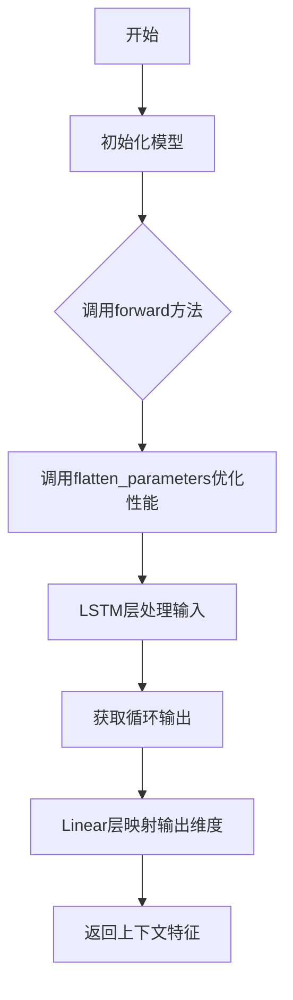
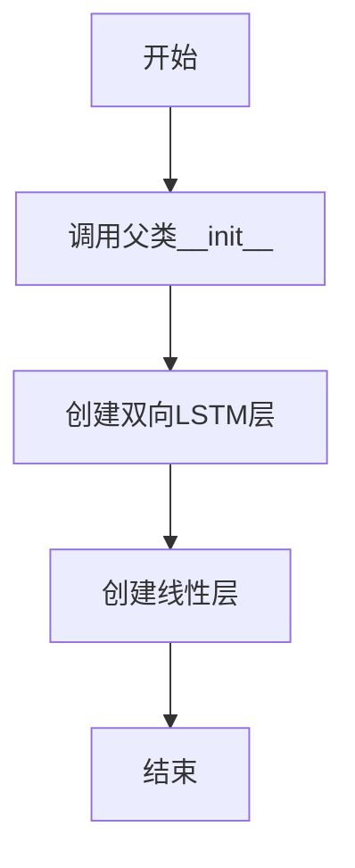
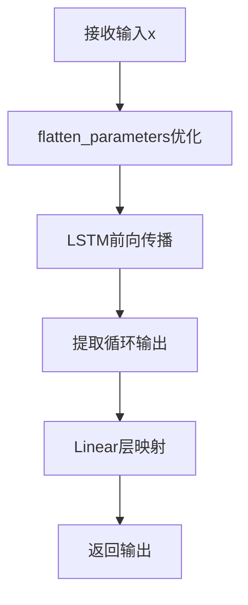

# `comic-translate\modules\ocr\pororo\pororo\models\brainOCR\modules\sequence_modeling.py` 详细设计文档

这是一个基于PyTorch的双向LSTM神经网络模块，用于处理视觉特征并输出上下文特征表示。该模型通过双向LSTM层捕获序列的前后文信息，并通过线性层将高维隐藏状态映射到目标输出维度。

## 整体流程



## 类结构

```
nn.Module (PyTorch基类)
└── BidirectionalLSTM (自定义双向LSTM模型)
```

## 全局变量及字段


### `BidirectionalLSTM.rnn`
    
双向LSTM循环神经网络层，用于提取序列特征

类型：`nn.LSTM`
    


### `BidirectionalLSTM.linear`
    
全连接线性层，将双向隐藏状态映射到输出维度

类型：`nn.Linear`
    
    

## 全局函数及方法


### `BidirectionalLSTM.__init__`

构造函数，用于初始化双向LSTM模型的结构，包括调用父类构造函数、创建双向LSTM层和输出线性层。

参数：

-  `input_size`：`int`，输入特征的维度
-  `hidden_size`：`int`，LSTM隐藏层的维度
-  `output_size`：`int`，输出特征的维度

返回值：`None`，构造函数无返回值

#### 流程图



#### 带注释源码

```python
def __init__(self, input_size: int, hidden_size: int, output_size: int):
    # 调用父类 nn.Module 的构造函数
    super(BidirectionalLSTM, self).__init__()
    # 创建双向 LSTM 层，输入维度为 input_size，隐藏层维度为 hidden_size
    # bidirectional=True 开启双向功能，batch_first=True 表示输入输出张量的第一维为 batch size
    self.rnn = nn.LSTM(input_size,
                       hidden_size,
                       bidirectional=True,
                       batch_first=True)
    # 创建线性层，将双向 LSTM 的输出（hidden_size * 2）映射到 output_size
    self.linear = nn.Linear(hidden_size * 2, output_size)
```


### BidirectionalLSTM.forward

实现双向LSTM网络的前向传播，将输入的视觉特征通过双向LSTM编码后，再通过线性层映射为上下文特征输出。

参数：

- `x`：`torch.Tensor`，输入张量，形状为[batch_size x T x input_size]

返回值：`torch.Tensor`，输出张量，形状为[batch_size x T x output_size]

#### 流程图



#### 带注释源码

```python
def forward(self, x):
    """
    x : visual feature [batch_size x T=24 x input_size=512]
    output : contextual feature [batch_size x T x output_size]
    """
    # 调用flatten_parameters优化LSTM性能，将参数展平以加速计算
    self.rnn.flatten_parameters()
    # 执行双向LSTM前向传播，将输入特征转换为双向循环特征
    # 输入: [batch_size x T x input_size]
    # 输出: [batch_size x T x (2*hidden_size)]
    recurrent, _ = self.rnn(x)
    # 通过线性层将双向隐藏状态映射到目标输出维度
    # 输入: [batch_size x T x (2*hidden_size)]
    # 输出: [batch_size x T x output_size]
    output = self.linear(recurrent)
    return output
```

## 关键组件


### BidirectionalLSTM 类

双向LSTM神经网络模型，用于将输入的视觉特征序列转换为上下文特征序列，实现双向序列建模和特征维度映射。

### nn.LSTM 组件

双向LSTM循环神经网络层，负责接收输入序列并生成双向编码的隐藏状态序列，支持batch_first格式输入。

### nn.Linear 组件

线性全连接层，将双向LSTM输出的2倍隐藏状态维度映射到目标输出维度，实现特征空间的线性变换。

### flatten_parameters 方法

优化LSTM计算效率的方法，通过将参数连续存储来加速GPU上的前向与反向传播计算。

### forward 方法

模型的核心前向传播方法，接收批量视觉特征张量，经过双向LSTM编码和线性层映射，输出上下文特征张量。


## 问题及建议


### 已知问题

-   **super() 调用方式过时**：使用了 `super(BidirectionalLSTM, self).__init__()` 而非更简洁现代的 `super().__init__()`
-   **缺少 Dropout 正则化**：双向 LSTM 容易过拟合，未添加 Dropout 层进行正则化处理
-   **LSTM 层数固定为 1**：代码仅支持单层 LSTM，无法通过参数配置多层堆叠
-   **flatten_parameters() 调用位置**：在每次 forward 时调用，对于小型模型或某些场景可能带来不必要的开销
- **参数初始化未显式处理**：未对 LSTM 和 Linear 层进行显式的参数初始化，可能影响收敛速度和性能
- **类型注解不完整**：forward 方法缺少返回值的类型注解
- **变量命名不够直观**：output_size 实际表示输出维度而非"数量"，命名可能引起误解
- **错误处理缺失**：未对输入维度兼容性进行验证

### 优化建议

-   使用 `super().__init__()` 简化父类初始化调用
-   在 LSTM 后添加 Dropout 层：`self.dropout = nn.Dropout(dropout)`
-   添加 `num_layers` 参数支持多层 LSTM 配置
-   将 `flatten_parameters()` 移至 `__init__` 中或使用 `torch.jit.script` 优化
-   补充完整的类型注解，如 `-> torch.Tensor`
-   考虑添加参数初始化方法，如 Xavier 或 Kaiming 初始化
-   在 forward 方法开头添加输入维度兼容性检查
-   考虑重命名 `output_size` 为 `output_dim` 以提高可读性

## 其它


### 设计目标与约束

本模块旨在实现一个双向LSTM网络，用于从视觉特征中提取上下文信息，核心目标是将输入的视觉特征序列转换为具有上下文表示的特征输出。设计约束包括：1) 必须使用PyTorch框架实现；2) 输入维度固定为T=24的时间步长；3) 输入特征维度为512；4) 输出维度可配置；5) 必须支持批量处理。

### 错误处理与异常设计

代码中未实现显式的错误处理机制。建议添加以下异常处理：1) 输入维度验证，检查input_size、hidden_size、output_size为正整数；2) 输入张量维度校验，确保输入x为三维张量且第二维为24；3) 梯度检查，确保输出张量梯度计算正确；4) 设备兼容性检查，支持CPU和GPU设备迁移；5) 权重初始化异常捕获，防止NaN或Inf值出现。

### 数据流与状态机

数据流如下：输入张量x（batch_size×T×input_size）→LSTM层双向编码→隐藏状态recurrent（batch_size×T×2*hidden_size）→线性层映射→输出张量output（batch_size×T×output_size）。状态机包含两个状态：初始化状态（模型构建）和前向传播状态（forward方法执行）。LSTM的隐藏状态和细胞状态在每次前向传播时由PyTorch自动管理。

### 外部依赖与接口契约

主要依赖包括：1) torch>=1.0.0；2) torch.nn模块。接口契约规定：1) 构造函数接收三个整数参数（input_size、hidden_size、output_size）；2) forward方法接收三维张量x；3) 返回三维张量output；4) 模型支持train()和eval()模式切换；5) 模型参数可通过state_dict()获取和加载。

### 性能考虑与优化建议

当前实现使用flatten_parameters()优化LSTM计算性能。优化建议：1) 对于小批量数据，考虑使用pack_padded_sequence加速变长序列处理；2) 可选使用torch.jit.script编译加速推理；3) 对于多GPU场景，使用DataParallel实现并行计算；4) 可添加混合精度训练支持（FP16）以提升训练速度；5) 考虑使用nn.Identity或残差连接处理深层网络梯度问题。

### 安全性考虑

当前代码无明显安全风险。建议：1) 避免在模型中存储敏感信息；2) 模型序列化时注意防止恶意权重文件攻击；3) 加载外部预训练模型时进行完整性校验；4) 防止梯度爆炸攻击，可在forward中添加梯度裁剪检查。

### 兼容性考虑

版本兼容性：1) 代码兼容PyTorch 1.0及以上版本；2) Python版本建议3.6及以上；3) 设备兼容性需手动处理，建议添加device属性支持。API稳定性：LSTM和Linear层接口在PyTorch各版本中保持稳定，向后兼容性好。

### 测试策略建议

建议添加以下测试用例：1) 单元测试验证模型初始化和各层维度；2) 前向传播输出形状验证；3) 梯度计算正确性验证；4) 模型序列化与反序列化测试；5) 设备迁移测试（CPU/GPU）；6) 批量大小为1的边界情况测试；7) 随机输入稳定性测试（无NaN/Inf）。

### 部署注意事项

部署时需注意：1) 模型文件大小取决于hidden_size和output_size参数；2) 推理时需确保PyTorch版本与训练环境一致；3) 若需跨平台部署，考虑使用ONNX格式导出；4) 生产环境建议使用torch.jit.script进行优化；5) 内存占用约为hidden_size参数的4-6倍（包含LSTM权重和线性层权重）。

### 配置参数说明

关键配置参数：1) input_size：输入特征维度，固定为512；2) hidden_size：LSTM隐藏层维度，影响模型容量和计算开销，建议值为256-512；3) output_size：输出特征维度，决定下游任务适应性；4) bidirectional：固定为True，开启双向编码。

### 版本历史与变更记录

当前版本为1.0.0。初始版本包含完整的双向LSTM实现。后续建议添加：1) 配置文件支持；2) 预训练模型加载接口；3) 可视化中间状态的方法；4) 自定义LSTM层数支持。

    