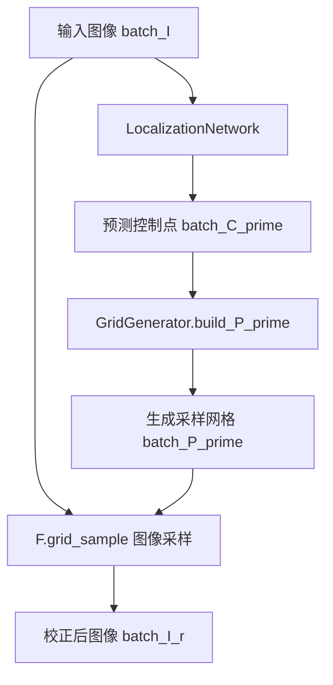
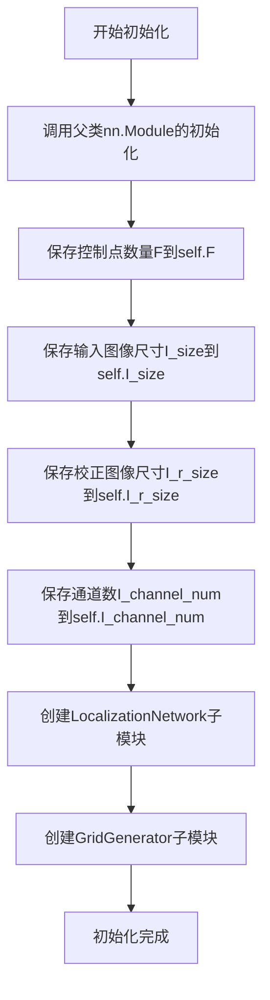
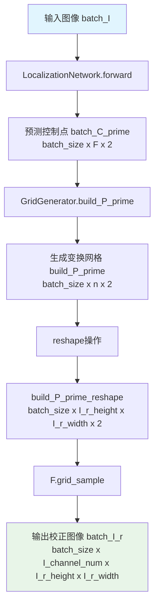
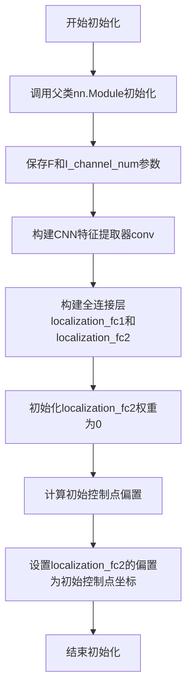
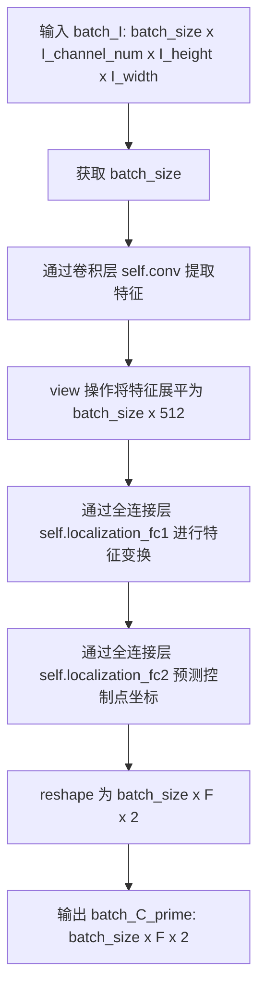
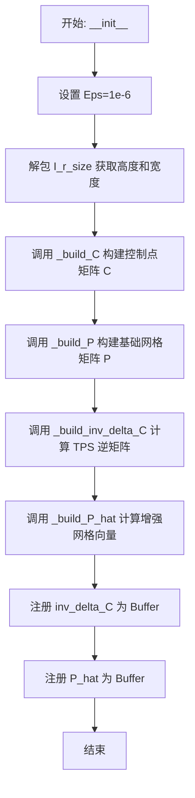
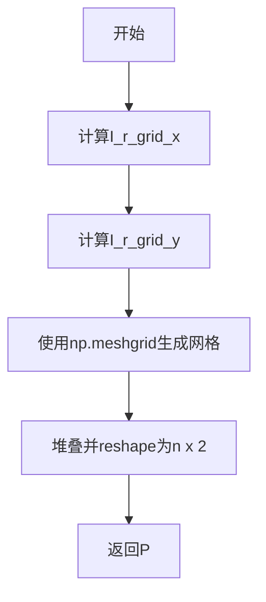
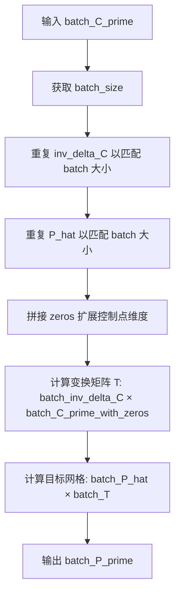

# `comic-translate\modules\ocr\pororo\pororo\models\brainOCR\modules\transformation.py` 详细设计文档

该文件实现了一个基于薄板样条（Thin Plate Spline, TPS）的空间变换网络（Spatial Transformer Network, STN）模块。主要用于场景文字识别（OCR）中的图像校正（Rectification），通过定位网络预测输入图像中的控制点，并利用TPS算法生成采样网格，对输入图像进行几何变换以矫正透视变形或文字弯曲。

## 整体流程



## 类结构

```
nn.Module (PyTorch 基类)
├── TpsSpatialTransformerNetwork (主模块)
│   ├── LocalizationNetwork (CNN特征提取与控制点回归)
│   └── GridGenerator (TPS网格生成与变换矩阵计算)
├── LocalizationNetwork
└── GridGenerator
```

## 全局变量及字段


### `np`
    
用于生成控制点和网格坐标的数值计算

类型：`numpy`
    


### `torch`
    
深度学习张量运算

类型：`torch`
    


### `torch.nn`
    
神经网络层定义

类型：`nn.Module`
    


### `torch.nn.functional (F)`
    
包含 grid_sample 等函数

类型：`functional`
    


### `TpsSpatialTransformerNetwork.TpsSpatialTransformerNetwork.F`
    
控制点数量 (Fiducial Points)

类型：`int`
    


### `TpsSpatialTransformerNetwork.TpsSpatialTransformerNetwork.I_size`
    
输入图像尺寸 (H, W)

类型：`tuple`
    


### `TpsSpatialTransformerNetwork.TpsSpatialTransformerNetwork.I_r_size`
    
校正后图像尺寸 (H, W)

类型：`tuple`
    


### `TpsSpatialTransformerNetwork.TpsSpatialTransformerNetwork.I_channel_num`
    
输入图像通道数

类型：`int`
    


### `TpsSpatialTransformerNetwork.TpsSpatialTransformerNetwork.LocalizationNetwork`
    
定位网络实例

类型：`nn.Module`
    


### `TpsSpatialTransformerNetwork.TpsSpatialTransformerNetwork.GridGenerator`
    
网格生成器实例

类型：`nn.Module`
    


### `LocalizationNetwork.LocalizationNetwork.F`
    
控制点数量

类型：`int`
    


### `LocalizationNetwork.LocalizationNetwork.I_channel_num`
    
输入通道数

类型：`int`
    


### `LocalizationNetwork.LocalizationNetwork.conv`
    
CNN特征提取器 (Conv2d + BatchNorm + ReLU + MaxPool)

类型：`nn.Sequential`
    


### `LocalizationNetwork.LocalizationNetwork.localization_fc1`
    
全连接层 (Linear + ReLU)

类型：`nn.Sequential`
    


### `LocalizationNetwork.LocalizationNetwork.localization_fc2`
    
输出层，预测 F*2 个坐标值

类型：`nn.Linear`
    


### `GridGenerator.GridGenerator.eps`
    
防止对数运算中出现除零的极小值

类型：`float`
    


### `GridGenerator.GridGenerator.I_r_height`
    
目标图像高度

类型：`int`
    


### `GridGenerator.GridGenerator.I_r_width`
    
目标图像宽度

类型：`int`
    


### `GridGenerator.GridGenerator.F`
    
控制点数量

类型：`int`
    


### `GridGenerator.GridGenerator.C`
    
规范化后的目标控制点坐标 (F x 2)

类型：`ndarray`
    


### `GridGenerator.GridGenerator.P`
    
规范化后的目标网格坐标 (n x 2)

类型：`ndarray`
    


### `GridGenerator.GridGenerator.inv_delta_C`
    
TPS变换的逆矩阵 (F+3 x F+3), 注册为 buffer

类型：`Tensor`
    


### `GridGenerator.GridGenerator.P_hat`
    
预计算的网格映射矩阵 (n x F+3), 注册为 buffer

类型：`Tensor`
    
    

## 全局函数及方法


### `TpsSpatialTransformerNetwork.__init__`

初始化TPS-STN（薄板样条空间变换网络）网络结构，该网络是RARE模型中的校正网络，基于薄板样条（TPS）变换实现图像校正功能。

参数：

- `F`：`int`，控制点（fiducial points）的数量，决定TPS变换的复杂度
- `I_size`：`Tuple[int, int]`，输入图像I的尺寸，格式为(高度, 宽度)
- `I_r_size`：`Tuple[int, int]`，校正后图像I_r的尺寸，格式为(高度, 宽度)
- `I_channel_num`：`int`，输入图像的通道数，默认为1（灰度图像）

返回值：`None`，`__init__`方法不返回任何值，仅初始化对象的内部状态

#### 流程图



#### 带注释源码

```python
def __init__(self, F, I_size, I_r_size, I_channel_num: int = 1):
    """Based on RARE TPS
    input:
        batch_I: Batch Input Image [batch_size x I_channel_num x I_height x I_width]
        I_size : (height, width) of the input image I
        I_r_size : (height, width) of the rectified image I_r
        I_channel_num : the number of channels of the input image I
    output:
        batch_I_r: rectified image [batch_size x I_channel_num x I_r_height x I_r_width]
    """
    # 调用父类nn.Module的构造函数，完成PyTorch模块的基础初始化
    super(TpsSpatialTransformerNetwork, self).__init__()
    
    # 保存控制点数量F，用于后续网络层和网格生成
    self.F = F
    
    # 保存输入图像的尺寸信息，用于后续处理
    self.I_size = I_size
    
    # 保存校正后图像的尺寸信息，格式为(I_r_height, I_r_width)
    self.I_r_size = I_r_size
    
    # 保存输入图像的通道数，默认值为1（灰度图像）
    self.I_channel_num = I_channel_num
    
    # 创建并注册LocalizationNetwork子模块
    # 该网络负责从输入图像预测控制点坐标C'
    self.LocalizationNetwork = LocalizationNetwork(self.F,
                                                   self.I_channel_num)
    
    # 创建并注册GridGenerator子模块
    # 该模块负责根据预测的控制点坐标生成采样网格
    self.GridGenerator = GridGenerator(self.F, self.I_r_size)
```


### `TpsSpatialTransformerNetwork.forward`

该方法执行TPS（薄板样条）空间变换网络的前向传播，通过LocalizationNetwork预测图像中的控制点，然后利用GridGenerator生成变换网格，最后使用`grid_sample`函数对输入图像进行双线性插值变换，实现对扭曲文本图像的校正。

参数：

- `batch_I`：`torch.Tensor`，批次输入图像，形状为 [batch_size × I_channel_num × I_height × I_width]

返回值：`torch.Tensor`，校正后的图像，形状为 [batch_size × I_channel_num × I_r_height × I_r_width]

#### 流程图



#### 带注释源码

```python
def forward(self, batch_I):
    """
    执行TPS空间变换网络的前向传播
    
    参数:
        batch_I: 批次输入图像 [batch_size x I_channel_num x I_height x I_width]
    
    返回:
        batch_I_r: 校正后的图像 [batch_size x I_channel_num x I_r_height x I_r_width]
    """
    # 步骤1: 通过LocalizationNetwork预测控制点坐标
    # 输入: 原始图像批次
    # 输出: 预测的控制点坐标(batch_C_prime)，形状为 [batch_size x F x 2]
    #       F为控制点数量(由初始化时的F参数指定)
    batch_C_prime = self.LocalizationNetwork(batch_I)
    
    # 步骤2: 使用GridGenerator根据预测的控制点生成变换网格
    # 输入: 预测的控制点坐标batch_C_prime
    # 输出: 变换网格点P_prime，形状为 [batch_size x n x 2]
    #       n = I_r_width x I_r_height (目标图像的像素总数)
    build_P_prime = self.GridGenerator.build_P_prime(
        batch_C_prime)
    
    # 步骤3: 将变换网格reshape为grid_sample所需的4D形状
    # 从 [batch_size x n x 2] reshape为 [batch_size x I_r_height x I_r_width x 2]
    # 最后一维2表示x和y坐标(uv坐标)
    build_P_prime_reshape = build_P_prime.reshape(
        [build_P_prime.size(0), self.I_r_size[0], self.I_r_size[1], 2])
    
    # 步骤4: 使用PyTorch的grid_sample函数进行图像变换
    # grid_sample使用双线性插值根据变换网格对输入图像进行采样
    # padding_mode='border'表示在边界外使用边界像素值填充
    # (注释掉的align_corners是PyTorch 1.2.0+的新参数)
    batch_I_r = F.grid_sample(batch_I,
                              build_P_prime_reshape,
                              padding_mode="border")
    
    # 返回校正后的图像
    return batch_I_r
```


### `LocalizationNetwork.__init__`

构建CNN特征提取器和全连接回归头，初始化控制点偏置，输出名称。

参数：
- `F`：控制点数量（int），控制点的数量，决定输出的坐标对数
- `I_channel_num`：输入图像通道数（int），输入图像的通道数（如1为灰度，3为RGB）

返回值：无返回值（`None`），该方法为初始化方法，仅设置对象属性

#### 流程图



#### 带注释源码

```python
def __init__(self, F, I_channel_num: int):
    """
    初始化LocalizationNetwork网络结构
    
    参数:
        F: 控制点数量，用于决定输出的坐标对数
        I_channel_num: 输入图像的通道数
    """
    # 调用父类nn.Module的初始化方法
    super(LocalizationNetwork, self).__init__()
    
    # 保存控制点数量和输入通道数到实例属性
    self.F = F
    self.I_channel_num = I_channel_num
    
    # 构建CNN特征提取器.Sequential容器
    self.conv = nn.Sequential(
        # 第一个卷积块: 通道数I_channel_num -> 64, 图像尺寸不变
        nn.Conv2d(
            in_channels=self.I_channel_num,
            out_channels=64,
            kernel_size=3,
            stride=1,
            padding=1,
            bias=False,  # 由于后面有BatchNorm，不需要偏置
        ),
        nn.BatchNorm2d(64),  # 批归一化，加速收敛
        nn.ReLU(True),       # ReLU激活函数，inplace=True节省内存
        nn.MaxPool2d(2, 2),  # 2x2最大池化，图像尺寸减半
        
        # 第二个卷积块: 64 -> 128，图像尺寸再减半
        nn.Conv2d(64, 128, 3, 1, 1, bias=False),
        nn.BatchNorm2d(128),
        nn.ReLU(True),
        nn.MaxPool2d(2, 2),
        
        # 第三个卷积块: 128 -> 256，图像尺寸再减半
        nn.Conv2d(128, 256, 3, 1, 1, bias=False),
        nn.BatchNorm2d(256),
        nn.ReLU(True),
        nn.MaxPool2d(2, 2),
        
        # 第四个卷积块: 256 -> 512，使用自适应平均池化
        nn.Conv2d(256, 512, 3, 1, 1, bias=False),
        nn.BatchNorm2d(512),
        nn.ReLU(True),
        nn.AdaptiveAvgPool2d(1),  # 自适应池化到1x1，最终输出batch_size x 512
    )

    # 构建全连接层用于回归控制点坐标
    self.localization_fc1 = nn.Sequential(
        nn.Linear(512, 256),  # 512维特征 -> 256维
        nn.ReLU(True)        # ReLU激活
    )
    
    # 最后一个全连接层: 256维 -> F*2维（F个控制点的x,y坐标）
    self.localization_fc2 = nn.Linear(256, self.F * 2)

    # 初始化fc2权重为零（可选的初始化策略）
    self.localization_fc2.weight.data.fill_(0)

    # 根据RARE论文Fig. 6 (a)初始化控制点偏置
    # 生成x坐标: 从-1.0到1.0的等间距点，数量为F/2
    ctrl_pts_x = np.linspace(-1.0, 1.0, int(F / 2))
    
    # 生成顶部控制点的y坐标: 从0.0到-1.0
    ctrl_pts_y_top = np.linspace(0.0, -1.0, num=int(F / 2))
    
    # 生成底部控制点的y坐标: 从1.0到0.0
    ctrl_pts_y_bottom = np.linspace(1.0, 0.0, num=int(F / 2))
    
    # 堆叠顶部控制点坐标 (F/2) x 2
    ctrl_pts_top = np.stack([ctrl_pts_x, ctrl_pts_y_top], axis=1)
    
    # 堆叠底部控制点坐标 (F/2) x 2
    ctrl_pts_bottom = np.stack([ctrl_pts_x, ctrl_pts_y_bottom], axis=1)
    
    # 合并所有初始控制点坐标 F x 2
    initial_bias = np.concatenate([ctrl_pts_top, ctrl_pts_bottom], axis=0)
    
    # 将初始偏置转换为torch张量并赋值
    # 形状: (F,) -> 展平为F*2维
    self.localization_fc2.bias.data = (
        torch.from_numpy(initial_bias).float().view(-1))
```


### `LocalizationNetwork.forward`

该方法通过卷积神经网络从输入图像中提取特征，并使用全连接层回归预测控制点坐标（C'），实现图像的空间变换定位功能。

参数：

- `batch_I`：`torch.Tensor`，批次输入图像，形状为 [batch_size x I_channel_num x I_height x I_width]，其中 I_channel_num 是输入图像通道数，I_height 和 I_width 分别是输入图像的高度和宽度

返回值：`torch.Tensor`，预测的控制点坐标，形状为 [batch_size x F x 2]，其中 batch_size 是批次大小，F 是控制点数量，2 表示每个控制点的 x 和 y 坐标

#### 流程图



#### 带注释源码

```python
def forward(self, batch_I):
    """
    :param batch_I : Batch Input Image [batch_size x I_channel_num x I_height x I_width]
    :return: batch_C_prime : Predicted coordinates of fiducial points for input batch [batch_size x F x 2]
    """
    # 获取批次大小
    batch_size = batch_I.size(0)
    
    # 通过卷积层提取特征
    # 卷积网络结构: Conv2d -> BatchNorm -> ReLU -> MaxPool 重复4次
    # 最终输出: batch_size x 512 x 1 x 1 (经过 AdaptiveAvgPool2d(1))
    features = self.conv(batch_I).view(batch_size, -1)
    
    # 全连接层处理
    # localization_fc1: 512 -> 256, ReLU 激活
    # localization_fc2: 256 -> F*2, 线性输出
    # 最终 reshape 为 batch_size x F x 2 的控制点坐标
    batch_C_prime = self.localization_fc2(
        self.localization_fc1(features)).view(batch_size, self.F, 2)
    
    # 返回预测的控制点坐标
    return batch_C_prime
```


### `GridGenerator.__init__`

该方法是 `GridGenerator` 类的构造函数，负责初始化网格生成器的核心参数。它接收控制点数量 `F` 和目标 rectified 图像尺寸 `I_r_size`，随后构建 Thin Plate Spline (TPS) 变换所需的基础组件：控制点坐标矩阵 `C`、基础网格坐标 `P`，并预先计算并注册了变换矩阵的逆矩阵 `inv_delta_C` 和增强网格向量 `P_hat`。这些预计算内容被注册为 `buffer`，确保它们能与模型参数一起自动迁移到计算设备上（如 GPU）。

#### 参数

- `self`：隐式参数，类的实例本身。
- `F`：`int`，控制点（fiducial points）的数量。必须为偶数，通常对应网格划分（例如 F=20 对应 5x4 网格）。
- `I_r_size`：`Tuple[int, int]`，Rectified Image 的尺寸，格式为 (height, width)。

#### 返回值

无返回值（`None`）。该方法通过修改实例属性来初始化对象。

#### 流程图



#### 带注释源码

```python
def __init__(self, F, I_r_size):
    """ Generate P_hat and inv_delta_C for later """
    # 调用父类 nn.Module 的初始化方法
    super(GridGenerator, self).__init__()
    
    # 防止除零错误的极小值，用于 RBF 函数的计算
    self.eps = 1e-6
    
    # 解析输入的目标 Rectified Image 尺寸
    self.I_r_height, self.I_r_width = I_r_size
    self.F = F  # 控制点数量
    
    # 1. 构建控制点坐标 C (F x 2)
    #    这里生成了上下两排对称的控制点坐标，范围在 [-1, 1] 和 [-1, 1] (y轴方向不同)
    self.C = self._build_C(self.F)  
    
    # 2. 构建基础网格坐标 P (n x 2), n = width * height
    #    生成目标输出图像的每个像素点的归一化坐标 (-1 到 1)
    self.P = self._build_P(self.I_r_width, self.I_r_height)

    # 3. 注册 Buffer: inv_delta_C
    #    计算 TPS 变换矩阵的逆矩阵。这部分只与控制点 C 有关，是常数矩阵。
    #    使用 register_buffer 确保该张量会被自动移动到模型所在的设备（CPU/GPU），但不参与梯度更新。
    self.register_buffer(
        "inv_delta_C",
        torch.tensor(self._build_inv_delta_C(self.F,
                                             self.C)).float())  # F+3 x F+3
    
    # 4. 注册 Buffer: P_hat
    #    计算增强后的网格向量，包含常数项1、坐标 P 以及基于 C 和 P 计算的 RBF 特征。
    #    这个矩阵将直接与 T (变换参数) 相乘来生成最终的网格。
    self.register_buffer("P_hat",
                         torch.tensor(
                             self._build_P_hat(self.F, self.C,
                                               self.P)).float())  # n x F+3
```

---

### 1. 核心功能描述

`GridGenerator` 是 RARE (Robust Accurate Recognition of Characters in Natural Scenes) 模型中的**网格生成器**。其核心功能是利用 Thin Plate Spline (TPS) 算法，根据 LocalizationNetwork 预测出的控制点偏移量（$C'$），生成用于重采样输入图像的采样网格（$P'$），从而实现图像的矩形化（Rectification）。

### 2. 类的详细信息

#### 类字段

| 字段名称 | 类型 | 描述 |
| :--- | :--- | :--- |
| `eps` | `float` | 防止 RBF 函数计算中除零错误的极小常量 (1e-6)。 |
| `I_r_height` | `int` | Rectified 输出图像的高度。 |
| `I_r_width` | `int` | Rectified 输出图像的宽度。 |
| `F` | `int` | 控制点（ fiducial points）的总数。 |
| `C` | `numpy.ndarray` | 基准控制点坐标矩阵 (F x 2)。 |
| `P` | `numpy.ndarray` | 输出网格的基准坐标矩阵 (n x 2)。 |
| `inv_delta_C` | `torch.Tensor` | TPS 逆矩阵缓冲区 (F+3 x F+3)，用于计算 TPS 变换参数 $T$。 |
| `P_hat` | `torch.Tensor` | 增强网格向量缓冲区 (n x F+3)，用于计算最终的采样坐标。 |

#### 类方法

| 方法名称 | 描述 |
| :--- | :--- |
| `__init__` | 初始化网格尺寸，构建基准 C 和 P 矩阵，计算并注册 `inv_delta_C` 和 `P_hat`。 |
| `_build_C` | 静态方法，根据 F 生成标准化的基准控制点坐标（上下两排）。 |
| `_build_P` | 静态方法，根据输出尺寸生成归一化的网格坐标点。 |
| `_build_inv_delta_C` | 静态方法，构建并求解 TPS 线性系统的逆矩阵 $\Delta_C^{-1}$。 |
| `_build_P_hat` | 静态方法，构建增强网格向量 $\hat{P}$（包含常数项、坐标和 RBF 核）。 |
| `build_P_prime` | 前向传播方法，输入批次控制点偏移 $C'$，计算并返回采样网格 $P'$。 |

### 3. 关键组件信息

*   **TPS (Thin Plate Spline) 核**：代码中通过 `_build_P_hat` 和 `_build_inv_delta_C` 实现。这是一种经典的图像配准和非线性变换方法，能保证平滑的空间映射。
*   **Buffer 机制**：使用 `self.register_buffer` 注册 `inv_delta_C` 和 `P_hat`。这是 PyTorch 中管理非参数状态（如超参数或常量表）的标准做法，确保这些张量在 `model.cuda()` 时自动转移到 GPU，且在 `model.eval()` 时不会被 dropout 或 batch norm 影响。

### 4. 潜在的技术债务或优化空间

1.  **数据类型转换开销**：在 `__init__` 中，大量的矩阵运算使用了 `numpy` (如 `np.linalg.inv`, `np.log`)，然后通过 `torch.tensor` 转换为 PyTorch 张量。这通常在模型初始化时执行一次，影响不大，但如果在高温训练环境下极其频繁地实例化此类（虽然不太可能），可以考虑直接使用 PyTorch 的线性代数库 (`torch.linalg`) 以避免 CPU-GPU 数据迁移开销。
2.  **硬编码的坐标生成逻辑**：`_build_C` 中的控制点生成逻辑（上下两排）是针对 RARE 论文中特定场景设计的。如果需要扩展到任意形状的控制点布局，修改此处代码的适应性较差。
3.  **数值精度**：`_build_inv_delta_C` 中使用 `np.linalg.inv` 默认可能使用 float64，计算后再转 float32。在某些对精度极其敏感的极端尺度变换场景下，可能存在轻微的数值误差传播。

### 5. 其它项目

#### 设计目标与约束
*   **目标**：将输入图像根据预测的字符区域进行矩形化（透视变换的平滑版本），消除文本行的畸变，便于后续的 CRNN 识别。
*   **约束**：`F`（控制点数量）必须为偶数，且通常应小于输出特征图分辨率，以避免矩阵奇异。

#### 错误处理与异常设计
*   当前代码缺少显式的输入校验（例如检查 `F` 是否为正整数，`I_r_size` 是否为正）。
*   `_build_P_hat` 中使用了 `np.log`，如果 `rbf_norm` 包含 0 或负数（理论上由于范数不应为负，但存在极小数值误差），会导致警告或 NaN。代码通过 `self.eps` 缓解了此问题。

#### 数据流与状态机
*   **Init 阶段**：构建静态查找表（`inv_delta_C`, `P_hat`）。
*   **Forward 阶段 (build_P_prime)**：
    1.  接收 `batch_C_prime` (预测的控制点)。
    2.  补零构造 `batch_C_prime_with_zeros` 以匹配矩阵维度 (F -> F+3)。
    3.  计算 TPS 参数 `batch_T = inv_delta_C @ batch_C_prime_with_zeros`。
    4.  计算输出网格 `batch_P_prime = P_hat @ batch_T`。
    5.  将 `batch_P_prime` 传递给 `F.grid_sample` 进行图像重采样。


### `GridGenerator._build_C`

生成标准上下边缘控制点坐标。该方法根据控制点数量F，生成上下两排基准控制点坐标，其中上排y坐标为-1，下排y坐标为-1到1，用于后续的TPS变换计算。

参数：

- `F`：`int`，控制点总数（通常为20）

返回值：`numpy.ndarray`，返回形状为 (F, 2) 的控制点坐标数组，其中每行包含一个控制点的 (x, y) 坐标

#### 流程图

```mermaid
flowchart TD
    A[开始 _build_C] --> B[计算控制点x坐标: np.linspace(-1.0, 1.0, int(F/2))]
    C[计算上排控制点y坐标: 全部为-1] --> D[堆叠上排坐标: np.stack([ctrl_pts_x, ctrl_pts_y_top], axis=1)]
    E[计算下排控制点y坐标: 全部为1] --> F[堆叠下排坐标: np.stack([ctrl_pts_x, ctrl_pts_y_bottom], axis=1)]
    B --> D
    B --> F
    D --> G[合并上下排坐标: np.concatenate([ctrl_pts_top, ctrl_pts_bottom], axis=0)]
    F --> G
    G --> H[返回 F x 2 控制点坐标矩阵]
```

#### 带注释源码

```python
def _build_C(self, F):
    """ Return coordinates of fiducial points in I_r; C """
    # 生成x坐标序列，从-1.0到1.0，等分为F/2个点
    ctrl_pts_x = np.linspace(-1.0, 1.0, int(F / 2))
    
    # 上排控制点的y坐标全部设为-1（图像顶部）
    ctrl_pts_y_top = -1 * np.ones(int(F / 2))
    
    # 下排控制点的y坐标全部设为1（图像底部）
    ctrl_pts_y_bottom = np.ones(int(F / 2))
    
    # 将上排x和y坐标堆叠为F/2 x 2的矩阵
    ctrl_pts_top = np.stack([ctrl_pts_x, ctrl_pts_y_top], axis=1)
    
    # 将下排x和y坐标堆叠为F/2 x 2的矩阵
    ctrl_pts_bottom = np.stack([ctrl_pts_x, ctrl_pts_y_bottom], axis=1)
    
    # 沿行方向拼接上下两排控制点，得到F x 2的控制点坐标矩阵
    C = np.concatenate([ctrl_pts_top, ctrl_pts_bottom], axis=0)
    
    # 返回标准化的控制点坐标，范围在[-1, 1]区间
    return C  # F x 2
```


### GridGenerator._build_inv_delta_C

该方法用于计算TPS（Thin Plate Spline）变换所需的 delta_C 矩阵及其逆矩阵，通过构建控制点之间的距离矩阵并进行特定的数学变换，生成用于后续坐标映射的变换矩阵。

参数：

- `F`：`int`，控制点（fiducial points）的数量
- `C`：`numpy.ndarray`，控制点坐标数组，形状为 (F, 2)，包含F个控制点的x和y坐标

返回值：`numpy.ndarray`，delta_C矩阵的逆矩阵，形状为 (F+3, F+3)，用于TPS变换计算

#### 流程图

```mermaid
flowchart TD
    A[开始 _build_inv_delta_C] --> B[初始化 hat_C 全零矩阵 F×F]
    B --> C[遍历上三角计算距离矩阵]
    C --> D[对角线填充为1]
    D --> E[计算 hat_C = hat_C² × log hat_C]
    E --> F[构建第一行块: ones|F×1| + C + hat_C]
    F --> G[构建第二行块: zeros|2×3| + Cᵀ]
    G --> H[构建第三行块: zeros|1×3| + ones|1×F|]
    H --> I[拼接为 delta_C 矩阵 F+3 × F+3]
    I --> J[计算 inv_delta_C = delta_C⁻¹]
    J --> K[返回逆矩阵]
```

#### 带注释源码

```python
def _build_inv_delta_C(self, F, C):
    """ Return inv_delta_C which is needed to calculate T """
    # 步骤1: 初始化F×F的距离矩阵hat_C，用于存储控制点之间的欧氏距离
    hat_C = np.zeros((F, F), dtype=float)  # F x F
    
    # 步骤2: 计算控制点之间的距离矩阵（对称矩阵）
    # 只遍历上三角部分，然后对称复制，提高效率
    for i in range(0, F):
        for j in range(i, F):
            r = np.linalg.norm(C[i] - C[j])  # 计算控制点i和j之间的欧氏距离
            hat_C[i, j] = r                   # 距离矩阵的上三角
            hat_C[j, i] = r                   # 距离矩阵的下三角（对称）
    
    # 步骤3: 将对角线元素设置为1（避免log(0)）
    np.fill_diagonal(hat_C, 1)
    
    # 步骤4: 应用径向基函数变换：hat_C = r² × log(r)
    # 这是TPS变换核函数的核心计算
    hat_C = (hat_C**2) * np.log(hat_C)
    
    # 步骤5: 构建完整的delta_C矩阵 (F+3 × F+3)
    # 该矩阵由三块组成，用于TPS参数求解
    delta_C = np.concatenate(  # F+3 x F+3
        [
            # 第一块：F×(F+3)，包含常数项1、原始坐标C和核函数变换hat_C
            np.concatenate([np.ones((F, 1)), C, hat_C], axis=1),  # F x F+3
            # 第二块：2×(F+3)，用于约束仿射变换的低阶项
            np.concatenate([np.zeros(
                (2, 3)), np.transpose(C)], axis=1),  # 2 x F+3
            # 第三块：1×(F+3)，用于额外约束条件
            np.concatenate([np.zeros(
                (1, 3)), np.ones((1, F))], axis=1),  # 1 x F+3
        ],
        axis=0,
    )
    
    # 步骤6: 计算delta_C的逆矩阵
    inv_delta_C = np.linalg.inv(delta_C)
    
    # 返回逆矩阵，用于后续计算TPS变换矩阵
    return inv_delta_C  # F+3 x F+3
```


### `GridGenerator._build_P`

生成目标图像的采样网格坐标，输出范围为 -1 到 1，用于后续的几何变换。

参数：

- `I_r_width`：`int`，目标图像的宽度
- `I_r_height`：`int`，目标图像的高度

返回值：`numpy.ndarray`，形状为 `(n, 2)` 的网格坐标数组，其中 `n = I_r_width * I_r_height`

#### 流程图



#### 带注释源码

```python
def _build_P(self, I_r_width, I_r_height):
    # 计算x方向的网格坐标，从-I_r_width到I_r_width，步长为2，然后归一化到[-1, 1]
    I_r_grid_x = (np.arange(-I_r_width, I_r_width, 2) +
                  1.0) / I_r_width  # self.I_r_width
    # 计算y方向的网格坐标，从-I_r_height到I_r_height，步长为2，然后归一化到[-1, 1]
    I_r_grid_y = (np.arange(-I_r_height, I_r_height, 2) +
                  1.0) / I_r_height  # self.I_r_height
    # 使用meshgrid生成网格，并堆叠成I_r_width x I_r_height x 2的数组
    P = np.stack(  # self.I_r_width x self.I_r_height x 2
        np.meshgrid(I_r_grid_x, I_r_grid_y),
        axis=2)
    #  reshape为n x 2的数组，其中n = I_r_width x I_r_height
    return P.reshape([-1, 2])  # n (= self.I_r_width x self.I_r_height) x 2
```


### `GridGenerator._build_P_hat`

该方法用于计算 RBF（径向基函数）映射矩阵 P_hat，通过计算网格点与控制点之间的径向基函数值，并拼接偏置项和原始坐标，生成用于后续 TPS 变换的特征矩阵。

参数：

- `F`：`int`，控制点（fiducial points）的数量，决定了 TPS 变换的控制点数目
- `C`：`numpy.ndarray`，形状为 (F, 2) 的控制点坐标矩阵，包含 F 个控制点的 x, y 坐标
- `P`：`numpy.ndarray`，形状为 (n, 2) 的网格点坐标矩阵，其中 n = I_r_width × I_r_height，表示待变换网格的坐标

返回值：`numpy.ndarray`，形状为 (n, F+3) 的映射矩阵 P_hat，用于后续计算 T 变换矩阵和生成 P_prime 网格坐标

#### 流程图

```mermaid
flowchart TD
    A[开始: 输入 F, C, P] --> B[计算 n = P.shape[0]<br/>网格点数量]
    B --> C[P_tile = np.tile expand_dims P<br/>将 P 从 n×2 扩展为 n×F×2]
    C --> D[C_tile = np.expand_dims C<br/>将 C 从 F×2 扩展为 1×F×2]
    D --> E[P_diff = P_tile - C_tile<br/>计算每个网格点到每个控制点的差值]
    E --> F[rbf_norm = np.linalg.norm P_diff<br/>计算二范数得到 n×F 距离矩阵]
    F --> G[rbf = rbf_norm² × log(rbf_norm + eps)<br/>应用 RBF 公式计算径向基函数值]
    G --> H[P_hat = concat ones n×1, P, rbf<br/>拼接偏置项、原始坐标和 RBF 值]
    H --> I[返回 P_hat 矩阵 n×F+3]
```

#### 带注释源码

```python
def _build_P_hat(self, F, C, P):
    """
    构建 RBF 映射矩阵 P_hat，用于 TPS 变换
    
    参数:
        F: 控制点数量 (int)
        C: 控制点坐标 (numpy.ndarray, shape: [F, 2])
        P: 网格点坐标 (numpy.ndarray, shape: [n, 2])
    
    返回:
        P_hat: 映射矩阵 (numpy.ndarray, shape: [n, F+3])
    """
    n = P.shape[0]  # 获取网格点数量 n = I_r_width × I_r_height
    
    # 将网格点坐标 P 从 (n, 2) 扩展为 (n, 1, 2)，然后平铺为 (n, F, 2)
    # 目的: 让每个网格点与每个控制点进行配对计算
    P_tile = np.tile(np.expand_dims(P, axis=1), (1, F, 1))  # n x F x 2
    
    # 将控制点坐标 C 从 (F, 2) 扩展为 (1, F, 2)
    # 目的: 方便与 P_tile 进行广播运算
    C_tile = np.expand_dims(C, axis=0)  # 1 x F x 2
    
    # 计算每个网格点到每个控制点的坐标差值
    P_diff = P_tile - C_tile  # n x F x 2
    
    # 计算二范数，得到每个网格点到每个控制点的欧氏距离
    # 结果矩阵形状: (n, F)，每一行代表一个网格点到所有控制点的距离
    rbf_norm = np.linalg.norm(P_diff, ord=2, axis=2, keepdims=False)  # n x F
    
    # 应用 RBF 公式: rbf = r² × log(r + ε)
    # 其中 r 是距离，ε 是一个小常数(1e-6)用于避免 log(0)
    # 这是薄板样条(Thin Plate Spline)常用的核函数
    rbf = np.multiply(np.square(rbf_norm), np.log(rbf_norm + self.eps))  # n x F
    
    # 拼接最终的特征矩阵 P_hat
    # 包含三部分:
    #   1. ones((n, 1)): 偏置项，用于仿射变换的常数项
    #   P: 原始网格点坐标，用于线性项
    #   rbf: 径向基函数值，用于非线性项
    P_hat = np.concatenate([np.ones((n, 1)), P, rbf], axis=1)  # n x F+3
    
    return P_hat  # 返回形状为 (n, F+3) 的映射矩阵
```


### `GridGenerator.build_P_prime`

该方法实现了 Thin-Plate Spline (TPS) 变换的核心逻辑，根据 LocalizationNetwork 预测的控制点坐标 batch_C_prime，计算出用于图像重采样的目标网格坐标 batch_P_prime，实现图像的几何校正。

参数：

- `batch_C_prime`：`torch.Tensor`，形状为 `[batch_size x F x 2]`，其中 F 为控制点数量（通常是 20），表示预测的 fiducial 点坐标

返回值：`torch.Tensor`，形状为 `[batch_size x n x 2]`，其中 n = I_r_width × I_r_height，表示变换后的采样网格坐标，用于后续 `F.grid_sample` 进行图像重采样

#### 流程图



#### 带注释源码

```python
def build_P_prime(self, batch_C_prime):
    """ Generate Grid from batch_C_prime [batch_size x F x 2] """
    # 获取批次大小
    batch_size = batch_C_prime.size(0)
    
    # 将预计算的逆_delta_C矩阵重复batch_size次，以匹配每个样本
    # inv_delta_C: [F+3 x F+3] -> [batch_size x F+3 x F+3]
    batch_inv_delta_C = self.inv_delta_C.repeat(batch_size, 1, 1)
    
    # 将预计算的P_hat矩阵重复batch_size次
    # P_hat: [n x F+3] -> [batch_size x n x F+3]
    batch_P_hat = self.P_hat.repeat(batch_size, 1, 1)
    
    # 为控制点坐标添加3行零，扩展为F+3个点（用于TPS仿射变换部分）
    # 这是RARE论文中TPS变换的数学要求，需要额外的仿射项
    batch_C_prime_with_zeros = torch.cat(
        (batch_C_prime, torch.zeros(batch_size, 3, 2).float().to(batch_C_prime.device)),
        dim=1)  # batch_size x F+3 x 2
    
    # 计算TPS变换参数矩阵 T
    # T = inv_delta_C × C_prime_extended
    # 结果维度: [batch_size x F+3 x 2]
    batch_T = torch.bmm(batch_inv_delta_C,
                        batch_C_prime_with_zeros)  # batch_size x F+3 x 2
    
    # 计算最终的目标网格坐标
    # P_prime = P_hat × T
    # P_hat: [batch_size x n x F+3], T: [batch_size x F+3 x 2]
    # 结果: [batch_size x n x 2]
    batch_P_prime = torch.bmm(batch_P_hat, batch_T)  # batch_size x n x 2
    
    return batch_P_prime  # batch_size x n x 2
```

## 关键组件


### TpsSpatialTransformerNetwork

主类，封装了基于TPS的空间变换网络整个流程，协调定位网络和网格生成器完成图像校正。

### LocalizationNetwork

卷积神经网络，负责从输入图像中提取特征并预测F个控制点的坐标位置，实现从图像到控制点的映射。

### GridGenerator

网格生成器，根据预测的控制点坐标生成TPS变换后的采样网格，包含控制点坐标构建、变换矩阵计算和网格点生成功能。

### 控制点坐标构建 (ctrl_pts_x, ctrl_pts_y_top, ctrl_pts_y_bottom)

在LocalizationNetwork中初始化，用于定义TPS变换的基准控制点分布，形成上下两行对称的控制点网格。

### 网格采样 (F.grid_sample)

PyTorch内置函数，根据生成的网格坐标对输入图像进行双线性插值采样，实现图像的空间变换。

### 变换矩阵计算 (build_P_prime)

在GridGenerator中实现，通过矩阵乘法计算TPS变换参数，生成从原始图像到校正图像的映射坐标。

### 特征提取与全局池化

LocalizationNetwork中的卷积层和AdaptiveAvgPool2d，将CNN特征图压缩为全局特征向量，用于后续控制点预测。


## 问题及建议


### 已知问题

- **设备不一致风险**：代码在 `GridGenerator.__init__` 中使用 `torch.tensor()` 创建 buffer，但底层数据来自 numpy 数组，未显式指定 device，可能导致 CPU/GPU 数据不一致。
- **Magic Numbers 硬编码**：多处使用 `-1.0`、`1.0`、`2` 等魔数，未提取为配置常量（如控制点坐标范围、网格步长等）。
- **未使用的注释代码**：`forward` 方法中存在被注释掉的 `torch.__version__` 检查逻辑，代码清理不彻底。
- **初始化逻辑耦合**：`LocalizationNetwork` 中 `localization_fc2.bias` 的初始化与 `F` 参数强耦合，若 `F` 变化但未重新初始化，偏差坐标会错误。
- **类型注解缺失**：所有方法参数和返回值均无类型提示，降低了代码可读性和静态分析能力。
- **numpy/torch 混合计算效率低**：`GridGenerator` 中大量使用 numpy 计算后转为 tensor，向量化程度不足，可纯 torch 实现以减少数据传输开销。
- **输入验证缺失**：`TpsSpatialTransformerNetwork.forward` 未校验输入图像尺寸与 `I_size` 是否匹配，可能导致运行时错误。
- **错误处理空白**：矩阵求逆 (`np.linalg.inv`)、网格生成等关键步骤无异常捕获，非法输入可能导致程序崩溃。

### 优化建议

- **统一设备管理**：在 `GridGenerator` 初始化时显式获取当前 device (`torch.device('cuda' if torch.cuda.is_available() else 'cpu')`)，并将其传递给所有 buffer 创建。
- **配置抽象**：将控制点生成逻辑、坐标范围等提取为类属性或配置文件，例如 `self.ctrl_pts_range = (-1.0, 1.0)`。
- **清理死代码**：删除被注释的版本检查逻辑，或保留但补充说明原因（如兼容性标记）。
- **解耦初始化逻辑**：将控制点偏置初始化封装为独立方法 `init_bias`，并在参数变化时显式调用重置。
- **添加类型注解**：为所有方法签名添加 `typing` 模块的类型提示，如 `def forward(self, batch_I: torch.Tensor) -> torch.Tensor`。
- **纯 torch 向量化**：将 `_build_C`、`_build_P`、`_build_P_hat` 等方法改写为纯 torch 实现，利用广播机制消除显式循环。
- **输入校验增强**：在 `forward` 入口添加 `assert` 或异常处理，验证 `batch_I.shape` 与 `I_size`、`I_channel_num` 的一致性。
- **异常捕获包装**：对 `np.linalg.inv` 调用添加 try-except 块，捕获奇异矩阵异常并给出明确错误信息。

## 其它


### 设计目标与约束

本代码实现基于TPS（薄板样条）的空间变换网络，用于对输入图像进行几何校正。设计目标是将不规则排列的文本图像（如透视变形、弯曲变形的文档）通过预测的控制点坐标进行网格变换，得到标准化的矩形输出图像。约束条件包括：输入图像通道数默认为1（灰度图），支持扩展到多通道；控制点数量F必须为偶数；输出图像尺寸需预先指定。

### 错误处理与异常设计

代码中未显式实现错误处理机制。潜在异常情况包括：F值非正偶数时会导致控制点生成逻辑出错；输入图像尺寸与声明的I_size不匹配时可能引发维度错误；GPU/CPU设备转换通过to()方法自动处理，但未做设备可用性检查。建议在生产环境中添加参数合法性校验、图像尺寸一致性检查、CUDA可用性验证等异常处理逻辑。

### 数据流与状态机

数据流处理流程如下：输入图像batch_I进入TpsSpatialTransformerNetwork的forward方法，首先经过LocalizationNetwork卷积特征提取和全连接层，输出batch_C_prime（batch_size × F × 2）表示预测的控制点坐标；然后GridGenerator根据控制点坐标生成变换网格batch_P_prime（batch_size × n × 2），其中n = I_r_height × I_r_width；最后通过F.grid_sample函数执行双线性插值采样，输出校正后的图像batch_I_r。整个过程无显式状态机设计，属于单向数据流处理。

### 外部依赖与接口契约

核心依赖包括：PyTorch框架（nn.Module、functional.grid_sample）、NumPy库（数值计算）。外部接口契约：TpsSpatialTransformerNetwork类接受F（控制点数量）、I_size（输入图像尺寸）、I_r_size（输出图像尺寸）、I_channel_num（通道数，默认为1）四个初始化参数，forward方法接受batch_I（batch_size × C × H × W的张量），返回batch_I_r（batch_size × C × I_r_height × I_r_width的张量）。LocalizationNetwork输出坐标范围为[-1, 1]的归一化控制点。

### 数学原理说明

TPS变换基于薄板样条插值算法，通过最小化弯曲能量函数实现平滑空间变换。核心数学公式包括：控制点坐标矩阵C的构建、距离矩阵hat_C的计算（hat_C[i,j] = r²·log(r)，r为欧氏距离）、delta_C矩阵的构建（包含常数项、线性项和径向基函数项）、逆矩阵inv_delta_C的预计算。网格生成通过矩阵乘法batch_P_prime = P_hat × T实现，其中T = inv_delta_C × C'由控制点坐标C'变换得到。

### 性能考虑与优化空间

当前实现存在以下优化空间：GridGenerator中_build_C、_build_P等方法在每次实例化时都会重新计算numpy数组，可考虑预计算或缓存机制；inv_delta_C和P_hat作为register_buffer存储，适合多GPU并行但未实现分布式优化；控制点数量F较大时矩阵运算开销显著增加，可考虑使用torch.inverse替代numpy的np.linalg.inv实现GPU加速；grid_sample的padding_mode固定为border，可考虑添加边界处理策略配置。

### 兼容性考虑

代码中包含版本兼容性注释（关于torch.__version__ > "1.2.0"的align_corners参数），但实际使用了较旧版本的API调用方式。F.grid_sample在不同PyTorch版本间行为可能存在差异，特别是align_corners参数对网格坐标映射有影响。当前代码适用于PyTorch 1.0+版本，建议明确声明最低支持版本或在代码中添加版本检测逻辑以确保行为一致性。

### 配置参数说明

关键配置参数包括：F（控制点数量，通常设为20或更多，决定变换自由度）、I_size（输入图像尺寸元组）、I_r_size（输出图像尺寸元组，決定校正后图像分辨率）、I_channel_num（输入通道数，1为灰度图，3为RGB图）。LocalizationNetwork卷积层通道配置为64→128→256→512的递增结构，全连接层为512→256→F×2。GridGenerator预计算的inv_delta_C矩阵维度为(F+3)×(F+3)，P_hat矩阵维度为n×(F+3)，其中n=I_r_width×I_r_height。

### 使用示例

```python
# 初始化TPS网络
F = 20  # 控制点数量
I_size = (32, 100)  # 输入图像尺寸
I_r_size = (32, 100)  # 输出图像尺寸
I_channel_num = 1

tps_stn = TpsSpatialTransformerNetwork(F, I_size, I_r_size, I_channel_num)

# 前向传播
batch_I = torch.randn(4, 1, 32, 100)  # 4张灰度图
batch_I_r = tps_stn(batch_I)  # 输出校正后的图像
```
    