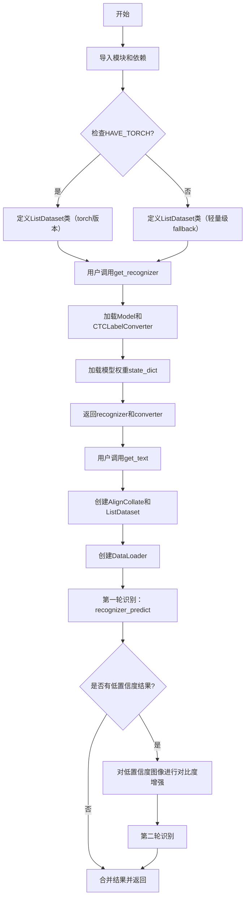
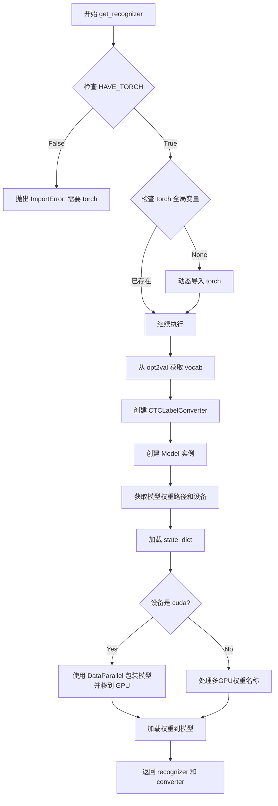
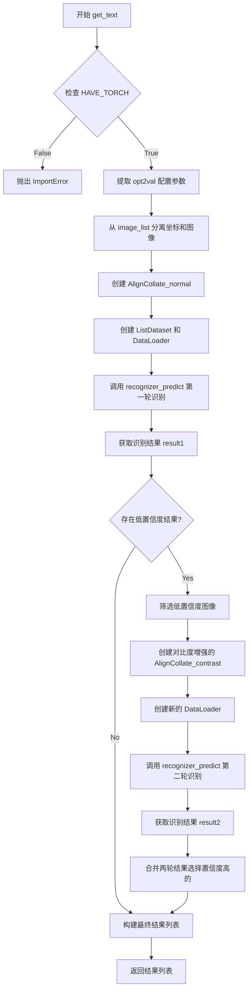
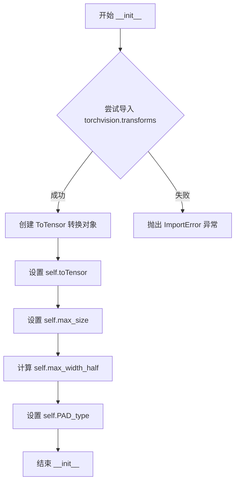
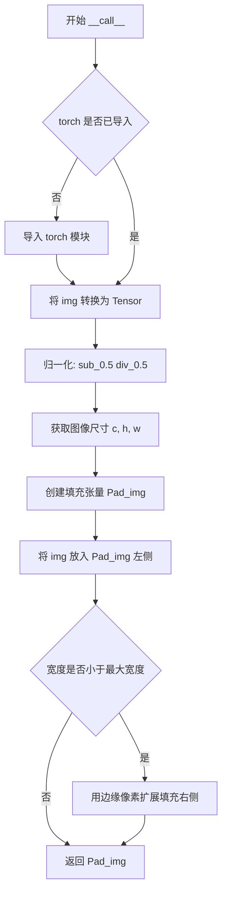
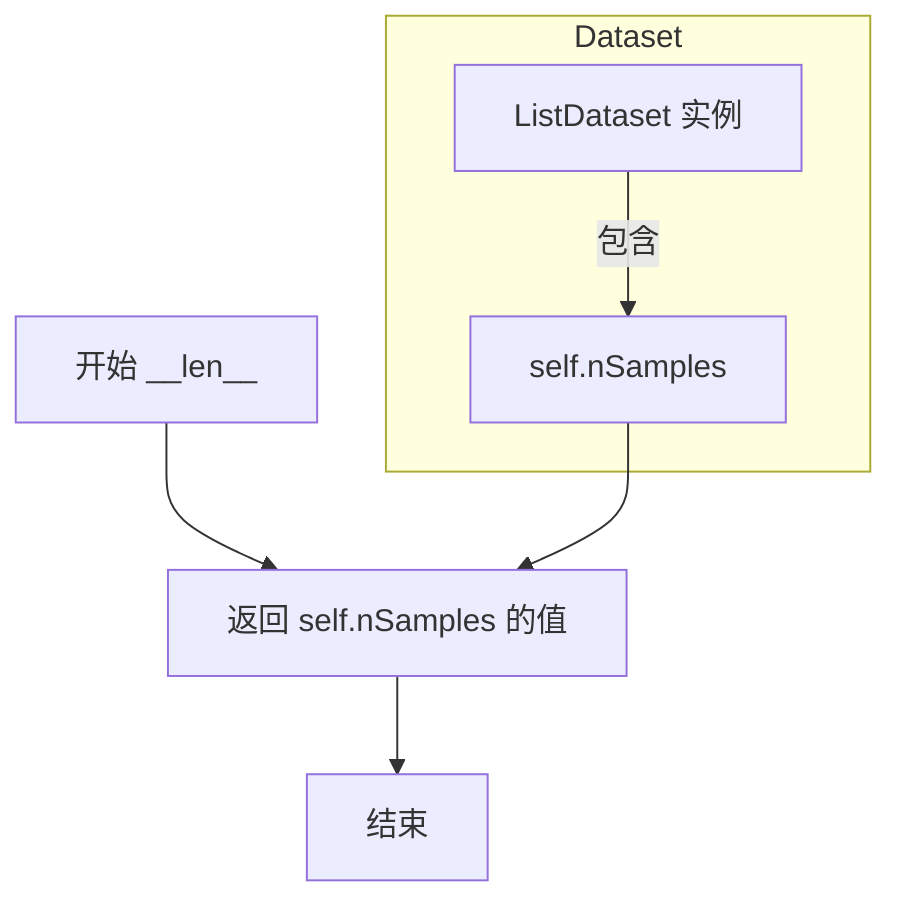
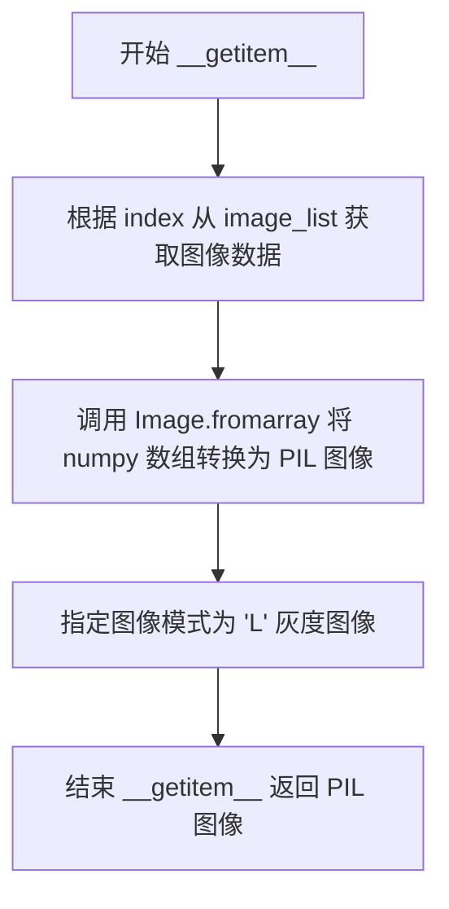
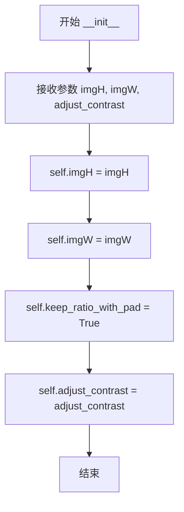
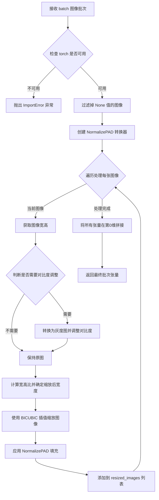

# `comic-translate\modules\ocr\pororo\pororo\models\brainOCR\recognition.py` 详细设计文档

这是EasyOCR的文字识别模块，提供了基于CTC（Connectionist Temporal Classification）的深度学习OCR识别功能，包括图像预处理（归一化、对比度调整）、数据批处理、模型推理和贪婪解码等核心组件，支持可选的torch依赖。

## 整体流程



## 类结构

```
Global Functions
├── contrast_grey (对比度计算)
├── adjust_contrast_grey (对比度调整)
├── recognizer_predict (模型预测)
├── get_recognizer (获取识别器)
└── get_text (获取识别文本)
Class: NormalizePAD
├── __init__
└── __call__
Class: ListDataset (conditional: HAVE_TORCH)
├── __init__
├── __len__
└── __getitem__
Class: AlignCollate
├── __init__
└── __call__
```

## 全局变量及字段


### `math`
    
数学运算模块，用于ceil、floor等数学函数

类型：`module`
    


### `numpy as np`
    
数值计算模块，用于数组操作和数值计算

类型：`module`
    


### `PIL as Image`
    
图像处理模块，用于图像读取和转换

类型：`module`
    


### `torch`
    
深度学习框架，条件导入，如果torch不可用则为None

类型：`module`
    


### `HAVE_TORCH`
    
torch是否可用的标志，True表示torch已成功导入

类型：`bool`
    


### `CTCLabelConverter`
    
CTC标签转换器，用于将预测结果解码为文本，从.utils模块导入

类型：`class`
    


### `Model`
    
识别模型类，用于OCR文本识别，从.model模块导入

类型：`class`
    


### `contrast_grey`
    
计算图像对比度，返回对比度值和上下阈值

类型：`function`
    


### `adjust_contrast_grey`
    
调整图像对比度到目标值，返回调整后的图像数组

类型：`function`
    


### `recognizer_predict`
    
识别器预测函数，执行模型推理并返回识别结果和置信度

类型：`function`
    


### `get_recognizer`
    
获取识别器函数，加载模型权重并返回模型和转换器

类型：`function`
    


### `get_text`
    
获取文本函数，对图像列表进行OCR识别，返回识别结果

类型：`function`
    


### `NormalizePAD.toTensor`
    
将PIL图像或numpy数组转换为tensor

类型：`transforms.ToTensor`
    


### `NormalizePAD.max_size`
    
图像的最大尺寸，格式为(channel, height, width)

类型：`tuple`
    


### `NormalizePAD.max_width_half`
    
最大宽度的一半，用于填充计算

类型：`int`
    


### `NormalizePAD.PAD_type`
    
填充类型，默认为right表示右侧填充

类型：`str`
    


### `ListDataset.image_list`
    
图像列表，存储numpy数组格式的图像

类型：`list`
    


### `ListDataset.nSamples`
    
样本数量，表示图像列表的长度

类型：`int`
    


### `AlignCollate.imgH`
    
目标图像高度

类型：`int`
    


### `AlignCollate.imgW`
    
目标图像宽度

类型：`int`
    


### `AlignCollate.keep_ratio_with_pad`
    
是否保持宽高比进行填充，固定为True

类型：`bool`
    


### `AlignCollate.adjust_contrast`
    
对比度调整参数，用于图像预处理

类型：`float`
    
    

## 全局函数及方法


### `contrast_grey`

该函数用于计算灰度图像的对比度，通过统计图像像素的第90百分位数作为高值、第10百分位数作为低值，然后使用改进的Michelson对比度公式计算对比度值，并返回对比度、高值和低值三个结果。

参数：

- `img`：`numpy.ndarray`，输入的灰度图像数组

返回值：`tuple`，返回包含三个浮点数的元组 `(对比度, 高值, 低值)`

#### 流程图

```mermaid
flowchart TD
    A[开始] --> B[计算img的第90百分位数 high]
    B --> C[计算img的第10百分位数 low]
    C --> D[计算对比度 = (high - low) / max(10, high + low)]
    D --> E[返回元组 (对比度, high, low)]
    E --> F[结束]
```

#### 带注释源码

```python
def contrast_grey(img):
    """
    计算灰度图像的对比度
    
    参数:
        img: 输入的灰度图像数组 (numpy.ndarray)
    
    返回:
        tuple: (对比度, 高值, 低值)
            - 对比度: float, 使用改进的Michelson对比度公式计算
            - high: float, 图像像素的第90百分位数
            - low: float, 图像像素的第10百分位数
    """
    # 获取图像像素值的第90百分位数（高值）
    high = np.percentile(img, 90)
    
    # 获取图像像素值的第10百分位数（低值）
    low = np.percentile(img, 10)
    
    # 计算对比度: (high - low) / max(10, high + low)
    # 使用max(10, high+low)避免除零，同时保证对比度值不会过大
    return (high - low) / np.maximum(10, high + low), high, low
```


### `adjust_contrast_grey`

该函数用于将灰度图像的对比度调整到目标值。如果当前图像的对比度低于指定的目标值，则通过线性变换增强对比度，使图像的灰度范围扩展到更宽的区间，从而提高图像的清晰度和可辨识度。

参数：

- `img`：`ndarray`，输入的灰度图像数组
- `target`：`float`，目标对比度值，默认为 0.4

返回值：`ndarray`，调整后的灰度图像数组（uint8 类型）

#### 流程图

```mermaid
flowchart TD
    A[开始] --> B[调用 contrast_grey 计算当前对比度]
    B --> C{当前对比度 < 目标对比度?}
    C -->|否| D[直接返回原图像]
    C -->|是| E[将图像转换为 int 类型]
    E --> F[计算拉伸比率: ratio = 200.0 / max(10, high - low)]
    F --> G[线性变换: img = (img - low + 25) * ratio]
    G --> H[裁剪到有效范围: 0-255]
    H --> I[转换为 uint8 类型]
    I --> D
```

#### 带注释源码

```python
def adjust_contrast_grey(img, target: float = 0.4):
    """
    调整灰度图像的对比度到目标值
    
    参数:
        img: 输入的灰度图像数组 (ndarray)
        target: 目标对比度值，默认为 0.4
    
    返回:
        调整后的灰度图像数组 (uint8 类型)
    """
    # 调用 contrast_grey 函数计算当前图像的对比度、亮度上限和下限
    # contrast: 当前对比度 = (high - low) / (high + low)
    # high: 第90百分位亮度值
    # low: 第10百分位亮度值
    contrast, high, low = contrast_grey(img)
    
    # 仅当当前对比度低于目标值时才进行对比度增强
    if contrast < target:
        # 将图像数据转换为整数类型，避免后续计算出现精度问题
        img = img.astype(int)
        
        # 计算拉伸比率，使图像灰度范围扩展到约200个单位
        # 使用 max(10, high - low) 避免除零错误
        ratio = 200.0 / np.maximum(10, high - low)
        
        # 线性变换：将灰度值重新映射
        # 减去 low 使最低值变为0，加上25添加边距，然后乘以比率进行拉伸
        img = (img - low + 25) * ratio
        
        # 裁剪到有效的像素范围 [0, 255]
        # 使用 np.maximum 确保不低于0，使用 np.minimum 确保不高于255
        img = np.maximum(
            np.full(img.shape, 0),    # 全0数组作为下限
            np.minimum(
                np.full(img.shape, 255),  # 全255数组作为上限
                img,
            ),
        ).astype(np.uint8)  # 转换为无符号8位整数
    
    # 返回处理后的图像
    return img
```


### `recognizer_predict`

该函数执行模型预测并解码，接收模型、转换器、测试数据加载器和配置字典，对图像张量进行推理，通过贪婪解码将预测索引转换为文本字符串，并计算每条预测的置信度得分，最终返回预测文本及置信度得分列表。

参数：

- `model`：`torch.nn.Module`，用于执行推理的识别模型
- `converter`：`CTCLabelConverter`，用于将模型输出的索引解码为字符标签的转换器
- `test_loader`：`torch.utils.data.DataLoader`，提供批量图像张量的数据加载器
- `opt2val`：`dict`，包含设备信息等配置选项的字典

返回值：`list`，包含预测文本和对应置信度得分的一维列表，每个元素为 `[预测文本, 置信度得分]` 的形式

#### 流程图

```mermaid
flowchart TD
    A[开始 recognizer_predict] --> B{检查 HAVE_TORCH}
    B -->|否| C[抛出 ImportError]
    B -->|是| D[获取 torch 和 torch.nn.functional]
    D --> E[从 opt2val 获取 device]
    E --> F[设置 model.eval 模式]
    F --> G[初始化 result 空列表]
    G --> H[使用 torch.no_grad 上下文]
    H --> I{遍历 test_loader 中的 image_tensors}
    I -->|下一批次| J[获取 batch_size]
    J --> K[将 inputs 移动到 device]
    K --> L[model(inputs) 获取 preds]
    L --> M[计算 softmax 概率 preds_prob]
    M --> N[概率归一化 rebalance]
    N --> O[计算 preds_lengths]
    O --> P[max 维度2获取 preds_indices]
    P --> Q[view 展平 preds_indices]
    Q --> R[converter.decode_greedy 解码为字符串]
    R --> S[计算每条预测的最大概率]
    S --> T{遍历 preds_str 和 preds_max_prob}
    T --> U[计算累积置信度 confidence_score]
    U --> V[result.append 存储预测结果]
    V --> T
    T --> I
    I -->|遍历结束| W[返回 result 列表]
```

#### 带注释源码

```python
def recognizer_predict(model, converter, test_loader, opt2val: dict):
    """
    执行模型预测并解码，输出预测文本及置信度得分
    
    参数:
        model: 识别模型实例
        converter: CTCLabelConverter 用于解码
        test_loader: 图像数据加载器
        opt2val: 配置字典，需包含 device 键
    返回:
        预测结果列表，每个元素为 [文本, 置信度]
    """
    # 检查 torch 是否可用，若不可用则抛出导入错误
    if not HAVE_TORCH:
        raise ImportError("torch is required to run recognizer_predict. Install torch or skip recognition features.")
    
    # 动态导入 torch 模块
    import importlib
    global torch
    if torch is None:
        try:
            torch = importlib.import_module("torch")
        except Exception:
            raise ImportError("torch is required to run recognizer_predict. Install torch to proceed.")
    
    # 导入 torch.nn.functional 用于 softmax 操作
    F = importlib.import_module("torch.nn.functional")

    # 从配置中获取设备信息（cuda 或 cpu）
    device = opt2val["device"]

    # 设置模型为评估模式，禁用 dropout 和 batch normalization 更新
    model.eval()
    
    # 存储最终结果的列表
    result = []
    
    # 使用 no_grad 上下文禁用梯度计算，减少内存消耗
    with torch.no_grad():
        # 遍历测试数据加载器中的每一批图像张量
        for image_tensors in test_loader:
            # 获取当前批次大小
            batch_size = image_tensors.size(0)
            
            # 将图像张量移动到指定设备（GPU 或 CPU）
            inputs = image_tensors.to(device)
            
            # 通过模型前向传播获取预测结果，形状为 (N, length, num_classes)
            preds = model(inputs)

            # --- 概率重平衡 (rebalance) ---
            # 对预测结果在维度2（类别维度）应用 softmax 获取概率分布
            preds_prob = F.softmax(preds, dim=2)
            
            # 转移到 CPU 并detach以转换为 numpy 进行进一步处理
            preds_prob = preds_prob.cpu().detach().numpy()
            
            # 计算每条预测的概率总和
            pred_norm = preds_prob.sum(axis=2)
            
            # 归一化概率，使每个位置的概率和为1
            preds_prob = preds_prob / np.expand_dims(pred_norm, axis=-1)
            
            # 转换回 torch 张量并移回设备
            preds_prob = torch.from_numpy(preds_prob).float().to(device)

            # --- 贪婪解码 ---
            # 创建预测长度张量，每个样本长度为 preds.size(1)
            preds_lengths = torch.IntTensor([preds.size(1)] * batch_size)
            
            # 在维度2上选择最大概率的索引
            _, preds_indices = preds_prob.max(2)  # (N, length)
            
            # 展平索引为一维向量
            preds_indices = preds_indices.view(-1)  # (N*length)
            
            # 使用转换器的贪婪解码方法将索引解码为字符串
            preds_str = converter.decode_greedy(preds_indices, preds_lengths)

            # 获取每个时间步的最大概率值
            preds_max_prob, _ = preds_prob.max(dim=2)

            # --- 计算置信度并收集结果 ---
            # 遍历每条预测及其最大概率
            for pred, pred_max_prob in zip(preds_str, preds_max_prob):
                # 计算累积乘积作为置信度得分（考虑 CTCblank 令牌的影响）
                confidence_score = pred_max_prob.cumprod(dim=0)[-1]
                
                # 将预测文本和置信度得分添加到结果列表
                result.append([pred, confidence_score.item()])

    # 返回所有预测结果
    return result
```


### `get_recognizer`

加载并返回一个基于CTC的识别模型（recognizer）和对应的标签转换器（CTCLabelConverter），用于OCR文字识别任务。该函数根据配置字典初始化模型结构，加载预训练权重，并处理GPU/CPU设备适配和多GPU模型权重的名称同步问题。

参数：

- `opt2val`：`dict`，配置字典，包含以下关键键值：
  - `vocab`：字符集列表，用于初始化CTCLabelConverter
  - `rec_model_ckpt_fp`：预训练模型权重文件路径
  - `device`：计算设备（"cuda" 或 "cpu"）
  - 其他模型初始化所需的配置参数

返回值：`tuple`，包含两个元素：
  - `recognizer`：torch.nn.Module，已加载权重并适配设备的识别模型
  - `converter`：CTCLabelConverter，用于编码/解码标签的转换器

#### 流程图



#### 带注释源码

```python
def get_recognizer(opt2val: dict):
    """
    加载并返回识别模型和标签转换器
    
    :param opt2val: 配置字典，必须包含 vocab, rec_model_ckpt_fp, device 等键
    :return: (recognizer, converter) 元组
        - recognizer: 识别网络模型
        - converter: CTC标签转换器
    """
    # 检查torch是否可用（因为torch是可选依赖）
    if not HAVE_TORCH:
        raise ImportError("torch is required to load the recognizer. Install torch to use recognition models.")
    
    import importlib
    global torch  # 使用全局torch变量
    if torch is None:
        try:
            torch = importlib.import_module("torch")
        except Exception:
            raise ImportError("torch is required to load the recognizer. Install torch to proceed.")
    
    # 从model模块导入Model类（识别模型定义）
    from .model import Model

    # ========== 1. 初始化标签转换器 ==========
    # 从配置中获取字符集（词汇表）
    vocab = opt2val["vocab"]
    # 创建CTC标签转换器，用于将字符与索引相互转换
    converter = CTCLabelConverter(vocab)

    # ========== 2. 初始化识别模型结构 ==========
    # 根据配置创建识别模型实例
    recognizer = Model(opt2val)

    # ========== 3. 加载预训练权重 ==========
    # 获取模型权重文件路径
    rec_model_ckpt_fp = opt2val["rec_model_ckpt_fp"]
    # 获取目标设备
    device = opt2val["device"]
    # 从磁盘加载模型权重到内存
    state_dict = torch.load(rec_model_ckpt_fp, map_location=device)

    # ========== 4. 设备适配与多GPU处理 ==========
    if device == "cuda":
        # GPU环境：使用DataParallel支持多GPU并行推理
        recognizer = torch.nn.DataParallel(recognizer).to(device)
    else:
        # CPU环境：处理多GPU训练保存的权重名称
        # 问题：多GPU训练时权重key会添加"module."前缀
        from collections import OrderedDict

        def _sync_tensor_name(state_dict):
            """
            同步权重名称，移除多GPU保存的"module."前缀
            
            :param state_dict: 原始权重字典
            :return: 处理后的权重字典
            """
            state_dict_ = OrderedDict()
            for name, val in state_dict.items():
                # 移除"module."前缀
                name = name.replace("module.", "")
                state_dict_[name] = val
            return state_dict_

        # 处理权重名称
        state_dict = _sync_tensor_name(state_dict)

    # ========== 5. 加载权重到模型 ==========
    # 将权重加载到模型结构中
    recognizer.load_state_dict(state_dict)

    # ========== 6. 返回结果 ==========
    # 返回识别模型和标签转换器
    return recognizer, converter
```


### `get_text`

该函数是EasyOCR的核心识别函数之一，负责对图像列表进行OCR文本识别。函数通过两轮识别策略（普通识别 + 对比度增强识别）来提高识别准确率，对于第一轮识别中置信度低于阈值的图像，会进行第二轮对比度增强后的识别，最终返回包含坐标、识别文本和置信度分数的结果列表。

参数：

- `image_list`：`list`，输入的图像列表，每个元素为元组 `(坐标, 图像数组)`，其中坐标用于标识图像位置，图像数组为numpy数组格式
- `recognizer`：识别模型对象，由 `get_recognizer` 返回的OCR识别网络模型
- `converter`：`CTCLabelConverter`，CTC标签转换器，用于将模型输出的索引解码为文本字符
- `opt2val`：`dict`，配置参数字典，包含以下关键配置：`imgW`（图像宽度）、`imgH`（图像高度）、`adjust_contrast`（对比度调整阈值）、`batch_size`（批处理大小）、`n_workers`（数据加载工作进程数）、`contrast_ths`（对比度阈值，用于判断是否需要第二轮识别）

返回值：`list`，返回识别结果列表，每个元素为元组 `(box, text, confidence)`，其中 `box` 是输入的坐标信息，`text` 是识别出的文本内容，`confidence` 是置信度分数

#### 流程图



#### 带注释源码

```python
def get_text(image_list, recognizer, converter, opt2val: dict):
    """
    对图像列表进行OCR文本识别，采用两轮识别策略提高准确率
    
    参数:
        image_list: 图像列表，每个元素为(坐标, 图像数组)元组
        recognizer: 预训练的OCR识别模型
        converter: CTCLabelConverter用于解码
        opt2val: 配置参数字典
    返回:
        识别结果列表，每个元素为(box, text, confidence)
    """
    # 检查torch是否可用，OCR功能依赖torch
    if not HAVE_TORCH:
        raise ImportError("torch is required to extract text with the recognizer. Install torch to use get_text.")
    
    # 动态导入torch模块
    import importlib
    global torch
    if torch is None:
        try:
            torch = importlib.import_module("torch")
        except Exception:
            raise ImportError("torch is required to extract text with the recognizer. Install torch to proceed.")
    
    # 从配置字典中提取识别参数
    imgW = opt2val["imgW"]              # 目标图像宽度
    imgH = opt2val["imgH"]              # 目标图像高度
    adjust_contrast = opt2val["adjust_contrast"]  # 对比度调整参数
    batch_size = opt2val["batch_size"] # 批处理大小
    n_workers = opt2val["n_workers"]   # 数据加载工作进程数
    contrast_ths = opt2val["contrast_ths"]  # 对比度阈值，用于判断是否需要第二轮识别

    # 从图像列表中分离坐标和图像数据
    # coord用于记录每个图像的位置/标识信息
    coord = [item[0] for item in image_list]
    # img_list是实际的图像numpy数组列表
    img_list = [item[1] for item in image_list]
    
    # 创建标准的数据对齐收集器（不调整对比度）
    AlignCollate_normal = AlignCollate(imgH, imgW, adjust_contrast)
    # 创建PyTorch数据集
    test_data = ListDataset(img_list)
    # 创建数据加载器
    test_loader = torch.utils.data.DataLoader(
        test_data,
        batch_size=batch_size,
        shuffle=False,
        num_workers=n_workers,
        collate_fn=AlignCollate_normal,
        pin_memory=True,
    )

    # ==================== 第一轮识别 ====================
    # 使用标准配置进行第一轮OCR识别
    result1 = recognizer_predict(recognizer, converter, test_loader, opt2val)

    # ==================== 第二轮识别准备 ====================
    # 找出第一轮识别中置信度低于阈值的图像索引
    # 这些图像可能因为对比度问题导致识别困难
    low_confident_idx = [
        i for i, item in enumerate(result1) if (item[1] < contrast_ths)
    ]
    
    # ==================== 第二轮识别（对比度增强） ====================
    if len(low_confident_idx) > 0:
        # 提取低置信度图像进行第二轮识别
        img_list2 = [img_list[i] for i in low_confident_idx]
        # 创建对比度增强的数据对齐收集器
        AlignCollate_contrast = AlignCollate(imgH, imgW, adjust_contrast)
        # 创建第二轮识别的数据加载器
        test_data = ListDataset(img_list2)
        test_loader = torch.utils.data.DataLoader(
            test_data,
            batch_size=batch_size,
            shuffle=False,
            num_workers=n_workers,
            collate_fn=AlignCollate_contrast,
            pin_memory=True,
        )
        # 执行第二轮识别
        result2 = recognizer_predict(recognizer, converter, test_loader,
                                     opt2val)

    # ==================== 合并结果 ====================
    # 遍历所有图像，选择最佳识别结果
    result = []
    for i, zipped in enumerate(zip(coord, result1)):
        box, pred1 = zipped
        if i in low_confident_idx:
            # 如果当前图像进行了第二轮识别，比较两轮结果
            pred2 = result2[low_confident_idx.index(i)]
            # 选择置信度更高的结果
            if pred1[1] > pred2[1]:
                result.append((box, pred1[0], pred1[1]))
            else:
                result.append((box, pred2[0], pred2[1]))
        else:
            # 使用第一轮识别结果
            result.append((box, pred1[0], pred1[1]))

    return result
```


### `NormalizePAD.__init__`

该方法是 `NormalizePAD` 类的构造函数，负责初始化图像归一化和填充所需的配置参数。它接受最大尺寸和填充类型参数，导入 `torchvision.transforms` 模块，并设置实例属性。

参数：

- `max_size`：未指定类型（通常为元组或列表），表示输入图像的目标尺寸，格式为 (channel, height, width)
- `PAD_type`：`str`，表示填充方式，默认为 "right"（右侧填充）

返回值：`None`，该方法不返回值，仅进行初始化操作

#### 流程图



#### 带注释源码

```python
def __init__(self, max_size, PAD_type: str = "right"):
    """
    初始化 NormalizePAD 对象
    
    参数:
        max_size: tuple/list, 目标图像尺寸，格式为 (C, H, W)
        PAD_type: str, 填充方向，默认为 "right"
    """
    # 动态导入 torchvision.transforms 模块
    # 使用 try-except 确保在未安装 torchvision 时给出明确错误提示
    try:
        import importlib
        transforms = importlib.import_module("torchvision.transforms")
    except Exception:
        # 抛出详细错误信息，指导用户安装依赖
        raise ImportError(
            "torchvision is required to use NormalizePAD. "
            "Install torch and torchvision or avoid calling "
            "recognition routines that use it."
        )
    
    # 创建 ToTensor 转换对象，用于将 PIL Image 或 numpy array 转换为 tensor
    self.toTensor = transforms.ToTensor()
    
    # 保存目标最大尺寸，用于后续图像填充
    self.max_size = max_size
    
    # 计算最大宽度的一半，用于某些对称填充逻辑
    self.max_width_half = math.floor(max_size[2] / 2)
    
    # 保存填充类型，目前代码中主要使用 "right"
    self.PAD_type = PAD_type
```


### `NormalizePAD.__call__`

该方法是 NormalizePAD 类的核心调用方法，负责将输入的 PIL 图像转换为符合模型输入要求的归一化并填充的张量。它先将图像转换为 PyTorch 张量并进行标准化处理（将像素值从 [0,255] 映射到 [-1,1]），然后创建指定最大尺寸的填充张量，将原始图像置于左侧，右侧边缘区域使用图像边缘像素值进行扩展填充。

参数：

- `img`：`PIL.Image` 或类似图像对象，需要进行归一化和填充的输入图像

返回值：`torch.Tensor`，填充并归一化后的图像张量，形状为 `(C, H, W)`，其中 C 为通道数，H 为高度，W 为 max_size 中指定的宽度

#### 流程图



#### 带注释源码

```python
def __call__(self, img):
    """
    对输入图像进行归一化和填充处理
    
    参数:
        img: PIL Image 或类似图像对象
        
    返回:
        填充并归一化后的图像张量
    """
    # 动态导入 torch 模块，确保在需要时可用
    import importlib
    global torch
    if torch is None:
        try:
            torch = importlib.import_module("torch")
        except Exception:
            raise ImportError("torch is required to use NormalizePAD.__call__. Install torch to proceed.")
    
    # 使用 torchvision 的 ToTensor 将 PIL 图像转换为张量
    # 这会自动将图像从 [0,255] 范围转换为 [0,1] 范围
    img = self.toTensor(img)
    
    # 归一化处理: (x - 0.5) / 0.5 = 2x - 1
    # 将像素值从 [0,1] 映射到 [-1,1] 范围
    img.sub_(0.5).div_(0.5)
    
    # 获取图像的通道数、高度和宽度
    c, h, w = img.size()
    
    # 创建填充张量，形状为 max_size，初始值填充为 0
    # max_size 格式为 (channels, height, max_width)
    Pad_img = torch.FloatTensor(*self.max_size).fill_(0)
    
    # 将原始图像放入填充张量的左侧（右侧填充）
    Pad_img[:, :, :w] = img  # right pad
    
    # 如果图像宽度小于最大宽度，需要在右侧添加边框填充
    if self.max_size[2] != w:  # add border Pad
        # 使用图像最右边缘的像素值扩展填充右侧区域
        # unsqueeze(2) 在最后一个维度增加一个轴，然后 expand 到所需填充区域
        Pad_img[:, :, w:] = (img[:, :, w - 1].unsqueeze(2).expand(
            c,
            h,
            self.max_size[2] - w,
        ))

    return Pad_img
```


### `ListDataset.__init__`

**描述**：这是一个构造函数，用于初始化 `ListDataset` 类的实例。它接收一个图像列表，将其存储在实例属性中，并计算图像的总数以供后续迭代使用。

**参数**：
- `image_list`：`list`，一个包含图像数据的列表（通常为 numpy 数组）。

**返回值**：`None`，构造函数不返回任何值，仅用于初始化对象状态。

#### 流程图

```mermaid
graph TD
    START((开始)) --> INPUT[接收 image_list 参数]
    INPUT --> ASSIGN_SELF[将 image_list 赋值给 self.image_list]
    ASSIGN_SELF --> CALC_LEN[计算列表长度 len(image_list)]
    CALC_LEN --> ASSIGN_NSAMPLES[将长度赋值给 self.nSamples]
    ASSIGN_NSAMPLES --> END((结束))
```

#### 带注释源码

```python
def __init__(self, image_list: list):
    """
    初始化 ListDataset 对象。

    参数:
        image_list (list): 图像数据的列表。
    """
    # 将传入的图像列表保存为实例变量，供 __getitem__ 方法使用
    self.image_list = image_list
    
    # 计算并保存列表中图像的数量，用于返回数据集的大小
    self.nSamples = len(image_list)
```


### `ListDataset.__len__`

该方法为 PyTorch 数据集提供标准接口，返回数据集中图像样本的总数，使 DataLoader 能够正确确定遍历数据集所需的批次数。

参数： 无（使用 Python 隐式参数 `self`）

返回值：`int`，返回数据集中存储的图像样本数量

#### 流程图



#### 带注释源码

```python
class ListDataset(torch.utils.data.Dataset):
    """
    继承自 torch.utils.data.Dataset 的数据集类，用于封装图像列表
    """
    
    def __init__(self, image_list: list):
        """
        初始化数据集
        
        参数:
            image_list: list, 包含图像数据的列表
        """
        self.image_list = image_list
        self.nSamples = len(image_list)  # 缓存图像列表长度，避免重复计算

    def __len__(self):
        """
        返回数据集中的样本数量
        
        这是 Python 特殊方法，使 ListDataset 可以与 len() 函数配合使用
        同时也是 PyTorch DataLoader 确定批次数的关键方法
        
        返回:
            int: 数据集中的图像样本总数
        """
        return self.nSamples

    def __getitem__(self, index):
        """
        根据索引获取图像
        
        参数:
            index: int, 图像索引
            
        返回:
            PIL.Image: 灰度模式的图像对象
        """
        img = self.image_list[index]
        return Image.fromarray(img, "L")
```

---

**备注**：该方法同时存在于两个 `ListDataset` 类定义中（条件编译分支 `if HAVE_TORCH:` 和 `else:` 分支），两者实现完全一致，确保在有无 PyTorch 环境下均可正常工作。


### `ListDataset.__getitem__`

该方法是 `ListDataset` 数据集类的核心方法，用于根据给定索引返回对应的图像数据。它从图像列表中按索引获取原始图像数组，并将其转换为 PIL 灰度图像对象供后续处理使用。

参数：

- `index`：`int`，表示要获取的图像在列表中的索引位置

返回值：`PIL.Image.Image`，返回转换后的 PIL 灰度图像对象

#### 流程图



#### 带注释源码

```python
def __getitem__(self, index):
    """
    根据索引获取数据集中对应的图像
    
    参数:
        index: int - 图像在列表中的索引
        
    返回:
        PIL.Image.Image - 灰度格式的 PIL 图像对象
    """
    # 从图像列表中根据索引获取原始图像数据（numpy 数组格式）
    img = self.image_list[index]
    
    # 将 numpy 数组转换为 PIL 图像对象，"L" 模式表示灰度图像（8位像素）
    return Image.fromarray(img, "L")
```


### `AlignCollate.__init__`

该方法是 `AlignCollate` 类的构造函数，用于初始化图像对齐和批处理所需的配置参数，包括目标图像的高度、宽度以及可选的对比度调整功能。

参数：

- `imgH`：`int`，目标图像的高度（像素）
- `imgW`：`int`，目标图像的宽度（像素）
- `adjust_contrast`：`float`，对比度调整的目标值，用于数据增强

返回值：`None`，构造函数无显式返回值

#### 流程图



#### 带注释源码

```python
def __init__(self, imgH: int, imgW: int, adjust_contrast: float):
    """
    初始化 AlignCollate 实例
    
    参数:
        imgH: 目标图像的高度
        imgW: 目标图像的宽度
        adjust_contrast: 对比度调整参数，用于数据增强
    """
    # 存储目标图像高度
    self.imgH = imgH
    # 存储目标图像宽度
    self.imgW = imgW
    # 保持宽高比填充标志位，固定为 True，不建议修改
    self.keep_ratio_with_pad = True  # Do Not Change
    # 存储对比度调整参数，传递给 __call__ 方法中的图像处理
    self.adjust_contrast = adjust_contrast
```


### `AlignCollate.__call__`

该方法是 AlignCollate 类的核心功能实现，用于将一批图像数据整理成适合 OCR 识别模型输入的张量形式。它负责图像的对比度调整、宽高比保持的缩放、PAD 填充以及最终的张量拼接。

参数：

- `batch`：可迭代对象（通常是 DataLoader 传递的图像列表），需要被整理成批次的图像集合

返回值：`torch.Tensor`，返回形状为 (batch_size, 1, imgH, imgW) 的四维张量，其中 batch_size 是当前批次的图像数量，1 是通道数（灰度图），imgH 和 imgW 是标准化后的图像高度和宽度

#### 流程图



#### 带注释源码

```python
def __call__(self, batch):
    """
    对图像批次进行整理和预处理，生成模型可用的张量输入
    
    处理流程：
    1. 检查 torch 依赖是否可用
    2. 过滤无效图像（None 值）
    3. 对每张图像进行对比度调整（可选）
    4. 保持宽高比的图像缩放
    5. 应用 NormalizePAD 填充到统一尺寸
    6. 拼接所有图像为批次张量
    """
    # 检查 torch 是否可用，若不可用则抛出明确的依赖错误
    if not HAVE_TORCH:
        raise ImportError("torch is required to collate recognition images. Install torch to use AlignCollate.")
    
    # 动态导入 torch 模块（延迟加载以支持可选依赖）
    import importlib
    global torch
    if torch is None:
        try:
            torch = importlib.import_module("torch")
        except Exception:
            raise ImportError("torch is required to collate recognition images. Install torch to proceed.")
    
    # 过滤掉批次中的 None 值图像，防止后续处理崩溃
    batch = filter(lambda x: x is not None, batch)
    images = batch

    # 设置目标宽度和通道数（灰度图通道数为1）
    resized_max_w = self.imgW
    input_channel = 1
    
    # 创建 NormalizePAD 转换器，用于将图像填充到统一尺寸
    transform = NormalizePAD((input_channel, self.imgH, resized_max_w))

    # 存储处理后的图像张量列表
    resized_images = []
    
    # 遍历批次中的每张图像进行单独处理
    for image in images:
        w, h = image.size  # 获取原始图像宽高
        
        # 对比度增强处理（可选，通过 adjust_contrast 参数控制）
        if self.adjust_contrast > 0:
            # 转换为灰度 numpy 数组
            image = np.array(image.convert("L"))
            # 应用对比度调整算法
            image = adjust_contrast_grey(image, target=self.adjust_contrast)
            # 转换回 PIL Image 对象
            image = Image.fromarray(image, "L")

        # 计算宽高比，用于保持比例的缩放
        ratio = w / float(h)
        
        # 根据宽高比计算缩放后的宽度
        # 如果按比例缩放后的宽度超过目标宽度，则使用目标宽度
        if math.ceil(self.imgH * ratio) > self.imgW:
            resized_w = self.imgW
        else:
            # 否则按比例缩放，向上取整
            resized_w = math.ceil(self.imgH * ratio)

        # 使用双三次插值进行图像缩放，保持高度为 imgH，宽度按比例
        resized_image = image.resize((resized_w, self.imgH), Image.BICUBIC)
        
        # 应用 NormalizePAD 填充到统一的最大尺寸
        resized_images.append(transform(resized_image))

    # 使用 torch.cat 在第0维（批次维度）拼接所有图像张量
    # unsqueeze(0) 为每张图像添加批次维度，使其从 (C, H, W) 变为 (1, C, H, W)
    image_tensors = torch.cat([t.unsqueeze(0) for t in resized_images], 0)
    
    # 返回形状为 (batch_size, channel, height, width) 的批次张量
    return image_tensors
```

## 关键组件


### 张量索引与惰性加载

在`recognizer_predict`函数中，通过`preds_prob.max(2)`进行张量索引获取最大概率索引，使用`.cpu().detach().numpy()`实现惰性加载将张量转移到CPU并分离计算图。

### 对比度调整与图像增强

`contrast_grey`函数计算图像的对比度指标（高百分位与低百分位差值），`adjust_contrast_grey`函数根据目标对比度值对图像进行灰度调整和归一化处理。

### CTCLabel转换器

`CTCLabelConverter`从utils模块导入，负责将预测的索引序列解码为字符文本，支持CTC贪婪解码策略。

### 图像归一化填充

`NormalizePAD`类将图像张量归一化到[0,1]范围并填充到指定最大尺寸，支持右侧填充模式。

### 数据集批处理

`ListDataset`类提供图像列表的数据集封装，支持torch可用/不可用两种回退实现；`AlignCollate`类负责将批量图像调整到统一尺寸并进行归一化填充。

### 模型推理预测

`recognizer_predict`函数执行模型推理，使用softmax重平衡预测概率，通过贪婪解码获取最终识别结果并计算置信度分数。

### 识别器加载

`get_recognizer`函数加载预训练模型权重，处理CUDA和多GPU场景下的状态字典同步，返回识别模型和标签转换器。

### 两轮识别策略

`get_text`函数实现两轮识别流程，第一轮对所有图像进行识别，对置信度低于阈值的图像进行第二轮识别并选择最优结果。


## 问题及建议


### 已知问题

- **全局变量重复检查和导入**：代码中多次检查`HAVE_TORCH`并通过`importlib.import_module("torch")`重复导入torch模块，违反DRY原则，增加代码冗余和维护成本
- **TODO注释遗留**：`# TODO: figure out what is this for` 和 `# TODO temporary: multigpu 학습한 뒤 ckpt loading 문제` 两处TODO未完成，影响代码可读性和可维护性
- **异常处理重复**：每个函数都包含相似的torch导入和检查逻辑，应该提取为统一的工具函数或使用装饰器
- **硬编码参数**：对比度调整中的`ratio = 200.0`、`target: float = 0.4`、`np.maximum(10, ...)`等数值缺乏配置化
- **全局变量torch的使用**：通过`global torch`在函数中动态赋值，存在隐式依赖和潜在的线程安全问题
- **CPU/GPU加载逻辑的临时方案**：`_sync_tensor_name`函数是为了解决多GPU训练后的checkpoint加载问题，属于临时补丁
- **缺乏空列表和None检查**：`get_text`函数中`image_list`为空或包含None时可能产生意外行为
- **类型注解不完整**：部分函数参数如`model`缺少类型注解，`opt2val`字典的内容没有明确定义

### 优化建议

- **重构torch导入逻辑**：创建统一的依赖检查模块或使用装饰器处理可选依赖，避免重复代码
- **配置外部化**：将硬编码的对比度参数、批处理大小等提取到配置文件中
- **清理TODO**：完成TODO标记对应的功能或移除未使用的代码
- **类型提示完善**：为所有函数参数添加完整的类型注解，定义`opt2val`的结构类型
- **数据验证增强**：在`get_text`等函数入口处添加参数校验，处理空列表和异常输入
- **考虑使用延迟加载模式**：torch的导入可以采用延迟初始化模式，在真正需要时才加载
- **统一异常信息**：将重复的ImportError消息提取为常量或配置

## 其它


### 设计目标与约束

本模块的设计目标是提供一个高效、灵活的OCR文字识别模块，能够从输入的图像列表中识别出文本内容，并返回识别结果及置信度。约束条件包括：1) 必须安装PyTorch和torchvision才能使用完整的识别功能；2) 依赖CTCLabelConverter进行标签转换；3) 模型输入图像高度固定为imgH，宽度根据比例自适应；4) 支持GPU和CPU设备。

### 错误处理与异常设计

模块采用分层异常处理策略：1) 在模块导入时使用try-except捕获torch导入失败，设置HAVE_TORCH标志，使模块可在无torch环境下被导入；2) 核心类和方法在执行前检查HAVE_TORCH状态，若为False则抛出ImportError并提示安装torch；3) NormalizePAD类在初始化和调用时均检查torch可用性；4) recognizer_predict、get_recognizer、get_text等核心函数均包含完整的异常捕获和错误提示；5) AlignCollate在运行时检查torch可用性并提供明确错误信息。

### 数据流与状态机

数据流遵循以下路径：1) 原始图像列表（含坐标和图像数据）进入get_text函数；2) 通过ListDataset封装为数据集；3) 经AlignCollate进行图像预处理（resize、对比度调整、padding）；4) 通过DataLoader批量加载；5) 传入recognizer_predict进行模型推理；6) 使用CTCLabelConverter进行CTC解码；7) 对低置信度结果进行二次识别；8) 合并结果返回。状态机包括：初始状态→数据加载状态→预处理状态→模型推理状态→后处理状态→结果返回状态。

### 外部依赖与接口契约

外部依赖包括：1) torch (PyTorch核心库)；2) torchvision (视觉数据变换)；3) numpy (数值计算)；4) PIL (图像处理)；5) .utils.CTCLabelConverter (标签转换工具)；6) .model.Model (识别模型)。接口契约：get_recognizer返回(recognizer, converter)元组；get_text接收(image_list, recognizer, converter, opt2val)返回识别结果列表；recognizer_predict接收(model, converter, test_loader, opt2val)返回预测结果列表。

### 性能考虑与优化空间

性能优化点：1) 使用torch.no_grad()禁用梯度计算减少内存占用；2) DataLoader使用pin_memory=True加速GPU数据传输；3) 批量处理提高吞吐量；4) 二次识别仅针对低置信度样本，减少计算量。优化空间：1) 当前使用CPU进行部分图像预处理，可考虑GPU加速；2) DataLoader的num_workers参数应根据CPU核心数动态调整；3) 可添加FP16推理支持加速推理；4) 模型可使用torch.jit.script进行优化。

### 安全性考虑

安全措施：1) 模型加载使用map_location参数防止设备不匹配；2) 输入图像经过PIL转换确保格式安全；3) np.maximum和np.minimum防止数值溢出；4) filter过滤None值防止空指针。潜在风险：1) 未对输入图像列表进行详细校验；2) 模型checkpoint路径未做安全检查；3) 未对异常图像进行专门处理。

### 配置参数说明

关键配置参数：1) imgH (int): 输入图像高度，默认值取决于opt2val；2) imgW (int): 输入图像宽度；3) batch_size (int): 批处理大小；4) adjust_contrast (float): 对比度调整阈值，默认0；5) contrast_ths (float): 置信度阈值，低于此值进行二次识别，默认0.4；6) n_workers (int): DataLoader工作线程数；7) device (str): 计算设备，"cuda"或"cpu"；8) vocab (str): 字符集；9) rec_model_ckpt_fp (str): 模型checkpoint文件路径。

### 使用示例与调用流程

基本调用流程：1) 准备包含(region_box, numpy_array)元组的图像列表；2) 调用get_recognizer(opt2val)获取模型和转换器；3) 调用get_text(image_list, recognizer, converter, opt2val)获取识别结果；4) 结果格式为[(box, text, confidence), ...]。示例：opt2val = {"imgH":32, "imgW":100, "batch_size":32, ...}；recognizer, converter = get_recognizer(opt2val)；results = get_text(image_list, recognizer, converter, opt2val)。

### 兼容性考虑

兼容性设计：1) torch设为可选依赖，无torch时提供ListDataset轻量实现；2) 支持CUDA和CPU设备；3) 模型加载自动处理多GPU训练的state_dict（module.前缀问题）；4) 图像格式统一转换为L模式（灰度）；5) 支持Python 3.x环境。

    