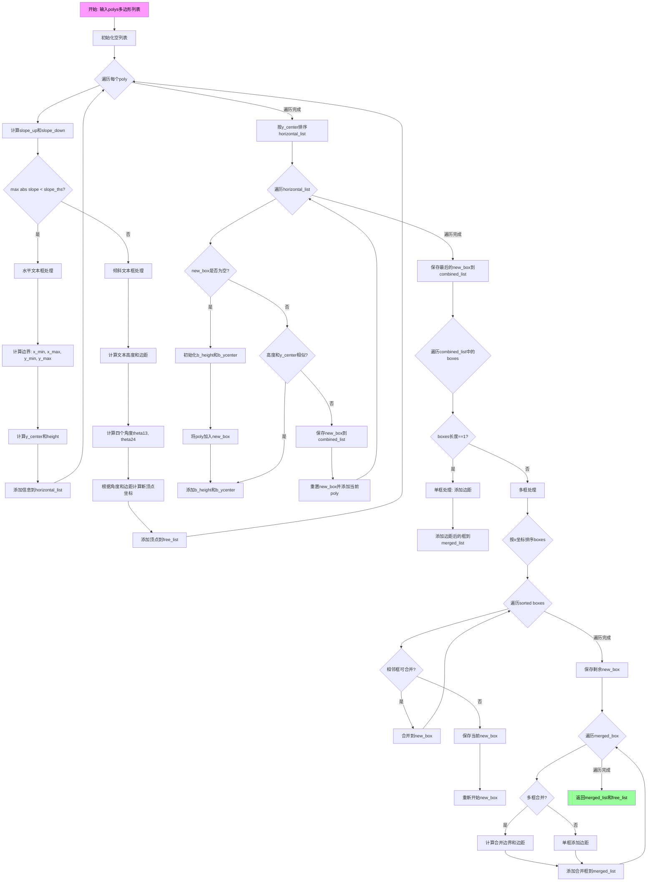

# `comic-translate\modules\ocr\pororo\pororo\models\brainOCR\utils.py` 详细设计文档

该代码是EasyOCR项目的工具模块，提供了图像预处理、文本框检测、CTC解码和语言模型集成等功能，支持多种输入格式（文件路径、URL、字节、数组），实现从图像到文本的完整OCR处理流程。

## 整体流程

```mermaid
graph TD
    A[输入图像] --> B{reformat_input]
    B --> C[图像类型检查]
    C -->|URL| D[下载图像]
    C -->|文件路径| E[读取图像]
    C -->|字节| F[解码图像]
    C -->|numpy数组| G[直接处理]
    D --> H[转换为灰度图和RGB图]
    E --> H
    F --> H
    G --> H
    H --> I[文本检测模型]
    I --> J[group_text_box]
    J --> K[文本框分组]
    K --> L[get_image_list]
    L --> M[透视变换/裁剪]
    M --> N[识别模型]
    N --> O{CTCLabelConverter]
    O -->|greedy| P[decode_greedy]
    O -->|beam search| Q[ctcBeamSearch]
    P --> R[输出文本]
    Q --> R
    R --> S[get_paragraph]
    S --> T[段落重组]
    T --> U[最终结果]
```

## 类结构

```
全局函数
├── consecutive
├── word_segmentation
├── four_point_transform
├── group_text_box
├── get_image_list
├── diff
├── get_paragraph
├── printProgressBar
└── reformat_input
BeamEntry (光束搜索条目类)
BeamState (光束状态类)
CTCLabelConverter (CTC标签转换器类)
辅助函数 (模块级)
├── applyLM
├── simplify_label
├── addBeam
└── ctcBeamSearch
```

## 全局变量及字段


### `HAVE_TORCH`
    
标记torch库是否可用

类型：`bool`
    


### `torch`
    
torch模块（条件导入）

类型：`module`
    


### `BeamEntry.prTotal`
    
空白和非空白总概率

类型：`float`
    


### `BeamEntry.prNonBlank`
    
非空白概率

类型：`float`
    


### `BeamEntry.prBlank`
    
空白概率

类型：`float`
    


### `BeamEntry.prText`
    
语言模型分数

类型：`float`
    


### `BeamEntry.lmApplied`
    
标记LM是否已应用

类型：`bool`
    


### `BeamEntry.labeling`
    
光束标签序列

类型：`tuple`
    


### `BeamState.entries`
    
存储所有光束条目

类型：`dict`
    


### `CTCLabelConverter.char2idx`
    
字符到索引的映射

类型：`dict`
    


### `CTCLabelConverter.idx2char`
    
索引到字符的映射

类型：`dict`
    


### `CTCLabelConverter.ignored_index`
    
忽略的索引

类型：`int`
    


### `CTCLabelConverter.vocab`
    
词汇表列表

类型：`list`
    
    

## 全局函数及方法


### `consecutive`

该函数用于将输入数组按照指定的步长分割成连续的元素组，并根据模式参数返回每组的第一个或最后一个元素，常用于文本识别后处理中的分隔符索引提取。

参数：

- `data`：`numpy.ndarray`，输入的一维数组，待分割的元素序列
- `mode`：`str`，可选，默认值为 `"first"`，指定返回每组的第一个（`"first"`）或最后一个（`"last"`）元素
- `stepsize`：`int`，可选，默认值为 `1`，指定连续元素的步长阈值，用于判断元素是否属于同一组

返回值：`list`，返回处理后的元素列表，若 mode 为 `"first"` 则包含每组的首个元素，若为 `"last"` 则包含每组的末尾元素

#### 流程图

```mermaid
graph TD
    A[开始] --> B[输入 data, mode, stepsize]
    B --> C[计算 np.diffdata]
    C --> D[找不等于 stepsize 的索引位置]
    D --> E[在索引位置 +1 处使用 np.split 分割数组]
    E --> F[过滤空组: remove items with len == 0]
    F --> G{mode == 'first'?}
    G -->|Yes| H[提取每组的第一个元素: l[0] for l in group]
    G -->|No| I{mode == 'last'?}
    I -->|Yes| J[提取每组的最后一个元素: l[-1] for l in group]
    I -->|No| K[返回空列表]
    H --> L[返回结果列表]
    J --> L
    K --> L
```

#### 带注释源码

```python
def consecutive(data, mode: str = "first", stepsize: int = 1):
    """
    将数组按连续步长分割并返回每组的首尾元素
    
    参数:
        data: 输入的numpy数组
        mode: 返回模式，'first'取每组第一个，'last'取每组最后一个
        stepsize: 连续判定步长，默认为1
    返回:
        每组首尾元素组成的列表
    """
    # 计算相邻元素差分
    diff_result = np.diff(data)
    
    # 找到差分值不等于stepsize的位置（分割点）
    # 例如: data=[1,2,3,5,6,7], stepsize=1
    # diff=[1,1,2,1,1], 不等于1的位置是索引2(值为2)
    split_indices = np.where(diff_result != stepsize)[0] + 1
    
    # 在分割点位置拆分数组为多个组
    group = np.split(data, split_indices)
    
    # 过滤掉空组（可能因分割产生）
    group = [item for item in group if len(item) > 0]
    
    # 根据mode选择提取每组的第一个或最后一个元素
    if mode == "first":
        # 模式为first时，取每组第一个元素构成结果列表
        result = [l[0] for l in group]
    elif mode == "last":
        # 模式为last时，取每组最后一个元素构成结果列表
        result = [l[-1] for l in group]
    
    return result
```


### `word_segmentation`

该函数实现文本分割功能，通过识别数组中特定的分隔符索引（如泰语、英语的起始和结束标记），将输入数组按语言类别分割成多个文本块，并返回每个块的语言类型和索引范围。

参数：

- `mat`：`np.ndarray`，需要进行分割的输入数组，通常是包含文本类别标签的一维数组
- `separator_idx`：`dict`，语言与分隔符索引的映射字典，默认值为 `{"th": [1, 2], "en": [3, 4]}`，其中键为语言代码，值为 `[起始索引, 结束索引]` 的列表
- `separator_idx_list`：`list`，要处理的分隔符索引顺序列表，默认值为 `[1, 2, 3, 4]`，用于指定遍历分隔符的顺序

返回值：`list`，分割结果列表，每个元素为 `[语言代码, [起始索引, 结束索引]]` 的形式；未识别语言的区域使用空字符串 `""` 作为语言代码

#### 流程图

```mermaid
flowchart TD
    A[开始 word_segmentation] --> B[初始化 result, sep_list, start_idx=0, sep_lang='']
    B --> C{遍历 separator_idx_list}
    C -->|每个 sep_idx| D{sep_idx % 2 == 0?}
    D -->|是| E[mode = 'first']
    D -->|否| F[mode = 'last']
    E --> G[consecutive找出mat中等于sep_idx的位置]
    F --> G
    G --> H[生成 new_sep = [位置, sep_idx] 并加入 sep_list]
    C --> I{sep_list 排序完成}
    I --> J{遍历排序后的 sep_list}
    J -->|每个 sep| K{sep[1] == separator_idx[lang][0]?}
    K -->|是| L[sep_lang = lang, sep_start_idx = sep[0]]
    K -->|否| M{sep[1] == separator_idx[lang][1]?}
    M -->|是且 sep_lang == lang| N[生成新分割对 new_sep_pair]
    M -->|否| J
    N --> O{sep_start_idx > start_idx?}
    O -->|是| P[添加未识别区域到 result]
    O -->|否| Q[start_idx 更新为 sep[0] + 1]
    P --> Q
    Q --> R[添加 new_sep_pair 到 result]
    R --> S[sep_lang = '']
    S --> J
    J --> T{遍历结束}
    T --> U{start_idx <= len(mat) - 1?}
    U -->|是| V[添加尾部未识别区域到 result]
    U -->|否| W[返回 result]
    V --> W
```

#### 带注释源码

```python
def word_segmentation(
    mat,
    separator_idx={
        "th": [1, 2],
        "en": [3, 4]
    },
    separator_idx_list=[1, 2, 3, 4],
):
    """
    根据分隔符索引将输入数组分割成多个文本块
    
    参数:
        mat: 输入数组，包含文本类别标签
        separator_idx: 语言与分隔符索引的映射
        separator_idx_list: 要处理的分隔符索引顺序
    
    返回:
        分割结果列表，每个元素为 [语言代码, [起始索引, 结束索引]]
    """
    result = []          # 存储最终的分割结果
    sep_list = []        # 存储所有找到的分隔符位置
    start_idx = 0        # 当前处理位置的起始索引
    sep_lang = ""        # 当前语言标记
    
    # 遍历所有指定的分隔符索引
    for sep_idx in separator_idx_list:
        # 偶数索引使用 'first' 模式，奇数索引使用 'last' 模式
        # 偶数索引通常是起始分隔符，奇数索引是结束分隔符
        if sep_idx % 2 == 0:
            mode = "first"
        else:
            mode = "last"
        
        # 使用 consecutive 函数找出 mat 中等于 sep_idx 的所有位置
        # mode='first' 返回每组的第一个元素，mode='last' 返回每组的最后一个元素
        a = consecutive(np.argwhere(mat == sep_idx).flatten(), mode)
        
        # 将每个位置转换为 [位置, 分隔符索引] 的形式
        new_sep = [[item, sep_idx] for item in a]
        sep_list += new_sep
    
    # 按位置排序所有分隔符
    sep_list = sorted(sep_list, key=lambda x: x[0])
    
    # 遍历排序后的分隔符列表，匹配起始和结束分隔符
    for sep in sep_list:
        for lang in separator_idx.keys():
            # 检查是否是某语言的起始分隔符
            if sep[1] == separator_idx[lang][0]:  # start lang
                sep_lang = lang
                sep_start_idx = sep[0]
            # 检查是否是某语言的结束分隔符
            elif sep[1] == separator_idx[lang][1]:  # end lang
                # 确认结束分隔符与之前的起始分隔符是同一种语言
                if sep_lang == lang:  # check if last entry if the same start lang
                    # 生成新的语言分段对 [语言, [起始位置+1, 结束位置-1]]
                    new_sep_pair = [lang, [sep_start_idx + 1, sep[0] - 1]]
                    
                    # 如果起始索引大于当前处理起始位置，添加未识别语言区域
                    if sep_start_idx > start_idx:
                        result.append(["", [start_idx, sep_start_idx - 1]])
                    
                    # 更新处理位置到分隔符之后
                    start_idx = sep[0] + 1
                    # 添加语言分段到结果
                    result.append(new_sep_pair)
                
                # 重置语言标记，准备处理下一个语言段
                sep_lang = ""  # reset
    
    # 处理末尾剩余的未识别区域
    if start_idx <= len(mat) - 1:
        result.append(["", [start_idx, len(mat) - 1]])
    
    return result
```


### `four_point_transform`

该函数实现透视变换功能，将输入图像中由四个点（四边形角点）定义的任意区域矫正为矩形视图，常用于文档图像的倾斜校正和文本区域提取。

参数：

- `image`：`np.ndarray`，输入的原始图像数据
- `rect`：`tuple`，包含四个点坐标的四元组，每个点为 `(x, y)` 形式的坐标，分别表示四边形的左上角(top-left)、右上角(top-right)、右下角(bottom-right)、左下角(bottom-left)

返回值：`np.ndarray`，经过透视变换后得到的矩形图像

#### 流程图


#### 带注释源码

```python
def four_point_transform(image, rect):
    """
    对图像进行透视变换，将四边形区域矫正为矩形
    
    参数:
        image: 输入图像 (numpy数组)
        rect: 四个角点坐标元组 (tl, tr, br, bl)，每个点为 (x, y)
    
    返回:
        透视变换后的矩形图像
    """
    # 解包四边形的四个角点坐标
    # tl: top-left 左上角, tr: top-right 右上角
    # br: bottom-right 右下角, bl: bottom-left 左下角
    (tl, tr, br, bl) = rect

    # 计算四边形底边的宽度 (右下角到左下角的距离)
    widthA = np.sqrt(((br[0] - bl[0])**2) + ((br[1] - bl[1])**2))
    # 计算四边形顶边的宽度 (右上角到左上角的距离)
    widthB = np.sqrt(((tr[0] - tl[0])**2) + ((tr[1] - tl[1])**2))
    # 取两条边的最大值作为输出图像的宽度
    maxWidth = max(int(widthA), int(widthB))

    # 计算四边形右边的高度 (右上角到右下角的距离)
    heightA = np.sqrt(((tr[0] - br[0])**2) + ((tr[1] - br[1])**2))
    # 计算四边形左边的高度 (左上角到左下角的距离)
    heightB = np.sqrt(((tl[0] - bl[0])**2) + ((tl[1] - bl[1])**2))
    # 取两条边的最大值作为输出图像的高度
    maxHeight = max(int(heightA), int(heightB))

    # 构建目标矩形的四个角点坐标
    # 目标矩形从图像原点 (0,0) 开始
    dst = np.array(
        [[0, 0], [maxWidth - 1, 0], [maxWidth - 1, maxHeight - 1],
         [0, maxHeight - 1]],
        dtype="float32",
    )

    # 计算透视变换矩阵
    # 将源四边形 (rect) 映射到目标矩形 (dst)
    M = imk.get_perspective_transform(rect, dst)
    
    # 应用透视变换到输入图像
    # 输出图像尺寸为 (maxWidth, maxHeight)
    warped = imk.warp_perspective(image, M, (maxWidth, maxHeight))

    # 返回透视变换后的图像
    return warped
```


### `group_text_box`

该函数接收文本检测的多边形框（polys），根据斜率将多边形分为水平文本行和倾斜/垂直文本，对水平文本行进行分组和合并，最终返回合并后的水平文本框列表（merged_list）和倾斜文本框列表（free_list），用于OCR识别前的文本行对齐。

参数：

- `polys`：`list`，输入的多边形列表，每个多边形包含4个顶点（8个坐标值：x1,y1,x2,y2,x3,y3,x4,y4）
- `slope_ths`：`float`，默认0.1，斜率阈值，用于判断多边形是否为水平文本
- `ycenter_ths`：`float`，默认0.5，y中心阈值，用于判断水平框是否在同一行
- `height_ths`：`float`，默认0.5，高度阈值，用于判断水平框高度是否相近
- `width_ths`：`float`，默认1.0，宽度阈值，用于判断水平框是否可以合并
- `add_margin`：`float`，默认0.05，文本框边距扩展比例

返回值：`tuple`，返回包含两个列表的元组
- `merged_list`：`list`，合并后的水平文本框列表，每个元素为[x_min, x_max, y_min, y_max]
- `free_list`：`list`，倾斜/垂直文本框列表，每个元素为4个顶点的坐标列表

#### 流程图



#### 带注释源码

```python
def group_text_box(
    polys,
    slope_ths: float = 0.1,
    ycenter_ths: float = 0.5,
    height_ths: float = 0.5,
    width_ths: float = 1.0,
    add_margin: float = 0.05,
):
    """
    将文本检测的多边形框分组和合并，用于OCR文本识别
    
    参数:
        polys: 多边形列表，每个多边形包含8个坐标值 [x1,y1,x2,y2,x3,y3,x4,y4]
        slope_ths: 斜率阈值，用于判断多边形是否为水平
        ycenter_ths: y中心阈值，用于判断框是否在同一行
        height_ths: 高度阈值，用于判断框高度是否相近
        width_ths: 宽度阈值，用于判断框是否可以水平合并
        add_margin: 边距扩展比例
    
    返回:
        merged_list: 合并后的水平文本框列表
        free_list: 倾斜/垂直文本框列表
    """
    # 初始化各类列表
    # horizontal_list: 存储水平文本框信息 [x_min, x_max, y_min, y_max, y_center, height]
    # free_list: 存储倾斜/垂直文本框的四个顶点坐标
    # combined_list: 存储组合后的水平框组
    # merged_list: 存储最终合并后的水平框
    horizontal_list, free_list, combined_list, merged_list = [], [], [], []

    # 遍历每个多边形，根据斜率分类为水平或倾斜
    for poly in polys:
        # poly[0-1]: 第一个点(x1,y1), poly[2-3]: 第二个点(x2,y2)
        # poly[4-5]: 第三个点(x3,y3), poly[6-7]: 第四个点(x4,y4)
        
        # 计算上边斜率: (y2-y1)/(x2-x1)，使用max(10, ...)避免除零
        slope_up = (poly[3] - poly[1]) / np.maximum(10, (poly[2] - poly[0]))
        # 计算下边斜率: (y4-y3)/(x4-x3)
        slope_down = (poly[5] - poly[7]) / np.maximum(10, (poly[4] - poly[6]))
        
        # 判断是否为水平文本框（最大斜率小于阈值）
        if max(abs(slope_up), abs(slope_down)) < slope_ths:
            # 计算边界框
            x_max = max([poly[0], poly[2], poly[4], poly[6]])
            x_min = min([poly[0], poly[2], poly[4], poly[6]])
            y_max = max([poly[1], poly[3], poly[5], poly[7]])
            y_min = min([poly[1], poly[3], poly[5], poly[7]])
            
            # 添加到水平列表，包含: x_min, x_max, y_min, y_max, y_center, height
            horizontal_list.append([
                x_min, x_max, y_min, y_max, 0.5 * (y_min + y_max), y_max - y_min
            ])
        else:
            # 倾斜文本框处理
            # 计算文本高度（第一点到第四点的距离）
            height = np.linalg.norm([poly[6] - poly[0], poly[7] - poly[1]])
            # 根据高度和边距比例计算边距像素值（1.44为经验系数）
            margin = int(1.44 * add_margin * height)

            # 计算第一边角度（左侧边）
            theta13 = abs(
                np.arctan(
                    (poly[1] - poly[5]) / np.maximum(10, (poly[0] - poly[4]))))
            # 计算第二边角度（右侧边）
            theta24 = abs(
                np.arctan(
                    (poly[3] - poly[7]) / np.maximum(10, (poly[2] - poly[6]))))
            
            # 根据角度和边距计算新的四个顶点坐标（扩展边距）
            # x1, y1: 第一个点向左上方偏移
            x1 = poly[0] - np.cos(theta13) * margin
            y1 = poly[1] - np.sin(theta13) * margin
            # x2, y2: 第二个点向右上方偏移
            x2 = poly[2] + np.cos(theta24) * margin
            y2 = poly[3] - np.sin(theta24) * margin
            # x3, y3: 第三个点向右下方偏移
            x3 = poly[4] + np.cos(theta13) * margin
            y3 = poly[5] + np.sin(theta13) * margin
            # x4, y4: 第四个点向左下方偏移
            x4 = poly[6] - np.cos(theta24) * margin
            y4 = poly[7] + np.sin(theta24) * margin

            # 添加四个顶点坐标到自由列表
            free_list.append([[x1, y1], [x2, y2], [x3, y3], [x4, y4]])
    
    # 按y中心坐标排序水平列表
    horizontal_list = sorted(horizontal_list, key=lambda item: item[4])

    # 组合框：将高度和y_center相近的水平框合并为一组
    new_box = []
    for poly in horizontal_list:
        if len(new_box) == 0:
            # 第一个框：初始化高度列表和y中心列表
            b_height = [poly[5]]
            b_ycenter = [poly[4]]
            new_box.append(poly)
        else:
            # 判断当前框是否与已有组相似
            # 高度差异小于阈值 * 平均高度
            # y_center差异小于阈值 * 平均高度
            if (abs(np.mean(b_height) - poly[5]) < height_ths *
                    np.mean(b_height)) and (abs(np.mean(b_ycenter) - poly[4]) <
                                            ycenter_ths * np.mean(b_height)):
                # 相似：添加到当前组
                b_height.append(poly[5])
                b_ycenter.append(poly[4])
                new_box.append(poly)
            else:
                # 不相似：保存当前组，开始新组
                b_height = [poly[5]]
                b_ycenter = [poly[4]]
                combined_list.append(new_box)
                new_box = [poly]
    # 保存最后一个组
    combined_list.append(new_box)

    # 合并列表：对每个组合进行最终合并
    for boxes in combined_list:
        if len(boxes) == 1:
            # 单框情况：直接添加边距
            box = boxes[0]
            margin = int(add_margin * box[5])  # box[5]是高度
            merged_list.append([
                box[0] - margin, box[1] + margin, box[2] - margin,
                box[3] + margin
            ])
        else:
            # 多框情况：需要合并
            # 按x坐标排序
            boxes = sorted(boxes, key=lambda item: item[0])

            merged_box, new_box = [], []
            for box in boxes:
                if len(new_box) == 0:
                    # 第一个框
                    x_max = box[1]  # x_max
                    new_box.append(box)
                else:
                    # 判断水平距离是否小于阈值（宽度阈值 * 高度）
                    if abs(box[0] - x_max) < width_ths * (
                            box[3] - box[2]):  # 合并条件：水平距离小于阈值
                        x_max = box[1]
                        new_box.append(box)
                    else:
                        x_max = box[1]
                        merged_box.append(new_box)
                        new_box = [box]
            # 保存最后的组
            if len(new_box) > 0:
                merged_box.append(new_box)

            # 处理合并后的框组
            for mbox in merged_box:
                if len(mbox) != 1:
                    # 多个相邻框：计算合并后的边界
                    x_min = min(mbox, key=lambda x: x[0])[0]
                    x_max = max(mbox, key=lambda x: x[1])[1]
                    y_min = min(mbox, key=lambda x: x[2])[2]
                    y_max = max(mbox, key=lambda x: x[3])[3]

                    margin = int(add_margin * (y_max - y_min))

                    merged_list.append([
                        x_min - margin, x_max + margin, y_min - margin,
                        y_max + margin
                    ])
                else:
                    # 单个不相邻框：添加边距
                    box = mbox[0]

                    margin = int(add_margin * (box[3] - box[2]))
                    merged_list.append([
                        box[0] - margin,
                        box[1] + margin,
                        box[2] - margin,
                        box[3] + margin,
                    ])
    
    # 返回合并后的水平框列表和倾斜框列表
    return merged_list, free_list
```


### `get_image_list`

该函数用于从图像中裁剪出文本检测框对应的区域，并对这些裁剪图像进行尺寸标准化处理，返回裁剪后的图像列表和计算得到的最大宽度。

参数：

- `horizontal_list`：`list`，水平文本框列表，每个元素包含 `[x_min, x_max, y_min, y_max, y_center, height]` 格式的边界信息
- `free_list`：`list`，自由角度文本框（四边形）列表，每个元素包含 `[[x1,y1],[x2,y2],[x3,y3],[x4,y4]]` 格式的四个顶点坐标
- `img`：`np.ndarray`，原始输入图像
- `model_height`：`int`，模型期望的输入高度，默认值为 64

返回值：`tuple`，返回包含两个元素的元组：
- `image_list`：`list`，裁剪并缩放后的图像列表，每个元素为 `(box_coords, cropped_image)` 的元组
- `max_width`：`int`，所有裁剪图像中的最大宽度

#### 流程图

```mermaid
flowchart TD
    A[开始 get_image_list] --> B[初始化空列表 image_list<br/>获取图像尺寸 maximum_y, maximum_x<br/>初始化 max_ratio_hori=1, max_ratio_free=1]
    
    B --> C[遍历 free_list 中的每个四边形框]
    C --> D[将四边形框转换为 float32 数组]
    D --> E[调用 four_point_transform 进行透视变换]
    E --> F[计算宽高比 ratio = width / height]
    F --> G[使用 imk.resize 调整图像尺寸<br/>目标宽度 = model_height * ratio<br/>目标高度 = model_height]
    G --> H[将 box 和裁剪图像添加到 image_list]
    H --> I[更新 max_ratio_free = max ratio]
    I --> J{遍历完所有 free_list?}
    J -->|否| C
    J -->|是| K[max_ratio_free = ceil(max_ratio_free)]
    
    K --> L[遍历 horizontal_list 中的每个水平框]
    L --> M[计算裁剪边界<br/>x_min = max 0, box 0<br/>x_max = min box 1, maximum_x<br/>y_min = max 0, box 2<br/>y_max = min box 3, maximum_y]
    M --> N[直接切片裁剪图像 crop_img = img y_min:y_max, x_min:x_max]
    N --> O[计算宽高比 ratio = width / height]
    O --> P[使用 imk.resize 调整图像尺寸]
    P --> Q[构造标准化的四边形坐标<br/>[[x_min,y_min], [x_max,y_min], [x_max,y_max], [x_min,y_max]]]
    Q --> R[将坐标和裁剪图像添加到 image_list]
    R --> S[更新 max_ratio_hori = max ratio]
    S --> T{遍历完所有 horizontal_list?}
    T -->|否| L
    T -->|是| U[max_ratio_hori = ceil max_ratio_hori<br/>max_ratio = max max_ratio_hori, max_ratio_free<br/>max_width = ceil max_ratio * model_height]
    
    U --> V[按每个元素的第0个部分的第1个点的y坐标排序 image_list]
    V --> W[返回 image_list, max_width]
```

#### 带注释源码

```python
def get_image_list(horizontal_list: list,
                   free_list: list,
                   img: np.ndarray,
                   model_height: int = 64):
    """
    从图像中裁剪文本检测框对应的区域，并进行尺寸标准化
    
    参数:
        horizontal_list: 水平文本框列表，每个元素为 [x_min, x_max, y_min, y_max, y_center, height]
        free_list: 自由角度文本框列表，每个元素为 [[x1,y1],[x2,y2],[x3,y3],[x4,y4]] 四边形顶点
        img: 原始输入图像 numpy 数组
        model_height: 模型期望的输入高度，默认为 64
    
    返回:
        (image_list, max_width): 裁剪图像列表和最大宽度
    """
    # 初始化返回列表和获取图像尺寸
    image_list = []
    maximum_y, maximum_x = img.shape  # 获取图像的高度和宽度

    # 初始化最大宽高比计数器
    max_ratio_hori, max_ratio_free = 1, 1
    
    # ========== 处理自由角度文本框（四边形）==========
    for box in free_list:
        # 将四边形顶点转换为 numpy float32 数组
        rect = np.array(box, dtype="float32")
        # 调用四点透视变换函数矫正四边形区域
        transformed_img = four_point_transform(img, rect)
        # 计算变换后图像的宽高比
        ratio = transformed_img.shape[1] / transformed_img.shape[0]
        # 使用 imkit 库调整图像尺寸：宽度按比例缩放，高度固定为 model_height
        crop_img = imk.resize(
            transformed_img,
            (int(model_height * ratio), model_height),
            mode=Image.Resampling.LANCZOS,
        )
        # box 格式: [[x1,y1],[x2,y2],[x3,y3],[x4,y4]]
        # 将原始框坐标和裁剪后的图像添加到结果列表
        image_list.append((box, crop_img))
        # 记录最大宽高比
        max_ratio_free = max(ratio, max_ratio_free)

    # 对最大宽高比向上取整
    max_ratio_free = math.ceil(max_ratio_free)

    # ========== 处理水平文本框（矩形）==========
    for box in horizontal_list:
        # 计算裁剪边界，确保不超出图像范围
        x_min = max(0, box[0])      # 左边界，最小为 0
        x_max = min(box[1], maximum_x)  # 右边界，最大为图像宽度
        y_min = max(0, box[2])      # 上边界，最小为 0
        y_max = min(box[3], maximum_y)  # 下边界，最大为图像高度
        # 直接使用数组切片裁剪图像
        crop_img = img[y_min:y_max, x_min:x_max]
        # 计算裁剪区域的宽高
        width = x_max - x_min
        height = y_max - y_min
        # 计算宽高比
        ratio = width / height
        # 调整图像尺寸
        crop_img = imk.resize(
            crop_img,
            (int(model_height * ratio), model_height),
            mode=Image.Resampling.LANCZOS,
        )
        # 构造标准化的四边形坐标表示（将矩形转换为四边形格式）
        image_list.append((
            [
                [x_min, y_min],
                [x_max, y_min],
                [x_max, y_max],
                [x_min, y_max],
            ],
            crop_img,
        ))
        # 更新水平方向的最大宽高比
        max_ratio_hori = max(ratio, max_ratio_hori)

    # ========== 计算最终的最大宽度 ==========
    max_ratio_hori = math.ceil(max_ratio_hori)  # 向上取整
    max_ratio = max(max_ratio_hori, max_ratio_free)  # 取两种框的最大宽高比
    max_width = math.ceil(max_ratio) * model_height  # 计算最大宽度

    # ========== 按垂直位置排序并返回 ==========
    # 按每个元素的第0个部分的第1个点的 y 坐标排序（按从上到下的顺序）
    image_list = sorted(image_list, key=lambda item: item[0][0][1])
    return image_list, max_width
```


### `ctcBeamSearch`

该函数实现了CTC（Connectionist Temporal Classification）Beam Search解码算法，用于在OCR任务中将神经网络的输出矩阵解码为最终的文本识别结果。算法通过维护多个可能的标签路径（beam），在每个时间步计算空白和非空白字符的概率，最终返回概率最高的文本标签。

参数：

- `mat`：`np.ndarray`，形状为 (maxT, maxC) 的概率矩阵，表示每个时间步各字符的输出概率
- `classes`：`list`，字符类别列表，用于将索引映射回实际字符
- `ignore_idx`：`int`，需要忽略的索引（通常是空白符索引）
- `lm_model`：语言模型对象，用于计算bigram概率以提升识别准确率
- `lm_factor`：`float`，语言模型权重因子，默认为0.01
- `beam_width`：`int`，Beam Search宽度，保留的概率最高候选数量，默认为5

返回值：`str`，解码后的文本字符串

#### 流程图


#### 带注释源码

```python
def ctcBeamSearch(
    mat,
    classes: list,
    ignore_idx: int,
    lm_model,
    lm_factor: float = 0.01,
    beam_width: int = 5,
):
    """
    CTC Beam Search 解码器
    
    参数:
        mat: 概率矩阵，形状为 (时间步数, 字符类别数)
        classes: 字符类别列表
        ignore_idx: 忽略的索引（空白符）
        lm_model: 语言模型
        lm_factor: 语言模型权重
        beam_width: beam宽度
    
    返回:
        解码后的文本字符串
    """
    blankIdx = 0  # 空白符索引
    maxT, maxC = mat.shape  # maxT: 时间步数, maxC: 字符类别数

    # 初始化beam状态
    last = BeamState()
    labeling = ()  # 空元组表示初始标签
    last.entries[labeling] = BeamEntry()
    last.entries[labeling].prBlank = 1  # 初始空白概率为1
    last.entries[labeling].prTotal = 1  # 初始总概率为1

    # 遍历所有时间步
    for t in range(maxT):
        curr = BeamState()  # 当前时间步的beam状态
        
        # 获取最佳beam标签（按概率排序，取前beam_width个）
        bestLabelings = last.sort()[0:beam_width]
        
        # 遍历最佳beam
        for labeling in bestLabelings:
            # 路径以非空白符结尾的概率
            prNonBlank = 0
            # 如果beam非空，计算重复字符的概率
            if labeling:
                # 概率 = 上一个beam的非空白概率 × 当前时间步该字符的概率
                prNonBlank = last.entries[labeling].prNonBlank * mat[t, labeling[-1]]

            # 路径以空白符结尾的概率
            # 概率 = 上一个beam的总概率 × 当前时间步空白符的概率
            prBlank = (last.entries[labeling].prTotal) * mat[t, blankIdx]

            # 简化当前标签（合并连续空白符）
            labeling = simplify_label(labeling, blankIdx)
            # 添加beam到当前时间步
            addBeam(curr, labeling)

            # 填充beam数据
            curr.entries[labeling].labeling = labeling
            curr.entries[labeling].prNonBlank += prNonBlank
            curr.entries[labeling].prBlank += prBlank
            curr.entries[labeling].prTotal += prBlank + prNonBlank
            curr.entries[labeling].prText = last.entries[labeling].prText
            # LM已在上一时间步应用，标记为已应用
            curr.entries[labeling].lmApplied = True

            # 扩展当前beam标签 - 添加新字符
            # 获取概率超过阈值的候选字符
            char_highscore = np.where(
                mat[t, :] >= 0.5 / maxC)[0]  # 运行所有可能字符
            
            # 遍历高概率字符
            for c in char_highscore:
                # 添加新字符到当前标签
                newLabeling = labeling + (c,)
                newLabeling = simplify_label(newLabeling, blankIdx)

                # 如果新标签末尾与原标签末尾相同（重复字符）
                # 只考虑以空白符转移的路径
                if labeling and labeling[-1] == c:
                    prNonBlank = mat[t, c] * last.entries[labeling].prBlank
                else:
                    # 否则考虑所有路径
                    prNonBlank = mat[t, c] * last.entries[labeling].prTotal

                # 添加新beam
                addBeam(curr, newLabeling)

                # 填充新beam数据
                curr.entries[newLabeling].labeling = newLabeling
                curr.entries[newLabeling].prNonBlank += prNonBlank
                curr.entries[newLabeling].prTotal += prNonBlank

                # 应用语言模型
                applyLM(
                    curr.entries[labeling],
                    curr.entries[newLabeling],
                    classes,
                    lm_model,
                    lm_factor,
                )

        # 设置新的beam状态
        last = curr

    # 根据beam标签长度归一化LM分数
    last.norm()

    # 获取概率最高的标签
    bestLabeling = last.sort()[0]
    res = ""
    
    # 移除重复字符和空白符
    for i, l in enumerate(bestLabeling):
        if l != ignore_idx and (not (i > 0 and bestLabeling[i - 1] == l)):
            res += classes[l]

    return res
```


### `get_paragraph`

该函数接收OCR识别结果（包含文本框坐标和文本内容），通过分析文本框的空间位置关系（水平/垂直距离和高度），将离散的文本框聚类成段落，并按指定顺序（从左到右或从右到左）合并文本，最终返回由段落边界框和对应文本组成的列表。

参数：

- `raw_result`：`list`，OCR识别结果列表，每个元素为 `[文本框坐标, 识别文本]` 的结构
- `x_ths`：`int`，水平距离阈值乘数，用于判断文本框是否属于同一段落，默认为 1
- `y_ths`：`float`，垂直距离阈值乘数，用于判断文本框是否属于同一段落，默认为 0.5
- `mode`：`str`，文本排列方向模式，`"ltr"` 表示从左到右，`"rtl"` 表示从右到左，默认为 `"ltr"`

返回值：`list`，段落列表，每个元素为 `[[边界框四个角坐标], 合并后的文本]` 的结构

#### 流程图


#### 带注释源码

```python
def get_paragraph(raw_result,
                  x_ths: int = 1,
                  y_ths: float = 0.5,
                  mode: str = "ltr"):
    # 创建基础属性列表，用于存储每个文本框的详细信息
    # 结构: [文本, min_x, max_x, min_y, max_y, height, y_center, group_id]
    box_group = []
    
    # 第一步：遍历OCR结果，提取每个文本框的空间信息
    for box in raw_result:
        # 提取文本框所有顶点的x坐标
        all_x = [int(coord[0]) for coord in box[0]]
        # 提取文本框所有顶点的y坐标
        all_y = [int(coord[1]) for coord in box[0]]
        # 计算边界
        min_x = min(all_x)
        max_x = max(all_x)
        min_y = min(all_y)
        max_y = max(all_y)
        # 计算文本框高度
        height = max_y - min_y
        # 将处理后的文本框信息添加到组中，最后的0表示初始时未分组
        box_group.append([
            box[1], min_x, max_x, min_y, max_y, height, 0.5 * (min_y + max_y), 0
        ])
    
    # 第二步：将文本框聚类成段落
    # current_group 表示当前正在处理的段落组号，从1开始
    current_group = 1
    # 循环直到所有文本框都被分组
    while len([box for box in box_group if box[7] == 0]) > 0:
        # 获取所有未分组的文本框（group_id = 0）
        box_group0 = [box for box in box_group if box[7] == 0]
        
        # 检查当前组号是否已有文本框
        if len([box for box in box_group if box[7] == current_group]) == 0:
            # 当前组为空，将第一个未分组文本框分配给新组
            box_group0[0][7] = current_group
        else:
            # 当前组已有文本框，计算组的统计信息
            current_box_group = [
                box for box in box_group if box[7] == current_group
            ]
            # 计算当前组的平均高度
            mean_height = np.mean([box[5] for box in current_box_group])
            # 根据平均高度和阈值计算组的边界范围
            # x_ths 控制水平方向的扩展范围
            # y_ths 控制垂直方向的扩展范围
            min_gx = min([box[1] for box in current_box_group]) - x_ths * mean_height
            max_gx = max([box[2] for box in current_box_group]) + x_ths * mean_height
            min_gy = min([box[3] for box in current_box_group]) - y_ths * mean_height
            max_gy = max([box[4] for box in current_box_group]) + y_ths * mean_height
            
            add_box = False
            # 尝试将未分组文本框加入当前组
            for box in box_group0:
                # 检查水平方向是否在同一级别（与当前组有重叠）
                same_horizontal_level = (min_gx <= box[1] <= max_gx) or (min_gx <= box[2] <= max_gx)
                # 检查垂直方向是否在同一级别（与当前组有重叠）
                same_vertical_level = (min_gy <= box[3] <= max_gy) or (min_gy <= box[4] <= max_gy)
                # 如果水平和垂直都在同一级别，则加入当前组
                if same_horizontal_level and same_vertical_level:
                    box[7] = current_group
                    add_box = True
                    break
            
            # 如果当前组无法再加入更多文本框，则转到下一组
            if not add_box:
                current_group += 1
    
    # 第三步：排列段落内的文本顺序
    result = []
    # 遍历所有段落组
    for i in set(box[7] for box in box_group):
        # 获取当前组的所有文本框
        current_box_group = [box for box in box_group if box[7] == i]
        # 计算当前组的平均高度
        mean_height = np.mean([box[5] for box in current_box_group])
        # 计算当前组的边界
        min_gx = min([box[1] for box in current_box_group])
        max_gx = max([box[2] for box in current_box_group])
        min_gy = min([box[3] for box in current_box_group])
        max_gy = max([box[4] for box in current_box_group])

        # 按顺序合并文本
        text = ""
        while len(current_box_group) > 0:
            # 找到当前垂直位置最高的文本框（y_center 最小）
            highest = min([box[6] for box in current_box_group])
            # 选取在"最高"附近范围内的候选文本框
            candidates = [
                box for box in current_box_group
                if box[6] < highest + 0.4 * mean_height
            ]
            
            # 根据模式选择最左或最右的文本框
            if mode == "ltr":
                # 从左到右模式：选择最左边的
                most_left = min([box[1] for box in candidates])
                for box in candidates:
                    if box[1] == most_left:
                        best_box = box
            elif mode == "rtl":
                # 从右到左模式：选择最右边的
                most_right = max([box[2] for box in candidates])
                for box in candidates:
                    if box[2] == most_right:
                        best_box = box
            
            # 将选中文本框的文本追加到段落文本
            text += " " + best_box[0]
            # 从候选列表中移除已处理的文本框
            current_box_group.remove(best_box)

        # 构建返回结果：段落边界框和合并后的文本
        result.append([
            [
                [min_gx, min_gy],
                [max_gx, min_gy],
                [max_gx, max_gy],
                [min_gx, max_gy],
            ],
            text[1:],  # 去掉开头多余的空格
        ])

    return result
```


### `printProgressBar`

该函数是一个用于在终端显示下载或处理进度的进度条生成器。它接收进度条的显示参数（前缀、后缀、小数位数、长度、填充字符等），返回一个回调函数 `progress_hook`，该回调函数可被 `urlretrieve` 的 `reporthook` 参数使用，以实时更新终端中的进度条显示。

#### 参数

- `prefix`：`str`，可选，进度条前显示的字符串，默认为空字符串
- `suffix`：`str`，可选，进度条后显示的字符串，默认为空字符串
- `decimals`：`int`，可选，百分比数的小数位数，默认为 1
- `length`：`int`，可选，进度条的长度（字符数），默认为 100
- `fill`：`str`，可选，进度条的填充字符，默认为实心块符号 "█"
- `printEnd`：`str`，可选，打印结束字符，用于控制换行，默认为回车符 "\r"

#### 返回值

`function`，返回一个名为 `progress_hook` 的回调函数。该回调函数接受三个参数：
- `count`：已下载的块数量
- `blockSize`：每个块的大小（字节）
- `totalSize`：文件的总大小（字节）

回调函数不返回任何值，仅在终端打印进度条。

#### 流程图

```mermaid
flowchart TD
    A[调用 printProgressBar] --> B[定义内部函数 progress_hook]
    B --> C[接收 count, blockSize, totalSize 参数]
    C --> D[计算进度: progress = count × blockSize / totalSize]
    D --> E[计算百分比字符串]
    E --> F[计算填充长度: filledLength = length × progress]
    F --> G[生成进度条字符串: fill × filledLength + '-' × (length - filledLength)]
    G --> H[打印进度条: \r prefix |bar| percent% suffix]
    H --> I[返回 progress_hook 函数]
    I --> J[urlretrieve 调用 progress_hook]
    J --> C
```

#### 带注释源码

```python
def printProgressBar(
    prefix="",          # 进度条前缀字符串
    suffix="",          # 进度条后缀字符串
    decimals: int = 1,  # 百分比的小数位数
    length: int = 100,  # 进度条的字符长度
    fill: str = "█",    # 进度条的填充字符（实心块）
    printEnd: str = "\r", # 打印结束字符（回车符，不换行）
):
    """
    Call in a loop to create terminal progress bar
    @params:
        prefix      - Optional  : prefix string (Str)
        suffix      - Optional  : suffix string (Str)
        decimals    - Optional  : positive number of decimals in percent complete (Int)
        length      - Optional  : character length of bar (Int)
        fill        - Optional  : bar fill character (Str)
        printEnd    - Optional  : end character (e.g. "\r", "\r\n") (Str)
    """

    # 定义内部回调函数 progress_hook
    # 该函数将作为 urlretrieve 的 reporthook 参数使用
    # 每次下载块时都会被调用
    def progress_hook(count, blockSize, totalSize):
        # 计算当前下载进度（0.0 到 1.0）
        progress = count * blockSize / totalSize
        
        # 格式化百分比字符串，保留指定的小数位数
        percent = ("{0:." + str(decimals) + "f}").format(progress * 100)
        
        # 计算进度条中填充字符的长度
        filledLength = int(length * progress)
        
        # 生成进度条字符串：
        # 左侧用填充字符（如 █）表示已完成部分
        # 右侧用 '-' 表示未完成部分
        bar = fill * filledLength + "-" * (length - filledLength)
        
        # 打印进度条，使用 \r 将光标移回行首实现动态更新
        # end=printEnd 防止自动换行
        print(f"\r{prefix} |{bar}| {percent}% {suffix}", end=printEnd)

    # 返回回调函数，供 urlretrieve 在下载过程中调用
    return progress_hook
```


### `reformat_input`

该函数是一个图像预处理函数，用于将不同格式的输入（文件路径、URL、字节流或NumPy数组）统一转换为RGB格式图像和灰度图像，为后续OCR处理做准备。

参数：

- `image`：`str` / `bytes` / `np.ndarray`，输入图像，支持文件路径、URL地址、字节流或NumPy数组格式

返回值：`tuple`，包含两个元素的元组

- `img`：`np.ndarray`，RGB格式图像，形状为 (原始图像高度, 原始图像宽度, 3)
- `img_cv_grey`：`np.ndarray`，灰度图像，形状为 (原始图像高度, 原始图像宽度, 3)

#### 流程图


#### 带注释源码

```python
def reformat_input(image):
    """
    :param image: image file path or bytes or array
    :return:
        img (array): (original_image_height, original_image_width, 3)
        img_cv_grey (array): (original_image_height, original_image_width, 3)
    """
    # 判断输入类型：字符串（文件路径或URL）
    if type(image) == str:
        # 检查是否为HTTP/HTTPS URL
        if image.startswith("http://") or image.startswith("https://"):
            # 下载远程图像到临时文件
            tmp, _ = urlretrieve(
                image,
                reporthook=printProgressBar(
                    prefix="Progress:",
                    suffix="Complete",
                    length=50,
                ),
            )
            # 读取临时文件并转为灰度图
            img_cv_grey = imk.to_gray(imk.read_image(tmp))
            # 删除临时文件释放空间
            os.remove(tmp)
        else:
            # 本地文件路径：直接读取并转灰度
            img_cv_grey = imk.to_gray(imk.read_image(image))
            # 展开用户路径（如 ~/xxx）
            image = os.path.expanduser(image)
        # 加载为RGB格式图像（可接受URL）
        img = load_image(image)  # can accept URL
    
    # 判断输入类型：字节流
    elif type(image) == bytes:
        # 将字节数据转换为NumPy数组
        nparr = np.frombuffer(image, np.uint8)
        # 解码为RGB格式图像
        img = imk.decode_image(nparr)  # Already in RGB format
        # 转为灰度图
        img_cv_grey = imk.to_gray(img)

    # 判断输入类型：NumPy数组
    elif type(image) == np.ndarray:
        # 处理灰度图像（2维数组）
        if len(image.shape) == 2:  # grayscale
            img_cv_grey = image
            # 将单通道灰度图堆叠为3通道RGB
            img = np.stack([image, image, image], axis=2)  # Convert grayscale to RGB
        # 处理BGR图像（3维数组，3通道）
        elif len(image.shape) == 3 and image.shape[2] == 3:  # BGRscale
            img = image
            img_cv_grey = imk.to_gray(image)
        # 处理RGBA图像（3维数组，4通道）
        elif len(image.shape) == 3 and image.shape[2] == 4:  # RGBAscale
            # 取前3个通道作为RGB
            img = image[:, :, :3]
            # img is already in RGB format, no conversion needed
            img_cv_grey = imk.to_gray(img)

    # 返回RGB图像和灰度图像
    return img, img_cv_grey
```


### `applyLM`

计算子 Beam 的语言模型分数，通过结合父 Beam 的历史标记与最后一个字符的二元语法概率来评估字符序列的可能性。该函数是 CTC Beam Search 解码器中语言模型集成的核心组件，负责在 beam 搜索过程中动态评估和更新每个候选序列的语言模型得分。

参数：

- `parentBeam`：`BeamEntry`，父 Beam 条目，包含历史标记序列（labeling）信息，用于构建语言模型的上文
- `childBeam`：`BeamEntry`，子 Beam 条目，需要计算语言模型分数的目标 Beam，将被更新 `prText` 和 `lmApplied` 属性
- `classes`：`list`，字符类别列表，将索引映射为实际字符，用于将数值标记转换为可计算的文本
- `lm_model`：语言模型对象，提供 `score()` 方法计算文本的语言模型概率，支持 n-gram 模型（如 KenLM）
- `lm_factor`：`float`，语言模型权重因子（默认 0.01），用于控制语言模型分数在最终评分中的权重

返回值：`None`（无返回值），通过直接修改 `childBeam` 对象的属性来更新语言模型分数

#### 流程图

```mermaid
flowchart TD
    A["applyLM 开始"] --> B{检查 lm_model 是否存在<br/>且 childBeam.lmApplied 为 False}
    B -->|否| Z["直接返回，不做任何修改"]
    B -->|是| C["获取父 Beam 的历史标记 labeling"]
    C --> D["将历史标记转换为文本<br/>过滤空白符并替换空格为 ▁"]
    D --> E["获取当前字符<br/>替换空格为 ▁"]
    E --> F{判断当前字符是否为 [blank]}
    F -->|是| G["设置 lmProb = 1"]
    F -->|否| H["拼接历史文本和当前字符<br/>计算语言模型分数"]
    H --> I["lmProb = 10^lm_model.score(text, bos=True) * lm_factor"]
    G --> J["更新 childBeam.prText = lmProb"]
    J --> K["设置 childBeam.lmApplied = True"]
    K --> Z
    
    style A fill:#e1f5fe
    style Z fill:#e8f5e8
    style K fill:#fff3e0
```

#### 带注释源码

```python
def applyLM(parentBeam, childBeam, classes, lm_model, lm_factor: float = 0.01):
    """
    计算子 Beam 的语言模型分数
    通过结合父 Beam 的历史标记与最后一个字符的二元语法概率来评估字符序列的可能性
    
    参数:
        parentBeam: BeamEntry, 父 Beam 条目，包含历史标记序列
        childBeam: BeamEntry, 子 Beam 条目，需要计算语言模型分数
        classes: list, 字符类别列表，将索引映射为实际字符
        lm_model: 语言模型对象，提供 score() 方法
        lm_factor: float, 语言模型权重因子，默认 0.01
    """
    # 检查语言模型是否存在且该 Beam 尚未应用 LM
    # 避免重复计算，提高效率
    if lm_model is not None and not childBeam.lmApplied:
        
        # 获取父 Beam 的历史标记序列
        history = parentBeam.labeling
        
        # 将数值标记转换为可读的文本格式
        # 过滤掉索引为 0 的元素（通常表示空白符）
        # 将空格替换为 ▁ 符号（用于语言模型处理）
        history = " ".join(
            classes[each].replace(" ", "▁") for each in history if each != 0)
        
        # 获取当前最新的字符
        current_char = classes[childBeam.labeling[-1]].replace(" ", "▁")
        
        # 如果当前字符是空白符，语言模型概率设为 1
        # 空白符不影响语言模型评分
        if current_char == "[blank]":
            lmProb = 1
        else:
            # 拼接历史文本和当前字符形成完整文本序列
            # 用于语言模型评分
            text = history + " " + current_char
            
            # 计算语言模型分数
            # lm_model.score() 返回以 10 为底的对数概率
            # 乘以 lm_factor 调整语言模型在最终评分中的权重
            # bos=True 表示这是序列的开始
            lmProb = 10**lm_model.score(text, bos=True) * lm_factor
        
        # 将计算得到的语言模型概率赋值给子 Beam
        childBeam.prText = lmProb  # probability of char sequence
        
        # 标记该 Beam 已应用语言模型，避免重复计算
        childBeam.lmApplied = True  # only apply LM once per beam entry
```


### `simplify_label`

该函数用于对 CTC（Connectionist Temporal Classification）解码过程中的标签序列进行简化处理，通过移除连续的空白符以及不同字符之间的空白符，生成更紧凑的标签序列，常配合 Beam Search 解码器使用。

参数：

- `labeling`：任意可迭代类型（如 list、tuple），输入的标签序列，通常是字符索引的列表
- `blankIdx`：`int`，空白符的索引，默认为 0

返回值：`tuple`，处理简化后的标签序列，以元组形式返回

#### 流程图

```mermaid
flowchart TD
    A[开始] --> B[将 labeling 转换为 numpy 数组]
    B --> C{第一步：移除连续空白符}
    C --> D[使用 np.roll 对比相邻元素]
    D --> E[筛选出非连续空白的位置索引 idx]
    E --> F[labeling = labeling[idx]]
    F --> G{第二步：移除不同字符间的空白符}
    G --> H[使用 np.roll 对比前后元素]
    H --> I[筛选出非空白间隔的位置索引 idx]
    I --> J{检查并保留最后一个元素}
    J --> K{len labeling > 0?}
    K -->|是| L{last_idx 不在 idx 中?}
    K -->|否| M[直接返回 tuple]
    L -->|是| N[idx = np.append idx, last_idx]
    L -->|否| O[保持 idx 不变]
    N --> P[labeling = labeling[idx]]
    O --> P
    P --> Q[返回 tuple labeling]
```

#### 带注释源码

```python
def simplify_label(labeling, blankIdx: int = 0):
    """
    简化 CTC 标签序列，移除空白符
    
    该函数执行两步处理：
    1. 移除连续的空白符（如 [1,0,0,0,2] -> [1,2]）
    2. 移除不同字符之间的空白符（如 [1,0,2] -> [1,2]）
    
    参数:
        labeling: 输入的标签序列，通常是字符索引的列表或元组
        blankIdx: 空白符的索引，默认为 0
    
    返回:
        tuple: 简化后的标签序列
    """
    # 将输入的 labeling 转换为 numpy 数组以便进行向量化操作
    labeling = np.array(labeling)

    # ========== 第一步：移除连续空白符 ==========
    # 使用 np.roll 将数组向左滚动一位，然后与原数组比较
    # 条件：(np.roll(labeling, 1) == labeling) 表示当前元素与前一个元素相同
    # 条件：(labeling == blankIdx) 表示当前元素是空白符
    # 两者同时满足时，表示是连续空白符，需要移除
    # np.where 返回满足条件的索引，[0] 取第一维
    idx = np.where(~((np.roll(labeling, 1) == labeling) &
                     (labeling == blankIdx)))[0]
    # 根据筛选后的索引获取新数组
    labeling = labeling[idx]

    # ========== 第二步：移除不同字符之间的空白符 ==========
    # 条件：前一个元素与后一个元素不同，且当前元素是空白符
    # 这表示当前空白符分隔了两个不同的字符，应该移除
    idx = np.where(~((np.roll(labeling, 1) != np.roll(labeling, -1)) &
                     (labeling == blankIdx)))[0]

    # ========== 确保最后一个元素被保留 ==========
    if len(labeling) > 0:
        last_idx = len(labeling) - 1
        if last_idx not in idx:
            # 强制添加最后一个元素的索引
            idx = np.append(idx, [last_idx])
    # 再次筛选以保留必要的元素
    labeling = labeling[idx]

    # 转换为元组返回
    return tuple(labeling)
```


### `addBeam`

向波束状态中添加一个新的波束条目，如果该标签序列不存在于波束状态中，则创建一个新的`BeamEntry`实例。

参数：

- `beamState`：`BeamState`，需要添加波束的波束状态对象，包含波束条目的字典
- `labeling`：`tuple`，表示波束标签的元组，用于唯一标识一个波束序列

返回值：`None`，该函数直接修改`beamState.entries`字典，不返回任何值

#### 流程图


#### 带注释源码

```python
def addBeam(beamState, labeling):
    "add beam if it does not yet exist"
    # 检查给定的标签序列是否已经存在于波束状态中
    if labeling not in beamState.entries:
        # 如果不存在，则创建新的波束条目并添加到波束状态中
        beamState.entries[labeling] = BeamEntry()
```


### `ctcBeamSearch`

该函数实现 CTC（Connectionist Temporal Classification）束搜索解码算法，用于将神经网络输出的概率矩阵解码为最终的文本序列。算法通过维护多条候选路径（beam），在每个时间步根据字符概率和语言模型评分进行扩展和剪枝，最终返回概率最高的文本结果。

参数：

- `mat`：`np.ndarray`，形状为 (maxT, maxC) 的二维数组，表示神经网络输出的概率矩阵，每行对应一个时间步，每列对应一个字符类别的概率分布
- `classes`：`list`，字符类别列表，包含所有可能的字符（如英文字母、中文字符等），索引对应概率矩阵中的列
- `ignore_idx`：`int`，需要忽略的索引，通常用于跳过空白符或特殊分隔符
- `lm_model`：`object`，语言模型对象，用于计算字符序列的语言模型概率分数，传入 None 时不应用语言模型
- `lm_factor`：`float`，语言模型权重因子，默认为 0.01，用于控制语言模型分数在总评分中的权重
- `beam_width`：`int`，束搜索宽度，控制在每个时间步保留的最高概率候选数量，默认为 5

返回值：`str`，解码后的文本字符串，即去除空白符和重复字符后的最终识别结果

#### 流程图

```mermaid
flowchart TD
    A[开始 ctcBeamSearch] --> B[初始化: blankIdx=0, 创建初始BeamState]
    B --> C[遍历每个时间步 t: 0 到 maxT-1]
    C --> D[获取当前时间步的高概率字符]
    D --> E[遍历每个候选字符 c]
    E --> F{判断字符是否与上一个字符相同}
    F -->|是| G[计算非空白概率: prNonBlank = mat[t,c] × prBlank]
    F -->|否| H[计算非空白概率: prNonBlank = mat[t,c] × prTotal]
    G --> I[更新新beam的prNonBlank和prTotal]
    H --> I
    I --> J[应用语言模型更新prText]
    J --> K[是否还有候选字符]
    K -->|是| E
    K -->|否| L[更新beam state为当前时间步的结果]
    L --> M{是否还有时间步}
    M -->|是| C
    M -->|否| N[归一化语言模型分数]
    N --> O[获取概率最高的beam]
    O --> P[去除重复字符和空白符]
    P --> Q[返回解码文本]
```

#### 带注释源码

```python
def ctcBeamSearch(
    mat,
    classes: list,
    ignore_idx: int,
    lm_model,
    lm_factor: float = 0.01,
    beam_width: int = 5,
):
    """
    CTC束搜索解码器
    
    参数:
        mat: 神经网络输出的概率矩阵，形状为 (时间步数, 类别数)
        classes: 字符类别列表
        ignore_idx: 忽略的索引
        lm_model: 语言模型
        lm_factor: 语言模型权重因子
        beam_width: 束搜索宽度
    
    返回:
        解码后的文本字符串
    """
    # 空白符索引，CTC中默认为0
    blankIdx = 0
    # 获取概率矩阵的形状: maxT=时间步数, maxC=类别数
    maxT, maxC = mat.shape

    # ========== 初始化 ==========
    # 创建初始的beam状态
    last = BeamState()
    # 初始为空标签序列
    labeling = ()
    # 将初始beam加入状态
    last.entries[labeling] = BeamEntry()
    # 初始空白概率为1
    last.entries[labeling].prBlank = 1
    # 初始总概率为1
    last.entries[labeling].prTotal = 1

    # ========== 遍历所有时间步 ==========
    for t in range(maxT):
        # 创建当前时间步的beam状态
        curr = BeamState()
        
        # 获取上一时间步概率最高的beam_width个标签序列
        bestLabelings = last.sort()[0:beam_width]
        
        # 遍历每个最优beam进行扩展
        for labeling in bestLabelings:
            # ========== 处理空白符 ==========
            # 计算以非空白符结尾的路径概率
            prNonBlank = 0
            # 如果当前beam非空，计算重复最后一个字符的概率
            if labeling:
                # 路径以重复的最后一个字符结束的概率
                prNonBlank = last.entries[labeling].prNonBlank * mat[t, labeling[-1]]

            # 计算以空白符结尾的路径概率
            prBlank = (last.entries[labeling].prTotal) * mat[t, blankIdx]

            # 简化标签（去除连续空白和重复字符间的空白）
            labeling = simplify_label(labeling, blankIdx)
            # 将当前beam添加到当前时间步
            addBeam(curr, labeling)

            # 填充beam数据
            curr.entries[labeling].labeling = labeling
            curr.entries[labeling].prNonBlank += prNonBlank
            curr.entries[labeling].prBlank += prBlank
            curr.entries[labeling].prTotal += prBlank + prNonBlank
            # 从上一个beam继承文本分数（LM分数）
            curr.entries[labeling].prText = last.entries[labeling].prText
            # 标记LM已在上一时间步应用过
            curr.entries[labeling].lmApplied = True

            # ========== 扩展新字符 ==========
            # 找出当前时间步概率高于阈值的字符（阈值为 0.5/maxC）
            char_highscore = np.where(
                mat[t, :] >= 0.5 / maxC
            )[0]
            
            # 遍历每个候选字符
            for c in char_highscore:
                # 创建新的标签序列（添加新字符）
                newLabeling = labeling + (c,)
                newLabeling = simplify_label(newLabeling, blankIdx)

                # 计算新路径的概率
                if labeling and labeling[-1] == c:
                    # 如果新字符与最后一个字符相同，只能通过blank转移
                    prNonBlank = mat[t, c] * last.entries[labeling].prBlank
                else:
                    # 否则可以通过任意路径转移
                    prNonBlank = mat[t, c] * last.entries[labeling].prTotal

                # 添加新beam
                addBeam(curr, newLabeling)

                # 填充新beam的数据
                curr.entries[newLabeling].labeling = newLabeling
                curr.entries[newLabeling].prNonBlank += prNonBlank
                curr.entries[newLabeling].prTotal += prNonBlank

                # 应用语言模型
                applyLM(
                    curr.entries[labeling],
                    curr.entries[newLabeling],
                    classes,
                    lm_model,
                    lm_factor,
                )

        # 更新beam状态为当前时间步的结果
        last = curr

    # ========== 后处理 ==========
    # 根据beam标签长度归一化LM分数
    last.norm()

    # 获取概率最高的标签序列
    bestLabeling = last.sort()[0]
    
    # 转换为文本（去除重复字符和空白符）
    res = ""
    for i, l in enumerate(bestLabeling):
        if l != ignore_idx and (not (i > 0 and bestLabeling[i - 1] == bestLabeling[i])):
            res += classes[l]

    return res
```


### `BeamEntry.__init__`

BeamEntry 类的初始化方法，用于创建表示特定时间步的单条 Beam（光束）的数据结构，初始化 Beam 的所有概率评分和状态标记。

参数：

- 无显式参数（仅包含隐式参数 `self`，代表 BeamEntry 实例本身）

返回值：`None`，构造函数不返回值，仅初始化实例属性。

#### 流程图

```mermaid
flowchart TD
    A[开始 __init__] --> B[设置 prTotal = 0]
    B --> C[设置 prNonBlank = 0]
    C --> D[设置 prBlank = 0]
    D --> E[设置 prText = 1]
    E --> F[设置 lmApplied = False]
    F --> G[设置 labeling = ()]
    G --> H[结束 __init__]
```

#### 带注释源码

```python
def __init__(self):
    """
    初始化 BeamEntry 实例的各个属性
    
    该构造函数创建一条 Beam 的初始状态，用于 CTC Beam Search 解码过程中
    记录每个时间步的候选字符序列及其概率评分
    """
    self.prTotal = 0       # 总概率（blank 和 non-blank 的概率之和）
    self.prNonBlank = 0   # non-blank 字符的概率（以字符结尾的路径概率）
    self.prBlank = 0      # blank 字符的概率（跳过当前时间步的概率）
    self.prText = 1       # 语言模型评分，初始化为1表示无语言模型时的基础分数
    self.lmApplied = False  # 标志位，标记语言模型是否已应用于此 Beam
    self.labeling = ()    # Beam 的标签序列（tuple类型），记录当前 Beam 对应的字符索引序列
```


### `BeamState.norm`

该方法对 BeamState 中所有 beam 的语言模型分数进行长度归一化处理，通过将每个 beam 的 `prText`（LM分数）提升到其标签长度的倒数次幂来平衡不同长度标签的得分差异，确保长文本的 LM 分数不会因累积而过度偏大。

参数：無

返回值：`None`，该方法直接修改对象内部状态，无返回值。

#### 流程图


#### 带注释源码

```python
def norm(self):
    "length-normalise LM score"  # 文档字符串：长度归一化 LM 分数
    # 遍历 BeamState 中所有的 beam entries
    for (k, _) in self.entries.items():
        # 获取当前 beam 的标签（labeling）的长度
        labelingLen = len(self.entries[k].labeling)
        
        # 计算归一化因子：取标签长度的倒数
        # 如果标签长度为 0（空元组），则使用 1 避免除零错误
        # 这里的 ** 运算符表示幂运算，即 prText^(1/length)
        self.entries[k].prText = self.entries[k].prText**(
            1.0 / (labelingLen if labelingLen else 1.0))
        # 归一化公式：new_score = old_score^(1/length)
        # 作用：长度越长的标签，其 LM 分数被压缩得越多
        # 这样可以平衡不同长度文本的得分，避免长文本分数过高
```


### `BeamState.sort`

该方法用于对当前时间步的所有光束（beam）按总概率（`prTotal * prText`）进行降序排序，并返回排序后的标记序列（labeling）列表。在CTCBeamSearch解码过程中，该方法用于获取概率最高的光束，以便在下一个时间步继续扩展搜索。

**参数：**
- 该方法无显式参数（隐含参数 `self` 为 `BeamState` 实例本身）

返回值：`list`，返回按概率降序排序的所有 beam 的 labeling 列表，每个元素为元组类型，表示一个完整的标记序列。

#### 流程图


#### 带注释源码

```python
def sort(self):
    """
    对当前 BeamState 中的所有 beam 按概率排序
    返回按概率降序排列的 labeling（元组）列表
    
    排序依据: beam的总概率 * 语言模型分数
    """
    # 1. 从 entries 字典中提取所有 BeamEntry 对象
    #    entries 结构: {labeling_tuple: BeamEntry_instance}
    beams = [v for (_, v) in self.entries.items()]
    
    # 2. 使用 Python 内置 sorted 函数进行降序排序
    #    reverse=True 表示降序（从大到小）
    #    排序键: 每个 beam 的 prTotal（路径总概率）乘以 prText（LM分数）
    sortedBeams = sorted(
        beams,
        reverse=True,  # 降序排列，概率最高的排在前面
        key=lambda x: x.prTotal * x.prText,  # 综合考虑路径概率和LM分数
    )
    
    # 3. 提取排序后每个 beam 的 labeling 属性
    #    labeling 即为该 beam 对应的字符索引序列（元组形式）
    #    返回列表供外部调用者使用
    return [x.labeling for x in sortedBeams]
```


### `BeamState.wordsearch`

该方法是BeamState类中的一个搜索方法，用于在光束搜索（Beam Search）过程中进行词典匹配。它从当前的光束候选中选择概率最高且出现在给定词典中的文本，作为最终的识别结果。

参数：

- `classes`：`list`，字符类列表，将索引映射回实际字符
- `ignore_idx`：`int`，需要忽略的索引值，通常用于跳过空白符或分隔符
- `maxCandidate`：`int`，最大候选数量，限制参与词典搜索的光束数量
- `dict_list`：`list`，词典列表，包含所有有效的单词或文本序列

返回值：`str`，返回匹配到的最佳文本，如果词典中没有匹配则返回概率最高的候选文本

#### 流程图


#### 带注释源码

```python
def wordsearch(self, classes, ignore_idx, maxCandidate, dict_list):
    """
    在词典中搜索最佳匹配的文本
    
    参数:
        classes: 字符类列表，将索引映射为字符
        ignore_idx: 需要忽略的索引
        maxCandidate: 最大候选数量
        dict_list: 词典列表
    
    返回:
        最佳匹配的文本字符串
    """
    # 获取所有光束条目
    beams = [v for (_, v) in self.entries.items()]
    
    # 按总概率乘以语言模型分数排序，reverse=True表示降序（概率高的在前）
    sortedBeams = sorted(
        beams,
        reverse=True,
        key=lambda x: x.prTotal * x.prText,
    )
    
    # 限制候选光束数量，只保留概率最高的前maxCandidate个
    if len(sortedBeams) > maxCandidate:
        sortedBeams = sortedBeams[:maxCandidate]

    # 遍历排序后的候选光束
    for j, candidate in enumerate(sortedBeams):
        # 获取当前候选的标签序列
        idx_list = candidate.labeling
        text = ""
        
        # 将标签序列转换为文本
        # 规则1: 跳过ignore_idx中的索引
        # 规则2: 跳过连续重复的字符（CTC解码特性）
        for i, l in enumerate(idx_list):
            if l not in ignore_idx and (
                    not (i > 0 and idx_list[i - 1] == idx_list[i])):
                text += classes[l]

        # 第一个候选直接作为最佳文本的初始值
        if j == 0:
            best_text = text
            
        # 检查当前文本是否在词典中
        if text in dict_list:
            # 找到词典中的词，设置为此为最佳文本
            # print('found text: ', text)
            best_text = text
            # 找到匹配后跳出循环，返回最佳结果
            break
        else:
            # 未找到匹配，继续检查下一个候选
            pass
            # print('not in dict: ', text)
    
    # 返回最终的最佳文本
    return best_text
```


### `CTCLabelConverter.encode`

将输入的文本标签列表转换为用于CTC Loss的索引序列和对应的长度数组。

参数：

- `texts`：`list`，文本标签列表，每个元素对应一张图片的文本标签，形状为 `[batch_size]`

返回值：`tuple`，包含两个元素：
- 第一个元素：合并后的文本索引数组（`torch.IntTensor` 或 `np.ndarray`），形状为 `[sum(text_lengths)]`
- 第二个元素：每个文本的长度数组（`torch.IntTensor` 或 `np.ndarray`），形状为 `[batch_size]`

#### 流程图


#### 带注释源码

```
def encode(self, texts: list):
    """
    将输入文本转换为索引
    参数:
        texts (list): 每个图像的文本标签列表, 形状为 [batch_size]
    
    返回:
        text: 用于CTCLoss的拼接文本索引, 形状为 [text_index_0 + text_index_1 + ...]
        length: 每个文本的长度, 形状为 [batch_size]
    """
    # 步骤1: 计算每个文本的长度
    lengths = [len(text) for text in texts]
    
    # 步骤2: 将所有文本拼接成一个字符串
    concatenated_text = "".join(texts)
    
    # 步骤3: 将每个字符转换为其对应的索引
    indices = [self.char2idx[char] for char in concatenated_text]

    # 步骤4: 根据torch是否可用返回不同类型的数组
    if HAVE_TORCH:
        # 返回torch张量
        return torch.IntTensor(indices), torch.IntTensor(lengths)
    # 备选方案: 当torch不可用时返回numpy int32数组
    return np.array(indices, dtype=np.int32), np.array(lengths, dtype=np.int32)
```


### CTCLabelConverter.decode_greedy

该方法是 CTCLabelConverter 类的核心解码方法，采用贪心解码策略将 CTC 输出的序列索引转换为可读文本字符串。它遍历每个样本的索引序列，通过过滤空白符和重复字符来重建文本标签。

参数：

- `self`：CTCLabelConverter 实例本身，包含字符映射表（char2idx、idx2char）和忽略索引配置
- `indices`：`list` 或 `Tensor`，形状为 [N*length,] 的一维序列，包含所有样本的字符索引（连接在一起）
- `lengths`：`list` 或 `Tensor`，形状为 [N,] 的一维数组，表示每个样本的长度

返回值：`list`，返回文本字符串列表，每个元素对应一个样本的解码结果

#### 流程图

```mermaid
flowchart TD
    A[开始 decode_greedy] --> B[初始化空列表 texts 和索引 index = 0]
    B --> C{遍历 lengths 中的每个 length}
    C -->|获取当前样本长度| D[将 length 转换为原生 int 类型]
    D --> E[提取 indices[index:index+length] 作为当前样本的 text]
    E --> F[初始化空列表 chars 和内部循环索引 i = 0]
    F --> G{i < length?}
    G -->|是| H[获取 text[i] 并转换为 int 类型得到 val]
    H --> I{val != ignored_index 且<br/>i==0 或 text[i-1] != val}
    I -->|是| J[将 idx2char[val] 加入 chars]
    I -->|否| K[跳过当前字符]
    J --> L[i = i + 1]
    K --> L
    L --> G
    G -->|否| M[将 chars 连接为字符串并加入 texts]
    M --> N[index = index + length]
    N --> C
    C -->|遍历完成| O[返回 texts 列表]
    O --> P[结束]
```

#### 带注释源码

```python
def decode_greedy(self, indices, lengths):
    """convert text-index into text-label.

    :param indices (1D int32 Tensor): [N*length,]
    :param lengths (1D int32 Tensor): [N,]
    :return:
    """
    # 存储所有样本的解码结果
    texts = []
    # 当前处理到的索引位置（用于切片）
    index = 0
    
    # 遍历每个样本的长度
    for length in lengths:
        # ensure length is a native int for slicing
        # 确保 length 是原生 Python int 类型，以支持切片操作
        length = int(length)
        
        # 提取当前样本的索引序列
        text = indices[index:index + length]

        # 存储当前样本的字符列表
        chars = []
        
        # 遍历当前样本的每个索引
        for i in range(length):
            # convert element to int (works for torch tensors, numpy scalars, and ints)
            # 将元素转换为 int（兼容 torch tensor、numpy 标量和原生 int）
            val = int(text[i])
            
            # 判断条件：不是空白符 且 不是重复字符
            # removing repeated characters and blank (and separator).
            if (val != self.ignored_index) and (
                    not (i > 0 and int(text[i - 1]) == val)
            ):
                # 通过索引查找对应字符并添加到结果中
                chars.append(self.idx2char[val])
        
        # 将字符列表拼接为字符串，并添加到结果列表
        texts.append("".join(chars))
        
        # 更新索引位置，指向下一个样本的起始位置
        index += length
    
    # 返回所有样本的解码文本列表
    return texts
```


### `CTCLabelConverter.decode_beamsearch`

该方法是 `CTCLabelConverter` 类的成员方法，用于使用 CTC Beam Search 算法将概率矩阵解码为文本标签。它遍历输入矩阵的每一行，调用 `ctcBeamSearch` 函数进行解码，并返回解码后的文本列表。

参数：

- `self`：`CTCLabelConverter` 实例本身，包含词汇表和字符映射关系
- `mat`：`numpy.ndarray` 或 `torch.Tensor`，形状为 `(batch_size, time_steps, num_classes)` 的概率矩阵，其中每个元素表示在特定时间步产生某个字符的概率
- `lm_model`：语言模型对象，用于在 Beam Search 过程中提供语言模型评分（可以为 `None` 表示不使用语言模型）
- `lm_factor`：`float`，语言模型权重因子，用于平衡 CTC 分数和语言模型分数
- `beam_width`：`int`，Beam Search 的宽度参数，默认为 5，控制保留的候选路径数量

返回值：`list[str]`，解码后的文本列表，长度等于 batch size，每个元素是对应输入概率矩阵行的解码结果

#### 流程图

```mermaid
flowchart TD
    A["开始 decode_beamsearch"] --> B["初始化空列表 texts"]
    B --> C{"i < mat.shape[0]?"}
    C -->|Yes| D["取 mat[i] 作为当前行概率分布"]
    D --> E["调用 ctcBeamSearch 进行解码"]
    E --> F["获取解码文本 text"]
    F --> G["将 text 添加到 texts 列表"]
    G --> H["i = i + 1"]
    H --> C
    C -->|No| I["返回 texts 列表"]
    I --> J["结束"]
    
    style A fill:#f9f,color:#000
    style I fill:#9f9,color:#000
    style J fill:#9f9,color:#000
```

#### 带注释源码

```python
def decode_beamsearch(self, mat, lm_model, lm_factor, beam_width: int = 5):
    """
    使用 Beam Search 算法解码 CTC 输出概率矩阵
    
    参数:
        mat: 概率矩阵，形状为 (batch_size, time_steps, num_classes)
        lm_model: 语言模型实例，用于评分
        lm_factor: 语言模型权重系数
        beam_width: Beam Search 宽度，默认值为 5
    
    返回:
        texts: 解码后的文本列表
    """
    # 初始化结果列表，用于存储每行矩阵的解码结果
    texts = []
    
    # 遍历矩阵的每一行（即每个样本的概率分布）
    for i in range(mat.shape[0]):
        # 提取当前样本的概率分布向量
        # mat[i] 的形状为 (time_steps, num_classes)
        probability_distribution = mat[i]
        
        # 调用 CTC Beam Search 解码器进行解码
        # 参数说明:
        #   - probability_distribution: 当前样本的概率分布
        #   - self.vocab: 词汇表列表，包含所有可能的字符
        #   - self.ignored_index: 忽略的索引（通常是空白符索引）
        #   - lm_model: 语言模型，用于提升解码准确率
        #   - lm_factor: 语言模型权重
        #   - beam_width: Beam Search 宽度
        text = ctcBeamSearch(
            probability_distribution,  # mat[i]
            self.vocab,                  # 词汇表
            self.ignored_index,          # 忽略的索引
            lm_model,                    # 语言模型
            lm_factor,                   # 语言模型权重
            beam_width,                  # Beam 宽度
        )
        
        # 将解码结果添加到文本列表
        texts.append(text)
    
    # 返回所有样本的解码结果
    return texts
```

## 关键组件


### BeamEntry

单个光束的信息类，用于在CTC解码的特定时间步存储光束的概率分数和标签状态。

### BeamState

管理特定时间步所有光束的状态类，包含norm()、sort()和wordsearch()方法，用于归一化、语言模型分数排序和词搜索。

### CTCLabelConverter

CTC标签转换器类，实现字符集与索引之间的双向映射，提供encode()、decode_greedy()和decode_beamsearch()方法进行编码和解码。

### ctcBeamSearch

CTC光束搜索解码核心函数，通过维护多个候选光束并应用语言模型来找到最可能的文本序列。

### applyLM

应用语言模型得分的辅助函数，根据父光束的历史标签和双字符概率计算子光束的语言模型分数。

### simplify_label

简化CTC标签的函数，通过移除空白符和连续重复字符来规范化标签序列。

### word_segmentation

基于分隔符索引将矩阵分割成语言区域的函数，支持泰语和英语等多语言文本的分割。

### four_point_transform

透视变换函数，将包含四个角点的文本区域图像进行几何校正。

### group_text_box

文本框分组函数，根据倾斜度、中心点、高度和宽度阈值将多边形文本框合并成段落和行。

### get_image_list

从分组后的文本框生成裁剪图像列表的函数，返回规范化后的图像和最大宽度。

### get_paragraph

段落重构函数，基于x和y方向的阈值将文本框聚合成段落，支持从左到右和从右到左的排列模式。

### reformat_input

图像输入预处理函数，支持文件路径、URL、字节流和numpy数组等多种输入格式，统一转换为RGB和灰度图像。

### printProgressBar

终端进度条显示函数，返回一个钩子函数用于显示文件下载或处理的进度。


## 问题及建议


### 已知问题

-   **重复导入PIL模块**：代码第6行和第9行都导入了`PIL.Image`，导致模块被导入两次，增加内存开销且代码冗余
-   **缺少模块级和函数级文档字符串**：大部分函数和类没有docstring，导致代码可维护性和可读性差，新开发者难以理解函数意图
-   **类型注解不完整/缺失**：如`consecutive()`函数参数和返回值没有类型注解；`word_segmentation()`的返回类型未标注；`group_text_box()`、`get_image_list()`等函数严重缺乏类型提示
-   **CTCLabelConverter类设计问题**：属性`ignored_index`、`char2idx`、`idx2char`、`vocab`未使用类型注解，且`encode()`方法在无torch时返回numpy数组，有torch时返回torch.Tensor，类型不一致
-   **魔法数字和硬编码值**：多处使用硬编码数值如`0.5`（概率阈值）、`5`（beam_width默认值）、`0.4`（高度阈值倍数）、`1.44`（margin系数），缺乏常量定义
-   **CTC Beam Search实现效率问题**：`ctcBeamSearch`函数中每次迭代都调用`last.sort()`，排序操作时间复杂度O(n log n)，在beam_width较大时会有性能影响；`np.where(mat[t, :] >= 0.5 / maxC)`在每帧都执行，可预先计算
-   **边界条件和错误处理不足**：`reformat_input()`函数对无效输入类型处理简单，仅依赖if-elif判断，缺少异常捕获；`group_text_box()`在除法操作前未检查除数是否为0
-   **变量命名不规范**：如`a`、`b_height`、`b_ycenter`、`new_box`等单字母或缩写变量名缺乏描述性；部分变量如`sep_lang`、`sep_start_idx`含义不明确
-   **importlib动态导入torch的方式不优雅**：使用try-except捕获异常后设置全局标志`HAVE_TORCH`，然后在多处代码中需要判断此标志，导致代码逻辑分散
-   **函数设计不一致**：`decode_greedy`和`decode_beamsearch`在CTCLabelConverter类中但实现风格差异大；`wordsearch`方法定义在BeamState类中但实际与BeamSearch主流程相对独立
-   **内存和计算冗余**：`get_image_list`函数对每张图像都调用`four_point_transform`和`imk.resize`，可能产生临时大数组；`simplify_label`中多次进行数组切片和计算
-   **代码注释不一致**：部分函数有注释说明来源（如基于GitHub项目），但大部分实现逻辑缺乏注释说明

### 优化建议

-   移除重复的`from PIL import Image`导入，保留一处即可
-   为所有公共函数和类添加docstring，说明参数、返回值和功能；对于复杂算法（如CTC解码）添加算法说明注释
-   完善类型注解，使用`typing`模块的`List`、`Dict`、`Tuple`、`Optional`等；统一`encode()`方法返回类型（可考虑始终返回numpy数组或使用Union类型）
-   将硬编码的魔法数字提取为模块级常量或配置参数，如`DEFAULT_BEAM_WIDTH = 5`、`PROBABILITY_THRESHOLD = 0.5`、`LM_FACTOR_DEFAULT = 0.01`等，便于后续调优
-   优化CTC Beam Search：对`bestLabelings`排序可使用`heapq.nlargest`替代完整排序；预先计算字符概率阈值掩码；考虑使用Numba加速关键循环
-   增加输入验证和异常处理：对`reformat_input()`的image参数类型进行验证并给出明确错误信息；对除法操作前检查分母是否为0；添加必要的try-except块处理图像读取失败等情况
-   重构变量命名：使用更具描述性的名称替代单字母变量，如`b_height`改为`box_heights`，`new_box`改为`current_box_group`等
-   考虑使用依赖注入或配置类管理torch的导入和LM模型，减少全局标志`HAVE_TORCH`的判断散落在各处
-   将`BeamState.wordsearch`方法重构为独立函数或工具类，提高内聚性
-   优化内存使用：对于大图像处理考虑使用生成器模式；`four_point_transform`和`imk.resize`可考虑in-place操作或复用缓冲数组
-   统一代码风格：参考Google或PEP8风格指南，使用yapf或black等工具格式化；补充缺失的注释使代码自文档化


## 其它


### 设计目标与约束

本模块作为EasyOCR的核心工具库，主要目标是为文本识别提供完整的图像预处理、CTC解码和后处理功能。设计约束包括：1) 必须支持中英文等多语言识别；2) Beam Search解码需在效率和准确率之间取得平衡，默认beam_width=5；3) 图像处理需保持原始长宽比；4) 依赖PyTorch和NumPy，优雅降级到纯NumPy实现。

### 错误处理与异常设计

代码采用防御式编程，主要错误处理包括：1) torch模块导入使用try-except包装，不存在时设置HAVE_TORCH=False并降级到NumPy；2) reformat_input函数对不同输入类型（str/bytes/np.ndarray）进行类型检查和转换；3) URL下载使用urlretrieve并设置进度回调；4) 图像路径使用os.expanduser处理~路径；5) 数组索引操作使用np.where和np.roll进行边界保护。潜在异常：输入图像格式不支持、URL无法访问、内存不足等。

### 数据流与状态机

数据流主要分为三路：1) 图像输入→reformat_input→灰度/RGB转换→后续处理；2) 文本框检测结果→group_text_box→水平/自由列表分类→get_image_list→四点变换或裁剪→识别模型；3) 识别结果→CTCLabelConverter decode→CTCP Beam Search解码→段落重组get_paragraph。状态机主要体现在BeamSearch中：每个时间步维护beam state，根据CTC概率更新blank/non-blank路径，简化标签后进行下一轮迭代。

### 外部依赖与接口契约

核心依赖包括：1) numpy - 数组操作；2) torch (可选) - Tensor和IntTensor；3) PIL (Pillow) - 图像处理；4) imkit - 图像变换和透视变换；5) urllib - URL下载；6) math - 数学计算。关键接口契约：reformat_input接受str/bytes/np.ndarray返回(img, img_cv_grey)；CTCLabelConverter.encode接受list返回(indices, lengths)；decode_greedy/decode_beamsearch分别返回texts列表；group_text_box返回(merged_list, free_list)。

### 性能考虑与优化空间

性能瓶颈：1) Beam Search中np.where(mat[t,:] >= 0.5/maxC)对所有字符遍历，可考虑阈值动态调整；2) group_text_box多次排序和遍历，时间复杂度O(n²)；3) 段落重组get_paragraph嵌套循环较多。优化方向：1) Beam Search可引入prefix beam管理；2) group_text_box可使用并查集优化合并逻辑；3) 图像列表排序可缓存键值；4) LM评分计算可批量处理。

### 配置参数与常量说明

关键参数：1) separator_idx - 语言分隔符索引映射，th:[1,2], en:[3,4]；2) slope_ths=0.1 - 文本框斜率阈值；3) ycenter_ths=0.5 - y中心比较阈值；4) height_ths=0.5 - 高度比较阈值；5) width_ths=1.0 - 宽度比较阈值；6) add_margin=0.05 - 边缘margin系数；7) beam_width=5 - Beam Search宽度；8) lm_factor=0.01 - 语言模型权重；9) model_height=64 - 识别模型输入高度；10) x_ths/y_ths - 段落重组阈值。

### 算法复杂度分析

consecutive: O(n)；word_segmentation: O(n log n)因排序；ctcBeamSearch: O(T×beam_width×C)，T为时间步数，C为类别数；group_text_box: O(n²)因双重遍历和排序；get_paragraph: O(n²)因嵌套遍历；其他函数多为O(n)线性复杂度。

### 使用示例与调用场景

典型调用链：1) 单文本识别：reformat_input→模型推理→CTCLabelConverter.decode_greedy；2) 批量Beam Search：reformat_input→模型推理→CTCLabelConverter.decode_beamsearch；3) 文档识别：文本检测→group_text_box→get_image_list→识别→get_paragraph重组段落。


    