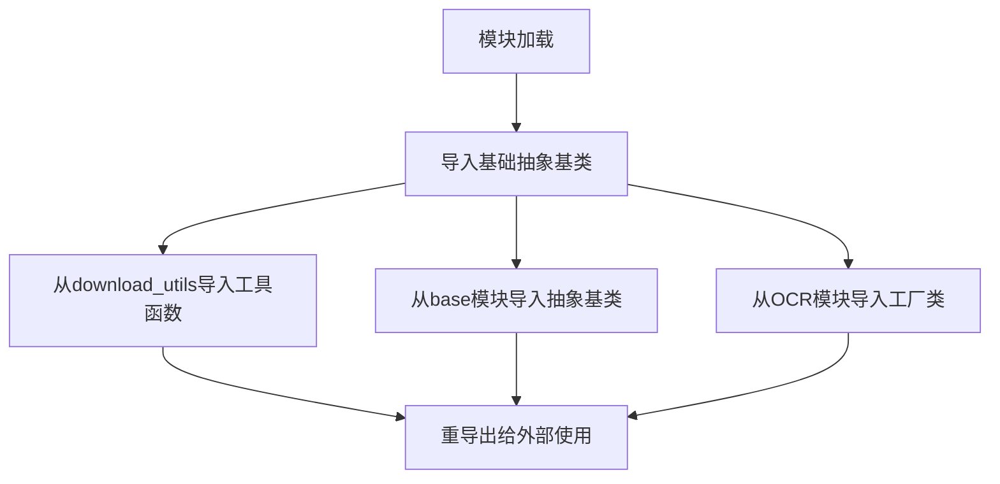
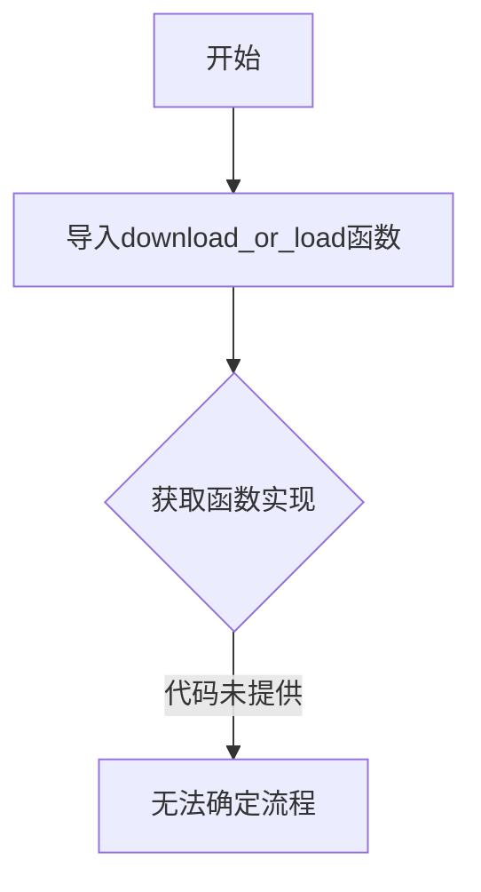

# `comic-translate\modules\ocr\pororo\pororo\tasks\__init__.py` 详细设计文档

这是一个Python模块的导入初始化文件，用于聚合导出机器学习任务相关的基类、工厂类和工具函数，以便于统一对外提供API接口，简化用户的导入使用。

## 整体流程



## 类结构

```
PororoBase (抽象基类家族)
├── PororoBiencoderBase (双编码器基类)
├── PororoFactoryBase (工厂模式基类)
├── PororoGenerationBase (生成模型基类)
├── PororoSimpleBase (简单任务基类)
├── PororoTaskGenerationBase (任务生成基类)
└── PororoOcrFactory (OCR工厂类)
```

## 全局变量及字段


### `download_or_load`
    
工具函数，用于下载或加载资源文件

类型：`function`
    


### `PororoBiencoderBase`
    
双编码器基础类，定义了双向编码器模型的通用接口和方法

类型：`class`
    


### `PororoFactoryBase`
    
工厂模式基础类，提供了任务工厂的抽象接口

类型：`class`
    


### `PororoGenerationBase`
    
文本生成任务基础类，定义了生成式任务的通用接口

类型：`class`
    


### `PororoSimpleBase`
    
简单任务基础类，提供基础任务的通用实现

类型：`class`
    


### `PororoTaskGenerationBase`
    
任务生成基础类，定义了任务级别生成模型的抽象接口

类型：`class`
    


### `PororoOcrFactory`
    
OCR光学字符识别工厂类，用于创建OCR任务实例

类型：`class`
    


    

## 全局函数及方法


### `download_or_load`

该函数 `download_or_load` 来自模块 `...pororo.tasks.utils.download_utils`，但在当前提供的代码片段中仅包含导入语句，未展示函数的具体实现。

参数：无法从给定代码片段中确定

返回值：无法从给定代码片段中确定

#### 流程图



#### 带注释源码

```python
# 从 download_utils 模块导入 download_or_load 函数
# 注意：当前代码片段仅包含导入语句，未展示函数实现
from ...pororo.tasks.utils.download_utils import download_or_load
```

---

### 说明

当前提供的代码片段是一个 `__init__.py` 文件，仅包含了从 `pororo.tasks.utils.download_utils` 模块导入 `download_or_load` 函数的语句，但没有展示该函数的具体实现代码。

要获取完整的函数信息（参数、返回值、流程图、实现代码），需要提供 `pororo/tasks/utils/download_utils.py` 文件的内容。


## 关键组件


### 核心功能概述

该代码是 `__init__.py` 文件，作为模块导入入口，主要用于重导出（reexport）工具类、基类和工厂类，以便其他模块可以通过单一入口访问 Pororo 任务框架的核心组件。

### 文件运行流程

该文件在包初始化时自动执行，主要流程为：1) 跳过代码检查（flake8/import sort）；2) 从 `download_utils` 模块导入 `download_or_load` 函数；3) 从 `base` 模块导入5个基础类；4) 从 OCR 模块导入 `PororoOcrFactory` 工厂类。这些导入的类和函数会被添加到包的命名空间，供外部通过 `from ... import` 方式使用。

### 关键组件信息

### download_or_load

下载或加载工具函数，用于获取模型文件或数据资源，支持缓存和按需加载机制。

### PororoBiencoderBase

双编码器基类，定义了双编码器模型的抽象接口，用于同时编码两个输入（如查询和文档）的共享基类。

### PororoFactoryBase

工厂模式基类，提供了任务对象创建的抽象接口，所有具体任务工厂类应继承此类以实现工厂方法。

### PororoGenerationBase

生成式任务基类，定义了文本生成任务的抽象接口，包括模型加载、推理等核心方法的基类实现。

### PororoSimpleBase

简单任务基类，提供轻量级任务的抽象接口，适用于不需要复杂流水线处理的任务场景。

### PororoTaskGenerationBase

任务生成基类，继承自生成基类，专门用于需要任务特定生成逻辑的场景，封装了任务相关的生成逻辑。

### PororoOcrFactory

光学字符识别工厂类，继承自 `PororoFactoryBase`，负责创建 OCR 任务实例，提供文本识别功能的工厂实现。

### 潜在技术债务与优化空间

1. **模块聚合策略**：当前 `__init__.py` 导入较为分散，建议按功能分组并添加明确的模块文档字符串
2. **导入优化**：可使用 `__all__` 显式定义公开 API，控制导出内容
3. **类型注解**：建议添加类型注解以提升代码可维护性和 IDE 支持
4. **依赖解耦**：当前直接导入具体工厂类，建议通过注册机制实现松耦合

### 其他项目说明

**设计目标**：通过统一的导入入口简化模块使用，提供清晰的 API 层次结构
**错误处理**：导入失败时 Python 会抛出 `ImportError`，需确保依赖路径正确
**数据流**：该文件不涉及数据流处理，仅作为模块导入聚合器
**外部依赖**：依赖 `pororo.tasks.utils` 包中的模块，需保持模块路径一致性
**接口契约**：导入的类需遵循各自基类定义的接口规范


## 问题及建议


### 已知问题

-   **相对导入层级过深**：使用 `...`（三个点）的相对导入，表明包结构较深，可能导致导入路径脆弱，重构时容易出现问题。
-   **缺少 `__all__` 定义**：未显式定义公共 API 导出列表，无法明确哪些类/函数对外部可用，增加了 API 不稳定风险。
-   **跳过代码检查**：使用 `# flake8: noqa` 和 `# isort:skip_file` 绕过静态检查，可能掩盖潜在的代码风格和导入顺序问题。
-   **暴露内部实现细节**：直接导入并传递基类（如 `PororoBiencoderBase` 等），这些本应是内部使用的类被直接暴露，降低了封装性。
-   **导入来源不透明**：一次性从多个模块导入多个类（`download_utils` 和 `base`），增加了依赖耦合度和理解难度。
-   **无文档注释**：缺少对导入内容用途的说明，后续维护者难以理解为何导入这些组件。

### 优化建议

-   **重构包结构**：考虑是否需要如此深的包层级，必要时扁平化结构以简化导入。
-   **显式导出公共接口**：添加 `__all__` 列表，明确导出对外部可用的类（如 `PororoOcrFactory`），隐藏内部实现。
-   **移除跳过检查指令**：清理 flake8/isort 跳过指令，确保代码符合项目规范，必要时调整检查配置。
-   **提供模块级文档**：在 `__init__.py` 顶部添加 docstring，说明该模块的职责和导出内容。
-   **封装导入逻辑**：如需提供基类给外部使用，考虑通过中间模块或明确的重新导出方式，而不是直接透传。

## 其它


### 1. 一段话描述

该代码是Python包的初始化文件（__init__.py），用于统一导出pororo任务模块中的工具类（download_utils、base模块）和工厂类（PororoOcrFactory），以便其他模块可以通过包导入这些核心组件。

### 2. 文件的整体运行流程

该__init__.py文件在包首次被导入时执行，主要流程如下：
1. 解释器加载该__init__.py文件
2. 执行import语句，从utils模块导入工具类和基类
3. 从optical_character_recognition模块导入工厂类
4. 将这些类和函数注册到包的命名空间中
5. 后续其他模块可以通过from ... import语句使用这些导出的组件

### 3. 类的详细信息

**导入的工具基类：**

- **PororoBiencoderBase**：双向编码器基类，用于双编码器模型的基础实现
- **PororoFactoryBase**：工厂模式基类，提供任务对象创建的标准接口
- **PororoGenerationBase**：生成式任务基类，用于文本生成类任务
- **PororoSimpleBase**：简单任务基类，提供基础的任务执行接口
- **PororoTaskGenerationBase**：任务型生成基类，扩展生成能力支持任务特定功能

**导入的工厂类：**

- **PororoOcrFactory**：光学字符识别工厂类，负责创建OCR任务实例

### 4. 全局函数详细信息

**download_or_load**

- 参数名称：url/path（字符串）
- 参数类型：str
- 参数描述：资源下载地址或本地路径
- 返回值类型：Any
- 返回值描述：下载或加载的资源对象
- 带注释源码：
```python
from ...pororo.tasks.utils.download_utils import download_or_load
# 用于下载或加载模型资源的工具函数
```

### 5. 关键组件信息

- **download_utils**：下载工具模块，提供模型资源的下载和加载功能
- **base模块**：包含所有任务基类，定义Pororo任务的统一接口规范
- **PororoOcrFactory**：OCR任务的工厂类，负责实例化OCR任务对象

### 6. 潜在的技术债务或优化空间

1. **隐式依赖风险**：导入路径使用相对路径（...pororo.tasks.utils），若项目结构变化会导致导入失败
2. **循环依赖隐患**：随着功能增加，__init__.py可能引入循环依赖问题
3. **导入性能**：所有类在包初始化时全部导入，若后续模块增多会影响启动速度，建议使用延迟导入（lazy import）
4. **类型注解缺失**：代码中缺少类型注解，不利于静态分析和IDE支持

### 7. 其它项目

**设计目标与约束**

- 提供统一的模块导出接口
- 遵循Pororo框架的模块化设计规范
- 支持isort跳过该文件的排序检查

**错误处理与异常设计**

- 依赖Python原生的ImportError处理机制
- 建议在__all__中显式声明导出项，便于错误追踪

**数据流与状态机**

- 该文件仅作为导入聚合层，不涉及数据流处理
- 不存在状态机设计

**外部依赖与接口契约**

- 依赖pororo.tasks.utils模块中的工具类和基类
- 依赖pororo.tasks.optical_character_recognition模块
- 契约：所有导入的类需遵循各自基类定义的接口规范

    