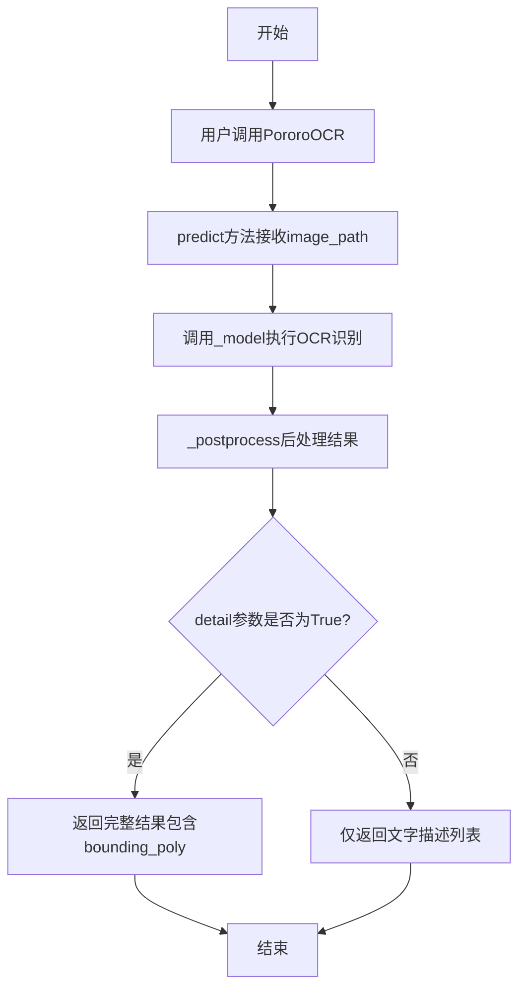
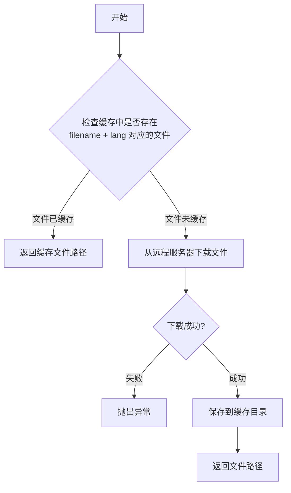
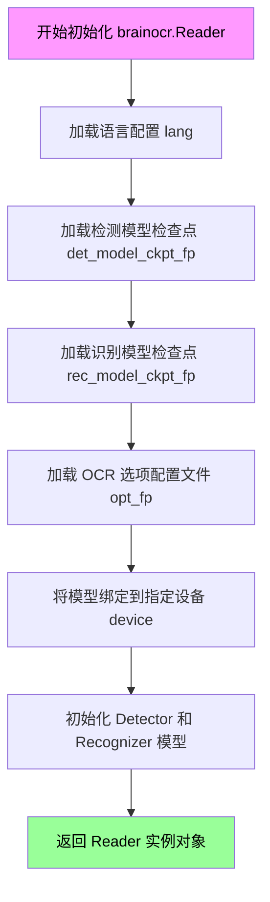
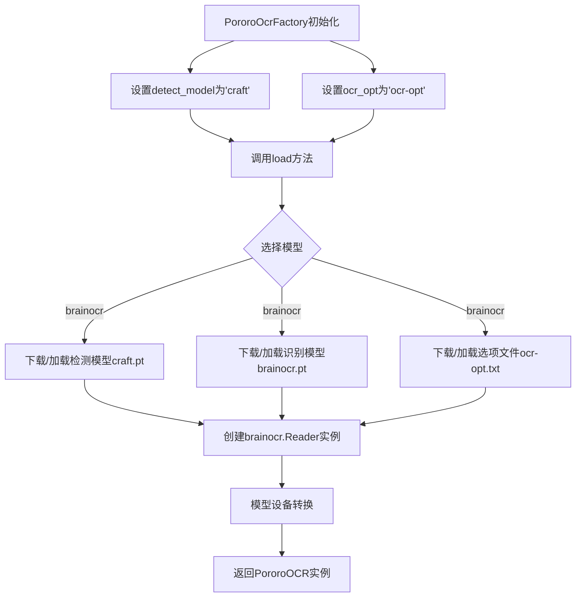
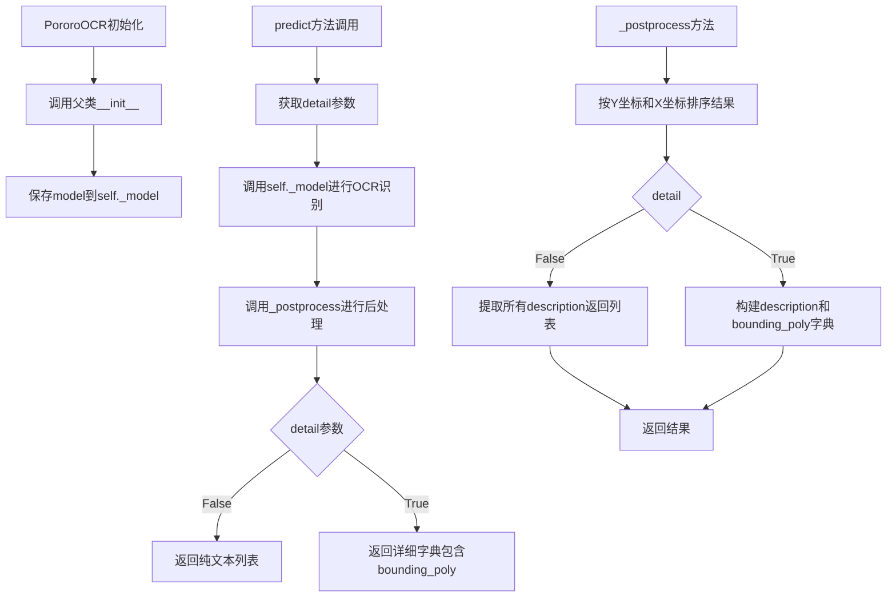
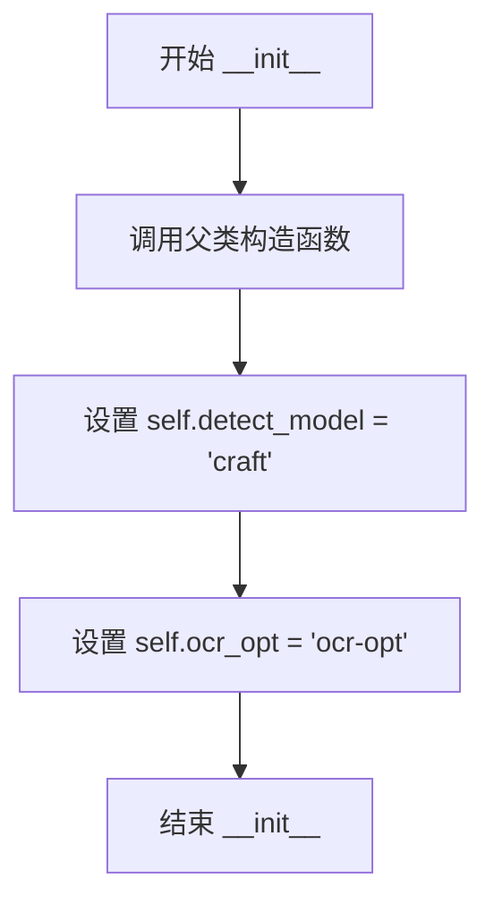
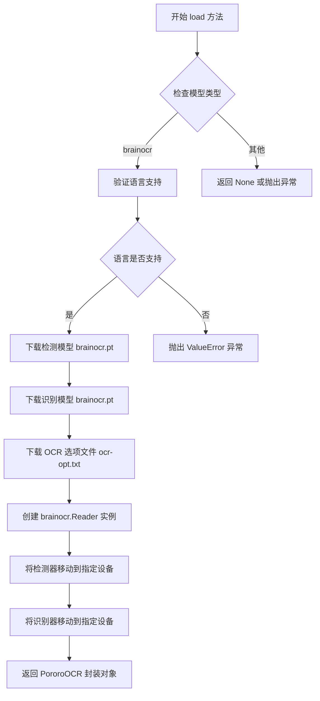
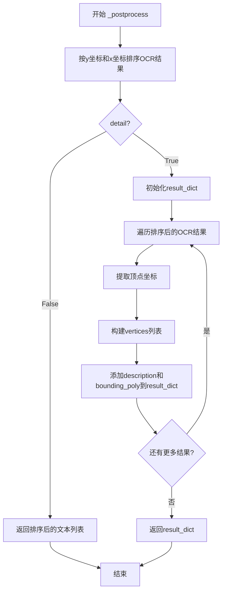
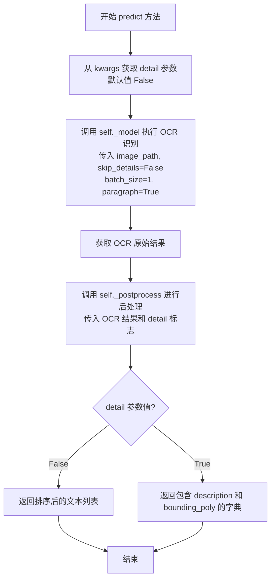

# `comic-translate\modules\ocr\pororo\pororo\tasks\optical_character_recognition.py` 详细设计文档

这是一个OCR（光学字符识别）建模类，提供对图像中的文字进行识别功能，支持英语和韩语，基于brainocr模型实现，包含工厂类PororoOcrFactory用于模型加载配置和PororoOCR类用于执行实际OCR识别和结果后处理。

## 整体流程



## 类结构

```
PororoFactoryBase (抽象基类)
└── PororoOcrFactory (OCR工厂类)
    
PororoSimpleBase (简单基类)
└── PororoOCR (OCR执行类)
```

## 全局变量及字段


### `sorted_ocr_results`
    
按y坐标和x坐标排序的OCR结果列表

类型：`list`
    


### `result_dict`
    
包含description和bounding_poly的字典，用于存储OCR结果详情

类型：`dict`
    


### `vertices`
    
边界框顶点坐标列表，每个元素包含x和y坐标

类型：`list`
    


### `detail`
    
标志位，指示是否返回包含边界框和多边形顶点等详细信息

类型：`bool`
    


### `PororoOcrFactory.detect_model`
    
文本检测模型名称，默认为'craft'

类型：`str`
    


### `PororoOcrFactory.ocr_opt`
    
OCR选项文件名称，默认为'ocr-opt'

类型：`str`
    


### `PororoOCR._model`
    
加载的OCR模型实例（brainocr.Reader对象）

类型：`brainocr.Reader`
    


### `PororoOCR.config`
    
配置对象，包含任务、语言和模型设置

类型：`PororoConfig`
    
    

## 全局函数及方法


### `download_or_load`

从远程服务器下载模型文件或从本地缓存加载模型文件，供 OCR 任务使用。

参数：

- `filename`：`str`，要下载或加载的文件名（如模型权重文件 `.pt` 或配置文件 `.txt`）
- `lang`：`str`，语言代码（如 "en", "ko"），用于确定下载或加载的文件版本

返回值：`str`，返回本地文件系统上的文件路径（可能是缓存路径或刚下载的路径）

#### 流程图



#### 带注释源码

```python
# 该函数在 ...pororo.tasks 模块中定义
# 此处展示的是在 PororoOcrFactory.load() 方法中的调用方式

# 下载检测模型权重文件（.pt）
det_model_path = download_or_load(
    f"{self.detect_model}.pt",  # 文件名，如 "craft.pt"
    self.config.lang,           # 语言代码，如 "en" 或 "ko"
)

# 下载识别模型权重文件（.pt）
rec_model_path = download_or_load(
    f"{self.config.n_model}.pt",  # 模型名称，如 "brainocr.pt"
    self.config.lang,              # 语言代码
)

# 下载 OCR 选项配置文件（.txt）
opt_fp = download_or_load(
    f"{self.ocr_opt}.txt",  # 配置文件名，如 "ocr-opt.txt"
    self.config.lang,       # 语言代码
)
```


### `brainocr.Reader`

该类是 brainOCR 模型的核心读取器类，负责加载检测模型（detection model）和识别模型（recognition model），并提供 OCR 推理功能。它是 `PororoOcrFactory.load()` 方法中实例化的对象，用于执行具体的文字识别任务。

参数：

-  `lang`：`str`，语言代码（如 "en" 或 "ko"），指定 OCR 任务所使用的语言模型
-  `det_model_ckpt_fp`：`str`，检测模型（Detector）的检查点文件路径，用于定位图像中的文字区域
-  `rec_model_ckpt_fp`：`str`，识别模型（Recognizer）的检查点文件路径，用于识别文字区域中的具体文字内容
-  `opt_fp`：`str`，OCR 选项配置文件的路径，可能包含后处理参数或模型特定的配置
-  `device`：`str`，计算设备标识（如 "cuda" 或 "cpu"），指定模型运行所在的硬件设备

返回值：`object`（Reader 实例），返回初始化后的 brainocr.Reader 对象，该对象包含检测器（detector）和识别器（recognizer）两个子模型，可用于对图像进行 OCR 识别

#### 流程图



#### 带注释源码

```python
# 从 brainOCR 模型模块导入 brainocr 对象
from ...pororo.models.brainOCR import brainocr

# ... 在 PororoOcrFactory.load() 方法中 ...

# 创建 brainocr.Reader 实例
model = brainocr.Reader(
    self.config.lang,                    # 语言代码: "en" 或 "ko"
    det_model_ckpt_fp=det_model_path,    # 检测模型 checkpoint 文件路径
    rec_model_ckpt_fp=rec_model_path,    # 识别模型 checkpoint 文件路径
    opt_fp=opt_fp,                       # OCR 选项配置文件路径
    device=device,                       # 计算设备: "cuda" 或 "cpu"
)

# 将检测器和识别器模型移动到指定设备
model.detector.to(device)
model.recognizer.to(device)

# 返回封装的 PororoOCR 对象
return PororoOCR(model, self.config)
```

**注意**：完整的 `brainocr.Reader` 类源码位于 `pororo/models/brainOCR.py` 模块中，上述代码展示了该类在 `PororoOcrFactory` 中的调用方式和初始化过程。从调用方式可以看出，`brainocr.Reader` 类包含以下核心属性：
- `detector`：文本检测模型（ CRAFT 或类似模型）
- `recognizer`：文本识别模型


### `sorted()` (在 `PororoOCR._postprocess` 中使用)

对OCR结果列表按位置进行排序（先按y坐标，再按x坐标），以便按从左到右、从上到下的顺序返回识别出的文本。

参数：

- `iterable`（`ocr_results`）：`list`，OCR模型返回的原始结果列表，每个元素包含顶点和识别文本
- `key`：`function`（lambda表达式），排序关键字函数，提取 `(x[0][0][1], x[0][0][0])` 即顶点的 (y, x) 坐标用于排序
- `reverse`：`bool`，是否反向排序，默认为 `False`（升序）

返回值：`list`，排序后的OCR结果列表

#### 流程图

```mermaid
flowchart TD
    A[开始 sorted 调用] --> B[输入: ocr_results 列表]
    B --> C{遍历每个元素}
    C --> D[提取 x[0][0][1] - 顶点y坐标]
    D --> E[提取 x[0][0][0] - 顶点x坐标]
    E --> F[构建排序键: (y坐标, x坐标)]
    F --> G[按y坐标优先, 再按x坐标排序]
    G --> H{reverse参数}
    H -->|False/默认| I[升序排列]
    H -->|True| J[降序排列]
    I --> K[返回排序后的列表 sorted_ocr_results]
    J --> K
    K --> L[结束]
```

#### 带注释源码

```python
# 在 PororoOCR 类的 _postprocess 方法中使用
def _postprocess(self, ocr_results, detail: bool = False):
    """
    Post-process for OCR result

    Args:
        ocr_results (list): list contains result of OCR
        detail (bool): if True, returned to include details. (bounding poly, vertices, etc)

    """
    # 使用 sorted() 对 OCR 结果进行排序
    # 排序逻辑：按文本在图像中的位置排序（从上到下，从左到右）
    # x[0][0] 表示第一个顶点的坐标
    # x[0][0][1] 是该顶点的 y 坐标（垂直位置）
    # x[0][0][0] 是该顶点的 x 坐标（水平位置）
    # tuple (y, x) 确保先按行排序，再按列排序
    sorted_ocr_results = sorted(
        ocr_results,
        key=lambda x: (
            x[0][0][1],  # y坐标 - 决定行的顺序
            x[0][0][0],  # x坐标 - 决定同一行内的列顺序
        ),
    )
    # 默认 reverse=False，按升序排列
    # 即：y坐标小的（上面的文本）排在前，y坐标相同则按x坐标排序

    if not detail:
        # 简单模式：只返回识别出的文本列表
        return [
            sorted_ocr_results[i][-1]
            for i in range(len(sorted_ocr_results))
        ]

    # 详细模式：返回包含位置信息的字典
    result_dict = {
        "description": list(),
        "bounding_poly": list(),
    }

    for ocr_result in sorted_ocr_results:
        vertices = list()

        for vertice in ocr_result[0]:
            vertices.append({
                "x": vertice[0],
                "y": vertice[1],
            })

        result_dict["description"].append(ocr_result[1])
        result_dict["bounding_poly"].append({
            "description": ocr_result[1],
            "vertices": vertices
        })

    return result_dict
```


### `PororoOcrFactory`

OCR任务的工厂类，负责加载和管理OCR模型。该类继承自`PororoFactoryBase`，提供OCR功能的统一入口，支持brainocr模型，适用于英语和韩语两种语言。

参数：

- `task`：`str`，任务名称
- `lang`：`str`，语言代码（如"en"、"ko"）
- `model`：`Optional[str]`，模型名称，默认为None

返回值：无

#### 流程图



#### 带注释源码

```python
class PororoOcrFactory(PororoFactoryBase):
    """
    OCR任务的工厂类
    继承自PororoFactoryBase，提供OCR模型的加载和管理
    """

    def __init__(self, task: str, lang: str, model: Optional[str]):
        """
        初始化工厂类

        Args:
            task: 任务名称
            lang: 语言代码
            model: 可选的模型名称
        """
        super().__init__(task, lang, model)
        self.detect_model = "craft"  # 设置检测模型名称
        self.ocr_opt = "ocr-opt"     # 设置OCR选项文件名

    @staticmethod
    def get_available_langs():
        """获取支持的语言列表"""
        return ["en", "ko"]

    @staticmethod
    def get_available_models():
        """获取各语言支持的模型字典"""
        return {
            "en": ["brainocr"],
            "ko": ["brainocr"],
        }

    def load(self, device: str):
        """
        加载用户选择的任务特定模型

        Args:
            device: 设备信息（如'cpu'或'cuda'）

        Returns:
            PororoOCR: 用户选择的任务特定模型实例
        """
        # 仅支持brainocr模型
        if self.config.n_model == "brainocr":
            from ...pororo.models.brainOCR import brainocr

            # 验证语言支持
            if self.config.lang not in self.get_available_langs():
                raise ValueError(
                    f"Unsupported Language : {self.config.lang}",
                    'Support Languages : ["en", "ko"]',
                )

            # 下载/加载检测模型
            det_model_path = download_or_load(
                f"{self.detect_model}.pt",
                self.config.lang,
            )
            # 下载/加载识别模型
            rec_model_path = download_or_load(
                f"{self.config.n_model}.pt",
                self.config.lang,
            )
            # 下载/加载OCR选项文件
            opt_fp = download_or_load(
                f"{self.ocr_opt}.txt",
                self.config.lang,
            )
            
            # 创建Reader实例
            model = brainocr.Reader(
                self.config.lang,
                det_model_ckpt_fp=det_model_path,
                rec_model_ckpt_fp=rec_model_path,
                opt_fp=opt_fp,
                device=device,
            )
            
            # 将模型移至指定设备
            model.detector.to(device)
            model.recognizer.to(device)
            
            # 返回OCR封装类实例
            return PororoOCR(model, self.config)
```

---

### `PororoOCR`

OCR结果处理类，封装brainocr模型并提供统一接口。该类继承自`PororoSimpleBase`，负责执行实际的OCR识别操作并对结果进行后处理。

参数：

- `model`：brainocr模型实例
- `config`：配置对象

返回值：无

#### 流程图



#### 带注释源码

```python
class PororoOCR(PororoSimpleBase):
    """
    OCR结果处理类
    封装brainocr模型并提供统一的predict接口
    """

    def __init__(self, model, config):
        """
        初始化OCR处理类

        Args:
            model: brainocr模型实例
            config: 配置对象
        """
        super().__init__(config)
        self._model = model  # 保存模型引用

    def _postprocess(self, ocr_results, detail: bool = False):
        """
        对OCR结果进行后处理

        Args:
            ocr_results: OCR识别结果列表
            detail: 是否返回详细信息（包含边界框等）

        Returns:
            list或dict: 处理后的OCR结果
        """
        # 按Y坐标(行)和X坐标(列)排序结果
        sorted_ocr_results = sorted(
            ocr_results,
            key=lambda x: (
                x[0][0][1],  # 第一个顶点的Y坐标
                x[0][0][0],  # 第一个顶点的X坐标
            ),
        )

        # 如果不需要详细信息，只返回文本描述列表
        if not detail:
            return [
                sorted_ocr_results[i][-1]  # 提取最后的description字段
                for i in range(len(sorted_ocr_results))
            ]

        # 构建详细结果字典
        result_dict = {
            "description": list(),       # 文本描述列表
            "bounding_poly": list(),    # 边界多边形列表
        }

        # 遍历排序后的结果，构建详细信息
        for ocr_result in sorted_ocr_results:
            vertices = list()

            # 提取顶点坐标
            for vertice in ocr_result[0]:
                vertices.append({
                    "x": vertice[0],
                    "y": vertice[1],
                })

            # 添加描述和边界框信息
            result_dict["description"].append(ocr_result[1])
            result_dict["bounding_poly"].append({
                "description": ocr_result[1],
                "vertices": vertices
            })

        return result_dict

    def predict(self, image_path: str, **kwargs):
        """
        执行光学字符识别(OCR)

        Args:
            image_path: 图像文件路径
            detail: 是否返回详细信息（通过kwargs获取）

        Returns:
            list或dict: OCR识别结果
        """
        # 从kwargs获取detail参数，默认为False
        detail = kwargs.get("detail", False)

        # 调用模型进行OCR识别，固定使用batch_size=1和paragraph=True
        return self._postprocess(
            self._model(
                image_path,
                skip_details=False,
                batch_size=1,
                paragraph=True,
            ),
            detail,
        )
```

---

### `list() - 全局函数概览`

代码中包含的主要方法和函数列表：

| 名称 | 类型 | 描述 |
|------|------|------|
| `PororoOcrFactory.__init__` | 方法 | 初始化OCR工厂类 |
| `PororoOcrFactory.get_available_langs` | 静态方法 | 获取支持的语言列表 |
| `PororoOcrFactory.get_available_models` | 静态方法 | 获取支持的模型字典 |
| `PororoOcrFactory.load` | 方法 | 加载OCR模型 |
| `PororoOCR.__init__` | 方法 | 初始化OCR处理类 |
| `PororoOCR._postprocess` | 方法 | 后处理OCR结果 |
| `PororoOCR.predict` | 方法 | 执行OCR识别 |

#### 关键组件信息

- **brainocr.Reader**: brainocr库的核心识别器，负责实际的OCR识别
- **craft**: 检测模型，用于定位图像中的文字区域
- **download_or_load**: 工具函数，用于下载或加载预训练模型

#### 潜在技术债务与优化空间

1. **硬编码参数**: `batch_size=1`和`paragraph=True`在predict方法中硬编码，无法灵活配置
2. **错误处理不足**: load方法中只检查了语言支持，未检查模型文件是否下载成功
3. **类型注解不完整**: `model`和`config`参数缺少具体类型注解
4. **缺少异步支持**: OCR是耗时操作，但未提供异步接口
5. **配置灵活性**: ocr_opt文件名固定，缺乏动态配置能力

#### 其它项目

**设计目标**:
- 提供统一的OCR接口，支持多种语言
- 通过工厂模式实现模型的动态加载

**约束**:
- 目前仅支持英语(English)和韩语(Korean)
- 仅支持brainocr模型

**数据流**:
```
输入图像 → brainocr检测器 → brainocr识别器 → _postprocess后处理 → 返回结果
```

**外部依赖**:
- `...pororo.models.brainOCR.brainocr`: brainocr模型库
- `...pororo.tasks.download_or_load`: 模型加载工具
- `...pororo.tasks.utils.base`: 基础类


### `append` (不存在)

在提供的代码中没有找到名为 `append` 的方法或函数。

该代码是 OCR (光学字符识别) 相关的建模类，包含两个主要类：

- `PororoOcrFactory`：工厂类，负责加载 OCR 模型
- `PororoOCR`：实际的 OCR 预测类，包含 `_postprocess` 和 `predict` 方法

代码中不存在 `append` 方法。

如果用户需要以下任一方法的详细文档，请告知：
- `PororoOcrFactory.load`
- `PororoOCR.predict`
- `PororoOCR._postprocess`


### `PororoOCR.predict`

该方法是OCR功能的核心预测方法，从kwargs中提取detail参数控制返回结果的详细程度（仅文本或包含边界框信息），然后调用模型进行光学字符识别并对结果进行后处理排序。

参数：

- `self`：`PororoOCR`，OCR模型实例，隐式参数
- `image_path`：`str`，要识别的图像文件路径
- `**kwargs`：`dict`，关键字参数字典，可选参数如下：
  - `detail`：`bool`，是否返回详细信息（包括边界框和顶点），默认为`False`

返回值：`Union[list, dict]`，OCR识别结果。当`detail=False`时返回字符串列表；当`detail=True`时返回包含`description`和`bounding_poly`的字典。

#### 流程图

```mermaid
flowchart TD
    A[开始 predict] --> B[从 kwargs 获取 detail 参数<br/>kwargs.get('detail', False)]
    B --> C[调用 self._model 进行OCR识别<br/>传入 image_path, skip_details=False<br/>batch_size=1, paragraph=True]
    C --> D[获取 OCR 原始结果]
    D --> E[调用 _postprocess 方法进行后处理<br/>传入 OCR 结果和 detail 标志]
    E --> F{detail == True?}
    F -->|Yes| G[返回完整结果字典<br/>包含 description 和 bounding_poly]
    F -->|No| H[返回纯文本列表]
    G --> I[结束]
    H --> I
```

#### 带注释源码

```python
def predict(self, image_path: str, **kwargs):
    """
    Conduct Optical Character Recognition (OCR)

    Args:
        image_path (str): the image file path
        detail (bool): if True, returned to include details. (bounding poly, vertices, etc)

    """
    # 从 kwargs 字典中获取 detail 参数，默认为 False
    # 如果 kwargs 中没有 'detail' 键，则返回 False
    detail = kwargs.get("detail", False)

    # 调用底层模型进行 OCR 识别
    # 传入图像路径，并固定设置跳过详细输出、批量大小为1、启用段落模式
    return self._postprocess(
        self._model(
            image_path,
            skip_details=False,
            batch_size=1,
            paragraph=True,
        ),
        detail,  # 传递 detail 标志以决定返回格式
    )
```


### `PororoOcrFactory.__init__`

这是 `PororoOcrFactory` 类的构造函数，用于初始化 OCR 任务所需的配置信息，包括任务类型、语言和模型名称，并设置检测模型和 OCR 选项的默认值。

参数：

- `task`：`str`，任务标识符，用于指定要执行的任务类型（如 "ocr"）
- `lang`：`str`，语言代码，指定 OCR 支持的语言（如 "en", "ko"）
- `model`：`Optional[str]`，可选的模型名称，用于指定特定的 OCR 模型（如 "brainocr"），若为 None 则使用默认模型

返回值：`None`，该方法为构造函数，不返回任何值，仅初始化对象状态

#### 流程图



#### 带注释源码

```python
def __init__(self, task: str, lang: str, model: Optional[str]):
    """
    初始化 PororoOcrFactory 实例
    
    Args:
        task (str): 任务标识符，用于指定要执行的任务类型
        lang (str): 语言代码，指定 OCR 支持的语言
        model (Optional[str]): 可选的模型名称，若为 None 则使用默认模型
    
    Returns:
        None: 构造函数不返回值，仅初始化实例属性
    """
    # 调用父类 PororoFactoryBase 的构造函数，传递任务、语言和模型参数
    # 父类会初始化 self.config 对象，包含任务配置信息
    super().__init__(task, lang, model)
    
    # 设置文本检测模型的名称为 "craft"（Character Recognition And Recognition Framework）
    # CRAFT 模型用于检测图像中的文本区域
    self.detect_model = "craft"
    
    # 设置 OCR 选项文件的名称为 "ocr-opt"
    # 该文件包含 OCR 识别过程中的配置参数（如字符集、字典等）
    self.ocr_opt = "ocr-opt"
```


### `PororoOcrFactory.get_available_langs`

该方法是一个静态方法，用于返回 OCR 任务支持的语言列表，目前支持英语（"en"）和韩语（"ko"）。

参数：无

返回值：`List[str]`，返回支持的语言列表 `["en", "ko"]`

#### 流程图

```mermaid
flowchart TD
    A[开始] --> B[返回支持的语言列表 ["en", "ko"]] --> C[结束]
```

#### 带注释源码

```python
@staticmethod
def get_available_langs():
    """
    获取OCR任务支持的语言列表
    
    Returns:
        List[str]: 支持的语言列表，包含英语('en')和韩语('ko')
    """
    return ["en", "ko"]
```


### `PororoOcrFactory.get_available_models`

这是一个静态方法，返回该 OCR 任务支持的语言及其对应的可用模型列表。目前支持英语（en）和韩语（ko），均使用 `brainocr` 模型。

参数：

- （无参数）

返回值：`Dict[str, List[str]]`，返回一个字典，键为语言代码（字符串），值为该语言支持的模型列表（字符串列表）。例如：`{"en": ["brainocr"], "ko": ["brainocr"]}`

#### 流程图

```mermaid
flowchart TD
    A[开始] --> B[返回静态字典]
    B --> C{"en": ["brainocr"], "ko": ["brainocr"]}
    C --> D[结束]
```

#### 带注释源码

```python
@staticmethod
def get_available_models():
    """
    Get available models for each supported language

    Returns:
        dict: A dictionary mapping language codes to list of available model names.
              Currently supports English ('en') and Korean ('ko'), both using 'brainocr'.

    Example:
        >>> PororoOcrFactory.get_available_models()
        {'en': ['brainocr'], 'ko': ['brainocr']}
    """
    return {
        "en": ["brainocr"],
        "ko": ["brainocr"],
    }
```


### `PororoOcrFactory.load`

该方法是 `PororoOcrFactory` 类的核心实例方法，负责加载用户选定的特定任务模型（OCR模型）。它首先检查模型类型是否为 "brainocr"，验证语言支持情况，然后下载检测模型、识别模型和OCR选项文件，最后创建 `brainocr.Reader` 实例并将检测器和识别器移动到指定设备，返回封装后的 `PororoOCR` 对象。

参数：

- `device`：`str`，设备信息，用于指定模型运行的计算设备（如 "cuda" 或 "cpu"）

返回值：`PororoOCR`，用户选定的任务特定模型（OCR模型）

#### 流程图



#### 带注释源码

```python
def load(self, device: str):
    """
    Load user-selected task-specific model

    Args:
        device (str): device information

    Returns:
        object: User-selected task-specific model

    """
    # 检查配置的模型是否为 brainocr
    if self.config.n_model == "brainocr":
        # 动态导入 brainocr 模型模块
        from ...pororo.models.brainOCR import brainocr

        # 验证语言是否在支持列表中
        if self.config.lang not in self.get_available_langs():
            raise ValueError(
                f"Unsupported Language : {self.config.lang}",
                'Support Languages : ["en", "ko"]',
            )

        # 下载检测模型（用于文本检测）
        det_model_path = download_or_load(
            f"{self.detect_model}.pt",  # "craft.pt"
            self.config.lang,
        )
        
        # 下载识别模型（用于文本识别）
        rec_model_path = download_or_load(
            f"{self.config.n_model}.pt",  # "brainocr.pt"
            self.config.lang,
        )
        
        # 下载 OCR 选项文件
        opt_fp = download_or_load(
            f"{self.ocr_opt}.txt",  # "ocr-opt.txt"
            self.config.lang,
        )
        
        # 创建 brainocr.Reader 实例
        model = brainocr.Reader(
            self.config.lang,
            det_model_ckpt_fp=det_model_path,
            rec_model_ckpt_fp=rec_model_path,
            opt_fp=opt_fp,
            device=device,
        )
        
        # 将检测器模型移动到指定设备
        model.detector.to(device)
        
        # 将识别器模型移动到指定设备
        model.recognizer.to(device)
        
        # 返回封装后的 PororoOCR 对象
        return PororoOCR(model, self.config)
```


### `PororoOCR.__init__`

这是 `PororoOCR` 类的构造函数，负责初始化 OCR 模型实例。该方法调用父类构造函数并将传入的模型和配置存储为实例属性，为后续的 OCR 识别任务提供基础支持。

参数：

- `model`：`object`，OCR 模型实例，通常是 `brainocr.Reader` 对象，负责执行实际的文本检测和识别
- `config`：`object`，任务配置对象，包含语言设置、模型名称等配置信息，继承自 `PororoSimpleBase`

返回值：`None`，构造函数无返回值

#### 流程图

```mermaid
flowchart TD
    A[开始 __init__] --> B[调用父类构造函数 super().__init__config]
    B --> C[将 model 赋值给 self._model]
    D[结束 __init__]
    C --> D
```

#### 带注释源码

```python
def __init__(self, model, config):
    """
    PororoOCR 类的初始化方法

    Args:
        model (object): OCR 模型实例，通常为 brainocr.Reader 对象
        config (object): 任务配置对象，包含语言、模型等配置信息

    Returns:
        None: 构造函数不返回任何值
    """
    # 调用父类 PororoSimpleBase 的构造函数
    # 负责初始化基础配置和属性
    super().__init__(config)
    
    # 将传入的 OCR 模型实例存储为实例属性
    # 后续 predict 方法会调用此模型进行文本识别
    self._model = model
```

---

### 类的整体信息

| 项目 | 内容 |
|------|------|
| **类名** | `PororoOCR` |
| **父类** | `PororoSimpleBase` |
| **核心功能** | 封装 OCR 模型，提供文本识别能力，支持返回详细坐标信息 |
| **关键字段** | `_model`: OCR 模型实例 |
| **关键方法** | `predict`: 执行 OCR 识别；`_postprocess`: 后处理识别结果 |


### `PororoOCR._postprocess`

该方法用于对OCR模型的原始结果进行后处理，根据`detail`参数决定返回格式。当`detail=False`时，返回排序后的文本列表；当`detail=True`时，返回包含文本描述和边界框坐标的详细字典。方法首先按从上到下、从左到右的顺序对OCR结果进行排序，然后根据需求格式化输出。

参数：

- `ocr_results`：`list`，OCR模型的原始结果列表，每个元素包含顶点和文本信息
- `detail`：`bool`，是否返回详细信息（包含边界框坐标等），默认为`False`

返回值：`list` 或 `dict`，当`detail=False`时返回文本列表；当`detail=True`时返回包含`description`和`bounding_poly`键的字典

#### 流程图



#### 带注释源码

```python
def _postprocess(self, ocr_results, detail: bool = False):
    """
    Post-process for OCR result

    Args:
        ocr_results (list): list contains result of OCR
        detail (bool): if True, returned to include details. (bounding poly, vertices, etc)

    """
    # 按从上到下、从左到右的顺序排序OCR结果
    # 先按y坐标(行)排序，再按x坐标(列)排序
    sorted_ocr_results = sorted(
        ocr_results,
        key=lambda x: (
            x[0][0][1],  # 第一个顶点的y坐标
            x[0][0][0],  # 第一个顶点的x坐标
        ),
    )

    # 如果不需要详细信息，直接返回文本列表
    if not detail:
        return [
            sorted_ocr_results[i][-1]  # 取每个结果的最后一个元素(文本内容)
            for i in range(len(sorted_ocr_results))
        ]

    # 需要详细信息时，构建包含description和bounding_poly的字典
    result_dict = {
        "description": list(),      # 存储所有识别的文本
        "bounding_poly": list(),    # 存储所有边界框信息
    }

    # 遍历每个OCR结果
    for ocr_result in sorted_ocr_results:
        vertices = list()

        # 提取顶点坐标信息
        for vertice in ocr_result[0]:  # ocr_result[0]是顶点列表
            vertices.append({
                "x": vertice[0],  # 顶点的x坐标
                "y": vertice[1],  # 顶点的y坐标
            })

        # 添加文本描述到结果
        result_dict["description"].append(ocr_result[1])  # ocr_result[1]是识别的文本
        
        # 添加边界框信息到结果
        result_dict["bounding_poly"].append({
            "description": ocr_result[1],  # 文本描述
            "vertices": vertices           # 顶点坐标列表
        })

    return result_dict
```


### `PororoOCR.predict`

执行光学字符识别（OCR）操作，对输入的图像文件进行文字识别，并可选择返回详细的边界框信息。

参数：

- `self`：PororoOCR 类实例，隐式参数
- `image_path`：`str`，待识别的图像文件路径
- `**kwargs`：可变关键字参数，可选参数包括：
  - `detail`：`bool`，默认为 False，如果为 True 则返回包含边界框和顶点坐标的详细信息

返回值：`list` 或 `dict`，当 detail=False 时返回识别文本列表；当 detail=True 时返回包含 description 和 bounding_poly 的字典

#### 流程图



#### 带注释源码

```python
def predict(self, image_path: str, **kwargs):
    """
    Conduct Optical Character Recognition (OCR)

    Args:
        image_path (str): the image file path
        detail (bool): if True, returned to include details. (bounding poly, vertices, etc)

    """
    # 从 kwargs 中获取 detail 参数，默认为 False
    # 当 detail=True 时，返回结果包含边界框坐标等详细信息
    detail = kwargs.get("detail", False)

    # 调用内部模型进行 OCR 识别
    # 参数说明：
    #   - image_path: 输入的图像文件路径
    #   - skip_details: False，表示返回详细信息（顶点坐标等）
    #   - batch_size: 1，每次处理一张图像
    #   - paragraph: True，启用段落检测模式
    return self._postprocess(
        self._model(
            image_path,
            skip_details=False,
            batch_size=1,
            paragraph=True,
        ),
        detail,  # 传递给后处理函数决定输出格式
    )
```

#### 补充说明

该方法是对外暴露的核心 OCR 预测接口，内部封装了复杂的模型调用和后处理逻辑。用户只需传入图像路径，即可获得识别结果。方法的返回值类型取决于 `detail` 参数，这使得 API 更加灵活，能够满足不同场景的需求（如只需要文本结果，或需要坐标信息进行可视化）。


## 关键组件


### PororoOcrFactory

OCR任务工厂类，负责加载和管理OCR模型，支持英语和韩语两种语言，使用brainocr模型进行文字识别。

### PororoOCR

OCR预测执行类，负责调用底层brainocr模型进行图像文字识别，并进行结果后处理，支持返回详细bounding box信息。

### brainocr模型加载

通过`load()`方法动态加载检测模型(craft)和识别模型(brainocr)，以及OCR选项配置文件，并将模型移到指定设备。

### 文本后处理

`_postprocess()`方法对OCR原始结果进行排序和格式化，支持两种返回模式：简洁模式返回文本列表，详细模式返回包含bounding_poly和vertices的结构化字典。

### 多语言支持

通过`get_available_langs()`和`get_available_models()`静态方法提供支持的语言和模型信息，当前仅支持英语(en)和韩语(ko)。

### 详细结果输出

支持`detail`参数控制返回内容详细程度，当设为True时返回每个识别文本的坐标顶点信息，用于绘制检测框。


## 问题及建议


### 已知问题

- **硬编码配置问题**：`detect_model`和`ocr_opt`字段在构造函数中硬编码为字符串"craft"和"ocr-opt"，缺乏灵活性和可配置性
- **错误处理不足**：`load`方法中模型文件路径通过`download_or_load`获取，但没有捕获下载/加载失败后的异常；`predict`方法未检查`image_path`文件是否存在或是否为有效图像
- **参数设计不合理**：`predict`方法中`detail`参数通过`kwargs.get("detail", False)`获取，这种隐式参数传递方式降低了API的可读性和可维护性
- **性能配置不灵活**：`batch_size=1`和`paragraph=True`在`predict`方法中硬编码，无法根据实际使用场景调整
- **类型提示缺失**：`PororoOCR.__init__`方法的`model`和`config`参数缺少类型注解；`kwargs`的类型定义不明确
- **代码重复**：在`_postprocess`方法中，当`detail=False`时提取`ocr_result[-1]`的逻辑与后续遍历处理存在重复逻辑
- **未使用变量**：`vertices`列表在`for vertice in ocr_result[0]`循环中构建但未在非detail模式下使用，造成资源浪费

### 优化建议

- 将`detect_model`和`ocr_opt`改为可配置参数，通过构造函数或配置文件传入
- 为`load`方法添加try-except异常处理，捕获模型加载失败的情况；为`predict`方法添加文件有效性检查
- 将`detail`参数改为显式的函数签名参数，明确API接口
- 将`batch_size`等推理参数提取为类属性或构造函数参数，支持运行时配置
- 为所有函数参数添加完整的类型注解，提高代码可读性和静态检查能力
- 重构`_postprocess`方法，消除代码重复，可以考虑使用单一的数据转换逻辑
- 移除或优化未使用变量的构建逻辑，提高执行效率

## 其它


### 设计目标与约束

本OCR模块的设计目标是提供统一的光学字符识别接口，支持英文和韩文两种语言的文字识别，通过工厂模式实现模型的动态加载和配置管理。约束条件包括：仅支持英语(en)和韩语(ko)两种语言；仅支持brainocr模型；需要提前下载模型权重文件；依赖GPU或CPU设备进行推理。

### 错误处理与异常设计

本模块主要处理以下异常情况：1) 语言不支持异常：当用户指定不在支持列表中的语言时，load方法抛出ValueError，提示支持的 languages 列表；2) 模型加载失败：download_or_load函数可能抛出文件不存在或网络错误；3) 输入验证：predict方法未对image_path进行有效性验证，可能导致底层模型调用失败。异常信息设计遵循清晰原则，ValueError包含具体错误原因和修复建议。

### 数据流与状态机

OCR模块的数据流为：用户调用predict(image_path) → 内部调用_model(image_path, skip_details=False, batch_size=1, paragraph=True) → 获得原始OCR结果 → _postprocess后处理 → 返回最终结果。状态机包含两个状态：就绪状态(模型已加载，可接受预测请求)和预测中状态(执行predict方法期间)。数据流为单向流动，image_path作为输入，最终返回识别文本或包含边界框的详细信息字典。

### 外部依赖与接口契约

核心依赖包括：1) download_or_load函数：用于下载或加载模型权重文件；2) brainocr.Reader类：实际的OCR模型，负责文字检测和识别；3) PororoFactoryBase和PororoSimpleBase：提供配置管理和基础接口。接口契约方面：load方法接收device字符串参数，返回PororoOCR实例；predict方法接收image_path字符串和可选的detail布尔参数，返回识别结果(字符串列表或包含description和bounding_poly的字典)。

### 性能考虑与资源管理

性能优化点：1) 模型一次性加载：load方法中模型加载后保存在PororoOCR实例中，避免重复加载；2) 批量处理支持：底层brainocr支持batch_size参数，可用于批量图像处理。资源管理：模型权重文件通过download_or_load按需下载，存储在缓存目录；模型加载后占用GPU/CPU内存；当前未实现模型卸载机制。

### 安全性考虑

当前模块安全性设计较弱：1) 输入验证缺失：predict方法未验证image_path是否为有效文件路径或URL；2) 文件路径遍历风险：直接传递image_path给底层模型，存在潜在路径遍历风险；3) 模型文件完整性：依赖download_or_load验证模型文件完整性。建议增加输入路径验证、文件类型检查等安全措施。

### 配置管理

配置通过PororoFactoryBase的config对象管理，主要配置项包括：task(任务类型)、lang(语言)、n_model(模型名称)。OCR特定配置包括：detect_model固定为"craft"(文字检测模型)、ocr_opt固定为"ocr-opt"(OCR选项文件)。配置在工厂类初始化时设置，load方法根据配置加载对应语言和模型的权重文件。

### 版本兼容性

本模块接口设计保持向后兼容：1) get_available_langs和get_available_models方法提供运行时能力查询；2) predict方法的detail参数有默认值False，旧代码无需修改即可运行；3) 返回结构在detail=True时包含description和bounding_poly字段，为结构化数据提供稳定性保障。版本演进时建议保持现有接口签名，仅新增可选参数。

### 测试策略建议

建议覆盖以下测试场景：1) 单元测试：测试load方法在不同device下的行为、get_available_langs和get_available_models返回值、_postprocess方法的不同场景；2) 集成测试：测试完整OCR流程，使用示例图像验证识别结果；3) 异常测试：测试不支持语言的错误处理、无效图像路径的处理；4) 性能测试：测试模型加载时间、识别延迟、内存占用等指标。

### 部署与运维

部署时需满足以下依赖：1) Python环境及typing、Optional等标准库；2) Pororo项目内部模块(pororo.tasks、pororo.tasks.utils.base、pororo.models.brainOCR)；3) 模型权重文件需提前下载或配置下载源。运维关注点：1) 首次调用模型加载耗时较长，建议预热；2) 监控GPU/CPU内存使用；3) 模型文件缓存目录管理；4) 日志记录识别失败情况便于排查。

### 扩展性考虑

当前设计的扩展点包括：1) 支持更多语言：需在get_available_langs和get_available_models中添加新语言，下载对应模型文件；2) 支持更多模型：load方法中添加新的模型分支；3) 后处理增强：_postprocess方法可扩展支持更多输出格式；4) 批量预测优化：当前batch_size固定为1，可改为可配置参数。架构采用工厂模式，利于扩展新任务和新模型。


    