# `comic-translate\modules\ocr\pororo\pororo\tasks\utils\base.py` 详细设计文档

这是一个NLP任务框架的基础模块，定义了任务配置类、任务基类、工厂基类以及多种任务类型的包装基类（如简单任务、双编码器、生成任务等），为后续具体任务实现提供统一的接口和抽象层。

## 整体流程

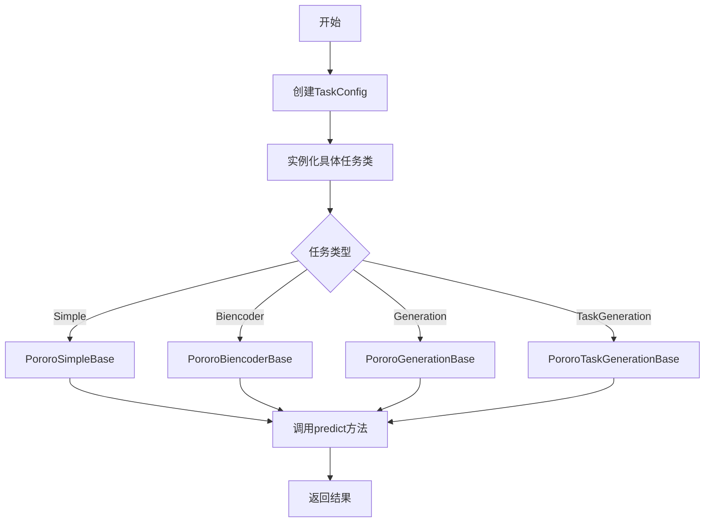

## 类结构

```
TaskConfig (数据类)
PororoTaskBase (抽象基类)
├── PororoFactoryBase (工厂基类)
├── PororoSimpleBase (简单任务包装)
├── PororoBiencoderBase (双编码器包装)
├── PororoGenerationBase (生成任务包装)
└── PororoTaskGenerationBase (任务生成包装)
```

## 全局变量及字段


### `re`
    
Python正则表达式标准库模块

类型：`module`
    


### `unicodedata`
    
Python Unicode字符属性标准库模块

类型：`module`
    


### `abc`
    
Python抽象基类标准库模块

类型：`module`
    


### `dataclass`
    
Python数据类标准库装饰器模块

类型：`module`
    


### `typing`
    
Python类型提示标准库模块

类型：`module`
    


### `TaskConfig.task`
    
任务名称

类型：`str`
    


### `TaskConfig.lang`
    
语言代码

类型：`str`
    


### `TaskConfig.n_model`
    
模型名称

类型：`str`
    


### `PororoTaskBase.config`
    
任务配置对象

类型：`TaskConfig`
    


### `PororoFactoryBase._available_langs`
    
支持的语言列表

类型：`List[str]`
    


### `PororoFactoryBase._available_models`
    
语言到模型的映射

类型：`Mapping[str, List[str]]`
    


### `PororoFactoryBase._model2lang`
    
模型到语言的映射

类型：`Dict[str, str]`
    


### `PororoFactoryBase.config`
    
任务配置对象

类型：`TaskConfig`
    
    

## 全局函数及方法


### `PororoTaskBase.__init__`

该方法是 `PororoTaskBase` 类的构造函数，用于初始化任务基类实例。它接收一个 `TaskConfig` 对象作为参数，并将配置信息存储为实例属性，供后续方法使用。

参数：

- `config`：`TaskConfig`，任务配置对象，包含任务名称(task)、语言(lang)和模型名称(n_model)等信息

返回值：`None`，无返回值

#### 流程图

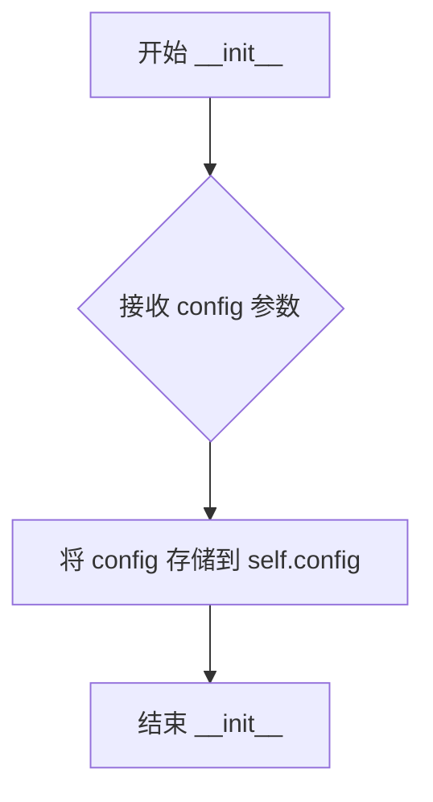

#### 带注释源码

```python
def __init__(self, config: TaskConfig):
    """初始化 PororoTaskBase 实例
    
    Args:
        config: TaskConfig 对象，包含任务名称、语言和模型配置信息
        
    Returns:
        None
    """
    self.config = config  # 将传入的配置对象保存为实例属性，供类中其他方法访问
```


### `PororoTaskBase.n_model`

该属性方法用于获取任务配置中的模型名称（n_model），直接返回 `TaskConfig` 数据类中存储的模型标识符。

参数：由于是 `@property` 装饰器修饰的方法，无需显式传参（`self` 为隐式参数）。

返回值：`str`，返回当前任务所配置的模型名称。

#### 流程图

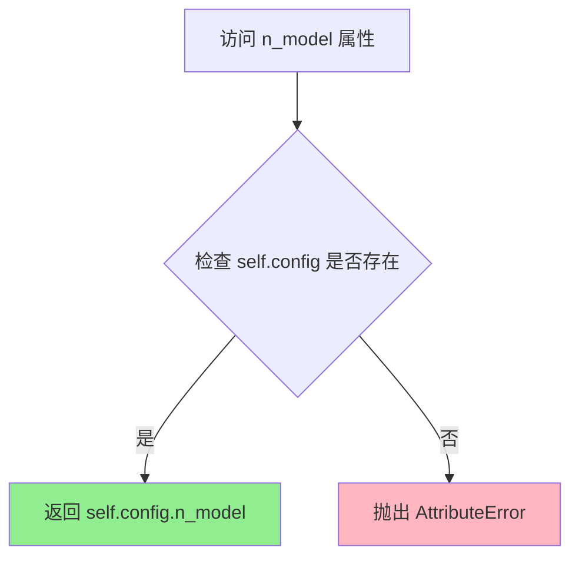

#### 带注释源码

```python
@property
def n_model(self):
    r"""获取任务配置的模型名称
    
    该属性方法直接访问 TaskConfig 数据类中存储的 n_model 字段，
    用于获取当前任务所使用的模型标识符。
    
    Returns:
        str: 模型名称字符串
    """
    return self.config.n_model
```


### `PororoTaskBase.lang`

该属性是 `PororoTaskBase` 类的语言属性 getter，用于获取当前任务配置中设置的语言代码。

参数：无（这是一个属性，不需要参数）

返回值：`str`，返回配置中设置的语言代码

#### 流程图

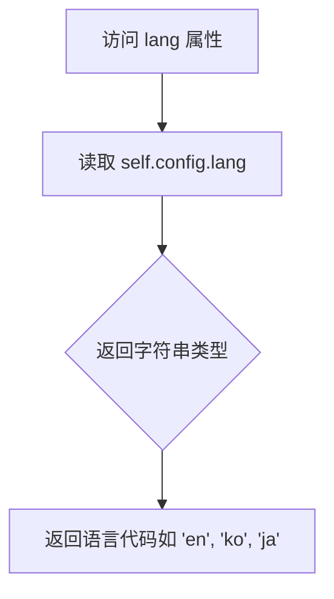

#### 带注释源码

```python
@property
def lang(self):
    """返回任务配置中设置的语言代码
    
    这是一个只读属性（read-only property），用于获取当前任务配置的语言设置。
    该属性从 config 对象的 lang 属性读取并返回语言代码字符串。
    
    Returns:
        str: 语言代码字符串，如 'en'（英语）、'ko'（韩语）、'ja'（日语）等
    """
    return self.config.lang
```


### `PororoTaskBase.predict`

该方法是 `PororoTaskBase` 抽象基类中定义的抽象方法，作为所有具体任务预测功能的接口规范。子类必须实现此方法以提供实际的预测逻辑，而基类中仅抛出 `NotImplementedError` 异常以确保子类实现该方法。

参数：

- `text`：`Union[str, List[str]]`，输入的文本数据，可以是单个字符串或字符串列表，用于进行任务预测
- `**kwargs`：可变关键字参数，用于传递额外的预测选项或配置参数

返回值：未指定（由子类实现决定）

#### 流程图

```mermaid
flowchart TD
    A[开始 predict] --> B{检查 text 类型}
    B -->|str| C[处理单个文本]
    B -->|List[str]| D[处理文本列表]
    C --> E[调用子类实现的预测逻辑]
    D --> E
    E --> F[返回预测结果]
    
    style A fill:#f9f,stroke:#333
    style E fill:#ff9,stroke:#333
    style F fill:#9f9,stroke:#333
```

#### 带注释源码

```python
@abstractmethod
def predict(
    self,
    text: Union[str, List[str]],
    **kwargs,
):
    r"""Abstract prediction method that must be implemented by subclasses
    
    This method serves as the core prediction interface for all task-specific
    implementations. Each subclass (e.g., PororoSimpleBase, PororoBiencoderBase)
    must override this method to provide actual prediction logic.
    
    Args:
        text: Input text(s) to perform prediction on. Can be a single string
              or a list of strings depending on the task requirements.
        **kwargs: Additional keyword arguments that may include:
                  - model-specific parameters
                  - generation settings (beam size, temperature, etc.)
                  - task-specific options
    
    Raises:
        NotImplementedError: If called directly on the base class without
                             being overridden by a concrete implementation.
    
    Returns:
        The return type and value are determined by the concrete subclass
        implementation. Common return types include:
        - str: For simple classification/regression tasks
        - List[str]: For tasks returning multiple results
        - Dict: For tasks with structured output
        - Any: Task-specific custom return types
    """
    raise NotImplementedError(
        "`predict()` function is not implemented properly!")
```


### `PororoTaskBase.__call__`

这是 `PororoTaskBase` 抽象基类中定义的抽象方法，作为任务的通用调用接口。该方法在基类中实现为抛出 `NotImplementedError`，强制要求子类实现具体的调用逻辑。

参数：

- 无显式参数（除了隐式的 `self`）

返回值：`None`，该方法不返回任何值，仅抛出 `NotImplementedError` 异常

#### 流程图

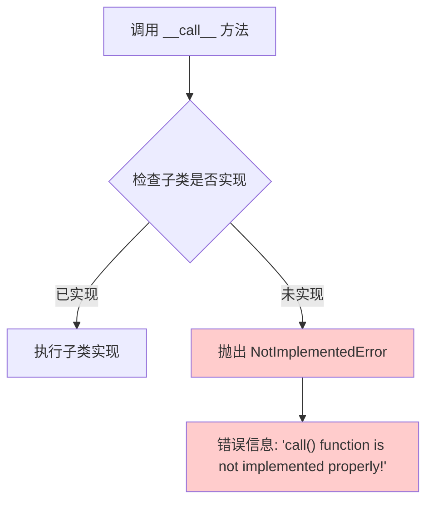

#### 带注释源码

```python
def __call__(self):
    r"""作为任务调用的抽象接口方法
    
    该方法在基类中作为抽象方法定义，强制要求子类实现具体的调用逻辑。
    当子类未实现该方法时，会抛出 NotImplementedError 异常提示开发者。
    """
    raise NotImplementedError(
        "`call()` function is not implemented properly!")
```


### `PororoTaskBase.__repr__`

该方法是一个特殊方法（双下划线方法），用于返回对象的字符串表示形式。它格式化了任务配置信息，包括任务类型、语言和模型名称，并以可读的键值对形式返回。

参数： 无

返回值：`str`，返回一个格式化的字符串，包含任务名称、语言和模型信息，每个信息前带有方括号标签。

#### 流程图

```mermaid
flowchart TD
    A[__repr__ 被调用] --> B[获取 self.config.task]
    B --> C[调用 upper 方法转大写]
    C --> D[获取 self.config.lang]
    D --> E[调用 upper 方法转大写]
    E --> F[获取 self.config.n_model]
    F --> G[格式化字符串: [TASK]: xxx<br/>[LANG]: xxx<br/>[MODEL]: xxx]
    G --> H[返回字符串]
```

#### 带注释源码

```python
def __repr__(self):
    """
    返回对象的字符串表示形式
    
    Returns:
        str: 包含任务配置信息的格式化字符串
    """
    # 使用 f-string 格式化字符串，将任务名、语言和模型名转为大写
    # 格式: [TASK]: xxx\n[LANG]: xxx\n[MODEL]: xxx
    return f"[TASK]: {self.config.task.upper()}\n[LANG]: {self.config.lang.upper()}\n[MODEL]: {self.config.n_model}"
```

---


### `PororoTaskBase._normalize`

该方法负责对输入文本进行 Unicode 标准化（NFKC 形式）并将多个连续空白字符合并为单个空格，同时去除首尾空白，以确保文本数据的一致性和清洁度。

参数：

- `text`：`str`，需要标准化的原始文本

返回值：`str`，标准化处理后的文本

#### 流程图

```mermaid
flowchart TD
    A[开始: 输入 text] --> B[调用 unicodedata.normalize<br/>参数: 'NFKC', text]
    B --> C[调用 re.sub<br/>正则: r'\s+', 替换为 ' '<br/>并调用 strip()]
    C --> D[返回标准化后的 text]
    
    style A fill:#e1f5fe
    style D fill:#e8f5e8
```

#### 带注释源码

```python
def _normalize(self, text: str):
    """Unicode normalization and whitespace removal (often needed for contexts)"""
    # 步骤1: 使用 NFKC 形式进行 Unicode 规范化
    # 将文本转换为标准的 Unicode 表示形式
    # 例如将全角字符转换为半角，将兼容字符转换为规范形式
    text = unicodedata.normalize("NFKC", text)
    
    # 步骤2: 正则表达式替换多个连续空白字符为单个空格
    # \s+ 匹配一个或多个空白字符（空格、制表符、换行等）
    # 然后调用 strip() 去除首尾空白
    text = re.sub(r"\s+", " ", text).strip()
    
    # 返回标准化后的文本
    return text
```


### `PororoFactoryBase.__init__`

这是工厂基类的初始化方法，负责验证和设置任务配置，包括语言、模型参数，并创建任务配置对象。

参数：

- `task`：`str`，任务名称，指定要执行的任务类型（如机器翻译、文本生成等）
- `lang`：`str`，语言代码，指定任务使用的语言（如 "en", "ko" 等）
- `model`：`Optional[str]`，可选的模型名称，如果提供则使用指定模型，否则使用该语言的默认模型

返回值：`None`，该方法无返回值，主要作用是初始化实例属性 `self.config`

#### 流程图

```mermaid
flowchart TD
    A[开始 __init__] --> B[获取可用语言列表: get_available_langs]
    B --> C[获取可用模型列表: get_available_models]
    C --> D[构建模型到语言的映射: _model2lang]
    D --> E{验证 lang 是否在可用语言中}
    E -->|否| F[抛出 AssertionError]
    E -->|是| G{lang 是否为 None}
    G -->|是| H[设置 lang 为第一个可用语言]
    G -->|否| I{ model 是否为 None}
    I -->|否| J[通过 model 查找对应语言: _model2lang[model]]
    I -->|是| K[获取默认模型: get_default_model]
    J --> L
    K --> L{验证 model 是否在对应语言的模型列表中}
    L -->|否| M[抛出 AssertionError]
    L -->|是| N[创建 TaskConfig 对象]
    N --> O[结束 __init__]
```

#### 带注释源码

```python
def __init__(
    self,
    task: str,
    lang: str,
    model: Optional[str] = None,
):
    # 调用抽象方法获取当前任务支持的可用语言列表
    self._available_langs = self.get_available_langs()
    
    # 调用抽象方法获取当前任务支持的模型字典 {lang: [models]}
    self._available_models = self.get_available_models()
    
    # 将模型字典反向映射为 {model: lang} 格式，便于通过模型名查找语言
    # 例如: {'bert-base': 'en', 'kobert': 'ko', ...}
    self._model2lang = {
        v: k for k, vs in self._available_models.items() for v in vs
    }

    # 断言验证传入的语言是否在支持列表中
    # Set default language as very first supported language
    assert (
        lang in self._available_langs
    ), f"Following langs are supported for this task: {self._available_langs}"

    # 如果未指定语言，则使用第一个支持的默认语言
    if lang is None:
        lang = self._available_langs[0]

    # Change language option if model is defined by user
    # 如果用户指定了模型，根据模型查找对应的语言
    if model is not None:
        lang = self._model2lang[model]

    # Set default model
    # 如果未指定模型，获取指定语言的默认模型
    if model is None:
        model = self.get_default_model(lang)

    # yapf: disable
    # 验证指定的模型是否在对应语言的支持列表中
    assert (model in self._available_models[lang]), f"{model} is NOT supported for {lang}"
    # yapf: enable

    # 创建任务配置对象，保存任务、语言、模型信息
    self.config = TaskConfig(task, lang, model)
```


### `PororoFactoryBase.get_available_langs`

该方法是一个抽象方法，用于返回当前任务所支持的语言列表。在基类中，该方法被声明为抽象方法并抛出 `NotImplementedError`，要求子类必须实现该方法以提供具体的语言支持信息。

参数：

- `self`：`PororoFactoryBase`，调用该方法的工厂类实例本身，用于访问子类实现的语言列表

返回值：`List[str]`，返回当前任务支持的语言代码列表，例如 `["en", "ko", "ja", "zh"]` 等

#### 流程图

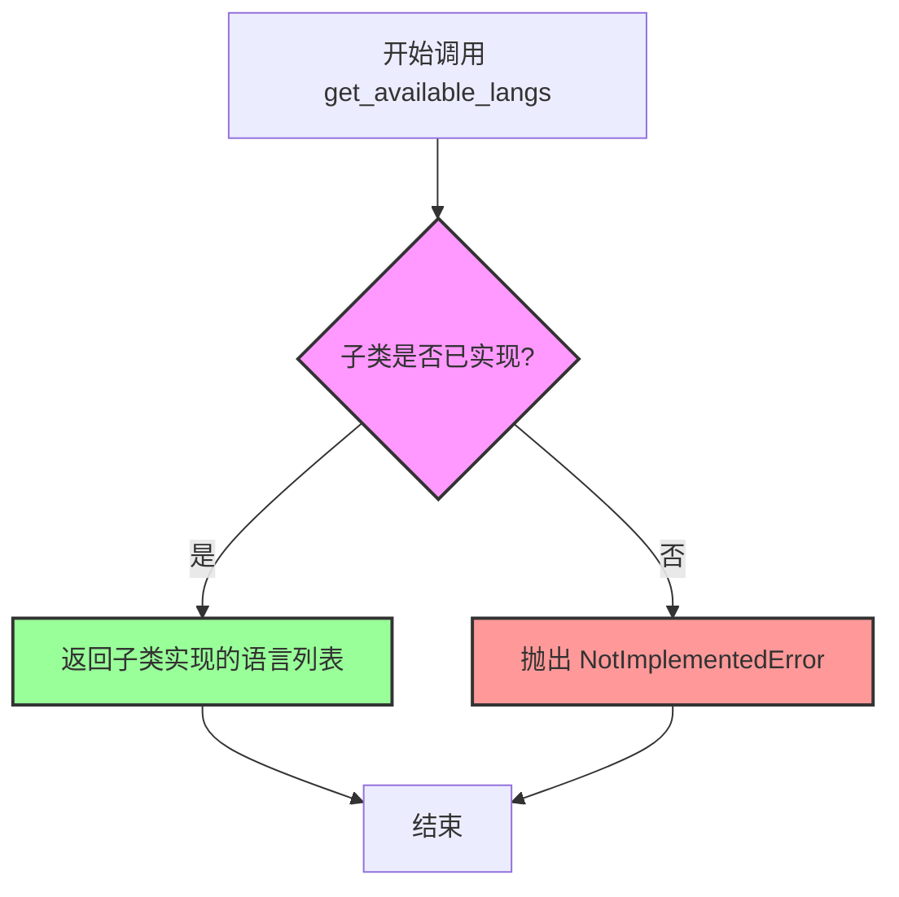

#### 带注释源码

```python
@abstractmethod
def get_available_langs(self) -> List[str]:
    r"""获取当前任务支持的语言列表（抽象方法）
    
    该方法是一个抽象方法，定义在 PororoFactoryBase 基类中。
    子类必须实现此方法以返回该任务支持的语言代码列表。
    
    Returns:
        List[str]: 支持的语言代码列表，例如 ["en", "ko", "ja", "zh"]
    
    Raises:
        NotImplementedError: 当基类被直接调用时抛出，提示需要子类实现
    """
    raise NotImplementedError(
        "`get_available_langs()` is not implemented properly!")
```


### `PororoFactoryBase.get_available_models`

返回该任务支持的可用模型映射，其中键为语言代码，值为该语言对应的模型名称列表。

参数：

- `self`：`PororoFactoryBase`，隐式参数，调用该方法的对象实例

返回值：`Mapping[str, List[str]]`，返回语言代码到可用模型列表的映射，例如 `{"en": ["bert-base", "roberta-base"], "ko": ["kobert", "koelectra"]}`

#### 流程图

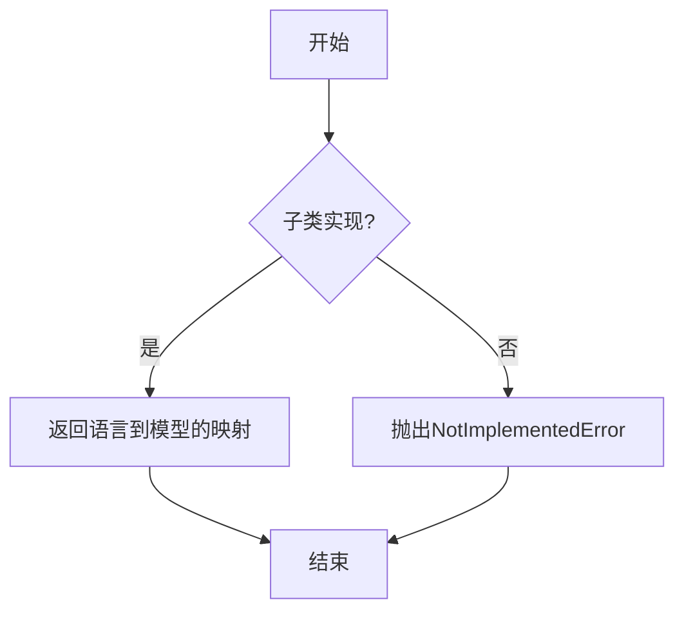

#### 带注释源码

```python
@abstractmethod
def get_available_models(self) -> Mapping[str, List[str]]:
    """获取该任务支持的可用模型

    这是一个抽象方法，需要子类实现具体的逻辑。
    子类应该返回一个字典，键为语言代码（ISO 639-1），
    值为该语言支持的模型名称列表。

    Returns:
        Mapping[str, List[str]]: 语言代码到模型列表的映射

    Raises:
        NotImplementedError: 当方法未被正确实现时抛出
    """
    raise NotImplementedError(
        "`get_available_models()` is not implemented properly!")
```


### `PororoFactoryBase.get_default_model`

该方法为抽象方法，用于根据给定的语言代码获取该语言对应的默认模型名称。子类需要实现此方法以提供具体任务支持的默认模型。

参数：

- `lang`：`str`，语言代码（如 "en"、"ko" 等），用于查找该语言支持的默认模型

返回值：`str`，返回指定语言对应的默认模型名称

#### 流程图

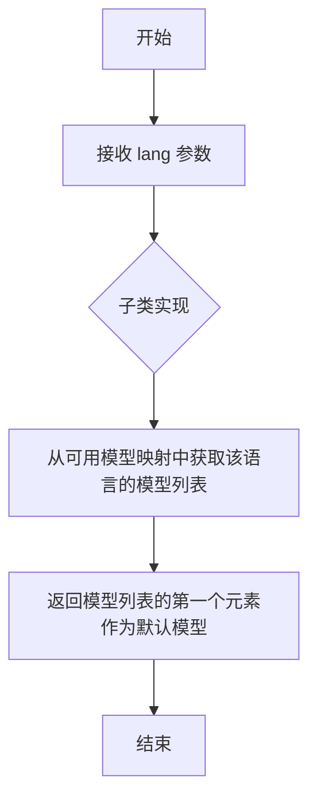

#### 带注释源码

```python
@abstractmethod
def get_default_model(self, lang: str) -> str:
    """获取指定语言的默认模型名称
    
    Args:
        lang: 语言代码字符串，用于查找对应的默认模型
        
    Returns:
        str: 该语言对应的默认模型名称（模型列表中的第一个元素）
        
    Note:
        这是一个抽象方法，具体任务子类需要实现此方法以返回
        符合任务需求的默认模型。基类提供了默认实现作为参考。
    """
    return self._available_models[lang][0]
```


### `PororoFactoryBase.load`

该方法是一个抽象类方法（@classmethod），定义了模型加载的接口规范，供子类实现具体的数据加载逻辑，返回一个 `PororoTaskBase` 任务基类实例。

参数：

- `cls`：隐式参数，类型为 `type`，代表类本身

返回值：`PororoTaskBase`，返回一个任务基类实例，用于执行特定的人工智能任务

#### 流程图

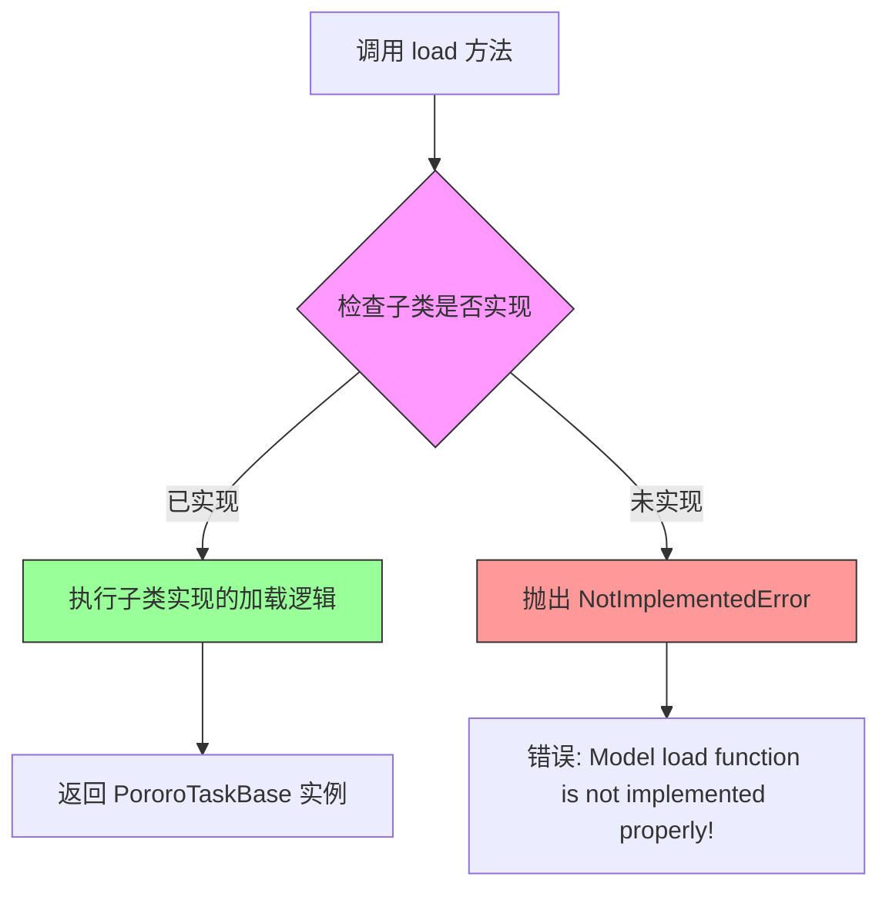

#### 带注释源码

```python
@classmethod
def load(cls) -> PororoTaskBase:
    r"""类方法：加载并返回任务基类实例
    
    这是一个抽象方法，定义了模型加载的标准接口。
    子类必须实现此方法以提供具体的任务实例化逻辑。
    
    Returns:
        PororoTaskBase: 任务基类实例，用于执行特定任务（如文本生成、翻译等）
    
    Raises:
        NotImplementedError: 当子类未实现此方法时抛出
    """
    raise NotImplementedError(
        "Model load function is not implemented properly!")
```


### `PororoSimpleBase.__call__`

该方法是 `PororoSimpleBase` 类的可调用接口，通过将输入的文本和额外参数委托给 `predict` 方法，实现统一的任务执行入口。

参数：

- `self`：隐式参数，实例本身。
- `text`：`str`，需要处理的输入文本。
- `**kwargs`：可变关键字参数，用于传递额外的预测参数（如模型特定选项）。

返回值：`Any`，返回 `predict` 方法的执行结果，具体类型取决于下游任务实现。

#### 流程图

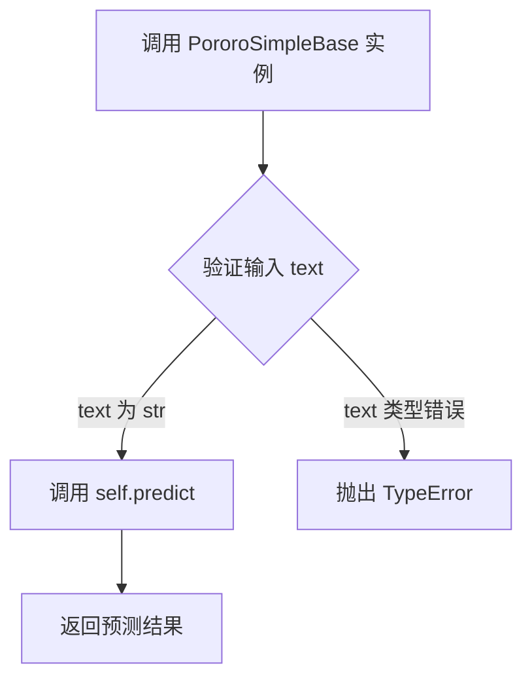

#### 带注释源码

```python
class PororoSimpleBase(PororoTaskBase):
    r"""Simple task base wrapper class"""
    # 继承自 PororoTaskBase，提供简化的任务调用封装

    def __call__(self, text: str, **kwargs):
        r"""将调用委托给 predict 方法

        参数:
            text: str, 输入的待处理文本
            **kwargs: 传递给 predict 的额外参数

        返回:
            Any: predict 方法的返回结果
        """
        # 将输入的文本和关键字参数传递给基类定义的 predict 方法
        return self.predict(text, **kwargs)
```


### `PororoBiencoderBase.__call__`

该方法是 Bi-Encoder 任务基类的可调用接口，接收句子 A 和句子 B（或句子列表）作为输入，进行 Unicode 标准化和空白字符处理后，调用 `predict` 方法执行双编码器的核心推理逻辑。

参数：

- `sent_a`：`str`，第一个输入句子
- `sent_b`：`Union[str, List[str]]`，第二个输入句子或句子列表（用于相似句子匹配任务）
- `**kwargs`：可变关键字参数，传递给底层 `predict` 方法的额外参数

返回值：`Any`，返回底层 `predict` 方法的结果，具体类型取决于具体实现

#### 流程图

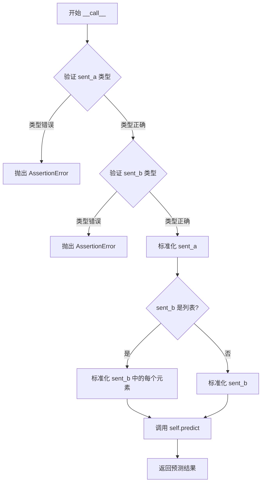

#### 带注释源码

```python
def __call__(
    self,
    sent_a: str,
    sent_b: Union[str, List[str]],
    **kwargs,
):
    """Bi-Encoder 任务的可调用接口

    参数:
        sent_a: 第一个输入句子（字符串类型）
        sent_b: 第二个输入句子（字符串或字符串列表类型）
        **kwargs: 传递给 predict 方法的额外参数

    返回:
        Any: predict 方法的预测结果
    """
    # 断言验证 sent_a 必须为字符串类型
    assert isinstance(sent_a, str), "sent_a should be string type"
    # 断言验证 sent_b 必须为字符串或字符串列表类型
    assert isinstance(sent_b, str) or isinstance(
        sent_b, list), "sent_b should be string or list of string type"

    # 对 sent_a 进行 Unicode 标准化和空白字符规范化处理
    # 使用继承自 PororoTaskBase 的 _normalize 方法
    sent_a = self._normalize(sent_a)

    # 判断是否为"查找相似句子"任务（sent_b 为列表）
    if isinstance(sent_b, list):
        # 对列表中的每个句子进行标准化处理
        sent_b = [self._normalize(t) for t in sent_b]
    else:
        # 对单个句子进行标准化处理
        sent_b = self._normalize(sent_b)

    # 调用抽象方法 predict 执行双编码器推理
    # 由子类实现具体的模型推理逻辑
    return self.predict(sent_a, sent_b, **kwargs)
```


### `PororoGenerationBase.__call__`

该方法是生成任务（Generation Task）的调用入口，封装了多种生成技巧（包括 beam search、temperature 采样、top-k/top-p 核采样、n-gram 重复抑制和长度惩罚），将用户提供的文本和生成参数传递给底层的 `predict` 方法执行推理并返回结果。

参数：

- `text`：`str`，输入的文本字符串，作为生成模型的 prompts
- `beam`：`int = 5`，beam search 的宽度，数值越大生成的候选序列越多，默认为 5
- `temperature`：`float = 1.0`，采样温度，控制概率分布的平滑程度，值越高随机性越强，默认为 1.0
- `top_k`：`int = -1`，top-k 采样参数，限制每一步只考虑概率最高的 k 个 token，-1 表示不启用，默认为 -1
- `top_p`：`float = -1`，核采样（nucleus sampling）参数，累积概率达到阈值即停止采样，-1 表示不启用，默认为 -1
- `no_repeat_ngram_size`：`int = 4`，禁止重复 n-gram 的大小，用于防止生成文本中出现重复短语，默认为 4
- `len_penalty`：`float = 1.0`，长度惩罚因子，用于控制生成文本的长度倾向，大于 1.0 倾向于生成更长文本，小于 1.0 倾向于生成更短文本，默认为 1.0
- `**kwargs`：可变关键字参数，传递给底层 `predict` 方法的额外参数

返回值：`Any`，返回底层 `predict` 方法的输出，通常为生成的文本字符串或列表

#### 流程图

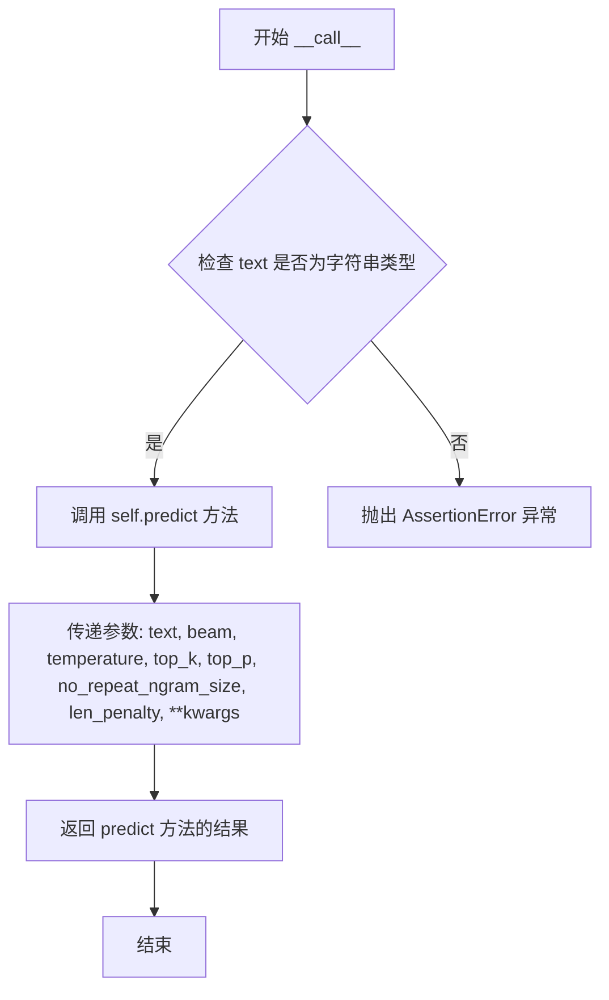

#### 带注释源码

```python
def __call__(
    self,
    text: str,
    beam: int = 5,
    temperature: float = 1.0,
    top_k: int = -1,
    top_p: float = -1,
    no_repeat_ngram_size: int = 4,
    len_penalty: float = 1.0,
    **kwargs,
):
    """
    生成任务的调用入口方法，封装多种生成技巧并转发至 predict 方法
    
    参数:
        text: 输入的文本字符串，作为生成模型的 prompts
        beam: beam search 宽度，默认 5
        temperature: 采样温度，默认 1.0
        top_k: top-k 采样参数，-1 表示不启用
        top_p: 核采样参数，-1 表示不启用
        no_repeat_ngram_size: 禁止重复 n-gram 的大小，默认 4
        len_penalty: 长度惩罚因子，默认 1.0
        **kwargs: 传递给 predict 的额外参数
    
    返回:
        返回 predict 方法的输出，通常为生成的文本
    """
    # 验证输入文本类型，确保为字符串
    assert isinstance(text, str), "Input text should be string type"

    # 调用底层的 predict 方法，传入文本和所有生成参数
    return self.predict(
        text,
        beam=beam,
        temperature=temperature,
        top_k=top_k,
        top_p=top_p,
        no_repeat_ngram_size=no_repeat_ngram_size,
        len_penalty=len_penalty,
        **kwargs,
    )
```


### `PororoTaskGenerationBase.__call__`

该方法是生成任务封装类的可调用接口，接收输入文本和束搜索参数，对文本进行规范化处理后调用 predict 方法执行文本生成任务。

参数：

- `text`：`str`，输入的文本内容，用于生成任务的源文本
- `beam`：`int`（默认值为 1），束搜索的宽度参数，控制生成过程中的候选序列数量
- `**kwargs`：可变关键字参数，其他传递给 predict 方法的额外参数

返回值：`Any`，返回 predict 方法的执行结果，通常是生成的文本内容

#### 流程图

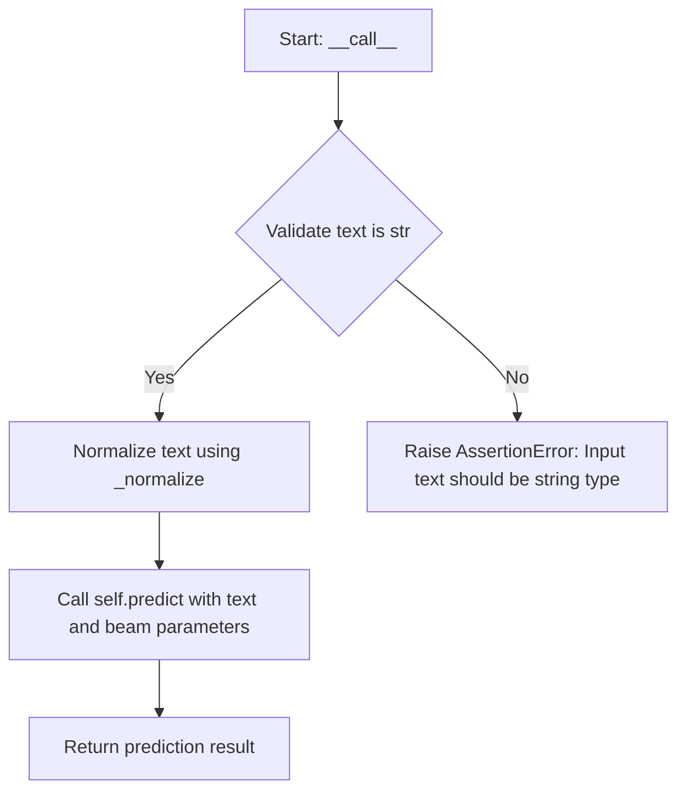

#### 带注释源码

```python
class PororoTaskGenerationBase(PororoTaskBase):
    r"""Generation task wrapper class using only beam search"""

    def __call__(self, text: str, beam: int = 1, **kwargs):
        # 断言验证输入文本类型，确保为字符串类型
        assert isinstance(text, str), "Input text should be string type"

        # 对输入文本进行Unicode规范化处理和空白字符清理
        text = self._normalize(text)

        # 调用父类的predict方法，传入规范化后的文本和束搜索参数
        return self.predict(text, beam=beam, **kwargs)
```

#### 关键依赖说明

| 依赖项 | 说明 |
|--------|------|
| `PororoTaskBase` | 父类，提供基础任务框架和 `_normalize` 方法 |
| `self._normalize()` | 继承自父类的方法，对文本进行 NFKC Unicode 规范化并去除多余空白 |
| `self.predict()` | 抽象方法，由子类实现的具体预测逻辑 |


## 关键组件


### TaskConfig

一个数据类，用于存储任务配置信息，包含任务类型、语言和模型名称三个字段。

### PororoTaskBase

任务基类，提供了预测的抽象接口和通用工具方法，包括Unicode标准化和空白符处理功能。

### PororoFactoryBase

工厂基类，负责根据任务、语言和模型参数构建特定任务的模块，支持语言和模型的可用性检查以及默认模型选择。

### PororoSimpleBase

简单任务包装类，继承自PororoTaskBase，将predict方法封装为可调用接口。

### PororoBiencoderBase

双编码器基类，支持句子对相似度匹配任务，提供了sent_a和sent_b的输入处理与标准化功能。

### PororoGenerationBase

生成任务包装类，支持多种生成技巧（beam search、temperature、top_k、top_p、no_repeat_ngram_size、len_penalty）。

### PororoTaskGenerationBase

仅支持beam search的生成任务包装类，提供基础的文本生成能力。


## 问题及建议


### 已知问题

- **逻辑顺序错误**：在 `PororoFactoryBase.__init__` 中，先执行 `assert lang in self._available_langs`，然后才检查 `if lang is None`。这意味着当 `lang` 为 `None` 时，会先触发断言错误，导致后续的默认语言设置逻辑永远无法执行。
- **重复的类型检查代码**：在 `PororoBiencoderBase.__call__` 和 `PororoGenerationBase.__call__` 中都有 `assert isinstance(...)` 的类型检查，且错误消息格式不统一，可以提取为公共方法。
- **类型检查写法不够简洁**：`isinstance(sent_b, str) or isinstance(sent_b, list)` 应简化为 `isinstance(sent_b, (str, list))`。
- **抽象方法缺少返回类型注解**：`get_available_langs`、`get_available_models`、`get_default_model` 等抽象方法缺少返回类型注解，影响类型安全。
- **冗余的属性定义**：`PororoTaskBase` 中定义了 `n_model` 和 `lang` 两个 property，但这些信息已经存储在 `self.config` 中，直接访问 `self.config.lang` 即可，无需额外的 property 封装。
- **`__call__` 方法实现不一致**：`PororoTaskBase` 的 `__call__` 抛出 `NotImplementedError`，但其子类 `PororoSimpleBase`、`PororoBiencoderBase` 等都实现了自己的 `__call__` 方法，这种设计容易造成混淆。
- **错误处理方式不统一**：部分地方使用 `assert` 进行参数校验（如类型检查），部分地方使用条件判断，不符合最佳实践。
- **硬编码默认值**：生成任务中的 `no_repeat_ngram_size=4`、各种惩罚参数等硬编码在方法签名中，缺乏配置灵活性。

### 优化建议

- **修复逻辑顺序**：将 `if lang is None` 的检查移到 `assert` 之前，确保在验证可用语言之前先处理 `None` 的情况。
- **统一类型检查**：创建一个基类方法 `_validate_text_input` 或使用装饰器来统一处理类型检查，或考虑使用 Pydantic 等库进行数据验证。
- **补充类型注解**：为所有抽象方法添加完整的类型注解，包括返回类型。
- **简化属性访问**：如果 `n_model` 和 `lang` property 仅是对 `self.config` 属性的简单代理，考虑移除这些 property，直接使用 `self.config.lang`。
- **统一错误处理**：使用自定义异常类替代 `assert` 语句进行参数验证，使错误信息更清晰、更易于捕获和处理。
- **设计模式优化**：考虑使用策略模式或模板方法模式来更好地组织生成任务的参数配置，避免在多个子类中重复定义类似的参数。
- **文档完善**：为所有抽象方法和关键方法补充详细的文档字符串，说明参数含义、返回值及可能的异常。


## 其它


### 设计目标与约束

本代码设计目标是为Pororo框架提供统一的任务基类和工厂模式实现，支持多种NLP任务（如文本生成、双编码器、简单任务等）的标准化封装。约束包括：必须继承自抽象基类实现具体任务；所有任务类必须实现predict方法；工厂类必须实现语言和模型的可用性查询接口。

### 错误处理与异常设计

代码中使用了NotImplementedError处理未实现的方法（predict、__call__、get_available_langs等），使用AssertionError处理参数校验（如语言不支持、模型不支持、类型错误等）。异常设计遵循分层原则：抽象基类定义异常抛出点，具体实现类负责实际的参数验证和错误处理。未捕获的异常会向上传播给调用者处理。

### 数据流与状态机

数据流主要分为配置流和执行流：配置流从PororoFactoryBase初始化开始，经过语言验证、模型映射、默认模型选择，最终生成TaskConfig；执行流从用户调用__call__或predict开始，经过输入规范化（_normalize）、参数传递、模型推理、结果返回。状态机主要体现在工厂类的状态转换：初始状态→语言验证→模型映射→配置生成，无显式状态机实现。

### 外部依赖与接口契约

外部依赖包括：re（正则表达式）、unicodedata（Unicode标准化）、abc（抽象基类）、dataclasses（数据类）、typing（类型提示）。接口契约：PororoTaskBase的predict方法必须接受text参数（str或List[str]）并返回预测结果；PororoFactoryBase必须实现get_available_langs、get_available_models、get_default_model、load四个抽象方法；所有具体任务类必须实现predict方法。

### 性能考虑

代码本身性能开销较小，主要性能考量在具体任务实现类的predict方法中。_normalize方法使用了Unicode规范化和正则表达式，在高频调用场景下可能成为瓶颈，建议缓存规范化结果。工厂类在初始化时会构建_model2lang映射，该操作时间复杂度为O(n)，其中n为可用模型总数。

### 线程安全性

代码中不涉及共享状态修改，线程安全主要取决于具体任务实现类。通常pororo框架的任务实例不应在多线程间共享，每个线程应创建独立的任务实例。PororoFactoryBase的__init__方法中构建的_model2lang是只读操作，线程安全。

### 扩展性设计

代码采用典型的基类+工厂模式设计，扩展性良好。要添加新任务类型，只需：1）继承PororoTaskBase或相关子类；2）实现predict方法；3）创建对应的工厂类继承PororoFactoryBase并实现抽象方法；4）在框架中注册新工厂。PororoSimpleBase、PororoBiencoderBase等中间类提供了不同任务类型的模板，进一步降低了扩展成本。

### 配置管理

配置通过TaskConfig数据类集中管理，包含task（任务名称）、lang（语言代码）、n_model（模型名称）三个字段。工厂类负责配置的组装和验证，支持运行时动态指定语言和模型。配置验证在工厂类初始化时完成，确保进入业务逻辑前配置已合法。

### 版本兼容性

代码使用Python 3.7+的dataclasses和typing模块，需要Python 3.7及以上版本。类型提示使用Union、List、Mapping、Optional等typing模块类型，确保类型检查工具兼容。未使用Python 4.0及以上版本的新特性，向后兼容性较好。

### 安全性考虑

代码本身不涉及用户认证、权限控制等安全功能。_normalize方法对输入进行Unicode规范化和空白符处理，可防止部分Unicode相关攻击。断言用于开发阶段参数校验，生产环境建议替换为更友好的错误处理。所有模型加载和推理逻辑在具体实现类中，需关注具体任务的安全性。

### 测试策略

建议测试覆盖：1）TaskConfig数据类的序列化和反序列化；2）PororoFactoryBase的初始化逻辑（语言验证、模型映射、默认值选择）；3）各基类的抽象方法实现检查；4）_normalize方法的边界情况（空字符串、特殊Unicode字符、混合空白符）；5）类型检查（传入错误类型参数时的错误处理）。

### 部署注意事项

部署时需确保Python环境满足版本要求（>=3.7）。具体任务实现类需要在运行环境中正确加载模型文件。工厂模式设计使得任务模块可以按需加载，减少启动时间。框架需要维护语言和模型的支持列表，确保部署版本与模型资源匹配。


    