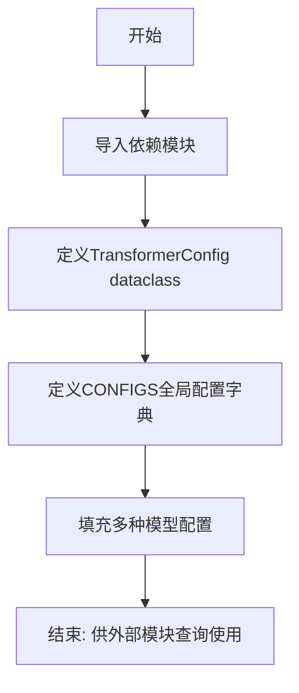

# `comic-translate\modules\ocr\pororo\pororo\tasks\utils\config.py` 详细设计文档

该代码定义了一个Transformer模型配置管理模块，通过dataclass结构存储不同Transformer模型的源/目标词典和分词器配置，并使用全局字典CONFIGS集中管理多种语言和任务（机器翻译、语法纠错、图像描述等）的模型配置映射。

## 整体流程



## 类结构

```
TransformerConfig (数据类)
```

## 全局变量及字段


### `CONFIGS`
    
全局配置字典，存储所有Transformer模型的配置映射

类型：`dict`
    


### `TransformerConfig.src_dict`
    
源语言词典路径

类型：`Union[str, None]`
    


### `TransformerConfig.tgt_dict`
    
目标语言词典路径

类型：`Union[str, None]`
    


### `TransformerConfig.src_tok`
    
源语言分词器配置

类型：`Union[str, None]`
    


### `TransformerConfig.tgt_tok`
    
目标语言分词器配置

类型：`Union[str, None]`
    
    

## 全局函数及方法


## 关键组件


### TransformerConfig 数据类

用于存储Transformer模型的配置信息，包含源语言和目标语言的词典路径以及分词器配置。

### CONFIGS 全局字典

存储了多种Transformer模型的配置映射，键为配置名称，值为TransformerConfig对象，支持不同模型规模（base/large）、不同语言（ko/en/zh/ja）和不同任务类型（const/pg/gec/caption/p2g/mtpg/wsd）。

### 配置键值对

定义具体的模型配置，包括源词典路径(src_dict)、目标词典路径(tgt_dict)、源语言分词器(src_tok)和目标语言分词器(tgt_tok)的配置。

### TransformerConfig 字段

- src_dict: Union[str, None] - 源语言词典路径
- tgt_dict: Union[str, None] - 目标语言词典路径
- src_tok: Union[str, None] - 源语言分词器配置
- tgt_tok: Union[str, None] - 目标语言分词器配置


## 问题及建议


### 已知问题

-   **类型注解冗余**：`Union[str, None]` 可简化为 `Optional[str]`，代码更简洁且符合 PEP 484 推荐写法
-   **配置重复**：多个配置项的字典路径完全相同（如 "dict.transformer.base.ko.mt" 出现 4 次），未提取共享常量，造成维护负担
-   **硬编码配置**：所有配置硬编码在代码中，无法通过外部配置文件或环境变量动态加载，违背了配置与代码分离的原则
-   **缺乏文档**：类 `TransformerConfig` 缺少 docstring，字段无注释，导致配置项含义不明确（如 `src_tok`、`tgt_tok` 的用途）
-   **魔法字符串**：配置键（如 "transformer.base.ko.const"）和字典路径（如 "bpe8k.ko"）散落各处，无统一常量或枚举定义，易产生拼写错误
-   **无验证机制**：配置值（如字典路径、tokenizer 名称）无格式校验或存在性检查，运行时可能因路径不存在而失败
-   **配置键命名不一致**：部分键包含 "_long"、"_fast" 等后缀修饰，命名规范不统一
-   **扩展性差**：新增配置需修改源码并重新部署，无法支持运行时动态注册
-   **部分配置字段为 None**：`src_tok` 和 `tgt_tok` 在多数配置中为 None，未说明是"未设置"还是"不适用"，语义模糊

### 优化建议

-   引入 `Optional[str]` 替代 `Union[str, None]`，并为 `TransformerConfig` 添加类和字段的文档说明
-   提取公共配置模式，使用配置模板或工厂方法减少重复代码
-   将配置迁移至独立的 YAML/JSON 配置文件或环境变量，支持运行时加载
-   定义配置键和路径的常量类或枚举，统一命名规范
-   添加配置验证器，检查字典路径和 tokenizer 文件是否存在
-   考虑使用 Pydantic 替代 dataclass，以获得内置的验证功能和类型序列化能力

## 其它


### 设计目标与约束

本代码模块的设计目标是提供一个集中管理Transformer模型配置的解决方案，支持多种语言对（ko, en, zh, ja）和多种任务类型（const, pg, gec, caption, p2g, wsd, mtpg）的模型配置管理。约束条件包括：配置键必须为字符串类型，配置值为TransformerConfig dataclass实例，所有路径和tokenizer配置应为字符串或None。

### 错误处理与异常设计

当前代码未包含显式的错误处理机制。潜在错误场景包括：访问不存在的配置键会抛出KeyError；传入无效的字符串路径可能导致后续加载失败。建议添加配置键验证逻辑，提供默认配置或抛出有意义的自定义异常，如InvalidConfigKeyError或MissingConfigError。

### 数据流与状态机

配置数据流如下：外部模块通过CONFIGS字典键（如"transformer.base.ko.pg"）查询配置→返回TransformerConfig实例→实例包含源/目标字典路径、tokenizer配置等信息→供下游模型加载器使用。状态机转换：无状态，每次访问都是独立的配置查询操作。

### 外部依赖与接口契约

外部依赖包括：dataclasses模块（Python标准库），typing模块（Union类型）。接口契约：CONFIGS为全局字典，键为字符串类型，值为TransformerConfig实例；TransformerConfig包含四个可选字符串字段。

### 性能考虑

当前实现使用字典字面量初始化，在模块加载时创建所有配置实例。对于少量配置（当前16个）性能可忽略不计；但若配置数量增长，应考虑延迟加载或配置缓存策略。

### 安全性考虑

当前代码不涉及敏感数据处理，配置值为文件路径字符串。安全风险：若配置来源于用户输入，需对配置键进行白名单验证防止字典攻击。

### 版本兼容性

代码使用Python 3.7+的dataclass装饰器，要求Python 3.7及以上版本。Union[str, None]语法在Python 3.10+可简化为str | None，但当前写法兼容性好。

### 配置管理策略

当前采用硬编码配置方式，适合静态配置场景。改进建议：支持从YAML/JSON配置文件加载配置，支持环境变量覆盖，支持配置继承机制减少重复。

### 扩展性设计

当前配置仅包含4个字段。扩展方向：添加max_seq_len、beam_size、batch_size等推理参数；添加checkpoint_path等模型权重相关配置；支持插件式配置加载器。

### 测试策略建议

建议添加测试用例：验证所有配置键的TransformerConfig实例字段完整性；验证配置覆盖场景（如测试环境覆盖生产配置）；验证新增配置的正确性。

### 部署相关

该模块为配置管理模块，无运行时依赖，适合作为基础库部署。建议通过Python包管理（pip/conda）分发，版本号遵循语义化版本规范。

    