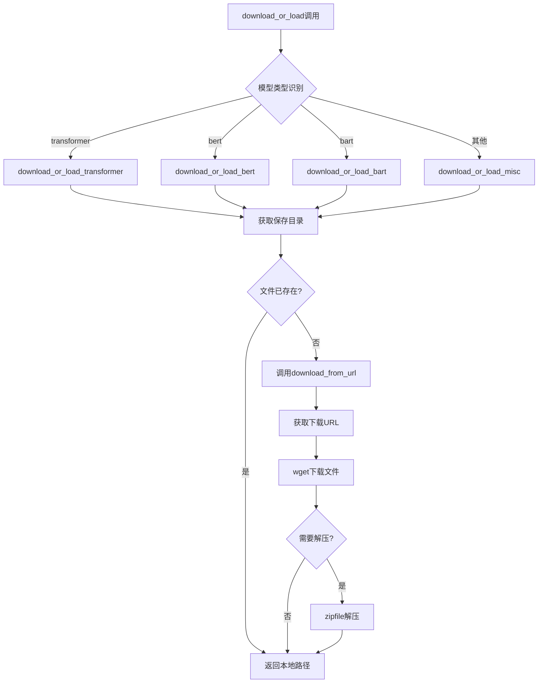
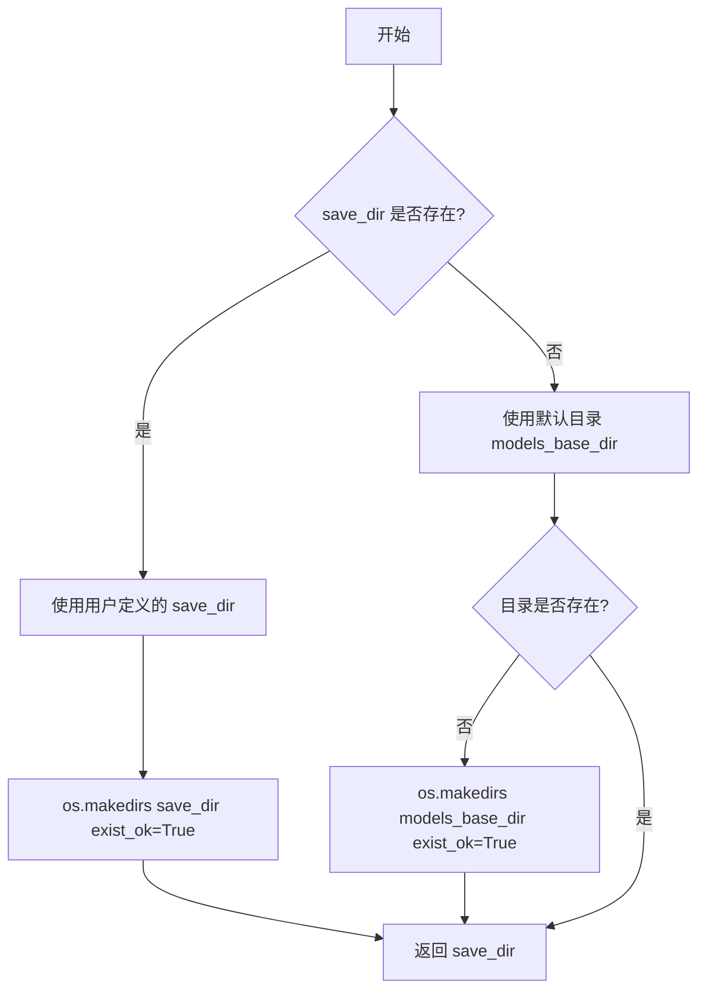
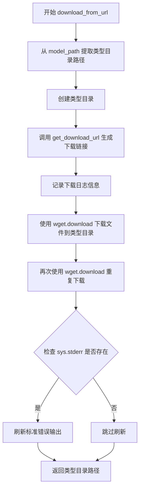
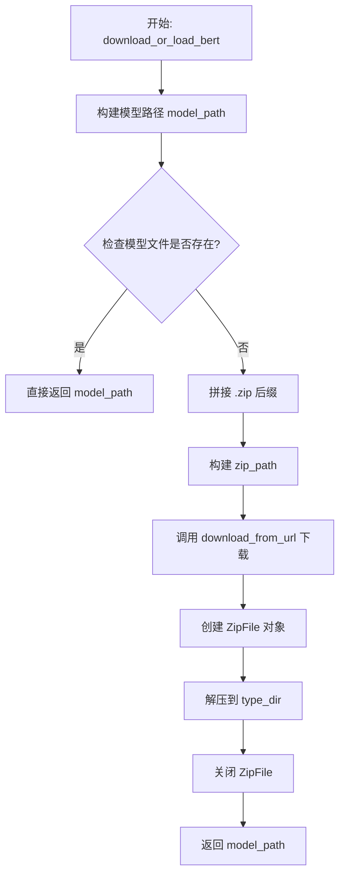
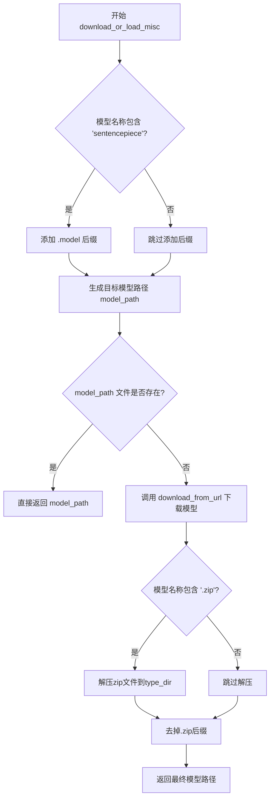
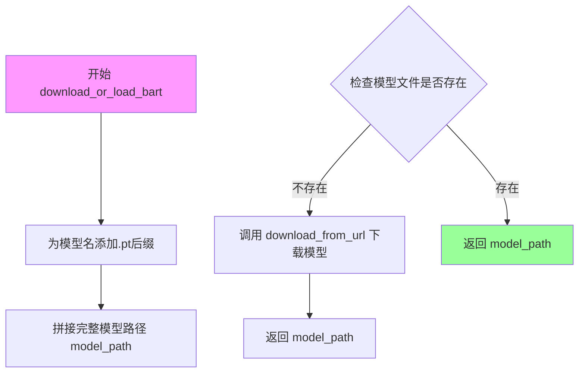

# `comic-translate\modules\ocr\pororo\pororo\tasks\utils\download_utils.py` 详细设计文档

该模块提供从远程服务器（Tenth）下载OCR模型、字典和Tokenizer的功能，支持BERT、Transformer、BART等多种模型类型的自动下载与本地加载，根据模型名称自动识别类型并执行相应的下载逻辑。

## 整体流程



## 类结构

```
Download模块 (download.py)
├── 数据类: TransformerInfo
├── 数据类: DownloadInfo
├── 全局变量: models_base_dir
├── 全局变量: DEFAULT_PREFIX
├── 函数: get_save_dir
├── 函数: get_download_url
├── 函数: download_from_url
├── 函数: download_or_load_bert
├── 函数: download_or_load_transformer
├── 函数: download_or_load_misc
├── 函数: download_or_load_bart
└── 主函数: download_or_load
```

## 全局变量及字段


### `models_base_dir`
    
模型保存的基础目录，通过将共享模型基础目录与'ocr/pororo'拼接得到

类型：`str`
    


### `DEFAULT_PREFIX`
    
下载URL前缀字典，包含model和dict两种类型的URL模板，键为'model'和'dict'，值为带有{lang}占位符的URL字符串

类型：`dict`
    


### `TransformerInfo.path`
    
Transformer模型文件的存储路径

类型：`str`
    


### `TransformerInfo.dict_path`
    
字典文件的存储目录路径

类型：`str`
    


### `TransformerInfo.src_dict`
    
源语言字典文件名

类型：`str`
    


### `TransformerInfo.tgt_dict`
    
目标语言字典文件名

类型：`str`
    


### `TransformerInfo.src_tok`
    
源语言tokenizer文件路径，若无则为None

类型：`Union[str, None]`
    


### `TransformerInfo.tgt_tok`
    
目标语言tokenizer文件路径，若无则为None

类型：`Union[str, None]`
    


### `DownloadInfo.n_model`
    
要下载的模型名称

类型：`str`
    


### `DownloadInfo.lang`
    
语言标识符，用于构建下载URL

类型：`str`
    


### `DownloadInfo.root_dir`
    
模型下载和保存的根目录

类型：`str`
    
    

## 全局函数及方法


### `get_save_dir`

获取或创建模型保存目录，如果用户提供了自定义保存目录则使用，否则使用默认的模型保存目录。

参数：

- `save_dir`：`str`，用户定义的保存目录，默认为 None

返回值：`str`，返回设置好的保存目录路径

#### 流程图



#### 带注释源码

```python
def get_save_dir(save_dir: str = None) -> str:
    """
    Get default save directory

    Args:
        savd_dir(str): User-defined save directory

    Returns:
        str: Set save directory

    """
    # If user wants to manually define save directory
    if save_dir:
        os.makedirs(save_dir, exist_ok=True)
        return save_dir

    # pf = platform.system()

    # if pf == "Windows":
    #     save_dir = "C:\\pororo"
    # else:
    #     home_dir = os.path.expanduser("~")
    #     save_dir = os.path.join(home_dir, ".pororo")

    save_dir = models_base_dir
    if not os.path.exists(save_dir):
        os.makedirs(save_dir, exist_ok=True)

    return save_dir
```


### `get_download_url`

根据传入的模型名、键类型（model 或 dict）和语言，从 DEFAULT_PREFIX 中获取对应的 URL 前缀，并用语言参数格式化后与模型名拼接，生成最终的下载 URL。

参数：

- `n_model`：`str`，模型名称
- `key`：`str`，键类型，取值必须为 `"model"` 或 `"dict"`
- `lang`：`str`，语言标识（如 "en"、"ko" 等）

返回值：`str`，拼接完整后的下载 URL

#### 流程图

```mermaid
flowchart TD
    A[开始 get_download_url] --> B[接收参数 n_model, key, lang]
    B --> C{验证 key 是否有效}
    C -->|key='model'| D[DEFAULT_PREFIX['model']]
    C -->|key='dict'| E[DEFAULT_PREFIX['dict']]
    D --> F[format: 替换 {lang} 为实际语言值]
    E --> F
    F --> G[拼接: {default_prefix}/misc/{n_model}]
    G --> H[返回完整 URL]
    H --> I[结束]
```

#### 带注释源码

```python
def get_download_url(n_model: str, key: str, lang: str) -> str:
    """
    Get download url using default prefix

    Args:
        n_model (str): model name
        key (str): key name either `model` or `dict`
        lang (str): language name

    Returns:
        str: generated download url

    """
    # 根据 key (model 或 dict) 从 DEFAULT_PREFIX 字典获取对应的 URL 模板
    # model 模板: "https://twg.kakaocdn.net/pororo/{lang}/models"
    # dict 模板: "https://twg.kakaocdn.net/pororo/{lang}/dicts"
    default_prefix = DEFAULT_PREFIX[key].format(lang=lang)
    
    # 将前缀与 /misc/ 以及模型名拼接，生成完整的下载 URL
    # 例如: "https://twg.kakaocdn.net/pororo/ko/models/misc/bert-base"
    return f"{default_prefix}/misc/{n_model}"
```


### `download_from_url`

该函数用于从Tenth服务器下载指定的模型或字典文件。它接受模型名称、目标路径、下载类型键和语言作为参数，生成下载URL，使用wget库执行实际下载操作，并返回下载文件所在的目标目录路径。

参数：

- `n_model`：`str`，要下载的模型名称
- `model_path`：`str`，预定义的模型保存路径
- `key`：`str`，下载类型键（值为"model"或"dict"）
- `lang`：`str`，语言标识符

返回值：`str`，返回下载文件所在的类型目录路径

#### 流程图



#### 带注释源码

```python
def download_from_url(
    n_model: str,
    model_path: str,
    key: str,
    lang: str,
) -> str:
    """
    Download specified model from Tenth

    Args:
        n_model (str): model name
        model_path (str): pre-defined model path
        key (str): type key (either model or dict)
        lang (str): language name

    Returns:
        str: default type directory

    """
    # Get default type dir path
    # 从model_path中提取目录路径部分（去掉文件名）
    type_dir = "/".join(model_path.split("/")[:-1])
    # 确保目标目录存在，如不存在则创建
    os.makedirs(type_dir, exist_ok=True)

    # Get download tenth url
    # 调用get_download_url函数生成完整的下载URL
    url = get_download_url(n_model, key=key, lang=lang)

    logging.info("Downloading user-selected model...")
    # 使用wget库下载文件到指定目录
    # 注意：这里调用了两次download，可能是为了确保下载成功或重试机制
    wget.download(url, type_dir)
    wget.download(url, type_dir)
    # 检查sys.stderr是否存在，如果存在则刷新输出缓冲区
    if sys.stderr:
        sys.stderr.write("\n")
        sys.stderr.flush()

    # 返回下载文件所在的目录路径
    return type_dir
```


### `download_or_load_bert`

该函数负责下载或加载经过微调的 BrainBert 和 BrainSBert 模型及其词典文件。当模型文件不存在时，函数自动从远程服务器下载对应的 ZIP 压缩包并解压到指定目录；若文件已存在，则直接返回本地路径，避免重复下载。

参数：

- `info`：`DownloadInfo`，包含模型名称(n_model)、语言(lang)和根目录(root_dir)的下载信息

返回值：`str`，返回下载/加载后的 BERT 或 SBERT 模型路径

#### 流程图



#### 带注释源码

```python
def download_or_load_bert(info: DownloadInfo) -> str:
    """
    Download fine-tuned BrainBert & BrainSBert model and dict

    Args:
        info (DownloadInfo): download information

    Returns:
        str: downloaded bert & sbert path

    """
    # 步骤1: 根据根目录和模型名拼接完整本地路径
    # 示例: /root/.pororo/ocr/pororo/brainbert.zip
    model_path = os.path.join(info.root_dir, info.n_model)

    # 步骤2: 检查本地是否已存在模型文件
    if not os.path.exists(model_path):
        # 步骤3: 若不存在，添加 .zip 后缀准备下载
        info.n_model += ".zip"
        
        # 步骤4: 构建完整 ZIP 文件路径
        zip_path = os.path.join(info.root_dir, info.n_model)

        # 步骤5: 调用底层下载函数从远程服务器获取模型
        # 返回值为解压目标目录 type_dir
        type_dir = download_from_url(
            info.n_model,    # 带 .zip 后缀的模型名
            zip_path,        # ZIP 文件保存路径
            key="model",     # 标识为模型类型
            lang=info.lang,  # 语言标识
        )

        # 步骤6: 使用 zipfile 模块解压下载的压缩包
        zip_file = zipfile.ZipFile(zip_path)
        # 解压到 type_dir 目录
        zip_file.extractall(type_dir)
        # 关闭文件句柄释放资源
        zip_file.close()

    # 步骤7: 返回模型文件路径
    return model_path
```

---

### 关键组件信息

| 组件名称 | 一句话描述 |
|----------|------------|
| `DownloadInfo` | 数据类，封装模型名称、语言和根目录的下载信息 |
| `download_from_url` | 底层下载函数，负责从 Tenth 服务器下载模型或词典 |
| `models_base_dir` | 全局变量，定义模型文件的默认存储根目录 |
| `get_save_dir` | 获取或创建模型保存目录的辅助函数 |

---

### 潜在的技术债务或优化空间

1. **重复下载问题**：`download_from_url` 函数中存在 `wget.download(url, type_dir)` 重复调用两次，这可能是调试遗留的代码，应当删除冗余调用。

2. **路径处理不一致**：函数在下载时给 `info.n_model` 添加了 `.zip` 后缀，但返回的 `model_path` 是未包含 `.zip` 的路径，而解压操作使用的是带 `.zip` 的路径，可能导致路径逻辑混乱。

3. **资源未正确清理**：ZIP 文件下载完成后未自动删除，占用磁盘空间；应考虑在解压完成后清理临时 ZIP 文件。

4. **异常处理缺失**：未对网络下载失败、磁盘空间不足、ZIP 文件损坏等异常情况进行捕获和处理。

5. **下载进度不可见**：`wget.download` 默认不输出进度信息，建议封装进度条或日志以提升用户体验。

---

### 其它项目

#### 设计目标与约束

- **目标**：实现模型的自动下载与缓存机制，避免重复下载，简化模型加载流程
- **约束**：依赖外部 Tenth 服务器网络连接，模型存储路径受 `models_base_dir` 限制

#### 错误处理与异常设计

- 当前实现未包含 try-except 保护，网络异常、磁盘 IO 错误将直接向上层抛出
- 建议增加网络超时重试机制、文件完整性校验（MD5/SHA256）

#### 数据流与状态机

```
[初始状态] --> 检查文件存在 --> [文件存在] --> 直接返回路径
                |
                v
           [文件不存在]
                |
                v
           下载ZIP --> 解压 --> 返回路径
```

#### 外部依赖与接口契约

| 依赖项 | 用途说明 |
|--------|----------|
| `wget` | 从远程 URL 下载模型文件 |
| `zipfile` | 解压模型压缩包 |
| `DownloadInfo` 数据类 | 必须包含 `n_model`、`lang`、`root_dir` 字段 |
| `download_from_url` | 内部依赖，需保证签名一致 |


### `download_or_load_transformer`

该函数用于下载预训练的Transformer模型、对应的字典（dictionary）和tokenizer。如果本地已存在相应的模型文件，则直接加载；否则从远程服务器下载，并返回包含模型路径、字典路径和tokenizer路径的`TransformerInfo`数据类对象。

参数：

-  `info`：`DownloadInfo`，包含下载所需的信息（模型名称、语言、根目录）

返回值：`TransformerInfo`，包含Transformer模型构建所需信息的数据类对象

#### 流程图

```mermaid
flowchart TD
    A[开始: download_or_load_transformer] --> B[从CONFIGS获取模型配置]
    B --> C[提取src_dict, tgt_dict, src_tok, tgt_tok]
    C --> D[拼接模型路径: info.root_dir + info.n_model + .pt]
    E{检查模型文件是否存在?} -- 是 --> G[直接使用本地模型路径]
    E -- 否 --> F[调用download_from_url下载模型]
    F --> G
    G --> H{src_dict_in是否存在?}
    H -- 是 --> I[构造src_dict路径并检查是否存在]
    H -- 否 --> J{设置dict_type_dir为空}
    I -- 是 --> K[直接使用本地src_dict路径]
    I -- 否 --> L[调用download_from_url下载src_dict]
    L --> K
    K --> M{tgt_dict_in是否存在?}
    M -- 是 --> N[构造tgt_dict路径并检查是否存在]
    M -- 否 --> O{不下载tgt_dict}
    N -- 是 --> P[直接使用本地tgt_dict路径]
    N -- 否 --> Q[调用download_from_url下载tgt_dict]
    Q --> P
    P --> R{检查src_tok是否存在?]
    R -- 是 --> S[调用download_or_load下载src_tok]
    R -- 否 --> T[src_tok_path = None]
    S --> U{检查tgt_tok是否存在?}
    T --> U
    U -- 是 --> V[调用download_or_load下载tgt_tok]
    U -- 否 --> W[tgt_tok_path = None]
    V --> X[构造TransformerInfo对象]
    W --> X
    X --> Y[返回TransformerInfo]
    O --> R
    J --> M
```

#### 带注释源码

```python
def download_or_load_transformer(info: DownloadInfo) -> TransformerInfo:
    """
    Download pre-trained Transformer model and corresponding dict

    Args:
        info (DownloadInfo): download information

    Returns:
        TransformerInfo: information dataclass for transformer construction

    """
    # 从预定义配置字典中获取当前模型的配置信息
    config = CONFIGS[info.n_model.split("/")[-1]]

    # 提取配置中的源语言和目标语言的字典及tokenizer信息
    src_dict_in = config.src_dict      # 源语言字典文件名
    tgt_dict_in = config.tgt_dict      # 目标语言字典文件名
    src_tok = config.src_tok           # 源语言tokenizer名称
    tgt_tok = config.tgt_tokenizer  # 目标语言tokenizer名称

    # 拼接完整的模型文件名（添加.pt后缀）
    info.n_model += ".pt"
    # 构造完整的模型保存路径
    model_path = os.path.join(info.root_dir, info.n_model)

    # 获取模型所在目录路径
    model_type_dir = "/".join(model_path.split("/")[:-1])
    
    # 检查模型文件是否已存在于本地
    if not os.path.exists(model_path):
        # 文件不存在，从URL下载模型
        model_type_dir = download_from_url(
            info.n_model,      # 模型文件名
            model_path,        # 保存路径
            key="model",       # 下载类型：模型
            lang=info.lang,    # 语言
        )

    # 初始化字典目录和字典路径变量
    dict_type_dir = str()
    src_dict, tgt_dict = str(), str()

    # 处理源语言字典的下载/加载
    if src_dict_in:
        # 构造完整的字典文件名
        src_dict = f"{src_dict_in}.txt"
        # 构造完整的字典保存路径
        src_dict_path = os.path.join(info.root_dir, f"dicts/{src_dict}")
        # 获取字典所在目录
        dict_type_dir = "/".join(src_dict_path.split("/")[:-1])
        
        # 检查源语言字典是否已存在
        if not os.path.exists(src_dict_path):
            # 字典不存在，从URL下载
            dict_type_dir = download_from_url(
                src_dict,
                src_dict_path,
                key="dict",
                lang=info.lang,
            )

    # 处理目标语言字典的下载/加载
    if tgt_dict_in:
        # 构造完整的字典文件名
        tgt_dict = f"{tgt_dict_in}.txt"
        # 构造完整的字典保存路径
        tgt_dict_path = os.path.join(info.root_dir, f"dicts/{tgt_dict}")
        
        # 检查目标语言字典是否已存在
        if not os.path.exists(tgt_dict_path):
            # 字典不存在，从URL下载
            download_from_url(
                tgt_dict,
                tgt_dict_path,
                key="dict",
                lang=info.lang,
            )

    # 初始化tokenizer路径变量
    src_tok_path, tgt_tok_path = None, None
    
    # 处理源语言tokenizer的下载/加载
    if src_tok:
        # 下载/加载tokenizer压缩包
        src_tok_path = download_or_load(
            f"tokenizers/{src_tok}.zip",
            lang=info.lang,
        )
    
    # 处理目标语言tokenizer的下载/加载
    if tgt_tok:
        # 下载/加载tokenizer压缩包
        tgt_tok_path = download_or_load(
            f"tokenizers/{tgt_tok}.zip",
            lang=info.lang,
        )

    # 构建并返回TransformerInfo数据类对象
    return TransformerInfo(
        path=model_type_dir,             # 模型目录路径
        dict_path=dict_type_dir,         # 字典目录路径
        # 处理源字典名：去除前缀"dict."和后缀".txt"
        src_dict=".".join(src_dict.split(".")[1:-1]),
        # 处理目标字典名：遵循fairseq的字典加载流程
        tgt_dict=".".join(tgt_dict.split(".")[1:-1]),
        src_tok=src_tok_path,            # 源语言tokenizer路径
        tgt_tok=tgt_tok_path,            # 目标语言tokenizer路径
    )
```


### `download_or_load_misc`

该函数用于下载或加载其他类型的杂项模型（miscellaneous model），支持sentencepiece模型和zip压缩包的自动下载、解压与路径返回。

参数：

-  `info`：`DownloadInfo`，下载信息，包含模型名称、语言和根目录

返回值：`str`，杂项模型的本地路径

#### 流程图



#### 带注释源码

```python
def download_or_load_misc(info: DownloadInfo) -> str:
    """
    Download (pre-trained) miscellaneous model

    Args:
        info (DownloadInfo): download information

    Returns:
        str: miscellaneous model path

    """
    # 如果模型名称包含 sentencepiece，添加 .model 后缀（sentencepiece 模型需要此扩展名）
    if "sentencepiece" in info.n_model:
        info.n_model += ".model"

    # 使用根目录和模型名生成目标模型的完整路径
    model_path = os.path.join(info.root_dir, info.n_model)
    
    # 检查模型文件是否已存在于本地
    if not os.path.exists(model_path):
        # 文件不存在，从URL下载模型
        type_dir = download_from_url(
            info.n_model,
            model_path,
            key="model",
            lang=info.lang,
        )

        # 如果下载的是zip压缩包，需要解压
        if ".zip" in info.n_model:
            zip_file = zipfile.ZipFile(model_path)
            zip_file.extractall(type_dir)
            zip_file.close()

    # 如果模型是zip文件，去掉.zip后缀后返回路径
    if ".zip" in info.n_model:
        model_path = model_path[:model_path.rfind(".zip")]
    
    return model_path
```


### `download_or_load_bart`

该函数负责下载或加载BART模型。如果模型文件不存在于指定路径，则从远程URL下载；否则直接返回本地模型路径。

参数：

- `info`：`DownloadInfo`，包含模型名称、语言和根目录的下载信息

返回值：`Union[str, Tuple[str, str]]`，BART模型路径（可能附带对应的SentencePiece）

#### 流程图



#### 带注释源码

```python
def download_or_load_bart(info: DownloadInfo) -> Union[str, Tuple[str, str]]:
    """
    Download BART model

    Args:
        info (DownloadInfo): download information

    Returns:
        Union[str, Tuple[str, str]]: BART model path (with. corresponding SentencePiece)

    """
    # 为模型名称添加 .pt 后缀，BART模型通常以.pt格式存储
    info.n_model += ".pt"

    # 使用根目录和模型名称拼接完整的模型文件路径
    model_path = os.path.join(info.root_dir, info.n_model)
    
    # 检查模型文件是否已存在于本地
    if not os.path.exists(model_path):
        # 如果不存在，则从URL下载模型
        # 传入模型名称、目标路径、key='model'、语言信息
        download_from_url(
            info.n_model,
            model_path,
            key="model",
            lang=info.lang,
        )

    # 返回本地模型路径（无论是否刚下载）
    return model_path
```


### `download_or_load`

这是整个模块的主入口函数，根据模型名称（`n_model`）通过字符串匹配路由到对应的下载或加载函数，支持 Transformer 模型、BERT 模型、BART 模型以及 miscellaneous 模型的下载，并返回相应的路径或信息数据结构。

参数：

- `n_model`：`str`，模型名称，用于判断模型类型并路由到对应的下载函数
- `lang`：`str`，语言信息，用于构建下载 URL 和指定语言相关的资源
- `custom_save_dir`：`str`，可选参数，用户自定义的模型保存目录，默认为 `None`

返回值：`Union[TransformerInfo, str, Tuple[str, str]]`，根据模型类型返回不同的值——Transformer 模型返回 `TransformerInfo` 数据类，BERT 模型返回模型路径字符串，BART 模型返回模型路径字符串或包含模型和 SentencePiece 的元组，杂项模型返回模型路径字符串

#### 流程图

```mermaid
flowchart TD
    A[开始: download_or_load] --> B[获取保存目录: get_save_dir]
    B --> C[创建 DownloadInfo 对象]
    C --> D{判断模型类型}
    D -->|包含 transformer| E[调用 download_or_load_transformer]
    D -->|包含 bert| F[调用 download_or_load_bert]
    D -->|包含 bart 且不包含 bpe| G[调用 download_or_load_bart]
    D -->|其他| H[调用 download_or_load_misc]
    E --> I[返回 TransformerInfo]
    F --> J[返回模型路径 str]
    G --> K[返回 str 或 Tuple[str, str]]
    H --> L[返回模型路径 str]
    I --> M[结束]
    J --> M
    K --> M
    L --> M
```

#### 带注释源码

```python
def download_or_load(
    n_model: str,
    lang: str,
    custom_save_dir: str = None,
) -> Union[TransformerInfo, str, Tuple[str, str]]:
    """
    Download or load model based on model information

    Args:
        n_model (str): model name
        lang (str): language information
        custom_save_dir (str, optional): user-defined save directory path. defaults to None.

    Returns:
        Union[TransformerInfo, str, Tuple[str, str]]

    """
    # 步骤1：获取模型保存目录，若用户指定了 custom_save_dir 则使用，否则使用默认目录
    root_dir = get_save_dir(save_dir=custom_save_dir)
    
    # 步骤2：创建 DownloadInfo 数据类，封装模型名、语言和保存目录信息
    info = DownloadInfo(n_model, lang, root_dir)

    # 步骤3：路由判断，根据模型名称字符串匹配调用对应的下载函数
    if "transformer" in n_model:
        # 如果模型名包含 transformer，调用 Transformer 专用下载函数
        return download_or_load_transformer(info)
    if "bert" in n_model:
        # 如果模型名包含 bert，调用 BERT 专用下载函数
        return download_or_load_bert(info)
    if "bart" in n_model and "bpe" not in n_model:
        # 如果模型名包含 bart 且不包含 bpe，调用 BART 专用下载函数
        return download_or_load_bart(info)

    # 步骤4：默认情况，调用杂项模型下载函数（sentencepiece 等）
    return download_or_load_misc(info)
```

## 关键组件


### DownloadInfo

用于存储模型下载信息的dataclass，包含模型名称(n_model)、语言(lang)和根目录(root_dir)三个字段。

### TransformerInfo

用于存储Transformer模型相关信息的dataclass，包含模型路径(path)、字典路径(dict_path)、源字典(src_dict)、目标字典(tgt_dict)、源分词器(src_tok)和目标分词器(tgt_tok)六个字段。

### DEFAULT_PREFIX

全局字典，定义了模型和字典的下载URL前缀模板，支持语言变量替换。

### models_base_dir

全局变量，指定模型文件的默认保存根目录，基于共享目录构建OCR/pororo路径。

### get_save_dir

获取或创建模型保存目录的函数，支持用户自定义目录，默认使用models_base_dir。

### get_download_url

根据模型名称、类型键和语言生成完整下载URL的函数。

### download_from_url

从Tenth CDN下载指定模型的函数，使用wget库进行文件下载，处理URL构建、目录创建和下载逻辑。

### download_or_load_bert

下载或加载BrainBert/BrainSBert模型的函数，处理ZIP压缩包的下载、解压和路径返回。

### download_or_load_transformer

下载或加载Transformer模型的函数，负责模型文件、字典文件和分词器的下载与加载，返回TransformerInfo对象。

### download_or_load_bart

下载或加载BART模型的函数，下载.pt格式的模型文件并返回路径。

### download_or_load_misc

下载或加载各类杂项模型的函数，支持sentencepiece模型和ZIP压缩包的处理。

### download_or_load

模型下载的主入口函数，根据模型名称类型分发到不同的下载函数，支持自定义保存目录。


## 问题及建议


### 已知问题

-   **重复下载缺陷**：`download_from_url` 函数中调用了两次 `wget.download(url, type_dir)`，导致模型被重复下载两次，严重浪费网络带宽和存储空间
-   **错误处理缺失**：所有下载函数均没有异常处理机制，网络中断、文件损坏或服务器不可用等情况会导致程序崩溃
-   **变量名拼写错误**：`get_save_dir` 函数的文档字符串中参数名为 `savd_dir`，但实际参数为 `save_dir`，文档与实现不一致
-   **资源管理不当**：手动调用 `zip_file.close()` 而非使用 `with` 上下文管理器，可能导致资源泄漏
-   **平台检测代码被注释**：Windows 和其他操作系统的默认路径逻辑被注释掉，但代码仍保留，形成死代码
-   **返回值类型不一致**：`download_or_load` 函数根据不同模型类型返回 `TransformerInfo`、`str` 或 `Tuple[str, str]`，但其 Union 类型注解不完整，TransformerInfo 仅在 transformer 模型时返回
-   **硬编码字符串拼接**：使用 `"/".join(path.split("/")[:-1])` 而非 `os.path.dirname()`，代码可读性差且不够健壮
-   **变量状态修改副作用**：`info.n_model` 在多个函数中被直接修改（如 `info.n_model += ".zip"`），修改了传入对象的状态，可能导致意外行为
-   **类型注解不准确**：`TransformerInfo` 中的 `src_tok` 和 `tgt_tok` 字段类型为 `Union[str, None]`，但实际返回的是 `download_or_load` 的结果，类型不够精确

### 优化建议

-   移除 `download_from_url` 中重复的 `wget.download` 调用，仅保留一次下载
-   为所有网络下载操作添加 try-except 异常处理，并实现重试机制或友好的错误提示
-   修复文档字符串中的拼写错误 `savd_dir` -> `save_dir`
-   使用 `with zipfile.ZipFile(...) as zip_file:` 上下文管理器替代手动 close()
-   删除被注释的平台检测死代码，保持代码整洁
-   统一使用 `os.path.dirname()` 或 `pathlib.Path` 处理路径操作
-   在函数入口处创建 `info` 的深拷贝或重新构造 `DownloadInfo` 对象，避免修改原对象状态
-   完善类型注解，使用 `typing overload` 为不同返回情况提供精确类型标注
-   增加日志记录点，记录下载进度、缓存命中等关键信息，便于调试和监控
-   考虑添加文件完整性校验（如 MD5/SHA256），避免下载损坏的模型文件


## 其它


### 设计目标与约束

本模块的设计目标是为Pororo OCR系统提供统一的模型和字典文件下载管理能力，支持多种模型类型（Transformer、BERT、BART、misc）的自动下载、缓存和加载功能。约束条件包括：必须依赖外部Tenth服务器进行模型获取，网络连接失败时需要给出明确错误提示，本地存储空间不足时需要处理异常，下载过程需要支持进度跟踪（通过wget的回调机制），模型文件需要按照语言和类型分类存储在指定目录结构中。

### 错误处理与异常设计

网络错误处理：在download_from_url函数中，当wget.download失败时（网络超时、服务器不可用等），wget库会抛出异常，需要在外层调用处捕获Exception并转换为用户友好的错误信息。文件操作错误处理：os.path.exists、os.makedirs、zipfile操作等可能抛出PermissionError、OSError等异常，需要在关键路径添加try-except包裹。路径错误处理：当custom_save_dir参数包含非法字符或超出系统路径长度限制时，os.makedirs可能失败。版本兼容性错误：当CONFIGS字典中不存在指定的n_model时，访问config属性会抛出KeyError，需要提前进行键存在性检查。

### 数据流与状态机

下载流程状态机包含以下状态：IDLE（初始状态）→ CHECK_CACHE（检查本地缓存）→ DOWNLOADING（下载中）→ EXTRACTING（解压中）→ READY（就绪）→ FAILED（失败）。对于Transformer模型，数据流为：download_or_load接收n_model和lang → get_save_dir确定根目录 → 根据模型类型分发到download_or_load_transformer → 从CONFIGS获取配置信息 → download_from_url下载模型文件 → 下载字典文件（可选）→ 下载tokenizer文件（可选）→ 返回TransformerInfo对象。对于BERT模型，流程类似但更简单：下载zip包 → 解压到目标目录 → 返回模型路径。

### 外部依赖与接口契约

主要外部依赖包括：wget库用于文件下载（接口：wget.download(url, out)），zipfile库用于解压zip格式模型，os/sys/logging等标准库。模块导出接口契约：download_or_load函数是主入口，接收n_model（模型名称字符串）、lang（语言代码如"ko"、"en"）、custom_save_dir（可选自定义路径），返回值类型根据模型类型变化（TransformerInfo/str/Tuple[str, str]）。CONFIGS字典来自modules.ocr.pororo.pororo.tasks.utils.config模块，定义了各Transformer模型的语言对、字典路径和tokenizer配置。共享路径shared_models_base_dir来自modules.utils.download模块，定义了基础存储目录。

### 安全性考虑

路径遍历防护：model_path和n_model参数来自外部输入，虽然本模块主要用于内部调用，但仍需警惕路径穿越攻击，建议在拼接路径前对n_model进行白名单校验或去除".."等特殊字符。URL注入风险：get_download_url函数直接将n_model拼接到URL中，虽然Tenth服务器域名固定，但如果n_model被恶意篡改可能导致意外下载，需要确保n_model来源可信。临时文件安全：下载过程中的临时zip文件存储在可预测路径下，建议使用tempfile模块创建随机命名的临时文件，下载完成后再移动到目标位置。

### 性能考虑

重复下载优化：当前实现只在文件不存在时下载，但download_from_url函数中调用了两次wget.download（可能是为了重试机制），这会导致下载时间翻倍，建议改为真正的重试机制并添加重试次数限制。并行下载：当前模型、字典、tokenizer串行下载，对于大型Transformer模型可能导致总耗时较长，可考虑使用ThreadPoolExecutor进行并行下载。缓存检查效率：每次调用都执行os.path.exists检查，对于大型模型目录可能较慢，可在内存中维护已验证的文件缓存列表。下载进度回调：wget支持bar参数进行进度显示，当前代码未启用，建议添加进度条提升用户体验。

### 配置管理

DEFAULT_PREFIX字典定义了模型和字典的下载URL前缀，当前硬编码为Tenth CDN地址，生产环境建议迁移到配置文件或环境变量。CONFIGS字典存储在外部模块中，定义了各Transformer模型的元信息（源语言、目标语言、字典名称、tokenizer配置），建议增加版本号字段以便模型更新时进行版本校验。模型存储根目录默认拼接shared_models_base_dir + "ocr" + "pororo"，路径较长且不易于维护，建议在配置文件中统一定义。

### 日志与监控

当前仅在download_from_url函数中使用logging.info输出"Downloading user-selected model..."，建议增加分级日志：DEBUG级别输出详细下载URL和文件大小，INFO级别输出下载进度百分比，WARNING级别输出重试信息，ERROR级别输出失败详情。监控指标建议：下载成功率统计、下载耗时统计、各模型类型的下载频率统计、缓存命中率统计。可接入Prometheus或ELK等监控系统进行长期趋势分析。

### 兼容性考虑

Python版本兼容性：代码使用 dataclass（Python 3.7+）、typing.Union语法（3.5+）、os.path.exists等，均为Python 3.5+兼容特性，建议在setup.py中明确Python版本要求。操作系统兼容性：代码使用os.path.join处理路径，理论上支持Windows/Linux/MacOS，但get_download_url中URL拼接使用正斜杠，需注意Windows下本地路径处理。wget库兼容性：不同版本的wget库API可能有变化，建议锁定wget版本在requirements.txt中。zipfile兼容性：Python 3.6+对zipfile有所改进，建议测试不同Python版本的解压兼容性。

### 测试策略

单元测试覆盖：get_save_dir测试默认路径和自定义路径场景，get_download_url测试URL拼接逻辑，download_from_url测试参数构造。集成测试：模拟Tenth服务器响应进行下载测试，使用http.server搭建本地服务器，验证完整下载解压流程。Mock测试：使用unittest.mock.patch模拟wget.download和os.path.exists，避免实际网络请求。边界条件测试：空字符串n_model、超长路径、特殊字符文件名、网络中断恢复等。性能测试：模拟大文件下载场景，验证超时处理和内存使用。

### 部署相关

依赖声明：需要在requirements.txt中声明wget依赖，建议锁定版本如wget==3.2。环境变量配置：建议支持通过环境变量OVERRIDE_MODELS_BASE_DIR覆盖默认模型存储路径，支持通过环境变量PORORO_DOWNLOAD_TIMEOUT设置下载超时时间。容器化支持：需要处理容器内网络访问外部CDN的代理配置，支持通过HTTP_PROXY/HTTPS_PROXY环境变量传递代理设置。首次下载提示：由于模型文件较大（可能数GB），建议在文档中明确标注首次使用时的网络和存储要求。

### 版本演进

当前版本问题：download_from_url中重复调用两次wget.download可能是临时解决方案，建议在后续版本中实现正式的重试机制。功能扩展计划：支持断点续传功能（Range请求），支持本地模型导入（不从远程下载），支持模型版本管理和回滚，支持GPU/CPU模型分流下载。API演进：download_or_load函数的返回值类型复杂（Union[TransformerInfo, str, Tuple[str, str]]），建议后续版本封装为统一的DownloadResult类，提升类型安全性和可扩展性。

    