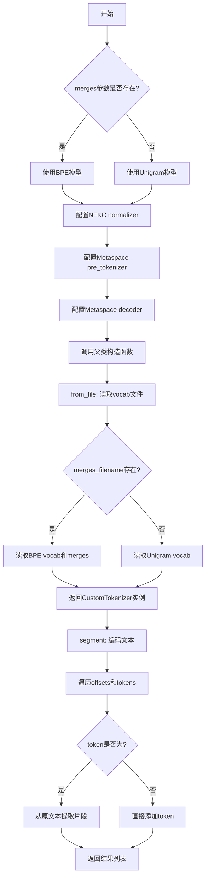
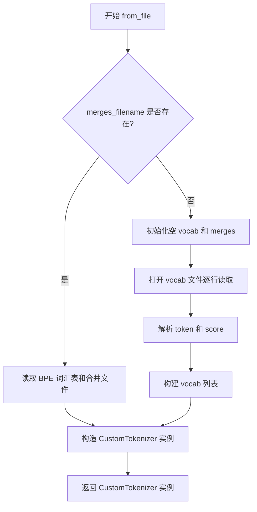

# `comic-translate\modules\ocr\pororo\pororo\tasks\utils\tokenizer.py` 详细设计文档

一个自定义的tokenizer实现，继承自BaseTokenizer，支持BPE和Unigram两种分词模型，使用Metaspace进行pre-tokenization和decoding，提供从文件加载词汇表和合并规则的功能，以及将文本分割为子词列表的segment方法。

## 整体流程



## 类结构

```
BaseTokenizer (tokenizers库基类)
└── CustomTokenizer (自定义分词器实现)
```

## 全局变量及字段


### `vocab`
    
词汇表，可以是文件路径或词汇列表

类型：`Union[str, List]`
    


### `merges`
    
BPE合并规则文件路径或None（用于Unigram模型）

类型：`Union[str, None]`
    


### `unk_token`
    
未知token的标识符，默认为"<unk>"

类型：`str`
    


### `replacement`
    
用于空格替换的特殊字符，默认为"▁"

类型：`str`
    


### `add_prefix_space`
    
是否在文本前添加空格，默认为True

类型：`bool`
    


### `dropout`
    
BPE dropout概率，默认为None

类型：`Optional[float]`
    


### `normalize`
    
是否使用NFKC规范化，默认为True

类型：`bool`
    


### `n_model`
    
模型类型标识符（"BPE"或"Unigram"）

类型：`str`
    


### `tokenizer`
    
tokenizers库的核心Tokenizer对象

类型：`Tokenizer`
    


### `parameters`
    
Tokenizer参数字典，用于配置信息存储

类型：`dict`
    


### `vocab_filename`
    
词汇表文件路径

类型：`str`
    


### `merges_filename`
    
合并规则文件路径或None

类型：`Union[str, None]`
    


### `kwargs`
    
传递给Tokenizer的可变关键字参数

类型：`**kwargs`
    


### `f_in`
    
打开的词汇表文件对象

类型：`TextIOWrapper`
    


### `line`
    
文件中的单行内容

类型：`str`
    


### `token`
    
词汇token

类型：`str`
    


### `score`
    
token的分数值

类型：`float`
    


### `text`
    
待分词的输入文本

类型：`str`
    


### `encoding`
    
encode方法返回的编码结果对象

类型：`Encoding`
    


### `offsets`
    
token对应的文本偏移量列表

类型：`List[tuple]`
    


### `tokens`
    
分词后的token列表

类型：`List[str]`
    


### `result`
    
最终的分割结果列表

类型：`List[str]`
    


### `offset`
    
单个token的偏移量(start, end)

类型：`tuple`
    


### `s`
    
token在原文中的起始位置

类型：`int`
    


### `e`
    
token在原文中的结束位置

类型：`int`
    


### `CustomTokenizer.CustomTokenizer`
    
继承自BaseTokenizer的自定义分词器类，支持BPE和Unigram两种模型

类型：`class`
    
    

## 全局函数及方法


### `CustomTokenizer.__init__`

这是 `CustomTokenizer` 类的构造函数，用于初始化一个自定义的分词器实例。根据是否提供 `merges` 参数，它会创建 BPE（字节对编码）或 Unigram 分词模型，并配置 NFKC 规范化器、Metaspace 预分词器和解码器。

参数：

- `vocab`：Union[str, List]，词汇表文件路径或词汇列表，用于构建分词模型
- `merges`：Union[str, None]，BPE 合并操作文件路径，传入 None 时使用 Unigram 模型
- `unk_token`：str = "<unk>"，未知token，默认为 "<unk>"
- `replacement`：str = "▁"，空格替换字符，默认为 Unicode 分隔符 "▁"
- `add_prefix_space`：bool = True，是否在词首添加空格，默认为 True
- `dropout`：Optional[float] = None，BPE dropout 概率，可选
- `normalize`：bool = True，是否启用 NFKC 规范化，默认为 True

返回值：None，该方法为构造函数，不返回任何值

#### 流程图

```mermaid
flowchart TD
    A[开始 __init__] --> B{merges是否存在?}
    B -->|Yes| C[创建BPE模型<br/>BPE(vocab, merges, unk_token)]
    B -->|No| D[创建Unigram模型<br/>Unigram(vocab, 1)]
    C --> E[创建Tokenizer with BPE模型]
    D --> E
    E --> F{normalize是否为True?}
    F -->|Yes| G[设置NFKC normalizer<br/>tokenizer.normalizer = NFKC()]
    F -->|No| H[跳过normalizer设置]
    G --> I[设置Metaspace pre_tokenizer<br/>pre_tokenizers.Metaspace]
    H --> I
    I --> J[设置Metaspace decoder<br/>decoders.Metaspace]
    J --> K[构建parameters字典<br/>包含model/unk_token/replacement等]
    K --> L[调用父类初始化<br/>super().__init__(tokenizer, parameters)]
    L --> M[结束]
```

#### 带注释源码

```python
def __init__(
    self,
    vocab: Union[str, List],          # 词汇表：文件路径或词汇列表
    merges: Union[str, None],          # BPE合并操作：文件路径或None(使用Unigram)
    unk_token: str = "<unk>",          # 未知token，默认为"<unk>"
    replacement: str = "▁",            # 空格替换字符，Unicode分隔符
    add_prefix_space: bool = True,    # 是否在词首添加空格
    dropout: Optional[float] = None,  # BPE dropout概率，可选
    normalize: bool = True,           # 是否启用NFKC规范化
):
    # 根据merges参数选择模型类型：BPE或Unigram
    if merges:
        n_model = "BPE"  # 标记模型为BPE
        # 创建BPE分词模型，传入词汇表、合并操作和未知token配置
        tokenizer = Tokenizer(
            BPE(
                vocab,  # type: ignore
                merges,
                unk_token=unk_token,
                fuse_unk=True,  # 合并未知token
            ))
    else:
        n_model = "Unigram"  # 标记模型为Unigram
        # 创建Unigram分词模型，初始概率设为1
        tokenizer = Tokenizer(Unigram(vocab, 1))  # type: ignore

    # 如果启用规范化，则设置NFKC规范化器（Unicode规范化）
    if normalize:
        tokenizer.normalizer = NFKC()

    # 配置Metaspace预分词器：处理空格和词边界
    tokenizer.pre_tokenizer = pre_tokenizers.Metaspace(
        replacement=replacement,     # 空格替换字符
        add_prefix_space=add_prefix_space,  # 是否添加前缀空格
    )

    # 配置Metaspace解码器：将token序列转换回文本
    tokenizer.decoder = decoders.Metaspace(
        replacement=replacement,
        add_prefix_space=add_prefix_space,
    )

    # 构建参数字典，用于保存分词器配置信息
    parameters = {
        "model": f"SentencePiece{n_model}",  # 模型名称（伪装为SentencePiece）
        "unk_token": unk_token,               # 未知token
        "replacement": replacement,           # 替换字符
        "add_prefix_space": add_prefix_space, # 前缀空格标志
        "dropout": dropout,                   # dropout值
    }
    
    # 调用父类BaseTokenizer的初始化方法，完成分词器的最终设置
    super().__init__(tokenizer, parameters)
```


### `CustomTokenizer.from_file`

从文件加载词汇表和合并规则，构造并返回 CustomTokenizer 实例。当提供 merges_filename 时使用 BPE 模型，否则使用 Unigram 模型。

参数：

- `vocab_filename`：`str`，词汇表文件路径
- `merges_filename`：`Union[str, None]`，BPE 合并文件路径，若为 None 则使用 Unigram 模型
- `**kwargs`：可变关键字参数，传递给 CustomTokenizer 构造器

返回值：`CustomTokenizer`，根据文件内容构造的分词器实例

#### 流程图



#### 带注释源码

```
@staticmethod
def from_file(
    vocab_filename: str,
    merges_filename: Union[str, None],
    **kwargs,
):
    # BPE 模式：读取词汇表和合并文件
    if merges_filename:
        vocab, merges = BPE.read_file(vocab_filename, merges_filename)

    # Unigram 模式：从文件逐行解析词汇表
    else:
        vocab = []
        merges = None
        # 打开词汇表文件
        with open(vocab_filename, "r") as f_in:
            # 遍历每一行
            for line in f_in.readlines():
                # 按 tab 分割 token 和分数
                token, score = line.strip().split("\t")
                # 将 (token, score) 元组加入 vocab 列表
                vocab.append((token, float(score)))

    # 返回构造的 CustomTokenizer 实例
    return CustomTokenizer(vocab, merges, **kwargs)
```


### `CustomTokenizer.segment`

将文本分段为子词列表。该方法使用分词器对输入文本进行编码，然后遍历编码结果，对于已知 token 直接添加到结果列表，对于未知 token `<unk>` 则根据偏移量从原文中提取对应片段并添加到结果列表。

参数：

- `text`：`str`，待分段的输入文本

返回值：`List[str]`，分段后的子词列表

#### 流程图

```mermaid
flowchart TD
    A([开始 segment]) --> B[encoding = self.encode(text)]
    B --> C[获取 offsets 和 tokens]
    C --> D[初始化 result = []]
    D --> E{遍历 offset, token}
    E --> F{token != '<unk>'?}
    F -->|是| G[result.append(token)]
    F -->|否| H[s, e = offset]
    H --> I[result.append(text[s:e])]
    G --> J{还有更多?}
    I --> J
    J -->|是| E
    J -->|否| K([返回 result])
```

#### 带注释源码

```python
def segment(self, text: str) -> List[str]:
    """
    Segment text into subword list

    Args:
        text (str): input text to be segmented

    Returns:
        List[str]: segmented subword list

    """
    # 使用分词器对输入文本进行编码，获取编码结果对象
    encoding = self.encode(text)

    # 从编码结果中提取偏移量信息（用于定位原文位置）和 token 列表
    offsets = encoding.offsets
    tokens = encoding.tokens

    # 初始化结果列表
    result = []
    
    # 遍历偏移量和 token 对，处理每个 token
    for offset, token in zip(offsets, tokens):
        # 如果 token 不是未知标记 "<unk>"，直接添加到结果中
        if token != "<unk>":
            result.append(token)
            continue
        
        # 如果 token 是 "<unk>"，根据偏移量从原文中提取对应片段
        # offset 是一个元组 (start, end)，表示该 token 在原文中的位置
        s, e = offset
        result.append(text[s:e])
    
    # 返回分段后的子词列表
    return result
```

## 关键组件


### CustomTokenizer 类

自定义分词器类，继承自BaseTokenizer，支持BPE和Unigram两种分词模型，集成了NFKC规范化和Metaspace预分词/解码功能，提供文本分词能力。

### BPE 模型

字节对编码（Byte Pair Encoding）分词模型，使用词汇表和合并规则进行子词分词，适用于有充足训练数据的场景。

### Unigram 模型

Unigram语言模型分词器，基于概率进行子词分词，适用于词汇表较小的场景，支持从文件加载带分数的词汇。

### NFKC 规范化

Unicode规范化形式（NFKC），将文本转换为统一的Unicode表示，用于提高分词的一致性和兼容性。

### Metaspace 预分词器

Metaspace预分词器，用于处理空格字符，将空格替换为特殊符号（默认为"▁"），支持添加前缀空格选项。

### Metaspace 解码器

Metaspace解码器，与预分词器配合使用，将分词后的token重建为原始文本格式。

### segment 方法

文本分词方法，将输入文本编码后提取token和偏移信息，处理未知token（<unk>）时使用原始文本片段替换，返回分词后的子词列表。

### from_file 静态方法

从文件加载分词器的静态方法，支持从词汇表文件和合并文件加载BPE模型，或从带分数的词汇表文件加载Unigram模型。


## 问题及建议


### 已知问题

-   **类型标注不准确**：`vocab: Union[str, List]` 和 `merges: Union[str, None]` 中str类型在实际使用中不合理，vocab应为`List`类型，merges应为`Optional[List]`类型
-   **误导性的模型名称**：parameters中`"model": f"SentencePiece{n_model}"`使用SentencePiece前缀具有误导性，实际使用的是BPE或Unigram模型
-   **dropout参数未使用**：构造函数接收dropout参数但从未传递给模型
-   **硬编码的unk token**：segment方法中`<unk>`字符串硬编码，应使用实例的unk_token属性
-   **from_file缺少错误处理**：Unigram模式读取vocab文件时没有处理空行、格式错误或文件不存在的情况
-   **segment方法缺少空值检查**：没有处理encoding为None或offsets/tokens为空的情况
-   **normalize参数类型不一致**：normalize为bool类型但直接赋值给tokenizer.normalizer
-   **BPE.read_file调用可能失败**：from_file中BPE.read_file在merges_filename为空时仍可能执行

### 优化建议

-   修正类型注解：`vocab: Union[List[tuple], Dict]`, `merges: Optional[List[str]]`
-   使用正确的模型名称：将`"SentencePiece{n_model}"`改为`n_model`
-   实现dropout功能：在创建模型时传递dropout参数
-   使用self.unk_token替代硬编码：获取构造函数中设置的unk_token值
-   添加from_file错误处理：使用try-except捕获文件读取异常，验证文件格式
-   添加segment方法的空值检查：验证encoding、offsets和tokens的有效性
-   考虑添加详细的类文档字符串，说明支持的模型和用法
-   考虑添加类型检查或使用pydantic进行参数验证
-   添加日志记录以便调试

## 其它


### 设计目标与约束

该代码旨在实现一个灵活的自定义分词器（CustomTokenizer），支持BPE（Byte Pair Encoding）和Unigram两种主流子词分词算法。设计目标包括：提供统一的接口来加载词汇表和合并规则；支持metaspace预分词器和decoder以处理空格；集成NFKC规范化以提升文本标准化能力；支持可选的dropout机制以提升模型鲁棒性。约束条件包括：依赖tokenizers库（版本需兼容）；BPE模式需要提供merges文件；Unigram模式需要提供带分数的词汇表文件。

### 错误处理与异常设计

代码中的错误处理主要体现在以下方面：1）from_file方法中通过判断merges_filename是否为空来区分BPE和Unigram模式，若文件不存在或格式错误将抛出异常；2）文件读取时使用strip().split("\t")解析词汇表，若格式不符合"token\tscore"将导致ValueError；3）构造函数中通过Union类型提示约束参数类型，但实际类型检查由tokenizers库完成。建议增加更详细的异常捕获和自定义异常类，以提供更友好的错误信息和调试支持。

### 数据流与状态机

数据流主要分为两个方向：初始化流程和分词流程。初始化流程：接收vocab和merges参数 -> 根据merges是否存在选择BPE或Unigram模型 -> 创建Tokenizer实例 -> 配置NFKC规范化器（若normalize=True）-> 配置Metaspace预分词器 -> 配置Metaspace解码器 -> 调用父类BaseTokenizer初始化。分词流程（segment方法）：接收原始文本 -> 调用encode方法进行编码 -> 获取offsets和tokens -> 遍历tokens和offsets，若token为"<unk>"则从原始文本对应位置提取子串，否则直接使用token -> 返回分词结果列表。

### 外部依赖与接口契约

主要外部依赖包括：tokenizers库（核心分词功能）、typing模块（类型提示）。接口契约如下：构造函数__init__接收vocab（词汇表，str或List类型）、merges（合并规则，str或None）、unk_token（未知token，默认"<unk>"）、replacement（替换字符，默认"▁"）、add_prefix_space（是否添加前缀空格，默认True）、dropout（dropout概率，可选）、normalize（是否规范化，默认True）。静态方法from_file接收vocab_filename和merges_filename路径参数以及额外关键字参数，返回CustomTokenizer实例。实例方法segment接收str类型文本，返回List[str]类型的分词结果。

### 性能考虑

性能优化点包括：1）dropout参数可在训练时引入随机性防止过拟合，但会降低推理速度；2）NFKC规范化在normalize=True时会增加额外计算开销，对于已规范化的文本可设为False；3）Metaspace预分词器处理空格的方式对包含大量空格的文本性能可能受影响；4）Unigram模型使用固定概率（1）初始化，未考虑实际训练分数。建议：对于大规模文本处理，考虑批量编码而非逐条segment；预加载tokenizer避免重复初始化开销。

### 安全性考虑

潜在安全风险包括：1）from_file方法直接读取文件，未做路径遍历检查，vocab_filename和merges_filename需确保可信路径；2）segment方法返回的token可能包含原始文本片段，需注意后续处理是否存在注入风险；3）unk_token默认为"<unk>"，需确保下游处理系统对此token有正确处理。建议：增加文件路径验证；增加输入文本长度限制；增加输出token数量限制以防止内存耗尽。

### 兼容性考虑

兼容性问题需关注：1）tokenizers库版本变化可能导致API行为差异，建议锁定依赖版本；2）Python版本兼容性需确认（建议Python 3.7+）；3）BPE和Unigram模型文件格式需与tokenizers库版本匹配；4）Unicode字符处理依赖Python和tokenizers库的Unicode支持。建议在项目中使用固定版本的tokenizers依赖（如tokenizers>=0.10.0），并提供版本兼容性测试。

### 使用示例

```python
# 使用BPE模型
tokenizer = CustomTokenizer.from_file(
    vocab_filename="vocab.json",
    merges_filename="merges.txt",
    unk_token="<unk>",
    add_prefix_space=True
)
text = "Hello world"
result = tokenizer.segment(text)
print(result)  # 输出分词结果

# 使用Unigram模型
tokenizer = CustomTokenizer.from_file(
    vocab_filename="unigram_vocab.txt",
    merges_filename=None,
    unk_token="<unk>"
)
result = tokenizer.segment("示例文本")
print(result)
```

### 已知限制与改进建议

已知限制：1）Unigram模型初始化时使用固定概率1，未使用实际词汇表中的score，可能影响分词质量；2）from_file方法解析Unigram词汇表时未处理空行或格式错误；3）未提供save方法，tokenizer状态无法持久化；4）未提供batch_encode方法，大批量处理效率低；5）dropout参数在构造函数中接收但未实际传递给模型。改进建议：实现save/load方法支持序列化；增加batch处理能力；修复dropout参数传递；增加更丰富的预分词器选项；添加单元测试覆盖边界情况。


    