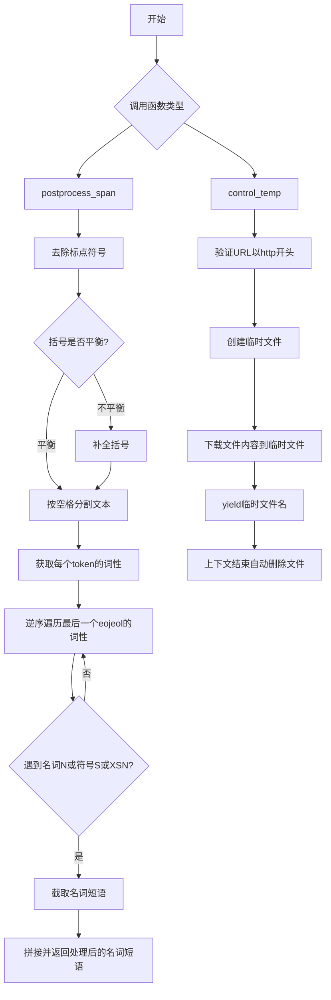
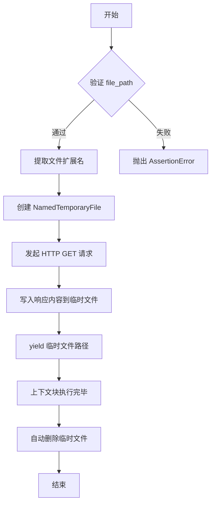
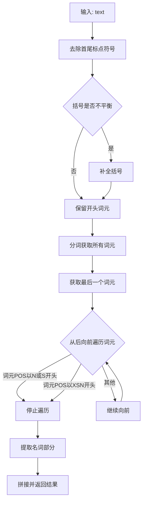
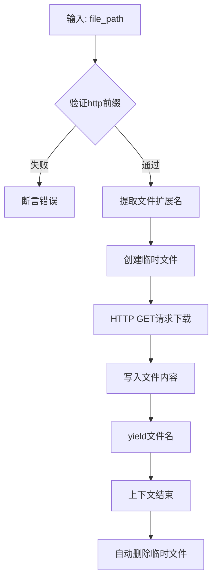

# `comic-translate\modules\ocr\pororo\pororo\utils.py` 详细设计文档

该模块提供两个核心功能：1) postprocess_span函数用于对韩语文本的名词短语进行后处理，去除不必要的字符和后缀，提取干净的名词短语；2) control_temp是一个上下文管理器，用于从Web下载临时文件并在上下文结束后自动删除。

## 整体流程



## 类结构

```
无类层次结构 (纯函数模块)
├── postprocess_span (名词短语后处理函数)
└── control_temp (临时文件下载上下文管理器)
```

## 全局变量及字段


### `tagger`
    
POS标注器对象，用于对token进行词性标注

类型：`object`
    


### `text`
    
输入的NOUN span字符串，待处理的文本

类型：`str`
    


### `file_path`
    
web文件路径，指向需要下载的HTTP资源

类型：`str`
    


### `ext`
    
文件扩展名，从file_path中提取

类型：`str`
    


### `response`
    
HTTP响应对象，包含下载的文件内容

类型：`Response`
    


### `noun_phrase`
    
处理后的名词短语，保留开头tokens

类型：`str`
    


### `tokens`
    
文本按空格分割后的token列表

类型：`list`
    


### `eojeols`
    
存储每个token的POS标注结果列表

类型：`list`
    


### `last_eojeol`
    
最后一个eojeol的POS标注结果列表

类型：`list`
    


### `i`
    
循环索引变量，用于逆向遍历

类型：`int`
    


### `idx`
    
计算得出的名词短语结束索引

类型：`int`
    


### `ext_last_eojeol`
    
从最后eojeol中提取的名词词干

类型：`str`
    


### `f`
    
临时文件对象，用于存储下载的内容

类型：`NamedTemporaryFile`
    


    

## 全局函数及方法


### `postprocess_span`

该函数用于对名词短语（NOUN span）进行后处理，去除不必要的字符和后缀，提取干净的名词短语。函数首先去除标点符号并补全不匹配的括号对，然后利用词性标注器（tagger）对文本进行分词和词性分析，从最后一个词元（eojeol）中逆向遍历，识别名词或XSN词性作为边界，提取该边界之前的所有词素，并与前面的词元组合成最终的名词短语。

参数：

- `tagger`：标注器对象，需具备 `pos()` 方法用于对文本进行词性标注，返回词素和词性对的列表
- `text`：`str`，需要处理的原始名词短语文本

返回值：`str`，处理后的名词短语

#### 流程图

```mermaid
flowchart TD
    A[开始: 输入 text] --> B[去除标点符号]
    B --> C{括号是否不平衡?}
    C -->|左括号多1个| D[添加右括号)]
    C -->|右括号多1个| E[添加左括号(]
    C -->|平衡| F[继续]
    D --> F
    E --> F
    F --> G[提取最后一个空格前的内容作为前置短语]
    G --> H[按空格分割文本为词元列表]
    H --> I[对每个词元调用 tagger.pos 进行词性标注]
    I --> J[获取最后一个词元的词性列表]
    J --> K[从后向前遍历词性]
    K --> L{当前词性是否以N或S开头<br>或以XSN开头?}
    L -->|是| M[跳出循环]
    L -->|否| N[继续向前]
    N --> K
    M --> O[计算截取索引]
    O --> P[提取最后词元中索引之前的词素]
    P --> Q[将截取的词素与前置短语组合]
    Q --> R[去除首尾空格]
    R --> S[返回处理后的名词短语]
```

#### 带注释源码

```python
def postprocess_span(tagger, text: str) -> str:
    """
    Postprocess NOUN span to remove unnecessary character

    Args:
        text (str): NOUN span to be processed

    Returns:
        (str): post-processed NOUN span

    Examples:
        >>> postprocess_span("강감찬 장군은")
        '강감찬 장군'
        >>> postprocess_span("그녀에게")
        '그녀'

    """

    # First, strip punctuations
    # 去除字符串首尾的标点符号，包括中文标点《》和其他常见符号
    text = text.strip("""!"\#$&'()*+,\-./:;<=>?@\^_‘{|}~《》""")

    # Complete imbalanced parentheses pair
    # 处理括号不平衡的情况：左括号比右括号多1个时添加右括号
    if text.count("(") == text.count(")") + 1:
        text += ")"
    # 右括号比左括号多1个时在开头添加左括号
    elif text.count("(") + 1 == text.count(")"):
        text = "(" + text

    # Preserve beginning tokens since we only want to extract noun phrase of the last eojeol
    # 保留除最后一个空格后的部分以外的所有内容（即前面的词元）
    noun_phrase = " ".join(text.rsplit(" ", 1)[:-1])
    # 将文本按空格分割成词元列表
    tokens = text.split(" ")
    # 用于存储每个词元的词性标注结果
    eojeols = list()
    # 对每个词元进行词性标注，tagger.pos()应返回形如 [('词素', '词性'), ...] 的列表
    for token in tokens:
        eojeols.append(tagger.pos(token))
    # 获取最后一个词元的词性列表
    last_eojeol = eojeols[-1]

    # Iterate backwardly to remove unnecessary postfixes
    # 从后向前遍历最后一个词元的词性，寻找名词或XSN词性作为边界
    i = 0
    for i, token in enumerate(last_eojeol[::-1]):
        _, pos = token
        # 1. The loop breaks when you meet a noun
        # 2. The loop also breaks when you meet a XSN (e.g. 8/SN+일/NNB LG/SL 전/XSN)
        # 如果词性以N（名词）或S（符号）开头，或者是XSN（后缀名词），则停止
        if (pos[0] in ("N", "S")) or pos.startswith("XSN"):
            break
    # 计算需要保留的词素索引位置
    idx = len(last_eojeol) - i

    # Extract noun span from last eojeol and postpend it to beginning tokens
    # 从最后一个词元中提取索引之前的词素（名词部分）
    ext_last_eojeol = "".join(morph for morph, _ in last_eojeol[:idx])
    # 将提取的名词短语与之前保留的前置短语组合
    noun_phrase += " " + ext_last_eojeol
    # 去除首尾空格后返回
    return noun_phrase.strip()
```


### `control_temp`

这是一个上下文管理器函数，用于从Web下载临时文件到本地，并在上下文管理器结束后自动删除该临时文件。

参数：

- `file_path`：`str`，Web文件路径，必须以"http"开头

返回值：`str`，返回下载的临时文件的完整路径，供调用者在上下文块内使用

#### 流程图



#### 带注释源码

```python
@contextmanager
def control_temp(file_path: str):
    """
    Download temporary file from web, then remove it after some context

    Args:
        file_path (str): web file path

    """
    # yapf: disable
    # 断言验证：确保file_path是以http开头的有效URL
    # 这是防御性编程，防止传入无效路径导致后续请求失败
    assert file_path.startswith("http"), "File path should contain `http` prefix !"
    # yapf: enable

    # 从URL中提取文件扩展名（从最后一个"."到末尾）
    # 例如：https://example.com/data.csv -> ".csv"
    ext = file_path[file_path.rfind("."):]

    # 创建临时文件
    # "wb": 以二进制写入模式打开
    # suffix=ext: 保留原始文件扩展名，便于后续处理
    # delete=True: 上下文结束后自动删除临时文件
    with NamedTemporaryFile("wb", suffix=ext, delete=True) as f:
        # 发起HTTP GET请求，allow_redirects=True 自动跟随重定向
        response = get(file_path, allow_redirects=True)
        # 将响应内容（二进制）写入临时文件
        f.write(response.content)
        # yield临时文件路径，使调用者可以在with块内使用该文件
        yield f.name
        # with块结束后，NamedTemporaryFile自动关闭并删除临时文件
```

## 关键组件


### postprocess_span 函数

用于对韩语名词短语进行后处理，去除不必要的字符和后缀，提取正确的名词短语。核心逻辑包括：去除标点符号、补全不匹配的括号、对每个词进行词性标注、从后向前遍历去除非名词后缀、最后提取名词部分。

### control_temp 上下文管理器

用于从Web下载临时文件并在上下文结束后自动清理。内部使用requests库下载文件，通过NamedTemporaryFile创建临时文件，确保使用后自动删除。

### 标点符号处理

使用strip方法结合韩语和英语标点符号集对输入文本进行清理，移除开头和结尾的标点符号。

### 括号补全逻辑

通过计数左右括号的数量，补全不匹配的括号对。当左括号比右括号多一个时在末尾加")"，反之在开头加"("。

### 词性标注与过滤

使用tagger.pos()对每个token进行词性标注，通过检查词性是否以"N"或"S"开头，或是否以"XSN"开头来判断是否到达名词边界。

### 名词短语提取

从最后一个eojeol（韩语词汇单位）中提取名词部分，与前面的token拼接形成最终的名词短语。

### 临时文件下载与清理

使用requests.get()下载文件内容，写入临时文件后在上下文管理器结束时自动删除，无需手动清理。

### 全局导入模块

包括contextlib.contextmanager用于创建上下文管理器，tempfile.NamedTemporaryFile用于创建临时文件，requests.get用于HTTP请求。


## 问题及建议


### 已知问题

- **错误处理缺失**：网络请求未检查HTTP状态码，下载失败时会直接抛出异常；未处理网络超时情况
- **类型注解不完整**：`postprocess_span`函数的`tagger`参数缺少类型提示，`control_temp`上下文管理器也缺少返回类型注解
- **硬编码标点符号列表**：标点符号列表直接写在代码中，难以维护和扩展
- **不均衡括号处理逻辑不完善**：仅处理了左右括号相差1的情况，其他不均衡情况被忽略
- **潜在空值问题**：当`tagger.pos(token)`返回空列表时，可能导致索引越界
- **代码重复与冗余计算**：`text.split(" ")`和`text.rsplit(" ", 1)`存在重复调用
- **资源未正确释放风险**：虽然使用了`NamedTemporaryFile`，但`delete=True`在某些操作系统上可能存在文件延迟删除问题
- **函数文档不统一**：`control_temp`缺少完整的文档字符串（包括Args、Returns、Examples）

### 优化建议

- 为网络请求添加状态码检查和异常捕获机制：`if response.status_code != 200: raise Exception(...)`
- 将标点符号列表提取为模块级常量，添加类型注解
- 完善括号匹配逻辑，处理任意数量的不均衡情况或记录警告日志
- 为`tagger`参数添加Union类型注解，添加空列表检查防护
- 缓存`text.split(" ")`结果，避免重复计算
- 考虑使用`tempfile.TemporaryDirectory`或显式关闭文件前确保数据写入完成
- 补充`control_temp`的完整文档字符串，保持与`postprocess_span`文档风格一致
- 添加单元测试覆盖边界情况（如空字符串、纯标点符号、网络超时等）

## 其它


### 一段话描述

该代码模块提供了两个工具函数：`postprocess_span` 用于对韩语名词短语进行后处理，去除标点符号、平衡括号，并提取最后词元（eojeol）的名词部分；`control_temp` 是一个上下文管理器，用于从Web下载临时文件并在上下文结束后自动删除。

### 文件整体运行流程

代码包含两条独立的执行路径：

**路径一：名词短语后处理流程**
1. 输入原始文本（韩语名词短语）
2. 去除首尾标点符号
3. 补全不匹配的括号对
4. 保留开头词元，提取最后一个词元
5. 对最后一个词元进行词性分析
6. 从后向前遍历，去除非名词后缀
7. 提取名词部分并拼接返回

**路径二：临时文件管理流程**
1. 验证文件路径以"http"开头
2. 根据URL获取文件扩展名
3. 创建带扩展名的临时文件
4. 通过HTTP GET请求下载文件内容
5. 将内容写入临时文件
6. 返回临时文件路径供调用者使用
7. 上下文结束时自动删除临时文件

### 全局函数信息

#### postprocess_span

- **名称**: postprocess_span
- **参数**: 
  - tagger: 词性标注器对象，用于对韩语文本进行词性分析
  - text: str，需要处理的韩语名词短语
- **参数类型**: 
  - tagger: object（词性标注器）
  - text: str
- **参数描述**: tagger是用于分词和词性标注的工具，text是待处理的韩语名词短语
- **返回值类型**: str
- **返回值描述**: 处理后的名词短语，去除了不必要的字符和后缀
- **mermaid流程图**:

- **带注释源码**:
```python
def postprocess_span(tagger, text: str) -> str:
    """
    Postprocess NOUN span to remove unnecessary character

    Args:
        text (str): NOUN span to be processed

    Returns:
        (str): post-processed NOUN span

    Examples:
        >>> postprocess_span("강감찬 장군은")
        '강감찬 장군'
        >>> postprocess_span("그녀에게")
        '그녀'

    """

    # First, strip punctuations
    # 去除首尾标点符号，包括韩文和英文常见标点
    text = text.strip("""!"\#$&'()*+,\-./:;<=>?@\^_‘{|}~《》""")

    # Complete imbalanced parentheses pair
    # 补全不匹配的括号对
    if text.count("(") == text.count(")") + 1:
        text += ")"
    elif text.count("(") + 1 == text.count(")"):
        text = "(" + text

    # Preserve beginning tokens since we only want to extract noun phrase of the last eojeol
    # 保留前面的词元，只提取最后一个词元中的名词部分
    noun_phrase = " ".join(text.rsplit(" ", 1)[:-1])
    tokens = text.split(" ")
    eojeols = list()
    for token in tokens:
        eojeols.append(tagger.pos(token))
    last_eojeol = eojeols[-1]

    # Iterate backwardly to remove unnecessary postfixes
    # 从后向前遍历，去除不必要的后缀
    i = 0
    for i, token in enumerate(last_eojeol[::-1]):
        _, pos = token
        # 1. The loop breaks when you meet a noun
        # 2. The loop also breaks when you meet a XSN (e.g. 8/SN+일/NNB LG/SL 전/XSN)
        # 当遇到名词(N开头)或词根(XSN)时停止
        if (pos[0] in ("N", "S")) or pos.startswith("XSN"):
            break
    idx = len(last_eojeol) - i

    # Extract noun span from last eojeol and postpend it to beginning tokens
    # 从最后一个词元中提取名词部分，拼接到开头词元后面
    ext_last_eojeol = "".join(morph for morph, _ in last_eojeol[:idx])
    noun_phrase += " " + ext_last_eojeol
    return noun_phrase.strip()
```

#### control_temp

- **名称**: control_temp
- **参数**: 
  - file_path: str，Web上的文件路径
- **参数类型**: file_path: str
- **参数描述**: 完整的HTTP URL，指向需要下载的临时文件
- **返回值类型**: str
- **返回值描述**: 临时文件的本地路径，供调用者在上下文内使用
- **mermaid流程图**:

- **带注释源码**:
```python
@contextmanager
def control_temp(file_path: str):
    """
    Download temporary file from web, then remove it after some context

    Args:
        file_path (str): web file path

    """
    # yapf: disable
    # 验证文件路径必须以http开头
    assert file_path.startswith("http"), "File path should contain `http` prefix !"
    # yapf: enable

    # 提取文件扩展名
    ext = file_path[file_path.rfind("."):]

    # 创建临时文件，delete=True确保上下文结束后自动删除
    with NamedTemporaryFile("wb", suffix=ext, delete=True) as f:
        # 发送HTTP GET请求下载文件
        response = get(file_path, allow_redirects=True)
        # 写入文件内容
        f.write(response.content)
        # 返回临时文件路径供调用者使用
        yield f.name
    # 上下文结束时，NamedTemporaryFile自动删除临时文件
```

### 全局变量信息

本代码文件中无全局变量，仅包含两个模块级函数。

### 关键组件信息

#### 词性标注器 (tagger)

- **名称**: tagger
- **一句话描述**: 外部注入的韩语词性标注工具，用于对韩语文本进行分词和词性分析

#### NamedTemporaryFile

- **名称**: NamedTemporaryFile
- **一句话描述**: Python标准库临时文件管理工具，提供自动清理功能的临时文件

#### requests.get

- **名称**: get
- **一句话描述**: HTTP客户端库函数，用于从指定URL下载文件内容

### 设计目标与约束

#### 设计目标

1. **名词短语提取准确性**: 通过词性分析精确识别并提取韩语名词短语，去除不需要的助词和后缀
2. **临时文件安全性**: 确保下载的临时文件在使用后被自动清理，防止磁盘空间泄漏
3. **韩语语法处理**: 正确处理韩语的词元（eojeol）结构，理解名词和助词的组合关系

#### 设计约束

1. **依赖外部词性标注器**: `postprocess_span`依赖外部传入的tagger对象，无法独立工作
2. **HTTP协议限制**: `control_temp`仅支持HTTP/HTTPS协议的URL
3. **韩语专用**: `postprocess_span`专为韩语名词短语处理设计，不适用于其他语言
4. **内存限制**: 大文件下载会占用内存，response.content会一次性加载整个文件内容

### 错误处理与异常设计

#### postprocess_span

- **假设输入合法**: 函数假设输入的text是有效的韩语文本串
- **空字符串处理**: text为空字符串时，split和rsplit会返回空列表，可能导致索引越界
- **tagger依赖**: 如果tagger为None或pos方法不存在，会抛出AttributeError

#### control_temp

- **URL验证**: 使用assertion验证URL必须以"http"开头，否则抛出AssertionError
- **网络错误**: 如果HTTP请求失败（如连接超时、DNS错误），requests.get会抛出requests.exceptions.RequestException
- **扩展名提取**: 如果URL不含"."，ext会为空字符串，可能导致临时文件无扩展名
- **文件写入错误**: 磁盘空间不足或权限问题时，f.write会抛出OSError

### 数据流与状态机

#### postprocess_span数据流

```
输入文本
    ↓
[状态1] 原始文本 → 去除标点 → 平衡括号
    ↓
[状态2] 预处理后文本 → 分词 → 词元列表
    ↓
[状态3] 词元列表 → 提取最后词元 → 词性分析
    ↓
[状态4] 带词性的最后词元 → 从后向前遍历 → 确定截断位置
    ↓
[状态5] 截断位置 → 提取名词 → 拼接 → 返回结果
```

#### control_temp数据流

```
输入URL
    ↓
[状态1] 验证URL格式 → 创建临时文件对象
    ↓
[状态2] 文件对象 → HTTP请求 → 获取响应
    ↓
[状态3] 响应内容 → 写入临时文件
    ↓
[状态4] yield文件路径 → 调用者使用
    ↓
[状态5] 上下文退出 → 自动清理临时文件
```

### 外部依赖与接口契约

#### 依赖模块

1. **contextlib.contextmanager**: Python标准库，提供上下文管理器装饰器
2. **tempfile.NamedTemporaryFile**: Python标准库，临时文件创建和管理
3. **requests.get**: 第三方HTTP库，用于网络请求

#### 接口契约

##### postprocess_span接口

- **输入契约**:
  - tagger: 必须是一个具有pos(str)方法的对象，该方法接受字符串参数并返回词元列表
  - text: 应该是有效的韩语文本字符串
- **输出契约**: 返回处理后的字符串，可能为空字符串

##### control_temp接口

- **输入契约**:
  - file_path: 必须是以"http"或"https"开头的有效URL字符串
- **输出契约**:
  - yield一个字符串类型的临时文件绝对路径
- **副作用**: 在上下文块执行完毕后自动删除临时文件

### 潜在的技术债务与优化空间

1. **错误处理不足**: 
   - postprocess_span未对空字符串或tagger为None的情况进行处理
   - control_temp网络请求无超时设置，可能导致无限等待
   - 未处理HTTP错误状态码（如404、500）

2. **性能优化空间**:
   - postprocess_span中使用多次split和rsplit，可以合并优化
   - control_temp一次性加载整个文件内容到内存，大文件场景有风险，应使用流式写入

3. **代码健壮性**:
   - 括号补全逻辑只处理了少部分不匹配情况，左括号多和右括号多的场景未完全覆盖
   - 扩展名提取使用rfind(".")，未处理URL中包含query参数的情况

4. **可测试性**:
   - 函数依赖外部tagger对象，难以进行单元测试
   - 建议增加接口抽象层或使用依赖注入

5. **文档与示例**:
   - 缺少完整的docstring示例
   - 未说明返回值在各种边界情况下的行为

6. **韩语语法处理局限**:
   - 名词判断逻辑仅基于N/S开头的POS和XSN，可能遗漏其他名词类型
   - 未处理复合名词的情况


    