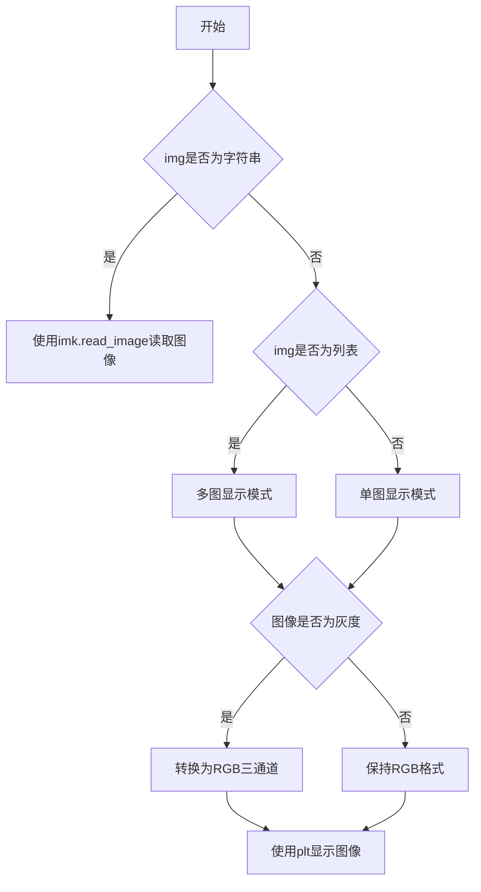
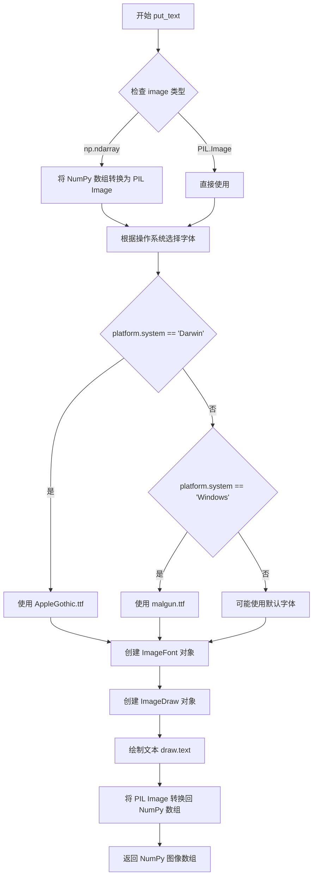

# `comic-translate\modules\ocr\pororo\utils\image_util.py` 详细设计文档

这是一个图像处理工具模块，提供图像显示和文本绘制功能，包含plt_imshow用于使用matplotlib显示图像（支持单图和多图显示，自动处理灰度到RGB的转换），以及put_text用于在图像上绘制文本（支持不同平台选择字体）

## 整体流程



## 类结构

```
无类定义（仅包含全局函数）
```

## 全局变量及字段


### `title`
    
图像显示的标题，默认为'image'

类型：`str`
    


### `img`
    
要显示的图像，支持字符串路径、图像列表或单个numpy数组

类型：`Union[str, list, np.ndarray]`
    


### `figsize`
    
图像 figure 的尺寸，默认为(8, 5)

类型：`tuple`
    


### `rgbImg`
    
转换为RGB格式的图像数组，用于显示

类型：`np.ndarray`
    


### `titles`
    
多图像显示时的标题列表

类型：`list`
    


### `image`
    
输入的图像数组，put_text函数的参数

类型：`np.ndarray`
    


### `text`
    
要添加到图像上的文本内容

类型：`str`
    


### `x`
    
文本添加的x坐标位置

类型：`int`
    


### `y`
    
文本添加的y坐标位置

类型：`int`
    


### `color`
    
文本颜色，默认为(0, 255, 0)绿色

类型：`tuple`
    


### `font_size`
    
字体大小，默认为22

类型：`int`
    


### `font`
    
根据操作系统选择的字体文件名

类型：`str`
    


### `image_font`
    
PIL字体对象，用于绘制文本

类型：`ImageFont.FreeTypeFont`
    


### `draw`
    
PIL图像绘制对象

类型：`ImageDraw.Draw`
    


### `numpy_image`
    
添加文本后转换回的numpy数组

类型：`np.ndarray`
    


    

## 全局函数及方法


### `plt_imshow`

该函数是一个用于显示图像的通用工具函数，支持单张图像或多张图像列表的显示，并自动处理灰度图到RGB的转换，适用于调试和可视化数据。

参数：

- `title`：`str`，图像的标题，默认为'image'；当img为列表时，若title为列表则一一对应，否则所有图像使用同一标题
- `img`：`str | list | np.ndarray | None`，要显示的图像，支持图像路径（str）、图像数组（np.ndarray）或图像列表（list），默认为None
- `figsize`：`tuple`，图形窗口大小，默认为(8, 5)

返回值：`None`，该函数无返回值，直接通过matplotlib显示图像

#### 流程图

```mermaid
flowchart TD
    A([开始]) --> B[plt.figure(figsize=figsize)]
    B --> C{img 是 str?}
    C -->|是| D[img = imk.read_image(img)]
    C -->|否| E{img 是 list?}
    D --> E
    E -->|是| F[处理标题列表]
    F --> G[遍历 img 列表]
    G --> H{len(img[i].shape) <= 2?}
    H -->|是| I[灰度图转RGB: rgbImg = np.stack([img[i], img[i], img[i]], axis=2)]
    H -->|否| J[rgbImg = img[i]]
    I --> K[plt.subplot(1, len(img), i+1), plt.imshow(rgbImg), plt.title(titles[i]), plt.xticks([]), plt.yticks([])]
    J --> K
    K --> L{遍历完成?}
    L -->|否| G
    L -->|是| M[plt.show()]
    E -->|否| N{len(img.shape) < 3?}
    N -->|是| O[灰度图转RGB: rgbImg = np.stack([img, img, img], axis=2)]
    N -->|否| P[rgbImg = img]
    O --> Q[plt.imshow(rgbImg), plt.title(title), plt.xticks([]), plt.yticks([])]
    P --> Q
    Q --> M
    M --> R([结束])
```

#### 带注释源码

```python
# import imkit as imk
# import numpy as np
# import platform
# from PIL import ImageFont, ImageDraw, Image
# from matplotlib import pyplot as plt


# def plt_imshow(title='image', img=None, figsize=(8, 5)):
#     plt.figure(figsize=figsize)

#     if type(img) is str:
#         img = imk.read_image(img)

#     if type(img) == list:
#         if type(title) == list:
#             titles = title
#         else:
#             titles = []

#             for i in range(len(img)):
#                 titles.append(title)

#         for i in range(len(img)):
#             if len(img[i].shape) <= 2:
#                 rgbImg = np.stack([img[i], img[i], img[i]], axis=2)  # Convert grayscale to RGB
#             else:
#                 rgbImg = img[i]  # Already in RGB format

#             plt.subplot(1, len(img), i + 1), plt.imshow(rgbImg)
#             plt.title(titles[i])
#             plt.xticks([]), plt.yticks([])

#         plt.show()
#     else:
#         if len(img.shape) < 3:
#             rgbImg = np.stack([img, img, img], axis=2)  # Convert grayscale to RGB
#         else:
#             rgbImg = img  # Already in RGB format

#         plt.imshow(rgbImg)
#         plt.title(title)
#         plt.xticks([]), plt.yticks([])
#         plt.show()
```


### `put_text`

该函数用于在图像上指定位置绘制文本，支持自定义文本内容、坐标、颜色和字体大小，并返回添加文本后的NumPy数组图像。

参数：

- `image`：`np.ndarray` 或 `PIL.Image`，输入图像，如果为NumPy数组则自动转换为PIL图像
- `text`：`str`，要添加的文本内容
- `x`：`int`，文本绘制位置的X坐标
- `y`：`int`，文本绘制位置的Y坐标
- `color`：`tuple`，文本颜色，默认为(0, 255, 0)绿色RGB格式
- `font_size`：`int`，字体大小，默认为22

返回值：`np.ndarray`，添加文本后的RGB格式图像数组

#### 流程图



#### 带注释源码

```python
def put_text(image, text, x, y, color=(0, 255, 0), font_size=22):
    """
    在图像上指定位置绘制文本
    
    参数:
        image: 输入图像，numpy数组或PIL Image对象
        text: 要添加的文本内容
        x: 文本位置的X坐标
        y: 文本位置的Y坐标
        color: 文本颜色，RGB元组，默认为绿色(0, 255, 0)
        font_size: 字体大小，默认为22
    
    返回:
        添加文本后的图像（numpy数组格式）
    """
    
    # 检查输入图像类型，如果是NumPy数组则转换为PIL Image
    # 这样可以统一处理流程，便于后续的图像绘制操作
    if type(image) == np.ndarray:
        # Image is already in RGB format, no conversion needed
        # 图像已是RGB格式，无需转换
        image = Image.fromarray(image)

    # 根据操作系统选择合适的中文字体
    # macOS使用AppleGothic字体，Windows使用malgun字体
    if platform.system() == 'Darwin':
        font = 'AppleGothic.ttf'
    elif platform.system() == 'Windows':
        font = 'malgun.ttf'

    # 创建指定大小的TrueType字体对象
    image_font = ImageFont.truetype(font, font_size)
    # 加载默认字体（此处代码存在问题：覆盖了前面设置的字体）
    font = ImageFont.load_default()
    # 创建图像绘制对象
    draw = ImageDraw.Draw(image)

    # 在指定位置绘制文本，使用自定义字体和颜色
    draw.text((x, y), text, font=image_font, fill=color)

    # 将PIL Image对象转换回NumPy数组
    numpy_image = np.array(image)
    # Return RGB image (no BGR conversion needed)
    # 返回RGB格式图像（无需BGR转换）
    return numpy_image
```


## 关键组件


### 图像显示模块 (plt_imshow)

使用 matplotlib 库显示图像的函数，支持单图和多图显示，自动将灰度图像转换为 RGB 格式，并支持自定义标题和图像大小。

### 图像文本渲染模块 (put_text)

使用 PIL 库在图像上绘制文本的函数，支持指定文本位置、颜色和字体大小，并根据操作系统自动选择合适的字体。

### 图像格式转换模块

提供 NumPy 数组与 PIL Image 对象之间的相互转换功能，确保不同图像处理库之间的数据格式兼容性。

### 灰度到 RGB 自动转换

自动检测图像维度，当图像为灰度图（维度 ≤ 2）时自动堆叠为三通道 RGB 图像，支持 plt_imshow 和 put_text 两个函数。

### 平台字体适配

根据操作系统类型（Darwin/Windows）自动选择对应的中文字体文件，解决跨平台文本渲染的字体兼容性问题。


## 问题及建议


### 已知问题

-   **代码全部被注释**：整个文件代码均被注释掉，函数无法调用，属于死代码
-   **缺少必要的导入语句**：代码依赖 `imkit`、`numpy`、`PIL`、`matplotlib` 等库，但导入语句同样被注释，如 `imkit` 模块不存在将导致运行时错误
-   **类型检查方式不推荐**：使用 `type(x) == list` 而非 `isinstance(x, list)`，不利于继承层次结构
-   **字体支持不完整**：`put_text` 函数仅支持 macOS (AppleGothic.ttf) 和 Windows (malgun.ttf)，Linux 系统无字体回退方案，且字体文件路径硬编码缺乏异常处理
-   **重复代码逻辑**：`plt_imshow` 函数中图像转 RGB 的逻辑在列表和单图分支中重复实现
-   **未使用的变量**：`put_text` 中加载了默认字体 `font = ImageFont.load_default()` 但从未使用
-   **无错误处理**：两个函数均缺乏异常捕获机制，文件路径错误、图像格式错误等情况会导致程序崩溃
-   **缺乏类型注解**：函数参数和返回值均无类型提示，降低代码可维护性
-   **魔法数字**：如 `font_size=22`、`(1, len(img), i + 1)` 等硬编码值缺乏解释

### 优化建议

-   取消注释使代码可用，或移除死代码以保持代码库整洁
-   统一使用 `isinstance()` 进行类型检查
-   为 `put_text` 添加 Linux 字体路径或提供默认回退字体方案，增加字体加载失败的异常处理
-   提取图像转 RGB 的公共逻辑为独立辅助函数，减少重复代码
-   为两个函数添加 try-except 块，捕获文件读取、图像处理等可能的异常
-   添加完整的类型注解和文档字符串，说明函数用途、参数和返回值
-   将字体大小、颜色等可配置参数提取为常量或配置文件

## 其它


### 设计目标与约束

本代码旨在提供图像显示和文本标注的辅助功能，支持在图像上叠加文字以及多图展示。设计约束包括：依赖matplotlib进行可视化、PIL进行图像处理、numpy进行数组操作；需兼容Windows和macOS平台的字体差异；图像格式统一转换为RGB以确保显示一致性。

### 错误处理与异常设计

代码缺少异常处理机制，存在以下风险点：字体文件路径可能不存在导致ImageFont.truetype抛出异常；图像数据类型不符合预期可能导致处理失败；平台判断分支仅覆盖Darwin和Windows，Linux系统会因缺少字体文件而报错。建议增加try-except块捕获FileNotFoundError、TypeError、ValueError等异常，并设置合理的默认降级方案（如使用默认字体）。

### 外部依赖与接口契约

本代码依赖以下外部库：imkit（图像读取）、numpy（数组操作）、PIL/illow（图像处理与字体渲染）、matplotlib（可视化展示）、platform（系统检测）。接口契约要求：输入图像须为numpy数组或文件路径字符串；文本坐标须为整数；字体大小须为正整数；颜色须为RGB元组。

### 性能考虑

当前实现中，每次调用plt_imshow都会创建新的figure；图像格式转换（灰度转RGB）会创建新的numpy数组；多图展示时循环内重复创建subplot。建议：对于频繁调用场景，可复用figure对象；使用numpy的视图操作代替复制；预先判断图像格式避免重复转换。

### 安全性考虑

put_text函数中字体路径直接拼接系统名称，未验证字体文件实际存在性，可能导致安全风险（如符号链接攻击）。建议：增加字体文件存在性校验；提供字体路径白名单机制；避免使用用户可控的路径输入。

### 可测试性设计

当前代码难以进行单元测试，因其直接操作全局状态和外部库。建议重构为类封装，引入依赖注入；为plt_imshow和put_text设计纯函数形式的核心逻辑，隔离副作用；编写针对边界条件（空图像、无效类型、极端坐标）的测试用例。

### 跨平台兼容性

平台判断逻辑仅覆盖Darwin和Windows，Linux系统未处理；字体文件名硬编码（如malgun.ttf、AppleGothic.ttf）可能在不同发行版不存在。建议：扩展平台检测逻辑包含Linux；使用fontconfig或系统默认字体；提供字体路径配置接口。

### 日志与调试支持

代码缺乏日志记录，无法追踪执行流程和定位问题。建议在关键节点添加日志：函数入口记录输入参数；异常发生前记录错误上下文；平台判断时记录选择的字体路径。可使用Python标准库logging模块实现。

### 配置管理

字体路径、默认字号、颜色默认值均硬编码在函数内部，缺乏灵活性。建议：提取为模块级配置字典或独立配置文件；支持运行时参数覆盖；提供配置验证机制防止无效值。

### 版本兼容性

代码依赖库的版本兼容性未明确说明。numpy数组操作在版本间可能有细微差异；PIL已更名为Pillow，需确认兼容版本；matplotlib的pyplot接口相对稳定但subplot参数在不同版本有细微变化。建议在文档中明确支持的最低版本。

### 代码质量与重构建议

当前代码存在重复逻辑（灰度图转RGB的代码块出现两次）；注释掉的导入和函数表明代码可能处于废弃状态或未完成开发；函数职责不单一（plt_imshow既处理单图又处理多图）。建议：消除重复代码，提取公共转换函数；确认代码实际用途，清理注释掉的死代码；考虑职责分离，将单图和多图处理拆分为独立函数。


    