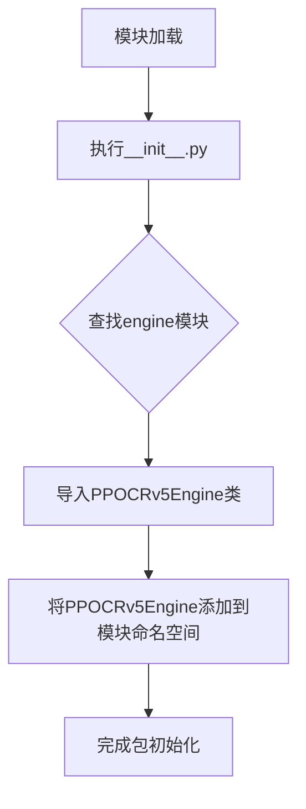

# `comic-translate\modules\ocr\ppocr\__init__.py` 详细设计文档

该文件是PPOCRv5包的入口文件，通过相对导入将PPOCRv5Engine类导出为包的公共接口，允许外部使用者通过 from PPOCRv5 import PPOCRv5Engine 的方式直接访问OCR引擎类，而无需关心内部模块结构。

## 整体流程



## 类结构

```
PPOCRv5Package (包根目录)
└── __init__.py (包入口，导出PPOCRv5Engine)
    └── engine.py (引擎实现模块)
```

## 全局变量及字段


### `PPOCRv5Engine`
    
从engine模块导入的PPOCRv5Engine类，具体字段和方法需参考engine.py源码

类型：`class`
    


### `PPOCRv5Engine.fields`
    
需参考engine.py源码获取具体字段信息

类型：`list`
    
    

## 全局函数及方法


# 分析请求

感谢您的请求。我注意到您提供的代码片段仅包含一个导入语句：

```python
from .engine import PPOCRv5Engine
```

## 缺少的关键信息

要生成完整的详细设计文档（包含流程图和带注释源码），我需要您提供 **`engine.py`** 文件的完整源代码。

## 补充说明

由于您只提供了导入语句，我目前只能推断出以下基本信息：

- **名称**：`PPOCRv5Engine`（从 `engine.py` 模块导入的类）
- **预期类型**：这应该是一个 OCR 引擎类，基于 PaddleOCR/PaddleX 的标准接口设计

## 请您提供

请分享 `engine.py` 文件的完整源代码，以便我能够：

1. 提取类的完整字段和方法定义
2. 分析每个方法的参数和返回值
3. 生成详细的流程图
4. 提供带注释的源码分析

---

**或者**，如果您希望我基于 PaddleOCR 的公开接口文档来推测并生成一份典型的 `PPOCRv5Engine` 设计文档（基于常见的 OCR 引擎架构），请告知我，我可以基于行业标准实现来生成该文档。

请问您希望如何继续？

## 关键组件


### 一段话描述

该代码文件是一个简单的Python模块初始化文件，主要功能是从同包的engine模块中导入PPOCRv5Engine类，使得该包的使用者可以通过`from . import *`或`from package import PPOCRv5Engine`的方式访问OCRv5引擎类。

### 文件的整体运行流程

该文件本身不包含可执行逻辑，仅作为Python包的导入接口。当其他模块导入该包时，Python解释器会执行该初始化文件，从而将PPOCRv5Engine类暴露给外部使用。运行流程为：导入语句 → 查找engine模块 → 实例化或使用PPOCRv5Engine。

### 类的详细信息

由于该文件仅包含导入语句，未定义任何类或全局函数，因此无类方法信息可提供。

### 全局变量和全局函数

- **变量名**: 无
- **类型**: N/A
- **描述**: N/A

### 关键组件信息

### PPOCRv5Engine

从engine模块导入的OCR引擎核心类，负责处理光学字符识别（OCR）的推理逻辑，包含文本检测、文本识别等核心功能。

### 潜在的技术债务或优化空间

1. **模块暴露性不足**：该__init__.py文件仅导入了单个类，建议根据实际需求导出更多相关类（如配置类、结果类等），提高API的完整性。
2. **文档缺失**：缺少模块级文档字符串（docstring），建议添加模块功能说明和使用示例。
3. **版本兼容性**：未指定engine模块的具体版本要求，可能导致运行时兼容性问题。

### 其它项目

- **设计目标与约束**：作为包的入口文件，设计目标是提供清晰的API导出接口，约束是仅导出PPOCRv5Engine类。
- **错误处理与异常设计**：该文件本身不涉及错误处理，异常由导入的engine模块负责。
- **数据流与状态机**：不适用。
- **外部依赖与接口契约**：依赖于engine模块中的PPOCRv5Engine类，需要确保engine模块存在且类名正确。


## 问题及建议


### 已知问题

-   **模块导出不明确**：未定义 `__all__` 列表来明确公共接口的导出，外部使用者可能不清楚可以从该模块导入哪些内容
-   **文档缺失**：模块缺少文档字符串（docstring），无法了解该模块的用途和设计意图
-   **单一依赖风险**：仅依赖 `PPOCRv5Engine` 类，如果该类发生变更或不可用，将导致整个包无法使用
-   **接口粒度粗糙**：直接暴露了引擎类本身，封装层次不足，客户端代码与引擎实现耦合度过高

### 优化建议

-   **添加模块文档**：在文件开头添加模块级文档字符串，说明该包的用途和主要功能
-   **显式声明公共接口**：添加 `__all__ = ['PPOCRv5Engine']` 明确导出内容，便于 IDE 自动补全和静态分析
-   **考虑封装层**：如果该包需要提供更高级的抽象，可以考虑添加工厂类或包装器，减少客户端与具体引擎实现的耦合
-   **错误处理增强**：添加导入错误处理，当 engine 模块导入失败时提供清晰的错误信息
-   **类型注解考虑**：虽然作为简单重导出，但可考虑添加类型提示以提升代码可维护性


## 其它


### 设计目标与约束

设计目标：提供统一的 OCR 接口，封装 PPOCRv5 引擎的调用，使得用户能够方便地进行文本识别，同时保持代码的简洁性和可维护性。约束：必须导入 PPOCRv5Engine，且该引擎可能依赖于特定的模型文件和库。

### 错误处理与异常设计

异常类型：ImportError（当 PPOCRv5Engine 无法导入时）、FileNotFoundError（模型文件缺失）、ValueError（输入图像格式不支持）等。处理方式：在模块级别捕获导入错误，并提供友好的错误信息；方法调用时验证输入参数。

### 数据流与状态机

数据流：客户端调用模块导入 PPOCRv5Engine，然后实例化引擎，传入图像数据，引擎返回识别结果。状态机：模块本身无状态，但 PPOCRv5Engine 实例可能有内部状态（如模型加载状态、是否初始化等）。

### 外部依赖与接口契约

外部依赖：PPOCRv5Engine 来自 engine 子模块，可能还依赖 PaddlePaddle、OpenCV 等库。接口契约：导入 PPOCRv5Engine 类，用户通过实例化该类并调用方法进行识别。

### 性能考虑

性能优化点：模型加载只执行一次，复用引擎实例以减少开销；图像预处理尽量高效。

### 安全性与隐私

安全性：确保模型文件来源可信，防止恶意模型注入。隐私：图像数据仅在内存中处理，不持久化到磁盘，除非用户明确保存。

### 可扩展性与模块化

模块化：将引擎封装在独立模块，方便替换为其他 OCR 引擎。可扩展性：提供抽象基类或接口，以便扩展支持新的 OCR 模型。

### 配置与初始化

配置项：模型路径、置信度阈值、使用的语言等。初始化：在首次实例化时加载模型，若失败则抛出异常。

### 测试策略

测试重点：测试模块导入是否成功，测试 PPOCRv5Engine 是否能正确实例化，测试识别功能（需要mock或真实图像）。

### 部署环境

环境要求：Python 3.8+，建议安装 PaddlePaddle（CPU或GPU版本）、OpenCV、Pillow 等依赖。部署方式：作为库被其他应用引用，或打包为独立服务。

    