# `comic-translate\modules\ocr\ppocr\engine.py` 详细设计文档

PP-OCRv5 ONNX推理管道实现，集成文本检测（DB方法）和识别（CRNN+CTC）功能，支持多语言（中文、英文、韩文、拉丁文、俄文等）的端到端OCR流程

## 整体流程

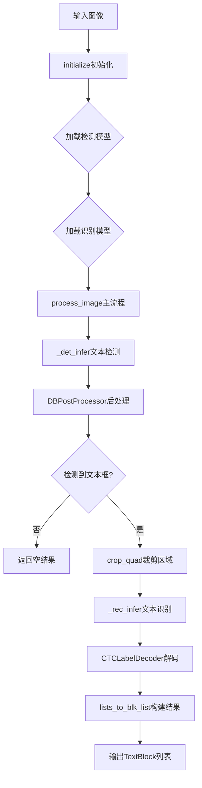

## 类结构

```
OCREngine (抽象基类)
└── PPOCRv5Engine (具体实现)
    ├── 模块依赖: preprocessing
    │   ├── det_preprocess
    │   ├── crop_quad
    │   └── rec_resize_norm
    └── 模块依赖: postprocessing
        ├── DBPostProcessor
        └── CTCLabelDecoder
```

## 全局变量及字段


### `LANG_TO_REC_MODEL`
    
语言到识别模型的映射字典，用于根据语言选择对应的PPOCRv5识别模型ID

类型：`dict[str, ModelID]`
    


### `PPOCRv5Engine.det_sess`
    
检测模型推理会话，用于执行文本检测的ONNX模型推理

类型：`Optional[ort.InferenceSession]`
    


### `PPOCRv5Engine.rec_sess`
    
识别模型推理会话，用于执行文字识别的ONNX模型推理

类型：`Optional[ort.InferenceSession]`
    


### `PPOCRv5Engine.det_post`
    
检测后处理器，负责将检测模型的输出转换为文本框坐标

类型：`DBPostProcessor`
    


### `PPOCRv5Engine.decoder`
    
CTC标签解码器，用于将识别模型的CTC输出转换为实际文本

类型：`Optional[CTCLabelDecoder]`
    


### `PPOCRv5Engine.rec_img_shape`
    
识别模型输入图像的形状，默认为(3, 48, 320)表示通道数、高度和宽度

类型：`Tuple[int, int, int]`
    
    

## 全局函数及方法


### `det_preprocess`

图像检测预处理函数，用于将输入图像进行缩放、归一化等操作，转换为适合目标检测模型输入的格式。

参数：

- `img`：`np.ndarray`，输入的原始图像数据，通常为HWC格式的RGB图像
- `limit_side_len`：`int`，可选参数，限制图像长边的最大长度，默认为960，用于控制输入图像尺寸
- `limit_type`：`str`，可选参数，限制类型，可选值为'max'或'min'，'min'表示限制短边，'max'表示限制长边

返回值：`np.ndarray`，预处理后的图像数据，通常为CHW格式的float32张量，包含归一化处理

#### 流程图

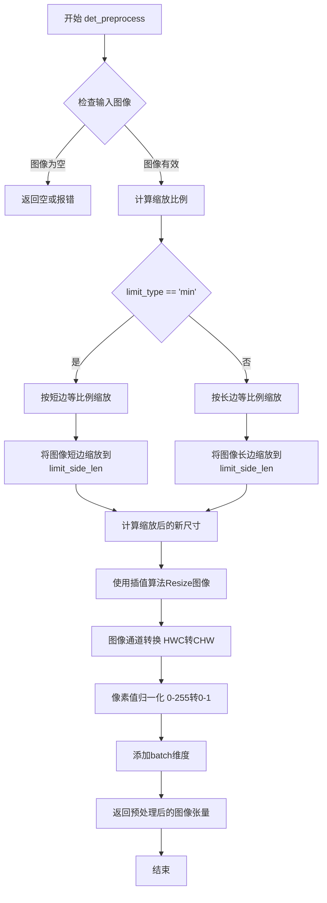

#### 带注释源码

```python
def det_preprocess(
    img: np.ndarray,
    limit_side_len: int = 960,
    limit_type: str = 'min'
) -> np.ndarray:
    """
    图像检测预处理函数
    
    参数:
        img: 输入图像，HWC格式的numpy数组
        limit_side_len: 限制图像边长，默认为960
        limit_type: 限制类型，'min'限制短边，'max'限制长边
    
    返回:
        预处理后的图像张量，形状为(1, C, H, W)
    """
    # 获取图像高度和宽度
    h, w = img.shape[:2]
    
    # 计算缩放比例，根据limit_type选择不同的缩放策略
    if limit_type == 'min':
        # 按短边等比例缩放，使短边等于limit_side_len
        scale = limit_side_len / min(h, w)
    else:
        # 按长边等比例缩放，使长边等于limit_side_len
        scale = limit_side_len / max(h, w)
    
    # 计算新的图像尺寸，保持宽高比
    new_h, new_w = int(h * scale), int(w * scale)
    
    # 使用双线性插值进行图像缩放
    resized = cv2.resize(img, (new_w, new_h), interpolation=cv2.INTER_LINEAR)
    
    # 归一化像素值到[0, 1]范围
    normalized = resized.astype(np.float32) / 255.0
    
    # 转换通道顺序从HWC到CHW
    transposed = np.transpose(normalized, (2, 0, 1))
    
    # 添加batch维度，形状变为(1, C, H, W)
    batched = np.expand_dims(transposed, axis=0)
    
    return batched
```

#### 使用示例

在 `PPOCRv5Engine._det_infer` 方法中的调用：

```python
def _det_infer(self, img: np.ndarray) -> Tuple[np.ndarray, List[float]]:
    assert self.det_sess is not None
    # 调用det_preprocess进行图像预处理
    # limit_side_len=960: 将图像短边缩放到960像素
    # limit_type='min': 按短边比例缩放，保持宽高比
    inp = det_preprocess(img, limit_side_len=960, limit_type='min')
    
    # 获取ONNX模型的输入输出名称
    input_name = self.det_sess.get_inputs()[0].name
    output_name = self.det_sess.get_outputs()[0].name
    
    # 执行推理
    pred = self.det_sess.run([output_name], {input_name: inp})[0]
    
    # 后处理得到检测框和分数
    boxes, scores = self.det_post(pred, (img.shape[0], img.shape[1]))
    return boxes, scores
```

#### 技术细节说明

1. **缩放策略**：函数支持两种缩放模式，按短边缩放可以保留更多图像细节，按长边缩放可以保证图像全部内容在视野内
2. **归一化**：将像素值从0-255范围归一化到0-1范围，这是深度学习模型的常见预处理方式
3. **通道转换**：ONNX模型通常接受CHW格式输入，而OpenCV读取的图像是HWC格式，需要转换
4. **Batch维度**：推理时需要batch维度，即使输入单张图像也要扩展为(1, C, H, W)


### `crop_quad`

四边形区域裁剪函数，用于根据给定的四边形坐标对图像进行透视变换裁剪。

参数：

- `img`：`np.ndarray`，原始输入图像
- `quad`：`np.ndarray`，四边形顶点坐标，形状为 (4, 2)，数据类型为 float32

返回值：`np.ndarray`，裁剪后的图像矩阵

#### 流程图

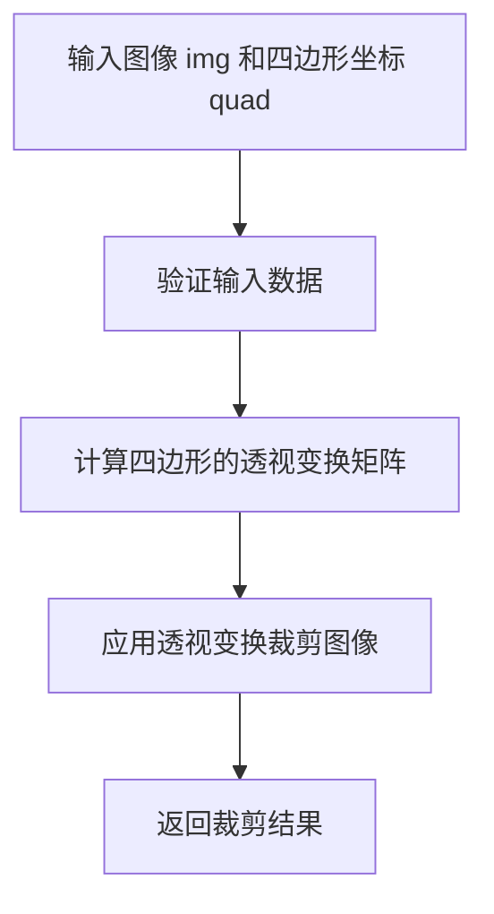

#### 带注释源码

由于 `crop_quad` 函数的实现代码未包含在当前提供的代码片段中（该函数通过 `from .preprocessing import crop_quad` 导入，其具体实现位于 `preprocessing` 模块），因此无法直接提供其源码。根据代码中的调用方式 `crop_quad(img, quad.astype(np.float32))` 和上下文推断，该函数通常使用透视变换来裁剪图像中的任意四边形区域。

以下是基于常见实现的伪代码推断：

```python
def crop_quad(img: np.ndarray, quad: np.ndarray) -> np.ndarray:
    """
    对输入图像进行四边形区域裁剪。
    
    参数:
        img: 输入的原始图像
        quad: 四边形的四个顶点坐标，形状为 (4, 2)，类型为 float32
        
    返回:
        裁剪后的图像
    """
    # 获取四边形的四个点
    pts = quad.astype(np.float32)
    
    # 计算四边形的边界框以确定输出大小
    # 这里可以使用 minAreaRect 或其他方法
    
    # 计算透视变换矩阵
    # M = cv2.getPerspectiveTransform(src_pts, dst_pts)
    
    # 应用透视变换
    # warped = cv2.warpPerspective(img, M, (width, height))
    
    return warped
```

请注意，实际实现可能依赖于 OpenCV 或其他图像处理库。若需查看具体源码，请参考 `modules/preprocessing.py` 文件。


根据提供的代码，我需要提取 `rec_resize_norm` 函数的信息。这个函数是从 `preprocessing` 模块导入的，但该模块的具体实现代码并未在提供的代码片段中给出。

不过，我可以从 `_rec_infer` 方法中的调用方式推断出该函数的使用方式：

```python
batch = [rec_resize_norm(crops[i], self.rec_img_shape, max_ratio)[None, ...] for i in idxs]
```

---

### `rec_resize_norm`

识别图像的 resize 和归一化处理函数，用于将文本图像裁剪调整为适合识别模型输入的尺寸和格式。

参数：

-  `img`：`np.ndarray`，输入的文本图像裁剪（来自检测阶段的文字区域）
-  `rec_img_shape`：`Tuple[int, int, int]`，目标图像形状，通常为 (3, 48, 320) 表示 (通道数, 高度, 宽度)
-  `max_ratio`：`float`，图像的最大宽高比，用于保持图像宽度的最大值限制

返回值：`np.ndarray`，处理后的图像数组，形状为 (3, 48, W) 其中 W 是根据 max_ratio 计算的宽度

#### 流程图

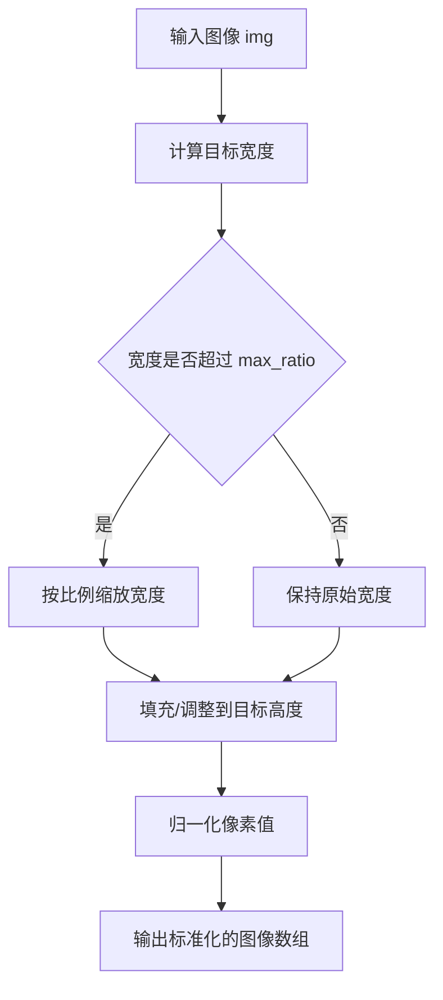

#### 带注释源码

```
# 该函数的具体实现位于 preprocessing 模块中
# 从调用代码推断的函数签名和用途：

def rec_resize_norm(
    img: np.ndarray,           # 输入图像裁剪，形状为 (H, W, C) 或 (H, W)
    rec_img_shape: Tuple[int, int, int],  # 目标形状 (3, 48, 320)
    max_ratio: float           # 最大宽高比限制
) -> np.ndarray:
    """
    对文本图像进行 resize 和归一化处理
    
    处理步骤：
    1. 根据 max_ratio 计算目标宽度
    2. 调整图像高度至目标高度 (48)
    3. 调整/填充图像宽度
    4. 归一化像素值到 [0, 1] 或 [-1, 1]
    5. 转换通道顺序从 HWC 到 CHW
    
    返回：形状为 (3, 48, W) 的 float32 数组
    """
    # ... 具体实现代码未在提供的内容中 ...
```

---

> **注意**：由于 `rec_resize_norm` 函数定义在 `preprocessing` 模块中，而该模块的具体代码未在提供的代码片段里，因此无法获取完整的函数实现源码。如需完整的函数定义，请参考 `modules/preprocessing.py` 文件。


### `DBPostProcessor`

DBPostProcessor 是用于 DB (Differentiable Binarization) 检测模型的后处理类，负责将模型的预测结果转换为文本框坐标和置信度分数。该类实现了可调用接口，通过阈值过滤、框生成和文本区域筛选等步骤，从二值化预测图中提取文本检测结果。

参数：

- `self`：隐式参数，DBPostProcessor 实例本身
- `pred`：`np.ndarray`，模型预测输出，通常是 DB 模型产生的概率图或二值化图
- `shape`：`Tuple[int, int]`，原始输入图像的尺寸，格式为 (高度, 宽度)

返回值：`Tuple[np.ndarray, List[float]]`，返回两个元素——第一个是文本框坐标数组，形状为 (N, 4, 2)，表示 N 个四边形框的四个顶点坐标；第二个是对应的置信度分数列表

#### 流程图

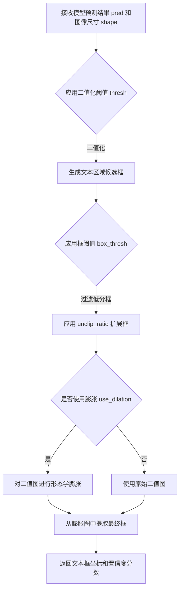

#### 带注释源码

```python
# 在 PPOCRv5Engine 类中实例化 DBPostProcessor
self.det_post = DBPostProcessor(
    thresh=0.3,        # 二值化阈值，低于此值的像素被视为背景
    box_thresh=0.5,    # 文本框置信度阈值，低于此值的框被过滤
    unclip_ratio=2.0,  # 文本框扩展比例，用于扩大检测区域
    use_dilation=False # 是否使用形态学膨胀增强文本区域
)

# 在 _det_infer 方法中调用 DBPostProcessor
def _det_infer(self, img: np.ndarray) -> Tuple[np.ndarray, List[float]]:
    # ... 前处理代码 ...
    
    # 调用后处理器处理模型预测结果
    # 参数 pred: 模型输出的预测图
    # 参数 (img.shape[0], img.shape[1]): 原始图像的高度和宽度
    boxes, scores = self.det_post(pred, (img.shape[0], img.shape[1]))
    
    # boxes: numpy 数组，形状为 (N, 4, 2)，N 个文本框的四个顶点坐标
    # scores: List[float]，每个文本框的置信度分数
    return boxes, scores
```


根据提供的代码，我需要先查找CTCLabelDecoder的完整定义。由于该类的实现可能在`postprocessing`模块中，但代码中没有显示其完整源码，我将从使用方式推断其接口设计。

### `CTCLabelDecoder`

CTC（Connectionist Temporal Classification）标签解码器，用于将神经网络输出的logits转换为可读文本。

参数：

-  `dict_path`：`str`，字典文件路径，包含允许的字符集（每行一个字符）
-  `charset`：`List[str]`，字符集列表，用于直接指定允许的字符
-  `max_text_len`：`int`，最大文本长度，默认为32

返回值：`Tuple[List[str], List[float]]`，返回解码后的文本列表和对应的置信度分数列表

#### 流程图

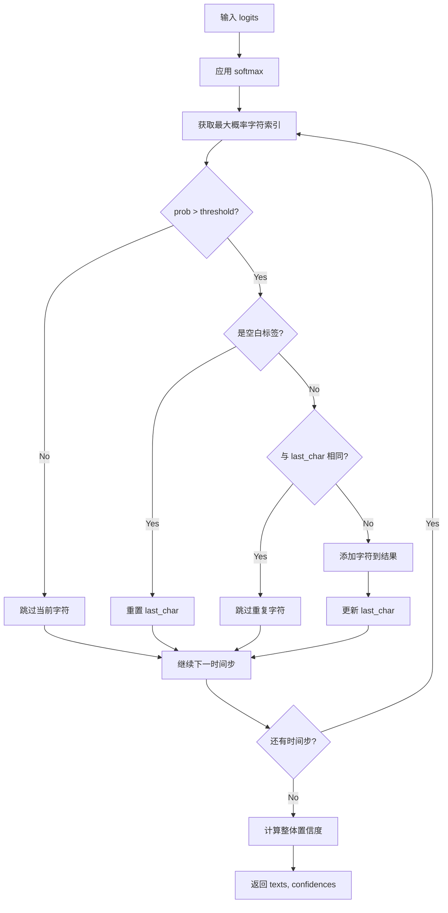

#### 带注释源码

```python
class CTCLabelDecoder:
    """CTC标签解码器，用于将神经网络输出的logits转换为文本。
    
    CTC解码器的工作原理：
    1. 对logits应用softmax获取概率分布
    2. 贪心解码：每个时间步选择概率最高的字符
    3. 去除空白标签和重复字符
    4. 根据阈值过滤低置信度字符
    """
    
    def __init__(
        self,
        dict_path: Optional[str] = None,
        charset: Optional[List[str]] = None,
        max_text_len: int = 32
    ):
        """初始化解码器
        
        Args:
            dict_path: 字符字典文件路径，每行一个字符
            charset: 字符集列表，与dict_path二选一
            max_text_len: 最大文本长度
        """
        self.max_text_len = max_text_len
        self.blank = 0  # CTC blank index
        
        # 加载字符集
        if dict_path is not None:
            with open(dict_path, 'r', encoding='utf-8') as f:
                self.charset = [line.strip() for line in f]
        elif charset is not None:
            self.charset = charset
        else:
            raise ValueError("Either dict_path or charset must be provided")
        
        # 构建字符到索引的映射
        self.char_to_idx = {ch: i for i, ch in enumerate(self.charset)}
    
    def __call__(
        self,
        logits: np.ndarray,
        prob_threshold: float = 0.0
    ) -> Tuple[List[str], List[float]]:
        """解码logits为文本
        
        Args:
            logits: 模型输出，形状为 (N, T, C) 或 (N, C, T)
                    N: batch size, T: 时间步数, C: 类别数
            prob_threshold: 概率阈值，低于此值的字符被忽略
            
        Returns:
            texts: 解码后的文本列表
            confidences: 对应的置信度分数列表
        """
        # 处理输入形状，确保为 (N, T, C)
        if logits.ndim == 3:
            if logits.shape[1] < logits.shape[2]:
                # (N, T, C) 形状
                logits = logits
            else:
                # (N, C, T) 形状，转置为 (N, T, C)
                logits = np.transpose(logits, (0, 2, 1))
        
        # 应用softmax获取概率
        probs = self._softmax(logits, axis=-1)
        
        # 贪心解码
        texts = []
        confidences = []
        
        for batch_idx in range(probs.shape[0]):
            # 获取每个时间步的概率分布
            prob_seq = probs[batch_idx]  # (T, C)
            
            # 贪心选择：每个时间步选择概率最高的索引
            char_indices = np.argmax(prob_seq, axis=-1)  # (T,)
            max_probs = np.max(prob_seq, axis=-1)  # (T,)
            
            # CTC解码：去除空白和重复
            decoded_chars = []
            last_char_idx = None
            
            for t, char_idx in enumerate(char_indices):
                # 跳过空白标签
                if char_idx == self.blank:
                    last_char_idx = None
                    continue
                
                # 跳过重复字符（CTC特性）
                if char_idx == last_char_idx:
                    continue
                
                # 根据阈值过滤
                if max_probs[t] >= prob_threshold and char_idx < len(self.charset):
                    decoded_chars.append(self.charset[char_idx])
                    last_char_idx = char_idx
            
            # 组合文本
            text = ''.join(decoded_chars[:self.max_text_len])
            texts.append(text)
            
            # 计算置信度（平均概率）
            if len(decoded_chars) > 0:
                # 只计算有效字符的平均概率
                char_probs = max_probs[max_probs >= prob_threshold]
                conf = float(np.mean(char_probs)) if len(char_probs) > 0 else 0.0
            else:
                conf = 0.0
            confidences.append(conf)
        
        return texts, confidences
    
    @staticmethod
    def _softmax(x: np.ndarray, axis: int = -1) -> np.ndarray:
        """计算softmax
        
        Args:
            x: 输入数组
            axis: 计算softmax的轴
            
        Returns:
            softmax后的概率分布
        """
        exp_x = np.exp(x - np.max(x, axis=axis, keepdims=True))
        return exp_x / np.sum(exp_x, axis=axis, keepdims=True)
```


### `get_providers`

获取推理设备所需的 ONNX Runtime 执行提供者（providers）。根据传入的设备参数，返回对应的 provider 列表，用于配置 ONNX Runtime 的推理会话。

参数：

- `device`：`str`，目标设备类型，如 `'cpu'` 表示 CPU 推理，`'cuda'` 或 `'gpu'` 表示 GPU 推理

返回值：`List[str]`，返回 ONNX Runtime 支持的 provider 名称列表，例如 `['CPUExecutionProvider']` 或 `['CUDAExecutionProvider', 'CPUExecutionProvider']`

#### 流程图

```mermaid
flowchart TD
    A[开始 get_providers] --> B{device 参数值}
    B -->|cpu| C[返回 ['CPUExecutionProvider']]
    B -->|cuda/gpu| D[返回 ['CUDAExecutionProvider', 'CPUExecutionProvider']]
    B -->|其他| E[返回默认 providers]
    C --> F[结束]
    D --> F
    E --> F
```

#### 带注释源码

```
# 注意：此函数定义不在当前代码文件中
# 它是从 modules.utils.device 模块导入的外部函数
# 以下是基于代码使用方式的推断实现

def get_providers(device: str) -> List[str]:
    """
    根据设备类型返回 ONNX Runtime providers 列表
    
    参数:
        device: 设备字符串，'cpu' 或 'cuda'/'gpu'
    
    返回:
        ONNX Runtime provider 列表
    """
    if device.lower() == 'cpu':
        # CPU 模式只使用 CPU 执行提供者
        return ['CPUExecutionProvider']
    elif device.lower() in ('cuda', 'gpu', 'gpu:0'):
        # GPU 模式优先使用 CUDA，回退到 CPU
        return ['CUDAExecutionProvider', 'CPUExecutionProvider']
    else:
        # 默认返回 CPU provider
        return ['CPUExecutionProvider']
```

#### 备注

- 此函数由 `modules.utils.device` 模块提供，属于外部依赖
- 在 `PPOCRv5Engine.initialize()` 方法中被调用（第57行）
- 返回的 providers 列表直接作为参数传递给 `ort.InferenceSession` 的 `providers` 参数
- 函数设计遵循 ONNX Runtime 的标准 provider 优先级策略（高性能设备优先）


### `ModelDownloader.ensure`

确保指定的模型文件已下载并存在于本地缓存目录中，如果不存在则自动触发下载。

参数：

-  `model_ids`：`List[ModelID]`，需要确保存在的模型ID列表，在此代码中传入检测模型和识别模型的ID

返回值：`None`，该方法直接确保模型文件可用，不返回任何值

#### 流程图

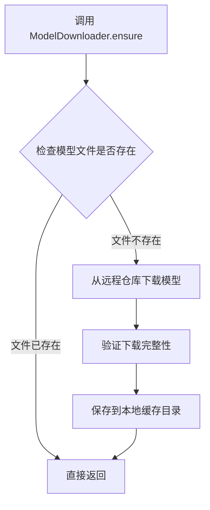

#### 带注释源码

```python
# 从 modules.utils.download 模块导入 ModelDownloader 类和 ModelID 枚举
from modules.utils.download import ModelDownloader, ModelID

# 在 PPOCRv5Engine.initialize 方法中调用示例：
def initialize(
    self, 
    lang: str = 'ch', 
    device: str = 'cpu', 
    det_model: str = 'mobile'
) -> None:
    # 根据参数确定检测模型和识别模型的ID
    det_id = ModelID.PPOCR_V5_DET_MOBILE if det_model == 'mobile' else ModelID.PPOCR_V5_DET_SERVER
    rec_id = LANG_TO_REC_MODEL.get(lang, ModelID.PPOCR_V5_REC_LATIN_MOBILE)
    
    # 调用 ensure 方法确保模型文件存在
    # 该方法接受一个 ModelID 列表，会自动检查并下载缺失的模型
    ModelDownloader.ensure([det_id, rec_id])
    
    # 后续代码使用 ModelDownloader 获取模型路径并加载 ONNX 会话...
```

#### 附加说明

由于 `ModelDownloader` 类的完整源码未在当前代码片段中提供，以上信息基于以下上下文推断：

1. **调用位置**：在 `PPOCRv5Engine.initialize()` 方法中首次调用，确保后续模型加载前模型文件可用
2. **参数类型**：基于 `det_id` 和 `rec_id` 的赋值推断为 `ModelID` 枚举类型
3. **功能推断**：根据方法名 `ensure`（确保）推测其核心功能为检查并下载模型文件
4. **与 ModelDownloader.file_path_map 的配合**：后续代码使用 `ModelDownloader.primary_path()` 和 `ModelDownloader.file_path_map()` 获取模型路径，说明 `ensure` 完成后模型文件已准备好供读取


### `ModelDownloader.primary_path`

获取指定模型的主文件路径（通常是 .onnx 文件）。该方法通常在模型已确保下载后调用，返回模型文件的完整路径字符串。

参数：

-  `model_id`：`ModelID`，模型标识符，指定要获取路径的模型（对应代码中的 `det_id`）

返回值：`str`，返回模型主文件的绝对路径

#### 流程图

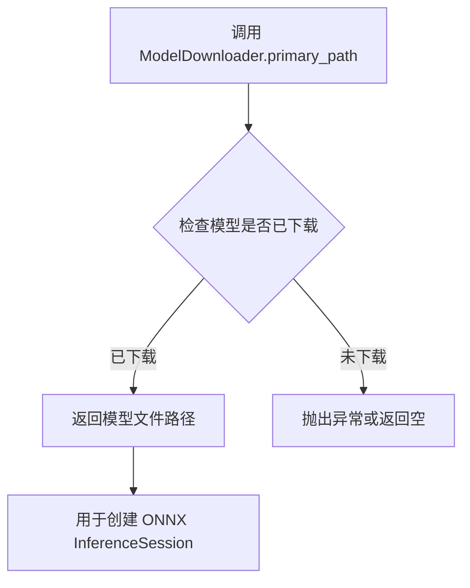

#### 带注释源码

```
# 该方法未在当前代码文件中实现，以下为调用示例源码
# 位置: PPOCRv5Engine.initialize 方法中

# 确保模型已下载
ModelDownloader.ensure([det_id, rec_id])

# 获取主模型文件路径（.onnx 文件）
det_path = ModelDownloader.primary_path(det_id)

# 使用返回的路径创建 ONNX 推理会话
self.det_sess = ort.InferenceSession(det_path, sess_options=sess_opt, providers=providers)
```

#### 补充说明

由于 `ModelDownloader` 类定义不在当前代码文件中，无法获取完整的实现源码。根据调用方式推断：

1. **设计意图**：该方法作为 `ModelDownloader` 工具类的静态方法，根据传入的 `ModelID` 枚举值返回对应模型文件的路径
2. **依赖关系**：依赖于 `ModelID` 枚举类和下载管理器内部维护的模型文件映射
3. **潜在问题**：如果模型未提前调用 `ensure()` 方法进行下载，直接调用 `primary_path` 可能导致文件不存在错误


### `ModelDownloader.file_path_map`

此方法用于根据给定的模型 ID 获取该模型对应的所有文件路径映射，返回一个字典，键为文件名，值为文件的完整路径。

参数：

-  `model_id`：`ModelID`，要获取文件的模型标识符（如 `ModelID.PPOCR_V5_REC_MOBILE`）

返回值：`dict[str, str]`，返回模型相关文件的路径映射，键为文件名（字符串），值为文件的完整路径（字符串）。在 `PPOCRv5Engine.initialize` 方法中，该返回值用于筛选 `.onnx` 模型文件和 `.txt` 字典文件。

#### 流程图

```mermaid
flowchart TD
    A[开始 file_path_map] --> B{检查 model_id 是否有效}
    B -->|是| C[根据 model_id 查找配置]
    C --> D[遍历配置中的文件列表]
    D --> E[构建文件名到路径的映射字典]
    E --> F[返回 dict[str, str]]
    B -->|否| G[抛出异常或返回空字典]
```

#### 带注释源码

```python
# 注意：此方法未在当前代码文件中直接定义
# 其定义位于 modules.utils.download 模块中的 ModelDownloader 类
# 以下为基于代码上下文的推断实现

# 使用示例（来自 PPOCRv5Engine.initialize 方法）：
rec_id = LANG_TO_REC_MODEL.get(lang, ModelID.PPOCR_V5_REC_LATIN_MOBILE)
rec_paths = ModelDownloader.file_path_map(rec_id)
# 返回值示例：{
#     'PPOCRv5_rec_mobile.onnx': '/path/to/model/PPOCRv5_rec_mobile.onnx',
#     'ppocr_keys_v1.txt': '/path/to/dict/ppocr_keys_v1.txt'
# }

# 筛选 ONNX 模型文件
rec_model = [p for n, p in rec_paths.items() if n.endswith('.onnx')][0]

# 筛选字典文件
dict_file = [p for n, p in rec_paths.items() if n.endswith('.txt')]
dict_path = dict_file[0] if dict_file else None
```

#### 额外说明

由于 `ModelDownloader` 类及其 `file_path_map` 方法的定义未包含在提供的代码片段中，以上信息是基于 `PPOCRv5Engine.initialize` 方法中的调用方式推断得出的。要获取完整的实现细节，需要查看 `modules/utils/download.py` 文件中的 `ModelDownloader` 类定义。该方法通常会根据模型 ID 查找预配置的文件列表，并返回文件名到实际下载/存储路径的映射字典。


### `lists_to_blk_list`

将检测到的文本边界框和识别出的文本列表合并到现有的 TextBlock 列表中，返回更新后的 TextBlock 列表。

参数：

- `blk_list`：`List[TextBlock]`，现有的 TextBlock 列表，通常来自之前的处理步骤或初始化输入
- `bboxes`：`List[Tuple[int, int, int, int]]`，检测到的文本边界框列表，每个元组表示 (x1, y1, x2, y2)
- `texts`：`List[str]`，识别出的文本列表，与 bboxes 一一对应

返回值：`List[TextBlock]`，更新后的 TextBlock 列表，包含原始块和新检测到的文本块

#### 流程图

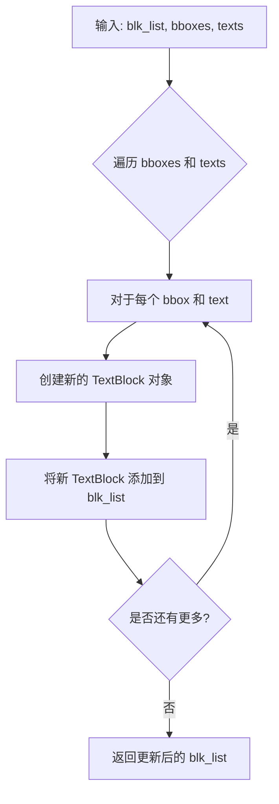

#### 带注释源码

由于 `lists_to_blk_list` 函数是外部模块 `modules.utils.textblock` 中的函数，在提供的代码段中仅导入了该函数并进行了调用，未包含其具体实现。以下为该函数在 `PPOCRv5Engine.process_image` 方法中的调用逻辑：

```python
# 将检测到的四边形框转换为轴对齐的边界框
bboxes = []
for quad in boxes:
    # 从四边形点中提取 x 和 y 坐标
    xs = quad[:, 0]
    ys = quad[:, 1]
    # 计算边界框的左上角和右下角坐标
    x1, y1, x2, y2 = int(xs.min()), int(ys.min()), int(xs.max()), int(ys.max())
    # 将边界框添加到列表中
    bboxes.append((x1, y1, x2, y2))

# 调用 lists_to_blk_list 函数，将新检测到的文本信息整合到 blk_list 中
# 参数：
#   blk_list: 原始的 TextBlock 列表
#   bboxes: 新检测到的文本边界框列表
#   texts: 新识别出的文本列表
# 返回：更新后的 TextBlock 列表
return lists_to_blk_list(blk_list, bboxes, texts)
```

#### 关键组件信息

- **TextBlock**：表示文本块的类，包含文本内容、位置信息等
- **modules.utils.textblock**：提供 TextBlock 相关工具函数的模块

#### 潜在的技术债务或优化空间

- **外部依赖**：该函数依赖于外部模块实现，建议在项目中包含其源码或明确的接口文档，以便于维护和调试
- **类型提示**：虽然使用了类型注解，但具体实现未知，建议补充该函数的完整类型签名文档

#### 其它项目

- **设计目标**：将 OCR 检测和识别的结果（边界框和文本）转换为统一的 TextBlock 数据结构，便于后续处理
- **错误处理**：未在调用处看到显式的错误处理，可能依赖于函数内部的异常抛出
- **数据流**：输入为检测结果（boxes）和识别结果（texts），输出为结构化的 TextBlock 列表


### `PPOCRv5Engine.__init__`

构造函数，初始化 PPOCRv5Engine 类的各个组件，包括检测和识别模型的 ONNX 推理会话、后处理器、解码器以及图像形状参数，为后续的 OCR 识别任务准备基础运行环境。

参数：无显式参数（隐式参数 `self` 为类的实例自身）

返回值：`None`，构造函数不返回值，仅进行实例属性的初始化

#### 流程图

```mermaid
flowchart TD
    A[开始 __init__] --> B[初始化 self.det_sess = None]
    B --> C[初始化 self.rec_sess = None]
    C --> D[创建 DBPostProcessor 实例]
    D --> E[设置检测后处理参数: thresh=0.3, box_thresh=0.5, unclip_ratio=2.0, use_dilation=False]
    E --> F[初始化 self.decoder = None]
    F --> G[设置 self.rec_img_shape = (3, 48, 320)]
    G --> H[结束 __init__]
```

#### 带注释源码

```python
def __init__(self):
    """构造函数，初始化 PPOCRv5 引擎的各个组件"""
    
    # 检测模型的 ONNX 推理会话，初始化为 None，在 initialize() 时加载模型
    self.det_sess: Optional[ort.InferenceSession] = None
    
    # 识别模型的 ONNX 推理会话，初始化为 None，在 initialize() 时加载模型
    self.rec_sess: Optional[ort.InferenceSession] = None
    
    # 文本检测后处理器，使用 DB (Differentiable Binarization) 算法的后处理
    # 参数说明：
    # - thresh: 文本二值化阈值，默认 0.3
    # - box_thresh: 文本框置信度阈值，默认 0.5
    # - unclip_ratio: 文本框扩展比例，默认 2.0
    # - use_dilation: 是否使用膨胀操作，默认 False
    self.det_post = DBPostProcessor(
        thresh=0.3, 
        box_thresh=0.5, 
        unclip_ratio=2.0, 
        use_dilation=False
    )
    
    # CTC 标签解码器，用于将识别模型的输出转换为文本
    # 初始化为 None，在 initialize() 时根据语言模型创建
    self.decoder: Optional[CTCLabelDecoder] = None
    
    # 识别模型的输入图像 shape
    # 3: RGB 通道数
    # 48: 图像高度
    # 320: 图像宽度（最大宽度）
    self.rec_img_shape = (3, 48, 320)
```


### `PPOCRv5Engine.initialize`

该方法负责PPOCRv5引擎的初始化工作，包括根据语言和设备参数确定所需的检测与识别模型、下载模型文件（若不存在）、加载ONNX推理会话、配置ONNX Runtime选项，以及初始化CTC标签解码器。整个初始化流程确保了模型文件可用、推理后端正确配置、解码器就绪，为后续的OCR识别任务奠定基础。

参数：

- `lang`：`str`，目标语言类型，默认为 `'ch'`（中文），可选 `'en'`、`'ko'`、`'latin'`、`'ru'`、`'eslav'` 等，用于确定识别模型
- `device`：`str`，推理设备，默认为 `'cpu'`，可设置为 `'cuda'` 等其他支持的设备，用于确定ONNX Runtime的providers
- `det_model`：`str`，检测模型版本，默认为 `'mobile'`，可选 `'server'`，用于确定检测模型的型号ID

返回值：`None`，无返回值，仅完成引擎的初始化操作

#### 流程图

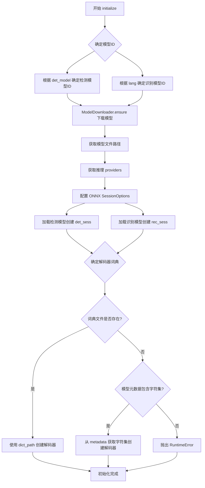

#### 带注释源码

```python
def initialize(
    self, 
    lang: str = 'ch', 
    device: str = 'cpu', 
    det_model: str = 'mobile'
) -> None:
    """
    初始化 PPOCRv5 OCR 引擎，加载检测和识别模型
    
    Args:
        lang: 识别语言，默认为 'ch' (中文)
        device: 推理设备，默认为 'cpu'
        det_model: 检测模型类型，'mobile' 或 'server'
    """
    
    # 步骤1: 根据参数确定所需的模型ID
    # 根据 det_model 参数选择检测模型：mobile 或 server 版本
    det_id = ModelID.PPOCR_V5_DET_MOBILE if det_model == 'mobile' else ModelID.PPOCR_V5_DET_SERVER
    
    # 根据 lang 参数从映射字典中获取对应的识别模型ID
    # 如果语言不在映射中，默认使用拉丁文模型
    rec_id = LANG_TO_REC_MODEL.get(lang, ModelID.PPOCR_V5_REC_LATIN_MOBILE)
    
    # 步骤2: 确保模型文件已下载（若不存在则自动下载）
    ModelDownloader.ensure([det_id, rec_id])

    # 步骤3: 获取模型文件的本地路径
    # 获取检测模型的主文件路径
    det_path = ModelDownloader.primary_path(det_id)
    # 获取识别模型的所有文件路径映射（包含onnx模型和词典文件）
    rec_paths = ModelDownloader.file_path_map(rec_id)
    
    # 从文件映射中筛选出 .onnx 识别模型文件
    # 词典文件名可能因语言不同而变化
    rec_model = [p for n, p in rec_paths.items() if n.endswith('.onnx')][0]
    
    # 从文件映射中筛选出 .txt 词典文件
    dict_file = [p for n, p in rec_paths.items() if n.endswith('.txt')]
    dict_path = dict_file[0] if dict_file else None

    # 步骤4: 获取推理提供者（CPU或GPU）
    # 根据 device 参数获取对应的 ONNX Runtime providers
    providers = get_providers(device)
    
    # 步骤5: 配置 ONNX Runtime 会话选项
    sess_opt = ort.SessionOptions()
    # 设置日志严重性级别为 3 (ERROR)，减少无关日志输出
    sess_opt.log_severity_level = 3
    
    # 步骤6: 加载检测模型，创建推理会话
    self.det_sess = ort.InferenceSession(det_path, sess_options=sess_opt, providers=providers)
    
    # 步骤7: 加载识别模型，创建推理会话
    self.rec_sess = ort.InferenceSession(rec_model, sess_options=sess_opt, providers=providers)

    # 步骤8: 准备 CTC 解码器
    # 优先使用外部词典文件
    if dict_path:
        # 使用词典文件路径创建解码器
        self.decoder = CTCLabelDecoder(dict_path=dict_path)
    else:
        # 尝试从模型的元数据中获取内置字符集
        # 这是某些模型自带的默认字符集
        meta = self.rec_sess.get_modelmeta().custom_metadata_map
        if 'character' in meta:
            # 从元数据中提取字符集（按行分割）
            chars = meta['character'].splitlines()
            self.decoder = CTCLabelDecoder(charset=chars)
        else:
            # 既没有词典文件也没有内置字符集，抛出错误
            raise RuntimeError('Recognition dictionary not found')
```


### `PPOCRv5Engine._det_infer`

文本检测推理方法，负责对输入图像进行文本检测，通过ONNX Runtime执行预训练的检测模型，输出图像中所有文本区域的边界框坐标及其置信度分数。

参数：

- `self`：隐式参数，PPOCRv5Engine实例本身
- `img`：`np.ndarray`，输入的原始图像数据，通常为H×W×C格式的BGR图像

返回值：`Tuple[np.ndarray, List[float]]`，返回两个元素——第一个是文本检测框的坐标数组（形状为N×4×2，N为检测到的文本框数量，每个框包含4个顶点的(x,y)坐标），第二个是对应的置信度分数列表（长度为N，分数范围0-1）

#### 流程图

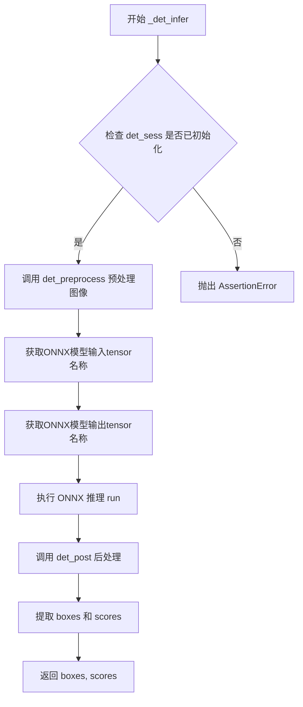

#### 带注释源码

```python
def _det_infer(self, img: np.ndarray) -> Tuple[np.ndarray, List[float]]:
    """文本检测推理核心方法
    
    Args:
        img: 输入图像，numpy数组格式
        
    Returns:
        boxes: 检测到的文本框坐标，形状为[N, 4, 2]的numpy数组
        scores: 每个文本框的置信度分数列表
    """
    # 断言检查：确保检测模型会话已正确初始化
    assert self.det_sess is not None
    
    # Step 1: 图像预处理
    # 将输入图像调整为适合模型输入的尺寸，设置最大边长为960像素
    inp = det_preprocess(img, limit_side_len=960, limit_type='min')
    
    # Step 2: 获取ONNX模型的输入输出名称
    # 从检测会话中获取第一个输入tensor的名称（通常是'x'或'input'）
    input_name = self.det_sess.get_inputs()[0].name
    # 从检测会话中获取第一个输出tensor的名称（通常是'sigmoid_0.tmp_0'或类似）
    output_name = self.det_sess.get_outputs()[0].name
    
    # Step 3: 执行ONNX模型推理
    # 运行推理会话，传入预处理后的图像数据，返回预测结果
    pred = self.det_sess.run([output_name], {input_name: inp})[0]
    
    # Step 4: 后处理
    # 使用DBPostProcessor对模型原始输出进行解码，转换为文本框坐标和置信度
    # 参数中的(img.shape[0], img.shape[1])为原始图像的高和宽，用于坐标映射
    boxes, scores = self.det_post(pred, (img.shape[0], img.shape[1]))
    
    # Step 5: 返回结果
    return boxes, scores
```


### `PPOCRv5Engine._rec_infer`

该方法是 PPOCRv5 文本识别引擎的核心推理方法，接收已检测的文本区域图像裁剪列表，通过 ONNX Runtime 执行推理，并利用 CTC 解码器将模型输出转换为可读文本，最终返回识别结果文本列表及对应的置信度分数。

参数：

- `self`：`PPOCRv5Engine`，方法所属的引擎实例，包含推理会话和解码器
- `crops`：`List[np.ndarray]`（必选），已裁剪的文本区域图像列表，每个元素为三维 NumPy 数组（通道数，高度，宽度）

返回值：`Tuple[List[str], List[float]]`，返回元组包含两个列表——第一个是识别出的文本列表，第二个是对应的置信度分数列表，两者索引一一对应

#### 流程图

```mermaid
flowchart TD
    A[开始 _rec_infer] --> B{检查 rec_session 和 decoder 是否存在}
    B -->|否| C[抛出断言错误]
    B -->|是| D{检查 crops 是否为空}
    D -->|是| E[返回空列表和空置信度列表]
    D -->|否| F[计算每个裁剪图像的宽高比]
    F --> G[按宽高比升序排序]
    G --> H[初始化结果列表 texts 和 confs]
    H --> I[设置批处理大小 bs=8]
    I --> J{当前索引 &lt; 裁剪总数}
    J -->|否| K[返回 texts, confs]
    J -->|是| L[获取当前批次的索引]
    L --> M[计算该批次最大宽高比]
    M --> N[对批次中每个裁剪进行resize和归一化]
    N --> O[沿批次维度拼接为4D张量]
    O --> P[执行ONNX推理获取logits]
    P --> Q{判断logits形状}
    Q -->|shape[1] > shape[2]| R[转置为 T 维度在前]
    Q -->|否则| S[保持原状]
    R --> T[调用 decoder 解码]
    S --> T
    T --> U[填充结果到对应索引位置]
    U --> J
```

#### 带注释源码

```python
def _rec_infer(self, crops: List[np.ndarray]) -> Tuple[List[str], List[float]]:
    """文本识别推理方法
    
    参数:
        crops: 已裁剪的文本区域图像列表
        
    返回:
        texts: 识别出的文本列表
        confs: 对应的置信度分数列表
    """
    # 断言确保推理会话和解码器已正确初始化
    assert self.rec_sess is not None and self.decoder is not None
    
    # 处理空输入情况，直接返回空结果
    if not crops:
        return [], []
    
    # 计算每个裁剪图像的宽高比，用于后续批处理排序
    # 宽高比 = 宽度 / 高度，用于决定padding策略
    ratios = [c.shape[1] / float(max(1, c.shape[0])) for c in crops]
    
    # 按宽高比升序排序，相同形状的图像会被分到同一批次
    # 这样可以减少padding带来的计算浪费
    order = np.argsort(ratios)
    
    # 初始化结果列表，预填充空字符串和零置信度
    texts = [""] * len(crops)
    confs = [0.0] * len(crops)
    
    # 设置批处理大小，限制每次推理的图像数量以平衡效率和内存
    bs = 8
    # 获取识别模型的输入shape配置
    c, H, W = self.rec_img_shape  # (3, 48, 320)
    
    # 分批处理图像，每次处理bs个
    for b in range(0, len(crops), bs):
        # 获取当前批次的索引（已排序）
        idxs = order[b:b+bs]
        
        # 计算该批次中最大的宽高比，用于统一该批次的resize尺寸
        max_ratio = max(ratios[i] for i in idxs) if idxs.size > 0 else (W/float(H))
        
        # 对批次中每个裁剪进行resize和归一化处理
        # 保持宽高比进行缩放，然后归一化到模型输入范围
        batch = [rec_resize_norm(crops[i], self.rec_img_shape, max_ratio)[None, ...] for i in idxs]
        
        # 沿批次维度拼接所有预处理后的图像
        x = np.concatenate(batch, axis=0).astype(np.float32)
        
        # 获取ONNX模型的输入输出名称
        inp_name = self.rec_sess.get_inputs()[0].name
        out_name = self.rec_sess.get_outputs()[0].name
        
        # 执行ONNX推理，得到原始logits输出
        # 输出shape可能为 (N, T, C) 或 (N, C, T)，其中N=batch, T=时间步, C=类别数
        logits = self.rec_sess.run([out_name], {inp_name: x})[0]
        
        # 处理不同输出格式：如果输出是 (N, C, T)，转置为 (N, T, C)
        # 使其符合 CTC 解码器期望的输入格式
        if logits.ndim == 3 and logits.shape[1] > logits.shape[2]:
            logits = np.transpose(logits, (0, 2, 1))
        
        # 调用 CTC 解码器将模型输出转换为文本
        # prob_threshold=0.0 表示不丢弃任何字符，完全按照模型输出解码
        dec_texts, dec_confs = self.decoder(logits, prob_threshold=0.0)
        
        # 将解码结果填充到对应原始索引位置
        # 因为我们按排序顺序处理，需要映射回原始位置
        for oi, t, s in zip(idxs, dec_texts, dec_confs):
            texts[oi] = t
            confs[oi] = float(s)
    
    # 返回识别文本列表和置信度列表
    return texts, confs
```


### `PPOCRv5Engine.process_image`

`process_image` 是 PPOCRv5Engine 类的核心处理方法，负责协调文本检测与识别全流程。该方法首先检查模型是否已初始化，然后依次执行文字检测、检测框裁剪、文本识别，最后将识别结果映射回文本块结构返回。

参数：

- `self`：隐式参数，指向 PPOCRv5Engine 实例本身
- `img`：`np.ndarray`，输入的待识别图像，为三维数组（高度×宽度×通道数）
- `blk_list`：`List[TextBlock]`，输入的文本块列表，用于承载识别结果

返回值：`List[TextBlock]`，返回填充了识别文本和边界框信息的文本块列表

#### 流程图

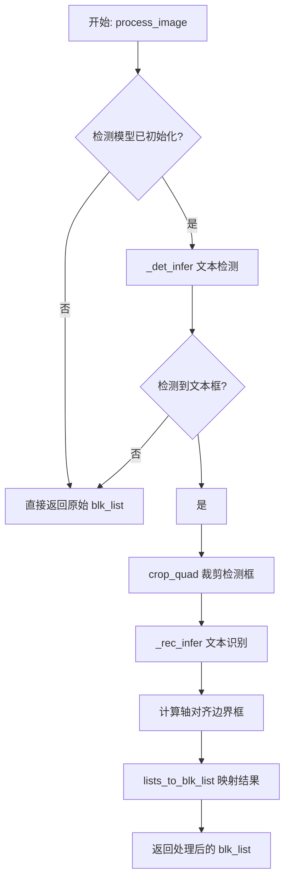

#### 带注释源码

```python
def process_image(self, img: np.ndarray, blk_list: List[TextBlock]) -> List[TextBlock]:
    """
    主处理流程：检测 + 识别 + 结果映射
    
    Args:
        img: 输入图像，形状为 (H, W, C) 的 numpy 数组
        blk_list: 初始文本块列表，用于承载识别结果
        
    Returns:
        包含识别文本和边界框的 TextBlock 列表
    """
    # 检查推理会话和解码器是否已初始化，若未初始化则直接返回空结果
    if self.det_sess is None or self.rec_sess is None or self.decoder is None:
        return blk_list
    
    # 步骤1：文本检测
    # 调用 _det_infer 执行文本检测模型推理，返回检测到的文本框坐标和置信度
    boxes, _ = self._det_infer(img)
    
    # 若未检测到任何文本框，直接返回原始列表
    if boxes is None or len(boxes) == 0:
        return blk_list
    
    # 步骤2：区域裁剪
    # 遍历所有检测到的四边形文本框，从原图中裁剪出对应的图像区域
    # crop_quad 函数负责将任意四边形区域透视变换为矩形图像
    crops = [crop_quad(img, quad.astype(np.float32)) for quad in boxes]
    
    # 步骤3：文本识别
    # 将裁剪出的文本图像区域批量送入识别模型，转换为文本内容
    # 支持批量处理以提高推理效率
    texts, _ = self._rec_infer(crops)
    
    # 步骤4：坐标转换
    # 将检测得到的任意四边形坐标转换为轴对齐的矩形边界框
    # 便于后续与业务系统的坐标体系对接
    bboxes = []
    for quad in boxes:
        # 提取四边形四个顶点的 x, y 坐标
        xs = quad[:, 0]
        ys = quad[:, 1]
        # 计算轴对齐包围盒的左上角和右下角坐标
        x1, y1, x2, y2 = int(xs.min()), int(ys.min()), int(xs.max()), int(ys.max())
        bboxes.append((x1, y1, x2, y2))
    
    # 步骤5：结果映射
    # 将识别文本和边界框信息填充到 TextBlock 结构中
    # 返回包含完整 OCR 结果的文本块列表
    return lists_to_blk_list(blk_list, bboxes, texts)
```


## 关键组件


### 张量索引与惰性加载

模型采用惰性加载策略，仅在`initialize`方法被调用时才下载和加载ONNX模型，通过`ModelDownloader.ensure()`确保模型文件存在，按需初始化推理会话，避免启动时占用过多资源。

### 量化策略

使用mobile版本的量化模型（`ModelID.PPOCR_V5_REC_MOBILE`、`ModelID.PPOCR_V5_DET_MOBILE`），通过`det_model='mobile'`参数选择，在保证识别精度的同时降低模型体积和计算开销。

### DB后处理器

`DBPostProcessor`用于文本检测后处理，根据阈值（thresh=0.3、box_thresh=0.5）和unclip_ratio=2.0将分割结果转换为文本框坐标，支持dilation选项以增强文本区域连通性。

### CTC标签解码器

`CTCLabelDecoder`负责将识别模型的CTC输出转换为实际文本，支持从外部字典文件加载字符集或从ONNX模型的metadata中读取embedded vocab，实现字符到文本的映射。

### 批处理优化

`_rec_infer`方法实现了智能批处理：先按图像宽高比排序，再以bs=8为批次大小进行推理，减少填充开销并提高GPU/CPU利用率。

### 预处理管道

包含三个预处理函数：`det_preprocess`用于检测前处理（限制边长960像素），`crop_quad`从检测框中裁剪四边形区域，`rec_resize_norm`将识别图像resize并归一化到固定形状(3, 48, 320)。

### 多语言模型映射

`LANG_TO_REC_MODEL`字典将语言代码映射到对应的识别模型ID，支持ch(中文)、en(英文)、ko(韩文)、latin、ru、eslav等语种，实现多语言OCR能力。

### 设备提供商适配

通过`get_providers`函数获取当前设备的ONNX Runtime执行providers（CPU或CUDA），并配置`SessionOptions`的日志级别为3（错误级别），兼顾功能与性能。


## 问题及建议


### 已知问题

-   **异常处理不完善**：`initialize`方法中文件查找使用列表推导式直接取第一个元素，若文件不存在会抛出`IndexError`；`_det_infer`和`_rec_infer`中使用`assert`进行运行时检查，生产环境中断言可能被忽略
-   **硬编码配置过多**：`det_post`参数、`rec_img_shape`、批处理大小`bs=8`等均硬编码在类中，配置不够灵活
-   **返回值未充分利用**：`process_image`中`_det_infer`返回的`scores`和`_rec_infer`返回的置信度被忽略，导致文本识别结果无置信度信息
-   **批处理逻辑复杂且低效**：`_rec_infer`中对crops按宽高比排序后处理，引入额外计算开销，且批处理大小固定为8，缺乏自适应策略
-   **类型注解不完整**：多处使用`typing.Optional`但部分方法参数和返回值缺乏类型标注，如`ModelDownloader`相关方法
-   **设备初始化冗余**：每次初始化都调用`get_providers(device)`，但`ort.InferenceSession`的providers参数在重复创建时未被缓存

### 优化建议

-   **增强异常处理**：使用`try-except`替代`assert`和索引访问，提供有意义的错误信息；添加模型加载失败、字典文件缺失等场景的异常处理
-   **配置外部化**：将阈值参数、图像shape、批处理大小等通过构造函数或配置文件注入，支持运行时调整
-   **完善返回值**：在`TextBlock`中填充识别置信度，或返回`(texts, confs)`元组供调用方使用
-   **优化批处理策略**：实现动态批处理或根据GPU/CPU内存自动调整`bs`值；考虑使用`onnxruntime`的电离图优化
-   **添加推理日志**：在关键路径添加性能日志，记录模型推理耗时、检测框数量、识别结果统计等信息，便于监控和调优
-   **缓存优化**：对于设备类型不变的场景，可缓存`providers`和`SessionOptions`对象


## 其它


### 设计目标与约束

本PPOCRv5Engine的设计目标是实现一个轻量级的、基于ONNX Runtime的OCR流水线，同时支持文字检测（Detection）和文字识别（Recognition）功能。设计约束包括：(1) 采用ONNX格式模型以确保跨平台兼容性；(2) 通过ModelDownloader自动管理模型下载；(3) 支持多语言识别（中文、英文、韩文、拉丁文、斯拉夫文等）；(4) 使用CPU/GPU灵活切换；(5) 检测阈值0.3、框阈值0.5、非Clip比率2.0为硬编码配置，不支持运行时动态调整。

### 错误处理与异常设计

代码中的错误处理机制主要包括：(1) `initialize`方法中若未找到识别字典文件，会尝试从模型元数据中读取`character`字段，若仍不存在则抛出`RuntimeError`；(2) `process_image`方法在模型未初始化时直接返回原始`blk_list`而不抛异常；(3) `_det_infer`和`_rec_infer`方法使用`assert`检查会话是否已初始化，未初始化时抛出`AssertionError`；(4) 模型下载失败时`ModelDownloader.ensure`会抛出相应异常。潜在问题：断言在生产环境可能被优化掉、缺少对ONNX Runtime加载失败的捕获、推理过程中图像尺寸不匹配时缺乏显式检查。

### 数据流与状态机

数据流转过程如下：(1) 输入原始图像`img`和`TextBlock`列表；(2) 调用`_det_infer`进行文字检测：图像预处理→ONNX推理→后处理得到文本框`boxes`和分数；(3) 若检测到文本框，使用`crop_quad`从原图中裁剪出四边形区域；(4) 调用`_rec_infer`进行文字识别：按宽高比排序分批→归一化处理→ONNX推理→CTC解码得到文本和置信度；(5) 将四边形框转换为轴对齐矩形框；(6) 调用`lists_to_blk_list`将结果映射回原始`TextBlock`列表并返回。状态机涉及：未初始化→已初始化（det_sess和rec_sess和decoder均非None）→推理中，无复杂状态转换逻辑。

### 外部依赖与接口契约

主要外部依赖包括：(1) `onnxruntime`（ort）：ONNX模型推理引擎；(2) `numpy`：数值计算和数组操作；(3) `modules.base.OCREngine`：基类接口，定义`process_image`方法；(4) `modules.utils.textblock`：TextBlock数据结构和列表转换工具；(5) `modules.utils.device.get_providers`：获取设备提供商（CPU/GPU）；(6) `modules.utils.download.ModelDownloader`和`ModelID`：模型下载管理；(7) `preprocessing`模块：`det_preprocess`、`crop_quad`、`rec_resize_norm`；(8) `postprocessing`模块：`DBPostProcessor`、`CTCLabelDecoder`。接口契约：`OCREngine`基类的`process_image(img: np.ndarray, blk_list: List[TextBlock]) -> List[TextBlock]`为唯一公共入口。

### 配置与参数设计

关键配置参数包括：(1) 检测后处理：thresh=0.3（文本分割阈值）、box_thresh=0.5（文本框阈值）、unclip_ratio=2.0（扩展比率）、use_dilation=False（是否使用膨胀）；(2) 识别图像形状：rec_img_shape=(3, 48, 320)（通道数、高度、宽度）；(3) 批处理大小：bs=8（推理批次大小）；(4) 解码概率阈值：prob_threshold=0.0（CTC解码时保留所有字符）。语言到模型的映射通过LANG_TO_REC_MODEL字典维护，支持7种语言。潜在改进：这些参数应可通过构造函数或配置对象传入，提高灵活性。

### 性能考量与优化空间

性能优化策略包括：(1) 批处理推理：`_rec_infer`中按宽高比排序后分批处理，每批最多8个样本；(2) 动态批大小调整：根据最大宽高比动态构建输入张量；(3) 推理会话配置：设置`sess_opt.log_severity_level = 3`减少日志开销。优化空间：(1) 检测和识别推理可并行执行（当前串行）；(2) 缺少GPU内存管理和推理优化配置；(3) 批处理大小固定为8，未根据设备动态调整；(4) 裁剪和归一化操作可使用GPU加速；(5) 缺少推理结果缓存机制。

### 线程安全与并发考虑

当前实现**非线程安全**：(1) `self.det_sess`、`self.rec_sess`、`self.decoder`为共享可变状态；(2) 多线程并发调用`process_image`时，推理会话的run方法可能产生竞争；(3) `_rec_infer`中的批处理逻辑依赖实例状态`self.rec_img_shape`和`self.decoder`。改进建议：(1) 每次推理创建独立的会话副本；(2) 使用线程锁保护共享状态；(3) 或提供工厂方法创建线程安全的引擎实例。

### 版本兼容性与升级策略

版本兼容性考虑：(1) 依赖ONNX Runtime版本，需与ONNX模型版本匹配；(2) `ModelID`枚举定义在`modules.utils.download`中，需保持向后兼容；(3) `TextBlock`数据结构需与项目其他模块保持一致。升级策略：(1) 模型版本升级时需同步更新`ModelID`映射；(2) ONNX Runtime API变更需调整推理调用方式；(3) 建议使用语义化版本号管理引擎版本。

### 安全性考虑

安全风险点：(1) 模型文件通过远程下载，需验证文件完整性（hash校验）；(2) 输入图像未做尺寸限制，可能导致内存耗尽（DoS攻击）；(3) ONNX模型执行存在潜在的算子漏洞。改进建议：(1) 实现下载文件的SHA256校验；(2) 添加输入图像尺寸上限检查（如4096x4096）；(3) 定期更新ONNX Runtime依赖以修复安全漏洞。

### 测试策略建议

建议测试覆盖：(1) 单元测试：各预处理/后处理函数独立测试；(2) 集成测试：端到端OCR流程验证；(3) 模型下载测试：模拟网络异常场景；(4) 性能基准测试：CPU/GPU推理延迟和吞吐量；(5) 边界测试：空图像、超大图像、无文本图像、多语言混合图像。


    