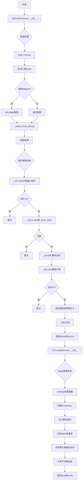
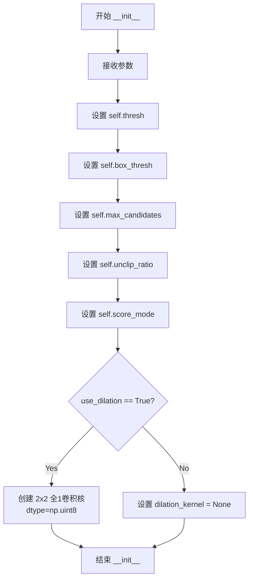
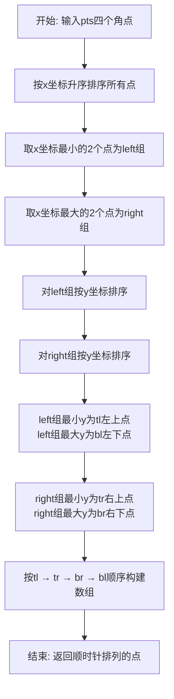
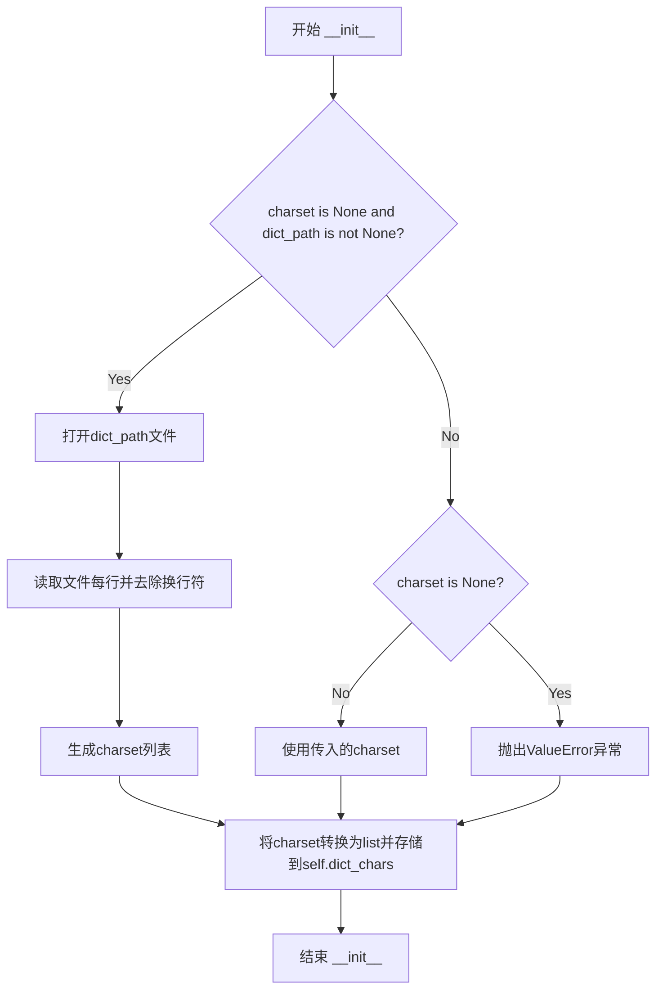

# `comic-translate\modules\ocr\ppocr\postprocessing.py` 详细设计文档

该代码实现了一个文本检测后处理器(DBPostProcessor)和一个CTC标签解码器(CTCLabelDecoder)。DBPostProcessor将DB检测器的二进制maps转换为文本区域的多边形表示,包括阈值处理、形态学膨胀、轮廓提取、最小外接矩形计算、分数评估和多边形扩展等步骤。CTCLabelDecoder将神经网络输出的logits通过贪心解码转换为可读文本,支持多种类别数量的vocabulary对齐和置信度计算。

## 整体流程



## 类结构

```
DBPostProcessor (文本检测后处理类)
└── 功能: 将二进制maps转换为多边形
CTCLabelDecoder (CTC标签解码器类)
└── 功能: 将logits转换为文本
```

## 全局变量及字段


### `DBPostProcessor.thresh`
    
二值化阈值

类型：`float`
    


### `DBPostProcessor.box_thresh`
    
box过滤阈值

类型：`float`
    


### `DBPostProcessor.max_candidates`
    
最大候选框数量

类型：`int`
    


### `DBPostProcessor.unclip_ratio`
    
多边形扩展比率

类型：`float`
    


### `DBPostProcessor.score_mode`
    
评分模式 ('fast' 或 'slow')

类型：`str`
    


### `DBPostProcessor.dilation_kernel`
    
膨胀核,若use_dilation为False则为None

类型：`np.ndarray`
    


### `CTCLabelDecoder.dict_chars`
    
字符字典列表

类型：`List[str]`
    
    

## 全局函数及方法


### `DBPostProcessor.__init__`

DBPostProcessor 类的构造函数，负责初始化文本检测后处理器的各项参数，包括阈值、候选框数量、评分模式等核心配置，并构建用于图像膨胀操作的内核。

参数：

- `thresh`：`float`，默认值 0.3，二值化阈值，用于将概率图转换为二值掩膜
- `box_thresh`：`float`，默认值 0.5，检测框置信度阈值，用于过滤低质量候选框
- `max_candidates`：`int`，默认值 1000，最大候选框数量上限
- `unclip_ratio`：`float`，默认值 1.6，文本框扩展比例，用于将紧凑的检测框向外扩展
- `score_mode`：`str`，默认值 "fast"，评分模式，可选 "fast" 或 "slow"，决定计算检测框得分的算法
- `use_dilation`：`bool`，默认值 True，是否使用图像膨胀操作来增强连通区域

返回值：`None`，构造函数无返回值，仅初始化实例属性

#### 流程图



#### 带注释源码

```python
def __init__(self,
             thresh: float = 0.3,          # 二值化阈值，将概率图转为二值掩膜的临界值
             box_thresh: float = 0.5,      # 框置信度阈值，低于此值的候选框将被过滤
             max_candidates: int = 1000,   # 最大候选框数量，防止过多候选导致性能问题
             unclip_ratio: float = 1.6,    # 扩展比例，根据周长和面积计算膨胀距离
             score_mode: str = "fast",      # 评分模式：'fast'使用最小外接矩形，'slow'使用原始轮廓
             use_dilation: bool = True):    # 是否使用膨胀操作增强连通区域
    # 存储二值化阈值参数
    self.thresh = thresh
    # 存储框置信度阈值参数
    self.box_thresh = box_thresh
    # 存储最大候选框数量限制
    self.max_candidates = max_candidates
    # 存储文本框扩展比例
    self.unclip_ratio = unclip_ratio
    # 存储评分模式选择
    self.score_mode = score_mode
    # 根据是否使用膨胀操作来条件性地创建卷积核
    # 若启用膨胀，创建一个 2x2 的全1数组作为膨胀核
    # 若禁用膨胀，则设为 None 以节省内存
    self.dilation_kernel = np.array([[1, 1], [1, 1]], dtype=np.uint8) if use_dilation else None
```


### DBPostProcessor.__call__

该方法是DBPostProcessor类的核心调用接口，负责将DB检测器的二值概率图后处理为最终的四边形文本框坐标。通过阈值筛选、轮廓提取、最小外接矩形计算、分数评估和几何约束过滤等步骤，从分割结果中筛选出高质量的文本检测框。

参数：

- `self`：DBPostProcessor实例本身
- `pred`：`np.ndarray`，形状为(N,1,H,W)的预测概率图，N为batch size，H和W为特征图尺寸
- `ori_shape`：`Tuple[int, int]`，原始输入图像的尺寸(H, W)，用于将检测框坐标映射回原图空间

返回值：`Tuple[np.ndarray, List[float]]`，返回过滤后的文本框坐标数组（形状为(N,4,2)的整数坐标点）和对应的置信度分数列表

#### 流程图

```mermaid
flowchart TD
    A[开始 __call__] --> B[提取ori_shape高宽 H, W]
    B --> C[从pred提取第一个通道的概率图 prob = pred[:, 0, :, :]]
    C --> D[阈值分割: seg = prob > thresh]
    D --> E[取第一张mask: mask = seg[0]]
    E --> F{判断dilation_kernel是否存在?}
    F -->|是| G[膨胀操作: imk.dilate]
    F -->|否| H[跳过膨胀]
    G --> I[将膨胀结果转为0/1 mask]
    H --> I
    I --> J[调用_boxes_from_bitmap]
    J --> K[提取所有候选框和分数]
    K --> L[调用_filter进行最终过滤]
    L --> M[返回 boxes, scores]
    
    subgraph _boxes_from_bitmap
        N[查找轮廓: imk.find_contours] --> O[遍历候选轮廓]
        O --> P[计算最小外接矩形]
        P --> Q{边长是否>=3?}
        Q -->|否| R[跳过该轮廓]
        Q -->|是| S[计算分数: fast或slow模式]
        S --> T{分数>=box_thresh?}
        T -->|否| R
        T -->|是| U[unclip扩展框]
        U --> V{扩展后边长>=5?}
        V -->|否| R
        V -->|是| W[坐标映射到目标尺寸]
        W --> X[添加到boxes和scores列表]
    end
    
    subgraph _filter
        Y[遍历每个box和score] --> Z[确保顺时针排序]
        Z --> AA[坐标裁剪到图像范围内]
        AA --> AB[计算框宽度和高度]
        AB --> AC{宽或高<=3?}
        AC -->|是| AD[跳过该框]
        AC -->|否| AE[保留该框]
        AD --> AF[返回最终结果]
        AE --> AF
    end
```

#### 带注释源码

```python
def __call__(self, pred: np.ndarray, ori_shape: Tuple[int, int]) -> Tuple[np.ndarray, List[float]]:
    """
    后处理入口函数，将DB检测器的概率图转为文本框坐标
    
    参数:
        pred: 检测器输出的概率图，形状 (N, 1, h, w)，N为batch size
        ori_shape: 原始图像尺寸 (H, W)，用于坐标逆映射
    
    返回:
        boxes: 四边形文本框坐标数组，形状 (num_boxes, 4, 2)，类型np.int32
        scores: 对应的置信度分数列表
    """
    # 从ori_shape解包出目标图像的高宽
    H, W = ori_shape
    
    # 提取第一个样本的概率图: (N,1,h,w) -> (h,w)
    # DB检测器输出为[N,1,H,W]形状，取batch=0的通道
    prob = pred[:, 0, :, :]  # N,1,h,w -> N,h,w
    seg = prob > self.thresh  # 阈值分割得到二值掩膜
    mask = seg[0]  # 取第一张图像的mask
    
    # 可选：使用图像膨胀增强连通区域
    # 膨胀可以使断裂的文本区域重新连接，减少漏检
    if self.dilation_kernel is not None:
        # imk.dilate要求输入uint8 0-255范围，返回也是0-255
        # 故先将mask转为0/255，再转回0/1
        dil = imk.dilate((mask.astype(np.uint8) * 255), self.dilation_kernel, iterations=1)
        mask = (dil > 0).astype(np.uint8)
    
    # 从二值掩膜中提取候选框及分数
    # 内部调用_contour_to_box系列函数完成几何计算
    boxes, scores = self._boxes_from_bitmap(prob[0], mask, W, H)
    
    # 进一步过滤低质量框（尺寸太小、分数过低等）
    return self._filter(boxes, scores, H, W)
```


### `DBPostProcessor._boxes_from_bitmap`

该方法是从二值化掩码（bitmap）中提取文本框的核心算法，通过轮廓检测获取候选区域，计算最小外接矩形，根据评分过滤低质量框，最后进行多边形展开（unclip）并坐标映射到原始图像尺寸，返回处理后的文本框数组和对应的置信度分数。

参数：

- `self`：DBPostProcessor 实例，隐式参数，包含后处理配置参数
- `prob`：`np.ndarray`，概率图，来自 DB 检测器的原始输出，形状为 (H, W)
- `bitmap`：`np.ndarray`，二值掩码，经阈值处理后的二值图像，形状为 (H, W)
- `dest_w`：`int`，目标宽度，原始输入图像的宽度，用于坐标映射
- `dest_h`：`int`，目标高度，原始输入图像的高度，用于坐标映射

返回值：`Tuple[np.ndarray, List[float]]`，包含两个元素——第一个是形状为 (N, 4, 2) 的 int32 类型数组，表示 N 个文本框的四个顶点坐标；第二个是长度为 N 的浮点数列表，表示每个文本框的置信度分数

#### 流程图

```mermaid
flowchart TD
    A[开始 _boxes_from_bitmap] --> B[从 bitmap 提取轮廓]
    B --> C[限制候选数量: num = min(len(contours), max_candidates)]
    C --> D{遍历每个轮廓 i < num}
    D -->|是| E[获取当前轮廓 c = contours[i]]
    E --> F[_min_box 计算最小外接矩形]
    F --> G{最小边长 sside >= 3?}
    G -->|否| D
    G -->|是| H[根据 score_mode 计算得分]
    H --> I{得分 >= box_thresh?}
    I -->|否| D
    I -->|是| J[_unclip 展开多边形]
    J --> K[_min_box 重新计算最小外接矩形]
    K --> L{新最小边长 sside >= 5?}
    L -->|否| D
    L -->|是| M[坐标映射到目标尺寸]
    M --> N[裁剪坐标到有效范围 [0, dest_w/dest_h]]
    N --> O[将 box 转换为 int32 并加入 boxes 列表]
    O --> P[将 score 转换为 float 并加入 scores 列表]
    P --> D
    D -->|否| Q[转换为 numpy 数组]
    Q --> R[返回 (boxes, scores)]
```

#### 带注释源码

```python
def _boxes_from_bitmap(self, prob: np.ndarray, bitmap: np.ndarray, dest_w: int, dest_h: int) -> Tuple[np.ndarray, List[float]]:
    """
    从二值掩码中提取文本框及其置信度分数。
    
    参数:
        prob: 概率图，来自 DB 检测器的原始输出
        bitmap: 二值掩码，经阈值处理后的二值图像
        dest_w: 目标宽度，原始输入图像的宽度
        dest_h: 目标高度，原始输入图像的高度
    
    返回:
        包含文本框坐标数组和分数列表的元组
    """
    # 步骤1: 从二值掩码中提取轮廓
    # imk.find_contours 返回轮廓列表，threshold 参数用于轮廓检索
    contours, _ = imk.find_contours((bitmap.astype(np.uint8) * 255), threshold=127)
    
    # 步骤2: 限制处理的最大候选数量，避免过多轮廓导致性能问题
    num = min(len(contours), self.max_candidates)
    
    # 初始化结果列表
    boxes, scores = [], []
    
    # 获取掩码的尺寸，用于后续坐标归一化
    h, w = bitmap.shape
    
    # 步骤3: 遍历每个候选轮廓
    for i in range(num):
        c = contours[i]
        
        # 步骤4: 计算轮廓的最小面积外接矩形
        box, sside = self._min_box(c)
        
        # 步骤5: 过滤太小的矩形（小于3像素的边长）
        if sside < 3:
            continue
        
        # 步骤6: 根据评分模式计算置信度分数
        # fast 模式: 使用矩形区域的平均概率
        # slow 模式: 使用原始轮廓区域的平均概率
        score = self._score_fast(prob, box.reshape(-1, 2)) if self.score_mode == 'fast' else self._score_slow(prob, c)
        
        # 步骤7: 根据分数阈值过滤低质量框
        if score < self.box_thresh:
            continue
        
        # 步骤8: 对框进行展开（unclip），增加框的大小以包含完整文本
        expanded = self._unclip(box)
        
        # 步骤9: 重新计算展开后的最小外接矩形
        box, sside = self._min_box(expanded)
        
        # 步骤10: 再次过滤太小的框（展开后边长需 >= 5）
        if sside < 5:
            continue
        
        # 步骤11: 将坐标从掩码尺寸映射到目标图像尺寸
        # x 坐标映射: box[:, 0] / w * dest_w
        # y 坐标映射: box[:, 1] / h * dest_h
        box[:, 0] = np.clip(np.round(box[:, 0] / w * dest_w), 0, dest_w)
        box[:, 1] = np.clip(np.round(box[:, 1] / h * dest_h), 0, dest_h)
        
        # 步骤12: 将处理后的框和分数添加到结果列表
        boxes.append(box.astype(np.int32))
        scores.append(float(score))
    
    # 步骤13: 转换为 numpy 数组返回
    return np.array(boxes, dtype=np.int32), scores
```


### `DBPostProcessor._min_box`

该静态方法负责将输入的轮廓（contour）转换为最小面积外接矩形（Minimum Area Rectangle）。它首先调用图像处理库计算轮廓的最小外接矩形及四个顶点坐标，然后根据 x 坐标排序区分左右两边，再根据 y 坐标排序确定左上、左下、右上、右下的顺序，最终返回一个标准化的 4x2 坐标框以及矩形的较短边长度。

参数：

-  `contour`：`np.ndarray`，输入的轮廓点集，通常为二维数组。

返回值：`Tuple[np.ndarray, float]`
-  `box`：`np.ndarray`，形状为 (4, 2) 的 float32 数组，代表按 `[tl, tr, br, bl]` 顺序排列的矩形四个角点坐标。
-  `sside`：`float`，返回矩形的较短边的长度，用于后续过滤极小噪点。

#### 流程图

```mermaid
graph TD
    A[输入: contour] --> B[imk.min_area_rect: 计算最小外接矩形]
    B --> C[imk.box_points: 获取四个顶点]
    C --> D[按 X 坐标排序顶点]
    D --> E[分割为左侧两点 left 和右侧两点 right]
    E --> F[左侧点按 Y 排序: 确定 tl, bl]
    E --> G[右侧点按 Y 排序: 确定 tr, br]
    F --> H[组装 box: tl, tr, br, bl]
    G --> H
    H --> I[计算 min rect[1] 作为 sside]
    I --> J[输出: box, sside]
```

#### 带注释源码

```python
@staticmethod
def _min_box(contour: np.ndarray) -> Tuple[np.ndarray, float]:
    # 1. 计算轮廓的最小面积外接矩形，返回格式通常为 (center, size, angle)
    rect = imk.min_area_rect(contour)
    
    # 2. 根据矩形参数获取四个顶点的坐标列表
    pts = imk.box_points(rect)
    
    # 3. 将顶点列表转换为 Python 原生列表，并按 X 轴 (水平方向) 排序
    #    排序后前两个点为左侧点，后两个点为右侧点
    pts = sorted(list(pts), key=lambda p: p[0])
    
    # 4. 分离左右两边的点
    left = np.array(pts[:2])
    right = np.array(pts[2:])
    
    # 5. 对左侧点按 Y 轴 (垂直方向) 排序，确定左上(TL)和左下(BL)
    #    注意：Y 坐标越小越靠上
    tl, bl = left[np.argsort(left[:, 1])]
    
    # 6. 对右侧点按 Y 轴排序，确定右上(TR)和右下(BR)
    tr, br = right[np.argsort(right[:, 1])]
    
    # 7. 按照顺时针顺序组装最终的边界框数组
    box = np.array([tl, tr, br, bl], dtype=np.float32)
    
    # 8. rect[1] 通常为 (width, height)，取其中较小者作为有效边长
    return box, min(rect[1])
```


### `DBPostProcessor._score_fast`

该方法是一个高效的文本框评分函数，通过在概率图上创建多边形蒙版并计算区域内平均概率值，快速评估候选检测框与实际文本区域的一致程度。相比`_score_slow`方法，它使用最小外接矩形区域而非完整轮廓，从而在保持精度的同时提升计算效率。

参数：

- `bitmap`：`np.ndarray`，输入的概率图（通常为DB检测器的输出单通道概率图，值为0-1之间的浮点数）
- `box`：`np.ndarray`，候选框的四个顶点坐标，形状为(4, 2)的浮点数组，按顺时针或逆时针排列

返回值：`float`，返回0到1之间的分数，表示候选框内文本区域的平均概率值

#### 流程图

```mermaid
flowchart TD
    A[开始: _score_fast] --> B[获取bitmap形状h, w]
    B --> C[从box提取x坐标xs和y坐标ys]
    C --> D[计算xmin/xmax: 裁剪到0到w-1范围]
    D --> E[计算ymin/ymax: 裁剪到0到h-1范围]
    E --> F[创建零蒙版: shape为ymax-ymin+1, xmax-xmin+1]
    F --> G[复制box坐标并平移: pts = box - [xmin, ymin]]
    G --> H[调用imk.fill_poly填充多边形到蒙版]
    H --> I[提取bitmap区域: region = bitmap[ymin:ymax+1, xmin:xmax+1]]
    I --> J[调用imk.mean计算加权平均概率]
    J --> K[返回概率值作为分数]
```

#### 带注释源码

```python
@staticmethod
def _score_fast(bitmap: np.ndarray, box: np.ndarray) -> float:
    """
    快速计算候选框的置信度分数。
    通过在位图上创建多边形蒙版，计算框内区域的平均概率值。
    
    参数:
        bitmap: 概率图，形状为 (h, w)，值为 0-1 之间的浮点数
        box: 候选框的四个顶点坐标，形状为 (4, 2)
    
    返回值:
        float: 框内区域的平均概率值，范围 0-1
    """
    # 获取概率图的尺寸
    h, w = bitmap.shape
    
    # 从box中提取x和y坐标
    xs = box[:, 0]
    ys = box[:, 1]
    
    # 计算边界框的最小和最大坐标，并裁剪到有效图像范围内
    # 使用floor和ceil确保覆盖整个区域，使用clip防止越界
    xmin = int(np.clip(np.floor(xs.min()), 0, w - 1))
    xmax = int(np.clip(np.ceil(xs.max()), 0, w - 1))
    ymin = int(np.clip(np.floor(ys.min()), 0, h - 1))
    ymax = int(np.clip(np.ceil(ys.max()), 0, h - 1))
    
    # 创建一个与边界框大小相同的零蒙版，用于填充多边形
    # 蒙版大小为 (ymax-ymin+1) x (xmax-xmin+1)，数据类型为uint8
    mask = np.zeros((ymax - ymin + 1, xmax - xmin + 1), dtype=np.uint8)
    
    # 复制box坐标并平移到蒙版坐标系（以左上角为原点）
    pts = box.copy()
    pts[:, 0] -= xmin
    pts[:, 1] -= ymin
    
    # 使用imkit库的fill_poly函数填充多边形
    # 将pts reshape为(-1, 1, 2)以符合函数要求的形状，color=1表示填充值为1
    mask = imk.fill_poly(mask, pts.reshape(-1, 1, 2).astype(np.int32), color=1)
    
    # 从原始概率图中提取与边界框对应的区域
    region = bitmap[ymin:ymax + 1, xmin:xmax + 1]
    
    # 计算蒙版区域内概率值的加权平均
    # imk.mean返回数组，取第一个元素作为分数
    return imk.mean(region, mask)[0]
```


### `DBPostProcessor._score_slow`

该方法是一个静态方法，用于通过轮廓（contour）精确计算二值地图中指定区域的平均分数。相比`_score_fast`方法，它使用完整的轮廓多边形进行掩码计算，结果更精确但计算速度较慢。

参数：

- `bitmap`：`np.ndarray`，概率图（probability map），来自DB检测器的输出，形状为(h, w)
- `contour`：`np.ndarray`，轮廓点数据，包含检测到的文本区域的边界点，形状为(n, 1, 2)或(n, 2)

返回值：`float`，返回轮廓区域内概率图的平均分数值，范围通常在0到1之间

#### 流程图

```mermaid
flowchart TD
    A[开始 _score_slow] --> B[获取bitmap的形状 h, w]
    B --> C[将contour重塑为点集 pts]
    C --> D[计算pts的x坐标最小值和最大值<br/>xmin, xmax 并裁剪到有效范围]
    D --> E[计算pts的y坐标最小值和最大值<br/>ymin, ymax 并裁剪到有效范围]
    E --> F[创建空白掩码mask<br/>大小为 ymax-ymin+1 x xmax-xmin+1]
    F --> G[将pts坐标平移<br/>pts[:, 0] -= xmin, pts[:, 1] -= ymin]
    G --> H[使用fill_poly填充多边形到mask]
    H --> I[从bitmap中提取对应区域region<br/>bitmap[ymin:ymax+1, xmin:xmax+1]]
    I --> J[计算region在mask上的加权平均值]
    J --> K[返回平均分数]
```

#### 带注释源码

```python
@staticmethod
def _score_slow(bitmap: np.ndarray, contour: np.ndarray) -> float:
    """通过轮廓精确计算区域的平均分数。
    
    该方法与_score_fast的区别在于：
    - _score_fast使用最小外接矩形（box）作为掩码
    - _score_slow使用完整的轮廓多边形作为掩码，结果更精确
    
    Args:
        bitmap: 概率图，形状为(h, w)，值为0-1之间的概率
        contour: 轮廓点，形状为(n, 1, 2)或(n, 2)，表示检测到的文本区域边界
    
    Returns:
        float: 轮廓区域内概率图的平均分数
    """
    # 获取概率图的高度和宽度
    h, w = bitmap.shape
    
    # 将轮廓重塑为(n, 2)的点集格式，并转换为float32类型
    pts = contour.reshape(-1, 2).astype(np.float32)
    
    # 计算点集在x方向上的最小和最大坐标，并裁剪到有效范围内[0, w-1]
    xmin = int(np.clip(pts[:, 0].min(), 0, w - 1))
    xmax = int(np.clip(pts[:, 0].max(), 0, w - 1))
    
    # 计算点集在y方向上的最小和最大坐标，并裁剪到有效范围内[0, h-1]
    ymin = int(np.clip(pts[:, 1].min(), 0, h - 1))
    ymax = int(np.clip(pts[:, 1].max(), 0, h - 1))
    
    # 创建一个空白掩码，掩码大小覆盖整个轮廓的边界框
    # 掩码用于标记轮廓内部的像素位置
    mask = np.zeros((ymax - ymin + 1, xmax - xmin + 1), dtype=np.uint8)
    
    # 将点坐标平移，使其左上角与掩码的左上角对齐
    # 这样可以将轮廓多边形正确填充到掩码中
    pts[:, 0] -= xmin
    pts[:, 1] -= ymin
    
    # 使用imkit库的fill_poly函数填充多边形
    # 将轮廓多边形填充为1（白色），背景为0（黑色）
    # pts.reshape(-1, 1, 2)将点集转换为(n, 1, 2)格式以符合API要求
    mask = imk.fill_poly(mask, pts.reshape(-1, 1, 2).astype(np.int32), color=1)
    
    # 从概率图中提取与轮廓边界框对应的区域
    region = bitmap[ymin:ymax + 1, xmin:xmax + 1]
    
    # 计算该区域内像素值的加权平均值
    # imk.mean会计算region在mask为1的像素上的平均概率值
    return imk.mean(region, mask)[0]
```


### `DBPostProcessor._unclip`

该方法用于对文本检测框进行"unclip"操作，即根据多边形的面积和周长计算膨胀距离，然后使用 pyclipper 库对输入的四边形边界框进行几何扩展，以捕获更完整的文本区域。

参数：

- `box`：`np.ndarray`，输入的四边形边界框，形状为 (4, 2)，包含四个顶点的坐标 (x, y)

返回值：`np.ndarray`，扩展后的多边形顶点，形状为 (n, 1, 2)，其中 n 是展开后多边形的顶点数，返回时确保为 float32 类型

#### 流程图

```mermaid
flowchart TD
    A[开始 _unclip] --> B[将 box 转换为 Shapely Polygon 对象]
    B --> C[计算膨胀距离 distance]
    C --> D[poly.area × unclip_ratio ÷ poly.length + 1e-6]
    D --> E[创建 PyclipperOffset 实例]
    E --> F[向 offset 添加路径: box]
    F --> G[使用 JT_ROUND 和 ET_CLOSEDPOLYGON]
    G --> H[执行 offset.Execute[distance]]
    H --> I{是否有输出结果?}
    I -->|无| J[返回原始 box reshape 为 (4,1,2)]
    I -->|有| K[将输出转换为 numpy 数组]
    K --> L[reshape 为 (n,1,2) 并转为 float32]
    J --> M[结束]
    L --> M
```

#### 带注释源码

```python
def _unclip(self, box: np.ndarray) -> np.ndarray:
    """对输入的四边形边界框进行膨胀扩展（unclip）操作。
    
    根据多边形面积和周长的比例计算膨胀距离，使用 pyclipper 
    进行几何偏移，以获得更完整的文本区域。
    
    参数:
        box: 输入的四边形顶点坐标，形状为 (4, 2)，按顺时针或逆时针排列
    
    返回:
        膨胀后的多边形顶点，形状为 (n, 1, 2)，float32 类型
    """
    # Step 1: 将输入的 box 顶点转换为 Shapely 多边形对象
    # Polygon 对象提供了面积和周长属性，便于后续计算膨胀距离
    poly = Polygon(box)
    
    # Step 2: 计算膨胀距离
    # 公式: distance = area * unclip_ratio / (perimeter + 1e-6)
    # 1e-6 用于防止除零错误
    # unclip_ratio 越大，膨胀程度越大
    distance = poly.area * self.unclip_ratio / (poly.length + 1e-6)
    
    # Step 3: 创建 pyclipper 偏移对象
    # PyclipperOffset 用于执行多边形偏移/膨胀操作
    offset = pyclipper.PyclipperOffset()
    
    # Step 4: 添加待处理的路径
    # JT_ROUND: 使用圆角连接风格，使膨胀后的角更加圆润
    # ET_CLOSEDPOLYGON: 表示输入是一个封闭多边形
    offset.AddPath(box, pyclipper.JT_ROUND, pyclipper.ET_CLOSEDPOLYGON)
    
    # Step 5: 执行膨胀操作
    # Execute 返回一个列表，每个元素是一个展开后的多边形顶点数组
    out = offset.Execute(distance)
    
    # Step 6: 处理空结果情况
    # 如果膨胀操作没有返回有效结果（可能由于距离过小或其他原因），
    # 则返回原始的 box，并reshape为 (4,1,2) 格式以保持一致性
    if not out:
        return box.reshape((-1, 1, 2))
    
    # Step 7: 返回膨胀后的结果
    # 将第一个结果（out[0]）转换为 numpy 数组
    # reshape 为 (n,1,2) 格式以匹配其他方法的期望
    # 转换为 float32 以保持数据类型一致性
    return np.array(out[0]).reshape((-1, 1, 2)).astype(np.float32)
```


### `DBPostProcessor._order_clockwise`

该方法是一个静态方法，用于将包含4个角点的数组按顺时针顺序（左上 → 右上 → 右下 → 左下）重新排列，便于后续的矩形框处理和坐标变换。

参数：

- `pts`：`np.ndarray`，输入的4个二维点坐标数组，形状为 (4, 2)，包含任意顺序的矩形四个顶点

返回值：`np.ndarray`，按顺时针顺序排列的四个点坐标数组，形状仍为 (4, 2)，数据类型为 `np.float32`

#### 流程图



#### 带注释源码

```python
@staticmethod
def _order_clockwise(pts: np.ndarray) -> np.ndarray:
    """
    将四个角点按顺时针顺序排列（左上 → 右上 → 右下 → 左下）。
    
    Args:
        pts: 输入的点数组，形状为 (4, 2)，包含矩形的四个顶点
        
    Returns:
        按顺时针顺序排列的点数组，形状为 (4, 2)，类型为 float32
    """
    # 第一步：按x坐标升序排序所有点，得到xs
    # 这样可以将点分为左半边（x较小）和右半边（x较大）两组
    xs = pts[np.argsort(pts[:, 0])]
    
    # 取x坐标最小的2个点（左侧的两个点）
    left = xs[:2]
    
    # 取x坐标最大的2个点（右侧的两个点）
    right = xs[2:]
    
    # 对左侧两个点按y坐标排序，确定左上(tl)和左下(bl)点
    # y坐标较小的为左上，较大的为左下
    tl, bl = left[np.argsort(left[:, 1])]
    
    # 对右侧两个点按y坐标排序，确定右上(tr)和右下(br)点
    # y坐标较小的为右上，较大的为右下
    tr, br = right[np.argsort(right[:, 1])]
    
    # 按顺时针顺序组装点：左上 → 右上 → 右下 → 左下
    return np.array([tl, tr, br, bl], dtype=np.float32)
```


### `DBPostProcessor._filter`

该方法负责对候选文本框进行过滤和后处理，包括将顶点顺序调整为顺时针、坐标裁剪到图像范围内、过滤掉尺寸过小的无效框，最终返回符合条件的高质量文本框及其置信度分数。

参数：

- `self`：DBPostProcessor，当前实例对象
- `boxes`：`np.ndarray`，候选文本框坐标数组，形状为 (N, 4, 2)，其中 N 为框的数量，每个框包含4个顶点坐标
- `scores`：`List[float]`，每个候选文本框的置信度得分列表，与 boxes 一一对应
- `h`：`int`，原始输入图像的高度，用于坐标裁剪
- `w`：`int`，原始输入图像的宽度，用于坐标裁剪

返回值：`Tuple[np.ndarray, List[float]]`，过滤后的文本框坐标数组（形状为 (M, 4, 2)，M 为过滤后的框数量）和对应的置信度得分列表；若过滤后无有效框，则返回形状为 (0, 4, 2) 的空数组和空列表

#### 流程图

```mermaid
flowchart TD
    A[开始 _filter] --> B[初始化空列表 out_boxes 和 out_scores]
    B --> C{遍历 boxes 和 scores}
    C -->|当前框 b, 分数 s| D[调用 _order_clockwise 调整顶点顺序为顺时针]
    D --> E[将 x 坐标裁剪到 [0, w-1] 范围]
    E --> F[将 y 坐标裁剪到 [0, h-1] 范围]
    F --> G[计算框宽度 rw: b[0] 到 b[1] 的欧氏距离]
    G --> H[计算框高度 rh: b[0] 到 b[3] 的欧氏距离]
    H --> I{判断 rw <= 3 或 rh <= 3?}
    I -->|是| J[跳过当前框，继续下一个]
    I -->|否| K[将框转换为 int32 并添加到 out_boxes]
    K --> L[将分数转换为 float 并添加到 out_scores]
    J --> C
    C -->|遍历完成| M{out_boxes 是否为空?}
    M -->|是| N[返回空数组 np.zeros((0, 4, 2)) 和空列表]
    M -->|否| O[将 out_boxes 转换为 int32 数组并返回]
    O --> P[结束]
    N --> P
```

#### 带注释源码

```python
def _filter(self, boxes: np.ndarray, scores: List[float], h: int, w: int) -> Tuple[np.ndarray, List[float]]:
    """
    过滤候选文本框，去除无效或过小的框。
    
    参数:
        boxes: 候选文本框坐标，形状为 (N, 4, 2)，每个框有4个顶点
        scores: 对应的置信度分数列表
        h: 原始图像高度，用于坐标裁剪
        w: 原始图像宽度，用于坐标裁剪
    
    返回:
        过滤后的文本框和分数元组
    """
    # 初始化输出列表
    out_boxes = []
    out_scores = []
    
    # 遍历每个候选框和对应分数
    for b, s in zip(boxes, scores):
        # 1. 将顶点顺序调整为顺时针: [tl, tr, br, bl]
        b = self._order_clockwise(b)
        
        # 2. 坐标裁剪：确保所有顶点的 x 坐标在 [0, w-1] 范围内
        b[:, 0] = np.clip(b[:, 0], 0, w - 1)
        # 3. 坐标裁剪：确保所有顶点的 y 坐标在 [0, h-1] 范围内
        b[:, 1] = np.clip(b[:, 1], 0, h - 1)
        
        # 4. 计算框的宽度（top-left 到 top-right 的欧氏距离）
        rw = int(np.linalg.norm(b[0] - b[1]))
        # 5. 计算框的高度（top-left 到 bottom-left 的欧氏距离）
        rh = int(np.linalg.norm(b[0] - b[3]))
        
        # 6. 过滤条件：宽度或高度小于等于3像素的框视为无效框
        if rw <= 3 or rh <= 3:
            continue
        
        # 7. 将有效框添加到输出列表
        out_boxes.append(b.astype(np.int32))
        out_scores.append(float(s))
    
    # 8. 构建返回值：若有有效框则转换为数组，否则返回空数组
    if out_boxes:
        result_boxes = np.array(out_boxes, dtype=np.int32)
    else:
        # 空数组形状为 (0, 4, 2)，表示0个框，每个框4个点，每个点2个坐标
        result_boxes = np.zeros((0, 4, 2), dtype=np.int32)
    
    return result_boxes, out_scores
```


### `CTCLabelDecoder.__init__`

初始化CTCLabelDecoder解码器，根据提供的字符集列表或字典文件路径加载字符映射表，用于后续的CTC greedy解码。

参数：

- `charset`：`Optional[List[str]]`，可选的字符集列表，包含所有可能的字符
- `dict_path`：`Optional[str]`，可选的字典文件路径，用于从文件加载字符集

返回值：`None`，`__init__`方法不返回值

#### 流程图



#### 带注释源码

```python
def __init__(self, charset: Optional[List[str]] = None, dict_path: Optional[str] = None):
    """初始化CTCLabelDecoder解码器。
    
    参数:
        charset: 可选的字符集列表，如果为None则从dict_path加载
        dict_path: 可选的字典文件路径，文件每行包含一个字符
    """
    # 如果没有直接提供charset，但提供了dict_path，则从文件加载字符集
    if charset is None and dict_path:
        with open(dict_path, 'r', encoding='utf-8') as f:
            # 读取文件每行，去除换行符，构建字符集列表
            charset = [line.strip('\n') for line in f]
    
    # 如果既没有charset也没有dict_path，抛出异常
    if charset is None:
        raise ValueError("CTCLabelDecoder requires charset or dict_path")
    
    # 将字符集转换为列表并存储到实例变量
    # 注意：这里存储的是原始字典字符（不包含blank/space）
    # vocab（包含blank的完整词汇表）会在运行时__call__中动态生成
    self.dict_chars: List[str] = list(charset)
```


### `CTCLabelDecoder.__call__`

该方法是 CTCLabelDecoder 类的核心调用接口，实现 CTC 贪婪解码算法，将模型输出的 logits（可以是概率分布或原始分数）转换为文本序列，并计算每条文本的平均置信度。支持批量处理、动态词汇表构建和概率阈值过滤。

参数：
- `logits`：`np.ndarray`，形状为 (N, T, C) 或 (T, C) 的数组，其中 N 为批次大小，T 为时间步数，C 为类别数。包含 softmax 概率或原始 logits（未归一化的分数）。
- `prob_threshold`：`float`，默认为 0.3，解码时用于过滤低置信度字符的概率阈值。只有当字符的概率大于等于该阈值时才被保留。

返回值：`Tuple[List[str], List[float]]`，返回一个元组，包含两个列表。第一个列表 `texts` 是解码后的文本字符串列表，每个元素对应批次中一个样本的识别结果；第二个列表 `confs` 是对应的平均置信度列表，如果某样本没有识别出有效字符，则置信度为 0.0。

#### 流程图

```mermaid
graph TD
    A([开始]) --> B{logits.ndim == 2?}
    B -- 是 --> C[扩展为 3D<br>logits = logits[None, ...]]
    B -- 否 --> D[继续]
    C --> D
    D --> E[确定 num_classes<br>构建 vocab 列表]
    E --> F{logits 是否为概率分布<br>max > 1 或 min < 0?}
    F -- 是 --> G[应用 Softmax 计算 probs]
    F -- 否 --> H[直接使用 logits 作为 probs]
    G --> H
    H --> I[初始化空列表 texts 和 confs]
    I --> J[遍历批次 for n in range(probs.shape[0])]
    J --> K[获取当前序列 seq = probs[n]]
    K --> L[argmax 获取预测类别索引 idxs]
    L --> M[初始化 decoded_chars, scores, last = -1]
    M --> N[遍历时间步 for t, i in enumerate(idxs)]
    N --> O{i != blank 且 i != last?}
    O -- 否 --> P[更新 last = i<br>继续下一时间步]
    O -- 是 --> Q{概率 p >= prob_threshold?}
    Q -- 否 --> P
    Q -- 是 --> R{索引 i 在 vocab 范围内?}
    R -- 否 --> P
    R -- 是 --> S{字符 ch 有效且非空白?}
    S -- 否 --> P
    S -- 是 --> T[decoded_chars.append(ch)<br>scores.append(p)]
    T --> P
    P --> N
    N --> U{时间步遍历结束?}
    U -- 否 --> J
    U -- 是 --> V[合并 decoded_chars 为 text]
    V --> W{scores 非空?}
    W -- 是 --> X[conf = np.mean(scores)]
    W -- 否 --> Y[conf = 0.0]
    X --> Z
    Y --> Z
    Z --> AA[texts.append(text)<br>confs.append(conf)]
    AA --> AB{批次遍历结束?}
    AB -- 否 --> J
    AB -- 是 --> AC([返回 texts, confs])
```

#### 带注释源码

```python
def __call__(self, logits: np.ndarray, prob_threshold: float = 0.3) -> Tuple[List[str], List[float]]:
    """Greedy decode.
    logits: (N, T, C) or (T, C) ndarray with softmax probabilities or raw logits.
    Returns: (texts, avg_confidence)
    """
    # 如果输入是 2D 数组（单个样本），扩展为 3D（批次大小为 1）
    if logits.ndim == 2:
        logits = logits[None, ...]
    
    # 获取类别数（最后一维的大小）
    num_classes = logits.shape[-1]
    dict_len = len(self.dict_chars)
    
    # 根据模型输出的类别数构建词汇表 vocab
    # vocab[0] 预留为空白符，字典字符依次排列，可能包含空格
    if num_classes == dict_len + 2:
        vocab = [''] + self.dict_chars + [' ']
    elif num_classes == dict_len + 1:
        vocab = [''] + self.dict_chars
    elif num_classes == dict_len:
        # 如果类别数等于字典长度，说明没有预留空白符位，需要在前面填充零
        pad = np.zeros((*logits.shape[:-1], 1), dtype=logits.dtype)
        logits = np.concatenate([pad, logits], axis=-1)
        num_classes = logits.shape[-1]
        vocab = [''] + self.dict_chars
    else:
        # 处理类别数与字典长度不匹配的情况，可能有多余的类别
        if num_classes >= dict_len + 2:
            extra = num_classes - (dict_len + 2)
            vocab = [''] + self.dict_chars + [' '] + ([''] * extra)
        elif num_classes == dict_len + 1:
            vocab = [''] + self.dict_chars
        else:
            # 类别数不足，截断字典字符
            keep = max(0, num_classes - 1)
            vocab = [''] + self.dict_chars[:keep]
    
    # 如果输入是原始 logits（未归一化），则应用 softmax 转换为概率
    if np.max(logits) > 1.0 or np.min(logits) < 0.0:
        e = np.exp(logits - logits.max(axis=-1, keepdims=True))
        probs = e / e.sum(axis=-1, keepdims=True)
    else:
        probs = logits
    
    # 初始化输出列表
    texts: List[str] = []
    confs: List[float] = []
    blank = 0  # CTC 空白符的索引默认为 0
    
    # 遍历批次中的每个样本
    for n in range(probs.shape[0]):
        seq = probs[n]  # 获取当前样本的序列，形状为 (T, C)
        idxs = seq.argmax(axis=-1)  # 在类别维度上取最大值的索引
        
        last = -1  # 记录上一个有效字符的索引，用于去除重复
        decoded_chars: List[str] = []  # 存储解码后的字符
        scores: List[float] = []  # 存储对应字符的概率
        
        # 遍历每个时间步
        for t, i in enumerate(idxs):
            # 跳过空白符和连续重复的字符
            if i != blank and i != last:
                p = float(seq[t, int(i)])  # 获取当前时间步对应类别的概率
                
                # 如果概率低于阈值，跳过
                if p < prob_threshold:
                    last = int(i)
                    continue
                
                # 如果索引超出词汇表范围，跳过
                if int(i) < 0 or int(i) >= len(vocab):
                    last = int(i)
                    continue
                
                ch = vocab[int(i)]  # 获取对应的字符
                
                # 如果字符为空或者包含控制字符（ASCII < 32），跳过
                if not ch or any(ord(c) < 32 for c in ch):
                    last = int(i)
                    continue
                
                # 添加有效字符及其概率
                decoded_chars.append(ch)
                scores.append(p)
            
            # 更新 last 为当前索引
            last = int(i)
        
        # 将字符列表合并为字符串
        text = ''.join(decoded_chars)
        
        # 计算平均置信度，如果没有有效字符则设为 0.0
        conf = float(np.mean(scores)) if scores else 0.0
        
        # 添加到输出列表
        texts.append(text)
        confs.append(conf)
    
    # 返回解码结果和置信度
    return texts, confs
```


## 关键组件


### 张量索引与形状处理

代码中通过prob[:, 0, :, :]将N,C,H,W格式的张量提取为N,H,W，并利用ori_shape进行坐标映射与缩放，实现从模型输出到原始图像尺寸的转换。

### 阈值分割与二值化

使用prob > self.thresh进行阈值分割，将概率图转换为二值掩码，并通过dilation_kernel进行形态学膨胀操作以增强连通性。

### 轮廓检测与多边形提取

利用imk.find_contours从二值掩码中提取轮廓，然后通过_min_box计算最小外接矩形，并使用_order_clockwise确保顶点按顺时针排序。

### 分数计算模式

提供两种分数计算模式：_score_fast基于外接矩形的快速计算，以及_score_slow基于原始轮廓的精确计算，通过score_mode参数选择。

### Unclip扩展策略

使用Shapely计算多边形面积与周长比值，结合pyclipper.PyclipperOffset进行多边形扩展，实现文本区域的边界补偿。

### CTC贪心解码

CTCLabelDecoder实现CTCgreedy解码，支持动态构建vocab，处理blank标签、连续重复字符去除，并计算平均置信度。

### 置信度过滤与验证

通过prob_threshold过滤低置信度字符，使用prob_threshold过滤低分文本框，并检查字符的ASCII范围(>=32)以过滤控制字符。


## 问题及建议


### 已知问题

1. **DBPostProcessor.batch维度处理不明确**：在`__call__`方法中，`prob = pred[:, 0, :, :]`直接取第一个batch，但`ori_shape`只传入单一图像的形状(H, W)，当批量推理时可能导致维度不匹配或结果错误。

2. **CTCLabelDecoder vocab构建逻辑过于复杂**：在`__call__`方法中有大段if-elif-else分支处理不同的class数量场景（dict_len+2、dict_len+1、dict_len等），逻辑难以理解和维护，且容易出现边界情况遗漏。

3. **重复的softmax计算**：每次调用`CTCLabelDecoder.__call__`都会执行softmax计算，即使输入可能已经是概率分布（虽然有检查逻辑），这在批量处理时会带来不必要的性能开销。

4. **DBPostProcessor._unclip返回类型不一致**：当`pyclipper.Execute(distance)`返回空结果时，方法返回`box.reshape((-1, 1, 2))`，形状为(1, 4, 2)，但正常情况下返回形状为(4, 1, 2)，导致后续处理需要额外适配。

5. **CTCLabelDecoder空白符号处理逻辑模糊**：代码中`blank = 0`与`if i != blank`的逻辑假设类别0是空白符，但vocab构建时第一个元素是空字符串`''`，这种对应关系不直观且容易混淆。

6. **DBPostProcessor._min_box排序假设**：该方法假设`imk.box_points(rect)`返回4个点并按x坐标排序后前两个是左边、后两个是右边，这一假设依赖于imkit库的具体实现，缺乏验证。

7. **缺少输入验证**：两个类的`__call__`方法都缺乏对输入参数类型、形状的验证，传入错误格式数据时可能产生难以追踪的错误。

8. **CTLCLabelDecoder字符过滤条件复杂**：在解码循环中有多个`continue`条件判断字符是否有效（检查ord(c) < 32等），这些逻辑分散且可读性差。

### 优化建议

1. **重构CTCLabelDecoder的vocab构建**：将复杂的vocab构建逻辑提取为独立的私有方法（如`_build_vocab`），使用字典映射class数量与vocab构建策略，提升可读性和可测试性。

2. **添加输入验证**：在`__call__`方法入口添加参数校验，如检查`pred`的shape、`logits`的维度和数值范围，明确文档说明期望的输入格式。

3. **统一DBPostProcessor._unclip返回格式**：无论是否成功扩展都返回统一形状的数组，或在调用处添加处理逻辑，避免后续需要额外的形状适配。

4. **优化softmax计算**：添加更高效的判断逻辑（如预先标记是否需要softmax），或考虑使用原地操作减少内存分配。

5. **增加类型注解详细度**：为关键变量添加更精确的TypeHint，如使用`np.ndarray`的具体shape类型提示（如`np.ndarray[Any, np.dtype[np.float32]]`）。

6. **提取重复逻辑**：DBPostProcessor中的clip操作在多处出现，可提取为私有方法如`_clip_coords`。

7. **添加单元测试**：针对边界情况（如空contours、vocab不匹配、极端阈值等）编写测试用例，确保核心逻辑的健壮性。


## 其它


### 设计目标与约束

DBPostProcessor的设计目标是将DB检测器的二值分割图后处理成精确的文本框多边形，支持多种分数计算模式和膨胀操作，适用于场景文本检测的后处理阶段。CTCLabelDecoder的设计目标是将CTC模型的输出logits通过贪婪解码转换为可读文本，支持多种字典格式和类别数适配。约束条件包括：输入的pred数组需符合DB格式（N,1,H,W），logits需符合CTC输出格式（N,T,C）或（T,C），且字典文件需为UTF-8编码的纯文本每行一个字符。

### 错误处理与异常设计

DBPostProcessor在处理过程中，若轮廓数量为0或所有候选框被过滤掉，将返回空数组（形状为(0,4,2)的空boxes和空scores）。_unclip方法在膨胀操作无结果时返回原始box。在_boxes_from_bitmap中，小于最小边长的候选框会被跳过。CTCLabelDecoder在类别数与字典长度不匹配时会进行自适应处理（填充或截断），当num_classes小于dict_len+1时，只保留前面的字符。若输入的logits全为0或无法解码出有效字符，返回空字符串和0.0置信度。文件读取异常（dict_path不存在）会在__init__时抛出IOError或FileNotFoundError。

### 外部依赖与接口契约

DBPostProcessor依赖numpy进行数值计算，imkit库进行图像形态学操作（dilate、find_contours、min_area_rect、box_points、fill_poly、mean），shapely.geometry.Polygon计算多边形属性，pyclipper进行多边形膨胀偏移。CTCLabelDecoder依赖numpy进行数组操作和softmax计算。接口契约方面，DBPostProcessor.__call__接收pred（shape为(N,1,H,W)的numpy数组）和ori_shape（(H,W)元组），返回boxes（shape为(N,4,2)的int32数组）和scores（float列表）。CTCLabelDecoder.__call__接收logits（shape为(N,T,C)或(T,C)的numpy数组）和prob_threshold（float，默认0.3），返回texts（str列表）和confs（float列表）。

### 性能考虑与优化建议

_score_fast方法使用位图区域采样计算分数，复杂度为O(轮廓面积)，适用于快速筛选。_score_slow方法基于完整轮廓计算，精度更高但速度较慢，建议在需要高精度场景使用。dilation操作可选，若use_dilation=False可跳过膨胀步骤提升速度。当前实现中轮廓遍历为串行处理，可考虑使用Numba加速或批量处理。CTCLabelDecoder的softmax计算在输入已为概率分布时会跳过，建议在模型输出层已包含softmax时传入概率以减少计算。vocab构建在每次__call__时执行，若多次调用相同实例可缓存vocab。数组拷贝操作（如pts.copy()）在大型图像上可能产生内存压力，可考虑原地操作。

### 配置参数说明

DBPostProcessor的thresh（float，默认0.3）用于二值化分割图的阈值，box_thresh（float，默认0.5）用于过滤低分文本框，max_candidates（int，默认1000）限制最大候选轮廓数，unclip_ratio（float，默认1.6）控制文本框膨胀比例（面积/周长），score_mode（str，可选"fast"或"slow"）指定分数计算模式，use_dilation（bool，默认True）控制是否进行膨胀操作。CTCLabelDecoder的charset（List[str]或None）为字符列表，dict_path（str或None）为字典文件路径，两者需提供其一。

### 使用示例

```python
# DB后处理使用示例
import numpy as np
from db_post_processor import DBPostProcessor

processor = DBPostProcessor(thresh=0.3, box_thresh=0.5, unclip_ratio=1.6)
pred = np.random.rand(1, 1, 640, 640).astype(np.float32)
ori_shape = (480, 640)
boxes, scores = processor(pred, ori_shape)

# CTC解码使用示例
from ctc_label_decoder import CTCLabelDecoder

decoder = CTCLabelDecoder(dict_path="charset.txt")
logits = np.random.rand(1, 100, 92).astype(np.float32)
texts, confs = decoder(logits, prob_threshold=0.3)
```

    