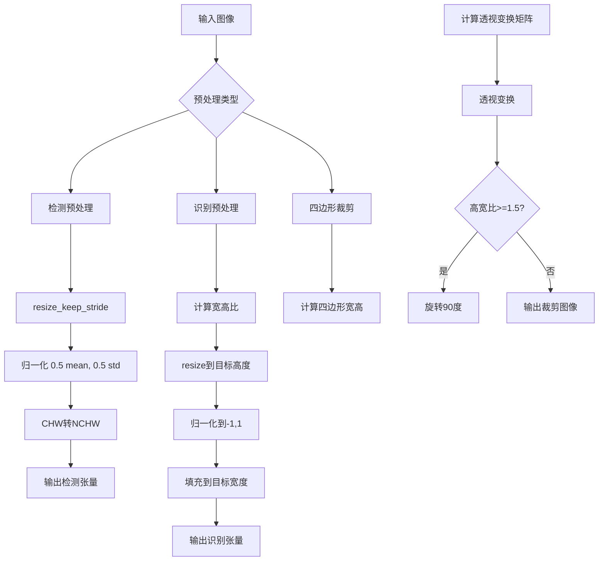

# `comic-translate\modules\ocr\ppocr\preprocessing.py` 详细设计文档

该模块提供PP-OCR系统的图像预处理功能，包括保持步长的图像缩放、检测器前处理、识别器resize归一化以及四边形区域透视裁剪等核心操作，为后续的文本检测和识别模型提供标准化的输入数据。

## 整体流程



## 类结构

```
无类定义 (函数模块)
└── 全局函数集合
    ├── resize_keep_stride - 图像缩放函数
    ├── det_preprocess - 检测预处理函数
    ├── rec_resize_norm - 识别resize归一化函数
    └── crop_quad - 四边形裁剪函数
```

## 全局变量及字段


### `img`
    
输入图像数组

类型：`np.ndarray`
    


### `limit_side_len`
    
限制边长度阈值

类型：`int`
    


### `limit_type`
    
限制类型('min'或'max')

类型：`str`
    


### `mean`
    
归一化均值

类型：`tuple`
    


### `std`
    
归一化标准差

类型：`tuple`
    


### `img_shape`
    
目标图像形状

类型：`tuple`
    


### `max_wh_ratio`
    
最大宽高比

类型：`float`
    


### `quad`
    
四边形顶点坐标

类型：`np.ndarray`
    


    

## 全局函数及方法


### `resize_keep_stride`

该函数用于调整图像尺寸，使图像的最小边或最大边满足指定阈值，并将图像高宽调整为32的倍数，以适配PP-OCR DB检测器的预处理要求。

参数：

- `img`：`np.ndarray`，输入的原始图像数据
- `limit_side_len`：`int`，限制边长的阈值，默认为960
- `limit_type`：`str`，限制类型，"max"表示限制最大边，"min"表示限制最小边，默认为"min"

返回值：`np.ndarray`，调整大小后的图像数据

#### 流程图

```mermaid
flowchart TD
    A[开始] --> B[获取图像高度h和宽度w]
    B --> C{limit_type == 'max'?}
    C -->|是| D{max(h, w) > limit_side_len?}
    C -->|否| E{min(h, w) < limit_side_len?}
    D -->|是| F[计算缩放比例: ratio = limit_side_len / max边]
    D -->|否| G[ratio = 1.0]
    E -->|是| H[计算缩放比例: ratio = limit_side_len / min边]
    E -->|否| G
    F --> I[计算目标高度nh和宽度nw]
    G --> I
    H --> I
    I --> J[nh = round(h * ratio / 32) * 32]
    J --> K[nw = round(w * ratio / 32) * 32]
    K --> L[nh = max(nh, 32)]
    L --> M[nw = max(nw, 32)]
    M --> N{nh == h and nw == w?}
    N -->|是| O[返回原图img]
    N -->|否| P[调用imk.resize调整图像]
    P --> Q[返回调整后的图像]
    O --> R[结束]
    Q --> R
```

#### 带注释源码

```python
def resize_keep_stride(img: np.ndarray, limit_side_len: int = 960, limit_type: str = "min") -> np.ndarray:
	"""Resize image so that min or max side meets threshold, snapping to multiple of 32.

	This matches the common PP-OCR DB-det precondition: H,W % 32 == 0.
	"""
	# 从图像数组中提取高度和宽度
	h, w = img.shape[:2]
	
	# 根据limit_type判断是限制最大边还是最小边
	if limit_type == "max":
		# 限制最大边：确保最大边不超过limit_side_len
		if max(h, w) > limit_side_len:
			# 计算缩放比例，使较大的边等于limit_side_len
			ratio = float(limit_side_len) / (h if h > w else w)
		else:
			# 如果最大边已经小于阈值，不需要缩放
			ratio = 1.0
	else:
		# 限制最小边：确保最小边不小于limit_side_len
		if min(h, w) < limit_side_len:
			# 计算缩放比例，使较小的边等于limit_side_len
			ratio = float(limit_side_len) / (h if h < w else w)
		else:
			# 如果最小边已经大于阈值，不需要缩放
			ratio = 1.0

	# 计算目标高度：先缩放，再 round 到 32 的倍数
	nh = int(round((h * ratio) / 32) * 32)
	# 计算目标宽度：先缩放，再 round 到 32 的倍数
	nw = int(round((w * ratio) / 32) * 32)
	
	# 确保最小尺寸为 32（防止 round 到 0）
	nh = max(nh, 32)
	nw = max(nw, 32)
	
	# 如果目标尺寸与原图尺寸相同，直接返回原图（避免不必要的缩放操作）
	if nh == h and nw == w:
		return img
	
	# imk.resize expects (w, h)，注意参数顺序是宽在前，高在后
	return imk.resize(img, (nw, nh))
```


### `det_preprocess`

该函数是 PP-OCR DB 检测器的预处理核心，负责将输入图像调整为模型所需尺寸并进行标准化处理，包括图像缩放、归一化、通道转换和批次维度扩展，最终输出符合 (N, C, H, W) 格式的 float32 张量。

参数：

- `img`：`np.ndarray`，输入的 BGR 图像数组
- `mean`：`tuple`，可选参数，默认值 `(0.5, 0.5, 0.5)`，用于标准化的均值向量
- `std`：`tuple`，可选参数，默认值 `(0.5, 0.5, 0.5)`，用于标准化的标准差向量
- `limit_side_len`：`int`，可选参数，默认值 `960`，图像边长的限制阈值
- `limit_type`：`str`，可选参数，默认值 `"min"`，限制类型，"min" 或 "max"

返回值：`np.ndarray`，预处理后的图像，形状为 `(1, 3, H, W)` 的 float32 类型张量

#### 流程图

```mermaid
flowchart TD
    A[开始: 输入图像 img] --> B[调用 resize_keep_stride]
    B --> C{图像尺寸是否变化}
    C -->|是| D[返回调整后的图像 resized]
    C -->|否| E[使用原始图像]
    D --> F[转换为 float32 并归一化到 0-1]
    E --> F
    F --> G[减去均值并除以标准差]
    G --> H[通道转换: HWC → CHW]
    H --> I[添加批次维度: CHW → NCHW]
    I --> J[输出: (1, 3, H, W) float32]
```

#### 带注释源码

```python
def det_preprocess(img: np.ndarray, mean=(0.5, 0.5, 0.5), std=(0.5, 0.5, 0.5),
                   limit_side_len: int = 960, limit_type: str = "min") -> np.ndarray:
    """Preprocess for DB detector: resize, normalize, CHW, NCHW float32."""
    # Step 1: 调整图像尺寸，使其高度和宽度都是32的倍数
    # 调用 resize_keep_stride 函数，传入图像和限制参数
    # 确保输出满足 PP-OCR DB 检测模型的输入要求
    resized = resize_keep_stride(img, limit_side_len, limit_type)
    
    # Step 2: 像素值归一化到 [0, 1] 范围
    # 将图像数据类型转换为 float32 并除以 255.0
    x = resized.astype(np.float32) / 255.0
    
    # Step 3: 标准化处理
    # 使用给定的均值和标准差进行标准化: (x - mean) / std
    # 将数据调整到以 0 为中心的分布
    x = (x - np.array(mean, dtype=np.float32)) / np.array(std, dtype=np.float32)
    
    # Step 4: 通道重排，从 HWC (高度, 宽度, 通道) 转换为 CHW (通道, 高度, 宽度)
    # 原始图像通常是 BGR 格式，转换为 PyTorch/深度学习框架常用的通道顺序
    x = x.transpose(2, 0, 1)
    
    # Step 5: 添加批次维度
    # 从 (C, H, W) 扩展为 (1, C, H, W)，符合批量推理的输入格式
    x = np.expand_dims(x, 0).astype(np.float32)
    
    # 返回预处理完成的图像张量
    return x
```


### `rec_resize_norm`

该函数是 PP-OCR 识别模型（CTC）的核心预处理模块，负责将输入图像调整为统一高度并根据宽高比计算目标宽度，进行像素值归一化（[-1, 1]），最后填充到固定目标宽度并转换为 CHW 格式返回。

参数：

-  `img`：`np.ndarray`，输入的 BGR 彩色图像，形状为 (H, W, C)，其中 C=3
-  `img_shape`：`tuple[int, int, int]`，目标形状元组，默认为 (3, 48, 320)，分别表示通道数、高度和宽度
-  `max_wh_ratio`：`float | None`，最大宽高比限制，默认为 None（使用 W/H 计算）

返回值：`np.ndarray`，返回 CHW 格式的 float32 类型数组，形状为 (C, H, target_w)，其中 target_w 为计算后的目标宽度

#### 流程图

```mermaid
flowchart TD
    A[开始] --> B[解析 img_shape 获取 c, H, W]
    B --> C{验证 img 通道数 == c}
    C -->|是| D{max_wh_ratio is None}
    C -->|否| Z[抛出 AssertionError]
    D -->|是| E[计算 max_wh_ratio = W / H]
    D -->|否| F[使用传入的 max_wh_ratio]
    E --> G[计算图像宽高比 ratio = w / h]
    F --> G
    G --> H[计算目标宽度 target_w = int(H * max_wh_ratio)]
    H --> I[计算调整后宽度 resized_w = min(target_w, ceil(H * ratio))]
    I --> J[使用 imk.resize 调整图像到 resized_w x H]
    J --> K[像素值归一化: x = x / 255.0]
    K --> L[转换为 CHW 格式: x = transpose 2,0,1]
    L --> M[归一化到 [-1,1]: x = (x - 0.5) / 0.5]
    M --> N[创建零矩阵 out 形状为 c x H x target_w]
    N --> O[将 x 填充到 out 的前 resized_w 宽度]
    O --> P[返回 out]
```

#### 带注释源码

```python
def rec_resize_norm(img: np.ndarray, img_shape=(3, 48, 320), max_wh_ratio: float | None = None) -> np.ndarray:
    """Resize and normalize for PP-OCR recognition (CTC):
    - target H=img_shape[1], W computed from ratio, padded to target width.
    - normalize to [-1,1].
    Returns CHW float32 padded array.
    """
    # 从 img_shape 元组中解构出通道数 C、高度 H、宽度 W
    c, H, W = img_shape
    
    # 断言验证输入图像必须为 3 通道 BGR 图像
    assert img.shape[2] == c, "Expect BGR with 3 channels"

    # 如果未指定最大宽高比，则使用默认比例 W/H
    if max_wh_ratio is None:
        max_wh_ratio = W / float(H)

    # 获取输入图像的原始高度和宽度
    h, w = img.shape[:2]
    
    # 计算原始图像的宽高比
    ratio = w / float(h)
    
    # 根据最大宽高比计算目标宽度（保持高度为 H）
    target_w = int(H * max_wh_ratio)
    
    # 计算调整后的宽度：取目标宽度和基于原始比例计算宽度的较小值
    # 使用 np.ceil 确保向上取整，避免信息丢失
    resized_w = min(target_w, int(np.ceil(H * ratio)))

    # 使用 imkit 库将图像调整到 resized_w x H 尺寸（注意：imkit.resize 接收 (w, h) 顺序）
    resized = imk.resize(img, (resized_w, H))
    
    # 步骤1：归一化像素值到 [0, 1] 范围（除以 255）
    x = resized.astype(np.float32) / 255.0
    
    # 步骤2：将图像从 HWC 格式转换为 CHW 格式（高度-宽度-通道 -> 通道-高度-宽度）
    x = x.transpose(2, 0, 1)
    
    # 步骤3：归一化到 [-1, 1] 范围（减 0.5 后除以 0.5）
    x = (x - 0.5) / 0.5

    # 创建固定大小的输出数组，形状为 (c, H, target_w)，使用零填充
    out = np.zeros((c, H, target_w), dtype=np.float32)
    
    # 将调整大小后的图像数据填充到输出数组的左侧（从 0 到 resized_w）
    out[:, :, :resized_w] = x
    
    # 返回预处理后的图像数据
    return out
```


### `crop_quad`

对输入图像进行透视变换裁剪，根据四边形顶点坐标提取目标区域，并在高宽比大于等于1.5时自动旋转90度以适应竖向文字的识别需求。

参数：

- `img`：`np.ndarray`，输入的原始图像数组
- `quad`：`np.ndarray`，四边形顶点坐标，形状为 (4, 2) 的数组，按顺时针或逆时针顺序排列

返回值：`np.ndarray`，裁剪并可能旋转后的图像矩阵

#### 流程图

```mermaid
flowchart TD
    A[开始 crop_quad] --> B[将四边形顶点转换为float32类型]
    B --> C[计算宽度w: 取上边和下边范数的最大值]
    C --> D[计算高度h: 取左边和右边范数的最大值]
    D --> E[构建目标矩形顶点 dst [[0,0], [w,0], [w,h], [0,h]]]
    E --> F[调用 imk.get_perspective_transform 计算透视变换矩阵 M]
    F --> G[调用 imk.warp_perspective 执行透视变换裁剪]
    G --> H{判断条件: h>0 且 w>0 且 h/w >= 1.5?}
    H -->|是| I[对crop执行逆时针旋转90度]
    H -->|否| J[返回原始crop]
    I --> K[返回旋转后的crop]
    J --> K
```

#### 带注释源码

```python
def crop_quad(img: np.ndarray, quad: np.ndarray) -> np.ndarray:
    """Perspective-crop a quadrilateral region. Auto-rotate tall crops."""
    # 将四边形顶点转换为float32类型，确保计算精度
    pts = quad.astype(np.float32)
    
    # 计算裁剪区域的宽度：取四边形上边和下边欧氏距离的最大值
    # pts[0]-pts[1] 为上边，pts[2]-pts[3] 为下边
    w = int(max(np.linalg.norm(pts[0]-pts[1]), np.linalg.norm(pts[2]-pts[3])))
    
    # 计算裁剪区域的高度：取四边形左边和右边欧氏距离的最大值
    # pts[0]-pts[3] 为左边，pts[1]-pts[2] 为右边
    h = int(max(np.linalg.norm(pts[0]-pts[3]), np.linalg.norm(pts[1]-pts[2])))
    
    # 构建目标矩形的四个顶点坐标 (左上, 右上, 右下, 左下)
    dst = np.array([[0,0],[w,0],[w,h],[0,h]], dtype=np.float32)
    
    # 调用 imkit 库计算透视变换矩阵
    # 将原始四边形顶点映射到标准矩形
    # imkit expects 4x2 arrays (x,y)
    M = imk.get_perspective_transform(pts, dst)
    
    # 执行透视变换，裁剪出四边形区域并映射到标准矩形
    crop = imk.warp_perspective(img, M, (w, h))
    
    # 如果高度大于0、宽度大于0，且高宽比 >= 1.5，则逆时针旋转90度
    # 这个设计用于处理竖向文字或较高的文本区域，使其变为横向便于识别
    if h > 0 and w > 0 and (h / float(w)) >= 1.5:
        crop = np.rot90(crop)
    
    return crop
```

## 关键组件


### 张量索引与形状变换

代码中使用numpy数组进行张量索引和形状变换，包括：`img.shape[:2]`提取高度和宽度，`x.transpose(2, 0, 1)`将HWC转为CHW格式，`np.expand_dims(x, 0)`添加batch维度，以及`out[:, :, :resized_w]`的切片赋值进行padding。

### 图像尺寸对齐与Stride保持

`resize_keep_stride`函数确保图像尺寸是32的倍数（stride=32），通过`int(round((h * ratio) / 32) * 32)`计算新尺寸，满足PP-OCR DB检测器的前置条件要求（H,W % 32 == 0）。

### DB检测器预处理流程

`det_preprocess`函数实现完整的检测前处理流程：resize到32倍数 → 归一化到[0,1] → 标准化(mean,std) → CHW转换 → 添加batch维度的float32张量。

### 识别器自适应宽高比

`rec_resize_norm`函数根据`max_wh_ratio`动态计算目标宽度，支持不同宽高比文本的归一化处理，使用`np.zeros`预分配固定形状输出并进行右侧padding。

### 四边形透视裁剪

`crop_quad`函数实现透视变换裁剪，通过`imk.get_perspective_transform`和`imk.warp_perspective`进行四边形区域提取，并支持自动旋转高宽比>=1.5的竖排文本crop。

### 图像库依赖封装

代码通过`imkit as imk`封装了底层图像处理操作，包括`imk.resize`、`imk.get_perspective_transform`和`imk.warp_perspective`，提供统一的图像变换接口。


## 问题及建议


### 已知问题

-   **硬编码的Magic Numbers**: 数字32（步长倍数）、960（默认边长限制）、1.5（高宽比阈值）在多处硬编码，缺乏常量定义
-   **缺少输入验证**: 所有函数均未对输入参数进行有效性检查，如img为None、shape不符合预期、limit_side_len为非正数等边界情况
-   **冗余的类型转换**: `det_preprocess`中先除以255.0（得到float64），再转换为float32；`rec_resize_norm`中连续进行除法和减法操作，可合并优化
-   **断言用于生产代码**: `rec_resize_norm`中使用assert进行参数验证，生产环境中会被忽略
-   **缺乏错误处理**: 调用imkit的resize、get_perspective_transform、warp_perspective等函数时未处理可能的异常
-   **重复计算**: `crop_quad`中两次调用`np.linalg.norm`计算相同的边长度
-   **函数注释不完整**: 缺少对参数约束条件、异常抛出、返回值具体说明的描述

### 优化建议

-   提取Magic Numbers为模块级常量（如STRIDE=32, DEFAULT_LIMIT=960），提高可维护性
-   在函数入口添加参数校验，使用raise抛出明确的ValueError或TypeError
-   优化类型转换流程，先转换astype再进行除法，避免中间类型提升
-   将assert替换为显式的参数验证逻辑，或使用if-raise模式
-   使用try-except包装imkit调用，捕获并转换或记录异常
-   使用functools.lru_cache或局部变量缓存重复计算结果
-   为所有公共函数补充完整的docstring，包括参数范围、异常、返回值说明
-   考虑将mean/std等归一化参数提取为可配置的默认参数或配置对象


## 其它


### 设计目标与约束

本模块旨在为PP-OCR系统提供统一的图像预处理功能，确保输入图像满足检测器和识别器的尺寸和格式要求。核心约束包括：1) 输出图像尺寸必须为32的倍数以满足模型stride要求；2) 支持动态宽高比处理以适应不同文本区域；3) 所有操作必须保持数值稳定性，避免精度损失。

### 错误处理与异常设计

代码中主要通过assert语句进行关键参数校验，如`rec_resize_norm`中验证通道数是否为3。潜在的异常场景包括：1) 空图像输入导致shape为0；2) 四边形顶点坐标无效或退化；3) 图像数据类型不兼容。建议增加更健壮的异常处理机制，包括输入类型检查、数值范围验证、异常信息日志记录等。

### 数据流与状态机

图像预处理流程呈现线性数据流状态：原始图像 -> 尺寸调整 -> 归一化 -> 通道转换 -> 维度扩展。各函数间通过NumPy数组传递状态，无内部状态机设计。det_preprocess和rec_resize_norm分别对应检测和识别两条独立的数据处理路径，crop_quad作为辅助函数处理特殊几何变换。

### 外部依赖与接口契约

本模块依赖两个外部包：1) NumPy用于数值计算和数组操作；2) imkit(imk)包提供图像Resize和透视变换功能。接口契约规定：输入图像均为BGR格式的NumPy数组(H,W,C)，输出为NCHW格式的float32张量。imkit.resize期望参数顺序为(width, height)即(nw, nh)而非(height, width)，这点在代码注释中已明确说明。

### 性能考虑

当前实现主要性能开销在于：1) 多次数组拷贝和转换；2) imkit.resize的内部实现效率；3) crop_quad中的矩阵运算。可考虑的优化方向包括：1) 使用原地操作减少内存分配；2) 对于批量处理可预先分配输出缓冲区；3) 验证imkit函数是否支持GPU加速。

### 边界条件处理

代码对边界情况的处理包括：1) 当图像尺寸已满足限制时直接返回原图避免无效计算；2) 最小尺寸限制为32像素；3) 四边形裁剪中当高宽比>=1.5时自动旋转图像以适应竖排文字；4) 目标宽度padding使用零填充。仍需注意的边界情况包括：图像宽高比极端时的数值稳定性、四边形顶点顺序一致性等。

### 使用示例与典型场景

典型使用流程为：1) 检测阶段调用det_preprocess获取符合DB检测器要求的输入张量；2) 根据检测结果坐标使用crop_quad裁剪文本区域；3) 对裁剪区域调用rec_resize_norm进行识别器预处理。示例代码：img = cv2.imread("text.jpg"); det_input = det_preprocess(img); crop = crop_quad(img, detected_quad); rec_input = rec_resize_norm(crop)。

### 版本信息与变更日志

当前版本为1.0.0，初始版本包含四个核心预处理函数。该模块设计时参考了PaddleOCR的PP-OCR预处理逻辑，特别是DB检测器的32倍数约束和CTC识别器的动态宽高比处理机制。

    