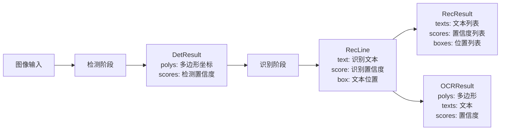

# `comic-translate\modules\ocr\ppocr\typings.py` 详细设计文档

该模块定义了OCR（光学字符识别）系统的数据结构，用于存储检测结果（多边形框）、识别结果（文本和置信度）以及完整的OCR输出结果。

## 整体流程



## 类结构

```
无继承关系的独立数据类
├── DetResult (检测结果)
├── RecLine (单行识别结果)
├── RecResult (识别结果集合)
└── OCRResult (完整OCR结果)
```

## 全局变量及字段


### `DetResult.polys`
    
检测到的多边形坐标，形状为(N,4,2)的int32数组

类型：`np.ndarray`
    


### `DetResult.scores`
    
每个多边形的检测置信度分数列表

类型：`List[float]`
    


### `RecLine.text`
    
识别出的文本内容

类型：`str`
    


### `RecLine.score`
    
该行文本的识别置信度

类型：`float`
    


### `RecLine.box`
    
该行文本的可选边界框

类型：`Optional[np.ndarray]`
    


### `RecResult.texts`
    
识别出的所有文本列表

类型：`List[str]`
    


### `RecResult.scores`
    
每个文本的识别置信度列表

类型：`List[float]`
    


### `RecResult.boxes`
    
可选的边界框列表

类型：`Optional[List[np.ndarray]]`
    


### `OCRResult.polys`
    
检测到的多边形坐标数组

类型：`np.ndarray`
    


### `OCRResult.texts`
    
识别出的文本列表

类型：`List[str]`
    


### `OCRResult.scores`
    
识别置信度列表

类型：`List[float]`
    
    

## 全局函数及方法


## 关键组件


### DetResult

检测结果数据类，用于存储目标检测的多边形框和置信度分数。包含多边形坐标数组(N,4,2)的int32类型和对应的分数列表。

### RecLine

单行文本识别结果数据类，存储单个文本行的识别内容、置信度分数和可选的边界框信息。

### RecResult

文本识别结果数据类，存储多行文本的识别结果，包含文本列表、分数列表和可选的边界框列表。

### OCRResult

OCR完整结果数据类，整合检测和识别结果，统一存储多边形框、识别文本和对应分数。

### numpy数组使用

代码中使用numpy的ndarray类型存储几何数据（多边形和边界框），提供了高效的数值计算和内存管理。

### 可选参数设计

使用Optional类型标注和默认值None，为边界框信息提供灵活的参数设计，支持按需返回详细的坐标信息。


## 问题及建议


### 已知问题

-   **类型不一致**：`DetResult.scores` 使用 `List[float]`，而 `polys` 使用 `np.ndarray`，数据类型不统一，可能导致后续处理时的类型转换开销
-   **缺少数组形状验证**：各 dataclass 未验证数组维度是否符合声明（如 `polys` 应为 `(N, 4, 2)`，`boxes` 数量应与 `texts` 一致）
-   **可选字段处理不一致**：`RecResult.boxes` 使用 `Optional[List[np.ndarray]]`，而 `RecLine.box` 使用 `Optional[np.ndarray]`，设计风格不统一
-   **类型注解缺失 dtype**：`polys` 声明为 `np.ndarray` 但未指定具体 dtype（docstring 提到 int32），可能导致类型检查工具无法准确识别
-   **无数据一致性校验**：未在 `__post_init__` 中校验 `polys` 和 `scores` 长度是否匹配、`boxes` 与 `texts` 是否对应
-   **文档不完整**：除 `DetResult` 外，其他类缺少 docstring；字段说明不完整

### 优化建议

-   **统一数据类型**：将 `DetResult.scores` 改为 `np.ndarray`，与 `polys` 保持一致，减少类型转换
-   **添加 `__post_init__` 验证**：在 dataclass 中实现初始化后验证，确保数据完整性（如 `len(polys) == len(scores)`）
-   **完善类型注解**：显式指定 dtype，如 `polys: np.ndarray[np.int32, ...]`，或使用 `npt.NDArray[np.int32]`（需导入 `numpy.typing`）
-   **统一可选字段设计**：考虑统一使用 `Optional[List[np.ndarray]]` 或定义类型别名
-   **添加完整文档**：为所有类和字段添加 docstring，说明数组维度、取值范围等约束
-   **考虑添加工厂方法**：如 `DetResult.from_scores(polys, scores)`，封装验证逻辑，提高易用性


## 其它


### 设计目标与约束

本代码模块旨在定义OCR系统中检测与识别结果的标准数据结构，支持文本区域的多边形表示、文本内容存储及置信度评分。设计约束包括：依赖NumPy进行高效的数组操作，确保多边形坐标为int32类型以减少内存占用，文本与分数列表长度必须严格匹配，可选字段在未提供时默认为None，且所有数据类需保持向后兼容性以便于序列化与反序列化。

### 错误处理与异常设计

在实例化数据类时应进行输入验证：DetResult需确保polys的形状为(N,4,2)且类型为int32，scores列表长度与polys的第一维N一致；RecLine和RecResult需验证texts与scores长度匹配，box数组形状需符合预期(4,2)或(N,4,2)；OCRResult需确保polys、texts、scores三者长度一致。建议定义自定义异常类如ShapeMismatchError、LengthMismatchError以处理维度不匹配或类型错误的情况，并在数据类中添加__post_init__方法进行自动校验。

### 数据流与状态机

数据流从输入图像开始，经过文本检测模块输出DetResult（包含多边形区域），随后进入识别模块生成RecResult（文本与分数），最终整合为OCRResult。状态机在此模块中不适用，因数据类仅作为数据容器，不涉及状态转换逻辑，但可描述为：原始图像 → 文本检测 → 候选框过滤 → 文本识别 → 结果聚合 → 输出OCRResult。

### 外部依赖与接口契约

核心依赖包括NumPy（用于多维数组操作）、typing（类型提示支持）、dataclasses（简化数据类定义）。接口契约方面：所有字段均为公开属性，无私有方法；polys必须为numpy.ndarray，scores必须为List[float]，texts必须为List[str]，boxes和RecLine.box为可选的numpy.ndarray；模块应提供from_dict和to_dict方法用于字典转换，以及validate方法用于数据校验。

### 性能要求与基准

性能目标：实例化时间应控制在微秒级，序列化（JSON）吞吐量应达到每秒十万次实例。优化方向：对于大规模N值，可使用NumPy的向量化操作替代Python列表推导式；在内存敏感场景下，polys数组应使用连续内存布局（C order）以提高缓存命中率。建议进行基准测试：测量单实例创建耗时、1000次实例列表创建耗时、JSON序列化与反序列化耗时。

### 安全性与隐私考虑

安全性方面，数据类本身不执行文件IO或网络请求，风险较低，但需注意在日志输出时避免打印包含敏感信息的texts字段。隐私方面，若OCR处理涉及隐私数据（如身份证、票据），应在传递RecResult时对texts字段进行脱敏处理，并在数据类中添加redact方法以支持自动脱敏。

### 可扩展性与未来计划

可扩展性设计：可通过继承基础类添加领域特定字段，例如添加language字段表示检测语言、添加orientation字段表示文本方向。未来计划：可引入泛型以支持不同类型的检测结果（如通用OCR与表格OCR），或添加元数据类Metadata用于存储处理时间、设备信息等。

### 序列化与反序列化策略

序列化方案：推荐使用JSON格式（需将numpy数组转换为列表），或使用MessagePack以提高序列化效率。反序列化时需重建numpy数组并验证形状与类型。应在模块中实现to_json、from_json、to_bytes、from_bytes方法，并支持pickle以用于进程间通信。

### 版本兼容性策略

数据类应添加version字段（默认值为1）以支持版本追踪。当数据结构变更时（如新增字段），旧版本数据可通过默认参数实现向后兼容。模块应提供migrate方法支持旧版本数据向新版本的迁移，并遵循语义化版本号规范。

### 单元测试策略

测试用例应覆盖：有效输入的实例化（边界条件如N=0、N=1）、无效形状的polys（如(N,3,2)）应抛出异常、长度不匹配的polys与scores应抛出异常、可选字段为None时的行为、序列化与反序列化的完整性验证、__eq__方法的行为（numpy数组比较）。建议使用pytest框架并参数化测试用例。

### 使用示例与典型场景

典型场景1：后端API返回OCR结果，前端解析并渲染检测框。典型场景2：将OCR结果持久化到数据库，需先序列化为JSON。示例代码：det_result = DetResult(polys=np.array([[[0,0],[10,0],[10,20],[0,20]]],dtype=np.int32), scores=[0.9])；rec_result = RecResult(texts=["Hello"], scores=[0.95])；ocr_result = OCRResult(polys=det_result.polys, texts=rec_result.texts, scores=rec_result.scores)。

    