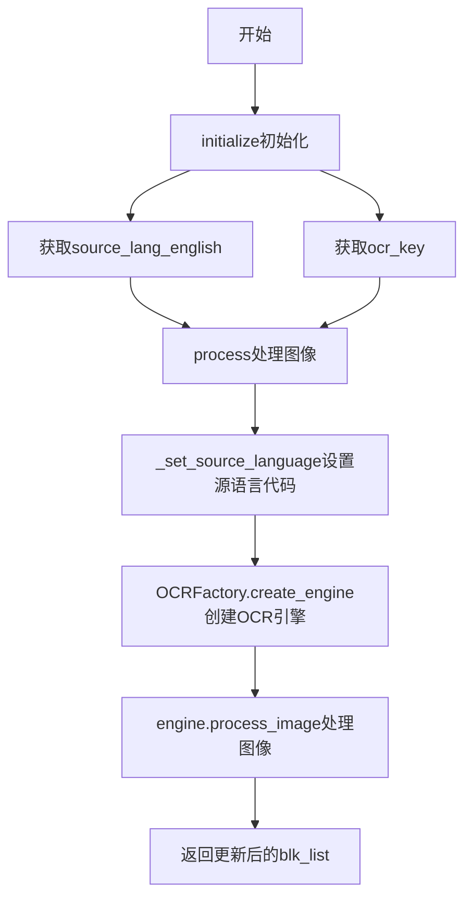
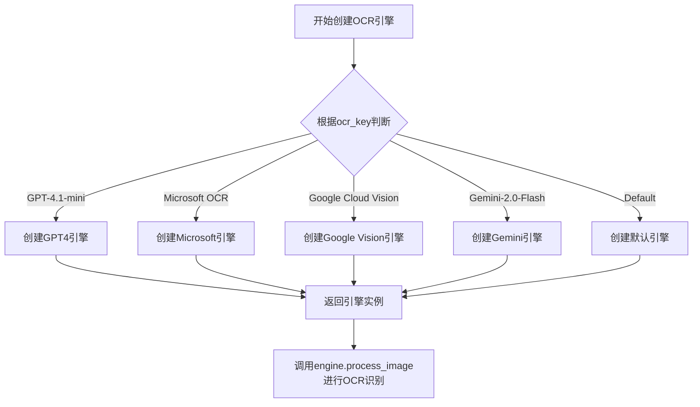
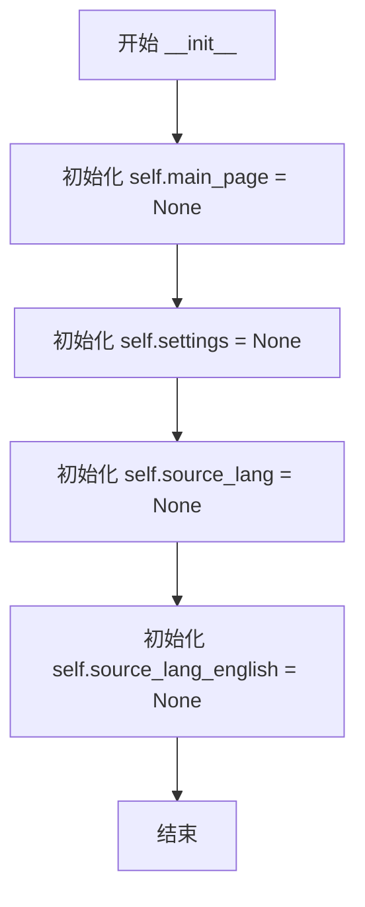
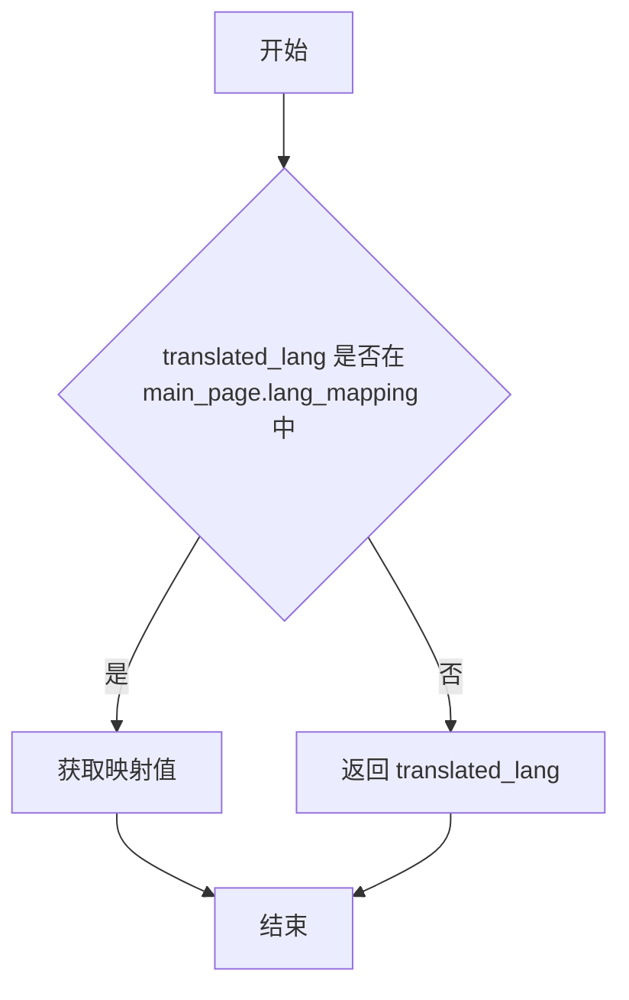
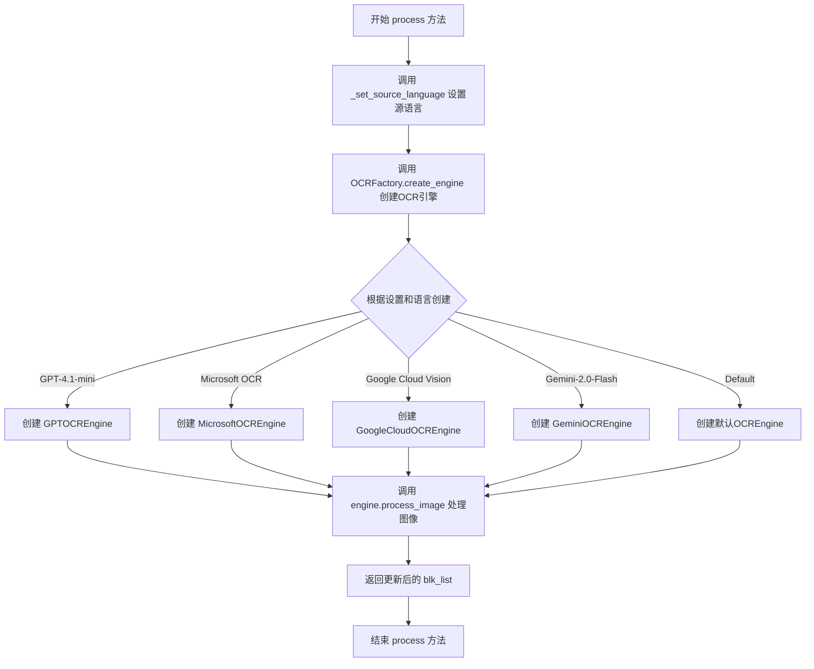
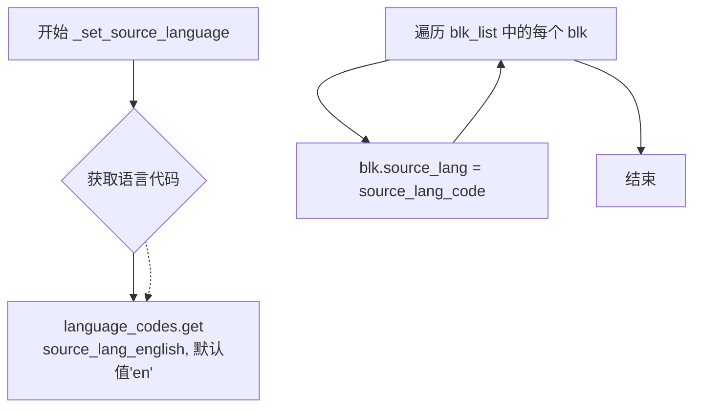
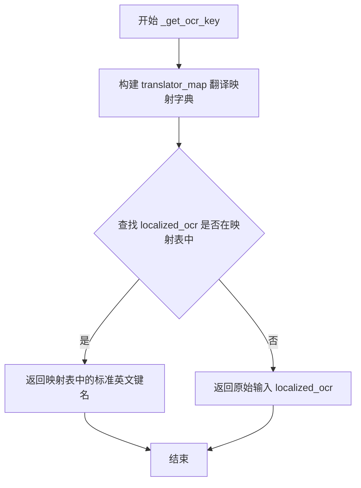

# `comic-translate\modules\ocr\processor.py` 详细设计文档

OCR处理器模块，使用工厂模式根据设置和语言动态创建合适的OCR引擎，对图像中的文本块进行识别处理。

## 整体流程



## 类结构

```
OCRProcessor (OCR处理器类)
```

## 全局变量及字段


### `np`
    
NumPy库，用于数值计算和图像处理

类型：`module (numpy)`
    


### `Any`
    
Python类型提示，表示任意类型

类型：`typing.Any`
    


### `TextBlock`
    
文本块对象，用于存储OCR识别结果

类型：`class`
    


### `language_codes`
    
语言代码映射字典

类型：`dict`
    


### `OCRFactory`
    
OCR引擎工厂类，用于创建不同的OCR引擎

类型：`class`
    


### `OCRProcessor.main_page`
    
主应用页面引用

类型：`Any`
    


### `OCRProcessor.settings`
    
设置页面对象

类型：`Any`
    


### `OCRProcessor.source_lang`
    
源语言

类型：`str`
    


### `OCRProcessor.source_lang_english`
    
英文源语言

类型：`str`
    


### `OCRProcessor.ocr_key`
    
OCR引擎标识

类型：`str`
    
    

## 全局函数及方法


### `OCRFactory.create_engine`

工厂方法，根据设置、源语言和OCR密钥创建并返回相应的OCR引擎实例，用于对图像进行文本识别处理。

参数：

- `settings`：任意类型，应用设置对象，包含工具选择等配置信息
- `source_lang_english`：字符串，英文形式的源语言名称（如 'English', 'Chinese' 等）
- `ocr_key`：字符串，本地化的OCR引擎标识符（如 'GPT-4.1-mini', 'Microsoft OCR', 'Google Cloud Vision', 'Gemini-2.0-Flash', 'Default'）

返回值：对象，具备 `process_image(img, blk_list)` 方法的OCR引擎实例，用于执行图像文本识别

#### 流程图



#### 带注释源码

```python
# 在 OCRProcessor.process() 方法中调用工厂方法创建引擎
def process(self, img: np.ndarray, blk_list: list[TextBlock]) -> list[TextBlock]:
    """
    Process image with appropriate OCR engine.
    
    Args:
        img: Input image as numpy array
        blk_list: List of TextBlock objects to update with OCR text
        
    Returns:
        Updated list of TextBlock objects with recognized text
    """
    
    # 设置源语言代码
    self._set_source_language(blk_list)
    
    # 使用工厂方法创建OCR引擎
    # 参数1: settings - 包含应用配置的设置对象
    # 参数2: source_lang_english - 英文语言名称
    # 参数3: ocr_key - OCR引擎标识符（如'GPT-4.1-mini', 'Microsoft OCR'等）
    engine = OCRFactory.create_engine(self.settings, self.source_lang_english, self.ocr_key)
    
    # 调用引擎的process_image方法处理图像
    # 该引擎对象由工厂方法根据ocr_key动态创建
    return engine.process_image(img, blk_list)
```


### `OCRProcessor.__init__`

构造函数，初始化 OCRProcessor 类的实例，创建四个实例变量用于存储主页面对象、设置对象、源语言和源语言的英文名称。

参数： 无（除了隐式的 `self` 参数）

返回值： 无（`None`）

#### 流程图



#### 带注释源码

```python
def __init__(self):
    """
    初始化 OCRProcessor 实例。
    
    创建一个新的 OCRProcessor 对象，并将其所有实例变量
    初始化为默认值。实际赋值在 initialize 方法中完成。
    """
    self.main_page = None          # 主应用程序页面对象，用于访问设置和语言映射
    self.settings = None           # 应用程序设置对象，包含工具选择等配置
    self.source_lang = None       # 源语言代码（如 'zh_CN', 'en_US' 等）
    self.source_lang_english = None  # 源语言的英文名称，用于 OCR 引擎选择
```


### `OCRProcessor.initialize`

初始化 OCR 处理器，设置主页面、源语言和 OCR 引擎配置。

参数：

- `main_page`：`Any`，主应用程序页面，包含设置信息
- `source_lang`：`str`，OCR 处理的源语言

返回值：`None`，无返回值

#### 流程图

```mermaid
flowchart TD
    A[开始 initialize] --> B[设置 self.main_page = main_page]
    B --> C[从 main_page 获取 settings: self.settings = main_page.settings_page]
    C --> D[设置 self.source_lang = source_lang]
    D --> E[调用 _get_english_lang 转换语言: self.source_lang_english = self._get_english_lang(source_lang)]
    E --> F[调用 _get_ocr_key 获取 OCR 密钥: self.ocr_key = self._get_ocr_key(...)]
    F --> G[结束]
```

#### 带注释源码

```python
def initialize(self, main_page: Any, source_lang: str) -> None:
    """
    Initialize the OCR processor with settings and language.
    
    Args:
        main_page: The main application page with settings
        source_lang: The source language for OCR
    """
    # 将传入的主页面对象保存为实例变量，供后续方法使用
    self.main_page = main_page
    
    # 从主页面中提取设置页面，settings 包含了 OCR 引擎选择等配置
    self.settings = main_page.settings_page
    
    # 保存源语言，用于后续 OCR 处理的语言设置
    self.source_lang = source_lang
    
    # 将本地化语言转换为英文名称，以便 OCR 引擎识别
    # 例如：将"中文"转换为 "Chinese"
    self.source_lang_english = self._get_english_lang(source_lang)
    
    # 根据设置中选中的 OCR 工具，获取对应的密钥或标识符
    # 该方法会将本地化的 OCR 名称映射为内部使用的键值
    self.ocr_key = self._get_ocr_key(self.settings.get_tool_selection('ocr'))
```


### `OCRProcessor._get_english_lang`

将翻译后的语言名称转换为其对应的英文名称，如果映射不存在则返回原值。

参数：

-  `translated_lang`：`str`，翻译/本地化的语言名称

返回值：`str`，对应的英文语言名称，如果映射中不存在则返回原始输入值

#### 流程图



#### 带注释源码

```python
def _get_english_lang(self, translated_lang: str) -> str:
    """
    将翻译后的语言名称转换为英文名称。
    
    Args:
        translated_lang: 翻译/本地化的语言名称
        
    Returns:
        对应的英文语言名称，如果映射中不存在则返回原始输入值
    """
    # 使用 main_page 的 lang_mapping 字典获取英文名称
    # 如果 key 不存在，则返回默认值 translated_lang 本身
    return self.main_page.lang_mapping.get(translated_lang, translated_lang)
```


### `OCRProcessor.process`

该方法是OCR处理器的核心方法，负责使用适当的OCR引擎处理图像并识别文本。它首先设置源语言，然后通过工厂模式创建对应的OCR引擎，最后调用引擎的process_image方法完成图像文本识别。

参数：

- `img`：`np.ndarray`，输入的图像数据，以NumPy数组形式表示
- `blk_list`：`list[TextBlock]`，TextBlock对象列表，用于存储待识别的文本区域，方法执行后会将识别结果更新到这些对象中

返回值：`list[TextBlock]`，返回更新后的TextBlock对象列表，其中包含了识别出的文本内容

#### 流程图



#### 带注释源码

```python
def process(self, img: np.ndarray, blk_list: list[TextBlock]) -> list[TextBlock]:
    """
    Process image with appropriate OCR engine.
    
    Args:
        img: Input image as numpy array
        blk_list: List of TextBlock objects to update with OCR text
        
    Returns:
        Updated list of TextBlock objects with recognized text
    """

    # 第一步：设置源语言
    # 遍历所有TextBlock对象，为每个块设置源语言代码
    self._set_source_language(blk_list)
    
    # 第二步：创建OCR引擎
    # 根据设置、源语言英文名和OCR密钥，通过工厂模式创建相应的OCR引擎
    engine = OCRFactory.create_engine(self.settings, self.source_lang_english, self.ocr_key)
    
    # 第三步：处理图像
    # 调用引擎的process_image方法，对图像进行OCR识别，并更新TextBlock列表
    return engine.process_image(img, blk_list)
```


### `OCRProcessor._set_source_language`

该方法遍历文本块列表，从语言代码映射表中获取当前源语言对应的 ISO 语言代码（如 'en'、'zh' 等），然后为每个 TextBlock 对象的 `source_lang` 属性赋值，以便后续 OCR 引擎能够正确识别文本的语言类型。

参数：

- `blk_list`：`list[TextBlock]`，需要设置源语言代码的文本块对象列表

返回值：`None`，该方法直接修改传入的文本块列表中的对象属性，不返回任何值

#### 流程图



#### 带注释源码

```python
def _set_source_language(self, blk_list: list[TextBlock]) -> None:
    """
    为文本块列表中的每个块设置源语言代码。
    
    该方法将当前源语言（英文名称）映射为 ISO 639-1 语言代码，
    并赋值给每个 TextBlock 的 source_lang 属性，供 OCR 引擎使用。
    
    Args:
        blk_list: 文本块列表，每个元素都会被修改 source_lang 属性
    """
    # 从 language_codes 字典获取语言代码，如果未找到则默认使用 'en'
    source_lang_code = language_codes.get(self.source_lang_english, 'en')
    
    # 遍历所有文本块，为每个块设置源语言代码
    for blk in blk_list:
        blk.source_lang = source_lang_code
```


### `OCRProcessor._get_ocr_key`

该方法是一个私有实例方法，用于将本地化（翻译后）的 OCR 引擎名称映射回标准的英文键名。它通过一个预定义的翻译映射字典将 UI 显示的本地化名称转换为工厂创建引擎时需要的标准英文标识符，如果映射表中不存在对应项则直接返回原始输入。

参数：

- `localized_ocr`：`str`，从 UI 获取的本地化（翻译后）OCR 引擎名称

返回值：`str`，标准英文 OCR 引擎键名，用于 OCR 工厂创建对应引擎

#### 流程图



#### 带注释源码

```python
def _get_ocr_key(self, localized_ocr: str) -> str:
    """
    将本地化的OCR引擎名称映射回标准英文键名。
    
    Args:
        localized_ocr: 从UI获取的本地化OCR引擎名称
        
    Returns:
        标准英文OCR引擎键名
    """
    # 定义翻译映射字典，将UI显示的本地化名称映射回标准英文标识符
    translator_map = {
        self.settings.ui.tr('GPT-4.1-mini'): 'GPT-4.1-mini',
        self.settings.ui.tr('Microsoft OCR'): 'Microsoft OCR',
        self.settings.ui.tr('Google Cloud Vision'): 'Google Cloud Vision',
        self.settings.ui.tr('Gemini-2.0-Flash'): 'Gemini-2.0-Flash',
        self.settings.ui.tr('Default'): 'Default',
    }
    # 查找映射表，如果找不到则返回原始输入（保持向后兼容）
    return translator_map.get(localized_ocr, localized_ocr)
```

## 关键组件


### OCRProcessor 类

OCRProcessor是OCR操作的核心处理器类，采用工厂模式根据设置和语言创建合适的OCR引擎，负责图像文本识别的初始化、语言设置和流程处理。

### 工厂模式 (OCRFactory)

用于根据设置和语言动态创建不同OCR引擎的工厂类，隐藏了具体OCR引擎的实现细节，支持GPT-4.1-mini、Microsoft OCR、Google Cloud Vision、Gemini-2.0-Flash等多种引擎。

### TextBlock 数据结构

用于存储文本块信息的对象，包含识别文本、置信度、位置坐标等属性，OCR处理后会被更新包含识别结果。

### 语言代码映射机制

通过language_codes字典和_get_english_lang方法实现多语言支持，将用户界面语言映射为标准语言代码，用于OCR引擎的文本识别。

### OCR引擎选择与配置

通过_get_ocr_key方法将本地化的OCR引擎名称（如"GPT-4.1-mini"）映射为内部使用的引擎标识符，支持多种OCR引擎的灵活切换。

### 图像处理流程

process方法是核心处理流程，包括设置源语言、创建OCR引擎、执行图像识别并返回更新后的TextBlock列表，实现端到端的OCR处理。


## 问题及建议


### 已知问题

-   **硬编码的OCR引擎映射**：`_get_ocr_key` 方法中的 `translator_map` 是硬编码的，新增OCR引擎或修改UI文本时需要修改代码，违反开闭原则
-   **缺少异常处理**：多处调用缺乏异常处理——`OCRFactory.create_engine` 可能返回 `None` 或抛出异常；`process_image` 的结果没有校验；`_get_english_lang` 的 `get` 方法若找不到映射会返回原值，可能导致后续问题
-   **类型注解不完整**：`self.main_page`、`self.settings`、`self.ocr_key` 缺少类型注解；`initialize` 方法的 `source_lang` 参数没有校验
-   **重复初始化风险**：`initialize` 方法可被多次调用而没有幂等性检查，可能导致状态覆盖问题
-   **状态空值风险**：`self.main_page` 可能为 `None`（构造时未初始化），但 `initialize` 后直接访问 `main_page.settings_page` 和 `main_page.lang_mapping`，缺乏空值保护
-   **设计耦合**：`_get_ocr_key` 依赖 `self.settings.ui.tr()` 进行UI文本翻译，将OCR引擎选择逻辑与UI层耦合，影响可测试性和可维护性

### 优化建议

-   将 OCR 引擎映射关系提取为配置文件或枚举类，消除硬编码；或让 `OCRFactory` 直接接收标准化的引擎标识符，而非依赖翻译映射
-   在 `process` 方法中添加 `try-except` 捕获 `OCRFactory.create_engine` 可能的异常，并对 `engine.process_image` 的返回值进行类型和有效性校验
-   完善类型注解：为 `self.main_page` 定义 `PageType` 泛型；为 `self.ocr_key` 添加 `str` 类型；为 `initialize` 的 `source_lang` 添加非空校验
-   在 `initialize` 开头添加初始化状态检查（如 `if self.main_page is not None: return`），或提供 `reset` 方法确保幂等性
-   在访问 `main_page` 属性前使用 `getattr` 或 `hasattr` 检查，或在类初始化时确保 `main_page` 不为 `None`
-   将 `_get_ocr_key` 的翻译映射逻辑移至配置层或工厂类，降低与 UI 层的耦合；考虑依赖注入方式传递翻译函数而非直接访问 `self.settings.ui`

## 其它


### 设计目标与约束

该模块采用工厂模式设计，旨在解耦OCR引擎的具体实现，使系统能够灵活支持多种OCR服务提供商（如GPT-4.1-mini、Microsoft OCR、Google Cloud Vision、Gemini-2.0-Flash等）。核心约束包括：必须依赖`OCRFactory`工厂类创建引擎实例；语言参数需要经过映射转换才能用于OCR服务；所有OCR操作通过统一的`TextBlock`数据结构传递文本块信息。设计遵循开闭原则，新增OCR引擎时无需修改`OCRProcessor`类本身。

### 错误处理与异常设计

当前代码缺少显式的异常处理机制，存在以下风险点：

1. **工厂创建失败**：若`OCRFactory.create_engine()`返回`None`或抛出异常，`process()`方法将导致调用方崩溃
2. **语言映射缺失**：当`source_lang`在`lang_mapping`中不存在时，`_get_english_lang()`会返回原始语言码，可能导致OCR引擎使用错误语言
3. **语言代码缺失**：`language_codes.get()`使用默认值'en'，但未校验OCR引擎是否真正支持该语言
4. **图像输入校验缺失**：`process()`方法未校验`img`是否为有效numpy数组或`blk_list`是否为空

建议增加异常捕获、参数校验和降级策略，例如工厂创建失败时抛出明确异常而非隐式传递。

### 数据流与状态机

数据流转过程如下：

```
输入: img (np.ndarray) + blk_list (list[TextBlock])
    ↓
initialize() 初始化阶段: 设置 main_page/settings/source_lang
    ↓
process() 处理阶段
    ├→ _set_source_language(): 为每个TextBlock设置source_lang代码
    ├→ OCRFactory.create_engine(): 根据配置和语言创建引擎实例
    └→ engine.process_image(): 调用引擎处理图像并更新blk_list
    ↓
输出: 更新后的 blk_list (list[TextBlock])
```

状态机方面，`OCRProcessor`包含两种主要状态：**未初始化状态**（`main_page=None`）和**已初始化状态**（`initialize()`调用后）。`process()`方法仅在已初始化状态下才能正常工作。

### 外部依赖与接口契约

**依赖模块**：

- `..utils.textblock.TextBlock`：文本块数据结构，需包含`source_lang`属性用于存储语言代码
- `..utils.language_utils.language_codes`：语言代码映射字典（如{'English': 'en', 'Chinese': 'zh'}）
- `.factory.OCRFactory`：工厂类，需实现`create_engine(settings, lang, ocr_key)`静态方法返回OCR引擎实例

**接口契约**：

- `OCRFactory.create_engine()`必须返回具有`process_image(img, blk_list)`方法的对象
- `TextBlock`对象必须可写属性`source_lang`
- `main_page.settings_page`需提供`get_tool_selection(tool_name)`和`ui`对象（包含`tr()`方法用于国际化翻译）
- `main_page.lang_mapping`需提供语言映射字典

### 配置管理

配置管理通过以下途径实现：

1. **OCR引擎选择**：通过`settings.get_tool_selection('ocr')`获取用户选择的OCR引擎（本地化字符串），经`_get_ocr_key()`映射为标准引擎名称
2. **语言配置**：通过构造函数参数`source_lang`传入，经`_get_english_lang()`映射为英文语言名，再经`language_codes`转换为ISO语言代码
3. **UI翻译**：使用`settings.ui.tr()`方法实现UI字符串的本地化翻译

### 线程安全与并发考虑

当前实现**非线程安全**：实例字段（`main_page`、`settings`、`source_lang`等）在多线程环境下可能被并发访问和修改。若在多线程环境中使用，建议：

1. 避免共享`OCRProcessor`实例，每个线程创建独立实例
2. 或引入锁机制保护共享状态
3. 或将状态管理改为无状态的函数式调用方式

### 性能优化空间

1. **引擎缓存**：每次调用`process()`都重新创建OCR引擎实例，可考虑缓存已创建的引擎避免重复初始化开销
2. **批量处理**：当前逐个设置`blk_list`中每个块的语言代码，可使用向量化操作优化
3. **懒加载**：若OCR处理非即时需求，可延迟到真正需要时才调用`process()`

### 安全性考虑

1. **API密钥安全**：`ocr_key`可能包含敏感的API密钥，需确保不通过日志或错误信息泄露
2. **输入验证**：建议对传入的`img`和`blk_list`进行类型和有效性校验，防止注入攻击或异常数据导致系统不稳定

### 可测试性设计

当前设计对单元测试存在一定障碍：

1. 强依赖`OCRFactory`工厂类，需使用mock对象模拟
2. 依赖`main_page`对象的多个属性和方法，测试时需要构造复杂的mock对象
3. 建议将`_get_english_lang()`、`_get_ocr_key()`、`_set_source_language()`等方法提取为可独立测试的单元，或提供接口注入点以便mock

### 版本兼容性

代码使用了Python 3.9+的类型标注语法（如`list[TextBlock]`），要求Python版本不低于3.9。`numpy`作为必需依赖，需在项目环境中确保安装。


    