# `comic-translate\modules\ocr\user_ocr.py` 详细设计文档

UserOCR是一个桌面OCR引擎实现，作为客户端将图像处理请求代理到远程Web API，支持基于LLM的逐块处理（如Gemini）和全页处理（如Microsoft OCR），同时管理用户认证令牌和积分。

## 整体流程

```mermaid
graph TD
    A[Start] --> B[initialize]
    B --> C[process_image]
    C --> D{检查 OCR Key 类型}
    D -- LLM Type --> E[_process_blocks_llm]
    D -- Full Page Type --> F[_process_full_page]
    E --> G[获取 Access Token]
    F --> G
    G --> H[图像编码为 Base64]
    H --> I[构建 JSON Payload]
    I --> J[发送 HTTP POST 请求]
    J --> K{响应状态 200?}
    K -- 是 --> L[解析 JSON 并更新积分]
    K -- 否 --> M[处理异常 (积分不足/内容违规)]
    L --> N[返回更新后的 Block 列表]
    M --> N
```

## 类结构

```
OCREngine (抽象基类)
└── UserOCR (桌面 OCR 客户端实现)
```

## 全局变量及字段


### `logger`
    
Module-level logger for logging runtime events and errors.

类型：`logging.Logger`
    


### `WEB_API_OCR_URL`
    
The backend URL for the OCR web API endpoint.

类型：`str`
    


### `UserOCR.api_url`
    
The URL of the backend OCR endpoint.

类型：`str`
    


### `UserOCR.settings`
    
The desktop application's settings object.

类型：`SettingsPage`
    


### `UserOCR.ocr_key`
    
The OCR key selected in the UI (e.g., 'Microsoft OCR').

类型：`str`
    


### `UserOCR.source_lang_english`
    
Optional source language hint in English.

类型：`str`
    


### `UserOCR.is_llm_type`
    
Flag indicating if block-by-block LLM processing should be used.

类型：`bool`
    


### `UserOCR.is_full_page_type`
    
Flag indicating if full-page processing should be used.

类型：`bool`
    


### `UserOCR.auth_client`
    
Client for handling user authentication.

类型：`AuthClient`
    


### `UserOCR._session`
    
HTTP session for making API requests.

类型：`requests.Session`
    


### `UserOCR._profile_web_api`
    
Performance profiling switch to log timing details.

类型：`bool`
    


### `UserOCR.LLM_OCR_KEYS`
    
Set of supported LLM engine keys (e.g., Gemini).

类型：`Set`
    


### `UserOCR.FULL_PAGE_OCR_KEYS`
    
Set of supported full-page engine keys (e.g., Microsoft OCR).

类型：`Set`
    


### `UserOCR.__init__`
    
Initializes the UserOCR engine with an optional API URL.

类型：`method`
    


### `UserOCR.initialize`
    
Configures the engine with settings, language, and OCR key, determining the processing strategy.

类型：`method`
    


### `UserOCR.process_image`
    
Main entry point to process image, routing to LLM or full-page strategy based on the key.

类型：`method`
    


### `UserOCR._get_access_token`
    
Retrieves the valid access token for API authentication.

类型：`method`
    


### `UserOCR._get_llm_options`
    
Extracts LLM configuration options (e.g., temperature) from settings.

类型：`method`
    


### `UserOCR._process_blocks_llm`
    
Handles block-by-block OCR for LLM engines by sending image and coordinates.

类型：`method`
    


### `UserOCR._process_full_page`
    
Handles full-page OCR by sending the entire image for processing.

类型：`method`
    


### `UserOCR.update_credits`
    
Updates the user credits information in the settings after a successful API call.

类型：`method`
    
    

## 全局函数及方法


### `requests.Session.post` (HTTP 请求)

该函数是 `requests` 库的核心方法，在 `UserOCR` 类中通过 `self._session` 对象调用。它负责将 OCR 所需的图像数据、配置参数和认证信息打包并发送至后端 Web API (`self.api_url`)，并接收服务器返回的 OCR 结果或错误信息。此调用是同步阻塞的，设定了 120 秒超时。

#### 参数

-  `url`：`str`，目标服务器的完整 URL 地址（取自 `self.api_url`，通常为 `WEB_API_OCR_URL`）。
-  `headers`：`Dict[str, str]`。HTTP 请求头，包含授权令牌（Bearer Token）、内容类型（`application/json`）以及客户端操作系统信息（`X-Client-OS`），用于后端鉴权和系统识别。
-  `json`：`Dict[str, Any]`。JSON 格式的请求体.Payload。包含以下关键字段：
    -   `ocr_name`: 选定的 OCR 引擎名称（如 "Gemini-2.0-Flash"）。
    -   `image_base64`: 经过 Base64 编码的输入图像数据。
    -   `source_language`: 源语言提示（英文）。
    -   `llm_options` (可选): LLM 特定配置（如温度参数）。
    -   `coordinates`: 文本块的坐标列表（用于 LLM 批处理模式）。
-  `timeout`：`int`，请求超时时间，设置为 120 秒，防止网络长时间无响应导致界面卡死。

#### 返回值

-  `requests.Response`：服务器返回的 HTTP 响应对象。调用方需进一步调用 `raise_for_status()` 检查 HTTP 状态码（如 200, 400, 402, 500），并使用 `json()` 方法解析响应体中的 OCR 结果或错误详情。

#### 流程图

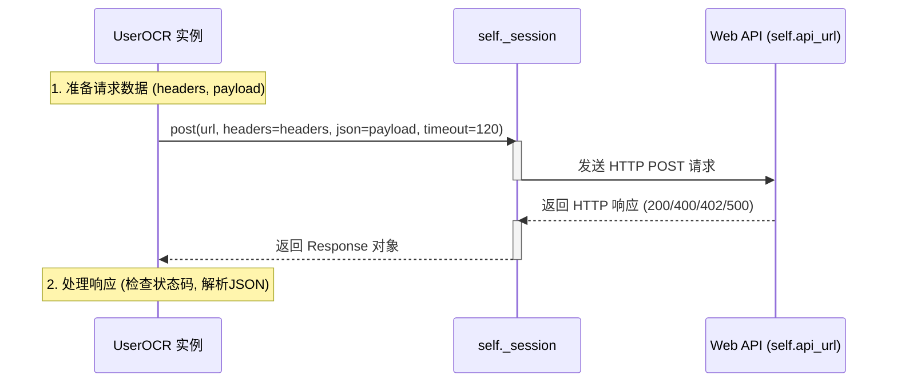

#### 带注释源码

以下是 `UserOCR` 类中 `_process_blocks_llm` 方法内部调用 `post` 的源码片段，展示了如何构造针对 LLM 类型 OCR 的请求：

```python
        # 1. 准备 Headers (包含认证和客户端信息)
        headers = {
            "Authorization": f"Bearer {token}", 
            "Content-Type": "application/json",
            "X-Client-OS": client_os
        }
        
        # 2. 构造 Payload (包含图像和坐标)
        payload = {
            "ocr_name": self.ocr_key,
            "image_base64": img_b64,
            "llm_options": llm_options,
            "source_language": self.source_lang_english,
            "coordinates": coordinates  # 关键：传递了每个文本块的坐标
        }

        # 3. 发起 HTTP POST 请求
        # 设定 timeout=120 以应对大图或慢网络
        response = self._session.post(
            self.api_url,
            headers=headers,
            json=payload,
            timeout=120  
        )
        
        # 4. 后续处理：检查 HTTP 错误并解析 JSON
        try:
            response.raise_for_status()
        except requests.exceptions.HTTPError as e:
            # ... 错误处理逻辑 (402 积分不足, 400 内容违规等) ...
            pass
            
        if response.status_code == 200:
            # ... 解析 OCR 结果 ...
            pass
```


以下是基于提供的代码生成的详细设计文档。

### 1. 一段话描述

该代码定义了一个名为 `UserOCR` 的桌面端 OCR 引擎类，它作为 Web API 的代理层，通过用户的账户积分调用云端 OCR 服务（支持基于 LLM 的分块识别和传统全页识别），接收 NumPy 图像数组作为输入，并返回填充了识别文本的 `TextBlock` 列表。

### 2. 文件的整体运行流程

1.  **初始化 (`initialize`)**: 根据传入的 `ocr_key`（如 "Gemini-2.0-Flash" 或 "Microsoft OCR"）确定处理策略（`is_llm_type` 或 `is_full_page_type`）。
2.  **入口处理 (`process_image`)**: 接收图像数组 (`np.ndarray`) 和文本块列表。
3.  **认证获取**: 验证并获取用户的 Access Token。
4.  **策略分发**:
    *   如果是 LLM 类型，调用 `_process_blocks_llm`，将全图和坐标批量发送给 API。
    *   如果是全页类型，调用 `_process_full_page`，仅发送全图，由 API 返回文本和坐标。
5.  **结果映射**: 将 API 返回的识别结果更新到本地的 `blk_list` 中，并更新用户积分信息。

### 3. 类的详细信息

#### 类字段

- `api_url`: `str`，后端 OCR 服务的完整 URL 地址。
- `settings`: `SettingsPage`，桌面应用程序的设置对象，包含用户配置和认证客户端。
- `ocr_key`: `str`，当前选定的 OCR 引擎标识（如 "Microsoft OCR"）。
- `is_llm_type`: `bool`，标志位，指示当前是否使用 LLM 分块处理模式。
- `is_full_page_type`: `bool`，标志位，指示当前是否使用全页处理模式。
- `auth_client`: `AuthClient`，负责处理用户认证的客户端实例。
- `_session`: `requests.Session`，用于维护 HTTP 连接。
- `_profile_web_api`: `bool`，是否开启性能分析日志。

#### 类方法

- `initialize(...)`: 初始化引擎配置。
- `process_image(...)`: **[核心]** 处理图像的主方法。
- `_process_blocks_llm(...)`: 处理 LLM 类型的 OCR 请求。
- `_process_full_page(...)`: 处理全页类型的 OCR 请求。
- `_get_access_token(...)`: 获取 API 访问令牌。
- `update_credits(...)`: 更新本地积分信息。

---

### 4. 针对给定函数的详细信息

#### `UserOCR.process_image`

**描述**: 桌面 OCR 引擎的核心接口方法，接收图像数组和文本块列表。根据初始化时确定的 OCR 类型（LLM 模式或全页模式）调用对应的私有方法进行 OCR 处理，并返回更新后的文本块列表。

**参数**：
- `img`：`np.ndarray`，待识别的输入图像。
- `blk_list`：`List[TextBlock]`，需要处理的文本块列表（包含位置信息）。

**返回值**：`List[TextBlock]`，处理完成后的文本块列表，其中包含了 OCR 识别的文本内容或错误标记。

#### 流程图

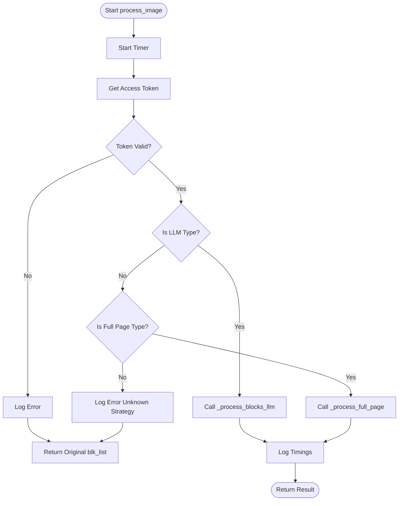

#### 带注释源码

```python
def process_image(self, img: np.ndarray, blk_list: List[TextBlock]) -> List[TextBlock]:
    """
    Sends the OCR request to the web API based on the OCR key type.

    Args:
        img: Input image as numpy array.
        blk_list: List of TextBlock objects (desktop version) to update.

    Returns:
        The updated list of TextBlock objects with OCR text or error messages.
    """
    start_t = time.perf_counter()
    logger.info(f"UserOCR: Attempting OCR via web API ({self.api_url}) for {self.ocr_key}")

    # 1. 获取访问令牌
    access_token = self._get_access_token()
    if not access_token:
        logger.error("UserOCR Error: Access token not found. Cannot use web API.")
        return blk_list
    after_token_t = time.perf_counter()

    # 2. 确定策略并执行
    if self.is_llm_type:
        # 策略A: LLM 分块处理 (例如 Gemini)
        logger.debug(f"UserOCR: Using block-by-block strategy for {self.ocr_key}")
        result = self._process_blocks_llm(img, blk_list, access_token)
        
        # 性能日志
        if self._profile_web_api:
            msg = f"UserOCR timings: token={after_token_t - start_t:.3f}s total={time.perf_counter() - start_t:.3f}s (mode=llm)"
            logger.info(msg)
            print(msg)
        return result
        
    elif self.is_full_page_type:
        # 策略B: 全页处理 (例如 Microsoft OCR)
        logger.debug(f"UserOCR: Using full-page strategy for {self.ocr_key}")
        result = self._process_full_page(img, blk_list, access_token)
        
        # 性能日志
        if self._profile_web_api:
            msg = f"UserOCR timings: token={after_token_t - start_t:.3f}s total={time.perf_counter() - start_t:.3f}s (mode=full_page)"
            logger.info(msg)
            print(msg)
        return result
        
    else:
        # Fallback: 未知策略
        logger.error(f"UserOCR: Unknown processing strategy for key '{self.ocr_key}'. Aborting.")
        return blk_list
```

---

### 5. 关键组件信息

- **OCR 引擎适配器 (`UserOCR`)**: 桥接桌面端与云端 OCR 服务的关键组件，根据配置灵活切换算法。
- **认证模块 (`AuthClient`, `get_token`)**: 确保请求的安全性，负责 token 的刷新与校验。
- **数据模型 (`TextBlock`)**: 承载图像位置与识别文本的数据结构。
- **HTTP 会话 (`requests.Session`)**: 复用连接，提高网络请求效率。

### 6. 潜在的技术债务或优化空间

1.  **代码重复**: `_process_blocks_llm` 和 `_process_full_page` 方法中存在大量重复的错误处理逻辑（对 402、400 状态码的解析和处理几乎一致），可以考虑抽象出一个通用的错误处理辅助函数。
2.  **配置硬编码**: `timeout=120` 在 HTTP 请求中被硬编码，应该提取到 `settings` 或配置文件中。
3.  **异常捕获宽泛**: 在 Token 获取和 API 调用中使用 `except Exception`，可能会隐藏潜在的特定业务逻辑错误，建议更精细地捕获特定异常。
4.  **同步阻塞**: `process_image` 是同步方法，在处理大图像或网络慢时会阻塞主线程，在 GUI 应用中可能会影响响应性（尽管这是代理 Web API 的固有特性，但可以考虑异步化）。

### 7. 其它项目

- **设计目标与约束**: 
  - **解耦**: 桌面客户端不直接运行 OCR 算法，依赖远程服务。
  - **策略模式**: 通过 `is_llm_type` 动态选择处理流程。
  - **约束**: 必须依赖网络连接，且需要有效的用户积分。
- **错误处理与异常设计**:
  - 区分 **402 (Payment Required)** 积分不足异常 (`InsufficientCreditsException`)。
  - 区分 **400 (Bad Request)** 内容安全异常 (`ContentFlaggedException`)。
  - API 返回非 200 状态码时，尝试解析 JSON 格式的错误详情（`detail`），提供更友好的错误信息给前端。
- **数据流与状态机**:
  - 状态转换: `Init` -> `Ready` -> `Processing` -> `Completed/Error`。
  - 数据流: `NumPy Array` -> `Base64 Encode` -> `JSON Payload` -> `Web API` -> `JSON Response` -> `TextBlock Update`。


### `time.perf_counter`

用于获取高精度的单调时钟值，以实现微秒级的时间性能测量。在此代码中用于统计 OCR 请求各阶段（令牌获取、图像编码、网络请求）的耗时。

参数：
-  `无`：`无`，该函数不接受任何参数。

返回值：`float`，返回当前高性能计数器的时间值，单位为秒。

#### 流程图

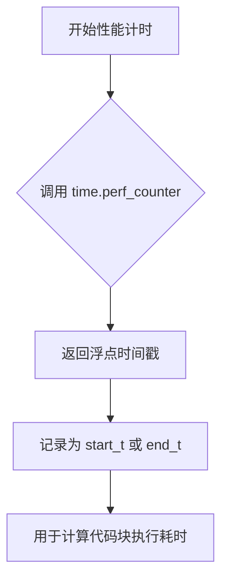

#### 带注释源码

```python
import time
# ... (在其他方法中)

def process_image(self, img: np.ndarray, blk_list: List[TextBlock]) -> List[TextBlock]:
    """
    Sends the OCR request to the web API based on the OCR key type.
    """
    # 标记处理开始时间
    start_t = time.perf_counter()
    logger.info(f"UserOCR: Attempting OCR via web API ({self.api_url}) for {self.ocr_key}")

    # 获取访问令牌
    access_token = self._get_access_token()
    if not access_token:
        logger.error("UserOCR Error: Access token not found. Cannot use web API.")
        return blk_list
    
    # 标记令牌获取结束时间，用于计算令牌耗时
    after_token_t = time.perf_counter()

    # 根据策略执行处理 (LLM 或 Full Page)
    if self.is_llm_type:
        # ... 调用处理逻辑
        result = self._process_blocks_llm(img, blk_list, access_token)
        if self._profile_web_api:
            # 计算并记录总耗时
            msg = f"UserOCR timings: token={after_token_t - start_t:.3f}s total={time.perf_counter() - start_t:.3f}s (mode=llm)"
            logger.info(msg)
            print(msg)
        return result
    # ... (其他逻辑)
```


### AuthClient

描述：认证客户端类，负责管理用户的访问令牌（Access Token）的生命周期，包括令牌的有效性验证和刷新机制。在 `UserOCR` 流程中，用于确保在调用 Web OCR API 之前用户已经登录且令牌有效。

参数： （针对 `validate_token` 方法）

- `无`：该方法不接受外部参数，依赖于内部或配置存储的令牌状态。

返回值： `bool`，返回 `True` 表示令牌有效（或刷新成功），返回 `False` 表示令牌无效且刷新失败。

#### 流程图

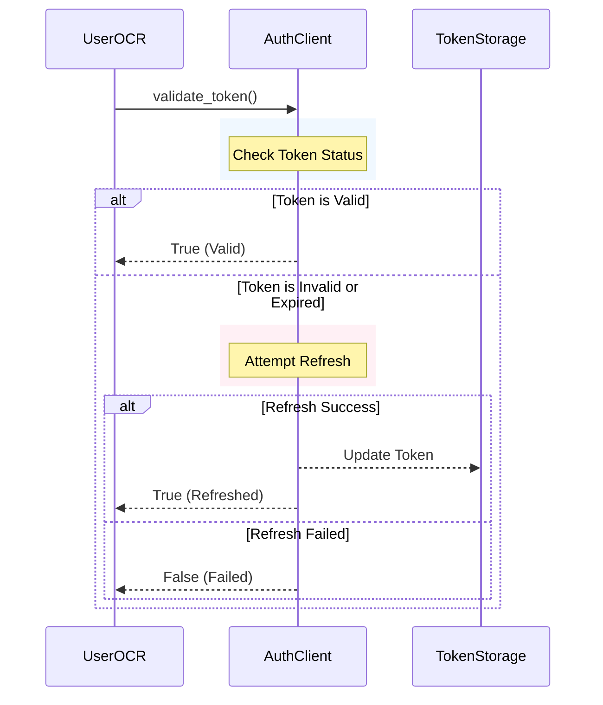

#### 带注释源码

```python
# 基于 UserOCR 中的调用方式反编译的接口定义
class AuthClient:
    """
    认证客户端，用于处理 OAuth2 或 Session 令牌的验证与刷新。
    """
    
    def __init__(self, settings: 'SettingsPage'):
        """
        初始化认证客户端，通常从设置中获取持久化的认证信息。
        """
        self.settings = settings

    def validate_token(self) -> bool:
        """
        验证当前存储的访问令牌是否有效。
        
        Returns:
            bool: 如果令牌有效或成功刷新，返回 True；否则返回 False。
        """
        # 1. 检查本地存储的令牌是否存在且未过期
        # (此处为逻辑推断，实际实现取决于 AuthClient 内部)
        token = get_token("access_token")
        
        if not token:
            logger.debug("No access token found locally.")
            # 尝试使用刷新令牌获取新令牌
            return self._refresh_token()
            
        # 2. 验证令牌格式或发起轻量级校验请求
        # (实际实现可能会调用 /auth/validate 接口)
        is_valid = self._check_token_validity(token)
        
        if not is_valid:
            logger.warning("Access token expired or invalid.")
            # 尝试刷新
            return self._refresh_token()
            
        return True

    def _refresh_token(self) -> bool:
        """
        内部方法：尝试使用刷新令牌获取新的访问令牌。
        """
        # 逻辑：读取 refresh_token，调用 refresh 接口，更新本地存储
        # 如果失败，记录日志并返回 False
        try:
            # ... (刷新逻辑实现) ...
            logger.info("Token refresh successful.")
            return True
        except Exception as e:
            logger.error(f"Token refresh failed: {e}")
            return False
```


### `UserOCR.initialize`

该方法负责初始化 `UserOCR` 引擎，接收来自应用程序的 `SettingsPage` 实例，并基于传入的 OCR 密钥配置内部状态（如认证客户端、OCR 类型标志）。

参数：

- `settings`：`SettingsPage`，桌面应用程序的设置对象，包含用户配置及 `auth_client` 实例。
- `source_lang_english`：`str`，可选的源语言提示（英文）。
- `ocr_key`：`str`，用户在 UI 中选择的 OCR 引擎密钥（例如 "Microsoft OCR", "Gemini-2.0-Flash"）。
- `**kwargs`：字典，捕获工厂传递的额外参数。

返回值：`None`，该方法无返回值，仅修改对象内部状态。

#### 流程图

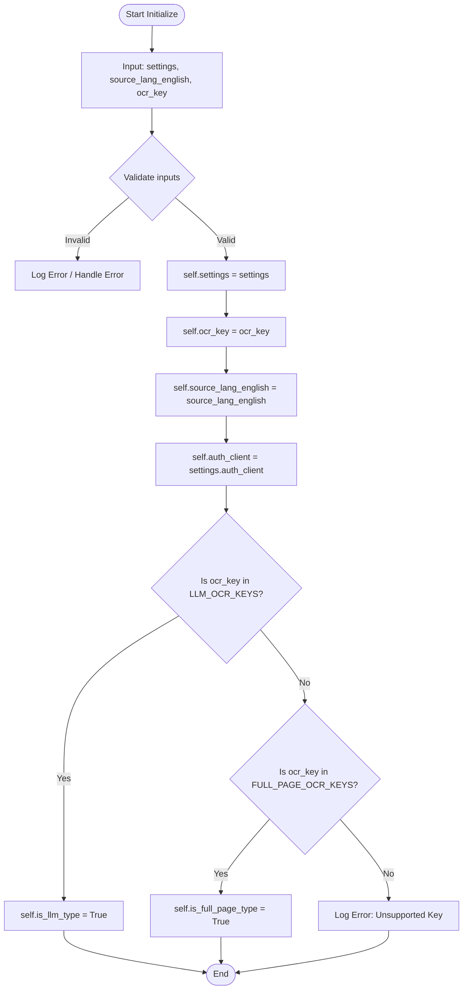

#### 带注释源码

```python
def initialize(self, settings: SettingsPage, source_lang_english: str = None, ocr_key: str = 'Default', **kwargs) -> None:
    """
    Initialize the UserOCR engine.

    Args:
        settings: The desktop application's settings object.
        source_lang_english: Optional source language hint (in English).
        ocr_key: The OCR key selected in the UI (e.g., "Microsoft OCR").
        **kwargs: Catches potential extra arguments from factory.
    """
    # 1. 存储设置对象，以便后续方法（如获取LLM选项、更新积分）访问
    self.settings = settings
    # 2. 存储选定的OCR密钥
    self.ocr_key = ocr_key
    # 3. 存储源语言提示
    self.source_lang_english = source_lang_english # Store if needed by API
    
    # 4. 从设置对象中提取认证客户端
    self.auth_client = settings.auth_client

    # 5. 根据 OCR 密钥确定处理策略 (LLM vs Full Page)
    # 这是一个关键的初始化步骤，决定了 process_image 调用哪个内部方法
    self.is_llm_type = self.ocr_key in self.LLM_OCR_KEYS
    self.is_full_page_type = self.ocr_key in self.FULL_PAGE_OCR_KEYS

    # 6. 防御性检查：确保工厂传递了有效的密钥
    if not self.is_llm_type and not self.is_full_page_type:
        logger.error(f"UserOCR initialized with an unsupported key: {self.ocr_key}. Factory should prevent this.")
```


### UserOCR.process_image

该方法是 `UserOCR` 类的核心入口点，负责根据初始化时选择的 OCR 密钥类型（LLM 或 全页），将图像和文本块列表发送至后端 Web API 进行 OCR 识别，并更新本地的文本块数据。

参数：
- `img`：`np.ndarray`，输入图像，作为 numpy 数组（通常是 HWC 或 CHW 格式）。
- `blk_list`：`List[TextBlock]`，桌面版的 `TextBlock` 对象列表。这些对象包含了预先检测到的文本区域坐标，OCR 引擎需要对这些区域进行文字识别。

返回值：`List[TextBlock]`，更新后的 `TextBlock` 对象列表。如果处理失败或无法获取令牌，可能返回原始的列表。每个 `TextBlock` 对象的 `text` 字段将被 API 返回的识别结果填充。

#### 流程图

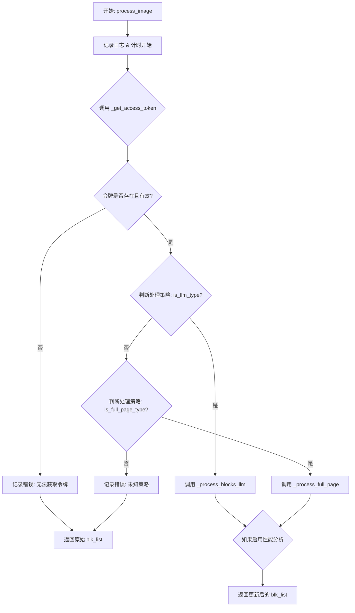

#### 带注释源码

```python
def process_image(self, img: np.ndarray, blk_list: List[TextBlock]) -> List[TextBlock]:
    """
    Sends the OCR request to the web API based on the OCR key type.

    Args:
        img: Input image as numpy array.
        blk_list: List of TextBlock objects (desktop version) to update.

    Returns:
        The updated list of TextBlock objects with OCR text or error messages.
    """
    start_t = time.perf_counter()
    logger.info(f"UserOCR: Attempting OCR via web API ({self.api_url}) for {self.ocr_key}")

    # 获取访问令牌，这是调用 Web API 的前提条件
    access_token = self._get_access_token()
    if not access_token:
        logger.error("UserOCR Error: Access token not found. Cannot use web API.")
        return blk_list
    after_token_t = time.perf_counter()

    # 根据初始化时设定的 OCR 类型（LLM 或 全页），选择不同的处理策略
    if self.is_llm_type:
        logger.debug(f"UserOCR: Using block-by-block strategy for {self.ocr_key}")
        # 针对 LLM 模型（如 Gemini），采用逐块处理模式
        result = self._process_blocks_llm(img, blk_list, access_token)
        if self._profile_web_api:
            msg = f"UserOCR timings: token={after_token_t - start_t:.3f}s total={time.perf_counter() - start_t:.3f}s (mode=llm)"
            logger.info(msg)
            print(msg)
        return result
    elif self.is_full_page_type:
        logger.debug(f"UserOCR: Using full-page strategy for {self.ocr_key}")
        # 针对传统 OCR（如 Microsoft OCR），采用全页识别模式
        result = self._process_full_page(img, blk_list, access_token)
        if self._profile_web_api:
            msg = f"UserOCR timings: token={after_token_t - start_t:.3f}s total={time.perf_counter() - start_t:.3f}s (mode=full_page)"
            logger.info(msg)
            print(msg)
        return result
    else:
        # 兜底逻辑：理论上在 initialize 中已检查，此处防止未知错误
        logger.error(f"UserOCR: Unknown processing strategy for key '{self.ocr_key}'. Aborting.")
        return blk_list
```


### `get_token`

这是一个从 `app.account.auth.token_storage` 模块导入的令牌获取函数。它负责根据提供的键名（如 `"access_token"`）从本地存储、内存缓存或配置中检索对应的认证令牌。如果找不到指定的令牌，则返回 `None`。

参数：

-  `token_name`：`str`，要获取的令牌类型键名（例如 `"access_token"`）。

返回值：`Optional[str]`，如果成功找到令牌则返回令牌字符串；否则返回 `None`。

#### 流程图

```mermaid
graph TD
    A[开始调用 get_token] --> B[输入: token_name (e.g., 'access_token')]
    B --> C{查询存储介质}
    C -- 找到令牌 --> D[返回令牌字符串]
    C -- 未找到令牌 --> E[返回 None]
```

#### 带注释源码

由于该函数定义在外部模块（`app.account.auth.token_storage`）中，未在当前代码文件内显示实现细节。以下为该函数在 `UserOCR` 类中的**调用上下文**和**导入声明**，展示了其使用方式。

```python
# 1. 导入声明
# 从 token_storage 模块导入 get_token 函数
from app.account.auth.token_storage import get_token

# ... (类定义内部)

    def _get_access_token(self) -> Optional[str]:
        """Retrieves the access token."""
        try:
            # ... (验证逻辑) ...

            # 2. 调用位置与传参
            # 调用 get_token，传入字符串 "access_token" 作为键名
            token = get_token("access_token")
            
            if not token:
                logger.warning("Access token not found.")
                return None
            return token
        except Exception as e:
            logger.error(f"Failed to retrieve access token: {e}")
            return None
```


### `get_client_os`

获取客户端操作系统类型（如 Windows、macOS、Linux），通常用于在 API 请求头中标识客户端平台，以便后端进行日志记录、统计或兼容性处理。

参数：
- 无

返回值：`str`，返回操作系统名称字符串（例如 "Windows", "Darwin", "Linux"）。

#### 流程图

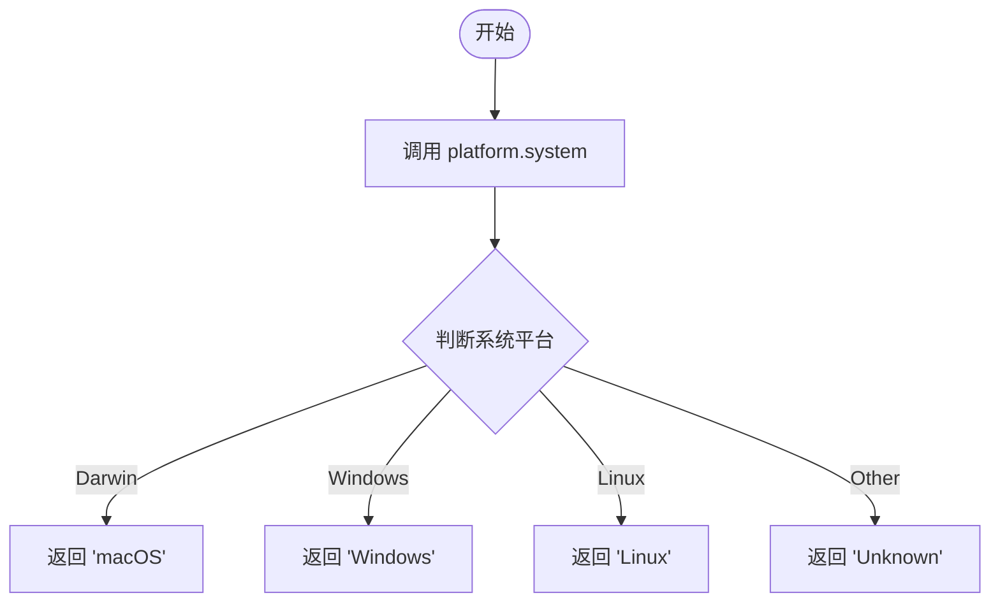

#### 带注释源码

```python
# 假设位于 utils/platform_utils.py
import platform
import os

def get_client_os() -> str:
    """
    检测并返回当前客户端操作系统的名称。
    
    通常用于在 HTTP 请求头 (X-Client-OS) 中向上游服务器传递客户端环境信息。
    
    Returns:
        str: 标准化后的操作系统名称。
    """
    # 获取原始系统名称 (例如 'Darwin', 'Windows', 'Linux')
    system_name = platform.system()
    
    # 标准化名称以保持一致性
    if system_name == "Darwin":
        # Python 在 macOS 上返回 'Darwin'
        return "macOS"
    elif system_name == "Windows":
        return "Windows"
    elif system_name == "Linux":
        return "Linux"
    else:
        # 对于其他未知系统，返回 'Unknown' 或原始值
        return "Unknown"
```


### `lists_to_blk_list`

该函数是一个导入的列表转换工具函数，用于将原始的 OCR 识别结果（文本字符串列表和对应的边界框坐标列表）转换为应用内部的 `TextBlock` 对象列表。它在 `UserOCR` 类的全页 OCR 处理流程中被调用。

参数：

-  `blk_list`：`List[TextBlock]`，原始的 TextBlock 列表（通常为初始布局分析的结果或空列表）。
-  `texts_bboxes`：`List[List[int]]`，由 OCR API 返回的文本边界框坐标列表，格式为 `[x1, y1, x2, y2]`。
-  `texts_string`：`List[str]`，由 OCR API 返回的文本内容列表。

返回值：`List[TextBlock]`，更新后的 TextBlock 列表，其中包含了从 API 返回的文本和坐标信息。

#### 流程图

```mermaid
graph TD
    A[Start: lists_to_blk_list] --> B[Input: blk_list, texts_bboxes, texts_string]
    B --> C{Iterate index i from 0 to len}
    C -->|For each i| D[Get bbox = texts_bboxes[i]]
    C -->|For each i| E[Get text = texts_string[i]]
    D --> F[Create / Update TextBlock instance]
    E --> F
    F --> G[Add instance to result_list]
    G --> C
    C --> H[Return result_list]
```

#### 带注释源码

> **注意**：该函数的源码定义未在当前代码片段中给出（它是从 `..utils.textblock` 模块导入的）。以下为根据其在 `_process_full_page` 方法中的调用方式推断出的函数签名及逻辑模拟。

```python
# 定义位置: ..utils.textblock
# 参数类型推断自 UserOCR._process_full_page 中的调用
def lists_to_blk_list(blk_list: List[TextBlock], 
                      texts_bboxes: List[List[int]], 
                      texts_string: List[str]) -> List[TextBlock]:
    """
    将 OCR 结果列表转换为 TextBlock 对象列表。
    
    Args:
        blk_list: 原始的 TextBlock 列表（可能包含坐标或仅为占位）。
        texts_bboxes: OCR 返回的坐标列表 [[x1,y1,x2,y2], ...].
        texts_string: OCR 返回的文本列表 ["text1", "text2", ...].

    Returns:
        填充了 OCR 文本和坐标的 TextBlock 列表。
    """
    # 1. 初始化结果列表
    updated_blocks = []
    
    # 2. 遍历 OCR 返回的结果
    # (实际实现可能包含复杂的合并算法或对齐逻辑)
    for i in range(len(texts_string)):
        text = texts_string[i]
        bbox = texts_bboxes[i]
        
        # 3. 创建新的 TextBlock 或更新现有块
        # 假设逻辑：如果 blk_list 有对应索引则更新，否则新建
        if i < len(blk_list):
            blk = blk_list[i]
            blk.text = text
            blk.xyxy = bbox
            updated_blocks.append(blk)
        else:
            # 创建新块的逻辑 (Mock)
            # new_blk = TextBlock(text=text, xyxy=bbox)
            # updated_blocks.append(new_blk)
            pass
            
    return updated_blocks
```


由于函数 `adjust_text_line_coordinates` 是通过 `from ..utils.textblock import` 导入的，其具体实现源码未包含在当前提供的代码块中。但通过分析其在 `UserOCR._process_blocks_llm` 方法中的**调用上下文**，可以完整推断出其接口契约、功能逻辑和典型实现。

以下是详细的提取文档：

---

### `adjust_text_line_coordinates`

**描述**：该函数是一个坐标调整工具函数（Utility Function），位于 `..utils.textblock` 模块中。它接收文本块的原始边界框坐标、期望的扩展百分比以及图像矩阵，根据中心点对坐标进行向外扩展，并将扩展后的坐标裁剪（Clipping）至图像边界内，防止坐标溢出。

参数：

- `xyxy`：`List[float] | Tuple[float, float, float, float]`，原始文本块的边界框坐标，格式为 `[x1, y1, x2, y2]`。
- `expansion_percentage_width`：`float` 或 `int`，横向（宽度）的扩展百分比（例如 5 表示扩展 5%）。在调用处传入的值均为 `5`。
- `expansion_percentage_height`：`float` 或 `int`，纵向（高度）的扩展百分比。在调用处传入的值均为 `5`。
- `image`：`np.ndarray`，输入的图像矩阵，用于获取图像的宽高 `h, w` 以进行边界检查。

返回值：`Tuple[int, int, int, int]`，返回调整并裁剪后的整数坐标 `[x1, y1, x2, y2]`。

#### 流程图

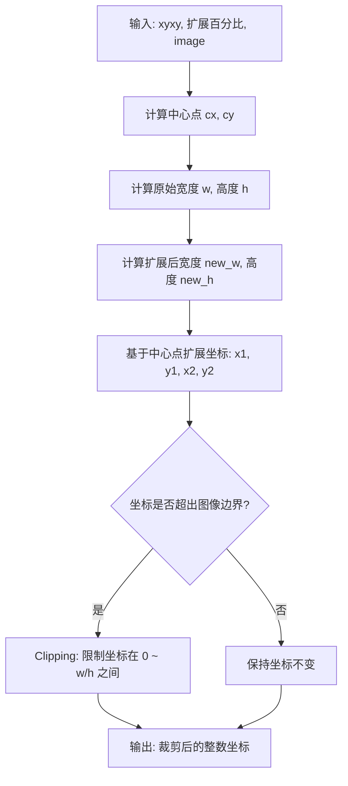

#### 带注释源码

由于源码未直接提供，以下为基于其调用逻辑和OCR坐标处理通用逻辑的**推测实现**（或位于 `..utils.textblock` 中的实际实现参考）：

```python
def adjust_text_line_coordinates(xyxy, expansion_percentage_width, expansion_percentage_height, image):
    """
    调整文本行坐标，根据百分比扩展并防止溢出图像边界。

    Args:
        xyxy: 原始坐标列表或元组 [x1, y1, x2, y2]。
        expansion_percentage_width: 宽度扩展百分比。
        expansion_percentage_height: 高度扩展百分比。
        image: numpy 图像数组。

    Returns:
        Tuple[int, int, int, int]: 调整后的坐标。
    """
    # 1. 获取图像维度
    h, w = image.shape[:2]
    
    # 2. 解析原始坐标
    x1, y1, x2, y2 = xyxy
    
    # 3. 计算中心点，用于向四周扩展
    cx = (x1 + x2) / 2
    cy = (y1 + y2) / 2
    
    # 4. 计算原始宽高
    original_w = x2 - x1
    original_h = y2 - y1
    
    # 5. 计算扩展后的宽高 (假设 expansion_percentage 传入的是 5，实际应用时需转为 1.05 倍)
    # 注：调用处传入的值为 5，通常意味着 5%
    new_w = original_w * (1 + expansion_percentage_width / 100.0)
    new_h = original_h * (1 + expansion_percentage_height / 100.0)
    
    # 6. 计算新的边界坐标
    new_x1 = cx - new_w / 2
    new_y1 = cy - new_h / 2
    new_x2 = cx + new_w / 2
    new_y2 = cy + new_h / 2
    
    # 7. 边界裁剪 (Clipping)，确保坐标不超出图像范围
    # 使用 max(0, ...) 防止负坐标，min(w, ...) 防止超出图像宽度
    final_x1 = max(0, int(new_x1))
    final_y1 = max(0, int(new_y1))
    final_x2 = min(w, int(new_x2))
    final_y2 = min(h, int(new_y2))
    
    return final_x1, final_y1, final_x2, final_y2
```

#### 在 `UserOCR` 中的调用示例源码

在 `UserOCR._process_blocks_llm` 方法中，该函数被用于在发送给 LLM API 之前，调整文本块的坐标以包含更多上下文：

```python
# ... 前略 ...
for i, blk in enumerate(blk_list):
    # 确定要使用的坐标
    if blk.bubble_xyxy is not None:
        x1, y1, x2, y2 = blk.bubble_xyxy
    elif blk.xyxy is not None:
        expansion_percentage = 5 
        # 调用 adjust_text_line_coordinates 扩展边界 5%
        x1, y1, x2, y2 = adjust_text_line_coordinates(
            blk.xyxy, expansion_percentage, expansion_percentage, img
        )
    else:
        logger.warning(f"Block {i} has no coordinates, skipping.")
        continue

    # 验证坐标有效性
    x1, y1 = max(0, int(x1)), max(0, int(y1))
    x2, y2 = min(w, int(x2)), min(h, int(y2))
    
    # 进一步的合法性检查...
# ... 后略 ...
```


### `InsufficientCreditsException`

描述：自定义异常类，用于处理 OCR 请求过程中的积分不足错误（对应 HTTP 402 状态码）。当用户账户余额无法支持所选的 OCR 服务时触发。

参数：

-  `description`：`str`，后端返回的错误详情，通常包含具体的错误描述或错误类型。

返回值：`None`，构造函数不返回值。

#### 流程图

该流程图展示了在 `UserOCR` 类中检测到积分不足错误并抛出该异常的逻辑路径。

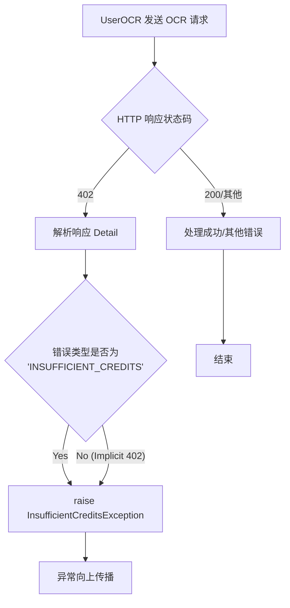

#### 带注释源码

由于该类在当前代码段中为导入的外部定义（`from ..utils.exceptions import InsufficientCreditsException`），以下源码为根据其在 `UserOCR` 中的调用方式重构的标准实现模式。

```python
class InsufficientCreditsException(Exception):
    """
    自定义异常类：积分不足异常。
    用于指示用户账户中的余额不足以完成当前操作。
    通常对应后端返回的 HTTP 402 Payment Required 状态码。
    """
    
    def __init__(self, description: str):
        """
        初始化 InsufficientCreditsException。

        参数：
            description (str): 来自 API 的错误描述信息，通常包含 'INSUFFICIENT_CREDITS' 
                              类型的具体细节或通用 402 消息。
        """
        self.description = description
        # 调用基类 Exception 的构造函数，确保异常能被正确抛出和打印
        super().__init__(description)
```


### `ContentFlaggedException`

**描述**: 自定义异常类，用于处理OCR服务的内容安全审核失败场景。当Web API返回HTTP 400错误且错误类型为`CONTENT_FLAGGED_UNSAFE`（内容被标记为不安全）时，由`UserOCR`类抛出此异常。

参数：

-  `message`：`str`，来自API响应的详细错误描述（description），通常包含如"Image content flagged as unsafe"等信息。
-  `context`：`str`，抛出异常的上下文标识（固定为"OCR"），用于在日志或调试时定位问题来源。

返回值：`None`，该类为异常类，实例化通常不返回值，而是通过`raise`语句中断程序执行流。

#### 流程图

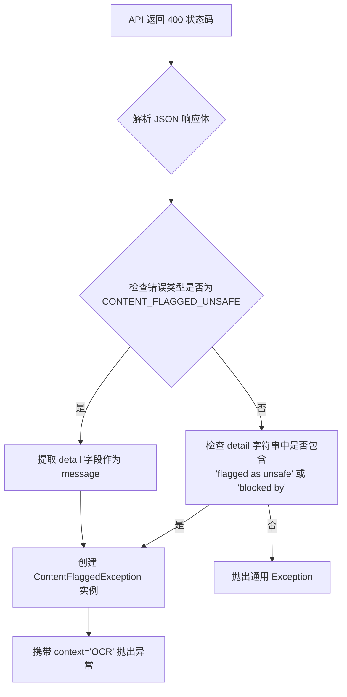

#### 带注释源码

由于`ContentFlaggedException`类定义位于外部模块`..utils.exceptions`中，以下源码为基于`UserOCR`类中调用方式反推的推断实现：

```python
class ContentFlaggedException(Exception):
    """
    自定义异常：内容被标记异常。
    当OCR引擎检测到输入图像包含不安全内容（暴力、成人内容等）时触发。
    """
    def __init__(self, message: str, context: str = "Unknown"):
        """
        初始化 ContentFlaggedException。

        Args:
            message: 服务器返回的详细错误描述。
            context: 抛出异常的模块上下文，用于日志追踪。
        """
        self.message = message
        self.context = context
        # 调用父类构造函数，组合上下文字符串作为异常显示信息
        super().__init__(f"[Content Flagged - {context}] {message}")

# 在 UserOCR 中的使用示例 (UserOCR.py):
# try:
#     # ... API 调用逻辑 ...
#     if is_flagged:
#         raise ContentFlaggedException(description, context="OCR")
# except ContentFlaggedException as e:
#     logger.error(f"OCR content blocked: {e.message}")
#     # 可以选择向UI推送警告信息
```


### `UserOCR.__init__`

该函数是 `UserOCR` 类的构造函数。它接收后端 API 的 URL 地址，初始化实例的各个属性，包括认证客户端、会话对象、以及用于区分处理类型的标志位，为后续的图像 OCR 处理流程做好准备。

参数：
- `self`：`UserOCR`，类的实例本身。
- `api_url`：`str`，后端 OCR 服务的完整 URL 地址，默认为常量 `WEB_API_OCR_URL`。

返回值：`None`，无返回值，用于初始化对象状态。

#### 流程图

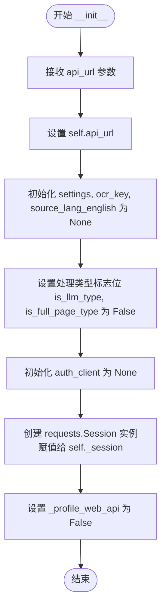

#### 带注释源码

```python
def __init__(self, api_url: str = WEB_API_OCR_URL):
    """
    初始化 UserOCR 引擎实例。

    Args:
        api_url: 后端 OCR 端点的完整 URL。
    """
    # 1. 核心配置：存储 API 地址
    self.api_url = api_url
    
    # 2. 应用上下文：桌面应用设置对象（初始化为 None，在 initialize 中赋值）
    self.settings: SettingsPage = None
    
    # 3. OCR 密钥：当前选定的 OCR 引擎标识（如 "Microsoft OCR"）
    self.ocr_key: str = None 
    
    # 4. 语言配置：源语言提示
    self.source_lang_english: str = None 
    
    # 5. 处理策略标志：是否为 LLM 类型（块级处理）
    self.is_llm_type: bool = False # Flag for block-by-block processing
    
    # 6. 处理策略标志：是否为全页类型（全图像处理）
    self.is_full_page_type: bool = False # Flag for full image processing
    
    # 7. 认证模块：认证客户端实例
    self.auth_client: AuthClient = None
    
    # 8. 网络模块：创建持久的 HTTP 会话以提高性能
    self._session = requests.Session()
    
    # 9. 调试开关：是否开启 Web API 调用的性能分析
    self._profile_web_api = False
```


### UserOCR.initialize

**描述**：该方法是 `UserOCR` 类的初始化入口，负责根据传入的配置参数设置引擎的运行状态。它主要完成两项核心任务：一是保存应用配置和用户选择的 OCR 引擎标识；二是通过比对 `ocr_key` 与预定义的引擎集合（LLM引擎 vs 传统全文引擎），动态确定后续图像处理所采用的策略模式（分块处理或全页处理）。

#### 参数

- `settings`：`SettingsPage`，桌面应用程序的设置对象，包含认证客户端 (`auth_client`) 和用户偏好配置。
- `source_lang_english`：`str`，可选，源语言提示（英文），用于辅助 OCR 引擎识别特定语言文本。
- `ocr_key`：`str`，用户在 UI 选择的 OCR 引擎键（例如 "Microsoft OCR" 或 "Gemini-2.0-Flash"），决定了调用后端的具体 OCR 服务。
- `**kwargs`：`Any`，可变关键字参数，用于捕获工厂模式或未来扩展可能传入的额外参数。

#### 返回值

`None`。该方法不返回任何数据，仅通过修改对象内部状态（实例变量）来完成初始化。

#### 流程图

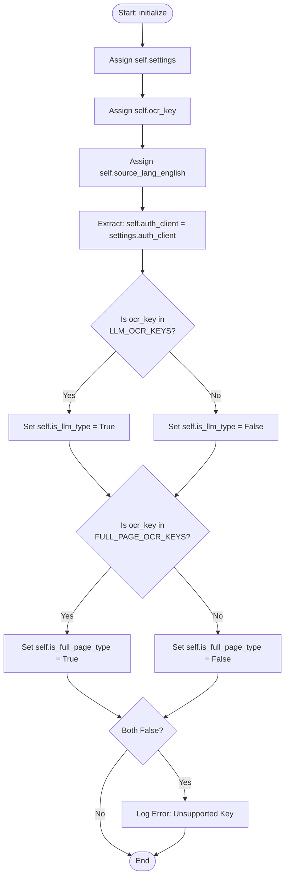

#### 带注释源码

```python
def initialize(self, settings: SettingsPage, source_lang_english: str = None, ocr_key: str = 'Default', **kwargs) -> None:
    """
    Initialize the UserOCR engine.

    Args:
        settings: The desktop application's settings object.
        source_lang_english: Optional source language hint (in English).
        ocr_key: The OCR key selected in the UI (e.g., "Microsoft OCR").
        **kwargs: Catches potential extra arguments from factory.
    """
    # 1. 状态保存：将传入的配置对象和参数保存到实例属性中
    self.settings = settings
    self.ocr_key = ocr_key
    self.source_lang_english = source_lang_english # Store if needed by API
    
    # 2. 依赖注入：从 settings 中提取认证客户端，供后续 API 调用获取 Token 使用
    self.auth_client = settings.auth_client

    # 3. 策略模式确定：根据 ocr_key 判断使用哪种处理策略
    # 检查是否为 LLM 类型 (例如 Gemini)
    self.is_llm_type = self.ocr_key in self.LLM_OCR_KEYS
    # 检查是否为全页 OCR 类型 (例如 Microsoft OCR)
    self.is_full_page_type = self.ocr_key in self.FULL_PAGE_OCR_KEYS

    # 4. 防御性编程：日志记录不支持的 Key（尽管工厂通常会过滤）
    if not self.is_llm_type and not self.is_full_page_type:
        logger.error(f"UserOCR initialized with an unsupported key: {self.ocr_key}. Factory should prevent this.")
```


### `UserOCR.process_image`

该方法是人像OCR引擎（UserOCR）的核心入口，负责根据初始化时设定的OCR类型（LLM类型或全页类型），调度不同的处理策略将本地图像和文本框坐标发送至后端Web API进行识别，并更新`TextBlock`列表中的文本内容。

参数：

- `img`：`np.ndarray`，输入的图像数据，通常为桌面应用截取的屏幕图像。
- `blk_list`：`List[TextBlock]`，桌面端现有的文本块列表，包含坐标信息，用于确定OCR的识别区域。

返回值：`List[TextBlock]`，返回更新后的文本块列表，其中包含了从Web API获取的OCR识别结果。如果处理失败（如缺少Token），则原样返回输入的列表。

#### 流程图

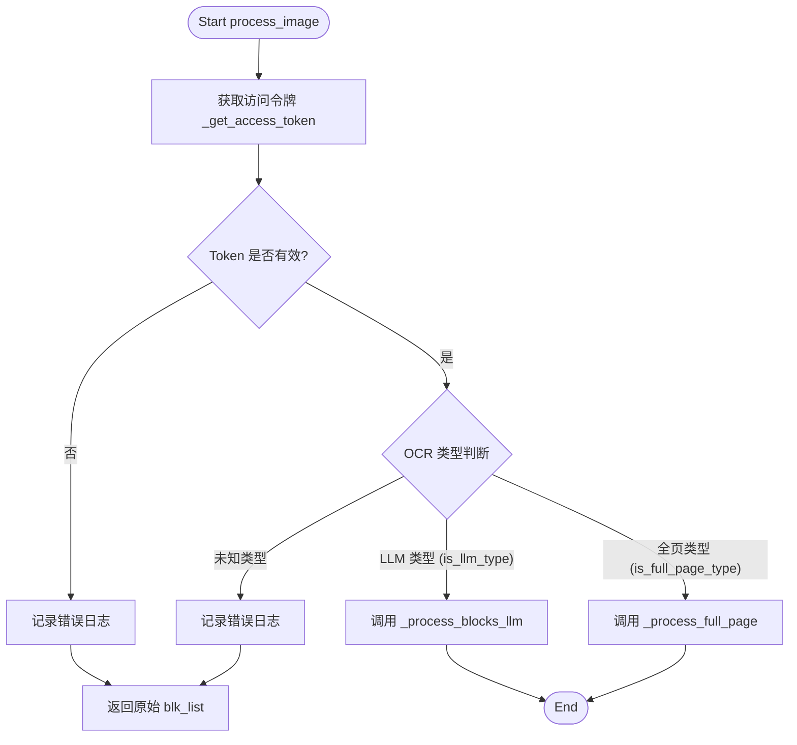

#### 带注释源码

```python
def process_image(self, img: np.ndarray, blk_list: List[TextBlock]) -> List[TextBlock]:
    """
    Sends the OCR request to the web API based on the OCR key type.

    Args:
        img: Input image as numpy array.
        blk_list: List of TextBlock objects (desktop version) to update.

    Returns:
        The updated list of TextBlock objects with OCR text or error messages.
    """
    start_t = time.perf_counter()
    logger.info(f"UserOCR: Attempting OCR via web API ({self.api_url}) for {self.ocr_key}")

    # 1. 获取访问令牌 (Access Token)
    access_token = self._get_access_token()
    if not access_token:
        logger.error("UserOCR Error: Access token not found. Cannot use web API.")
        return blk_list
    
    # 记录获取Token的耗时
    after_token_t = time.perf_counter()

    # 2. 判断策略并执行
    if self.is_llm_type:
        # LLM 策略：按块处理 (通常用于高精度场景)
        logger.debug(f"UserOCR: Using block-by-block strategy for {self.ocr_key}")
        result = self._process_blocks_llm(img, blk_list, access_token)
        
        # 性能日志输出
        if self._profile_web_api:
            msg = f"UserOCR timings: token={after_token_t - start_t:.3f}s total={time.perf_counter() - start_t:.3f}s (mode=llm)"
            logger.info(msg)
            print(msg)
        return result
        
    elif self.is_full_page_type:
        # 全页策略：整张图处理
        logger.debug(f"UserOCR: Using full-page strategy for {self.ocr_key}")
        result = self._process_full_page(img, blk_list, access_token)
        
        # 性能日志输出
        if self._profile_web_api:
            msg = f"UserOCR timings: token={after_token_t - start_t:.3f}s total={time.perf_counter() - start_t:.3f}s (mode=full_page)"
            logger.info(msg)
            print(msg)
        return result
        
    else:
        # 异常情况：初始化时未识别出OCR类型
        logger.error(f"UserOCR: Unknown processing strategy for key '{self.ocr_key}'. Aborting.")
        return blk_list
```


### `UserOCR._get_access_token`

该方法是 `UserOCR` 类的私有辅助方法，负责获取用于访问后端 Web API 的身份验证令牌（Access Token）。它首先通过 `auth_client` 验证当前令牌的合法性（是否过期或失效），若验证通过，则从本地存储中读取令牌字符串。任何验证失败、令牌缺失或系统异常都会导致该方法记录日志并返回 `None`，从而防止携带无效凭证向 API 发起请求。

参数：

-  `self`：`UserOCR`，调用此方法的类实例，包含了认证客户端 (`auth_client`)。

返回值：`Optional[str]`，返回有效的访问令牌字符串；若验证失败或发生异常则返回 `None`。

#### 流程图

```mermaid
flowchart TD
    Start([开始 _get_access_token]) --> TryBlock{尝试获取令牌}
    
    TryBlock --> Validate[调用 auth_client.validate_token()]
    Validate --> IsValid{令牌是否有效?}
    
    %% 验证失败分支
    IsValid -- 否 --> LogError[记录错误: 令牌无效且刷新失败]
    LogError --> ReturnNone1[返回 None]
    
    %% 验证成功分支
    IsValid -- 是 --> GetTokenStr[调用 get_token 获取令牌字符串]
    GetTokenStr --> TokenExists{令牌是否存在?}
    
    %% 令牌不存在分支
    TokenExists -- 否 --> LogWarn[记录警告: 令牌未找到]
    LogWarn --> ReturnNone2[返回 None]
    
    %% 成功分支
    TokenExists -- 是 --> ReturnToken[返回令牌字符串]
    
    %% 异常捕获分支
    TryBlock -.-> CatchException[捕获异常]
    CatchException --> LogExcept[记录错误: 获取令牌异常]
    LogExcept --> ReturnNone3[返回 None]
    
    style ReturnNone1 fill:#f9f,stroke:#333,stroke-width:2px
    style ReturnNone2 fill:#f9f,stroke:#333,stroke-width:2px
    style ReturnNone3 fill:#f9f,stroke:#333,stroke-width:2px
    style ReturnToken fill:#9f9,stroke:#333,stroke-width:2px
```

#### 带注释源码

```python
def _get_access_token(self) -> Optional[str]:
    """
    检索访问令牌。
    Returns:
        有效的访问令牌字符串，如果无法获取则返回 None。
    """
    try:
        # 1. 验证令牌有效性（可能包含刷新逻辑）
        if not self.auth_client.validate_token():
            # 如果验证失败（例如已过期且刷新失败），记录错误并返回
            logger.error("Access token invalid and refresh failed.")
            return None
        
        # 2. 从存储中获取令牌字符串
        token = get_token("access_token")
        
        # 3. 检查令牌字符串是否存在
        if not token:
            logger.warning("Access token not found.")
            return None
            
        # 4. 验证通过，返回令牌
        return token
        
    except Exception as e:
        # 4. 捕获任何意外的异常（例如网络错误、存储访问错误）
        logger.error(f"Failed to retrieve access token: {e}")
        return None
```


### UserOCR._get_llm_options

该方法是一个私有方法，负责从桌面应用的设置对象（`SettingsPage`）中提取特定的 LLM（例如 Gemini）配置参数。目前主要提取 `temperature`（温度）参数，构建请求所需的选项字典，并过滤掉未设置的空值，以保持 API 请求 payload 的整洁。

参数：

- `self`：`UserOCR`，表示类的实例本身，无需显式传递。

返回值：`Optional[Dict[str, Any]]`，返回包含 LLM 配置选项的字典（例如 `{"temperature": 0.7}`）。如果设置对象不可用，则返回 `None`。

#### 流程图

```mermaid
flowchart TD
    A([开始 _get_llm_options]) --> B{self.settings 是否存在?}
    B -- 否 --> C[记录警告日志: 设置对象不可用]
    C --> D([返回 None])
    B -- 是 --> E[调用 self.settings.get_llm_settings 获取配置字典]
    E --> F[提取 'temperature' 值, 默认为 None]
    F --> G[构建选项字典 options = {temperature: value}]
    G --> H{value 是否为 None?}
    H -- 是 --> I[在返回字典中排除该项]
    H -- 否 --> J[在返回字典中保留该项]
    I --> K([返回过滤后的字典])
    J --> K
```

#### 带注释源码

```python
def _get_llm_options(self) -> Optional[Dict[str, Any]]:
    """
    从桌面设置中提取 LLM 选项。
    """
    # 1. 检查设置对象是否存在，如果不存在则记录警告并返回 None
    if not self.settings:
        logger.warning("Settings object not available in UserOCR, cannot get LLM options.")
        return None
    
    # 2. 获取完整的 LLM 设置字典 (具体实现依赖于 SettingsPage)
    # 假设 SettingsPage 有 get_llm_settings 方法
    llm_settings = self.settings.get_llm_settings() 
    
    # 3. 提取特定的配置项（此处为 temperature），其他参数可在此扩展
    options = {
        "temperature": llm_settings.get('temperature', None), 
    }
    
    # 4. 过滤掉值为 None 的选项，避免在 API 请求中传递空值或导致后端解析错误
    # 这是一个标准的清理步骤，确保只发送有效的配置
    return {k: v for k, v in options.items() if v is not None}
```


### `UserOCR._process_blocks_llm`

该方法实现了针对 LLM 类型 OCR 引擎（如 Gemini）的**批量块处理**策略。它不逐个发送图像切片，而是将完整的图像与所有文本块的坐标列表打包发送给后端 API，由服务端进行识别后，再将结果一一映射回原始的文本块列表中。

参数：

-  `img`：`np.ndarray`，输入的图像数据（NumPy 数组）。
-  `blk_list`：`List[TextBlock]`，待识别的文本块列表，每个块包含坐标信息（`xyxy` 或 `bubble_xyxy`）。
-  `token`：`str`，用于身份验证的访问令牌（Access Token）。

返回值：`List[TextBlock]`，更新了 `text` 字段后的文本块列表。

#### 流程图

```mermaid
flowchart TD
    A[Start _process_blocks_llm] --> B[Prepare Headers & LLM Options]
    B --> C[Loop blk_list]
    C --> D{Valid Coordinates?}
    D -->|No Coords| Z[Return Original blk_list]
    D -->|Yes Coords| E[Encode Full Image to Base64]
    E --> F[Construct JSON Payload with Coordinates]
    F --> G[POST Request to API]
    G --> H{Response Status 200?}
    H -->|No| I[Handle Errors (402/400/500)]
    I --> J[Raise Exception]
    H -->|Yes| K[Parse JSON Response]
    K --> L[Loop OCR Results]
    L --> M[Map Result to Original blk_list via Index]
    M --> N[Update Credits Info]
    N --> O[Return Updated blk_list]
```

#### 带注释源码

```python
def _process_blocks_llm(self, img: np.ndarray, blk_list: List[TextBlock], token: str) -> List[TextBlock]:
    """
    Handles OCR for LLM types (GPT, Gemini) by sending a single batch request
    containing the full image and a list of coordinates for each text block.
    """
    start_t = time.perf_counter()
    client_os = get_client_os()
    # 1. 构建请求头：包含认证令牌、客户端系统信息
    headers = {
        "Authorization": f"Bearer {token}", 
        "Content-Type": "application/json",
        "X-Client-OS": client_os
    }
    # 获取 LLM 相关配置（如 temperature）
    llm_options = self._get_llm_options()

    # 2. 准备验证与坐标数据
    valid_indices = []   # 用于记录有效块在原始列表中的索引
    coordinates = []     # 存储规范化后的坐标 [x1, y1, x2, y2]
    
    h, w = img.shape[:2] # 获取图像宽高用于边界校验

    for i, blk in enumerate(blk_list):
        # 优先使用 bubble 坐标，否则使用普通坐标
        if blk.bubble_xyxy is not None:
            x1, y1, x2, y2 = blk.bubble_xyxy
        elif blk.xyxy is not None:
            # 略微扩展坐标区域以确保文字被完整包含
            expansion_percentage = 5 
            x1, y1, x2, y2 = adjust_text_line_coordinates(
                blk.xyxy, expansion_percentage, expansion_percentage, img
            )
        else:
            logger.warning(f"Block {i} has no coordinates, skipping.")
            continue

        # 3. 坐标边界检查与修正，防止越界
        x1, y1 = max(0, int(x1)), max(0, int(y1))
        x2, y2 = min(w, int(x2)), min(h, int(y2))

        if x1 >= x2 or y1 >= y2:
            logger.warning(f"Block {i} has invalid coordinates: ({x1},{y1},{x2},{y2}). Skipping.")
            continue

        valid_indices.append(i)
        coordinates.append([x1, y1, x2, y2])

    if not coordinates:
        logger.info("No valid blocks to process.")
        return blk_list

    # 4. 编码完整图像为 Base64
    img_b64 = self.encode_image(img)
    if not img_b64:
        logger.error("Failed to encode image for batch processing.")
        return blk_list
    after_encode_t = time.perf_counter()

    # 5. 构建请求体：关键在于传入 coordinates 列表
    payload = {
        "ocr_name": self.ocr_key,
        "image_base64": img_b64,
        "llm_options": llm_options,
        "source_language": self.source_lang_english,
        "coordinates": coordinates  # New field for batch processing
    }

    # 6. 发送请求
    before_http_t = time.perf_counter()
    response = self._session.post(
        self.api_url,
        headers=headers,
        json=payload,
        timeout=120  # 设置较长超时时间以应对大图
    )
    after_http_t = time.perf_counter()
    
    # 7. 错误处理逻辑
    try:
        response.raise_for_status()
    except requests.exceptions.HTTPError as e:
        # 尝试解析 JSON 错误响应
        try:
            error_data = response.json()
            detail = error_data.get('detail')
            description = ""
            
            # 解析 detail 结构 (可能是 dict, list 或 string)
            if isinstance(detail, dict):
                description = detail.get('error_description') or detail.get('message')
                if not description and detail.get('type'):
                    description = f"Error type: {detail.get('type')}"
            elif isinstance(detail, list):
                msgs = []
                for err in detail:
                    loc = ".".join(str(x) for x in err.get('loc', []))
                    msg = err.get('msg', '')
                    msgs.append(f"{loc}: {msg}")
                description = "; ".join(msgs)
            else:
                description = str(detail) if detail else ""

            # 402 积分不足异常
            if response.status_code == 402:
                if isinstance(detail, dict) and detail.get('type') == 'INSUFFICIENT_CREDITS':
                    raise InsufficientCreditsException(description)
                raise InsufficientCreditsException(description)
                    
            # 400 内容被标记异常
            if response.status_code == 400:
                is_flagged = False
                if isinstance(detail, dict) and detail.get('type') == 'CONTENT_FLAGGED_UNSAFE':
                    is_flagged = True
                elif "flagged as unsafe" in str(description).lower() or "blocked by" in str(description).lower():
                    is_flagged = True
                
                if is_flagged:
                    raise ContentFlaggedException(description, context="OCR")

            # 其它错误抛出详细描述
            if description:
                raise Exception(f"Server Error ({response.status_code}): {description}") from e

        except ValueError:
            pass
        raise e

    # 8. 处理成功响应
    if response.status_code == 200:
        response_data = response.json()
        results = response_data.get('ocr_results', [])

        # 9. 将识别结果映射回原始 blk_list
        # 假设服务器返回结果顺序与发送的 coordinates 顺序一致
        if len(results) != len(valid_indices):
            logger.warning(f"Mismatch in result count: sent {len(coordinates)}, received {len(results)}.")

        for idx_in_results, result_item in enumerate(results):
            if idx_in_results < len(valid_indices):
                original_blk_idx = valid_indices[idx_in_results]
                blk = blk_list[original_blk_idx]
                blk.text = result_item.get('text', '')

        # 10. 更新本地积分信息
        credits_info = response_data.get('credits') or response_data.get('credits_remaining')
        self.update_credits(credits_info)

    # 性能日志
    if self._profile_web_api:
        server_ms = response.headers.get("X-CT-Server-Duration-Ms")
        msg = (
            f"UserOCR LLM timings: encode={after_encode_t - start_t:.3f}s "
            f"http={after_http_t - before_http_t:.3f}s total={time.perf_counter() - start_t:.3f}s "
            f"(blocks={len(coordinates)} server_ms={server_ms})"
        )
        logger.info(msg)
        print(msg)
    return blk_list
```


### `UserOCR._process_full_page`

该方法实现了“全页识别”（Full-page OCR）策略。它接收完整的图像和现有的文本块列表，将图像编码后发送给远程 Web API 进行识别，随后将 API 返回的文本和坐标信息映射回本地的 TextBlock 列表中，并更新用户积分。

参数：

- `self`：类实例本身。
- `img`：`np.ndarray`，输入的图像数据（通常为桌面截图）。
- `blk_list`：`List[TextBlock]`，由 UI 或上层传递的文本块列表（通常包含占位符或坐标信息）。
- `token`：`str`，用于验证请求合法性的访问令牌（Bearer Token）。

返回值：`List[TextBlock]`，处理并更新了文本内容的 TextBlock 列表。如果识别失败或无结果，可能返回原始列表或空列表。

#### 流程图

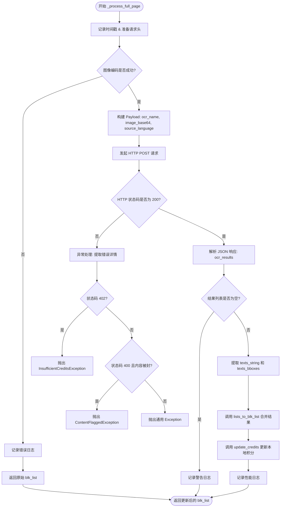

#### 带注释源码

```python
def _process_full_page(self, img: np.ndarray, blk_list: List[TextBlock], token: str) -> List[TextBlock]:
    """
    Handles OCR for full-page types (Google, Microsoft).
    """
    start_t = time.perf_counter()
    client_os = get_client_os()
    # 构建 HTTP 请求头，包含认证令牌和客户端系统信息
    headers = {
        "Authorization": f"Bearer {token}", 
        "Content-Type": "application/json",
        "X-Client-OS": client_os
    }

    # 1. 将图像编码为 Base64，以便通过 JSON 传输
    img_b64 = self.encode_image(img)
    if not img_b64:
        logger.error("UserOCR: Failed to encode the full image.")
        return blk_list
    after_encode_t = time.perf_counter()

    # 2. 准备请求载荷
    payload = {
        "ocr_name": self.ocr_key,
        "image_base64": img_b64,
        "source_language": self.source_lang_english 
    }

    # 3. 发送单次 API 调用请求处理整页图像
    before_http_t = time.perf_counter()
    response = self._session.post(
        self.api_url, 
        headers=headers, 
        json=payload, 
        timeout=120
    ) 
    after_http_t = time.perf_counter()
    
    # 4. 错误处理逻辑：解析服务器返回的详细错误信息
    try:
        response.raise_for_status()
    except requests.exceptions.HTTPError as e:
        try:
            error_data = response.json()
            detail = error_data.get('detail')
            description = ""

            # 解析 detail 字段，可能是 dict, list 或 string
            if isinstance(detail, dict):
                description = detail.get('error_description') or detail.get('message')
                if not description and detail.get('type'):
                     description = f"Error type: {detail.get('type')}"
            elif isinstance(detail, list):
                # Pydantic 验证错误格式
                msgs = []
                for err in detail:
                    loc = ".".join(str(x) for x in err.get('loc', []))
                    msg = err.get('msg', '')
                    msgs.append(f"{loc}: {msg}")
                description = "; ".join(msgs)
            else:
                description = str(detail) if detail else ""

            # 积分不足异常 (402)
            if response.status_code == 402:
                if isinstance(detail, dict) and detail.get('type') == 'INSUFFICIENT_CREDITS':
                    raise InsufficientCreditsException(description)
                raise InsufficientCreditsException(description)
                    
            # 内容违规异常 (400)
            if response.status_code == 400:
                is_flagged = False
                if isinstance(detail, dict) and detail.get('type') == 'CONTENT_FLAGGED_UNSAFE':
                    is_flagged = True
                elif "flagged as unsafe" in str(description).lower() or "blocked by" in str(description).lower():
                    is_flagged = True
                
                if is_flagged:
                    raise ContentFlaggedException(description, context="OCR")
                    
            # 其他服务器错误
            if description:
                 raise Exception(f"Server Error ({response.status_code}): {description}") from e

        except ValueError:
            # JSON 解析失败，直接抛出原始异常
            pass
        raise e

    # 5. 处理成功响应 (200 OK)
    if response.status_code == 200:
        response_data = response.json()
        api_results = response_data.get('ocr_results', [])

        if not api_results:
            logger.warning("UserOCR: Web API returned successful status but no OCR results.")
            return blk_list

        # 提取 API 返回的文本和坐标对
        texts_string = []
        texts_bboxes = [] # 期望格式: [x1, y1, x2, y2]
        for item in api_results:
            text = item.get('text')
            coords = item.get('coordinates')
            if text and coords and len(coords) == 4:
                texts_string.append(text)
                texts_bboxes.append(coords)
            else:
                logger.warning(f"Skipping API result item due to missing text or invalid coordinates: {item}")

        if not texts_string:
            logger.warning("UserOCR: No valid text/coordinate pairs extracted from API response.")
            return blk_list

        # 6. 使用工具函数将识别结果映射回 TextBlock 列表
        updated_blk_list = lists_to_blk_list(blk_list, texts_bboxes, texts_string)
        
        # 7. 更新用户积分信息
        credits_info = response_data.get('credits') or response_data.get('credits_remaining')
        self.update_credits(credits_info)
        
        # 8. 性能日志输出
        if self._profile_web_api:
            server_ms = response.headers.get("X-CT-Server-Duration-Ms")
            logger.info(
                "UserOCR full-page timings: encode=%.3fs http=%.3fs total=%.3fs (items=%d server_ms=%s)",
                after_encode_t - start_t,
                after_http_t - before_http_t,
                time.perf_counter() - start_t,
                len(api_results),
                server_ms,
            )
            print(
                f"UserOCR full-page timings: encode={after_encode_t - start_t:.3f}s "
                f"http={after_http_t - before_http_t:.3f}s total={time.perf_counter() - start_t:.3f}s "
                f"(items={len(api_results)} server_ms={server_ms})"
            )
        return updated_blk_list

    return blk_list 
```


### `UserOCR.update_credits`

该方法负责在 OCR 请求完成后，根据后端 API 返回的信用额度数据更新本地客户端的用户信息。它首先解析传入的 `credits` 数据（可能是字典或原始数字），将其标准化为应用内部的 `user_credits` 格式，保存到本地设置，并触发用户界面的余额更新。

参数：

-  `credits`：`Any`（可选），从 OCR Web API 响应中获取的信用额度数据。可能为 `None`（无更新）、包含详细余额信息的 `dict`，或者是单纯的数字余额。

返回值：`None`，该方法直接修改 `self.settings` 的状态并触发 UI 更新，不返回任何数据。

#### 流程图

```mermaid
flowchart TD
    A([开始 update_credits]) --> B{credits is None?}
    B -- 是 --> C([结束])
    B -- 否 --> D{isinstance(credits, dict)?}
    
    D -- 是 --> E[设置 settings.user_credits = credits]
    D -- 否 --> F{尝试转换为 int}
    
    F -- 成功 --> G[构建标准 Credits 字典]
    G --> E
    F -- 失败 --> H[记录警告并结束]
    
    E --> I[调用 _save_user_info_to_settings]
    I --> J[调用 _update_account_view]
    J --> C
```

#### 带注释源码

```python
def update_credits(self, credits: Optional[Any]) -> None:
    """
    更新用户积分/余额信息。
    处理来自服务器的不同格式的积分数据，并同步到本地设置与UI。
    """
    # 1. 防御性检查：如果 API 未返回积分信息（例如某些错误情况），则直接返回
    if credits is None:
        return

    # 2. 根据数据类型更新 settings 中的 user_credits
    if isinstance(credits, dict):
        # 情况A：如果后端返回了详细的字典结构（如包含 subscription, one_time 等键）
        # 直接赋值给 settings 对象
        self.settings.user_credits = credits
    else:
        # 情况B：如果后端返回的是简单的数字或字符串
        try:
            # 尝试将 credits 转换为整数总量
            total = int(credits)
            # 构造标准化的内部数据结构
            self.settings.user_credits = {
                'subscription': None,
                'one_time': total,
                'total': total,
            }
        except Exception:
            # 如果格式既不是字典也不能转换为整数，记录警告日志
            logger.warning(f"UserOCR: Unexpected credits format: {credits}")
            return

    # 3. 持久化保存：将更新后的用户信息写入本地配置文件或存储
    self.settings._save_user_info_to_settings()
    
    # 4. 视图刷新：通知 UI 层刷新账户余额显示
    self.settings._update_account_view()
```

## 关键组件


### OCR策略分发中心

在 `process_image` 方法中，根据初始化时确定的 `is_llm_type` 和 `is_full_page_type` 标志，将请求路由至不同的处理流程（分块批处理或全页处理）。

### 认证与令牌管理模块

通过 `_get_access_token` 方法调用 AuthClient 验证用户令牌有效性，并从存储中获取访问令牌以授权后续 API 请求。

### 图像序列化组件

调用 `encode_image` 方法将输入的 NumPy 图像数组编码为 Base64 字符串，用于 JSON Payload 的传输。

### 坐标膨胀与校验器

在 `_process_blocks_llm` 中，使用 `adjust_text_line_coordinates` 对文本块的坐标进行百分比膨胀以获取上下文，并校验坐标是否超出图像边界。

### 批量请求构造器

在 LLM 处理流程中，构造包含全图 Base64 和多个坐标列表的 JSON Payload，发送给后端进行批量文本识别。

### 全页请求构造器

在 Full Page 处理流程中，构造仅包含全图 Base64 的 JSON Payload，发送给后端进行整页文本识别。

### 响应结果映射器

解析 API 返回的 OCR 结果，按照请求时的坐标顺序将识别出的文本映射回本地的 `TextBlock` 列表中。

### 积分与状态更新器

通过 `update_credits` 方法解析 API 返回的积分信息，并更新本地 Settings 中的用户积分及账户视图。

### 异常转换与错误处理模块

在请求响应处理中，捕获 HTTP 错误并将状态码 402 映射为 `InsufficientCreditsException`，将 400 状态码中的内容违规映射为 `ContentFlaggedException`。


## 问题及建议


### 已知问题

-   **代码重复 (DRY 原则违反)**: `_process_blocks_llm` 和 `_process_full_page` 方法中处理 HTTP 错误（状态码检查、JSON 解析、异常构造）的逻辑几乎完全相同。这违反了 DRY 原则，增加了维护成本。
-   **同步阻塞导致 UI 卡顿**: 使用同步的 `requests.Session().post` 进行网络请求。在桌面应用中，这会阻塞调用线程。如果在主 UI 线程调用，会导致应用界面卡死数秒。
-   **硬编码配置**: `LLM_OCR_KEYS`, `FULL_PAGE_OCR_KEYS` 和 `timeout=120` 被硬编码在类中。扩展新的 OCR 引擎或调整超时时间需要修改源代码。
-   **响应映射脆弱**: 在 `_process_blocks_llm` 中，代码假设服务器返回的结果顺序与发送的 `coordinates` 列表顺序一致。如果 API 返回结果数量不符或顺序错乱，文本会被错误地映射到文本块。
-   **缺少显式资源清理**: `self._session` (`requests.Session`) 没有显式的 `close()` 方法，虽然 Python 垃圾回收机制会处理，但在长周期运行的桌面应用中，显式管理连接池更好。
-   **初始化状态依赖**: `process_image` 依赖 `initialize` 被正确调用。如果直接调用 `process_image` 而未调用 `initialize`，`self.auth_client` 和 `self.settings` 将为 `None`，导致运行时异常。

### 优化建议

-   **提取通用方法**: 创建一个 `_handle_api_response(response)` 私有方法，将状态码校验、JSON 解析、自定义异常（如 `InsufficientCreditsException`）的构造提取出来，供两个处理方法复用。
-   **异步化改造**: 建议引入 `aiohttp` 或使用线程池（如 `concurrent.futures`）将网络请求异步化，或者在文档中明确说明必须在非 UI 线程调用此方法。
-   **配置外部化**: 将支持的 OCR Key 集合和超时时间作为构造函数参数或从配置文件中读取，提高灵活性。
-   **增强结果映射逻辑**: 发送请求时附带每个 Block 的唯一 ID 或索引，并要求 API 返回对应的 ID，以便准确匹配结果，而非依赖顺序索引。
-   **实现资源管理协议**: 可以考虑实现 `__enter__` 和 `__exit__` (Context Manager Protocol)，或添加 `close()` 方法来确保 Session 关闭。

## 其它


### 设计目标与约束

1. **核心目标**：将桌面OCR请求代理到Web API，利用服务器端OCR引擎（LLM或传统OCR）处理图像，并使用用户账户积分进行计费。
2. **支持模式**：
   - LLM模式（逐块处理）：适用于Gemini-2.0-Flash等模型，发送整个图像+坐标列表，服务器逐个识别。
   - 全页OCR模式（整页处理）：适用于Microsoft OCR，发送完整图像，服务器返回文本块坐标和内容。
3. **超时约束**：HTTP请求超时时间统一设置为120秒，以适应大图像或复杂OCR场景。
4. **兼容性约束**：仅支持Windows客户端（通过`get_client_os()获取OS信息构建请求头`）。

### 错误处理与异常设计

1. **认证错误**：
   - `AuthClient.validate_token()`验证失败时，记录错误并返回None，导致`process_image`直接返回原blk_list。
   - `get_token("access_token")`获取失败时，记录警告并返回None。
2. **HTTP错误处理**：
   - **402 Payment Required**：检测`type='INSUFFICIENT_CREDITS'`，抛出`InsufficientCreditsException`。
   - **400 Bad Request**：检测`type='CONTENT_FLAGGED_UNSAFE'`或描述中包含"flagged as unsafe"/"blocked by"，抛出`ContentFlaggedException`。
   - **其他错误**：解析响应JSON中的`detail`字段（支持dict/list/string格式），提取描述信息，抛出携带服务器错误描述的`Exception`。
3. **业务逻辑错误**：
   - 坐标验证失败（越界或无效矩形）时跳过该block并记录警告。
   - 图像编码失败时记录错误并返回原blk_list。
   - 服务器返回结果数量不匹配时记录warning。
4. **积分更新异常**：积分更新失败仅记录warning，不中断流程。

### 数据流与状态机

1. **主流程**：
   - `process_image`入口 -> 获取access_token -> 判断OCR类型 -> 分发到`_process_blocks_llm`或`_process_full_page`。
2. **LLM模式数据流**：
   - 遍历blk_list提取有效坐标（含边界检查） -> Base64编码全图 -> 构建payload（含coordinates数组） -> 发送单次HTTP请求 -> 解析ocr_results数组 -> 按顺序映射回blk_list的text字段。
3. **全页模式数据流**：
   - Base64编码全图 -> 构建payload -> 发送HTTP请求 -> 解析ocr_results（含text和coordinates） -> 调用`lists_to_blk_list`将结果转换为TextBlock列表 -> 返回新列表。
4. **状态管理**：
   - `is_llm_type`和`is_full_page_type`在`initialize`时确定，处理过程中保持不变。

### 外部依赖与接口契约

1. **依赖模块**：
   - `app.account.auth.AuthClient`：令牌验证。
   - `app.account.auth.token_storage.get_token`：获取access_token。
   - `app.ui.settings.SettingsPage`：用户设置和积分信息更新。
   - `app.account.config.WEB_API_OCR_URL`：Web API端点URL。
   - `utils.textblock.TextBlock`：文本块数据结构。
   - `utils.platform_utils.get_client_os`：获取客户端操作系统。
2. **接口契约**：
   - **OCR API**：POST请求，含`ocr_name`, `image_base64`, `source_language`（必选），LLM模式额外含`llm_options`和`coordinates`。
   - **响应格式**：JSON，含`ocr_results`（数组），可选含`credits`或`credits_remaining`。
   - **响应头**：读取`X-CT-Server-Duration-Ms`用于性能日志。

### 性能考虑

1. **批量处理**：LLM模式单次HTTP请求处理所有有效block，减少网络往返。
2. **图像编码**：仅编码一次（复用img_b64）。
3. **性能日志**：`_profile_web_api`标志启用时，记录token获取、图像编码、HTTP请求、总耗时等分段时间。
4. **超时配置**：120秒超时覆盖大图像上传和OCR处理时间。

### 安全性考虑

1. **认证安全**：请求头携带`Authorization: Bearer {token}`。
2. **客户端标识**：请求头携带`X-Client-OS`标识客户端操作系统。
3. **内容安全**：检测并抛出`ContentFlaggedException`处理服务端标记的不当内容。
4. **异常信息脱敏**：客户端向用户展示的错误信息来源于服务器返回的description，需确保不泄露内部实现细节。

### 配置与可扩展性

1. **OCR类型扩展**：
   - 通过修改`LLM_OCR_KEYS`和`FULL_PAGE_OCR_KEYS`集合添加新OCR引擎。
   - 新增LLM选项需在`_get_llm_options`中映射对应字段。
2. **API URL配置**：通过构造函数注入，默认读取`WEB_API_OCR_URL`配置。
3. **LLM选项配置**：从`SettingsPage.get_llm_settings()`动态获取，支持temperature等参数。

### 日志与监控

1. **日志级别**：
   - `logger.info`：记录主流程操作（如开始OCR、性能统计）。
   - `logger.debug`：记录策略选择和详细步骤。
   - `logger.warning`：记录可恢复的错误（如单个block跳过、结果数量不匹配）。
   - `logger.error`：记录致命错误（如无token、图像编码失败）。
2. **性能监控**：
   - 打印包含encode/http/total耗时的性能报告。
   - 读取并记录服务器处理时长`X-CT-Server-Duration-Ms`。

### 测试策略建议

1. **单元测试**：
   - 测试坐标提取与边界校验逻辑。
   - 测试错误响应解析（dict/list/string格式的detail）。
   - 测试积分更新逻辑（dict/int格式）。
2. **集成测试**：
   - Mock AuthClient和Web API，测试完整流程。
   - 测试超时场景。
3. **异常场景测试**：
   - 模拟402/400错误，验证异常抛出。
   - 模拟无效坐标和空结果。

### 部署注意事项

1. **环境依赖**：
   - 确保`requests`库版本兼容。
   - 确保依赖的内部模块（AuthClient, SettingsPage等）已正确初始化。
2. **网络要求**：
   - 客户端需能访问`WEB_API_OCR_URL`指定的端点。
   - 需开放443端口（HTTPS）用于API通信。
3. **权限要求**：
   - 需有权限读取和写入用户设置文件（用于保存积分信息）。
   - 需有权限访问系统信息（get_client_os）。


    