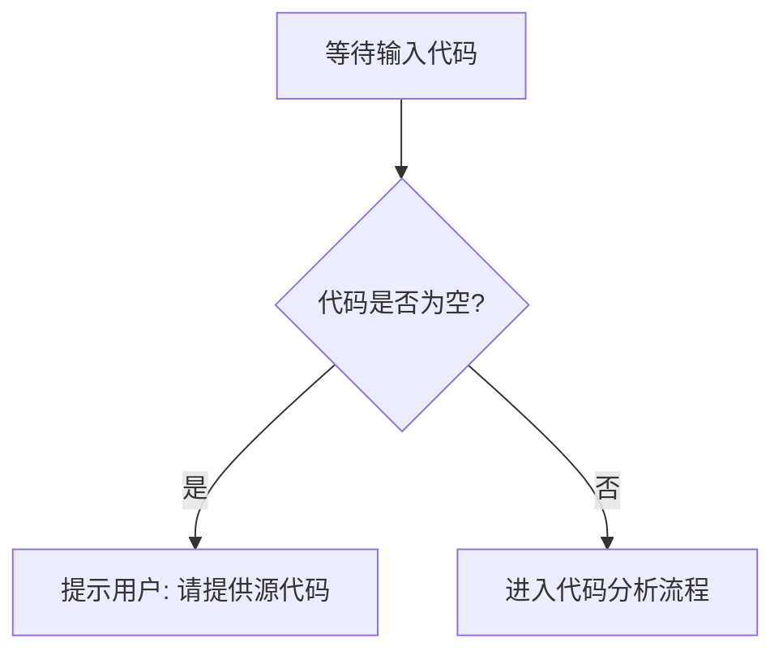

# `comic-translate\modules\rendering\__init__.py` 详细设计文档

未提供代码内容，无法进行分析。请在代码块中粘贴需要分析的源代码。

## 整体流程



## 类结构

```
等待代码输入后生成
```

## 全局变量及字段


    

## 全局函数及方法


## 关键组件


### 源代码缺失

未提供待分析的源代码。当前代码段为空，无法识别关键组件。请提供需要分析的代码内容。


## 问题及建议


### 已知问题

-   未提供待分析的代码内容，无法进行技术债务或优化空间的分析

### 优化建议

-   请提供需要分析的源代码，以便进行详细的技术债务识别和优化建议


## 其它


### 1. 一句话描述

（由于未提供代码，此处留空）

### 2. 文件的整体运行流程

（由于未提供代码，此处留空）

### 3. 类的详细信息

#### 3.1 类字段

（由于未提供代码，此处留空）

#### 3.2 类方法

（由于未提供代码，此处留空）

### 4. 全局变量和全局函数

#### 4.1 全局变量

（由于未提供代码，此处留空）

#### 4.2 全局函数

（由于未提供代码，此处留空）

### 5. 关键组件信息

（由于未提供代码，此处留空）

### 6. 潜在的技术债务或优化空间

（由于未提供代码，此处留空）

### 7. 其它项目

#### 7.1 设计目标与约束

（由于未提供代码，此处留空）

#### 7.2 错误处理与异常设计

（由于未提供代码，此处留空）

#### 7.3 数据流与状态机

（由于未提供代码，此处留空）

#### 7.4 外部依赖与接口契约

（由于未提供代码，此处留空）

#### 7.5 性能考量与资源管理

（由于未提供代码，此处留空）

#### 7.6 安全性设计

（由于未提供代码，此处留空）

#### 7.7 可测试性设计

（由于未提供代码，此处留空）

#### 7.8 版本兼容性

（由于未提供代码，此处留空）

#### 7.9 配置与扩展性

（由于未提供代码，此处留空）

#### 7.10 日志与监控

（由于未提供代码，此处留空）

    