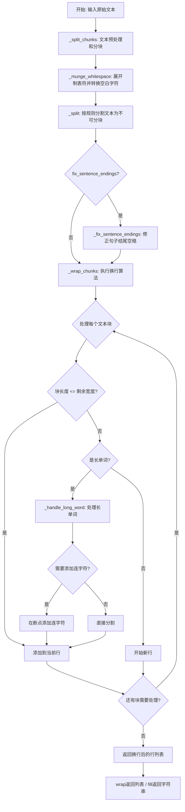
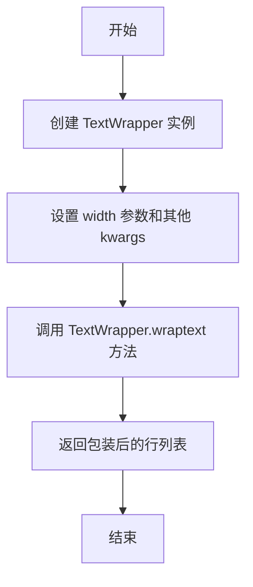
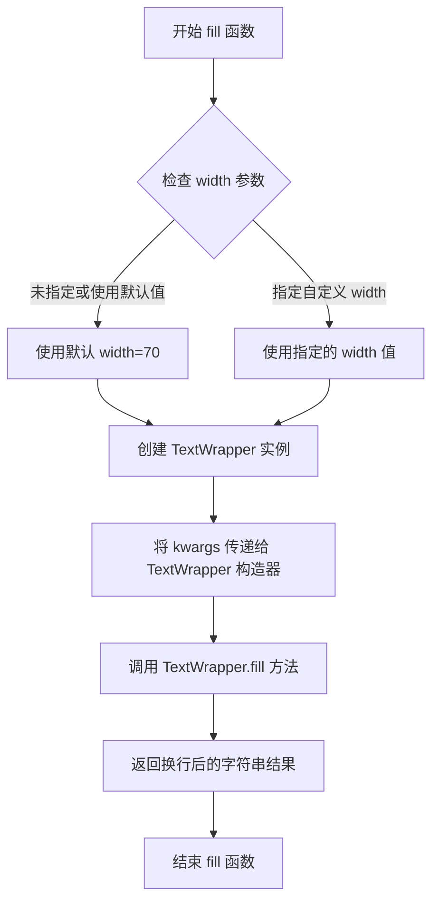
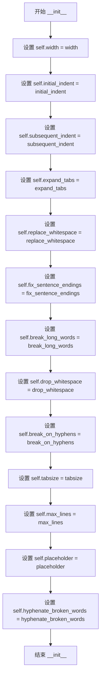
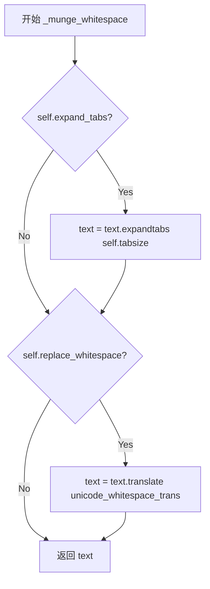
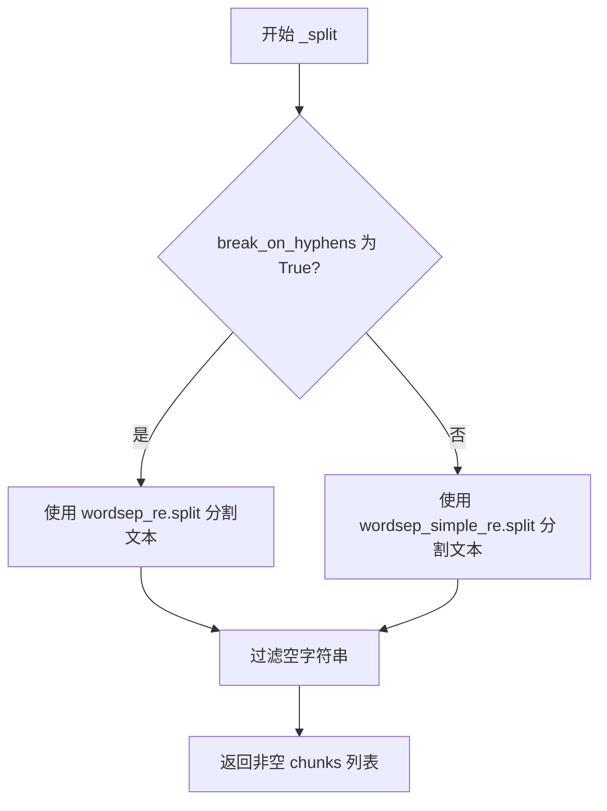
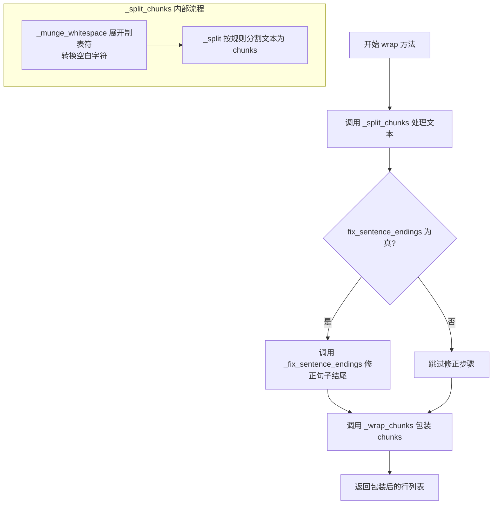
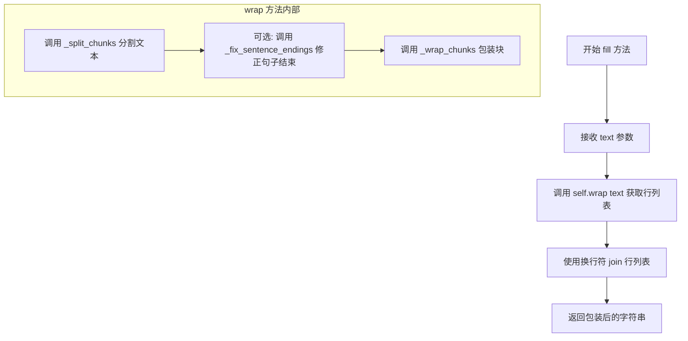

# `comic-translate\modules\rendering\hyphen_textwrap.py` 详细设计文档

这是一个修改版的Python textwrap模块,用于文本换行和填充处理,核心功能是在拆分长单词时自动添加连字符(-)以确保排版美观,同时提供文本缩进、去除公共前导空白等辅助功能。

## 整体流程



## 类结构

```
TextWrapper (文本换行处理类)
├── 实例属性: width, initial_indent, subsequent_indent等
├── 类属性/正则: wordsep_re, wordsep_simple_re, sentence_end_re等
└── 方法: __init__, _munge_whitespace, _split, _fix_sentence_endings, _handle_long_word, _wrap_chunks, _split_chunks, wrap, fill
```

## 全局变量及字段


### `__all__`
    
导出模块的公共接口列表

类型：`list`
    


### `_whitespace`
    
认可的空白字符集

类型：`str`
    


### `_whitespace_only_re`
    
仅空白行正则

类型：`re.Pattern`
    


### `_leading_whitespace_re`
    
前导空白正则

类型：`re.Pattern`
    


### `TextWrapper.width`
    
换行最大宽度，默认70

类型：`int`
    


### `TextWrapper.initial_indent`
    
首行缩进字符串

类型：`str`
    


### `TextWrapper.subsequent_indent`
    
后续行缩进字符串

类型：`str`
    


### `TextWrapper.expand_tabs`
    
是否展开制表符

类型：`bool`
    


### `TextWrapper.replace_whitespace`
    
是否替换空白字符

类型：`bool`
    


### `TextWrapper.fix_sentence_endings`
    
是否修正句子结尾

类型：`bool`
    


### `TextWrapper.break_long_words`
    
是否拆分长单词

类型：`bool`
    


### `TextWrapper.drop_whitespace`
    
是否丢弃空白

类型：`bool`
    


### `TextWrapper.break_on_hyphens`
    
是否在连字符处换行

类型：`bool`
    


### `TextWrapper.hyphenate_broken_words`
    
拆分长单词时是否添加连字符

类型：`bool`
    


### `TextWrapper.tabsize`
    
制表符宽度，默认8

类型：`int`
    


### `TextWrapper.max_lines`
    
最大行数限制

类型：`int`
    


### `TextWrapper.placeholder`
    
截断文本的占位符

类型：`str`
    


### `TextWrapper.unicode_whitespace_trans`
    
Unicode空白字符转换表

类型：`dict`
    


### `TextWrapper.wordsep_re`
    
复杂分词正则表达式

类型：`re.Pattern`
    


### `TextWrapper.wordsep_simple_re`
    
简单分词正则表达式

类型：`re.Pattern`
    


### `TextWrapper.sentence_end_re`
    
句子结束正则表达式

类型：`re.Pattern`
    
    

## 全局函数及方法


### `wrap`

全局函数 `wrap` 是 textwrap 模块的便捷接口函数，用于将单个段落文本包装成指定宽度的行列表，并在长单词断行时自动添加连字符（当 `hyphenate_broken_words` 为 True 时）。

参数：

- `text`：`string`，要包装的单个段落文本
- `width`：`int`（默认值 70），包装后每行的最大字符宽度
- `**kwargs`：可选关键字参数，用于传递 TextWrapper 的其他配置选项（如 `expand_tabs`、`break_on_hyphens`、`hyphenate_broken_words` 等）

返回值：`[string]`，返回包装后的行列表，每行字符串的最大长度不超过指定的 width

#### 流程图



#### 带注释源码

```python
def wrap(text, width=70, **kwargs):
    """Wrap a single paragraph of text, returning a list of wrapped lines.

    Reformat the single paragraph in 'text' so it fits in lines of no
    more than 'width' columns, and return a list of wrapped lines.  By
    default, tabs in 'text' are expanded with string.expandtabs(), and
    all other whitespace characters (including newline) are converted to
    space.  See TextWrapper class for available keyword args to customize
    wrapping behaviour.
    """
    # 创建一个 TextWrapper 实例，传入宽度和其他自定义参数
    # kwargs 可以包含: expand_tabs, replace_whitespace, fix_sentence_endings,
    # break_long_words, drop_whitespace, break_on_hyphens, 
    # hyphenate_broken_words 等配置选项
    w = TextWrapper(width=width, **kwargs)
    
    # 调用 TextWrapper 实例的 wrap 方法对文本进行包装处理
    # 该方法内部会: 分词 -> 处理句子结束符 -> 包装成指定宽度的行
    # 当长单词超出宽度时，会根据配置自动添加连字符
    return w.wrap(text)
```


### `fill`

该全局函数是 `textwrap` 模块提供的便捷接口函数，用于将单个段落文本重新格式化为适合指定宽度的列，并返回包含整个换行段落的新字符串。函数内部创建 `TextWrapper` 实例并委托其 `fill` 方法完成实际工作，支持通过关键字参数自定义换行行为。

参数：

- `text`：`str`，需要填充/换行的单段落文本
- `width`：`int`，可选，默认为 70，指定换行后每行的最大字符宽度
- `**kwargs`：可变关键字参数，用于传递给 `TextWrapper` 构造器的其他可选参数（如 `initial_indent`、`subsequent_indent`、`expand_tabs` 等）

返回值：`str`，返回重新格式化后的文本段落，各行之间用换行符 `\n` 分隔

#### 流程图



#### 带注释源码

```python
def fill(text, width=70, **kwargs):
    """Fill a single paragraph of text, returning a new string.

    Reformat the single paragraph in 'text' to fit in lines of no more
    than 'width' columns, and return a new string containing the entire
    wrapped paragraph.  As with wrap(), tabs are expanded and other
    whitespace characters converted to space.  See TextWrapper class for
    available keyword args to customize wrapping behaviour.
    """
    # 创建一个 TextWrapper 实例，传入 width 参数和任意额外的关键字参数
    # 这些参数会传递给 TextWrapper.__init__ 方法，用于自定义换行行为
    w = TextWrapper(width=width, **kwargs)
    
    # 调用 TextWrapper 实例的 fill 方法处理文本并返回结果
    # 该方法内部调用 wrap() 方法获取换行后的行列表，
    # 然后用换行符 join 所有行返回最终字符串
    return w.fill(text)
```


### `shorten`

该函数用于折叠并截断文本到指定宽度，首先将文本的空白字符折叠，如果文本适应指定宽度则直接返回，否则在末尾添加占位符。

参数：

- `text`：`str`，需要处理的原始文本
- `width`：`int`，指定的输出宽度
- `**kwargs`：可变关键字参数，用于传递额外的配置参数给 TextWrapper（如 placeholder 等）

返回值：`str`，处理后的文本，如果超出宽度则在末尾附加占位符

#### 流程图

```mermaid
flowchart TD
    A[开始 shorten 函数] --> B[接收 text 和 width 参数]
    B --> C[text.strip().split() 去除首尾空白并按空白分割]
    C --> D[' '.join(...) 将单词用空格连接]
    D --> E[创建 TextWrapper 实例<br/>width=width, max_lines=1]
    E --> F[调用 w.fill 处理后的文本]
    F --> G[返回填充后的字符串]
    
    style A fill:#f9f,stroke:#333
    style G fill:#9f9,stroke:#333
```

#### 带注释源码

```python
def shorten(text, width, **kwargs):
    """Collapse and truncate the given text to fit in the given width.

    The text first has its whitespace collapsed.  If it then fits in
    the *width*, it is returned as is.  Otherwise, as many words
    as possible are joined and then the placeholder is appended::

        >>> textwrap.shorten("Hello  world!", width=12)
        'Hello world!'
        >>> textwrap.shorten("Hello  world!", width=11)
        'Hello [...]'
    """
    # 创建一个 TextWrapper 实例
    # width: 限制输出行宽度
    # max_lines=1: 限制最多显示1行，超出时截断并添加占位符
    # **kwargs: 允许传递额外参数如 placeholder 自定义占位符
    w = TextWrapper(width=width, max_lines=1, **kwargs)
    
    # 处理文本：
    # 1. text.strip() 去除首尾空白
    # 2. .split() 按任意空白字符分割成单词列表
    # 3. ' '.join(...) 用单个空格重新连接所有单词（实现空白折叠）
    # 4. w.fill(...) 使用 TextWrapper 填充到指定宽度
    return w.fill(' '.join(text.strip().split()))
```


### `dedent`

去除所有行的公共前导空白，使三重引号字符串左对齐，同时保持源代码中的缩进形式。

参数：

- `text`：`str`，需要进行去缩进的文本

返回值：`str`，去除公共前导空白后的文本

#### 流程图

```mermaid
flowchart TD
    A[开始 dedent] --> B[初始化 margin 为 None]
    B --> C[使用 _whitespace_only_re 移除纯空白行]
    C --> D[使用 _leading_whitespace_re 提取所有行的前导空白]
    D --> E{indent in indents}
    E -->|第一个 indent| F[margin = indent]
    E -->|后续 indent| G{indent.startswith<br/>margin?}
    G -->|是| H[保持 margin 不变]
    G -->|否| I{margin.startswith<br/>indent?}
    I -->|是| J[margin = indent]
    I -->|否| K[逐字符比较找出共同前缀]
    K --> L[margin = margin[:i]]
    L --> H
    J --> H
    H --> E
    E -->|遍历完成| M{margin 存在?}
    M -->|是| N[使用正则替换移除公共前缀]
    N --> O[返回处理后的文本]
    M -->|否| O
```

#### 带注释源码

```python
# 全局正则表达式：匹配仅包含空格和制表符的行（用于后续移除纯空白行）
_whitespace_only_re = re.compile('^[ \t]+$', re.MULTILINE)
# 全局正则表达式：捕获每行的前导空白（不包括完全空白的行）
_leading_whitespace_re = re.compile('(^[ \t]*)(?:[^ \t\n])', re.MULTILINE)

def dedent(text):
    """Remove any common leading whitespace from every line in `text`.

    This can be used to make triple-quoted strings line up with the left
    edge of the display, while still presenting them in the source code
    in indented form.

    Note that tabs and spaces are both treated as whitespace, but they
    are not equal: the lines "  hello" and "\\thello" are
    considered to have no common leading whitespace.

    Entirely blank lines are normalized to a newline character.
    """
    # 查找所有行中最长的公共前导空格/制表符字符串
    margin = None
    
    # 1. 先移除所有纯空白行（仅包含空格和制表符的行）
    text = _whitespace_only_re.sub('', text)
    
    # 2. 提取所有非空行的前导空白
    indents = _leading_whitespace_re.findall(text)
    
    # 3. 遍历所有前导空白，找出最小的公共前缀
    for indent in indents:
        if margin is None:
            margin = indent

        # 当前行缩进比之前的深：保持不变（之前的仍是最浅的）
        elif indent.startswith(margin):
            pass

        # 当前行缩进与之前的一致或更浅：更新为新的最小缩进
        elif margin.startswith(indent):
            margin = indent

        # 缩进不一致，需要找出最大公共前缀
        else:
            for i, (x, y) in enumerate(zip(margin, indent)):
                if x != y:
                    margin = margin[:i]
                    break

    # 调试断言（仅在调试模式下启用）
    if 0 and margin:
        for line in text.split("\n"):
            assert not line or line.startswith(margin), \
                   "line = %r, margin = %r" % (line, margin)

    # 4. 如果存在公共前缀，从每行中移除
    if margin:
        text = re.sub(r'(?m)^' + margin, '', text)
    
    return text
```


## 一段话描述

该代码是Python标准库`textwrap`模块的修改版本，核心功能是提供文本自动换行、填充、缩进和去缩进的功能。模块新增了`hyphenate_broken_words`特性，在长单词被拆分到下一行时自动添加连字符，以确保文本格式的完整性和美观性。

## 文件的整体运行流程

```
入口模块加载
    │
    ├─→ TextWrapper 类实例化
    │       │
    │       ├─→ 配置参数初始化（width, indent, expand_tabs等）
    │       │
    │       └─→ 调用 wrap() 或 fill() 方法
    │               │
    │               ├─→ _munge_whitespace() - 处理空白字符
    │               ├─→ _split() - 分割文本为块
    │               ├─→ _fix_sentence_endings() - 修正句子结束符
    │               ├─→ _wrap_chunks() - 核心换行算法
    │               │       │
    │               │       └─→ _handle_long_word() - 处理长单词（含连字符添加逻辑）
    │               │
    │               └─→ 返回换行后的行列表
    │
    ├─→ 全局便捷函数（wrap, fill, shorten）
    │
    └─→ 工具函数（dedent, indent）
```

## 类的详细信息

### TextWrapper 类

TextWrapper 类是文本换行处理的核心类，负责管理和执行文本的自动换行、填充等操作。

#### 类字段

| 名称 | 类型 | 描述 |
|------|------|------|
| `unicode_whitespace_trans` | dict | Unicode空白字符到空格的映射字典，用于快速转换空白字符 |
| `word_punct` | str | 正则表达式片段，匹配单词和标点符号 |
| `letter` | str | 正则表达式片段，匹配字母字符 |
| `whitespace` | str | 正则表达式片段，匹配空白字符 |
| `nowhitespace` | str | 正则表达式片段，匹配非空白字符 |
| `wordsep_re` | re.Pattern | 复杂的正则表达式，用于将文本分割成可换行的块 |
| `wordsep_simple_re` | re.Pattern | 简单的正则表达式，按空白字符分割文本 |
| `sentence_end_re` | re.Pattern | 正则表达式，用于识别句子结束符 |

#### 类方法

详情见后文各方法专项说明。

---

### 关键组件信息

| 组件名称 | 一句话描述 |
|----------|------------|
| `_whitespace` | 硬编码的US-ASCII空白字符常量，包含制表符、换行符等 |
| `wordsep_re` | 复杂的正则表达式引擎，支持连字符单词分割 |
| `_handle_long_word()` | 处理超长单词的核心方法，包含新增的连字符自动添加逻辑 |
| `hyphenate_broken_words` | 新增实例属性，控制是否在拆分的长单词末尾添加连字符 |

---

### 潜在的技术债务或优化空间

1. **正则表达式性能**：`wordsep_re`正则表达式非常复杂且使用VERBOSE模式编译，每次调用都需要解析，建议预编译并缓存
2. **句子结束检测算法**：`fix_sentence_endings`功能使用简单正则匹配，对非英语文本支持有限
3. **locale支持**：代码注释中明确提到`sentence_end_re`不支持locale或charset，仅适用于英语
4. **unicode处理**：虽然添加了`unicode_whitespace_trans`转换，但对复杂unicode字符（如emoji）的处理可能不完善

---

### 其它项目

#### 设计目标与约束
- **主要目标**：提供灵活的文本换行和填充功能，支持自定义缩进、宽度控制
- **新增目标**：在长单词拆分时自动添加连字符，提升可读性
- **约束**：必须保持与Python标准库textwrap模块的基本兼容性

#### 错误处理与异常设计
- 当`width`小于等于0时，`_wrap_chunks()`抛出`ValueError`
- 当`placeholder`宽度超过`max_lines`可用宽度时，抛出`ValueError`
- 其他情况均返回安全的字符串或列表，不会抛出意外异常

#### 数据流与状态机
文本处理流程可视为有限状态机：
1. **初始状态**：原始文本输入
2. **空白处理状态**：通过`_munge_whitespace()`展开制表符、转换空白字符
3. **分块状态**：通过`_split()`将文本分割为可换行的块
4. **可选修正状态**：通过`_fix_sentence_endings()`修正句子结束符
5. **换行状态**：通过`_wrap_chunks()`执行核心换行算法
6. **最终状态**：返回换行后的字符串列表

#### 外部依赖与接口契约
- **无外部依赖**：仅使用Python标准库`re`模块
- **导出接口**：通过`__all__`列表导出`TextWrapper`, `wrap`, `fill`, `dedent`, `indent`, `shorten`

---

## 函数专项文档

### `indent` (全局函数)

为选中行添加前缀

#### 参数

- `text`：`string`，需要进行前缀添加的文本
- `prefix`：`string`，要添加到每行开头的字符串前缀
- `predicate`：`callable` 或 `None`，可选的过滤函数，用于决定哪些行需要添加前缀，默认为`None`（即对所有非空行添加前缀）

#### 返回值

`string`，返回处理后的文本，其中满足条件的行首添加了指定前缀

#### 流程图

```mermaid
flowchart TD
    A[开始 indent 函数] --> B{predicate 是否为 None?}
    B -->|是| C[使用默认断言: not s.isspace()]
    B -->|否| D[使用用户提供的 predicate]
    C --> E[遍历 text.splitlines True]
    D --> E
    E --> F{当前行满足 predicate?}
    F -->|是| G[添加 prefix 到前缀列表]
    F -->|否| H[不添加 prefix]
    G --> I[添加当前行到前缀列表]
    H --> I
    I --> J{是否还有更多行?}
    J -->|是| E
    J -->|否| K[拼接所有前缀元素为字符串]
    K --> L[返回结果]
```

#### 带注释源码

```python
def indent(text, prefix, predicate=None):
    """Adds 'prefix' to the beginning of selected lines in 'text'.

    If 'predicate' is provided, 'prefix' will only be added to the lines
    where 'predicate(line)' is True. If 'predicate' is not provided,
    it will default to adding 'prefix' to all non-empty lines that do not
    consist solely of whitespace characters.
    """
    # 如果没有提供 predicate 函数，使用默认行为：
    # 只对非纯空白字符的行添加前缀
    # splitlines(True) 的特性：
    #   ''.splitlines(True) => [] 空字符串不产生任何元素
    #   'foo\n'.splitlines(True) => ['foo\n'] 保留换行符
    if predicate is None:
        predicate = lambda s: not s.isspace()

    prefixed_lines = []  # 存储处理后的行
    # splitlines(True) 保留行尾的换行符，确保输出格式与输入一致
    for line in text.splitlines(True):
        if predicate(line):
            # 满足条件的行，添加前缀
            prefixed_lines.append(prefix)
        # 无论是否添加前缀，都需要添加原始行内容
        prefixed_lines.append(line)

    # 将所有行拼接成最终字符串并返回
    return ''.join(prefixed_lines)
```


### `TextWrapper.__init__`

初始化 TextWrapper 对象，设置文本包装/填充的各种配置参数。

参数：

- `self`：TextWrapper，表示类的实例对象
- `width`：int，默认 70，包装后文本的最大宽度
- `initial_indent`：str，默认 ""，包装后第一行的前缀字符串
- `subsequent_indent`：str，默认 ""，除第一行外其他行的前缀字符串
- `expand_tabs`：bool，默认 True，是否将输入文本中的制表符展开为空格
- `replace_whitespace`：bool，默认 True，是否将所有空白字符替换为空格
- `fix_sentence_endings`：bool，默认 False，是否修正句子结尾，确保句末标点后有两个空格
- `break_long_words`：bool，默认 True，是否打断超过宽度的长单词
- `drop_whitespace`：bool，默认 True，是否删除行首和行尾的空白字符
- `break_on_hyphens`：bool，默认 True，允许在连字符处断行
- `hyphenate_broken_words`：bool，默认 True，当单词被断开时是否添加连字符
- `tabsize`：int，默认 8，制表符展开的空格数
- `max_lines`：int，默认 None，截断后的最大行数
- `placeholder`：str，默认 ' [...]'，截断文本末尾的占位符

返回值：`None`，构造函数不返回值，仅初始化实例属性

#### 流程图



#### 带注释源码

```python
def __init__(self,
             width=70,                      # 包装后文本的最大宽度（默认70列）
             initial_indent="",              # 第一行的前缀字符串
             subsequent_indent="",           # 后续行的前缀字符串
             expand_tabs=True,               # 是否展开制表符为空格
             replace_whitespace=True,        # 是否将空白字符替换为空格
             fix_sentence_endings=False,     # 是否修正句子结尾标点后的空格数
             break_long_words=True,          # 是否打断超长单词
             drop_whitespace=True,           # 是否删除行首尾空白
             break_on_hyphens=True,          # 是否允许在连字符处断行
             hyphenate_broken_words=True,     # 断词时是否添加连字符（新增参数）
             tabsize=8,                      # 制表符对应的空格数
             *,                              # 关键字参数分隔符
             max_lines=None,                 # 最大行数限制（用于截断）
             placeholder=' [...]'):          # 截断时的占位符
    # 将所有参数赋值给实例属性
    self.width = width
    self.initial_indent = initial_indent
    self.subsequent_indent = subsequent_indent
    self.expand_tabs = expand_tabs
    self.replace_whitespace = replace_whitespace
    self.fix_sentence_endings = fix_sentence_endings
    self.break_long_words = break_long_words
    self.drop_whitespace = drop_whitespace
    self.break_on_hyphens = break_on_hyphens
    self.tabsize = tabsize
    self.max_lines = max_lines
    self.placeholder = placeholder
    self.hyphenate_broken_words = hyphenate_broken_words
```


### `TextWrapper._munge_whitespace`

该方法用于处理文本中的空白字符，根据实例配置展开制表符并将其他空白字符转换为空格，为后续的文本包装做准备。

参数：

- `text`：`str`，需要处理的原始文本字符串

返回值：`str`，处理后的文本字符串

#### 流程图



#### 带注释源码

```python
def _munge_whitespace(self, text):
    """_munge_whitespace(text : string) -> string

    Munge whitespace in text: expand tabs and convert all other
    whitespace characters to spaces.  Eg. " foo\\tbar\\n\\nbaz"
    becomes " foo    bar  baz".
    """
    # 如果启用制表符展开，则将制表符转换为空格
    # expandtabs 方法根据 self.tabsize（默认8）将制表符转换为对应数量的空格
    if self.expand_tabs:
        text = text.expandtabs(self.tabsize)
    
    # 如果启用空白字符替换，则将所有空白字符转换为单个空格
    # unicode_whitespace_trans 是一个翻译表，将所有已知空白字符映射为空格
    if self.replace_whitespace:
        text = text.translate(self.unicode_whitespace_trans)
    
    # 返回处理后的文本
    return text
```


### `TextWrapper._split`

该方法负责将待包装的文本拆分为不可再分的基本块（chunks），是文本包装过程的第一步。它根据 `break_on_hyphens` 属性选择使用复杂的正则表达式（支持连字符处理）或简单的空格分割正则表达式，过滤空字符串后返回非空块列表。

参数：

- `text`：`str`，要拆分的原始文本字符串

返回值：`list[str]`，拆分后得到的非空文本块列表

#### 流程图



#### 带注释源码

```python
def _split(self, text):
    """_split(text : string) -> [string]

    Split the text to wrap into indivisible chunks.  Chunks are
    not quite the same as words; see _wrap_chunks() for full
    details.  As an example, the text
      Look, goof-ball -- use the -b option!
    breaks into the following chunks:
      'Look,', ' ', 'goof-', 'ball', ' ', '--', ' ',
      'use', ' ', 'the', ' ', '-b', ' ', 'option!'
    if break_on_hyphens is True, or in:
      'Look,', ' ', 'goof-ball', ' ', '--', ' ',
      'use', ' ', 'the', ' ', '-b', ' ', option!'
    otherwise.
    """
    # 根据 break_on_hyphens 配置选择合适的分词策略
    # True 时使用复杂正则，支持连字符作为断点
    if self.break_on_hyphens is True:
        # wordsep_re 能识别连字符、em-dash 等复杂词边界
        chunks = self.wordsep_re.split(text)
    else:
        # wordsep_simple_re 仅按空白字符简单分割
        chunks = self.wordsep_simple_re.split(text) 
    
    # 过滤掉空字符串，保留有效内容块
    chunks = [c for c in chunks if c]

    return chunks
```


### `TextWrapper._fix_sentence_endings`

该方法用于修正文本块中句子结尾的空格问题。当原始文本中的句子结束标点符号（如句号、感叹号、问号）后紧跟换行再跟其他句子时，经过 `munge_whitespace()` 和 `split()` 处理后会变成 "foo.", " ", "Bar" 的形式，导致句子结尾只有一个空格，该方法会将单个空格改为两个空格以确保句子结尾有两个空格。

参数：

- `chunks`：`list[str]`，待处理的文本块列表，会在原列表上进行修改

返回值：`None`，该方法直接修改传入的 `chunks` 列表，无返回值

#### 流程图

```mermaid
flowchart TD
    A[开始] --> B[初始化 i = 0]
    B --> C{i < len(chunks) - 1?}
    C -->|否| D[结束]
    C -->|是| E{chunks[i+1] == ' ' 且 chunks[i] 匹配 sentence_end_re?}
    E -->|是| F[将 chunks[i+1] 改为 '  ' 双空格]
    F --> G[i += 2]
    E -->|否| H[i += 1]
    G --> C
    H --> C
```

#### 带注释源码

```python
def _fix_sentence_endings(self, chunks):
    """_fix_sentence_endings(chunks : [string])

    Correct for sentence endings buried in 'chunks'.  Eg. when the
    original text contains "... foo.\nBar ...", munge_whitespace()
    and split() will convert that to [..., "foo.", " ", "Bar", ...]
    which has one too few spaces; this method simply changes the one
    space to two.
    """
    # 初始化索引 i，用于遍历 chunks 列表
    i = 0
    # 获取 sentence_end_re 的 search 方法，缓存以提高性能
    patsearch = self.sentence_end_re.search
    # 遍历 chunks，当遇到句子结尾时确保其后有两个空格
    while i < len(chunks)-1:
        # 检查当前块后面是否紧跟一个空格，且当前块以句子结尾标点结束
        if chunks[i+1] == " " and patsearch(chunks[i]):
            # 将单个空格改为两个空格
            chunks[i+1] = "  "
            # 跳过已处理的空格，继续检查下一个
            i += 2
        else:
            # 继续检查下一个块
            i += 1
```


### `TextWrapper._handle_long_word`

处理过长的单词，当单词无法完整放入当前行时，决定是拆分该单词（在合适的位置添加连字符）还是保留完整单词到下一行。

参数：

- `reversed_chunks`：`[string]`，需要处理的文本块列表（逆序栈结构）
- `cur_line`：`[string]`，当前正在构建的行（字符串列表）
- `cur_len`：`int`，当前行的累计长度
- `width`：`int`，当前行的最大可用宽度

返回值：`None`，无返回值（直接修改 `reversed_chunks` 和 `cur_line`）

#### 流程图

```mermaid
flowchart TD
    A[开始 _handle_long_word] --> B{width < 1?}
    B -->|是| C[space_left = 1]
    B -->|否| D[space_left = width - cur_len]
    D --> E{break_long_words?}
    E -->|否| F{cur_line 为空?}
    F -->|是| G[将整个块添加到 cur_line]
    F -->|否| H[什么都不做, 留到下一行]
    G --> I[结束]
    H --> I
    E -->|是| J[设置 end = space_left]
    J --> K[获取块 chunk = reversed_chunks[-1]]
    K --> L{break_on_hyphens 且 len(chunk) > space_left?}
    L -->|否| M[在 end 处拆分块]
    L -->|是| N{查找最后一个连字符位置}
    N --> O{连字符前有非连字符?}
    O -->|是| P[end = hyphen + 1]
    O -->|否| M
    P --> M
    M --> Q{chunk[:end] 非空?}
    Q -->|否| I
    Q -->|是| R[添加 chunk[:end] 到 cur_line]
    R --> S{hyphenate_broken_words 且 末尾不是 -/. ,?}
    S -->|否| T[直接结束拆分]
    S -->|是| U[添加 '-' 到 cur_line]
    U --> T
    T --> V[更新 reversed_chunks[-1] = chunk[end:]]
    V --> I
```

#### 带注释源码

```python
def _handle_long_word(self, reversed_chunks, cur_line, cur_len, width):
    """_handle_long_word(chunks : [string],
                        cur_line : [string],
                        cur_len : int, width : int)

    Handle a chunk of text (most likely a word, not whitespace) that
    is too long to fit in any line.
    """
    # 计算当前行剩余可用宽度
    # 如果指定宽度小于1，则至少保留1个字符的空间
    if width < 1:
        space_left = 1
    else:
        space_left = width - cur_len

    # 如果允许拆分长单词，则尝试将单词拆分后放入当前行
    if self.break_long_words:
        # 默认拆分位置为剩余空间末尾
        end = space_left
        # 获取栈顶的块（最后一个需要处理的单词）
        chunk = reversed_chunks[-1]
        
        # 如果允许在连字符处拆分，且单词长度超过可用空间
        if self.break_on_hyphens and len(chunk) > space_left:
            # 尝试在最后一个连字符处拆分
            # 只查找 space_left 范围内的连字符
            hyphen = chunk.rfind('-', 0, space_left)
            # 确保连字符前面有非连字符（即是有效的单词内连字符）
            if hyphen > 0 and any(c != '-' for c in chunk[:hyphen]):
                end = hyphen + 1  # 在连字符后拆分，保留连字符在前半部分
        
        # 如果拆分后的部分非空，则添加到当前行
        if chunk[:end]:
            cur_line.append(chunk[:end])
            # 如果启用了长单词连字符拆分，且末尾不是已有连字符/点/逗号
            # 则在行尾添加连字符，表示单词被拆分到下一行
            if self.hyphenate_broken_words and chunk[:end][-1] not in ['-','.',',']:
                cur_line.append('-')
        
        # 更新剩余的块内容（已拆分的部分移除）
        reversed_chunks[-1] = chunk[end:]

    # 不允许拆分长单词时的处理逻辑
    # 保留完整单词，仅在当前行空时才添加（最小化超出宽度的情况）
    elif not cur_line:
        cur_line.append(reversed_chunks.pop())

    # 如果不允许拆分且当前行已有内容，则不做处理
    # 下一轮循环会处理这个长单词，届时 cur_len 为0，会单独成行
```


### `TextWrapper._wrap_chunks`

该方法是 TextWrapper 类的核心换行算法，负责将预先分割好的文本块数组按照指定宽度进行智能换行处理，支持长单词断字、连字符处理、最大行数限制等功能，是实现文本自动换行的核心逻辑。

参数：

- `chunks`：`List[str]`，待换行的文本块列表，每个元素是不可再分的基本单元（单词或空白符），由 `_split()` 或 `_split_chunks()` 方法预先处理得到

返回值：`List[str]`，换行后的行列表，每行长度不超过 `self.width`（除非 `break_long_words` 为 False 导致长单词溢出）

#### 流程图

```mermaid
flowchart TD
    A[开始 _wrap_chunks] --> B{width <= 0?}
    B -->|是| C[抛出 ValueError]
    B -->|否| D{max_lines 不为 None?}
    D -->|是| E[计算合适的缩进]
    D -->|否| F[反转 chunks 列表]
    
    F --> G[初始化空行列表]
    G --> H[进入主循环 while chunks]
    
    H --> I[初始化 cur_line 和 cur_len]
    I --> J[确定当前行缩进]
    J --> K[计算当前行可用宽度 width]
    K --> L{drop_whitespace 且最后块为空且已有行?}
    L -->|是| M[删除末尾空白块]
    L -->|否| N{当前块长度 <= 剩余宽度?}
    
    M --> N
    N -->|是| O[弹出块到当前行并增加长度]
    O --> P{还有剩余块?}
    P -->|是| N
    P -->|否| Q[当前行加入行列表]
    
    N -->|否| R{最后一块长度 > width?}
    R -->|是| S[调用 _handle_long_word 处理长单词]
    S --> T[重新计算 cur_len]
    R -->|否| Q
    
    T --> U{最后一块是空白?}
    U -->|是| V[删除末尾空白并调整长度]
    U -->|否| W{有当前行?}
    V --> W
    
    W -->|是| X{满足 max_lines 条件?}
    X -->|是| Q
    X -->|否| Y[尝试添加 placeholder]
    Q --> Z[返回 lines]
    
    Y --> AA{能添加 placeholder?]
    AA -->|是| AB[添加 placeholder 到最后一行]
    AA -->|否| AC[新建一行放 placeholder]
    AB --> Z
    AC --> Z
```

#### 带注释源码

```python
def _wrap_chunks(self, chunks):
    """_wrap_chunks(chunks : [string]) -> [string]

    Wrap a sequence of text chunks and return a list of lines of
    length 'self.width' or less.  (If 'break_long_words' is false,
    some lines may be longer than this.)  Chunks correspond roughly
    to words and the whitespace between them: each chunk is
    indivisible (modulo 'break_long_words'), but a line break can
    come between any two chunks.  Chunks should not have internal
    whitespace; ie. a chunk is either all whitespace or a "word".
    Whitespace chunks will be removed from the beginning and end of
    lines, but apart from that whitespace is preserved.
    """
    # 初始化结果行列表
    lines = []
    
    # 验证宽度参数有效性
    if self.width <= 0:
        raise ValueError("invalid width %r (must be > 0)" % self.width)
    
    # 处理最大行数限制的情况
    if self.max_lines is not None:
        # max_lines > 1 时使用后续缩进，否则使用首行缩进
        if self.max_lines > 1:
            indent = self.subsequent_indent
        else:
            indent = self.initial_indent
        # 确保占位符不会超出最大宽度
        if len(indent) + len(self.placeholder.lstrip()) > self.width:
            raise ValueError("placeholder too large for max width")

    # 反转块顺序以便高效地从栈顶弹出（实现 LIFO 行为）
    chunks.reverse()

    # 主循环：处理所有文本块直到耗尽
    while chunks:

        # 初始化当前行的块列表和长度计数器
        cur_line = []
        cur_len = 0

        # 根据是否为首行确定缩进字符串
        if lines:
            indent = self.subsequent_indent
        else:
            indent = self.initial_indent

        # 计算当前行的最大可用宽度（总宽度减去缩进长度）
        width = self.width - len(indent)

        # 如果启用丢弃空白选项，且当前块是空白且已有输出行，则删除该空白块
        if self.drop_whitespace and chunks[-1].strip() == '' and lines:
            del chunks[-1]

        # 内层循环：尽可能将块填充到当前行
        while chunks:
            l = len(chunks[-1])

            # 如果当前块能放入当前行，则添加进去
            if cur_len + l <= width:
                cur_line.append(chunks.pop())
                cur_len += l

            # 当前行已满，退出内层循环
            else:
                break

        # 处理无法放入任何行的过长块（调用长单词处理方法）
        if chunks and len(chunks[-1]) > width:
            self._handle_long_word(chunks, cur_line, cur_len, width)
            # 处理长单词后需要重新计算当前行长度
            cur_len = sum(map(len, cur_line))

        # 如果当前行末尾是空白块，根据设置决定是否丢弃
        if self.drop_whitespace and cur_line and cur_line[-1].strip() == '':
            cur_len -= len(cur_line[-1])
            del cur_line[-1]

        # 将处理好的当前行添加到结果列表
        if cur_line:
            # 检查是否未超过最大行数限制
            if (self.max_lines is None or
                len(lines) + 1 < self.max_lines or
                (not chunks or
                 self.drop_whitespace and
                 len(chunks) == 1 and
                 not chunks[0].strip()) and cur_len <= width):
                # 将当前行转换为字符串并存储到结果列表
                lines.append(indent + ''.join(cur_line))
            else:
                # 需要截断到最大行数，尝试添加占位符
                while cur_line:
                    if (cur_line[-1].strip() and
                        cur_len + len(self.placeholder) <= width):
                        cur_line.append(self.placeholder)
                        lines.append(indent + ''.join(cur_line))
                        break
                    cur_len -= len(cur_line[-1])
                    del cur_line[-1]
                else:
                    # 如果无法在当前行添加占位符，则修改上一行
                    if lines:
                        prev_line = lines[-1].rstrip()
                        if (len(prev_line) + len(self.placeholder) <=
                                self.width):
                            lines[-1] = prev_line + self.placeholder
                            break
                    # 新建一行仅放置占位符
                    lines.append(indent + self.placeholder.lstrip())
                break

    return lines
```


### `TextWrapper._split_chunks`

该方法是将文本转换为可包装的块的核心预处理步骤。它首先调用 `_munge_whitespace` 对文本进行空白字符处理（展开制表符、替换空白字符），然后调用 `_split` 将处理后的文本分割成不可分割的块（词或连字符分隔的部分）。

参数：

- `text`：`str`，需要进行分割处理的原始文本

返回值：`list[str]`，返回处理并分割后的文本块列表

#### 流程图

```mermaid
flowchart TD
    A[开始 _split_chunks] --> B[调用 _munge_whitespace 处理 text]
    B --> C{expand_tabs?}
    C -->|是| D[使用 expandtabs 展开制表符]
    C -->|否| E[跳过制表符展开]
    D --> F{replace_whitespace?}
    E --> F
    F -->|是| G[将所有空白字符转换为空格]
    F -->|否| H[保持原样]
    G --> I[返回处理后的 text]
    H --> I
    I --> J[调用 _split 分割文本]
    J --> K{break_on_hyphens 为真?]
    K -->|是| L[使用 wordsep_re 分割<br/>支持连字符分隔词]
    K -->|否| M[使用 wordsep_simple_re 分割<br/>仅按空白字符分割]
    L --> N[过滤空字符串]
    M --> N
    N --> O[返回块列表]
    O --> P[结束 _split_chunks]
```

#### 带注释源码

```python
def _split_chunks(self, text):
    """
    将文本分割成不可分割的块。
    
    这是文本包装过程的第一个步骤，负责：
    1. 处理空白字符（制表符展开、空白字符替换）
    2. 将文本分割成适合包装的最小单位（块）
    
    参数:
        text: str，需要处理的原始文本
        
    返回:
        list[str]: 不可分割的文本块列表
    """
    # 第一步：处理空白字符
    # 调用 _munge_whitespace 方法，该方法会：
    # - 如果 expand_tabs 为真，将制表符展开为空格（根据 tabsize）
    # - 如果 replace_whitespace 为真，将所有空白字符替换为空格
    text = self._munge_whitespace(text)
    
    # 第二步：分割文本成块
    # 调用 _split 方法，根据 break_on_hyphens 设置选择合适的分割策略：
    # - break_on_hyphens=True: 使用复杂的正则表达式 wordsep_re，
    #   支持在连字符处分割复合词
    # - break_on_hyphens=False: 使用简单的正则表达式 wordsep_simple_re，
    #   仅按空白字符分割
    # 返回结果会过滤掉空字符串
    return self._split(text)
```


### `TextWrapper.wrap`

重新格式化单个段落文本，使其适应不超过指定宽度的行，并返回包装后的行列表。该方法是TextWrapper类的公共接口核心方法之一，调用内部方法将文本分割、处理、最后包装成指定宽度的行。

参数：

- `text`：`string`，要包装的原始文本段落

返回值：`[string]`，返回包装后的行列表，每行长度不超过指定宽度

#### 流程图



#### 带注释源码

```python
def wrap(self, text):
    """wrap(text : string) -> [string]

    Reformat the single paragraph in 'text' so it fits in lines of
    no more than 'self.width' columns, and return a list of wrapped
    lines.  Tabs in 'text' are expanded with string.expandtabs(),
    and all other whitespace characters (including newline) are
    converted to space.
    """
    # 第一步：将文本分割成可处理的块（chunks）
    # _split_chunks 内部会先调用 _munge_whitespace 展开制表符并转换空白字符，
    # 然后调用 _split 按正则表达式规则将文本分割成单词和空白块
    chunks = self._split_chunks(text)
    
    # 第二步（可选）：修正句子结尾
    # 如果 fix_sentence_endings 为 True，确保句子结尾标点符号后有两个空格
    # 这是一个修正步骤，处理被分割的句子
    if self.fix_sentence_endings:
        self._fix_sentence_endings(chunks)
    
    # 第三步：核心包装逻辑
    # _wrap_chunks 是实际执行行包装的算法，考虑宽度限制、缩进、连字符处理等
    # 返回一个行列表，每行都是已经处理好的字符串
    return self._wrap_chunks(chunks)
```


### `TextWrapper.fill`

该方法是 `TextWrapper` 类的公共接口之一，负责将单个段落文本重新格式化为不超过指定宽度的行，并返回包含整个包装段落的新字符串。方法内部通过调用 `wrap()` 方法获取行列表，然后使用换行符连接这些行。

参数：

- `text`：`string`，需要包装的单个段落文本

返回值：`string`，包含整个包装段落的新字符串

#### 流程图



#### 带注释源码

```python
def fill(self, text):
    """fill(text : string) -> string

    Reformat the single paragraph in 'text' to fit in lines of no
    more than 'self.width' columns, and return a new string
    containing the entire wrapped paragraph.
    """
    # 调用 wrap 方法获取包装后的行列表
    # wrap 方法内部会:
    # 1. 通过 _split_chunks 将文本分割成块
    # 2. (可选)通过 _fix_sentence_endings 修正句子结束符
    # 3. 通过 _wrap_chunks 将块包装成指定宽度的行列表
    wrapped_lines = self.wrap(text)
    
    # 使用换行符将行列表连接成单个字符串并返回
    return "\n".join(wrapped_lines)
```

## 关键组件


### TextWrapper类

核心文本换行和填充类，包含所有换行逻辑的配置和实现。

### _whitespace全局变量

定义认可的空白字符列表，用于文本处理。

### wordsep_re正则表达式

复杂的正则表达式，用于将文本分割成可换行的块，处理连字符和em-dash等。

### _handle_long_word方法

处理超长单词的核心方法，包含修改添加的连字符功能，当长单词被分割到下一行时自动添加连字符。

### _wrap_chunks方法

核心换行算法，将文本块组装成指定宽度的行。

### hyphenate_broken_words参数

新增的实例属性，控制是否在断词处自动添加连字符。

### wrap()和fill()函数

公共接口函数，提供简化的文本换行和填充功能。

### dedent()和indent()函数

辅助功能函数，分别用于移除和添加缩进。

### shorten()函数

用于将文本截断到指定宽度并添加占位符。

### _munge_whitespace方法

处理空白字符：展开制表符并将其他空白字符转换为空格。

### _split方法

将文本分割成不可分割的块，考虑连字符断字规则。

### _fix_sentence_endings方法

确保句子结尾标点后有两个空格。

## 问题及建议


### 已知问题

-   `_handle_long_word`方法在添加连字符后未正确更新`cur_len`，导致行长度计算不准确，可能引发后续逻辑错误
-   `sentence_end_re`正则表达式仅匹配小写字母开头的句子（`[a-z]`），会遗漏大写字母开头的句子，导致句子结束检测不完整
-   代码中存在调试代码`if 0 and margin:`，表明存在未清理的测试代码
-   `_wrap_chunks`方法嵌套层级过深（超过5层），代码行数超过200行，可维护性差
-   `wordsep_re`正则表达式极其复杂（超过30行），难以理解和维护
-   添加连字符时仅检查末尾字符`['-','.',',']`，未考虑其他常见分隔符如空格、下划线等
-   `hyphenate_broken_words`参数未在类文档字符串中说明，与用户文档不一致

### 优化建议

-   修复`_handle_long_word`中的长度计算逻辑，在添加连字符后同步更新`cur_len`
-   扩展`sentence_end_re`以支持大写字母开头的句子：`r'[A-Za-z]'`
-   移除调试代码`if 0 and margin:`及其相关测试代码块
-   将`_wrap_chunks`方法拆分为多个私有方法以降低复杂度
-   完善类文档字符串，添加`hyphenate_broken_words`参数说明
-   扩展连字符添加的排除字符列表：`['-','.',',', '_', ' ']`
-   考虑将复杂的正则表达式提取为常量或配置，提升可读性
-   添加边界条件测试用例（width≤0、max_lines=0/1等）

## 其它


### 设计目标与约束

本模块的设计目标是提供一个功能强大的文本包装和填充工具，能够将长文本按照指定的宽度进行自动换行处理。核心约束包括：默认行宽为70个字符，支持自定义初始缩进和后续缩进，处理制表符扩展，可控制是否在连字符处断行，以及在断行时自动添加连字符（这是本修改版本的核心特性）。模块需要保持与Python标准库textwrap的兼容性，同时增加单词断行时添加连字符的功能。

### 错误处理与异常设计

模块的错误处理主要体现在以下几个方面：宽度参数验证，当width小于等于0时，_wrap_chunks方法会抛出ValueError异常，错误信息为"invalid width %r (must be > 0)"；占位符大小验证，当max_lines不为None且占位符宽度超过可用行宽时，会抛出ValueError异常；正则表达式编译错误会在模块加载时立即被发现；空输入文本会被正确处理，返回空列表或空字符串。所有异常都包含清晰的错误信息，便于调试和使用。

### 数据流与状态机

文本处理的数据流遵循以下流程：输入原始文本字符串，经过_munge_whitespace方法进行制表符扩展和空白字符转换，然后通过_split方法将文本分割成单词块（chunks），接着在fix_sentence_endings为True时进行句子结束符处理，最后通过_wrap_chunks方法进行实际的分行包装。状态机主要体现在_wrap_chunks方法中，包含以下状态：初始化新行、处理当前行中的chunks、处理超长单词、决定是否添加占位符、决定是否结束或继续处理下一行。

### 外部依赖与接口契约

本模块是Python标准库textwrap的修改版本，不依赖任何第三方库，主要依赖Python内置的re模块进行正则表达式处理。模块导出以下公共接口：TextWrapper类（主要的包装器对象），wrap函数（返回包装后的行列表），fill函数（返回填充后的字符串），dedent函数（移除公共前导空白），indent函数（添加前导空白），shorten函数（截断文本到指定宽度）。所有函数都支持通过关键字参数传递TextWrapper的配置选项。

### 性能考虑

模块在性能方面进行了以下优化：使用预编译的正则表达式（wordsep_re、wordsep_simple_re、sentence_end_re等）避免重复编译；_wrap_chunks方法中使用列表的reverse和pop操作实现高效的栈操作；单词分割使用正则表达式的一次性匹配而非逐字符处理；在处理大量文本时，避免不必要的字符串复制和中间对象创建。潜在的优化空间包括：对于非常大的文本块，可以考虑流式处理；缓存常用的空白字符转换表；使用__slots__优化TextWrapper类的内存占用。

### 安全性考虑

本模块主要处理文本字符串，不涉及文件操作、网络通信或代码执行等高风险操作，安全性风险较低。需要注意的安全点包括：正则表达式的ReDoS（正则表达式拒绝服务）攻击风险，但当前使用的正则表达式较为简单，风险较低；输入文本的大小可能影响内存使用，但这是所有文本处理库的共同问题。模块没有对输入进行任何长度限制，在处理超长文本时需要注意内存消耗。

### 测试考虑

测试应该覆盖以下场景：基本包装功能测试，确保不同宽度的文本能够正确换行；连字符添加测试，验证在单词中间断行时正确添加连字符；边界条件测试，包括空字符串、单字符、超宽单词等；缩进测试，验证initial_indent和subsequent_indent的正确应用；制表符处理测试；句子结束符修复测试；max_lines和placeholder功能测试；各种配置组合的测试。建议使用Python的unittest框架进行自动化测试。

### 配置与可扩展性

TextWrapper类提供了丰富的配置选项，通过__init__方法的参数进行设置。主要配置项包括：width（行宽）、initial_indent（首行缩进）、subsequent_indent（后续行缩进）、expand_tabs（是否扩展制表符）、tabsize（制表符宽度）、replace_whitespace（是否替换空白字符）、fix_sentence_endings（修复句子结束符）、break_long_words（是否断开长单词）、break_on_hyphens（是否在连字符处断行）、hyphenate_broken_words（是否在断行处添加连字符）、max_lines（最大行数）、placeholder（截断占位符）。通过继承TextWrapper类并重写相关方法，可以完全定制包装算法。

### 国际化与本地化

模块在国际化方面存在一些限制：_whitespace变量硬编码为US-ASCII空白字符，这是有意为之的设计，因为某些Unicode空白字符（如\u00a0）是非换行空白字符；sentence_end_re正则表达式仅考虑英文字母和常见句子结束标点符号，不支持其他语言的句子结构；模块不进行任何语言相关的处理，假设输入文本为西文文本。对于Unicode文本的支持主要依赖于Python 3的字符串处理能力，但本地化（非英语）的文本处理可能需要专门的国际化库来实现。

### 版本兼容性

本模块基于Python 3的textwrap实现，使用了Python 3的语法特性和字符串处理方式。模块在Python 3.6+版本上应该能够正常运行。代码中使用了类型注解风格的文档字符串（使用冒号分隔参数名和类型），这是Python 3的类型提示特性的一部分，但仅用于文档目的。模块不依赖任何Python 3.6+特有的功能，因此应该向后兼容到Python 3.0版本。


    