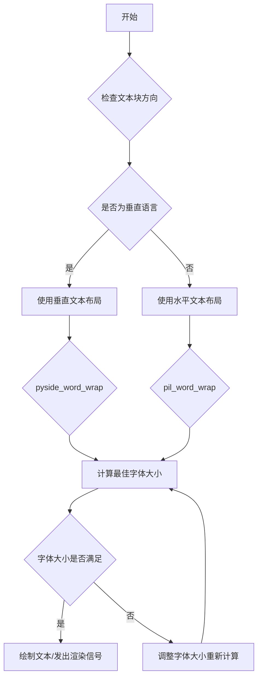
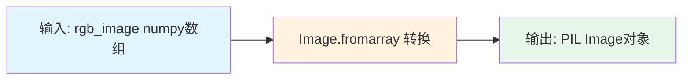
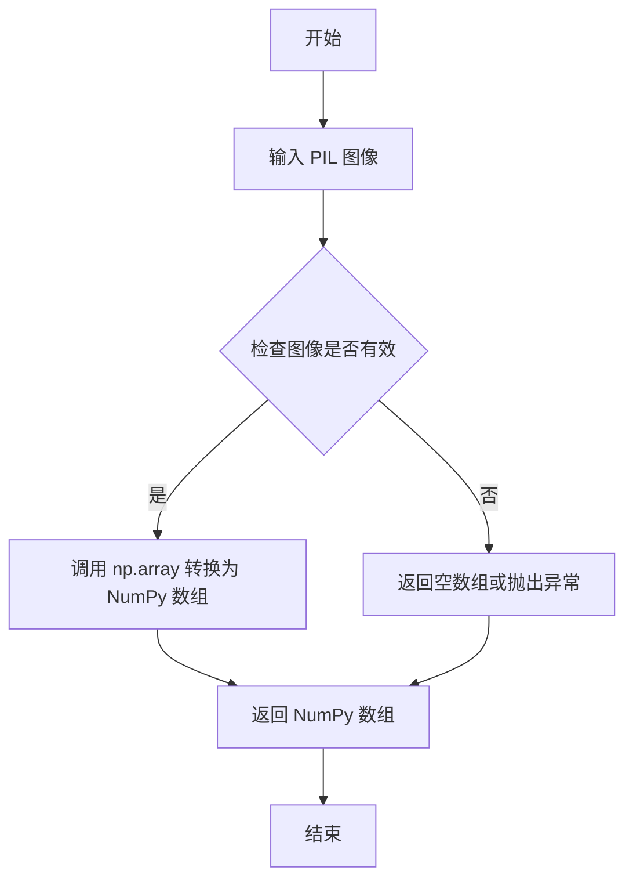
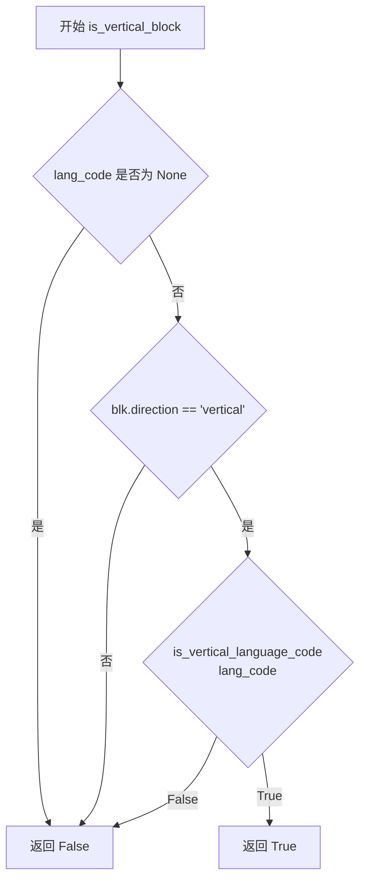
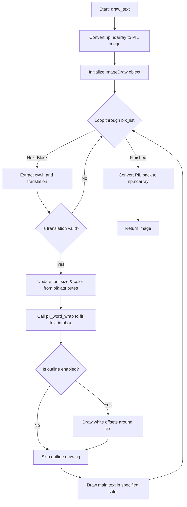
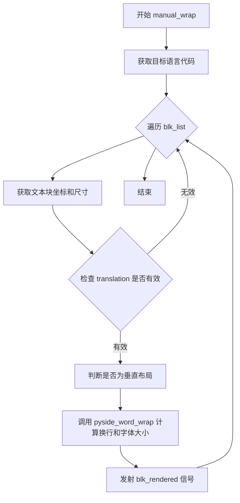

# `comic-translate\modules\rendering\render.py` 详细设计文档

该模块提供文本渲染功能，支持水平和垂直布局的文本换行、字体大小调整、在图像上绘制文本，以及与PySide6集成进行文本布局渲染。主要用于漫画或图像的文本翻译本地化渲染。

## 整体流程



## 类结构

```
TextRenderingSettings (数据类)
└── 函数模块
    ├── array_to_pil
    ├── pil_to_array
    ├── is_vertical_language_code
    ├── is_vertical_block
    ├── pil_word_wrap
    ├── draw_text
    ├── get_best_render_area
    ├── pyside_word_wrap
    └── manual_wrap
```

## 全局变量及字段


### `TextRenderingSettings.alignment_id`
    
对齐方式标识

类型：`int`
    


### `TextRenderingSettings.font_family`
    
字体家族

类型：`str`
    


### `TextRenderingSettings.min_font_size`
    
最小字体大小

类型：`int`
    


### `TextRenderingSettings.max_font_size`
    
最大字体大小

类型：`int`
    


### `TextRenderingSettings.color`
    
文本颜色

类型：`str`
    


### `TextRenderingSettings.upper_case`
    
是否大写

类型：`bool`
    


### `TextRenderingSettings.outline`
    
是否描边

类型：`bool`
    


### `TextRenderingSettings.outline_color`
    
描边颜色

类型：`str`
    


### `TextRenderingSettings.outline_width`
    
描边宽度

类型：`str`
    


### `TextRenderingSettings.bold`
    
是否粗体

类型：`bool`
    


### `TextRenderingSettings.italic`
    
是否斜体

类型：`bool`
    


### `TextRenderingSettings.underline`
    
是否下划线

类型：`bool`
    


### `TextRenderingSettings.line_spacing`
    
行间距

类型：`str`
    


### `TextRenderingSettings.direction`
    
布局方向

类型：`Qt.LayoutDirection`
    
    

## 全局函数及方法


### `array_to_pil`

该函数是图像格式转换工具函数，负责将深度学习框架常用的numpy数组格式转换为PIL图像对象，实现不同图像表示形式之间的无缝衔接，是图像处理流水线中的关键桥梁。

参数：

- `rgb_image`：`np.ndarray`，RGB格式的图像数据（numpy数组）

返回值：`PIL.Image.Image`，转换后的PIL图像对象

#### 流程图



#### 带注释源码

```python
def array_to_pil(rgb_image: np.ndarray):
    """将numpy数组转换为PIL图像。
    
    Args:
        rgb_image: RGB格式的图像数据，以numpy数组形式存储
        
    Returns:
        PIL.Image.Image: 转换后的PIL图像对象
    """
    # 图像已经是RGB格式，直接转换为PIL
    # 使用PIL的fromarray方法进行数组到图像的转换
    pil_image = Image.fromarray(rgb_image)
    return pil_image
```

#### 关键组件信息

- **numpy数组 (np.ndarray)**：输入的图像数据格式，深度学习框架中常用的图像表示形式
- **PIL.Image**：Python Imaging Library，提供强大的图像处理功能
- **Image.fromarray()**：PIL库的核心方法，负责将numpy数组反向转换为图像对象

#### 潜在技术债务与优化空间

1. **缺乏输入验证**：未对输入数组的维度、数据类型、值范围进行校验，可能导致转换失败或难以调试的错误
2. **通道顺序假设固定**：代码假设输入为RGB格式，但未明确处理BGR或其他色彩空间的情况
3. **错误处理缺失**：没有异常捕获机制，转换失败时会导致程序中断
4. **文档注释不足**：函数缺少完整的docstring，调用者无法快速了解前置条件和使用约束

#### 其他设计考量

- **设计目标**：提供轻量级的图像格式转换能力，保持接口简洁
- **约束条件**：输入数组必须为连续内存布局，且数据类型需为PIL支持的类型（如uint8）
- **错误处理建议**：建议调用方在调用前验证数组有效性，或在函数内添加基础校验（如检查shape为(H, W, 3)）
- **数据流说明**：该函数通常位于图像预处理管道的末端，接收来自模型输出的图像数组，输出给后续的图像保存或显示模块


### `pil_to_array`

将 PIL 图像对象转换为 NumPy 多维数组格式，以便于后续的图像处理、运算或与 Qt 图像格式的互操作。

参数：

- `pil_image`：`Image`（PIL.Image.Image），输入的 PIL 图像对象，应为 RGB 格式

返回值：`np.ndarray`，转换后的 NumPy 数组，数组维度为 (height, width, channels)，通道顺序为 RGB

#### 流程图



#### 带注释源码

```python
def pil_to_array(pil_image: Image):
    # Convert the PIL image to a numpy array (already in RGB)
    # 输入参数：pil_image - PIL 图像对象，通常为 RGB 格式
    # 处理逻辑：使用 numpy 的 array 函数将 PIL Image 对象直接转换为 ndarray
    # 注意：转换过程中不会改变通道顺序，PIL 的 RGB 格式直接映射为 numpy 的 HWC 格式
    numpy_image = np.array(pil_image)
    # 返回转换后的 numpy 数组，维度为 (height, width, channels)
    return numpy_image
```

#### 设计说明

- **转换效率**：该函数直接调用 `np.array()` 进行转换，底层实现为 C 语言级拷贝，性能较高
- **格式保持**：PIL 的 RGB 图像转换为 NumPy 数组后，保持 (H, W, C) 的维度顺序，通道为 0-255 的 uint8 类型
- **配套函数**：通常与 `array_to_pil` 函数配对使用，实现 PIL 与 NumPy 格式的双向转换
- **使用场景**：在 `draw_text` 函数中，该转换用于将 NumPy 数组格式的图像转换为 PIL 格式以进行文本绘制，之后再转换回 NumPy 数组返回


### `is_vertical_language_code`

该函数用于判断给定的语言代码是否支持垂直文本布局，当前仅将简体中文（zh-cn）、繁体中文（zh-tw）和日语（ja）识别为支持垂直布局的语言。

参数：

- `lang_code`：`str | None`，需要检测的语言代码，支持 ISO 639-1 标准或带地区后缀的语言代码，如 "zh-cn"、"zh-tw"、"ja" 等

返回值：`bool`，如果语言代码支持垂直布局则返回 `True`，否则返回 `False`

#### 流程图

```mermaid
flowchart TD
    A[开始 is_vertical_language_code] --> B{lang_code 是否为空}
    B -->|是| C[返回 False]
    B -->|否| D[将 lang_code 转为小写]
    D --> E{code 是否在 {'zh-cn', 'zh-tw', 'ja'} 中}
    E -->|是| F[返回 True]
    E -->|否| G[返回 False]
    C --> H[结束]
    F --> H
    G --> H
```

#### 带注释源码

```python
def is_vertical_language_code(lang_code: str | None) -> bool:
    """Return True if the language code should use vertical layout.

    Currently treats Japanese and simplified/traditional Chinese as
    vertical-capable languages.
    """
    # 如果语言代码为空或 None，直接返回 False，不支持垂直布局
    if not lang_code:
        return False
    
    # 将语言代码统一转为小写进行匹配，避免大小写敏感问题
    code = lang_code.lower()
    
    # 判断转换后的语言代码是否在支持垂直布局的语言集合中
    # 支持的语言包括：简体中文(zh-cn)、繁体中文(zh-tw)、日语(ja)
    return code in {"zh-cn", "zh-tw", "ja"}
```


### `is_vertical_block`

该函数用于判断文本块是否需要垂直渲染。只有当文本块的方向标志为"vertical"且目标语言代码是支持垂直布局的语言（如中文、日文）时，才返回 True。

参数：

- `blk`：任意类型，表示文本块对象，用于获取其 direction 属性
- `lang_code`：`str | None`，目标语言代码，用于判断是否为垂直语言

返回值：`bool`，如果文本块需要垂直渲染则返回 True，否则返回 False

#### 流程图



#### 带注释源码

```python
def is_vertical_block(blk, lang_code: str | None) -> bool:
    """Return True if this block should be rendered vertically.

    A block is considered vertical when its direction flag is "vertical"
    and the target language code is one of the vertical-capable ones.
    """
    # 使用 getattr 获取 blk 的 direction 属性，如果不存在则默认为空字符串
    # 判断文本块的方向是否为垂直
    return getattr(blk, "direction", "") == "vertical" and is_vertical_language_code(lang_code)
    # 需要同时满足两个条件：
    # 1. blk 的 direction 属性等于 "vertical"
    # 2. lang_code 是支持垂直布局的语言代码（通过 is_vertical_language_code 判断）
```


### `pil_word_wrap`

基于 PIL 的文本换行和字体调整函数，将长文本拆分为多行，并迭代减小字号直到所有文本能够适配在指定的边界框（ROI）内。如果标准换行策略失败，则使用成本函数最小化方法寻找最优换行方案。

参数：

- `image`：`Image`，PIL 图像对象，用于绘制文本以测量文本尺寸
- `tbbox_top_left`：`Tuple`，文本边界框左上角坐标 (x, y)
- `font_pth`：`str`，字体文件路径
- `text`：`str`，需要换行的原始文本
- `roi_width`：`int` 或 `float`，文本渲染区域宽度（ROI）
- `roi_height`：`int` 或 `float`，文本渲染区域高度（ROI）
- `align`：`str`，文本对齐方式（如 "left", "center", "right"）
- `spacing`：`int` 或 `float`，行间距
- `init_font_size`：`int`，初始字号
- `min_font_size`：`int`（默认值 10），允许的最小字号

返回值：`Tuple[str, int]`，换行处理后的文本字符串和最终采用的字号

#### 流程图

```mermaid
flowchart TD
    A[开始] --> B[初始化 mutable_message = text<br/>font_size = init_font_size<br/>font = ImageFont.truetype]
    B --> C{font_size > min_font_size?}
    C -->|是| D[设置 font = font.font_variant(size=font_size)]
    D --> E[调用 eval_metrics 计算宽度和高度]
    E --> F{height > roi_height?}
    F -->|是| G[font_size -= 0.75<br/>mutable_message = text]
    G --> C
    F -->|否| H{width > roi_width?}
    H -->|是| I[columns = len(mutable_message)]
    I --> J{columns > 0?}
    J -->|是| K[columns -= 1]
    K --> L{columns == 0?}
    L -->|是| M[font_size -= 0.75<br/>mutable_message = text]
    L -->|否| N[使用 hyphen_wrap 换行<br/>wrapped_width, _ = eval_metrics]
    N --> O{wrapped_width <= roi_width?}
    O -->|是| P[break 跳出循环]
    O -->|否| J
    J -->|否| Q[检查 columns < 1]
    Q -->|是| M
    Q -->|否| C
    H -->|否| R[break 跳出循环]
    C -->|否| S{font_size <= min_font_size?}
    S -->|是| T[font_size = min_font_size<br/>mutable_message = text<br/>font = font.font_variant]
    T --> U[初始化 min_cost = 1e9<br/>min_text = text]
    U --> V[遍历 columns 从 1 到 len(text)-1]
    V --> W[使用 hyphen_wrap 换行<br/>计算 cost = (wrapped_width - roi_width)² + (wrapped_height - roi_height)²]
    W --> X{cost < min_cost?}
    X -->|是| Y[更新 min_cost 和 min_text]
    X -->|否| Z[继续下一个 columns]
    Y --> Z
    Z --> AA[columns 遍历完毕?]
    AA -->|否| V
    AA -->|是| AB[mutable_message = min_text]
    S -->|否| AC[返回 mutable_message, font_size]
    AB --> AC
    R --> AC
    
    style G fill:#ffcccc
    style M fill:#ffcccc
    style T fill:#ffffcc
    style AB fill:#ccffcc
```

#### 带注释源码

```python
def pil_word_wrap(image: Image, tbbox_top_left: Tuple, font_pth: str, text: str, 
                  roi_width, roi_height, align: str, spacing, init_font_size: int, min_font_size: int = 10):
    """Break long text to multiple lines, and reduce point size
    until all text fits within a bounding box."""
    # 复制原始文本用于后续操作
    mutable_message = text
    # 从初始字号开始尝试
    font_size = init_font_size
    # 加载字体文件
    font = ImageFont.truetype(font_pth, font_size)

    def eval_metrics(txt, font):
        """Quick helper function to calculate width/height of text."""
        # 使用 PIL 的 multiline_textbbox 计算文本边界框
        # 返回 (left, top, right, bottom)
        (left, top, right, bottom) = ImageDraw.Draw(image).multiline_textbbox(
            xy=tbbox_top_left, 
            text=txt, 
            font=font, 
            align=align, 
            spacing=spacing
        )
        # 返回宽度和高度
        return (right-left, bottom-top)

    # 主循环：尝试不同的字号直到满足尺寸约束或达到最小字号
    while font_size > min_font_size:
        # 使用字体变体调整字号（避免重复加载字体文件）
        font = font.font_variant(size=font_size)
        width, height = eval_metrics(mutable_message, font)
        
        # 情况1：文本高度超出 ROI 高度
        if height > roi_height:
            font_size -= 0.75  # 减小字号
            mutable_message = text  # 恢复原始文本重新尝试
        # 情况2：文本宽度超出 ROI 宽度
        elif width > roi_width:
            columns = len(mutable_message)
            # 尝试不同的列数进行换行
            while columns > 0:
                columns -= 1
                if columns == 0:
                    break
                # 使用连字符换行函数进行换行
                mutable_message = '\n'.join(hyphen_wrap(
                    text, 
                    columns, 
                    break_on_hyphens=False, 
                    break_long_words=False, 
                    hyphenate_broken_words=True
                )) 
                wrapped_width, _ = eval_metrics(mutable_message, font)
                # 如果换行后宽度满足要求，停止尝试
                if wrapped_width <= roi_width:
                    break
            # 如果无法换行成功，减小字号
            if columns < 1:
                font_size -= 0.75
                mutable_message = text
        else:
            # 文本完全适配，退出循环
            break

    # 如果字号已达到最小限制，使用成本函数优化换行
    if font_size <= min_font_size:
        font_size = min_font_size
        mutable_message = text
        font = font.font_variant(size=font_size)

        # 最小化成本函数：(width - roi_width)² + (height - roi_height)²
        # 暴力搜索最优换行列数
        min_cost = 1e9
        min_text = text
        # 遍历所有可能的列数
        for columns in range(1, len(text)):
            wrapped_text = '\n'.join(hyphen_wrap(
                text, 
                columns, 
                break_on_hyphens=False, 
                break_long_words=False, 
                hyphenate_broken_words=True
            ))
            wrapped_width, wrapped_height = eval_metrics(wrapped_text, font)
            # 计算成本：偏离目标区域的程度
            cost = (wrapped_width - roi_width)**2 + (wrapped_height - roi_height)**2
            if cost < min_cost:
                min_cost = cost
                min_text = wrapped_text

        mutable_message = min_text

    return mutable_message, font_size
```


### `draw_text`

该函数接收一个 RGB 格式的 NumPy 数组图像和一组 `TextBlock` 对象（包含文本内容、位置和样式信息），并在图像的指定区域绘制文本。它首先将图像转换为 PIL 格式以进行绘图操作，然后遍历文本块列表。对于每个文本块，它会调用 `pil_word_wrap` 来处理文本换行和字体大小调整，以确保文本适配目标的边界框。如果启用 `outline`，它还会先绘制一层白色的偏移文本作为描边，以增强文本在复杂背景下的可读性，最后在原始位置绘制主文本。完成所有绘制后，图像被转换回 NumPy 数组并返回。

参数：

-  `image`：`np.ndarray`，输入的 RGB 图像数组。
-  `blk_list`：`List[TextBlock]`，包含文本内容、位置（xywh）、颜色、对齐方式等信息的文本块对象列表。
-  `font_pth`：`str`，指向要使用的 TrueType 字体文件的路径。
-  `colour`：`str`，文本颜色，默认为 "#000"（黑色）。
-  `init_font_size`：`int`，初始尝试的字体大小，默认为 40。
-  `min_font_size`：`int`，允许的最小字体大小，默认为 10。
-  `outline`：`bool`，是否绘制白色描边以增强对比度，默认为 True。

返回值：`np.ndarray`，绘制完成后的图像数组（RGB 格式）。

#### 流程图



#### 带注释源码

```python
def draw_text(image: np.ndarray, blk_list: List[TextBlock], font_pth: str, colour: str = "#000", init_font_size: int = 40, min_font_size=10, outline: bool = True):
    """
    在图像上绘制文本。
    
    参数:
        image: 输入的RGB图像数组
        blk_list: 文本块列表
        font_pth: 字体文件路径
        colour: 文本颜色
        init_font_size: 初始字体大小
        min_font_size: 最小字体大小
        outline: 是否绘制描边
    """
    # 1. 将NumPy数组转换为PIL图像以便绘图
    image = array_to_pil(image)
    draw = ImageDraw.Draw(image)

    # 2. 加载初始字体
    font = ImageFont.truetype(font_pth, size=init_font_size)

    # 3. 遍历所有文本块
    for blk in blk_list:
        # 提取文本块的边界框坐标 (x, y, w, h)
        x1, y1, width, height = blk.xywh
        tbbox_top_left = (x1, y1)

        # 获取翻译后的文本
        translation = blk.translation
        # 如果文本为空或只有单字符，则跳过该块
        if not translation or len(translation) == 0:
            continue

        # 4. 从文本块中覆盖或获取特定的字体设置
        # 如果文本块指定了最小字体大小，则使用它
        if blk.min_font_size > 0:
            min_font_size = blk.min_font_size
        # 如果文本块指定了最大字体大小，则使用它作为初始尝试大小
        if blk.max_font_size > 0:
            init_font_size = blk.max_font_size
        # 如果文本块指定了字体颜色，则使用它
        if blk.font_color:
            colour = blk.font_color

        # 5. 调用 pil_word_wrap 进行文本换行和字体大小调整
        # 使得文本能够装入宽为 width 高为 height 的矩形区域内
        translation, font_size = pil_word_wrap(image, tbbox_top_left, font_pth, translation, width, height,
                                               align=blk.alignment, spacing=blk.line_spacing, init_font_size=init_font_size, min_font_size=min_font_size)
        
        # 根据计算出的最佳字体大小生成字体对象
        font = font.font_variant(size=font_size)

        # 6. 绘制描边（可选）
        # 这是一个为了提高在复杂背景上可见性的变通方案（Font Detection Workaround）
        if outline:
            # 定义偏移量：上、下、左、右、左上、左下、右上、右下等位置
            offsets = [(dx, dy) for dx in (-2, -1, 0, 1, 2) for dy in (-2, -1, 0, 1, 2) if dx != 0 or dy != 0]
            for dx, dy in offsets:
                # 在偏移位置绘制白色文本
                draw.multiline_text((tbbox_top_left[0] + dx, tbbox_top_left[1] + dy), translation, font=font, fill="#FFF", align=blk.alignment, spacing=1)
        
        # 7. 在原始位置绘制主文本
        draw.multiline_text(tbbox_top_left, translation, colour, font, align=blk.alignment, spacing=1)
        
    # 8. 将PIL图像转换回NumPy数组
    image = pil_to_array(image)  # 已经是RGB格式
    return image
```


### `get_best_render_area`

该函数是文本渲染管线的核心辅助函数，主要通过分析图像中的“语音气泡”（Speech Bubble）检测结果来动态调整文本块的渲染边界。它针对垂直排版的语言（如日语、中文）会内缩气泡区域作为文字绘制区，同时对非垂直语言的文本块进行统一的大小微调，以确保文字渲染在视觉上的最佳呈现效果。

参数：

- `blk_list`：`List[TextBlock]`，待处理的文本块对象列表。每个对象包含位置坐标、语言方向、类型（如气泡）等信息。
- `img`：通用图像数据（类型未在函数内显式定义，通常为 numpy array 或 PIL Image），作为调整块大小的参考背景。
- `inpainted_img`：可选参数，类型未指定，代码中已注释，疑似用于图像修复后的区域计算（当前未启用）。

返回值：`List[TextBlock]`，返回经过渲染区域优化后的文本块列表，修改直接作用于列表内对象的坐标属性。

#### 流程图

```mermaid
graph TD
    A[开始: 获取 blk_list, img, inpainted_img] --> B{遍历 blk_list 中的每个 blk};
    B --> C{判断 blk.text_class == 'text_bubble' 且 blk.bubble_xyxy 存在?};
    C -- 否 --> D[跳过当前块，继续遍历];
    C -- 是 --> E{判断 blk.source_lang_direction == 'vertical'?};
    E -- 否 --> D;
    E -- 是 --> F[调用 shrink_bbox 收缩气泡区域 30%];
    F --> G[更新 blk.xyxy 为收缩后的区域];
    G --> D;
    D --> H{遍历结束?};
    H -- 否 --> B;
    H -- 是 --> I{检查 blk_list 是否非空 且 首个块语言不在 ['ko', 'zh']?};
    I -- 否 --> K[直接返回 blk_list];
    I -- 是 --> J[调用 adjust_blks_size 调整块大小: 宽高各缩小 5px];
    J --> K;
    K[结束: 返回优化后的 blk_list];
```

#### 带注释源码

```python
def get_best_render_area(blk_list: List[TextBlock], img, inpainted_img=None):
    """
    根据语音气泡检测结果获取最佳的文本渲染区域。
    1. 对于垂直语言的文本气泡，收缩气泡边界作为文字绘制区。
    2. 对于非韩/中文的文本块，整体缩小边距以优化布局。
    """
    
    # 遍历所有文本块，查找带有气泡坐标的文本块
    for blk in blk_list:
        # 判断是否为气泡类型且包含气泡坐标
        if blk.text_class == 'text_bubble' and blk.bubble_xyxy is not None:
            
            # 判断是否为垂直语言方向
            if blk.source_lang_direction == 'vertical':
                # 计算收缩后的气泡边界 (shrink_percent=0.3 表示收缩30%)
                text_draw_bounds = shrink_bbox(blk.bubble_xyxy, shrink_percent=0.3)
                bdx1, bdy1, bdx2, bdy2 = text_draw_bounds
                
                # 更新文本块的坐标边界为收缩后的区域
                # 使用切片赋值直接修改内部列表元素
                blk.xyxy[:] = [bdx1, bdy1, bdx2, bdy2]

    # 如果文本块列表非空，且第一个块的语言不是韩文或中文
    if blk_list and blk_list[0].source_lang not in ['ko', 'zh']:
        # 调整所有文本块的大小（在宽高上各缩小5个像素）
        adjust_blks_size(blk_list, img, -5, -5)

    return blk_list
```

### 补充信息

#### 关键组件

- **TextBlock**: 数据结构，存储文本块的坐标(`xyxy`, `xywh`)、语言方向、类型等核心信息。
- **shrink_bbox**: 几何工具函数，用于根据百分比收缩边界框。
- **adjust_blks_size**: 工具函数，用于根据背景图像调整文本块的尺寸。

#### 潜在技术债务与优化空间

1.  **未使用的参数**: `inpainted_img` 参数被传入但从未使用，且包含相关注释，表明这里可能存在废弃的逻辑或计划中的功能，应予以清理或完善。
2.  **隐式依赖**: 函数依赖 `blk_list[0].source_lang` 来决定全局行为，这种对列表第一个元素的假设可能存在风险（如列表为空或顺序改变）。
3.  **魔法数字**: 收缩比例 `0.3` 和调整大小 `-5` 是硬编码的，建议提取为配置项或 `TextRenderingSettings` 的一部分。
4.  **副作用**: 函数直接修改了传入的 `blk_list` 内部对象状态（`blk.xyxy`），这种做法可能导致意外的副作用，在并发或复杂流程中难以追踪，建议考虑返回新的副本或显式标记为修改操作。


### `pyside_word_wrap`

基于PySide6的文本换行和字体大小自适应函数，通过二分查找算法在指定的ROI（感兴趣区域）宽度和高度内，寻找能够容纳文本的最大字体大小，并返回换行后的文本及最终字体尺寸。该函数利用QTextDocument进行精确的文本度量计算，支持水平/垂直排版以及多种字体样式。

参数：

- `text`：`str`，需要换行和调整字体的原始文本内容
- `font_input`：`str`，字体家族名称（如"SimSun"）或字体文件路径
- `roi_width`：`int`，文本渲染区域的宽度限制（像素）
- `roi_height`：`int`，文本渲染区域的高度限制（像素）
- `line_spacing`：`float`，行间距系数（1.0表示单倍行距）
- `outline_width`：`float`，文字轮廓宽度，用于尺寸计算时的边距补偿
- `bold`：`bool`，是否使用粗体样式
- `italic`：`bool`，是否使用斜体样式
- `underline`：`bool`，是否使用下划线样式
- `alignment`：`Qt.AlignmentFlag`，文本对齐方式（如Qt.AlignmentFlag.AlignLeft）
- `direction`：`Qt.LayoutDirection`，文本方向（Qt.LayoutDirection.LeftToRight 或 RightToLeft）
- `init_font_size`：`int`，初始字体大小尝试值
- `min_font_size`：`int`，最小字体大小下限（默认为10）
- `vertical`：`bool`，是否采用垂直排版模式（默认为False）

返回值：`Tuple[str, int]`，包含换行后的文本字符串和计算得出的最佳字体大小

#### 流程图

```mermaid
flowchart TD
    A[开始 pyside_word_wrap] --> B[定义辅助函数 prepare_font]
    B --> C[定义辅助函数 eval_metrics]
    C --> D[定义辅助函数 wrap_and_size]
    D --> E[初始化 best_text = text, best_size = init_font_size]
    E --> F[设置 lo = min_font_size, hi = init_font_size]
    F --> G{lo <= hi?}
    G -->|是| H[计算 mid = (lo + hi) // 2]
    H --> I[调用 wrap_and_size(mid) 获取 wrapped, w, h]
    I --> J{w <= roi_width AND h <= roi_height?}
    J -->|是| K[found_fit = True, best_text = wrapped, best_size = mid]
    K --> L[lo = mid + 1]
    J -->|否| M[hi = mid - 1]
    M --> G
    G -->|否| N{found_fit == True?}
    N -->|否| O[调用 wrap_and_size(min_font_size)]
    O --> P[best_text = wrapped, best_size = min_font_size]
    N -->|是| Q[返回 best_text, best_size]
    P --> Q
    
    subgraph eval_metrics [eval_metrics 内部流程]
        ER1[创建 QTextDocument] --> ER2[设置默认字体]
        ER2 --> ER3[设置文本内容为 txt]
        ER3 --> ER4[创建 QTextOption 设置 direction]
        ER4 --> ER5{vertical == True?}
        ER5 -->|是| ER6[使用 VerticalTextDocumentLayout]
        ER5 -->|否| ER7[应用行间距和段落格式]
        ER6 --> ER8[获取文档 size]
        ER7 --> ER8
        ER8 --> ER9[加上 outline_width 边距]
        ER9 --> ER10[返回 width, height]
    end
    
    subgraph wrap_and_size [wrap_and_size 内部流程]
        WR1[按空格分割 text 为单词列表] --> WR2[初始化空 lines 列表]
        WR2 --> WR3{words 列表不为空?}
        WR3 -->|是| WR4[弹出第一个单词作为当前行]
        WR4 --> WR5{words 列表不为空?}
        WR5 -->|是| WR6[尝试将下一个单词加入当前行]
        WR6 --> WR7[调用 eval_metrics 测试宽度/高度]
        WR7 --> WR8{在 ROI 范围内?}
        WR8 -->|是| WR9[更新当前行为组合后的文本]
        WR8 -->|否| WR10[退出内层循环]
        WR5 -->|否| WR11[将当前行添加到 lines]
        WR3 -->|否| WR12[用换行符连接所有行]
        WR12 --> WR13[调用 eval_metrics 获取最终尺寸]
        WR13 --> WR14[返回 wrapped, w, h]
    end
```

#### 带注释源码

```python
def pyside_word_wrap(
    text: str, 
    font_input: str, 
    roi_width: int, 
    roi_height: int,
    line_spacing: float, 
    outline_width: float, 
    bold: bool, 
    italic: bool, 
    underline: bool, 
    alignment: Qt.AlignmentFlag,
    direction: Qt.LayoutDirection, 
    init_font_size: int, 
    min_font_size: int = 10, 
    vertical: bool = False
) -> Tuple[str, int]:
    
    """Break long text to multiple lines, and find the largest point size
        so that all wrapped text fits within the box."""
    
    def prepare_font(font_size):
        """构建指定大小的 QFont 对象，应用粗体/斜体/下划线样式。
        
        Args:
            font_size: 字体大小（点数）
        
        Returns:
            配置好的 QFont 对象
        """
        # 清理字体输入字符串，获取有效的字体家族名称
        # 如果输入为空或无效，则使用系统默认字体
        effective_family = font_input.strip() if isinstance(font_input, str) and font_input.strip() else QApplication.font().family()
        font = QFont(effective_family, font_size)
        font.setBold(bold)
        font.setItalic(italic)
        font.setUnderline(underline)

        return font

    def eval_metrics(txt: str, font_sz: float, vertical: bool = False) -> Tuple[float, float]:
        """使用 QTextDocument 计算文本在指定字体大小下的渲染尺寸。
        
        Args:
            txt: 待测文本内容
            font_sz: 字体大小
            vertical: 是否使用垂直布局
        
        Returns:
            (width, height) 元组，表示文本的渲染宽高（已包含 outline_width 边距）
        """
        
        # 创建 QTextDocument 作为文本渲染容器
        doc = QTextDocument()
        doc.setDefaultFont(prepare_font(font_sz))
        doc.setPlainText(txt)

        # 设置文本方向（从左到右或从右到左）
        text_option = QTextOption()
        text_option.setTextDirection(direction)
        doc.setDefaultTextOption(text_option)

        if vertical:
            # 垂直布局：使用自定义的 VerticalTextDocumentLayout
            layout = VerticalTextDocumentLayout(
                document=doc,
                line_spacing=line_spacing
            )

            doc.setDocumentLayout(layout)
            layout.update_layout()
        else:
            # 水平布局：应用行间距和段落对齐格式
            cursor = QTextCursor(doc)
            cursor.select(QTextCursor.SelectionType.Document)
            block_format = QTextBlockFormat()
            # 将相对行间距转换为 Qt 需要的百分比形式（*100）
            spacing = line_spacing * 100
            block_format.setLineHeight(spacing, QTextBlockFormat.LineHeightTypes.ProportionalHeight.value)
            block_format.setAlignment(alignment)
            cursor.mergeBlockFormat(block_format)
        
        # 获取文档的实际渲染尺寸
        size = doc.size()
        width, height = size.width(), size.height()
        
        # 考虑文字轮廓宽度对尺寸的影响（双边补偿）
        if outline_width > 0:
            width += 2 * outline_width
            height += 2 * outline_width
        
        return width, height

    def wrap_and_size(font_size):
        """贪心算法实现文本换行，并计算换行后的尺寸。
        
        逐个单词尝试加入当前行，直到超出 ROI 限制则换行。
        
        Args:
            font_size: 当前尝试的字体大小
        
        Returns:
            (wrapped_text, width, height) 元组
        """
        words = text.split()
        lines = []
        # build lines greedily
        while words:
            line = words.pop(0)
            # try extending the current line
            while words:
                test = f"{line} {words[0]}"
                w, h = eval_metrics(test, font_size, vertical)
                # 垂直模式比较高度，水平模式比较宽度
                side, side_roi = (h, roi_height) if vertical else (w, roi_width)
                if side <= side_roi:
                    line = test
                    words.pop(0)
                else:
                    break
            lines.append(line)
        wrapped = "\n".join(lines)
        # measure wrapped block
        w, h = eval_metrics(wrapped, font_size, vertical)
        return wrapped, w, h
    
    # ===== 二分查找主流程 =====
    # 初始化最佳结果为原始文本和初始字体大小
    best_text, best_size = text, init_font_size
    found_fit = False

    lo, hi = min_font_size, init_font_size
    # 二分查找：在 [min_font_size, init_font_size] 范围内寻找最大适用字体
    while lo <= hi:
        mid = (lo + hi) // 2
        wrapped, w, h = wrap_and_size(mid)
        if w <= roi_width and h <= roi_height:
            found_fit = True
            best_text, best_size = wrapped, mid
            lo = mid + 1  # 尝试更大的字体
        else:
            hi = mid - 1  # 字体太大，需要减小

    # 如果从未找到合适的尺寸（文本太长），强制使用最小字体换行
    if not found_fit:
        best_text, w, h = wrap_and_size(min_font_size)
        best_size = min_font_size

    return best_text, best_size
```


### `manual_wrap`

手动包装文本并进行渲染 - 该函数接收文本块列表，根据字体族、行间距、轮廓宽度、粗体/斜体/下划线样式、对齐方向、布局方向等参数，使用 PySide6 的 QTextDocument 对每个文本块进行自动换行计算，找出最大的适合字体大小，然后将换行后的文本和字体大小通过信号发射到主页面进行渲染。

参数：

- `main_page`：主页面对象，用于获取语言映射和发射渲染信号
- `blk_list`：`List[TextBlock]`，文本块列表，包含需要渲染的文本及其属性
- `image_path`：`str`，图像路径，用于信号传递
- `font_family`：`str`，字体族名称
- `line_spacing`：`float`，行间距倍数
- `outline_width`：`float`，轮廓宽度
- `bold`：`bool`，是否粗体
- `italic`：`bool`，是否斜体
- `underline`：`bool`，是否下划线
- `alignment`：`Qt.AlignmentFlag`，文本对齐标志
- `direction`：`Qt.LayoutDirection`，布局方向（水平/垂直）
- `init_font_size`：`int`，初始字体大小，默认为 40
- `min_font_size`：`int`，最小字体大小，默认为 10

返回值：无返回值（通过 `main_page.blk_rendered` 信号传递结果）

#### 流程图



#### 带注释源码

```python
def manual_wrap(
    main_page, 
    blk_list: List[TextBlock], 
    image_path: str,
    font_family: str, 
    line_spacing: float, 
    outline_width: float, 
    bold: bool, 
    italic: bool, 
    underline: bool, 
    alignment: Qt.AlignmentFlag, 
    direction: Qt.LayoutDirection, 
    init_font_size: int = 40, 
    min_font_size: int = 10
):
    """手动包装文本并进行渲染"""
    
    # 获取目标语言代码，用于判断是否需要垂直布局
    target_lang = main_page.lang_mapping.get(main_page.t_combo.currentText(), None)
    trg_lng_cd = get_language_code(target_lang)

    # 遍历所有文本块
    for blk in blk_list:
        x1, y1, width, height = blk.xywh  # 获取文本块的坐标和尺寸

        translation = blk.translation  # 获取待渲染的翻译文本
        # 如果翻译文本为空或只有单个字符，跳过该块
        if not translation or len(translation) == 1:
            continue

        # 判断该文本块是否需要垂直布局
        vertical = is_vertical_block(blk, trg_lng_cd)

        # 调用 pyside_word_wrap 计算换行后的文本和最佳字体大小
        translation, font_size = pyside_word_wrap(
            translation, 
            font_family, 
            width, 
            height,
            line_spacing, 
            outline_width, 
            bold, 
            italic, 
            underline,
            alignment, 
            direction, 
            init_font_size, 
            min_font_size,
            vertical
        )
        
        # 发射信号通知页面进行渲染，传递换行后的文本、字体大小、文本块和图像路径
        main_page.blk_rendered.emit(translation, font_size, blk, image_path)
```

## 关键组件


### TextRenderingSettings

文本渲染配置数据类，封装了文本渲染所需的所有样式参数，包括对齐方式、字体族、最小/最大字体大小、颜色、是否大写、轮廓设置、粗体/斜体/下划线状态、行间距和布局方向。

### array_to_pil / pil_to_array

图像格式转换工具函数，负责NumPy数组与PIL图像对象之间的相互转换，确保图像数据在不同处理阶段的一致性。

### is_vertical_language_code

语言代码判断函数，根据语言代码判断该语言是否支持垂直布局，当前支持简体中文、繁体中文和日语。

### is_vertical_block

文本块垂直布局判断函数，结合文本块的方向标志和目标语言代码，判断该文本块是否需要采用垂直渲染方式。

### pil_word_wrap

基于PIL的文本换行与字体大小自适应函数，通过迭代调整字体大小和换行策略，使文本能够完整放入指定ROI区域，并使用成本函数最小化算法寻找最优换行方案。

### draw_text

文本绘制核心函数，将文本块列表渲染到图像上，支持轮廓描边效果，处理字体大小适配、颜色设置，并调用pil_word_wrap进行换行计算。

### get_best_render_area

最佳渲染区域计算函数，根据语音气泡检测结果调整文本块的边界框，针对垂直语言和特定语言（韩语、中文除外）应用不同的边界收缩策略。

### pyside_word_wrap

基于PySide6 QTextDocument的文本换行与字体大小计算函数，支持水平和垂直布局，使用二分搜索算法高效查找最大适配字体大小，考虑行间距和轮廓宽度。

### manual_wrap

手动换行主控函数，遍历文本块列表，根据语言代码判断垂直布局，调用pyside_word_wrap计算换行和字体大小，并通过信号机制触发渲染结果。

### VerticalTextDocumentLayout

垂直文本文档布局类（导入自modules.ui.canvas.text.vertical_layout），为垂直文本提供专门的Qt布局引擎，处理垂直方向的文本排版计算。


## 问题及建议


### 已知问题

-   **代码重复**：`pil_word_wrap` 和 `pyside_word_wrap` 函数实现相似的文本换行逻辑，但使用不同的库（PIL vs Qt），导致维护成本高，任何换行算法修改需要同步两处。
-   **硬编码魔法数字**：多处使用硬编码值，如 `font_size -= 0.75`、`shrink_percent=0.3`、`adjust_blks_size(blk_list, img, -5, -5)`、偏移量 `(-2,-1,0,1,2)` 等，缺乏配置管理。
-   **未使用参数**：`get_best_render_area` 函数中 `inpainted_img` 参数定义但被注释掉，造成接口污染。
-   **类型注解不完整**：`pil_word_wrap` 函数参数 `align`、`spacing` 缺少类型注解；`draw_text` 中 `min_font_size` 参数缺少类型注解。
-   **函数职责不清晰**：`draw_text` 函数既遍历文本块、又进行字体调整、又执行绘制，违反单一职责原则；`manual_wrap` 也混合了语言检测、换行计算和信号发射逻辑。
-   **错误处理缺失**：`ImageFont.truetype` 加载字体失败、`hyphen_wrap` 异常、Qt 相关操作均无 try-except 保护，程序可能在运行时崩溃。
-   **性能低下**：嵌套循环中重复调用 `eval_metrics` 计算文本尺寸（特别是使用 QTextDocument），暴力遍历所有列数寻找最优换行方案，时间复杂度高。
-   **全局状态依赖**：`draw_text` 函数依赖外部导入的 `adjust_blks_size` 和 `TextBlock` 类，模块耦合度高，单元测试困难。

### 优化建议

-   **提取公共换行算法**：将换行核心逻辑抽取为独立函数或类，接受字体度量接口作为参数，让 PIL 和 Qt 实现各自的具体度量逻辑。
-   **配置对象化**：创建配置类或使用配置文件管理魔法数字，将 `font_size_step`、`shrink_percent`、`outline_offsets` 等提取为可配置参数。
-   **完善类型注解**：为所有函数参数添加完整的类型注解，使用 mypy 或 pyright 进行静态类型检查。
-   **拆分函数职责**：将 `draw_text` 拆分为 `calculate_text_layout` 和 `render_text` 两个函数；将 `manual_wrap` 中的语言检测、换行计算、信号发射分离。
-   **添加错误处理**：为文件 I/O、字体加载、文本度量等关键操作添加异常捕获和降级处理。
-   **性能优化**：使用缓存避免重复计算相同文本的度量结果；考虑使用二分查找替代暴力遍历寻找最优字体大小。
-   **依赖注入**：将 `adjust_blks_size` 等依赖通过参数注入，提高函数的可测试性。

## 其它


### 设计目标与约束

本模块旨在实现一个跨平台的文本渲染解决方案，支持PIL和PySide6两种渲染引擎，同时兼容水平与垂直语言的排版需求。核心设计约束包括：1）必须支持中文简体、中文繁体及日文的垂直排版；2）文本换行算法需要在性能与渲染效果之间取得平衡；3）需要兼容现有的TextBlock数据结构；4）渲染结果需支持轮廓描边效果。

### 错误处理与异常设计

模块采用分层异常处理策略：对于字体加载失败，代码中使用try-except捕获并回退到系统默认字体；对于文本尺寸计算为0或负数的情况，eval_metrics函数返回(0,0)避免后续计算错误；对于语言代码为空的情况，is_vertical_language_code返回False而非抛出异常。关键函数如pil_word_wrap和pyside_word_wrap在字体大小小于最小值时强制使用最小字体大小并返回原始文本，确保不会返回无效结果。

### 数据流与状态机

主数据流为：外部调用manual_wrap或draw_text函数 → 获取blk_list中的TextBlock对象 → 判断语言方向(is_vertical_block) → 调用对应的换行函数(pil_word_wrap或pyside_word_wrap) → 计算最优字体大小 → 渲染文本到图像 → 返回结果。对于垂直文本，VerticalTextDocumentLayout控制布局；对于水平文本，使用QTextBlockFormat控制行高和对齐方式。

### 外部依赖与接口契约

本模块依赖以下外部组件：1）PIL库用于PIL方式渲染；2）PySide6库用于Qt方式渲染和文本度量；3）modules.hyphen_textwrap提供连字符换行功能；4）modules.utils.textblock提供TextBlock数据结构和尺寸调整函数；5）modules.detection.utils.geometry提供边界框收缩功能；6）modules.utils.language_utils提供语言代码转换。其中TextBlock对象必须包含xywh、translation、alignment、line_spacing、direction、font_color、min_font_size、max_font_size等属性。

### 性能考虑与优化建议

代码中存在多处可优化点：1）pil_word_wrap中的eval_metrics每次调用都重新创建ImageDraw对象，建议缓存；2）pyside_word_wrap中使用QTextDocument进行文本度量开销较大，对于相同文本可考虑缓存结果；3）draw_text函数中每渲染一个文本块都重新创建font对象，应在循环外创建；4）轮廓绘制使用双重循环生成25个偏移点，当文本较长时性能影响明显，建议考虑使用Qt的QPainterPath.shadow或PIL的ImageFilter.DropShadow。

### 安全性考虑

代码中未直接处理用户输入的文本，但通过font_pth参数加载字体文件，存在字体文件路径遍历风险，建议对字体路径进行验证；文本渲染使用ImageDraw.multiline_text和QTextDocument，均为标准库函数，安全性可控。

### 并发与线程安全性

模块中所有函数均为同步函数，不涉及多线程共享状态。pyside_word_wrap函数内部创建的QTextDocument、QFont等对象均为局部变量，线程安全。但在UI线程中调用pyside_word_wrap时，由于涉及GUI对象创建，可能需要在主线程执行以避免跨线程问题。

### 配置与可扩展性

TextRenderingSettings dataclass定义了文本渲染的完整配置项，支持通过配置对象统一管理渲染参数。换行算法设计为可插拔，当前实现了PIL和PySide6两种实现，可通过添加新的换行函数扩展到其他渲染引擎。垂直布局通过VerticalTextDocumentLayout类实现，该类实现了QTextDocumentLayout接口，便于扩展其他布局方式。

    