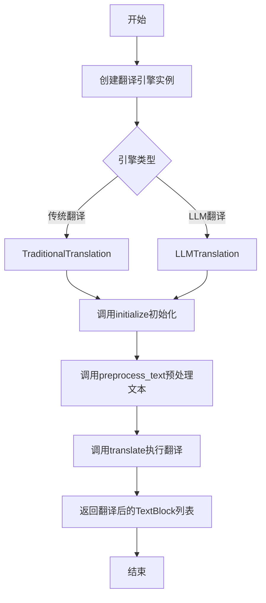
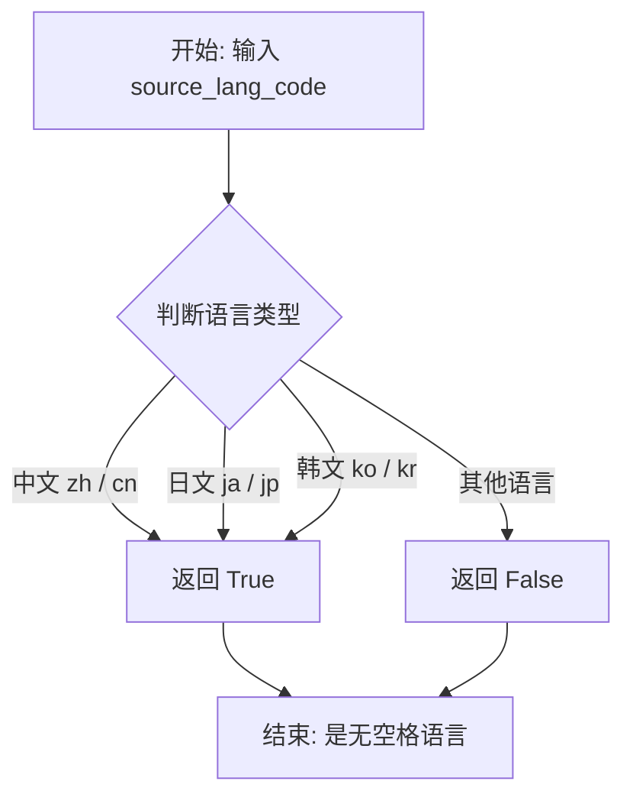
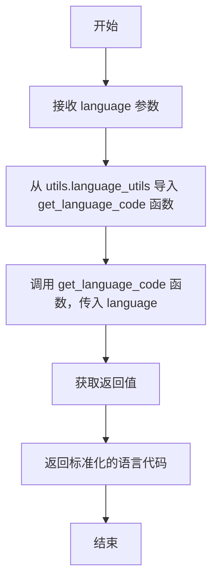
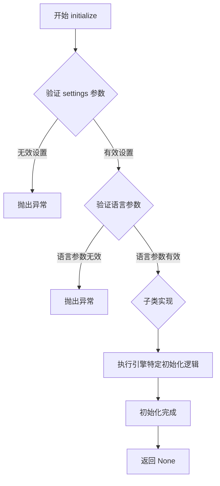
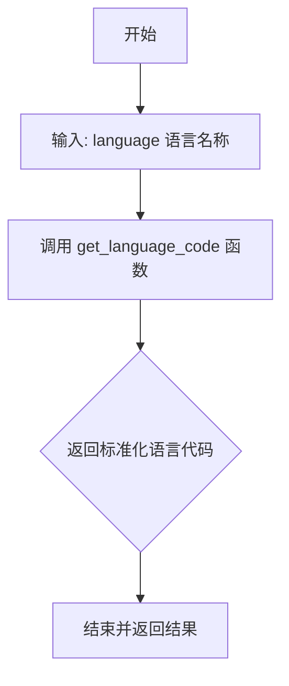
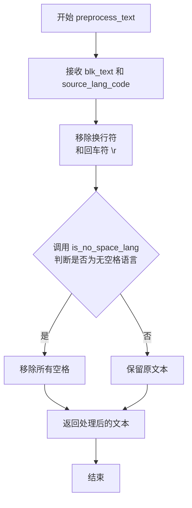
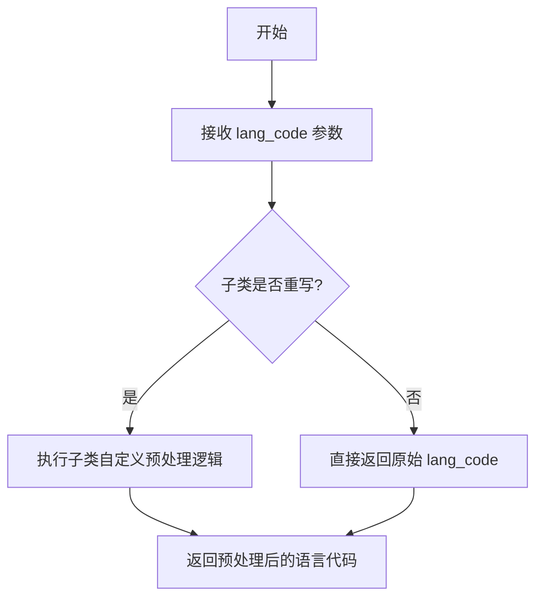
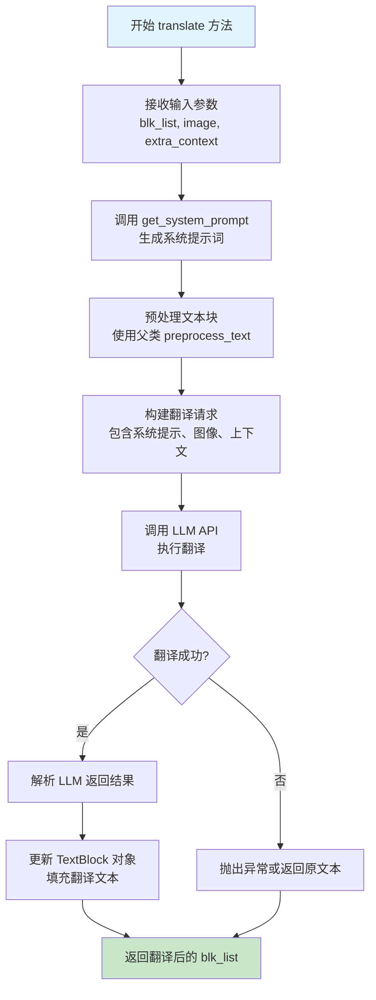
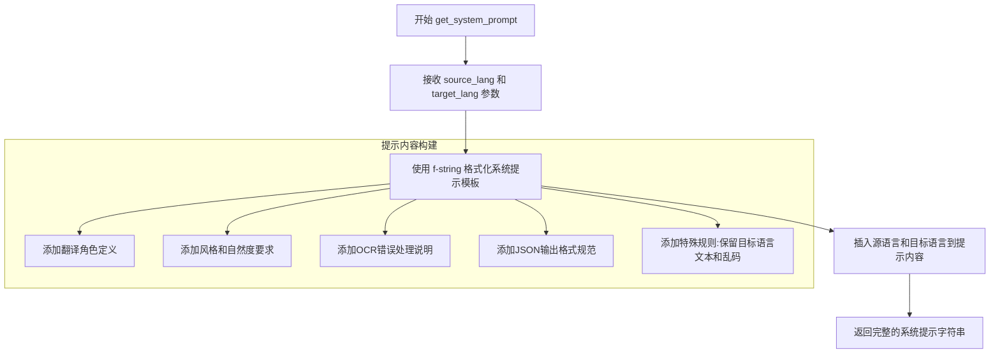

# `comic-translate\modules\translation\base.py` 详细设计文档

该文件定义了翻译引擎的抽象基类架构，包含通用翻译引擎基类(TranslationEngine)、传统翻译引擎基类(TraditionalTranslation)和LLM翻译引擎基类(LLMTranslation)，提供了文本预处理、语言代码标准化等通用方法，为具体翻译实现提供统一的接口规范。

## 整体流程



## 类结构

```
TranslationEngine (抽象基类)
├── TraditionalTranslation (传统翻译基类)
└── LLMTranslation (LLM翻译基类)
```

## 全局变量及字段


### `settings`
    
包含凭据的设置对象，用于初始化翻译引擎

类型：`Any`
    


### `source_lang`
    
源语言名称

类型：`str`
    


### `target_lang`
    
目标语言名称

类型：`str`
    


### `language`
    
语言名称，用于获取标准化的语言代码

类型：`str`
    


### `blk_text`
    
待处理的文本内容

类型：`str`
    


### `source_lang_code`
    
源语言的标准代码

类型：`str`
    


### `text`
    
去除换行符后的文本临时变量

类型：`str`
    


### `lang_code`
    
待预处理的语言代码

类型：`str`
    


### `blk_list`
    
包含待翻译文本的TextBlock对象列表

类型：`list[TextBlock]`
    


### `image`
    
用于提供上下文的图像数据（numpy数组）

类型：`np.ndarray`
    


### `extra_context`
    
额外的上下文信息，用于辅助翻译

类型：`str`
    


### `np`
    
NumPy库，用于处理图像数组

类型：`module`
    


### `TranslationEngine.TranslationEngine`
    
所有翻译引擎的抽象基类，定义通用接口和工具方法

类型：`ABC`
    


### `TraditionalTranslation.TraditionalTranslation`
    
传统翻译引擎（非LLM）的基类

类型：`TranslationEngine`
    


### `LLMTranslation.LLMTranslation`
    
基于LLM的翻译引擎基类

类型：`TranslationEngine`
    


### `TranslationEngine.initialize`
    
抽象方法，用必要参数初始化翻译引擎

类型：`method`
    


### `TranslationEngine.get_language_code`
    
从语言名称获取标准化语言代码

类型：`method`
    


### `TranslationEngine.preprocess_text`
    
根据语言预处理文本（移除空格和换行符）

类型：`method`
    


### `TraditionalTranslation.translate`
    
抽象方法，使用非LLM翻译器翻译文本块

类型：`method`
    


### `TraditionalTranslation.preprocess_language_code`
    
预处理语言代码以匹配特定翻译API要求

类型：`method`
    


### `LLMTranslation.translate`
    
抽象方法，使用LLM翻译文本块

类型：`method`
    


### `LLMTranslation.get_system_prompt`
    
获取LLM翻译的系统提示词

类型：`method`
    
    

## 全局函数及方法


### `is_no_space_lang`

该函数用于判断给定语言代码是否属于"无空格语言"（如中文、日文、韩文等不使用空格分隔词汇的语言），常用于文本预处理阶段决定是否需要移除文本中的空格字符。

参数：

-  `source_lang_code`：`str`，语言代码（如 'zh'、'ja'、'ko' 等）

返回值：`bool`，如果语言是无空格语言返回 `True`，否则返回 `False`

#### 流程图



#### 带注释源码

```
# 注: 该函数定义在 utils.language_utils 模块中,此处展示推断的实现逻辑

def is_no_space_lang(source_lang_code: str) -> bool:
    """
    判断给定语言代码是否为无空格语言
    
    无空格语言特点:
    - 中文 (zh, cn)
    - 日文 (ja, jp)  
    - 韩文 (ko, kr)
    - 以及其他不使用空格分隔词语的语言
    
    Args:
        source_lang_code: 语言代码字符串
        
    Returns:
        bool: 是无空格语言返回 True, 否则返回 False
    """
    # 常见无空格语言代码集合
    no_space_langs = {'zh', 'cn', 'ja', 'jp', 'ko', 'kr'}
    
    # 将输入转换为小写进行匹配
    lang_lower = source_lang_code.lower()
    
    # 检查是否属于无空格语言
    return lang_lower in no_space_langs


# 在 TranslationEngine.preprocess_text 中的调用示例:
def preprocess_text(self, blk_text: str, source_lang_code: str) -> str:
    # 移除换行符
    text = blk_text.replace('\r', '').replace('\n', '')
    
    # 如果是无空格语言,移除所有空格
    if is_no_space_lang(source_lang_code):
        return text.replace(' ', '')
    else:
        return text
```

---

**注意**：由于 `is_no_space_lang` 函数的具体实现在提供的代码片段中未展示，以上源码为基于其使用方式的推断。实际实现可能包含更多的语言代码判断逻辑。建议查阅 `utils.language_utils` 模块获取完整实现。


### `TranslationEngine.get_language_code`

该方法是一个委托方法，用于将语言名称转换为标准化的语言代码。它接收语言名称作为参数，内部调用 `utils.language_utils` 模块中的 `get_language_code` 函数来完成转换，并返回标准化后的语言代码。

参数：

- `language`：`str`，需要转换的语言名称

返回值：`str`，标准化后的语言代码

#### 流程图



#### 带注释源码

```python
def get_language_code(self, language: str) -> str:
    """
    Get standardized language code from language name.
    
    Args:
        language: Language name
        
    Returns:
        Standardized language code
    """
    # 从相对导入路径 ..utils.language_utils 导入 get_language_code 函数
    # 注意：这里使用了延迟导入（lazy import），在方法被调用时才导入
    from ..utils.language_utils import get_language_code
    
    # 调用模块中的 get_language_code 函数，传入 language 参数
    # 将返回的标准化语言代码直接返回给调用者
    return get_language_code(language)
```

#### 潜在的技术债务或优化空间

1. **延迟导入位置不当**：在方法内部进行导入虽然避免了循环依赖，但每次调用都会执行导入操作，建议将导入移到类级别或模块顶部以提升性能。

2. **缺少参数校验**：未对 `language` 参数进行有效性检查（如空值、None 等），可能导致底层函数抛出异常。

3. **缺少错误处理**：未对 `get_language_code` 函数的返回值进行校验，如果该函数返回 `None` 或抛出异常，调用者无法获得有意义的错误信息。

4. **功能重复**：该方法仅为 `utils.language_utils.get_language_code` 的包装器，若此类委托方法较多，可考虑直接暴露模块函数而非通过类方法调用。

#### 其它项目

- **设计目标**：提供统一的语言代码转换接口，屏蔽底层实现细节。
- **错误处理**：依赖底层 `get_language_code` 函数的异常抛出，自身未做额外处理。
- **外部依赖**：依赖 `..utils.language_utils.get_language_code` 函数，需要确保该模块存在且可用。


### `TranslationEngine.initialize`

该方法是TranslationEngine抽象类的核心初始化接口，定义了所有翻译引擎必须实现的初始化契约。子类需实现该方法以完成引擎的具体初始化逻辑（如加载API密钥、设置语言对、建立连接等）。

参数：

-  `self`：`TranslationEngine`，隐式参数，表示调用此方法的实例本身
-  `settings`：`Any`，包含认证凭证的配置对象，用于验证和授权翻译API调用
-  `source_lang`：`str`，源语言名称，指定待翻译文本的原始语言
-  `target_lang`：`str`，目标语言名称，指定翻译输出的目标语言
-  `**kwargs`：字典类型，可变关键字参数，用于传递引擎特定的初始化参数（如API端点、超时设置等）

返回值：`None`，无返回值，该方法仅执行初始化操作，不返回任何数据

#### 流程图



#### 带注释源码

```python
@abstractmethod
def initialize(self, settings: Any, source_lang: str, target_lang: str, **kwargs) -> None:
    """
    Initialize the translation engine with necessary parameters.
    
    Args:
        settings: Settings object with credentials  # 认证凭证配置对象
        source_lang: Source language name           # 源语言名称
        target_lang: Target language name           # 目标语言名称
        **kwargs: Engine-specific initialization parameters  # 引擎特定参数
    """
    pass  # 抽象方法，由子类实现具体初始化逻辑
```


### `TranslationEngine.get_language_code`

获取标准化的语言代码。该方法接受语言名称作为输入，通过调用 `language_utils` 模块中的 `get_language_code` 函数将其转换为标准的语言代码并返回。

参数：

- `language`：`str`，语言名称

返回值：`str`，标准化后的语言代码

#### 流程图



#### 带注释源码

```python
def get_language_code(self, language: str) -> str:
    """
    Get standardized language code from language name.
    
    Args:
        language: Language name
        
    Returns:
        Standardized language code
    """
    # 从同包下的 utils.language_utils 模块导入 get_language_code 函数
    # 该函数负责将人类可读的语言名称（如 'Chinese', 'Japanese'）
    # 转换为标准的语言代码（如 'zh', 'ja'）
    from ..utils.language_utils import get_language_code
    
    # 调用工具函数进行语言名称到语言代码的转换
    return get_language_code(language)
```


### `TranslationEngine.preprocess_text`

该方法根据语言类型对文本进行预处理：对于中文和日文等无空格语言，移除所有空格；对于所有语言，均移除换行符和回车符；其他语言则保留原文本（仅移除换行符）。

参数：

- `blk_text`：`str`，要处理的输入文本
- `source_lang_code`：`str`，源文本的语言代码

返回值：`str`，处理后的文本

#### 流程图



#### 带注释源码

```python
def preprocess_text(self, blk_text: str, source_lang_code: str) -> str:
    """
    PreProcess text based on language:
    - Remove spaces for Chinese and Japanese languages
    - Remove all newline/carriage-return characters
    - Keep original text for other languages (aside from the newline removal)
    
    Args:
        blk_text (str): The input text to process
        source_lang_code (str): Language code of the source text
    
    Returns:
        str: Processed text
    """
    # 步骤1: 移除换行符和回车符
    # Remove newline and carriage‐return characters
    text = blk_text.replace('\r', '').replace('\n', '')

    # 步骤2: 判断是否为无空格语言（如中文、日文等）
    # If No-Space Language, also remove all spaces
    if is_no_space_lang(source_lang_code):
        # 如果是无空格语言，移除所有空格
        return text.replace(' ', '')
    # 步骤3: 否则，直接返回已移除换行符的文本
    # Otherwise, return the text (with newlines already removed)
    else:
        return text
```


### `TraditionalTranslation.translate`

该方法是传统翻译引擎（传统机器翻译引擎，非LLM）的抽象方法，负责将TextBlock对象列表中的文本进行翻译，并返回包含翻译结果的TextBlock对象列表。

参数：

- `blk_list`：`list[TextBlock]`，待翻译的TextBlock对象列表，每个TextBlock包含需要翻译的文本内容

返回值：`list[TextBlock]`，翻译完成后的TextBlock对象列表

#### 流程图

```mermaid
flowchart TD
    A[开始 translate] --> B[接收 blk_list: list[TextBlock]]
    B --> C{blk_list 是否为空?}
    C -->|是| D[返回空列表]
    C -->|否| E[遍历每个 TextBlock]
    E --> F[提取 TextBlock 中的原始文本]
    F --> G[调用翻译引擎进行翻译]
    G --> H[将翻译结果写入 TextBlock]
    H --> I{是否还有更多 TextBlock?}
    I -->|是| E
    I -->|否| J[返回翻译后的 blk_list]
    J --> K[结束]
    
    style A fill:#f9f,stroke:#333
    style G fill:#ff9,stroke:#333
    style J fill:#9f9,stroke:#333
```

#### 带注释源码

```python
@abstractmethod
def translate(self, blk_list: list[TextBlock]) -> list[TextBlock]:
    """
    Translate text blocks using non-LLM translators.
    
    Args:
        blk_list: List of TextBlock objects containing text to translate
        
    Returns:
        List of updated TextBlock objects with translations
    """
    # 注意：这是一个抽象方法，具体实现由子类完成
    # 子类需要实现具体的翻译逻辑，可能包括：
    # 1. 调用第三方翻译API（如Google Translate, DeepL等）
    # 2. 使用本地部署的机器翻译模型
    # 3. 调用预装的翻译词典或规则库
    
    # 典型的实现流程：
    # 1. 预处理：对原始文本进行语言检测、编码转换等
    # 2. 分批处理：将blk_list中的文本分批翻译（避免API限制）
    # 3. 翻译执行：调用翻译引擎获取翻译结果
    # 4. 后处理：对翻译结果进行格式调整、特殊字符处理等
    # 5. 结果组装：将翻译结果写回TextBlock对象并返回
    
    pass
```


### `TraditionalTranslation.preprocess_language_code`

该方法是传统翻译引擎的基类方法，用于根据特定翻译API的要求预处理语言代码。默认实现直接返回原始语言代码，子类可以重写此方法以实现特定的语言代码转换逻辑（如将标准语言代码转换为API特定格式）。

参数：

- `lang_code`：`str`，待预处理的标准语言代码

返回值：`str`，符合翻译API要求的预处理后语言代码

#### 流程图



#### 带注释源码

```python
def preprocess_language_code(self, lang_code: str) -> str:
    """
    Preprocess language codes to match the specific translation API requirements.
    By default, returns the original language code.
    
    Args:
        lang_code: The language code to preprocess
        
    Returns:
        Preprocessed language code supported by the translation API
    """
    # 默认实现直接返回原始语言代码，不做任何转换
    # 子类应重写此方法以实现特定API的语言代码映射逻辑
    # 例如：将 'zh-CN' 转换为某些API需要的 'zh' 或 'cn'
    return lang_code  # Default implementation just returns the original code
```


### `LLMTranslation.translate`

使用大型语言模型（LLM）将文本块列表翻译成目标语言，支持通过图像和额外上下文提供翻译参考的抽象方法。

参数：

- `blk_list`：`list[TextBlock]`，包含待翻译文本的TextBlock对象列表
- `image`：`np.ndarray`，用于提供翻译上下文的页面图像（numpy数组格式）
- `extra_context`：`str`，关于漫画或文本的额外上下文信息，用于辅助翻译

返回值：`list[TextBlock]` ，包含翻译后文本的更新后的TextBlock对象列表

#### 流程图



#### 带注释源码

```python
@abstractmethod
def translate(self, blk_list: list[TextBlock], image: np.ndarray, extra_context: str) -> list[TextBlock]:
    """
    Translate text blocks using LLM.
    
    该方法是一个抽象方法，要求子类实现具体的LLM翻译逻辑。
    子类需要实现与具体LLM服务（如OpenAI、Claude等）的集成。
    
    Args:
        blk_list: List of TextBlock objects containing text to translate
                  包含待翻译文本的TextBlock对象列表
        image: Image as numpy array (for context)
                  用于提供翻译上下文的页面图像，以numpy数组形式传入
        extra_context: Additional context information for translation
                  关于漫画或文本的额外上下文信息，帮助LLM更准确翻译
    
    Returns:
        List of updated TextBlock objects with translations
        包含翻译后文本的更新后的TextBlock对象列表
    """
    # 注意：这是一个抽象方法，具体实现由子类完成
    # 子类需要：
    # 1. 使用 get_system_prompt() 生成系统提示
    # 2. 将 blk_list 序列化为 JSON 格式
    # 3. 调用具体的 LLM API 进行翻译
    # 4. 解析返回结果并更新 TextBlock 对象
    # 5. 返回更新后的 blk_list
    pass
```

#### 相关方法说明

```python
def get_system_prompt(self, source_lang: str, target_lang: str) -> str:
    """
    Get system prompt for LLM translation.
    
    生成用于LLM翻译的系统提示词，包含：
    - 翻译方向说明（源语言到目标语言）
    - 翻译风格指导（自然、口语化）
    - 特殊指示（不翻译已翻译内容、忽略乱码）
    - 漫画OCR文本的特殊处理说明
    
    Args:
        source_lang: Source language 源语言名称
        target_lang: Target language 目标语言名称
    
    Returns:
        Formatted system prompt 格式化的系统提示词
    """
    return f"""You are an expert translator who translates {source_lang} to {target_lang}. 
    You pay attention to style, formality, idioms, slang etc and try to convey it in the way 
    a {target_lang} speaker would understand.
    BE MORE NATURAL. NEVER USE 당신, 그녀, 그 or its Japanese equivalents.
    Specifically, you will be translating text OCR'd from a comic. The OCR is not perfect 
    and as such you may receive text with typos or other mistakes.
    To aid you and provide context, You may be given the image of the page and/or extra context 
    about the comic. You will be given a json string of the detected text blocks and the text to 
    translate. Return the json string with the texts translated. DO NOT translate the keys of the 
    json. For each block:
    - If it's already in {target_lang} or looks like gibberish, OUTPUT IT AS IT IS instead
    - DO NOT give explanations
    Do Your Best! I'm really counting on you."""
```

#### 关键组件信息

| 组件名称 | 说明 |
|---------|------|
| `TranslationEngine` | 抽象基类，定义翻译引擎的通用接口和工具方法 |
| `LLMTranslation` | 基于大型语言模型的翻译引擎基类 |
| `TextBlock` | 文本块对象，包含原始文本、翻译文本等属性 |
| `preprocess_text()` | 父类方法，用于预处理文本（移除换行空格等） |
| `get_system_prompt()` | 生成LLM系统提示词的方法 |

#### 潜在技术债务与优化空间

1. **抽象方法缺乏默认实现**：translate方法为纯抽象方法，建议考虑提供默认实现以减少子类重复代码
2. **错误处理缺失**：方法未定义异常处理机制，子类实现时需要自行处理网络错误、API超时等
3. **返回值无null检查**：未对空blk_list或翻译失败情况进行处理
4. **提示词硬编码**：get_system_prompt返回硬编码的提示词，可考虑外部配置化
5. **性能考虑**：未实现批量翻译的并发控制，可能导致API调用过于频繁


### `LLMTranslation.get_system_prompt`

该方法用于生成针对大语言模型翻译任务的系统提示词（System Prompt），包含翻译方向、风格要求、OCR文本处理规范以及JSON输出格式约束。

参数：

- `source_lang`：`str`，源语言名称（如"English"、"Japanese"等）
- `target_lang`：`str`，目标语言名称（如"Chinese"、"Korean"等）

返回值：`str`，包含翻译任务指令的格式化系统提示字符串

#### 流程图



#### 带注释源码

```python
def get_system_prompt(self, source_lang: str, target_lang: str) -> str:
    """
    Get system prompt for LLM translation.
    
    Args:
        source_lang: Source language
        target_lang: Target language
        
    Returns:
        Formatted system prompt
    """
    # 使用 f-string 将源语言和目标语言动态插入到系统提示模板中
    # 生成的提示包含以下关键指令：
    # 1. 角色定义：专业翻译员，擅长风格、正式程度、成语、俚语转换
    # 2. 自然度要求：BE MORE NATURAL，避免使用韩语/日语的敬语形式
    # 3. 场景说明：漫画OCR文本翻译，OCR可能存在错误
    # 4. 输入格式：JSON字符串形式的文本块
    # 5. 输出格式：JSON字符串，只翻译值不翻译键
    # 6. 特殊规则：若文本已是目标语言或看起来像乱码，保持原样
    # 7. 强调：不要给出解释，全力以赴
    return f"""You are an expert translator who translates {source_lang} to {target_lang}. You pay attention to style, formality, idioms, slang etc and try to convey it in the way a {target_lang} speaker would understand.
BE MORE NATURAL. NEVER USE 당신, 그녀, 그 or its Japanese equivalents.
Specifically, you will be translating text OCR'd from a comic. The OCR is not perfect and as such you may receive text with typos or other mistakes.
To aid you and provide context, You may be given the image of the page and/or extra context about the comic. You will be given a json string of the detected text blocks and the text to translate. Return the json string with the texts translated. DO NOT translate the keys of the json. For each block:
- If it's already in {target_lang} or looks like gibberish, OUTPUT IT AS IT IS instead
- DO NOT give explanations
Do Your Best! I'm really counting on you."""
```

## 关键组件


### TranslationEngine（抽象基类）

所有翻译引擎的抽象基类，定义通用接口和工具方法。核心功能包括：初始化翻译引擎、获取标准化语言代码、基于语言类型对文本进行预处理（针对中文/日文等无空格语言移除空格和换行符）。

### TraditionalTranslation（传统翻译基类）

传统翻译引擎（非LLM）的基类，继承自TranslationEngine。核心功能：定义translate抽象方法用于翻译TextBlock列表，提供preprocess_language_code方法将语言代码预处理为特定翻译API要求的格式。

### LLMTranslation（LLM翻译基类）

基于LLM的翻译引擎基类，继承自TranslationEngine。核心功能：定义包含图像和额外上下文的translate抽象方法，提供get_system_prompt方法生成专业的漫画翻译系统提示词，支持处理OCR识别错误和保持目标语言的自然表达。

### TextBlock（文本块）

代码中引用的数据对象，用于存储待翻译的文本内容。作为翻译方法的输入和输出容器，包含源文本和翻译后文本的信息。

### 文本预处理组件

负责根据语言类型对文本进行标准化处理。处理逻辑包括：移除所有换行和回车字符，针对中文/日文等无空格语言额外移除所有空格，保持其他语言文本原样（仅移除换行符）。

### 语言代码处理组件

负责将语言名称转换为标准化语言代码。通过get_language_code方法调用language_utils模块的转换逻辑，支持翻译引擎与外部API的语言代码格式匹配。

### LLM系统提示词生成组件

负责生成用于LLM翻译的系统提示词。提示词包含：翻译风格指导、漫画OCR上下文说明、目标语言自然化要求、特殊处理规则（保留目标语言文本和乱码）、JSON格式输出要求等。


## 问题及建议


### 已知问题

-   **循环导入风险**：`get_language_code` 方法内部使用延迟导入 `from ..utils.language_utils import get_language_code`，这种方式虽然避免了顶层循环导入，但在运行时可能产生隐蔽的导入错误，且降低了代码的可预测性
-   **类型注解过于宽泛**：`initialize` 方法的 `settings: Any` 和 `**kwargs` 参数缺乏具体类型约束，降低了静态类型检查的有效性和代码可读性
-   **缺少输入验证**：`preprocess_text` 方法未对空字符串、`None` 值进行处理，可能导致运行时异常；`preprocess_language_code` 默认实现未验证语言码的有效性
-   **硬编码配置**：`get_system_prompt` 方法中的系统提示词完全硬编码，无法灵活配置不同场景下的翻译风格和约束条件
-   **命名不一致**：参数命名风格不统一，如 `blk_list`、`blk_text`、`source_lang_code` 混用下划线命名法
-   **文档字符串格式不统一**：部分方法使用 Google 风格文档字符串（如 `Args:`、`Returns:`），部分使用简单描述，风格不统一影响文档生成的规范性
-   **抽象类职责过重**：`TranslationEngine` 既充当抽象接口定义，又包含具体实现方法（如 `preprocess_text`），违背了单一职责原则，可考虑拆分出工具类

### 优化建议

-   将 `get_language_code` 的导入提升到文件顶部，或将其封装为模块级工具函数，消除方法内的延迟导入模式
-   为 `settings` 和 `**kwargs` 定义具体的数据类（Dataclass）或 Protocol 类型，增强类型安全
-   在 `preprocess_text` 开头添加空值检查和边界处理，提升鲁棒性
-   将系统提示词提取为可配置参数或外部模板，支持运行时自定义
-   统一文档字符串格式，建议统一采用 Google 风格或 NumPy 风格
-   考虑将 `preprocess_text` 和文本处理逻辑抽取为独立的工具类或函数，遵循组合优于继承的原则
-   为 `preprocess_language_code` 添加默认值校验或抛出明确的异常信息

## 其它


### 设计目标与约束

本模块的设计目标是提供统一的翻译引擎抽象接口，支持传统翻译引擎和基于LLM的翻译引擎两种实现方式。设计约束包括：1）所有翻译引擎必须继承TranslationEngine基类并实现initialize和translate方法；2）支持多语言翻译，需处理空格语言（如中文、日文）和非空格语言的文本预处理；3）LLM翻译需支持图像上下文和额外上下文信息；4）使用ABC实现抽象工厂模式，确保接口一致性。

### 错误处理与异常设计

基类TranslationEngine未定义具体异常处理，由子类实现具体异常策略。initialize方法接受任意类型的settings和额外参数，依赖调用方保证参数合法性。preprocess_text方法在处理空字符串时返回空字符串，不抛异常。get_language_code方法依赖外部language_utils模块，可能抛出导入错误或模块未找到异常。子类实现时需考虑：网络请求失败、API认证失败、文本块为空、图像数据无效等场景。

### 数据流与状态机

数据流：输入（TextBlock列表 + 可选图像 + 额外上下文） → 预处理（语言代码标准化 + 文本预处理） → 翻译引擎处理 → 输出（翻译后的TextBlock列表）。状态机：TranslationEngine处于初始化状态（调用initialize后）方可调用translate方法。TraditionalTranslation和LLMTranslation共享相同的状态转换逻辑，但翻译执行逻辑不同。

### 外部依赖与接口契约

外部依赖：1）numpy库用于处理图像数据（np.ndarray）；2）..utils.textblock.TextBlock类定义文本块数据结构；3）..utils.language_utils模块提供语言代码转换和空格语言判断功能。接口契约：1）initialize(settings, source_lang, target_lang, **kwargs)无返回值，仅初始化内部状态；2）translate方法必须返回list[TextBlock]，数量与输入一致；3）get_language_code和preprocess_text为工具方法，不改变对象状态；4）LLMTranslation.translate的image参数在不使用时可传None。

### 配置与初始化设计

TranslationEngine采用延迟初始化模式，initialize方法显式调用完成引擎就绪。settings参数类型为Any，允许不同翻译引擎使用不同的配置对象（如API密钥、端点URL、模型名称等）。source_lang和target_lang参数为语言名称字符串（如"English"、"Japanese"），内部通过get_language_code转换为标准代码。**kwargs机制允许扩展引擎特定参数而无需修改基类接口。

### 扩展性与插件机制

通过抽象基类实现策略模式，支持多种翻译引擎动态切换。TraditionalTranslation子类可实现API翻译、字典翻译等；LLMTranslation子类可支持不同LLM提供商（OpenAI、Claude、Gemini等）。get_system_prompt方法支持自定义提示词模板，可通过子类重写适应不同翻译场景。preprocess_language_code方法允许各引擎根据API要求调整语言代码格式。

    