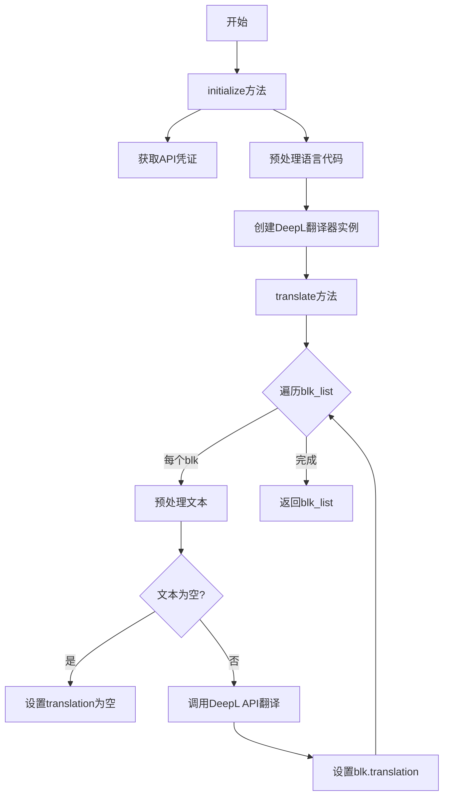
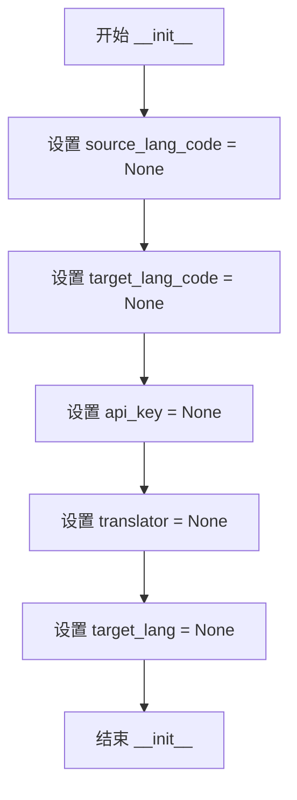
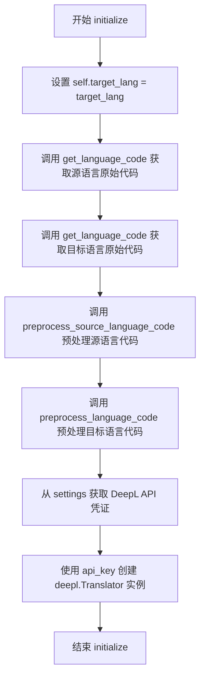
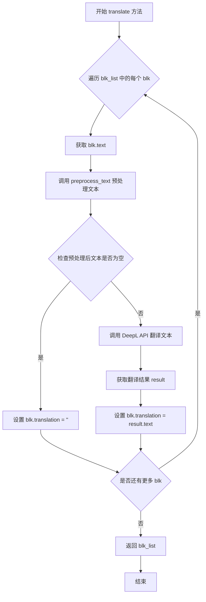

# `comic-translate\modules\translation\deepl.py` 详细设计文档

该代码实现了一个基于DeepL API的翻译引擎类，继承自TraditionalTranslation基类，用于将文本块列表从源语言翻译到目标语言，支持多种语言代码的预处理和DeepL特定格式转换。

## 整体流程



## 类结构

```
TraditionalTranslation (抽象基类)
└── DeepLTranslation (DeepL翻译实现类)
```

## 全局变量及字段


### `DeepLTranslation.source_lang_code`
    
源语言代码

类型：`Optional[str]`
    


### `DeepLTranslation.target_lang_code`
    
目标语言代码

类型：`Optional[str]`
    


### `DeepLTranslation.api_key`
    
DeepL API密钥

类型：`Optional[str]`
    


### `DeepLTranslation.translator`
    
DeepL翻译器实例

类型：`Optional[deepl.Translator]`
    


### `DeepLTranslation.target_lang`
    
目标语言字符串

类型：`Optional[str]`
    
    

## 全局函数及方法


### `DeepLTranslation.__init__`

构造函数，初始化 DeepL 翻译引擎的实例变量，为后续的翻译操作准备必要的属性。

参数：

- 该方法无显式参数（仅包含隐式的 `self` 参数）

返回值：`None`，无返回值

#### 流程图



#### 带注释源码

```python
def __init__(self):
    """构造函数，初始化 DeepL 翻译引擎实例的基本属性"""
    
    # 源语言代码，初始化为 None，在 initialize 方法中会被设置
    self.source_lang_code = None
    
    # 目标语言代码，初始化为 None，在 initialize 方法中会被设置
    self.target_lang_code = None
    
    # DeepL API 密钥，初始化为 None，在 initialize 方法中从设置获取
    self.api_key = None
    
    # DeepL Translator 实例，初始化为 None，在 initialize 方法中创建
    self.translator = None
    
    # 目标语言标识，初始化为 None，在 initialize 方法中会被设置
    self.target_lang = None
```


### `DeepLTranslation.initialize`

初始化 DeepL 翻译器，设置源语言和目标语言代码，并配置 API 凭证以创建翻译器实例。

参数：

- `settings`：`Any`，用于获取 API 凭证的设置对象
- `source_lang`：`str`，源语言标识符（如 "en"、"zh" 等）
- `target_lang`：`str`，目标语言标识符（如 "en"、"zh" 等）

返回值：`None`，无返回值，仅执行初始化操作

#### 流程图



#### 带注释源码

```python
def initialize(self, settings: Any, source_lang: str, target_lang: str) -> None:
    """
    初始化 DeepL 翻译器
    
    参数:
        settings: 用于获取 API 凭证的设置对象
        source_lang: 源语言代码
        target_lang: 目标语言代码
    """
    
    # 导入 DeepL 库（在运行时导入以支持可选依赖）
    import deepl
    
    # 1. 保存目标语言设置
    self.target_lang = target_lang
    
    # 2. 获取"原始"语言代码（如 "en", "zh" 等）
    # 然后为 DeepL API 规范化这些代码
    raw_src = self.get_language_code(source_lang)      # 获取源语言原始代码
    raw_tgt = self.get_language_code(target_lang)      # 获取目标语言原始代码
    
    # 3. 预处理语言代码以符合 DeepL API 要求
    self.source_lang_code = self.preprocess_source_language_code(raw_src)  # 如 "zh" → "ZH"
    self.target_lang_code = self.preprocess_language_code(raw_tgt)          # 如 "zh-CN" → "ZH-HANS"
    
    # 4. 从设置中获取 DeepL API 凭证
    # settings.ui.tr("DeepL") 获取 UI 中显示的 DeepL 配置项
    credentials = settings.get_credentials(settings.ui.tr("DeepL"))
    self.api_key = credentials.get('api_key', '')  # 提取 API 密钥，默认空字符串
    
    # 5. 使用 API 密钥创建 DeepL 翻译器实例
    self.translator = deepl.Translator(self.api_key)
```


### `DeepLTranslation.translate`

该方法是 DeepL 翻译引擎的核心翻译方法，接收一个 TextBlock 对象列表，遍历每个文本块进行预处理、调用 DeepL API 翻译，然后将翻译结果存储回原 TextBlock 对象中，最终返回包含翻译内容的 TextBlock 列表。

参数：

- `blk_list`：`list[TextBlock]`，需要翻译的文本块列表，每个 TextBlock 应包含待翻译的原文文本

返回值：`list[TextBlock]`，翻译完成后的文本块列表，每个文本块的 `translation` 属性被填充为翻译后的文本

#### 流程图



#### 带注释源码

```python
def translate(self, blk_list: list[TextBlock]) -> list[TextBlock]:
    """
    翻译文本块列表的主要方法。
    
    遍历输入的 TextBlock 列表，对每个文本块进行以下处理：
    1. 预处理原始文本（添加标记或格式化）
    2. 调用 DeepL API 进行翻译
    3. 将翻译结果存回 TextBlock 对象的 translation 属性
    
    参数:
        blk_list: 需要翻译的 TextBlock 对象列表，每个对象应包含待翻译的 text 属性
        
    返回值:
        翻译完成后的 TextBlock 列表，translation 属性已填充
    """
    # 遍历列表中的每个文本块
    for blk in blk_list:
        # 使用预处理方法处理原始文本，包括语言代码预处理
        # 例如：处理特殊字符、添加标记等
        text = self.preprocess_text(blk.text, self.source_lang_code)
        
        # 检查预处理后的文本是否为空字符串
        # 如果为空则直接跳过翻译，设置空翻译结果
        if not text.strip():
            blk.translation = ''
            # 继续处理下一个文本块
            continue
        
        # 调用 DeepL 翻译 API 进行实际翻译
        # 传入待翻译文本、源语言代码和目标语言代码
        result = self.translator.translate_text(
            text, 
            source_lang=self.source_lang_code, 
            target_lang=self.target_lang_code
        )
        
        # 将翻译结果（ResultObject）中的文本提取出来
        # 赋值给 TextBlock 对象的 translation 属性
        blk.translation = result.text
        
    # 返回包含翻译结果的文本块列表
    return blk_list
```


### `DeepLTranslation.preprocess_source_language_code`

预处理源语言代码为 DeepL API 所需的格式。对于中文语言代码返回 "ZH"，其他语言代码则转换为大写形式。

参数：

- `lang_code`：`str`，原始语言代码（如 "en", "zh-CN", "zh-TW" 等）

返回值：`str`，DeepL 格式的语言代码（如 "ZH", "EN", "FR" 等）

#### 流程图

```mermaid
flowchart TD
    A[开始: lang_code] --> B{lang_code.lower() 包含 'zh'?}
    B -->|是| C[返回 'ZH']
    B -->|否| D[返回 lang_code.upper()]
    C --> E[结束]
    D --> E
```

#### 带注释源码

```python
def preprocess_source_language_code(self, lang_code: str) -> str:
    """
    预处理源语言代码为 DeepL 格式。
    
    参数:
        lang_code: str, 原始语言代码
        
    返回:
        str, DeepL API 支持的语言代码
    """
    # 检查语言代码是否包含中文字符（不区分大小写）
    if 'zh' in lang_code.lower():
        # DeepL 使用 'ZH' 表示中文源语言
        return 'ZH'
    
    # 其他语言代码直接转换为大写形式
    # 例如: 'en' -> 'EN', 'fr' -> 'FR'
    return lang_code.upper()
```

#### 设计说明

该方法主要用于将输入的源语言代码规范化为 DeepL API 所要求的格式。根据 DeepL API 的要求，中文源语言统一使用 "ZH" 表示，而其他语言则使用标准的大写 ISO 639-1 代码。与 `preprocess_language_code` 方法（用于目标语言）不同，源语言处理逻辑较为简单，不需要区分简体中文和繁体中文。


### `DeepLTranslation.preprocess_language_code`

该方法用于将目标语言代码预处理为 DeepL API 所要求的特定格式，将常见的语言代码（如 `zh-CN`、`zh-TW`、`en`、`pt`）映射为 DeepL 专用的语言代码（如 `ZH-HANS`、`ZH-HANT`、`EN-US`、`PT-PT`），其他语言代码则转换为大写形式。

参数：

- `lang_code`：`str`，输入的原始语言代码（如 "zh-CN"、"zh-TW"、"en"、"pt" 等）

返回值：`str`，处理后的 DeepL 格式语言代码（如 "ZH-HANS"、"ZH-HANT"、"EN-US"、"PT-PT" 或大写的语言代码）

#### 流程图

```mermaid
flowchart TD
    A[开始: lang_code] --> B{lang_code == 'zh-CN'?}
    B -- 是 --> C[返回 'ZH-HANS']
    B -- 否 --> D{lang_code == 'zh-TW'?}
    D -- 是 --> E[返回 'ZH-HANT']
    D -- 否 --> F{lang_code == 'en'?}
    F -- 是 --> G[返回 'EN-US']
    F -- 否 --> H{lang_code == 'pt'?}
    H -- 是 --> I[返回 'PT-PT']
    H -- 否 --> J[返回 lang_code.upper()]
    C --> K[结束]
    E --> K
    G --> K
    I --> K
    J --> K
```

#### 带注释源码

```python
def preprocess_language_code(self, lang_code: str) -> str:
    """
    将目标语言代码预处理为 DeepL API 要求的格式。
    
    参数:
        lang_code: 原始语言代码，如 'zh-CN', 'zh-TW', 'en', 'pt' 等
        
    返回:
        DeepL 格式的语言代码，如 'ZH-HANS', 'ZH-HANT', 'EN-US', 'PT-PT' 等
    """
    
    # 处理简体中文：DeepL 使用 'ZH-HANS' 表示简体中文
    if lang_code == 'zh-CN':
        return 'ZH-HANS'
    
    # 处理繁体中文：DeepL 使用 'ZH-HANT' 表示繁体中文
    if lang_code == 'zh-TW':
        return 'ZH-HANT'
    
    # 处理英语：DeepL 需要区分 'EN-US'（美式英语）和 'EN-GB'（英式英语）
    # 此处默认使用美式英语
    if lang_code == 'en':
        return 'EN-US'
    
    # 处理葡萄牙语：DeepL 需要区分 'PT-PT'（葡萄牙葡萄牙）和 'PT-BR'（巴西葡萄牙）
    # 此处默认使用葡萄牙葡萄牙
    if lang_code == 'pt':
        return 'PT-PT'
    
    # 默认处理：将其他语言代码转换为大写形式
    # 例如：'fr' -> 'FR', 'de' -> 'DE', 'es' -> 'ES'
    return lang_code.upper()
```

## 关键组件


### DeepLTranslation 类

基于 DeepL API 的翻译引擎实现类，负责调用 DeepL 服务进行文本翻译。

### initialize 方法

初始化 DeepL 翻译器，包括设置语言代码、获取 API 凭证并创建 Translator 实例。

### translate 方法

遍历文本块列表，对每个文本块调用 DeepL API 进行翻译，并返回翻译后的文本块列表。

### preprocess_source_language_code 方法

将源语言代码转换为 DeepL 支持的格式，将中文统一转换为 "ZH"，其他语言转为大写。

### preprocess_language_code 方法

将目标语言代码映射为 DeepL 特定的语言代码，如 "zh-CN" 转为 "ZH-HANS"、"en" 转为 "EN-US" 等。

### TextBlock 依赖

接收包含原文的文本块对象，翻译后将结果写入其 translation 属性。

### API 凭证管理

从设置中获取 DeepL 的 API 密钥，用于身份验证和调用 DeepL 服务。

### 语言代码规范化

处理语言代码的预处理逻辑，确保输入的语言代码符合 DeepL API 的要求格式。

## 问题及建议


### 已知问题

-   **导入语句位置不当**：`import deepl` 在 `initialize` 方法内部，每次调用都会重复执行导入操作，影响性能
-   **API密钥未验证**：获取 `api_key` 后直接用于创建 `Translator` 对象，没有验证密钥是否有效或为空
-   **缺乏异常处理**：`translate` 方法中的 `translator.translate_text` 调用没有 try-except 包装，API 请求失败会导致整个翻译流程中断
-   **缺少重试机制**：网络请求或API限流时没有重试逻辑
-   **批量处理缺失**：逐个处理 `TextBlock`，未利用 DeepL API 的批量翻译能力（支持一次请求翻译多段文本）
-   **硬编码语言映射**：`preprocess_language_code` 方法存在大量硬编码的语言代码转换逻辑，扩展性差
-   **TextBlock属性未校验**：代码假设 `TextBlock` 存在 `text` 和 `translation` 属性，但未进行类型或属性存在性检查
-   **资源未释放**：`translator` 对象在使用后没有明确的清理或释放机制
-   **日志缺失**：关键操作（如初始化、翻译请求）没有日志记录，难以追踪问题和监控

### 优化建议

-   将 `import deepl` 移至文件顶部或模块级别，避免重复导入开销
-   在创建 `Translator` 前验证 `api_key` 是否有效（非空字符串），或添加备用密钥支持
-   为 `translate` 方法添加完整的异常处理，捕获网络错误、API错误并提供有意义的错误信息
-   实现指数退避的重试机制，处理临时性失败
-   收集所有文本后使用批量翻译 API，减少网络请求次数
-   将语言代码映射提取为配置或字典结构，便于维护和扩展
-   添加对 `TextBlock` 对象结构的运行时校验或使用类型守卫
-   考虑实现上下文管理器或显式的资源清理方法
-   添加结构化日志，记录初始化状态、翻译计数、错误信息等关键指标

## 其它


### 设计目标与约束

本模块旨在为应用程序提供基于DeepL API的翻译能力，支持多种语言对之间的文本翻译，并通过统一的TextBlock接口返回翻译结果。设计约束包括：仅支持DeepL API支持的语种，不处理API限流情况下的重试逻辑，依赖外部DeepL服务可用性。

### 错误处理与异常设计

初始化阶段可能抛出ImportError（deepl库未安装）、KeyError（配置中缺少api_key）、deepl.exceptions.AuthenticationFailed（API密钥无效）等异常。翻译阶段可能抛出deepl.exceptions.TranslationFailed（翻译请求失败）、ConnectionError（网络连接异常）等。当前实现未对这些异常进行捕获处理，建议在调用层添加try-except包装。

### 数据流与状态机

数据流为：调用方传入TextBlock列表 → translate()方法遍历每个Block → 对文本进行预处理 → 调用DeepL API翻译 → 将结果写入blk.translation字段 → 返回处理后的列表。状态转换：初始化状态（initialize完成前）→ 就绪状态（translator对象已创建）→ 翻译中状态 → 完成状态。

### 外部依赖与接口契约

外部依赖：deepl Python库（版本需≥1.0.0），DeepL API服务。接口契约：initialize(settings, source_lang, target_lang)接受设置对象和语言名称；translate(blk_list)接受TextBlock列表并返回相同列表；TextBlock对象需具备text属性和translation属性。

### 安全性考虑

API密钥以明文形式存储于settings中，建议使用环境变量或加密存储。translator对象在内存中保留API密钥，需确保进程安全。当前未实现请求超时设置，建议添加timeout参数防止API调用无限阻塞。

### 性能考量

当前为串行翻译，批量TextBlock会逐个调用API。建议实现批量翻译（deepl支持）以减少API调用次数。可考虑添加翻译缓存机制，对相同文本避免重复请求。

### 版本兼容性

预处理语言代码逻辑硬编码了特定语言映射（如zh-CN→ZH-HANS），DeepL API可能调整语言代码体系，需关注API变更并更新映射表。当前仅支持DeepL Free API和Pro API的基本功能。

### 配置管理

api_key通过settings.get_credentials()获取，建议在文档中明确配置项格式要求。target_lang和source_lang_code、target_lang_code在初始化时确定，运行时不可变更。

    