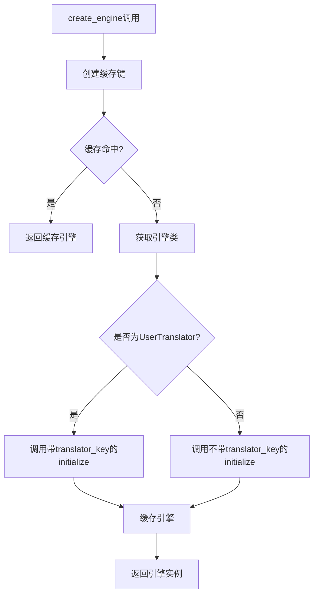
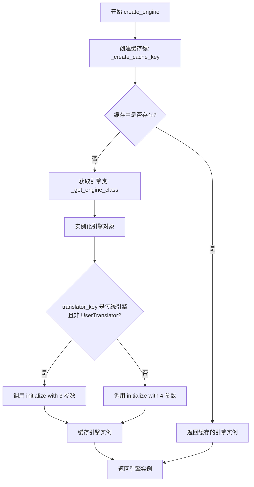
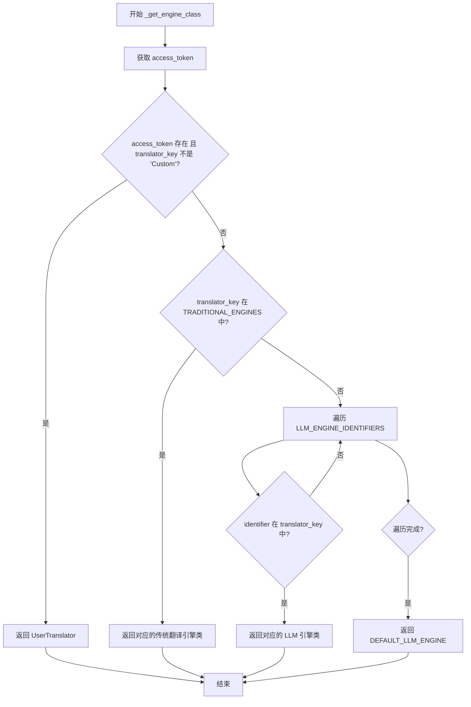
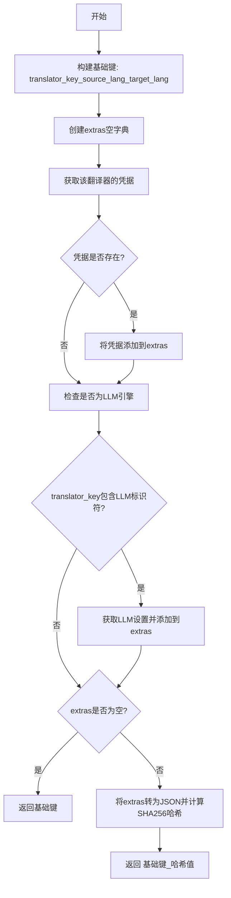
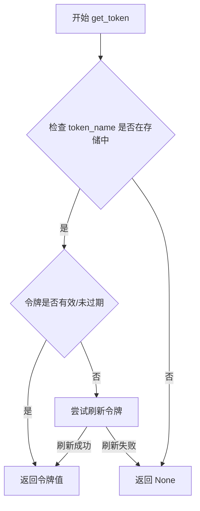
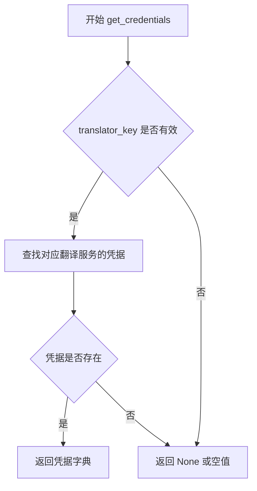
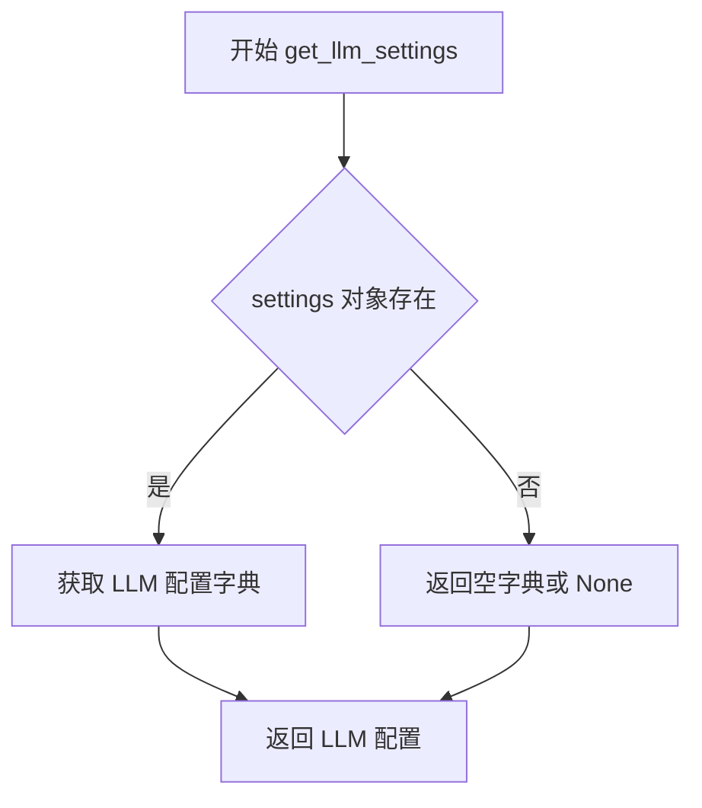
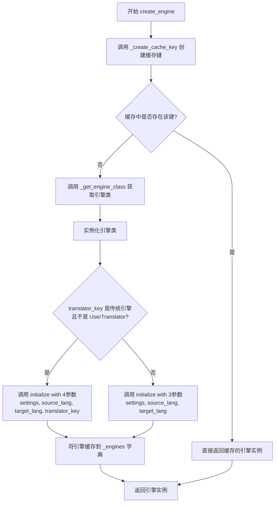

# `comic-translate\modules\translation\factory.py` 详细设计文档

翻译引擎工厂类，根据配置动态创建和管理翻译引擎（支持传统翻译服务如Microsoft、DeepL、Yandex，以及LLM翻译器如GPT、Claude、Gemini等），并通过缓存机制优化性能。

## 整体流程



## 类结构

```
TranslationEngine (抽象基类)
├── MicrosoftTranslation
├── DeepLTranslation
├── YandexTranslation
├── GPTTranslation (LLM)
├── ClaudeTranslation (LLM)
├── GeminiTranslation (LLM)
├── DeepseekTranslation (LLM)
├── CustomTranslation (LLM)
└── UserTranslator
```

## 全局变量及字段


### `cache_key`
    
用于缓存翻译引擎的唯一键，基于翻译器、语言对和动态设置生成。

类型：`str`
    


### `engine_class`
    
根据translator_key确定的具体翻译引擎类。

类型：`class`
    


### `engine`
    
创建的翻译引擎实例，用于执行翻译任务。

类型：`TranslationEngine`
    


### `base`
    
缓存键的基础部分，包含翻译器键和语言对。

类型：`str`
    


### `extras`
    
存储动态配置信息的字典，包含凭证和LLM设置，用于生成缓存键指纹。

类型：`dict`
    


### `creds`
    
特定翻译服务的凭证信息。

类型：`dict or None`
    


### `is_llm`
    
标识当前翻译器是否为LLM引擎的布尔值。

类型：`bool`
    


### `extras_json`
    
动态配置信息的JSON字符串表示，用于生成哈希。

类型：`str`
    


### `digest`
    
动态配置信息的SHA256哈希值，用于生成唯一的缓存键。

类型：`str`
    


### `access_token`
    
用户访问令牌，用于确定是否使用用户自定义翻译器。

类型：`str or None`
    


### `TranslationFactory._engines`
    
缓存已创建的翻译引擎实例的字典，键为缓存键。

类型：`dict`
    


### `TranslationFactory.TRADITIONAL_ENGINES`
    
映射传统翻译服务名称到对应引擎类的字典。

类型：`dict`
    


### `TranslationFactory.LLM_ENGINE_IDENTIFIERS`
    
映射LLM标识符到对应引擎类的字典。

类型：`dict`
    


### `TranslationFactory.DEFAULT_LLM_ENGINE`
    
默认使用的LLM翻译引擎类，当无匹配时使用。

类型：`class`
    
    

## 全局函数及方法


### `TranslationFactory.create_engine`

该方法负责根据传入的翻译器配置和语言对，动态创建或复用对应的翻译引擎实例，并支持基于配置信息的缓存机制以提升性能。

参数：

- `settings`：`Any`（未显式标注类型，应为 Settings 对象），包含翻译服务配置信息，用于获取凭证和 LLM 相关设置
- `source_lang`：`str`，源语言名称（如 "en"、"zh-CN" 等）
- `target_lang`：`str`，目标语言名称
- `translator_key`：`str`，标识使用哪个翻译器的键（如 "Microsoft Translator"、"GPT"、"Claude" 等）

返回值：`TranslationEngine`，返回适当配置的翻译引擎实例

#### 流程图



#### 带注释源码

```python
@classmethod
def create_engine(cls, settings, source_lang: str, target_lang: str, translator_key: str) -> TranslationEngine:
    """
    Create or retrieve an appropriate translation engine based on settings.
    
    Args:
        settings: Settings object with translation configuration
        source_lang: Source language name
        target_lang: Target language name
        translator_key: Key identifying which translator to use
        
    Returns:
        Appropriate translation engine instance
    """
    # Step 1: 基于 translator_key、source_lang、target_lang 和 settings 动态属性创建缓存键
    cache_key = cls._create_cache_key(translator_key, source_lang, target_lang, settings)
    
    # Step 2: 检查缓存中是否已有可复用的引擎实例（避免重复创建相同配置的引擎）
    if cache_key in cls._engines:
        return cls._engines[cache_key]
    
    # Step 3: 根据 translator_key 确定具体的引擎类（传统翻译服务 / LLM / UserTranslator）
    engine_class = cls._get_engine_class(translator_key)
    
    # Step 4: 实例化所选的引擎类
    engine = engine_class()
    
    # Step 5: 根据引擎类型采用不同的初始化策略
    # UserTranslator 或非传统引擎需要传入 translator_key 参数
    if translator_key not in cls.TRADITIONAL_ENGINES or isinstance(engine, UserTranslator):
        engine.initialize(settings, source_lang, target_lang, translator_key)
    else:
        # 传统翻译服务（Microsoft/DeepL/Yandex）不需要 translator_key 参数
        engine.initialize(settings, source_lang, target_lang)
    
    # Step 6: 将新创建的引擎存入缓存以便后续复用
    cls._engines[cache_key] = engine
    
    # Step 7: 返回完全初始化后的翻译引擎实例
    return engine
```


### `TranslationFactory._get_engine_class`

根据翻译器键获取适当的翻译引擎类。首先检查是否有有效的访问令牌且不是自定义翻译器，然后尝试精确匹配传统翻译服务，最后进行子字符串匹配查找LLM引擎，若都未匹配则返回默认LLM引擎。

参数：

- `translator_key`：`str`，标识要使用的翻译器的键

返回值：`type`，适当的翻译引擎类

#### 流程图



#### 带注释源码

```python
@classmethod
def _get_engine_class(cls, translator_key: str):
    """
    Get the appropriate engine class based on translator key.
    
    决策优先级:
    1. 如果有访问令牌且不是自定义翻译器，返回 UserTranslator
    2. 精确匹配传统翻译服务 (Microsoft, DeepL, Yandex)
    3. 子字符串匹配 LLM 引擎 (GPT, Claude, Gemini, Deepseek, Custom)
    4. 默认返回 GPT 引擎
    """
    
    # 步骤1: 检查访问令牌，决定是否使用用户翻译器
    # 如果用户已登录且不是自定义翻译器，使用用户自己的翻译API
    access_token = get_token("access_token")
    if access_token and translator_key not in ['Custom']:
        return UserTranslator

    # 步骤2: 精确匹配传统翻译服务
    # Microsoft Translator, DeepL, Yandex 等传统翻译API
    if translator_key in cls.TRADITIONAL_ENGINES:
        return cls.TRADITIONAL_ENGINES[translator_key]
    
    # 步骤3: 子字符串匹配 LLM 引擎
    # 例如 "GPT-4" 会匹配到 "GPT", "Claude-3" 会匹配到 "Claude"
    for identifier, engine_class in cls.LLM_ENGINE_IDENTIFIERS.items():
        if identifier in translator_key:
            return engine_class
    
    # 步骤4: 默认兜底策略
    # 如果没有匹配到任何引擎，使用默认的 GPT 引擎
    return cls.DEFAULT_LLM_ENGINE
```


### `TranslationFactory._create_cache_key`

该方法用于根据翻译器标识符、源语言、目标语言以及动态配置信息（凭据和LLM设置）生成唯一的缓存键，以便对翻译引擎实例进行缓存管理。

参数：

- `translator_key`：`str`，翻译器标识符（如"GPT"、"DeepL"等）
- `source_lang`：`str`，源语言名称
- `target_lang`：`str`，目标语言名称
- `settings`：对象，包含翻译服务配置信息的设置对象

返回值：`str`，基于翻译器、语言对及动态配置生成的唯一缓存键

#### 流程图



#### 带注释源码

```python
@classmethod
def _create_cache_key(cls, translator_key: str,
                      source_lang: str,
                      target_lang: str,
                      settings) -> str:
    """
    Build a cache key for all translation engines.

    - Always includes per-translator credentials (if available),
      so changing any API key, URL, region, etc. triggers a new engine.
    - For LLM engines, also includes all LLM-specific settings
      (temperature, top_p, context, etc.).
    - The cache key is a hash of these dynamic values, combined with
      the translator key and language pair.
    - If no dynamic values are found, falls back to a simple key
      based on translator and language pair.
    """
    # 步骤1: 构建基础缓存键，格式为 "translator_key_source_lang_target_lang"
    base = f"{translator_key}_{source_lang}_{target_lang}"

    # 步骤2: 初始化extras字典用于存储动态配置信息
    extras = {}

    # 步骤3: 获取当前翻译器的凭据（如API密钥、URL、区域等）
    # 凭据是动态的，变化时应触发新引擎实例的创建
    creds = settings.get_credentials(translator_key)
    if creds:
        extras["credentials"] = creds

    # 步骤4: 判断是否为LLM引擎（通过匹配LLM_ENGINE_IDENTIFIERS中的标识符）
    is_llm = any(identifier in translator_key
                 for identifier in cls.LLM_ENGINE_IDENTIFIERS)
    
    # 步骤5: 如果是LLM引擎，额外获取LLM相关配置参数
    # 包括temperature、top_p、context等可能影响响应的设置
    if is_llm:
        extras["llm"] = settings.get_llm_settings()

    # 步骤6: 如果没有额外动态配置，直接返回简单的基础键
    if not extras:
        return base

    # 步骤7: 存在动态配置时，将其序列化为JSON并计算SHA256哈希
    # sort_keys=True确保字典顺序一致，separators压缩JSON
    # default=str处理无法序列化的对象（如自定义类实例）
    extras_json = json.dumps(
        extras,
        sort_keys=True,
        separators=(",", ":"),
        default=str
    )
    
    # 计算哈希值作为配置指纹
    digest = hashlib.sha256(extras_json.encode("utf-8")).hexdigest()

    # 步骤8: 返回组合键，格式为 "基础键_哈希指纹"
    return f"{base}_{digest}"
```


### `get_token`

该函数是外部模块 `app.account.auth.token_storage` 中定义的令牌获取工具，用于从令牌存储中检索指定名称的访问令牌。根据代码中的调用方式 `get_token("access_token")` 可知，该函数接收令牌名称作为参数，返回对应的令牌值（若存在）或 `None`（若不存在或已过期）。

参数：

- `token_name`：`str`，要获取的令牌名称，如 `"access_token"`

返回值：`Optional[str]`，返回令牌对应的值字符串，若令牌不存在、已过期或存储中无该键则返回 `None`

#### 流程图



#### 带注释源码

```python
# 从外部模块导入的令牌获取函数
# 源文件路径: app/account/auth/token_storage.py
from typing import Optional

# 假设的全局令牌存储（实际实现可能使用缓存、数据库或内存）
_token_store = {}  # 模拟的令牌存储字典

def get_token(token_name: str) -> Optional[str]:
    """
    从存储中获取指定的令牌值。
    
    Args:
        token_name: 要获取的令牌名称，如 "access_token"、"refresh_token" 等
        
    Returns:
        令牌值字符串，如果令牌不存在或已过期则返回 None
    """
    # 检查令牌是否存在于存储中
    if token_name in _token_store:
        token_data = _token_store[token_name]
        
        # 这里可以添加令牌过期检查逻辑
        # if not _is_token_expired(token_data):
        #     return token_data.get("value")
        
        return token_data.get("value")
    
    # 令牌不存在，返回 None
    return None
```


### `settings.get_credentials`

根据代码分析，`get_credentials` 是 `settings` 对象（Settings类的实例）的一个方法，用于获取特定翻译服务的凭据信息。该方法在 `_create_cache_key` 方法中被调用，结合翻译器键获取对应的API密钥、URL、区域等凭据，用于生成缓存键以确保凭据变化时能创建新的翻译引擎实例。

参数：

- `translator_key`：`str`，翻译服务的标识键（如 "Microsoft Translator"、"DeepL"、"GPT" 等），用于定位对应的凭据

返回值：通常是 `dict` 或 `Optional[dict]`，包含翻译服务的凭据信息（如 API 密钥、端点 URL、区域等），如果未找到对应凭据则返回 `None` 或空值

#### 流程图



#### 带注释源码

基于代码中的调用方式推断的实现逻辑：

```python
def get_credentials(self, translator_key: str) -> Optional[Dict]:
    """
    获取指定翻译服务的凭据信息。
    
    Args:
        translator_key: 翻译服务的标识键
        
    Returns:
        包含凭据的字典，如 API 密钥、URL、区域等；
        如果未找到对应凭据则返回 None
    """
    # 从 settings 中获取该翻译服务的配置
    # 可能的结构: self.credentials.get(translator_key) 或类似逻辑
    creds = self.credentials.get(translator_key)
    
    # 如果找到凭据，返回包含密钥、URL等信息的字典
    # 否则返回 None，调用方会检查此值
    return creds
```

> **注意**：由于 `get_credentials` 方法的具体实现未在提供的代码中显示，以上是根据调用上下文 `creds = settings.get_credentials(translator_key)` 进行的合理推断。实际实现可能包含从配置文件、环境变量或数据库中读取凭据的逻辑。


### `get_llm_settings`

该方法用于获取 LLM（大型语言模型）的配置设置，包括温度、top_p、上下文等参数，以便在翻译引擎缓存时区分不同的 LLM 配置。

参数： 无

返回值：`dict`，返回包含 LLM 相关配置的字典（如 temperature、top_p、context 等参数），用于缓存键的生成以区分不同的 LLM 配置。

#### 流程图



#### 带注释源码

```python
# 该方法定义在 Settings 类中（未在此文件中展示）
# 在 TranslationFactory._create_cache_key 方法中被调用：
extras["llm"] = settings.get_llm_settings()

# 调用上下文说明：
# - 当 translator_key 匹配 LLM 引擎标识符时触发
# - 用于收集 LLM 特有参数以构建缓存键
# - 返回的字典将包含如 temperature、top_p、max_tokens、context 等 LLM 配置
# - 这些配置的变化会导致生成不同的缓存键，从而创建新的引擎实例
```

---

### 备注

`get_llm_settings` 方法本身未在提供的代码文件中定义，它属于 `settings` 对象（推测为 Settings 类）的成员方法。从代码中的调用方式 `settings.get_llm_settings()` 可以推断：

- **所属类**：推测为 `Settings` 或类似配置管理类
- **调用位置**：在 `TranslationFactory._create_cache_key` 方法的第 87-89 行
- **用途**：获取 LLM 引擎的动态配置参数，用于缓存键的生成，确保不同 LLM 配置使用不同的翻译引擎实例


### `TranslationFactory.create_engine`

该方法是翻译工厂类的核心方法，负责根据传入的翻译器标识符、语言对和配置设置，创建或缓存适当的翻译引擎实例，支持传统翻译服务（Microsoft、DeepL、Yandex）和大语言模型翻译（GPT、Claude、Gemini、Deepseek等），并通过缓存机制优化性能。

参数：

- `settings`：`Settings`，包含翻译配置的对象，用于获取凭证和LLM设置
- `source_lang`：`str`，源语言名称
- `target_lang`：`str`，目标语言名称
- `translator_key`：`str`，标识使用哪个翻译器的键（如"Microsoft Translator"、"GPT"等）

返回值：`TranslationEngine`，适当的翻译引擎实例

#### 流程图



#### 带注释源码

```python
@classmethod
def create_engine(cls, settings, source_lang: str, target_lang: str, translator_key: str) -> TranslationEngine:
    """
    Create or retrieve an appropriate translation engine based on settings.
    
    Args:
        settings: Settings object with translation configuration
        source_lang: Source language name
        target_lang: Target language name
        translator_key: Key identifying which translator to use
        
    Returns:
        Appropriate translation engine instance
    """
    # 第一步：基于translator_key、language pair和settings创建缓存键
    cache_key = cls._create_cache_key(translator_key, source_lang, target_lang, settings)
    
    # 第二步：检查缓存中是否存在该引擎，有则直接返回（避免重复创建）
    if cache_key in cls._engines:
        return cls._engines[cache_key]
    
    # 第三步：根据translator_key获取对应的引擎类
    engine_class = cls._get_engine_class(translator_key)
    
    # 第四步：实例化引擎对象
    engine = engine_class()
    
    # 第五步：根据引擎类型调用不同的initialize方法
    # 传统引擎（如Microsoft、DeepL、Yandex）使用3参数
    # LLM引擎和UserTranslator使用4参数（包含translator_key）
    if translator_key not in cls.TRADITIONAL_ENGINES or isinstance(engine, UserTranslator):
        engine.initialize(settings, source_lang, target_lang, translator_key)
    else:
        engine.initialize(settings, source_lang, target_lang)
    
    # 第六步：将新创建的引擎缓存到类变量中
    cls._engines[cache_key] = engine
    
    # 第七步：返回引擎实例供调用方使用
    return engine
```


### `TranslationFactory._get_engine_class`

根据translator_key返回对应的翻译引擎类，优先检查用户认证状态，其次匹配传统翻译服务，最后匹配LLM引擎。

参数：

- `translator_key`：`str`，用于标识翻译引擎的键值

返回值：`type`，返回对应的翻译引擎类（TranslationEngine的子类），如果无匹配则返回默认的LLM引擎类

#### 流程图

```mermaid
flowchart TD
    A[开始 _get_engine_class] --> B[获取 access_token]
    B --> C{access_token 存在且 translator_key != 'Custom'?}
    C -->|是| D[返回 UserTranslator]
    C -->|否| E{translator_key 在 TRADITIONAL_ENGINES 中?}
    E -->|是| F[返回 TRADITIONAL_ENGINES[translator_key]]
    E -->|否| G{遍历 LLM_ENGINE_IDENTIFIERS}
    G --> H{identifier 在 translator_key 中?}
    H -->|是| I[返回对应的 engine_class]
    H -->|否| G
    G --> J[无匹配]
    J --> K[返回 DEFAULT_LLM_ENGINE]
```

#### 带注释源码

```python
@classmethod
def _get_engine_class(cls, translator_key: str):
    """Get the appropriate engine class based on translator key."""
    
    # 获取访问令牌，用于判断用户是否已认证
    access_token = get_token("access_token")
    
    # 如果用户已登录且不是自定义翻译器，返回用户翻译器
    # 用户翻译器通常需要认证才能使用
    if access_token and translator_key not in ['Custom']:
        return UserTranslator

    # 首先检查是否为传统翻译服务（精确匹配）
    # 传统服务包括 Microsoft Translator、DeepL、Yandex
    if translator_key in cls.TRADITIONAL_ENGINES:
        return cls.TRADITIONAL_ENGINES[translator_key]
    
    # 否则查找匹配的LLM引擎（子字符串匹配）
    # 例如 "GPT-4" 会匹配到 "GPT"
    for identifier, engine_class in cls.LLM_ENGINE_IDENTIFIERS.items():
        if identifier in translator_key:
            return engine_class
    
    # 如果没有找到匹配，默认返回LLM引擎
    # 默认为 GPT 翻译引擎
    return cls.DEFAULT_LLM_ENGINE
```


### `TranslationFactory._create_cache_key`

构建缓存键，用于根据translator配置动态生成唯一的翻译引擎缓存标识，确保当凭证或LLM设置变化时能够触发新的引擎实例。

参数：

- `translator_key`：`str`，用于标识使用哪个翻译器的键值（如 "GPT"、"Microsoft Translator" 等）
- `source_lang`：`str`，源语言名称
- `target_lang`：`str`，目标语言名称
- `settings`：`Settings` 对象，包含翻译配置、凭证和LLM设置

返回值：`str`，缓存键（简单格式或包含哈希值的格式）

#### 流程图

```mermaid
flowchart TD
    A[开始] --> B[构建基础字符串 base = translator_key + source_lang + target_lang]
    B --> C[创建空字典 extras]
    C --> D{获取凭证 creds = settings.get_credentials(translator_key)}
    D --> E{creds 是否存在?}
    E -->|是| F[extras['credentials'] = creds]
    E -->|否| G{检查是否为 LLM 引擎}
    F --> G
    G --> H{translator_key 中是否包含 LLM 标识符}
    H -->|是| I[extras['llm'] = settings.get_llm_settings()]
    H -->|否| J{extras 是否为空?}
    I --> J
    J -->|是| K[返回 base]
    J -->|否| L[将 extras 序列化为 JSON]
    L --> M[使用 SHA256 哈希生成 digest]
    M --> N[返回 base + digest]
    K --> O[结束]
    N --> O
```

#### 带注释源码

```python
@classmethod
def _create_cache_key(cls, translator_key: str,
                      source_lang: str,
                      target_lang: str,
                      settings) -> str:
    """
    Build a cache key for all translation engines.

    - Always includes per-translator credentials (if available),
      so changing any API key, URL, region, etc. triggers a new engine.
    - For LLM engines, also includes all LLM-specific settings
      (temperature, top_p, context, etc.).
    - The cache key is a hash of these dynamic values, combined with
      the translator key and language pair.
    - If no dynamic values are found, falls back to a simple key
      based on translator and language pair.
    """
    # 步骤1: 构建基础缓存键，由翻译器key和语言对组成
    base = f"{translator_key}_{source_lang}_{target_lang}"

    # 步骤2: 初始化动态参数字典
    extras = {}

    # 步骤3: 获取翻译服务的凭证（API Key、URL、Region等）
    # 如果凭证变化，需要创建新的引擎实例
    creds = settings.get_credentials(translator_key)
    if creds:
        extras["credentials"] = creds

    # 步骤4: 判断是否为 LLM 引擎
    # 遍历 LLM_ENGINE_IDENTIFIERS 检查 translator_key 是否匹配
    is_llm = any(identifier in translator_key
                 for identifier in cls.LLM_ENGINE_IDENTIFIERS)
    
    # 步骤5: 如果是 LLM 引擎，额外获取 LLM 相关设置
    # 包含 temperature, top_p, context 等参数
    if is_llm:
        extras["llm"] = settings.get_llm_settings()

    # 步骤6: 如果没有动态参数，返回简单的基础键
    if not extras:
        return base

    # 步骤7: 存在动态参数时，对 extras 进行哈希处理
    # 使用 sort_keys=True 确保字典顺序不影响哈希结果
    extras_json = json.dumps(
        extras,
        sort_keys=True,
        separators=(",", ":"),
        default=str  # 处理无法序列化的对象
    )
    
    # 步骤8: 生成 SHA256 哈希摘要
    digest = hashlib.sha256(extras_json.encode("utf-8")).hexdigest()

    # 步骤9: 返回带哈希指纹的完整缓存键
    return f"{base}_{digest}"
```

## 关键组件


### TranslationFactory

工厂类，用于根据配置创建和管理翻译引擎，支持传统翻译服务和LLM翻译服务，具备引擎缓存机制。

### TRADITIONAL_ENGINES

字典映射，将传统翻译服务名称映射到对应的引擎实现类（Microsoft、DeepL、Yandex）。

### LLM_ENGINE_IDENTIFIERS

字典映射，将LLM标识符映射到对应的翻译引擎类（GPT、Claude、Gemini、Deepseek、Custom）。

### _engines

类级别的缓存字典，用于存储已创建的翻译引擎实例，以缓存键为索引实现引擎复用。

### DEFAULT_LLM_ENGINE

默认的LLM引擎类，当没有匹配到特定LLM时使用GPTTranslation作为后备引擎。

### create_engine

主要工厂方法，根据translator_key、源语言、目标语言和设置对象创建或检索翻译引擎实例，包含缓存查找、引擎创建、初始化和缓存存储逻辑。

### _get_engine_class

内部方法，根据translator_key确定使用哪个引擎类，包含访问令牌检查、传统引擎精确匹配、LLM引擎子串匹配和默认引擎回退逻辑。

### _create_cache_key

缓存键生成方法，基于translator_key、语言对、凭据和LLM设置构建唯一缓存键，使用SHA256哈希处理动态配置变化。


## 问题及建议


### 已知问题

-   **缓存键的稳定性问题**：`_create_cache_key` 方法依赖于 `settings.get_credentials()` 和 `settings.get_llm_settings()` 返回的对象，这些对象的值如果发生变化（例如字典内容被修改），会导致缓存键不一致，可能返回错误的缓存引擎或创建不必要的重复引擎。
-   **子字符串匹配导致的误判**：LLM 引擎识别使用 `identifier in translator_key` 进行子字符串匹配，例如 "Deepseek" 会匹配到 "DeepL"（因为 "Deep" 是 "DeepL" 的子串），可能导致返回错误的引擎类。
-   **无限缓存导致内存泄漏**：`_engines` 类变量作为缓存没有任何大小限制或清理机制，在长期运行的服务中可能导致内存持续增长。
-   **缓存键基于可变对象**：缓存键生成时将设置对象转换为 JSON 字符串，但 `default=str` 参数可能掩盖无法序列化的对象，导致意外行为或缓存失效。
-   **全局状态依赖**：`get_token("access_token")` 是全局函数调用，破坏了类的可测试性，使得单元测试需要模拟全局状态。
-   **类型提示不完整**：`settings` 参数完全缺少类型提示，`translator_key` 虽然有 str 类型但实际使用时可能被传入其他类型。
-   **引擎初始化逻辑不一致**：`create_engine` 方法中根据 `translator_key` 是否在传统引擎中来决定是否传递 `translator_key` 参数给 `initialize` 方法，但 `_get_engine_class` 方法可能返回 `UserTranslator`，导致初始化参数传递逻辑混乱。

### 优化建议

-   **添加缓存大小限制和过期机制**：实现 LRU 缓存或定期清理策略，防止内存无限增长。
-   **使用精确匹配替代子字符串匹配**：将 LLM 引擎识别改为使用完整匹配或正则表达式，或者对 `translator_key` 进行标准化处理后再匹配。
-   **深拷贝或序列化设置值**：在生成缓存键时，对 credentials 和 LLM settings 进行深拷贝或序列化，避免原始对象被修改影响缓存键。
-   **依赖注入**：将 `get_token` 函数通过参数或构造函数注入，提高类的可测试性。
-   **完善类型提示**：为 `settings` 参数添加类型提示，考虑使用 Protocol 或泛型来定义设置对象的接口。
-   **添加缓存键验证**：在缓存键生成时添加类型检查和验证，确保返回的是字符串类型。
-   **统一引擎初始化逻辑**：重构初始化参数的传递逻辑，使其更加清晰和一致。

## 其它


### 设计目标与约束

本代码的设计目标是提供一个灵活的翻译引擎工厂，根据用户配置动态创建合适的翻译引擎（传统翻译服务或LLM翻译）。设计约束包括：1）必须支持多种翻译服务（Microsoft、DeepL、Yandex等传统服务，以及GPT、Claude、Gemini、DeepSeek等LLM服务）；2）需要实现引擎实例缓存以避免重复创建；3）缓存键必须包含动态凭证信息以确保配置变更时重新创建引擎；4）支持UserTranslator作为访问令牌验证的包装器。

### 错误处理与异常设计

代码中的错误处理主要通过以下方式实现：1）当translator_key无法匹配任何已知引擎时，默认返回GPTTranslation；2）cache_key生成时使用try-except处理JSON序列化失败（通过default=str参数）；3）get_token可能返回None，此时逻辑会检查access_token是否存在；4）settings.get_credentials()和settings.get_llm_settings()的调用假设这些方法存在，需确保调用方正确实现。建议增加更详细的异常处理，如TranslationEngineNotFoundError、CredentialNotFoundError等自定义异常类。

### 数据流与状态机

数据流如下：1）调用create_engine()入口方法，传入settings、source_lang、target_lang、translator_key；2）首先调用_create_cache_key()生成缓存键，包含translator_key、语言对、动态凭证和LLM设置；3）检查缓存是否命中，如命中直接返回；4）调用_get_engine_class()确定引擎类：首先检查access_token存在且非Custom时返回UserTranslator，否则精确匹配传统引擎或模糊匹配LLM引擎；5）实例化引擎并调用initialize()方法初始化；6）缓存并返回引擎实例。状态转换：无状态设计，引擎实例缓存在类变量_engines中。

### 外部依赖与接口契约

本代码依赖以下外部组件：1）TranslationEngine基类 - 所有翻译引擎必须继承此类并实现translate方法；2）具体翻译引擎类：MicrosoftTranslation、DeepLTranslation、YandexTranslation、GPTTranslation、ClaudeTranslation、GeminiTranslation、DeepseekTranslation、CustomTranslation、UserTranslator；3）settings对象 - 必须提供get_credentials(translator_key)和get_llm_settings()方法；4）get_token函数 - 从app.account.auth.token_storage模块获取access_token；5）json和hashlib标准库 - 用于缓存键生成。接口契约：create_engine()接收四个参数并返回TranslationEngine实例；_get_engine_class()接收translator_key字符串并返回对应的引擎类。

### 性能考虑

性能优化主要体现在引擎实例缓存机制：1）缓存键设计考虑了所有动态因素（凭证、LLM设置），确保配置变更时正确失效；2）使用SHA256哈希处理动态配置，避免缓存键过长；3）缓存是类级别共享的，适用于同一进程内的多次调用。潜在性能瓶颈：1）每次create_engine都会调用settings.get_credentials()和可能的get_llm_settings()，可考虑在引擎初始化时缓存这些值；2）JSON序列化和哈希计算有一定开销，可考虑对静态配置使用简化缓存键。

### 安全性考虑

安全相关设计：1）get_token("access_token")用于验证用户访问令牌，存在时优先使用UserTranslator；2）缓存键包含凭证哈希，但只存储哈希值而非实际凭证；3）credentials通过settings.get_credentials()获取，具体安全存储方式由调用方负责。安全建议：1）凭证应以加密方式存储和传输；2）缓存的引擎实例可能包含敏感信息，需考虑缓存的生命周期管理；3）添加日志记录时应避免记录敏感凭证信息。

### 配置管理

配置管理通过settings对象实现：1）settings.get_credentials(translator_key) - 获取特定翻译服务的凭证（如API密钥、端点、区域等）；2）settings.get_llm_settings() - 获取LLM相关的配置参数（如temperature、top_p、max_tokens等）；3）缓存键生成时会将这些动态配置纳入考量，确保配置变更时重新创建引擎实例。配置来源：由调用方通过settings参数传入，工厂本身不直接读取配置文件。

### 扩展性

扩展性设计：1）TRADITIONAL_ENGINES字典可轻松添加新的传统翻译服务；2）LLM_ENGINE_IDENTIFIERS字典可添加新的LLM服务；3）_get_engine_class()方法采用枚举+匹配模式，便于扩展；4）继承TranslationEngine基类的任何类都可以被纳入工厂管理。扩展步骤：1）在对应的引擎映射字典中添加新引擎；2）确保新引擎继承TranslationEngine并实现必要方法；3）如需特殊初始化逻辑，在create_engine中添加相应处理。

### 测试策略

测试建议覆盖以下场景：1）单元测试：测试_create_cache_key()对不同输入的键生成逻辑，包括凭证变化、LLM设置变化、相同配置命中缓存等；2）单元测试：测试_get_engine_class()对各种translator_key的返回正确性，包括精确匹配、模糊匹配、默认 fallback；3）集成测试：测试create_engine()完整流程，包括缓存命中/未命中、引擎初始化参数传递；4）Mock测试：使用mock替代settings和get_token，测试不同配置下的行为；5）边界测试：测试translator_key为空字符串、settings为None、get_token返回None等情况。

### 并发考虑

并发相关注意事项：1）类变量_engines缓存字典非线程安全，多线程并发访问可能导致竞态条件；2）create_engine()方法中先检查缓存后创建引擎，非原子操作，可能导致重复创建；3）建议使用线程锁（如threading.Lock）保护缓存访问，或使用线程安全的数据结构；4）如果应用部署在多进程环境，缓存不会跨进程共享，每个进程独立维护缓存。

    