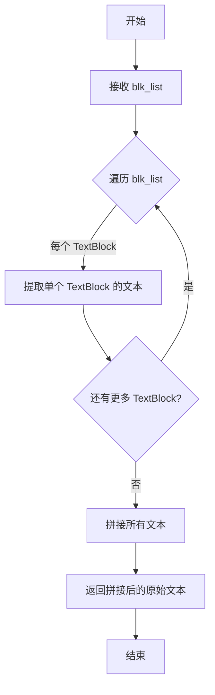
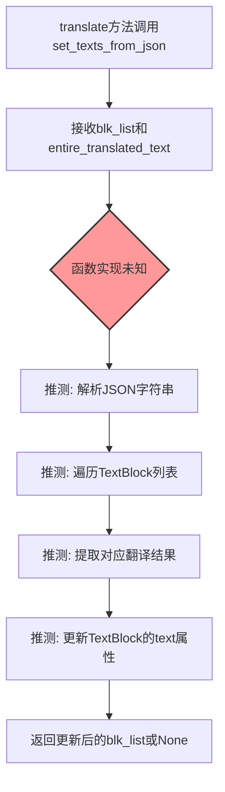
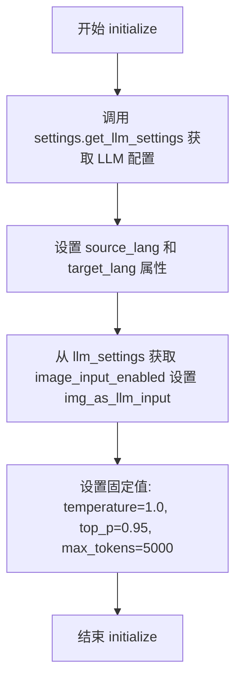
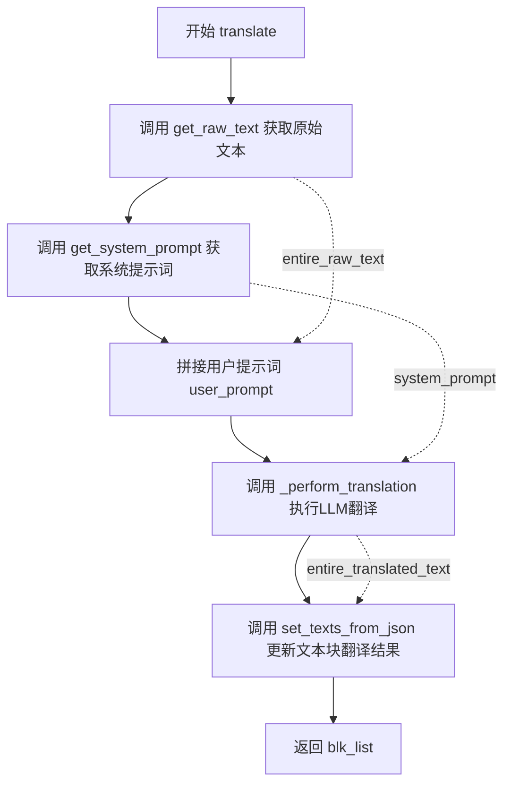
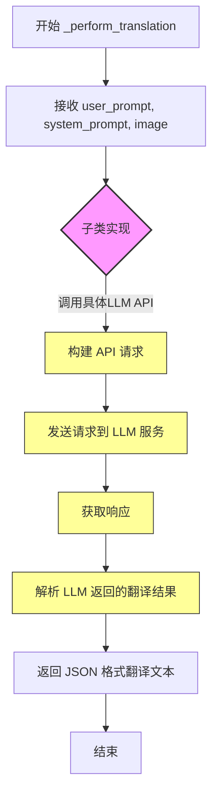

# `comic-translate\modules\translation\llm\base.py` 详细设计文档

基于LLM的翻译引擎基类，提供了文本块翻译的通用框架，通过构建系统提示词和用户提示词调用大语言模型进行翻译，并将翻译结果回填到文本块中，同时支持将CV2/numpy格式的图像编码为base64以供LLM使用。

## 整体流程

```mermaid
graph TD
    A[开始翻译] --> B[获取原始文本 get_raw_text]
    B --> C[构建系统提示词 get_system_prompt]
    C --> D[构建用户提示词]
    D --> E[调用 _perform_translation]
    E --> F{子类实现}
    F --> G[解析翻译结果 set_texts_from_json]
    G --> H[返回翻译后的文本块]

subgraph 图像编码流程
    I[encode_image] --> J[调用 imk.encode_image]
    J --> K[base64.b64encode 编码]
    K --> L[映射 MIME 类型]
    L --> M[返回 (base64字符串, mime_type)]
end
```

## 类结构

```
LLMTranslation (抽象基类 - 外部)
└── BaseLLMTranslation (本类)
```

## 全局变量及字段


### `BaseLLMTranslation.source_lang`
    
源语言

类型：`str | None`
    


### `BaseLLMTranslation.target_lang`
    
目标语言

类型：`str | None`
    


### `BaseLLMTranslation.api_key`
    
API密钥

类型：`str | None`
    


### `BaseLLMTranslation.api_url`
    
API端点URL

类型：`str | None`
    


### `BaseLLMTranslation.model`
    
模型实例

类型：`Any | None`
    


### `BaseLLMTranslation.img_as_llm_input`
    
是否将图像作为LLM输入

类型：`bool`
    


### `BaseLLMTranslation.temperature`
    
采样温度

类型：`float | None`
    


### `BaseLLMTranslation.top_p`
    
核采样参数

类型：`float | None`
    


### `BaseLLMTranslation.max_tokens`
    
最大生成token数

类型：`int | None`
    


### `BaseLLMTranslation.timeout`
    
请求超时时间(秒)

类型：`int`
    
    

## 全局函数及方法


### `get_raw_text`

获取文本块的原始文本，将多个 TextBlock 对象中的文本内容提取并拼接为一个完整的字符串，供后续翻译流程使用。

参数：

- `blk_list`：`list[TextBlock]`，TextBlock 对象列表，包含需要提取原始文本的文本块列表

返回值：`str`，拼接后的原始文本字符串

#### 流程图



#### 带注释源码

```python
# 假设的实现（源码未在给定代码中提供）
def get_raw_text(blk_list: list[TextBlock]) -> str:
    """
    获取文本块的原始文本。
    
    Args:
        blk_list: TextBlock 对象列表
        
    Returns:
        拼接后的原始文本字符串
    """
    # 初始化空列表用于存储各文本块的文本
    texts = []
    
    # 遍历所有文本块
    for blk in blk_list:
        # 提取单个文本块的内容（具体实现取决于 TextBlock 的结构）
        # 可能是 blk.text, blk.content, 或其他属性
        text = blk.text if hasattr(blk, 'text') else str(blk)
        texts.append(text)
    
    # 拼接所有文本块的内容（可能以换行符或空格分隔）
    entire_raw_text = "\n".join(texts)
    
    return entire_raw_text
```

> **注**：该函数的实际实现在 `...utils.translator_utils` 模块中，当前代码中仅展示了其使用方式。从调用上下文可以看出，该函数接收 `TextBlock` 对象列表作为输入，并返回一个包含所有文本块内容的字符串，供 LLM 翻译使用。


### `set_texts_from_json` (translator_utils)

从JSON数据设置文本块内容。该函数接收文本块列表和包含翻译结果的JSON字符串，将JSON中解析出的翻译结果逐一更新到对应的TextBlock对象中。

参数：

-  `blk_list`：`list[TextBlock]`（根据调用方传递的 `blk_list: list[TextBlock]` 推断），待更新的文本块列表
-  `json_text`：`str`（根据 `_perform_translation` 返回值 `str` 推断），包含翻译结果的JSON格式字符串

返回值：`None`（根据函数名和调用模式推断，该函数直接修改传入的blk_list，无需返回值；或返回 `list[TextBlock]` 更新后的文本块列表）

#### 流程图



#### 带注释源码

```
# 注意：以下为基于调用上下文推测的函数签名和可能实现
# 实际源码位于 ...utils.translator_utils 模块中，此处未提供

def set_texts_from_json(blk_list: list[TextBlock], json_text: str) -> None:
    """
    从JSON设置文本块内容。
    
    Args:
        blk_list: TextBlock对象列表，待更新
        json_text: JSON格式的翻译结果字符串
        
    Returns:
        None（直接修改blk_list）
    """
    # 此处应有JSON解析逻辑
    # 1. json.loads(json_text) 解析JSON
    # 2. 遍历blk_list和解析结果
    # 3. 将翻译文本写入对应TextBlock对象
    pass

# 调用示例（来自BaseLLMTranslation.translate方法）：
set_texts_from_json(blk_list, entire_translated_text)
```

#### 说明

由于 `set_texts_from_json` 函数的实现源码未在提供的代码中给出，上述信息基于以下调用上下文推断：

1. **调用位置**：`BaseLLMTranslation.translate()` 方法第60行
2. **参数来源**：
   - `blk_list`：传入的 `list[TextBlock]`
   - `entire_translated_text`：来自 `_perform_translation` 方法的返回值，类型为 `str`
3. **函数作用**：根据函数名推测，该函数将JSON格式的翻译结果解析并写入到对应的TextBlock对象中

---

**注意**：完整的函数实现细节需要查看 `...utils.translator_utils` 模块的源码。若需更精确的文档，请提供该函数的实际实现代码。


### `BaseLLMTranslation.initialize`

初始化 LLM 翻译引擎的核心方法，负责配置翻译引擎的源语言、目标语言、API 设置以及生成参数等关键属性。

参数：

- `settings`：`Any`，Settings 对象，包含 API 凭证等配置信息
- `source_lang`：`str`，源语言名称
- `target_lang`：`str`，目标语言名称
- `**kwargs`：可变参数，引擎特定的初始化参数

返回值：`None`，该方法无返回值，仅执行初始化逻辑

#### 流程图



#### 带注释源码

```python
def initialize(self, settings: Any, source_lang: str, target_lang: str, **kwargs) -> None:
    """
    Initialize the LLM translation engine.
    
    Args:
        settings: Settings object with credentials
        source_lang: Source language name
        target_lang: Target language name
        **kwargs: Engine-specific initialization parameters
    """
    # 从 settings 对象中获取 LLM 相关的配置字典
    llm_settings = settings.get_llm_settings()
    
    # 设置源语言和目标语言属性，供后续翻译方法使用
    self.source_lang = source_lang
    self.target_lang = target_lang
    
    # 从 LLM 配置中获取图像输入是否启用的标志，默认值为 True
    self.img_as_llm_input = llm_settings.get('image_input_enabled', True)
    
    # 设置 LLM 生成参数：温度系数控制随机性
    self.temperature = 1.0
    # 设置 LLM 生成参数：核采样概率阈值
    self.top_p = 0.95
    # 设置 LLM 生成参数：最大生成 token 数量
    self.max_tokens = 5000
```


### `BaseLLMTranslation.translate()`

执行文本块翻译，调用LLM模型将源语言文本翻译为目标语言，并更新TextBlock列表中的翻译结果。

参数：

- `blk_list`：`list[TextBlock]`，待翻译的TextBlock对象列表
- `image`：`np.ndarray`，作为LLM输入的图像数据（numpy数组格式）
- `extra_context`：`str`，额外的上下文信息，用于辅助翻译

返回值：`list[TextBlock]`，包含翻译结果的TextBlock对象列表

#### 流程图



#### 带注释源码

```python
def translate(self, blk_list: list[TextBlock], image: np.ndarray, extra_context: str) -> list[TextBlock]:
    """
    Translate text blocks using LLM.
    
    Args:
        blk_list: List of TextBlock objects to translate
        image: Image as numpy array
        extra_context: Additional context information for translation
        
    Returns:
        List of updated TextBlock objects with translations
    """
    # 步骤1: 从TextBlock列表中提取所有原始文本，合并为单一字符串
    entire_raw_text = get_raw_text(blk_list)
    
    # 步骤2: 根据源语言和目标语言获取系统提示词（由子类实现或从父类继承）
    system_prompt = self.get_system_prompt(self.source_lang, self.target_lang)
    
    # 步骤3: 构建用户提示词，包含额外上下文和待翻译文本
    user_prompt = f"{extra_context}\nMake the translation sound as natural as possible.\nTranslate this:\n{entire_raw_text}"
    
    # 步骤4: 调用抽象方法_perform_translation，由子类实现具体的LLM调用逻辑
    entire_translated_text = self._perform_translation(user_prompt, system_prompt, image)
    
    # 步骤5: 将JSON格式的翻译结果解析并回填到TextBlock列表中
    set_texts_from_json(blk_list, entire_translated_text)
        
    # 返回更新后的TextBlock列表
    return blk_list
```


### `BaseLLMTranslation._perform_translation`

抽象方法，用于执行具体的 LLM 翻译调用。该方法由子类实现，根据不同的 LLM 提供商（如 OpenAI、Claude 等）调用对应的 API 进行翻译。方法接收用户提示词、系统提示词和图像数据，返回翻译后的 JSON 文本。

参数：

- `user_prompt`：`str`，用户构建的提示词，包含待翻译的原始文本和额外上下文信息
- `system_prompt`：`str`，系统提示词，包含源语言和目标语言的指令信息
- `image`：`np.ndarray`，输入图像的 numpy 数组表示，用于多模态 LLM 的视觉理解

返回值：`str`，LLM 返回的翻译后的 JSON 文本，需要通过 `set_texts_from_json` 解析并填充到 TextBlock 中

#### 流程图



#### 带注释源码

```python
@abstractmethod
def _perform_translation(self, user_prompt: str, system_prompt: str, image: np.ndarray) -> str:
    """
    Perform translation using specific LLM.
    
    该方法是抽象方法，由子类实现具体的 LLM 调用逻辑。
    子类需要根据不同的 LLM 提供商（如 OpenAI、Anthropic、Google 等）
    构建相应的 API 请求并处理响应。
    
    Args:
        user_prompt: 用户提示词，包含待翻译文本和额外上下文
        system_prompt: 系统提示词，包含翻译指令和语言信息
        image: numpy 数组格式的图像，用于多模态翻译场景
        
    Returns:
        翻译后的 JSON 文本字符串，需要符合 TextBlock 的 JSON 格式规范
        
    Note:
        子类实现时需要处理以下内容：
        1. API 认证（API Key）
        2. 请求超时控制（默认 30 秒）
        3. 模型参数配置（temperature, top_p, max_tokens）
        4. 图像编码（如果 img_as_llm_input 为 True）
        5. 错误处理和重试机制
        6. 响应格式化为 JSON 字符串
    """
    pass
```

---

### 补充说明

#### 设计目标与约束

- **设计目标**：将不同 LLM 提供商的调用逻辑抽象为统一接口，使翻译引擎具有良好的扩展性
- **设计约束**：子类必须实现该方法，返回值必须为符合 `set_texts_from_json` 解析的 JSON 格式字符串

#### 潜在的技术债务与优化空间

1. **错误处理缺失**：抽象方法未定义异常类型，子类实现时缺乏统一的错误处理规范
2. **返回值验证**：没有对返回的 JSON 格式进行验证，可能导致解析失败
3. **重试机制**：未定义重试策略，子类实现时需要自行处理网络异常
4. **超时配置**：超时时间硬编码为 30 秒，缺乏灵活性

#### 使用场景

该方法在 `translate()` 方法中被调用，流程如下：

```
translate() 
  → get_raw_text() 提取原始文本
  → get_system_prompt() 构建系统提示
  → _perform_translation() [子类实现] 调用 LLM
  → set_texts_from_json() 解析并填充翻译结果
```


### `BaseLLMTranslation.encode_image()`

将CV2/numpy格式的图像编码为Base64字符串，并返回对应的MIME类型，便于作为LLM输入使用。

参数：

- `self`：隐式参数，BaseLLMTranslation类的实例
- `image`：`np.ndarray`，numpy数组表示的图像数据（CV2格式）
- `ext`：可选的字符串参数，默认为 `".jpg"`，图像编码的格式/扩展名（如".jpg"、".png"、".webp"）

返回值：`tuple[str, str]`，包含两个字符串元素的元组 —— 第一个是Base64编码后的图像字符串，第二个是对应的MIME类型（如"image/jpeg"、"image/png"等）

#### 流程图

```mermaid
flowchart TD
    A[开始 encode_image] --> B[接收 image: np.ndarray 和 ext: str]
    B --> C{ext 参数处理}
    C --> D[调用 imk.encode_image<br/>将 numpy 图像编码为字节 buffer]
    D --> E[调用 base64.b64encode<br/>将字节转换为 Base64 字节串]
    E --> F[调用 .decode('utf-8')<br/>将 Base64 字节串解码为字符串]
    F --> G[构建 mime_types 映射字典<br/>扩展名 → MIME 类型]
    G --> H[根据 ext 查找对应 MIME 类型]
    H --> I[返回元组 (img_str, mime_type)]
    I --> J[结束 encode_image]
    
    style A fill:#e1f5fe
    style I fill:#e1f5fe
    style J fill:#e1f5fe
```

#### 带注释源码

```python
def encode_image(self, image: np.ndarray, ext=".jpg"):
    """
    Encode CV2/numpy image directly to base64 string using cv2.imencode.
    
    Args:
        image: Numpy array representing the image
        ext: Extension/format to encode the image as (".png" by default for higher quality)
            
    Returns:
        Tuple of (Base64 encoded string, mime_type)
    """
    # Step 1: Direct encoding from numpy/cv2 format to bytes
    # 使用 imkit 库的 encode_image 函数将 numpy 数组图像编码为指定格式的字节流
    # ext.lstrip('.') 移除扩展名前的点，转换为纯格式字符串（如 "jpg", "png"）
    buffer = imk.encode_image(image, ext.lstrip('.'))
    
    # Step 2: Convert bytes to base64
    # 使用 base64 标准库将图像字节流编码为 Base64 字符串
    # b64encode 返回 bytes 对象，需要 decode 为 utf-8 字符串
    img_str = base64.b64encode(buffer).decode('utf-8')
    
    # Step 3: Map extension to mime type
    # 建立扩展名到 MIME 类型的映射字典，用于 HTTP 请求头或 API 调用的 Content-Type
    mime_types = {
        ".jpg": "image/jpeg", 
        ".jpeg": "image/jpeg",
        ".png": "image/png",
        ".webp": "image/webp"
    }
    # 使用 .get() 方法安全查找，支持大小写不敏感的扩展名匹配
    # 如果扩展名不在映射中，则动态构造 MIME 类型（如 ".bmp" → "image/bmp"）
    mime_type = mime_types.get(ext.lower(), f"image/{ext[1:].lower()}")
    
    # Step 4: Return tuple of base64 string and mime type
    # 返回元组供调用方使用：Base64 字符串可直接嵌入 JSON 请求体，MIME 类型用于标识图像格式
    return img_str, mime_type
```

## 关键组件


### BaseLLMTranslation 类

基于LLM的翻译引擎基类，提供共享的翻译功能，支持文本块翻译和图像处理

### 图像编码组件 (encode_image 方法)

将CV2/numpy格式的图像直接编码为Base64字符串，支持多种格式（jpg、png、webp），返回Base64编码和MIME类型

### 翻译流程组件 (translate 方法)

主翻译流程，协调文本提取、提示词构建、LLM调用和结果写入，提供完整的端到端翻译能力

### 抽象翻译方法 (_perform_translation 方法)

子类需实现的抽象方法，定义具体LLM的翻译调用逻辑，接受用户提示词、系统提示词和图像，返回翻译后的JSON文本

### 初始化配置组件 (initialize 方法)

初始化LLM翻译引擎的核心配置，包括语言设置、API参数（temperature、top_p、max_tokens、timeout）和图像输入开关

### 提示词构建组件 (get_system_prompt 方法)

构建系统提示词，指定源语言和目标语言，为LLM提供翻译上下文和指令

### 工具函数依赖

外部工具函数依赖：get_raw_text（提取原始文本）、set_texts_from_json（从JSON设置翻译结果），以及imkit库的图像编码功能


## 问题及建议


### 已知问题

- **硬编码配置值**：在 `initialize` 方法中，`temperature`、`top_p`、`max_tokens` 被硬编码为固定值，完全忽略了 `llm_settings` 中可能存在的配置，导致用户无法通过配置自定义这些关键参数
- **未使用的实例变量**：`__init__` 中初始化的 `self.api_key`、`self.api_url`、`self.model` 在整个类中未被使用，造成代码冗余
- **未使用的参数**：`initialize` 方法接收 `**kwargs` 参数但从未使用，设计的可扩展性未能体现
- **缺少抽象类声明**：虽然类中存在抽象方法 `_perform_translation`，但 `BaseLLMTranslation` 并未继承 `abc.ABC`，无法在实例化时强制检查抽象方法的实现
- **类型注解兼容性**：`list[TextBlock]` 类型注解需要 Python 3.9+ 环境，低于 3.9 版本会报错
- **错误处理缺失**：`translate` 方法和 `encode_image` 方法均无异常处理逻辑，网络请求、图像编码失败时会导致程序直接崩溃
- **Magic Number**：超时时间 `timeout = 30` 作为 Magic Number 硬编码，缺乏常量定义和配置化

### 优化建议

- 从 `llm_settings` 中读取 `temperature`、`top_p`、`max_tokens`、`timeout` 等配置值，为空时再使用默认值
- 移除未使用的实例变量 `api_key`、`api_url`、`model`，或在子类中合理使用
- 将 `**kwargs` 参数透传给子类或用于配置初始化逻辑
- 让类继承 `abc.ABC` 以确保抽象方法被正确实现，或添加 `raise NotImplementedError` 逻辑
- 使用 `typing.List` 替代 `list` 以兼容更低版本的 Python，或在文件头部添加 `from __future__ import annotations`
- 为关键方法添加 `try-except` 异常处理，并定义统一的异常类型
- 将超时时间等配置提取为类常量或配置文件，提高可维护性

## 其它


### 设计目标与约束

**设计目标**：
1. 提供一个通用的LLM翻译框架基类，供具体翻译引擎实现继承
2. 支持将图像作为LLM输入进行视觉辅助翻译
3. 实现文本块批量翻译能力
4. 封装图像编码和提示词构建等通用逻辑

**设计约束**：
1. 必须继承自LLMTranslation基类
2. 子类必须实现`_perform_translation`抽象方法
3. 依赖外部LLM API服务（api_key、api_url、model配置）
4. 图像输入受限于max_tokens参数（默认5000）
5. 超时时间固定为30秒

### 错误处理与异常设计

**当前代码缺失的错误处理**：
1. `initialize`方法未验证source_lang和target_lang有效性
2. `translate`方法未处理LLM API调用失败情况
3. `encode_image`方法未处理无效图像格式
4. `get_raw_text`和`set_texts_from_json`调用未捕获异常
5. 缺少网络超时重试机制

**建议的异常设计**：
1. 添加`LLMTranslationError`基类异常
2. 添加`APIConnectionError`用于API调用失败
3. 添加`ImageEncodingError`用于图像编码失败
4. translate方法应捕获异常并返回原始文本块
5. initialize应验证必要参数完整性

### 数据流与状态机

**数据流转过程**：
1. **初始化阶段**：settings -> 提取LLM配置 -> 填充实例属性
2. **翻译阶段**：
   - 输入：blk_list（TextBlock列表）+ image（numpy数组）+ extra_context
   - 提取原始文本 -> 构建system_prompt -> 构建user_prompt
   - 调用`_perform_translation` -> 获得JSON翻译结果
   - 解析JSON -> 更新TextBlock -> 返回
3. **编码阶段**：numpy数组 -> imk.encode_image -> base64编码 -> (img_str, mime_type)

**状态机**：
- UNINITIALIZED（未初始化）-> initialize() -> READY（就绪）
- READY -> translate() -> TRANSLATING（翻译中）
- TRANSLATING -> 返回结果 -> READY

### 外部依赖与接口契约

**外部依赖**：
1. `imkit`（imk）：图像编码库，提供encode_image函数
2. `numpy`：图像数组表示
3. `base64`：图像Base64编码
4. `abc.abstractmethod`：抽象方法定义

**接口契约**：
1. **LLMTranslation基类契约**：必须实现translate方法
2. **子类实现契约**：必须实现`_perform_translation`抽象方法
3. **TextBlock契约**：必须支持get_raw_text和set_texts_from_json操作
4. **settings对象契约**：必须提供get_llm_settings()方法返回字典

### 安全性设计

**当前安全考量**：
1. api_key和api_url以明文存储于内存中
2. 图像数据临时存在于内存

**建议改进**：
1. api_key不应在日志中输出
2. 敏感信息应在对象销毁时清空
3. 考虑使用环境变量而非直接传入

### 性能考虑

**性能相关参数**：
1. timeout=30秒：API调用超时限制
2. max_tokens=5000：限制LLM输出长度
3. temperature=1.0/top_p=0.95：采样参数影响响应时间

**优化建议**：
1. 图像编码可考虑异步执行
2. 大批量TextBlock可分批处理
3. 可添加缓存机制避免重复翻译

### 版本兼容性

**Python版本要求**：根据typing用法，需Python 3.9+
**第三方库版本**：未指定版本约束，建议锁定兼容版本

### 配置管理

**配置来源**：
- 来源于settings对象的llm_settings字典
- 关键配置项：image_input_enabled（默认True）
- 硬编码配置：temperature、top_p、max_tokens、timeout

**配置局限性**：
- 硬编码的参数无法通过配置文件修改
- 建议将temperature、max_tokens等提取为可配置项


    