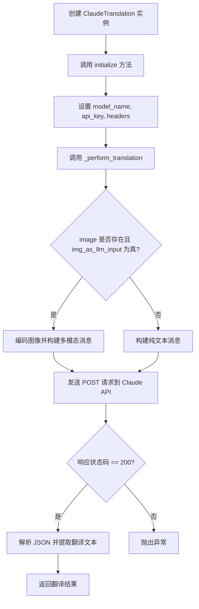
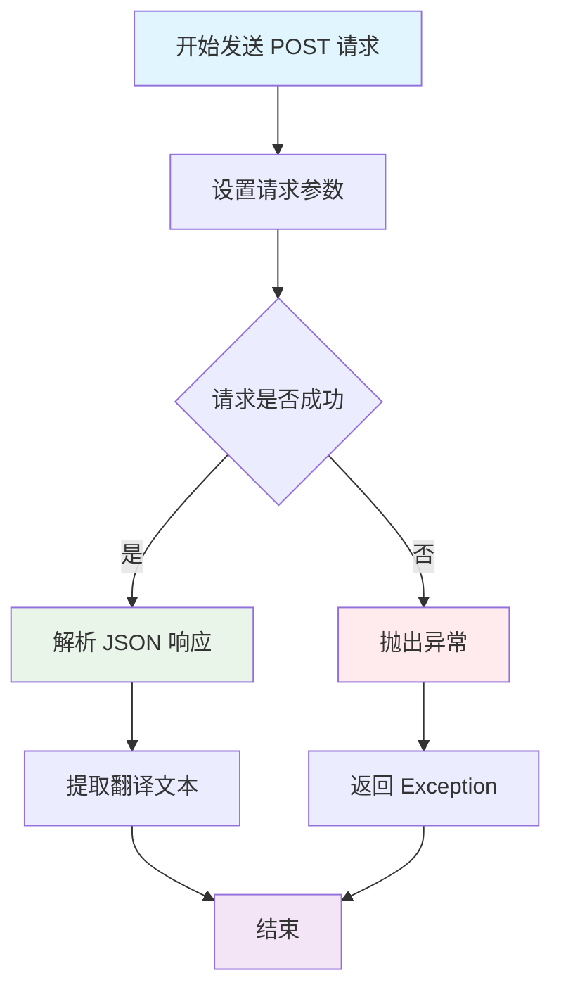
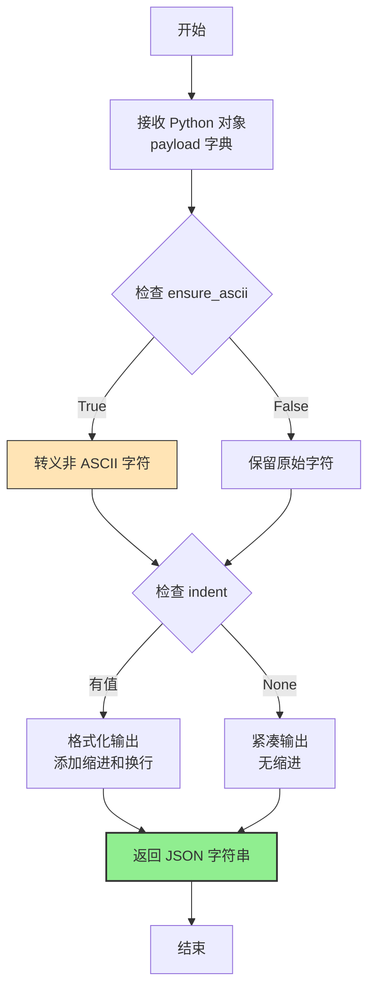
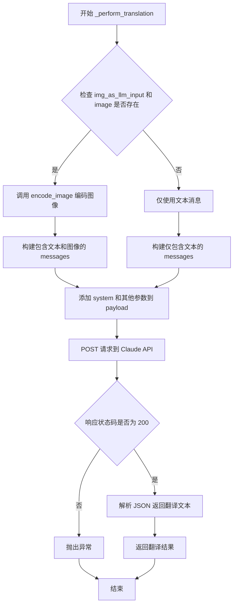
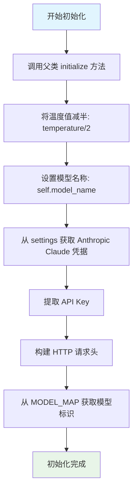

# `comic-translate\modules\translation\llm\claude.py` 详细设计文档

使用 Anthropic Claude 模型通过 REST API 进行翻译的翻译引擎类，支持文本和图像多模态输入

## 整体流程



## 类结构

```
BaseLLMTranslation (基类)
└── ClaudeTranslation (实现类)
```

## 全局变量及字段


### `MODEL_MAP`
    
模型名称映射字典，用于将模型名称映射到Anthropic API模型标识符

类型：`Dict[str, str]`
    


### `ClaudeTranslation.model_name`
    
当前使用的Claude模型名称

类型：`str`
    


### `ClaudeTranslation.api_key`
    
Anthropic API认证密钥

类型：`str`
    


### `ClaudeTranslation.api_url`
    
Anthropic Claude API的REST端点URL

类型：`str`
    


### `ClaudeTranslation.headers`
    
HTTP请求头，包含API密钥、版本和内容类型

类型：`Dict[str, str]`
    
    

## 全局函数及方法


### `requests.post`

调用 `requests.post` 函数向 Claude API 发送 HTTP POST 请求，以获取翻译结果。

参数：

- `url`：`str`，API 端点 URL，值为 `self.api_url`（"https://api.anthropic.com/v1/messages"）
- `headers`：`Dict[str, str]`，HTTP 请求头，包含 API 密钥、Anthropic 版本和内容类型
- `data`：`str`，JSON 序列化的请求负载，包含模型、系统提示、用户消息、温度和最大令牌数
- `timeout`：`int` 或 `float`，请求超时时间（秒）

返回值：`requests.Response`，HTTP 响应对象，包含 API 返回的数据

#### 流程图



#### 带注释源码

```python
# 发起 POST 请求到 Claude API
response = requests.post(
    self.api_url,                              # API 端点 URL: "https://api.anthropic.com/v1/messages"
    headers=self.headers,                      # HTTP 请求头，包含认证信息
    data=json.dumps(payload),                  # 序列化为 JSON 字符串的请求负载
    timeout=self.timeout                        # 请求超时时间（防止请求无限期等待）
)

# 处理响应
if response.status_code == 200:                # 检查 HTTP 状态码是否为 200（成功）
    response_data = response.json()             # 解析 JSON 格式的响应数据
    # 提取返回内容中的第一个文本块并返回翻译结果
    return response_data['content'][0]['text']
else:
    # 构建错误信息，包含状态码和响应文本
    error_msg = f"Error {response.status_code}: {response.text}"
    # 抛出异常指示 API 请求失败
    raise Exception(f"Claude API request failed: {error_msg}")
```


### `json.dumps`

将 Python 对象（字典、列表等）序列化为 JSON 格式的字符串，用于网络传输或文件存储。

参数：

- `obj`：`Any`，要序列化的 Python 对象（此处为 `payload` 字典）
- `ensure_ascii`：`bool`，是否将非 ASCII 字符转义为 Unicode 转义序列（默认 `True`）
- `indent`：`int`，缩进空格数，使输出更易读（默认 `None`，紧凑格式）
- `sort_keys`：`bool`，是否按键排序输出（默认 `False`）
- `skipkeys`：`bool`，是否跳过非基本类型的键（默认 `False`）

返回值：`str`，JSON 格式的字符串

#### 流程图



#### 带注释源码

```python
# 在 ClaudeTranslation._perform_translation 方法中调用 json.dumps
# 用于将 payload 字典序列化为 JSON 字符串，供 requests.post 的 data 参数使用

# 准备请求载荷（Python 字典）
payload: Dict[str, Any] = {
    "model": self.model,
    "system": system_prompt,
    "temperature": self.temperature,
    "max_tokens": self.max_tokens
}

# ... 构建 messages 部分（省略） ...

# 使用 json.dumps 将 Python 对象序列化为 JSON 字符串
# - obj: 要序列化的 payload 字典
# - ensure_ascii=True (默认值): 确保输出是 ASCII 安全的，适合 HTTP 传输
# - indent=None (默认值): 紧凑格式，减少传输数据量
# - skipkeys=False (默认值): 如果遇到非基本类型键则抛出 TypeError
# 返回值: JSON 格式的字符串，如 '{"model": "claude-3", "system": "..."}'
json_payload = json.dumps(payload)

# 将序列化后的字符串作为请求体发送
response = requests.post(
    self.api_url,
    headers=self.headers,
    data=json_payload,  # <-- json.dumps 的返回值作为 HTTP 请求体
    timeout=self.timeout
)
```

---

#### 在项目中的调用位置

```python
# 文件: ClaudeTranslation._perform_translation 方法
# 行号: 约第 75-78 行

# 构建请求载荷
payload: Dict[str, Any] = {
    "model": self.model,
    "system": system_prompt,
    "temperature": self.temperature,
    "max_tokens": self.max_tokens
}

# ... (添加消息内容) ...

# 序列化并发送请求
response = requests.post(
    self.api_url,
    headers=self.headers,
    data=json.dumps(payload),  # ← 在此处调用 json.dumps
    timeout=self.timeout
)
```

#### 技术说明

| 项目 | 说明 |
|------|------|
| **函数来源** | Python 标准库 `json` 模块 |
| **调用目的** | 将 Python 字典转换为 JSON 字符串，作为 HTTP POST 请求体 |
| **编码选项** | `ensure_ascii=True`（默认），确保传输安全 |
| **输出格式** | 紧凑格式（无缩进），减少网络传输数据量 |
| **潜在优化** | 如调试需要，可添加 `indent=2` 便于日志查看 |


### `ClaudeTranslation._perform_translation`

该方法负责调用 Anthropic Claude API 执行翻译任务，支持文本翻译和图像翻译（当提供 np.ndarray 格式的图像时）。

参数：

- `user_prompt`：`str`，用户输入的翻译提示词
- `system_prompt`：`str`，系统提示词，包含翻译指令和上下文
- `image`：`np.ndarray`，可选的图像数据，用于多模态翻译场景

返回值：`str`，API 返回的翻译结果文本

#### 流程图



#### 带注释源码

```python
def _perform_translation(self, user_prompt: str, system_prompt: str, image: np.ndarray) -> str:
    """
    执行 Claude API 翻译请求。
    
    Args:
        user_prompt: 用户输入的提示词
        system_prompt: 系统提示词
        image: NumPy 数组格式的图像（可选）
    
    Returns:
        翻译结果文本
    """
    # 准备请求载荷，包含模型、系统提示、温度和最大令牌数
    payload: Dict[str, Any] = {
        "model": self.model,
        "system": system_prompt,
        "temperature": self.temperature,
        "max_tokens": self.max_tokens
    }
    
    # 根据是否启用图像输入和图像是否存在的条件来构建消息
    if self.img_as_llm_input and image is not None:
        # 使用基类的 encode_image 方法将 np.ndarray 编码为 Base64
        encoded_image, media_type = self.encode_image(image)
        
        # 构建包含文本和图像的多模态消息格式
        payload["messages"] = [
            {
                "role": "user", 
                "content": [
                    {"type": "text", "text": user_prompt}, 
                    {"type": "image", "source": {"type": "base64", "media_type": media_type, "data": encoded_image}}
                ]
            }
        ]
    else:
        # 仅文本翻译场景的消息格式
        payload["messages"] = [
            {
                "role": "user", 
                "content": [
                    {"type": "text", "text": user_prompt}
                ]
            }
        ]

    # 发起 HTTP POST 请求到 Claude API 端点
    response = requests.post(
        self.api_url,
        headers=self.headers,
        data=json.dumps(payload),
        timeout=self.timeout
    )
    
    # 处理响应：成功时提取翻译文本，失败时抛出异常
    if response.status_code == 200:
        response_data = response.json()
        return response_data['content'][0]['text']
    else:
        error_msg = f"Error {response.status_code}: {response.text}"
        raise Exception(f"Claude API request failed: {error_msg}")
```


### `ClaudeTranslation.__init__`

初始化 Claude 翻译引擎，设置基础配置和默认属性。

参数：无（仅包含隐式 `self` 参数）

返回值：无（`__init__` 方法不返回值）

#### 流程图

```mermaid
flowchart TD
    A[开始 __init__] --> B[调用父类初始化 super().__init__]
    B --> C[设置 self.model_name = None]
    C --> D[设置 self.api_key = None]
    D --> E[设置 self.api_url = 'https://api.anthropic.com/v1/messages']
    E --> F[设置 self.headers = None]
    F --> G[结束初始化]
```

#### 带注释源码

```python
def __init__(self):
    """Initialize Claude translation engine."""
    # 调用父类 BaseLLMTranslation 的初始化方法，继承基础翻译功能
    super().__init__()
    
    # 初始化模型名称为 None，将在 initialize 方法中设置具体模型
    self.model_name = None
    
    # 初始化 API 密钥为 None，将在 initialize 方法中从设置中获取
    self.api_key = None
    
    # 设置 Anthropic Claude API 端点 URL
    self.api_url = "https://api.anthropic.com/v1/messages"
    
    # 初始化请求头为 None，将在 initialize 方法中配置完整请求头
    self.headers = None
```


### `ClaudeTranslation.initialize`

该方法用于初始化 Claude 翻译引擎，配置 API 凭证、设置请求头并加载指定的 Claude 模型。

参数：

- `settings`：`Any`，包含凭据信息的设置对象
- `source_lang`：`str`，源语言名称
- `target_lang`：`str`，目标语言名称
- `model_name`：`str`，Claude 模型名称
- `**kwargs`：额外的关键字参数

返回值：`None`，无返回值

#### 流程图



#### 带注释源码

```python
def initialize(self, settings: Any, source_lang: str, target_lang: str, model_name: str, **kwargs) -> None:
    """
    Initialize Claude translation engine.
    
    Args:
        settings: Settings object with credentials
        source_lang: Source language name
        target_lang: Target language name
        model_name: Claude model name
    """
    # 调用父类的 initialize 方法，传递基础配置
    super().initialize(settings, source_lang, target_lang, **kwargs)
    
    # 将温度参数减半，以降低翻译结果的随机性
    self.temperature = self.temperature/2
    
    # 保存传入的模型名称
    self.model_name = model_name
    
    # 从设置中获取 Anthropic Claude 的 API 凭据
    credentials = settings.get_credentials(settings.ui.tr('Anthropic Claude'))
    # 提取 API Key，如果不存在则默认为空字符串
    self.api_key = credentials.get('api_key', '')
    
    # 构建 API 请求头，包含认证信息和 API 版本
    self.headers = {
        "x-api-key": self.api_key,           # API 认证密钥
        "anthropic-version": "2023-06-01",   # Anthropic API 版本
        "Content-Type": "application/json"   # 请求内容类型
    }
    
    # 根据模型名称从 MODEL_MAP 获取对应的模型标识符
    self.model = MODEL_MAP.get(self.model_name)
```


### `ClaudeTranslation._perform_translation`

执行翻译请求的核心方法，负责构建请求负载、调用 Claude API 并返回翻译结果。

参数：

- `user_prompt`：`str`，用户输入的待翻译文本提示
- `system_prompt`：`str`，系统提示，提供翻译上下文和指令
- `image`：`np.ndarray`，可选的图像数据，用于多模态翻译（如图片描述翻译）

返回值：`str`，返回翻译后的文本内容

#### 流程图

```mermaid
graph TD
    A[开始 _perform_translation] --> B[准备请求payload: model, system, temperature, max_tokens]
    B --> C{检查 image 是否存在且 img_as_llm_input 为真}
    C -->|是| D[调用 encode_image 编码图像]
    D --> E[构建包含文本和图像的messages结构]
    C -->|否| F[仅构建文本消息]
    E --> G[发送 POST 请求到 Claude API]
    F --> G
    G --> H{检查响应状态码}
    H -->|200| I[解析JSON响应]
    I --> J[提取 content[0].text]
    J --> K[返回翻译结果字符串]
    H -->|非200| L[构建错误消息]
    L --> M[抛出 Exception]
    K --> N[结束]
    M --> N
```

#### 带注释源码

```python
def _perform_translation(self, user_prompt: str, system_prompt: str, image: np.ndarray) -> str:
    """
    执行实际的翻译请求到 Claude API。
    
    Args:
        user_prompt: 用户输入的待翻译文本
        system_prompt: 系统指令prompt
        image: 可选的numpy数组图像（用于多模态输入）
    
    Returns:
        翻译后的文本字符串
    """
    
    # ========== 步骤1: 准备请求负载 ==========
    # 构建基础的请求payload，包含模型、温度、最大token数等参数
    payload: Dict[str, Any] = {
        "model": self.model,                      # 映射后的Claude模型标识
        "system": system_prompt,                  # 系统指令
        "temperature": self.temperature,          # 翻译 Creativity（已在前序初始化时折半）
        "max_tokens": self.max_tokens             # 最大生成token数
    }
    
    # ========== 步骤2: 构建消息内容 ==========
    # 根据是否有图像来决定消息的结构
    if self.img_as_llm_input and image is not None:
        # 启用多模态：调用基类的encode_image方法将图像转为base64
        encoded_image, media_type = self.encode_image(image)
        
        # 构建包含文本和图像的混合消息（Claude API格式）
        payload["messages"] = [
            {
                "role": "user", 
                "content": [
                    {"type": "text", "text": user_prompt},  # 用户翻译文本
                    {
                        "type": "image", 
                        "source": {
                            "type": "base64",               # 使用base64编码传输图像
                            "media_type": media_type,       # 图像MIME类型
                            "data": encoded_image           # base64编码后的图像数据
                        }
                    }
                ]
            }
        ]
    else:
        # 纯文本模式：仅包含用户文本消息
        payload["messages"] = [
            {
                "role": "user", 
                "content": [
                    {"type": "text", "text": user_prompt}
                ]
            }
        ]

    # ========== 步骤3: 发送API请求 ==========
    # 使用requests库向Claude API端点发送POST请求
    response = requests.post(
        self.api_url,              # Anthropic API URL: https://api.anthropic.com/v1/messages
        headers=self.headers,      # 认证头（x-api-key, anthropic-version, Content-Type）
        data=json.dumps(payload),  # 将dict序列化为JSON字符串
        timeout=self.timeout       # 请求超时时间
    )
    
    # ========== 步骤4: 处理响应 ==========
    if response.status_code == 200:
        # 成功响应：解析JSON并提取翻译结果
        # Claude API返回格式: {"content": [{"type": "text", "text": "翻译结果"}]}
        response_data = response.json()
        return response_data['content'][0]['text']  # 提取文本内容并返回
    else:
        # 失败响应：构建错误信息并抛出异常
        error_msg = f"Error {response.status_code}: {response.text}"
        raise Exception(f"Claude API request failed: {error_msg}")
```

## 关键组件


### ClaudeTranslation 类

翻译引擎核心类，继承自BaseLLMTranslation，通过Anthropic Claude的REST API实现翻译功能，支持文本和图像输入的翻译任务。

### initialize 方法

初始化Claude翻译引擎的配置方法，负责设置API凭证、请求头和模型映射。包含temperature参数除以2的量化策略调整。

### _perform_translation 方法

核心翻译执行方法，构建API请求载荷，处理文本和图像输入，发送POST请求到Claude API并解析响应。

### encode_image 方法（继承自BaseLLM）

图像编码方法，将np.ndarray格式的图像转换为base64编码和媒体类型，供Claude API使用。

### MODEL_MAP 全局变量

模型名称映射字典，将Claude模型名称转换为内部标识符。

### requests 外部依赖

HTTP请求库，用于与Claude API进行RESTful通信。

### np.ndarray 图像输入

NumPy数组格式的图像数据，支持惰性加载和按需编码。

### API 错误处理机制

通过status_code检查和异常抛出实现API错误的处理与传播。


## 问题及建议


### 已知问题

-   **API密钥安全风险**：API密钥直接存储在实例变量中并在请求头中使用，没有进行任何掩码或加密处理，调试时可能泄露敏感信息
-   **缺少连接池复用**：每次翻译请求都创建新的HTTP连接，未使用`requests.Session()`进行连接复用，影响性能
-   **响应结构缺乏验证**：直接访问`response_data['content'][0]['text']`，未验证响应结构合法性，若API返回异常格式会导致KeyError
-   **错误处理不完善**：仅捕获HTTP错误状态码，未处理429限流、5xx服务器错误等异常情况，缺少重试机制
-   **未使用的实例变量**：`self.model_name`被赋值但在后续逻辑中未直接使用，实际使用的是`self.model`
-   **硬编码配置**：API URL和版本号硬编码在代码中，缺乏灵活配置机制
-   **日志缺失**：请求失败时仅抛出异常，无日志记录，不利于生产环境问题排查
-   **超时配置不明确**：`timeout`参数使用但未在初始化时明确设置默认值来源

### 优化建议

-   使用`requests.Session()`替代单次`requests.post()`调用，实现连接池复用提升性能
-   添加API响应结构验证函数，确保`content`数组和`text`字段存在后再访问
-   实现带指数退避的重试机制，处理临时性网络故障和限流情况
-   将API密钥存储改为从环境变量或安全密钥管理服务获取，避免硬编码
-   引入日志记录框架(Logging)，记录请求ID、耗时、状态码等关键信息
-   添加类型注解完善类型提示，特别是返回值类型
-   将API URL和版本号提取为可配置参数，支持多环境切换
-   考虑添加异步版本(asyncio/aiohttp)以支持高并发场景
-   增加成本估算和token计数功能，便于使用量监控

## 其它


### 设计目标与约束

本模块旨在通过Anthropic Claude的REST API实现多语言翻译功能，支持文本和图像（多模态）输入。设计约束包括：必须继承BaseLLMTranslation基类以保持翻译引擎的一致性；API调用采用同步请求模式；仅支持Claude API v1消息接口；图像输入需符合Anthropic规定的base64编码格式和媒体类型。

### 错误处理与异常设计

异常处理策略采用分层设计：API响应状态码非200时抛出通用Exception，错误信息包含HTTP状态码和响应正文；网络超时捕获由requests库的timeout参数控制；图像编码异常由encode_image方法抛至调用方。异常消息格式为"Claude API request failed: Error {status_code}: {response_text}"，便于日志分析和问题定位。当前缺乏重试机制和具体的异常类型细分（如认证失败、限流、超限等），建议后续引入自定义异常类。

### 数据流与状态机

数据流路径如下：调用方传入user_prompt、system_prompt和可选image → initialize方法完成认证配置和模型映射 → _perform_translation执行核心逻辑：构建payload（含model、system、temperature、max_tokens、messages）→ POST请求至api_url → 解析响应提取content[0].text返回。状态机包含三个状态：初始化状态（initialize完成）、就绪状态（headers和model配置完成）、执行状态（API请求处理中）。图像输入受img_as_llm_input标志控制。

### 外部依赖与接口契约

外部依赖包括：requests库（HTTP请求）、numpy库（图像数组处理）、json库（payload序列化）、MODEL_MAP工具（模型名称映射）。接口契约方面：initialize方法接收settings、source_lang、target_lang、model_name及kwargs；_perform_translation方法接收user_prompt、system_prompt、image三个参数，返回翻译结果字符串；encode_image方法由基类提供，返回(encoded_image, media_type)元组。API端点为https://api.anthropic.com/v1/messages，采用2023-06-01版本的API。

### 安全性考虑

敏感信息处理：api_key通过settings.get_credentials获取，存储于实例变量self.api_key，请求时通过自定义HTTP头x-api-key传递。密钥不应写入日志或暴露于异常消息中。当前实现将api_key直接存入self.api_key并在请求头中使用，建议增加密钥轮换机制和最小权限原则验证。此外，payload中的system_prompt可能包含敏感指令，需确保调用方传入的内容已做安全审查。

### 性能考量

性能瓶颈主要集中在网络请求和图像编码两个环节。timeout参数控制请求超时时间，当前未在代码中显式设置默认值，依赖基类BaseLLMTranslation的timeout属性。图像编码encode_image操作在每次翻译请求时执行，若频繁调用建议增加编码结果缓存。payload中的max_tokens限制了单次响应的最大长度，需根据实际翻译文本长度合理配置以避免响应截断或资源浪费。

### 配置管理

配置通过initialize方法的settings参数和model_name参数传入。settings对象需提供get_credentials方法用于获取Anthropic Claude的api_key；model_name需在MODEL_MAP中存在映射关系；temperature由基类控制，本类中将其减半处理；max_tokens由基类属性控制。api_url和headers在initialize中初始化，其中anthropic-version固定为"2023-06-01"，后续API版本升级需同步更新。

### 监控与日志

当前实现缺乏显式的日志记录和监控埋点。建议增加以下监控点：API请求发起时的日志（包含model、temperature、max_tokens、是否有图像输入）；响应状态码非200时的错误日志；请求耗时统计；图像编码失败监控。异常抛出时建议记录完整的payload结构（注意脱敏api_key）以便问题排查。

### 重试机制

当前代码未实现重试机制。建议针对以下场景增加重试：网络超时（requests.exceptions.Timeout）、5xx服务器错误（500-503）、429限流错误（配合Retry-After响应头）。重试策略建议采用指数退避算法，初始重试间隔1秒，最大重试次数3次。需注意区分可重试错误和不可重试错误（如401认证失败、400请求参数错误）。

### 测试策略

单元测试应覆盖：initialize方法正常初始化流程；_perform_translation方法在有/无图像两种场景下的payload构建正确性；API响应状态码200和非200场景的返回值和异常抛出；MODEL_MAP映射失败场景。集成测试需模拟真实API响应，建议使用requests-mock或responses库拦截HTTP请求。边界测试包括：空user_prompt、超大图像数据、特殊字符处理、超长文本翻译。

### 版本兼容性

API版本约束明确指定为"2023-06-01"，需关注Anthropic官方API变更公告。MODEL_MAP依赖外部导入，需确保与支持的Claude模型版本同步更新。Python依赖方面：requests库版本需支持timeout参数和json方法；numpy需支持ndarray类型和后续可能的版本变更。基类BaseLLMTranslation的属性（temperature、max_tokens、img_as_llm_input、timeout）变更可能影响本类行为。


    