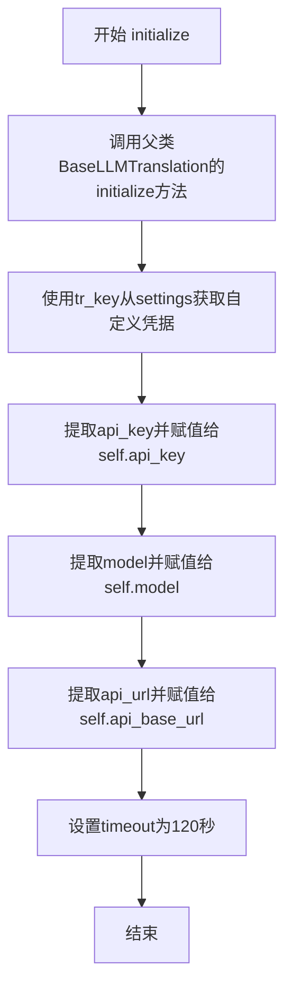

# `comic-translate\modules\translation\llm\custom.py` 详细设计文档

一个自定义翻译引擎类，通过继承GPTTranslation并重写initialize方法，使用自定义的OpenAI兼容API配置（api_key、model、api_url）来实现翻译功能，避免使用GPT特定的凭证加载逻辑，并设置了120秒的自定义超时时间以适应可能较慢的自定义LLM服务。

## 整体流程

```mermaid
graph TD
    A[开始] --> B[调用父类__init__]
    B --> C[调用initialize方法]
    C --> D[super(GPTTranslation, self).initialize调用BaseLLMTranslation的initialize]
    D --> E[从settings获取自定义凭证]
    E --> F[提取api_key]
    F --> G[提取model]
    G --> H[提取api_url并去除末尾斜杠]
    H --> I[设置timeout=120]
    I --> J[结束]
```

## 类结构

```
BaseLLMTranslation (基类)
└── GPTTranslation
    └── CustomTranslation (当前类)
```

## 全局变量及字段


### `CustomTranslation.api_key`
    
用于认证自定义LLM服务API请求的密钥

类型：`str`
    


### `CustomTranslation.model`
    
指定要使用的自定义LLM模型名称

类型：`str`
    


### `CustomTranslation.api_base_url`
    
自定义LLM服务的API基础URL端点

类型：`str`
    


### `CustomTranslation.timeout`
    
API请求的超时时间（秒），默认120秒以适应较慢的自定义LLM

类型：`int`
    
    

## 全局函数及方法


### `CustomTranslation.__init__`

该方法初始化自定义翻译引擎实例，通过调用父类 GPTTranslation 的构造函数完成基础初始化工作。

参数：

- `self`：隐式参数，CustomTranslation 实例本身

返回值：`None`，无返回值

#### 流程图

```mermaid
flowchart TD
    A[开始 __init__] --> B[调用 super().__init__]
    B --> C[初始化 GPTTranslation 基类]
    C --> D[结束 __init__]
    
    style A fill:#e1f5fe
    style D fill:#e8f5e8
```

#### 带注释源码

```
def __init__(self):
    """
    Initialize custom translation engine instance.
    
    This constructor calls the parent class GPTTranslation's __init__ method
    to set up the basic translation infrastructure. The actual configuration
    is performed in the initialize() method which handles custom credentials
    and API settings.
    """
    # Call the parent class constructor to initialize base translation capabilities
    # This sets up the inherited attributes from GPTTranslation
    super().__init__()
```


### `CustomTranslation.initialize`

初始化自定义翻译引擎，设置自定义 LLM 的凭据和配置信息。该方法覆盖了父类的初始化逻辑，使用自定义 API 凭据而非 OpenAI 凭据，并设置了较长的超时时间以适应可能较慢的自定义 LLM 服务。

参数：

- `settings`：`Any`，包含凭据信息的 Settings 对象
- `source_lang`：`str`，源语言名称
- `target_lang`：`str`，目标语言名称
- `tr_key`：`str`，用于获取凭据的翻译键
- `**kwargs`：`Any`，任意关键字参数

返回值：`None`，无返回值描述

#### 流程图



#### 带注释源码

```python
def initialize(self, settings: Any, source_lang: str, target_lang: str, tr_key: str, **kwargs) -> None:
    """
    Initialize custom translation engine.
    
    Args:
        settings: Settings object with credentials
        source_lang: Source language name
        target_lang: Target language name
    """
    # 调用BaseLLMTranslation的initialize，而非GPTTranslation的initialize
    # 以避免GPT特定的凭据加载逻辑
    # super(GPTTranslation, self) 绕过GPTTranslation，直接调用其父类BaseLLMTranslation
    super(GPTTranslation, self).initialize(settings, source_lang, target_lang, **kwargs)
    
    # 从settings获取自定义凭据，而非使用OpenAI凭据
    # 使用tr_key获取对应翻译服务的凭据
    credentials = settings.get_credentials(settings.ui.tr(tr_key))
    
    # 提取API密钥，如果没有则默认为空字符串
    self.api_key = credentials.get('api_key', '')
    
    # 提取模型名称，如果没有则默认为空字符串
    self.model = credentials.get('model', '')
    
    # 使用rstrip('/')移除URL末尾的斜杠，保持URL格式一致
    self.api_base_url = credentials.get('api_url', '').rstrip('/')
    
    # 为潜在较慢的自定义LLM设置120秒超时时间
    self.timeout = 120
```

## 关键组件


### CustomTranslation 类

自定义翻译引擎类，继承自GPTTranslation，用于支持使用自定义LLM配置（兼容OpenAI API）进行翻译任务。

### initialize 方法

初始化自定义翻译引擎的核心方法，负责加载自定义凭据、配置API端点和超时设置。

### super() 父类调用策略

通过super(GPTTranslation, self).initialize()调用BaseLLMTranslation的initialize方法，绕过GPT特定的凭据加载逻辑，实现凭据隔离。

### 自定义凭据获取机制

从settings中获取自定义API凭据，包括api_key、model和api_url，支持灵活配置不同的LLM服务端点。

### API配置覆盖

通过credentials动态设置api_base_url，实现对不同LLM服务提供者的支持，增强框架的扩展性。

### 超时配置

设置120秒超时时间，适应可能响应较慢的自定义LLM服务。


## 问题及建议


### 已知问题

-   **调用父类方法逻辑不清晰**：使用 `super(GPTTranslation, self).initialize()` 绕过 GPTTranslation 直接调用其父类，这种双参数 super 调用方式容易造成理解困难和维护问题
-   **硬编码超时时间**：timeout=120 直接硬编码在代码中，无法通过配置灵活调整
-   **缺少类型注解**：类属性 `api_key`、`model`、`api_base_url`、`timeout` 均未定义类型注解，降低了代码的可读性和静态检查能力
-   **参数使用不一致**：方法接收 `tr_key` 参数但未在实现中使用，注释表明意图是用于获取凭证但实际传递给了 **kwargs
-   **缺乏异常处理**：调用 `settings.get_credentials()` 和 `credentials.get()` 时没有检查返回值合法性，如果凭证获取失败或字段缺失会导致后续运行时错误
-   **继承设计问题**：通过继承并"跳过"父类逻辑来实现自定义行为，说明继承层次设计可能不够合理，考虑使用组合模式更合适

### 优化建议

-   明确使用 `super(CustomTranslation, self).initialize()` 或直接调用祖父类的初始化方法，并添加注释说明调用链
-   将 timeout 配置化，从 settings 中读取或提供默认参数，而非硬编码
-   为所有类属性添加类型注解，如 `self.api_key: str = ""`
-   移除未使用的 `tr_key` 参数或在实现中正确使用它
-   添加凭证获取失败时的异常处理或默认值逻辑，确保关键字段缺失时有明确的错误提示
-   考虑使用组合模式替代继承，以更清晰地分离 CustomTranslation 和 GPTTranslation 的职责

## 其它


### 设计目标与约束

本类旨在提供一个可扩展的自定义 LLM 翻译引擎，支持任意兼容 OpenAI API 的自定义大语言模型。约束条件包括：必须继承自 GPTTranslation 类以保持翻译接口一致性；必须使用自定义凭证而非 OpenAI 默认凭证；超时时间固定为 120 秒以适应可能响应较慢的自定义 LLM 服务。

### 错误处理与异常设计

初始化过程中可能出现的异常场景包括：settings.get_credentials() 返回 None 或不包含必要字段时，self.api_key、self.model、self.api_base_url 将被设置为空字符串，可能导致后续调用失败；API URL 为空时可能导致请求地址错误；超长运行时无超时保护可能造成线程阻塞。建议在调用前添加参数校验，抛出明确的 CustomTranslationConfigurationError 异常，并在文档中说明必需的配置字段。

### 数据流与状态机

数据流从 settings 对象开始，经过 get_credentials() 获取自定义凭证，赋值给类属性（api_key、model、api_base_url、timeout），最终这些属性被父类或底层 HTTP 客户端用于构建 API 请求。状态机包含三个主要状态：未初始化（__init__ 后）→ 已初始化（initialize 调用后）→ 可用（属性已赋值），状态转换由 initialize 方法触发。

### 外部依赖与接口契约

核心依赖包括：GPTTranslation 基类（提供翻译接口框架）、settings 对象（需实现 get_credentials() 和 ui.tr() 方法）、外部 LLM API（需兼容 OpenAI chat/completions 接口格式）。接口契约要求：settings.get_credentials(key) 必须返回包含 api_key、model、api_url 字段的字典；initialize 方法接收的参数必须符合父类签名；子类必须保持 translate() 方法的兼容性（继承自父类）。

### 配置管理

配置通过 settings 对象集中管理，配置键由 tr_key 参数动态生成（通过 settings.ui.tr(tr_key) 转换），支持不同翻译任务使用不同的模型和端点。配置项包括：api_key（必需，LLM 访问密钥）、model（必需，模型标识符）、api_url（必需，API 端点地址）、timeout（可选，默认 120 秒）。

### 安全性考虑

API 密钥以明文存储在类属性中，存在内存泄露风险；API URL 未进行 URL 合法性校验；未实现请求重试机制和指数退避策略；超时时间硬编码为 120 秒，缺乏灵活性。建议：考虑使用安全存储方案；添加 URL 校验；实现重试机制；将超时时间设为可配置参数。

### 性能考虑

每次初始化都会调用 get_credentials() 获取凭证，存在潜在的 I/O 开销；timeout 设置为 120 秒可能过长，导致资源占用；未实现连接池复用。建议：缓存凭证避免重复获取；实现异步初始化；添加请求超时和重试策略以提高可靠性。

### 兼容性考虑

本类假设父类 GPTTranslation 的 initialize 方法签名和内部实现保持稳定；依赖 OpenAI 兼容的 API 接口格式；settings 对象必须实现特定的接口方法（get_credentials、ui.tr）。与不同自定义 LLM 提供商的兼容性取决于 API 响应格式是否符合 OpenAI 标准。

### 测试策略

建议测试用例包括：initialize 方法成功初始化并正确赋值所有属性；credentials 缺失必要字段时的行为；api_url 末尾斜杠处理；空字符串和 None 值的边界情况；与不同 settings 对象的集成测试；模拟网络超时场景。

### 部署注意事项

部署时需确保：settings 配置系统中已正确配置自定义 LLM 凭证；目标 LLM 服务的网络可达性；超时配置满足实际业务需求（120 秒可能需要调整）；日志系统可记录初始化过程以便排查问题。

    