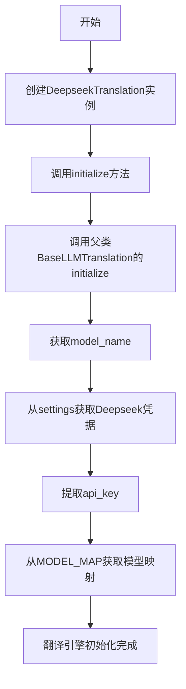
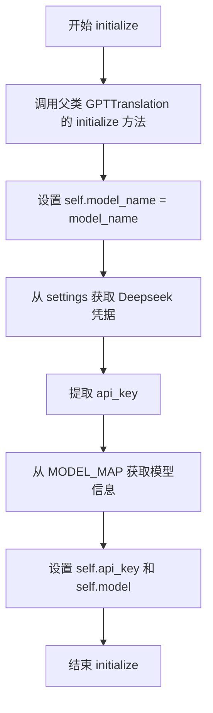
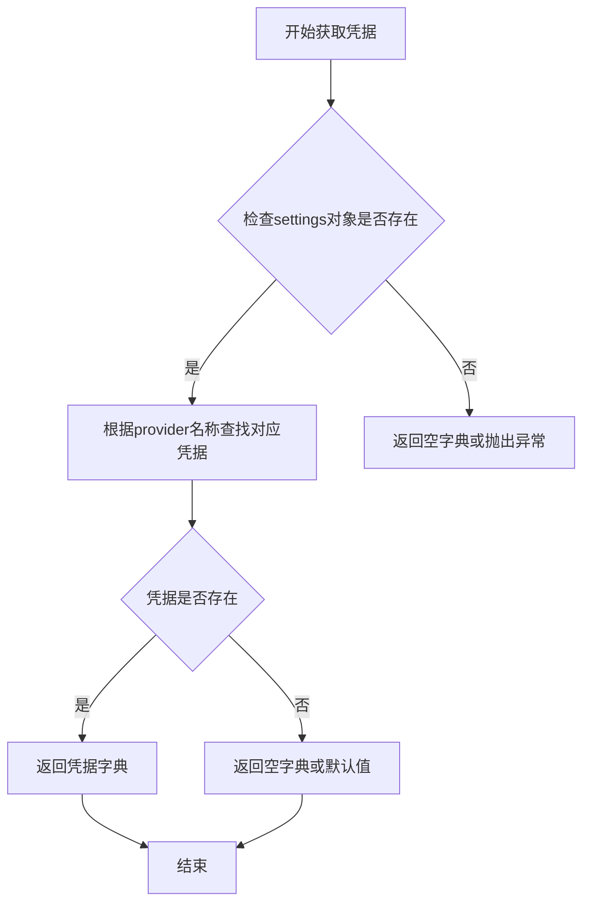
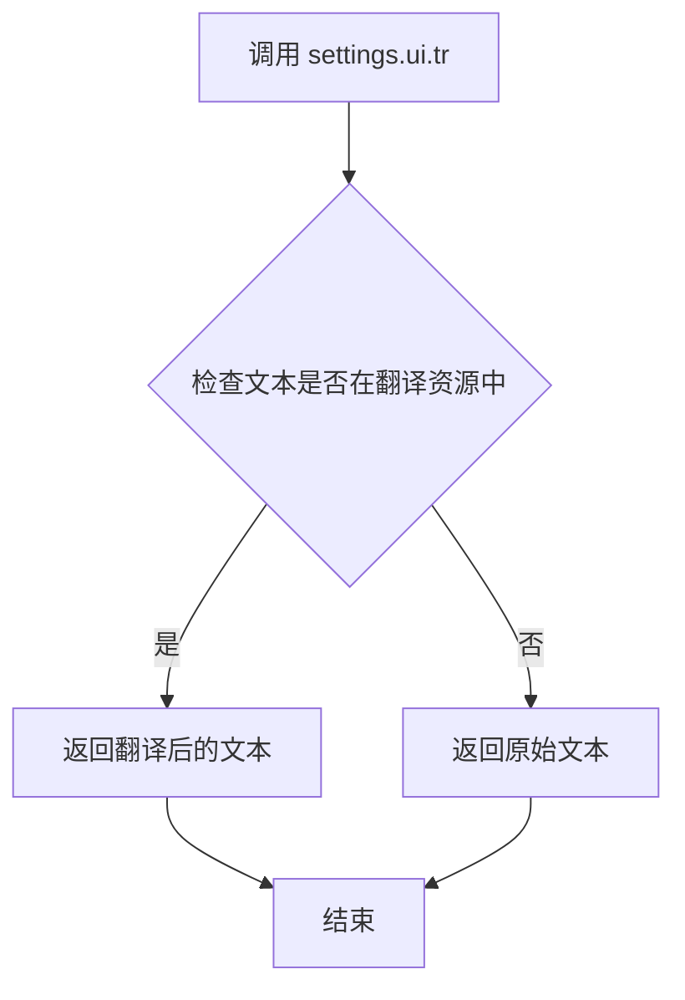
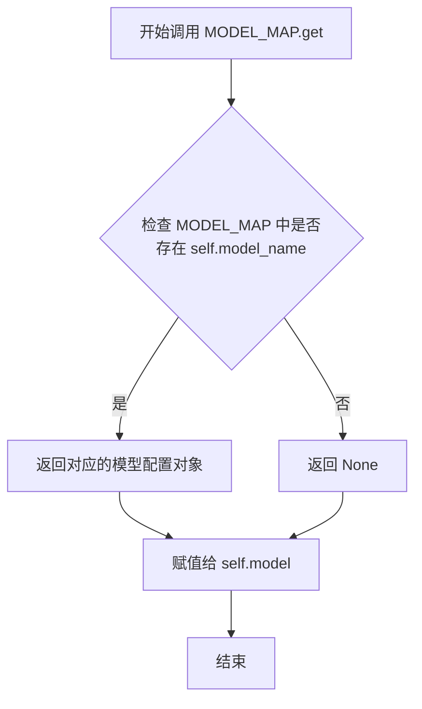
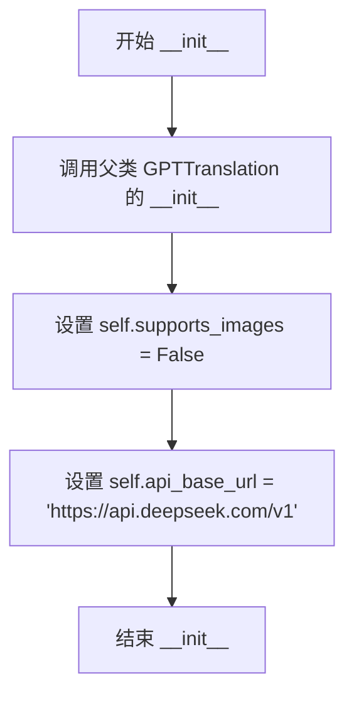
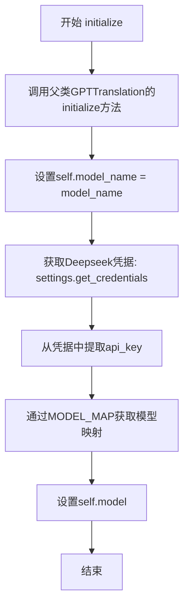

# `comic-translate\modules\translation\llm\deepseek.py` 详细设计文档

DeepseekTranslation是一个翻译引擎实现类，继承自GPTTranslation，通过OpenAI兼容的API调用Deepseek模型进行翻译，支持多语言翻译场景。

## 整体流程



## 类结构

```
Translation (基类)
├── BaseLLMTranslation (LLM翻译基类)
│   └── GPTTranslation (GPT翻译类)
│       └── DeepseekTranslation (Deepseek翻译类)
```

## 全局变量及字段


### `MODEL_MAP`
    
模型名称映射字典，用于将模型名称映射到具体的模型对象

类型：`dict`
    


### `settings`
    
设置对象，包含应用程序的配置信息和凭据

类型：`Any`
    


### `source_lang`
    
源语言，表示需要翻译的原始语言

类型：`str`
    


### `target_lang`
    
目标语言，表示翻译后的目标语言

类型：`str`
    


### `model_name`
    
模型名称，指定使用的Deepseek模型标识符

类型：`str`
    


### `credentials`
    
API凭据字典，存储Deepseek API的认证信息

类型：`dict`
    


### `kwargs`
    
额外关键字参数，用于传递可选的配置选项

类型：`dict`
    


### `DeepseekTranslation.supports_images`
    
是否支持图像翻译，Deepseek当前不支持图像翻译功能

类型：`bool`
    


### `DeepseekTranslation.api_base_url`
    
Deepseek API端点地址，默认为https://api.deepseek.com/v1

类型：`str`
    


### `DeepseekTranslation.model_name`
    
使用的模型名称，指定具体的Deepseek模型

类型：`str`
    


### `DeepseekTranslation.api_key`
    
API密钥，用于认证Deepseek API请求

类型：`str`
    


### `DeepseekTranslation.model`
    
模型映射对象，从MODEL_MAP获取的模型实例

类型：`Any`
    
    

## 全局函数及方法


### `DeepseekTranslation.initialize`

该方法用于初始化 Deepseek 翻译引擎，设置模型名称、API 密钥等配置信息，使其能够与 Deepseek API 进行交互以完成翻译任务。

参数：

- `settings`：`Any`，设置对象，包含凭据信息
- `source_lang`：`str`，源语言名称
- `target_lang`：`str`，目标语言名称
- `model_name`：`str`，Deepseek 模型名称
- `**kwargs`：可选关键字参数

返回值：`None`，无返回值

#### 流程图



#### 带注释源码

```python
def initialize(self, settings: Any, source_lang: str, target_lang: str, model_name: str, **kwargs) -> None:
    """
    Initialize Deepseek translation engine.
    
    Args:
        settings: Settings object with credentials
        source_lang: Source language name
        target_lang: Target language name
        model_name: Deepseek model name
    """
    # 调用 BaseLLMTranslation 的 initialize 方法（跳过 GPTTranslation 直接调用父类）
    super(GPTTranslation, self).initialize(settings, source_lang, target_lang, **kwargs)
    
    # 设置模型名称实例变量
    self.model_name = model_name
    
    # 从设置中获取 Deepseek 凭据
    credentials = settings.get_credentials(settings.ui.tr('Deepseek'))
    
    # 提取 API 密钥，若不存在则为空字符串
    self.api_key = credentials.get('api_key', '')
    
    # 从模型映射表中获取对应的模型信息
    self.model = MODEL_MAP.get(self.model_name)
```


### `super - 调用父类方法`

在 `DeepseekTranslation` 类的 `initialize` 方法中，通过 `super(GPTTranslation, self).initialize()` 调用了祖父类 `BaseLLMTranslation` 的 `initialize` 方法，用于初始化底层翻译引擎的通用配置。

参数：

- `settings`：`Any`，设置对象，包含凭据信息
- `source_lang`：`str`，源语言名称
- `target_lang`：`str`，目标语言名称
- `**kwargs`：可变关键字参数，其他初始化参数

返回值：`None`，无返回值

#### 流程图

```mermaid
flowchart TD
    A[DeepseekTranslation.initialize 调用] --> B[super(GPTTranslation, self)]
    B --> C[跳过GPTTranslation 调用BaseLLMTranslation.initialize]
    C --> D[传入 settings, source_lang, target_lang, **kwargs]
    D --> E[BaseLLMTranslation.initialize 执行]
    E --> F[返回 None]
    F --> G[继续执行 DeepseekTranslation 特有初始化逻辑]
```

#### 带注释源码

```python
super(GPTTranslation, self).initialize(settings, source_lang, target_lang, **kwargs)
# super(GPTTranslation, self) 表示跳过直接父类 GPTTranslation，
# 调用祖父类 BaseLLMTranslation 的 initialize 方法
# 这是为了避免重复执行 GPTTranslation 中的 initialize 逻辑，
# 直接使用更底层的 BaseLLMTranslation 初始化
#
# 参数说明：
# - settings: 包含凭据的配置对象
# - source_lang: 源语言代码
# - target_lang: 目标语言代码
# - **kwargs: 传递给父类的其他可选参数
#
# 返回值：None
```


### `settings.get_credentials`

获取指定服务提供商的凭据信息，用于身份验证和API访问。

参数：

- `provider`：`str`，服务提供商名称（如"Deepseek"），用于定位对应的凭据

返回值：`dict`，包含凭据信息的字典，通常包含 `api_key` 等认证信息

#### 流程图



#### 带注释源码

```python
# 从settings对象获取指定提供商的凭据
# provider参数：服务提供商名称，通过settings.ui.tr('Deepseek')获取本地化字符串
credentials = settings.get_credentials(settings.ui.tr('Deepseek'))

# 返回的credentials是一个字典，包含了该服务商的认证信息
# 常用键值包括：
# - 'api_key': API访问密钥
# - 'api_base_url': API端点地址（可选）
# - 其他可能的认证信息

# 从凭据字典中提取api_key，如果不存在则返回空字符串
self.api_key = credentials.get('api_key', '')
```


### `settings.ui.tr`

该方法用于将UI文本标记为需要翻译的文本，是国际化（i18n）处理的一部分。通过此方法，应用程序可以将用户界面中显示的字符串提取为翻译资源，以便后续进行多语言支持。

参数：

- `text`：`str`，需要进行翻译的UI文本内容

返回值：`str`，返回翻译后的文本内容（如果存在对应翻译则返回翻译文本，否则返回原文本）

#### 流程图



#### 带注释源码

```
# 在 DeepseekTranslation 类的 initialize 方法中调用
# settings: 设置对象，包含认证信息
# ui: 设置对象的UI组件，负责处理界面文本翻译
# tr: UI组件的翻译方法，接收文本并返回翻译结果

# 获取 Deepseek 的认证信息
# settings.ui.tr('Deepseek') 用于将 'Deepseek' 标记为需要翻译的文本
# 如果当前语言环境有对应的翻译资源，则返回翻译后的文本
# 否则返回原始文本 'Deepseek'
credentials = settings.get_credentials(settings.ui.tr('Deepseek'))
```


### `MODEL_MAP.get`

获取模型映射字典中指定模型名称对应的模型配置信息。

参数：

- `self.model_name`：`str`，要查找的 Deepseek 模型名称（如 `"deepseek-chat"`）

返回值：`Any`，返回模型映射表中对应的模型配置对象，如果键不存在则返回 `None`

#### 流程图



#### 带注释源码

```python
# 从 translator_utils 模块导入 MODEL_MAP 字典
# MODEL_MAP 是一个映射表，键为模型名称字符串，值为模型配置对象
from ...utils.translator_utils import MODEL_MAP

class DeepseekTranslation(GPTTranslation):
    # ... 类定义部分 ...
    
    def initialize(self, settings: Any, source_lang: str, target_lang: str, model_name: str, **kwargs) -> None:
        # ... 其他初始化代码 ...
        
        self.model_name = model_name  # 保存模型名称
        
        # 从 settings 获取 Deepseek 的凭据（API Key）
        credentials = settings.get_credentials(settings.ui.tr('Deepseek'))
        self.api_key = credentials.get('api_key', '')
        
        # ============================================================
        # MODEL_MAP.get 方法调用
        # ============================================================
        # 用途：根据 model_name 在 MODEL_MAP 字典中查找对应的模型配置
        # 参数：self.model_name - 传入的模型名称作为键
        # 返回：如果键存在返回对应的模型配置对象，否则返回 None
        # 用途说明：用于将用户指定的模型名称映射为具体的模型配置对象，
        #          以便后续翻译请求使用正确的模型参数
        self.model = MODEL_MAP.get(self.model_name)
        # ============================================================
```


### `DeepseekTranslation.__init__`

初始化 Deepseek 翻译引擎实例，设置基础配置和 API 端点。该方法继承自 GPTTranslation 父类，并配置 Deepseek 特定的属性，包括不支持图片翻译和设置 Deepseek API 的基础 URL。

参数：

- `self`：实例本身，自动传递，无显式类型标注，表示当前 DeepseekTranslation 类的实例对象

返回值：`None`，无返回值，仅执行实例初始化逻辑

#### 流程图



#### 带注释源码

```python
def __init__(self):
    """
    初始化 Deepseek 翻译引擎实例。
    
    创建 DeepseekTranslation 类的实例，继承父类 GPTTranslation 的基本翻译能力，
    并配置 Deepseek 特有的 API 端点和功能特性。
    """
    # 调用父类 GPTTranslation 的 __init__ 方法
    # 初始化父类中定义的基础翻译功能、模型配置等
    super().__init__()
    
    # 设置该翻译引擎不支持图片翻译功能
    # Deepseek 当前版本仅支持文本翻译
    self.supports_images = False
    
    # 配置 Deepseek API 的基础 URL
    # 使用 OpenAI 兼容的 API 端点格式
    self.api_base_url = "https://api.deepseek.com/v1"
```


### `DeepseekTranslation.initialize`

初始化 Deepseek 翻译引擎的配置和凭据，从设置中获取 API 密钥并映射模型。

参数：

- `settings`：`Any`，设置对象，包含凭据信息
- `source_lang`：`str`，源语言名称
- `target_lang`：`str`，目标语言名称
- `model_name`：`str`，Deepseek 模型名称
- `**kwargs`：可变关键字参数

返回值：`None`，无返回值

#### 流程图



#### 带注释源码

```python
def initialize(self, settings: Any, source_lang: str, target_lang: str, model_name: str, **kwargs) -> None:
    """
    Initialize Deepseek translation engine.
    
    Args:
        settings: Settings object with credentials
        source_lang: Source language name
        target_lang: Target language name
        model_name: Deepseek model name
    """
    # 调用父类 GPTTranslation 的 initialize 方法
    # 使用 super(GPTTranslation, self) 跳过直接父类调用祖父类
    super(GPTTranslation, self).initialize(settings, source_lang, target_lang, **kwargs)
    
    # 设置模型名称
    self.model_name = model_name
    
    # 获取 Deepseek 的凭据信息
    credentials = settings.get_credentials(settings.ui.tr('Deepseek'))
    
    # 从凭据中提取 API 密钥，默认值为空字符串
    self.api_key = credentials.get('api_key', '')
    
    # 通过 MODEL_MAP 获取模型对象
    self.model = MODEL_MAP.get(self.model_name)
```

## 关键组件


### DeepseekTranslation 类

基于 GPT 翻译引擎的 Deepseek 模型翻译实现类，通过 OpenAI 兼容 API 调用 Deepseek 模型进行翻译，支持配置化的模型选择和凭据管理。

### initialize 方法

负责初始化 Deepseek 翻译引擎的核心方法，接收设置对象、源语言、目标语言和模型名称，调用父类初始化逻辑并从设置中获取 Deepseek API 凭据。

### supports_images 字段

类型: bool，描述: 标识该翻译引擎不支持图像翻译功能

### api_base_url 字段

类型: str，描述: Deepseek API 端点 URL，默认为 https://api.deepseek.com/v1

### model_name 字段

类型: str，描述: 存储要使用的 Deepseek 模型名称

### api_key 字段

类型: str，描述: 存储从设置中获取的 Deepseek API 密钥

### model 字段

类型: Any，描述: 存储从 MODEL_MAP 中映射获取的实际模型对象

### MODEL_MAP 全局变量

从 utils.translator_utils 导入的模型映射字典，用于将模型名称字符串映射到实际的模型对象


## 问题及建议


### 已知问题

-   **父类initialize调用方式不规范**：`super(GPTTranslation, self).initialize(...)` 使用了Python 2风格的super()调用方式，且调用的是GPTTranslation的父类而非GPTTranslation本身，应改为`super().initialize(...)`或`super(GPTTranslation, self).initialize(...)`
-   **API地址硬编码**：`api_base_url = "https://api.deepseek.com/v1"` 硬编码在类中，缺乏灵活性，若API地址变更需修改源码
-   **model_name未做有效性验证**：直接使用`MODEL_MAP.get(self.model_name)`获取模型，若model_name不存在会返回None，后续调用可能产生空指针异常
-   **credentials获取缺乏空值处理**：`settings.get_credentials()`可能返回None或credentials为None时，调用`.get()`方法会抛出AttributeError
-   **缺乏参数校验**：source_lang、target_lang、model_name等关键参数未做合法性校验
-   **类型注解过于宽泛**：settings参数使用`Any`类型，降低了类型安全性和代码可维护性
-   **初始化结果无返回状态**：initialize方法无返回值，调用方无法判断初始化是否成功

### 优化建议

-   统一super()调用方式，使用`super().initialize(...)`正确调用直接父类
-   将API地址改为可配置项，通过settings或构造函数传入
-   添加model_name存在性校验，若不存在抛出明确异常或使用默认值
-   增加credentials的空值检查和异常处理，确保API key获取失败时有明确提示
-   为initialize方法添加参数校验逻辑，验证语言代码和模型名称的有效性
-   使用具体类型替代Any（如Protocol或TypedDict定义settings类型）
-   考虑让initialize方法返回布尔值或抛出异常，以便调用方感知初始化状态

## 其它


### 设计目标与约束

本模块旨在为Deepseek翻译引擎提供统一集成接口，支持通过OpenAI兼容API调用Deepseek模型进行翻译任务。设计约束包括：仅支持文本翻译（不支持图片），依赖外部Deepseek API服务，API密钥通过配置中心统一管理，模型名称必须存在于MODEL_MAP映射中。

### 错误处理与异常设计

本类未实现显式的错误处理机制，错误处理依赖于父类GPTTranslation和BaseLLMTranslation的实现。建议在initialize方法中添加以下异常处理：API连接超时异常、认证失败异常（api_key为空或无效）、模型不存在异常（model_name不在MODEL_MAP中）、网络请求异常。异常应向上层抛出，由调用方统一处理。

### 数据流与状态机

数据流如下：调用方传入settings、source_lang、target_lang、model_name → initialize方法提取凭据和模型映射 → 设置api_base_url、api_key、model等属性 → 准备就绪供translate方法调用。状态机包含：初始化状态（__init__）→ 配置状态（initialize完成）→ 就绪状态 → 使用状态（翻译进行中）→ 完成状态。

### 外部依赖与接口契约

外部依赖包括：父类GPTTranslation提供翻译核心逻辑，MODEL_MAP字典提供模型名称到模型标识的映射，settings对象提供凭据管理接口（get_credentials方法）。接口契约要求：settings.get_credentials()必须返回包含api_key的字典，model_name必须存在于MODEL_MAP中，initialize完成后self.api_key、self.model_name、self.model属性必须被正确赋值。

### 配置说明

本类配置项包括：api_base_url固定为"https://api.deepseek.com/v1"，supports_images固定为False，model_name由调用方传入必须为MODEL_MAP中的有效键，api_key从settings中获取Deepseek对应的凭据。

### 安全性考虑

API密钥以明文形式存储在self.api_key属性中，建议：不在日志中打印api_key，内存中使用后及时清理，考虑使用密钥轮换机制，确保settings.get_credentials的调用链路安全。

### 性能考虑

当前实现为同步初始化，性能优化空间：对于批量翻译场景，可考虑预热API连接；MODEL_MAP查询时间复杂度为O(1)已优化；api_base_url固定可考虑缓存。

### 使用示例

```python
# 创建实例
translator = DeepseekTranslation()

# 初始化
translator.initialize(
    settings=settings_instance,
    source_lang="English",
    target_lang="Chinese",
    model_name="deepseek-chat"
)

# 翻译文本（如父类提供）
result = translator.translate("Hello world")
```

    