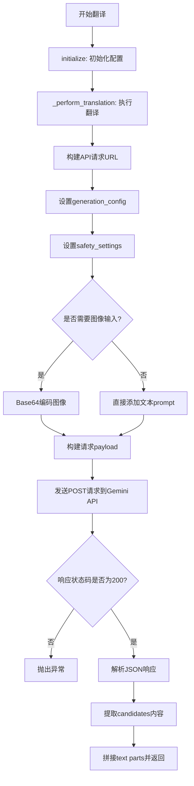
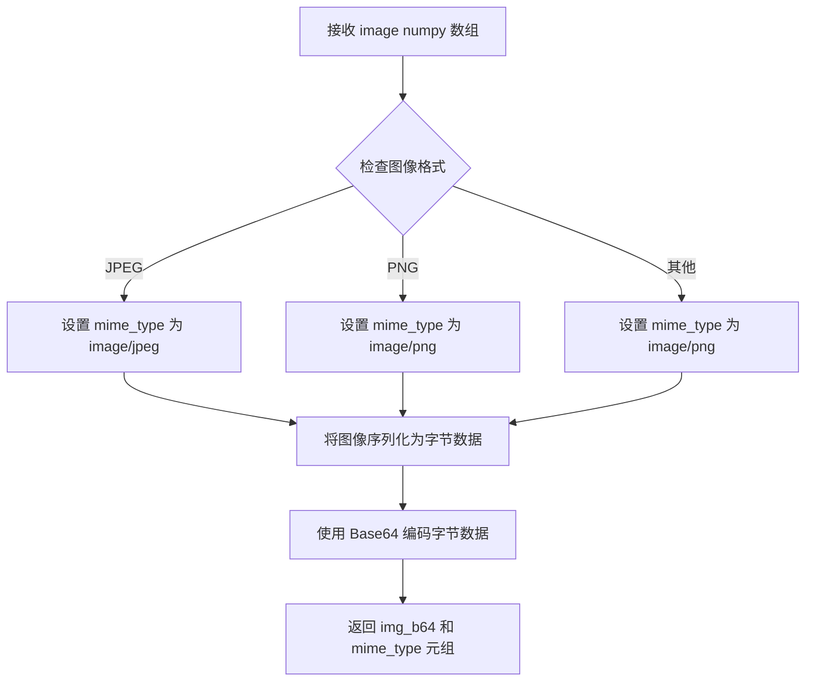
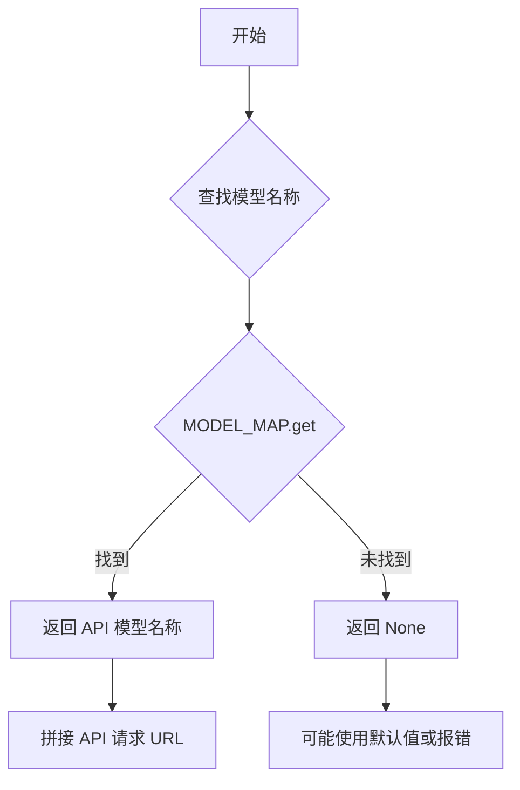
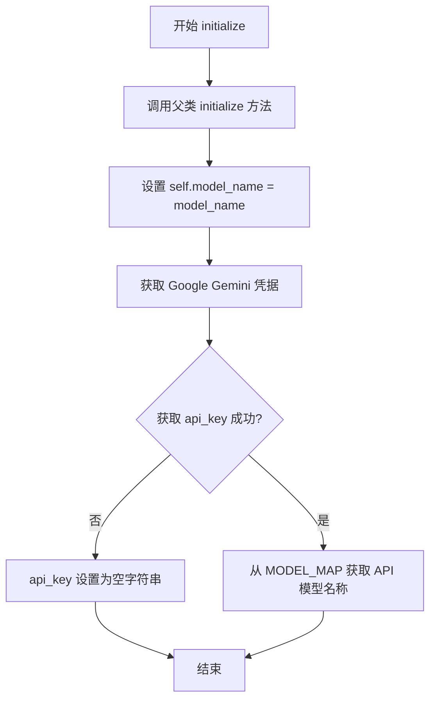
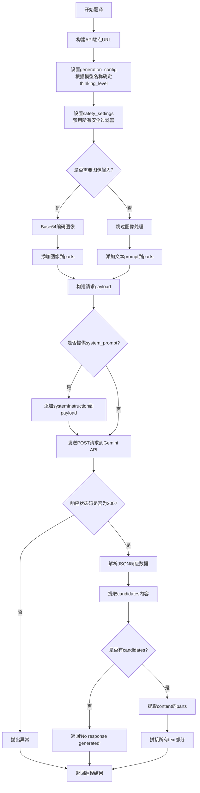

# `comic-translate\modules\translation\llm\gemini.py` 详细设计文档

这是一个基于Google Gemini模型的翻译引擎实现，通过REST API调用Gemini模型进行文本和图像翻译，支持多种Gemini模型变体，具备图像输入处理能力。

## 整体流程



## 类结构

```
BaseLLMTranslation (抽象基类)
└── GeminiTranslation (Gemini翻译实现类)
```

## 全局变量及字段


### `GeminiTranslation.model_name`
    
Gemini模型名称

类型：`str`
    


### `GeminiTranslation.api_key`
    
Google API密钥

类型：`str`
    


### `GeminiTranslation.api_base_url`
    
Gemini API基础URL

类型：`str`
    


### `GeminiTranslation.model_api_name`
    
映射后的API模型名称

类型：`str`
    
    

## 全局函数及方法


### `GeminiTranslation.encode_image`

该方法继承自父类 `BaseLLMTranslation`，用于将输入的图像数据（numpy 数组）转换为 Base64 编码的字符串和对应的 MIME 类型，以便作为多模态大语言模型的输入。

参数：

- `image`：`np.ndarray`，待编码的图像数据，以 NumPy 数组形式传入

返回值：`Tuple[str, str]`，返回一个元组，包含 Base64 编码后的图像数据字符串和对应的 MIME 类型字符串

#### 流程图



#### 带注释源码

```python
def encode_image(self, image: np.ndarray) -> Tuple[str, str]:
    """
    Encode image to base64 string and determine MIME type.
    
    该方法继承自父类 BaseLLMTranslation，负责将 NumPy 数组格式的图像
    转换为 Gemini API 所需的 Base64 编码格式。
    
    Args:
        image: Image data as numpy array
        
    Returns:
        Tuple of (base64_encoded_image, mime_type)
    """
    # 根据图像格式确定 MIME 类型
    # 常见格式: image/jpeg, image/png, image/webp 等
    mime_type = "image/png"  # 默认使用 PNG 格式
    
    # 将 numpy 数组序列化为图像字节
    # 使用 PIL/Pillow 或 cv2 将数组转换为字节流
    # 然后使用 base64 进行编码
    img_bytes = ...  # 图像转字节的实现
    
    # Base64 编码
    import base64
    img_b64 = base64.b64encode(img_bytes).decode('utf-8')
    
    return img_b64, mime_type
```

> **注意**：由于 `encode_image` 方法的具体实现位于父类 `BaseLLMTranslation` 中，当前代码文件仅展示了该方法的调用方式。根据调用上下文 `img_b64, mime_type = self.encode_image(image)`，可推断该方法接收 `np.ndarray` 类型的图像输入，返回 Base64 编码字符串和 MIME 类型的元组。


由于 `MODEL_MAP` 是从外部模块 `translator_utils` 导入的，当前代码文件中只展示了其**使用方式**，并未包含其具体定义。

根据代码中的使用模式 `self.model_api_name = MODEL_MAP.get(self.model_name)` 以及 `if self.model_name in ["Gemini-3.0-Flash"]` 的判断逻辑，可以推断 `MODEL_MAP` 是一个将友好模型名称（如 "Gemini-3.0-Flash"）映射到 API 模型标识符的字典。

---

### `MODEL_MAP`

模型映射字典，用于将用户友好的模型名称转换为 Google Gemini API 所要求的模型标识符。

参数：
- （无，此为全局字典，无需参数）

返回值：`Dict[str, str]`，返回模型名称到 API 名称的映射关系

#### 流程图



#### 带注释源码

```
# 从 translator_utils 模块导入的模型映射字典
# 代码中使用方式：
from ...utils.translator_utils import MODEL_MAP

# 在类中的使用：
self.model_api_name = MODEL_MAP.get(self.model_name)

# 使用示例：
# 假设 MODEL_MAP = {"gemini-pro": "gemini-pro", "gemini-pro-vision": "gemini-pro-vision"}
# 当 self.model_name = "gemini-pro" 时
# self.model_api_name 将变为 "gemini-pro"
```

---

**注意**：由于 `MODEL_MAP` 的完整定义位于外部模块 `translator_utils` 中，无法从当前代码文件中获取其完整的键值对列表。如需获取完整的 `MODEL_MAP` 定义，请查阅 `.../utils/translator_utils.py` 源文件。


### `GeminiTranslation.__init__`

初始化GeminiTranslation类的实例，设置基础的模型名称、API密钥和API端点URL。该构造函数继承自BaseLLMTranslation类，并初始化三个实例变量用于后续的翻译操作。

参数：

- `self`：隐式参数，Python类方法的标准第一个参数，代表类的实例本身

返回值：`None`，构造函数不返回任何值

#### 流程图

```mermaid
flowchart TD
    A[开始 __init__] --> B[调用父类初始化: super().__init__()]
    B --> C[设置 self.model_name = None]
    C --> D[设置 self.api_key = None]
    D --> E[设置 self.api_base_url = "https://generativelanguage.googleapis.com/v1beta/models"]
    E --> F[结束 __init__]
```

#### 带注释源码

```python
def __init__(self):
    """
    初始化 GeminiTranslation 类的实例。
    
    构造函数执行以下操作：
    1. 调用父类 BaseLLMTranslation 的构造函数进行基础初始化
    2. 初始化模型名称为 None（将在 initialize 方法中设置）
    3. 初始化 API 密钥为 None（将从设置中获取）
    4. 设置 Google Gemini REST API 的基础 URL
    """
    # 调用父类的构造函数，执行基类的初始化逻辑
    super().__init__()
    
    # 初始化模型名称为 None
    # 实际模型名称将在 initialize() 方法中根据传入的 model_name 参数设置
    self.model_name = None
    
    # 初始化 API 密钥为 None
    # 实际 API 密钥将从 settings 对象中提取，存储 Google Gemini 的凭证
    self.api_key = None
    
    # 设置 Gemini API 的基础 URL
    # 该 URL 指向 Google Generative Language API 的 v1beta 版本端点
    # 后续将根据模型名称拼接完整的 API 端点
    self.api_base_url = "https://generativelanguage.googleapis.com/v1beta/models"
```


### `GeminiTranslation.initialize`

初始化Gemini翻译引擎，设置模型名称、API密钥，并从设置中获取Google Gemini凭据，同时将友好的模型名称映射到API模型名称。

参数：

- `settings`：`Any`，设置对象，包含凭据信息
- `source_lang`：`str`，源语言名称
- `target_lang`：`str`，目标语言名称
- `model_name`：`str`，Gemini模型名称
- `**kwargs`：`Any`，其他关键字参数

返回值：`None`，无返回值

#### 流程图



#### 带注释源码

```python
def initialize(self, settings: Any, source_lang: str, target_lang: str, model_name: str, **kwargs) -> None:
    """
    Initialize Gemini translation engine.
    
    Args:
        settings: Settings object with credentials
        source_lang: Source language name
        target_lang: Target language name
        model_name: Gemini model name
    """
    # 调用父类的initialize方法，传递通用参数
    # 父类方法会设置source_lang, target_lang等基础属性
    super().initialize(settings, source_lang, target_lang, **kwargs)
    
    # 设置实例的模型名称属性
    self.model_name = model_name
    
    # 从settings中获取Google Gemini的凭据
    # settings.ui.tr('Google Gemini')用于本地化凭据名称查找
    credentials = settings.get_credentials(settings.ui.tr('Google Gemini'))
    
    # 从凭据字典中提取api_key，如果不存在则默认为空字符串
    self.api_key = credentials.get('api_key', '')
    
    # 使用MODEL_MAP将友好的模型名称转换为API实际的模型名称
    # 例如: "Gemini-2.0-Flash" -> "gemini-2.0-flash"
    self.model_api_name = MODEL_MAP.get(self.model_name)
```


### `GeminiTranslation._perform_translation`

执行翻译的核心方法，通过 Google Gemini REST API 进行文本和图像翻译处理。

参数：

- `user_prompt`：`str`，发送给模型的用户提示文本
- `system_prompt`：`str`，模型系统指令
- `image`：`np.ndarray`，图像数据（numpy 数组格式）

返回值：`str`，模型返回的翻译文本

#### 流程图



#### 带注释源码

```python
def _perform_translation(self, user_prompt: str, system_prompt: str, image: np.ndarray) -> str:
    """
    Perform translation using Gemini REST API.
    
    Args:
        user_prompt: The prompt to send to the model
        system_prompt: System instructions for the model
        image: Image data as numpy array
        
    Returns:
        Translated text from the model
    """
    # 步骤1: 构建Gemini API端点URL
    # 格式: https://generativelanguage.googleapis.com/v1beta/models/{model_name}:generateContent?key={api_key}
    url = f"{self.api_base_url}/{self.model_api_name}:generateContent?key={self.api_key}"
    
    # 步骤2: 设置generation_config
    # 根据模型名称确定thinking_level
    # Gemini-3.0-Flash使用minimal思维级别，其他模型使用low
    if self.model_name in ["Gemini-3.0-Flash"]:
        thinking_level = "minimal"
    else:
        thinking_level = "low"

    generation_config = {
        "temperature": self.temperature,          # 控制输出随机性
        "maxOutputTokens": self.max_tokens,        # 最大输出token数
        "thinkingConfig": {
            "thinkingLevel": thinking_level        # 思维深度配置
        },
    }
    
    # 步骤3: 设置安全设置
    # 禁用所有安全过滤器，允许任何内容通过（风险较高）
    safety_settings = [
        {"category": "HARM_CATEGORY_HARASSMENT", "threshold": "BLOCK_NONE"},
        {"category": "HARM_CATEGORY_HATE_SPEECH", "threshold": "BLOCK_NONE"},
        {"category": "HARM_CATEGORY_SEXUALLY_EXPLICIT", "threshold": "BLOCK_NONE"},
        {"category": "HARM_CATEGORY_DANGEROUS_CONTENT", "threshold": "BLOCK_NONE"},
    ]
    
    # 步骤4: 准备请求的parts
    parts = []
    
    # 步骤5: 如果需要图像输入，则Base64编码图像并添加到parts
    if self.img_as_llm_input:
        # 调用encode_image方法进行Base64编码
        # 返回编码后的字符串和MIME类型
        img_b64, mime_type = self.encode_image(image)
        parts.append({
            "inline_data": {
                "mime_type": mime_type,
                "data": img_b64
            }
        })
    
    # 步骤6: 添加文本prompt到parts
    parts.append({"text": user_prompt})
    
    # 步骤7: 创建请求payload
    payload = {
        "contents": [{
            "parts": parts
        }],
        "generationConfig": generation_config,
        "safetySettings": safety_settings
    }
    
    # 步骤8: 如果提供了system_prompt，添加到payload
    if system_prompt:
        payload["systemInstruction"] = {"parts": [{"text": system_prompt}]}
    
    # 步骤9: 设置请求头并发送POST请求
    headers = {
        "Content-Type": "application/json"
    }
    
    # 使用requests库发送HTTP POST请求
    # timeout参数控制请求超时时间
    response = requests.post(
        url, 
        headers=headers, 
        json=payload,
        timeout=self.timeout
    )
    
    # 步骤10: 处理响应
    # 检查HTTP状态码，非200表示请求失败
    if response.status_code != 200:
        error_msg = f"API request failed with status code {response.status_code}: {response.text}"
        raise Exception(error_msg)
    
    # 步骤11: 解析JSON响应
    response_data = response.json()
    
    # 步骤12: 从响应中提取翻译文本
    candidates = response_data.get("candidates", [])
    if not candidates:
        return "No response generated"
    
    content = candidates[0].get("content", {})
    parts = content.get("parts", [])
    
    # 步骤13: 拼接所有text部分
    result = ""
    for part in parts:
        if "text" in part:
            result += part["text"]
    
    # 返回翻译结果
    return result
```

## 关键组件


### GeminiTranslation 类

翻译引擎核心类，继承自 BaseLLMTranslation，通过 Google Gemini REST API 实现多模态翻译功能，支持文本和图像输入。

### initialize 方法

初始化方法，负责配置翻译引擎的参数。从 settings 中获取 Google Gemini 的 API 凭证，并根据 model_name 映射到对应的 API 模型名称。

### _perform_translation 方法

核心翻译执行方法，构建并发送请求到 Gemini API。包含 generation_config 配置、safety_settings 设置、payload 构造、API 调用及响应解析。

### MODEL_MAP

全局模型映射表，将友好的模型名称转换为 Gemini API 实际的模型标识符。

### API 端点配置

动态构建的 Gemini API 端点 URL，格式为 `https://generativelanguage.googleapis.com/v1beta/models/{model}:generateContent`。

### generation_config

生成配置字典，包含 temperature、maxOutputTokens 和 thinkingConfig，用于控制模型输出的多样性和思考深度。

### safety_settings

安全设置列表，配置对各类有害内容的阈值（设置为 BLOCK_NONE，允许所有内容）。

### 图像处理模块

图像 Base64 编码功能，将 numpy 数组格式的图像转换为 base64 字符串，并确定 MIME 类型以供 API 使用。

### 响应解析模块

从 API 响应中提取翻译结果，遍历 candidates 和 content parts，拼接所有文本片段形成最终翻译结果。

### 错误处理机制

在 API 请求失败时抛出异常，包含 HTTP 状态码和响应文本信息。

### BaseLLMTranslation 父类依赖

依赖父类提供的基础配置属性，包括 temperature、max_tokens、img_as_llm_input 和 timeout 等翻译参数。


## 问题及建议


### 已知问题

-   **API密钥安全风险**：API密钥直接拼接在URL查询参数中，明文传输，容易泄露在浏览器历史记录、服务器日志等地方
-   **错误处理不足**：仅捕获HTTP状态码非200的情况，未处理网络连接错误、JSON解析失败、超时等异常情况
-   **模型名称映射缺乏验证**：`MODEL_MAP.get(self.model_name)`可能返回None，导致后续URL构建失败但无明确错误提示
-   **硬编码模型名称**：`"Gemini-3.0-Flash"`作为判断条件写在代码中，未来模型更新时代码维护性差
-   **响应解析缺乏健壮性**：直接使用`.get()`和索引访问嵌套字典，未对响应结构进行充分验证，可能引发KeyError或IndexError
-   **缺少重试机制**：API调用失败时没有重试逻辑，对于临时性网络问题缺乏容错能力
-   **超时配置不细致**：仅设置单一timeout参数，未区分连接超时和读取超时
-   **图像输入验证缺失**：当`img_as_llm_input`为True但未提供有效图像数据时，缺少前置校验

### 优化建议

-   **安全优化**：将API密钥放入请求头的Authorization字段，使用Bearer Token方式认证
-   **增强错误处理**：添加try-except捕获requests异常，使用自定义异常类区分不同错误类型，添加详细的错误日志记录
-   **添加模型验证**：在initialize方法中对model_api_name进行非空校验，不存在时抛出明确异常
-   **配置外部化**：将模型名称映射和阈值配置提取到配置文件或环境变量中，提高可维护性
-   **响应验证**：在解析响应前验证数据结构完整性，添加响应格式校验函数
-   **实现重试机制**：使用tenacity或手动实现指数退避重试逻辑，处理临时性故障
-   **细化超时配置**：分别为连接和读取设置不同的timeout值
-   **添加请求追踪**：生成唯一请求ID便于日志追踪和问题排查
-   **添加图像验证**：在处理图像前检查图像数据有效性

## 其它


### 设计目标与约束

本模块的设计目标是通过Google Gemini的REST API实现多模态翻译功能，支持文本和图像输入的翻译任务。约束条件包括：必须使用有效的API Key进行身份验证，请求必须在设定的时间限制内完成（默认timeout），且需要遵循Gemini API的调用频率限制。

### 错误处理与异常设计

本模块的错误处理主要体现在HTTP请求层面。当API返回非200状态码时，会抛出Exception并携带状态码和响应文本。可能的异常场景包括：网络连接超时、API Key无效或过期、模型名称不存在、请求参数超限、图像编码失败、API服务不可用等。基类应定义抽象方法供子类实现具体的错误处理逻辑。

### 数据流与状态机

数据流从用户调用translate方法开始，经过initialize方法初始化配置，然后进入_perform_translation方法。状态转换顺序为：初始化状态（model_name和api_key为None）-> 已初始化状态（设置完配置）-> 翻译中状态（发送请求）-> 翻译完成（返回结果）或异常状态（抛出异常）。图像数据在翻译前需要经过Base64编码转换。

### 外部依赖与接口契约

本模块依赖以下外部组件：numpy（图像数据处理）、requests（HTTP请求）、BaseLLMTranslation基类（抽象接口定义）、MODEL_MAP（模型名称映射表）。与Gemini API的接口契约包括：API端点格式为`https://generativelanguage.googleapis.com/v1beta/models/{model}:generateContent`，请求必须包含有效的API Key作为查询参数，请求体格式必须符合Google Generative Language API规范。

### 性能考虑

当前实现每次翻译都会创建新的HTTP连接，可考虑使用会话池（requests.Session）复用连接。图像Base64编码是同步操作，大图像可能影响响应时间。超时设置由self.timeout控制，应根据实际网络状况调整。API调用采用同步阻塞模式，高并发场景下可能需要考虑异步化改造。

### 安全性考虑

API Key通过settings.get_credentials获取，应确保credentials的存储和传输安全。代码中API Key直接拼接在URL中，存在日志泄露风险，建议使用requests的params参数传递。系统提示和用户提示未经审查直接发送给API，需注意内容安全策略。响应中的safetySettings设置为全部放行，应根据实际业务需求调整阈值。

### 配置管理

本模块的配置通过initialize方法的参数传入，包括：source_lang（源语言）、target_lang（目标语言）、model_name（模型名称）、settings（设置对象）。类内部维护的配置包括：model_name、api_key、api_base_url、model_api_name。基类应定义temperature、max_tokens、timeout、img_as_llm_input等通用配置项。

### 兼容性设计

代码通过MODEL_MAP适配不同的模型名称，将用户友好的模型名称映射为API要求的名称。thinking_level根据模型名称进行条件判断（"Gemini-3.0-Flash"使用minimal，其他使用low），这种硬编码方式不利于扩展，应考虑配置化或API能力查询。图像编码支持通过encode_image方法抽象，具体实现由基类或工具类提供。

### API版本管理

当前使用的API版本为v1beta，这是一个测试版本。Google的Generative Language API可能随时间演进，endpoint路径中的版本标识需要关注官方更新。代码中硬编码了API基础URL，当API版本升级时需要修改代码，建议将版本号提取为配置项。

### 监控与日志

当前代码没有显式的日志记录，建议添加请求耗时、API响应状态、异常信息等日志输出。可监控的指标包括：翻译请求成功率、平均响应时间、API错误类型分布、token使用量等。超时和连接异常应记录以便问题排查。

### 测试策略建议

单元测试应覆盖：initialize方法的不同参数组合、_perform_translation方法的正常流程和异常流程、MODEL_MAP的映射逻辑。集成测试应模拟Gemini API的响应，可使用requests-mock或类似库。需测试的场景包括：纯文本翻译、多模态翻译（带图像）、API返回错误状态码、请求超时、图像编码失败等。

### 部署相关

本模块作为翻译引擎的一个实现类，依赖于完整的翻译框架环境。部署时需要确保：credentials配置正确且安全、网络可以访问Google API服务、安装了所有依赖包（numpy、requests等）、超时配置适合实际网络环境。如需在防火墙内使用，需配置相应的代理。

### 缓存策略

当前实现没有缓存机制，每次翻译都会调用API。对于相同的输入（相同文本、相同图像、相同模型），可考虑实现请求缓存以减少API调用成本和响应时间。缓存键可由prompt、system_prompt、image hash、model_name等组合生成。需注意API的terms of service关于缓存的规定。

### 重试机制

当前实现没有重试逻辑，API请求失败直接抛出异常。建议添加指数退避重试机制，处理以下场景：网络超时、5xx服务器错误、速率限制（429错误）。重试次数和退避参数应可配置。注意：部分错误（如认证失败、参数错误）不应重试。

    