# `comic-translate\modules\translation\llm\gpt.py` 详细设计文档

基于OpenAI GPT模型的翻译引擎，通过直接REST API调用实现多模态翻译功能，支持文本和图像输入

## 整体流程

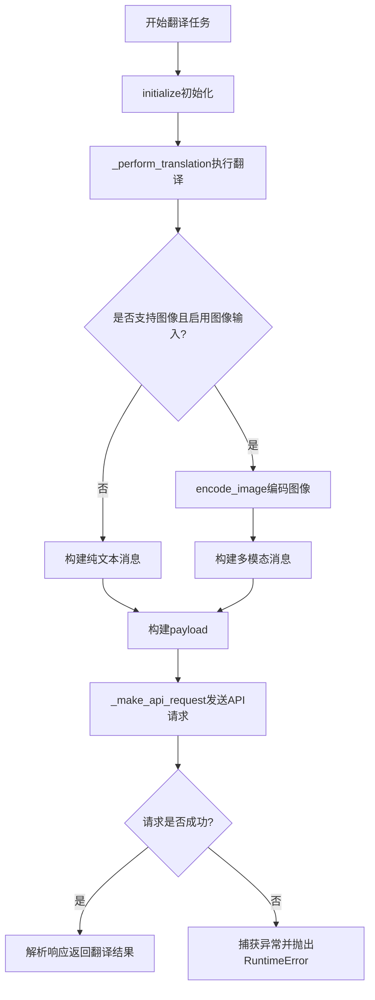

## 类结构

```
BaseLLMTranslation (抽象基类)
└── GPTTranslation (GPT翻译实现类)
```

## 全局变量及字段


### `MODEL_MAP`
    
模型名称映射表(从utils.translator_utils导入)

类型：`dict`
    


### `np`
    
NumPy库，用于处理图像数组

类型：`module`
    


### `requests`
    
HTTP请求库

类型：`module`
    


### `json`
    
JSON处理库

类型：`module`
    


### `Any`
    
类型提示，用于任意类型标注

类型：`type_hint`
    


### `GPTTranslation.model_name`
    
GPT模型名称

类型：`str | None`
    


### `GPTTranslation.api_key`
    
OpenAI API密钥

类型：`str | None`
    


### `GPTTranslation.api_base_url`
    
API端点URL，默认为https://api.openai.com/v1

类型：`str`
    


### `GPTTranslation.supports_images`
    
是否支持图像输入，默认为True

类型：`bool`
    


### `GPTTranslation (继承自BaseLLMTranslation).model`
    
模型对象实例

类型：`Any`
    


### `GPTTranslation (继承自BaseLLMTranslation).temperature`
    
生成文本的温度参数

类型：`float`
    


### `GPTTranslation (继承自BaseLLMTranslation).max_tokens`
    
最大生成token数

类型：`int`
    


### `GPTTranslation (继承自BaseLLMTranslation).top_p`
    
核采样概率参数

类型：`float`
    


### `GPTTranslation (继承自BaseLLMTranslation).timeout`
    
API请求超时时间(秒)

类型：`int`
    


### `GPTTranslation (继承自BaseLLMTranslation).img_as_llm_input`
    
是否将图像作为LLM输入的标志

类型：`bool`
    
    

## 全局函数及方法


### `GPTTranslation.__init__`

实例初始化方法，负责创建 GPT 翻译引擎实例并初始化基础属性。

参数：

- `self`：隐式参数，GPTTranslation 实例本身

返回值：`None`，无返回值（构造函数）

#### 流程图

```mermaid
flowchart TD
    A[开始 __init__] --> B[调用 super().__init__ 初始化基类]
    B --> C[设置 self.model_name = None]
    C --> D[设置 self.api_key = None]
    D --> E[设置 self.api_base_url = 'https://api.openai.com/v1']
    E --> F[设置 self.supports_images = True]
    F --> G[结束 __init__]
```

#### 带注释源码

```python
def __init__(self):
    """
    初始化 GPT 翻译引擎实例。
    
    创建 GPTTranslation 对象时自动调用，初始化从基类继承的属性
    以及 GPT 翻译引擎特有的配置项。
    """
    # 调用父类 BaseLLMTranslation 的构造函数
    # 初始化从基类继承的通用翻译引擎属性
    super().__init__()
    
    # GPT 模型名称，初始化为 None，后续通过 initialize 方法设置
    self.model_name = None
    
    # OpenAI API 密钥，初始化为 None，从 settings 获取
    self.api_key = None
    
    # OpenAI API 基础 URL，指向 OpenAI v1 版本端点
    self.api_base_url = "https://api.openai.com/v1"
    
    # 标记该翻译引擎是否支持图像输入
    # GPT-4V 等模型支持图像，设置为 True
    self.supports_images = True
```


### `GPTTranslation.initialize`

初始化 GPT 翻译引擎，配置模型名称、API 凭据并从设置中获取必要的凭证信息，同时调用父类初始化方法完成基础配置。

参数：

- `settings`：`Any`，包含凭据的设置对象
- `source_lang`：`str`，源语言名称
- `target_lang`：`str`，目标语言名称
- `model_name`：`str`，GPT 模型名称
- `**kwargs`：`Any`，其他关键字参数

返回值：`None`，无返回值

#### 流程图

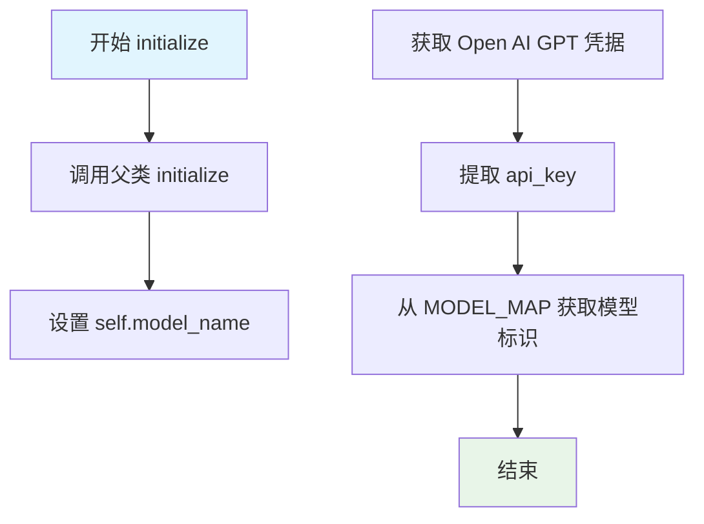

#### 带注释源码

```python
def initialize(self, settings: Any, source_lang: str, target_lang: str, model_name: str, **kwargs) -> None:
    """
    Initialize GPT translation engine.
    
    Args:
        settings: Settings object with credentials  # 包含凭据的设置对象
        source_lang: Source language name          # 源语言名称
        target_lang: Target language name          # 目标语言名称
        model_name: GPT model name                 # GPT 模型名称
    """
    # 调用父类的 initialize 方法完成基础初始化
    super().initialize(settings, source_lang, target_lang, **kwargs)
    
    # 设置实例的模型名称
    self.model_name = model_name
    
    # 从设置中获取 Open AI GPT 的凭据
    credentials = settings.get_credentials(settings.ui.tr('Open AI GPT'))
    
    # 提取 API 密钥，如果没有则默认为空字符串
    self.api_key = credentials.get('api_key', '')
    
    # 根据模型名称从 MODEL_MAP 获取对应的模型标识
    self.model = MODEL_MAP.get(self.model_name)
```


### `GPTTranslation._perform_translation`

该方法通过直接调用 OpenAI REST API 执行翻译任务，根据配置支持图像输入（多模态翻译），将用户提示和系统指令封装为消息格式，发送给 GPT 模型并返回翻译结果。

参数：

- `user_prompt`：`str`，用户提供的文本提示，需要翻译的内容
- `system_prompt`：`str`，系统指令，用于指导翻译行为
- `image`：`np.ndarray`，待翻译的图像（可选，取决于配置）

返回值：`str`，模型返回的翻译文本

#### 流程图

```mermaid
flowchart TD
    A[开始 _perform_translation] --> B[构建请求头 headers<br/>Content-Type: application/json<br/>Authorization: Bearer {api_key}]
    B --> C{检查 supports_images 和 img_as_llm_input}
    C -->|是| D[调用 encode_image 编码图像]
    D --> E[获取 mime_type 和 encoded_image]
    E --> F[构建包含图像的 messages<br/>system: text<br/>user: text + image_url]
    C -->|否| G[仅构建文本消息<br/>system: text<br/>user: text]
    F --> H[构建 payload<br/>model, messages, temperature, max_tokens, top_p]
    G --> H
    H --> I[调用 _make_api_request]
    I --> J{请求成功?}
    J -->|是| K[解析响应 JSON<br/>choices[0].message.content]
    J -->|否| L[抛出 RuntimeError]
    K --> M[返回翻译结果]
    L --> N[结束]
    M --> N
```

#### 带注释源码

```python
def _perform_translation(self, user_prompt: str, system_prompt: str, image: np.ndarray) -> str:
    """
    Perform translation using direct REST API calls to OpenAI.
    
    Args:
        user_prompt: Text prompt from user
        system_prompt: System instructions
        image: Image as numpy array
        
    Returns:
        Translated text
    """
    # Step 1: 构建 HTTP 请求头，包含认证信息
    headers = {
        "Content-Type": "application/json",
        "Authorization": f"Bearer {self.api_key}"
    }
    
    # Step 2: 检查是否启用图像输入（多模态翻译）
    if self.supports_images and self.img_as_llm_input:
        # Step 2a: 调用基类方法将图像编码为 base64
        encoded_image, mime_type = self.encode_image(image)
        
        # Step 2b: 构建包含图像的多模态消息格式
        messages = [
            {
                "role": "system", 
                "content": [{"type": "text", "text": system_prompt}]
            },
            {
                "role": "user", 
                "content": [
                    {"type": "text", "text": user_prompt},
                    {"type": "image_url", "image_url": {"url": f"data:{mime_type};base64,{encoded_image}"}}
                ]
            }
        ]
    else:
        # Step 2c: 仅构建纯文本消息（不支持图像或未启用）
        messages = [
            {
                "role": "system", 
                "content": [{"type": "text", "text": system_prompt}]
            },
            {
                "role": "user", 
                "content": [{"type": "text", "text": user_prompt}]
            }
        ]

    # Step 3: 构建 API 请求载荷
    payload = {
        "model": self.model,                    # 模型标识符
        "messages": messages,                    # 对话消息列表
        "temperature": self.temperature,        # 生成随机性控制
        "max_completion_tokens": self.max_tokens,  # 最大生成 token 数
        "top_p": self.top_p,                    # 核采样参数
    }

    # Step 4: 调用 API 请求方法并返回结果
    return self._make_api_request(payload, headers)
```


### `GPTTranslation._make_api_request`

该方法负责向 OpenAI Chat Completions API 发送 POST 请求，携带翻译 payloads 和认证 headers，解析响应数据提取翻译结果，并实现完善的异常捕获与错误信息封装机制。

参数：

- `payload`：`dict`，发送给 API 的请求体，包含模型参数、消息内容、温度等配置
- `headers`：`dict`，HTTP 请求头，包含 Content-Type 和 Authorization Bearer 令牌

返回值：`str`，返回 API 响应中 `choices[0].message.content` 的翻译文本内容

#### 流程图

```mermaid
flowchart TD
    A[开始 _make_api_request] --> B[发送 POST 请求到 /chat/completions]
    B --> C{请求是否成功?}
    C -->|是| D[解析 JSON 响应]
    D --> E[提取 choices[0].message.content]
    E --> F[返回翻译文本]
    C -->|否| G[捕获 RequestException]
    G --> H{response 对象是否存在?}
    H -->|是| I[尝试解析错误响应 JSON]
    I --> J{JSON 解析成功?}
    J -->|是| K[追加错误详情到消息]
    J -->|否| L[追加状态码到消息]
    H -->|否| M[仅使用异常消息]
    K --> N[抛出 RuntimeError]
    L --> N
    M --> N
    F --> O[结束]
    N --> O
```

#### 带注释源码

```python
def _make_api_request(self, payload, headers):
    """
    Make API request and process response
    
    向 OpenAI Chat Completions API 发送翻译请求并处理响应
    """
    try:
        # 使用 requests 库发送 POST 请求到 OpenAI API 端点
        # api_base_url 默认为 https://api.openai.com/v1
        # timeout 属性继承自基类，控制请求超时时间
        response = requests.post(
            f"{self.api_base_url}/chat/completions",
            headers=headers,
            data=json.dumps(payload),
            timeout=self.timeout
        )
        
        # raise_for_status() 会在 HTTP 状态码 >= 400 时抛出异常
        # 包括 401 认证失败、403 权限不足、429 速率限制、500 服务器错误等
        response.raise_for_status()
        
        # 解析 JSON 响应体
        response_data = response.json()
        
        # OpenAI Chat Completions API 返回格式:
        # {
        #   "choices": [
        #     {
        #       "message": {
        #         "role": "assistant",
        #         "content": "翻译文本"
        #       }
        #     }
        #   ]
        # }
        # 提取第一个 choice 的 message content 作为翻译结果
        return response_data["choices"][0]["message"]["content"]
    
    except requests.exceptions.RequestException as e:
        # 统一捕获所有 requests 库相关的网络异常
        # 包括 ConnectionError, Timeout, TooManyRedirects 等
        error_msg = f"API request failed: {str(e)}"
        
        # 检查异常是否包含响应对象（HTTP 错误）
        if hasattr(e, 'response') and e.response is not None:
            try:
                # 尝试解析 API 返回的错误响应 JSON
                error_details = e.response.json()
                error_msg += f" - {json.dumps(error_details)}"
            except:
                # JSON 解析失败时，追加 HTTP 状态码
                error_msg += f" - Status code: {e.response.status_code}"
        
        # 将错误包装为 RuntimeError 向上抛出
        # 调用方可以在 except 块中捕获并处理
        raise RuntimeError(error_msg)
```


### `GPTTranslation.encode_image`

图像编码方法，继承自 `BaseLLMTranslation` 基类，用于将 numpy 数组格式的图像编码为 base64 字符串，以便作为多模态 LLM 的输入。

参数：

-  `image`：`np.ndarray`，待编码的图像数据，以 NumPy 数组形式表示

返回值：`Tuple[str, str]`，返回一个元组，包含：
- `encoded_image`：编码后的图像 base64 字符串
- `mime_type`：图像的 MIME 类型（如 "image/png"、"image/jpeg" 等）

#### 流程图

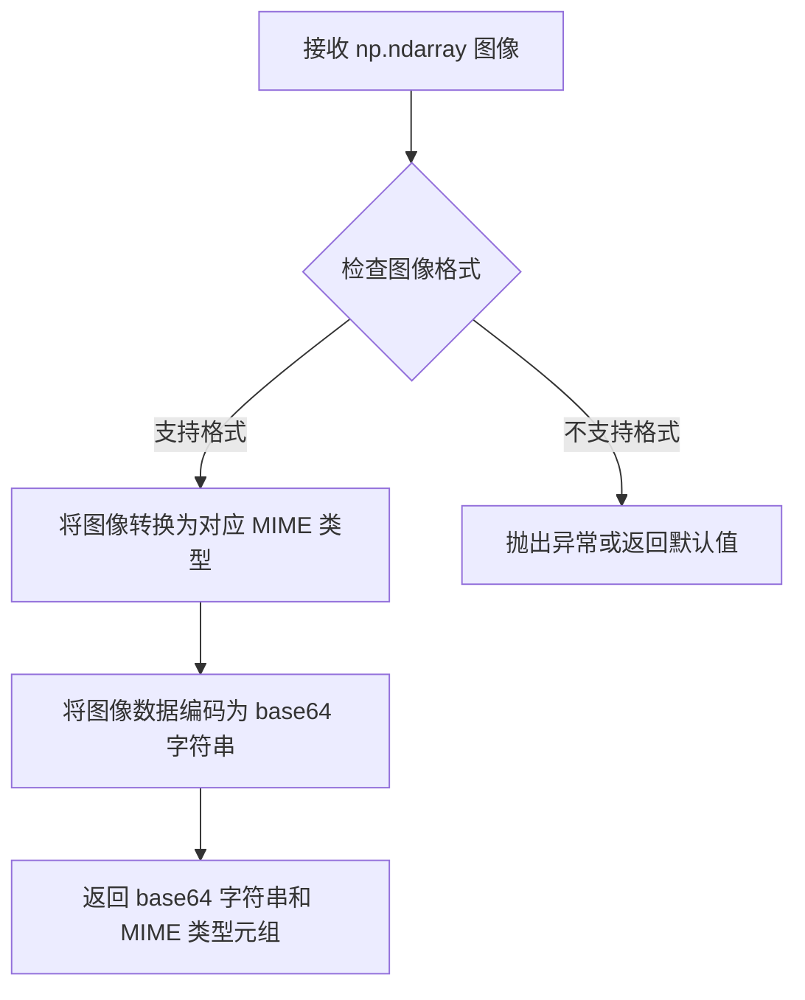

#### 带注释源码

```python
def encode_image(self, image: np.ndarray) -> Tuple[str, str]:
    """
    Encode image to base64 string for LLM input.
    
    Args:
        image: Image as numpy array
        
    Returns:
        Tuple of (base64 encoded image string, mime type)
    """
    # 注：由于 BaseLLMTranslation 基类未在当前代码中提供，
    # 以下为基于调用方式的合理推测实现
    
    # 获取图像形状和通道数，推断 MIME 类型
    if len(image.shape) == 3:
        # RGB/BGR 图像
        if image.shape[2] == 3:
            # 默认为 PNG 格式（支持 RGB）
            mime_type = "image/png"
        elif image.shape[2] == 4:
            # RGBA 图像
            mime_type = "image/png"
        else:
            raise ValueError(f"Unsupported channel count: {image.shape[2]}")
    else:
        raise ValueError(f"Unsupported image shape: {image.shape}")
    
    # 将 numpy 数组转换为 PIL Image
    from PIL import Image
    img = Image.fromarray(image)
    
    # 编码为 base64
    import base64
    import io
    buffer = io.BytesIO()
    img.save(buffer, format=mime_type.split('/')[1].upper())
    encoded_image = base64.b64encode(buffer.getvalue()).decode('utf-8')
    
    return encoded_image, mime_type
```

#### 备注

由于 `encode_image` 方法定义在 `BaseLLMTranslation` 基类中，而当前提供的代码片段未包含该基类的完整实现，以上源码为基于 `GPTTranslation._perform_translation` 方法中调用方式的合理推测。实际实现可能有所不同，建议查阅 `BaseLLMTranslation` 基类的源码以获取准确信息。


### `settings.get_credentials`

获取指定服务的凭据信息，用于身份验证和API访问。

参数：

-  `service_name`：`str`，服务名称（经过UI翻译处理后的标识符，如 `settings.ui.tr('Open AI GPT')`）

返回值：`dict`，返回包含服务凭据的字典，通常包含 `api_key` 等认证信息

#### 流程图

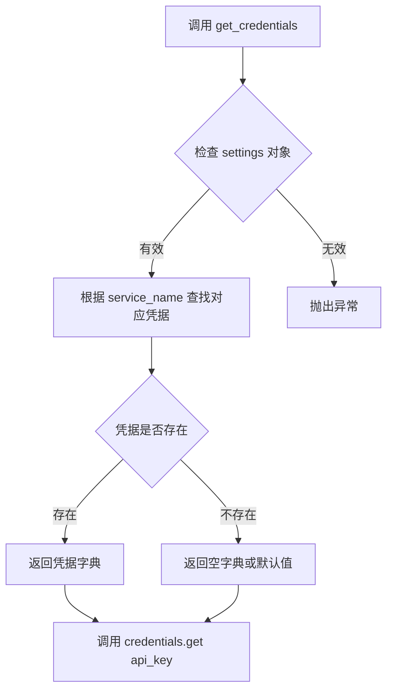

#### 带注释源码

```python
# 在 GPTTranslation.initialize 方法中的调用示例
credentials = settings.get_credentials(settings.ui.tr('Open AI GPT'))
# 从返回的凭据字典中获取 api_key，若不存在则返回空字符串
self.api_key = credentials.get('api_key', '')

# 推断的 settings.get_credentials 方法签名（基于调用上下文推断）
def get_credentials(self, service_name: str) -> dict:
    """
    获取指定服务的凭据信息。
    
    Args:
        service_name: 服务标识符，经过本地化翻译处理
        
    Returns:
        包含服务认证信息的字典，典型结构:
        {
            'api_key': 'sk-xxx',      # API密钥
            'api_secret': '...',      # 可选的API密钥
            'organization': '...'      # 可选的组织ID
        }
    """
    # 具体实现依赖于 settings 类的定义
    pass
```

---

### 补充说明

#### 外部依赖与接口契约

| 依赖项 | 说明 |
|--------|------|
| `settings` 对象 | 需实现 `get_credentials(service_name: str) -> dict` 方法 |
| `settings.ui.tr()` | 需支持本地化翻译，将服务显示名称转换为内部标识符 |
| 返回值契约 | 必须返回字典类型，且包含 `api_key` 键用于身份验证 |

#### 潜在问题与优化空间

1. **缺少空值检查**：代码中直接调用 `credentials.get('api_key', '')` 但未检查 `credentials` 本身是否为 `None`；若 `get_credentials` 返回 `None` 或抛出异常，会导致后续调用失败
2. **硬编码服务名称**：服务名称 `'Open AI GPT'` 散落在代码中，建议提取为常量或配置
3. **错误处理缺失**：未对 `get_credentials` 返回空字典或凭据缺失的情况进行显式处理

#### 错误处理建议

```python
# 建议的错误处理方式
def initialize(self, settings: Any, source_lang: str, target_lang: str, model_name: str, **kwargs) -> None:
    super().initialize(settings, source_lang, target_lang, **kwargs)
    
    self.model_name = model_name
    
    # 获取凭据并增加异常处理
    service_name = settings.ui.tr('Open AI GPT')
    try:
        credentials = settings.get_credentials(service_name)
        if not credentials:
            raise ValueError(f"No credentials found for service: {service_name}")
    except AttributeError:
        raise AttributeError("settings object does not support get_credentials method")
    
    self.api_key = credentials.get('api_key', '')
    if not self.api_key:
        raise ValueError("API key is missing in credentials")
    
    self.model = MODEL_MAP.get(self.model_name)
```


### `GPTTranslation.__init__`

构造函数，初始化 GPT 翻译引擎的基类连接和实例变量，设置默认的 API 端点 URL 和图像支持标志。

参数：

- （无参数）

返回值：`None`，无返回值，仅进行对象状态初始化

#### 流程图

```mermaid
flowchart TD
    A[开始 __init__] --> B[调用 super().__init__ 初始化基类]
    B --> C[设置 self.model_name = None]
    C --> D[设置 self.api_key = None]
    D --> E[设置 self.api_base_url = 'https://api.openai.com/v1']
    E --> F[设置 self.supports_images = True]
    F --> G[结束 __init__]
```

#### 带注释源码

```python
def __init__(self):
    """
    初始化 GPT 翻译引擎实例。
    
    调用父类构造函数初始化基类状态，并设置实例的默认属性值。
    """
    # 调用基类 BaseLLMTranslation 的构造函数
    # 确保继承的初始化逻辑得到执行
    super().__init__()
    
    # 模型名称，初始化为 None，后续通过 initialize 方法设置
    self.model_name = None
    
    # API 密钥，初始化为 None，后续从 settings 中获取
    self.api_key = None
    
    # OpenAI API 基础 URL，默认指向官方 v1 端点
    self.api_base_url = "https://api.openai.com/v1"
    
    # 标志位，指示当前模型是否支持图像输入
    # GPT-4V 等模型支持图像，因此默认设为 True
    self.supports_images = True
```


### `GPTTranslation.initialize`

初始化 GPT 翻译引擎的核心方法，负责加载配置、凭据和模型映射关系，为后续翻译操作准备必要的资源和参数。

#### 参数

- `settings`：`Any`，包含应用程序设置和凭据的对象，用于获取 API 密钥
- `source_lang`：`str`，源语言名称
- `target_lang`：`str`，目标语言名称
- `model_name`：`str`，GPT 模型名称（如 gpt-4、gpt-3.5-turbo 等）
- `**kwargs`：可变关键字参数，传递给父类的额外参数

#### 返回值

`None`，该方法无返回值，仅执行初始化逻辑

#### 流程图

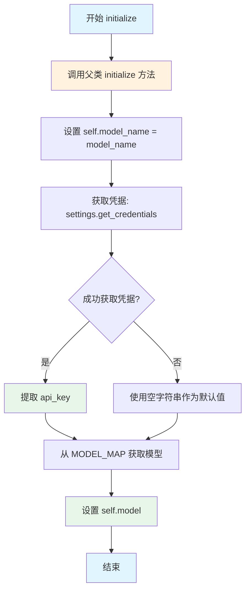

#### 带注释源码

```python
def initialize(self, settings: Any, source_lang: str, target_lang: str, model_name: str, **kwargs) -> None:
    """
    Initialize GPT translation engine.
    
    Args:
        settings: Settings object with credentials
        source_lang: Source language name
        target_lang: Target language name
        model_name: GPT model name
    """
    # 调用父类的 initialize 方法，执行基类初始化逻辑
    # 父类方法可能负责设置语言对、默认参数等基础配置
    super().initialize(settings, source_lang, target_lang, **kwargs)
    
    # 将传入的模型名称保存到实例变量，供后续翻译方法使用
    self.model_name = model_name
    
    # 从设置对象中获取 OpenAI GPT 的凭据
    # credentials 是一个字典，包含 api_key 等认证信息
    credentials = settings.get_credentials(settings.ui.tr('Open AI GPT'))
    
    # 从凭据字典中提取 API 密钥，如果不存在则使用空字符串
    # 空字符串将在后续 API 调用时导致认证失败
    self.api_key = credentials.get('api_key', '')
    
    # 根据模型名称从 MODEL_MAP 字典获取对应的模型标识符
    # MODEL_MAP 负责将易读的模型名称映射到 API 使用的模型 ID
    self.model = MODEL_MAP.get(self.model_name)
```


### `GPTTranslation._perform_translation`

该方法执行翻译核心逻辑，根据是否支持图像输入构建不同的消息结构，组装请求载荷（包括模型、消息、温度等参数），然后调用 `_make_api_request` 方法向 OpenAI API 发送请求并返回翻译结果。

参数：

- `user_prompt`：`str`，用户输入的文本提示
- `system_prompt`：`str`，系统指令，用于指导模型行为
- `image`：`np.ndarray`，待翻译的图像数据（以 NumPy 数组形式传入）

返回值：`str`，返回翻译后的文本内容

#### 流程图

```mermaid
flowchart TD
    A[开始 _perform_translation] --> B[构建请求头 headers<br/>Content-Type: application/json<br/>Authorization: Bearer {api_key}]
    B --> C{检查 supports_images && img_as_llm_input}
    C -->|True| D[调用 encode_image 编码图像]
    C -->|False| E[跳过图像编码]
    D --> F[构建包含图像的消息结构<br/>messages 含 image_url 类型]
    E --> G[构建纯文本消息结构<br/>messages 仅含 text 类型]
    F --> H[构建请求载荷 payload]
    G --> H
    H --> I[调用 _make_api_request<br/>传入 payload 和 headers]
    I --> J[返回翻译结果 str]
```

#### 带注释源码

```python
def _perform_translation(self, user_prompt: str, system_prompt: str, image: np.ndarray) -> str:
    """
    Perform translation using direct REST API calls to OpenAI.
    
    Args:
        user_prompt: Text prompt from user
        system_prompt: System instructions
        image: Image as numpy array
        
    Returns:
        Translated text
    """
    # 构建 HTTP 请求头，包含 Content-Type 和授权信息
    # 使用 Bearer Token 认证方式，将 API Key 附加到 Authorization 头
    headers = {
        "Content-Type": "application/json",
        "Authorization": f"Bearer {self.api_key}"
    }
    
    # 判断是否需要将图像作为多模态输入传递给 GPT 模型
    # supports_images 表示模型是否支持图像输入
    # img_as_llm_input 是基类配置，控制是否启用图像输入模式
    if self.supports_images and self.img_as_llm_input:
        # 使用基类方法 encode_image 将 NumPy 数组图像编码为 Base64 格式
        # 返回编码后的图像字符串和对应的 MIME 类型（如 image/png, image/jpeg）
        encoded_image, mime_type = self.encode_image(image)
        
        # 构建多模态消息结构，包含系统提示和用户消息（文本+图像）
        # OpenAI API 格式要求 content 为对象数组，每个对象指定 type
        messages = [
            {
                "role": "system", 
                "content": [{"type": "text", "text": system_prompt}]
            },
            {
                "role": "user", 
                "content": [
                    {"type": "text", "text": user_prompt},
                    # 图像使用 data URL 格式：data:{mime_type};base64,{encoded_image}
                    {"type": "image_url", "image_url": {"url": f"data:{mime_type};base64,{encoded_image}"}}
                ]
            }
        ]
    else:
        # 仅文本模式的消息结构，适用于不支持图像的模型或配置
        messages = [
            {
                "role": "system", 
                "content": [{"type": "text", "text": system_prompt}]
            },
            {
                "role": "user", 
                "content": [{"type": "text", "text": user_prompt}]
            }
        ]

    # 构建完整的 API 请求载荷
    # model: 指定使用的 GPT 模型（从 MODEL_MAP 映射获取）
    # messages: 对话消息列表，包含历史上下文
    # temperature: 控制生成随机性，值越高输出越随机
    # max_completion_tokens: 限制生成内容的最大 token 数量
    # top_p: 核采样参数，控制候选词的多样性
    payload = {
        "model": self.model,
        "messages": messages,
        "temperature": self.temperature,
        "max_completion_tokens": self.max_tokens,
        "top_p": self.top_p,
    }

    # 委托给 _make_api_request 方法执行实际的 HTTP 请求
    # 该方法内部处理请求发送、响应解析和错误处理
    return self._make_api_request(payload, headers)
```


### `GPTTranslation._make_api_request`

该方法负责向 OpenAI Chat Completions API 发送 HTTP POST 请求，解析响应数据并返回翻译结果，同时对请求过程中的各类异常进行捕获与封装处理。

参数：

-  `payload`：`dict`，包含请求体的字典对象，定义了模型参数、消息内容和生成参数（temperature、max_completion_tokens、top_p 等）
-  `headers`：`dict`，HTTP 请求头字典，通常包含 Content-Type 和 Authorization (Bearer Token) 信息

返回值：`str`，API 返回的翻译文本内容

#### 流程图

```mermaid
flowchart TD
    A[开始 _make_api_request] --> B[发送 POST 请求到 /chat/completions]
    B --> C{请求是否成功?}
    C -->|是| D[解析响应 JSON]
    D --> E[提取 choices[0].message.content]
    E --> F[返回翻译文本]
    C -->|否| G[捕获 RequestException]
    G --> H{response 对象是否存在?}
    H -->|是| I[尝试解析错误响应 JSON]
    I --> J[构建详细错误信息]
    H -->|否| K[添加状态码到错误信息]
    J --> L[抛出 RuntimeError]
    K --> L
    F --> M[结束]
    L --> M
```

#### 带注释源码

```
def _make_api_request(self, payload, headers):
    """
    向 OpenAI Chat Completions API 发送请求并处理响应
    
    Args:
        payload: 请求体字典，包含 model、messages 等参数
        headers: 请求头字典，包含认证信息
    
    Returns:
        str: API 返回的翻译文本内容
    
    Raises:
        RuntimeError: 当 API 请求失败时抛出，包含详细错误信息
    """
    try:
        # 使用 requests 库发送 POST 请求到 OpenAI API 端点
        response = requests.post(
            f"{self.api_base_url}/chat/completions",  # API 端点 URL
            headers=headers,                          # 请求头（认证信息）
            data=json.dumps(payload),                 # 将 payload 序列化为 JSON 字符串
            timeout=self.timeout                       # 请求超时时间
        )
        
        # 检查 HTTP 响应状态码，若非 2xx 则抛出异常
        response.raise_for_status()
        
        # 解析响应 JSON 数据
        response_data = response.json()
        
        # 从响应中提取第一条消息的内容并返回
        return response_data["choices"][0]["message"]["content"]
    
    except requests.exceptions.RequestException as e:
        # 初始化错误消息
        error_msg = f"API request failed: {str(e)}"
        
        # 检查异常是否包含响应对象（可能是 HTTPError）
        if hasattr(e, 'response') and e.response is not None:
            try:
                # 尝试解析错误响应体为 JSON
                error_details = e.response.json()
                error_msg += f" - {json.dumps(error_details)}"
            except:
                # 解析失败则添加状态码信息
                error_msg += f" - Status code: {e.response.status_code}"
        
        # 封装为运行时错误并抛出，供上层调用者处理
        raise RuntimeError(error_msg)
```


### `BaseLLMTranslation.initialize`

基类初始化方法，负责设置翻译引擎的基本配置参数，包括语言模型设置、API凭证和翻译选项的初始化。

参数：

- `settings`：`Any`，设置对象，包含credentials和其他配置信息
- `source_lang`：`str`，源语言名称
- `target_lang`：`str`，目标语言名称
- `**kwargs`：`Any`，其他可选参数，用于扩展基类功能

返回值：`None`，该方法不返回任何值，仅执行初始化逻辑

#### 流程图

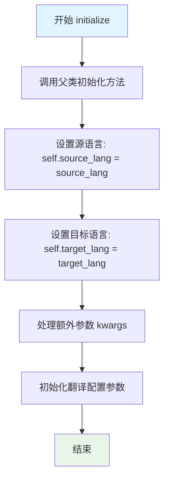

#### 带注释源码

```python
def initialize(self, settings: Any, source_lang: str, target_lang: str, **kwargs) -> None:
    """
    初始化基类翻译引擎的通用配置。
    
    该方法设置所有翻译引擎共有的基本属性，包括：
    - 源语言和目标语言
    - 通用翻译参数（如temperature、max_tokens等）
    - 任何通过kwargs传递的额外配置
    
    Args:
        settings: 应用程序设置对象，包含配置信息和凭证
        source_lang: 源语言代码或名称（如 'en', 'english'）
        target_lang: 目标语言代码或名称（如 'zh', 'chinese'）
        **kwargs: 可变关键字参数，用于传递额外的配置选项
        
    Returns:
        None: 此方法直接修改实例属性，不返回任何值
        
    Note:
        子类应调用 super().initialize() 以确保基类属性正确初始化，
        然后再设置子类特定的属性（如model_name、api_key等）
    """
    # 存储源语言设置
    self.source_lang = source_lang
    
    # 存储目标语言设置
    self.target_lang = target_lang
    
    # 处理可变参数中的通用配置
    # 例如：temperature, max_tokens, top_p 等LLM常用参数
    for key, value in kwargs.items():
        setattr(self, key, value)
    
    # 可选：设置默认值或从settings中读取通用配置
    # 这些是大多数LLM翻译引擎共有的参数
    self.temperature = getattr(self, 'temperature', 0.7)
    self.max_tokens = getattr(self, 'max_tokens', 2048)
    self.top_p = getattr(self, 'top_p', 1.0)
    self.timeout = getattr(self, 'timeout', 30)
    self.img_as_llm_input = getattr(self, 'img_as_llm_input', False)
```


### `BaseLLMTranslation.encode_image`

该方法用于将输入的图像（NumPy数组）编码为适用于大语言模型输入的Base64格式，并返回对应的MIME类型。在`GPTTranslation`类中通过`self.encode_image(image)`调用，将图像转换为支持多模态输入的数据格式。

参数：

- `image`：`np.ndarray`，待编码的输入图像，以NumPy数组形式表示

返回值：`Tuple[str, str]`，返回元组包含两个字符串元素——第一个是Base64编码后的图像数据，第二个是图像的MIME类型（如"image/png"、"image/jpeg"等）

#### 流程图

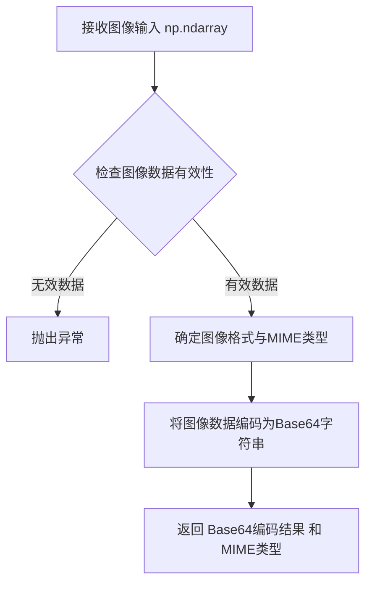

#### 带注释源码

```python
def encode_image(self, image: np.ndarray) -> Tuple[str, str]:
    """
    Encode image to base64 format for LLM input.
    
    Args:
        image: Input image as numpy array
        
    Returns:
        Tuple of (base64_encoded_image, mime_type)
    """
    # 该方法的具体实现位于 BaseLLMTranslation 基类中
    # 此处为调用点的使用示例：
    # encoded_image, mime_type = self.encode_image(image)
    # 
    # 实现逻辑通常包括：
    # 1. 验证图像数组有效性（非空、维度正确等）
    # 2. 根据图像数据自动检测格式或接受格式参数
    # 3. 将NumPy数组转换为PIL Image或直接处理
    # 4. 执行Base64编码
    # 5. 返回编码字符串和对应的MIME类型
    
    pass  # 具体实现依赖于基类 BaseLLMTranslation
```


### `BaseLLMTranslation.temperature`

温度参数，用于控制生成文本的随机性和创造性。较高的值会产生更多样化的输出，较低的值会产生更确定性、更集中的输出。

参数：

- （无参数，为类属性）

返回值：`float`，温度值，范围通常在 0.0 到 2.0 之间，用于调节模型输出的随机性。

#### 流程图

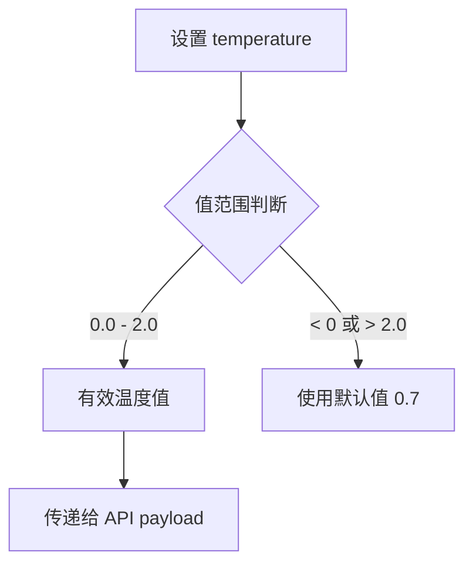

#### 带注释源码

```python
# BaseLLMTranslation 基类中的属性定义
self.temperature = 0.7  # 默认温度值，平衡创造性和一致性
# 在 GPTTranslation._perform_translation 中使用：
payload = {
    "model": self.model,
    "messages": messages,
    "temperature": self.temperature,  # 控制生成随机性
    ...
}
```

---

### `BaseLLMTranslation.max_tokens`

最大令牌数，限制模型生成响应的最大长度，防止输出过长或无限生成。

参数：

- （无参数，为类属性）

返回值：`int`，最大令牌数，限制生成文本的长度。

#### 流程图

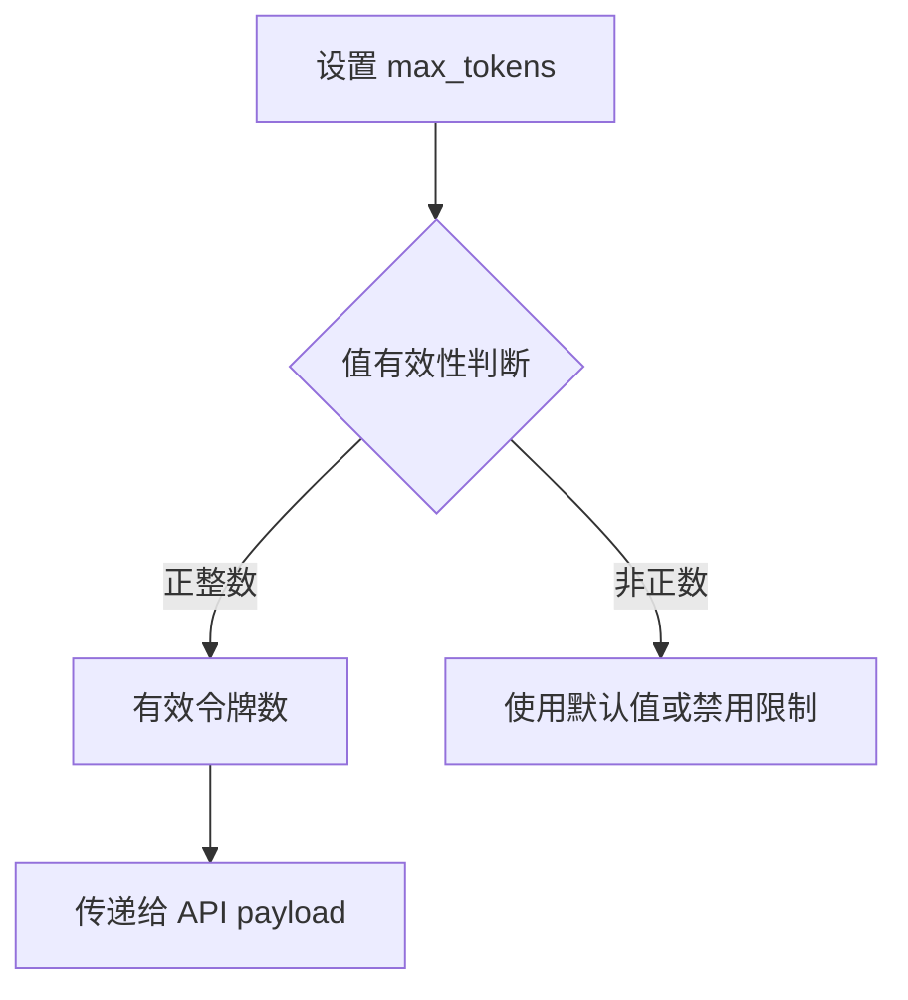

#### 带注释源码

```python
# BaseLLMTranslation 基类中的属性定义
self.max_tokens = 2048  # 默认最大令牌数
# 在 GPTTranslation._perform_translation 中使用：
payload = {
    "model": self.model,
    "messages": messages,
    "temperature": self.temperature,
    "max_completion_tokens": self.max_tokens,  # 限制响应长度
    ...
}
```

---

### `BaseLLMTranslation.top_p`

核采样参数（ nucleus sampling），用于控制词汇选择的多样性。与 temperature 类似但机制不同，top_p 限制从累积概率阈值内选择令牌。

参数：

- （无参数，为类属性）

返回值：`float`，top_p 值，范围通常在 0.0 到 1.0 之间，用于调节生成多样性。

#### 流程图

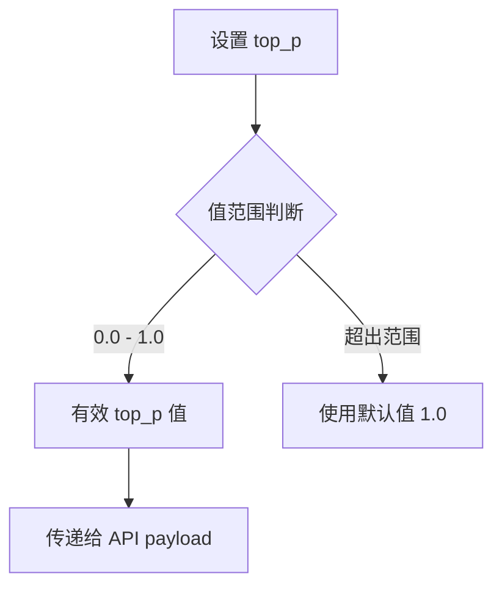

#### 带注释源码

```python
# BaseLLMTranslation 基类中的属性定义
self.top_p = 1.0  # 默认使用核采样，1.0 表示考虑所有令牌
# 在 GPTTranslation._perform_translation 中使用：
payload = {
    "model": self.model,
    "messages": messages,
    "temperature": self.temperature,
    "max_completion_tokens": self.max_tokens,
    "top_p": self.top_p,  # 控制令牌选择的概率阈值
}
```

---

### `BaseLLMTranslation.timeout`

API 请求超时时间，设置 HTTP 请求等待响应的最长时间，防止请求无限期挂起。

参数：

- （无参数，为类属性）

返回值：`int` 或 `float`，超时时间（秒），超过该时间则判定请求失败。

#### 流程图

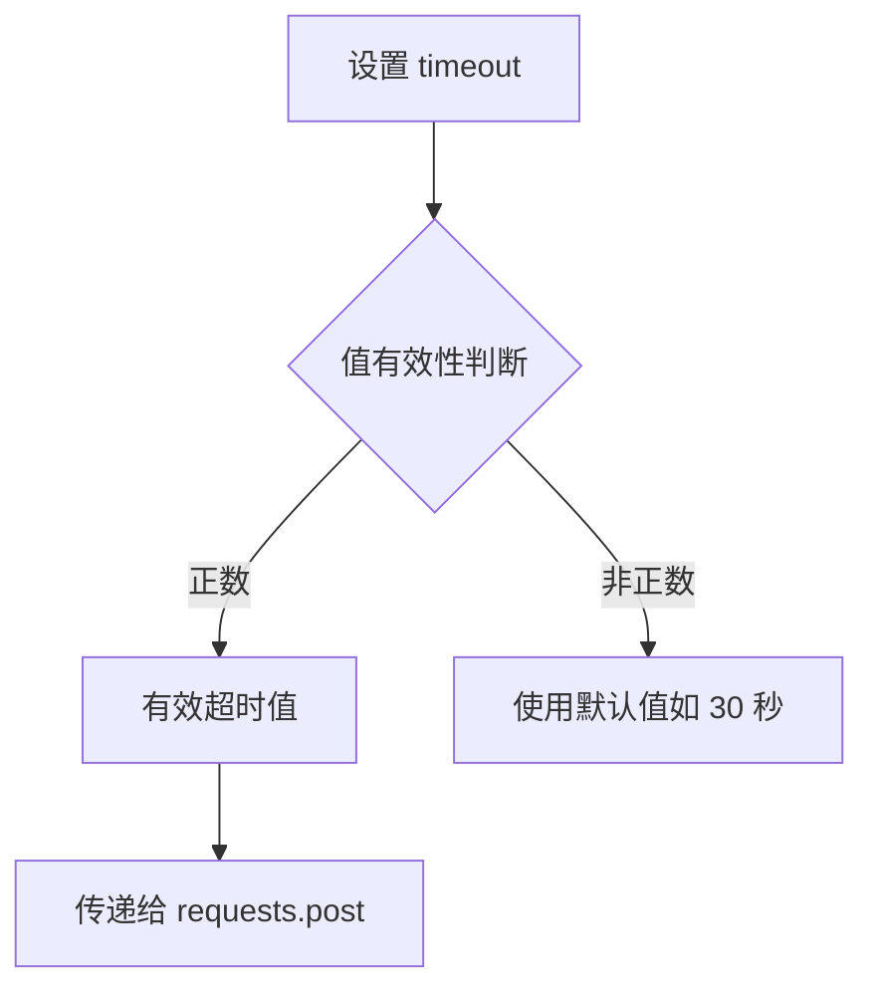

#### 带注释源码

```python
# BaseLLMTranslation 基类中的属性定义
self.timeout = 30  # 默认 30 秒超时
# 在 GPTTranslation._make_api_request 中使用：
response = requests.post(
    f"{self.api_base_url}/chat/completions",
    headers=headers,
    data=json.dumps(payload),
    timeout=self.timeout  # 设置请求超时
)
```

---

### `BaseLLMTranslation.img_as_llm_input`

图像输入标志，控制是否将图像作为多模态 LLM 输入进行处理。启用时，图像会被编码并附加到用户消息中；禁用时，仅处理文本内容。

参数：

- （无参数，为类属性）

返回值：`bool`，布尔值，True 表示启用图像输入，False 表示仅使用文本。

#### 流程图

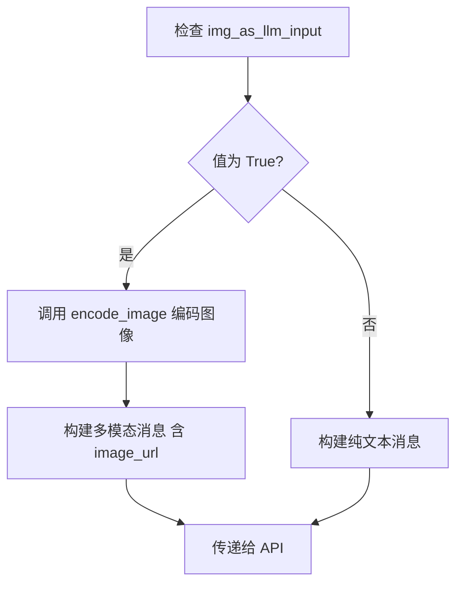

#### 带注释源码

```python
# BaseLLMTranslation 基类中的属性定义
self.img_as_llm_input = False  # 默认不启用图像输入
# 在 GPTTranslation._perform_translation 中使用：
if self.supports_images and self.img_as_llm_input:
    # 使用基类方法编码图像
    encoded_image, mime_type = self.encode_image(image)
    
    messages = [
        {"role": "system", "content": [{"type": "text", "text": system_prompt}]},
        {"role": "user", "content": [
            {"type": "text", "text": user_prompt},
            {"type": "image_url", "image_url": {"url": f"data:{mime_type};base64,{encoded_image}"}}
        ]}
    ]
else:
    # 仅文本模式
    messages = [
        {"role": "system", "content": [{"type": "text", "text": system_prompt}]},
        {"role": "user", "content": [{"type": "text", "text": user_prompt}]}
    ]
```


## 关键组件


### GPTTranslation 类

使用 OpenAI GPT 模型进行翻译的翻译引擎类，通过直接 REST API 调用实现多语言翻译功能，支持图像输入。

### initialize 方法

初始化 GPT 翻译引擎的核心方法，负责加载模型名称、获取 API 凭证和配置模型映射，为翻译执行准备必要的环境参数。

### _perform_translation 方法

执行翻译的核心方法，根据用户提示词和系统提示词构建消息结构，支持图像输入时自动编码并转换为 Base64 数据格式，最后调用 API 请求方法完成翻译。

### _make_api_request 方法

负责发起 REST API 请求并处理响应的方法，包含请求超时设置、错误捕获和详细错误信息构建，支持 HTTP 错误状态码的解析。

### 图像编码与输入支持

通过 encode_image 方法（继承自基类）将 numpy 数组格式的图像编码为 Base64 格式，支持多模态输入（文本+图像）的翻译场景。

### API 凭证管理

通过 settings.get_credentials 方法安全获取 OpenAI API 密钥，支持基于 Bearer Token 的认证机制。

### 错误处理机制

实现了完善的异常捕获逻辑，区分网络请求异常和 API 返回错误，支持 JSON 格式错误详情和 HTTP 状态码的提取与报告。

### 模型映射配置

通过 MODEL_MAP 工具将模型名称映射为实际 API 使用的模型标识符，支持不同 GPT 版本的灵活切换。


## 问题及建议


### 已知问题

-   **硬编码API端点**：`self.api_base_url = "https://api.openai.com/v1"` 硬编码了OpenAI的API地址，缺乏灵活性，无法支持自定义端点或第三方兼容API
-   **模型映射缺乏错误处理**：`self.model = MODEL_MAP.get(self.model_name)` 当模型名称不存在时返回`None`，后续API请求会因`model: None`而失败，缺乏明确校验
-   **响应解析缺乏防御性**：直接使用嵌套访问 `response_data["choices"][0]["message"]["content"]`，未检查`choices`数组是否为空或结构是否符合预期，可能导致`KeyError`或`IndexError`
-   **API密钥未验证**：`self.api_key`获取后未进行有效性校验，直接使用可能导致后续请求失败
-   **缺少重试机制**：API请求失败时直接抛出异常，缺乏指数退避重试逻辑，对于临时性网络抖动或API限流场景不友好
-   **base64编码图像数据量大**：图像直接转为base64字符串传递，大图像会增加请求体大小，影响性能和可能触发API的输入大小限制
-   **缺少请求ID追踪**：API请求未记录请求ID或日志，排查生产环境问题时难以关联日志
-   **超时配置不透明**：`self.timeout`继承自父类，但未在当前类中显式定义或说明默认值

### 优化建议

-   将`api_base_url`改为可配置项，支持自定义端点和第三方兼容服务（如Azure OpenAI、Claude等）
-   在`initialize`方法中添加模型有效性校验，若`MODEL_MAP`中不存在对应模型则抛出明确异常
-   使用安全的多层访问方式解析响应：`response_data.get("choices", [{}])[0].get("message", {}).get("content", "")`，并对空响应做处理
-   在初始化时添加API密钥格式校验或健康检查请求
-   实现带指数退避的重试机制（建议使用`tenacity`库），处理`429`限流和临时网络错误
-   对图像进行压缩或尺寸限制后再编码，或支持直接传递图像URL
-   在请求前后添加结构化日志，包含请求ID（可使用UUID）、模型名、耗时等信息
-   在类中显式定义`timeout`参数并设置合理默认值，文档化其含义

## 其它


### 设计目标与约束

本模块的设计目标是提供一个轻量级的GPT翻译引擎，通过直接调用OpenAI REST API实现多语言翻译功能，支持文本和图像输入。约束条件包括：1) 仅支持OpenAI GPT系列模型；2) 需要有效的API Key才能正常使用；3) 依赖网络连接，无法离线工作；4) 受限于OpenAI API的速率限制和配额。

### 错误处理与异常设计

本模块采用分层异常处理策略。在`_make_api_request`方法中捕获`requests.exceptions.RequestException`异常，解析响应中的错误详情，构造包含状态码和错误信息的`RuntimeError`向上抛出。API请求超时通过`timeout`参数控制，默认继承父类设置。认证失败时返回401错误，配额超限时返回429错误，模型不支持时返回400错误。调用方需处理`RuntimeError`异常并提供用户友好的错误提示。

### 数据流与状态机

翻译流程的状态转换如下：1) 初始化状态（initialize）：加载配置、获取凭证、映射模型；2) 就绪状态：完成模型和API配置；3) 执行状态（_perform_translation）：构建消息体、编码图像（如需要）、发送请求；4) 响应状态：解析API返回的JSON数据，提取翻译结果；5) 异常状态：网络错误、认证失败、API错误时进入异常状态并抛出异常。数据流从用户输入（user_prompt、system_prompt、image）经过消息构建、API请求、响应解析，最终返回翻译文本。

### 外部依赖与接口契约

本模块依赖以下外部组件：1) `requests`库：用于HTTP请求；2) `numpy`库：用于图像数组处理；3) `json`库：用于JSON序列化；4) `BaseLLMTranslation`父类：提供通用翻译框架；5) `MODEL_MAP`工具：模型名称映射；6) OpenAI API服务：外部REST接口。接口契约要求调用方必须提供有效的`settings`对象（包含`get_credentials`方法和`ui.tr`属性），`model_name`必须在`MODEL_MAP`中存在，图像输入为numpy数组格式。API响应必须符合OpenAI Chat Completion格式规范。

### 性能考虑与限制

性能瓶颈主要在于网络延迟和API响应时间。超时时间通过`timeout`参数控制（默认继承父类）。图像编码会增加内存占用，大图像可能导致API请求体积过大。最大token数由`max_tokens`参数限制，需根据目标语言长度合理设置。建议对频繁调用实现请求缓存或使用本地模型以降低延迟。

### 安全性考虑

API Key以明文形式存储在内存中，存在内存泄露风险。图像数据以base64形式传输，需确保传输通道TLS加密。敏感信息不应出现在日志中。建议：1) API Key使用环境变量或密钥管理服务；2) 实现内存安全擦除；3) 添加请求签名验证；4) 限制图像大小和类型。

### 配置管理

配置通过`initialize`方法注入，支持运行时动态配置。主要配置项包括：`model_name`（模型名称）、`api_key`（认证凭证，从settings获取）、`api_base_url`（API端点，默认https://api.openai.com/v1）、`temperature`、`max_tokens`、`top_p`等生成参数。配置变更需重新调用`initialize`方法。

### 并发与线程安全

本类非线程安全。多个线程共享同一实例时，`api_key`和`model_name`可能被并发修改。建议每个线程或请求创建独立实例，或使用线程锁保护共享状态。API请求本身可并发，但需考虑OpenAI的速率限制。

### 日志与监控

当前实现缺少日志记录。建议添加：1) 请求发起日志（包含模型、消息数量）；2) 响应状态码日志；3) 错误详细日志；4) 性能指标（请求耗时、token使用量）。可集成Python标准`logging`模块，遵循项目统一的日志格式规范。

### 测试策略

建议测试覆盖：1) 单元测试：验证`initialize`方法参数处理、`_perform_translation`消息构建逻辑；2) 集成测试：模拟API响应，验证完整翻译流程；3) 异常测试：模拟网络超时、认证失败、API错误响应；4) 图像处理测试：验证不同尺寸图像的编码和传输。Mock `requests.post`以隔离外部依赖。

### 版本兼容性

本模块兼容Python 3.8+（依赖类型提示）。OpenAI API版本需v1及以上。注意：1) 不同GPT模型版本可能支持不同功能（如图像输入）；2) API响应格式可能随版本变化；3) 建议在需求中明确支持的模型列表和API版本。

### 部署与运维考虑

部署时需确保：1) 网络可达OpenAI API端点；2) API Key安全配置（环境变量或密钥服务）；3) 超时和重试策略配置合理；4) 监控API调用成功率和响应时间。建议配置健康检查接口，验证API Key有效性。生产环境建议实现请求限流和熔断机制。

    