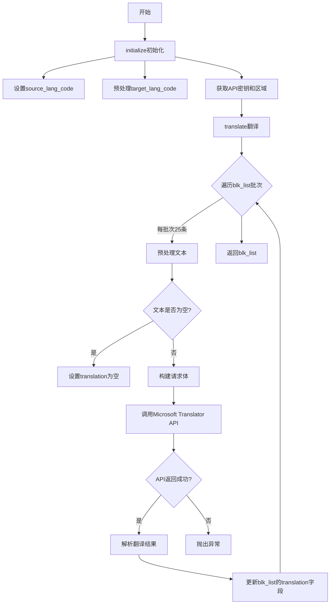
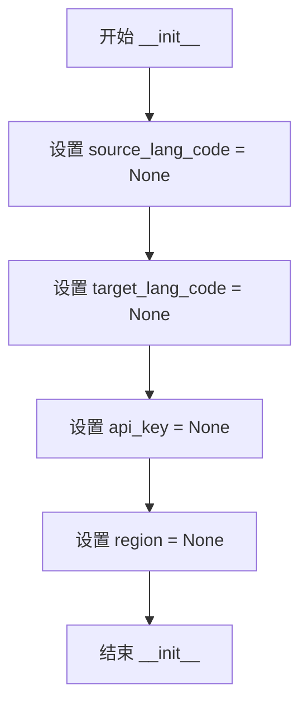
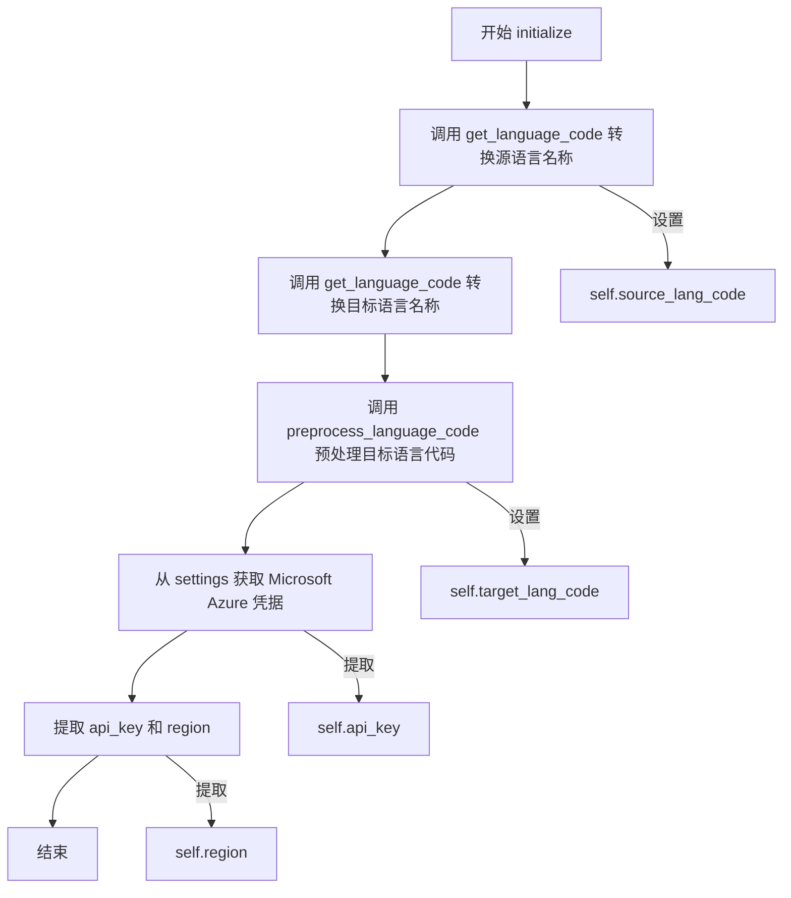
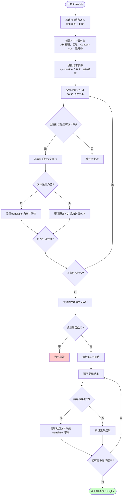

# `comic-translate\modules\translation\microsoft.py` 详细设计文档

微软翻译引擎实现类，继承自TraditionalTranslation抽象基类，通过调用Microsoft Azure认知服务的翻译API接口，将文本块列表批量翻译成目标语言，支持中文简繁体和葡萄牙语变体的语言代码预处理。

## 整体流程



## 类结构

```
TraditionalTranslation (抽象基类)
└── MicrosoftTranslation (微软翻译引擎实现)
```

## 全局变量及字段


### `MicrosoftTranslation.source_lang_code`
    
源语言代码

类型：`str`
    


### `MicrosoftTranslation.target_lang_code`
    
目标语言代码（经预处理）

类型：`str`
    


### `MicrosoftTranslation.api_key`
    
Microsoft Azure API密钥

类型：`str`
    


### `MicrosoftTranslation.region`
    
Azure服务区域

类型：`str`
    
    

## 全局函数及方法


### `MicrosoftTranslation.__init__`

构造函数，初始化实例变量，用于创建 MicrosoftTranslation 类的新实例，并设置翻译引擎所需的初始状态。

参数：无

返回值：`None`，无返回值

#### 流程图



#### 带注释源码

```python
def __init__(self):
    """
    构造函数，初始化实例变量。
    
    创建 MicrosoftTranslation 类的新实例，初始化以下属性：
    - source_lang_code: 源语言代码（将在 initialize 方法中设置）
    - target_lang_code: 目标语言代码（将在 initialize 方法中设置）
    - api_key: Microsoft Azure 翻译 API 密钥（将在 initialize 方法中设置）
    - region: Azure 区域（将在 initialize 方法中设置）
    """
    self.source_lang_code = None  # 源语言代码，初始化为 None
    self.target_lang_code = None  # 目标语言代码，初始化为 None
    self.api_key = None            # API 密钥，初始化为 None
    self.region = None             # Azure 区域，初始化为 None
```


### `MicrosoftTranslation.initialize`

初始化翻译引擎，设置语言代码和API凭据

参数：

-  `settings`：`Any`，设置对象，包含凭据信息
-  `source_lang`：`str`，源语言名称
-  `target_lang`：`str`，目标语言名称

返回值：`None`，无返回值

#### 流程图



#### 带注释源码

```python
def initialize(self, settings: Any, source_lang: str, target_lang: str) -> None:
    """
    初始化翻译引擎，设置语言代码和API凭据
    
    参数:
        settings: 设置对象，包含凭据信息
        source_lang: 源语言名称
        target_lang: 目标语言名称
    
    返回值:
        None
    """
    # 将源语言名称转换为语言代码并保存
    self.source_lang_code = self.get_language_code(source_lang)
    
    # 预处理目标语言代码以匹配 Microsoft 支持的格式
    target_code = self.get_language_code(target_lang)
    self.target_lang_code = self.preprocess_language_code(target_code)
    
    # 从设置中获取 Microsoft Azure 的凭据
    credentials = settings.get_credentials(settings.ui.tr("Microsoft Azure"))
    
    # 提取翻译 API 的密钥和区域信息
    self.api_key = credentials['api_key_translator']
    self.region = credentials['region_translator']
```


### `MicrosoftTranslation.translate`

该方法是微软翻译引擎的核心实现，通过调用Microsoft Azure认知服务的Translator API实现批量文本翻译功能。方法接收待翻译的文本块列表，按批次（每批25个）调用API处理，并将翻译结果更新到原始文本块中，最后返回翻译后的文本块列表。

参数：

- `blk_list`：`list[TextBlock]`，待翻译的文本块列表

返回值：`list[TextBlock]`，翻译后的文本块列表

#### 流程图



#### 带注释源码

```python
def translate(self, blk_list: list[TextBlock]) -> list[TextBlock]:
    """
    执行翻译操作，按批次调用API并返回翻译后的文本块列表。
    
    参数:
        blk_list: 待翻译的文本块列表
        
    返回:
        翻译后的文本块列表
    """
    # 1. 构建Microsoft Translator API端点
    endpoint = "https://api.cognitive.microsofttranslator.com"
    path = '/translate'
    constructed_url = endpoint + path
    
    # 2. 设置HTTP请求头，包含认证信息和追踪ID
    headers = {
        'Ocp-Apim-Subscription-Key': self.api_key,           # Azure订阅密钥
        'Ocp-Apim-Subscription-Region': self.region,           # Azure区域
        'Content-type': 'application/json',                   # 请求内容类型
        'X-ClientTraceId': str(uuid.uuid4())                  # 用于日志追踪的唯一ID
    }
    
    # 3. 设置请求参数，指定API版本和目标语言
    params = {
        'api-version': '3.0',
        'to': self.target_lang_code
    }
    
    # 4. 分批处理文本块，避免超过请求大小限制
    batch_size = 25  # 根据典型文本长度调整
    for i in range(0, len(blk_list), batch_size):
        # 获取当前批次（起始索引i，结束索引i+batch_size）
        batch = blk_list[i:i+batch_size]
        
        # 5. 准备待翻译文本列表
        body = []              # 请求体JSON数组
        indices_to_update = [] # 记录需要更新的原始列表索引
        
        # 6. 遍历批次中的每个文本块进行预处理
        for idx, blk in enumerate(batch):
            # 使用源语言代码预处理文本
            text = self.preprocess_text(blk.text, self.source_lang_code)
            
            # 跳过空文本，直接设置空翻译结果
            if not text.strip():
                blk.translation = ""
                continue
            
            # 将有效文本添加到请求体
            body.append({
                'text': text
            })
            # 记录在原始blk_list中的索引位置
            indices_to_update.append(i + idx)
        
        # 7. 跳过空批次（全部文本为空的情况）
        if not body:
            continue
        
        # 8. 发送POST请求到Microsoft Translator API
        response = requests.post(
            constructed_url, 
            headers=headers, 
            params=params, 
            json=body,
            timeout=30  # 30秒超时
        )
        # 检查HTTP响应状态，失败时抛出异常
        response.raise_for_status()
        
        # 9. 解析JSON响应，获取翻译结果
        translations = response.json()
        
        # 10. 将翻译结果更新到原始文本块列表
        for j, translation_result in enumerate(translations):
            if j < len(indices_to_update):
                # 计算在blk_list中的实际索引
                block_idx = indices_to_update[j]
                # 确保索引有效且响应包含translations字段
                if block_idx < len(blk_list) and 'translations' in translation_result:
                    # 更新文本块的translation属性（取第一个翻译结果）
                    blk_list[block_idx].translation = translation_result['translations'][0]['text']
    
    # 11. 返回翻译后的文本块列表
    return blk_list
```


### `MicrosoftTranslation.preprocess_language_code`

预处理语言代码，转换为Microsoft支持的格式（如zh-CN转zh-Hans）

参数：

- `lang_code`：`str`，原始语言代码

返回值：`str`，预处理后的语言代码，转换为Microsoft Translator API支持的格式

#### 流程图

```mermaid
flowchart TD
    A[开始] --> B{lang_code 是否为空?}
    B -->|是| C[返回原始 lang_code]
    B -->|否| D{lang_code == 'zh-CN'?}
    D -->|是| E[返回 'zh-Hans']
    D -->|否| F{lang_code == 'zh-TW'?}
    F -->|是| G[返回 'zh-Hant']
    F -->|否| H{lang_code == 'pt'?}
    H -->|是| I[返回 'pt-pt']
    H -->|否| J{lang_code.lower == 'pt-br'?]
    J -->|是| K[返回 'pt']
    J -->|否| L[返回原始 lang_code]
    C --> M[结束]
    E --> M
    G --> M
    I --> M
    K --> M
    L --> M
```

#### 带注释源码

```
def preprocess_language_code(self, lang_code: str) -> str:
    """
    Preprocess language codes to match Microsoft Translator API supported formats.
    
    Handles special cases like Chinese variants and Portuguese variants.
    """
    # 检查语言代码是否为空，若为空则直接返回原值
    if not lang_code:
        return lang_code
        
    # 处理中文变体
    # 简体中文 (zh-CN) 转换为 Microsoft 格式 (zh-Hans)
    if lang_code == "zh-CN":
        return "zh-Hans"
    # 繁体中文 (zh-TW) 转换为 Microsoft 格式 (zh-Hant)
    elif lang_code == "zh-TW":
        return "zh-Hant"
    
    # 处理葡萄牙语变体
    # 葡萄牙语默认为葡萄牙葡萄牙 (pt-pt)
    if lang_code == "pt":
        return "pt-pt"
    # 巴西葡萄牙语 (pt-br) 转换为 Microsoft 格式 (pt)
    elif lang_code.lower() == "pt-br":
        return "pt"
        
    # 其他语言直接返回原始代码
    return lang_code
```

## 关键组件


### MicrosoftTranslation 类

翻译引擎核心类，继承自 TraditionalTranslation 基类，负责调用 Microsoft Translator API 实现文本翻译功能。

### initialize 方法

初始化翻译引擎的配置信息，包括源语言、目标语言、API 密钥和区域设置。通过 settings 获取 Microsoft Azure 翻译服务的认证信息。

### translate 方法

核心翻译方法，将 TextBlock 列表批量发送到 Microsoft Translator API 进行翻译。支持批处理（每批 25 条）以避免请求大小限制，返回翻译后的 TextBlock 列表。

### preprocess_language_code 方法

语言代码预处理函数，将输入的语言代码转换为 Microsoft Translator API 支持的格式。处理中文简繁体（zh-CN → zh-Hans, zh-TW → zh-Hant）和葡萄牙语变体（pt → pt-pt, pt-br → pt）的特殊映射。

### 批处理机制

通过 batch_size=25 将大量文本块分批处理，每批独立调用 API 并更新结果，有效避免单次请求过大导致的失败问题。

### API 请求构建模块

构造 Microsoft Translator API 请求的组件，包括 endpoint、headers（包含订阅密钥、区域、客户端追踪 ID）、params（API 版本、目标语言）等参数。

### 错误处理机制

使用 response.raise_for_status() 检查 HTTP 响应状态，并在请求超时（30秒）时抛出异常，确保翻译失败的及时反馈。


## 问题及建议


### 已知问题

- **异常处理不完善**：缺少对`get_credentials()`返回值为None或抛出异常的处理；网络请求可能因超时等原因失败，但仅依赖`response.raise_for_status()`，未处理API返回错误响应（状态码200但包含错误信息）的情况
- **索引对齐缺陷**：当`blk.text`为空跳过时，`indices_to_update`列表仍会添加索引，但`body`列表不包含该文本，导致翻译结果索引与原始块索引不匹配
- **语言代码转换逻辑问题**：中文转换`zh-CN`→`zh-Hans`和`zh-TW`→`zh-Hant`是正确的，但葡萄牙语处理逻辑`pt`→`pt-pt`和`pt-br`→`pt`与Microsoft API实际支持格式可能相反
- **硬编码配置值**：`batch_size=25`、`timeout=30`、endpoint URL、API版本号等均为硬编码，缺少可配置性
- **敏感信息管理**：API key和region存储在实例变量中，无销毁时清理机制，长时间运行存在内存泄露风险
- **方法依赖不明确**：调用了`self.preprocess_text()`和`self.get_language_code()`方法，但未在此类中定义，依赖父类实现，代码可读性差
- **Magic Number缺乏注释**：批量大小25、超时30秒等数值无解释，影响后续维护

### 优化建议

- 增加try-except捕获网络异常、JSON解析异常，添加重试机制（指数退避）应对临时性API失败
- 修正索引逻辑，在跳过空文本时同时排除对应的索引，或在处理响应前进行对齐
- 将可配置参数（batch_size、timeout、endpoint等）提取为类属性或初始化参数
- 实现`__del__`方法或使用context manager清理敏感信息
- 添加详细的日志记录，记录请求耗时、批次大小、错误信息便于排查问题
- 考虑使用异步请求（aiohttp）或线程池提升翻译大批量文本的性能
- 增加API响应结构验证，确保返回数据符合预期格式后再访问

## 其它


### 设计目标与约束

本模块旨在实现与Microsoft Azure Translator API的集成，提供稳定、高效的多语言翻译服务。设计目标包括：支持多种语言代码的自动预处理和转换、批量处理文本块以优化API调用效率、提供灵活的认证机制。约束条件包括：依赖外部API服务（需要有效的API密钥和区域配置）、受限于Microsoft API的请求限制（批处理大小为25个文本块）、网络环境稳定性要求较高。

### 错误处理与异常设计

本类主要处理以下异常场景：网络连接超时（requests.post设置timeout=30秒）、API认证失败（API密钥或区域配置错误时返回401错误）、API配额超限（返回429错误）、请求体过大（超过API限制）、无效的语言代码（API返回400错误）。当前实现通过response.raise_for_status()捕获HTTP错误，但对于网络异常、JSON解析失败、空响应等情况缺乏显式处理。建议增加异常日志记录、请求重试机制（指数退避策略）、以及降级处理逻辑。

### 数据流与状态机

数据流处理遵循以下流程：初始化阶段（设置源语言、目标语言、API凭证）→ 翻译请求阶段（将文本块分批处理）→ API调用阶段（发送POST请求到Microsoft翻译端点）→ 响应解析阶段（提取翻译结果）→ 结果返回阶段（更新TextBlock对象的translation属性）。状态机包含三个主要状态：初始化态（initialize方法完成）、就绪态（credentials配置完成）、处理态（translate方法执行中）、完成态（返回翻译结果）。状态转换由方法调用驱动，无显式状态管理类。

### 外部依赖与接口契约

本类依赖以下外部组件：requests库（用于HTTP请求）、uuid模块（生成客户端追踪ID）、TextBlock类（来自..utils.textblock模块）、TraditionalTranslation基类（来自.base模块）、settings对象（提供API凭证获取）。接口契约方面：initialize方法接收settings对象、source_lang和target_lang字符串参数，无返回值；translate方法接收TextBlock列表，返回相同长度的TextBlock列表；preprocess_language_code方法接收语言代码字符串，返回处理后的语言代码字符串。API契约遵循Microsoft Translator API v3.0规范， endpoint固定为api.cognitive.microsofttranslator.com，路径为/translate。

### 性能考虑

批处理策略：代码将文本块按25个一批进行处理，该值基于典型文本长度设定，可通过配置调整。请求优化：省略source参数实现自动语言检测，减少请求参数复杂度。超时控制：设置30秒超时避免无限等待。潜在性能瓶颈包括：网络延迟（主要因素）、API速率限制（Microsoft对请求频率有限制）、大文本块处理（可能触发API的text length限制）。建议增加请求间隔控制、并发请求池（需考虑API的并发限制）、以及本地缓存机制（针对重复翻译内容）。

### 安全性考虑

API密钥和区域信息通过credentials获取，需确保settings模块的安全存储机制（不应明文存储在配置文件或代码中）。HTTP请求头中包含X-ClientTraceId用于追踪，建议使用UUID避免敏感信息泄露。传输层安全依赖HTTPS协议保护。建议增加以下安全措施：API密钥的环境变量或密钥管理系统（KMS）存储、请求签名验证、输入验证（防止注入攻击）、敏感日志脱敏处理。

### 可测试性设计

当前实现存在一定的测试挑战：直接依赖外部API（Microsoft Translator服务），无法进行无网络环境的单元测试；requests.post的同步调用增加了mock难度。建议的测试策略包括：使用requests-mock或responses库模拟HTTP响应；抽取HTTP请求逻辑到独立客户端类以便注入mock；为preprocess_language_code方法设计充分的单元测试（纯函数，易于测试）；增加集成测试验证真实API调用（使用测试API密钥或沙箱环境）。建议将网络请求层抽象为独立类，实现接口化便于依赖注入和测试。

### 配置管理

本类的配置项包括：source_lang_code和target_lang_code（语言代码）、api_key和region（API凭证）、batch_size（批处理大小，默认25）、endpoint（API端点，固定值）、timeout（请求超时，默认30秒）。配置获取方式：通过settings.get_credentials()从配置源获取，配置源应为安全存储（环境变量、加密配置文件或密钥管理服务）。建议将batch_size和timeout提取为可配置参数，支持运行时调整；增加配置校验逻辑（API密钥格式、区域有效性等）。


    