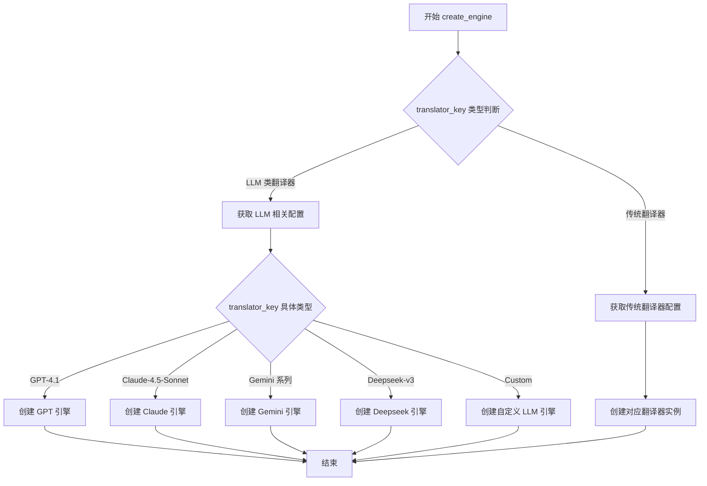
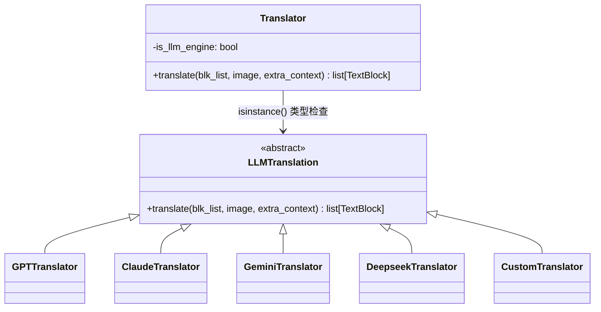
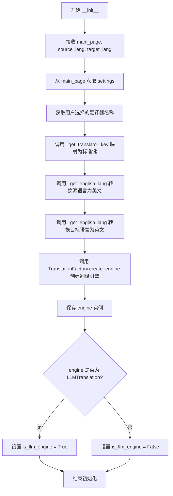
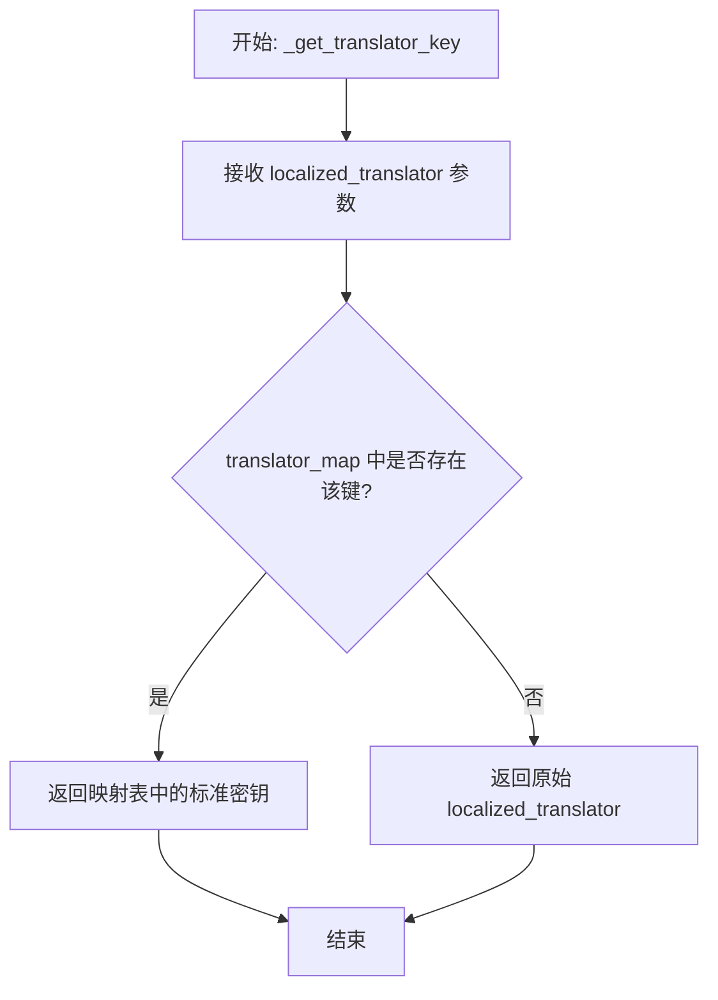
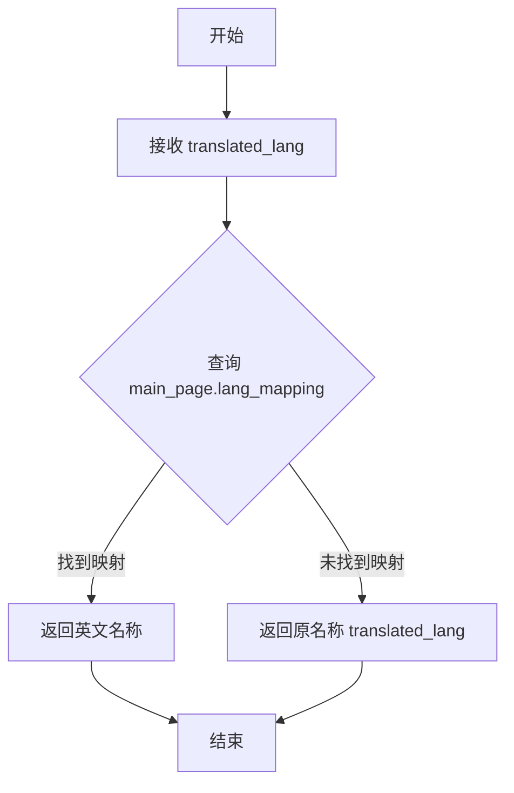
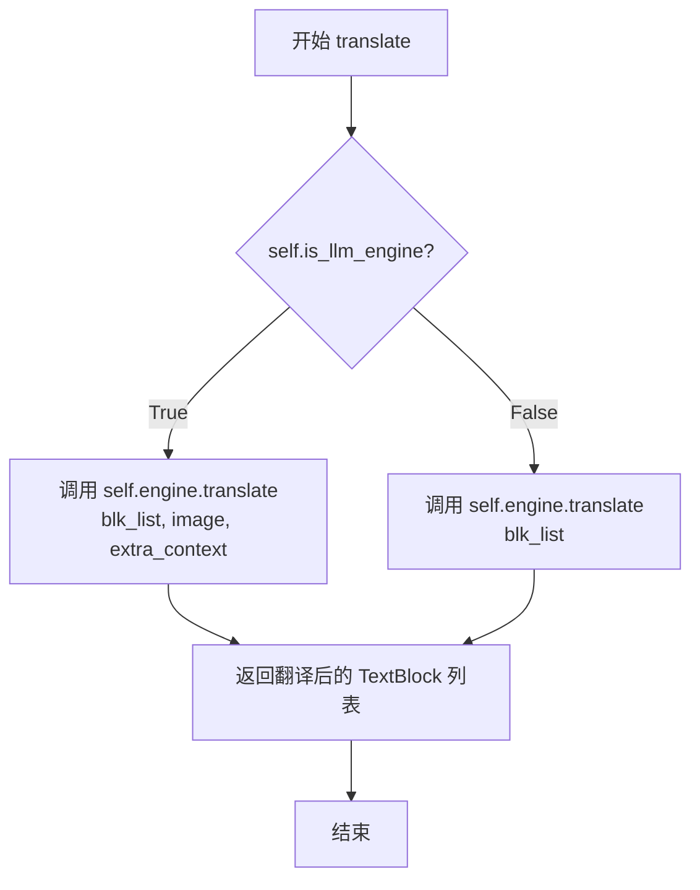
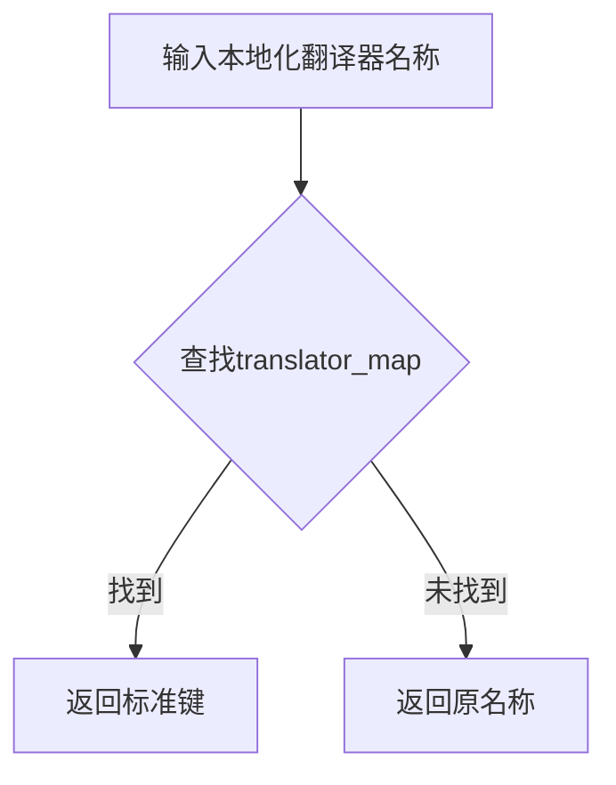

# `comic-translate\modules\translation\processor.py` 详细设计文档

Translator类是核心翻译协调器，通过工厂模式动态创建翻译引擎（支持传统翻译服务如Google、DeepL、Microsoft和LLM翻译服务如GPT、Claude、Gemini），并根据引擎类型分发翻译请求，支持TextBlock文本块的批量翻译，同时处理图像上下文和额外上下文信息。

## 整体流程

```mermaid
graph TD
    A[Translator初始化] --> B[获取用户选择的翻译器]
    B --> C[映射为标准翻译器密钥]
    D[获取源语言和目标语言] --> E[转换为英文语言名称]
    E --> F[使用TranslationFactory创建翻译引擎]
    F --> G{引擎类型是LLM?}
    G -- 是 --> H[设置is_llm_engine=True]
    G -- 否 --> I[设置is_llm_engine=False]
    J[调用translate方法] --> K{is_llm_engine?}
    K -- 是 --> L[调用LLM引擎翻译: translate(blk_list, image, extra_context)]
    K -- 否 --> M[调用传统引擎翻译: translate(blk_list)]
    L --> N[返回带翻译的TextBlock列表]
    M --> N
```

## 类结构

```
Translator (主翻译器类)
```

## 全局变量及字段


### `translator_map`
    
翻译器名称映射字典，将本地化翻译器名称映射为标准密钥

类型：`dict[str, str]`
    


### `Translator.main_page`
    
主应用页面对象，包含设置和语言映射信息

类型：`Any`
    


### `Translator.settings`
    
设置页面对象，提供工具选择和UI翻译功能

类型：`Any`
    


### `Translator.translator_key`
    
翻译器密钥字符串，用于标识所选翻译引擎

类型：`str`
    


### `Translator.source_lang`
    
源语言名称，本地化格式的用户界面语言

类型：`str`
    


### `Translator.source_lang_en`
    
英文源语言名称，用于翻译引擎的标准语言标识

类型：`str`
    


### `Translator.target_lang`
    
目标语言名称，本地化格式的用户界面语言

类型：`str`
    


### `Translator.target_lang_en`
    
英文目标语言名称，用于翻译引擎的标准语言标识

类型：`str`
    


### `Translator.engine`
    
翻译引擎对象，具体翻译器的实例化对象

类型：`BaseTranslation | LLMTranslation`
    


### `Translator.is_llm_engine`
    
是否为LLM引擎的布尔标志，用于方法分发判断

类型：`bool`
    
    

## 全局函数及方法


### `TranslationFactory.create_engine`

工厂方法，根据传入的配置和语言信息创建并返回相应的翻译引擎实例，支持传统翻译服务（Google、DeepL等）和LLM翻译引擎（GPT、Claude等）。

参数：

- `settings`：`Settings` 对象，包含应用程序的全局配置信息，用于获取API密钥、端点等翻译引擎所需的配置项
- `source_lang_en`：`str`，源语言的英文名称（如 "English"、"Chinese"）
- `target_lang_en`：`str`，目标语言的英文名称（如 "Japanese"、"French"）
- `translator_key`：`str`，翻译器的标准标识键（如 "GPT-4.1"、"DeepL"、"Custom"）

返回值：`Union[LLMTranslation, BaseTranslation]`，返回翻译引擎实例。返回类型根据 `translator_key` 决定：若为 LLM 类翻译器（GPT、Claude、Gemini、Deepseek 等），返回 `LLMTranslation` 的子类实例；若为传统翻译器（DeepL、Microsoft、Yandex 等），返回 `BaseTranslation` 的子类实例。

#### 流程图



> **注意**：由于用户仅提供了 `Translator` 类代码，未提供 `TranslationFactory` 类的完整源码。上述流程图和源码为基于 `Translator.__init__` 中调用方式的合理推断，实际实现可能略有差异。

#### 带注释源码

```python
# 注：以下为基于调用的推断源码，实际实现位于 .factory 模块中

class TranslationFactory:
    """
    翻译引擎工厂类
    
    负责根据配置信息创建不同类型的翻译引擎实例，
    支持传统机器翻译服务和基于大语言模型的翻译服务。
    """
    
    @staticmethod
    def create_engine(
        settings: Settings,
        source_lang_en: str,
        target_lang_en: str,
        translator_key: str
    ):
        """
        工厂方法：创建翻译引擎实例
        
        Args:
            settings: 应用程序全局设置对象，包含API密钥、端点配置等
            source_lang_en: 源语言的英文名称
            target_lang_en: 目标语言的英文名称
            translator_key: 翻译器标识键，决定创建哪种类型的引擎
            
        Returns:
            翻译引擎实例（LLMTranslation 或 BaseTranslation 子类）
        """
        
        # 判断是否为 LLM 类翻译器
        llm_translators = {
            "Custom", "Deepseek-v3", "GPT-4.1", "GPT-4.1-mini",
            "Claude-4.5-Sonnet", "Claude-4.5-Haiku",
            "Gemini-3.0-Flash", "Gemini-2.5-Pro"
        }
        
        if translator_key in llm_translators:
            # LLM 翻译器需要额外的配置处理
            # 如 API 密钥获取、端点配置等
            return TranslationFactory._create_llm_engine(
                settings, source_lang_en, target_lang_en, translator_key
            )
        else:
            # 传统翻译器创建
            return TranslationFactory._create_traditional_engine(
                settings, source_lang_en, target_lang_en, translator_key
            )
    
    @staticmethod
    def _create_llm_engine(settings, source_lang, target_lang, translator_key):
        """创建 LLM 翻译引擎实例"""
        # 获取该 LLM 翻译器的 API 密钥
        api_key = settings.get_api_key(translator_key)
        # 获取可选的端点配置
        endpoint = settings.get_endpoint(translator_key)
        
        # 根据 translator_key 创建对应的 LLM 翻译器
        llm_classes = {
            "GPT-4.1": GPTTranslation,
            "GPT-4.1-mini": GPTTranslation,
            "Claude-4.5-Sonnet": ClaudeTranslation,
            "Claude-4.5-Haiku": ClaudeTranslation,
            "Gemini-3.0-Flash": GeminiTranslation,
            "Gemini-2.5-Pro": GeminiTranslation,
            "Deepseek-v3": DeepseekTranslation,
            "Custom": CustomLLMTranslation,
        }
        
        engine_class = llm_classes.get(translator_key)
        return engine_class(api_key, endpoint, source_lang, target_lang)
    
    @staticmethod
    def _create_traditional_engine(settings, source_lang, target_lang, translator_key):
        """创建传统机器翻译引擎实例"""
        # 获取传统翻译器的配置
        api_key = settings.get_api_key(translator_key)
        
        # 根据 translator_key 创建对应的传统翻译器
        traditional_classes = {
            "DeepL": DeepLTranslation,
            "Microsoft Translator": MicrosoftTranslation,
            "Yandex": YandexTranslation,
        }
        
        engine_class = traditional_classes.get(translator_key)
        return engine_class(api_key, source_lang, target_lang)
```


### `LLMTranslation`

LLM翻译基类（类型检查用），用于标识和支持基于大语言模型的翻译引擎。该类定义了LLM翻译器所需的标准接口，包括支持图像上下文和额外上下文信息的翻译方法。

参数：

- 无（基类构造函数参数未在当前代码中体现）

返回值：

- 无（基类本身不返回值）

#### 流程图



#### 带注释源码

```python
# 从 base 模块导入 LLMTranslation 基类
# 用于在运行时判断翻译引擎是否为 LLM 类型
from .base import LLMTranslation

class Translator:
    # ...
    
    def __init__(self, main_page, source_lang: str = "", target_lang: str = ""):
        """
        初始化翻译器，在此处通过 LLMTranslation 进行类型检查
        """
        # ... 其他初始化代码 ...
        
        # 创建翻译引擎（可能是 LLM 或传统翻译引擎）
        self.engine = TranslationFactory.create_engine(
            self.settings,
            self.source_lang_en,
            self.target_lang_en,
            self.translator_key
        )
        
        # 关键：通过 isinstance 检查引擎是否为 LLM 翻译类型
        # LLMTranslation 基类用于标识所有 LLM 翻译实现
        self.is_llm_engine = isinstance(self.engine, LLMTranslation)
    
    def translate(self, blk_list: list[TextBlock], image: np.ndarray = None, extra_context: str = "") -> list[TextBlock]:
        """
        翻译方法，根据引擎类型分发到不同的实现
        """
        if self.is_llm_engine:
            # LLM 翻译器需要 image 和 extra_context 参数
            # 调用 LLMTranslation 子类的 translate 方法
            return self.engine.translate(blk_list, image, extra_context)
        else:
            # 传统文本翻译器只需要文本块
            return self.engine.translate(blk_list)
```

#### 推断的基类接口

基于 `Translator` 类中对 `LLMTranslation` 的使用方式，可推断其接口如下：

```python
class LLMTranslation:
    """
    LLM翻译引擎基类
    
    所有基于大语言模型的翻译器应继承此类，
    以获得正确的类型标识和一致的接口定义。
    """
    
    def translate(self, blk_list: list[TextBlock], image: np.ndarray, extra_context: str) -> list[TextBlock]:
        """
        使用 LLM 进行翻译
        
        Args:
            blk_list: TextBlock 对象列表
            image: 图像数据（numpy数组），用于提供视觉上下文
            extra_context: 额外的上下文信息
            
        Returns:
            翻译后的 TextBlock 对象列表
        """
        raise NotImplementedError("子类必须实现 translate 方法")
```


### `Translator.__init__`

初始化翻译器实例，配置翻译引擎和语言设置。根据用户选择创建相应的翻译引擎（传统翻译器或LLM翻译器），并维护引擎类型标识以支持后续方法分发。

参数：

- `main_page`：`Page`，主应用程序页面，包含设置和语言映射
- `source_lang`：`str`，源语言名称（本地化语言）
- `target_lang`：`str`，目标语言名称（本地化语言）

返回值：`None`，无返回值（`__init__` 方法）

#### 流程图



#### 带注释源码

```python
def __init__(self, main_page, source_lang: str = "", target_lang: str = ""):
    """
    Initialize translator with settings and languages.
    
    Args:
        main_page: Main application page with settings
        source_lang: Source language name (localized)
        target_lang: Target language name (localized)
    """
    # 保存主页面引用，用于访问全局设置和语言映射
    self.main_page = main_page
    # 从主页面获取设置页面
    self.settings = main_page.settings_page
    
    # 获取用户选择的翻译器并映射为标准键名
    # 支持传统翻译器（Google/Microsoft/DeepL/Yandex）和LLM翻译器（GPT/Claude/Gemini/Deepseek等）
    self.translator_key = self._get_translator_key(self.settings.get_tool_selection('translator'))
    
    # 保存原始本地化语言名称
    self.source_lang = source_lang
    # 将本地化语言名称转换为英文，用于API调用
    self.source_lang_en = self._get_english_lang(main_page, self.source_lang)
    self.target_lang = target_lang
    self.target_lang_en = self._get_english_lang(main_page, self.target_lang)
    
    # 使用工厂模式创建适当的翻译引擎
    # 根据 translator_key 和语言设置实例化对应的翻译器
    self.engine = TranslationFactory.create_engine(
        self.settings,
        self.source_lang_en,
        self.target_lang_en,
        self.translator_key
    )
    
    # 记录引擎类型，用于后续方法分发
    # LLM引擎需要额外参数（image, extra_context），传统引擎仅需文本块
    self.is_llm_engine = isinstance(self.engine, LLMTranslation)
```


### `Translator._get_translator_key`

将本地化（UI语言）的翻译器名称映射为系统内部使用的标准密钥，便于后续工厂方法创建对应的翻译引擎。

参数：

-  `localized_translator`：`str`，本地化（UI语言）的翻译器名称，例如 "GPT-4.1"（本地化后的文本）

返回值：`str`，标准翻译器密钥，用于工厂方法创建对应的翻译引擎。如果映射表中不存在对应项，则返回原始输入作为默认值。

#### 流程图



#### 带注释源码

```python
def _get_translator_key(self, localized_translator: str) -> str:
    """
    Map localized translator names to standard keys.
    将本地化翻译器名称映射为标准密钥
    
    Args:
        localized_translator: Translator name in UI language
                             UI界面中显示的翻译器名称（本地化文本）
        
    Returns:
        Standard translator key
        系统内部使用的标准翻译器键
    """
    # 定义本地化名称到标准键的映射字典
    # 键为 UI 翻译后的文本，值为标准化的翻译器标识符
    translator_map = {
        self.settings.ui.tr("Custom"): "Custom",
        self.settings.ui.tr("Deepseek-v3"): "Deepseek-v3",
        self.settings.ui.tr("GPT-4.1"): "GPT-4.1",
        self.settings.ui.tr("GPT-4.1-mini"): "GPT-4.1-mini",
        self.settings.ui.tr("Claude-4.5-Sonnet"): "Claude-4.5-Sonnet",
        self.settings.ui.tr("Claude-4.5-Haiku"): "Claude-4.5-Haiku",
        self.settings.ui.tr("Gemini-3.0-Flash"): "Gemini-3.0-Flash",
        self.settings.ui.tr("Gemini-2.5-Pro"): "Gemini-2.5-Pro",
        self.settings.ui.tr("Microsoft Translator"): "Microsoft Translator",
        self.settings.ui.tr("DeepL"): "DeepL",
        self.settings.ui.tr("Yandex"): "Yandex"
    }
    # 使用字典的 get 方法进行查找
    # 如果找不到对应键，则返回原始输入作为默认值
    # 这样可以支持未在映射表中定义的新翻译器
    return translator_map.get(localized_translator, localized_translator)
```


### `Translator._get_english_lang`

将本地化的语言名称转换为英文名称。通过查询主页面中的语言映射字典，如果找到对应的英文名称则返回，否则返回原名称。

参数：

- `self`：类实例隐含参数
- `main_page`：主应用页面对象，包含语言映射配置
- `translated_lang`：`str`，UI 显示的本地化语言名称

返回值：`str`，英文语言名称

#### 流程图



#### 带注释源码

```python
def _get_english_lang(self, main_page, translated_lang: str) -> str:
    """
    Get English language name from localized language name.
    
    Args:
        main_page: Main application page with language mapping
        translated_lang: Language name in UI language
        
    Returns:
        Language name in English
    """
    # 使用字典的 get 方法进行映射查找
    # 如果 translated_lang 存在于 lang_mapping 中，返回对应的英文值
    # 否则返回原值 translated_lang（作为默认值，实现兜底逻辑）
    return main_page.lang_mapping.get(translated_lang, translated_lang)
```


### `Translator.translate`

执行翻译操作的主方法，根据引擎类型（传统翻译器或LLM翻译器）调用相应的翻译接口。

参数：

- `blk_list`：`list[TextBlock]`，要翻译的TextBlock对象列表
- `image`：`np.ndarray`，图像作为numpy数组（用于LLM翻译器的上下文，可选）
- `extra_context`：`str`，翻译的额外上下文信息（可选）

返回值：`list[TextBlock]`，带有翻译的更新后的TextBlock对象列表

#### 流程图



#### 带注释源码

```python
def translate(self, blk_list: list[TextBlock], image: np.ndarray = None, extra_context: str = "") -> list[TextBlock]:
    """
    Translate text in text blocks using the configured translation engine.
    
    Args:
        blk_list: List of TextBlock objects to translate
        image: Image as numpy array (for context in LLM translators)
        extra_context: Additional context information for translation
        
    Returns:
        List of updated TextBlock objects with translations
    """
    # 判断是否为LLM翻译引擎（需要图像和额外上下文）
    if self.is_llm_engine:
        # LLM翻译器需要图像和额外上下文才能准确翻译
        return self.engine.translate(blk_list, image, extra_context)
    else:
        # 传统文本翻译器只需要文本块列表
        return self.engine.translate(blk_list)
```

## 关键组件


## 概述
Translator类是翻译应用的主协调器，通过工厂模式动态创建不同的翻译引擎（传统翻译器如Google、DeepL或LLM翻译器如GPT、Claude），将UI中的本地化语言名称转换为引擎所需的英文标识，并根据引擎类型分发给相应的translate方法完成文本块翻译。

## 运行流程
1. 初始化时接收主页面对象、源语言和目标语言
2. 通过`_get_translator_key`将UI翻译器名称映射为标准键
3. 通过`_get_english_lang`将本地化语言名称转换为英文
4. 使用`TranslationFactory.create_engine`创建对应的翻译引擎实例
5. 检测引擎类型并设置`is_llm_engine`标志
6. 调用`translate`方法时根据引擎类型传递不同参数（LLM引擎需要image和extra_context，普通引擎只需blk_list）

## 类详细信息

### Translator类

**类字段：**
- `main_page`: MainPage - 主应用页面引用
- `settings`: Settings - 设置页面引用
- `translator_key`: str - 标准翻译器键名
- `source_lang`: str - 源语言（本地化名称）
- `source_lang_en`: str - 源语言（英文名称）
- `target_lang`: str - 目标语言（本地化名称）
- `target_lang_en`: str - 目标语言（英文名称）
- `engine`: TranslationEngine - 翻译引擎实例
- `is_llm_engine`: bool - 是否为LLM引擎标志

**类方法：**

#### `__init__`
- **参数：** 
  - `main_page`: MainPage - 主应用页面
  - `source_lang`: str - 源语言名称
  - `target_lang`: str - 目标语言名称
- **返回值：** None
- **描述：** 初始化翻译器，设置语言映射并创建翻译引擎

#### `_get_translator_key`
- **参数：** 
  - `localized_translator`: str - UI中的翻译器名称
- **返回值：** str - 标准翻译器键
- **描述：** 将本地化翻译器名称映射到标准键


#### `_get_english_lang`
- **参数：** 
  - `main_page`: MainPage - 主应用页面
  - `translated_lang`: str - 本地化语言名称
- **返回值：** str - 英文语言名称
- **描述：** 通过语言映射获取英文语言名称

#### `translate`
- **参数：** 
  - `blk_list`: list[TextBlock] - 待翻译的文本块列表
  - `image`: np.ndarray - 图像上下文（可选）
  - `extra_context`: str - 额外上下文（可选）
- **返回值：** list[TextBlock] - 翻译后的文本块列表
- **描述：** 根据引擎类型调用相应的翻译方法
```mermaid
graph TD
    A[调用translate] --> B{is_llm_engine?}
    B -->|是| C[调用engine.translate(blk_list, image, extra_context)]
    B -->|否| D[调用engine.translate(blk_list)]
    C --> E[返回翻译结果]
    D --> E
```

## 关键组件信息

### TranslationFactory
负责根据配置创建相应翻译引擎的工厂类

### LLMTranslation
基于大语言模型的翻译器基类，支持图像和额外上下文

### TextBlock
表示待翻译的文本块数据结构

### 引擎类型检测机制
通过`is_llm_engine`标志区分LLM和传统翻译器，实现方法分发

### 本地化映射系统
将UI中的本地化名称（翻译器名称、语言名称）转换为引擎所需的英文标识

## 潜在技术债务与优化空间

1. **硬编码映射表**：翻译器映射字典硬编码在方法中，若添加新翻译器需修改代码，建议使用配置文件或注册机制

2. **类型检查使用isinstance**：使用`isinstance`判断引擎类型而非策略模式，增加新引擎时需修改多处判断逻辑

3. **语言映射依赖main_page**：`_get_english_lang`依赖main_page对象的lang_mapping属性，耦合度较高

4. **参数差异化处理**：LLM引擎和传统引擎的translate方法签名不同，调用方需根据类型传递不同参数，可通过适配器模式统一接口

5. **缺少错误处理**：引擎创建失败、翻译超时等场景缺乏异常处理和重试机制

## 其它项目

### 设计目标与约束
- 支持多翻译引擎切换
- 兼容传统翻译API和LLM API
- 支持带图像上下文的翻译

### 错误处理与异常设计
- 映射不存在时返回原值（translator_map.get的fallback）
- 翻译引擎异常未捕获，可能向上传播

### 数据流
- UI语言 → 本地化名称 → 英文名称 → 翻译引擎
- 文本块列表 → 翻译引擎 → 更新后的文本块列表

### 外部依赖
- numpy: 图像数据处理
- TextBlock: 文本块数据结构
- TranslationFactory: 引擎创建
- LLMTranslation: LLM引擎基类


## 问题及建议


### 已知问题

- **硬编码的翻译器映射**：`_get_translator_key`方法中硬编码了所有翻译器名称映射，增加新翻译器需要修改源代码，违反了开闭原则
- **缺乏异常处理**：`translate`方法没有try-except包裹，翻译引擎失败时会导致整个应用崩溃
- **类型判断违反设计原则**：使用`isinstance(self.engine, LLMTranslation)`判断引擎类型来分发不同行为，违反了"策略模式"或"命令模式"的最佳实践
- **参数验证缺失**：未验证`source_lang`和`target_lang`的有效性，无效语言可能导致翻译失败但无明确错误提示
- **缺少日志记录**：整个类没有任何日志记录，线上问题难以追踪和调试
- **魔法默认值**：`translator_map.get(localized_translator, localized_translator)`返回原值作为默认值，可能掩盖配置错误
- **可测试性差**：构造函数直接依赖`main_page`对象，包含多个外部依赖，单元测试难以mock

### 优化建议

- **配置化翻译器映射**：将翻译器映射移至配置文件或注册机制，支持动态添加翻译器
- **添加异常处理**：在`translate`方法中添加try-except，捕获翻译异常并返回有意义的错误信息
- **统一接口设计**：重构翻译引擎接口，消除`is_llm_engine`的条件判断，让所有引擎实现统一接口
- **增加参数校验**：在构造函数中添加语言参数校验，无效时抛出明确异常
- **引入日志模块**：添加Python标准logging，记录翻译请求、耗时、结果等关键信息
- **改进默认值处理**：未知翻译器时抛出明确配置错误，而非静默使用原值
- **依赖注入重构**：将`main_page`依赖抽象为接口或配置对象，提高可测试性

## 其它


### 设计目标与约束

 Translator类的核心设计目标是提供一个统一的翻译接口，支持多种翻译引擎（传统翻译API和LLM翻译），并根据引擎类型自动适配不同的调用方式。主要约束包括：1）source_lang和target_lang需要先转换为英文才能传递给翻译引擎；2）仅支持工厂模式创建的翻译引擎；3）LLM引擎需要额外参数（image和extra_context），传统引擎则不需要。

### 错误处理与异常设计

代码中未显式包含异常处理逻辑，但通过以下方式处理潜在错误：1）`_get_translator_key`方法使用字典的`get`方法，若找不到对应key则返回原值，避免KeyError；2）`_get_english_lang`方法同样使用`get`方法处理语言映射缺失的情况；3）TranslationFactory.create_engine可能抛出异常但未被捕获。建议添加：引擎创建失败时的异常捕获、翻译超时处理、网络错误重试机制、API密钥无效的提示。

### 数据流与状态机

数据流转流程如下：1）初始化时接收main_page、source_lang、target_lang；2）通过_get_translator_key获取标准引擎key；3）通过_get_english_lang将本地化语言名转为英文；4）调用TranslationFactory创建对应翻译引擎；5）调用translate方法时，根据is_llm_engine标志选择调用方式。状态机相对简单，主要状态包括：初始化状态、引擎就绪状态、翻译中状态。

### 外部依赖与接口契约

主要外部依赖包括：1）numpy库（np.ndarray类型）；2）TextBlock类（来自..utils.textblock）；3）LLMTranslation基类（来自.base）；4）TranslationFactory工厂类（来自.factory）；5）main_page对象（需具备settings_page、settings、lang_mapping属性）。接口契约方面：translate方法接收list[TextBlock]和可选的image、extra_context参数，返回list[TextBlock]。

### 并发与线程安全

当前设计为同步调用，无并发保护。潜在问题：1）多个Translator实例共享settings时可能存在竞态条件；2）LLM引擎的translate调用可能耗时较长会阻塞主线程。建议：添加异步翻译支持（async/await）、考虑使用线程锁保护共享资源、提供取消翻译的机制。

### 性能考虑

性能瓶颈可能出现在：1）LLM翻译需要处理图像数据（np.ndarray），数据量较大时传输成本高；2）每次翻译都创建新的引擎实例（如TranslationFactory每次都创建新实例）。优化建议：1）实现引擎实例缓存机制；2）对于批量翻译请求，考虑批处理优化；3）添加翻译结果缓存（Cache）机制避免重复翻译相同内容。

### 可扩展性设计

代码已通过工厂模式支持可扩展性，新增翻译引擎只需：1）在TranslationFactory中注册新引擎；2）在_get_translator_key的映射字典中添加对应项；3）若为LLM引擎需继承LLMTranslation基类。改进建议：将translator_map配置化而非硬编码，支持运行时注册新引擎，提供插件机制。

### 配置与初始化

配置通过main_page.settings_page获取，包括：1）translator选择（通过get_tool_selection）；2）UI语言相关配置（用于翻译引擎名称）。初始化参数包括：main_page（必需）、source_lang（可选，默认空字符串）、target_lang（可选，默认空字符串）。配置变更时Translator实例需要重新创建。

    