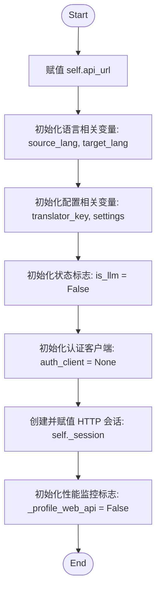
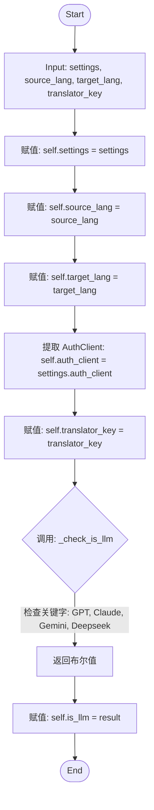
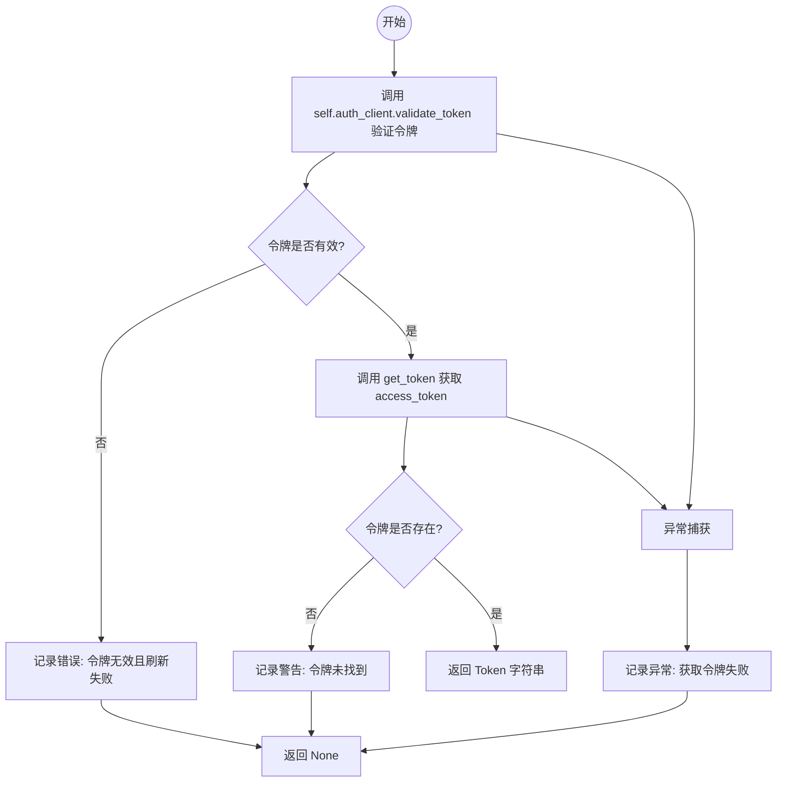
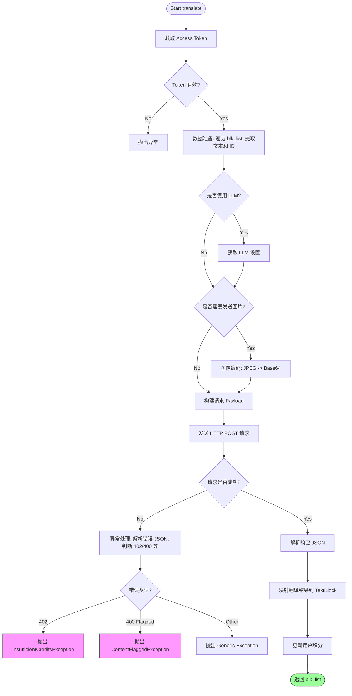
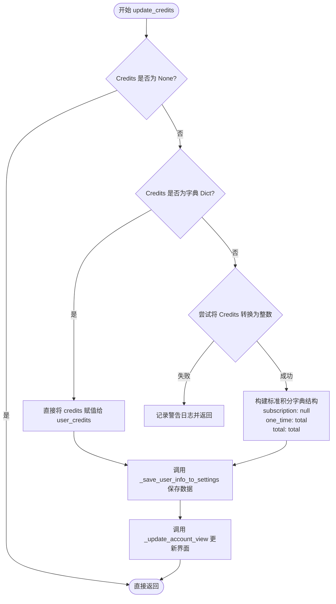

# `comic-translate\modules\translation\user.py` 详细设计文档

UserTranslator 是一个桌面端翻译引擎的实现类，它继承自 TranslationEngine，通过 HTTP 代理将本地的 TextBlock 列表和可选图像请求转发至 Web API，负责处理 OAuth 认证、LLM 上下文选项、图像编码以及积分扣除等核心逻辑。

## 整体流程

```mermaid
graph TD
    A[translate(blk_list, image, extra_context)] --> B[_get_access_token]
    B --> C{Token Valid?}
C -- No --> D[Log Error & Return]
C --> Yes --> E[Prepare Payload: texts]
E --> F{is_llm?}
F -- Yes --> G[Get LLM Settings]
F --> No --> H{Image Provided?}
G --> H
H -- Yes --> I[Encode Image (imkit)]
H --> No --> J[Build Request Body]
I --> J
J --> K[POST to api_url]
K --> L{HTTP Status}
L -- 200 --> M[Parse JSON]
L -- 402 --> N[Raise InsufficientCreditsException]
L -- 400 --> O{Content Flagged?}
O -- Yes --> P[Raise ContentFlaggedException]
L -- Others --> Q[Raise Exception]
M --> R[Update TextBlock translations]
R --> S[update_credits]
S --> T[Return blk_list]
```

## 类结构

```
TranslationEngine (抽象基类)
└── UserTranslator (具体实现类)
```

## 全局变量及字段


### `logger`
    
模块级日志记录器

类型：`logging.Logger`
    


### `UserTranslator.api_url`
    
后端翻译 API 的完整 URL

类型：`str`
    


### `UserTranslator.source_lang`
    
源语言代码

类型：`str`
    


### `UserTranslator.target_lang`
    
目标语言代码

类型：`str`
    


### `UserTranslator.translator_key`
    
选择的翻译器 ID (如 'GPT-4')

类型：`str`
    


### `UserTranslator.settings`
    
桌面应用设置对象，包含用户信息和 LLM 配置

类型：`SettingsPage`
    


### `UserTranslator.is_llm`
    
标记是否为 LLM 翻译器

类型：`bool`
    


### `UserTranslator.auth_client`
    
认证客户端，用于 token 验证

类型：`AuthClient`
    


### `UserTranslator._session`
    
复用的 HTTP 会话

类型：`requests.Session`
    


### `UserTranslator._profile_web_api`
    
性能日志开关

类型：`bool`
    
    

## 全局函数及方法


### `UserTranslator.__init__`

构造函数，用于初始化 `UserTranslator` 类的实例。该方法主要完成 API 端点地址的配置、HTTP 会话的建立，以及用于存储语言对、设置项、认证客户端等状态的实例变量的初始化。

参数：

-  `api_url`：`str`，后端翻译服务的完整 URL 地址，默认为常量 `WEB_API_TRANSLATE_URL`。

返回值：`None`，构造函数不返回值，仅初始化对象状态。

#### 流程图



#### 带注释源码

```python
def __init__(self, api_url: str = WEB_API_TRANSLATE_URL):
    """
    构造函数，初始化 UserTranslator。

    Args:
        api_url: 后端翻译 API 的完整 URL 地址。
    """
    # 1. 存储 API 端点 URL
    self.api_url = api_url
    
    # 2. 初始化源语言和目标语言占位符
    self.source_lang: str = None
    self.target_lang: str = None
    
    # 3. 初始化翻译器密钥（如 "GPT-4.1"）和应用设置对象
    self.translator_key: str = None 
    self.settings: SettingsPage = None 
    
    # 4. 初始化 LLM 判断标志，默认为 False
    self.is_llm: bool = False
    
    # 5. 初始化认证客户端占位符
    self.auth_client: AuthClient = None
    
    # 6. 创建一个持久的 requests Session 对象，用于复用 TCP 连接，提升性能
    self._session = requests.Session()
    
    # 7. 初始化 Web API 性能分析开关，默认为关闭状态
    self._profile_web_api = False
```


### `UserTranslator.initialize`

该方法负责初始化桌面版翻译引擎的核心配置。它接收来自 UI 的设置对象、语言对以及选定的翻译器标识符，将其存储到类实例变量中，并根据翻译器标识符判断其是否为 LLM（大语言模型）类型，以便后续流程区分处理逻辑。

参数：

-  `self`：`UserTranslator`，隐式参数，表示类的实例本身。
-  `settings`：`SettingsPage`，桌面应用程序的设置对象，包含了认证客户端（auth_client）和用户偏好配置。
-  `source_lang`：`str`，源语言名称或代码（例如 "en", "English"）。
-  `target_lang`：`str`，目标语言名称或代码（例如 "zh", "Chinese"）。
-  `translator_key`：`str`，用户在 UI 中选择的翻译器或模型标识符（例如 "GPT-4.1", "Google Translate"）。
-  `**kwargs`：`Any`，可选的关键字参数，用于接收额外的配置（当前方法体中未使用，但保留以保证接口扩展性）。

返回值：`None`，该方法仅修改实例状态，不返回任何数据。

#### 流程图



#### 带注释源码

```python
def initialize(self, settings: SettingsPage, source_lang: str, target_lang: str, translator_key: str, **kwargs) -> None:
    """
    Initialize the UserTranslator.

    Args:
        settings: The desktop application's settings object.
        source_lang: Source language name.
        target_lang: Target language name.
        translator_key: The translator selected in the UI (e.g., "GPT-4.1").
    """
    # 1. 保存设置对象，这是获取配置和认证客户端的入口
    self.settings = settings
    
    # 2. 保存源语言和目标语言
    self.source_lang = source_lang
    self.target_lang = target_lang
    
    # 3. 从 settings 中提取认证客户端，用于后续获取访问令牌
    self.auth_client = settings.auth_client
    
    # 4. 保存当前选定的翻译器 key
    self.translator_key = translator_key
    
    # 5. 判断当前翻译器是否为 LLM，并更新内部状态标志
    #    这会影响后续 translate 方法中的请求体构造逻辑（例如是否发送图片、是否添加 LLM 选项）
    self.is_llm = self._check_is_llm(translator_key)
```


### `UserTranslator._check_is_llm`

该方法通过检查传入的翻译器标识符（`translator_key`）中是否包含预定义的 LLM 关键词（如 "GPT", "Claude" 等），以此判断当前翻译任务是否调用的是 LLM 模型。

#### 参数

- `translator_key`：`str`，用户在 UI 中选定的翻译器 key（例如 "GPT-4.1", "Deepseek-R1" 等）。

#### 返回值

- `bool`，如果 `translator_key` 包含任一 LLM 标识符则返回 `True`，否则返回 `False`。

#### 流程图

```mermaid
flowchart TD
    A[Start _check_is_llm] --> B[定义关键词列表 llm_ids = ['GPT', 'Claude', 'Gemini', 'Deepseek']]
    B --> C{遍历 llm_ids 中的每个 identifier}
    C -->|对于每个 identifier| D{identifier in translator_key?}
    D -->|是 (找到匹配)| E[Return True]
    D -->|否 (未匹配)| C
    C -->|遍历完毕未匹配| F[Return False]
```

#### 带注释源码

```python
def _check_is_llm(self, translator_key: str) -> bool:
    """
    判断给定的翻译器 key 是否对应 LLM 模型。

    Args:
        translator_key: 翻译器标识符字符串。

    Returns:
        bool: 如果 key 中包含 LLM 关键词则返回 True，否则返回 False。
    """
    # 定义常见的 LLM 提供商关键词列表
    llm_ids = ["GPT", "Claude", "Gemini", "Deepseek"]
    
    # 使用 any() 函数进行短路遍历检查
    # 如果 translator_key 中包含列表中的任意一个关键词，则返回 True
    return any(identifier in translator_key for identifier in llm_ids)
```


### `UserTranslator._get_access_token`

该方法是非公开的实例方法，负责获取用于访问后端 Web API 的 OAuth Access Token。它首先验证当前客户端的令牌是否有效，若有效则从令牌存储中检索 `access_token`，若任一环节失败则返回 `None` 并记录错误。

参数：

- `self`：`UserTranslator`，调用此方法的类实例本身。

返回值：`Optional[str]`，返回有效的访问令牌字符串；如果令牌无效、不存在或获取过程中发生异常，则返回 `None`。

#### 流程图



#### 带注释源码

```python
def _get_access_token(self) -> Optional[str]:
    """Retrieves the access token."""
    try:
        # 1. 验证现有令牌是否仍然有效（例如检查过期时间）
        if not self.auth_client.validate_token():
            logger.error("Access token invalid and refresh failed.")
            return None
        
        # 2. 从存储中获取具体的 access_token 字符串
        token = get_token("access_token")
        if not token:
            logger.warning("Access token not found.")
            return None
            
        # 3. 验证通过，返回 token
        return token
    except Exception as e:
        # 4. 捕获任何意外错误（例如存储读写异常），确保方法不抛出异常
        logger.error(f"Failed to retrieve access token: {e}")
        return None
```


### `UserTranslator.translate`

该方法是 `UserTranslator` 类的核心执行方法，负责将桌面应用中的文本块（TextBlock）委托给后端 Web API 进行翻译。它完整地封装了从数据准备、身份验证、图像处理（针对 LLM）、HTTP 请求、异常管理到结果更新的整个生命周期。

参数：

- `blk_list`：`List[TextBlock]`，待翻译的文本块列表，包含原始文本和目标语言信息。
- `image`：`np.ndarray`，可选的图像数据，用于提供视觉上下文（仅在使用 LLM 翻译器时可能用到）。
- `extra_context`：`str`，额外的上下文信息，用于帮助 LLM 更好地理解翻译任务。

返回值：`List[TextBlock]`，返回更新后的文本块列表，其中每个对象都填充了 `translation` 字段。如果发生异常（如余额不足），则抛出特定异常。

#### 流程图



#### 带注释源码

```python
def translate(self, blk_list: List[TextBlock], image: np.ndarray = None, extra_context: str = "") -> List[TextBlock]:
    """
    Sends the translation request to the web API.

    Args:
        blk_list: List of TextBlock objects (desktop version) to translate.
        image: Image as numpy array (Optional, for LLM context).
        extra_context: Additional context information for translation.

    Returns:
        List of updated TextBlock objects with translations or error messages.
    """
    start_t = time.perf_counter()
    logger.info(f"UserTranslator: Translating via web API ({self.api_url}) for {self.translator_key}")

    # 1. 数据准备: 获取访问令牌
    access_token = self._get_access_token()
    after_token_t = time.perf_counter()

    # 2. 数据准备: 构建文本 Payload
    # 将 TextBlock 对象转换为 API 所需的 ID-Text 映射结构
    texts_payload = []
    for i, blk in enumerate(blk_list):
        block_id = getattr(blk, 'id', i) # 优先使用块自身ID，否则使用索引
        texts_payload.append({"id": block_id, "text": blk.text})

    # 3. 数据准备: 获取 LLM 选项 (如果适用)
    llm_options_payload = None
    if self.is_llm and self.settings:
        # 从桌面设置对象中获取 LLM 配置
        llm_settings = self.settings.get_llm_settings() 
        llm_options_payload = {
            "image_input_enabled": llm_settings.get('image_input_enabled', False)
        }

    # 4. 数据准备: 图像编码 (如果适用)
    # 条件：启用了 LLM、提供了图片、且 LLM 设置中开启了图片输入
    image_base64_payload = None
    should_send_image = (
        self.is_llm
        and image is not None
        and llm_options_payload
        and llm_options_payload.get("image_input_enabled")
    )
     
    if should_send_image:
        # 使用 JPEG 格式以减小传输载荷体积
        buffer = imk.encode_image(image, "jpg")
        image_base64_payload = base64.b64encode(buffer).decode('utf-8')
        logger.debug("UserTranslator: Encoded image for web API request.")
    after_encode_t = time.perf_counter()

    # 5. 数据准备: 构建完整请求体
    request_payload = {
        "translator": self.translator_key,
        "source_language": self.source_lang,
        "target_language": self.target_lang,
        "texts": texts_payload,
    }

    # 根据条件附加可选字段
    if image_base64_payload is not None:
        request_payload["image_base64"] = image_base64_payload
    if llm_options_payload is not None:
        request_payload["llm_options"] = llm_options_payload
        request_payload["extra_context"] = extra_context

    # 6. HTTP 请求: 发送请求
    client_os = get_client_os()
    headers = {
        "Content-Type": "application/json",
        "Authorization": f"Bearer {access_token}",
        "X-Client-OS": client_os
    }

    # 发起网络请求，设置超时时间为 120 秒
    response = self._session.post(
        self.api_url, 
        headers=headers, 
        json=request_payload, 
        timeout=120
    ) 
    after_request_t = time.perf_counter()
    
    # 7. 异常管理: 处理 HTTP 错误
    try:
        response.raise_for_status()
    except requests.exceptions.HTTPError as e:
        # 尝试解析服务器返回的错误详情
        try:
            error_data = response.json()
            detail = error_data.get('detail')
            description = ""

            # 处理不同结构的 detail (字符串, 字典, 或列表/验证错误)
            if isinstance(detail, dict):
                description = detail.get('error_description') or detail.get('message')
                if not description and detail.get('type'):
                    description = f"Error type: {detail.get('type')}"
            elif isinstance(detail, list):
                # Pydantic 验证错误列表
                msgs = []
                for err in detail:
                    loc = ".".join(str(x) for x in err.get('loc', []))
                    msg = err.get('msg', '')
                    msgs.append(f"{loc}: {msg}")
                description = "; ".join(msgs)
            else:
                description = str(detail) if detail else ""

            # 状态码 402: 积分不足
            if response.status_code == 402:
                if isinstance(detail, dict) and detail.get('type') == 'INSUFFICIENT_CREDITS':
                    raise InsufficientCreditsException(description)
                raise InsufficientCreditsException(description)
            
            # 状态码 400: 内容被标记/安全检查失败
            if response.status_code == 400:
                is_flagged = False
                if isinstance(detail, dict) and detail.get('type') == 'CONTENT_FLAGGED_UNSAFE':
                    is_flagged = True
                elif "flagged as unsafe" in str(description).lower() or "blocked by" in str(description).lower():
                    is_flagged = True
                
                if is_flagged:
                    raise ContentFlaggedException(description, context="Translation")

            # 其他错误: 抛出通用异常
            if description:
                raise Exception(f"Server Error ({response.status_code}): {description}") from e

        except ValueError:
            # JSON 解析失败，仅抛出原始错误
            pass
        # 重新抛出原始 HTTP 错误
        raise e

    # 8. 响应处理: 更新数据
    if response.status_code == 200:
        response_data = response.json()
        # 构建 ID -> Translation 的映射字典
        translations_map = {item['id']: item['translation'] for item in response_data.get('translations', [])}
        credits_info = response_data.get('credits') or response_data.get('credits_remaining')

        logger.info(f"UserTranslator: Received successful response from web API. Credits: {credits_info}")

        # 将翻译结果回填到 TextBlock 对象
        for i, blk in enumerate(blk_list):
            block_id = getattr(blk, 'id', i)
            blk.translation = translations_map.get(block_id, "")

        # 更新本地积分状态
        self.update_credits(credits_info)

    # 性能分析日志 (如果开启)
    if self._profile_web_api:
        total_t = time.perf_counter() - start_t
        server_ms = response.headers.get("X-CT-Server-Duration-Ms")
        logger.info(...)
        print(...)

    # 9. 结果返回
    return blk_list
```


### `UserTranslator.update_credits`

该方法负责解析从翻译 API 返回的用户积分（Credits）数据，并将其更新到本地应用程序的设置（Settings）中，同时触发界面更新。

参数：

-  `credits`：`Optional[Any]`，从 API 返回的积分数据，通常为包含余额详情的字典（dict），也可能是一个整数（int）类型的总数。

返回值：`None`，该方法无返回值，主要通过修改 `self.settings` 对象的状态来更新数据。

#### 流程图



#### 带注释源码

```python
def update_credits(self, credits: Optional[Any]) -> None:
    """
    解析并更新本地用户积分信息。

    Args:
        credits: 从翻译 API 返回的积分数据。
    """
    # 1. 如果 API 未返回积分数据，则直接跳过更新
    if credits is None:
        return

    # 2. 判断积分数据的类型
    if isinstance(credits, dict):
        # 如果是字典（通常包含 subscription, one_time 等详细字段），直接赋值
        self.settings.user_credits = credits
    else:
        # 3. 如果不是字典，尝试将其作为总数（整数）处理
        try:
            total = int(credits)
            # 构建标准格式的积分字典
            self.settings.user_credits = {
                'subscription': None,
                'one_time': total,
                'total': total,
            }
        except Exception:
            # 如果类型转换失败（例如传入了无法解析的字符串），记录警告并停止
            logger.warning(f"UserTranslator: Unexpected credits format: {credits}")
            return

    # 4. 持久化更新：将新的积分信息写入本地配置文件
    self.settings._save_user_info_to_settings()
    
    # 5. 视图更新：刷新用户界面上显示的积分余额
    self.settings._update_account_view()
```

## 关键组件


### UserTranslator 类

桌面翻译引擎，代理用户请求到Web API端点，利用用户账户积分和服务器端配置设置。

### translate 方法

核心翻译流程，包含获取令牌、构建payload、图像编码、发送HTTP请求、处理响应的完整流程，支持LLM和普通翻译模式。

### _get_access_token 方法

验证并获取用户访问令牌，确保请求认证合法性。

### _check_is_llm 方法

根据翻译器标识符判断是否为LLM翻译（GPT/Claude/Gemini/Deepseek）。

### 图像编码组件

将numpy数组图像编码为JPEG格式的Base64字符串，根据LLM设置决定是否发送图像。

### 错误处理组件

处理402积分不足、400内容违规、500服务器错误等异常情况，解析详细错误描述并转换为自定义异常。

### update_credits 方法

解析并更新用户积分信息，支持字典和整数格式，保存到设置并更新UI。

### 请求Payload构建组件

整合翻译器密钥、语言对、文本列表、图像和LLM选项构建完整API请求体。

### 响应解析组件

解析API返回的翻译结果映射，更新TextBlock对象的translation字段。


## 问题及建议


### 已知问题

- **类型注解不严格**：多处使用 `Any` 类型（如 `credits: Optional[Any]`），降低了类型安全性和代码可维护性。
- **硬编码配置值**：超时时间 `timeout=120`、LLM ID 列表 `["GPT", "Claude", "Gemini", "Deepseek"]` 等硬编码在方法中，配置变更需要修改源码。
- **异常处理不完善**：在 `_get_access_token` 中捕获所有异常后仅记录日志返回 `None`，无法区分网络错误、认证失败等不同情况；在 HTTP 错误处理中 JSON 解析失败时使用空的 `pass`，可能丢失重要错误信息。
- **Token 获取逻辑脆弱**：`validate_token()` 返回 `False` 时没有重试机制或具体错误信息，且 `get_token("access_token")` 失败时仅返回 `None` 导致后续请求失败。
- **API 响应兼容性强但脆弱**：代码同时兼容 `credits` 和 `credits_remaining` 字段、`translations` 字段，缺少对响应结构的验证，API 变更可能导致静默失败。
- **同步阻塞请求**：使用 `requests.Session().post()` 是同步调用，在网络延迟高时会阻塞线程，影响用户体验。
- **资源管理缺失**：`_session` 长时间存活但未配置连接池参数（如 `max_retries`），也未在对象销毁时显式关闭。
- **私有方法调用风险**：直接调用 `settings._save_user_info_to_settings()` 和 `settings._update_account_view()` 私有方法，暴露了内部实现细节，增加了耦合度。

### 优化建议

- **提取配置到常量或配置文件**：将超时时间、LLM ID 列表等提取为类常量或配置类，提高可维护性。
- **增强异常分类**：区分不同类型的异常（如网络异常、认证异常），为每种情况设计不同的处理策略。
- **增加 Token 刷新重试机制**：在 `validate_token()` 失败时主动触发刷新逻辑，或增加重试次数。
- **添加响应结构验证**：使用 Pydantic 等工具验证 API 响应结构，确保必要字段存在。
- **考虑异步实现**：评估改用 `httpx` 或 `aiohttp` 实现异步请求的可行性，提升并发处理能力。
- **配置连接池和重试**：为 `requests.Session` 配置 `max_retries` 和适当的连接池大小。
- **使用公开接口**：通过公开的方法或事件机制更新 UI 和保存设置，减少对内部实现的依赖。
- **添加重试机制**：对于临时性网络错误，增加自动重试逻辑而非单纯依赖长超时。

## 其它


### 设计目标与约束

**设计目标**
1. 实现桌面翻译引擎与Web API的无缝对接，通过用户账户积分进行翻译计费
2. 支持传统机器翻译和LLM（大语言模型）翻译两种模式
3. 最小化网络传输开销，通过JPEG压缩和按需发送图像数据
4. 提供完整的错误处理和用户反馈机制

**设计约束**
1. 依赖Web API的可用性，离线状态下无法使用
2. 请求超时限制为120秒
3. 图像传输仅支持JPEG格式以优化带宽
4. LLM翻译功能受服务器端配置的`image_input_enabled`开关控制
5. 需严格遵循服务器端的认证和授权机制

### 错误处理与异常设计

**异常类型**
1. `InsufficientCreditsException`：当服务器返回402状态码且错误类型为`INSUFFICIENT_CREDITS`时抛出，表示用户积分不足
2. `ContentFlaggedException`：当服务器返回400状态码且错误类型为`CONTENT_FLAGGED_UNSAFE`或描述中包含"flagged as unsafe"/"blocked by"时抛出，表示内容被安全审查拦截
3. `Exception`：通用服务器错误，当其他HTTP错误（400/500等）发生时抛出，携带服务器返回的具体错误描述

**错误处理策略**
1. 认证失败时记录错误日志并返回None，后续请求将失败
2. Token刷新失败时直接返回None，不尝试重复刷新
3. HTTP错误优先尝试解析JSON响应体提取详细错误信息
4. JSON解析失败时回退到原始HTTP错误抛出
5. 积分更新异常时仅记录警告，不中断翻译流程

**错误传播链**
- 网络层：`requests.exceptions.HTTPError`
- 业务层：`InsufficientCreditsException`, `ContentFlaggedException`, `Exception`
- 日志层：所有异常均记录详细上下文信息

### 数据流与状态机

**数据输入流**
```
TextBlock列表 + (可选)图像数组 + (可选)额外上下文
        ↓
    认证Token获取
        ↓
    请求Payload构建
        ↓
    图像编码(仅LLM模式且启用图像输入)
        ↓
    HTTP POST请求
        ↓
    响应处理
        ↓
    TextBlock对象更新
        ↓
    积分信息更新
```

**状态转换**
1. **初始化态** → `initialize()` → **就绪态**
2. **就绪态** → `translate()` → **翻译中态**
3. **翻译中态** → 成功响应 → **就绪态**（更新积分）
4. **翻译中态** → 异常 → **错误态**（抛出异常）
5. **任意态** → `update_credits()` → **积分更新态**

**关键数据节点**
- `access_token`：Bearer认证令牌，每请求获取一次
- `texts_payload`：包含id和text的字典列表
- `image_base64_payload`：Base64编码的JPEG图像（仅特定条件下）
- `translations_map`：id到translation的映射字典
- `credits_info`：服务器返回的积分信息

### 外部依赖与接口契约

**外部依赖**
1. `requests`：HTTP客户端库，用于向Web API发送请求
2. `imkit` (imk)：图像编码库，提供`encode_image()`方法
3. `numpy`：数组处理，用于图像数据表示
4. `app.account.auth.auth_client.AuthClient`：认证客户端，提供token验证
5. `app.account.auth.token_storage.get_token`：Token存储访问
6. `app.ui.settings.settings_page.SettingsPage`：桌面设置对象
7. `app.account.config.WEB_API_TRANSLATE_URL`：Web API端点URL配置

**接口契约**

*TranslationEngine抽象类*
- `translate(blk_list, image, extra_context) -> List[TextBlock]`：必须实现的翻译方法
- `initialize(settings, source_lang, target_lang, translator_key, **kwargs)`：初始化方法
- `update_credits(credits)`：积分更新方法

*Web API请求格式*
```json
{
  "translator": "string",
  "source_language": "string",
  "target_language": "string",
  "texts": [{"id": "any", "text": "string"}],
  "image_base64": "string (optional)",
  "llm_options": {"image_input_enabled": "boolean (optional)"},
  "extra_context": "string (optional)"
}
```

*Web API响应格式*
```json
{
  "translations": [{"id": "any", "translation": "string"}],
  "credits": {"subscription": "int", "one_time": "int", "total": "int} (optional)",
  "credits_remaining": "int (optional)"
}
```

*HTTP头部要求*
- `Content-Type: application/json`
- `Authorization: Bearer <token>`
- `X-Client-OS: <os_identifier>`

### 并发与线程安全

**当前实现分析**
- `UserTranslator`实例通常由单个线程使用
- `_session`是`requests.Session()`对象，线程不安全
- `settings`对象被共享访问用于积分更新

**建议**
1. 线程池场景下每个线程应创建独立的`UserTranslator`实例
2. 或对`_session`访问进行锁保护
3. `settings`的`_save_user_info_to_settings()`和`_update_account_view()`操作需考虑原子性

### 性能考量

**耗时分布监控**
代码内置性能分析（`_profile_web_api`标志），记录：
- `token`：获取access token耗时
- `encode`：图像JPEG编码和Base64转换耗时
- `http`：网络请求往返耗时
- `total`：总耗时

**优化建议**
1. Token可考虑缓存并设置合理过期时间，减少每请求获取开销
2. 图像编码可考虑异步执行
3. 大批量文本翻译可考虑分批请求

### 安全性考虑

1. **认证安全**：Token存储和传输使用安全机制，避免明文泄露
2. **输入验证**：文本和图像内容在发送前需经过基本验证
3. **错误信息脱敏**：面向用户的错误信息需避免泄露内部系统细节
4. **HTTPS强制**：生产环境应确保API URL使用HTTPS协议

### 可测试性设计

**可测试特性**
1. `_check_is_llm()`：纯函数，易于单元测试
2. `_get_access_token()`：依赖注入mock点
3. `translate()`：可通过mock `requests.Session.post()`进行集成测试

**测试覆盖建议**
1. LLM标识判断逻辑覆盖
2. 各种HTTP状态码的错误处理分支
3. 图像编码条件判断分支
4. 积分解析不同格式的兼容性

    