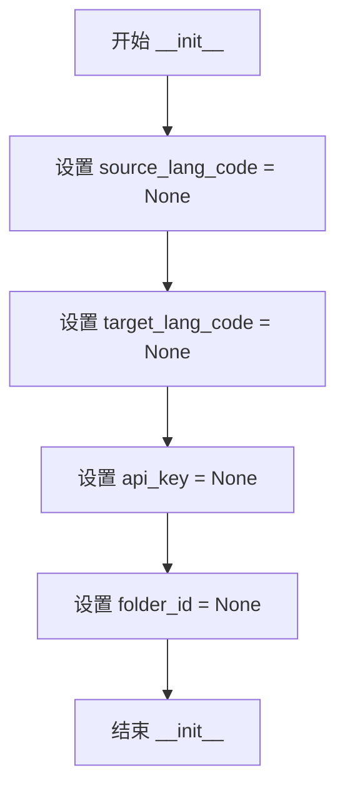
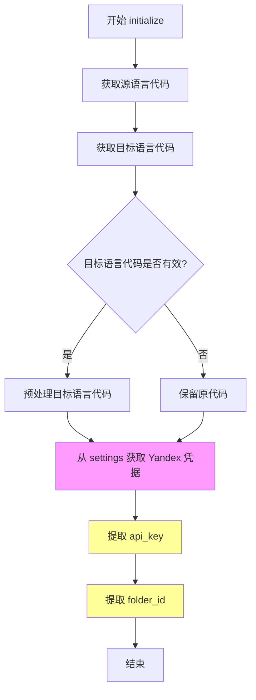
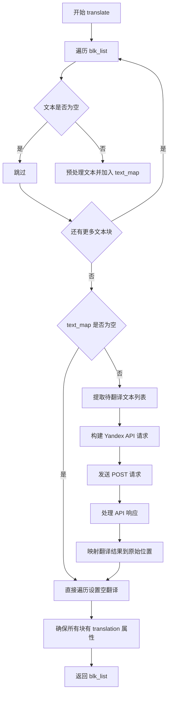
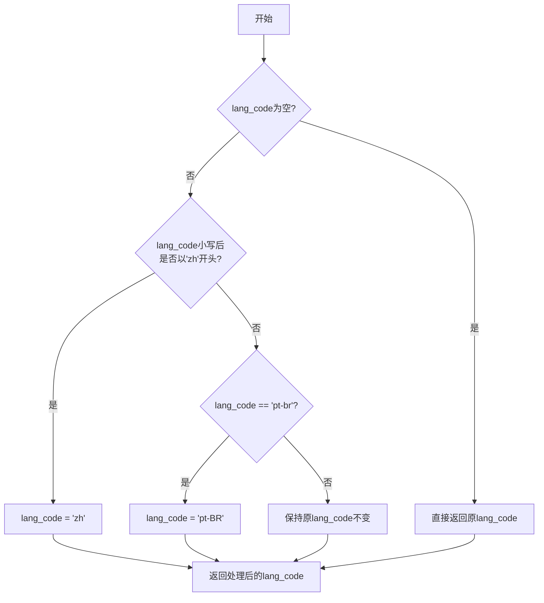

# `comic-translate\modules\translation\yandex.py` 详细设计文档

基于Yandex Translate API的翻译引擎实现类，继承自TraditionalTranslation基类，负责将文本块列表通过Yandex云翻译服务进行多语言翻译，支持语言代码预处理、API认证和响应映射

## 整体流程

```mermaid
graph TD
    A[开始 translate] --> B{blk_list 是否为空?}
    B -- 是 --> C[直接返回原列表]
    B -- 否 --> D[遍历 blk_list]
    D --> E[调用 preprocess_text 预处理文本]
    E --> F{文本是否为空?}
    F -- 是 --> G[跳过该文本]
    F -- 否 --> H[构建 text_map 映射]
    H --> I{text_map 是否为空?}
    I -- 否 --> J[构建 API 请求参数]
    J --> K[发送 POST 请求到 Yandex Translate API]
    K --> L{response.raise_for_status()?}
    L -- 抛出异常 --> M[返回 HTTP 错误]
    L -- 正常 --> N[解析 JSON 响应]
    N --> O[提取 translations 数组]
    O --> P[遍历翻译结果并映射回 blk_list]
    I -- 是 --> Q[确保所有 blk 有 translation 属性]
    P --> Q
    Q --> R[返回 blk_list]
```

## 类结构

```
TraditionalTranslation (抽象基类)
└── YandexTranslation (Yandex翻译引擎实现)
```

## 全局变量及字段


### `YandexTranslation.source_lang_code`
    
源语言代码

类型：`Optional[str]`
    


### `YandexTranslation.target_lang_code`
    
目标语言代码

类型：`Optional[str]`
    


### `YandexTranslation.api_key`
    
Yandex API密钥

类型：`str`
    


### `YandexTranslation.folder_id`
    
Yandex文件夹ID

类型：`str`
    
    

## 全局函数及方法


### `YandexTranslation.__init__`

初始化 Yandex 翻译引擎的实例，设置翻译语言代码、API 密钥和文件夹 ID 为初始状态。

参数： 无（除隐式参数 `self`）

返回值：`None`，无返回值，仅初始化实例属性

#### 流程图



#### 带注释源码

```python
def __init__(self):
    """初始化 YandexTranslation 类的实例属性"""
    # 源语言代码，初始化为 None，后续通过 initialize 方法设置
    self.source_lang_code = None
    
    # 目标语言代码，初始化为 None，后续通过 initialize 方法设置
    self.target_lang_code = None
    
    # Yandex API 密钥，初始化为 None，从设置中获取
    self.api_key = None
    
    # Yandex 文件夹 ID，初始化为 None，用于 API 请求认证
    self.folder_id = None
```


### `YandexTranslation.initialize`

该方法用于初始化 Yandex 翻译引擎的设置和凭据，通过获取源语言和目标语言的语言代码，并从设置中提取 Yandex API 的认证信息（api_key 和 folder_id）。

参数：

- `settings`：`Any`，应用程序的设置对象，用于获取凭据信息
- `source_lang`：`str`，源语言名称或代码
- `target_lang`：`str`，目标语言名称或代码

返回值：`None`，该方法仅执行初始化操作，不返回任何值

#### 流程图



#### 带注释源码

```python
def initialize(self, settings: Any, source_lang: str, target_lang: str) -> None:
    # 将源语言名称/代码转换为 Yandex 需要的语言代码格式
    # 并存储到实例变量 source_lang_code 中
    self.source_lang_code = self.get_language_code(source_lang)
    
    # 将目标语言名称/代码转换为语言代码
    target_code = self.get_language_code(target_lang)
    
    # 对目标语言代码进行预处理，例如：
    # - 所有以 'zh' 开头的语言统一转换为 'zh'
    # - 'pt-br' 转换为 'pt-BR'（符合 Yandex API 格式要求）
    self.target_lang_code = self.preprocess_language_code(target_code)

    # 从 settings 中获取 Yandex 翻译服务的凭据
    # settings.ui.tr("Yandex") 用于获取本地化的配置项名称
    credentials = settings.get_credentials(settings.ui.tr("Yandex"))
    
    # 提取 API Key，用于 Yandex Translate API 的身份验证
    # 如果凭据中不存在该字段，则默认为空字符串
    self.api_key = credentials.get('api_key', '')
    
    # 提取 Folder ID，Yandex Cloud 中用于标识特定文件夹的资源ID
    # 对于用户账户，这是必需参数；如果不存在则默认为空字符串
    self.folder_id = credentials.get('folder_id', '')
```


### `YandexTranslation.translate`

该方法是Yandex翻译引擎的核心翻译执行方法，接收待翻译的TextBlock列表，调用Yandex Translate API进行翻译处理，过滤空文本后将翻译结果映射回原始文本块，最终返回包含翻译内容的文本块列表。

参数：

- `blk_list`：`list[TextBlock]`，待翻译的文本块列表，每个TextBlock对象包含待翻译的原始文本

返回值：`list[TextBlock]`，翻译完成后的文本块列表，每个文本块的translation属性将被填充翻译结果

#### 流程图



#### 带注释源码

```
def translate(self, blk_list: list[TextBlock]) -> list[TextBlock]:
    """执行翻译操作，将文本块列表发送给Yandex翻译API并返回翻译结果"""
    
    # 步骤1：过滤空文本，构建索引映射
    # text_map 用于存储非空文本及其在原始列表中的索引
    text_map = {}
    for i, blk in enumerate(blk_list):
        # 使用源语言代码对待翻译文本进行预处理
        text = self.preprocess_text(blk.text, self.source_lang_code) 
        # 仅保留非空文本用于翻译
        if text.strip():
            text_map[i] = text
    
    # 步骤2：如果有待翻译文本，则调用API
    if text_map:
        # 提取待翻译的文本值列表
        texts_to_translate = list(text_map.values())
        
        # 准备Yandex翻译API的请求端点
        url = "https://translate.api.cloud.yandex.net/translate/v2/translate"
        
        # 设置请求头，包含内容类型和API密钥认证
        headers = {
            "Content-Type": "application/json",
            "Authorization": f"Api-Key {self.api_key}"
        }
        
        # 构建请求体，指定目标语言、文本内容和folderId（必需参数）
        body = {
            "texts": texts_to_translate,
            "targetLanguageCode": self.target_lang_code,
            "format": "PLAIN_TEXT",
            "folderId": self.folder_id  # 用户账户必须提供此参数
        }
        
        # 步骤3：发送HTTP POST请求到Yandex翻译API，设置30秒超时
        response = requests.post(
            url, 
            headers=headers, 
            json=body,
            timeout=30
        )
        # 检查HTTP响应状态，非200则抛出异常
        response.raise_for_status()
        
        # 步骤4：解析JSON响应，提取翻译结果
        result = response.json()
        translations = result.get("translations", [])
        
        # 步骤5：将翻译结果映射回原始文本块的位置
        indices = list(text_map.keys())
        for i, translation in enumerate(translations):
            if i < len(indices):
                idx = indices[i]
                # 将翻译文本写入对应文本块的translation属性
                blk_list[idx].translation = translation.get("text", "")
    
    # 步骤6：确保所有文本块都有translation属性，空文本块设为空字符串
    for blk in blk_list:
        if not hasattr(blk, 'translation') or blk.translation is None:
            blk.translation = ""
            
    # 返回翻译完成后的文本块列表
    return blk_list
```


### `YandexTranslation.preprocess_language_code`

该方法用于将用户输入的目标语言代码进行标准化处理，处理中文语言代码的简写形式（zh-* 系列统一为 "zh"）以及巴西葡萄牙语的特定格式转换（pt-br 转为 pt-BR），以适配 Yandex Translate API 的语言代码要求。

参数：

- `self`：当前类实例，包含 `source_lang_code`、`target_lang_code`、`api_key`、`folder_id` 等属性
- `lang_code`：`str`，待预处理的目标语言代码（如 "zh-CN"、"pt-br"、"en" 等）

返回值：`str`，返回标准化处理后的语言代码

#### 流程图



#### 带注释源码

```python
def preprocess_language_code(self, lang_code: str) -> str:
    """预处理语言代码，标准化为Yandex API接受的格式。
    
    处理规则:
    - 空值直接返回
    - 中文系列(zh-CN, zh-TW等)统一转为'zh'
    - 巴西葡萄牙语'pt-br'转为'pt-BR'
    
    Args:
        lang_code: 原始语言代码字符串
        
    Returns:
        标准化后的语言代码字符串
    """
    # 空值检查，直接返回
    if not lang_code:
        return lang_code
        
    # 处理中文语言代码简写
    # Yandex API将所有中文变体统一使用'zh'代码
    if lang_code.lower().startswith('zh'):
        lang_code = 'zh'

    # 处理巴西葡萄牙语的特定格式要求
    # Yandex API要求使用'pt-BR'而非'pt-br'
    elif lang_code == 'pt-br':
        lang_code = 'pt-BR' 
        
    # 返回标准化后的语言代码
    return lang_code
```

## 关键组件


### YandexTranslation 类

Yandex翻译引擎的核心实现类，继承自TraditionalTranslation，负责调用Yandex Translate API进行文本翻译。

### API 请求构建与发送

负责构建符合Yandex API要求的HTTP请求，包括认证头(Authorization: Api-Key)、请求体(folderId、targetLanguageCode等必需参数)，并通过requests.post发送请求。

### 翻译结果映射机制

使用text_map字典存储非空文本及其原始索引，翻译完成后通过indices列表将翻译结果准确回填到原始blk_list的对应位置。

### 语言代码预处理

preprocess_language_code方法处理语言代码转换，将'zh'开头的中文代码统一为'zh'，将'pt-br'转换为'pt-BR'以符合API要求。

### 文本预处理与过滤

在翻译前过滤空文本，只保留有实际内容的文本块进行API调用，同时对每个文本块调用preprocess_text进行预处理。

### 错误处理与响应解析

使用response.raise_for_status()处理HTTP错误，解析JSON响应并提取translations数组，最后确保所有blk_list中的文本块都有translation属性。

### 认证凭证管理

通过settings.get_credentials获取Yandex API的api_key和folder_id凭证，其中folderId是用户账户的必需参数。


## 问题及建议


### 已知问题

- 缺少网络请求的重试机制，API调用失败时直接抛出异常，缺乏 Exponential Backoff 策略
- 未使用 `requests.Session()` 进行连接复用，每次翻译请求都创建新连接，性能开销较大
- 硬编码了 API URL `"https://translate.api.cloud.yandex.net/translate/v2/translate"`，无法灵活配置
- 未对 `api_key` 和 `folder_id` 进行有效性验证，初始化时无法感知凭证错误
- 缺少日志记录，无法追踪翻译请求的成功失败状态和调试问题
- 未对大批量文本进行分批处理，可能触发 Yandex API 的请求大小限制
- `translate` 方法中直接修改传入的 `blk_list` 对象，可能产生副作用，函数纯度不足
- 缺少对 `response.json()` 解析异常的处理，API 返回非 JSON 响应时会抛出未捕获异常
- 未实现请求超时后的自定义错误处理，`timeout=30` 固定在代码中不可配置

### 优化建议

- 使用 `requests.Session()` 替代单次 `requests.post()` 调用，启用连接池提升性能
- 引入重试库（如 `tenacity`）或手动实现重试逻辑，设置指数退避和最大重试次数
- 将 API URL 提取为配置项或构造函数参数，便于环境切换
- 在 `initialize` 方法中添加凭证有效性检查（如发送测试请求或验证字段非空）
- 添加标准日志模块 (`logging`) 记录请求状态、耗时、错误信息
- 实现批量翻译的分块处理，将 `texts_to_translate` 按固定大小（如 100 条）拆分
- 考虑添加翻译结果缓存机制，减少重复翻译请求
- 将超时时间参数化，允许调用方根据网络环境调整
- 增强异常处理，为不同错误场景定义自定义异常类，提供更友好的错误信息

## 其它


### 设计目标与约束

本模块旨在实现一个基于Yandex Translator API的翻译引擎，将TextBlock列表中的文本翻译成目标语言。设计目标包括：支持多种语言对翻译、处理空文本、预处理语言代码以适配API要求、确保线程安全的API调用。约束条件包括：需要有效的Yandex API密钥和folder_id、仅支持PLAIN_TEXT格式、目标语言代码需符合Yandex要求（如"zh"表示中文、"pt-BR"表示巴西葡萄牙语）。

### 错误处理与异常设计

代码中通过response.raise_for_status()捕获HTTP错误，对于空文本直接跳过翻译流程，未找到API密钥或folder_id时使用空字符串。对于网络超时设置30秒超时限制。若API返回非200状态码或JSON解析失败，将抛出requests库的异常。空文本块会被赋予空翻译结果。潜在改进：可添加重试机制处理临时网络故障、记录详细错误日志、针对不同API错误码提供具体错误信息。

### 数据流与状态机

数据流：初始化阶段获取API凭证和语言代码 → 翻译阶段过滤空文本并预处理 → 调用Yandex API → 解析响应并将翻译结果映射回原TextBlock列表 → 处理未翻译的空文本块。状态机包含：初始化状态（设置语言代码和凭证）→ 就绪状态（可执行翻译）→ 翻译中状态（调用API）→ 完成状态（返回结果）或错误状态（抛出异常）。

### 外部依赖与接口契约

外部依赖：requests库用于HTTP请求、TraditionalTranslation基类提供通用翻译接口和工具方法、TextBlock数据结构定义文本块结构、settings对象提供凭据管理接口。接口契约：initialize方法接收settings对象和源/目标语言字符串，无返回值；translate方法接收TextBlock列表并返回处理后的列表；preprocess_language_code方法接收语言代码字符串并返回处理后的代码字符串。需保证self.api_key和self.folder_id在translate调用前已通过initialize设置。

### 安全性考虑

API密钥和folder_id通过credentials参数传入，应安全存储避免硬编码。Authorization头使用Api-Key前缀传递密钥，HTTPS确保传输安全。潜在风险：空API密钥会导致认证失败、folder_id为空可能触发API错误。建议添加密钥有效性检查和敏感信息日志脱敏。

### 性能考虑

当前实现逐批翻译所有文本（单次API调用），对于大批量翻译需注意API限制。30秒超时适合一般场景，但大文本量可能需要调整。每次translate调用都会新建HTTP连接，可考虑使用session复用连接。空文本过滤减少无效API调用。

### 配置管理

通过initialize方法的settings参数获取凭据，需外部系统提供Yandex相关的api_key和folder_id。语言代码预处理逻辑内嵌在preprocess_language_code方法中，支持"zh"简写和"pt-br"到"pt-BR"的转换。若需支持更多语言映射规则，建议抽取为配置或策略模式。

### 测试策略建议

应覆盖：正常翻译流程、API认证失败处理、网络超时处理、空文本输入、全部为空文本、单文本翻译、JSON响应格式异常、语言代码预处理各种边界情况。建议使用mock requests库进行单元测试，避免真实API调用。


    