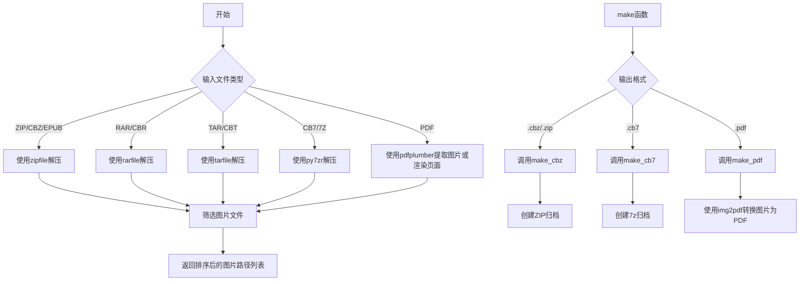
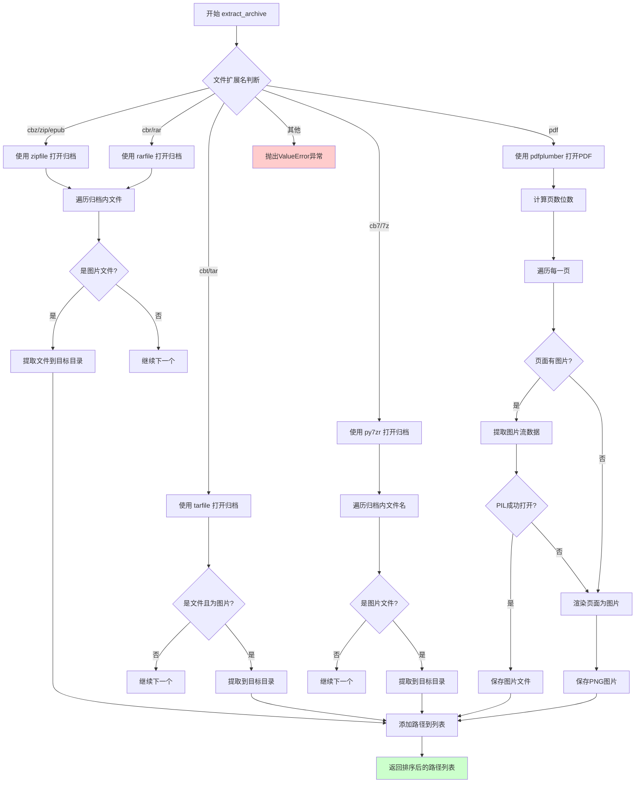
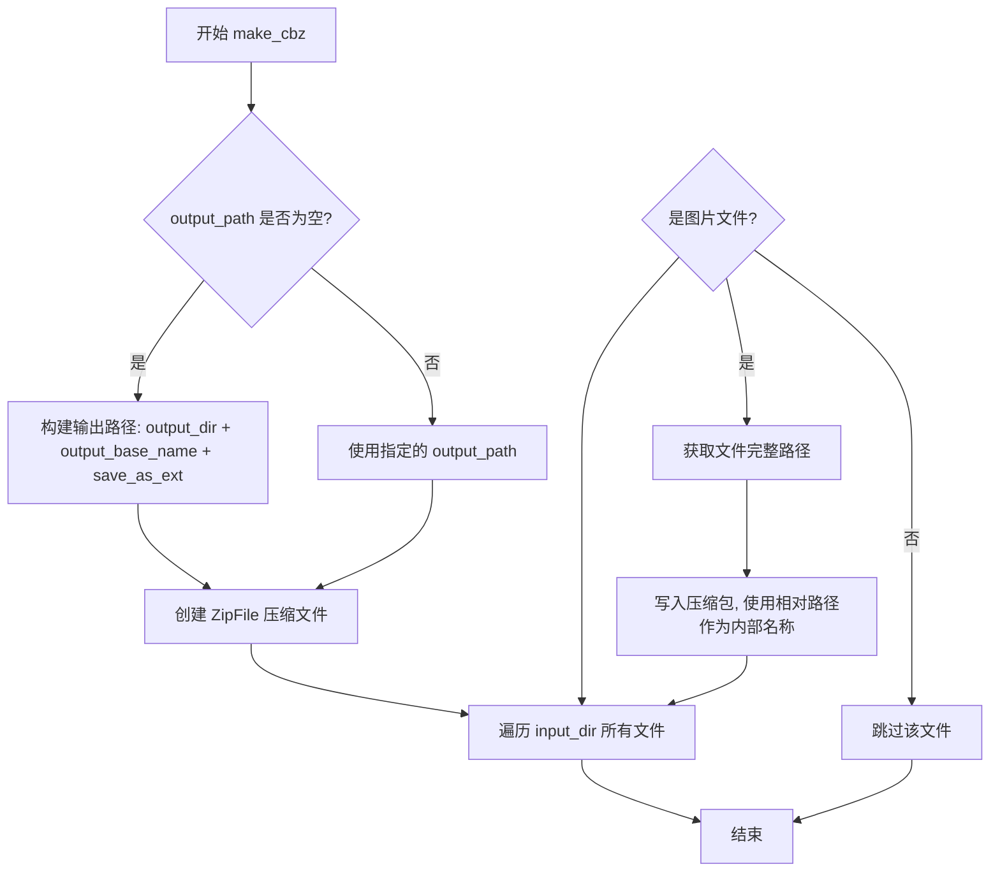
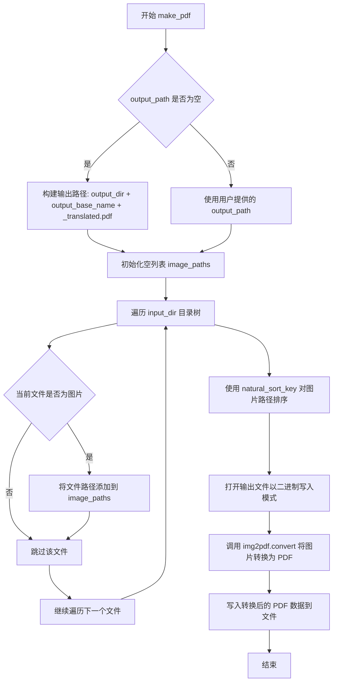
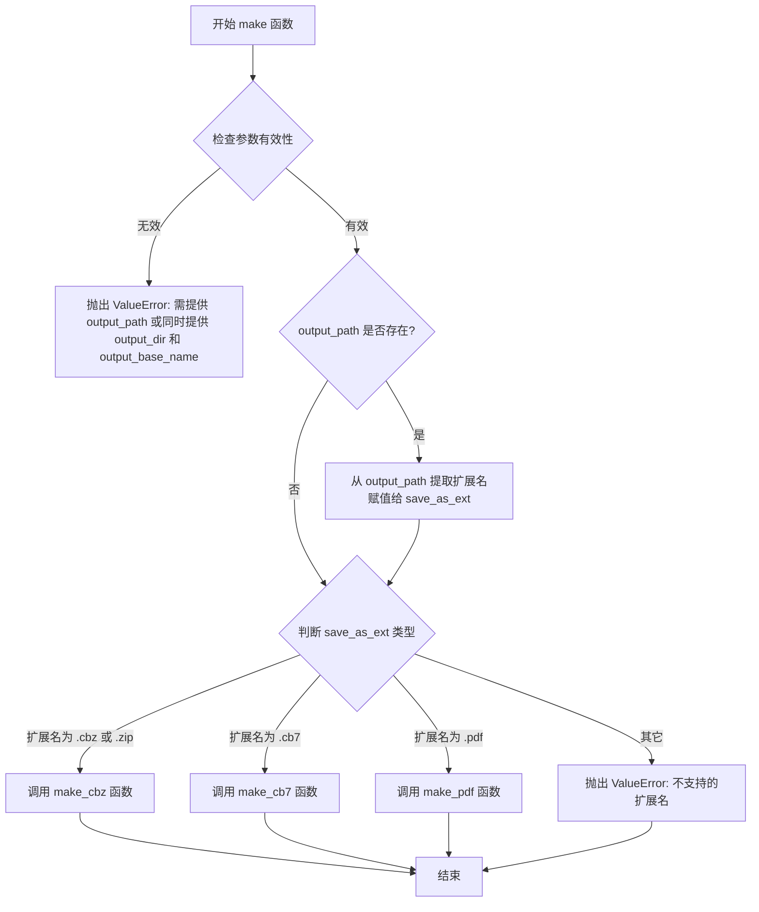

# `comic-translate\modules\utils\archives.py` 详细设计文档

这是一个漫画/电子书归档处理工具，支持从多种压缩格式（ZIP/CBZ/CB7/7Z/RAR/CBR/TAR/CBT/PDF/EPUB）中提取图片文件，并能将图片重新打包为CBZ、CB7或PDF格式的归档文件。

## 整体流程



## 类结构

```
模块 archive_handler (无类定义，仅包含全局函数)
├── 全局变量
│   └── SUPPORTED_SAVE_AS_EXTS
├── 工具函数
│   ├── resolve_save_as_ext
│   ├── natural_sort_key
│   └── is_image_file
├── 提取函数
│   └── extract_archive
└── 创建函数
    ├── make_cbz
    ├── make_cb7
    ├── make_pdf
    └── make
```

## 全局变量及字段


### `SUPPORTED_SAVE_AS_EXTS`
    
支持的文件保存格式扩展名集合，包含.pdf、.cbz、.cb7和.zip

类型：`set[str]`
    


    

## 全局函数及方法


### `resolve_save_as_ext`

该函数用于解析自动保存的翻译档案的输出归档扩展名，根据用户指定的 `save_as` 参数或默认设置返回受支持的归档格式扩展名（如 `.zip`、`.pdf`、`.cbz`、`.cb7`）。

参数：

- `input_archive_ext`：`str`，输入档案的扩展名（除向后兼容的调用者外，该参数被忽略）
- `save_as`：`str | None`，可选参数，用于强制指定输出档案的扩展名

返回值：`str`，解析后的输出归档扩展名（带点号的格式，如 `.zip`）

#### 流程图

```mermaid
flowchart TD
    A[开始] --> B[调用 _normalize_target 规范化 save_as]
    B --> C{规范化后的值是否在 SUPPORTED_SAVE_AS_EXTS 中?}
    C -->|是| D[返回规范化后的扩展名]
    C -->|否| E[返回默认值 '.zip']
    D --> F[结束]
    E --> F
    
    subgraph _normalize_target 内部逻辑
    G{value 是否为空?} -->|是| H[返回 None]
    G -->|否| I[转换为字符串并去除首尾空格转小写]
    I --> J{处理后是否为空?}
    J -->|是| H
    J -->|否| K{是否以 '.' 开头?]
    K -->|是| L[直接返回]
    K -->|否| M[添加 '.' 前缀后返回]
    end
```

#### 带注释源码

```python
def resolve_save_as_ext(input_archive_ext: str, save_as: str | None = None) -> str:
    """Resolve the output archive extension for auto-saved translated archives.

    Returns a dotted extension (e.g. '.zip') accepted by `make()`.
    `input_archive_ext` is ignored except for backward-compatible callers.
    """
    
    # 内部函数：规范化目标扩展名
    def _normalize_target(value: str | None) -> str | None:
        # 如果值为空，直接返回 None
        if not value:
            return None
        # 转换为字符串，去除首尾空格并转为小写
        v = str(value).strip().lower()
        # 再次检查是否为空
        if not v:
            return None
        # 如果已以点号开头直接返回，否则添加点号
        return v if v.startswith('.') else f'.{v}'

    # 使用内部函数规范化 save_as 参数
    forced = _normalize_target(save_as)
    
    # 检查规范化后的扩展名是否在支持的扩展名集合中
    if forced in SUPPORTED_SAVE_AS_EXTS:
        return forced  # 返回用户指定的扩展名

    # 默认返回 .zip 作为后备选项
    return '.zip'
```


### `natural_sort_key`

该函数实现自然排序（Natural Sort）算法，将字符串分割为数字和非数字部分，使得排序结果符合人类阅读习惯（例如 "file2" 排在 "file10" 之前）。

参数：

- `s`：任意类型，需要进行自然排序的字符串或可转换为字符串的对象

返回值：`list`，返回一个排序键列表，元素为小写字符串或整数，用于自定义排序逻辑

#### 流程图

```mermaid
flowchart TD
    A[开始] --> B[将输入 s 转换为字符串 str(s)]
    B --> C[使用正则表达式 r'(\d+)' 分割字符串]
    C --> D[遍历分割后的每个片段 text]
    D --> E{text.isdigit?}
    E -->|是| F[将 text 转换为 int 类型]
    E -->|否| G[将 text 转换为小写字符串]
    F --> H[将结果添加到排序键列表]
    G --> H
    H --> I{还有更多片段?}
    I -->|是| D
    I -->|否| J[返回排序键列表]
    J --> K[结束]
```

#### 带注释源码

```python
def natural_sort_key(s):
    """生成自然排序键，用于实现符合人类阅读习惯的排序。
    
    例如：'file2', 'file10', 'file1' 会按 'file1', 'file2', 'file10' 顺序排列。
    
    参数:
        s: 任意可转换为字符串的对象
        
    返回:
        list: 包含小写字符串和整数的混合列表，用于排序比较
    """
    # 将输入转换为字符串
    # 使用正则表达式 (\d+) 分割字符串，保留数字分隔符
    # 例如: "file10" -> ["file", "10", ""]
    # 例如: "image2.jpg" -> ["image", "2", ".jpg"]
    return [
        # 如果片段是纯数字，转换为整数（用于数值比较）
        int(text) if text.isdigit() 
        # 否则转换为小写字符串（用于字母比较）
        else text.lower() 
        # 遍历分割后的所有片段
        for text in re.split(r'(\d+)', str(s))
    ]
```


### `is_image_file`

该函数用于检查给定的文件名是否为图片文件，通过将文件名转换为小写并检查其是否以常见的图片扩展名（.jpg、.jpeg、.png、.bmp、.webp）结尾来判定。

参数：

- `filename`：`str`，要检查的文件名，可以是带路径的文件名或仅包含文件名的字符串

返回值：`bool`，如果文件名以支持的图片扩展名结尾返回 `True`，否则返回 `False`

#### 流程图


#### 带注释源码

```python
def is_image_file(filename):
    """检查给定文件名是否为图片文件。
    
    该函数通过将文件名转换为小写并检查其扩展名是否属于
    支持的图片格式来判断是否为图片文件。
    
    Args:
        filename: 要检查的文件名，可以是完整路径或仅包含文件名的字符串。
        
    Returns:
        bool: 如果文件名以支持的图片扩展名结尾返回 True，否则返回 False。
    """
    # 定义支持的图片扩展名元组
    image_extensions = ('.jpg', '.jpeg', '.png', '.bmp', '.webp')
    
    # 将文件名转换为小写并检查是否以图片扩展名结尾
    return filename.lower().endswith(image_extensions)
```


### `extract_archive`

该函数用于将压缩归档文件（如 ZIP、CBR、TAR、7Z、PDF 等）解压缩到指定目录，并提取其中的所有图片文件，返回按自然排序的图片路径列表。

参数：

- `file_path`：`str`，输入的压缩包文件路径
- `extract_to`：`str`，图片提取的目标目录

返回值：`list[str]`，提取出的图片文件路径列表，按自然排序顺序排列

#### 流程图



#### 带注释源码

```python
def extract_archive(file_path: str, extract_to: str):
    """将压缩归档文件解压缩到指定目录，提取所有图片文件。
    
    参数:
        file_path: 输入的压缩包文件路径
        extract_to: 图片提取的目标目录
        
    返回:
        提取出的图片文件路径列表，按自然排序顺序排列
    """
    image_paths = []                          # 用于存储提取的图片路径
    file_lower = file_path.lower()            # 获取小写文件名用于扩展名判断

    # 处理 ZIP/CBZ/EPUB 格式（使用标准库 zipfile）
    if file_lower.endswith(('.cbz', '.zip', '.epub')):
        with zipfile.ZipFile(file_path, 'r') as archive:
            # 遍历归档内所有文件
            for file in archive.namelist():
                if is_image_file(file):       # 判断是否为图片文件
                    archive.extract(file, extract_to)  # 解压单个文件
                    image_paths.append(os.path.join(extract_to, file))
    
    # 处理 CBR/RAR 格式（需要第三方库 rarfile）
    elif file_lower.endswith(('.cbr', '.rar')):
        import rarfile                        # 延迟导入可选依赖
        with rarfile.RarFile(file_path, 'r') as archive:
            for file in archive.namelist():
                if is_image_file(file):
                    archive.extract(file, extract_to)
                    image_paths.append(os.path.join(extract_to, file))
    
    # 处理 CBT/TAR 格式（使用标准库 tarfile）
    elif file_lower.endswith(('.cbt', '.tar')):
        import tarfile                         # 延迟导入可选依赖
        with tarfile.open(file_path, 'r') as archive:
            for member in archive:
                # 判断是否为文件且文件名为图片
                if member.isfile() and is_image_file(member.name):
                    archive.extract(member, extract_to)
                    image_paths.append(os.path.join(extract_to, member.name))
    
    # 处理 CB7/7Z 格式（需要第三方库 py7zr）
    elif file_lower.endswith(('.cb7', '.7z')):
        import py7zr                           # 延迟导入可选依赖
        with py7zr.SevenZipFile(file_path, 'r') as archive:
            for entry in archive.getnames():   # 获取所有文件名
                if is_image_file(entry):
                    # 7z 库需要指定 targets 参数
                    archive.extract(targets=[entry], path=extract_to)
                    image_paths.append(os.path.join(extract_to, entry))

    # 处理 PDF 格式（需要第三方库 pdfplumber）
    elif file_path.lower().endswith('.pdf'):
        import pdfplumber                       # 延迟导入可选依赖

        with pdfplumber.open(file_path) as pdf:
            # 统计总页数，用于生成一致的索引编号
            total_pages = len(pdf.pages)
            # 计算需要保持一致性的位数（总页数的对数+1）
            digits = math.floor(math.log10(total_pages)) + 1 if total_pages > 0 else 1
            
            index = 0
            # 遍历 PDF 的每一页
            for page_num, page in enumerate(pdf.pages):
                index += 1
                image_extracted = False
                
                # 优先尝试提取嵌入的图片
                if page.images and len(page.images) > 0:
                    try:
                        img = page.images[0]   # 假设每页一个图片
                        if "stream" in img:
                            # 获取图片的字节数据
                            image_bytes = img["stream"].get_data()
                            
                            # 确定图片扩展名
                            try:
                                pil_img = Image.open(io.BytesIO(image_bytes))
                                image_ext = pil_img.format.lower()
                                # 格式化文件名：序号.扩展名
                                image_filename = f"{index:0{digits}d}.{image_ext}"
                                image_path = os.path.join(extract_to, image_filename)
                                
                                with open(image_path, "wb") as image_file:
                                    image_file.write(image_bytes)
                                image_paths.append(image_path)
                                image_extracted = True
                            except Exception as e:
                                # 如果解析失败，打印错误并回退到页面渲染
                                print(f"{page_num+1}: {e}. Resorting to Page Rendering")

                    except Exception as e:
                        print(f"Error extracting image from page {page_num+1}: {e}")
                
                # 如果提取失败，将整个页面渲染为图片
                if not image_extracted:
                    try:
                        page_img = page.to_image()
                        # 渲染的页面默认使用 PNG 格式
                        image_filename = f"{index:0{digits}d}.png"
                        image_path = os.path.join(extract_to, image_filename)
                        page_img.save(image_path)
                        image_paths.append(image_path)
                    except Exception as e:
                        print(f"Failed to render page {page_num+1} as image: {e}")
    else:
        # 不支持的格式，抛出异常
        raise ValueError("Unsupported file format")
    
    # 返回按自然排序的图片路径列表
    return sorted(image_paths, key=natural_sort_key)
```


### `make_cbz`

该函数用于将指定输入目录中的所有图片文件打包成CBZ（Comic Book ZIP）格式的压缩文件，支持自动生成输出路径或使用指定的完整输出路径。

参数：

- `input_dir`：`str`，输入目录路径，包含需要打包成CBZ的图片文件
- `output_path`：`str`，输出文件的完整路径，默认为空字符串
- `output_dir`：`str`，输出目录路径，默认为空字符串
- `output_base_name`：`str`，输出文件的基础名称，默认为空字符串
- `save_as_ext`：`str`，输出文件扩展名，默认为`.cbz`

返回值：`None`，该函数无返回值，但会在指定路径创建CBZ压缩文件

#### 流程图



#### 带注释源码

```python
def make_cbz(input_dir, output_path='', output_dir='', output_base_name='', save_as_ext='.cbz'):
    """将图片目录打包成CBZ格式压缩文件
    
    参数:
        input_dir: 输入目录路径,包含待打包的图片文件
        output_path: 输出文件完整路径,为空时根据output_dir/output_base_name生成
        output_dir: 输出目录路径
        output_base_name: 输出文件基础名称
        save_as_ext: 输出文件扩展名,默认为.cbz
    
    返回:
        无返回值,但会创建CBZ压缩文件
    """
    
    # 如果未指定完整输出路径,则根据各参数组合生成
    if not output_path:
        # 拼接输出路径: output_dir/output_base_name_translated.cbz
        output_path = os.path.join(output_dir, f"{output_base_name}_translated{save_as_ext}")
    
    # 创建ZIP压缩文件,'w'模式表示写入新文件
    with zipfile.ZipFile(output_path, 'w') as archive:
        # 遍历输入目录中的所有文件
        for root, dirs, files in os.walk(input_dir):
            for file in files:
                # 检查是否为图片文件(支持jpg/jpeg/png/bmp/webp)
                if is_image_file(file):
                    # 拼接文件的完整系统路径
                    file_path = os.path.join(root, file)
                    
                    # 计算相对路径,保持目录结构在压缩包内
                    relative_path = os.path.relpath(file_path, input_dir)
                    
                    # 写入压缩包,arcname指定在压缩包内部的路径名称
                    archive.write(file_path, arcname=relative_path)
```


### `make_cb7`

该函数用于将指定目录中的图像文件打包为 7z 格式（.cb7）的压缩文件，支持自动生成输出路径和递归遍历目录。

参数：

- `input_dir`：`str`，输入目录路径，包含需要打包的图像文件
- `output_path`：`str`，输出文件完整路径，优先级高于 output_dir 和 output_base_name（可选）
- `output_dir`：`str`，输出目录路径，与 output_base_name 组合生成输出路径（可选）
- `output_base_name`：`str`，输出文件基础名称，用于构造默认输出路径（可选）

返回值：`None`，该函数无返回值，直接将压缩文件写入磁盘

#### 流程图

```mermaid
flowchart TD
    A[开始 make_cb7] --> B{output_path 是否存在?}
    B -->|是| C[使用指定的 output_path]
    B -->|否| D[组合 output_dir 和 output_base_name 生成输出路径]
    D --> E[构造默认输出路径: {output_dir}/{output_base_name}_translated.cb7]
    C --> F[导入 py7zr 库]
    F --> G[创建 SevenZipFile 写入对象]
    G --> H[使用 os.walk 遍历 input_dir]
    H --> I{遍历目录项}
    I -->|文件| J{是否为图像文件?}
    I -->|目录| H
    J -->|是| K[获取文件完整路径]
    J -->|否| I
    K --> L[计算相对路径 arcname]
    L --> M[写入 7z 压缩包]
    M --> I
    I --> N[结束遍历]
    N --> O[关闭压缩文件]
    O --> P[结束]
```

#### 带注释源码

```python
def make_cb7(input_dir, output_path="", output_dir="", output_base_name=""):
    """将图像目录打包为 7z 格式压缩文件
    
    参数:
        input_dir: 输入目录路径,包含图像文件
        output_path: 输出文件完整路径,为空时根据 output_dir 和 output_base_name 自动生成
        output_dir: 输出目录路径
        output_base_name: 输出文件基础名称
    
    返回:
        无返回值,直接写入压缩文件到磁盘
    """
    # 如果未指定输出路径,则自动生成
    # 格式: {output_dir}/{output_base_name}_translated.cb7
    if not output_path:
        output_path = os.path.join(output_dir, f"{output_base_name}_translated.cb7")

    # 导入 7z 压缩库 (函数内部导入以延迟依赖)
    import py7zr
    
    # 创建 7z 写入流,使用 'w' 模式创建新压缩文件
    with py7zr.SevenZipFile(output_path, 'w') as archive:
        # 递归遍历输入目录的所有文件和子目录
        for root, dirs, files in os.walk(input_dir):
            # 遍历当前目录下的所有文件
            for file in files:
                # 检查文件是否为支持的图像格式
                if is_image_file(file):
                    # 获取文件的完整绝对路径
                    file_path = os.path.join(root, file)
                    # 计算相对于输入目录的路径,保持目录结构
                    arcname = os.path.relpath(file_path, input_dir)
                    # 将文件写入 7z 压缩包,使用相对路径作为内部路径
                    archive.write(file_path, arcname=arcname)
```


### `make_pdf`

该函数负责将指定目录中的所有图片文件按照自然排序顺序合并并转换为单个PDF文件，支持JPG、PNG、BMP、WebP等常见图片格式，是漫画或图像集合转换为PDF的核心实现函数。

参数：

- `input_dir`：`str`，输入目录路径，指定包含待转换图片文件的源目录
- `output_path`：`str`，输出文件完整路径，优先级高于output_dir + output_base_name的组合方式
- `output_dir`：`str`，输出目录路径，当output_path为空时与output_base_name组合生成输出路径
- `output_base_name`：`str`，输出文件基础名称（不含扩展名），与output_dir组合生成完整输出路径

返回值：`None`，函数无返回值（直接写入文件）

#### 流程图



#### 带注释源码

```python
def make_pdf(input_dir, output_path="", output_dir="", output_base_name=""):
    """
    将指定目录中的图片文件转换为 PDF 格式
    
    参数:
        input_dir: 包含图片文件的输入目录路径
        output_path: 完整的输出文件路径（可选）
        output_dir: 输出目录路径（可选）
        output_base_name: 输出文件基础名称（可选）
    """
    # 导入 img2pdf 库，用于将图片转换为 PDF
    import img2pdf
    
    # 如果未指定完整输出路径，则根据 output_dir 和 output_base_name 构建
    # 默认文件名格式为: {base_name}_translated.pdf
    if not output_path:
        output_path = os.path.join(output_dir, f"{output_base_name}_translated.pdf")

    # 初始化空列表，用于收集所有图片文件的路径
    image_paths = []
    
    # 使用 os.walk 遍历输入目录及其子目录
    for root, dirs, files in os.walk(input_dir):
        # 遍历当前目录下的所有文件
        for file in files:
            # 检查文件是否为图片格式（通过 is_image_file 函数判断）
            if is_image_file(file):
                # 将符合条件的图片文件完整路径添加到列表
                image_paths.append(os.path.join(root, file))
    
    # 对收集到的图片路径进行自然排序
    # natural_sort_key 能正确处理 "1.png, 2.png, 10.png" 这种命名顺序
    # 避免字符串排序导致的 "1, 10, 2" 错误顺序
    sorted_paths = sorted(image_paths, key=lambda p: natural_sort_key(os.path.basename(p)))
    
    # 以二进制写入模式打开输出文件
    with open(output_path, "wb") as f:
        # 调用 img2pdf.convert 将排序后的图片列表转换为 PDF
        # convert 接受图片路径列表，返回 PDF 的字节数据
        # 直接将转换结果写入文件
        f.write(img2pdf.convert(sorted_paths))
```


### `make`

该函数是生成归档文件的核心入口函数，根据输出文件扩展名（`.cbz`、`.zip`、`.cb7`、`.pdf`）自动选择相应的归档方式，将输入目录中的图片文件打包成指定格式的归档文件。

参数：

- `input_dir`：`str`，输入目录路径，包含待归档的图片文件
- `output_path`：`str`，输出归档文件的完整路径，若提供则优先使用
- `save_as_ext`：`str`，期望的输出归档文件扩展名（如`.cbz`、`.pdf`等），若未提供则从`output_path`中提取
- `output_dir`：`str`，输出目录路径，与`output_base_name`配合使用
- `output_base_name`：`str`，输出文件名基础部分，与`output_dir`配合使用

返回值：`None`，该函数直接写入文件，不返回任何值

#### 流程图



#### 带注释源码

```python
def make(input_dir, output_path="", save_as_ext="", output_dir="", output_base_name=""):
    """生成归档文件的核心入口函数。
    
    根据输出文件扩展名自动选择归档格式：
    - .cbz / .zip: 调用 make_cbz 生成 ZIP 格式归档
    - .cb7: 调用 make_cb7 生成 7z 格式归档
    - .pdf: 调用 make_pdf 生成 PDF 文档
    
    Args:
        input_dir: 输入目录路径，包含待归档的图片文件
        output_path: 输出归档文件的完整路径，若提供则优先使用
        save_as_ext: 期望的输出归档文件扩展名
        output_dir: 输出目录路径，与 output_base_name 配合使用
        output_base_name: 输出文件名基础部分，与 output_dir 配合使用
    
    Raises:
        ValueError: 参数无效或不支持的归档格式时抛出
    """
    # 参数校验：必须提供 output_path 或同时提供 output_dir 和 output_base_name
    if not output_path and (not output_dir or not output_base_name):
        raise ValueError("Either output_path or both output_dir and output_base_name must be provided")
    
    # 如果提供了 output_path，则从文件扩展名中提取 save_as_ext
    if output_path:
        save_as_ext = os.path.splitext(output_path)[1]

    # 根据扩展名分发到不同的归档函数
    if save_as_ext in ['.cbz', '.zip']:
        make_cbz(input_dir, output_path, output_dir, output_base_name, save_as_ext)
    elif save_as_ext == '.cb7':
        make_cb7(input_dir, output_path, output_dir, output_base_name)
    elif save_as_ext == '.pdf':
        make_pdf(input_dir, output_path, output_dir, output_base_name)
    else:
        raise ValueError(f"Unsupported save_as_ext: {save_as_ext}")
```

## 关键组件


### 档案格式识别与扩展名解析

负责解析和规范化输出档案的扩展名，确保返回标准化的带点前缀格式（如`.zip`），同时支持强制指定扩展名。

### 图片文件识别

根据文件扩展名（.jpg, .jpeg, .png, .bmp, .webp）判断是否为支持的图片格式，提供大小写不敏感的匹配。

### 自然排序算法

实现自然排序键函数，将文件名中的数字部分转换为整数进行排序，使得"file1.jpg", "file2.jpg", "file10.jpg"能按数值顺序而非字典序排列。

### 档案提取模块

支持从多种漫画/电子书档案格式（CBZ, ZIP, EPUB, CBR, RAR, CBT, TAR, CB7, 7Z, PDF）中提取图片文件，并根据不同格式使用对应的库（zipfile, rarfile, tarfile, py7zr, pdfplumber）进行处理，最后返回排序后的图片路径列表。

### CBZ/ZIP 档案生成

将指定目录下的图片文件打包成CBZ或ZIP格式的漫画档案，保持原始目录结构。

### 7Z 档案生成

将指定目录下的图片文件打包成CB7/7Z格式的漫画档案，支持压缩。

### PDF 文档生成

使用img2pdf库将图片序列转换为PDF文档，支持自然排序确保页面顺序正确。

### 统一入口函数

根据输出文件扩展名自动选择合适的档案生成函数，支持CBZ、ZIP、CB7、PDF等格式的输出。


## 问题及建议


### 已知问题

- **硬编码的图像扩展名**：`is_image_file`函数中图像扩展名硬编码（'.jpg', '.jpeg', '.png', '.bmp', '.webp'），扩展性差，添加新格式需要修改函数
- **函数职责过重**：`extract_archive`函数包含6种归档格式的处理逻辑，违反单一职责原则，代码难以维护
- **异常捕获过于宽泛**：多处使用`except Exception as e`捕获所有异常，可能隐藏真正的问题根源
- **PDF图像提取假设简单**：假设每页只有一个图像（`page.images[0]`），且未验证图像是否真正可用
- **import语句位置不当**：rarfile、py7zr、pdfplumber、img2pdf等第三方库在函数内部导入，增加了运行时开销且不利于模块级依赖管理
- **路径分隔符问题**：`extract_archive`中返回的路径使用`os.path.join`在Windows上可能产生反斜杠，与其他模块协作时可能出现兼容性问题
- **PDF处理缺少重试机制**：页面渲染失败时只尝试一次，没有降级策略
- **返回值排序问题**：`extract_archive`使用`natural_sort_key`排序，但路径中的目录部分也会参与排序，可能导致意外顺序

### 优化建议

- **提取图像扩展名配置**：将图像扩展名定义为模块级常量或配置文件
- **拆分extract_archive函数**：按归档格式拆分为独立的处理函数，使用策略模式或工厂模式
- **改进异常处理**：区分不同异常类型，针对性处理；使用日志记录代替print
- **添加路径验证**：在操作前验证目录存在性、输入有效性
- **统一导入位置**：将所有import语句移至文件顶部，使用try-except处理可选依赖
- **统一路径处理**：确保跨平台兼容性，可考虑使用pathlib重写路径操作
- **完善类型注解**：为所有函数添加完整的类型注解
- **提取magic string**：将文件名格式模板（如`{index:0{digits}d}`）提取为常量
- **添加日志系统**：使用Python标准logging模块替代print语句

## 其它


### 设计目标与约束

本代码的设计目标是实现一个漫画/电子书档案处理工具，能够从多种压缩格式（CBZ, CBR, CBT, CB7, PDF, EPUB, RAR, TAR, 7Z, ZIP）中提取图片，并将图片重新打包成指定格式（CBZ, CB7, PDF）。核心约束包括：必须依赖外部库（rarfile, py7zr, pdfplumber, Pillow, img2pdf）进行处理；仅支持图片格式的提取和转换，不处理文本内容；输出文件命名遵循自然排序规则以保证页面顺序正确。

### 错误处理与异常设计

代码采用分层异常处理策略。在`extract_archive`函数中，针对不同档案格式使用独立的try-except块，确保某格式的处理失败不影响其他格式。关键异常处理包括：`ValueError`用于不支持的文件格式（"Unsupported file format"）；`IOError`用于文件读写失败；图像提取失败时降级到页面渲染方案（PDF处理）。全局函数`make`在缺少必要参数时抛出`ValueError("Either output_path or both output_dir and output_base_name must be provided")`。建议增加自定义异常类以区分不同错误类型，并添加日志记录而非仅使用print。

### 数据流与状态机

数据流主要分为三个阶段：输入阶段（档案文件）→ 处理阶段（图片提取/转换）→ 输出阶段（目标格式文件）。状态转换如下：输入文件首先通过扩展名检测确定格式类型，然后调用对应的解压库读取内容，过滤出图片文件后按自然排序排序，最后根据目标扩展名调用相应的打包函数生成输出档案。PDF处理存在两种子状态：优先尝试直接提取嵌入图片，失败则降级为页面渲染模式。

### 外部依赖与接口契约

核心依赖包括：标准库（os, re, zipfile, math, io）；图像处理库（Pillow）；档案格式库（rarfile, py7zr, tarfile）；PDF处理库（pdfplumber, img2pdf）。`resolve_save_as_ext`函数作为接口契约点，接收可选的save_as参数并返回标准化的扩展名（必须以点开头）。`make`函数作为主入口，接受input_dir, output_path, save_as_ext, output_dir, output_base_name五个参数，其中output_path与(output_dir + output_base_name)二选一必填。`extract_archive`返回排序后的图片路径列表。

### 性能考虑与优化空间

当前实现存在以下性能瓶颈：PDF处理采用逐页串行提取，建议使用多线程或批量处理；图片排序使用lambda每次调用os.path.basename，可预先计算排序键缓存；所有档案格式使用相同的图片过滤逻辑，存在重复代码；大文件档案可能一次性加载到内存，建议使用生成器模式流式处理。优化方向包括：引入线程池处理PDF页面提取；使用functools.lru_cache缓存natural_sort_key结果；将图片过滤逻辑抽象为统一的迭代器接口；考虑增量打包而非全量重写。

### 安全性考虑

代码主要涉及文件操作，需注意：临时目录应使用安全随机命名避免路径冲突；文件路径处理使用os.path.join防止路径注入；archive.extract存在路径遍历风险（如压缩包内包含../../../etc/passwd），建议添加路径验证；处理用户提供的文件路径时应进行安全检查；输出文件默认覆盖已存在的文件，缺乏确认机制。

### 测试策略建议

建议补充以下测试用例：边界条件测试（空档案、单页档案、超大档案）；格式支持测试（每种支持的扩展名都应有对应测试）；异常情况测试（损坏的档案文件、权限不足的输出目录）；排序逻辑测试（混合数字字符串的特殊排序）；路径处理测试（包含特殊字符、空格、Unicode的文件名）；回归测试（确保修改后原有功能不受影响）。

### 配置与参数说明

全局配置通过SUPPORTED_SAVE_AS_EXTS集合定义支持的输出格式，当前包含{'.pdf', '.cbz', '.cb7', '.zip'}。自然排序通过natural_sort_key函数实现，支持混合数字和字符串的正确排序。图片格式识别通过image_extensions元组配置，当前支持('.jpg', '.jpeg', '.png', '.bmp', '.webp')。建议将以上硬编码配置抽取为配置文件或环境变量，提高可维护性。

### 使用示例

```python
# 从CBZ提取图片并转换为PDF
images = extract_archive('comic.cbz', 'temp_images')
make('temp_images', output_dir='output', output_base_name='comic', save_as_ext='.pdf')

# 指定输出路径直接转换
make('input_dir', output_path='output/comic.pdf')

# 批量处理多个档案
for archive_file in ['a.cbz', 'b.cb7', 'c.pdf']:
    images = extract_archive(archive_file, f'temp_{archive_file}')
    make(f'temp_{archive_file}', save_as_ext='.cbz')
```


    