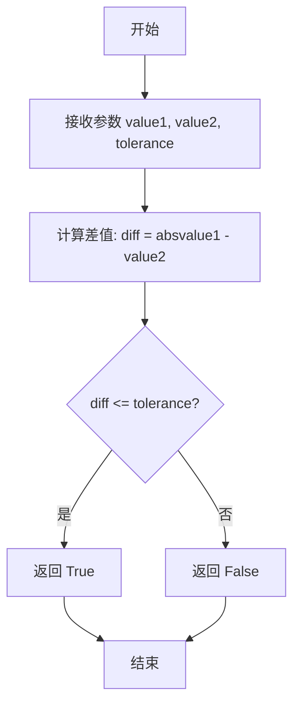
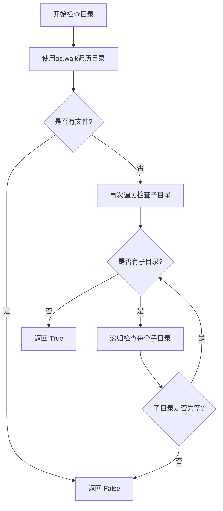

# `comic-translate\modules\utils\common_utils.py` 详细设计文档

该代码提供三个工具函数：restart_application用于重启当前应用程序（支持PyInstaller/Nuitka编译后的可执行文件和脚本模式），is_close用于比较两个数值是否在容差范围内相等，is_directory_empty用于递归检查目录是否为空。

## 整体流程

```mermaid
graph TD
    A[开始] --> B{调用函数}
    B --> C[restart_application]
    B --> D[is_close]
    B --> E[is_directory_empty]
    C --> C1[获取可执行文件路径]
    C1 --> C2{是否frozen?}
    C2 -- 是 --> C3[使用sys.executable和sys.argv[1:]]
    C2 -- 否 --> C4[使用sys.executable和sys.argv]
    C3 --> C5[QProcess.startDetached启动新实例]
    C5 --> C6[QApplication.quit退出当前实例]
    D --> D1[计算绝对差值abs(value1 - value2)]
    D1 --> D2{差值 <= tolerance?}
    D2 -- 是 --> D3[返回True]
    D2 -- 否 --> D4[返回False]
    E --> E1[os.walk遍历目录]
    E1 --> E2{找到文件?}
    E2 -- 是 --> E3[返回False]
    E2 -- 否 --> E4{找到子目录?}
    E4 -- 是 --> E5[递归检查子目录]
    E5 --> E1
    E4 -- 否 --> E6[返回True]
```

## 类结构

```
无类定义 (该文件仅包含全局函数)
```

## 全局变量及字段


### `os`
    
Python标准库模块，提供操作系统相关功能，如文件和目录操作

类型：`module`
    


### `sys`
    
Python标准库模块，提供系统相关参数和函数，如命令行参数和可执行文件路径

类型：`module`
    


### `restart_application`
    
重启当前应用程序，支持脚本和PyInstaller/Nuitka编译的可执行文件

类型：`function`
    


### `is_close`
    
比较两个数值是否在指定容差范围内相等，默认容差为2

类型：`function`
    


### `is_directory_empty`
    
递归检查指定目录及其子目录是否为空

类型：`function`
    


    

## 全局函数及方法


### `restart_application`

该函数用于重启当前应用程序，支持在脚本模式和编译后的可执行文件（PyInstaller/Nuitka）两种环境下工作，通过启动新实例并退出当前实例来实现应用重启。

参数：此函数没有参数。

返回值：`None`，该函数不返回任何值，只是启动新的进程实例并退出当前应用程序。

#### 流程图

```mermaid
flowchart TD
    A([开始]) --> B{检查 sys.frozen}
    B -->|是| C[获取可执行文件路径: sys.executable]
    B -->|否| D[获取可执行文件路径: sys.executable]
    C --> E[获取参数: sys.argv[1:]
    （跳过可执行文件名）]
    D --> F[获取参数: sys.argv]
    E --> G[调用 QProcess.startDetached
    启动新实例]
    F --> G
    G --> H[调用 QApplication.quit
    退出当前实例]
    H --> I([结束])
```

#### 带注释源码

```python
def restart_application():
    """
    Restart the application.
    Works for both running as script and compiled executable (PyInstaller/Nuitka).
    """
    # 导入Qt相关的类，用于进程管理和应用程序控制
    from PySide6.QtWidgets import QApplication
    from PySide6.QtCore import QProcess
    
    # 获取可执行文件路径（同时支持脚本和编译后的可执行文件）
    if getattr(sys, 'frozen', False):
        # Running as compiled executable (PyInstaller/Nuitka)
        # sys.frozen 在 PyInstaller/Nuitka 编译的应用中为 True
        executable = sys.executable  # 获取编译后可执行文件的路径
        args = sys.argv[1:]  # 跳过可执行文件名，只传递原始参数
    else:
        # Running as script
        # 以脚本方式运行时，使用 Python 解释器路径
        executable = sys.executable  # 获取 Python 解释器路径
        args = sys.argv  # 传递完整的命令行参数（包括脚本名）
    
    # 使用独立进程启动新的应用实例
    # startDetached 会在新的进程中启动应用，不等待其完成
    QProcess.startDetached(executable, args)
    
    # 关闭当前应用程序实例
    # 调用 quit() 会退出事件循环，关闭应用程序
    QApplication.quit()
```


### `is_close`

该函数用于比较两个数值是否在指定的容差范围内相等，常用于浮点数比较或需要近似相等的场景。

参数：

- `value1`：数值类型（int 或 float），要比较的第一个值
- `value2`：数值类型（int 或 float），要比较的第二个值
- `tolerance`：数值类型（int 或 float），容差范围，默认为 2

返回值：`bool`，如果两个值的差的绝对值小于等于容差则返回 `True`，否则返回 `False`

#### 流程图



#### 带注释源码

```python
def is_close(value1, value2, tolerance=2):
    """
    比较两个值是否在容差范围内相等。
    
    参数:
        value1: 第一个比较值
        value2: 第二个比较值
        tolerance: 容差范围，默认为2
    
    返回:
        bool: 如果两个值的差的绝对值小于等于容差返回True，否则返回False
    """
    # 计算两个值之差的绝对值
    diff = abs(value1 - value2)
    
    # 判断差值是否在容差范围内
    return diff <= tolerance
```


### `is_directory_empty`

该函数用于检查指定目录是否为空，通过遍历目录结构来判断是否存在任何文件或非空子目录。

参数：

- `directory`：`str`，要检查的目录路径

返回值：`bool`，如果目录为空（包括无文件且所有子目录也为空）返回 `True`，否则返回 `False`

#### 流程图



#### 带注释源码

```python
def is_directory_empty(directory):
    # Walk through the directory
    for root, dirs, files in os.walk(directory):
        # If any file is found, the directory is not empty
        if files:
            return False
    # If no files are found, check if there are any subdirectories
    for root, dirs, files in os.walk(directory):
        if dirs:
            # Recursively check subdirectories
            for dir in dirs:
                if not is_directory_empty(os.path.join(root, dir)):
                    return False
    return True
```

## 关键组件


### 应用重启组件

负责重新启动应用程序，支持脚本模式和打包可执行文件模式，通过QProcess启动新实例并退出当前实例

### 数值容差比较组件

提供数值比较功能，判断两个浮点数或整数是否在指定容差范围内相等

### 目录遍历与空目录检测组件

递归遍历目录树，判断指定目录及其所有子目录是否为空，支持深度检查文件系统结构


## 问题及建议


### 已知问题

-   **restart_application 函数**：导入语句放在函数内部，频繁调用时会有性能开销，且缺乏错误处理机制，如果 `QProcess.startDetached` 启动失败，`QApplication.quit()` 仍会被执行，导致应用异常退出
-   **restart_application 函数**：未检查当前是否存在有效的 QApplication 实例，在非 Qt 环境下调用可能抛出异常
-   **is_directory_empty 函数**：使用两次 `os.walk` 遍历目录，效率低下，且目录不存在时会抛出 FileNotFoundError 异常，缺乏异常处理
-   **is_directory_empty 函数**：未处理符号链接导致的潜在无限递归问题（循环符号链接）
-   **is_directory_empty 函数**：嵌套层级过深，逻辑复杂，可读性差
-   **is_close 函数**：参数 tolerance 默认值为 2，缺乏类型注解和输入验证
-   **全局问题**：缺少类型注解（Type Hints），降低代码可维护性和 IDE 智能提示支持
-   **全局问题**：除 restart_application 外，其他函数缺少文档字符串

### 优化建议

-   **restart_application 函数**：将 PySide6 的导入移至模块顶部（条件导入），添加 try-except 捕获启动失败的异常，并验证 QApplication 实例是否存在
-   **is_directory_empty 函数**：重构为单次遍历实现，使用 os.scandir 替代 os.walk 提升性能，添加目录存在性检查，添加符号链接检测避免无限递归
-   **is_close 函数**：添加类型注解和参数校验文档，考虑将 tolerance 默认值调整为更通用的值（如 0.001）
-   **全局改进**：为所有函数添加类型注解和完整的文档字符串，包括参数说明和返回值说明
-   **全局改进**：考虑将相关功能封装为类，提高代码组织性和可测试性

## 其它


### 设计目标与约束

本代码模块提供三个工具函数：应用程序重启、数值容差比较、目录空性检测。设计目标是为Qt应用程序提供重启能力，同时提供通用的数值比较和文件系统检查工具。约束条件包括：restart_application依赖PySide6库，仅支持Windows/Linux/Mac桌面平台，is_directory_empty在大型目录时存在性能问题。

### 错误处理与异常设计

restart_application函数未处理QProcess.startDetached可能失败的情况，建议添加异常捕获。is_directory_empty函数未处理目录不存在或无权限访问的情况，应抛出FileNotFoundError或PermissionError。is_close函数仅处理数值类型，输入非数值类型会引发TypeError。所有函数建议添加try-except包装并记录日志。

### 数据流与状态机

数据流：restart_application接收系统argv参数→判断运行模式→启动新进程→退出当前进程。is_close接收两个数值和容差参数→计算差值绝对值→返回布尔值。is_directory_empty接收目录路径→递归遍历→返回布尔值。无复杂状态机设计。

### 外部依赖与接口契约

依赖：PySide6.QtWidgets.QApplication、PySide6.QtCore.QProcess、os、sys模块。接口契约：restart_application无参数无返回值（副作用quit），is_close接受float/int参数返回bool，is_directory_empty接受str路径参数返回bool。

### 性能考虑与优化空间

is_directory_empty使用os.walk递归遍历，大型目录性能差，建议增加深度限制或使用 scandir 优化。restart_application未实现启动失败回滚机制，is_close未对容差进行类型校验。建议增加缓存机制和惰性加载PySide6。

### 安全性考虑

restart_application直接使用sys.argv传递参数，可能存在命令行注入风险，建议对参数进行白名单过滤。is_directory_empty未验证路径遍历攻击（symlink），建议添加路径规范化检查。

### 兼容性考虑

restart_application支持PyInstaller/Nuitka编译模式，is_close和is_directory_empty为纯Python函数全平台兼容。建议添加Python 3.8+类型注解以提升IDE支持和代码可维护性。

### 测试策略建议

is_close需覆盖：相等、接近、超出容差、负数、浮点数边界情况。is_directory_empty需覆盖：空目录、有文件目录、有子目录、权限拒绝、不存在路径。restart_application需覆盖：脚本模式、编译模式、启动失败场景。建议使用pytest编写单元测试。

### 使用示例

```python
# 重启应用
restart_application()

# 数值比较
if is_close(100, 102, tolerance=5):
    print("数值接近")

# 目录检查
if is_directory_empty("/tmp/test"):
    print("目录为空")
```

    