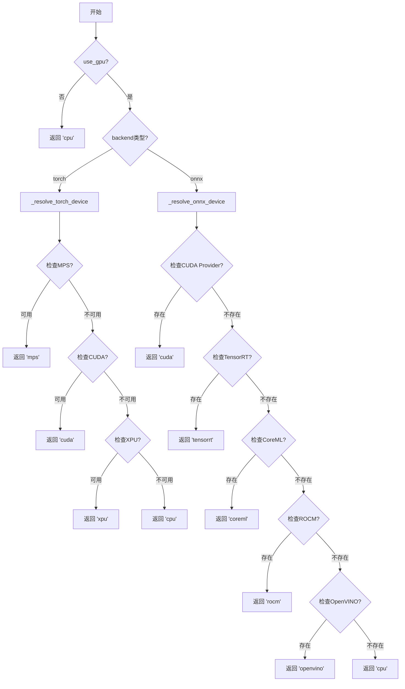
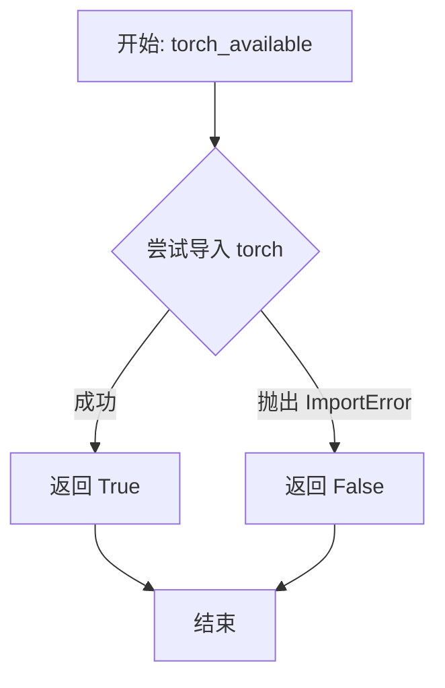
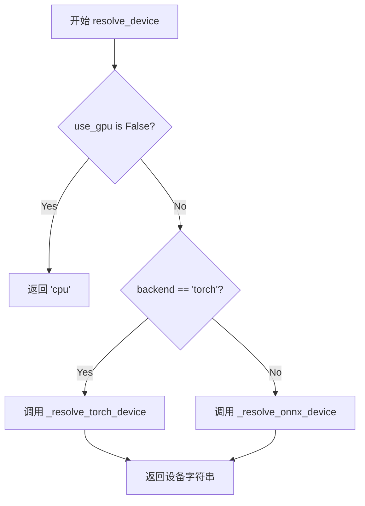
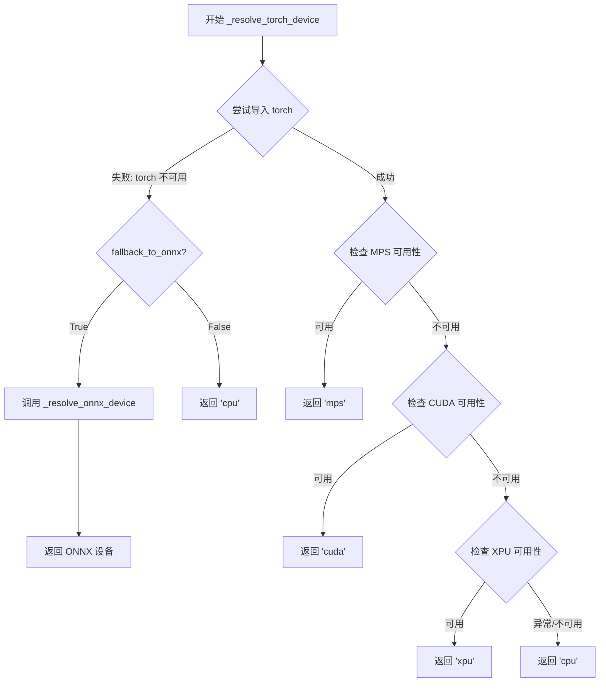
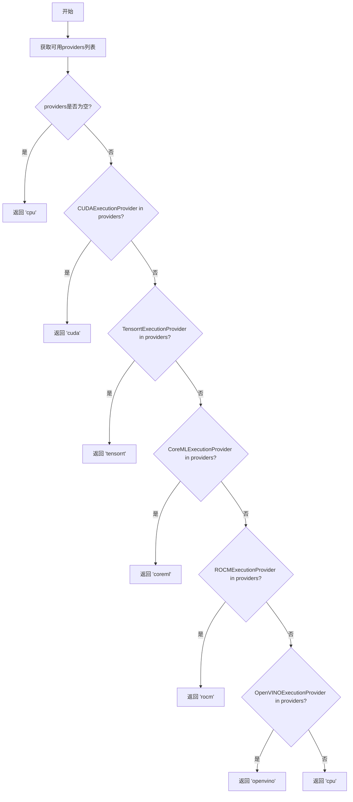
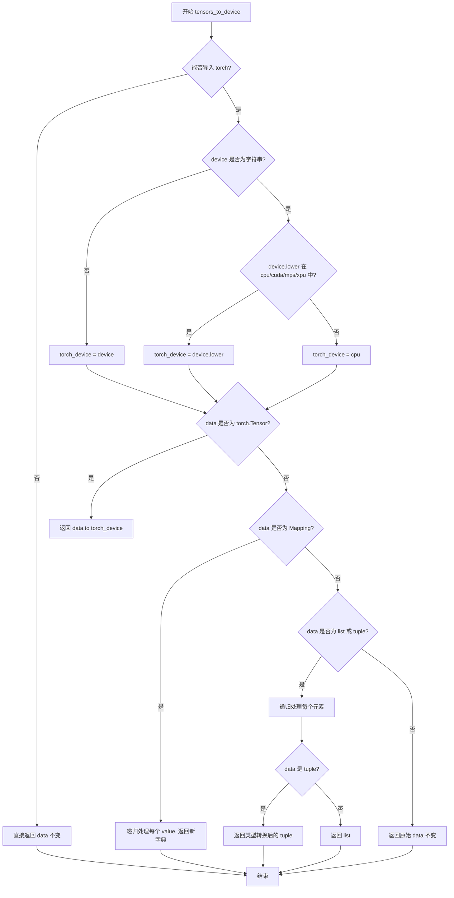
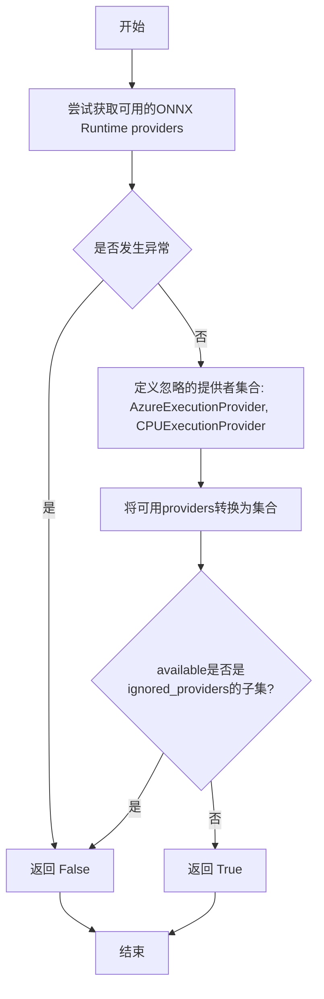

# `comic-translate\modules\utils\device.py` 详细设计文档

该模块提供设备解析和ONNX运行时提供者配置功能，支持在ONNX和PyTorch后端之间选择最佳可用计算设备（CPU/GPU），并提供张量设备迁移和GPU可用性检测的实用函数。

## 整体流程



## 类结构

```
device_manager (模块，无类)
└── 函数集合
    ├── torch_available()
    ├── resolve_device()
    ├── _resolve_torch_device()
    ├── _resolve_onnx_device()
    ├── tensors_to_device()
    ├── get_providers()
    └── is_gpu_available()
```

## 全局变量及字段


### `ort`
    
ONNXRuntime模块别名，用于访问ONNX运行时功能

类型：`onnxruntime module`
    


### `base_models_dir`
    
模型基础目录路径，由用户数据目录和'models'子目录组成

类型：`str`
    


### `ov_cache_dir`
    
OpenVINO缓存目录路径，用于存储OpenVINO引擎缓存文件

类型：`str`
    


### `trt_cache_dir`
    
TensorRT缓存目录路径，用于存储TensorRT引擎缓存文件

类型：`str`
    


### `coreml_cache_dir`
    
CoreML缓存目录路径，用于存储CoreML模型缓存文件

类型：`str`
    


### `provider_options`
    
提供者选项字典，包含各GPU提供者的配置参数如缓存路径和设备类型

类型：`dict`
    


### `configured`
    
配置后的ONNXRuntime提供者列表，包含提供者名称及其选项的元组或单纯提供者名称

类型：`list[Any]`
    


### `ignored_providers`
    
忽略的提供者集合，包含'AzureExecutionProvider'和'CPUExecutionProvider'，用于GPU可用性判断

类型：`set`
    


    

## 全局函数及方法


### `torch_available`

该函数用于安全地检测 PyTorch 库是否已安装且可导入，通过捕获 `ImportError` 异常来避免因 PyTorch 未安装而导致的程序崩溃，返回布尔值表示检测结果。

参数： 无

返回值：`bool`，返回 `True` 表示 PyTorch 已安装且可正常导入；返回 `False` 表示 PyTorch 未安装或导入失败

#### 流程图



#### 带注释源码

```python
def torch_available() -> bool:
    """Check if torch is available without raising import errors."""
    try:
        # 尝试导入 torch 模块
        # 如果 torch 已安装且可用，导入成功，函数返回 True
        # 如果 torch 未安装或导入失败，抛出 ImportError 异常
        import torch
        return True
    except ImportError:
        # 捕获 ImportError 异常
        # 当 torch 未安装时，import torch 会抛出此异常
        # 返回 False 表示 torch 不可用
        return False
```


### `resolve_device`

该函数根据指定的配置（是否使用GPU和后端类型）返回最佳可用的设备字符串，协调PyTorch和ONNX运行时的设备解析逻辑。

参数：

- `use_gpu`：`bool`，是否使用GPU加速
- `backend`：`str`，使用的后端类型（'onnx' 或 'torch'），默认为 "onnx"

返回值：`str`，与指定后端兼容的设备字符串（如 "cpu"、"cuda"、"mps"、"xpu"、"tensorrt"、"coreml"、"openvino"、"rocm" 等）

#### 流程图



#### 带注释源码

```python
def resolve_device(use_gpu: bool, backend: str = "onnx") -> str:
    """Return the best available device string for the specified backend.

    Args:
        use_gpu: Whether to use GPU acceleration
        backend: Backend to use ('onnx' or 'torch')

    Returns:
        Device string compatible with the specified backend
    """
    # 如果不使用GPU，直接返回CPU设备
    if not use_gpu:
        return "cpu"

    # 根据后端类型选择不同的设备解析策略
    if backend.lower() == "torch":
        # PyTorch后端：调用PyTorch设备解析函数，允许回退到ONNX
        return _resolve_torch_device(fallback_to_onnx=True)
    else:
        # ONNX后端（默认）：调用ONNX设备解析函数
        return _resolve_onnx_device()
```


### `_resolve_torch_device`

该函数用于解析并返回当前系统最佳可用的 PyTorch 设备字符串，依次检查 MPS（Apple Silicon）、CUDA 和 XPU（Intel GPU），若均不可用则返回 CPU；当 PyTorch 不可用时，可根据参数决定是否回退到 ONNX 设备解析。

参数：

- `fallback_to_onnx`：`bool`，可选参数，默认为 False。当 PyTorch 不可用时，是否回退到 ONNX 设备解析

返回值：`str`，返回最佳可用的 PyTorch 设备字符串（如 "mps"、"cuda"、"xpu" 或 "cpu"）

#### 流程图



#### 带注释源码

```python
def _resolve_torch_device(fallback_to_onnx: bool = False) -> str:
    """Resolve the best available PyTorch device."""
    # 尝试导入 torch 模块
    try:
        import torch
    except ImportError:
        # Torch 不可用时，根据 fallback_to_onnx 参数决定处理方式
        if fallback_to_onnx:
            # 回退到 ONNX 设备解析逻辑
            return _resolve_onnx_device()
        # 默认返回 CPU 设备
        return "cpu"

    # 检查 MPS（Apple Silicon GPU）是否可用
    if hasattr(torch.backends, 'mps') and torch.backends.mps.is_available():
        return "mps"

    # 检查 CUDA（NVIDIA GPU）是否可用
    if torch.cuda.is_available():
        return "cuda"

    # 检查 XPU（Intel GPU）是否可用
    try:
        if hasattr(torch, 'xpu') and torch.xpu.is_available():
            return "xpu"
    except Exception:
        # 捕获 XPU 检查过程中的异常，避免中断执行
        pass

    # 所有 GPU 均不可用，回退到 CPU
    return "cpu"
```


### `_resolve_onnx_device`

该函数用于解析并返回当前系统上最佳可用的ONNX Runtime设备，通过检查ONNX Runtime可用的执行提供者（providers）来确定支持的首选设备。

参数： 无

返回值：`str`，返回ONNX Runtime兼容的最佳设备字符串（如"cuda"、"tensorrt"、"coreml"、"rocm"、"openvino"或"cpu"）

#### 流程图



#### 带注释源码

```python
def _resolve_onnx_device() -> str:
    """Resolve the best available ONNX device."""
    # 调用onnxruntime获取当前系统上可用的执行提供者列表
    providers = ort.get_available_providers() 

    # 如果没有任何可用的执行提供者，则回退到CPU
    if not providers:
        return "cpu"

    # 按优先级顺序检查各GPU加速提供者
    # 优先级1: CUDA (NVIDIA GPU)
    if "CUDAExecutionProvider" in providers:
        return "cuda"
    
    # 优先级2: TensorRT (NVIDIA GPU优化推理引擎)
    if "TensorrtExecutionProvider" in providers:
        return "tensorrt"

    # 优先级3: CoreML (Apple Silicon/Mac GPU)
    if "CoreMLExecutionProvider" in providers:
        return "coreml"
    
    # 优先级4: ROCm (AMD GPU)
    if "ROCMExecutionProvider" in providers:
        return "rocm"

    # 优先级5: OpenVINO (Intel GPU/VPU)
    if "OpenVINOExecutionProvider" in providers:
        return "openvino"

    # 所有GPU加速提供者都不可用，回退到CPU
    return "cpu"
```


### `tensors_to_device`

将嵌套容器（字典、列表、元组）中的 PyTorch 张量移动到指定设备，同时保持数据结构不变。如果 PyTorch 不可用或数据中不包含张量，则原样返回数据。

参数：

- `data`：`Any`，输入数据，可以是 PyTorch 张量、字典、列表、元组或其他任意对象
- `device`：`str`，目标设备字符串（如 "cpu"、"cuda"、"mps"、"xpu" 或 ONNX 特定设备名）

返回值：`Any`，返回与输入结构相同的对象，其中张量已被移动到指定设备

#### 流程图



#### 带注释源码

```python
def tensors_to_device(data: Any, device: str) -> Any:
    """Move tensors in nested containers to device; returns the same structure.
    Supports dict, list/tuple, and tensors. Other objects are returned as-is.
    """
    # 尝试导入 torch，若失败则直接返回原数据（优雅降级）
    try:
        import torch
    except Exception:
        # Torch is not available; return data unchanged
        return data

    # 将设备字符串映射为 PyTorch 兼容的设备标识
    torch_device = device
    if isinstance(device, str):
        low = device.lower()
        if low in ("cpu", "cuda", "mps", "xpu"):
            # 已知支持的 PyTorch 设备
            torch_device = low
        else:
            # 未知或 ONNX 特定设备（如 tensorrt/coreml）-> 回退到 cpu
            torch_device = "cpu"

    # 情况1：数据是单个张量，直接移动到设备
    if isinstance(data, torch.Tensor):
        return data.to(torch_device)
    
    # 情况2：数据是字典，递归处理每个值
    if isinstance(data, Mapping):
        return {k: tensors_to_device(v, device) for k, v in data.items()}
    
    # 情况3：数据是列表或元组，递归处理每个元素并保持原有类型
    if isinstance(data, (list, tuple)):
        seq = [tensors_to_device(v, device) for v in data]
        # 元组需要特殊处理以保持类型
        return type(data)(seq) if isinstance(data, tuple) else seq
    
    # 情况4：其他对象直接返回
    return data
```


### `get_providers`

返回 ONNXRuntime 的执行提供者列表，可根据设备类型配置特定的提供者选项（如 GPU 缓存目录等）。

参数：

- `device`：`Optional[str]`，可选参数，指定目标设备类型。如果传递字符串 'cpu'（不区分大小写），则直接返回 CPU 执行提供者。

返回值：`list[Any]`，返回配置好的 ONNXRuntime 执行提供者列表。每个元素可以是字符串（提供者名称）或元组 (提供者名称, 选项字典)。

#### 流程图

```mermaid
flowchart TD
    A[开始 get_providers] --> B{尝试获取可用提供者}
    B -->|成功| C[获取到 providers 列表]
    B -->|异常| D[available 设为空列表]
    D --> E{device 是 'cpu'?}
    C --> E
    E -->|是| F[返回 ['CPUExecutionProvider']]
    E -->|否| G{available 为空?}
    G -->|是| H[返回 ['CPUExecutionProvider']]
    G -->|否| I[构建缓存目录路径]
    I --> J[创建 provider_options 字典]
    J --> K{遍历 available 中的每个 provider}
    K -->|在 provider_options 中| L[添加 (provider, 选项) 元组]
    K -->|不在 provider_options 中| M[直接添加 provider 字符串]
    L --> N{还有更多 provider?}
    M --> N
    N -->|是| K
    N -->|否| O[返回 configured 列表]
    F --> O
    H --> O
```

#### 带注释源码

```python
def get_providers(device: Optional[str] = None) -> list[Any]:
    """Return a providers list for ONNXRuntime (optionally with provider options).

    Rules:
    - If device is the string 'cpu' (case-insensitive) -> return ['CPUExecutionProvider']
    - Otherwise return available providers with options for certain GPU providers
    - If no providers are available, fall back to ['CPUExecutionProvider']
    """
    # 尝试获取 ONNXRuntime 可用的执行提供者
    try:
        available = ort.get_available_providers()
    except Exception:
        # 如果获取失败（如运行时错误），将 available 设为空列表
        available = []

    # 规则1：如果明确指定了 CPU 设备，直接返回 CPU 执行提供者
    if device and isinstance(device, str) and device.lower() == 'cpu':
        return ['CPUExecutionProvider']

    # 规则3：如果没有任何可用的提供者，回退到 CPU 执行提供者
    if not available:
        return ['CPUExecutionProvider']

    
    # 获取用户数据目录，用于存储模型缓存
    # 构造基础模型目录路径
    base_models_dir = os.path.join(get_user_data_dir(), "models")
    
    # 为 OpenVINO 创建缓存目录
    ov_cache_dir = os.path.join(base_models_dir, 'onnx-gpu-cache', 'openvino')
    os.makedirs(ov_cache_dir, exist_ok=True)

    # 为 TensorRT 创建缓存目录
    trt_cache_dir = os.path.join(base_models_dir, 'onnx-gpu-cache', 'tensorrt')
    os.makedirs(trt_cache_dir, exist_ok=True)

    # 为 CoreML 创建缓存目录
    coreml_cache_dir = os.path.join(base_models_dir, 'onnx-gpu-cache', 'coreml')
    os.makedirs(coreml_cache_dir, exist_ok=True)

    # 定义需要特殊配置选项的提供者及其选项
    # OpenVINO: 使用 GPU 类型、FP32 精度和缓存目录
    # TensorRT: 启用引擎缓存并指定缓存路径
    # CoreML: 指定模型缓存目录
    provider_options = {
        'OpenVINOExecutionProvider': {
            'device_type': 'GPU',
            'precision': 'FP32',
            'cache_dir': ov_cache_dir,
        },
        'TensorrtExecutionProvider': {
            'trt_engine_cache_enable': True,
            'trt_engine_cache_path': trt_cache_dir,
        },
        'CoreMLExecutionProvider': {
            'ModelCacheDirectory': coreml_cache_dir,
        }
    }

    # 遍历可用的提供者，为需要选项的提供者添加配置
    configured: list[Any] = []
    for p in available:
        if p in provider_options:
            # 需要特殊选项的提供者：添加 (name, options) 元组
            configured.append((p, provider_options[p]))
        else:
            # 其他提供者：直接添加提供者名称字符串
            configured.append(p)

    # 返回配置好的提供者列表
    return configured
```


### `is_gpu_available`

该函数用于检查系统是否有可用的GPU计算提供者（Provider），通过排除仅提供CPU或Azure云端执行的提供者，来判断本地是否有GPU加速能力。

参数：无

返回值：`bool`，如果存在除`AzureExecutionProvider`和`CPUExecutionProvider`之外的其他提供者（如CUDA、CoreML、TensorRT等），则返回`True`；否则返回`False`。

#### 流程图



#### 带注释源码

```python
def is_gpu_available() -> bool:
    """Check if a valid GPU provider is available.
    
    Returns False if only AzureExecutionProvider and/or CPUExecutionProvider are present.
    Returns True if any other provider (CUDA, CoreML, etc.) is found.
    """
    try:
        # 尝试获取ONNX Runtime当前可用的providers列表
        providers = ort.get_available_providers()
    except Exception:
        # 如果获取失败（如ONNX Runtime未正确安装），返回False
        return False

    # 定义需要忽略的提供者集合，这些不算作"GPU可用"
    # AzureExecutionProvider是云端Azure推理，CPUExecutionProvider是纯CPU
    ignored_providers = {'AzureExecutionProvider', 'CPUExecutionProvider'}
    
    # 将providers列表转换为集合，便于进行集合操作
    available = set(providers)
    
    # 核心逻辑：如果可用的提供者全部在忽略列表中，说明没有真正的GPU支持
    # available.issubset(ignored) 表示available中的所有元素都在ignored中
    if available.issubset(ignored_providers):
        return False
        
    # 存在除CPU和Azure之外的提供者（如CUDA、TensorRT、CoreML等），返回True
    return True
```


## 关键组件


### 设备解析与提供者管理

该模块负责底层设备兼容性检测与ONNX Runtime执行提供者动态配置，核心目标是实现跨平台（CPU/GPU/MPS/XPU/CoreML/TensorRT/OpenVINO）的自适应推理能力。

### 张量跨框架迁移

支持PyTorch张量在嵌套数据结构（字典/列表/元组）中的设备迁移，将ONNX设备字符串映射为PyTorch兼容格式，确保模型输出与目标设备一致。

### GPU可用性检测

通过过滤Azure和CPU提供者来判断真实GPU支持能力，避免在无加速硬件时误报GPU可用。

### 缓存目录管理

为OpenVINO、TensorRT和CoreML提供者自动创建模型缓存目录，实现推理引擎的持久化缓存。

### 提供者选项动态配置

根据不同GPU提供者特性注入设备类型、精度、缓存路径等配置参数，优化推理性能。


## 问题及建议


### 已知问题

-   **缓存目录创建重复代码**：在 `get_providers` 函数中，对 OpenVINO、TensorRT 和 CoreML 的缓存目录分别调用 `os.makedirs`，存在明显的代码重复，可提取为独立函数。
-   **设备字符串映射逻辑不一致**：`tensors_to_device` 函数中的设备映射（如 "tensorrt"→"cpu", "rocm"→"cpu"）与 `resolve_device` 和 `_resolve_onnx_device` 中返回的设备字符串不匹配，导致 ONNX 特定设备会被转换为 CPU 而非保持原样。
-   **provider_options 硬编码**：设备类型（如 OpenVINO 的 `'GPU'`）、精度（如 `'FP32'`）等配置硬编码在代码中，缺乏灵活的配置机制，无法满足不同使用场景。
-   **错误处理风格不统一**：部分函数（如 `torch_available`、`is_gpu_available`）捕获异常后返回布尔值或默认值，而 `get_providers` 中对 `ort.get_available_providers()` 的异常处理返回空列表，后续逻辑需要额外判断。
-   **类型注解可更精确**：部分返回类型使用 `list[Any]` 而非更具体的类型，如 `list[str] | list[tuple[str, dict]]`。
-   **torch 导入开销**：`tensors_to_device` 每次调用都会执行 `import torch`，即使在 `torch_available()` 已确认不可用的情况下仍会重复尝试，可考虑缓存导入结果。

### 优化建议

-   抽取缓存目录创建逻辑为独立函数 `ensure_cache_dir(path: str) -> str`，减少重复代码。
-   统一设备字符串映射策略：在 `tensors_to_device` 中为未知设备返回原始字符串而非默认 CPU，或在 `resolve_device` 中仅返回 torch 已知的设备类型。
-   引入配置类或参数化方式，允许调用方自定义 provider_options（如设备类型、精度、缓存路径等）。
-   统一错误处理模式，建议在模块级别定义默认 providers 列表，而非在每个函数中单独处理异常。
-   细化类型注解，使用 Union 类型明确 `configured` 变量的结构 `list[str | tuple[str, dict]]`。
-   使用模块级变量缓存 torch 的可用性状态，避免在 `tensors_to_device` 中重复执行导入检查。

## 其它


### 设计目标与约束

**设计目标**：
- 提供统一的设备抽象层，支持 ONNX Runtime 和 PyTorch 之间的设备兼容切换
- 自动检测并选择最优计算设备（CPU/GPU/MPS/XPU/TensorRT/OpenVINO/CoreML）
- 简化跨框架的 tensor 迁移逻辑，开发者无需关心底层设备差异
- 提供灵活的 Provider 配置机制，支持缓存和性能优化

**约束条件**：
- 依赖 `onnxruntime` 库，必须在支持 ONNX Runtime 的环境中运行
- PyTorch 相关功能为可选依赖，当 PyTorch 不可用时降级为纯 CPU 模式
- 设备字符串需兼容两套体系：ONNX 风格（cuda/tensorrt/coreml/openvino/rocm）和 PyTorch 风格（cuda/mps/xpu/cpu）
- 缓存目录默认创建在用户数据目录下，需确保目录可写

### 错误处理与异常设计

**导入错误**：
- `torch_available()` 使用 try-except 捕获 ImportError，返回 False，不抛出异常
- `tensors_to_device()` 当 torch 不可用时直接返回原始数据，不抛出异常

**设备解析错误**：
- `_resolve_torch_device()` 和 `_resolve_onnx_device()` 在异常情况下均返回 "cpu" 作为安全降级
- `resolve_device()` 在 backend 参数不匹配时根据 use_gpu 决定返回 cpu 或调用对应解析函数

**Provider 获取错误**：
- `get_providers()` 和 `is_gpu_available()` 使用 try-except 捕获 ort.get_available_providers() 的异常，返回空列表或 False
- 显式检查 providers 是否为空，为空时统一返回 CPUExecutionProvider

**设计原则**：所有外部调用均采用"快速失败+安全降级"策略，确保模块在缺省依赖或异常环境下仍能提供基本功能（CPU 模式）

### 数据流与状态机

**设备解析流程**：

```
开始
  ↓
use_gpu = False? → 是 → 返回 "cpu"
  ↓ 否
backend = "torch"? → 是 → _resolve_torch_device()
  ↓ 否              ↓
_resolve_onnx_device() ←────┘
  ↓
返回设备字符串
```

**Provider 配置流程**：

```
开始
  ↓
device == "cpu"? → 是 → 返回 ['CPUExecutionProvider']
  ↓ 否
available providers 为空? → 是 → 返回 ['CPUExecutionProvider']
  ↓ 否
构建缓存目录
  ↓
遍历 available providers
  ↓
有预定义 options? → 是 → (provider, options)
  ↓ 否 → provider
  ↓
返回 configured list
```

**Tensor 迁移流程**：

```
data 输入
  ↓
torch 不可用? → 是 → 返回 data
  ↓ 否
device 字符串映射 → 转为 torch 兼容格式
  ↓
data 类型判断
  ↓
Tensor → .to(device)
  ↓
Mapping → 递归处理每个 value
  ↓
list/tuple → 递归处理每个元素，保持原类型
  ↓
其他 → 直接返回
```

### 外部依赖与接口契约

**必须依赖**：
- `onnxruntime`：提供 ort.get_available_providers() 和执行 provider 配置

**可选依赖**：
- `torch`：当可用时用于 tensor 设备迁移和更多设备类型支持（MPS/XPU）

**内部依赖**：
- `.paths.get_user_data_dir()`：获取用户数据目录用于缓存

**接口契约**：
- `torch_available() -> bool`：无参数，返回 torch 是否可导入
- `resolve_device(use_gpu: bool, backend: str = "onnx") -> str`：use_gpu 控制是否尝试 GPU，backend 指定框架类型，返回设备字符串
- `tensors_to_device(data: Any, device: str) -> Any`：支持嵌套 dict/list/tuple 和 torch.Tensor，递归迁移后保持原数据结构
- `get_providers(device: Optional[str] = None) -> list[Any]`：返回 ONNX Runtime 可用的 providers 列表，可选带 provider_options
- `is_gpu_available() -> bool`：判断是否存在除 CPU 和 Azure 之外的 GPU provider

### 性能考量和基准测试

**性能优化点**：
- 缓存目录使用 `os.makedirs(..., exist_ok=True)`，避免每次调用重复创建
- `tensors_to_device` 使用 `isinstance` 而非 `type()`，支持子类匹配
- Provider options 预定义，遍历 available 时直接查表，避免运行时构建

**潜在性能瓶颈**：
- `get_providers()` 每次调用都执行目录检查和创建，高频调用时可考虑缓存结果
- 递归处理嵌套结构时，若嵌套深度过大可能影响性能，建议设置最大深度限制

**基准测试建议**：
- 测试不同设备字符串的解析延迟
- 测试大规模嵌套 tensor 的迁移耗时
- 测试 provider 配置构建的时间开销

### 安全性和权限考虑

**文件系统安全**：
- 缓存目录创建使用 `os.makedirs()`，默认模式依赖系统 umask
- 未对缓存目录设置 ACL 或特殊权限，建议在生产环境中限制缓存目录的写入权限

**依赖安全**：
- `onnxruntime` 和 `torch` 均为外部依赖，需确保来源可信
- 未对外部库的返回值进行深度验证，依赖库自身的异常处理

### 版本兼容性和迁移策略

**Python 版本**：
- 使用 `from __future__ import annotations` 支持类型提示的延迟求值，兼容 Python 3.7+

**ONNX Runtime 兼容性**：
- `ort.get_available_providers()` 在较旧版本可能返回不同格式，需测试多版本兼容性
- Provider 名称（CUDAExecutionProvider/TensorrtExecutionProvider 等）需与 ONNX Runtime 版本匹配

**PyTorch 兼容性**：
- `torch.backends.mps` 在较旧版本中可能不存在，使用 `hasattr` 安全检查
- `torch.xpu` 为可选模块，调用时使用 try-except 保护

**迁移建议**：
- 当 ONNX Runtime 新增 Provider 时，需同步更新 `_resolve_onnx_device()` 和 `provider_options`
- 当 PyTorch 新增设备后端（如新架构 GPU），需同步更新 `_resolve_torch_device()` 和 `tensors_to_device()` 的设备映射

### 配置管理和可扩展性设计

**扩展 Provider Options**：
- `provider_options` 字典可扩展，添加新的 provider 配置只需增加键值对
- 当前支持 OpenVINO、TensorRT、CoreML 的缓存配置，其他 provider 可按需添加

**扩展设备解析**：
- `_resolve_torch_device()` 和 `_resolve_onnx_device()` 可独立扩展新设备支持
- `resolve_device()` 作为统一入口，接收 backend 参数即可切换解析策略

**配置外部化建议**：
- 缓存目录路径目前硬编码，可提取为配置参数支持自定义
- Provider priority 顺序可配置，支持用户指定偏好顺序

### 日志和监控设计

**当前状态**：
- 代码中未包含日志记录功能，所有操作静默执行

**建议改进**：
- 在关键决策点添加日志：设备解析结果、provider 选择、缓存目录创建
- 日志级别建议：DEBUG 级别记录详细决策过程，INFO 级别记录最终选择结果
- 监控建议：记录 `is_gpu_available()` 的调用结果和返回值分布，用于 GPU 使用率统计


    