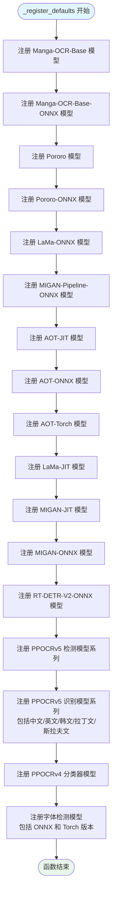

# `comic-translate\modules\utils\download.py` 详细设计文档

这是一个漫画翻译项目的核心模型管理模块，提供了一个集中式的模型注册表和下载器，支持从多个源（HuggingFace、GitHub、ModelScope）下载OCR、检测和修复所需的AI模型，并包含校验和验证、事件回调和进度通知功能。

## 整体流程

```mermaid
graph TD
    Start[用户请求获取模型 (ModelDownloader.get)] --> CheckRegistry{检查 ModelID 是否在注册表中}
    CheckRegistry -- 否 --> Error[抛出异常]
    CheckRegistry -- 是 --> CallDownload[_download_spec(spec)]
    CallDownload --> LoopFiles{遍历 spec.files}
    LoopFiles -- 还有文件 --> CheckExists{文件是否存在?}
    CheckExists -- 是 --> CheckChecksum{校验和匹配?}
    CheckExists -- 否 --> DownloadFile[_download_single_file]
    CheckChecksum -- 是 --> LoopFiles
    CheckChecksum -- 否 --> DeleteFile[删除本地错误文件]
    DeleteFile --> DownloadFile
    DownloadFile --> VerifyDownload[下载后再次校验]
    VerifyDownload -- 失败 --> ErrorDownload[抛出运行时错误]
    VerifyDownload -- 成功 --> LoopFiles
    LoopFiles -- 遍历完成 --> End[模型准备就绪]
```

## 类结构

```
Global Scope (全局作用域)
├── ModelID (Enum - 模型枚举ID)
├── ModelSpec (Dataclass - 模型规格定义)
├── ModelDownloader (Class - 核心下载管理器)
│   ├── registry (ClassVar - 注册表字典)
│   ├── register (ClassMethod - 注册模型)
│   ├── get (ClassMethod - 获取/下载模型)
│   ├── ensure (ClassMethod - 批量确保模型存在)
│   ├── file_paths (ClassMethod - 获取文件路径)
│   ├── is_downloaded (ClassMethod - 检查下载状态)
│   └── ... (其他路径辅助方法)
├── _download_single_file (Function - 单文件下载与校验)
├── _download_spec (Function - 规格下载流程控制)
├── _register_defaults (Function - 初始化默认注册表)
└── calculate_sha256_checksum / calculate_md5_checksum (Function - 哈希计算)
```

## 全局变量及字段


### `models_base_dir`
    
全局模型存储根目录，指向用户数据目录下的models文件夹

类型：`str`
    


### `_download_event_callback`
    
可选的下载事件回调函数，用于通知模型下载状态变化

类型：`Optional[Callable[[str, str], None]]`
    


### `mandatory_models`
    
启动时必须确保的模型列表，可包含ModelID枚举、ModelSpec实例或字典格式

类型：`List[Union[ModelID, ModelSpec, Dict[str, Union[str, List[str]]]]]`
    


### `ModelID.MANGA_OCR_BASE`
    
Manga-OCR基础OCR模型，用于漫画文字识别

类型：`ModelID`
    


### `ModelID.MANGA_OCR_BASE_ONNX`
    
Manga-OCR的ONNX格式模型，提供更快的推理速度

类型：`ModelID`
    


### `ModelID.PORORO`
    
PORORO OCR PyTorch模型，用于日文漫画OCR

类型：`ModelID`
    


### `ModelID.PORORO_ONNX`
    
PORORO OCR的ONNX格式模型

类型：`ModelID`
    


### `ModelID.LAMA_ONNX`
    
LaMa大模型ONNX格式，用于图像修复

类型：`ModelID`
    


### `ModelID.LAMA_JIT`
    
LaMa大模型TorchScript格式，用于图像修复

类型：`ModelID`
    


### `ModelID.MIGAN_PIPELINE_ONNX`
    
MIGAN管道ONNX模型，用于图像修复

类型：`ModelID`
    


### `ModelID.MIGAN_ONNX`
    
MIGAN ONNX模型，用于图像修复

类型：`ModelID`
    


### `ModelID.MIGAN_JIT`
    
MIGAN TorchScript模型，用于图像修复

类型：`ModelID`
    


### `ModelID.AOT_JIT`
    
AOT追踪TorchScript模型，用于图像修复

类型：`ModelID`
    


### `ModelID.AOT_ONNX`
    
AOT ONNX模型，用于图像修复

类型：`ModelID`
    


### `ModelID.AOT_TORCH`
    
AOT PyTorch模型，用于图像修复

类型：`ModelID`
    


### `ModelID.RTDETR_V2_ONNX`
    
RT-DETR v2目标检测ONNX模型，用于文本和气泡检测

类型：`ModelID`
    


### `ModelID.PPOCR_V5_DET_MOBILE`
    
PPOCRv5轻量级中文检测模型

类型：`ModelID`
    


### `ModelID.PPOCR_V5_DET_SERVER`
    
PPOCRv5服务端中文检测模型

类型：`ModelID`
    


### `ModelID.PPOCR_V5_DET_MOBILE_TORCH`
    
PPOCRv5轻量级中文检测PyTorch模型

类型：`ModelID`
    


### `ModelID.PPOCR_V5_REC_MOBILE`
    
PPOCRv5轻量级中文识别模型

类型：`ModelID`
    


### `ModelID.PPOCR_V5_REC_SERVER`
    
PPOCRv5服务端中文识别模型

类型：`ModelID`
    


### `ModelID.PPOCR_V5_REC_MOBILE_TORCH`
    
PPOCRv5轻量级中文识别PyTorch模型

类型：`ModelID`
    


### `ModelID.PPOCR_V5_REC_EN_MOBILE`
    
PPOCRv5轻量级英文识别模型

类型：`ModelID`
    


### `ModelID.PPOCR_V5_REC_KOREAN_MOBILE`
    
PPOCRv5轻量级韩文识别模型

类型：`ModelID`
    


### `ModelID.PPOCR_V5_REC_LATIN_MOBILE`
    
PPOCRv5轻量级拉丁文识别模型

类型：`ModelID`
    


### `ModelID.PPOCR_V5_REC_ESLAV_MOBILE`
    
PPOCRv5轻量级斯拉夫文识别模型

类型：`ModelID`
    


### `ModelID.PPOCR_V5_REC_EN_MOBILE_TORCH`
    
PPOCRv5轻量级英文识别PyTorch模型

类型：`ModelID`
    


### `ModelID.PPOCR_V5_REC_KOREAN_MOBILE_TORCH`
    
PPOCRv5轻量级韩文识别PyTorch模型

类型：`ModelID`
    


### `ModelID.PPOCR_V5_REC_LATIN_MOBILE_TORCH`
    
PPOCRv5轻量级拉丁文识别PyTorch模型

类型：`ModelID`
    


### `ModelID.PPOCR_V5_REC_ESLAV_MOBILE_TORCH`
    
PPOCRv5轻量级斯拉夫文识别PyTorch模型

类型：`ModelID`
    


### `ModelID.PPOCR_V4_CLS`
    
PPOCRv4方向分类模型，用于文本方向校正

类型：`ModelID`
    


### `ModelID.FONT_DETECTOR_ONNX`
    
字体检测ONNX模型，用于识别漫画中的字体类型

类型：`ModelID`
    


### `ModelID.FONT_DETECTOR_TORCH`
    
字体检测PyTorch模型，用于识别漫画中的字体类型

类型：`ModelID`
    


### `ModelSpec.id`
    
模型唯一标识符，对应ModelID枚举值

类型：`ModelID`
    


### `ModelSpec.url`
    
模型文件的基础下载URL地址

类型：`str`
    


### `ModelSpec.files`
    
远程文件名列表，包含模型需要下载的所有文件

类型：`List[str]`
    


### `ModelSpec.sha256`
    
对应的校验和列表，可为None表示不验证

类型：`List[Optional[str]]`
    


### `ModelSpec.save_dir`
    
本地保存目录的相对路径

类型：`str`
    


### `ModelSpec.additional_urls`
    
额外的URL映射，用于处理文件名到不同URL的映射

类型：`Optional[Dict[str, str]]`
    


### `ModelSpec.save_as`
    
远程文件名到本地文件名的映射，可自定义保存名称

类型：`Optional[Dict[str, str]]`
    


### `ModelDownloader.registry`
    
静态注册表，存储所有已注册的模型规格信息

类型：`Dict[ModelID, ModelSpec]`
    
    

## 全局函数及方法


### `set_download_callback`

注册一个全局回调函数，用于接收模型下载事件的通知。当模型下载开始或结束时，通过该回调通知订阅者。

参数：

- `callback`：`Callable[[str, str], None]`，一个接受两个字符串参数（status: 下载状态，如 'start' 或 'end'，name: 文件名）并返回 None 的可调用对象

返回值：`None`，该函数没有返回值，仅执行副作用（设置全局变量）

#### 流程图


#### 带注释源码

```python
def set_download_callback(callback: Callable[[str, str], None]):
    """Register a global callback to be notified of model download events.

    Args:
        callback: Callable(status: str, name: str)
    """
    # 使用 global 关键字声明要修改全局变量
    global _download_event_callback
    # 将传入的回调函数赋值给全局变量，供 notify_download_event 函数使用
    _download_event_callback = callback
```


### `notify_download_event`

通知订阅者关于下载事件的信息，无需对 UI 的硬依赖。当有注册的回调函数时，会调用该回调函数传递状态和名称；如果回调调用失败则捕获异常，确保不会影响下载流程。

参数：

- `status`：`str`，下载事件的状态（如 "start" 表示开始下载，"end" 表示下载完成）
- `name`：`str`，下载文件的名称（通常为文件名）

返回值：`None`，该函数没有返回值，用于触发副作用（调用回调函数）

#### 流程图


#### 带注释源码

```python
def notify_download_event(status: str, name: str):
    """Notify subscribers about a download event without hard dependency on UI.
    
    该函数用于在模型下载过程中通知订阅者当前下载的状态和文件名。
    通过全局回调机制实现解耦，避免对 UI 层的硬依赖。
    
    Args:
        status: 下载事件的状态，通常为 'start' 表示开始下载，
                'end' 表示下载完成
        name: 下载文件的名称（通常是文件名）
    
    Returns:
        None: 该函数不返回值，仅作为事件通知的触发器
    """
    try:
        # 检查是否已经注册了下载事件回调函数
        if _download_event_callback:
            # 调用已注册的回调函数，传递状态和文件名
            _download_event_callback(status, name)
    except Exception:
        # 捕获所有异常，确保回调函数的失败不会中断下载流程
        # 这体现了"永不允许 UI 通知失败破坏下载"的设计原则
        pass
```


### `calculate_sha256_checksum`

该函数用于计算指定文件的 SHA256 校验和，以验证文件完整性或标识文件。它通过分块读取文件内容并更新 SHA256 哈希对象，最后返回十六进制格式的哈希值字符串。

参数：

- `file_path`：`str`，要计算 SHA256 校验和的文件的完整路径

返回值：`str`，文件的 SHA256 哈希值的十六进制表示（64个字符）

#### 流程图


#### 带注释源码

```python
def calculate_sha256_checksum(file_path: str) -> str:
    """计算文件的 SHA256 校验和（哈希值）。
    
    该函数以分块方式读取文件，避免一次性加载大文件到内存，
    适用于处理大型模型文件或其他资源文件。
    
    Args:
        file_path: 要计算 SHA256 值的文件路径
        
    Returns:
        str: SHA256 哈希值的十六进制字符串（64个字符）
    """
    # 创建 SHA256 哈希对象
    sha256_hash = hashlib.sha256()
    
    # 以二进制读取模式打开文件，使用 with 语句确保文件正确关闭
    with open(file_path, "rb") as f:
        # 迭代读取文件，每次读取 4096 字节（4KB）
        # iter(lambda: f.read(4096), b"") 表示持续调用 f.read(4096)
        # 直到返回空字节串 b"" 为止
        for byte_block in iter(lambda: f.read(4096), b""):
            # 将读取的字节数据更新到哈希对象中
            sha256_hash.update(byte_block)
    
    # 返回十六进制格式的哈希值字符串
    return sha256_hash.hexdigest()
```


### `calculate_md5_checksum`

计算给定文件的 MD5 校验和，用于验证文件完整性。函数通过分块读取文件内容并更新 MD5 哈希对象，最终返回文件的十六进制校验和字符串。

参数：

- `file_path`：`str`，要计算 MD5 校验和的文件路径

返回值：`str`，文件的 MD5 校验和的十六进制字符串表示

#### 流程图


#### 带注释源码

```python
def calculate_md5_checksum(file_path: str) -> str:
    """计算文件的 MD5 校验和
    
    Args:
        file_path: 要计算 MD5 校验和的文件路径
        
    Returns:
        文件的 MD5 校验和的十六进制字符串表示
    """
    # 创建 MD5 哈希对象
    md5_hash = hashlib.md5()
    
    # 以二进制读取模式打开文件
    with open(file_path, "rb") as f:
        # 迭代读取文件，每次读取 4096 字节
        # iter(lambda: f.read(4096), b"") 会持续调用 f.read(4096)
        # 直到返回空字节串 b"" 为止
        for byte_block in iter(lambda: f.read(4096), b""):
            # 更新哈希对象
            md5_hash.update(byte_block)
    
    # 返回十六进制格式的校验和
    return md5_hash.hexdigest()
```


### `_download_single_file`

该函数负责单文件下载、进度打印与校验，是模型文件下载的核心实现，支持 SHA256 和 MD5 校验和验证，并在下载完成后自动校验文件完整性，校验失败时尝试删除损坏文件并抛出异常。

参数：

- `file_url`：`str`，远程文件的 URL 地址
- `file_path`：`str`，本地保存路径（包含文件名）
- `expected_checksum`：`Optional[str]`，可选的预期校验和（SHA256 为 64 字符，MD5 为 32 字符），用于下载后验证文件完整性

返回值：`None`，该函数无返回值，通过副作用（文件下载、事件通知、异常抛出）完成工作

#### 流程图


#### 带注释源码

```python
def _download_single_file(file_url: str, file_path: str, expected_checksum: Optional[str]):
    """下载单个文件并可选地验证其校验和。
    
    Args:
        file_url: 远程文件的 URL 地址
        file_path: 本地保存路径
        expected_checksum: 预期的校验和（SHA256 64字符，MD5 32字符）
    """
    # 构建下载信息消息
    msg = f'Downloading: "{file_url}" to {os.path.dirname(file_path)}\n'
    
    # 优先输出到 stderr，否则使用日志
    if sys.stderr:
        sys.stderr.write(msg)
    else:
        logger.info(msg.strip())
    
    # 通知下载开始事件
    notify_download_event('start', os.path.basename(file_path))
    
    # 执行实际的文件下载操作
    download_url_to_file(file_url, file_path, hash_prefix=None, progress=True)
    
    # 通知下载结束事件
    notify_download_event('end', os.path.basename(file_path))

    # 如果提供了校验和，则进行验证
    if expected_checksum:
        # 通过长度检测哈希算法：64=SHA256，32=MD5
        if len(expected_checksum) == 64:
            algo = 'sha256'
            calculated_checksum = calculate_sha256_checksum(file_path)
        elif len(expected_checksum) == 32:
            algo = 'md5'
            calculated_checksum = calculate_md5_checksum(file_path)
        else:
            # 未知长度的校验和，跳过验证并记录警告
            logger.warning(
                f"Unknown checksum length for {file_path} (len={len(expected_checksum)}). Skipping verification."
            )
            return

        # 校验和匹配检查
        if calculated_checksum == expected_checksum:
            logger.info(f"Download model success, {algo}: {calculated_checksum}")
        else:
            # 校验和不匹配，尝试删除损坏文件
            try:
                os.remove(file_path)
                logger.error(
                    f"Model {algo}: {calculated_checksum}, expected {algo}: {expected_checksum}, "
                    "wrong model deleted. Please restart comic-translate."
                )
            except Exception:
                # 删除失败，记录错误要求用户手动删除
                logger.error(
                    f"Model {algo}: {calculated_checksum}, expected {algo}: {expected_checksum}, "
                    f"please delete {file_path} and restart comic-translate."
                )
            # 抛出运行时错误终止程序
            raise RuntimeError(
                f"Model {algo} mismatch for {file_path}: got {calculated_checksum}, expected {expected_checksum}. "
                "Please delete the file and restart comic-translate or re-download the model."
            )
```


### `_download_spec`

该函数负责根据 `ModelSpec` 定义下载特定的模型规格文件，包括创建目标目录、遍历文件列表、解析下载URL、处理本地文件名映射、验证文件完整性（通过校验和），并在必要时重新下载缺失或损坏的文件。

参数：

-  `spec`：`ModelSpec`，包含模型ID、下载URL、文件列表、校验和、存储目录等完整下载规范

返回值：`None`，该函数仅执行下载逻辑，不返回任何数据

#### 流程图


#### 带注释源码

```python
def _download_spec(spec: ModelSpec):
    """根据 ModelSpec 下载模型文件完整实现
    
    Args:
        spec: ModelSpec 对象，包含下载所需的所有元信息
        
    Returns:
        None: 直接执行下载，不返回结果
    """
    # 步骤1: 确保目标目录存在
    if not os.path.exists(spec.save_dir):
        os.makedirs(spec.save_dir, exist_ok=True)
        logger.info(f"Created directory: {spec.save_dir}")

    # 步骤2: 遍历模型规范中的所有文件
    for remote_name, expected_checksum in zip(spec.files, spec.sha256):
        # 步骤2.1: 确定下载URL
        # 优先使用 additional_urls 中定义的URL，否则使用标准URL拼接
        if spec.additional_urls and remote_name in spec.additional_urls:
            file_url = spec.additional_urls[remote_name]
        else:
            file_url = f"{spec.url}{remote_name}"

        # 步骤2.2: 确定本地保存的文件名
        # 支持 save_as 映射，允许远程文件名与本地保存名不同
        local_name = spec.save_as.get(remote_name, remote_name) if spec.save_as else remote_name
        file_path = os.path.join(spec.save_dir, local_name)

        # 步骤3: 检查文件是否已存在
        if os.path.exists(file_path):
            # 3.1: 如果未提供预期校验和，则跳过验证（视为已下载完成）
            if expected_checksum is None:
                continue
                
            # 3.2: 检测哈希算法并计算校验和
            # 64位 = SHA256，32位 = MD5，其他长度视为未知格式
            try:
                if len(expected_checksum) == 64:
                    calculated = calculate_sha256_checksum(file_path)
                    algo = 'sha256'
                elif len(expected_checksum) == 32:
                    calculated = calculate_md5_checksum(file_path)
                    algo = 'md5'
                else:
                    # 未知校验和格式：强制重新下载
                    logger.warning(
                        f"Unknown checksum format for {remote_name} (len={len(expected_checksum)}). Redownloading..."
                    )
                    calculated = None
                    algo = None
            except Exception:
                # 校验和计算失败：强制重新下载
                logger.warning(f"Failed to calculate checksum for {local_name}. Redownloading...")
                calculated = None
                algo = None

            # 3.3: 校验和匹配检查
            if calculated and calculated == expected_checksum:
                # 文件完整，跳过下载
                continue
            else:
                # 校验和不匹配或计算失败，记录警告
                if calculated:
                    logger.warning(
                        f"Checksum mismatch for {local_name}. Expected {expected_checksum}, got {calculated}. Redownloading..."
                    )

        # 步骤4: 执行文件下载
        # 包括：文件不存在、校验和缺失、校验和不匹配等情况
        _download_single_file(file_url, file_path, expected_checksum)
```


### `_register_defaults`

该函数是模块级别的初始化函数，用于在模块加载时自动填充 `ModelDownloader` 的模型注册表。它通过多次调用 `ModelDownloader.register()` 方法，将各种预定义的模型规格（ModelSpec）注册到全局注册表中，包括 OCR 模型（ Manga-OCR、Pororo、PPOCRv5 系列）、Inpainting 模型（LaMa、MIGAN、AOT 系列）以及检测模型（RT-DETR、Font Detector 等），使得后续可以通过模型 ID 便捷地获取和下载模型资源。

参数：无

返回值：`None`，无返回值

#### 流程图



#### 带注释源码

```python
def _register_defaults():
    """
    填充默认的模型注册信息。
    
    该函数在模块加载时自动调用，向 ModelDownloader 的注册表中
    注册所有预定义的模型规格，包括 OCR、Inpainting 和 Detection 模型。
    """
    
    # 注册 Manga-OCR-Base 模型 (PyTorch 版本)
    ModelDownloader.register(ModelSpec(
        id=ModelID.MANGA_OCR_BASE,
        url='https://huggingface.co/kha-white/manga-ocr-base/resolve/main/',
        files=[
            'pytorch_model.bin', 'config.json', 'preprocessor_config.json',
            'README.md', 'special_tokens_map.json', 'tokenizer_config.json', 'vocab.txt'
        ],
        sha256=[
            'c63e0bb5b3ff798c5991de18a8e0956c7ee6d1563aca6729029815eda6f5c2eb',
            '8c0e395de8fa699daaac21aee33a4ba9bd1309cfbff03147813d2a025f39f349',
            # ... (其他文件的 SHA256 校验和)
        ],
        save_dir=os.path.join(models_base_dir, 'ocr', 'manga-ocr-base')
    ))

    # 注册 Manga-OCR-Base ONNX 模型
    ModelDownloader.register(ModelSpec(
        id=ModelID.MANGA_OCR_BASE_ONNX,
        url='https://huggingface.co/mayocream/manga-ocr-onnx/resolve/main/',
        files=['encoder_model.onnx', 'decoder_model.onnx', 'vocab.txt'],
        sha256=[
            '15fa8155fe9bc1a7d25d9bb353debaa4def033d0174e907dbd2dd6d995def85f',
            # ... 
        ],
        save_dir=os.path.join(models_base_dir, 'ocr', 'manga-ocr-base-onnx')
    ))

    # 注册 Pororo OCR 模型 (PyTorch 版本)
    ModelDownloader.register(ModelSpec(
        id=ModelID.PORORO,
        url='https://huggingface.co/ogkalu/pororo/resolve/main/',
        files=['craft.pt', 'brainocr.pt', 'ocr-opt.txt'],
        sha256=[
            '4a5efbfb48b4081100544e75e1e2b57f8de3d84f213004b14b85fd4b3748db17',
            # ...
        ],
        save_dir=os.path.join(models_base_dir, 'ocr', 'pororo')
    ))

    # 注册 Pororo ONNX 模型
    ModelDownloader.register(ModelSpec(
        id=ModelID.PORORO_ONNX,
        url='https://huggingface.co/ogkalu/pororo/resolve/main/',
        files=['craft.onnx', 'brainocr.onnx', 'ocr-opt.txt'],
        sha256=[
            'e87cbb40ecb3c881971dea378ead9f80d2d607a011ccb4ca161f27823ed438ca',
            # ...
        ],
        save_dir=os.path.join(models_base_dir, 'ocr', 'pororo-onnx')
    ))

    # 注册 LaMa ONNX 去水印模型 (单文件)
    ModelDownloader.register(ModelSpec(
        id=ModelID.LAMA_ONNX,
        url='https://huggingface.co/ogkalu/lama-manga-onnx-dynamic/resolve/main/',
        files=['lama-manga-dynamic.onnx'],
        sha256=['de31ffa5ba26916b8ea35319f6c12151ff9654d4261bccf0583a69bb095315f9'],
        save_dir=os.path.join(models_base_dir, 'inpainting')
    ))

    # 注册 MIGAN Pipeline ONNX 去水印模型
    ModelDownloader.register(ModelSpec(
        id=ModelID.MIGAN_PIPELINE_ONNX,
        url='https://github.com/Sanster/models/releases/download/migan/',
        files=['migan_pipeline_v2.onnx'],
        sha256=[None],  # GitHub release 未提供 SHA256
        save_dir=os.path.join(models_base_dir, 'inpainting')
    ))

    # 注册 AOT traced TorchScript 去水印模型
    ModelDownloader.register(ModelSpec(
        id=ModelID.AOT_JIT,
        url='https://huggingface.co/ogkalu/aot-inpainting/resolve/main/',
        files=['aot_traced.pt'],
        sha256=['552d9ad440258fa14907fc2492cf172c51983760c4619861f8b7b362a762af0b'],
        save_dir=os.path.join(models_base_dir, 'inpainting')
    ))

    # 注册 AOT ONNX 去水印模型
    ModelDownloader.register(ModelSpec(
        id=ModelID.AOT_ONNX,
        url='https://huggingface.co/ogkalu/aot-inpainting/resolve/main/',
        files=['aot.onnx'],
        sha256=['ffd39ed8e2a275869d3b49180d030f0d8b8b9c2c20ed0e099ecd207201f0eada'],
        save_dir=os.path.join(models_base_dir, 'inpainting')
    ))

    # 注册 AOT PyTorch 去水印模型
    ModelDownloader.register(ModelSpec(
        id=ModelID.AOT_TORCH,
        url='https://huggingface.co/ogkalu/aot-inpainting/resolve/main/',
        files=['inpainting.ckpt'],
        sha256=['878d541c68648969bc1b042a6e997f3a58e49b6c07c5636ad55130736977149f'],
        save_dir=os.path.join(models_base_dir, 'inpainting')
    ))

    # 注册 LaMa JIT (TorchScript) 去水印模型 - 使用 MD5 校验
    ModelDownloader.register(ModelSpec(
        id=ModelID.LAMA_JIT,
        url='https://github.com/Sanster/models/releases/download/AnimeMangaInpainting/',
        files=['anime-manga-big-lama.pt'],
        sha256=['29f284f36a0a510bcacf39ecf4c4d54f'],  # md5 校验
        save_dir=os.path.join(models_base_dir, 'inpainting')
    ))

    # 注册 MIGAN traced JIT 去水印模型 - 使用 MD5 校验
    ModelDownloader.register(ModelSpec(
        id=ModelID.MIGAN_JIT,
        url='https://github.com/Sanster/models/releases/download/migan/',
        files=['migan_traced.pt'],
        sha256=['76eb3b1a71c400ee3290524f7a11b89c'],  # md5 校验
        save_dir=os.path.join(models_base_dir, 'inpainting')
    ))

    # 注册 MIGAN ONNX 模型 (空URL，使用本地已有文件)
    ModelDownloader.register(ModelSpec(
        id=ModelID.MIGAN_ONNX,
        url='',
        files=['migan.onnx'],
        sha256=[''],  # 空校验和
        save_dir=os.path.join(models_base_dir, 'inpainting')
    ))

    # 注册 RT-DETR V2 ONNX 文本/气泡检测模型
    ModelDownloader.register(ModelSpec(
        id=ModelID.RTDETR_V2_ONNX,
        url='https://huggingface.co/ogkalu/comic-text-and-bubble-detector/resolve/main/',
        files=['detector.onnx'],
        sha256=['065744e91c0594ad8663aa8b870ce3fb27222942eded5a3cc388ce23421bd195'], 
        save_dir=os.path.join(models_base_dir, 'detection')
    ))

    # ========== PPOCRv5 检测模型 ==========
    ModelDownloader.register(ModelSpec(
        id=ModelID.PPOCR_V5_DET_MOBILE,
        url='https://www.modelscope.cn/models/RapidAI/RapidOCR/resolve/v3.4.0/onnx/PP-OCRv5/det/',
        files=['ch_PP-OCRv5_mobile_det.onnx'],
        sha256=['4d97c44a20d30a81aad087d6a396b08f786c4635742afc391f6621f5c6ae78ae'],
        save_dir=os.path.join(models_base_dir, 'ocr', 'ppocr-v5-onnx')
    ))

    ModelDownloader.register(ModelSpec(
        id=ModelID.PPOCR_V5_DET_MOBILE_TORCH,
        url='https://www.modelscope.cn/models/RapidAI/RapidOCR/resolve/master/torch/PP-OCRv5/det/',
        files=['ch_PP-OCRv5_det_mobile_infer.pth'],
        sha256=['df848ed5060bac4d0f6e58572aea97d92e909a8a87cf292849237b0e84f6ffdb'],
        save_dir=os.path.join(models_base_dir, 'ocr', 'ppocr-v5-torch'),
    ))

    ModelDownloader.register(ModelSpec(
        id=ModelID.PPOCR_V5_DET_SERVER,
        url='https://www.modelscope.cn/models/RapidAI/RapidOCR/resolve/v3.4.0/onnx/PP-OCRv5/det/',
        files=['ch_PP-OCRv5_server_det.onnx'],
        sha256=['0f8846b1d4bba223a2a2f9d9b44022fbc22cc019051a602b41a7fda9667e4cad'],
        save_dir=os.path.join(models_base_dir, 'ocr', 'ppocr-v5-onnx')
    ))

    # ========== PPOCRv5 识别模型 - 中文 ==========
    ModelDownloader.register(ModelSpec(
        id=ModelID.PPOCR_V5_REC_MOBILE,
        url='https://www.modelscope.cn/models/RapidAI/RapidOCR/resolve/v3.4.0/onnx/PP-OCRv5/rec/',
        files=['ch_PP-OCRv5_rec_mobile_infer.onnx', 'ppocrv5_dict.txt'],
        sha256=['5825fc7ebf84ae7a412be049820b4d86d77620f204a041697b0494669b1742c5', None],
        save_dir=os.path.join(models_base_dir, 'ocr', 'ppocr-v5-onnx'),
        # 额外 URL 映射：字典文件位于不同的 Paddle 模型路径
        additional_urls={
            'ppocrv5_dict.txt': 'https://www.modelscope.cn/models/RapidAI/RapidOCR/resolve/v3.4.0/paddle/PP-OCRv5/rec/ch_PP-OCRv5_rec_mobile_infer/ppocrv5_dict.txt'
        }
    ))

    # ========== PPOCRv5 识别模型 - 英文 ==========
    ModelDownloader.register(ModelSpec(
        id=ModelID.PPOCR_V5_REC_EN_MOBILE,
        url='https://www.modelscope.cn/models/RapidAI/RapidOCR/resolve/v3.4.0/onnx/PP-OCRv5/rec/',
        files=['en_PP-OCRv5_rec_mobile_infer.onnx', 'ppocrv5_en_dict.txt'],
        sha256=['c3461add59bb4323ecba96a492ab75e06dda42467c9e3d0c18db5d1d21924be8', None],
        save_dir=os.path.join(models_base_dir, 'ocr', 'ppocr-v5-onnx'),
        additional_urls={
            'ppocrv5_en_dict.txt': 'https://www.modelscope.cn/models/RapidAI/RapidOCR/resolve/v3.4.0/paddle/PP-OCRv5/rec/en_PP-OCRv5_rec_mobile_infer/ppocrv5_en_dict.txt'
        }
    ))

    # ========== PPOCRv5 识别模型 - 韩文 ==========
    ModelDownloader.register(ModelSpec(
        id=ModelID.PPOCR_V5_REC_KOREAN_MOBILE,
        url='https://www.modelscope.cn/models/RapidAI/RapidOCR/resolve/v3.4.0/onnx/PP-OCRv5/rec/',
        files=['korean_PP-OCRv5_rec_mobile_infer.onnx', 'ppocrv5_korean_dict.txt'],
        sha256=['cd6e2ea50f6943ca7271eb8c56a877a5a90720b7047fe9c41a2e541a25773c9b', None],
        save_dir=os.path.join(models_base_dir, 'ocr', 'ppocr-v5-onnx'),
        additional_urls={
            'ppocrv5_korean_dict.txt': 'https://www.modelscope.cn/models/RapidAI/RapidOCR/resolve/v3.4.0/paddle/PP-OCRv5/rec/korean_PP-OCRv5_rec_mobile_infer/ppocrv5_korean_dict.txt'
        }
    ))

    # ========== PPOCRv5 识别模型 - 拉丁文 ==========
    ModelDownloader.register(ModelSpec(
        id=ModelID.PPOCR_V5_REC_LATIN_MOBILE,
        url='https://www.modelscope.cn/models/RapidAI/RapidOCR/resolve/v3.4.0/onnx/PP-OCRv5/rec/',
        files=['latin_PP-OCRv5_rec_mobile_infer.onnx', 'ppocrv5_latin_dict.txt'],
        sha256=['b20bd37c168a570f583afbc8cd7925603890efbcdc000a59e22c269d160b5f5a', None],
        save_dir=os.path.join(models_base_dir, 'ocr', 'ppocr-v5-onnx'),
        additional_urls={
            'ppocrv5_latin_dict.txt': 'https://www.modelscope.cn/models/RapidAI/RapidOCR/resolve/v3.4.0/paddle/PP-OCRv5/rec/latin_PP-OCRv5_rec_mobile_infer/ppocrv5_latin_dict.txt'
        }
    ))

    # ========== PPOCRv5 识别模型 - 斯拉夫文 (俄语等) ==========
    ModelDownloader.register(ModelSpec(
        id=ModelID.PPOCR_V5_REC_ESLAV_MOBILE,
        url='https://www.modelscope.cn/models/RapidAI/RapidOCR/resolve/v3.4.0/onnx/PP-OCRv5/rec/',
        files=['eslav_PP-OCRv5_rec_mobile_infer.onnx', 'ppocrv5_eslav_dict.txt'],
        sha256=['08705d6721849b1347d26187f15a5e362c431963a2a62bfff4feac578c489aab', None],
        save_dir=os.path.join(models_base_dir, 'ocr', 'ppocr-v5-onnx'),
        additional_urls={
            'ppocrv5_eslav_dict.txt': 'https://www.modelscope.cn/models/RapidAI/RapidOCR/resolve/v3.4.0/paddle/PP-OCRv5/rec/eslav_PP-OCRv5_rec_mobile_infer/ppocrv5_eslav_dict.txt'
        }
    ))

    # ========== PPOCRv5 Torch 版本 (其他语言) ==========
    ModelDownloader.register(ModelSpec(
        id=ModelID.PPOCR_V5_REC_EN_MOBILE_TORCH,
        url='https://huggingface.co/ogkalu/ppocr-v5-torch/resolve/main/',
        files=['en_PP-OCRv5_mobile_rec.pth', 'ppocrv5_en_dict.txt'],
        sha256=['4795b81d685f569e8862dc71e774aa65a6f5c06bd1e9c03459a8f2b46ad576d9', None],
        save_dir=os.path.join(models_base_dir, 'ocr', 'ppocr-v5-torch'),
        additional_urls={
            'ppocrv5_en_dict.txt': 'https://www.modelscope.cn/models/RapidAI/RapidOCR/resolve/v3.4.0/paddle/PP-OCRv5/rec/en_PP-OCRv5_rec_mobile_infer/ppocrv5_en_dict.txt'
        }
    ))

    ModelDownloader.register(ModelSpec(
        id=ModelID.PPOCR_V5_REC_KOREAN_MOBILE_TORCH,
        url='https://huggingface.co/ogkalu/ppocr-v5-torch/resolve/main/',
        files=['korean_PP-OCRv5_mobile_rec.pth', 'ppocrv5_korean_dict.txt'],
        sha256=['74cf26bd1c10d65812d43aadefc877f240c3f532936f912b46f27791a1e2684e', None],
        save_dir=os.path.join(models_base_dir, 'ocr', 'ppocr-v5-torch'),
        additional_urls={
            'ppocrv5_korean_dict.txt': 'https://www.modelscope.cn/models/RapidAI/RapidOCR/resolve/v3.4.0/paddle/PP-OCRv5/rec/korean_PP-OCRv5_rec_mobile_infer/ppocrv5_korean_dict.txt'
        }
    ))

    ModelDownloader.register(ModelSpec(
        id=ModelID.PPOCR_V5_REC_LATIN_MOBILE_TORCH,
        url='https://huggingface.co/ogkalu/ppocr-v5-torch/resolve/main/',
        files=['latin_PP-OCRv5_mobile_rec.pth', 'ppocrv5_latin_dict.txt'],
        sha256=['bb830312c306489f20fd2f974d9c502e58b1cfe90c7c0dcc0f4871303a04d613', None],
        save_dir=os.path.join(models_base_dir, 'ocr', 'ppocr-v5-torch'),
        additional_urls={
            'ppocrv5_latin_dict.txt': 'https://www.modelscope.cn/models/RapidAI/RapidOCR/resolve/v3.4.0/paddle/PP-OCRv5/rec/latin_PP-OCRv5_rec_mobile_infer/ppocrv5_latin_dict.txt'
        }
    ))

    ModelDownloader.register(ModelSpec(
        id=ModelID.PPOCR_V5_REC_ESLAV_MOBILE_TORCH,
        url='https://huggingface.co/ogkalu/ppocr-v5-torch/resolve/main/',
        files=['eslav_PP-OCRv5_mobile_rec.pth', 'ppocrv5_eslav_dict.txt'],
        sha256=['ecff6dfccf1ba1a9c0ff615f73c9504615fff4ecfed745355c957940f12f728d', None],
        save_dir=os.path.join(models_base_dir, 'ocr', 'ppocr-v5-torch'),
        additional_urls={
            'ppocrv5_eslav_dict.txt': 'https://www.modelscope.cn/models/RapidAI/RapidOCR/resolve/v3.4.0/paddle/PP-OCRv5/rec/eslav_PP-OCRv5_rec_mobile_infer/ppocrv5_eslav_dict.txt'
        }
    ))

    # ========== PPOCRv4 分类器模型 (文本方向检测) ==========
    ModelDownloader.register(ModelSpec(
        id=ModelID.PPOCR_V4_CLS,
        url='https://www.modelscope.cn/models/RapidAI/RapidOCR/resolve/v3.4.0/onnx/PP-OCRv4/cls/',
        files=['ch_ppocr_mobile_v2.0_cls_infer.onnx'],
        sha256=['e47acedf663230f8863ff1ab0e64dd2d82b838fceb5957146dab185a89d6215c'],
        save_dir=os.path.join(models_base_dir, 'ocr', 'ppocr-v5-onnx')
    ))

    # ========== 字体检测模型 ==========
    ModelDownloader.register(ModelSpec(
        id=ModelID.FONT_DETECTOR_ONNX,
        url='https://huggingface.co/ogkalu/yuzumarker-font-detection-onnx/resolve/main/',
        files=['font-detector.onnx'],
        sha256=['99dd351e94f06e31397113602ae000a24c1d38ad76275066e844a0c836f75d4f'],
        save_dir=os.path.join(models_base_dir, 'detection', 'font')
    ))

    # 字体检测 Torch 版本 - 演示 save_as 参数的使用
    # 将远程文件名映射为本地保存的文件名
    ModelDownloader.register(ModelSpec(
        id=ModelID.FONT_DETECTOR_TORCH,
        url='https://huggingface.co/gyrojeff/YuzuMarker.FontDetection/resolve/main/',
        files=['name%3D4x-epoch%3D84-step%3D1649340.ckpt'],
        sha256=['9053615071c31978a3988143c9a3bdec8da53e269a8f84b5908d6f15747a1a81'],
        save_dir=os.path.join(models_base_dir, 'detection', 'font'),
        # 远程文件名将保存为本地更友好的名称
        save_as={'name%3D4x-epoch%3D84-step%3D1649340.ckpt': 'font-detector.ckpt'}
    ))
```


### `ensure_mandatory_models`

该函数用于在启动时确保 `mandatory_models` 列表中的所有模型已下载。它遍历列表中的每个模型项，根据类型调用 `ModelDownloader.get()` 方法触发下载，确保后续使用时模型可用。

参数：无

返回值：`None`，无返回值

#### 流程图

```mermaid
flowchart TD
    A[开始 ensure_mandatory_models] --> B{遍历 mandatory_models 中的每个模型 m}
    B --> C{m 是 ModelSpec 类型?}
    C -->|是| D[调用 ModelDownloader.get(m)]
    C -->|否| E[调用 ModelDownloader.get(m) - 作为 Enum/ModelID]
    D --> F{列表中还有更多模型?}
    E --> F
    F -->|是| B
    F -->|否| G[结束]
```

#### 带注释源码

```python
def ensure_mandatory_models():
    """Utility to normalize mixed mandatory_models entries at startup.
    
    遍历 mandatory_models 列表，确保列表中的所有模型都已下载。
    该函数在程序启动时被调用，以预加载必需的模型资源。
    """
    # 遍历全局 mandatory_models 列表中的每个模型项
    for m in mandatory_models:
        # 检查当前模型项是否为 ModelSpec 数据类实例
        if isinstance(m, ModelSpec):
            # 如果是 ModelSpec，直接调用 get 方法进行下载/校验
            ModelDownloader.get(m)
        else:  
            # 否则假定为 ModelID 枚举类型，同样调用 get 方法
            # Enum 类型的模型会通过 registry 查找对应的 ModelSpec
            ModelDownloader.get(m)
```


### `ModelSpec.as_legacy_dict`

将当前模型规范对象转换为旧版字典格式，用于兼容旧的模块级 `*_data` 对象结构。

参数：

- `self`：`ModelSpec`，隐式参数，表示当前实例

返回值：`Dict[str, Union[str, List[str]]]`，返回一个字典，包含以下键值对：
- `url`（str）：模型下载的基础 URL
- `files`（List[str]）：模型文件列表
- `sha256_pre_calculated`（List[str]）：各文件的预计算校验和列表
- `save_dir`（str）：模型保存目录

#### 流程图

```mermaid
flowchart TD
    A[开始 as_legacy_dict] --> B[创建新字典]
    B --> C[设置 url = self.url]
    B --> D[设置 files = list(self.files)]
    B --> E[设置 sha256_pre_calculated = list(self.sha256)]
    B --> F[设置 save_dir = self.save_dir]
    C --> G[返回字典]
    D --> G
    E --> G
    F --> G
    H[结束]
    G --> H
```

#### 带注释源码

```python
def as_legacy_dict(self) -> Dict[str, Union[str, List[str]]]:
    """Return a dict shaped like the old module-level *_data objects."""
    # 创建一个新字典，模拟旧版模块级模型的 *_data 对象结构
    # 这样做是为了向后兼容旧版本的代码接口
    return {
        'url': self.url,                                    # 模型文件的基础下载URL
        'files': list(self.files),                          # 将files列表复制一份（创建新列表副本）
        'sha256_pre_calculated': list(self.sha256),         # 将sha256列表复制一份（创建新列表副本）
        'save_dir': self.save_dir,                          # 模型文件保存的目录路径
    }
```

---

**说明**：该方法是 `ModelSpec` 数据类的一个实例方法，用于将 dataclass 实例序列化为字典格式。主要目的是保持与旧版代码的兼容性，因为旧版代码使用模块级变量（如 `*_data` 字典）来存储模型信息。使用 `list()` 对 `files` 和 `sha256` 进行复制是为了防止返回的字典被修改后影响原始 dataclass 的不可变属性（该类使用 `frozen=True`）。


### `ModelDownloader.register`

注册新的模型规格到下载器的全局注册表中，使其可以通过模型ID进行检索和下载。

参数：

- `spec`：`ModelSpec`，要注册的模型规格对象，包含模型ID、下载URL、文件列表、校验和等完整配置信息

返回值：`None`，无返回值，该方法直接修改类属性 `registry`

#### 流程图


#### 带注释源码

```python
@classmethod
def register(cls, spec: ModelSpec):
    """Register a new model specification to the downloader's registry.
    
    This class method adds a ModelSpec instance to the centralized registry
    dictionary using the model's unique ID as the key. Once registered,
    the model can be retrieved, downloaded, and managed through the
    ModelDownloader's other methods.
    
    Args:
        spec: ModelSpec - The model specification containing:
            - id: ModelID - Unique identifier for the model
            - url: str - Base URL for downloading
            - files: List[str] - List of remote filenames
            - sha256: List[Optional[str]] - Checksums for verification
            - save_dir: str - Local directory to save files
            - additional_urls: Optional[Dict[str, str]] - Override URLs
            - save_as: Optional[Dict[str, str]] - Local filename mappings
    
    Returns:
        None - Modifies cls.registry in place
    
    Example:
        >>> ModelDownloader.register(ModelSpec(
        ...     id=ModelID.MANGA_OCR_BASE,
        ...     url='https://example.com/models/',
        ...     files=['model.bin'],
        ...     sha256=['abc123...'],
        ...     save_dir='/data/models/myModel'
        ... ))
    """
    cls.registry[spec.id] = spec  # 使用模型ID作为键，将规格对象存储到类属性注册表中
```


### `ModelDownloader.get`

该方法作为模型下载的入口函数，接收模型标识符或模型规范对象，解析为标准ModelSpec后调用内部下载流程，确保指定模型的所有文件被正确下载到本地目录，若文件已存在且校验和匹配则跳过下载。

参数：

- `model`：`Union[ModelID, ModelSpec]`，可以是ModelID枚举成员或已构建的ModelSpec模型规范对象，用于指定需要下载的模型

返回值：`None`，该方法无返回值，通过调用_download_spec函数执行实际的下载逻辑

#### 流程图


#### 带注释源码

```python
@classmethod
def get(cls, model: Union[ModelID, ModelSpec]):
    """确保模型已下载，若不存在则下载模型文件。
    
    该方法是模型下载的入口点，接收ModelID枚举或ModelSpec规范对象，
    解析为统一的ModelSpec后调用内部下载函数完成实际下载工作。
    
    Args:
        model: Union[ModelID, ModelSpec]
            - ModelID: 枚举成员，如ModelID.MANGA_OCR_BASE
            - ModelSpec: 已构建的模型规范对象
            
    Returns:
        None
        
    Note:
        若模型文件已存在且校验和匹配，则跳过下载；
        若文件不存在或校验和不一致，则重新下载。
    """
    # 判断输入类型，如果是ModelID枚举则从注册表获取对应的ModelSpec
    # 如果已经是ModelSpec对象则直接使用
    spec = cls.registry[model] if isinstance(model, ModelID) else model
    
    # 调用内部下载函数，传入解析后的ModelSpec对象
    # 该函数负责检查文件存在性、校验和验证及文件下载
    _download_spec(spec)
```


### `ModelDownloader.ensure`

该方法用于批量下载多个模型，通过遍历输入的模型列表，逐个调用`get`方法确保每个模型都已下载到本地。

参数：

- `models`：`Iterable[Union[ModelID, ModelSpec]]`，需要下载的模型集合，可包含 ModelID 枚举值或 ModelSpec 规范对象

返回值：`None`，该方法无返回值，仅执行下载操作

#### 流程图

```mermaid
flowchart TD
    A[开始批量下载] --> B{遍历 models 集合}
    B -->|获取下一个模型 m| C[调用 cls.get(m)]
    C --> D{模型已存在?}
    D -->|是| E[跳过下载]
    D -->|否| F[执行下载]
    E --> B
    F --> B
    B -->|全部完成| G[结束]
```

#### 带注释源码

```python
@classmethod
def ensure(cls, models: Iterable[Union[ModelID, ModelSpec]]):
    """批量确保多个模型已下载。
    
    Args:
        models: 可迭代的模型集合，元素可以是 ModelID 枚举或 ModelSpec 规范对象
        
    Returns:
        None
        
    Example:
        # 批量下载多个模型
        ModelDownloader.ensure([
            ModelID.MANGA_OCR_BASE,
            ModelID.PORORO,
            ModelSpec(...)
        ])
    """
    # 遍历输入的每一个模型（可能是 ModelID 或 ModelSpec）
    for m in models:
        # 调用 get 方法进行下载检查
        # get 方法内部会判断模型是否已下载，
        # 如未下载则自动从远程服务器获取
        cls.get(m)
```


### `ModelDownloader.file_paths`

该方法是一个类方法，负责确保指定的模型已被下载（如果未下载则自动下载），然后返回该模型所有文件的绝对路径列表。它支持通过 `save_as` 映射来重命名文件。

参数：

-  `model`：`Union[ModelID, ModelSpec]`，模型标识符（枚举）或模型规范对象。

返回值：`List[str]`，返回模型所有文件的绝对路径列表。

#### 流程图

```mermaid
flowchart TD
    A[Start file_paths] --> B{Is model instance of ModelID?}
    B -- Yes --> C[spec = cls.registry[model]]
    B -- No --> D[spec = model]
    C --> E[cls.get(spec.id) Ensure downloaded]
    D --> E
    E --> F[Initialize paths list]
    F --> G{Iterate remote_name in spec.files}
    G --> H{Is spec.save_as defined?}
    H -- Yes --> I[local_name = spec.save_as.get(remote_name, remote_name)]
    H -- No --> J[local_name = remote_name]
    I --> K[file_path = os.path.join(spec.save_dir, local_name)]
    J --> K
    K --> L[Append file_path to paths]
    L --> G
    G -- End Loop --> M[Return paths]
```

#### 带注释源码

```python
@classmethod
def file_paths(cls, model: Union[ModelID, ModelSpec]) -> List[str]:
    """Ensure model is present then return absolute paths to all its files."""
    # 1. 解析 model 参数，获取 ModelSpec 对象
    # 如果传入的是 ModelID 枚举，则从注册表中查找；否则直接使用传入的 ModelSpec 对象
    spec = cls.registry[model] if isinstance(model, ModelID) else model
    
    # 2. 确保模型文件已下载
    # 调用 cls.get 会触发下载逻辑（如果文件缺失）
    cls.get(spec.id)  
    
    # 3. 遍历模型文件列表，构建路径
    paths: List[str] = []
    for remote_name in spec.files:
        # 4. 确定本地文件名
        # 如果定义了 save_as 映射，则使用映射后的名称；否则使用远程原始名称
        local_name = spec.save_as.get(remote_name, remote_name) if spec.save_as else remote_name
        
        # 5. 拼接完整路径并加入列表
        paths.append(os.path.join(spec.save_dir, local_name))
    
    return paths
```


### `ModelDownloader.primary_path`

返回模型spec的第一个文件路径，常用于单文件模型的场景。该方法是获取模型主文件路径的便捷接口。

参数：

- `model`：`Union[ModelID, ModelSpec]`，要获取路径的模型标识符（ModelID枚举）或模型规格对象（ModelSpec）

返回值：`str`，模型主文件的绝对路径

#### 流程图


#### 带注释源码

```python
@classmethod
def primary_path(cls, model: Union[ModelID, ModelSpec]) -> str:
    """Return the first file path for a model (common for single-file specs).
    
    参数:
        model: 模型标识符 (ModelID) 或模型规格对象 (ModelSpec)
    
    返回:
        模型主文件的绝对路径字符串
    """
    # 调用 file_paths 方法获取所有文件路径，返回第一个元素
    # file_paths 方法内部会调用 cls.get(spec.id) 确保模型已下载
    return cls.file_paths(model)[0]
```


### `ModelDownloader.get_file_path`

确保模型已下载，然后返回请求文件的绝对路径。支持通过远程文件名或本地保存的文件名来查找路径。如果文件名不在模型规格中，则抛出 ValueError。

参数：

- `model`：`Union[ModelID, ModelSpec]`，模型标识符（ModelID 枚举）或模型规格对象（ModelSpec）
- `file_name`：`str`，要获取路径的文件名，可以是远程文件名或本地保存的文件名

返回值：`str`，文件的绝对路径

#### 流程图

```mermaid
flowchart TD
    A[开始 get_file_path] --> B{model 是 ModelID?}
    B -->|是| C[从 registry 获取 ModelSpec]
    B -->|否| D[直接使用 model 作为 ModelSpec]
    C --> E[调用 cls.get 确保模型已下载]
    D --> E
    E --> F{file_name 在 spec.files 中?}
    F -->|是| G[设置 remote_name = file_name]
    F -->|否| H{spec.save_as 存在且 file_name 在 save_as.values 中?}
    G --> I[获取 local_name]
    H -->|是| J[设置 local_name = file_name]
    H -->|否| K[抛出 ValueError 异常]
    J --> L[遍历 save_as 查找对应的 remote_name]
    K --> M[结束 - 返回路径]
    L --> I
    I --> N[返回 os.path.join(spec.save_dir, local_name)]
    M --> N
```

#### 带注释源码

```python
@classmethod
def get_file_path(cls, model: Union[ModelID, ModelSpec], file_name: str) -> str:
    """确保模型已下载，然后返回请求 file_name 的绝对路径。

    如果 file_name 不是模型规格的一部分，则抛出 ValueError。
    
    参数:
        model: ModelID 枚举或 ModelSpec 实例
        file_name: 远程文件名或本地保存的文件名
    
    返回:
        文件的绝对路径
    
    异常:
        ValueError: 当 file_name 既不在 spec.files 中，也不在 spec.save_as 的值中时抛出
    """
    # 根据 model 类型获取 ModelSpec
    spec = cls.registry[model] if isinstance(model, ModelID) else model
    
    # 确保模型已下载（如果未下载则触发下载）
    cls.get(spec.id)
    
    # 初始化变量，用于存储远程文件名和本地文件名
    remote_name: Optional[str] = None
    local_name: Optional[str] = None

    # 尝试将 file_name 作为远程文件名匹配
    if file_name in spec.files:
        remote_name = file_name
        # 如果存在 save_as 映射则使用映射后的名称，否则使用原名称
        local_name = spec.save_as.get(remote_name, remote_name) if spec.save_as else remote_name
    else:
        # 尝试将 file_name 作为本地保存的文件名匹配
        if spec.save_as and file_name in spec.save_as.values():
            local_name = file_name
            # 遍历 save_as 字典找到对应的远程文件名
            for r, l in spec.save_as.items():
                if l == file_name:
                    remote_name = r
                    break
            # 如果未找到对应的远程名称，则使用 file_name 作为后备
            if remote_name is None:
                remote_name = file_name
        else:
            # 文件名既不在 files 中，也不在 save_as 中，抛出异常
            raise ValueError(f"File '{file_name}' is not declared for model {spec.id}")

    # 返回完整的本地文件路径
    return os.path.join(spec.save_dir, local_name)
```


### `ModelDownloader.file_path_map`

该方法用于获取指定模型的文件路径映射表，首先确保模型文件已下载，然后遍历模型声明的所有文件，生成从文件名到其本地绝对路径的映射字典。

参数：

- `model`：`Union[ModelID, ModelSpec]`，模型标识符（ModelID 枚举）或模型规格对象（ModelSpec），用于指定需要获取路径映射的模型

返回值：`Dict[str, str]`，返回文件名到本地绝对路径的映射字典，其中键为本地文件名，值为完整的本地绝对路径

#### 流程图

```mermaid
flowchart TD
    A[开始: file_path_map] --> B{判断 model 类型}
    B -->|model 是 ModelID| C[从 registry 获取 ModelSpec]
    B -->|model 是 ModelSpec| D[直接使用 model 作为 spec]
    C --> E[调用 cls.get 确保模型已下载]
    D --> E
    E --> F[初始化空结果字典 result]
    F --> G{遍历 spec.files 中的每个 remote_name}
    G -->|有下一个文件| H[确定本地文件名 local_name]
    G -->|遍历完成| I[返回 result 字典]
    H --> J[构建映射: result[local_name] = os.path.join(spec.save_dir, local_name)]
    J --> G
```

#### 带注释源码

```python
@classmethod
def file_path_map(cls, model: Union[ModelID, ModelSpec]) -> Dict[str, str]:
    """Return a dict mapping each declared filename to its absolute path (ensures download).
    
    该方法返回一个字典，将模型声明的每个文件名映射到其本地绝对路径。
    在返回路径之前，会确保模型已下载（通过调用 cls.get 方法）。
    
    Args:
        model: ModelID 枚举值或 ModelSpec 对象，指定需要获取路径的模型
        
    Returns:
        Dict[str, str]: 文件名到绝对路径的映射字典，键为本地文件名，值为完整路径
    """
    # 解析模型规格：如果是 ModelID 枚举则从注册表获取，否则直接使用
    spec = cls.registry[model] if isinstance(model, ModelID) else model
    
    # 确保模型文件已下载（会检查文件是否存在，必要时触发下载）
    cls.get(spec.id)
    
    # 初始化结果字典
    result: Dict[str, str] = {}
    
    # 遍历模型声明的所有远程文件名
    for remote_name in spec.files:
        # 确定本地保存的文件名：如果存在 save_as 映射则使用映射值，否则使用远程原名
        local_name = spec.save_as.get(remote_name, remote_name) if spec.save_as else remote_name
        
        # 构建完整本地路径：保存目录 + 本地文件名
        result[local_name] = os.path.join(spec.save_dir, local_name)
    
    # 返回文件名到路径的映射字典
    return result
```


### `ModelDownloader.is_downloaded`

检查模型是否已下载且校验和正确。

参数：

-  `model`：`Union[ModelID, ModelSpec]`，模型标识符或模型规格对象，用于指定需要检查的模型

返回值：`bool`，如果模型所有文件都存在且校验和匹配（当提供时），则返回 True；否则返回 False

#### 流程图


#### 带注释源码

```python
@classmethod
def is_downloaded(cls, model: Union[ModelID, ModelSpec]) -> bool:
    """Return True if all files for the model exist and match provided checksums (when present)."""
    # 如果传入的是 ModelID 枚举，则从注册表中获取对应的 ModelSpec；否则直接使用传入的 ModelSpec
    spec = cls.registry[model] if isinstance(model, ModelID) else model
    
    # 遍历模型的所有文件及其对应的校验和
    for remote_name, expected_checksum in zip(spec.files, spec.sha256):
        # 根据 spec.save_as 映射确定本地文件名，如果没有映射则使用远程文件名
        local_name = spec.save_as.get(remote_name, remote_name) if spec.save_as else remote_name
        # 拼接完整的本地文件路径
        file_path = os.path.join(spec.save_dir, local_name)
        
        # 检查文件是否存在，如果不存在则直接返回 False
        if not os.path.exists(file_path):
            return False
        
        # 如果提供了校验和，则进行校验
        if expected_checksum:
            # 通过校验和长度自动检测算法：64位=SHA256，32位=MD5
            try:
                if len(expected_checksum) == 64:
                    # 计算 SHA256 校验和
                    calc = calculate_sha256_checksum(file_path)
                elif len(expected_checksum) == 32:
                    # 计算 MD5 校验和
                    calc = calculate_md5_checksum(file_path)
                else:
                    # 未知校验和格式，跳过验证
                    continue
            except Exception:
                # 计算校验和失败，返回 False
                return False
            
            # 比较计算出的校验和与预期值，如果不匹配则返回 False
            if calc != expected_checksum:
                return False
    
    # 所有文件都存在且校验和匹配（或无需校验），返回 True
    return True
```

## 关键组件


### 模型ID枚举 (ModelID)

定义系统中所有可用模型的唯一标识符，涵盖OCR模型（manga-ocr-base, pororo, ppocr-v5系列）、检测模型（rtdetr-v2, font-detector）、修复模型（lama, aot, migan）等，用于模型注册和检索。

### 模型规格数据类 (ModelSpec)

使用@dataclass(frozen=True)定义的不可变数据结构，存储单个模型的完整元数据，包括模型ID、下载URL、文件列表、SHA256/MD5校验和、本地保存路径、额外URL映射和文件名重命名映射，用于模型下载时的校验和路径解析。

### 模型下载器类 (ModelDownloader)

核心管理类，提供模型注册 registry、下载触发 get/ensure、路径获取 file_paths/primary_path/get_file_path/file_path_map、下载状态检查 is_downloaded 等功能，支持按ModelID或ModelSpec进行操作，内部调用_download_spec完成实际下载逻辑。

### 校验和计算函数

calculate_sha256_checksum 和 calculate_md5_checksum 函数通过分块读取文件计算哈希值，用于验证下载文件的完整性，通过校验和长度（64=SHA256，32=MD5）自动检测算法类型。

### 下载事件回调机制

set_download_callback 注册全局回调函数，notify_download_event 在下载开始和结束时触发通知，提供下载进度反馈能力，异常被静默处理以避免阻塞下载流程。

### 默认模型注册函数 (_register_defaults)

在模块加载时自动执行的初始化函数，向ModelDownloader注册所有预定义模型规格，包括HuggingFace、GitHub Release、ModelScope等多个来源的OCR、检测、修复模型及其对应URL、校验和和保存路径。

### 基础目录全局变量

models_base_dir 作为模型文件的根目录，基于get_user_data_dir()动态生成，拼接models子目录形成统一的本地模型存储路径。

## 问题及建议


### 已知问题

- **线程安全问题**：`ModelDownloader.registry` 作为类变量被多个方法并发访问，缺乏线程安全保护，可能导致竞态条件
- **未使用的代码**：`mandatory_models` 列表被定义但始终为空，`ensure_mandatory_models()` 函数未被调用，形同虚设
- **不一致的日志输出**：`_download_single_file` 函数混合使用 `sys.stderr.write` 和 `logger.info`，日志输出方式不统一
- **静默异常吞掉**：`notify_download_event` 中捕获所有异常后直接 pass，可能隐藏真实的 UI 通知失败问题
- **校验和验证不完整**：多个模型（如 `MIGAN_PIPELINE_ONNX`）的 sha256 为 `None`，`MIGAN_ONNX` 的校验和为空字符串，导致这些模型跳过完整性验证
- **硬编码配置**：`ModelID` 枚举和 `_register_defaults()` 中包含大量硬编码的 URL、校验和，配置与代码强耦合，维护成本高
- **代码重复**：`calculate_sha256_checksum` 与 `calculate_md5_checksum` 实现逻辑完全相同，仅算法不同，可合并为一个函数
- **缺乏网络容错**：下载失败无重试机制，一次网络波动就会导致整个下载流程中断
- **路径拼接风险**：多处使用 `os.path.join` 拼接路径，但未处理边界情况（如 `spec.url` 为空字符串时的 `f"{spec.url}{remote_name}"` 会产生错误的 URL）

### 优化建议

- **引入线程锁**：在 `ModelDownloader` 的类方法中添加 `threading.Lock()` 保护共享的 `registry` 变量，确保并发安全
- **完善配置管理**：将模型 URL、校验和等配置抽离到独立的 JSON/YAML 配置文件，由 `_register_defaults()` 动态加载
- **统一日志规范**：移除 `sys.stderr.write`，统一使用 `logger` 进行日志记录，并考虑引入结构化日志
- **增强错误处理**：在 `notify_download_event` 中至少记录警告日志，而非静默吞掉异常；为下载操作添加重试机制（如使用 `tenacity` 库）
- **补全校验和**：为缺失校验和的模型通过官方渠道获取并补全，或在文档中明确标注为"未验证"
- **删除废弃代码**：移除 `mandatory_models` 相关代码块，或实现其预期功能
- **代码复用**：将 `calculate_sha256_checksum` 和 `calculate_md5_checksum` 合并为 `calculate_checksum(file_path: str, algorithm: str) -> str`
- **添加类型注解和校验**：对 `download_url_to_file` 和 `get_user_data_dir` 的返回值进行类型注解，并在模块初始化时校验其可用性

## 其它


### 设计目标与约束

本模块的设计目标是建立一个统一的机器学习模型下载、缓存和校验管理框架，支持多种模型格式（PyTorch、ONNX、TorchScript）和多种来源（HuggingFace、GitHub、ModelScope），通过校验和机制确保模型完整性，并通过回调机制支持UI进度展示。约束条件包括：仅支持HTTP/HTTPS下载、依赖外部网络环境、校验算法仅支持SHA256和MD5、模型文件必须存放在用户数据目录下。

### 错误处理与异常设计

代码采用分层错误处理策略。在下载层面，`_download_single_file`函数检测到校验和不匹配时会删除本地文件并抛出RuntimeError，要求用户重新下载。在校验层面，`calculate_sha256_checksum`和`calculate_md5_checksum`函数使用try-except捕获文件读取异常。在回调层面，`notify_download_event`函数捕获所有异常以确保UI通知失败不会中断下载流程。ModelDownloader.is_downloaded方法在校验计算失败时返回False，触发重新下载。ValueError用于处理文件名称不匹配的参数错误。

### 数据流与状态机

模型下载流程包含三种状态：未下载（不存在）、已下载（存在且校验通过）、需重新下载（存在但校验失败或不完整）。数据流从ModelDownloader.get()或ensure()方法触发，经由_download_spec()解析ModelSpec配置，遍历files列表逐个调用_download_single_file()执行实际下载和校验。每个文件下载后立即进行校验，校验通过标记为完成，失败则抛出异常。文件命名通过save_as映射支持远程文件名到本地文件名的转换。

### 外部依赖与接口契约

本模块依赖以下外部组件：download_file模块的download_url_to_file函数（执行实际HTTP下载）、paths模块的get_user_data_dir函数（获取用户数据目录）、hashlib库（计算校验和）、os/sys模块（文件系统操作和标准输出）。ModelDownloader类提供注册机制允许外部模块通过register()方法添加新的ModelSpec，但需遵循ModelSpec的数据结构约束。回调机制通过set_download_callback注册，签名必须为Callable[[str, str], None]，参数分别为status和name。

### 安全性考虑

本模块主要安全考量包括：下载URL完全信任外部配置（ModelSpec.url和additional_urls），建议在生产环境中对URL进行白名单验证；校验和验证可防止中间人攻击和文件损坏；文件删除操作在校验失败时执行，可能存在竞态条件风险；回调函数执行未进行异常限制，可能导致资源耗尽。建议增加URL域名白名单机制和下载请求的完整性验证。

### 性能优化

当前实现存在以下性能优化空间：校验和计算采用分块读取（4096字节），对于大文件可考虑增大块尺寸；is_downloaded方法逐个校验文件，可考虑并行校验；下载过程为串行执行，对于多文件模型可考虑并发下载；校验计算在每次is_downloaded时都重新执行，可考虑缓存校验结果或在文件属性中存储元数据。模型文件采用首次使用时下载策略，避免启动时阻塞。

### 并发与线程安全

ModelDownloader.registry类变量在模块加载后只读，无线程安全问题。但_download_spec函数执行文件下载和校验时涉及文件系统操作，在多线程环境下可能产生竞态条件：两个线程同时检测到文件不存在可能触发重复下载；校验过程中文件可能被其他进程修改。当前实现未对并发下载进行锁保护，建议在使用ModelDownloader时确保单线程或添加适当的同步机制。

### 配置与扩展性

模型注册通过_register_defaults函数在模块初始化时批量完成，支持动态扩展。ModelSpec支持additional_urls覆盖默认URL、save_as自定义本地文件名、sha256为None跳过校验等灵活性配置。ModelID枚举采用开放设计，可随时添加新模型而无需修改核心逻辑。回调机制解耦了下载状态与UI展示，便于集成到不同前端框架。

### 监控与日志

日志记录采用Python标准logging模块，logger名称为__name__。关键事件包括：目录创建、下载开始、校验成功/失败、错误信息输出。进度展示通过sys.stderr或logger.info输出文本进度条。回调机制提供'start'和'end'两种事件状态，支持UI层实现可视化进度条。当前未实现下载速度统计、剩余时间估算等高级监控功能。

### 平台兼容性

代码使用os.path.join构建路径，确保跨平台路径兼容性。校验和计算使用二进制模式读取文件('rb')，兼容Windows/Linux/macOS。临时文件处理和文件删除操作考虑了Windows文件锁定问题（except块捕获删除失败）。用户数据目录通过get_user_data_dir获取，遵循各平台规范。模型文件路径最长255字符的限制在Windows平台可能需要关注。

### 部署与运维

模块采用惰性下载策略，首次调用时才下载模型，减少打包体积。models_base_dir默认位于用户数据目录下，建议在部署时预先填充模型缓存目录以支持离线部署。checksum验证确保模型完整性，建议在容器化部署时将校验和写入镜像元数据。清理机制缺失，建议增加模型缓存清理工具或自动清理策略。环境变量或配置文件支持自定义模型存储路径的功能尚未实现。


    